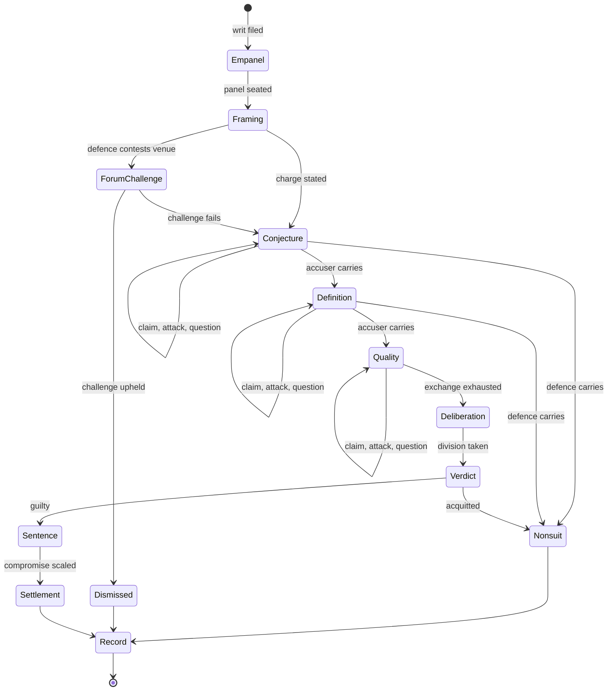
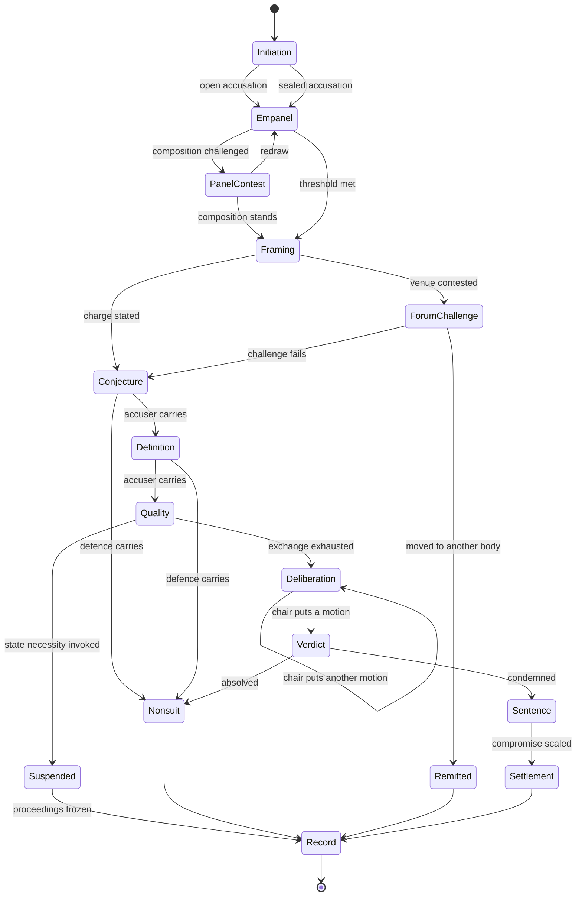
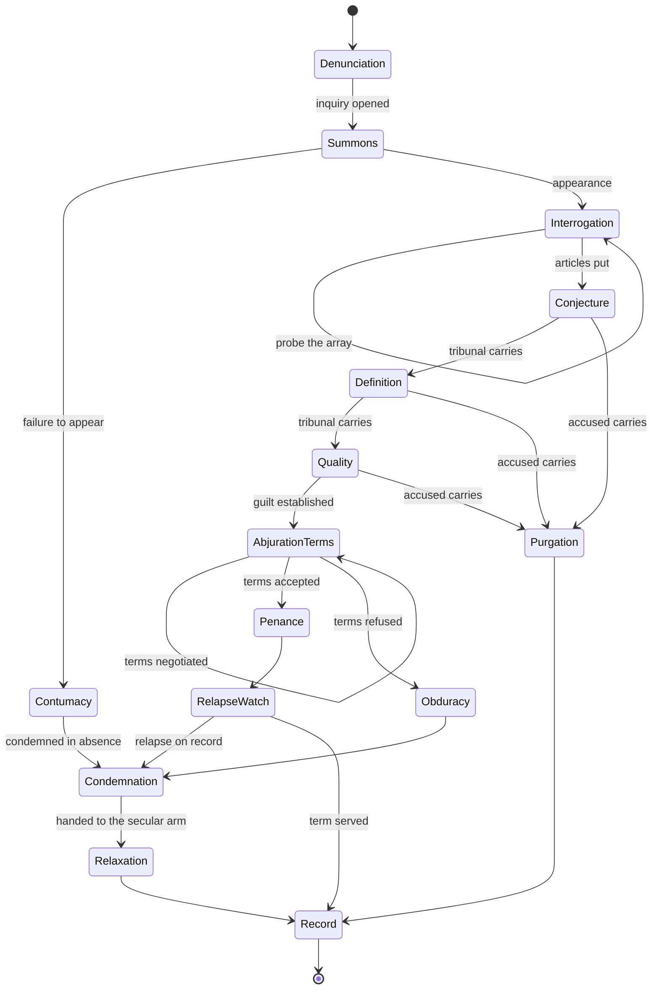
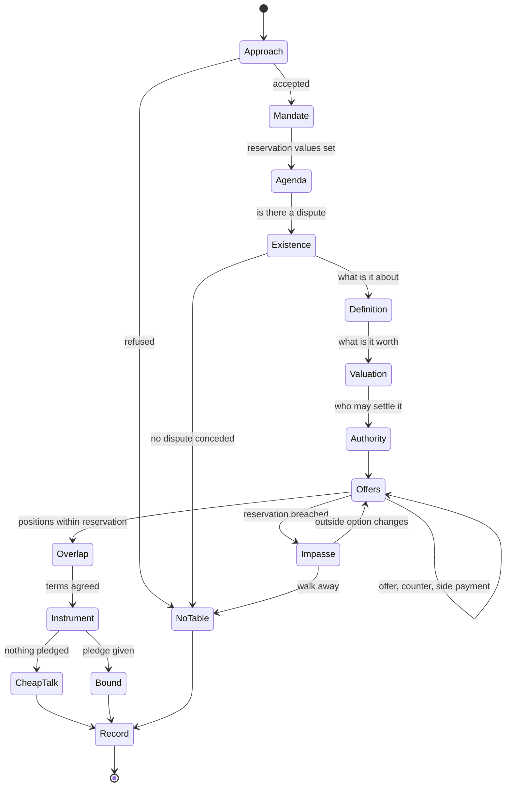
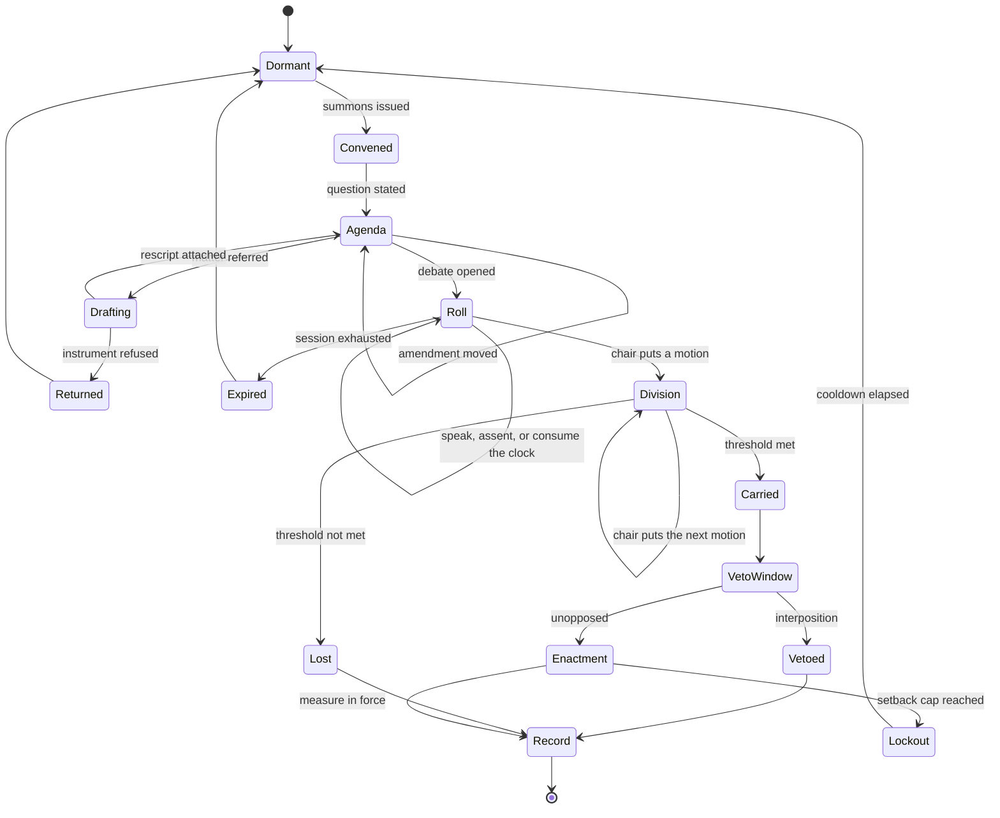
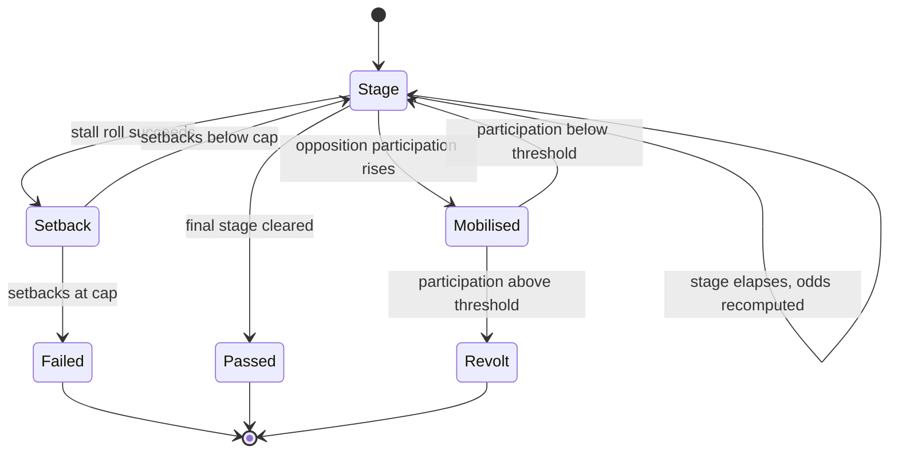
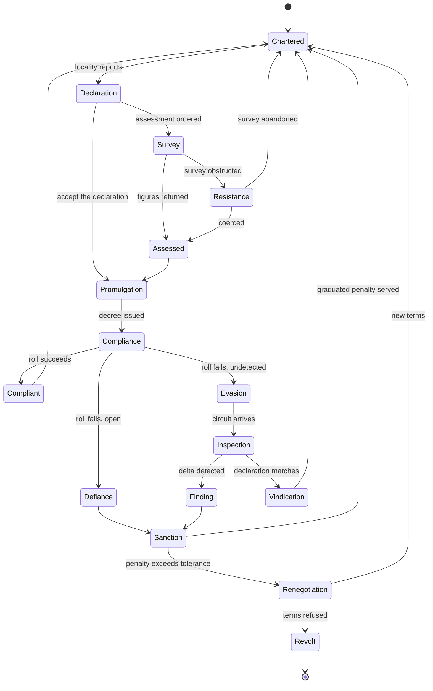
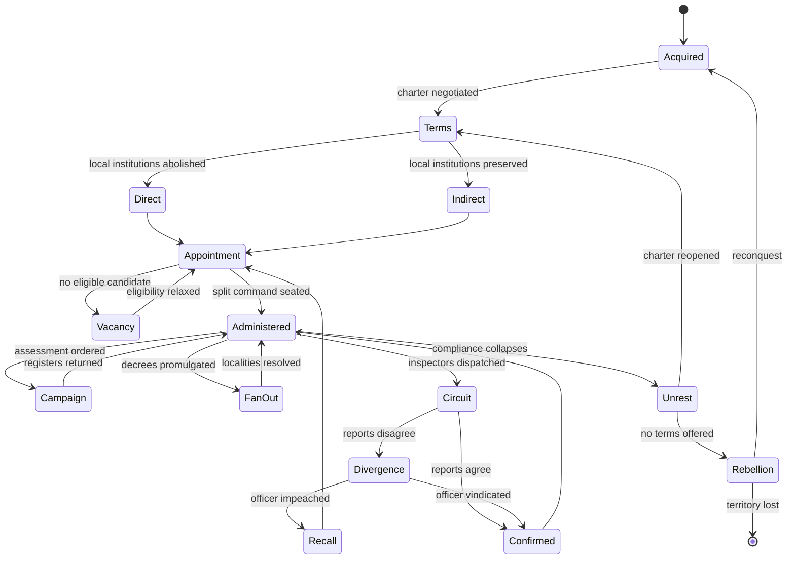
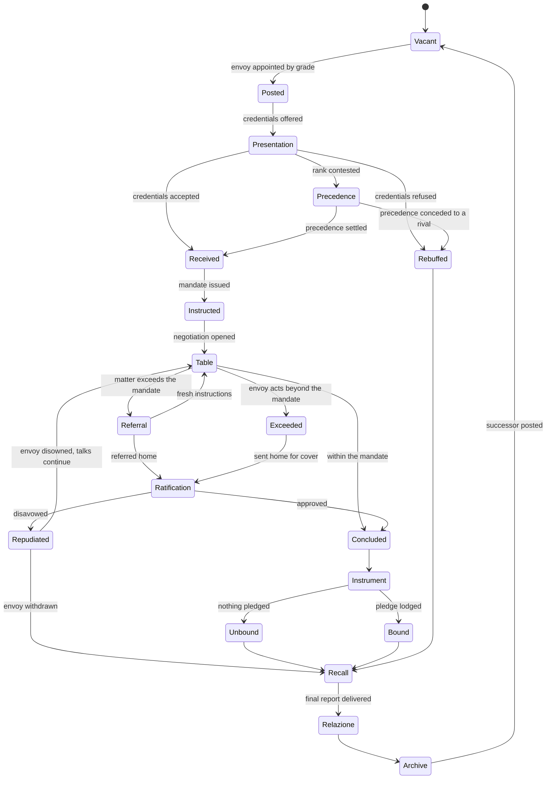

# State Graphs — Eight Systems
## Companion to *Political Mechanics for a Renaissance-Inflected Videogame*

One graph per **item listed under a category**, not one per category:

| Category | Items → systems |
|---|---|
| (1) Adversarial hearing | **S1** Court · **S2** Tribunal · **S3** Inquisition hearing · **S4** Negotiation |
| (2) Parliament | **S5** Parliament |
| (3) Settlements and territories | **S6** Settlement management · **S7** Territorial governance |
| (4) Diplomacy | **S8** Diplomacy |

Every state, transition, and guard is written in the primitive vocabulary P1–P45. Part B interrogates the result — the overlap analysis in §9–§12 was computed from the graphs, not estimated from them, and the script is included.

### Notation

- **State** — a condition the system rests in, awaiting a trigger.
- **Trigger** — the actor move that fires a transition. Always a primitive with role `T`.
- **Guard** — a condition that must hold for the transition to be legal. Role `G`.
- **Emits** — the artefact produced. Role `O`.
- **Modifier** — weights the resolution but fires nothing. Role `M`.
- `↳ calls Sn` — the system suspends and runs another system to completion, returning its result.
- Self-transitions inside a state are the **exchange loop**: repeated moves that do not leave the state until an exit condition is met.

---

## §1 — S1 · Court (accusatorial)

**Argues:** that symmetric procedure produces the fairest and least interesting hearing. Both sides see the evidence; the burden starts with the accuser; the panel is impartially drawn.



| From | Trigger | Guard | Primitives | To | Emits |
|---|---|---|---|---|---|
| — | Writ filed | Matter within competence | P19 | Empanel | — |
| Empanel | Draw panel | Quota per house; term not expired | P22, P25, P26 | Framing | Panel roster |
| Framing | State the charge | Holder of agenda right | **P12** | Conjecture | Charge, opening stasis |
| Framing | Contest the venue | Once, before first claim | **P10** | ForumChallenge | — |
| ForumChallenge | Division | Panel vote | P14, P1 (M) | Dismissed / Conjecture | If failed: burden penalty on defence |
| Conjecture / Definition / Quality | Play a claim | Provenance legible to both | **P6** | *self* | Claim on the record |
| " | Undermine / Rebut / Undercut | Attack type must match claim structure | **P7** | *self* | Defeated premise, inference, or conclusion |
| " | Ask critical question | Costs an action | **P8** | *self* | **P9** moves to the questioned party |
| " | Exchange exhausted | Holder of P9 cannot act | **P9** | next stasis / Nonsuit | Stasis resolution |
| Quality | Both sides spent | — | — | Deliberation | — |
| Deliberation | Division | Chair selects which motion to put | **P14** | Verdict | Vote record |
| Verdict | Sentence | Guilty | P41 | Settlement | Sentence reduced by what victory cost |
| any terminal | — | — | **P16** | Record | Citable outcome, in force or not |

**Branches worth playing.** The venue contest is cheap at Framing and unavailable later — the defence's first real decision. Winning at Conjecture ends everything; winning at Quality only mitigates. The defence should be trying to lose *later* only when it cannot win *earlier*.

**Absent by design:** P11 (array is open), P30, P45. This is the control case against which S2 and S3 are read.

---

## §2 — S2 · Tribunal (political)

**Argues:** that the verdict tracks standing, not evidence. Same machine as S1 with three additions — the panel is contestable, standing is a **guard** rather than a modifier, and the state itself can need the accused.



| From | Trigger | Guard | Primitives | To | Emits |
|---|---|---|---|---|---|
| — | Open accusation | Accuser's standing ≥ threshold **in this body** | **P1 (G)**, P19 | Initiation | Public accusation; accuser's own standing staked |
| — | Sealed accusation | Channel exists; identity protected | **P30** | Initiation | Anonymous denunciation; worth less if vindicated |
| Initiation | Draw panel | Quota; threshold; terms | P22, **P23**, P25, P26 | Empanel | Roster |
| Empanel | Challenge composition | Once; costs standing | P25, P1 | PanelContest | — |
| PanelContest | Side payment | Target's position is buyable | **P40** | Empanel (redraw) | Ledger entry, citable later |
| Framing → Quality | *as S1* | — | P5–P10, P12 | — | — |
| Quality | Invoke state necessity | **P45** live: polity failure condition within N | **P45** | Suspended | Proceedings frozen, charge preserved |
| Deliberation | Chair puts a motion | Chair chooses which of the live motions, and in what order | **P14** | Verdict / *self* | — |
| Verdict | Blocked | A veto-holder interposes | P15 → **P16** | Record (status = vetoed) | Recorded defeat: no force, full citability |
| Sentence | — | — | P41, **P3** | Settlement | Condemned party's prior commitments cited against him |

**The two additions that make it political.** First, **P1 is a guard, not a modifier** — an accuser below the standing threshold cannot open at all, so eliminating a rival begins by degrading his standing elsewhere. Second, **P45** — if the polity needs the accused (he commands the fleet, he holds the treaty), necessity freezes the matter with the charge preserved. The charge becomes a permanent lever. That is the mechanism by which a tribunal governs without ever reaching a verdict.

---

## §3 — S3 · Inquisition hearing

**Argues:** that a forum which investigates, prosecutes, and judges converts the defence's game from refutation into inference — and that the ordinary exit is a negotiated abjuration, not an acquittal.



| From | Trigger | Guard | Primitives | To | Emits |
|---|---|---|---|---|---|
| — | Denunciation | Any; sealed permitted | **P30** | Denunciation | Array item, provenance hidden |
| Denunciation | Open the inquiry | Tribunal's own initiative suffices | P12, P19 | Summons | Articles |
| Summons | Fail to appear | Grace period elapsed | — | Contumacy | Condemnation without exchange |
| Interrogation | **Probe** | One action per attribute | **P11** | *self* | One attribute of one hidden item, **or** one name |
| Interrogation | Articles put | — | P12 | Conjecture | Opening stasis |
| any stasis | Attack / question | **P9 starts with the accused** | P6, P7, P8, **P9** | next / Purgation | — |
| any stasis | Raise the venue | Concedes every earlier stasis | **P10** | — | Rarely available; the church's forum is near-total |
| Quality | Guilt established | — | — | AbjurationTerms | ↳ **calls S4** |
| AbjurationTerms | Offer, counter | Reservation values on both sides | **P39**, **P41** | *self* | Terms ladder, visible at all times |
| AbjurationTerms | Accept | Terms within accused's reservation | **P43** | Penance | Public oath — a costly signal, recorded |
| AbjurationTerms | Refuse | — | — | Obduracy | — |
| Penance | Serve | Detection rate applies | **P34** | RelapseWatch | Graduated sanction |
| RelapseWatch | Prior abjuration on record | **P16** from an earlier hearing | P16 (G) | Condemnation | Relapse is a *record* condition, not a new offence |

**The design load is on P11.** The array must be **authored to be inferable**: who is absent from the village, who has been seen at the friary, whose name the tribunal never mentions. The defence's real game is deduction about the array, not refutation of claims.

**The design load is on the abjuration ladder.** Abjuration was the ordinary conclusion of an inquiry, so it must read as *negotiating downward*, not as losing slowly. The terms ladder is shown continuously; every probe and every stasis won moves it.

**Note the relapse mechanism.** `RelapseWatch → Condemnation` is guarded by a **P16 Record from a previous playthrough of this same graph**. It is the clearest case in the whole design of a record outliving its scene.

---

## §4 — S4 · Negotiation

**Argues:** that a negotiation is a hearing with the burden token removed. Take **P9** out of S1 and the stasis gate stops adjudicating and starts sequencing an agenda.



| From | Trigger | Guard | Primitives | To | Emits |
|---|---|---|---|---|---|
| Approach | Open | Standing sufficient to be received | P1 (M), P2 (M) | Mandate | — |
| Mandate | Set reservation | Outside option must be a **modelled thing**, not a number | **P39** | Agenda | Private walk-away value |
| Agenda | Sequence the stases | No burden token exists | **P5**, **P12** | Existence | Agenda = the four stases as questions, not tests |
| Existence → Authority | Resolve each | Either party may concede a stasis to buy movement on a later one | P6, P7, **P8** | next | Concessions are recorded |
| Offers | Offer / counter | — | P6 | *self* | — |
| Offers | Side payment | Target's position must be buyable — **some are not** | **P40** | *self* | Ledger entry |
| Offers | Reprice the array | Multilateral only | **P44** | *self* | Passing over an option subsidizes it for a rival |
| Offers | Test overlap | Both within reservation | **P39** | Overlap / Impasse | — |
| Impasse | Improve the outside option | Resolved **off-table**, in another system | P39 | Offers | Reservation value moves |
| Overlap | Settle | — | **P41** | Instrument | Settlement scaled to what agreement cost each side |
| Instrument | Say so | Default | **P42** | CheapTalk | Non-binding; costs nothing; worth nothing |
| Instrument | Pledge | Hostage, marriage, advance payment, or public oath | **P43** (+P35, P3) | Bound | Enforceable; expensive to fake |

**The single most important rule in this graph:** *P42 is the default and P43 is the exception.* If agreements bind automatically there is no diplomacy, only arithmetic.

**The second:** `Impasse → Offers` is guarded on the outside option changing, and the outside option cannot be improved at the table. **The way to win a negotiation is to play a different system first.**

---

## §5 — S5 · Parliament

**Argues:** that procedure is where power is exercised and the vote is a formality that occasionally goes wrong. Two clocks run at different speeds — the session (minutes) and the enactment (months) — and the second is a nested machine.



**Nested: the Enactment machine.**



| From | Trigger | Guard | Primitives | To | Emits |
|---|---|---|---|---|---|
| Dormant | Summon | **Holder of the convening right only** | **P12**, P19 | Convened | Who calls the session is already a contest |
| Convened | State the question | Convener's wording fixes what is decidable | **P12** | Agenda | The *relatio* |
| Agenda | Move an amendment | — | P6 | *self* | **Several motions now live simultaneously** |
| Agenda | Refer for drafting | Matter within a secretariat's remit | **P20** | Drafting | Draft rescript attached to the face of the petition |
| Drafting | Refuse to transmit | Refuser's rank irrelevant; **personal risk roll** | **P21** | Returned | Career consequence for the refuser |
| Agenda | Open debate | Quorum | P19 | Roll | — |
| Roll | Speak in full | Called in precedence order | **P13**, **P2 (G)** | *self* | Argument on the record |
| Roll | Assent to a prior speaker | Free | P13 | *self* | Adds weight to that motion, costs nothing |
| Roll | Consume the clock | Speaker may include any matter he pleases | **P17** | *self* / Expired | **Session slots are finite** |
| Roll | Put a motion | **Chair selects which, and in what order** | **P14** | Division | The chair's principal power; never automatic |
| Division | Count | Threshold per motion class | **P23**, P1 (M) | Carried / Lost | — |
| Carried | Interpose | Veto-holder within scope; costs standing | **P15** | Vetoed | — |
| Vetoed | — | — | **P16** | Record (vetoed) | Carried, stripped of force, **fully citable** |
| Carried | Begin enactment | — | **P18** | Enactment | Multi-stage process, not an effect |
| Stage | Elapse | Duration scaled by measure class and inversely by legitimacy | P18, P1 | *self* | Running success and stall odds, **visible** |
| Stage | Stall | Opposing clout and movements | P18, **P31** | Setback | — |
| Stage | — | Attempt itself raises opposing participation | P18 | Mobilised | **Reform can make things worse** |
| Setback | Cap reached | Setback counter = N | P18 | Failed → Lockout | Measure barred for a cooldown |
| Mobilised | Threshold breached | Participation > R | **P45** | Revolt | Polity failure condition engages |

**Three structural notes.**

1. **Session slots are the scarce container.** Without a fixed count, P17 does nothing and there is no reason to prioritize. Obstruction is only possible where time is finite.
2. **P20 is the answer to "why care about a clerkship."** A character with no vote shapes outcomes by writing the resolution the house then ratifies or rejects. P21 is its dangerous twin — a low-ranking refusal aimed upward, with a personal risk roll attached.
3. **P45 is not optional and it is not a rules problem.** In multiplayer, shared loss disciplines other humans. In single-player it disciplines factions, which requires those factions to plan far enough ahead to defect and then relent. That is an opposition-model problem, and it is unsolved.

---

## §6 — S6 · Settlement management

**Argues:** that governing is the continual purchase of compliance from people who have their own institutions, and that you do not know your own settlement's true state.



| From | Trigger | Guard | Primitives | To | Emits |
|---|---|---|---|---|---|
| Chartered | Locality reports | Charter specifies what must be declared | **P36 (G)** | Declaration | **Declared** figures, which may differ from true |
| Declaration | Order a survey | Political cost; the survey is itself the act | **P32** | Survey | — |
| Survey | Obstruct | Locality's disposition; whose figures were understated | P31 | Resistance | — |
| Survey | Return figures | — | P32 | Assessed | Heterogeneous holdings → one comparable number |
| Assessed | — | Every later obligation now rests on this figure | P32, **P38** | Promulgation | — |
| Promulgation | Issue a decree | — | **P33** | Compliance | A rule, **not** an effect |
| Compliance | Roll | Disposition, distance, presence of an enforcing agent, bond held | P33, **P35 (G)**, P1 | Compliant / Evasion / Defiance | — |
| Evasion | Circuit arrives | Scheduled or ordered | **P29** | Inspection | — |
| Inspection | Sample | Compare declared against true | P29, **P31** | Finding / Vindication | **Two separate effects: information to the centre, legitimacy display to the governed** |
| Finding / Defiance | Sanction | Proportioned to seriousness and context | **P34** | Sanction | — |
| Sanction | — | **Detection rate trades against severity** | P34 | Chartered / Renegotiation | High monitoring permits low, cheap penalties |
| Renegotiation | Refuse terms | — | P36 | Revolt | **P45** engages at the layer above |

**The three anti-patterns this loop exists to defeat**, each named to its cure:

- *The decree that just works* → **P33**. There is no transition from Promulgation directly to Compliant.
- *The omniscient governor* → **P29 + P31**. Declared and true are separate values and the only bridge is a circuit.
- *Punishment as the only dial* → **P34**. Detection rate is player-set and visibly cheaper than severity.

---

## §7 — S7 · Territorial governance

**Argues:** that conquest produces a negotiation, not a colour change, and that what you leave standing determines what governing costs for the rest of the campaign. This graph **fans out** into one S6 instance per locality.



| From | Trigger | Guard | Primitives | To | Emits |
|---|---|---|---|---|---|
| Acquired | Negotiate the charter | — | **P36** ↳ **calls S4** | Terms | Which bodies survive, which taxes are owed |
| Terms | Abolish | Higher yield, permanent inspection burden | P36, P38 | Direct | — |
| Terms | Preserve | Lower yield, **cheaper to enforce**; recognition of self-organization | P36, **P38** | Indirect | — |
| Appointment | Seat the officers | **Two rivalrous offices**, both required to act; term limits; posting outside the holder's own interests | **P37**, **P26**, **P27**, P22, P23 | Administered | Two independent reporting lines |
| Administered | Order assessment | — | **P32** | Campaign | Registers |
| Administered | Promulgate | — | **P33** | FanOut | ↳ **calls S6** once per locality |
| Administered | Dispatch the circuit | Inspectors are outsiders, temporary, over-powered for their rank | **P29**, P27 | Circuit | Report to the centre **and** a legitimacy display to the governed |
| Circuit | Reports disagree | **P37** guarantees two lines that can conflict | P37, **P30** | Divergence | Sealed accusation possible |
| Divergence | Impeach | — | ↳ **calls S2** | Recall | — |
| Administered | Compliance collapses | Aggregate S6 failures past a threshold | P33, **P45** | Unrest | — |
| Unrest | Reopen the charter | Centre willing to concede | P36 ↳ **calls S4**, **P41** | Terms | Concession scaled to what suppression would have cost |
| any | Bond held | Hostage, heir, or estate lodged with the centre | **P35 (G)** | — | Modifies every compliance roll below |

**Two structural notes.**

1. **P38 makes one loop cover both scales.** The outputs of each S6 instance are the declared inputs of S7's next cycle. There is no second rule set for "province" as against "village" — only another layer.
2. **P37 is the generator of local politics at near-zero cost.** Neither officer can defect alone; each reports separately; a player holding one must court the other. `Circuit → Divergence` exists only because P37 created two lines that can disagree.

---

## §8 — S8 · Diplomacy

**Argues:** that nothing binds and everything is remembered. The table itself is S4; this graph is everything around it — posting, precedence, mandate, ratification, and the report that outlives the mission.



| From | Trigger | Guard | Primitives | To | Emits |
|---|---|---|---|---|---|
| Vacant | Appoint | **Grade** — resident, extraordinary envoy, ambassador; ambassador capped at two years in post | **P26**, P2 | Posted | Grade sets access and precedence |
| Posted | Present credentials | — | P12 | Presentation | — |
| Presentation | Contest rank | **Precedence is zero-sum and public**; raising one lowers another | **P2 (S)** | Precedence | Standing shift, visible to all courts |
| Received | Issue the mandate | Sending body sets reservation value and the **limit of discretion** | **P39**, P12 | Instructed | The gap between discretion and instruction is the whole tension |
| Instructed | Open | — | ↳ **calls S4** | Table | — |
| Table | Exceeds the mandate | Envoy acted without authority | **P3** | Exceeded | Envoy personally staked |
| Table | Refer home | Costs the moment; the other party may harden | P39 | Referral | ↳ **calls S5** for instructions or ratification |
| Ratification | Approve / disavow | Home body's own procedure applies in full | ↳ **calls S5**, P14, P15, **P16** | Concluded / Repudiated | A disavowal is still a Record |
| Concluded | — | Default | **P42** | Unbound | Cheap talk; costs nothing, worth nothing |
| Concluded | Lodge a pledge | Hostage, marriage, advance payment, or recorded oath | **P43**, **P35 (O)**, P3, P16 | Bound | **The bond S6 and S7 then enforce as a guard** |
| any | Report privately | Channel to the security council, bypassing the ordinary chain | **P30** | — | Intelligence separated from the political channel |
| Recall | Deliver the report | Required on recall | **P28** | Relazione | Cumulative synthesis of the other polity's condition |
| Relazione | File | Successive envoys **update the same document** | P28, **P31** | Archive | Value grows across a campaign; decays with time; **stealable** |

**Three structural notes.**

1. **P35 is produced here and consumed there.** Diplomacy manufactures the hostage; S6 and S7 spend the rest of the campaign using it as a compliance guard. This is the cleanest producer–consumer link in the whole design.
2. **The *relazione* is the right shape for a diplomatic reward.** Not a number and not a one-shot: a document that accumulates across postings, decays without maintenance, is inherited by a successor, and can be stolen.
3. **Precedence must gate something.** It gates access and speaking order. Made cosmetic, nobody fights over it — and precedence disputes were contested in earnest for centuries.

---
---

# Part B — Interrogation of the primitives

Everything below was **computed** from the eight graphs above, not estimated from them. Each system's primitive set was encoded with the *role* the primitive plays there — `S` state-defining, `T` transition verb, `G` guard, `O` output artefact, `M` resolution modifier — and the incidence matrix, tier assignment, role-stability check, and pairwise similarity were derived by script (`interrogate.py`, included). Recording the role matters: **two systems that use the same primitive in different roles are not sharing a mechanic, they are sharing a name.**

## §9 — The incidence matrix

```
       S1  S2  S3  S4  S5  S6  S7  S8
        Ct  Tr  Iq  Ng  Pa  St  Te  Dp
P1      M   G   M   M   M   M   M   M   Standing (indexed)
P2      .   M   .   M   G   .   .   S   Precedence
P3      M   T   M   M   M   .   .   T   Commitment
P4      .   .   .   .   .   .   .   .   Immunity                    <-- UNUSED
P5      S   S   S   S   .   .   .   .   Stasis Gate
P6      T   T   T   T   T   .   .   .   Claim
P7      T   T   T   T   T   .   .   .   Attack, three kinds
P8      T   T   T   T   .   .   .   .   Critical Question
P9      G   G   G   .   .   .   .   .   Burden of Proof
P10     T   T   T   .   .   .   .   .   Forum Challenge
P11     .   .   S   .   .   .   .   .   Evidence Array
P12     T   T   T   T   T   .   .   T   Agenda Control
P13     .   .   .   .   S   .   .   .   Speaking Order
P14     T   T   .   .   T   .   .   .   Division
P15     .   .   .   .   T   .   .   .   Veto
P16     O   O   O   O   O   O   O   O   Recorded Defeat
P17     .   .   .   .   T   .   .   .   Clock Consumption
P18     .   .   .   .   S   .   .   .   Enactment Clock
P19     G   G   G   .   G   G   G   .   Competence and Quorum
P20     .   .   .   .   T   .   .   .   Drafting Right
P21     .   .   .   .   T   .   .   .   Return-Unsigned
P22     T   T   .   .   T   .   T   .   Sortition
P23     .   G   .   .   G   .   G   .   Threshold Election
P24     .   .   .   .   .   .   .   .   Alternating Narrow/Widen    <-- UNUSED
P25     G   G   .   .   .   .   .   .   Quota
P26     G   G   .   .   G   .   G   G   Term and Rotation
P27     .   .   .   .   .   .   G   .   Avoidance
P28     .   .   .   .   .   O   O   O   Standing Report
P29     .   .   .   .   .   T   T   T   Inspection Circuit
P30     .   T   T   .   .   T   T   T   Sealed Channel
P31     .   .   .   .   M   M   M   M   Rumour / Reputation Drift
P32     .   .   .   .   .   T   T   .   Assessment
P33     .   .   .   .   .   T   T   .   Decree with Compliance
P34     .   .   O   .   .   O   O   .   Detection and Sanction
P35     .   .   .   .   .   G   G   O   Hostage / Bond
P36     .   .   .   .   .   G   S   .   Charter of Submission
P37     .   .   .   .   .   .   S   .   Split Command
P38     .   .   .   .   .   G   S   .   Nested Layers
P39     .   .   G   G   .   .   G   G   Reservation Value
P40     .   T   .   T   T   .   .   T   Side Payment
P41     O   O   O   O   .   .   O   O   Scaled Compromise
P42     .   .   .   O   .   .   .   O   Cheap Talk
P43     .   .   O   O   .   .   .   O   Costly Signal
P44     .   .   .   G   .   .   .   G   Positional Pricing
P45     .   G   .   .   G   G   G   .   Shared Loss
```

## §10 — Tiers

| Tier | n | Primitives |
|---|---|---|
| **Core** — 7 or 8 systems | 2 | P1 Standing · P16 Record |
| **Broad** — 4 to 6 | 16 | P2, P3, P5, P6, P7, P8, P12, P19, P22, P26, P30, P31, P39, P40, P41, P45 |
| **Bridge** — 2 to 3 | 16 | P9, P10, P14, P23, P25, P28, P29, P32, P33, P34, P35, P36, P38, P42, P43, P44 |
| **Local** — 1 only | 9 | P11, P13, P15, P17, P18, P20, P21, P27, P37 |
| **Unused** | 2 | **P4 Immunity · P24 Alternating Narrow / Widen** |

**Finding 1 — the shared substrate is thinner than the source document implied, and that is the good news.** Only two primitives run through all eight systems: standing, and the record. The prior document's composition rule 1 ("one vocabulary") is *true* — no system needed a verb outside P1–P45 — but "one vocabulary" turns out to mean a two-word common core with three large dialects around it. The design is not one machine wearing eight costumes; it is three machines that share two nouns.

**Finding 2 — nine primitives appear exactly once, and eight of them are correctly placed.** P11, P13, P15, P17, P18, P20, P21, P37 are each the distinguishing feature of their system: the hidden array *is* the Inquisition, the enactment clock *is* the parliament, split command *is* territorial administration. A local primitive is not a failure of generality; it is what makes a system recognizable. The exception is P27 Avoidance, which appears only in S7 but should also guard S1 and S2 panel selection — a judge with interests in the matter is the same problem as a governor posted to his own province. **Correction: add P27 as a guard on `Empanel` in S1 and S2.**

**Finding 3 — two primitives appear nowhere, and the reason is structural, not sloppy.** P4 Immunity and P24 Alternating Narrow/Widen are unused across all eight graphs. P24 was called "the signature Venetian primitive" in the source document. Its absence is diagnostic:

> **There is a ninth system the brief did not name and the graphs presuppose: S9 · Selection and Investiture.**

S1, S2, S5, and S7 all *begin* with a body being constituted — `Empanel`, `Appointment` — and all four discharge that with a compressed call to P22/P23/P25/P26. That compression is where P24 belongs: the alternating narrowing and widening chain, playable at every stage, is a whole graph in itself, and P4 Immunity is what the resulting officeholder acquires on investiture. Four of eight systems currently open with a stub. **This is the largest gap the interrogation found.**

## §11 — Pairwise similarity

Jaccard over primitive sets, ignoring role. Top and bottom of 28 pairs:

| | Pair | Shared / union | J |
|---|---|---|---|
| 1 | S1 Court ↔ S2 Tribunal | 16/21 | **0.76** |
| 2 | S6 Settlement ↔ S7 Territory | 14/21 | **0.67** |
| 3 | S1 Court ↔ S3 Inquisition | 12/21 | 0.57 |
| 4= | S4 Negotiation ↔ S8 Diplomacy | 11/21 | 0.52 |
| 4= | **S3 Inquisition ↔ S4 Negotiation** | 11/21 | **0.52** |
| 4= | S2 Tribunal ↔ S3 Inquisition | 13/25 | 0.52 |
| 7 | **S2 Tribunal ↔ S5 Parliament** | 14/28 | **0.50** |
| … | | | |
| 26 | S1 Court ↔ S6 Settlement | 3/27 | 0.11 |
| 27 | S4 Negotiation ↔ S6 Settlement | 2/27 | **0.07** |

**Finding 4 — three clusters, and the clustering is not the one the brief assumed.** The brief grouped court, tribunal, Inquisition, and negotiation together as one category. The computation disagrees:

- **Adjudication cluster** — S1, S2, S3 (0.52–0.76). Held together by P5–P10: the stasis gate, the claim, the three attacks, the critical question, the burden, the forum challenge.
- **Administration cluster** — S6, S7 (0.67). Held together by P29, P31–P36: assessment, decree, compliance, inspection, charter, bond. **Shares nothing of the argument core.**
- **Exchange cluster** — S4, S8 (0.52). Held together by P39–P44: reservation, side payment, compromise, cheap talk, costly signal, pricing.

S5 Parliament belongs to none of them cleanly, and S4 sits *between* the adjudication and exchange clusters rather than inside the first.

**Finding 5 — negotiation is closer to the Inquisition (0.52) than to parliament (0.29).** This is the most counter-intuitive computed result and it is correct on inspection. Both S3 and S4 run the stasis sequence, both terminate in scaled compromise, both produce a costly signal, and both are governed by a reservation value. The difference is one token: S3 has the burden (P9) and S4 does not. **Abjuration and treaty-making are the same scene under different burden placement** — which is why S3 calls S4 as a subroutine at `AbjurationTerms` rather than duplicating its logic.

**Finding 6 — S2 Tribunal is the hinge of the whole design.** It is the only system with high similarity to two clusters at once: 0.76 to the court and 0.50 to the parliament, and it is one of only two systems that both calls and is called by another (`S5 → S2` prosecution of officeholders; `S2 → S5` panel drawn from the house). This is Aristotle's structural point made mechanical: auditing magistrates sits *inside* the deliberative power rather than beside it `[T0 — Politics IV 1298a]`. The political tribunal is where the judicial and deliberative machines interlock, and it should be built first, because it exercises the most shared surface.

**Finding 7 — S4 ↔ S6 at 0.07 is the design's honest boundary.** Negotiation and settlement management share two primitives (standing, record) and nothing else. There is no hidden unity here and no attempt should be made to manufacture one.

## §12 — Role stability: which shared primitives are really shared

Of the twenty-two primitives appearing in three or more systems, **eighteen hold a single role throughout**. Four shift, and every shift is meaningful:

| | Roles by system | Reading |
|---|---|---|
| **P1 Standing** | `M` everywhere **except S2, where it is `G`** | The single mechanical difference between a court and a political tribunal. Everywhere else standing weights a resolution; in the tribunal it **gates whether the accusation may be opened at all**. Eliminating a rival therefore begins by degrading his standing in some *other* system. |
| **P2 Precedence** | S8 `S` · S5 `G` · S2/S4 `M` | Precedence is a *state* in diplomacy (the thing being contested), a *guard* in parliament (it gates speaking order), and only a modifier elsewhere. One primitive, three jobs — legitimate, but it means P2 needs three separate presentations. |
| **P3 Commitment** | S2/S8 `T` · S1/S3/S4/S5 `M` | Where citing a prior commitment is an *action* (tribunal, diplomacy) it is a weapon; elsewhere it is background weight. The weaponized cases are exactly the two systems where an actor's past words are on file and searchable by an opponent. |
| **P35 Hostage / Bond** | S8 `O` · S6/S7 `G` | **Produced in diplomacy, consumed in governance.** The clearest producer–consumer link in the design: a treaty manufactures the bond, and every compliance roll in every locality for the rest of the campaign is guarded by it. |

**Finding 8 — role-stability is high and that validates the vocabulary.** Eighteen of twenty-two shared primitives mean the same thing in every system they appear in. A vocabulary where the same word does the same job across contexts is a real vocabulary; the four exceptions are all deliberate and all carry design weight.

## §13 — The call graph

```
S3 Inquisition  -->  S4 Negotiation   (abjuration terms)
S7 Territory    -->  S4 Negotiation   (charter of submission)
S8 Diplomacy    -->  S4 Negotiation   (the table itself)
S8 Diplomacy    -->  S5 Parliament    (instructions and ratification)
S7 Territory    -->  S6 Settlement    (per-locality decree resolution)
S5 Parliament   -->  S2 Tribunal      (prosecution of officeholders)
S2 Tribunal     -->  S5 Parliament    (panel drawn from the house)
```

**Finding 9 — S4 is not a peer system; it is a subroutine.** Three inbound calls, no outbound. Negotiation is the routine every other system invokes when two parties must settle terms rather than one party determine them. This reframes the brief's category (1): court, tribunal, and Inquisition are three *forums*, while negotiation is the *procedure* two of them fall back into when adjudication cannot finish. Build S4 first after S2, and build it to be called.

**Finding 10 — S5 ↔ S2 is the only cycle.** Parliament prosecutes its own officeholders through the tribunal; the tribunal draws its panel from the house. Everything else in the call graph is acyclic. A cycle between the deliberative and judicial systems is exactly the Venetian arrangement, where the Ten sat as a court, its members voted in the Senate, and the tripartite sort simply fails. **Do not break this cycle to tidy the design.**

## §14 — Throughlines

Five chains recur across the graphs. Each is a sequence, not a set — the primitives fire in order and the order is what makes it a throughline.

**T1 · The record spine.** `any terminal state → P16 → citable object → guard on a later graph`
Universal, 8/8. Every system, without exception, terminates by emitting a Record. The chain closes when a Record from one playthrough guards a transition in another: `RelapseWatch → Condemnation` in S3 is guarded by a P16 from a *previous* S3; the Repudiated branch in S8 files a Record that S5 can cite; a vetoed motion in S5 can be re-put after the vetoing office turns over under P26. **This is the mechanism by which a campaign feels political rather than episodic, and it is nearly free.**

**T2 · The adjudication chain.** `P12 frame → P5 gate → P6 claim → P7 attack → P8 question → P9 shifts → P10 escape → P41 settle`
S1, S2, S3 in full; S4 with P9 removed. Absent entirely from S5, S6, S7. This chain is the *argument* machine and it does not extend into governance — which is correct, and worth saying plainly, because the temptation to make settlement management "debatable" would dissolve the distinction between the clusters.

**T3 · The compliance chain.** `P32 assess → P33 decree → compliance roll → P29 inspect → P31 delta → P34 sanction → P36 renegotiate`
S6 and S7 only. The tightest and most self-contained throughline in the design; every step is guarded by the previous one's output, and there is no path from promulgation to effect that skips the roll.

**T4 · The information chain.** `P29 circuit / P30 sealed channel → P28 standing report → P31 drift → guard on P33, P39, or P1`
S6, S7, S8 produce information; S1–S5 consume it. **P30 Sealed Channel is the sole crossover** — 5/8, and the only information primitive that reaches into the adjudication cluster, where it initiates S2 and S3. Sealed denunciation is therefore the single load-bearing connection between "what the state knows" and "who gets tried," and it deserves disproportionate design attention.

**T5 · The bond chain.** `P43 costly signal → P35 bond lodged → guard on every compliance roll → P34 forfeiture on breach`
Runs S8 → S6/S7. The only chain that crosses from the exchange cluster into the administration cluster, and the only reason those two clusters touch at all. Without T5 the design is two unconnected halves joined by S2.

## §15 — What the interrogation changes about the design

Ranked by consequence.

1. **Build S9 Selection and Investiture.** Four systems open with a stub, two primitives have no home, and P24 — the best-researched mechanism in the source document — is currently unreachable. `[GAP]`
2. **Build S2 Tribunal first.** Highest shared surface, the only cycle, and the hinge between the two largest clusters. Everything built for it is reused.
3. **Build S4 to be called, not played.** Three inbound calls. Its interface — reservation values in, scaled compromise out — matters more than its presentation.
4. **Add P27 Avoidance as a guard on S1 and S2 empanelment.** A judge with interests in the matter is the same problem as a governor posted to his own province; the omission was an oversight.
5. **P2 Precedence needs three presentations,** because it plays three roles. A single UI treatment will misrepresent it in two of the three.
6. **Do not unify S4 and S6.** At J=0.07 there is no shared structure to find. Accept the boundary.
7. **Do not break the S2 ↔ S5 cycle.** It is historically correct and it is what makes officeholding risky.

### Audit

`[READ: political-mechanics-primitives.md — primitive names re-extracted from source, not recalled]`
`[SELF-AUTHORED — bias risk] The graphs and the interrogation were produced by the same process. The specific risk is that the primitive-set encoding in §9 was written *after* the graphs by the same author, so a primitive could be recorded as present because it belongs there conceptually rather than because a transition in §§1–8 actually fires it. Mitigation applied: every non-zero cell in §9 traces to a named row in that system's transition table. Residual risk: the `M` (modifier) cells are the weakest, since a modifier fires no transition and is therefore the easiest to assert without evidence — P1 and P31 are the two primitives most exposed to this and their frequency counts (8/8 and 4/8) should be treated as upper bounds.`
`[NULL: role-stability check across 22 shared primitives — examined all, found 4 shifts, all deliberate. No spurious shifts found.]`
`[CONFIDENCE: high — the matrix, tiers, Jaccard, and call graph are computed and reproducible. medium — the primitive-set encoding itself, per the bias note. low — none of the numeric parameters implied by S5's enactment machine, which remain untuned.]`
`[PASS-3: eight graphs constructed from primitives; interrogation computed rather than asserted; ten findings, of which Finding 3 (missing S9) and Finding 2's correction (P27) are changes to the prior document, not confirmations of it.]`
