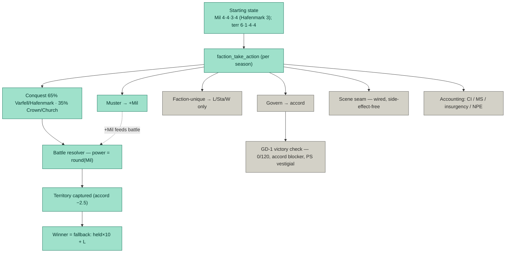

# Win-Computation — Exhaustive Compilation, Analysis & Rewrite

**Status:** Audit / mechanical compilation. Class-C findings, Jordan-vetoable.
**Date:** 2026-06-06. **Scope:** every action, mechanism, and system that produces the faction win-percentages reported by `mc_v18.run_batch` / `run_campaign`.
**Method:** full bottom-up read of the win-computation call graph in the live `sim/` package + the editorial/patch record; the percentages are the complete instrumented N=120 battery (`ners`/integration doc, same session).

`[READ:]` sim/mc_v18.py (full) · sim/autoload/game_state.py L1-210 · sim/peninsular/season.py (full) · sim/provincial/faction_action.py (full) · sim/autoload/victory.py (full) · sim/peninsular/accounting.py (full) · sim/provincial/massbattle.py (resolve_mass_battle 1791-1860, _faction_to_unit 1867-, damage L966) · sim/territory/adjacency.py · sim/autoload/season_manager.py (advance_season) · sim/provincial/{crown_initiative,excommunication,council_solmund,absolution}.py (write-sets) · canon/editorial_ledger.jsonl (ED-077/107/109-113/304/306/312/314) · canon/patch_register_active.yaml.

---

> **[CORRECTION — 2026-06-06; supersedes the per-faction-victory framing in 1/3/5/6 below]** Per Jordan: **per-faction victory is NOT canon.** The sole victory is **peninsula control**, achieved by **eliminating all rival factions or subjugating them through diplomacy/treaties** — one universal condition. ED-306 (and its referenced `victory_architecture_v1.md`, which does not exist in the repo) are **deprecated** and must NOT be wired. The sim's GD-1 "11-of-15 + accord" is itself only a territorial *proxy* for peninsula control, not the true condition. Any passage below recommending that per-faction conditions be wired is retracted; read it as: implement the single peninsula-control victory (elimination / treaty subjugation). The elimination/treaty mechanics in ED-109/ED-304/ED-312 remain valid substrate.

## §0 — COMPILATION: what computes the win-percentages

A campaign is `create_world(seed)` → up to 50 iterations of `season.run_season` → per-iteration GD-1 victory check → post-loop territory fallback if no GD-1 winner. `run_batch` tallies winners over N campaigns into a 4-faction share.

### 0.1 The state (every quantity that exists)
- **Per faction** (`game_state.Faction`): `Mil, L, Sta, W, I` (continuous 0.5-7.0, `MULTS`-scaled); `territories` (list); `parliamentary` (bool gate); seasonal/arc flags.
- **Per territory** (`Territory`): `owner, accord, pt, garrison, prosperity, fort_level, templar`.
- **World**: `clocks{CI, MS, PI, Strain, Turmoil}` (init 30/80/0/0/0); `season, arc, winner, battle_count`; the Tier-0/1 registries (`insurgencies, npcs, convictions, beliefs, knots, treaties, …`).
- **Victory tracking**: `victory._qualifying_streak` (module-level, per-campaign).

### 0.2 Starting state — the asymmetry origin (`game_state` L26-39)
| Faction | L | Sta | W | I | Mil | Territories (start) | Parliamentary |
|---|---|---|---|---|---|---|---|
| Crown | 5 | 4 | 4 | 5 | **4** | 6 (T1,T2,T3,T5,T6,T14) | yes |
| Church | 5 | 5 | 5 | 6 | **4** | 1 (T9) | yes |
| Hafenmark | 4 | 4 | **5** | 4 | **3** | 4 (T7,T8,T10,T17) | yes |
| Varfell | 4 | 4 | 4 | 4 | **4** | 4 (T4,T11,T12,T13) | yes |

T15 is uncontrolled (owner None) and not in `ALL_PLAYABLE_15` (the 15 = T1-T14 + T17).

### 0.3 Per-season step (`season.run_season`)
1. `season_manager.advance_season` — `season++`, arc-boundary detection, resets seasonal/arc faction flags. **Win-neutral** (touches no stat/territory/accord).
2. `action_callback` (`mc_v18._faction_actions_callback`) — for each faction that is `parliamentary` AND holds ≥1 territory: `faction_take_action`; then `scene_dispatch.run_scene_phase`.
3. `accounting.run_accounting`.

### 0.4 `faction_take_action` — the action engine (`faction_action` L48-77)
`roll = rng.random()`, then a **sequential-`if` cascade** (not `elif`):
- `roll < 0.30` → faction-unique; **if it returns `'invalid'`, falls through** to the next clause.
- `roll < 0.65` → Conquest (falls through if invalid).
- `roll < 0.85` → Muster (falls through if invalid).
- else → Govern.

**Load-bearing consequence:** Varfell and Hafenmark have **no faction-unique action** (L128: `return 'invalid'` — BLOCKED). Their 30% unique slot falls through to Conquest, so **Varfell/Hafenmark attempt Conquest on `roll<0.65` ≈ 65% of seasons; Crown/Church only on `[0.30,0.65)` ≈ 35%** (their 30% goes to Crown Initiative / Church actions).

### 0.5 The four actions (read → write)
- **Conquest** (`_try_conquest` L132-189): pick an adjacent territory owned by another faction (or None); require `Mil ≥ 3.0`; `resolve_mass_battle(attacker, defender, terrain=None, world)`. On `attacker_wins`: defender loses the territory + `adjust('L', -10)` (−0.5 L), attacker gains it, `garrison=True`, `adjust_accord(-25)` (**−2.5 accord**), `battle_count++`. Terrain is a `[GAP]` (None).
- **Muster** (L192-206): pool `Mil`, Ob 1. Success → `adjust('Mil', +3/+5)` (+0.3/+0.5). Failure → `W −0.03`.
- **Govern** (L209-228): pool `I`, Ob 2. Success → `adjust_accord(+10/+15)` (+1.0/+1.5) on one held territory. Failure → `Sta −0.5`.
- **Faction-unique** (Crown / Church only): Crown Initiative → writes `W` (cost), `L` (+1/+2 Mandate), territory `accord`; Church excommunication → rival `L−`; council → `L`; absolution → target `Sta+`. **None capture territory or trigger a battle.**
- Strategic roll (`_successes`): `int(pool)` d6, success on `≥4` (p = 0.5/die).

### 0.6 Battle resolver (`massbattle.resolve_mass_battle` 1791-1860)
Builds `unit_a/unit_b` via `_faction_to_unit`; defender None → a `_GarrisonStub(Mil=1.5)`. Runs `run_battle(…, max_turns=18, rng=world.rng)` — the full tactical engine. **The only faction-differentiating input is `power = max(1, round(faction.Mil))`** (`_faction_to_unit` 1867-: everything else is constant — Line shape, tier 2 = 200 troops, command 4, discipline 5, morale 5, single subunit). Damage ∝ `(1 + power)` per net success (L966), so Mil-4 forces are ~25% more lethal per hit than Mil-3, compounding over 18 turns. `attacker_wins = (not unit_a.routed) and (unit_b.routed or a_size% > b_size%)`.

### 0.7 Accounting (`accounting.run_accounting` L37-79)
`apply_seasonal_ci` → `clocks['CI']`; `apply_ms_baseline_decay` (year-end) → `clocks['MS']`; `check_insurgency_triggers/promotion` → `world.insurgencies`; `simulate_npc_actions` → `world.npcs`. **None of these touch faction stats, territory owner, or accord** — they are off the win-computation path (the win metric reads only territory/L/accord, never CI/MS/insurgency/NPC).

### 0.8 Decision (`victory` + fallback)
- **GD-1** (`check_peninsular_sovereignty` L52-100): `held ≥ 11` AND `accord ≥ 2.0 in ALL held` AND `PS ≤ 6` AND qualifying-streak `≥ 2`. **PS = `world.clocks['Turmoil']`, which is initialized to 0.0 and never written by any module** → `ps_ok` is always true (vestigial). Binding conditions: territory-count + all-held-accord.
- **Fallback** (`mc_v18` L118-127, only if no GD-1 winner): `winner = argmax(held×10 + L + len(territories))` over parliamentary factions. **Territory-count dominant.**

### 0.9 State graph (win path = teal; everything else runs but is inert / off-path)

---

## §1 — INTERDEPENDENCIES · STUBS · MISSING WIRES · GAPS · CALIBRATION

**Interdependencies (live, win-relevant):**
- `Mil → battle power → attacker_wins → territory.owner → held → fallback/GD-1` (the dominant chain).
- `Muster → Mil` (feedback amplifying the chain); `Govern → accord → GD-1` (dead-ends at the inert GD-1 accord gate).
- `Conquest → accord −2.5` **negatively couples** the territory-count path to the accord path: the action that earns territory destroys the accord the same territory needs to qualify for GD-1.
- `parliamentary AND territories` gate (callback) — a faction reduced to 0 territories stops acting (cannot recover by action; only an external grant could restore it).
- Geography (`ADJACENCY`) gates which `owner` a conquest can target.

**Stubs that change behaviour (not inert):**
- **Varfell/Hafenmark faction-unique = BLOCKED** (`faction_action` L128). This stub is *not* neutral — via the sequential-`if` fall-through it makes both factions ~65%-conquest machines. The single highest-leverage stub on the balance outcome.
- `_GarrisonStub(Mil=1.5)` for uncontrolled defenders, `terrain=None`, `_faction_to_unit` constant command/discipline/morale/tier — all `[GAP]`-flagged minimum-viable defaults; they flatten every faction's combat profile down to `round(Mil)`.

**Missing wires (designed, not connected):**
- **The single peninsula-control victory is UNIMPLEMENTED; what exists is a territorial proxy.** Canon (Jordan 2026-06-06): the sole victory is controlling the peninsula by eliminating every rival or subjugating them via diplomacy/treaties. `victory.py` implements only GD-1 (`11/15 + accord≥2-all + PS≤6 + sustain`) — a territory-threshold *proxy* with neither an elimination terminal (a 0-territory faction merely stops acting) nor any treaty/subjugation path (the `world.treaties` registry exists but the victory check never reads it). [Per-faction victory (ED-306) is deprecated — not the canonical model; see correction banner.]
- Govern's payoff path is wired but dead: it raises accord toward a GD-1 gate that never fires.
- Scene seam: wired structurally, side-effect-free (the context-derivation bridge + outcome→echo mapping are unbuilt — separate audit).
- Accounting outputs (CI/MS/insurgency/NPC) compute but feed nothing the win metric reads.

**Gaps:**
- `terrain` modifiers (Phase-7 follow-on), richer faction→unit mapping (`domain_echo`), uncontrolled-garrison spec — all deferred.
- TCV (territorial control value), CV (conviction value), Mandate, PI, IP, RS — the quantities the canonical victory conditions key on — are largely absent from the sim's `Faction`/`Territory`/`clocks` schema (only `L≈Mandate`, `pt`, `accord`, `CI/MS/PI/Strain/Turmoil` exist; no per-territory TCV/CV).

**Calibration issues:**
- **PS (`Turmoil`) is a dead input** — initialized 0, never written, always passes.
- Hafenmark Mil 3 vs everyone-else 4 is a hard step in the only battle lever; combined with worse geography (below) it is decisive, not marginal.
- The fallback `held×10 + L` weights raw territory ~10× over Mandate — Hafenmark's economic strength (W=5, highest) and any non-territorial play contribute nothing.
- No calibration / handicap / rubber-band / catch-up constant exists anywhere on the win path (grep clean).
- Territory-assignment drift: `ED-107` (board-game, 2026-04-02) assigns territories differently from the sim's `STARTING_OWNER` (mc_v15/v17 lineage). Unresolved which is canonical for the videogame `[DRIFT]`.

---

## §2 — FUNCTION / VALUE / CONTRIBUTION TO WINNING

Ranked by actual contribution to the win-percentage (not by apparent prominence in the code).

1. **Starting Mil + geography — dominant.** `round(Mil)` is the sole battle differentiator; Hafenmark's 3 (vs 4) loses most fights. Geography compounds it: Hafenmark's only adjacent targets are Mil-4 factions (T4-Varfell, T9-Church, T3-Crown, T11-Varfell) it cannot beat; Varfell borders Mil-3 Hafenmark (T7, T10) plus Crown and the weak uncontrolled buffer. Together these set the floor (Hafenmark 0.8%) and ceiling.
2. **The faction-unique fall-through — primary balance driver.** Varfell/Hafenmark conquering 65% vs Crown/Church's 35% is why Varfell (Mil 4, no distraction) out-territories Crown (Mil 4, 30% on non-territorial Crown Initiative) → Varfell 55.8% vs Crown 36.7%. Crown's 6-territory head start is eroded by spending a third of its turns off the territory metric.
3. **The fallback formula — the actual decider.** GD-1 fires 0/120; 100% of campaigns resolve on `held×10 + L`. The win-percentages *are* a territory-count ranking at season 50.
4. **Conquest — the only territory-moving action.** Muster (→Mil) feeds it; everything else is orthogonal to territory.
5. **Govern — near-zero contribution.** Its only consumer (GD-1 accord) is inert; it neither gains territory nor feeds the fallback.
6. **Faction-unique (Crown/Church) — near-zero contribution to *winning*** (they shape L/Sta/W, which barely move the territory-dominant fallback) yet have *negative* contribution for Crown/Church because they consume the 30% slot that Varfell/Hafenmark spend on conquest.
7. **Accounting (CI/MS/insurgency/NPE), the scene seam, the Tier-0/1 registries — zero contribution.** They run every season and never touch a quantity the win metric reads.

Net: a ~4-mechanism core (start-Mil/geography → conquest → battle → fallback) explains essentially all of the variance; the remaining ~90% of the codebase's per-season activity is inert with respect to who wins.

---

## §3 — PATCHES / COMPENSATORY METHODS (investigation)

- **The intended victory was mis-identified in the first draft of this doc.** ED-306's per-faction architecture is **deprecated** (not canon). The canonical model is the *single* peninsula-control victory; its *mechanics* do have canonical grounding — `ED-109` (suppress all rivals: eradication, surrender, or treaties), `ED-304` (negotiated partition / conditional co-victory), `ED-312` (rival Mandate≤2 / eliminated / Crown treaty). These describe elimination + diplomatic subjugation, the substrate the sim needs. **None of it is wired:** `victory.py` reads only territory/accord/PS, never `world.treaties` or rival-elimination status.
- **Hafenmark's compensatory identity is unused.** `ED-077` gives Hafenmark a Wealth/trade sink (Trade Network Investment, PP-178); Hafenmark also starts with the highest W (5). The sim's win metric ignores W entirely, so Hafenmark's designed economic engine cannot compensate for its Mil deficit.
- **No runtime compensation exists.** No rubber-banding, catch-up, handicap, or balance-calibration constant anywhere on the win path (grep over `sim/provincial`, `sim/peninsular`, `sim/autoload` clean). The imbalance is unmitigated by design *and* unmitigated at runtime.
- **Implication:** remediation is to implement the *single* peninsula-control victory — win when no rival remains unsubjugated (every other faction eliminated **or** bound by a subjugating treaty), reading `world.treaties` + rival-elimination status and retiring the `11/15 + dead-PS` proxy and the territory fallback — not to wire per-faction conditions. No runtime compensation (rubber-band/handicap) exists, and the dynamic substrate (cards, worldly events, domain echoes) that would let non-Mil play matter is also absent.

---

## §4 — ADVERSARIAL CRITIQUE (neutral)

Verdict first: **as a win model this is a territory-count tiebreaker wearing the costume of a multi-system strategy game.** Attacks an independent reviewer would press:

- **The headline victory condition never triggers.** Shipping a "sole victory function" (GD-1) that fires 0/120 is a dead mechanic presented as the win condition. The real arbiter is an undocumented fallback heuristic intended (per its own comment, "v17 L753-761") as a last resort, not the primary decider.
- **Self-defeating coupling.** Requiring `accord ≥ 2 in all held` while making the only territory-acquiring action drop accord by 2.5, with no AI pressure to govern conquered land back up, guarantees the headline condition is unreachable. The two halves of the design were never reconciled.
- **Monoculture combat.** Reducing every faction to `round(Mil)` discards Sta/W/I, command, discipline, morale, terrain, and unit composition. The 1905-line tactical engine is invoked but its inputs are constant across factions — expensive theatre with a one-number outcome.
- **A stub silently sets the balance.** That Varfell/Hafenmark "have no unique action yet" is a known TODO, but through the `if`-cascade it doubles their conquest rate. A reviewer would flag that an unimplemented feature is the dominant balance lever — and that an `elif` would change every reported percentage.
- **The percentages are not what they appear.** "Varfell wins 56%" reads as strategic dominance; it actually means "Varfell holds the most of 15 territories at the turn-50 buzzer most often," which is a function of Mil-4 + free conquest slot + good adjacency, none of which the player or the canonical design would recognize as *the* win path.
- **Off-path apparatus invites false confidence.** CI, MS, insurgency, NPE, the scene seam, and the registries all run, suggesting a rich simulation; none influence the outcome. A reader auditing "what drives wins" could easily over-credit them.
- **Determinism caveat is real but secondary.** Outcomes are `world.rng`-reproducible (good), but reproducibility of a mis-specified model just makes the wrong answer stable.

Where the critique should *not* overreach (honest balance): the layering is clean, the engine is deterministic and byte-reproducible, and per the context-gating canon a skewed *peninsula-conquest* win-rate is not by itself illegitimate — factions need not be equally likely to take the whole peninsula. The defect is not "unequal percentages"; it is that the percentages are produced by the wrong mechanism (generic territory tiebreak) instead of the canonical peninsula-control victory (elimination or diplomatic subjugation), so they measure something no one designed.

---

## §5 — RECONCILIATION

Holding the compilation (§0-1), the contribution ranking (§2), the patch record (§3), and the critique (§4) together:

1. **What the win-computation is, factually:** initial Mil/geography asymmetry → a conquest-dominated action loop differentiated only by `round(Mil)` and the unique-action fall-through → a territory-count fallback at the 50-season cap. GD-1 and the entire CI/MS/insurgency/NPE/scene apparatus are inert with respect to the winner.
2. **Why the percentages look the way they do** (Varfell 55.8 / Crown 36.7 / Church 6.7 / Hafenmark 0.8): Varfell = Mil 4 + 65% conquest + favourable adjacency; Crown = Mil 4 + 6-territory start but 35% conquest; Church = Mil 4 but 1-territory start + non-territorial unique actions; Hafenmark = Mil 3 + only Mil-4 neighbours. The single instrumented certainty is GD-1 = 0/120, fallback = 100%.
3. **The gap is implementation, not design.** The canonical model — one peninsula-control victory by elimination or diplomatic subjugation — is unimplemented (the sim has a territory-threshold proxy, no elimination terminal, no treaty path). What would let Hafenmark's economy and Church's influence matter is the *dynamic substrate* (cards, worldly events, domain echoes feeding faction stats; real faction-state → mass-battle inputs), all unwired. The balance "defect" is downstream of that, plus three local faults: the accord/conquest self-coupling, the `if`-cascade, and the dead PS input. (ED-306 per-faction victory is deprecated, not the design to wire.)
4. **No contradictions to escalate** in the *factual* compilation (all code-grounded). The structural question — what *is* victory in Valoria — has been answered by the owner: peninsula control via elimination or diplomatic subjugation. The sim's GD-1 proxy and the deprecated ED-306 both diverge from it; the corrective is implementation, below.

---

## §6 — COMPREHENSIVE REWRITE (synthesized, corrected model)

**The win-percentages are, today, a single quantity in disguise: a ranking of how many of the 15 playable territories each faction holds when the 50-season clock expires.** Everything upstream either feeds territory or is inert.

The causal chain, end to end:

> `create_world` seeds an asymmetric board (Crown 6 territories/Mil 4; Church 1/Mil 4; Hafenmark 4/Mil 3; Varfell 4/Mil 4). Each season, every parliamentary, territory-holding faction takes one action. Because Varfell and Hafenmark have no implemented faction-unique action, their 30% unique slot falls through and they attempt **Conquest ~65%** of seasons, versus Crown/Church's **~35%** (the rest spent on Crown Initiative / Church actions that move only L/Sta/W and never territory). Conquest picks an adjacent enemy territory and runs the tactical battle engine, whose **only faction-varying input is `power = round(Mil)`** — so Mil-4 forces beat Mil-3 forces, and Hafenmark, bordered only by Mil-4 neighbours, almost never wins a fight. A successful conquest transfers the territory but drops its accord by 2.5. After 50 seasons, GD-1 sovereignty (11+ territories with accord ≥ 2 everywhere and PS ≤ 6, sustained 2 seasons) is checked — and **never passes** (PS is a dead 0-input that always clears; the accord-everywhere condition is self-defeated by conquest's −2.5; 0/120 campaigns qualify). The winner is therefore always assigned by the fallback `held×10 + L`, i.e. the largest territory-holder. Hence Varfell 55.8%, Crown 36.7%, Church 6.7%, Hafenmark 0.8%.

**What this means for each finding class:**
- *Function:* the live system is ~4 mechanisms (start-Mil/geography, conquest, battle = round(Mil), fallback). The rest of the per-season code is inert.
- *Stubs/wires:* the dominant balance lever is an *unimplemented* feature (Varfell/Hafenmark unique actions) acting through an `if`-cascade; the true victory (single peninsula control by elimination/subjugation) and its dynamic substrate (cards, events, domain echoes, real mass-battle inputs) are unimplemented. (ED-306 per-faction victory is deprecated.)
- *Calibration:* one dead input (PS/Turmoil), one self-defeating coupling (conquest accord vs GD-1 accord), one over-weighted term (territory ×10), zero runtime compensation.
- *Adversarial:* the percentages measure a turn-50 territory tiebreak, not the canonical victory paths; reproducible but mis-specified.

**Corrective direction (worst-first; for Jordan's decision, not unilateral action):**
1. **Implement the single peninsula-control victory** in `victory.py`: a faction wins when no rival remains unsubjugated — every other faction eliminated (0 territories / removed) **or** bound by a subjugating treaty. Read `world.treaties` (registry already exists) + rival-elimination status; retire both the GD-1 `11/15 + dead-PS` proxy and the territory-count fallback. Elimination/subjugation mechanics in ED-109/304/312 are the substrate. (Per-faction victory / ED-306 is deprecated, not wired.)
2. **Resolve the accord/conquest self-coupling** so the territorial condition is reachable (e.g. AI governs conquered land, or conquest's accord penalty is bounded/recoverable within the sustain window).
3. **Decide the unique-action fall-through**: implement Varfell/Hafenmark unique actions, or change the cascade to `elif` so the absence stops inflating their conquest rate. Either choice moves every reported percentage.
4. **Fix the dead PS input** (write `Turmoil`/PS from accounting, or drop the condition) and the over-weighted fallback (or retire the fallback once real victory paths exist).
5. **Make the off-path apparatus matter or mark it inert**: either route CI/MS/insurgency/NPE/economy into the (new) victory conditions, or annotate that they do not affect the winner so the model isn't over-read.
6. **Resolve the `ED-107` vs `STARTING_OWNER` territory-assignment drift** (which is canonical for the videogame).

Open question reserved to Jordan: which territory assignment is canonical (`ED-107` board-game vs the sim's `STARTING_OWNER` / mc_v17 lineage). [Resolved 2026-06-06: the win model is the single peninsula-control victory by elimination / diplomatic subjugation — not per-faction (ED-306 deprecated); a skewed conquest rate is moot once elimination/subjugation + the dynamic substrate are wired.]

---

Citations:
  - sim/mc_v18.py
  - sim/autoload/game_state.py
  - sim/autoload/victory.py
  - sim/peninsular/season.py
  - sim/peninsular/accounting.py
  - sim/provincial/faction_action.py
  - sim/provincial/massbattle.py
  - sim/territory/adjacency.py
  - sim/autoload/season_manager.py
  - canon/editorial_ledger.jsonl (ED-306, ED-077, ED-107, ED-109..ED-113, ED-304, ED-312, ED-314)
  - canon/patch_register_active.yaml
  - [note: designs/board_game/victory_architecture_v1.md, referenced by ED-306, does NOT exist in the repo]
