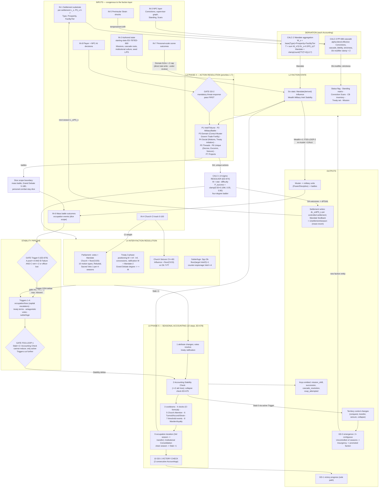
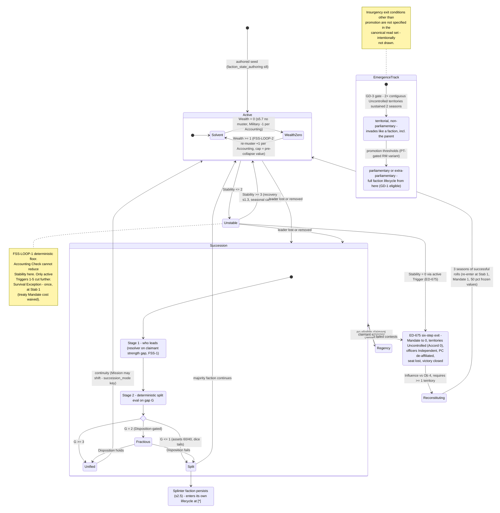

# Faction Play — System Flatten: Flowchart, State Graph, Full Inputs/Calculations/Sequences/Gates/Outputs Map
**Audit deliverable · 2026-06-09 · companion to `faction_play_comprehensive_analysis.md` (same directory) · session `ef659454b0c8`**

## 0 — How to read this

Every row cites its canonical source (file §). Values come from this session's full reads — nothing is from memory. Where canon currently **contradicts itself**, the map does not pick a winner: the contested value carries a `[P2-n]` / `[P3-n]` tag pointing at the companion register, or a `[DRIFT-NOTE]` for the two residual-wording sites first observed during this flatten (§8). ID prefixes here (`IN- / ST- / CALC- / GATE- / CAP- / OUT-`) are this document's own and deliberately do not collide with the register's `P2/P3`, the prior flatten's `C-n`, or the verdict's `F-n`.

Diagram sources: `faction_play_flowchart.mermaid` (season-cycle data flow) and `faction_play_stategraph.mermaid` (faction lifecycle FSM) ship as standalone files; both are embedded below for repo rendering.

## 1 — Flowchart (season-cycle data flow)



## 2 — State graph (faction lifecycle FSM)



## 3 — INPUTS (exogenous quantities the faction layer consumes)

| ID | Input | Range / shape | Source system | Consumed by |
|---|---|---|---|---|
| IN-1 | Per-settlement Legitimacy `L_s`, Popular Support `PS_s` | 0–7 each, per settlement | `settlement_layer §1.8` (LPS-2e canonical home) | CALC-2 Mandate aggregation; CALC-3 strictness |
| IN-2 | Settlement Type, Prosperity, FacilityTier | per settlement | `settlement_layer` | CALC-2 weights `W_s` |
| IN-3 | Authored faction state: starting stats (ED-787 Intel: Crown 3 / Church 4 / Hafenmark 3 / Varfell 4 / Guilds 4 / Löwenritter 3; ED-869 Crown Military 5/6 `[P2-4: two stale sites print 5 and 4]`), Missions, cascade roots, institutional_culture, seed L/PS `[P3-12: Löwenritter seed conflict]` | per faction | `stats_1_7_scale`; `faction_state_authoring` | ST-1, ST-6; engine init |
| IN-4 | NPC layer: personal Convictions, supervisor graph, Standing, Scars | per NPC | NPC canon; PP-684 taxonomy | CALC-3 cascade; crisis-bypass at leader Scars ≥ 3 |
| IN-5 | Church Confessional Influence (CI) | 0–100 | `ci_political` | Parliament weight; Seizure; CI economy (CALC-10) |
| IN-6 | Peninsular Strain shocks | Keys | `peninsular_strain` | temperament drift (CALC-3 ΔPS weighting) |
| IN-7 | Mass battle outcomes, occupation events | dice scope | `military_layer` | GATE-2 Trigger-5; Trigger 1; territory control |
| IN-8 | Personal-scale scene outcomes | degree ladder | `scale_transitions §5` | Domain Echo (CALC-11) — currently a **direct stat write**, reconception to substrate ripple is open on the inversion decision |
| IN-9 | Player + NPC-AI action selections | per season | player / AI priority stacks (AUDIT-PENDING) | Phase 4, behind GATE-1 (GD-2) |
| IN-10 | PP-687 Key stream (`da_outcome.*`, `state.succession`, `state.scar_acquired`, `env.peninsular_strain_shock`, `mechanical.accounting`) | event stream | substrate | CALC-3 ΔPS/ΔL attribution; cascade re-resolution |

## 4 — STATE (everything the faction layer owns)

| ID | State | Range / shape | Notes | Source |
|---|---|---|---|---|
| ST-1 | Six stats: **Mandate** (derived), Influence, Wealth, Military, Intel, Stability | Influence/Wealth/Military/Intel 1–7; Stability/Mandate 0–7 | Mandate is never written directly post-LPS — derived per CALC-2 `[P2-5: residual write sites remain]` | `stats_1_7_scale`; `faction_canon §5.1` |
| ST-2 | `aggregate_L`, `aggregate_PS` | 0–7, derived | W-weighted means over controlled settlements; feed CALC-2 and strictness | `settlement_layer §1.8`; `faction_behavior §4` |
| ST-3 | Parliamentary status flag | parliamentary / extra-parliamentary / non-parliamentary | GD-3 status semantics; gates seat, votes | `faction_systems_overview §2.2`; `canon/02 §B` |
| ST-4 | Standing matrix | pairwise, per faction pair | gates treaty eligibility, vote blocs, CB sources | `params/factions.md`; `parliamentary_transfer §4` |
| ST-5 | Conviction Scars ledger | per faction | grievance accumulation; CB source 7 | overview §2.4 — **AUDIT-PENDING** (Jordan contamination audit) |
| ST-6 | Mission | authored telos + aligned/contradicted PP-687 DA categories + prior_mission | four shift triggers (victory milestone; exceptional succession; ≥4 contradicting seasons; authored event) | `faction_behavior §3.1` |
| ST-7 | Cascade state: `aggregate_effective_convictions`, `cascade_fidelity`, `strictness` | vectors; [−1,+1]; [0,1] | recomputed each Accounting; crisis-bypass at leader Scars ≥ 3 | `faction_behavior §3.2–3.6` |
| ST-8 | CB inventory | 8 source types | consumes on use; **auto-expires after 3 seasons unused** (ED-NEW-001) | overview §4.6; `parliamentary_transfer §3` |
| ST-9 | Treaty set | six types, terms, signatories, tributary obligations | annual tributary Wealth flow; breach state | `faction_layer §3` |
| ST-10 | Lifecycle state | Active (Solvent ⇄ WealthZero) / Unstable / Succession / Regency / Collapsed / Reconstituting | the state graph (§2) | `faction_layer §1.4–1.5, §5.7`; FSS-1 |
| ST-11 | Partial-sheet variants | Restoration (no Mandate/Military/Wealth — Presence + Community Weaving); Löwenritter (no Mandate/Wealth pre-coup; embedded under Crown to Graduated Autonomy 4); Ministry (Influence + Stability only) | non-standard stat surfaces | `faction_canon §11` |
| ST-12 | Cooldowns / cadences | Sacred Veto 1-per-4-seasons (ED-751); action cooldown tracks (Accounting Step 3); Emergence once-per-province-per-4-seasons | timing state | `faction_layer §5, §7`; `settlement_layer §6.2` |

## 5 — CALCULATIONS & MECHANICS (formulas verbatim)

**CALC-1 · d+σ resolver (ED-874, ratified 2026-05-31)** — `stats_1_7_scale §Domain Action Resolution`
```
M = acting_stat − difficulty
  difficulty = contested target's relevant stat   (contested — the canonical home of the
                "Ob = target stat directly" form; F2 reconciliation, FSS-F2 2026-05-30)
             | fixed action-difficulty rating      (non-contested)
  legacy Ob mapping: "vs Ob O" → D = max(1, (O−1)·2)

P_success(M)       = clamp(0.50 + 0.10·M, 0.05, 0.90)
P_overwhelming(M)  = clamp(0.50 + 0.10·M − 0.35, 0, 0.55)
P_atleast_partial  = clamp(0.50 + 0.10·M + 0.20, P_success, 0.97)
r ~ U[0,1):  r < P_ow → Overwhelming · < P_success → Success · < P_atleast_partial → Partial · else Failure
```
BASE 0.50 · SLOPE 0.10/point (constant — closes the 1/√N σ-leverage non-uniformity) · FLOOR 0.05 · CAP 0.90 · live zone M ∈ [−4,+4]. Governs: all Domain Actions, Suppress, Rebuttal, treaty positioning/ratification, §1.4 Accounting Check, Royal Decree, Excommunication, Private Collection, Economic Leverage. Dice-scope boundary: GATE-16.

**CALC-2 · Mandate aggregation + feedback (LPS-2e)** — `settlement_layer §1.8`
```
W_s     = base(Type) + Prosperity + FacilityTier
T       = Σ_s W_s · (0.5·L_s + 0.5·PS_s) / 7
Mandate = clamp(round(7·T / (T + K)), 0, 7),  K = 6        (size-weighted, saturating)
aggregate_L / aggregate_PS = W-weighted settlement means
feedback: Mandate → controlled-settlement L/PS, mean-reverting, ±1/settlement/season
```
Intent-gated pass this session (deliberate size-scaling; Stage-4 sim bounded/convergent).

**CALC-3 · PP-686 behavior model** — `faction_behavior §3`
```
α(npc) = clamp(0.4 + α_seniority(−0.2..+0.4 by Standing) + α_institution(−0.2..+0.2), 0, 1)
effective(npc)    = α·personal + (1−α)·effective(supervisor)     (multi-root allowed)
aggregate         = normalize(Σ standing × effective)
cascade_fidelity  = cosine(aggregate, role_template)              (13-Conviction space)
strictness        = clamp(0.4 + 0.5·aggL/7 − 0.3·aggPS/7, 0, 1)   (deviation-cost only, C2)
Ob_modifier       = clamp(mission(±1) + cascade(±1) + expectation(±strictness·{1,2}), −2, +2)   (C1)
ΔPS/season (per settlement) = α_t·attributed + β_t·fidelity·gate{0.5,1.0} + γ·shock
  attributed = raw × (1 − 0.5·max(0, leader.self_other))          (C7)
ΔL/season  (per settlement) = 0.05·seasons_uninterrupted + 0.3·procedural − 0.6·violation + 0.1·fidelity
```
Temperaments (α_t/β_t): pragmatic 0.7/0.3 · traditional 0.3/0.7 · balanced 0.5/0.5 · principled 0.2/0.8 · outcomes-only 0.9/0.1. Crisis-bypass: leader Scars ≥ 3 suspends damping (drift_coef 0.6 otherwise).

**CALC-4 · Parliament** — `faction_layer §5`
Votes = current Mandate; Church weight `Mandate + ⌊CI/20⌋`; anti-Church contribution `max(0, Mandate − ⌊CI/30⌋)`. Ten motions (§5.4, verbatim):

| Motion | Proposer min | Vote | Target effect | Proposer cost | Duration · Rescission |
|---|---|---|---|---|---|
| Censure | Mandate 2 | Majority | Stab −1; Mandate −1 | — | one-time |
| Embargo | Mandate 3 | Majority | Wealth −1/season | Wealth −1/season | until lifted · Majority |
| Blockade | Military 3, Mandate 3 | Majority | Wealth −2/season; Stab −1 (once) | Military −1 (garrison) | until lifted · Majority |
| Combined E+B | both | Supermajority | Wealth −2/season; Stab −1/season; Mandate −1 (once) | Wealth −1/season + Military −1 | until lifted · Supermajority |
| Outlawry | Mandate 5 | Supermajority | Mandate −2; Stab −2; CB to all | Mandate −1 | permanent · petition needs target Mandate ≥ 3 |
| Subsidy | Mandate 2 | Majority | recipient Wealth +1 | Wealth −1 | one-time |
| War Authorisation | Military 2 | Majority | first military_advance vs target free; CB created | — | 1 season |
| Treaty Ratification | any signatory | Majority | treaty binding | — | permanent until breach |
| Recognition Challenge | Mandate 4 | Supermajority | target −1 TCV (victory calc) | Mandate −1 | until rescinded · Majority |
| Succession Endorsement | Mandate 3 | Majority | heir recognised; succession Ob −1 | — | permanent · Supermajority |

Embargo/Blockade renew annually at Year-End or lapse; lapse automatic if proposer drops below minima. Rebuttal (vs Censure/Outlawry): Phase-4 declaration costs an action slot; resolver-run; Overwhelming → Stab +1. Sacred Veto: once per 4 seasons (ED-751). Turmoil coupling: target Stab ≤ 2 → Accord −1 across its holdings.

**CALC-5 · Treaty system** — `faction_layer §3.3` + `peninsular_strain §2.3/§6.1`
Positioning (contested): `M = own Influence − target Influence`; Success+ → initiator sets opening terms; Partial → split terms (tie-break: higher Mandate); Failure → target controls. Ratification: `M = Mandate − 2`; Guarantor +1 M; Church CI weight +⌊CI/20⌋ M; Grand Debate Zoom-In (dice, 5–18D) degree → +2/+1/0/−1 M. Stability Δ by **terms category** (Trigger 2): Mutual peace +1 (both Stab ≥ 2) · Truce 0 · Minor cession −1 (≤1 territory or indemnity ≤1 Wealth) · Major cession −2 (2+ territories or ≥2 Wealth) · Capitulation −3 (signed at Stab ≤ 1 or ≥50% territories lost) · Tributary −1/year. Breach: Mandate −2, Stab −1, all co-signatories gain CB; survival exception at Stab 1 waives the Mandate cost. Accord on treaty transfer: Truce/Peace → 2 · Capitulation → 1 · Tributary → 2. Hegemony-counting **types** (victory): Peace, Alliance, Capitulation, Tributary count; Truce, Commercial do not. *(Terms-category and type are two deliberate axes, not a conflict.)*

**CALC-6 · Church Mass Seizure** — `faction_layer §2.7` (authoritative; FCN-SEIZURE-DRIFT closed LPS-2c)
Gate CI ≥ 60. Roll `Influence + ⌊CI/15⌋ vs Ob = 7 − PT`. Failure → Church Mandate −1.

**CALC-7 · Stability triggers** — `faction_layer §1.2`
T1 occupation/loss: occupation −1 (immediate) · occupied at Accounting −1 (ongoing) · formal transfer −1 additional · **capital** lost −2 total / transferred −3 total (capitals: T1 Valorsplatz Crown, T8 Gransol Hafenmark, T9 Himmelenger Church, T12 Sigurdshelm Varfell). T2 treaty terms: per CALC-5 table. T3 votes: Censure −1/−1 · Blockade −1/0 · Combined −1/season · Outlawry −2/−2. T4 subterfuge: Sabotage Success (Intel vs Stability) −1 · Assassination Success −2 + Mandate −1 · Assassination Overwhelming −2, no Mandate cost. T5: GATE-2 then costs — net −1..−2 at pool 4–5 → −1 · net ≤ −3 **or** pool ≥ 6 → −2 (severity escalator, ED-876) · officer killed −1 additional · officer captured, ransom unpaid −1/season · failing an attack on **own** capital −1 · max single event −4. `[P2-1: §6.2 still carries the struck gate clause]`

**CALC-8 · Stability recovery** — `faction_layer §1.3` (six paths; seasonal cap ±2)
Mutual peace +1 · recapture own occupied territory (military_advance Success) +1 · Rebuttal Overwhelming +1 · Institutional Consolidation (no Trigger 1–5 this season) +1, plus Accord +1 in one territory (cap 2) · Church Absolution (target Stab ≤ 2; Church Mandate −1) → target +1, Church Influence +1 · Löwenritter public endorsement (Löw Stab ≥ 3, Military ≥ 4) → target +1, Löw Mandate +1.

**CALC-9 · Accounting Stability Check** — `faction_layer §1.4` (resolver-run per ED-874)
Fires on ≥ 2 attribute points lost this season; difficulty = magnitude of total loss. **FSS-LOOP-1**: at Stab ≤ 2 this check cannot reduce Stability — collapse only via active Triggers. `[DRIFT-NOTE-1: §7 Step-2 line still reads "Stability pool roll" — ED-874-residual wording]`

**CALC-10 · CI economy** — `faction_layer §9` / `ci_political`
Accounting Step-4 sequence: Passive +1 → Piety Yield → Assert +2 → Suppress (negates passive; Failure → Stab −1) → Baralta structural suppression −1/season while her Mandate ≥ 4 `[P2-5: "L ≥ 4" residual wording in stats_1_7_scale]`. Caps ±3 from DAs / ±5 total per season. `[DRIFT-NOTE-2: §9 Suppress line retains legacy "Mandate vs Ob = ⌊Church Mandate/2⌋+1" form — under ED-874 this is the mapped non-contested rating; wording predates migration]`

**CALC-11 · Domain Echo (upward ripple)** — `scale_transitions §5`
Personal-scene degree → faction stat: Success +1, Overwhelming +2, cap ±2. Currently a **direct stat write**; the 2026-06-09 review reconceives it as substrate ripple (settlement-locus write or national-event Key → re-derive) — open on the inversion decision.

**CALC-12 · Succession / split (FSS-1, 2026-05-30)** — `faction_succession_split`
Stage 1 *who leads*: resolver on claimant strength gap (Ob-3 net-success counting retired). Stage 2 *whether it splits*, deterministic on gap G: G ≥ 3 unified · G = 2 fractious (Disposition-gated) · G ≤ 1 split, assets 60/40 with dice tails; splinter persists (§2.5). Regency fallback when no claimant; 3 failed contests → collapse. Succession Endorsement motion: succession Ob −1.

**CALC-13 · Intel / espionage (ED-787)** — `stats_1_7_scale`
Defensive Spy Ob = ⌊target Intel/2⌋ + 1 · counter-espionage active at Intel ≥ 4 · strategic fog. `[P2-2: PP-236 "Crown has NO Intel stat" prose still coexists]`

**CALC-14 · Collapse + Reconstitution (ED-675)** — `faction_layer §1.5`
Six-step exit: Mandate → 0 (other attributes frozen) · territories → Uncontrolled, Accord 0 · officers → Independent · PC de-affiliated (loses Standing-derived bonuses) · Parliamentary seat lost, pending Motions lapse · victory closed. Evaluated at Accounting Step 2. Reconstitution: Influence vs Ob 4, requires ≥ 1 territory, 3 seasons of success → re-enter at Stab 1, Mandate 1, 50% of frozen values. One-time Survival Exception at Stab 1.

**CALC-15 · Officer fate + ransom** — `faction_layer §6.3–6.4`
TTRPG/Hybrid d10 on Zoom-In when T5 gate met and officer attached: 1–4 wounded · 5–7 captured (ransom 2 Wealth per named general, ED-334) · 8–9 killed (permanent; faction Stab −1 additional) · 10 heroic survival (faction Stab +1). Captured: capturing faction holds; target Stab −1/season until resolved. Ransom refusal = Trigger 4 (capturing faction Stab −1, Mandate −1). Unpaid 3 seasons → execute (displaced faction Stab −1 additional; ransom forfeit) or continue holding. BG mode: ED-334/335 only.

## 6 — SEQUENCES & GATES

### 6.1 Season pipeline (verbatim, `faction_layer §7`)

**PHASE 4 — ACTION RESOLUTION**, priority order:
1. Intel/Tribune
2. Military/Battle → [Occupation established; Trigger-5 gate checked]
3. Domain (Consul, Muster, Govern, Trade, Fortify)
4. Social (Senator): Parliamentary Motion declarations (consume action slot) · Hafenmark Parliamentary Manoeuvre · Treaty initiation (Positioning + Concession declaration) · Crown Treaty (PP-512–514/523)
5. Thread operations
6. Special/Unique (Royal Decree, Excommunication, Church Seizure)
7. Project advancement

**PHASE 5 — SEASONAL ACCOUNTING (10 steps)** [ED-678: collapsed from 13, PP-472]:
1. Apply all pending attribute changes from resolved orders; **Parliamentary votes resolve → Trigger-3 effects**; **Treaty ratification rolls → Trigger-2 effects** `[DRIFT-NOTE-3: §5 prose places vote resolution at "Step 1.5"; §7 (ED-678) folds it into Step 1 — §7 authoritative]`
2. Accounting Stability Check (≥2 attribute loss; CALC-9) — includes Trigger 1–5 + Parliament consequences; **collapse check (ED-675) fires here**
3. Cooldown track advance
4. Clock advances (RS, **CI formula** = CALC-10, IP, PI); Church Prominence update
5. Church Attention Pool resolution; Thread Debt drain; Resonance markers cleared
6. Turmoil accounting: Accord checks (garrison, Revolt, passive normalisation) · Strain update (battle/Revolt decay, diplomatic resolution) · battle consequence accounting (IP, RS)
7. Threshold events / Event Cards; Milestone Bonus check; Warden Emergence check; Vaynard–Edeyja same-season rule
8. Warden Cooperation check; Torben/Elske Loyalty events
9. Occupation duration: 3rd consecutive season → control transfer, Trigger 1 applies, Accord 1 · **Institutional Consolidation**: no Trigger 1–5 this season → Stability +1
10. **Victory condition check (GD-1; 2 consecutive Accountings)**; season marker advances → Winter: Year-End Accounting (Embargo/Blockade renewal)

### 6.2 Gate inventory

| ID | Gate | Condition | Source |
|---|---|---|---|
| GATE-1 | **GD-2 mandatory threat-response** | mandatory-actions pass precedes stochastic AI selection | `canon/02 §B` |
| GATE-2 | **Trigger-5 three-condition** (ED-876) | A: pool ≥ 4 at roll ∧ B: degree = Failure (Partial excluded) ∧ C: net ≤ −2 **or** named officer captured/killed | `faction_layer §1.2/§6.2` `[P2-1 residual in §6.2]` |
| GATE-3 | **FSS-LOOP-1 floor** | Stab ≤ 2 → Accounting Check cannot reduce Stability | `faction_layer §1.4` |
| GATE-4 | Survival Exception | once, at Stab 1 — treaty Mandate cost waived | `faction_layer §3` |
| GATE-5 | Motion proposer minima + vote thresholds | per CALC-4 table (Majority / Supermajority) | `faction_layer §5.4` |
| GATE-6 | Standing-matrix eligibility | gates treaty eligibility, vote blocs, CB sources | `parliamentary_transfer §4` |
| GATE-7 | CB validity by Transfer mode | 8 sources × 4 modes (Adversarial/Consensual/Punishment/Appeasement); some CBs mode-restricted | `parliamentary_transfer §3` |
| GATE-8 | Sacred Veto cadence | once per 4 seasons (ED-751) | `faction_layer §5` |
| GATE-9 | Seizure availability | CI ≥ 60 | `faction_layer §2.7` |
| GATE-10 | Counter-espionage | active at Intel ≥ 4 | ED-787 |
| GATE-11 | Löwenritter Martial Law | Graduated Autonomy 4 (no roll) | overview §3 |
| GATE-12 | Reconstitution prerequisite | ≥ 1 territory held | `faction_layer §1.5` |
| GATE-13 | GD-3 emergence | 2+ contiguous Uncontrolled territories sustained 2 seasons; per-settlement variant Order = 0 ∧ PT ≤ 1 ∧ Vossen Disposition ≥ +3, once per province per 4 seasons | `canon/02 §B`; `settlement_layer §6.2` |
| GATE-14 | Insurgency promotion thresholds | → parliamentary or extra-parliamentary; RM variant PT-gated | `canon/02 §B` `[P2-7: thresholds still phrased in pre-LPS faction-level L]` |
| GATE-15 | Outlawry petition | target Mandate ≥ 3 to petition | `faction_layer §5.4` |
| GATE-16 | **Dice-scope boundary** | personal combat, social contest (5–18D, incl. Grand Debate), mass battle stay dice; all bare-stat faction checks → CALC-1 | ED-874 `[P2-6: Parliamentary Vote best-of-3 sits on neither side explicitly]` |

### 6.3 Caps, floors, bounds (the damper inventory)

| ID | Bound | Value | Source |
|---|---|---|---|
| CAP-1 | Resolver success clamp | P ∈ [0.05, 0.90] | CALC-1 |
| CAP-2 | Degree-band clamps | P_ow ≤ 0.55; P_atleast_partial ≤ 0.97, ≥ P_success | CALC-1 |
| CAP-3 | Behavior Ob modifier | ±2 (C1) | CALC-3 |
| CAP-4 | FACTION_STAT_SEASONAL_CAP | Stability ±2/season, all sources combined | `faction_layer §1.3` |
| CAP-5 | CI per-season movement | ±3 from DAs / ±5 total | `faction_layer §9` |
| CAP-6 | Domain Echo | ±2 | `scale_transitions §5` |
| CAP-7 | Mandate | clamp 0–7; saturation K = 6 | CALC-2 |
| CAP-8 | FSS-LOOP-2 re-muster ceiling | Military recovers to pre-collapse value, no higher | `faction_layer §5.7` |
| CAP-9 | Trigger-5 single-event total | max −4 | `faction_layer §1.2` |
| CAP-10 | Accord set-points on treaty transfer | Truce/Peace 2 · Capitulation 1 · Tributary 2 | `peninsular_strain §2.3` |
| CAP-11 | Mandate→settlement feedback | ±1/settlement/season, mean-reverting | `settlement_layer §1.8` |

## 7 — OUTPUTS (what the faction layer writes and emits)

| ID | Output | Mechanism | Destination |
|---|---|---|---|
| OUT-1 | Territory control changes | conquest (mass battle) · parliamentary_transfer (4 modes × 8 CBs) · Seizure · 3rd-season occupation transfer · collapse → Uncontrolled (Accord 0) | territory layer |
| OUT-2 | Settlement writes | ΔL_s/ΔPS_s per controlled settlement (CALC-3, per-settlement dynamics) · Mandate→L/PS feedback ±1 (CAP-11) | `settlement_layer` (next-season IN-1) |
| OUT-3 | Keys emitted | `mechanical.mission_shift` · `state.succession` · `mechanical.cascade_resolution` · `state.coup_attempted` (probabilistic at low aggregate-L) | PP-687 substrate |
| OUT-4 | Military units | Muster → units (Power/Discipline; Crown via Löwenritter P5/D6 pre-coup); FSS-LOOP-2 re-muster | `military_layer` (next battles) |
| OUT-5 | Victory progress | GD-1 sole path; TCV accounting; Recognition Challenge −1 TCV; hegemony-counting treaty set; checked Step 10 over 2 consecutive Accountings | victory evaluation |
| OUT-6 | New faction entities | GD-3 insurgency spawn → promotion (parliamentary / extra-parliamentary) · succession splinters (§2.5) · reconstituted factions | faction roster (state graph `[*]` entries) |
| OUT-7 | Parliament outcomes | motion effects (CALC-4) · Turmoil coupling (target Stab ≤ 2 → Accord −1 across holdings) · lapses at Year-End | target factions; territory Accord |
| OUT-8 | Excommunication chain effects | action → tribunal → absolution; CB source 3 while current | target faction; CB inventory |
| OUT-9 | PC-facing effects | de-affiliation on collapse (Standing-derived bonuses lost) · rank/parity access (`faction_politics §9.2–9.3`) · succession-endorsement Ob shifts | personal scale |
| OUT-10 | UI surfaces | stat meters, vote counts `[P3-15: "Legitimacy: 87/100" meter unbound post-LPS]` | presentation layer |
| OUT-11 | CB grants | breach → all co-signatories · Outlawry → all factions · War Authorisation creates CB | ST-8 inventories of other factions |
| OUT-12 | Officer-fate consequences | ransom Wealth transfers (2/general) · execution/holding Stability effects · refusal = Trigger 4 | both factions' ST-1 |

## 8 — Drift sites on this map + coverage

### 8.1 Register findings, located on the map
P2-1 → CALC-7/GATE-2 · P2-2 → IN-3/CALC-13 · P2-3 → (Royal Decree row, CALC-1 governed list — failure cost unresolved, three-way split) · P2-4 → IN-3 · P2-5 → ST-1/CALC-10 + off-map sites (`faction_actions`, `derived_stats §14`, `peninsular_strain`) · P2-6 → GATE-16 · P2-7 → GATE-14 · P3-12 → IN-3 · P3-15 → OUT-10. The map renders the **authoritative** side of each contradiction and tags the residual; it canonizes nothing the register hasn't already adjudicated.

### 8.2 New residual-wording sites observed during this flatten (same defect classes, fold into existing staged entries — no new register rows)
- **DRIFT-NOTE-1** — `faction_layer §7` Step 2 still reads "Stability **pool roll**" (pre-ED-874 wording). → fold into **ED-NEXT-1**'s ED-874-residual sweep.
- **DRIFT-NOTE-2** — `faction_layer §9` Suppress line retains legacy "Mandate vs Ob = ⌊Church Mandate/2⌋+1" form (the mapped non-contested rating under ED-874, but phrased pre-migration). → fold into **ED-NEXT-1**.
- **DRIFT-NOTE-3** — `faction_layer §5` prose places vote resolution at "Step 1.5"; `§7` (ED-678-authoritative) folds it into Step 1. Same-doc placement inconsistency. → fold into **ED-NEXT-8** hygiene sweep.

### 8.3 Coverage statement
Built entirely from this session's 16-file read set; formulas and tables in §5–§6 are verbatim transcript extracts of the fetched canonical content (no memory). `[CONFIDENCE: high]` on every CALC/GATE/CAP row sourced to a full-read file; `[CONFIDENCE: medium — excerpt-sourced]` where the register already flags it (P2-5/P2-6 off-map line anchors). The repo tree advanced mid-session (+5 indexable paths at the latest bootstrap; 5 stale canonical sources flagged) — every value here is as-of this session's fetch SHAs; re-verify against HEAD at edit time. Not drawn because not specified in the read set: insurgency exits other than promotion; Regency duration bounds. No commits made; deliverable set for Jordan review.
