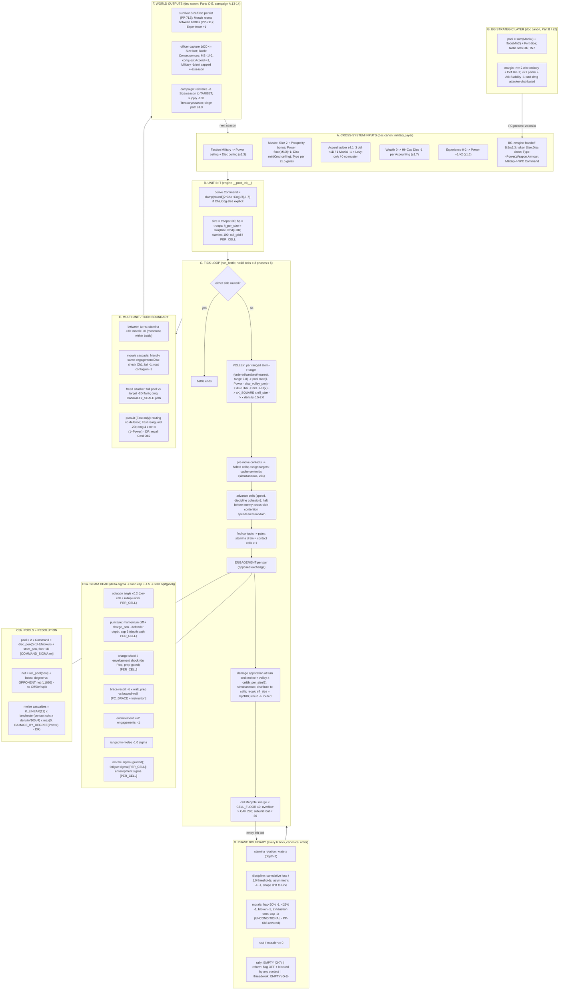

# Mass Battle — Flowchart, State Graph, Flattened Map, and Structural Critique
**Date:** 2026-06-09 · **Companion to:** massbattle_comprehensive_analysis.md (same directory; "the audit") · **Session:** 821e65334d345e1b
**Method:** the system is drawn (flow + state), then **flattened** — every mechanic reduced to inputs → calculation → gate(s) → sequence slot → outputs — and the flat map is used as a closure check against the audit. All rows cite the stratum and live-status verified this session.

## §0 — CRITIQUE VERDICT (first)

**Flattening confirms the audit's mechanical verdict and overturns two of its claims.** Confirmed: graded everywhere, one-role-one-place (the v20 contact-fraction post-scaler is code-verified skipped under Lanchester, orch L2016), bounded stacking, clean simultaneity. Overturned: (1) the audit's P-iv "state-space closure PASS" — the flat map finds **declared canon states and exceptions with no reachable transition** (PP-683 encirclement morale-cap exception unwired; reform near-unreachable even when enabled); P-iv is revised to **PASS-WITH-EXCEPTIONS**. (2) The audit's drift model had three strata — the flat map exposes a **fourth drift axis: configuration**. The engine's default gate vector (PER_CELL=0, REFORM=0) is not the historically validated vector (battery 7655743e ran PER_CELL=1), and **no canonical gate-vector manifest exists anywhere** — the single biggest new defect (N1, P2). Seven new findings N1–N7 (§4.2); overall system verdict unchanged (compliant-with-backlog) with the backlog extended.

---

## §1 — FLOWCHART (live leading canon; doc-only layers marked)



Gate-flag lattice (defaults verified, config.py): SIGMA_HEAD=1 · LANCHESTER=1 · COMMAND_SIGMA=1 · PUNCTURE=on · CASCADING=on · VOLLEY=on · PC_VOLLEY_DENSITY=1 · PC_BRACE=1 · PC_KITE=on(inert w/o instruction) · **PER_CELL=0** · **REFORM_CHECK=0**. The du Picq layer (S2 depth path, S3, S7 fatigue/envelopment, rollup, volley density, brace prep) is PER_CELL-gated → **dark in the default vector** (see N1).

---

## §2 — STATE GRAPH (unit lifecycle, live engine + doc-layer recovery edges)

```mermaid
stateDiagram-v2
  [*] --> Mustered : Muster action (campaign)
  Mustered --> Active : deploy / battle entry
  state Active {
    [*] --> Fighting
    Fighting --> Fighting : tick exchange (hp-, stamina-, position)
    Fighting --> Degraded : phase boundary, cumulative loss threshold (Disc -1)
    Degraded --> Fighting : reform +1 Disc [flag OFF; blocked by any contact]
    Degraded --> Degraded : further thresholds (monotone ratchet, asymmetry-gated)
  }
  Active --> Broken : Discipline 0 (pool 0, +1 morale loss per phase)
  Active --> Routed : Morale <= 0 (50%/25% triggers + broken + exhaustion; cap -3/phase)
  Active --> Routed : effective size 0 (hp/100 floor)
  Broken --> Routed : morale bleed (no reform path at Disc 0)
  Routed --> Pursued : Fast enemy adjacent (battle map)
  Pursued --> Routed : recall passed (Cmd Ob 2) or pursuer breaks off
  Pursued --> Destroyed : pursuit damage to size 0
  Routed --> Destroyed : size 0
  Routed --> Survivor : battle ends (no rally in-battle - G-7 empty)
  Survivor --> Mustered : re-muster on token (Disc restore; Experience reset if was Destroyed)
  Survivor --> Active : next battle (Morale reset PP-711; Disc persists PP-712; reinforcement +1 Size/season)
  Destroyed --> [*] : token removed; Experience lost; Military -1 to owner (capped +-2/season)
  note right of Active
    DOC-ONLY states (no engine transition):
    general incapacitated stage 1/2 (ED-898);
    morale floor 1 with general (sA.4);
    PP-683 cap exception (encircled)
  end note
```

State-machine observations the flat map will use: within `Active`, **morale is strictly monotone non-increasing** (between-turn recovery constant = 0, rally empty, reform's morale-recovery half unimplemented) → every sufficiently long battle terminates in rout by construction. Discipline is monotone non-increasing in-battle under default flags (reform OFF; and even ON, the contact gate blocks it inside engagements). All in-battle recovery is stamina-only; all other recovery edges live at battle/campaign boundary.

---

## §3 — FLATTENED MAP (inputs → calculation → gates → sequence → outputs)

Status key: **LIVE** (default vector) · **GATED** (exists, off/inert by default) · **DOC** (canon, no engine) · **EMPTY** (hook stub) · **STALE** (superseded text).

### A. Cross-system inputs (DOC — military_layer)
| # | Mechanic | Inputs | Calculation | Gate | Seq | Outputs |
|---|---|---|---|---|---|---|
| A1 | Power/Disc ceiling | Faction Military | table §1.3 | — | pre-battle | unit Power max, Disc start max |
| A2 | Muster | Mil, Prosperity, Wealth, officer | Size 2+bonus; Power floor(Mil/2)+1; Disc min(Cmd,ceiling); Type per Ob table | Prosperity/Wealth/officer gates §1.5; Accord≥1 | season action | unit token |
| A3 | Accord effects | territory Accord 0–3 | ladder §4.1 | — | battle/muster entry | def +1D / Martial −1 / Levy-only / no-muster |
| A4 | Wealth-0 decay | faction Wealth | HI+Cav Disc −1 | Wealth=0, per Accounting | accounting | unit Disc (stacks with battle loss) |
| A5 | Experience | battle survival record | +1 step, Power +1 within ceiling | won/drew ∧ Size>0 | post-battle | effective Power |
| A6 | B.5 handoff | BG tokens, Military | Size/Disc direct; Type map; NPC Cmd = Military (§2.3) **vs** derived (engine) **vs** direct (§A.5) — three sources, F3.2 | PC present | zoom-in | engine Unit inputs |

### B. Init / derived (engine, LIVE)
| # | Mechanic | Inputs | Calculation | Gate | Seq | Outputs |
|---|---|---|---|---|---|---|
| B1 | Command derivation | Cha, Cog (else explicit) | clamp(round((2Cha+Cog)/3),1,7) | COMMAND_SIGMA ∧ both supplied | init | command |
| B2 | Size/HP | cell troops | size=Σ/100; hp=Σ; eff_size cont. | — | init+recalc | capacity state |
| B3 | h_per_size | Disc, Cmd, DR | min(Disc,Cmd)+DR | — | init | **sole consumer: volley hp divisor** (N6) |
| B4 | col_grid | cells | per-column density/depth | PER_CELL | init | du Picq layer substrate |

### C. Tick loop (engine, LIVE unless noted)
| # | Mechanic | Inputs | Calculation | Gate | Seq | Outputs |
|---|---|---|---|---|---|---|
| C1 | Volley target | atom positions, orders | ordered → weakest → nearest, range 2–8 | VOLLEY; PC_VOLLEY_TARGETING for orders | tick start | target atom |
| C2 | Volley roll | Power, disc_volley_pen | pool max(1,P−pen); d10 TN6 (1=−1,10=+2, floor 0) | VOLLEY | tick | net |
| C3 | Volley damage | net, eff_size, target density | (net−**2 flat**)×0.25×eff_size×dens(0.5–2.0) | LANCHESTER; PC_VOLLEY_DENSITY | tick, applied turn-end | troops lost ×ceil(h_per_size/2) |
| C4 | Movement | speed, discipline, cached centroids | simultaneous advance, halt-at-contact, contention speed→size→random | — | tick | positions |
| C5 | Stamina drain | contact cells | max(1,cells)×1 | contact | pre-exchange | stamina (same-tick pool effect) |
| C6 | Pool | Cmd, disc_pen, stam_pen | 2×Cmd+pens, floor 1D | COMMAND_SIGMA (else min(Size,Cmd)+Cmd) | exchange | dice count |
| C7 | Exchange | pools, Δσ sum | net=roll+1.5tanh(Δσ/1.5)·0.8√pool; degree vs opponent net | SIGMA_HEAD | exchange | degrees both sides |
| C8 | Melee casualties | degree, Power, DR, contact geometry | 12×(cols×min(tpc,200)/100/4)×max(0,payoff−DR) | LANCHESTER (post-scaler skipped, L2016) | turn-end | hp loss, cell distribution |
| C9 | Cell lifecycle | cell troops | merge<40; overflow>200; subunit rout<80 | PER_CELL substrate | post-damage | formation integrity |

### D. Sigma head sources (engine)
| # | Source | Inputs | Δσ | Gate | Status |
|---|---|---|---|---|---|
| D1 | Octagon angle | facing, attacker centroid (per-cell + rollup) | zone×0.2 | SIGMA_HEAD | LIVE (rollup PER_CELL) |
| D2 | Puncture | momentum diff, charge_pen, defender depth | min(3,·)×0.2 | PUNCTURE (depth absorb PER_CELL) | LIVE/GATED |
| D3 | Charge shock / envelop shock | prep (zone, brace, depth, shaken) | calibrated fn | PER_CELL (+PC_ENVELOP_SHOCK) | **GATED** |
| D4 | Brace recoil | wall prep | −6×prep×0.2 | PC_BRACE ∧ brace instruction | LIVE-inert w/o order |
| D5 | Encirclement | engagement count ≥2 | −1×0.2 | SIGMA_HEAD | LIVE — **not wired to morale cap (N3)** |
| D6 | Ranged-in-melee | unit_type | −1.0 | SIGMA_HEAD | LIVE |
| D7 | Morale σ | morale | graded ≤0.8 scale | SIGMA_HEAD | LIVE |
| D8 | Fatigue σ / Envelopment σ | engaged-front stamina; width vs depth | depth-damped fns | PER_CELL | **GATED** |

### E. Phase-boundary hooks (engine, order canonical)
| # | Hook | Inputs | Calculation | Gate | Outputs |
|---|---|---|---|---|---|
| E1 | Stamina rotation | formation depth | +rate×(depth−1) | — | stamina |
| E2 | Discipline degrade | cumulative size loss, opponent's | floor(loss/1.0)>applied ∧ mine>theirs → −1; shape drift→Line | deterministic | discipline (ratchet) |
| E3 | Morale | hp fraction, broken, exhaustion | <50% −1; <25% −1; broken −1; 1/(D·C) term; **cap 3.0 unconditional** | — | morale |
| E4 | Rout | morale | ≤0 → routed | — | state flip |
| E5 | Rally | — | — | **EMPTY (G-7)** | — |
| E6 | Reform | contact, Cmd, Disc | unengaged ∧ Cmd≥2 ∧ Cmd≥Disc+1 → +1 toward start; **morale/merge halves unimplemented** | **REFORM=0; any contact blocks** | discipline |
| E7 | Threadwork | — | — | **EMPTY (G-9)** | — |

### F. Turn boundary / multi-unit (engine)
| # | Mechanic | Inputs | Calculation | Gate | Outputs |
|---|---|---|---|---|---|
| F1 | Between-turn | — | stamina +30; **morale +0** | — | partial reset |
| F2 | Morale cascade | friendly rout in engagement | Disc check Ob1; fail −1; contagion −1 | CASCADING | morale |
| F3 | Freed attacker | victor adjacency | full pool vs −1D; CASUALTY_SCALE dmg | — | flank damage |
| F4 | Pursuit/recall | speeds, rout state | Fast only; rearguard −2D; 4×net×(1+Power)−DR; recall Cmd Ob2 | non-Lanchester path (deliberate) | rout attrition |

### G. World / campaign / BG outputs (DOC)
| # | Mechanic | Inputs | Calculation | Gate | Outputs |
|---|---|---|---|---|---|
| G1 | Persistence | survivor state | Size/Disc persist (PP-712); Morale reset (PP-711) | battle end | token state |
| G2 | Consequences | result, units destroyed | MS −1/−2; conquest Accord→1; Military −1/unit, cap ±2/season; deferred IP/Strain | Part E gates §E.4 | faction/world state |
| G3 | Officer capture | Size lost | 1d20 ≤ lost | battle end | narrative hook |
| G4 | Campaign | seasons | reinforce +1 Size→TARGET; supply −100/season; levy restriction; siege Pool Mil+3 Ob 2+Fort | §A.13–14, §1.9 | sustained war |
| G5 | BG resolution | ΣMartial, Mil, Fort, tactic | TN7 margin table; attacker distributes unit damage | no PC present | territory/Military/Stability deltas |

---

## §4 — COMPREHENSIVE CRITIQUE (flat map vs the audit)

### 4.1 Confirmations (flat map → audit crosswalk, code-verified this pass)
- **One role, one place (Lesson 1):** the v20 contact-fraction post-scaler is gated `if pairs and not LANCHESTER_ENABLED` [orch L2016] — numbers-in-contact lives only in the linear term. The audit cited the comment; the flat map verified the code. No double-count.
- **Graded everywhere / no hidden binaries:** every flat-map row outputs a continuous or stepped-recoverable quantity; the only hard flips are the declared state transitions (broken/routed/destroyed), each preceded by graded approach. Confirms P-i/P-v.
- **Simultaneity:** cached centroids (v21) + simultaneous hp application + simultaneous size recalc — no first-mover edge anywhere in the flat sequence.
- **F1/F2/F3 drift rows** reproduce exactly in the map (A6 three-source NPC Command; C3 volley pool vs ED-800; no Off/Def row exists to ground ED-910).

### 4.2 NEW findings from flattening (worst-first)

| ID | Sev | Finding | Action |
|---|---|---|---|
| **N1** | **P2** | **No canonical gate-vector manifest; default ≠ validated configuration.** Engine behavior is a point in a ~2^12 flag lattice. The historically validated battery (7655743e) ran **PER_CELL=1**; the default vector ships PER_CELL=0 and REFORM=0 — so the du Picq layer (charge/envelopment shock, fatigue σ, envelopment σ, depth absorption, rollup, volley density, brace prep) is **dark by default**, and ED-905-ratified reform is dark twice (flag + contact gate). No file declares "canonical config = {…}". A Godot implementer cannot determine which game to build; sim results are only comparable per-vector. | Author `tests/sim/mass_battle/CANONICAL_CONFIG` (or config.py block) declaring the ratified vector, Jordan-signed; CI/validators assert it; battery digests recorded per-vector. Staged §5 (ED-972). |
| **N2** | P2/P3 | **Zoom-consistency property unspecified and untested.** BG (TN7 margin) and the engine (opposed σ exchange) share state mapping (B.5) but no resolution primitive; nothing validates that the same NPC-vs-NPC matchup yields statistically compatible outcomes at both scales. Divergence-with-PC-present is intended agency; baseline divergence is an exploit surface (zoom to whichever resolver favors you). The audit's S check covered state mapping only. | Jordan specs an acceptable divergence band; add a paired-resolution probe (same matchups through both layers) to the re-test set. |
| **N3** | P3 | **PP-683 unreachable: both halves exist, no wire.** Encirclement state is computed (eng_counts≥2, σ −1) and the morale cap is enforced — unconditionally (`min(loss,3.0)`, L303; zero "683" references in engine). The canon exception (encircled units exceed the −3 cap — the Cannae rule) cannot fire. | Wire eng_counts (or per-cell encircled flag) into morale_check_phase; the audit's F10e is upgraded from scope-note to defect. |
| **N4** | P3 | **In-battle morale is monotone by construction — rout is the only long-battle terminus, currently emergent-by-omission.** Recovery channels: between-turn constant 0, rally EMPTY, reform's morale half unimplemented, and reform's discipline half is blocked by *any* contact (1v1: phase boundaries mid-engagement always have contact) — even flag-ON reform almost never fires inside run_battle. Du-Picq-defensible as design, but it is nowhere declared; it currently falls out of three independent omissions. | Jordan declares intent ("battles end in rout" as canon axiom) or schedules the rally/reform-morale cycle; either way reform's cadence belongs at battle-map level, not inside the contact-locked duel. |
| **N5** | P3 | **Volley flat DR compresses the armour axis.** RANGED_DR_DEFAULT=2 for all targets (armour_class comment-only): unarmoured Levy receive better-than-canon protection (table says 0), Heavy worse (3). The anti-armour/anti-skirmisher niches of ranged units don't exist — directly feeds the open ED-822 composition question. | Wire Atom.armour_class → Ranged DR Table before ED-822 balance runs; otherwise those runs calibrate against a flattened axis. |
| **N6** | P3 | **h_per_size is an orphaned meaning.** Defined min(Disc,Cmd)+DR ("toughness per Size"), its sole live consumer is the volley size→hp divisor [L2008]; the v19 HP=troops change stranded it, and the file-header comment (L10 "effective_size = hp / h_per_size") is stale. A toughness-named variable that only tunes volley lethality will mislead the port. | Rename to volley_hp_divisor (or re-derive volley scaling from armour once N5 lands); fix the L10 comment. |
| N7 | note | **Inert reads / domain validators (extends F12):** morale_start's only read is multiplied by a 0 constant; size_max unused at engine level (TARGET lives doc-side); no 1–7 stat clamp. Harmless now, trap later. | Validator additions alongside F12. |

### 4.3 Critique of the reference audit itself
[SELF-AUTHORED — bias risk] — the audit is this session's own work; this pass attacked it deliberately.

1. **P-iv overclaimed.** "State-space closure PASS at engine level" was asserted from state enumeration + hook coverage. The flat map is the actual closure check, and it fails twice: a canon exception with no transition (N3) and a ratified mechanic with no reachable firing condition (N4/reform). **Revised: P-iv PASS-WITH-EXCEPTIONS.** The audit's evidence standard slipped exactly where the skill warns it does — coverage claimed from inventory rather than from reachability.
2. **The drift model was one axis short.** The audit framed S:PARTIAL as tri-strata drift (doc/ledger/engine). Configuration is a fourth stratum: which engine you get is itself drifting between validated, ratified, and default vectors (N1). The audit *contained* the evidence (it noted reform default-OFF and cited a PER_CELL=1 battery) and did not compose it.
3. **§3.2 leverage table held penalties at zero.** Effective Command (2×Cmd+pens, floored) is the operative stat; penalty interaction compresses the low end further (Cmd 2 with −3 pens plays as pool 1, identical to Cmd 1 under the same penalties). Direction and the G8 input stand; the framing understated low-end compression. Attach this note to the ED-875 packet.
4. **Lesson-1 verification was citation-grade, not code-grade** in the audit (comment at L1689); this pass closed it at L2016. Upgrade of evidence — recorded so the trail shows which claims were verified at which grade.
5. **Unchanged limits:** percell.py internals remain map+call-site verified, not line-audited; the battery was cited, not re-run. Both [CONFIDENCE: medium] carries stand; nothing in the flattening contradicts them.

### 4.4 Verdict deltas
Engine **R: PASS w/ flags** gains N1 (configuration ambiguity is a robustness exposure at port time). **P-iv → PASS-WITH-EXCEPTIONS** (N3, N4). System **S: PARTIAL** now reads *four*-axis drift (doc/ledger/engine/config). **Overall verdict unchanged: COMPLIANT-WITH-BACKLOG** — no mechanical defect found in the live resolution path by either pass; the backlog grows by N1–N7 and two re-tests (gate-vector assertion; zoom-consistency probe).

---

## §5 — LEDGER-READY CANDIDATE (staged, NOT appended; lane-C next free after §8 of the audit)

```jsonl
{"id":"ED-972","date":"2026-06-09","status":"open","severity":"P2","scope":"mass_battle/engine_config","title":"No canonical gate-vector manifest; default config != validated config","finding":"Engine behavior depends on ~12 env flags. Validated battery 7655743e ran PER_CELL=1; defaults ship PER_CELL=0 and REFORM_CHECK_ENABLED=0, leaving the du Picq layer and ED-905-ratified reform dark by default. No file declares the canonical vector; Godot port target and sim comparability are ambiguous.","action":"Jordan signs a canonical config manifest (flag vector + battery digest per vector); validators assert it; re-baseline under the signed vector.","refs":["ED-899","ED-905","mass_battle_breakthrough_validation_2026-06-05"],"source":"designs/audit/2026-06-09-massbattle-comprehensive/massbattle_flow_state_flatmap_critique.md §4.2 N1"}
```

Open-Jordan additions (extends audit §9): gate-vector ratification (N1/ED-972) · zoom-divergence tolerance spec (N2) · rout-by-construction intent declaration (N4) · armour-axis wiring before ED-822 runs (N5).

---

## §6 — CONFIDENCE & TRAIL

[CONFIDENCE: high] on every flat-map row and finding cited to a line read this session (orch L303/L1680/L2008/L2016/L2146, config gate defaults, military_layer sections). [CONFIDENCE: medium] on percell internals (unchanged carry). [READ] set identical to the audit §0.1 plus this pass's targeted re-reads (orch L2010–2075 damage application; consumer greps for h_per_size/morale_start/size_max/armour_class/gate defaults; PP-683 absence grep). [NULL: double-count check — Lanchester vs contact-fraction post-scaler examined at code level; no double-count (skip gate present).] [CORRECTION: audit P-iv verdict revised per §4.3.1.] Mermaid diagrams hand-checked for syntax; not machine-rendered in this environment — if either fails to render, the flattened map (§3) is the authoritative content.
