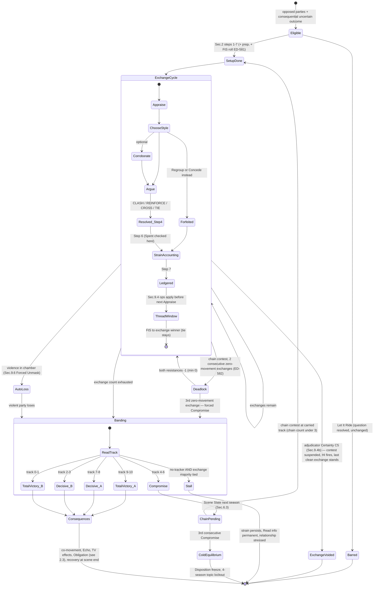
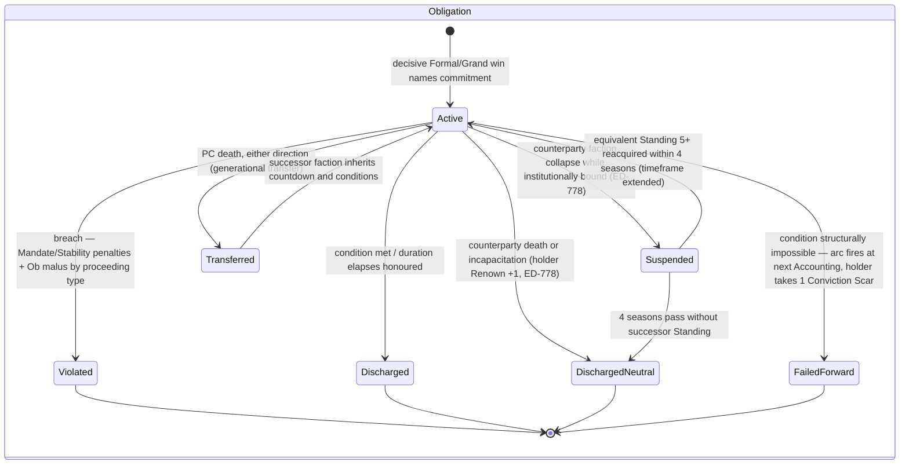

# Social Contest — System Map (flowchart · state graphs · flattened registry)

**Date:** 2026-06-10 · **Companion to:** `designs/audit/2026-06-09-social-contest-comprehensive/ANALYSIS.md` (commit c8394f37)
**Layer charted:** L1 canonical (`social_contest_v30.md` + infill + `params/contest*.md`, patched through ED-864). CR1–CR7 and the groundup engine are *not* charted — they are the replacement, not the live rules.
**Contradiction discipline:** where the canonical record contradicts itself, the map carries **both readings** with the ANALYSIS finding tag (⚠ P1-1, ⚠ P1-2, ⚠ P1-3, ⚠ P2-4…). The map resolves nothing; resolution is D-2/D-3 (Jordan).
**GM-fiat inputs** (engine rules pending at propagation, ANALYSIS §3) are tagged ⚠GM.

---

## 1. FLOWCHART — full procedural flow, all modes

```mermaid
flowchart TD

  subgraph ENTRY["Entry"]
    E0["Contest trigger: opposed parties AND<br/>uncertain, consequential outcome"] --> E1{"Let It Ride:<br/>question already resolved,<br/>circumstances unchanged?"}
    E1 -->|"blocked"| E2["No contest"]
    E1 -->|"clear"| E3{"Mode"}
  end

  E3 -->|"personal TTRPG"| S1
  E3 -->|"faction scale"| BG1
  E3 -->|"hybrid Sec.11"| H1

  subgraph SETUP["Sec.2 Setup (steps 1-7) + Sec.9.1 prep + Sec.5 first-to-speak"]
    S1["Step 1 Adjudicator type fixes Argue attribute:<br/>Expert judge = Cognition / Crowd = Charisma /<br/>No adjudicator = Attunement / Panel = Cognition (ED-137 provisional)"]
    S1 --> S2["Step 2 Primary genre from question shape:<br/>Memory or Projection — ⚠GM (CR4 stasis pending)"]
    S2 --> S3["Step 3 Style bonus dice, fixed at setup:<br/>+1D primary genre, +1D audience-boost match, max +2D<br/>(faction boost table — ⚠ P2-6 struck Niflhel row live;<br/>Guild boost ⚠GM picks)"]
    S3 --> S4["Step 4 Persuasion Track 0-10, start ⚠GM-set (typ 5)<br/>A wins at 7+, B wins at 3-, compromise 4-6<br/>Resistance = avg faction Stability round up, minus 1, min 0<br/>erodes by floor(exchanges/2) per exchange (ED-864)"]
    S4 --> S5["Step 5 Proceeding type sets exchange count,<br/>role structure, resistance modifier<br/>(Formal 3 / Grand 5 / Royal 3 / Tribunal 1-5 /<br/>Guild 3 / Casual 1 / Private 1-3 / Appeal 1)"]
    S5 --> S6["Step 6 Define stakes — ⚠ P3-13 infill-only"]
    S6 --> S7["Step 7 Hidden GM ledger"]
    S7 --> P0{"Preparation available? (Sec.9.1, needs 1h+)"}
    P0 -->|"yes (rushed = TN 8)"| P1["Att + relevant History, TN 7 Ob 1:<br/>Success +1D Exchange 1 /<br/>Overwhelming +1D AND Exchange-1 Appraise at TN 6<br/>+ Findings: +1D each, max +2D (F-TRANS-11)<br/>combined Exchange-1 ceiling +3D"]
    P0 -->|"no"| F1
    P1 --> F1["Sec.5 First-to-speak: both roll Attunement TN 7 Ob 1,<br/>higher net acts LAST (ED-581);<br/>tie = higher stat, then adjudicator assigns"]
  end

  F1 --> X1

  subgraph EXCHANGE["Sec.4 Exchange loop (repeats per exchange)"]
    X1["Step 1 Appraise, both orators<br/>⚠ P1-1 — doc: Attunement alone, TN 7, Ob 1 /<br/>params PP-614: Attunement + Recall, Ob = ceil(opp Cha / 2) min 1<br/>degrees: fail = misleading signal ⚠GM / 1 = axis type /<br/>2 = full boost / 3+ = boost + one detail"]
    X1 --> X2["Step 2 Choose style: genre x orientation, one pick<br/>(style names fork ⚠ P2-5)"]
    X2 --> X2b{"Step 2b Corroborate? (declared coalition member)"}
    X2b -->|"yes — Ob 1 Knot / Ob 2 non-Knot /<br/>Ob 2 disadvantaged (PP-257)"| X2c["success: orator +1D this exchange<br/>failure: corroborator takes 1 strain"]
    X2b -->|"no"| X3
    X2c --> X3["Step 3 Argue, both:<br/>pool = (Primary Attribute x 2) + History (points + 3), TN 7<br/>+ style dice + Recall +2D named citation<br/>(once per source per Grand, ED-617; per-exchange Formal)<br/>+ Findings + Resonant-style +1D + Momentum spend (1 = 1 success, cap 4)<br/>+ Weaving floor(TS/30)D (Sec.9.3 — visible, HI risk, Coherence Ob 1 after)<br/>positional ceiling +5D; pool floor 1D"]
    X3 --> X4{"Step 4 Interaction type"}
    X4 -->|"CLASH — same genre,<br/>opposite orientation"| C1["margin = success difference<br/>track moves (margin - resistance) toward winner if positive<br/>strain to loser = margin + Cha-mod - Focus-def, min 0<br/>⚠ P1-2: Cha-mod 0-2 or 0-6, Focus-def 0-3 or 0-9 (x3 dispute)"]
    X4 -->|"REINFORCE — same/same"| C2["as CLASH; strain base = (margin - 1, min 0)"]
    X4 -->|"CROSS — different genres"| C3["each side floor(successes/2) vs resistance independently<br/>net move = difference; NO strain either way<br/>Obscuring side larger: Doubt Marker instead of movement"]
    X4 -->|"TIE — equal successes"| C4["both take 1 strain (CROSS-tie exempt, PP-236)<br/>track +1 toward first-to-speak holder"]
    C1 --> IW{"Indirect/Obscuring<br/>orientation won?"}
    C2 --> IW
    IW -->|"yes"| C5["no track movement; Doubt Marker on opponent:<br/>-2 on opponent's next winning margin before resistance,<br/>one active at a time, consumed on use<br/>⚠ P3-13 — heading orphaned in skeleton"]
    IW -->|"no"| X6
    C3 --> X6
    C4 --> X6
    C5 --> X6
    XF["Step 5 Forfeit (in place of arguing):<br/>Regroup — no roll, track +1 to opponent, Concentration to max /<br/>Concede a Point — 1 strain, track +1 to opponent, +1D next exchange"]
    XF -. alternative path .-> X6
    X6["Step 6 Strain and resources<br/>Composure = Cha x 3 (+ equipment): strain at threshold = Rattled mark,<br/>reset, excess carries; 2 marks = socially incapacitated<br/>Rattled channel ⚠ P2-4 — doc: +1 Ob per level / params: -1D per level<br/>Knot buffer: redirect damage, +1 strain per use<br/>Concentration = Focus x 3, drains ⚠ P1-2 — doc -3/exchange -3 on loss /<br/>params -1/-1; at 0 = Spent (-2D next exchange, opponent +1D, then reset;<br/>checked after Step 4, penalty applies next exchange)"]
    X6 --> X7["Step 7 GM records exchange on hidden ledger"]
    X7 --> T0{"Thread operation<br/>between exchanges? (Sec.9.4)"}
    T0 -->|"yes"| T1["effects apply before next Appraise; setup dice cannot change<br/>opposing temporal axis ⚠ P1-3 PP-351, three live forms:<br/>doc — TN 8 on both next Read /<br/>extensions — plus-minus 1 Track per co-movement card /<br/>params PP-258 — -1D both Argue this exchange<br/>Adjudicator response Sec.9.4b by Certainty:<br/>C5 corrupted + exchange voided + HI fires ... C2-C0 none<br/>(visibility-gated by TS bands; concealment roll possible)"]
    T0 -->|"no"| T2
    T1 --> T2["First-to-speak transfers to exchange winner; tie stays"]
    T2 --> XD{"Exchanges remain?<br/>(violence = Sec.9.6 Forced Unmask auto-loss;<br/>chain Deadlock ED-582: 2 zero-move exchanges =<br/>resistance -1 both, 3rd = forced Compromise)"}
    XD -->|"yes"| X1
    XD -->|"no"| R1
  end

  subgraph ASYM["Sec.7 Asymmetric overlays (modify EXCHANGE when active)"]
    A0["All asymmetric: roles fixed, no alternation;<br/>disadvantaged party halves resistance (round up);<br/>advantaged side takes 0 CROSS strain"]
    A1["Sec.7.1 Tribunal — gates: CI 40+, Church Mandate 4+,<br/>Evidence 3+ OR Obligation violation OR 2 convictions;<br/>track starts at 7; no accused corroboration;<br/>1-3 exchanges (Inquisitor); counter = prevent filing (Stay, CI under 55)"]
    A2["Sec.7.2 Succession — claimants Standing 5+<br/>(cross-faction: Mandate 3+ AND structural claim);<br/>Decisive = single leader / Compromise = faction split Sec.7.2.1<br/>(track 4 = 60-40, 5 = 55-45, 6 = 50-50; stats floored;<br/>Stability floor 3; territory and treaty split) /<br/>Total Victory = unified + free Wager extraction"]
    A3["Sec.7.3 Heresy Investigation — Initiation 1 season,<br/>Investigation 2-4 (one mandatory Zoom-In per season), Verdict 1;<br/>8 closure conditions; one active per target per jurisdiction"]
  end
  A0 -.-> X4

  subgraph POST["Sec.6 Post-contest resolution"]
    R1["Reveal ledger; band the final track:<br/>7+ = A wins / 3- = B wins / 4-6 = compromise ⚠GM narration<br/>no tracker (private): exchange majority;<br/>tie = stall — strain persists, Read info permanent"]
    R1 --> R2["Thread co-movement by winning genre:<br/>Memory — retention shift, MS +1 /<br/>Projection — +1D first matching Domain Action, conditional MS +1"]
    R2 --> R3{"Decisive (7+ / 3-)?"}
    R3 -->|"yes"| R4["Domain Echo: Memory — faction Mandate +1 in cited domain /<br/>Projection — the +1D anchor"]
    R3 -->|"compromise"| R8
    R4 --> R5{"Total Victory (9+ / 1-)?"}
    R5 -->|"yes"| R6["loser: Contest Fatigue (-1D next social, 1 per session)<br/>winner: +1 Momentum (cap 4)<br/>Disposition shift all witnesses; Reputation shift ⚠GM magnitude<br/>BG mode: losing dominant faction Mandate -1"]
    R5 -->|"no"| R7
    R6 --> R7["Obligation on decisive Formal/Grand (Sec.6.1):<br/>duration and violation by proceeding type;<br/>settlement-targeted variant (C-08);<br/>Wager (Grand + Projection + Consequence style; verifiable,<br/>achievable, time-bound; ED-778 edge cases; ⚠GM partial-met)<br/>NPC priority tree: violating actions blocked<br/>unless Survival priority (Stability 2-)"]
    R8["Chain Contest (Sec.6.3): Scene Slate entry next season,<br/>follow-up starts at carried track position, Scars persist;<br/>3rd consecutive Compromise = cold equilibrium<br/>(Disposition freeze, 4-season topic lockout)"]
    R7 --> R9["Conviction Scar visibility signal (Sec.6.2) if Scar produced<br/>Recovery: strain, Concentration, Spent clear at scene end;<br/>Rattled clears 1 mark per non-social scene"]
    R8 --> R9
  end

  subgraph BGV["Sec.10 BG Parliamentary Vote"]
    BG1["Setup: factions declare Side A / Side B / Abstain;<br/>each side one genre; resistance = 0, +1 per Stability-6+ abstainer,<br/>max +2 ⚠ P2-7 scale-fragile;<br/>start 5 plus-minus lobby offset, clamped 4-6 (ED-621)"]
    BG1 --> BG2["Pool = sum of side Mandate, TN 7<br/>+1D genre matches question; +1D genre matches dominant-faction boost<br/>(no orientation boost — public voting)"]
    BG2 --> BG3["each side: movement = successes - resistance if positive;<br/>net = difference; 0-0 = committee<br/>7+ pass / 3- fail / 4-6 committee<br/>no thread consequences at BG scale<br/>Total Victory: losing dominant faction Mandate -1 one season"]
    BG3 --> BG4{"Motion is a Parliamentary Stay? (Sec.10.1)<br/>2+ factions vs Church AND CI under 55"}
    BG4 -->|"pass"| BG5["Tribunal filing suspended 1 season<br/>(re-file next season allowed; fail = no re-file this season)"]
  end

  subgraph HYB["Sec.11 Hybrid"]
    H1["one BG round (Sec.10); offset clamped to 4-6 (PP-256) —<br/>BG layer cannot produce final resolution"] --> H2["TTRPG contest runs from adjusted start;<br/>thread consequences may fire"]
  end
  H2 --> X1
```



---

## 2. STATE GRAPHS

### 2.1 Contest lifecycle (the bout itself)



### 2.2 Orator resource machine (concurrent regions, per orator)

```mermaid
stateDiagram-v2
    state OratorResources {
        state ComposureTrack {
            [*] --> Composed
            Composed --> Composed : strain accrues under Composure (Cha x 3 + equipment)
            Composed --> Rattled_1 : strain reaches Composure — mark, reset, excess carries
            Rattled_1 --> Rattled_2 : threshold reached again
            Rattled_2 --> Rattled_1 : 1 full non-social scene
            Rattled_1 --> Composed : 1 full non-social scene
            Rattled_2 : socially incapacitated — no formal social scenes
        }
        --
        state ConcentrationTrack {
            [*] --> Full
            Full --> Draining : per exchange (P1-2 — doc -3/-3 vs params -1/-1)
            Draining --> Full : Regroup forfeit (restore to Focus x 3)
            Draining --> Spent : reaches 0 (checked after Step 4)
            Spent --> Full : penalty exchange resolves (-2D self, +1D opponent), reset
        }
        --
        state DoubtMarkerSlot {
            [*] --> Clear
            Clear --> Marked : Indirect/Obscuring win against this orator
            Marked --> Marked : new marker replaces old (one active)
            Marked --> Clear : consumed — -2 on next winning margin pre-resistance
        }
        --
        state MomentumStore {
            [*] --> Zero
            Zero --> Holding : Belief-aligned exchange win (max 1 per contest) or Total Victory award
            Holding --> Holding : accrual to cap 4
            Holding --> Zero : spent on Argue (1 = 1 auto-success, any amount)
        }
    }
    note right of OratorResources : Rattled penalty channel is P2-4 — doc +1 Ob per level vs params -1D per level. Both Rattled and Spent active = cumulative; pool floor 1D. All strain, Concentration, Spent clear at scene end; Composure restores fully at scene change.
```



### 2.3 Persistent consequence objects (outlive the contest)



```mermaid
stateDiagram-v2
    state HeresyInvestigation {
        [*] --> Initiation : Inquisitor rank 2+ files (rank 3+ for Standing 4+ targets)
        Initiation --> InvestigationProper : 1 season, not withdrawn
        Initiation --> ClosedWithdrawn : Inquisitor withdraws (Disposition -1 with Cardinal Justice risk)
        InvestigationProper --> VerdictPhase : declared 2-4 seasons elapse (1 mandatory Zoom-In Interrogation per season)
        InvestigationProper --> StaySuspended : Parliamentary Stay passes (CI under 55) — 1 season per Stay
        StaySuspended --> InvestigationProper
        InvestigationProper --> InquisitorGap : Inquisitor death or reassignment
        InquisitorGap --> InvestigationProper : Cardinal Justice re-staffs within 2 seasons (target Disposition +1)
        InquisitorGap --> ClosedDefault : 2 seasons unstaffed — Acquittal-by-default
        InvestigationProper --> ClosedOther : Inquisitor demoted / target death / defection / faction conversion
        VerdictPhase --> Acquitted : rehabilitation, Renown +1 non-Church; re-file needs fresh Evidence
        VerdictPhase --> SuspendedInsufficient : may resume if Evidence reaches 3 within 4 seasons
        VerdictPhase --> TribunalRecommended : escalates to Sec.7.1 Excommunication Tribunal
        TribunalRecommended --> [*]
        Acquitted --> [*]
        ClosedWithdrawn --> [*]
        ClosedDefault --> [*]
        ClosedOther --> [*]
    }
```

---

## 3. FLATTENED REGISTRY — inputs · calculations · gates · sequences · outputs

### 3.1 Inputs

| # | Input | Kind | Consumed by | Source / notes |
|---|---|---|---|---|
| I-01 | Cognition / Charisma / Attunement (1–7) | base parameter | Argue pool (by adjudicator type, §3) | character sheet |
| I-02 | Focus (1–7) | base parameter | Concentration, Focus-defence | character sheet |
| I-03 | Recall (1–7) | base parameter | Recall +2D citation; Appraise pool under PP-614 (⚠ P1-1); coalition Concentration (⚠ P2-8) | character sheet |
| I-04 | History points (relevant) | accumulator | Argue bonus = points + 3; prep pool | character sheet |
| I-05 | Equipment (attire, regalia) | flat modifier | Composure additive | §4 Step 6 |
| I-06 | Beliefs (stated) | declaration | Momentum on aligned win (§9.5, max 1/contest) | character sheet |
| I-07 | Momentum bank (0–4) | resource | auto-successes on Argue | core engine §1.7 |
| I-08 | Thread Sensitivity (TS) | stat | Weaving dice ⌊TS/30⌋ (§9.3); visibility bands (§9.4b); Thread Insight (§9.7) | threadwork |
| I-09 | Knots | relationship | corroboration Ob 1; Composure buffer (+1 strain/use) | character web |
| I-10 | Standing (faction) | stat | Succession claimant gate ≥ 5; HI targeting rank gate | faction layer |
| I-11 | NPC Conviction + Scar count | NPC state | Resonant-style targeting; Scar production; arc transitions | npc_behavior §3.3–3.4 |
| I-12 | Adjudicator type | context | primary attribute; asymmetric role structure | ⚠GM assigns; fixed per contest |
| I-13 | Question shape | context | primary genre Memory/Projection | ⚠GM (CR4 stasis pending) |
| I-14 | Proceeding type | context | exchange count, roles, resistance modifier, Obligation table row | §2 Step 5 |
| I-15 | Dominant-faction boost | faction state | +1D audience-boost match (one axis per faction) | §2 Step 3 table (⚠ P2-6) |
| I-16 | Faction Stability | faction stat | audience resistance; BG abstainer resistance; NPC Survival gate ≤ 2; collapse triggers | faction layer |
| I-17 | Faction Mandate | faction stat | BG vote pool Σ; Tribunal gate ≥ 4; Succession cross-faction gate ≥ 3; Echo/violation deltas | faction layer |
| I-18 | Church Influence (CI) | clock 0–100 | Tribunal gate ≥ 40; Stay gate < 55; ⌊CI/20⌋ vote bonus; consequence deltas | church layer |
| I-19 | Evidence Track (target) | clock | Tribunal prerequisite ≥ 3; Findings citation source; HI resume gate | investigation |
| I-20 | Findings (completed fieldwork) | tokens | +1D each, max +2D, Exchange 1 (F-TRANS-11); scope relevance ⚠GM | fieldwork §2.3/§4.1 |
| I-21 | Preparation time | context | prep roll availability; < 1h → TN 8 | §9.1 |
| I-22 | Diplomacy actions (prior season) | BG action | lobby offset ±1 each, clamped 4–6 (ED-621) | §10 setup |
| I-23 | Adjudicator Certainty (C0–C5) | NPC state | Thread-response row (§9.4b) | npc_behavior |
| I-24 | Obligation / conviction history | record | Tribunal prerequisite alternates; ED-778 edge triggers | clock registry |
| I-25 | Chain count (0–3) | counter | Deadlock applicability; cold-equilibrium trigger | §6.3 |
| I-26 | Coherence | resource | post-Weaving check Ob 1 (§9.3) | threadwork |

### 3.2 Calculations

| # | Quantity | Formula (canonical text) | Range | Flag |
|---|---|---|---|---|
| C-01 | Argue pool | (Primary Attribute × 2) + History (points + 3), TN 7 | 5–17 base; 12–18D practical with stack | — |
| C-02 | Appraise pool / Ob | doc: Attunement alone, TN 7, Ob 1 · params PP-614: Att + Rec, Ob = ⌈opp Cha ÷ 2⌉ min 1 | 1–7 vs 2–14 | ⚠ P1-1 |
| C-03 | Composure | Charisma × 3 (+ equipment flat) | 3–21 | (stale Cha+6 fossils, P3-14) |
| C-04 | Charisma modifier | max(0, ⌊(Cha − 3) ÷ 2⌋) — doc §8 adds × 3 | 0–2 vs 0–6 | ⚠ P1-2 |
| C-05 | Focus defence | ⌊Focus ÷ 2⌋ — doc §8 adds × 3 | 0–3 vs 0–9 | ⚠ P1-2 |
| C-06 | Concentration max / drain | Focus × 3; drain per exchange doc −3 (−3 on loss) vs params −1 (−1) | 3–21 | ⚠ P1-2 |
| C-07 | CLASH strain | margin + Cha-mod (winner) − Focus-def (loser), min 0 | — | inherits P1-2 |
| C-08 | REINFORCE strain | (margin − 1, min 0) + Cha-mod − Focus-def, min 0 | — | inherits P1-2 |
| C-09 | CROSS effective margin | ⌊successes ÷ 2⌋ per side, independent vs resistance | — | — |
| C-10 | Track movement (CLASH/REINF) | margin − resistance, if positive, toward winner | — | — |
| C-11 | Track movement (CROSS) | net = difference of the two (eff margin − resistance) movements | — | — |
| C-12 | Resistance (TTRPG) | ⌈avg faction Stability⌉ − 1, min 0; erosion − ⌊exchange_count ÷ 2⌋ (ED-864) | typ 0–2 | — |
| C-13 | Resistance (BG) | 0 + 1 per Stability-≥6 abstainer, max +2 | 0–2 | ⚠ P2-7 scale-fragile |
| C-14 | BG pool | Σ Mandate of side's factions, TN 7 (+1D genre, +1D boost) | ~5–20D | — |
| C-15 | Weaving dice | ⌊TS ÷ 30⌋ D (TS ≥ 30) | +1..+3D | — |
| C-16 | CI vote bonus | ⌊CI ÷ 20⌋ (Stay context — why ≥ 55 is unpassable) | 0–5 | — |
| C-17 | Style dice | +1D primary genre, +1D boost match; cap +2D, fixed at setup | 0–2D | — |
| C-18 | Doubt Marker effect | −2 on next winning margin, before resistance, min 0 | — | — |
| C-19 | Rattled penalty | doc: +1 Ob per level (cumulative) · params: −1D per level (Decision-B/PP-716) | — | ⚠ P2-4 |
| C-20 | Prep result | Success +1D Ex1 · Overwhelming +1D AND Ex1 Appraise TN 6; rushed TN 8 | — | — |
| C-21 | Findings bonus | +1D per Finding, max +2D; stacks with prep to +3D Ex1 ceiling | 0–2D | — |
| C-22 | Momentum spend | 1 Momentum = 1 automatic success, any amount pre-roll | cap 4 | — |
| C-23 | Coalition Concentration | shared Σ(Focus + Recall) at setup; −1 per exchange (+1 on loss) | — | ⚠ P2-8 vs ED-694 |
| C-24 | Succession split | Track 4 → 60/40, 5 → 55/45, 6 → 50/50; stats ⌊orig × ratio⌋; Stability floor 3 | — | — |
| C-25 | Positional stack ceiling | +5D total positional bonuses; pool floor 1D | — | extensions |
| C-26 | Temporal-axis-conflict effect | TN 8 both next Read (doc) · ±1 Track per co-movement card (extensions) · −1D both Argue (params PP-258) | — | ⚠ P1-3 |

### 3.3 Gates

| # | Gate | Condition | Pass effect / fail effect | Source |
|---|---|---|---|---|
| G-01 | Contest initiation | opposed parties AND uncertain consequential outcome | contest opens / no roll | §1 |
| G-02 | Let It Ride | question previously resolved, circumstances unchanged | re-contest barred | §1 |
| G-03 | Style cap | genre + boost dice | hard cap +2D | §2 Step 3 |
| G-04 | Recall citation | specific, named, verifiable claim; Grand: once per source (ED-617) | +2D / no bonus | §4 Step 3 |
| G-05 | Corroboration eligibility | declared coalition member; Knot → Ob 1, else Ob 2; disadvantaged Ob 2 | +1D on success / 1 strain corroborator | PP-257 |
| G-06 | Weaving | TS ≥ 30, active Thread contact, declared pre-roll | +⌊TS/30⌋D, visible, HI exposure, Coherence Ob 1 after | §9.3 |
| G-07 | CROSS no-strain | interaction = CROSS (tie included, PP-236) | no strain either side | §4 Step 4 |
| G-08 | Doubt slot | one active marker | new replaces old; consumed on use | §4 |
| G-09 | Spent trigger | Concentration = 0 (checked post-Step 4) | −2D next exchange, opponent +1D, reset | §4 Step 6 |
| G-10 | Rattled trigger | strain ≥ Composure | mark, reset, excess carries | §4 Step 6 |
| G-11 | Incapacitation | 2 Rattled marks | no formal social scenes until recovered | §4 Step 6 |
| G-12 | Momentum cap | bank ≤ 4 | excess lost | core §1.7 |
| G-13 | Belief Momentum | aligned exchange win | +1 Momentum, max 1 per contest | §9.5 |
| G-14 | Pool floor | all penalties applied | minimum 1D | core engine |
| G-15 | Positional ceiling | stacked positional bonuses | cap +5D | extensions |
| G-16 | Forced Unmask (violence) | violence in chamber | violent party auto-loses (monster incursion = postponement) | §9.6 / infill |
| G-17 | Stalemate Forced Unmask | PP-255 10-exchange cap | loser = nearer losing threshold (⚠ P3-10 unreachable; ⚠ P3-11 name collision) | PP-255 |
| G-18 | Deadlock | chain contest, 2 consecutive zero-movement exchanges | resistance −1 both; 3rd → forced Compromise | ED-582 (⚠ P3-15 vs ED-864) |
| G-19 | Chain cap | 3 consecutive Compromises | cold equilibrium: Disposition freeze, 4-season lockout | §6.3 |
| G-20 | Obligation creation | Decisive win in Formal or Grand | binding commitment, clock opens | §6.1 |
| G-21 | Wager validity | Grand + Projection genre + Consequence style; verifiable, achievable, time-bound | Wager form allowed | §6.1 |
| G-22 | NPC Obligation block | NPC action would violate active Obligation | blocked unless Survival priority (Stability ≤ 2) | §6.1 |
| G-23 | Tribunal prerequisites | CI ≥ 40 AND Church Mandate ≥ 4 AND (Evidence ≥ 3 OR violation OR 2 convictions) | filing allowed | §7.1 |
| G-24 | Stay availability | 2+ factions vs Church AND CI < 55 | motion possible; ≥ 55 effectively unpassable (C-16) | §10.1 |
| G-25 | Succession claimant | Standing ≥ 5; cross-faction also Mandate ≥ 3 + structural claim | eligible | §7.2 |
| G-26 | Asymmetric strain shield | advantaged side in asymmetric proceeding | 0 strain from CROSS | §7 |
| G-27 | Adjudicator response | Certainty row C5..C0 + visibility (TS band) + concealment roll | corrupted/irregular/noted/none | §9.4b |
| G-28 | Thread-consequence scale gate | BG Parliamentary Vote | no thread consequences (personal-scale argument required) | §10 |
| G-29 | Lobby clamp | BG / Hybrid start offset | clamped to track 4–6 | ED-621 / PP-256 |
| G-30 | HI uniqueness | one active Investigation per target per jurisdiction | second filing waits or consolidates | §7.3.3 |
| G-31 | Findings cap | citations at setup, scope-relevant (⚠GM) | +2D max regardless of count | §9.1 |
| G-32 | Tribunal corroboration bar | accused in Tribunal | no corroboration | §7.1 |

### 3.4 Sequences (hard ordering rules)

| # | Sequence | Order | Timing constraints |
|---|---|---|---|
| Q-01 | Setup | adjudicator → genre → style dice → track/resistance → proceeding → stakes (⚠ P3-13 infill) → ledger | all fixed before Exchange 1; no mid-contest changes to setup dice |
| Q-02 | First-to-speak | rolled once (Exchange 1) → transfers to each exchange winner; tie stays | higher net acts LAST (information advantage) |
| Q-03 | Exchange | Appraise → Choose → Corroborate → Argue → Resolve → Strain/Resources → Ledger | FtS holder declares and rolls first within Argue |
| Q-04 | Spent timing | Concentration checked after Step 4 | penalty applies to the NEXT exchange; reset after penalty exchange |
| Q-05 | Doubt consumption | applied to opponent's next WINNING exchange, before resistance | one slot; replacement allowed |
| Q-06 | Thread window | between exchanges only | effects land before next Appraise; setup dice immutable (⚠ P1-3 effect form) |
| Q-07 | Resistance erosion | per exchange, −⌊count/2⌋ | applies to all interaction types (ED-864) |
| Q-08 | Post-contest | reveal → band → co-movement → Echo (decisive) → TV effects → Obligation → chain check → Scar signal → recovery | recovery at scene end; Rattled per non-social scene |
| Q-09 | Hybrid | one BG round → clamp offset 4–6 → full TTRPG contest | BG layer can never finalize (PP-256) |
| Q-10 | HI lifecycle | Initiation (1s) → Investigation (2–4s, 1 Zoom-In/season) → Verdict (1s) | closures interruptible at any phase (8 conditions) |
| Q-11 | Chain cadence | Compromise → Scene Slate next season → follow-up at carried track | strain/Concentration reset between; Scars and Disposition carry |

### 3.5 Outputs

| # | Output | Receiving system | Trigger |
|---|---|---|---|
| O-01 | Persuasion Track final band | contest resolution | count exhausted / early end |
| O-02 | Strain, Rattled marks, Spent | character state (scene-scoped) | exchange accounting |
| O-03 | Doubt/Suspicion marker | opponent state | Indirect/Obscuring win |
| O-04 | Disposition shifts | NPC web | Total Victory (all witnesses); chain carry; HI delays |
| O-05 | Reputation shift | character | Total Victory (⚠GM magnitude) |
| O-06 | Contest Fatigue | loser (session-scoped) | Total Victory |
| O-07 | Momentum +1 | winner bank | Total Victory; Belief alignment |
| O-08 | MS ±1 | threadwork (Mending Stability) | co-movement by genre; ceiling 100, MS=0 lockout |
| O-09 | +1D Domain Action anchor | faction action layer | Projection win / Echo |
| O-10 | Faction Mandate ± | faction layer | Memory Echo +1; TV BG −1; Obligation violations −1/−2; Tribunal rows |
| O-11 | Obligation clock | clock registry | decisive Formal/Grand (G-20); ED-778 edge transitions |
| O-12 | Conviction Scar (+ visibility signal) | npc_behavior | decisive Resonant-targeted outcome; Wager fail-forward |
| O-13 | Faction split (stats, territory, treaties, identity) | faction + territory layers | Succession Compromise (§7.2.1) |
| O-14 | CI ± | church layer | Tribunal success +4/+3; Contrition −1 |
| O-15 | Standing −2, Parliamentary exclusion | player faction surface | PC excommunication |
| O-16 | Renown +1 | reputation surface | ED-778 neutral discharge; HI acquittal |
| O-17 | Heresy acceleration / Excommunication state | church pipeline | Church-Tribunal Obligation violation; Verdict escalation |
| O-18 | Stay suspension (1 season) | Tribunal pipeline | §10.1 pass |
| O-19 | Scene Slate entry | player_agency §4.2 | Compromise (chain) |
| O-20 | Cold equilibrium (freeze + 4-season lockout) | relationship/topic state | 3rd consecutive Compromise |
| O-21 | Permanent Read knowledge | epistemic state | private-negotiation stall |
| O-22 | HI filing / Investigation events | church pipeline | Weaving observed (G-06); C5 response (G-27) |
| O-23 | NPC strategy constraint | NPC priority tree | active Obligation (G-22) |

---

## Trail

[READ: this session — sources per ANALYSIS.md §8; no new fetches required for the map (all values from the in-session full reads of social_contest_v30 + infill + params/contest + extensions)]
[ASSUMPTION: mermaid renders unvalidated here — syntax linted (fences, quote parity, edge syntax) but not rendered; first render in the repo viewer is the visual check]
[CONFIDENCE: high — every node/row traces to canonical text already cited in ANALYSIS.md; contradicted values carried dual, never resolved]
