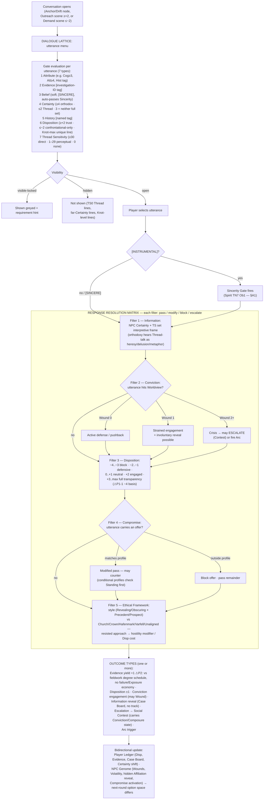

# System Map — Fieldwork / Investigation / Exploration / Socializing

**Date:** 2026-06-10 · **Session:** audit | ef659454b0c8 · **Companion to:** `00_MASTER.md`, `resolution_diagnostic_fieldwork.md`, `ners_verdict_fieldwork.md` (this folder)
**Sources (full reads this session):** `designs/scene/fieldwork_v30.md` §1–§7 (+infill §3.2/§5.2), `designs/scene/investigation_systems_v30.md` (all four systems), `params/fieldwork.md`, `params/core.md` (engine), `tests/sim/fieldwork_lifecycle_stress_01/`. Every value below is verbatim from those files.
**Contested-value convention:** where the canonical record is split (audit P1-1/P1-2), nodes carry **⚠P1-n** with the master line first and the params/PP-632 line in brackets. This map renders canon *as it stands*, split included — it does not resolve Jordan's open decision points (`00_MASTER §6`).

---

## §A Flowcharts

### §A1 — Rolling-action pipeline (Explore / Investigate / Social / Thread-Read)

```mermaid
flowchart TD
    SLATE["Scene Slate / Zoom-In trigger<br/>(investigation_systems: 20–30 graph templates)"] --> ENTRY["Enter scene graph at entry node<br/>4–5 / 6–7 / 8–9 nodes by threshold 3/5/8"]
    ENTRY --> BUDGET["Scene time budget = 3 standard<br/>± Stamina/Wounds (player_agency)<br/>node interaction = 1 · move >2 nodes = +1<br/>guarded transitions may cost Exposure"]
    BUDGET --> DECLARE["Declare action + intent<br/>(activity & sub-type per §2.1 table)"]

    DECLARE --> PG{"Perception gate met?<br/>D1: Cog≥2/local Hist · D2: Cog≥3 or Att≥3<br/>D3: TS≥10 (expl/inv) or Disposition gate (social)<br/>D4: TS≥30 · D5: TS≥50 + Coherence chk Ob2"}
    PG -->|"no — HARD gate (P-08): cannot attempt"| BLOCKED["Ontologically unavailable<br/>no roll, no retry by effort"]
    PG -->|yes| SOCGATE{"Social action with<br/>instrumental intent?<br/>(Lattice tag [INSTRUMENTAL])"}

    SOCGATE -->|yes| SIN["Sincerity Gate: bare Spirit · TN7 · Ob1<br/>F: no Disp gain, may −1 · P: no Momentum<br/>S: normal · O: normal + Belief-revision mark<br/>([SINCERE]/Belief-gated bypasses)"]
    SIN --> POOL
    SOCGATE -->|no| POOL

    subgraph PB["Pool assembly — params: min 5D, max 24D"]
        POOL["Pool = (Primary Attribute × 2) + History bonus<br/>History bonus = relevant pts + 3 (no Hist → +3)<br/>one History per action, narratively defensible"]
        POOL --> TR{"Thread-Read?"}
        TR -->|yes| TPS["+ TPS = TS ÷ 10 (floor)<br/>(Spirit×2)+Hist+TPS per PP-619/626<br/>⚠P1-2 params/split still say Attunement×2"]
        TR -->|no| WND
        TPS --> WND{"Physical action?<br/>(Endurance-explore, Surveil)"}
        WND -->|yes| WPEN["−1D per wound (cumulative)<br/>⚠RD-1: continuous engine unlanded<br/>ER-2 term below ~5D"]
        WND -->|no| OBA
        WPEN --> OBA
    end

    subgraph OB["Ob assembly — floor 1, engine cap 20"]
        OBA["Base Ob by Depth: 1/2/3/5/8 (D1–D5)"] --> OBM["Modifiers: hostile fac +1 · foreign +1<br/>allied −1 · local resident −1<br/>Calamity: +1 per MS band <60 at Prox ≤2<br/>active Heresy Investigation +1 (Thread topics)"]
        OBM --> OBD["Disposition effect ⚠P1-1:<br/>master §5.1 stepped: −3→+3Ob … +2/+3→−1 … +4/+5→−2<br/>[params PP-632: effOb = max(1, base − Disp); Impress exempt]"]
        OBD --> OBC["+ Concealment Ob (contested only):<br/>opponent rolls Cog×2+Hist, net = added Ob<br/>per scene; absent concealer → 0"]
        OBC --> OBI["Inspiration spend: −1 Ob (min 1)<br/>Rattled marks: +1 Ob each (social, scene)"]
    end

    OBI --> TN{"TN select"}
    TN -->|"Controlled (unhurried + prep)"| T6["TN 6 · EV +0.5/die"]
    TN -->|Standard| T7["TN 7 · EV +0.4/die"]
    TN -->|"Desperate / duress / Calamity<br/>or Desperate Trail active"| T8["TN 8 · EV +0.3/die"]

    T6 --> ENG
    T7 --> ENG
    T8 --> ENG
    ENG["ENGINE (params/core)<br/>TTRPG: d10 pool, net = successes − 1s, face 10 = +2 flat (no chain, PP-246)<br/>Godot Decision E: Normal(EV·N, ~0.8√N), validated 5–17D<br/>⚠RD-5: §10.5 still specifies d10-face UI"]

    ENG --> DEG{"Degree<br/>(net vs Ob)"}
    DEG -->|"net < Ob"| DF["Failure"]
    DEG -->|"net = Ob"| DP["Partial"]
    DEG -->|"net > Ob"| DS["Success"]
    DEG -->|"net ≥ 2×Ob AND net ≥ 3"| DO["Overwhelming"]

    DF --> ROUTER
    DP --> ROUTER
    DS --> ROUTER
    DO --> ROUTER

    ROUTER["OUTPUT ROUTER — per-action consequence table"] --> RE["Explore §3.2: F nothing +1 Exp ·<br/>P located unclear · S full +1 info ·<br/>O +hidden feature +1 Momentum"]
    ROUTER --> RI["Investigate §4.2: Evidence +0/+1/+2/+3 ·<br/>Exposure +2/+1/+0/−1 · F may yield false lead ·<br/>O +1 Momentum ⚠P2-12: §6.3 says F +1 (+2 only D≥3)"]
    ROUTER --> RS["Social §5.2: Disposition −1/+0/+1/+2 ·<br/>F: +1 Exp + same-action scene lockout ·<br/>S/O: info at new gate level · O Belief-aligned +1 Momentum"]
    ROUTER --> RT["Thread-Read §4.5: Evidence per §4.2 ·<br/>co-movement fires (temporal/epistemic/actualized) ·<br/>Coherence 0 (≤Personal) / −1 (Relational+) · +1 Exposure"]

    RE --> TRACKS
    RI --> TRACKS
    RS --> TRACKS
    RT --> TRACKS

    TRACKS["TRACK UPDATES + THRESHOLD CHECKS"]
    TRACKS --> EXPCHK{"Exposure vs Cover thresholds<br/>(per territory)"}
    EXPCHK -->|"≥ Compromised"| COMP["Scene ENDS · leave or go to ground 1 scene<br/>all territory NPC Disp −1 · investigations +2 Ob<br/>Church terr: +1 Attention immediately (cap +1/char/season)"]
    EXPCHK -->|"≥ Watched"| WATCH["Dominant faction may respond<br/>Church: HI eligible · +1 Attention next Accounting"]
    EXPCHK -->|"≥ Noticed"| NOTE2["+1 Ob all fieldwork here rest of season<br/>NPCs Disp ≤0 become aware"]
    TRACKS --> EVCHK{"Evidence ≥ threshold?"}
    EVCHK -->|yes| RECON["Reconstruct unlocked at Ob 1<br/>(see state graph: false/partial/Finding)"]
    TRACKS --> DTCHK{"3 consecutive net ≤ 0<br/>on same investigation?"}
    DTCHK -->|yes| DT["DESPERATE TRAIL: TN→8<br/>infill: Exposure doubled + GM complication<br/>clears on S/O or season change"]
    TRACKS --> XSYS["Cross-system feeds:<br/>Domain Echo (±2/season cap, scene/Accounting timing) ·<br/>Contest escalation (Disp→track offset ±1 per 2, cap ±2<br/>⚠P2: 'Piety' wording; Conviction is the personal track) ·<br/>Combat interrupt (resolve current action; Exp≥Noticed → foe +1D) ·<br/>Arc triggers · NPC-learns-investigated (a/b/c §2.5)"]
```

### §A2 — Dialogue pipeline (Lattice → Five-Filter Matrix)

---

## §B Comprehensive state graph

```mermaid
stateDiagram-v2
    state "EXPOSURE — per territory, resets each season (§6)" as EXP {
        [*] --> LowProfile
        LowProfile --> Noticed: Exposure ≥ Noticed(Cover)
        Noticed --> Watched: ≥ Watched(Cover)
        Watched --> Compromised: ≥ Compromised(Cover)
        Compromised --> LowProfile: leave territory / go to ground 1 scene
        Watched --> Noticed: reduction below threshold
        Noticed --> LowProfile: reduction below threshold
        note right of Noticed
            +1 Ob all fieldwork here, rest of season
            NPCs at Disp ≤ 0 aware of activities
        end note
        note right of Watched
            faction response eligible (Church HI / Crown / Varfell)
            Church-influence terr: +1 Attention next Accounting
        end note
        note right of Compromised
            scene ends; all territory NPC Disp −1
            investigations here +2 Ob until reset
            +1 Attention immediate (cap +1/char/season;
            §6.5 ⚠P3: params also carry +2/territory cap)
            cover identity blown on any Compromised
        end note
        note left of LowProfile
            Sources: fail expl/inv +1 (+2 at D≥3) · Thread-Read +1
            sensitive at D3+ POI +1 · Surveil +2 · fail social @Disp≤0 +1
            hostile territory +1/scene · conspicuous +1 · [Niflhel +2 — struck, ED-894]
            Reduction: concealment roll −2 · cover identity −1/scene ·
            faction support −2/season · leave / season → 0
        end note
    }

    state "INVESTIGATION — one track per question, persistent (§4)" as INV {
        [*] --> Open: GM sets threshold 3/5/8 (hidden unless institutional ⚠P2-11 vs Case Board legibility)
        Open --> Open: action degree → Evidence +0/+1/+2/+3
        Open --> DesperateTrail: 3 consecutive net ≤ 0
        DesperateTrail --> Open: Success/Overwhelming (TN→7, Exposure normalises)
        DesperateTrail --> Open: season change
        Open --> AtThreshold: Evidence ≥ threshold
        DesperateTrail --> AtThreshold: Evidence ≥ threshold
        AtThreshold --> FalseConclusion: Reconstruct Failure (plausible, GM-concealed)
        AtThreshold --> PartialPicture: Reconstruct Partial (what right, why/who gap)
        AtThreshold --> Finding: Reconstruct Success / Overwhelming
        PartialPicture --> Finding: follow-up Reconstruct Ob 1
        FalseConclusion --> Open: contradicted by later evidence → reopen
        Finding --> Open: reopen at greater depth (depth-limited resolution)
        note right of DesperateTrail
            TN 8 · infill: Exposure doubled on fails + GM complication
            ~20% Success at 5D floor → 3–4 fails force Compromised ejection
        end note
        note right of Finding
            reliability = weakest constituent (Derived)
            Overwhelming: highest tag + unstated implication + 1 Momentum
            faction-scope Findings fire Domain Echo (end of scene / next Accounting)
        end note
    }

    state "DISPOSITION — per NPC↔PC, ceiling = Bonds ⚠P1-1 (master −3..+5; params −4..Bonds; inv_sys −4..floor(Bonds/2)+1)" as DISP {
        [*] --> Neutral: start = faction alignment ± personal ± Reputation · Gift/Bribe +1 pre-first-action (rejected ≤ −2 ⚠params ≤ −3)
        Hostile --> Suspicious: +1
        Suspicious --> Wary: +1
        Wary --> Neutral: +1
        Neutral --> Interested: +1
        Interested --> Friendly: +1
        Friendly --> Trusting: +1
        Trusting --> Devoted: +1
        Devoted --> Bonded: +1
        Bonded --> Devoted: −1
        Devoted --> Trusting: −1
        Trusting --> Friendly: −1
        Friendly --> Interested: −1
        Interested --> Neutral: −1
        Neutral --> Wary: −1
        Wary --> Suspicious: −1
        Suspicious --> Hostile: −1
        note right of Bonded
            shift by degree: F −1 (+1 Exp, scene lockout) · P 0 · S +1 · O +2
            decay: ≥ +3 −1/season unmaintained; ≤ +2 stable (⚠P3 params: > +2)
            ≤ −2: recovery needs significant narrative event before social actions
            Knot break → +2 or current −2 (floor −3; dead §3.5 cite)
            public-citation rupture → −4 (below master's own floor ⚠P1-1)
            ceiling: Bonds 1→+1 … 5→+5 (Knot candidacy)
            Ob effect per band: see §A1 OBD (stepped vs subtraction ⚠P1-1)
            gates: +1 Settled · +2 Hidden · +3 Buried · +4 Liminal
        end note
    }

    state "KNOT — per pair · master strain model ED-773 ⚠P1-1 (params PP-632: Mitsein tier-cost, any character, TS not required)" as KNOT {
        [*] --> NoKnot
        NoKnot --> EligibleScene: 5 prereqs — Disp +5 · TS≥30 either party · count < floor(Bonds/2)+1 · no existing Knot · Bonds ≥ 5 (ED-780)
        EligibleScene --> CloseKnot: Overwhelming (net ≥ 3) — co-movement card
        EligibleScene --> DistantKnot: Success (net 2)
        EligibleScene --> NoKnot: Partial — NPC aware, cooldown 2 seasons
        EligibleScene --> NoKnot: Failure — Disp −1, cooldown 4 seasons
        DistantKnot --> CloseKnot: 3 social scenes at Disp +5 (no roll · strain → 0)
        DistantKnot --> Broken: strain > 4 → break at next Accounting
        CloseKnot --> Broken: strain > 7 → break at next Accounting
        DistantKnot --> Ruptured: rupture trigger
        CloseKnot --> Ruptured: rupture trigger
        DistantKnot --> Dissolved: player choice at Accounting (2 Composure)
        CloseKnot --> Dissolved: player choice at Accounting (2 Composure)
        CloseKnot --> Memory: partner death
        DistantKnot --> Memory: partner death
        Broken --> NoKnot: slot frees — Disp → +2 or cur−2 (floor −3) · 4 Composure both · Close@high-strain → Conviction Scar +1 both
        Ruptured --> NoKnot: per trigger — public citation → Disp −4 · FR Dissolution → +1 Wound · Conviction opposition
        Dissolved --> NoKnot: Disposition unchanged
        note right of EligibleScene
            Scene Slate Priority 2 · fires once per eligible NPC per season
            roll: Spirit×2 · TN 7 · Ob 2 (⚠RD-3 sub-5D at Spirit 1–2)
        end note
        note right of CloseKnot
            strain sources: remote Thread-Read +1 · Composure-buffer use +1 ·
            counsel retrieval +1 · FR Lock/Dissolution near partner +1 ·
            witnessing partner Scar fire +1 @Accounting ·
            Disp < +3 two consecutive seasons +1 (PP-719 cite — unrecorded ⚠P1-3)
            decay: −1/season if none added AND Disp ≥ +3
            benefits while live: no Disp decay · +1D social · shared Composure ·
            P-12 contagion · remote Read §2.6 · Wager prerequisite
            threadcut partner: +0.5 Coherence drain/strain; collapse at Coherence 0
        end note
    }

    state "ANOMALY (Mode 1 — Ordinary Incursion, §3.1)" as ANOM {
        [*] --> Fresh: discovery / initial contact
        Fresh --> Degrading: 3rd scene past contact
        Degrading --> Degrading: Evidence from this source HALVED (⚠P3: stacking order vs non-sensitive halving unspecified)
        note right of Fresh
            Mode 2 (Providence): no Interview/social — Examine + Thread-Read only
            Breach threadcut-emergence sites: +3 Evidence flat, Thread-verified
        end note
    }
```

---

## §C Flattened map

### C1 — Inputs (everything the system reads)

| Input | Type | Range / form | Consumed by |
|---|---|---|---|
| Cognition | attribute | 1–7 | terrain/physical-evidence/Surveil pools · perception gates D1/D2 · Cover · Impress Ob · concealment pool · §2.6 detection Ob |
| Attunement | attribute | 1–7 | Thread-aware explore · Interview · Read · Negotiate pools · D2 alt gate · combat initiative on interrupt |
| Endurance | attribute | 1–7 | endurance exploration pool · Calamity travel check |
| Recall | attribute | 1–7 | Research · Reconstruct pools · Histories cap |
| Spirit | attribute | 1–7 | Thread-Read pool ⚠P1-2 · Sincerity Gate · Knot formation · non-sensitive dissonance check |
| Charisma | attribute | 1–7 | Impress · Rumour · Converse pools · cover-identity setup roll · Composure parallel |
| Bonds | attribute | 1–7 | Connect pool · Disposition ceiling · Knot count floor(B/2)+1 · Knot prereq ≥5 · [params Knot pool (B×2)+3] |
| History | tag + points | named; bonus = pts+3 | every pool · Cover · perception alt-gates · Lattice gate 5 |
| TS (Thread Sensitivity) | track | 0–100 | gates D3/D4/D5 · TPS = TS÷10 · map visibility bands · Lattice gate 7 · Thread Layer toggle ≥30 · Knot prereq |
| Certainty | track | 0–5 | Lattice gate 4 · Filter 1 frame · strain effects (D4 −1 if ≥3; D5 force ≤2) |
| Beliefs | player-authored | 3 active | Lattice gate 3 / [SINCERE] · Momentum on aligned success · revision pressure |
| Disposition | per-NPC track | ⚠P1-1 three specs | social Ob ⚠ · info gates · Filter 3 · Lattice gate 6 · Knot prereq · Outreach/Demand triggers · D3-social perception gate ⚠P2 (+3 vs Bonds−1) |
| Conviction Wounds | per-NPC | 0/1/2+ | Filter 2 routing · involuntary reveals · escalation |
| Standing | per-faction | 0–5 | Filter 4 conditional profiles |
| Cover | derived | Cog + tradecraft Hist (min 1; doc says 2–14 ⚠P3) | Exposure threshold table |
| Exposure | per-territory track | 0+ vs Cover thresholds | Noticed/Watched/Compromised states · Church Attention feed |
| Wounds | counter | 0+ | −1D physical pools · +1 Ob on Leap operations · scene time budget |
| Rattled marks | per-scene | 0+ | +1 Ob each, social fieldwork |
| Stamina | derived | End×5 (ED-694; doc §7 stale) | scene time budget adjustment |
| Coherence | resource | 10→0 | D5 entry check Ob 2 · Thread-Read scale cost · Rendering Crisis proximity · threadcut Knot drain |
| Inspiration | spend | per action | −1 Ob (min 1) |
| Momentum | resource | cap 4 | gained from Overwhelming / Belief-aligned |
| Reputation | core engine | 3+ favourable | +1 starting Disposition |
| Territory: Piety / Accord / Prosperity | stats | 0–5 | NPE ecology weights · Church-influence test (Piety ≥3) · zoom triggers |
| Territory: faction control · MS · Proximity · active HI | state | — | Ob modifiers · POI spawn (MS history) · Calamity travel · ecology default framework |
| NPC Genome: Stance ×issue | per-NPC | 1–5 | convergence · arc eligibility |
| NPC Genome: Worldview | 1–2 convictions | Faith/Order/Reason/Justice/Survival/Loyalty/Truth/Power | Filter 2 |
| NPC Genome: Affiliation (+hidden) | loyalty 0–3 | — | Filter 4/5 · reveals |
| NPC Genome: Compromise Profile | category set | Economic/Informational/Political/Personal/Nothing | Filter 4 |
| NPC Genome: Volatility | 1–5 | — | convergence check · ecology Accord shift |
| Knot strain | per-Knot counter | 0..capacity 4/7 | break check at Accounting |
| Scene time budget | per-scene | 3 ± Stamina/Wounds | traversal economy |
| Season / Accounting tick | clock | — | decay · resets · strain · convergence · Echo timing · scene-per-season limits |

### C2 — Calculations

| # | Calculation | Formula | Source |
|---|---|---|---|
| 1 | Fieldwork pool | (Primary Attr × 2) + (Hist pts + 3); no Hist → +3 | §2; params (min 5D, max 24D) |
| 2 | Thread-Read pool | (Spirit × 2) + Hist + TPS; TPS = ⌊TS/10⌋ — ⚠P1-2 params: (Att×2)+Hist+TPS | §4.5 / params |
| 3 | Knot formation pool | Spirit × 2 — [params: (Bonds×2)+3, Ob = tier − Disp, floor 1] ⚠P1-1 | §5.6a / params |
| 4 | Sincerity pool | bare Spirit | §5.3 |
| 5 | Concealment pool / Ob | concealer (Cog×2)+Hist → net = added Ob, per scene | §4.6 |
| 6 | Ob assembly | Depth base (1/2/3/5/8) + mods(±1 each, MS stack) ± Disposition ⚠P1-1 + Concealment − Inspiration; floor 1, cap 20 | §1/§5.1/params·core |
| 7 | Net | successes(≥TN) − count(1s); face 10 = +2 flat | params/core PP-246 |
| 8 | Degree | F < Ob · P = Ob · S > Ob · O: net ≥ 2×Ob AND ≥ 3 | §2.2, PP-232/249 |
| 9 | Continuous engine | net ~ Normal(EV·N, ≈0.8√N); EV .5/.4/.3 @TN 6/7/8 — ⚠RD-1 ER-2 term unlanded <5D | Decision E |
| 10 | Cover | Cognition + most-relevant tradecraft History | §6.1 |
| 11 | Exposure thresholds | table: Cover 1–3→3/5/7 · 4–5→4/6/8 · 6–7→5/7/9 · 8–9→6/8/10 · 10–11→7/9/11 · 12+→8/10/12 | §6.1 |
| 12 | Reconstruct Ob | threshold − current progress, min 1 (=1 at threshold) | §4.2/§4.1 |
| 13 | Impress Ob | ⌊NPC Cog/2⌋ + 1 | §5.2 |
| 14 | Negotiate Ob | ⌊NPC highest relevant stat/2⌋ + 1; Demand-deflect: +2 instead of +1 | §5.2/§5.9 |
| 15 | §2.6 detection Ob | practitioner Cog ÷ 2 (round down, min 1), Spirit TN7 | §2.6 |
| 16 | Disposition→Contest offset | ±1 per 2 Disposition, cap ±2 (⚠P2-8 'Piety' wording; target = Conviction) | §2.3/§5.7 |
| 17 | Starting Disposition | faction table (+1…−3) ± personal ±1/factor + Reputation +1 — [params lifepath: Σ(±0.5), floor, clamp [−4, ⌊B/2⌋+1] ⚠ stale clamp] | §5.1 / params |
| 18 | Thread-verified for non-sensitives | Evidence contribution halved (round down, min 0) | §4.3 |
| 19 | Mode-1 degradation | Evidence from source halved after 3rd scene (⚠P3 stack order vs #18) | §3.1 |
| 20 | Combined Findings | +1D Argue per extra Finding, max +2D; strongest constituent tag | §2.3 |
| 21 | Assistants | own pool @ Ob+1; S+ → leader +1 net; fail → party +1 Exp; max 2 | §3.2 |
| 22 | Threadcut Knot drain | +0.5 Coherence per strain (round up); collapse at 0 | §5.6b |
| 23 | Knot strain decay | −1/season iff none added AND Disp ≥ +3 | §5.6b |
| 24 | Niflhel insight Ob | ⌊target TS/30⌉ min 1 [struck — ED-894 propagation] | §5.8 |
| 25 | NPE generation | ecology weights (territory stats) → archetype sample; d6 deviation, 5–6 → one axis flipped to opposite extreme | inv_sys S1 |
| 26 | Spot-check anchors | 5D TN7: Ob1 ≈71% · Ob3 ≈29% · Ob5 ≈5%; 5D TN8 Ob3 ≈20% S, P(net≥1) ≈61% (≈ED-504) | ners_verdict |

### C3 — Gates (hard unless noted)

| Gate | Condition | Effect when unmet |
|---|---|---|
| Perception D1 | Cognition ≥ 2 or local History | cannot attempt (capacity, not training) |
| Perception D2 | Cognition ≥ 3 or Attunement ≥ 3 | cannot attempt |
| Perception D3 (expl/inv) | TS ≥ 10 | ontologically unavailable (P-08) |
| Perception D3 (social) | Disposition +3 ⚠P2: params Disp ≥ Bonds−1 | NPC will not surface Buried content |
| Perception D4 | TS ≥ 30 | unavailable |
| Perception D5 | TS ≥ 50 + Coherence check Ob 2 on encounter | unavailable / strain |
| Information gates (social) | Disp +1/+2/+3/+4 → Settled/Hidden/Buried/Liminal | content withheld |
| Sincerity trigger | utterance/intent [INSTRUMENTAL] (Belief-gated [SINCERE] bypasses) | Spirit TN7 Ob1 fires first |
| Knot prerequisites | Disp +5 · TS≥30 either · count < ⌊B/2⌋+1 · no existing · Bonds ≥ 5 | no formation scene ⚠P1-1 params: any character, TS not required |
| Gift/Bribe | rejected at Disp ≤ −2 ⚠P3 params ≤ −3 · 1/NPC/season · pre-first-action | no effect |
| Disp ≤ −2 recovery | significant narrative event required before social actions ⚠P3 params ≤ −3 | social actions barred |
| Outreach / Demand | NPC-initiated at Disp ≥ +2 / ≤ −2 | — |
| Lattice gates 1–7 | see §A2 (attribute/evidence/belief/certainty/history/disposition/TS) | visible-locked w/ hint, or hidden |
| Visibility | hidden class: TS0 Thread lines · far-Certainty · Knot-level | option not rendered |
| Mode 2 (Providence) | no being present | Interview/social unavailable; Examine + Thread-Read only |
| Church Tribunal | institutional | Thread-verified evidence inadmissible (institutional, not epistemic) |
| Map visibility | TS bands 0–9 / 10–29 / 30–49 / 50+ per site type; Diagnosis → permanent full detail all chars | sites invisible/vague |
| Conditional POIs | MS band · season · faction control · prior-discovery chains | undiscoverable |
| Evidence-threshold legibility | §4.1 hidden vs Case Board 3/5/8 + Journal bar ⚠P2-11 unsuperseded | — (contradiction) |
| Wound gate (Thread ops) | wounds ≠ −1D; instead +1 Ob on Leap | concentration penalty |
| Travel | adjacent 1 scene; Calamity (Prox ≤2, MS ≤40): End Ob1 or +1 Exposure | time/Exposure cost |

### C4 — Sequences (ordered procedures)

1. **Discovery (§3.2):** declare intent → GM fixes POI category + Depth → perception gate → roll (pool/TN7/Ob per Depth) → degree table → Exposure/info/Momentum; assistants resolve in parallel at Ob+1.
2. **Investigation action loop (§4.2):** pick action (Examine/Interview/Research/Surveil/Thread-Read) → gates → pool/Ob/TN → degree → Evidence + Exposure per table → false-lead on Failure → Desperate-Trail counter → repeat across nodes/scenes/territories (one unified track; per-territory Exposure).
3. **Reconstruct-at-threshold (§4.1):** Evidence ≥ threshold → Reconstruct Ob 1 → Failure = false conclusion (concealed) / Partial = follow-up Ob 1 / Success = Finding (weakest tag) / Overwhelming = + implication + Momentum → depth-limited: only what accessed depth supports; reopenable.
4. **Thread-Read (§4.5):** intent → gates (TS≥30, Depth) → pool (Spirit×2+Hist+TPS) → roll → co-movement auto-effects (temporal/epistemic/actualized d6) → Coherence cost by scale → Evidence per degree → +1 Exposure.
5. **Knot formation (§5.6a):** prereqs ×5 → Slate Priority-2 scene (1/NPC/season) → Spirit×2 TN7 Ob2 → O Close / S Distant / P cooldown 2s / F Disp−1 cooldown 4s.
6. **Lattice turn (§A2):** menu gating (7 types, visibility) → select → [INSTRUMENTAL]→Sincerity → Filters 1→2→3→4→5 → outcome types → bidirectional Ledger/Genome update → option space recomputed.
7. **Contested investigation (§4.6):** per scene — concealer present? roll Cog×2+Hist → Concealment Ob added; investigator acts vs base+Concealment; Church HI = institutional variant (+1D investigate, +2 Ob in Church territory w/ Inquisitor).
8. **Scene end:** Domain Echo fires if Evidence threshold reached this scene (faction-scope test a/b/c) · Certainty pressure resolves (GM) · Rattled clears next scene · cover identity −1 Exposure applied.
9. **Season-end / Accounting order:** Disposition decay (≥+3 unmaintained −1 ⚠) → Knot strain decay / break checks → witnessed-Scar strain lands → NPE convergence (shared worldview + adjacent Stance → Volatility check → mutual shift 1) → ecology re-weight from Piety drift → Exposure reset all territories → Church Attention from Watched lands → Domain Echoes queued between Accountings fire → cooldown ticks → Knot scenes re-offered.
10. **Mode transitions (§2.3):** →Combat (resolve action; Exp≥Noticed → foe +1D; evidence retained; back: wounds persist, fight Exposure +1/+2/+3) · →Contest (Disp→offset; Evidence citable +2D, not consumed; back: Appraise → +1 Evidence Testimonial; adjudicator Disp ±1) · →Mass Battle (freeze; Thread-Read in Phase 4 as intelligence) · BG Survey abstraction · Godot POI activation radius (§3.3).

### C5 — Outputs (everything the system writes)

| Output | Written by | Bound / cap |
|---|---|---|
| Evidence Track ± | action degrees · Lattice yield (+1 ⚠P2-10) · Thread-op yield table (+1..+3) · Appraise import +1 · Insight link +1 | max 1 insight/investigation; threshold 3/5/8; never decays |
| Exposure ± | source table · degree table · reductions | thresholds per Cover; reset on leave/season |
| Disposition ± | degree shifts · Filter 5 modifiers · Knot break/rupture · Compromised −1 all · post-Contest ±1 · NPC-learns −2 (+1 truth-wanted) | ceiling = Bonds; floor ⚠P1-1 |
| Momentum +1 | Overwhelming · Belief-aligned success | cap 4 |
| Certainty | D3 pressure (session-end GM) · D4 −1 if ≥3 · D5 force ≤2 · Lattice reveals | 0–5 |
| Coherence − | D5 entry/auto · Thread-Read Relational+ −1 · threadcut Knot drain | crisis at 0 |
| TS +1 | Breach encounter (permanent) | 0–100 |
| Conviction Scar +1 | Close-Knot high-strain break (both partners) | — |
| Composure − | Knot break 4 (both) · player dissolution 2 · [params rupture = tier cost] | — |
| Wound +1 | FR-Dissolution Knot rupture (no armor) | — |
| Knot strain ± | six sources · decay −1/season conditional · upgrade reset | capacity 4/7 |
| Threadcut self-maintenance strain | per Knot use +1 (separate) · −1/season non-use | visible instability at 5 |
| Church Attention Pool +1 | Watched (next Accounting) · Compromised (immediate) | +1/char/season ⚠ +2/territory in params |
| Domain Echo → faction attribute | faction-scope Findings | ±2/season (independent of per-scene cap, FW-01) |
| Case Board node / link / Thread-layer link | discoveries · Reconstruct · TS≥30 toggle | persistent |
| Finding (tagged) | Reconstruct S/O | Verified/Testimonial/Documentary/Observational/Thread-verified/Unverified/Derived |
| False lead / false conclusion | Failure outcomes | GM-concealed |
| Arc trigger / Escalation→Contest | Filter 2 crisis · outcome types · §5.7 | carries Conviction/Composure state |
| NPC Genome deltas | Wound state · Volatility · hidden-Affiliation reveal · Compromise activation · Stance convergence | Stance 1–5; Volatility-gated |
| Cooldowns | Knot Partial 2s / Failure 4s | seasons |
| Scene lockout | failed social action: same action type, same NPC, rest of scene | scene |
| Territory bonuses | Resource POI: Prosperity +1 / Muster −1 / Trade −1 etc. | per POI |
| Map state | site visibility per TS · Diagnosis permanence flag | per character → party |
| NPC-aware flags | Noticed (Disp ≤0 NPCs) · failed-action hostile witness · public citation | feeds §2.5 learning |
