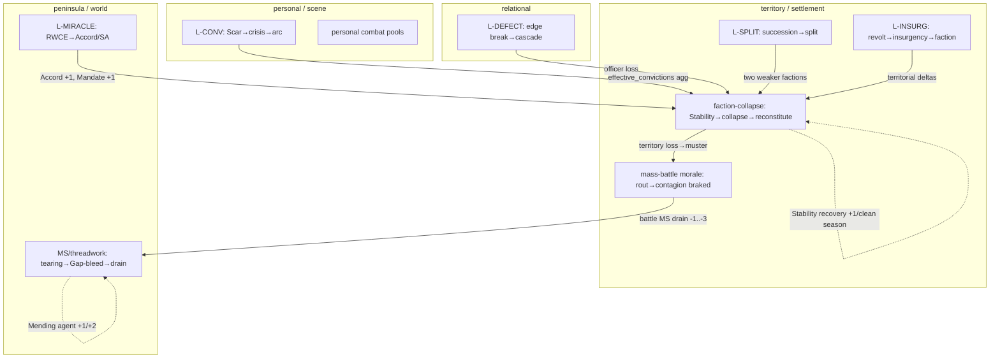

# Pass C — Synthesis (loop map · NERS · DC-1..12 fold)

**Date:** 2026-05-28. **Task:** audit. Capstone over `passB_master.md` (reads) + `passC_ms_force3_validation.md` (MS sim) + `loop_map_doublecheck.md` (DC-1..12). `[SELF-AUTHORED — bias risk]` throughout: this corrects two of my own prior claims (Force-1 magnitude; the faction-collapse loop verdict).

## VERDICT (first)
The cross-system structure is sound and **rate-capped**, but DC-8's warning holds: *capped ≠ damped*. Of the loops, **MS/threadwork and faction-collapse are now positively verified bounded** (sim + canon); **L-CONV, L-SPLIT, mass-battle, L-MIRACLE are bounded by cited dampers**; **L-DEFECT and L-INSURG fail NERS-R on incompleteness** (unbuilt/unspecified, not unstable); and **three loop classes remain unread** (BG fuses, conviction→faction cascade, Varfell ratchet). The single strongest standalone defect — the **faction bare-stat 1–7D roll on pivotal/irreversible outcomes** — is unchanged and confirmed. Two load-bearing canon contradictions (MS direction/cap; start-MS value) gate the MS verdict and need owner decisions.

---

## 1. Rebuilt loop map (supersedes the old W-series)

**Anchored to canon scales (DC-7 fix):** threadwork depths **Object · Personal · Relational · Field · Structural · Foundational** (`scale_transitions §2`, `threadwork params §Depth`) × play scales **personal · settlement · territory · peninsula**.

Solid = drain/amplify; dotted = damper (note both key dampers — Mending, Stability recovery — are **agent-gated actions**, DC-1).

**Loop register (status-honest):**

| Loop | Damper | Cap/bound | Gain computed? | Verdict |
|---|---|---|---|---|
| **MS/threadwork** | Mending agent +1/+2 (action-gated, DC-1); WC2 halve; Force1 ~0.05/s (negligible) | **−10/s net loss cap (CONTESTED, DC-2)** | **YES — Monte-Carlo** | Bounded *iff cap holds*; 4-season floor verified |
| **faction-collapse** | Stability recovery +1/clean season (§1.3) | Survival Exception 1×/campaign; **reconstitution ≠ extinction** (§1.5→settlement §6.2); Military sticky (§1.7) | partial (analytic) | **Bounded — corrects diagnostic "undamped terminal"** |
| **L-CONV** | 1 Scar/season; concentration weights | per-Conviction thresholds | no | Bounded single-path; cascade `[INTENT UNDETERMINED]` |
| **L-SPLIT** | re-merge at Mandate 3+ | RM emergence 4-season cooldown (untuned) | no | Bounded; cooldown PROVISIONAL |
| **mass-battle morale** | rout contagion **braked**; rally/reform | per-turn | no (sim-validated in-band) | Bounded |
| **L-MIRACLE** | one-time Accord; TD counter | SA-gated | no | Bounded |
| **L-DEFECT** | strain −1/s; ½ spillover; tier-3 rare | strain tiers | n/a | **Fail R — resolution UNBUILT (B1.2)** |
| **L-INSURG** | suppression 2→1; sustained-2 gate | Legitimacy gates; **Stage 3/4 dissolution ABSENT** | n/a | **Fail R — down-path missing** |
| **F-series (BG fuses)** | agency (intervene) | timed fire S0→S8 | **UNREAD** | DC-3 — `params/bg/royal_assassination.md`, `tensions_deck.md` not read |
| **L-CONV→faction** | — | — | **UNREAD** | DC-6 — `faction_behavior §3.2` cascade not fully extracted |
| **Varfell Intel ratchet** | reset at 4 | 0–3 | **UNREAD** | DC-11 — minor accumulator |

**DC-8 compliance:** only MS has a computed per-cycle gain (the sim). Faction-collapse has an analytic argument (recovery +1/clean season vs trigger drain, plus the reconstitution cap). **The rest carry damper/cap structure but not a gain computation — that computation is the remaining rigor, per system, before any final "damped" stamp.**

---

## 2. Per-system NERS verdicts

Format per `valoria-resolution-diagnostic` (verdict-first, severity-ranked). Systems not read this pass are marked **PENDING** (the skill's untested hypotheses stand).

**Threadwork / MS engine — NERS-compliant *conditional on the cap decision*.**
N pass (cap + Force1 both necessary; nothing redundant). **R pass *iff* the −10/s cap holds; FAIL without it** (DC-2: instakill possible) — load-bearing. S pass (forces+cap+geographic radiation compose cleanly). E pass (two forces + one cap; "don't tear what you mend" is intuitive). *Remediation:* resolve DC-2 toward the cap.

**Faction action layer — NON-compliant (one defect; loop now cleared).**
N pass. **R FAIL** — the **bare faction-stat 1–7D roll delivering binary verdicts on pivotal, irreversible outcomes** (seizure, vote) at the small-pool floor → **Lesson 3** (route through accounting / aggregate the pool). S fail (dice resolution sits inconsistently on the deterministic layer). E fail (a roll the player can't meaningfully influence). **The collapse *loop* is NOT a defect — RETRACT the diagnostic's Finding-4/Lesson-5** (it is damped + bounded, §1). *Remediation:* Lesson 3 on the bare-stat roll only.

**Mass battle — design NERS-compliant; sim has separate P0 implementation gaps.**
The morale/rout loop is bounded (braked contagion). Design passes N/R/S/E. **But `mass_battle_integration_v30 §3` lists P0 sim defects** (empty rally/reform/threadwork stubs, flanking detection, tie-skip) — these are *implementation* bugs, not design defects; tracked separately (sim work, not NERS).

**L-CONV (conviction) — mostly compliant.** N/R/S/E pass on the single-Conviction path (1 Scar/s cap, structured concentration). Open: multi-Conviction cascade severity `[INTENT UNDETERMINED]`; needs `conviction_axis_matrix` for the cascade math.

**L-SPLIT (succession) — compliant pending tuning.** Bounded (re-merge + cooldown). R/E pass; the 4-season RM cooldown is flagged untuned (smoke-test).

**L-DEFECT (npc relational) — NON-compliant (incompleteness).** R FAIL: the defection cascade — the system's load-bearing consequence — is **unbuilt** (B1.2, §7 hooks only). Not an instability; a missing mechanic. *Remediation:* build B1.2/B1.3 (a PP), not a lesson.

**L-INSURG (GD-3 pipeline) — NON-compliant (incompleteness).** R FAIL: **no canonical down-path** from Stage 3/4 (dissolution unspecified). Up-path is sound. *Remediation:* author dissolution (owner).

**PENDING (not read this pass — skill hypotheses stand):** personal combat (watch flat −1D wound at 5D floor → Lesson-2 candidate), social contest (likely compliant, 5–18D), investigation/fieldwork (likely compliant, deterministic), victory/peninsula (likely compliant, deterministic clocks).

---

## 3. DC-1..12 fold

| DC | Status after Pass B/C |
|---|---|
| **DC-1** MS not self-healing at game-time | **Confirmed + integrated.** Force1 ~0.05/s (negligible); recovery is **agent-gated Mending** (DC-1 right). My sim's WC +3/s *is* agent Mending. → strengthens "maintain = active Mending agent + de-escalation." **Open design (→Jordan):** passive Warden Mending, or action-gated only? |
| **DC-2** MS-direction canon contradiction | **Confirmed + widened.** params (cap struck) vs §5 (±10) vs clock_registry (↓ decay, start 72) vs sim (−1/yr). Load-bearing for MS-R. **→Jordan decision.** |
| **DC-3** BG fuses (F-series) | **OPEN — unread.** `params/bg/royal_assassination.md`, `tensions_deck.md` not yet read. Add F-series next. |
| **DC-4** relational defection cascade | **Done** → L-DEFECT (read npc_relational_graph). |
| **DC-5** succession split | **Done** → L-SPLIT. |
| **DC-6** conviction→faction cascade | **PARTIAL.** `faction_behavior §3.2` scanned, not fully extracted. Cross-scale loop (personal conviction→faction→world→personal) noted; needs full §3.2 read. |
| **DC-7** scale ladder | **Done** — re-anchored to Object/Personal/Relational/Field/Structural/Foundational × play scales (§1). |
| **DC-8** per-cycle gain<1 not computed | **Partial.** MS computed (sim); faction-collapse analytic; **rest still need per-loop gain computation** (the binding methodology fix). |
| **DC-9** positive Thread edge (Mending→Mandate+1) | **Done** — in the map (dotted MIR/Mending edges). |
| **DC-10** miraculous_event injector | **Done** → L-MIRACLE. |
| **DC-11** Varfell Intel ratchet | **OPEN — unread** (minor). |
| **DC-12** clock_registry as bounds source | **OPEN — unread.** Cross-check all bounds against `clock_registry_v30`; it would settle DC-2 + the start-MS contradiction. High value, low cost — do early next. |

**New contradiction surfaced:** **start-MS value — clock_registry says 72, `threadwork_v30_infill §5.1` says 60.** Add to the DC-2 cluster. (My sim used 60.)

---

## 4. Consolidated open decisions (→ Jordan) + remaining work

**Owner decisions (none block further audit; all are real authoring/canon calls):**
1. **MS direction/cap (DC-2 + start-MS):** is the seasonal cap −10 or struck; is game-time MS net-decay intended; is start-MS 60 or 72? *Load-bearing for the MS NERS-R verdict and the Force-3 bound.*
2. **Passive vs action-gated Mending (DC-1):** does game-time have passive Warden Mending, or only agent-action Mending?
3. **Maintain mitigation (passC finding):** confirm "maintain = de-escalate + heal" (WC breaks even ~6.5/s raw tearing), or strengthen WC so maintain survives heavy tearing.
4. **Insurgency dissolution (F-B):** author Stage 3/4 down-path.
5. **Defection cascade (F-A):** schedule the B1.2/B1.3 build.

**Remaining reads to *complete* the audit (cheap, high-value first):**
- `clock_registry_v30` (DC-12 — settles bounds + DC-2 + start-MS).
- `params/bg/royal_assassination.md`, `params/bg/tensions_deck.md` (DC-3 — F-series fuses).
- `faction_behavior §3.2` full (DC-6 — conviction→faction cascade).
- `faction_layer` remainder (12 files), then NERS the PENDING systems (personal combat, social contest, investigation, victory).
- Per-loop gain computations (DC-8) for every loop lacking one.
- A real `mc`-engine run with canonical tearing distributions (true pacing for the arc).

**Staged ED cluster (B6-blocked, `[DRIFT]`):** P1 MS-direction/cap; P1 start-MS contradiction; P2 defection-cascade-unbuilt; P2 insurgency-dissolution; P2 maintain-mitigation balance; DRIFT-1 RS/MS label; DRIFT-2 Gap-bleed model; DRIFT-3 stale v25 cross-ref; DRIFT-4 conviction_track supersession.
