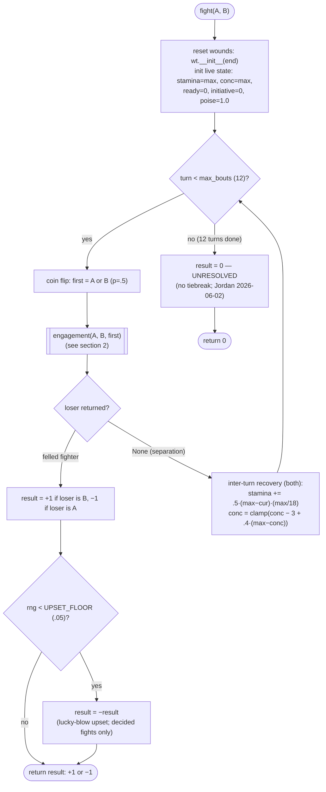

# Personal Combat — Flowchart, State Graph, and Flattened Mechanics Map

**Status:** Reference / audit companion to `comprehensive_analysis_personal_combat.md` (same dir). Derived bottom-up from the canonical engine modules, every gate and formula cited to file:line.
**Session:** 2026-06-09. **Source of truth:** `designs/scene/combat_engine_v1/` @ ED-904 SHAs + the three post-ED-904 commits (wound −1D wiring live in this trace).

`[READ:]` this document is traced from full re-reads this session of `wrapper.py` (1–299), `systems.py` (1–291), `core.py` (1–61), `config.py` (1–97), `combatant.py` (1–92, incl. WEAPONS/GEOMETRY tables). Substrate: `r8_parity_harness.py` (pool, roll, WoundTracker, stamina_max), `r1_sigma_resolution.py` (effective_ob, degree), `m1_dice_sigma_core.py` (net engine).

**Reading order.** §1 fight-level flowchart (outer loop) → §2 engagement/beat pipeline flowchart (the resolution machine) → §3 state graph (measure/contact states and terminals) → §4 flattened map (A inputs · B derived values · C beat sequence with every gate · D resolution calculation chain · E outputs).

---

## 1. Flowchart — fight level (outer loop)

The GAME calls **one engagement per turn**; `fight()` is the multi-turn sim harness that runs engagements to a decision (wrapper.py:283).



## 2. Flowchart — engagement / beat pipeline

One engagement = one ~10 s turn: approach → burst of exchanges → separation or felling. The beat loop runs while `beats < 24` (soft=8 ×3, wrapper.py:32,35); every path that does not fell or separate re-enters at UPKEEP.

```mermaid
flowchart TD
  EN(["engagement(A, B, first)"]) --> INIT["aggressor=first · reach_base each ·<br/>longer/shorter (coin flip on exact tie) ·<br/>measure_gap = er_long − er_short ·<br/>closed = gap ≤ 0.3 · initiative = 0,0 (seizure cut)"]
  INIT --> BEAT{"beats < 24?"}
  BEAT -->|no| SEP0(["return None — separation"])
  BEAT -->|yes| UK["UPKEEP (per beat, both fighters):<br/>fatigue = max(0, 1−stam/max) ·<br/>initiative ×= init_hold_decay, clamp ±1.5 ·<br/>initiative += .10·disp_lean, clamp ·<br/>poise += .20·(1+.10·(focus−3))·(1−poise), clamp .5–1 ·<br/>ready += weapon_tempo (open) / close_tempo (closed)"]
  UK --> RO{"closed ∧ beats>1 ∧ reopen_moment ∧<br/>base_gap>0.3 ∧ rng<reopen_prob?"}
  RO -->|yes| ROY["re-open: closed=false, gap=base_gap,<br/>ready reset, flags cleared"] --> BEAT
  RO -->|no| CL{"closed?"}

  CL -->|no| AP["APPROACH:<br/>displ = approach_displace(shorter vs point) ·<br/>close_rate = .40·bal_eff(shorter)/3 · tempo(shorter)/2 · (1+displ) ·<br/>gap −= close_rate; gap ≤ 0.3 → closed, ready reset"]
  AP --> SH{"rng < .75·min(1, gap/3)·(1−displ)?<br/>(stop-hit)"}
  SH -->|yes| SHR["longer rolls: pool = max(1, P(hist)−wounds) ·<br/>nsig = .22·gap + .40 · degree vs eff_ob"]
  SHR --> SHD{"success / overwhelming?"}
  SHD -->|yes| SHW["strike(longer→shorter, deg, close=false) ·<br/>apply wound · conc −= 2"]
  SHW --> SHF{"shorter felled?"}
  SHF -->|yes| F1(["return shorter — FELLED"])
  SHF -->|no| OPN
  SHD -->|no| OPN{"still open?"}
  SH -->|no| OPN
  OPN -->|yes| SC1{"either stamina ≤ −4?"}
  SC1 -->|yes| SEP1(["return None — collapse"])
  SC1 -->|no| BEAT
  OPN -->|"no (just closed)"| BEAT

  CL -->|yes| AG{"any ready ≥ 2.5?<br/>(ACT_THRESHOLD)"}
  AG -->|no| BEAT
  AG -->|yes| AGR["aggressor = higher ready (tie: coin) ·<br/>both: halfsword auto-switch by range/armour ·<br/>ready of aggressor −= 2.5"]
  AGR --> CMT["commit drawn from 2..5, disposition-skewed ·<br/>stamina −= (2 + 1·heavy + .4·commit)·.5 ·<br/>oob = 2 if stamina ≤ 0"]
  CMT --> FE{"feint? streak<3 ∧ rng<.30 ∧ stamina>0"}
  FE -->|yes| FER["contest read: fooled → debuff .30 on defender;<br/>read → punish −.12 (counter-edge);<br/>beats += .3, stamina −= 1.0"] --> RD
  FE -->|no| RD["VISUAL READ CONTEST:<br/>read_d = reading_d·visual_w·familiarity·legibility·<br/>(1−.4·mental_fat)·(1−feint_debuff) ·<br/>read_a = reading_a·visual_w + .10·(focus−3) ·<br/>read_win ⇐ rng < σ(read_d − read_a)"]
  RD --> MD["MODE: msig per parry/dodge/wind via mode_sigma·GATE cap ·<br/>mode = argmax if read_win else random(3)"]
  MD --> NS["NET σ: atk_sig − dsig − reach_pen +<br/>armor_defeat + .16·tanh(Δinit/1.2) + .12 bias"]
  NS --> IND{"read_win ∧ commit ≥ 4?<br/>(Indes / sen-no-sen)"}
  IND -->|yes| INDS["Vor steal: .36·steal_factor·scale clamped .5–2 →<br/>defender +, aggressor − ·<br/>counter_attempt ⇐ rng < .45·tempo_w(td)·(1−.5·lean_d)·ability"]
  IND -->|no| ROLL
  INDS --> ROLL["ROLL: pool = max(1, max(5,hist+6) − wounds) ·<br/>ob = max(1, eff_ob(3, pool, netσ)) ·<br/>net ~ Normal(.4·pool, .8·√pool) vs TN 7 ·<br/>deg = fail / partial / success / overwhelming"]
  ROLL --> OC["overcommit_exposure = max(0, .06·(commit−3)) −<br/>anti_overcommit − ability; if >0: init −, poise −= .09·exp"]
  OC --> OM{"degree?"}
  OM -->|fail| OF["riposte w.p. min(.95, .32+exposure)"]
  OM -->|partial| OP["dodge: graze .4 · parry: graze .30 · wind: BIND"]
  OM -->|success| OS["wind: BIND .55 · else neutralize (.55/.62/.50):<br/>riposte w.p. min(.95,.20+exp) · else HIT (success)"]
  OM -->|overwhelming| OO["neutralize−.45 → no hit · else HIT (overwhelming)"]
  OF --> CTR
  OP --> CTR
  OS --> CTR
  OO --> CTR{"counter_attempt?"}
  CTR -->|yes| CTS{"rng < clamp(.05,.92,<br/>.50+.10·(hist_d−3)+.05·(rflx_d−3)+ability)?"}
  CTS -->|"lands"| CTW["hit=0, bind=0, riposte=TRUE (Vor kept)"]
  CTS -->|"miss"| CTL["cede Vor back; defender UNDEFENDED:<br/>hit = strike at success grade (partial upgraded)"]
  CTR -->|no| DSP
  CTW --> DSP
  CTL --> DSP{"displace-and-step-inside?<br/>point head ∧ commit≥4 ∧ no hit ∧ read_win ∧<br/>lever_d > lever_a+.15 ∧ rng<.55"}
  DSP -->|yes| DSPR["→ closed, gap=0 · pull-back graze w.p. .30 ·<br/>riposte=TRUE (defender inside)"]
  DSP -->|no| RM
  DSPR --> RM["reopen-moment creation:<br/>(a) shorter committed ≥4 · (b) longer defended clean/bind ·<br/>(c) longer 2H shove w.p. .22"]
  RM --> HIT{"hit > 0?"}
  HIT -->|yes| HW["apply wound · conc −= 2 ·<br/>agg init += .18 · def init −= .28 ·<br/>def poise −= .07·min(1, hit/8)"]
  HW --> HF{"defender felled?"}
  HF -->|yes| F2(["return defender — FELLED"])
  HF -->|no| BD
  HIT -->|no| BD{"bind?"}
  BD -->|yes| BDR["bind entry: winner-by-bind_sigma steals Vor once ·<br/>loser poise −= .05·lev_w · then ≤3 iterations:<br/>σ(bind_sigma) → strike .4 (felled check), else riposte"]
  BD -->|no| RP
  BDR --> RP{"riposte?"}
  RP -->|yes| RPR["if hit∧riposte (sim): disruption check σ(.7·(focus_a−3))<br/>fails → defender grazes aggressor (felled check) ·<br/>defender conc −= 2 · ROLE FLIP (objects swap)"]
  RP -->|no| EX
  RPR --> EX["exchanges += 1"]
  EX --> G1{"either stamina ≤ −4?"}
  G1 -->|yes| SEP2(["return None — collapse"])
  G1 -->|no| G2{"exchanges ≥ 4? (BURST_MAX)"}
  G2 -->|yes| SEP3(["return None — burst ceiling"])
  G2 -->|no| G3{"hit ∨ riposte ∨ bind?"}
  G3 -->|"no (clean defence)"| SEP4(["return None — measure breaks"])
  G3 -->|yes| BEAT
```



## 3. Comprehensive state graph

States are measure/contact configurations; the per-exchange pipeline of §2 runs inside `Exchange`. Terminals on the right. All transition probabilities/gates are flattened in §4C.

```mermaid
stateDiagram-v2
  direction TB
  [*] --> FightInit : fight(A,B)
  FightInit --> EngagementInit : turn t ≤ 12, coin-flip first

  state Engagement {
    [*] --> Approach : measure_gap > 0.3
    [*] --> AwaitTempo : measure_gap ≤ 0.3 (already closed)

    Approach --> Approach : beat — shorter closes (close_rate), longer stop-hits (p ≤ .75)
    Approach --> AwaitTempo : gap ≤ 0.3 — just closed (ready reset)
    Approach --> [*] : stamina ≤ −4 (collapse → None)

    state Closed {
      AwaitTempo --> Exchange : a fighter reaches ready ≥ 2.5
      AwaitTempo --> AwaitTempo : beat — tempo accrues, upkeep runs
      Exchange --> Bind : partial∧wind | success∧wind(.55)
      Exchange --> Riposte : fail(.32+exp) | neutralized(.20+exp) | counter lands | displace-inside
      Exchange --> HitLanded : degree converts past neutralize
      Bind --> HitLanded : bind won, strike (.4 per iter, ≤3)
      Bind --> Riposte : bind lost
      HitLanded --> AwaitTempo : burst continues (wounds, Vor +/−, poise −)
      Riposte --> AwaitTempo : ROLE FLIP — defender becomes aggressor
    }

    AwaitTempo --> Approach : reopen — created moment ∧ rng < reopen_prob (≤ .6)
    Closed --> [*] : clean defence (no hit/riposte/bind) — measure breaks → None
    Closed --> [*] : exchanges ≥ BURST_MAX 4 → None
    Closed --> [*] : stamina ≤ −4 → None
    Closed --> Felled : wound total crosses MW+1 (any strike path)
    Approach --> Felled : stop-hit fells
  }

  Felled --> Decided : result = ±1 (loser identity)
  EngagementInit --> Engagement
  Engagement --> InterTurn : returned None (separation)
  InterTurn --> EngagementInit : stamina/conc partial recovery; wounds PERSIST
  InterTurn --> Unresolved : 12 turns exhausted — result 0 (no tiebreak)
  Decided --> UpsetCheck
  UpsetCheck --> FinalResult : p .95 keep | p .05 flip (UPSET_FLOOR)
  Unresolved --> [*]
  FinalResult --> [*]
```



---

## 4. Flattened map — all inputs, calculations, sequences/gates, outputs

### 4A. Inputs

**A1 — Combatant build inputs** (combatant.py:57–78):

| Input | Range / values | Default | Consumed by |
|---|---|---|---|
| strength | 1–7 | 4 | str_demand/handling, balance_eff, bind, wind mode, damage Impact, displace |
| agi | 1–7 | 4 | balance_eff, tempo (+.03/pt), reflex (w 2), init term (.045/pt) |
| end | 1–7 | 4 | WoundTracker (WI=End+6, MW=min(⌊End/2⌋+1,3)), stamina_max (×3) |
| cog | 1–7 | 3 | reading (weight 2 of 3) |
| att | 1–7 | 3 | reading (weight 1 of 3), reflex (w 1) |
| spirit | 1–7 | 3 | stamina_max (×2), conc_max (×2) |
| focus | 1–7 | 3 | conc_max (×3), consistency (+.10·(f−3)), poise recovery, disruption resist |
| history | 0–7 | 3 | pool (max(5, h+6)), reading (+.2·(h−3)), counter success, bind tech, init term |
| disp | 1–7 (4 = neutral) | 4 | lean=(disp−4)/3 → commit skew, counter-selection tilt, Vor drift |
| weapon | 12 vectors (A2) | arming | everything weapon-shaped |
| armor | none/light/medium/heavy | light | RESIST, ADEF, REACH_W, legibility mode-shift, halfsword trigger |
| tradition | 8 profiles (A3) | none | channel weights ×7, familiarity |
| skills | per-axis float biases | {} | balance/technique/parry/dodge/bind axes |
| equipped | ability list (A4) | [] | 3 live levers |
| grip (state) | normal/choke/lunge | normal | tempo trade-offs, choke bind bonus, lunge legibility |

**A2 — Weapon vector fields** (combatant.py:8–31; `gap` overwritten at import by geometry.bake from GEOMETRY):
`reach` (long/short) · `wt` (light/heavy) · `hands` (1/2) · `head` (point / straight_cut / curved_cut / cut_thrust / blunt) · `spd` (−0.5…3.0) · `hand` (Forgiving/Standard/Demanding → rank 0/1/2) · `gap` (0–1, geometry-baked) · `head_len`/`grip_len` (lever arms) · `hand_guard`/`blade_guard` (0–1) · `reach_adj` · `clinch` (currently unconsumed by engine paths traced) · `percussion` (0–8) · `closes_poorly` (spear, staff) · `mass`/`pob_frac` (**unconsumed — dead data, audit F5**). The 12 weapons: rapier, arming, longsword, greatsword, sabre, dagger, paired_short, spear, staff, mace, poleaxe, longsword_halfsword (auto-form).

**A3 — Tradition profiles** (tradition.py:23–47): 7 channel weights each over {visual, tactile, precommit, leverage, tempo, measure, balance}, neutral 1.0; familiarity same/adjacent/default = 1.0/.93/.85. **`precommit` has zero consumption sites (audit F2).**

**A4 — Abilities** (tradition.py ABILITIES): live levers `counter_success` (indes +.15), `counter_select` (mezzo_tempo ×), `anti_overcommit` (true_times +); inert levers `seize` (vorschlag, sen_no_sen — cut 2026-06-05), `leverage` (staerke_schwaeche), `measure` (misura, atajo) (audit F2).

**A5 — Config tunables** (config.py:2–95; Class-C, all values live):

| Group | Names = values |
|---|---|
| core/damage | DAMAGE_SCALE=4.0 · CAP_END=4 |
| reach | L0=4.0 · LONG=2.0 · HANDS2=0.8 · HEADR=1.0 · HEAD_REACH{point 1.0, cuts .5, blunt 0} · REACH_FRAC=.82 · REACH_W{none .62, light .50, med .34, heavy .20} · REACH_DISADV_K=.22 · FOOT_MEASURE_K=.15 |
| tempo | BASE_TEMPO=2.0 · SPEED_K=.6 · AGI_TEMPO_K=.03 · WEIGHT_PEN=.8 · HANDS_COMMIT=.5 · MAX_TEMPO_PEN=.8 · TEMPO_FLOOR=.7 · TEMPO_FATIGUE_K=.25 · CHOKE/LUNGE_TEMPO_PEN=.4/.6 · POLE_CLOSE_PENALTY=1.2 · CLOSE_TEMPO_MEAN=1.5 · CLOSE_TEMPO_COMPRESS=.38 · ACT_THRESHOLD=2.5 · BURST_MAX=4 |
| approach/reopen | CLOSE_RATE_K=.40 · STOPHIT_CHANCE=.75 · STOPHIT_FULL_GAP=3.0 · STOPHIT_NSIG_BASE=.4 · REOPEN_K=.34 · REOPEN_MAX=.6 · PUSH_AVAIL_P=.22 · PUSH_REOPEN_BONUS=.18 · APPROACH_DISPLACE_K=.7 · APPROACH_DISPLACE_MAX=.6 |
| stamina/conc | STAMINA_REF=18 · RECOVERY_FRAC=.5 · COST_SCALE=.5 · ACT_BASE=2.0 · ACT_WEIGHT=1.0 · ACT_COMMIT=.4 · OOB=2 · CONC_FOCUS=3 · CONC_SPIRIT=2 · CONC_DRAIN_BOUT/LOSS/HIT=3/2/2 · CONC_RECOVER_FRAC=.4 · FOCUS_MENTAL_K=.5 · FOCUS_CONSISTENCY_K=.10 · DISRUPT_K=.7 |
| read/init | READ_K=.5 · READ_HISTORY_K=.2 · REFLEX_AGI/ATT=2/1 · INIT_K=.045 · INIT_READING_K=.03 · INIT_HISTORY_K=.02 · COMMIT_SIGMA=.18 · MENTAL_FAT_READ_K=.4 · MENTAL_FAT_DEF_K=.3 |
| legibility/feint | LEGIB_SWING=1.25 · LEGIB_THRUST=.80 · LEGIB_COMMIT_K=.10 · LEGIB_LUNGE=.25 · FEINT_ENABLE=True · FEINT_P=.30 · FEINT_MAX_STREAK=3 · FEINT_BEAT_COST=.3 · FEINT_STAMINA=1.0 · FEINT_DEBUFF=.30 · FEINT_PUNISH=.12 |
| defence modes | PARRY_K=DODGE_K=WIND_K=.9 · CHOKE_BIND_K=.30 · PARRY_GUARD_K=.45 · WIND_GUARD_K=.40 · BIND_GUARD_K=.55 · GUARD_NEUTRAL=.45 · NEUTRALIZE_PARRY/DODGE/WIND=.55/.62/.50 · NEUTRALIZE_OVERWHELM_DROP=.45 |
| outcome probs | RIPOSTE_ON_FAIL=.32 · RIPOSTE_ON_NEUTRALIZE=.20 · PARTIAL_DODGE_GRAZE=.4 · PARTIAL_PARRY_GRAZE=.30 · WIND_BIND_P=.55 · BIND_HIT_P=.4 · COMMIT_EXPOSE_K=.06 |
| handling/balance | D0=1.0 · D_LEN=.35 · D_WT=1.0 · D_HAND=.6 · D_2H=.4 · HANDLE_K=.10 · FATIGUE_HANDLE_K=.20 · FATIGUE_FOOT_K=.30 · FOOT_COMMIT_DISC_K=.06 · FOOT_STANCE_K=.05 |
| lever/displace | LEVER_K=2.2 · LEVER_REF=.30 · LEVER_2H=.20 · DISPLACE_LEV_GAP=.15 · DISPLACE_P=.55 · DISPLACE_PULLBACK_GRAZE=.30 |
| armour-defeat | ADEF_W{0/.4/1.0/1.7} · ADEF_BLUNT=1.3 · ADEF_POINT=1.0 · ADEF_CUT=−.9 · ADEF_THRESHOLD{0/.70/.45/.72} |
| bind | BIND_TECH_K=.06 · BIND_TACTILE_K=.04 · BIND_STR_K=.0156 |
| initiative (Vor) | INIT_SIGMA_K=.16 · INIT_SCALE=1.2 · INIT_DECAY=.75 · INIT_CAP=1.5 · INIT_GAIN_HIT=.18 · INIT_LOSS_WOUNDED=.28 · INIT_STEAL_INDES=.36 · INIT_LOSS_OVERCOMMIT=.14 · INDES_COMMIT_K=.4 · INDES_READ_K=.15 · INDES_SCALE_FLOOR/CEIL=.5/2.0 · ATTACKER_BIAS=.12 |
| poise (kuzushi) | POISE_FLOOR=.5 · POISE_EFFECT_FLOOR=.88 · POISE_RECOVER=.20 · POISE_FOCUS_K=.10 · POISE_BREAK_OVERCOMMIT=.09 · POISE_BREAK_BIND=.05 · POISE_BREAK_HIT=.07 · POISE_SOLID_HIT=8.0 |
| counter/disp | COUNTER_SELECT_BASE=.45 · COUNTER_SUCCESS_BASE=.50 · COUNTER_TRAIN_K=.10 · COUNTER_REFLEX_K=.05 · DISP_COMMIT_K=.8 · DISP_COUNTER_K=.5 · DISP_INIT_K=.10 |
| videogame rule | UPSET_FLOOR=.05 |

**A6 — Per-fight stochastic inputs:** RNG draws at — first-mover coin (fight:284), longer-tie coin (eng:25), reopen (60), stop-hit fire + roll (75–78), actor tie (91), commit (102/106), feint do + feint read (feint_eval), visual read (134), mode fallback (137), counter selection (159), main roll (161), outcome-map draws (176–187), counter success (192), displace + pullback (208/211), push availability (226), bind iterations (248–249), disruption (258), upset (297).

### 4B. Derived values (formulas, with source)

| Quantity | Formula | Source |
|---|---|---|
| Combat Pool | max(5, history + 6); per-roll: max(1, pool − wt.pool_penalty()) | r8/r1; wrapper:76,160 — ED-901 |
| Wound Interval | End + 6; Max Wounds = min(⌊End/2⌋+1, 3); Health_full = WI·(MW+1); −1D per wound | r2/r8 WoundTracker — derived_stats §4.1, PP-717 |
| stamina_max | 3·End + 2·Spirit | r8 via systems:45 — RATIFIED S1 |
| act_cost | (2.0 + 1.0·heavy + 0.4·commit)·0.5 | systems:47 — diverges from derived_stats §4.2 (audit F3) |
| conc_max | 3·Focus + 2·Spirit | systems:51 — ED-902 |
| reading | (2·Cog + Att)/3 + 0.2·(history−3) | systems:53 |
| reflex | (2·Agi + 1·Att)/3 | systems:54 |
| reach_base | 4.0 + 2.0·long + 0.8·2H + 1.0·HEAD_REACH[head] + reach_adj | systems:11 |
| str_demand | 1.0 + .35·reach_base + 1.0·heavy + .6·HANDLE_RANK + .4·2H | systems:57 |
| handling_penalty | .10·max(0, demand − strength) + .20·fatigue (continuous; no discrete cannot-wield gate) | systems:59 |
| disp_lean | (disp − 4)/3 ∈ [−1, 1] | systems:62 |
| balance_eff | (.5·Agi + .5·Str − 1 + skill)·(1 − .30·fatigue)·poise_factor | systems:65 |
| poise_factor | .88 + .12·(poise − .5)/.5 over poise ∈ [.5, 1] | systems:281 |
| leverage | 2.2·(grip_len/(grip_len+head_len) − .30) + .20·2H | systems:137 |
| weapon_tempo | max(.7, (2.0 + .6·spd + .03·(Agi−4) − pen)·(1−.25·fat))·poise_factor; pen = min(.8, .8·heavy + .5·(2H∧heavy)) + grip pens | systems:17 |
| close_tempo | 1.5 + (tempo − 1.5)·.38; −1.2 if closes_poorly ∧ grip≠choke | systems:32 |
| fatigue (per beat) | max(0, 1 − stamina/stamina_max) | wrapper:39,109 |
| mental_fat_d | fat_d·(1 − .5·conc/conc_max) | wrapper:112 |
| legibility | thrust .80 / swing·blunt 1.25; cut_thrust → .80 vs med/heavy else 1.25; + .10·max(0,commit−3); + .25 lunge | systems:177 |
| familiarity | 1.0 same · .93 adjacent · .85 default (symmetric pairs) | tradition:52–67 |

### 4C. Sequence and gates — one closed exchange, in execution order

Approach-phase steps (upkeep → reopen → close/stop-hit) are in §2; this flattens the closed exchange (wrapper.py:88–274). σ() = logistic.

| # | Step | Gate / condition | Calculation / effect | Line |
|---|---|---|---|---|
| 1 | actor gate | ready ≥ 2.5; both → higher ready (tie: coin) | aggressor selected; ready of aggressor −= 2.5 | 88–98 |
| 2 | halfsword | closed ∧ opp armor ∈ {med, heavy} (longsword only) | weapon form mutated by wrapper | 96–97 |
| 3 | commit | lean=0 → uniform{2..5}; else weights ∝ 1±k·lean (k=.8) | depth of the action | 100–106 |
| 4 | pay action | always | stamina −= act_cost; oob=2 if stamina ≤ 0 | 107–108 |
| 5 | feint | streak<3 ∧ rng<.30 ∧ stamina>0 | fooled: defender debuff .30; read: −.12 punish; beats+=.3; stam−=1 | 121–124 |
| 6 | read contest | always | read_win ⇐ rng < σ(read_d − read_a) (formulas §2) | 130–134 |
| 7 | mode select | read_win → argmax msig; else uniform{parry,dodge,wind} | msig per mode_sigma × GATE[weapon][mode]; commit≥4: parry−.25, dodge+.10; commit≤2: dodge−.10 | 135–137 |
| 8 | defender σ | always | dsig = msig·(1−.3·mental_fat)·(1−feint_debuff) − handling_d + stance_stability_d | 140 |
| 9 | attacker σ | always | atk_sig = .18·(commit−3) + init_term − oob·.5 − handling_a + .10·(focus_a−3) | 141 |
| 10 | net σ | always | net_sigma = atk_sig − dsig − reach_pen + armor_defeat + .16·tanh(Δinit/1.2) + .12 | 142–144 |
| 11 | Indes steal | read_win ∧ commit ≥ 4 | steal = .36·steal_factor(d, wind?)·clamp[.5,2]((1+.4·(commit−4))·(1+.15·Δread)); Vor → defender | 148–154 |
| 12 | counter select | inside #11 | counter_attempt ⇐ rng < .45·tempo_w(td)·max(0, 1−.5·lean_d)·ability | 159 |
| 13 | roll | always | pool = max(1, max(5,h+6) − wounds); ob = max(1, eff_ob(3, pool, netσ)); net ~ N(.4p, .8√p) | 160–162 |
| 14 | degree | net ≤ 0 fail · < Ob partial · ≥ Ob success · ≥ 2·Ob ∧ ≥ 3 overwhelming | deg | 162, r1 |
| 15 | overcommit | exposure = max(0, .06·(commit−3)) − anti_oc − ability > 0 | aggressor init −= .14·exp/tempo_w; poise −= .09·exp | 165–169 |
| 16 | outcome map | per deg (fail/partial/success/overwhelming) | riposte/graze/bind/hit per §2 OM branch; neutralize .55/.62/.50; overwhelm −.45 | 174–187 |
| 17 | counter resolve | counter_attempt | lands (p clamp[.05,.92] of .50+.10·Δh+.05·Δrflx+ability): void attack, riposte, keep Vor; miss: cede Vor, eat hit undefended (partial → success grade) | 188–200 |
| 18 | displace-inside | point ∧ commit≥4 ∧ ¬hit ∧ read_win ∧ lever_d>lever_a+.15 ∧ rng<.55 | force close; pull-back graze .30; riposte | 206–215 |
| 19 | reopen moments | (a) shorter commit≥4 · (b) longer clean defence/bind · (c) longer 2H ∧ rng<.22 | reopen_moment (consumed next beat) | 219–227 |
| 20 | hit apply | hit > 0 | wound; conc −= 2; agg init += .18; def init −= .28; def poise −= .07·min(1, hit/8); felled → EXIT | 228–234 |
| 21 | bind | bind flag | entry steal (winner of bind_sigma, ×tactile+leverage/2); ≤3 iters: σ(bind_sigma) → strike .4, else riposte | 235–254 |
| 22 | riposte | riposte flag | sim (hit∧riposte): disruption σ(.7·(focus_a−3)) fails → graze back; def conc −= 2; ROLE FLIP | 255–263 |
| 23 | burst exits | stamina ≤ −4 → None · exchanges ≥ 4 → None · clean defence (¬hit ∧ ¬riposte ∧ ¬bind) → None · else next beat | separation vs continue | 272–274 |

### 4D. Resolution calculation chain (one strike, end to end)

```
pool  = max(1, max(5, history+6) − wounds)                              [ED-901 + deb405b944]
ob    = max(1, eff_ob(3, pool, net_sigma))      ← Ob-shift, floor 1     [audit F4: m1 declares μ-shift]
net   ~ Normal(0.4·pool, 0.8·√pool) − vs TN 7 (continuous d10 net)      [m1; Decision E]
deg   : fail ≤ 0 < partial < success ≥ ob ≤ overwhelming (≥2·ob ∧ ≥3)   [r1, params/core]
damage = round( QUAL[deg] · 12 · tanh( Impact · Coupling · 4.0 / 12 ) ) [core:48–52, D1]
  Impact   = HEFT[wt∈{4,6}] + clamp(−1, 2, (Str−3)//2)
  Coupling = best-mode transmit vs armour:
     blunt: (1−RESIST)·(perc/8)·1.6        point: gap-find vs plate (close: a+b·gap; open: .12·gap)·1.45
     cut:   (1−RESIST)·1.35                cut_thrust: max(cut, point)   ← removes light→medium cliff
  QUAL = partial .6 · graze .35 · success 1.0 · overwhelming 1.5 ;  cap = 1.2·(4+6) = 12/blow
wound  : cumulative damage ÷ (End+6) → wounds (≤ MW); each −1D pool; > MW ⇒ FELLED (persists to session end)
```

### 4E. Outputs

| Level | Output | Consumers |
|---|---|---|
| per strike | damage int (0–12); wound increment(s); conc −2 on the struck | WoundTracker; felled check |
| per exchange | hit / riposte / bind flags; initiative deltas (+.18 / −.28 / steals ±.36·f); poise deltas; role flip on riposte | burst-continuation gate (#23) |
| per engagement | felled Combatant (terminal) or None (separation: collapse / burst ceiling / clean defence / beat exhaustion) | the GAME's turn result; fight() loop |
| per fight (sim harness) | +1 (A) / −1 (B) / 0 (unresolved, legitimate); 5% upset flip on decided | win-rate measurement only — the game calls engagements, not fight() |
| persistent state | wounds + felled to session end (r2); stamina/conc partially recover inter-turn; initiative/poise/ready reset per engagement; halfsword weapon form persists across fights (not reset by fight()) | downstream scene/session systems |
| NOT produced | ranged outcomes, >2-combatant outcomes, thread-in-combat outcomes (audit F1 / ED-911); Coherence effects (not consumed) | — |

---

`[NULL: unreached-code scan while tracing — every wrapper/systems branch above is reachable except the stamina ≤ −4 aborts (never observed firing, Probe C4) and the dead inputs flagged: precommit channel, 5/8 ability levers, mass/pob_frac, clinch]`
`[CONFIDENCE: high — every gate, constant, and formula transcribed from the live module text re-read this session; line numbers cited; nothing from memory]`
