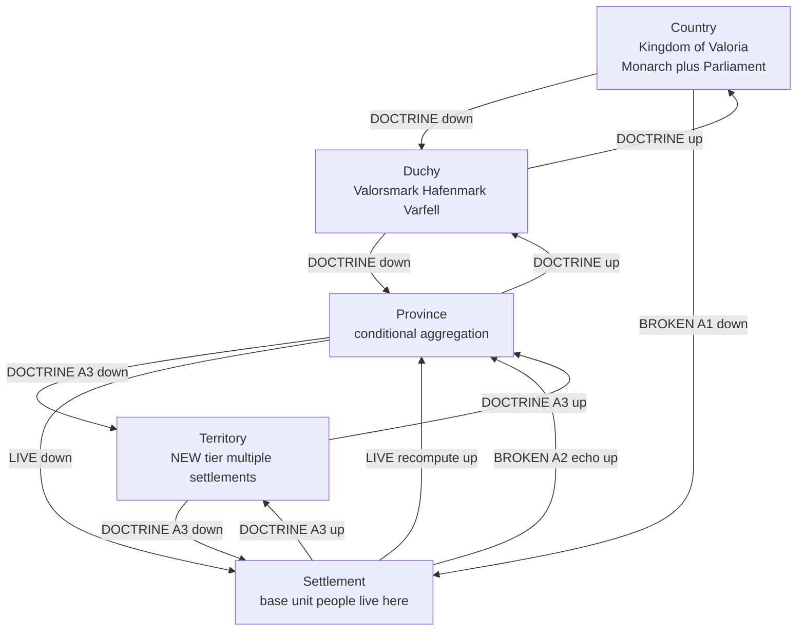
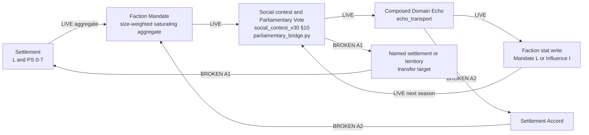
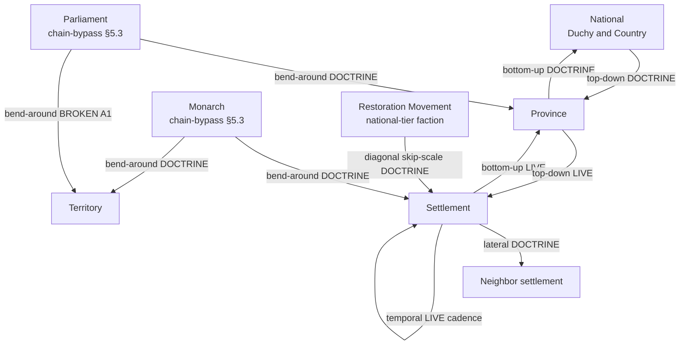
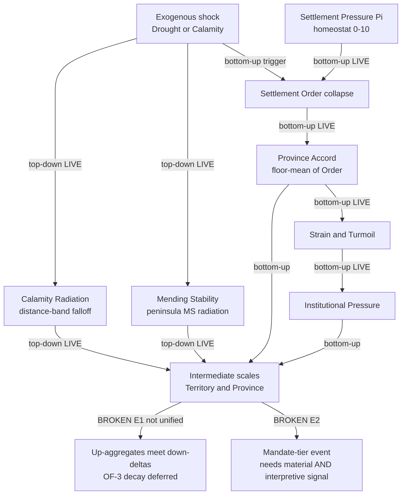

# Cross-Scale Governance Grounding — The Graph & Per-Scale Grounding (v1)

## Status: FILED (in progress) — 2026-07-13 · ED-IN-0051

> ⚠️ **Fable-audit corrections (`fable_audit_v1.md`).** (1) **Armature binding is aspirational, not native.**
> The Key & Echo Armature's `diagonal` = `causes[]` provenance and `outward` = player-facing rendering —
> **not** skip-scale / bend-around. Cross-scale claiming (`scale_hierarchy §5.2`) and chain-bypass (`§5.3`)
> are **RULED behaviors** whose binding onto an armature/substrate channel is **UNBUILT** (an additional gap),
> not existing grounding — read the "grounded natively in the six directions" language below as *aspirational*.
> (2) **Some LIVE labels overstate wiring.** `L/PS→Mandate` is a *defined formula* not driven by the inert
> L/PS (see GAP-B1); Turmoil/Strain/IP are **designed but not written** by live code (writers survive only in
> archived `mc_v4–v14`). Where a LIVE label here conflicts with `pressure_key_registry_v1.md`'s
> INERT/DOCTRINE-ONLY rows, **the registry is authoritative** — read LIVE as "live *or* formula-defined/designed".

**Purpose.** This is the graph half of the cross-scale governance docket: it draws Valoria's whole
political nexus as a small set of directed "cuts," grounds governance at every scale in one matrix,
inventories the player actions that drive it, and names which emergent arcs the live graph actually
produces versus which are dead on a broken edge. It is a **read-only synthesis** over already-ruled
canon and already-written code — it flips no `## Status:` line, wires no inert field, and authors no
fix. Every LIVE / DOCTRINE-ONLY / BROKEN claim below carries its `gap_register_v1.md` GAP-id or a
direct `code:`/`doc:` pointer; the statuses and two-tier classifications are decided in
`gap_register_v1.md` and mirrored here exactly. Currency resolved via `CURRENT.md` (2026-07-13):
`scale_hierarchy_v1.md` is the ratified hierarchy head, `key_echo_armature_v1.md` /
`propagation_spec_v1.md` are the ratified substrate, and `parliamentary_bridge.py` (ED-SC-0006/0007)
is the live political loop.

**The nexus premise (Jordan, this session).** Governance in Valoria is a **vectorized field, not a
strict containment tree.** The corpus's own noisy-weighted-cascade "throughlines" are scale-flexible:
they **bend around components** and **skip scales as befits their nature**, rather than descending one
rung at a time through a clean nest. This is grounded natively in the Key & Echo Armature's six
existing directions — **bottom-up** (aggregate), **top-down** (distribute), **lateral**
(dissemination), **diagonal = skip-scale** (cross-scale claiming, `scale_hierarchy_v1 §5.2`),
**outward = bend-around** (the Monarch/Parliament chain-bypass authorities, `scale_hierarchy_v1 §5.3`),
and **temporal** (cadence and the still-deferred `decay()`). Two propagation regimes are both
first-class and are drawn separately below: **nested aggregation** (personal → settlement → territory
→ province → national, Cuts A–C) and **collision of stresses** (an exogenous shock acting top-down and
bottom-up at once, Cut D). Two further nexus axes the gap register catalogues — the
franchise/caste internal-population cascade (§F) and the orthodoxy/heresy ideological-consent axis
(§G) — are real dimensions of the same field but are not drawn as their own cuts here; they are
`gap_register_v1.md`'s to carry.

---

## §1 · The four cuts

### Cut A — Spatial containment spine (aggregate-up / distribute-down)

The ruled hierarchy (`scale_hierarchy_v1 §1`) with the aggregate-up (consent/Order) and distribute-down
(governance-type cascade, `§3`) edges tagged. Only the Settlement↔code-"Province" rung is built; the
Territory tier is doctrine-only, and the up/down loop's cross-tick close is unproven.

- **LIVE** — `P -- LIVE down --> S` is the built Two-Tier-Authority base case (Provincial Authority sets
  rules, Settlement Governor executes; subnational governance-type granted/revoked by Province),
  `doc: governance_type_registry_v1 §2.1`. `S -- LIVE recompute up --> P` is the one live aggregation:
  Order → Province Accord floor-mean and L/PS → Mandate (`doc: settlement_layer_v30 §1.8`), the only
  Settlement↔code-"Province" rung wired (**GAP-A3**).
- **BROKEN A1** — `C -- BROKEN A1 down --> S`: the faction/authority → named-settlement territorial
  transfer never fires in the live loop (`code: parliamentary_transfer.py propose_transfer` has no
  live-loop caller — `test_f7_smoke_oracle.py` states it "is never called"). **GAP-A1**,
  COMPLETE-THE-CHAIN.
- **BROKEN A2** — `S -- BROKEN A2 echo up --> P`: the event-driven Accord echo is unwired
  (`code: domain_echo.py compute_accord_echo()` has zero callers) — distinct from the LIVE static
  recompute. **GAP-A2**, COMPLETE-THE-CHAIN.
- **DOCTRINE A3** — every Territory-tier edge: ruled in `scale_hierarchy_v1 §3` but uncoded (only the
  Settlement↔Province rung is live). **GAP-A3**, COMPLETE-THE-CHAIN, blocked on `engine_clock`
  (**GAP-H3**).
- **A4 (not drawn as an edge)** — cross-tick convergence of the whole up/down loop is **UNPROVEN**:
  `propagation_spec_v1 §4` proves per-tick and per-cascade termination only (TERMINATION-ONLY), not
  cross-tick convergence. **GAP-A4**, GENUINE-GAP (termination artifact).

### Cut B — Political spine (the live loop + its two broken returns)

The season-by-season political engine that actually runs, plus the two edges that leave it a
half-circuit.

- **SOLID / LIVE loop** `M → V → E → F → V`: each season `parliamentary_bridge.py` derives a two-pole
  §10 motion, resolves it with `run_parliamentary_vote` (the vote pool = summed Mandate = `Faction.L`),
  composes the winner's Domain Echo (band gates magnitude, genre selects channel — Memory→L / Projection→I,
  ED-SC-0002), and writes it back through `echo_transport` as a deferred faction-stat delta at the
  accounting boundary (`code: parliamentary_bridge.py`, ED-SC-0006/0007; `ECHO_TRANSPORT` default ON).
  The written stat re-reads into next season's vote — the circuit closes.
- **BROKEN A1** — `V → named settlement/territory transfer`: the vote resolves but no territory moves,
  because `propose_transfer` is never called from the loop (`code: parliamentary_transfer.py`; **GAP-A1**).
  The political → spatial return path is severed.
- **BROKEN A2** — `E → settlement Accord → Mandate`: the settlement-locus Accord echo is unwired
  (`code: domain_echo.py compute_accord_echo()`, zero callers; **GAP-A2**).
- **Note** — `S -- LIVE aggregate --> M` is the `§1.8` formula `Mandate = clamp(round(7·T/(T+K)),0,7)`,
  `K=6`; but the *consequence* of settlement L/PS on who keeps power is **INERT** (100/100,
  `lps_inert_check`; **GAP-B1**) — the vote currently reads `Faction.L` directly, bypassing settlement
  grain. The loop spins at the faction layer without the populace gate biting.

### Cut C — Cross-scale pressure propagation (the nexus)

All six armature directions over the Key/Echo substrate — the actual "vectorized field," including the
two scale-breaking directions that make it a nexus rather than a tree.

- **bottom-up** (aggregate): `S→P` LIVE recompute; `P→N` DOCTRINE (mid-tier aggregation unwired, **GAP-A3**).
- **top-down** (distribute): `P→S` LIVE base case; `N→P` DOCTRINE cascade (`doc: scale_hierarchy_v1 §3`),
  gated by inert L/PS (**GAP-B1**).
- **lateral** (dissemination): `S→neighbor` DOCTRINE — Quo Warranto peninsula-wide charter echo,
  grain-route dependency, Weight-as-Exit emigration (`doc: governance_type_registry_v1 §2.4`; the
  armature only exemplifies lateral at scene scale today).
- **diagonal = skip-scale** (`doc: scale_hierarchy_v1 §5.2`): `RM→S` DOCTRINE — a national faction claims
  one settlement directly, skipping intervening tiers (Jordan's own worked example). `causes[]` is the
  substrate channel, ~15% populated (`key_echo_armature_v1 §2.4`).
- **outward = bend-around** (`doc: scale_hierarchy_v1 §5.3`): `MON→any` and `PARL→any` DOCTRINE — the two
  authorities exempt from the nested chain. Parliament's Censure reach is partly LIVE
  (`code: parliamentary_action.py`), but its territorial-transfer reach is `BROKEN A1`. The two bypasses
  are **UNRANKED** (**GAP-D1**) and **UN-METERED** (**GAP-D2**).
- **temporal** (cadence): `S→S` LIVE — the season tick / accounting boundary runs
  (`doc: propagation_spec_v1 §1`); but the dissipation half, the substrate-wide `decay()`, is **deferred**
  (**OF-3**, `key_echo_armature_v1 §5.2`) — MS and Π have bespoke decay, most tracks have none.

### Cut D — Collision-of-stresses (simultaneous multi-scale shock)

An exogenous shock (a drought / the Calamity) as **top-down AND bottom-up pressure at once**, meeting at
the intermediate scales — the regime the corpus has as four un-unified radiation systems.

- **LIVE channels, UN-UNIFIED** — MS distance-falloff, Calamity radiation, Peninsular Strain/Turmoil,
  and the settlement Π homeostat each exist and run, but as four separate systems with no shared
  collision primitive. **GAP-E1** (collision primitive not unified), GENUINE-GAP — true *parallel*
  collision is a Valoria departure with no clean game port; build on MS/Calamity/Strain/Π
  (`doc: governance_type_registry_v1 §2.7`).
- **BROKEN E2** — a collision is not modeled as requiring **two independent signals**: a famine today
  reads as a lone settlement problem, never as a material-threshold-AND-interpretive-trigger event.
  **GAP-E2**, GENUINE-GAP.
- **D.6 double-count + OF-3** (the `OSC` node) — down-targeted settlement `stat_deltas` may overlap what
  `AGGREGATE_s` reads, so an up/down hop can double-count into a bounded oscillation that no `decay()`
  short of over-damping settles (`doc: propagation_spec_v1 §3 D.6`, HIGH-PRIORITY; `decay()` unspecified,
  **OF-3**). This is the flagged driver of the E1 non-unification (**GAP-E1**).

---

## §2 · Per-scale grounding matrix

One non-empty row per scale. Cells carry their GAP-id where the mechanism is a gap. "L/PS" =
Legitimacy/Popular Support; "gov-type" = the governance-type a tier imposes on the tier below.

| Scale | What governs here | Legitimacy / authority / standing key | Pressure ENTERS via | Radiates UP | Radiates DOWN | LATERAL | Skip / bend-around |
|---|---|---|---|---|---|---|---|
| **Individual** (personal / scene) | Convictions + Duties + personal Standing; caste gates (`faction_politics_v30 §3`); Disposition | Personal Standing/Renown ladder 0–7; Conviction strain; Disposition −5..+5 (`player_agency_v30 §2`) | Scene outcomes (contest/combat/fieldwork); NPC ambition (`governance_play_redesign_v1 §3`); Directive response | Domain Echo scene→faction, degree-keyed ±2/±1 — **LIVE** at faction-scale (`code: parliamentary_bridge.py`); personal-scale actor-derivation still deferred (ED-SC-0006) | Distribute-down `da.*`→npc_behavior — **DOCTRINE**, targets[] unpopulated (`doc: propagation_spec_v1 §3 D.4`) | Scene handoffs — **LIVE** at scene scale (`key_echo_armature_v1 §2.3`) | Monarch may act on an individual (bend-around, §5.3); caste-transgressive Conviction crisis |
| **Settlement** | Settlement Governor + Provincial Authority (Two-Tier); council; governance verbs (`governance_play_redesign_v1 §1.3`, uncoded — **GAP-A3**) | **L/PS 0–7 — INERT 100/100 (GAP-B1)**; Order 0–5; Pressure Π 0–10; Ledger tags (FLAG) | Directive (Extract/Tax/Suppress/Install/Host/Cede); Needs; event-deck cards; exogenous shock | L/PS→Mandate + Order→Accord — **LIVE recompute** (`§1.8`); Accord *echo* — **BROKEN (GAP-A2)** | Province imposes gov-type — **LIVE** base case, but L/PS-modulation **INERT (GAP-B1)** | Quo Warranto peninsula echo; grain-route; Weight-as-Exit — **DOCTRINE** (`governance_type_registry_v1 §2.4`) | Claimed directly by a national faction (§5.2, diagonal, DOCTRINE); Monarch/Parliament transfer — **BROKEN (GAP-A1)** |
| **Territory** (NEW tier) | Territory authority sets settlement gov-type (`scale_hierarchy_v1 §3`); temperament α/β | Territory temperament (VECTOR); Piety Track; Guild Favour — **DOCTRINE-ONLY tier (GAP-A3)** | Aggregation from constituent settlements; province directives | Population-weighted temperament → faction — **DOCTRINE (GAP-A3)** | Sets settlement gov-type — **DOCTRINE (GAP-A3)** | Grain-route / adjacency between territories — **DOCTRINE** | Territory can secede at any tier (§5.2); whole row blocked on `engine_clock` (**GAP-H3**) |
| **Province** | Duke-appointed Governor; Provincial Authority; **conditional aggregation** — exists only while constituent territories share a faction holder (`scale_hierarchy_v1 §2`) | Province Accord = floor-mean of settlement Order — **LIVE recompute** (`governance_type_registry_v1 §2.3`); IP aggregates | Settlement Order changes (up); Duke gov-type (down) | Accord→Strain/IP — **LIVE**; Province→Duchy — **DOCTRINE** | Sets territorial gov-type — **DOCTRINE**; "vets" settlement decisions (§5.4, bidirectional) | Province re-forms / dissolves on faction alignment — existence-conditional (`§2`) | Province independence (§5.2); Monarch/Parliament forcibly impact (§5.3) |
| **National** (Duchy + Country + faction-tier) | Monarch royal-court + appointment (Almud); Duke gov-types; national factions hold **people not territory** (§5.1) | Faction Mandate `round(7T/(T+K))`, K=6, saturating (`§1.8`); CI; MS; Standing 0–7. **No withdrawal/collapse (GAP-B2)**; **ΔLegitimacy has no decay term (GAP-B4)**; **3 competing power formulas (GAP-B3)** | Aggregated Mandate; parliamentary-vote outcomes — **LIVE** (`§10`); CI milestones; exogenous Calamity | Victory conditions; IP=100 world-state transition | Gov-type cascade to duchies/provinces — **DOCTRINE**; Domain-Echo write — **LIVE** (`parliamentary_bridge.py`) | Inter-faction politics (nine axes); coalitions; Parliamentary vote — **LIVE (§10)** | Monarch bypass any tier (§5.3, DOCTRINE); cross-scale claiming (§5.2) |
| **Ruling-authority** (Monarch + Parliament) | Monarch — unconditional reach (Crown); Parliament — no chain position but forcibly impacts any tier (`scale_hierarchy_v1 §5.3`) | Crown Mandate; Parliamentary Persuasion Track — **LIVE (§10)**; Censure tier — **LIVE** (`parliamentary_action.py`); **bypass UNRANKED (GAP-D1)** + **UN-METERED (GAP-D2)** | Parliamentary motions — **LIVE**; Crown initiatives; succession | — (top of stack) | Bend-around to any tier: Monarch→any **DOCTRINE**; Parliament→named-settlement transfer — **BROKEN (GAP-A1)** | Monarch-vs-Parliament collision — **UNRANKED (GAP-D1)** | This *is* the bend-around layer; both bypass free/unmetered (**GAP-D2**) |

---

## §3 · Keys layer — compact legend (FLAG / VECTOR / Field-Gauge)

Full per-key census (every governance/legitimacy/authority/standing key × scale, with
up/down/lateral/skip/bend behavior, decay, derived-flags, collision-mode) lives in
**`pressure_key_registry_v1.md`** — not duplicated here. The three primitive shapes:

- **FLAG** — a discrete policy choice: boolean, small enum, staged state-machine, or a
  threshold-derived event. Selected once/occasionally by an authority; does not accumulate or blend.
  *E.g.* governance-type cascade, Directive type, Charter tag, Recognition Fork, chain-bypass exemption
  (`governance_type_registry_v1 §1`).
- **VECTOR** — a continuous or multi-dimensional weighted quantity: accumulates, decays, aggregates,
  blends. *E.g.* L/PS, Faction Mandate, Π, MS, Accord, temperament α/β, the nine political axes.
- **The dominant real shape is VECTOR-with-derived-FLAGS** — a continuous body that periodically throws
  a discrete FLAG when it crosses a threshold (MS, CI, IP, Π, Accord all do this). Consequence: one
  state variable needs both a **Key** (the FLAG moment) and a continuous primitive (the VECTOR body).
- **Field / Gauge (PROPOSED, not ratified)** — the missing substrate primitive for a VECTOR's continuous
  body: persistent, continuously readable, with a required `decay_fn` (closing **OF-3** generically) and
  `aggregate_fn`, sharing the Key's `scale_signature`/`targets[]` discipline. Keys model FLAGs well and
  VECTORs poorly — a Key is a one-shot emission, not a continuously-updated meter
  (`governance_type_registry_v1 §4`). This is the substrate gap under the whole matrix.

---

## §4 · Player-action inventory (coded vs uncoded)

| Layer | Actions | State |
|---|---|---|
| **Strategic Domain Actions** (faction-tier) | Muster (fiscal-military purchase, ED-FA-0009); Extract/Tax; conquest Terms-vs-Storm fork (ED-FA-0013); Influence/Diplomacy; Suppress; Senator Inward/Outward; **Parliamentary Vote (§10)**; Censure | **Mostly CODED** — `faction_take_action`, `run_parliamentary_vote`, `parliamentary_action.py` all LIVE (`parliamentary_bridge.py`) |
| **Parliamentary Territory Transfer** | `propose_transfer` — CB-gated, vote-wrapped Influence-vs-Legitimacy roll (`parliamentary_transfer.py`) | **CODED BUT UNCALLED** — never invoked from the live loop (**GAP-A1**, COMPLETE-THE-CHAIN) |
| **Personal / scene verbs** (`player_agency_v30 §1`) | 14 combat actions; 6 fieldwork actions; 7 Thread ops; 4 contest styles; Conviction pursuit (+1 Momentum) | **CODED** — combat engine + promoted contest kernel LIVE; personal-scale live-dispatch actor-derivation still deferred (ED-SC-0006) |
| **Governance verbs** (`governance_play_redesign_v1 §1.3`) | Develop · Fortify · Keep Order · Hold Court · Sponsor · Treat · Levy · Investigate · Survey · Negotiate Quota (Encabezamiento) · Bind the Cells · Retain Clerks; + Directive responses **Comply / Bargain / Defy** | **UNCODED** — PROPOSAL; the governance-play layer is not built (**GAP-A3**), gated on the settlement registry (G1, partly built: `sim/territory/registry.py`) and the `domain_actions` home doc (**GAP-H3**) |

The strategic and personal layers are largely live; **the entire governor-scale decision surface — the
verbs that make settlement L/PS, suspicion, and faction-emergence bite — is uncoded** (GAP-A3), which
is why the Cut-B loop currently spins at the faction layer without a populace gate.

---

## §5 · Emergent arcs — produced, dead, and re-animated

**Arcs the live graph PRODUCES** (they ride live edges):

- **Parliamentary-vote arcs** — ARC-T01 Tied Vote, ARC-S30 Counter-Narrative War, ARC-S19 The Quaestio,
  ARC-T03 Excommunication, ARC-S43 Parliamentary Resentment, §10.1 Parliamentary Stay. The §10 vote +
  `parliamentary_bridge.py` run every season (Cut B LIVE loop).
- **Mandate/clock-threshold arcs** — ARC-S35 Succession Vacuum (Crown Mandate ≤2), ARC-S06 Baralta Holds
  the Line (Mandate ≥4 → TC −1/season), ARC-T20 Winter Court (Mandate ≥3), ARC-P09 Royal Debt. Mandate
  aggregates and re-reads LIVE (`§1.8`), so its *thresholds* fire — even though its *settlement-grain
  consequences* do not (see below).
- **Faction-standing / coup arcs** — ARC-P03 Coup Counter, ARC-S56 Lions' Table Fracture, ARC-S07 Torben
  Loyalty — run on faction-tier tracks in accounting.

**Arcs DEAD on a broken edge** (they cannot fire until the edge is wired):

- **Territorial-transfer-consequence arcs** — any arc where a Parliamentary Transfer actually reshapes
  the map and the new holding re-aggregates (the "win territory through Parliament" strategy;
  ARC-S45 Deed Claim confrontations that assume territory changes hands). The vote resolves but nothing
  moves — **GAP-A1** (`parliamentary_transfer` never called). `test_f7_smoke_oracle.py` records the
  live symptom: **factions can never regain lost territory** because the transfer never fires (the
  structural defect). *(Correction, Phase-F: the earlier "~87% single-faction win" figure this was tied to
  is a debunked small-N artifact per `test_f7_smoke_oracle.py`'s own docstring — superseded by
  ECHO_TRANSPORT, current golden 37.5/12.5/12.5/37.5; the defect is the irrecoverable-territory wiring, not
  the win-share.)*
- **Settlement-consent arcs** — the Defy-the-Directive → suspicion → Recall / faction-emergence path
  (`governance_play_redesign_v1 §1.4`) and settlement revolts keyed to L/PS. A settlement's acceptance
  never changes who keeps power — **GAP-B1** (L/PS INERT 100/100). These are the arcs the governance-play
  redesign exists to create, and they are all dark.
- **Settlement-conduct → Accord arcs** — scene conduct at a named settlement moving its Accord and
  rippling to territory Strain — **GAP-A2** (`compute_accord_echo` unwired).
- **Decline-and-fall arcs** — a faction losing legitimacy through entropy or peripheral collapse. Blocked
  twice: Mandate has **no withdrawal/collapse path (GAP-B2)** and ΔLegitimacy has **no decay term
  (GAP-B4)** — legitimacy only ratchets up (`+λ_continuity × seasons_in_role`, uncapped;
  `faction_behavior_v30 §3.5`), so a faction never structurally rots.
- **Territory-scale arcs** — anything native to the new Territory tier — **GAP-A3**, blocked on
  `engine_clock` (**GAP-H3**).

**Which fixes re-animate what:**

| Fix (class) | Re-animates |
|---|---|
| Wire `propose_transfer` into the loop — **GAP-A1** (COMPLETE-THE-CHAIN) | Territorial-transfer-consequence arcs; ends the F7 degenerate-win symptom |
| Wire L/PS consequence — **GAP-B1** (COMPLETE-THE-CHAIN) | The entire governance-consent arc family (Defy→Recall, settlement revolt, defiant-governor faction-emergence) |
| Invoke `compute_accord_echo` — **GAP-A2** (COMPLETE-THE-CHAIN) | Settlement-conduct→Accord→Strain arcs |
| Add ΔLegitimacy `decay()` (**OF-3**) + Mandate withdrawal — **GAP-B4** / **GAP-B2** | Decline-and-fall / regime-cycle arcs |
| Author `engine_clock` + Territory tier — **GAP-H3** / **GAP-A3** | All Territory-scale arcs; unblocks mid-tier aggregation (Cut A/C) |
| Rank + meter the bypasses — **GAP-D1** / **GAP-D2** | Monarch-vs-Parliament constitutional-crisis arcs (currently unrankable, free) |

The shape is the docket's thesis in arc form: **most dead arcs die on unbuilt wiring over sound logic
(A1/A2/B1/A3 — COMPLETE-THE-CHAIN), a minority on a genuinely-missing mechanism (B2/B4 withdrawal +
decay, D1/D2 bypass adjudication, E1/E2 the unified collision — GENUINE-GAP).**

---

_ED-IN-0051. Read-only synthesis; pairs with `gap_register_v1.md` (edge inventory + classifications),
`pressure_key_registry_v1.md` (full key census), and `precedent_fix_catalog_v1.md` (fixes). Statuses
mirror `gap_register_v1.md`; currency per `CURRENT.md` 2026-07-13._
