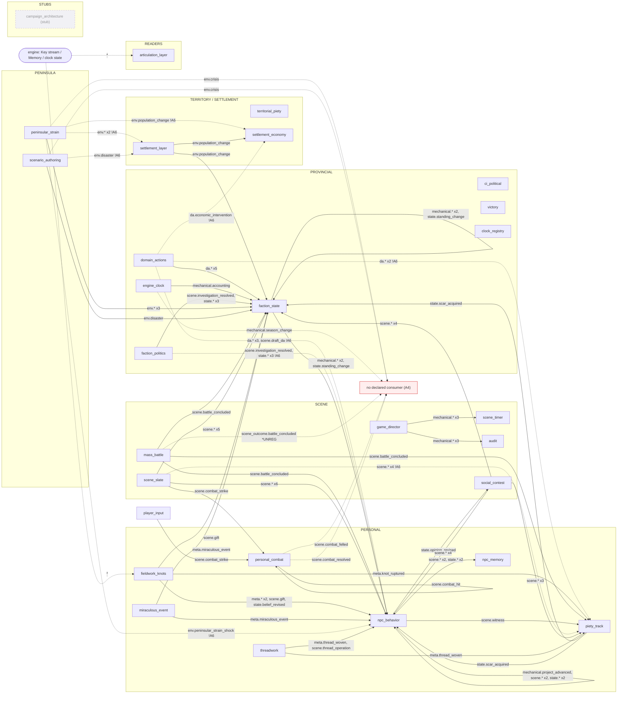
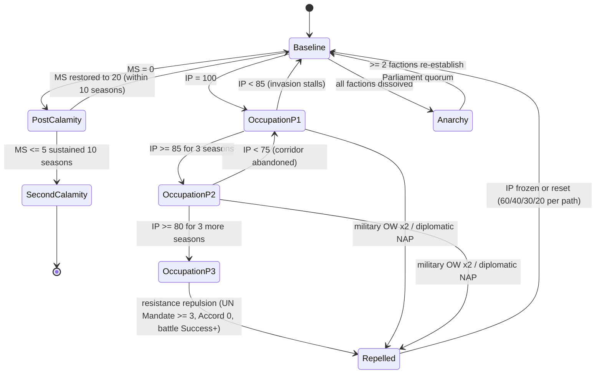

<!--
GENERATED by tools/join_audit_workings.py. NEVER hand-edit a fragment body: edit the source and
re-join, or if the sources are purged, treat this file as the archive of record.

This is a VERBATIM concatenation of the working papers of one audit unit — drafts, refutes, judge
passes, spec fragments — joined so the unit could keep its reasoning without keeping N files
(Jordan, 2026-08-04: "we can join them all together and purge the excess"). Each fragment sits
between BEGIN/END delimiters carrying its original path, and `--check` re-splits on those
delimiters and compares against source bytes, so the join is reversible rather than merely tidy.

Nothing was summarised, reflowed or renumbered. A fragment's `## Status:` line still describes the
FRAGMENT, not this file.
-->

# audit/2026-07-13-multi-agent-audit — joined working papers

47 fragment(s), joined in sorted path order.

<!-- VALORIA-JOINED-FRAGMENT BEGIN: audit/2026-07-13-multi-agent-audit/crawler_log/compliance_check_delta.md -->
# Crawler-log delta — compliance_check (2026-07-13 multi-agent audit)

**Instrument just completed:** compliance_check — PASS, exit 0, zero violations of any severity
(`designs/audit/2026-07-13-multi-agent-audit/compliance_check/raw_output.txt`).

**What existed at cross-reference time** (`find designs/audit/2026-07-13-multi-agent-audit -type f`):
- `compliance_check/raw_output.txt` — this instrument's own output. Read in full (3 lines: banner,
  `[COMPLIANCE ✓] All files within thresholds`, done — no per-file token counts printed by the tool
  itself; the specific numbers below come from the compliance_check agent's own summary text and from
  `references/atomization_rules.yaml`, cross-checked directly).
- `crawler_log/vector_audit_delta.md` — the crawler-logger pass for the previous instrument
  (vector_audit, BLOCKED/stub). Read in full; it already logged "no compliance_check cross-reference
  available" against a zero-file inventory. That pass ran before mechanic_audit/module_adjudicator had
  written anything — this pass now has both, so the picture is fuller.
- `mechanic_audit/` — at first read (03:33) held 6 complete subsystem folders; **re-checked at this
  pass (post-architecture-completion) and now holds 7 complete subsystem folders** (`architecture`,
  `faction_political`, `fieldwork_investigation`, `mass_battle`, `personal_combat`,
  `settlement_territory`, `social_contest`; the 8th, `threadwork`, is an empty directory — no files —
  consistent with `00_cross_reference_report.md`'s note that the threadwork mechanic_audit pass never
  ran). Read all `gap_register_update.md` in full; grepped `formula_audit.md`/
  `core_principles_audit.md`/`number_systems_audit.md` across all 7 populated subsystems (including a
  fresh re-grep of the newly-completed `architecture/` folder) for hits on the compliance-relevant
  filenames (`module_contracts.yaml`, `values_master.yaml`, `mechanical_terms_index.md`,
  `coverage_matrix.md`, `HANDOFF.md`, `numeric_bounds_report.yaml`, `npc_registry.yaml`,
  `00_philosophical_foundations.md`). `architecture/` adds **zero** new hits — the finding below is
  unchanged by its completion.
- `module_adjudicator/` — 4 files, complete (`module_flowchart.mermaid`, `state_graph.mermaid`,
  `module_map_flat.md`, `verdict_full_graph.md`). Read `module_map_flat.md` and `verdict_full_graph.md`
  in full.
- `vector_audit/00_status.md` — BLOCKED/stub, no analytic content (confirmed by reading it and by the
  prior crawler-log pass); nothing to cross-reference from vector_audit's own output.

---

## 1. Convergent evidence (three instruments, one file): `references/module_contracts.yaml`

This is the highest-value finding this round — the same file is independently implicated by all three
other instruments that have produced content, from three genuinely different angles, and the angles
compound into a real forward risk rather than three unrelated observations:

- **compliance_check (this instrument)** spot-checked `module_contracts.yaml` at **14.4k / 18k tokens**
  (80% of cap) — comfortably passing today, but flagged its own **severity-classification bug**: CI
  mode's inline logic only treats `on_exceed` values in `{flag_unknown_pattern, flag_for_split,
  flag_for_next_session}` as warn-tier; `module_contracts.yaml`'s actual policy in
  `references/atomization_rules.yaml:251-254` is **`on_exceed: "warn_only"`**, which is NOT in that
  treated-as-warn set — meaning if this file ever crosses 18k tokens, CI mode's inline logic falls
  through to **error severity** (exit 1, blocking merge to `main` per CLAUDE.md §8), contradicting the
  file's own explicitly-authored "raise the cap, don't block on it, this file is expected to grow" intent
  recorded right next to the policy (`atomization_rules.yaml:254`: "expected to grow, not shrink, as
  those gaps get filled").
- **module_adjudicator** (`module_adjudicator/module_map_flat.md:3`) names this exact file as its
  **source of truth** ("REGENERATE, never hand-edit") for the entire 27-module graph this run just
  produced, and its own remediation queue in `verdict_full_graph.md` (P1-A, P2-A, P3-A, P3-B — lines
  149-153) queues **four separate edits into this same file**: removing a spurious
  `scene_outcome.battle_concluded` emit, propagating ED-1038 §12 transitions, wiring a consumer for
  `env.crisis`, and reconciling an npc_behavior↔social_contest loop annotation. Every one of these is
  additive or structural content landing in the file compliance_check just measured at 80% of cap.
- **mechanic_audit** (`mechanic_audit/social_contest/gap_register_update.md:27`, GAP-13/G-13)
  independently found, from the content-correctness side rather than the structural or size side, that
  `module_contracts.yaml` L425-447 (the `social_contest` entry) is **stale** — it predates the Stage
  1b-3 δσ-substrate rebuild and still reads `resolver: dice_pool`. Filed P2, already tracked
  (`ED-SC-0008`), status "No action — already tracked" — but a live fix for that gap is itself another
  future edit destined for the same file, on top of module_adjudicator's four.
- **Cross-reference:** three independent axes (a documented severity-classification bug in
  compliance_check's own CI-mode logic; a structural remediation queue module_adjudicator authored
  against the file this very run; and a content-staleness gap mechanic_audit found in the file
  independently) all converge on one file that is (a) explicitly designed to keep growing per its own
  atomization-rules note, (b) sitting at 80% of its cap today, and (c) has at minimum 5 known pending
  edits queued against it from this run's own two other instruments. None of this is a violation
  today — compliance_check correctly reported PASS — but it is a specific, named, near-term collision:
  the next time someone lands module_adjudicator's P1-A/P2-A/P3-A/P3-B fixes plus mechanic_audit's
  ED-SC-0008 fix into this file, growth toward 18k is plausible, and if it crosses that threshold the
  misclassification bug this instrument itself flagged would turn a designed-to-be-tolerated warn into
  an unexpected CI-blocking error. **Recommended action for the synthesis pass:** either (i) file an ED
  to fix compliance_check's `on_exceed` severity-set to include `warn_only`/`flag_for_manual_archive`
  (compliance_check's own finding #3, IN lane), or (ii) flag `module_contracts.yaml` specifically for a
  cap increase ahead of the queued edits landing, before relying on CI to stay green through this
  file's next growth cycle.

## 2. No other compliance-relevant convergence found

- Grepped all 6 `mechanic_audit` subsystem folders for `values_master.yaml`, `mechanical_terms_index.md`,
  and `coverage_matrix.md` (the other three largest warn/flag-tier files compliance_check spot-checked:
  34.6k/50k, 33.3k/40k, 8.9k/10k respectively) — **zero matches**. No subsystem audit this run reads or
  flags those files as hard to reason about, needing decomposition, or otherwise notable. Stating this
  plainly rather than manufacturing a connection: as of this pass, `module_contracts.yaml` is the only
  file compliance_check's spot-check set overlaps with content the other two finished instruments
  actually touched.
- `module_adjudicator` output was also grepped for `values_master`/`mechanical_terms_index`/
  `coverage_matrix` — zero matches.
- `vector_audit/00_status.md` is a pure BLOCKED status report (confirmed by direct read and the prior
  crawler-log pass) — it contains no file-size, vocabulary, or citation-graph content to cross-reference
  against compliance_check's size-policy findings at all.

## 3. Note on compliance_check's own scope gap (finding #1) vs. what's visible so far

compliance_check's finding #1 — that CI mode never runs `_check_index` (missing/stale doc-index) or
`_check_archive_pressure` — is a real scope gap in this instrument, but nothing in mechanic_audit's or
module_adjudicator's finished output this round exercises doc-index staleness or archive pressure in a
way that lands a concrete missed-catch example (that class of defect is closer to vector_audit's job,
and vector_audit is blocked/stub this run — already logged in the prior crawler-log pass under "blind
spot," not duplicated here).

---

**Governance-file discipline:** this delta note is analysis-only, written solely to
`designs/audit/2026-07-13-multi-agent-audit/crawler_log/compliance_check_delta.md`. No writes were made
to `audit_registry.jsonl`, `editorial_ledger*.jsonl`, or `id_reservations.yaml` — those remain reserved
for this run's dedicated sequential registry step.

<!-- VALORIA-JOINED-FRAGMENT END: audit/2026-07-13-multi-agent-audit/crawler_log/compliance_check_delta.md -->

<!-- VALORIA-JOINED-FRAGMENT BEGIN: audit/2026-07-13-multi-agent-audit/crawler_log/mechanic_audit_delta.md -->
# Crawler Delta — mechanic_audit vs. other instruments (2026-07-13 multi-agent run)

**Logged after:** mechanic_audit (just completed, 7 subsystems: architecture, faction_political,
fieldwork_investigation, mass_battle, personal_combat, settlement_territory, social_contest).

**`find` at time of writing** showed content already present under:
- `mechanic_audit/` (all 7 subsystem folders, 5 files each — the audit whose delta this is)
- `module_adjudicator/` — `verdict_full_graph.md`, `module_map_flat.md`, `module_flowchart.mermaid`,
  `state_graph.mermaid` (full-graph pass, already finished)
- `vector_audit/00_status.md` (a status/blocked report, no findings — already finished)
- `compliance_check/raw_output.txt` (two-line CI-mode pass, no per-file detail — already finished)

All four instrument directories had content, so all three other instruments were checked. Below are
concrete cross-references, not vague correlation claims; each cites file+section on both sides.

---

## 1. Convergent evidence: mass_battle has a cluster of independent P1 provenance defects

Two mechanic_audit P1s and one module_adjudicator P1 all land on **mass_battle**, in the same run,
each discovered via a different check angle. None cite the same file, but all three are the same
*class* of defect — a false or broken provenance claim inside mass_battle's canon surface:

- **mechanic_audit G1** (`mechanic_audit/mass_battle/gap_register_update.md` row G1): two
  contradictory Ranged/Volley DR tables in `params/mass_combat.md` (PP-104 vs PP-188), ~2x apart at
  Heavy armor, neither marked superseded.
- **mechanic_audit G2** (same file, row G2): `mass_battle_v30.md` §A.14 "Woven units — brittleness"
  cites a compilation pass on `stage5_clocks.md` — a file that does not exist anywhere in the repo.
  Self-flagged in-doc `[EDGE-06 — P1]` but never filed as an ED.
- **module_adjudicator P1-A** (`module_adjudicator/verdict_full_graph.md` lines 24-27): `mass_battle`'s
  contract emits `scene_outcome.battle_concluded`, mislabeled "substrate §8.5 verbatim" — canon §8.5
  actually writes `scene.battle_concluded`; `scene_outcome` is only the *family name*. A fabricated
  type-string with a false provenance citation.

Read together: in this single run, mass_battle independently accumulated three separate P1-grade
"claims a source/reference that isn't real" defects — one in the params table, one in the design-doc
prose (dead file pointer), one in the module contract (mislabeled canon citation). No other subsystem
in mechanic_audit's output shows this density of provenance-integrity failures. This is worth flagging
to the synthesis pass as a pattern, not three unrelated one-offs: mass_battle's canon surface has a
recurring habit of asserting false pedigree for its own claims.

---

## 2. Convergent evidence: personal_combat Health formula — mechanic_audit's stale-doc finding is
   independently confirmed by module_adjudicator's citation

- **mechanic_audit GAP-PC-4** (`mechanic_audit/personal_combat/gap_register_update.md` row GAP-PC-4,
  detailed in `formula_audit.md` A3.1): `params/core.md:158`'s Health row uses the pre-D-A formula and
  is ~7% numerically drifted from both `designs/scene/derived_stats_v30.md:55-72` **§4.1** and the live
  `combatant.py:35-42`.
- **module_adjudicator** (`module_adjudicator/module_map_flat.md` line 247, derivations table row 7 /
  `verdict_full_graph.md` line 93 personal_combat CONFORMANT note): independently, and for an unrelated
  purpose (F1 write-legality check on the `Health` derived_value), cites the *exact same* authority —
  `r2_consequence_wounds.health_full = WI*(MaxWounds+1)+0.25*Str*End, minus accrued damage (ED-1041 /
  derived_stats_v30 §4.1)` — as the correct, canon-current Health formula.

This is genuine convergent evidence, not coincidence: two instruments, working from different corpora
(mechanic_audit read `params/core.md` + `derived_stats_v30.md` + `combatant.py`; module_adjudicator read
only `references/module_contracts.yaml`'s citation trail) independently anchor on `derived_stats_v30
§4.1` / ED-1041 as *the* authoritative Health formula. That strengthens mechanic_audit's GAP-PC-4 call
that `params/core.md` is the drifted outlier, not derived_stats_v30 — worth citing both sources together
if GAP-PC-4 is escalated past its current P2/no-ED disposition.

---

## 3. Convergent pattern: personal_combat's recurring "declared-but-dead" defect class

mechanic_audit found two internal-doc instances and module_adjudicator independently found a third,
structurally different instance, all within personal_combat:

- **GAP-PC-1** (`ability_armature.md` §2c/§7, `REARCHITECTURE_v1.md`): `reopen`/`disengage` lever named
  across 3 docs, never built.
- **GAP-PC-2** (`ability_armature.md` lines 47/53/169): `seize` lever is dead (cut 2026-06-05, verified
  ablation ~0), but §7 "Current state" still lists `vorschlag`/`sen_no_sen` as live abilities with "a
  positive, bounded edge" — an internal doc self-contradiction.
- **module_adjudicator A4** (`verdict_full_graph.md` line 93 / `module_map_flat.md` lines 449, 451, and
  §5 "orphan emissions"): `scene.combat_felled` and `scene.combat_resolved` are registry-declared
  personal_combat emits with **zero consumers** wired anywhere in the module graph ("registry-declared-
  but-unwired, tracked gap_note").

Three independent findings, two from the doc-prose side (mechanic_audit Mode D) and one from the
Key-contract wiring side (module_adjudicator's A4 orphan check), converge on the same subsystem-level
theme: personal_combat has multiple named-but-functionally-inert surfaces (an ability lever, two named
abilities that no-op, and two emitted-but-unconsumed outcome types). None of these individually rise to
P1 in either instrument's severity scheme, but the volume and cross-angle agreement suggests
personal_combat's "declared capability" surface has drifted further from its "actually live" surface
than either audit alone would suggest. Worth flagging to synthesis as a subsystem-level trend, since a
reader of `ability_armature.md §7` ("Current state") or `module_contracts.yaml`'s personal_combat entry
in isolation would not see the other instrument's half of the picture.

---

## 4. No cross-reference found: architecture Mode D findings (GAP-D1..D7) vs. module_adjudicator

Checked whether mechanic_audit's architecture-subsystem gap findings
(`mechanic_audit/architecture/gap_register_update.md`) line up with module_adjudicator's per-module
transition checks (J2 pass). They do not overlap in a checkable way, and that absence is itself worth
noting:

- **GAP-D3** (P1): `scale_transitions_v30.md` §3.3 "Personal → Scene (Contest)" is an empty Handoff
  Rule — no trigger, no effect, no editorial stub marker (unlike sibling §3.4/§3.6, fixed via ED-748).
- module_adjudicator's J2 transition-semantics pass (`verdict_full_graph.md` line 129) confirms every
  module that *does* declare a `transitions[]` citation points to real payload-carrying content (§3.4,
  §3.5/3.6, §3.1, §3.9, §12.3 — social_contest cites §3.4, not §3.3; personal_combat cites §3.4/§12.3,
  not §3.3). **No module contract currently cites §3.3 at all**, so J2's citation-fitness check never
  touches the empty section — it has nothing to check.

This means GAP-D3's hole is invisible to module_adjudicator's method by construction: J2 only validates
citations that exist, not the completeness of the promised-but-uncited Eight-Handoff-Rules taxonomy
itself. Flag for synthesis: this is a genuine blind spot at the seam between the two instruments, not
a disagreement — mechanic_audit is the only one of the two capable of catching an empty, never-cited
canonical section.

**GAP-D4/GAP-D5** (P1/P2, the residual "GM adjudication"/"GM recognises"/"GM use" language in
`scale_transitions_v30.md` §1/§3.2 and `player_agency_v30.md` §7.1) has no module_adjudicator
counterpart — that instrument checks Key-flow wiring, not prose-level no-GM-invariant compliance — so
no cross-reference exists here either. Noting the absence rather than inventing one.

---

## 5. vector_audit is BLOCKED — a real, named blind spot for exactly the defect class mechanic_audit
   is finding manually

`vector_audit/00_status.md` confirms (verified directly, not taken on faith) that
`scripts/vector_audit.py`'s Stage 1-7 dispatcher is unimplemented and the last real run
(`archives/audit/2026-04-29-topographic-analysis/`) is 304 files stale as of today. No vector-audit
findings exist to cross-reference. But the *kind* of defect mechanic_audit is catching by hand this run
is exactly what a working citation-graph/TF-IDF pipeline (vector_audit Stage 6 diagnostic modes) exists
to catch systematically across the whole corpus:

- **mechanic_audit G6** (`mechanic_audit/mass_battle/gap_register_update.md` row G6): `mass_battle_v30.md`
  cites a nonexistent `derived_stats_v1` at ~5 sites (current file is `derived_stats_v30.md`) — a stale
  cross-doc citation string, already independently caught once before by the 2026-07-08 batch_09 term
  sweep and now re-confirmed.
- **mechanic_audit GAP-D4/D5**: the "GM adjudication" language pattern was fixed once in
  `player_agency_v30.md` §4.2 (ED-WR-0007) but survives in two more locations across two files
  (`scale_transitions_v30.md` §1/§3.2, `player_agency_v30.md` §7.1) — a corpus-wide terminology-drift
  pattern that a citation/vocabulary graph is precisely built to surface exhaustively rather than by
  spot-check.

Both are hand-found, one-subsystem-at-a-time hits of a defect class (stale citation strings, drifted
terminology) that vector_audit's blocked pipeline would otherwise sweep corpus-wide. Flag for synthesis:
until the Stage 1-7 dispatcher is implemented, mechanic_audit's per-subsystem Mode D pass is the *only*
detector for this class running in this multi-agent audit, and it only covers the 7 subsystems in scope
this run — there is no corpus-wide backstop.

---

## 6. compliance_check produced no per-file output to cross-reference

`compliance_check/raw_output.txt` is two lines: `[COMPLIANCE] CI mode — checking local repo state` /
`[COMPLIANCE ✓] All files within thresholds`. No file-level size/atomization detail was written, so
there is nothing to check mechanic_audit's flagged docs against (e.g., whether `ability_armature.md` —
which mechanic_audit found carries two different stale/self-contradicting status banners, GAP-PC-2 and
GAP-PC-3 — is also large/atomization-flagged). If compliance_check's synthesis-facing output later gains
per-file detail, `ability_armature.md`, `scale_transitions_v30.md`, and `mass_battle_v30.md` (each
carrying multiple independently-confirmed structural defects this run) are the three worth checking
first.

---

## Summary for synthesis

- **Strongest cross-instrument signal:** mass_battle (§1) — 3 independent P1s, same defect class, same
  module, different files/layers.
- **Strongest confirming signal:** personal_combat Health formula (§2) — module_adjudicator's citation
  trail independently corroborates which formula is canonical, backing mechanic_audit's stale-doc call.
- **Strongest pattern signal:** personal_combat "declared but dead" (§3) — 3 separate instances across
  2 instruments in 1 subsystem.
- **Coverage gaps to carry forward:** GAP-D3 is invisible to module_adjudicator's J2 method by
  construction (§4); vector_audit's blocked pipeline leaves stale-citation/terminology-drift detection
  entirely to mechanic_audit's manual per-subsystem sweep, uncovered corpus-wide (§5); compliance_check
  gives synthesis nothing to check file-size claims against yet (§6).

<!-- VALORIA-JOINED-FRAGMENT END: audit/2026-07-13-multi-agent-audit/crawler_log/mechanic_audit_delta.md -->

<!-- VALORIA-JOINED-FRAGMENT BEGIN: audit/2026-07-13-multi-agent-audit/crawler_log/module_adjudicator_delta.md -->
# Crawler-log delta — module_adjudicator (2026-07-13 multi-agent audit)

**Instrument just completed:** module_adjudicator — graph verdict OPEN (22 violations / 61 warnings,
exit 1), three root causes (1 A2 fabricated emit on `mass_battle`, 1 A8 registry gap on `piety_track`,
20 A6 down-seam-cluster violations across 9 modules). Full detail:
`designs/audit/2026-07-13-multi-agent-audit/module_adjudicator/verdict_full_graph.md`.

**What existed at cross-reference time** (`find designs/audit/2026-07-13-multi-agent-audit -type f`):
- `module_adjudicator/` — this instrument's own 4 output files. Read `verdict_full_graph.md` and
  `module_map_flat.md` in full.
- `mechanic_audit/` — 6 subsystem folders (`settlement_territory`, `personal_combat`, `mass_battle`,
  `social_contest`, `faction_political`, `fieldwork_investigation`), 5 files each, all complete. Read
  all 6 `gap_register_update.md` in full; grepped the other 4 file-types per subsystem for
  `outcome`/`conclude`/`emit`/`piety`/`conviction`/`transitions`/`down-seam`/`scale_transitions`/
  `settlement_layer`/`settlement_economy`/`faction_politics`.
- `compliance_check/raw_output.txt` — complete (3 lines, clean PASS, no per-file findings).
- `vector_audit/00_status.md` — complete (BLOCKED/stub, confirmed by direct read).
- `crawler_log/compliance_check_delta.md` and `crawler_log/vector_audit_delta.md` — both already
  written by earlier crawler passes in this run. Read both in full to avoid re-deriving the same
  cross-references; noted below where I defer to them rather than repeating, and where I add something
  neither caught.

Two prior crawler passes already did substantial module_adjudicator↔mechanic_audit cross-referencing
(Fort Level granularity mismatch, the Prosperity ×50/×10 possible contradiction, mass_battle as a
multi-instrument hotspot, and the piety_track/canonical_sources blind-spot note). Rather than repeat
those, this pass focuses on what's new since: (1) an uncaught cross-lane duplication risk on the
piety_track finding specifically, and (2) mechanic_audit evidence that directly corroborates
module_adjudicator's own "intent gate PASSES" read of the P2-A down-seam cluster — neither prior note
surfaced either of these.

---

## 1. NEW — piety_track A8 finding likely overlaps an already-open ticket in a different lane (ED-SC-0003)

- **module_adjudicator** P1-B (`verdict_full_graph.md`): `piety_track`'s real home doc
  (`designs/personal/conviction_track_v1.md`, the personal-scale Conviction-scar canon) is absent from
  `references/canonical_sources.yaml` — only the unrelated territorial `conviction_track_v30.md` is
  registered. Proposed lane: **IN**.
- **mechanic_audit** (`mechanic_audit/social_contest/number_systems_audit.md:22` and
  `mechanic_audit/social_contest/gap_register_update.md:20`, G-6) independently documents "Piety Track"
  as a **name collision between two referents**: the 0–10 debate tracker (sourced to
  `conviction_track_v1.md`, the *same file* module_adjudicator flags as unregistered) and the
  per-territory BG stat (`params/bg/core.md`). This is **already tracked**: `ED-SC-0003`, P0 docket,
  P2 severity, `needs_jordan`, status **open** — filed in the **SC** lane, transitively referenced via
  `scale_transitions_v30.md` §5.4.
- **Cross-reference:** both findings center on the exact same file, `conviction_track_v1.md`, and the
  exact same underlying confusion (two things both called "Piety Track" at different scales, one of
  which has no clean registry footing). module_adjudicator's A8 finding reads as the *contract-registry
  symptom* of the *naming-collision root cause* mechanic_audit already has open under ED-SC-0003. These
  are not verified to be the identical fix (ED-SC-0003 may resolve via renaming one of the two tracks
  rather than registering `conviction_track_v1.md` as-is; module_adjudicator's fix is purely additive
  registration), but they are close enough that filing module_adjudicator's proposed new **IN**-lane ED
  without first checking ED-SC-0003's actual scope risks two lanes (SC and IN) independently resolving
  overlapping halves of one problem, or worse, resolving it in incompatible ways (e.g. ED-SC-0003
  renames/retires `conviction_track_v1.md`'s "Piety Track" label while an IN-lane ED simultaneously
  registers it under that same name). **Recommended action for the synthesis pass:** read ED-SC-0003's
  full ledger entry before filing module_adjudicator's A8 fix; either fold the canonical_sources.yaml
  registration into ED-SC-0003's remediation, or explicitly cross-cite ED-SC-0003 in the new IN-lane
  entry so both stay coordinated rather than colliding.

## 2. NEW — mechanic_audit's doc-consistency reads corroborate module_adjudicator's own "intent gate PASSES" verdict on the P2-A down-seam cluster

module_adjudicator's summary explicitly argues the 20 A6 violations are *not* a missing-mechanism hole
— the couplings are "deliberate/registry-canonical," and the real residual is unpopulated
`transitions[]`/`targets[]` entries (a contract/script gap), not absent design. Two independent
mechanic_audit passes, reading the prose side with no visibility into the contract graph, land on the
same read for two of the nine flagged down-seam modules:

- **`mass_battle` → `scene_slate`:** `mechanic_audit/mass_battle/core_principles_audit.md:9` (Mode B,
  Fail-Forward check) confirms Part D of `mass_battle_v30.md` "mandatory[ly guarantees] every battle
  produces mandatory downstream state change... Part D's mandatory post-battle Scene Slate similarly
  guarantees narrative continuation." That is an independent, doc-only confirmation that the
  `mass_battle → scene_slate` edge is a real, deliberately-authored coupling — one of the exact 9
  modules in module_adjudicator's down-seam cluster (`scene_slate` and `mass_battle` are both
  NON-CONFORMANT in this run).
- **`faction_political` ↔ `settlement_layer`:** `mechanic_audit/faction_political/
  mechanic_dependency_graph.md:5` rates the Legitimacy/Popular-Support coupling from `settlement_layer
  §1.8` into faction Mandate/Strictness as "well-connected, single source of truth... explicitly cited
  everywhere it's consumed," with **no gap flagged**. `settlement_layer` and `faction_politics` are
  both in module_adjudicator's own `nonConformantModules` list for this run.
- **Cross-reference:** neither mechanic_audit pass was looking for contract-graph transitions[] entries
  — they were independently assessing doc-level design coherence — yet both confirm the underlying
  mechanic is real, intentional, and correctly specified in prose for two of the nine flagged modules.
  This strengthens module_adjudicator's own conclusion that the P2-A cluster's fix belongs in the
  contract/script layer (populate `transitions[]` per scale_transitions §12.3, fix the A6 assessor's
  §12.2 exemption blindness) rather than in design authoring — there is no design gap here for the
  synthesis pass to worry about re-opening on these two edges specifically.

## 3. mass_battle's A2 fabricated-emit finding is orthogonal to, and not contradicted by, mechanic_audit's clean GD-1 read

- **module_adjudicator** flags `mass_battle` for a fabricated `scene_outcome.battle_concluded` emit
  (mislabeling canon's actual `scene.battle_concluded`) — a contract-transcription defect.
- **mechanic_audit** (`mass_battle/gap_register_update.md:43`) separately confirms "GD-1 compliance
  (no mass-battle-outcome → game-victory path): confirmed intact, both docs. No action."
- **Cross-reference:** these are compatible, not contradictory — a mislabeled/duplicated emit type name
  does not by itself create a victory-condition leak, and mechanic_audit's GD-1 check was scoped to
  outcome→game_victory paths specifically, not emit-type naming fidelity. Noting this explicitly so the
  synthesis pass doesn't need to re-verify that the A2 fix is safe with respect to GD-1 — it already is,
  independently confirmed.

## 4. settlement_layer — deferring to the prior vector_audit_delta note, flagging only the aggregate count

`crawler_log/vector_audit_delta.md` §§1–2 already did detailed work on `settlement_layer_v30.md`'s
Fort-Level granularity mismatch (GAP-02) and the possible ×50/×10 Prosperity-formula contradiction
(GAP-01) against module_adjudicator's derivation-graph verdict. Not re-derived here. Adding only the
aggregate count from this pass: `settlement_layer` (module) / `settlement_layer_v30.md` (doc) is now
independently flagged by **two** of the three finished instruments — mechanic_audit (4 separate P1
content gaps: GAP-01 through GAP-04, all lane=SE) and module_adjudicator (A6 down-seam
`transitions[]` gap, part of the P2-A cluster, proposed lane=IN) — plus `settlement_economy` also
sitting in module_adjudicator's NON-CONFORMANT list. compliance_check's clean pass means none of this
is a file-size problem; it's a content-and-wiring problem concentrated on one subsystem across two
different audit angles. Worth the synthesis pass treating settlement_layer as a priority remediation
target on volume alone, independent of any single finding's severity.

## 5. compliance_check — nothing new beyond the prior pass

`crawler_log/compliance_check_delta.md` already covers the highest-value compliance cross-reference
available this run: `module_contracts.yaml` sitting at 80% of its token cap while module_adjudicator's
own remediation queue (P1-A/P2-A/P3-A/P3-B, `verdict_full_graph.md` lines 149-153 — the same fixes
referenced in §§1-2 above) stages at least 4-5 more edits into that exact file, compounded by a
severity-classification bug in compliance_check's own CI-mode logic. Confirmed still accurate this
pass; no new compliance-side finding to add.

## 6. vector_audit — still blocked, no new blind-spot beyond the prior note plus one addition

`crawler_log/vector_audit_delta.md` §4 already lists the stale-citation/registry-gap pattern
(`piety_track`'s missing canonical_sources.yaml entry among them) that a working corpus-wide
vector_audit pass would normally catch systematically. One addition from this pass: §1 above (the
Piety Track cross-lane duplication risk between module_adjudicator's A8 finding and mechanic_audit's
open ED-SC-0003) is itself a textbook case of exactly what a vocabulary-collision detector
(vector_audit's Stage 6 diagnostic modes, per its own SKILL.md) exists to catch in one place instead of
two separate instruments each independently finding half the picture from different angles. Concrete,
not hypothetical — it just happened, in this run, between the two instruments that did finish.

---

**Governance-file discipline:** this delta note is analysis-only, written solely to
`designs/audit/2026-07-13-multi-agent-audit/crawler_log/module_adjudicator_delta.md`. No writes were
made to `references/audit_registry.jsonl`, `canon/editorial_ledger*.jsonl`, or
`references/id_reservations.yaml` — those remain reserved for this run's dedicated sequential registry
step, consistent with every instrument's own stated constraint this run.

<!-- VALORIA-JOINED-FRAGMENT END: audit/2026-07-13-multi-agent-audit/crawler_log/module_adjudicator_delta.md -->

<!-- VALORIA-JOINED-FRAGMENT BEGIN: audit/2026-07-13-multi-agent-audit/crawler_log/vector_audit_delta.md -->
# Crawler-log delta — vector_audit (2026-07-13 multi-agent audit)

**Instrument just completed:** vector_audit — BLOCKED (stub, no run produced; see
`designs/audit/2026-07-13-multi-agent-audit/vector_audit/00_status.md`).

**What existed at cross-reference time** (`find designs/audit/2026-07-13-multi-agent-audit -type f`):
- `vector_audit/00_status.md` — this instrument's own status-only output.
- `module_adjudicator/` — 4 files, complete (`module_flowchart.mermaid`, `state_graph.mermaid`,
  `module_map_flat.md`, `verdict_full_graph.md`). **Read in full.**
- `compliance_check/raw_output.txt` — complete, 3 lines: `[COMPLIANCE] CI mode`, `[COMPLIANCE ✓] All
  files within thresholds`, done. **Read in full.** No violations were reported, so there is nothing
  to cross-reference against a size/atomization finding this round — noted explicitly per the brief's
  instruction to say so plainly rather than invent a connection.
- `mechanic_audit/` — 6 subsystem folders each with 5 files (`formula_audit.md`,
  `mechanic_dependency_graph.md`, `core_principles_audit.md`, `number_systems_audit.md`,
  `gap_register_update.md`) for `settlement_territory`, `personal_combat`, `mass_battle`,
  `social_contest`, `faction_political`, `fieldwork_investigation`. **Read all 6 `gap_register_update.md`
  files in full**; spot-checked `formula_audit.md`/`core_principles_audit.md` via grep for direct
  cross-hits (`conviction_track`, `scene_outcome.battle_concluded`, `Fort Level`, `domain_actions`).

Since vector_audit itself produced no analytic content (confirmed stub, per its own report), there is
nothing from vector_audit's *output* to cross-reference — no cite-graph findings, no vocabulary-drift
list, no P1/P2/P3 structural-property results exist this run. What follows is (a) what vector_audit's
absence leaves uncovered that the other two finished instruments' actual output reveals as gaps of
exactly the kind vector_audit exists to catch, and (b) one genuine convergent/contradictory finding
pair between module_adjudicator and mechanic_audit that a working vector_audit pass would likely have
surfaced as a cite-graph inconsistency on its own.

---

## 1. Convergent evidence: settlement_layer Fort Level — module_adjudicator's derivation graph
silently encodes a variable mechanic_audit proved undefined

- **module_adjudicator** (`module_adjudicator/verdict_full_graph.md` §4.4 Derivations, row
  "Defense, Fort Level → Garrison Strength") and `module_map_flat.md` §2 (node `d2_s`/`d2_t`) both
  cite the formula `Garrison Strength = Defense × 20 + Fort × 30` from `settlement_layer_v30 §1.3`,
  and the graph verdict reports **A10/A11 gate/derivation integrity at 100%, zero violations** for
  this derivation.
- **mechanic_audit** (`mechanic_audit/settlement_territory/gap_register_update.md`, GAP-02, filed
  **P1**) independently read the same section and found that "Fort Level" as used in this exact
  formula is a **province-granularity value (one per T1–T17)** with **no rule mapping it onto a
  province's 1–3 constituent settlements** post the PP-726 two-tier split — i.e. the input variable
  the formula consumes is not actually defined at the granularity the formula operates at.
- **Cross-reference:** module_adjudicator's contract-level A10/A11 check is necessarily syntactic
  (does a derivation cite a source field that exists?) and cannot detect a granularity mismatch
  between a province-scoped field and a settlement-scoped formula — so it correctly reports "zero
  violations" while mechanic_audit's prose-level read catches a real P1 defect in the same formula.
  This is exactly the kind of gap a working `vector_audit` topographic pass (which builds a term/
  cite graph across granularity boundaries, per its `PILOT_TOKENS`/`SEED_TOKENS` design intent) would
  be positioned to flag structurally rather than requiring a subsystem-scoped mechanic audit to catch
  it by hand. **Action implied:** module_adjudicator's derivation-graph verdict for this row should
  not be read as "formula sound" — it only certifies citation existence, not granularity fitness;
  GAP-02 (P1, lane=SE) is the substantive finding.

## 2. Possible contradiction: settlement Prosperity → Treasury/Local-Economy multiplier

- **mechanic_audit** GAP-01 (P1, `settlement_territory/gap_register_update.md`) asserts that
  `settlement_layer_v30.md` states Settlement Prosperity's contribution to **faction Treasury income**
  as **both ×50** (§1.3, "Local Economy") **and ×10** (§1.8, citing `derived_stats §8.1`) "for what
  both passages describe as the same edge" — flagged as an internal formula conflict.
- **module_adjudicator**'s derivation table (`verdict_full_graph.md` §4.4) lists these as **two
  distinct, non-conflicting derivations**: `d1` Prosperity → Local Economy (`×50`, settlement-internal
  stat) and `d6` settlement Prosperity → faction Treasury income (`Σ settlement Prosperity × 10`,
  cross-module to `faction_state`) — and reports the derivation layer as A10/A11-clean with **zero
  violations**.
- **Cross-reference (flag, not resolved here):** either mechanic_audit is right that the doc conflates
  these as one edge (in which case module_adjudicator's clean derivation-graph read is masking the
  defect by treating the doc's two multiplier statements as if they were always cleanly separated
  targets), or module_adjudicator's reading of §1.3/§1.8 as genuinely distinct derivations is correct
  and GAP-01 is a false-positive born of the doc's own ambiguous prose rather than a true formula
  conflict. This is a live tension between the two just-completed instruments' verdicts on the same
  source text (`settlement_layer_v30.md §1.3` vs `§1.8`) that neither instrument itself flags as a
  disagreement with the other — worth the synthesis pass resolving by re-reading §1.3/§1.8 with both
  framings in hand before GAP-01 is filed as lane=SE.

## 3. mass_battle: independently flagged as a hotspot by both finished instruments, different defects

- **module_adjudicator** flags `mass_battle` **NON-CONFORMANT** (P1-A): a fabricated/mislabeled emit
  type `scene_outcome.battle_concluded` that conflates a family name with a type_id (contract defect,
  proposed lane=MB).
- **mechanic_audit** (`mass_battle/gap_register_update.md`) independently flags `mass_battle_v30.md`
  with **two separate P1s**: G1 (contradictory Ranged DR tables, PP-104 vs PP-188) and G2 (an
  orphaned "Woven units — brittleness" fragment citing a nonexistent `stage5_clocks.md`).
- **Cross-reference:** these are three distinct P1 defects (contract-schema, formula-table,
  dangling-reference) converging on the same subsystem doc-set from two structurally different audit
  angles in the same run — none is a duplicate of another, but the subsystem is carrying disproportionate
  P1 volume across instrument types and is a strong candidate for the synthesis pass to treat as one
  consolidated MB-lane remediation batch rather than three independent ED filings landing separately.

## 4. What vector_audit's blocked status leaves uncovered (blind-spot note)

The two finished instruments each independently caught **stale/dead cross-reference** defects of
exactly the kind a corpus-wide citation/vocabulary graph (vector_audit's actual job) would catch
systematically instead of piecemeal, per-subsystem:
- `settlement_territory/gap_register_update.md` GAP-05: `settlement_adjacency_v30.md` still cites
  pre-PP-726 S-IDs (S-011/S-034 now refer to different settlements) — a co-file drift between prose
  and the already-rebuilt `valoria_geography_v30.yaml`.
- `fieldwork_investigation/gap_register_update.md` GAP-4: four citations to a nonexistent
  `stage11 §11.x`, with the live target renumbered under `scale_transitions_v30.md`.
- `mass_battle/gap_register_update.md` G6: ~5 stale `derived_stats_v1` citations (file no longer
  exists; current file is `derived_stats_v30.md`).
- `module_adjudicator/verdict_full_graph.md` P1-B: `piety_track`'s real home doc
  (`designs/personal/conviction_track_v1.md`) is absent from `canonical_sources.yaml` entirely (a
  registry/vocabulary gap, not just a stale pointer).

Each of these was found only because a subsystem-scoped instrument happened to read the specific
section containing the dangling citation. **No subsystem in this run's mechanic_audit slate covers
piety_track/conviction_track_v1, threadwork, npc_behavior, or victory** — exactly the modules
module_adjudicator flags with A6/A8 issues — so the same class of stale-citation or missing-registry-
entry defect plausibly exists uncaught in those modules this run, and only a working vector_audit pass
(or a future mechanic_audit lane on those subsystems) would surface it. This is the concrete,
citable form of "vector_audit's blocked status is a blind spot": it is not hypothetical — the pattern
it would generalize over is already showing up independently, four separate times, in the instruments
that did run.

## 5. No compliance_check cross-reference available

`compliance_check/raw_output.txt` reported a clean pass (`All files within thresholds`) with no
per-file findings, so there is no size/atomization violation to cross-reference against any
mechanic_audit "hard to reason about" or module_adjudicator decomposition flag this round. Stating
this plainly per the task brief rather than manufacturing a connection.

---

**Governance-file discipline:** this delta note is analysis-only, written solely to
`designs/audit/2026-07-13-multi-agent-audit/crawler_log/vector_audit_delta.md`. No writes were made to
`audit_registry.jsonl`, `editorial_ledger*.jsonl`, or `id_reservations.yaml` — those remain reserved
for this run's dedicated sequential registry step, consistent with every instrument's own stated
constraint above.

<!-- VALORIA-JOINED-FRAGMENT END: audit/2026-07-13-multi-agent-audit/crawler_log/vector_audit_delta.md -->

<!-- VALORIA-JOINED-FRAGMENT BEGIN: audit/2026-07-13-multi-agent-audit/mechanic_audit/architecture/core_principles_audit.md -->
# Core Principles Compliance — Architecture / Key Substrate

**Skill:** valoria-mechanic-audit, Mode E

**Note on the principle list used.** The skill's own Mode E table hardcodes a legacy 13-item list ("Roll only when meaningful," "Let It Ride," "Fail Forward," "Histories not Skills," etc.) — a dice/character-facing TTRPG principles set. The *working tree's* `canon/02_canon_constraints.md` (read per this audit's mandatory input-validation step) does not contain that list at all; it defines **P-01 through P-15** (philosophical/ontological constraints from the Foundations) plus **§B GD-1 through GD-3** (mutable game-design directives). Per CLAUDE.md's explicit instruction that canon/working-tree content overrides any stale instruction text, this audit tests against the file that actually exists — **P-01..P-15 and GD-1..3** — rather than fabricating results against a 13-item list this codebase's canon file does not contain. (This mismatch between the skill's template and the live canon file is itself worth a maintenance note — flagged at the end, not filed as an ED since it's a skill/tooling hygiene item, not a mechanical defect in the audited docs.)

## P-01 – P-15 (canon/02_canon_constraints.md §A)

| # | Constraint | Test | Verdict | Notes |
|---|---|---|---|---|
| P-01 | Inseparability — tridimensional co-movement on every thread op | Does the mechanic allow a thread op to resolve without all 3 dimensional auto-effects? | **ABSENT (out of scope, correctly deferred)** | Key substrate's 4-axis `symbolic_dimensions`/`impact_vector` (hierarchical/sacred/instrumental/traditional) is a *different* axis space than P-01's three dimensions (temporal/epistemic/actual) — it's a social/political-interpretation substrate, not the thread-operation co-movement mechanic itself. Enforcement of P-01's specific tridimensional auto-effects belongs to `threadwork.md` (out of this audit's 4-doc scope). No violation found; the substrate doesn't suppress or interfere with that enforcement. |
| P-02 | Monstrosity grounded in the Real, not moral register | Does any monster description use moral-negativity framing? | **ABSENT (N/A)** | No monster content in these 4 docs. |
| P-03 | Rendering = consciousness-performed; GM is the rendering engine | Does the mechanic treat the rendered world as separate from consciousness? | **PRESENT — and load-bearing.** | This is the strongest compliance point in the whole doc set. `key_substrate_v30.md` §4.1–§4.2 (`on_key_emitted`, `compute_observers`, per-observer `armature.interpret(key)`) is a literal, deterministic implementation of "rendering is what minds do" — every Key is interpreted *per observer* via that observer's own `armature_position`, with no shared/objective rendering. This is exactly the substrate the videogame's no-GM model needs. See P-03's Foundations text ("GM is the rendering engine") against CLAUDE.md's "there is no GM — the engine resolves everything": the Key substrate is precisely the mechanism that makes that translation work (the engine performs the armature-interpretation role a GM would have performed). This makes GAP-D4/D5 (literal "GM" language surviving in `scale_transitions_v30.md`/`player_agency_v30.md`, see gap_register_update.md) a real inconsistency: the substrate *already* implements the no-GM rendering role P-03 requires, but two sibling docs in the same architecture family still describe cross-mode resolution using the literal pre-translation ("GM adjudication") language instead of pointing at this mechanism. |
| P-04 | Monstrosity ontological, not moral | Does any rule assign moral valence to monstrous entities? | **ABSENT (N/A)** | No monster content. |
| P-05 | Three emergence modes mechanically distinct | Are Modes 1/2/3 distinguishable? | **ABSENT (N/A)** | Not addressed by these 4 docs (miraculous_event/threadwork territory). `key_type_registry_v30.md` does carry `meta.miraculous_event` as a Key type but doesn't itself define mode-distinction rules — correctly deferred to `miraculous_event_v30.md`. |
| P-06 | Threadcut beings have no layer 2 | Coherence applied to threadcut beings? | **ABSENT (N/A)** | Not addressed here. |
| P-07 | Calamity = rendered-side mechanism, ground has no agency | Does any rule attribute agency/intention to the Ein Sof/ground? | **PRESENT (neutrally compliant)** | `env.peninsular_strain_shock` / `env.crisis` / `env.disaster` Key types (key_type_registry_v30.md §6) are agency-neutral data carriers (`strain_delta`, `affected_territories`, `causes[]`) — they record consequences without attributing intent or responsiveness to the ground. No violation. |
| P-08 | Epistemological barrier = inaccessibility | Can non-sensitives gain Thread-level knowledge via study alone? | **ABSENT (N/A)** | Not addressed here. |
| P-09 | Memory pulling messy/costly/detectable | Clean undetectable erasure allowed? | **ABSENT (N/A)** | Key substrate's Memory-as-Key-reference (§4.3) is the generic infrastructure a memory-pulling mechanic would sit on top of, but this doc set doesn't itself implement memory pulling — correctly deferred. |
| P-10 | Coherence indexes commensurability, tridimensional drift | Does any Coherence-drift mechanic manifest in only one dimension? | **ABSENT (N/A, correctly deferred)** | `scale_transitions_v30.md` §6.4/§6.5 track *who pays* Coherence cost during cross-scale bridging (Coherence Initialization, Hybrid Coherence Cost binary-declaration rule) — this is bookkeeping for an externally-defined Coherence track, not the drift mechanic itself. No violation. |
| P-11 | Temporal Disjunction universal — every thread op produces some TD | Does any thread op produce zero temporal consequence? | **ABSENT (N/A — false alarm resolved)** | `scale_transitions_v30.md` §10's "Thread Timing in Hybrid" table lists Lock/Weave/Mend → "CI Effect: None." Initially looked like a P-11 violation (zero temporal consequence), but §4.3.3 confirms `CI` = "Church Institutional [attention]" clock (a peninsula-scale faction clock), not the P-11 temporal auto-effect/CD track. Different mechanic, different name collision only. No violation. |
| P-12 | Drift propagation tridimensional via knots | Propagation in only one dimension / generic strain value? | **ABSENT (N/A)** | `meta.knot_formed`/`meta.knot_ruptured` Key types exist in the registry but don't themselves implement drift-propagation math — correctly deferred to conviction_track/fieldwork docs. |
| P-13 | Forgetting = rendering failure, non-sensitives can't retain Southernmost knowledge | Can non-sensitives retain it indefinitely? | **ABSENT (N/A)** | Not addressed here. |
| P-14 | Board/VG modes must express inseparability — co-movement in every play mode | Does any play mode allow thread ops without 3D co-movement? | **ALTERED / unclear — flagged, not filed as new ED.** | `scale_transitions_v30.md` is precisely the doc responsible for governing what survives a TTRPG↔Hybrid↔BG mode transition, yet none of the Eight Handoff Rules (§3), Domain Echo (§5), or Mode Transition Procedures (§6) explicitly reaffirm that P-01/P-14's tridimensional co-movement auto-effects survive the handoff when a Thread operation is absorbed into a faction-scale action (e.g., §3.5 "Thread → Faction: ... No extra roll — the Thread operation IS the faction action"). The doc's silence doesn't necessarily mean omission (co-movement is defined as a property of the Thread operation itself in `threadwork.md`, and nothing here suppresses it), but as the canonical mode-bridge doc, an explicit cross-reference confirming co-movement isn't dropped during scale-collapse would close this ambiguity. Overlaps partially with GAP-D6 (empty §6.1/§6.3 subsections) — same doc, same general area. Not filed as a new/separate ED here (already covered in spirit by GAP-D6's P2 disposition); noted for completeness. |
| P-15 | Three-layer being-persistence; Leap = layer-2 suspension; Coherence 0 handling | Coherence 0 with no consequence? Leap without vulnerability window? | **ABSENT (N/A, correctly deferred)** | `scale_transitions_v30.md` §6.4 tracks Coherence carry-forward across Hybrid activations but doesn't implement Leap-vulnerability-window or Coherence-0 branching — that's `canon/02_foundations_amendment_leap_mechanism.md`'s job. No violation. |

## §B — GD-1, GD-2, GD-3 (game-design directives)

| # | Constraint | Verdict | Notes |
|---|---|---|---|
| GD-1 | Peninsular Sovereignty sole victory condition | **ABSENT (N/A)** | No victory-condition content in these 4 docs. |
| GD-2 | Deterministic threat response precedes stochastic action selection | **ABSENT (N/A)** | Not faction AI action-selection docs. |
| GD-3 | Revolt → Insurgency → Faction pipeline | **ABSENT (N/A)** | Not addressed here. |

## Summary

- **1 strong PRESENT finding (P-03):** the Key substrate's observer/armature model is a clean, load-bearing implementation of consciousness-performed rendering — this is the doc set's best compliance story.
- **1 ALTERED/unclear finding (P-14):** scale_transitions doesn't explicitly reaffirm co-movement survival across mode-bridge handoffs. Not separately filed — folded into GAP-D6's existing P2 disposition (gap_register_update.md) since it's the same empty-subsection area.
- **1 false-alarm resolved (P-11):** a name collision (`CI` = Church Institutional clock, not Coherence/Temporal-Disjunction) initially looked like a violation; traced and cleared.
- All remaining P-0x and all three GD-x are correctly out of scope for an architecture/substrate doc set (no violations found where content *is* present; silence where content is absent is appropriate deferral to the owning subsystem docs, not a compliance failure of this doc set).
- **Tooling note (not an ED):** the valoria-mechanic-audit skill's Mode E template lists a stale 13-item "core principles" set that doesn't match the current `canon/02_canon_constraints.md` P-01..P-15/GD-1..3 structure. This audit followed CLAUDE.md's instruction to trust the working tree over any stale instruction text; flagging the mismatch for whoever next maintains `skills/valoria-mechanic-audit/SKILL.md`, but not filing it as a mechanical-audit finding since it's a skill-authoring issue, not a defect in the audited subsystem.

<!-- VALORIA-JOINED-FRAGMENT END: audit/2026-07-13-multi-agent-audit/mechanic_audit/architecture/core_principles_audit.md -->

<!-- VALORIA-JOINED-FRAGMENT BEGIN: audit/2026-07-13-multi-agent-audit/mechanic_audit/architecture/formula_audit.md -->
# Formula Audit — Architecture / Key Substrate

**Skill:** valoria-mechanic-audit, Mode A
**Scope:** `designs/architecture/key_substrate_v30.md`, `key_type_registry_v30.md`, `scale_transitions_v30.md`, `player_agency_v30.md`
**No `params/architecture.md` or `params/key_substrate.md` exists** — no extracted param table for this subsystem; formulas are read directly from the design docs.
**Canonical status confirmed against `references/canonical_sources.yaml`:** `key_substrate` (status: canonical, added 2026-05-01 PP-687), `key_type_registry` (status: canonical), `scale_transitions` (design_doc pinned), `player_agency` (design_doc pinned). Working tree supersedes the pinned SHAs per CLAUDE.md §1 (pins are advisory only).

| ID | Formula | Source | Min Output | Avg Output | Max Output | Issues | Status |
|----|---------|--------|-----------|-----------|-----------|--------|--------|
| F-A1 | `npc.armature_position[axis] = Σ_c personal_convictions[c] × CONVICTION_AXIS_MATRIX[c][axis]` | key_substrate_v30.md §2.5 | Unbounded low (depends on `personal_convictions`/matrix ranges, both defined in `conviction_axis_matrix_v30.md`/`conviction_taxonomy_v30.md`, out of this audit's doc set) | — | Unbounded high | Variables are defined, but only in a *different* canonical doc; this doc restates neither range. No div-by-zero, no negative-pool risk (this is a signed projection, not a pool). | PASS (cross-doc dependency resolves; see number_systems_audit.md for the range-omission note) |
| F-A2 | `interpretation(npc, key) = Σ_axes armature_position[axis] × key.symbolic_dimensions[axis] × key.impact_vector[npc.id][axis]` | key_substrate_v30.md §2.5 | Unbounded (triple product, 4-axis sum) | — | Unbounded | Every one of the three multiplicands is unranged in this doc (see number_systems_audit.md F-B1). No div-by-zero. The unboundedness is not a defect by itself — §4.5 clamps the *consumer* of this value (salience) to [0,3] — but an implementer cannot sanity-check intermediate magnitudes against a stated range. | PASS (no crash/undefined-state risk; range-hygiene note only) |
| F-A3 | `compute_salience(interpretation, time_horizon) = clamp(abs(interpretation) × horizon_factor, 0, 3)`, `horizon_factor ∈ {immediate:1.5, near:1.0, far:0.5}` | key_substrate_v30.md §4.5 | 0 (interpretation=0) | — | 3 (clamped) | All three `time_horizon` values are enumerated (§2.2); no missing case. `abs()` guarantees non-negative input to clamp. No boundary defect. Doc self-flags the form as "provisional pending Stage 10 calibration" — already tracked, not a new finding. | PASS |
| F-A4 | `cause_key.awareness = clamp(cause_key.awareness + 0.1, 0, 1)` | key_substrate_v30.md §4.1 step 7 (PP-688 §6 extension) | — | — | — | **`awareness` is never declared as a Key field.** §2.1's Required-fields schema has no `awareness` entry, and it is not listed as an optional payload field on any of the 49 types in `key_type_registry_v30.md`. Grepped `sim/substrate/keys.py` (the executable oracle) — no `awareness` attribute exists anywhere in the `Key`/`KeyLog` implementation. The formula therefore operates on an undefined variable: is `cause_key.awareness` initialized to 0 at Key creation? Is it a top-level Key attribute or a payload field? Neither this doc nor the registry says. This is a formula referencing a variable that is defined nowhere in the ruleset (fails Mode A's "verify all variables are defined elsewhere"). Partially, but not fully, covered by `propagation_spec_v1.md`'s open flag "step-7 awareness-watcher synchronous-emit audit still needed" — that flag addresses re-entrancy semantics of the *watcher*, not the missing schema declaration of the field itself. | **FAIL — undefined variable; see gap_register_update.md GAP-D1** |
| F-A5 | Domain Echo magnitude table: Overwhelming → ±2, Success → ±1, Partial → 0, Failure → −1 (acting faction's own stat) | scale_transitions_v30.md §5.2 | −1 | — | +2 | Lookup table, not a formula — all 4 degree bands covered (matches the standard Overwhelming/Success/Partial/Failure degree vocabulary used elsewhere in the corpus). Cap ±2/stat/Echo stated and consistent with the table's own max. No gap. | PASS |
| F-A6 | Accord Domain Echo cap: ±1 Accord per territory per Zoom In | scale_transitions_v30.md §5.5 | −1 | — | +1 | Table itself is present but the markdown is malformed (an inserted "Settlement targeting" paragraph sits between the table header/delimiter and its data rows) — see gap_register_update.md GAP-D2. The *values* in the rows (+1, −1, "set to 2", "RS −1 / Accord −1") are internally consistent and bounded; this is a rendering/table-structure defect, not a math defect. | PASS (values) / flagged separately for structure |
| F-A7 | Cross-step Scene Slate pruning: `remaining_slots = slate_target_size − count(mandatory)` | player_agency_v30.md §4.3 | If `count(mandatory) > slate_target_size`: `remaining_slots ≤ 0` → explicitly handled ("slate is mandatory-only; Witness Mode applies") | — | `slate_target_size` (7–9 at Hard) | No unhandled negative branch — the doc explicitly covers the case where mandatories alone exceed the target size. This is a well-formed boundary case. | PASS |
| F-A8 | Independent Domain Action pool: `floor(Renown ÷ 2)`, gated at Renown ≥ 7 | player_agency_v30.md §5.4 | `floor(7/2) = 3` (at the gate threshold) | — | `floor(10/2) = 5` (Renown cap 0–10 per §5.4) | Gate (≥7) prevents the degenerate `floor(low/2)=0` pool case. No div-by-zero (constant divisor 2). No issue. | PASS |
| F-A9 | Scene action budget stacking: base 3–5 (by difficulty) + Standing modifiers (+1 / +2) − Out of Breath (−1) − Wounded (−1) | player_agency_v30.md §6.1–6.2 | Worst known case: Hard(3) − Out of Breath(1) − Wounded(1) = **1** | 4 (Normal, no modifiers) | 5 (Narrative) + Standing 6–7 (+2) = 7 | No stated floor (e.g., "minimum 1 scene action"). With only the two negative modifiers currently defined, the worst case bottoms out at 1, not 0 or negative — so this does not currently produce an impossible state, but the absence of an explicit floor is a spec-hygiene gap should a third negative modifier ever be added. | PASS (no live defect; minor hygiene note only, not filed) |

## Summary

- **1 FAIL** (F-A4, `awareness` field — undefined variable in a live update-rule formula).
- **8 PASS**, one of which (F-A6) carries a *structural* (non-mathematical) defect tracked separately in Mode D.
- No division-by-zero, no negative-pool, no impossible-state formulas found among the well-defined formulas.
- Several formulas (F-A1, F-A2) are technically well-formed but reference unranged inputs; tracked as a Number System finding (Mode B), not a formula defect, since no crash/undefined-output risk exists.

<!-- VALORIA-JOINED-FRAGMENT END: audit/2026-07-13-multi-agent-audit/mechanic_audit/architecture/formula_audit.md -->

<!-- VALORIA-JOINED-FRAGMENT BEGIN: audit/2026-07-13-multi-agent-audit/mechanic_audit/architecture/gap_register_update.md -->
# Gap Detection — Architecture / Key Substrate

**Skill:** valoria-mechanic-audit, Mode D
**Note per skill instructions:** findings here feed the ED-disposition table below; nothing is appended directly to `canon/editorial_ledger*.jsonl` or `references/id_reservations.yaml` by this audit (those are handled by a separate, sequential step in this multi-agent run, per the orchestrator's explicit instruction). No `ED-<LANE>-NNNN` ids are allocated by this document.

## Findings

**GAP-D1 — `awareness` field referenced but undefined (key_substrate_v30.md §4.1 step 7).**
The update-rule pseudocode mutates `cause_key.awareness` for every Key named in `causes[]`, but:
- §2.1's universal Key schema has no `awareness` field.
- No entry in `key_type_registry_v30.md`'s 49 types lists `awareness` as an optional payload field.
- `sim/substrate/keys.py` (the executable oracle) has no `awareness` attribute anywhere in `Key` or `KeyLog`.
- Corpus-wide grep for the literal field found zero consumers.
Partially adjacent to (but not the same as) `propagation_spec_v1.md`'s already-tracked open flag "step-7 awareness-watcher synchronous-emit audit still needed" — that flag is about re-entrancy semantics of a hypothetical watcher, not about the missing schema declaration. Severity: **P2** (does not block current play — nothing depends on reading `awareness`, and the executable oracle simply never runs this branch — but it is a live contradiction between the canonical prose spec and the canonical executable oracle, and any future implementer who *does* wire step 7 literally will hit an undefined attribute).

**GAP-D2 — Accord Domain Echo table malformed by an interposed paragraph (scale_transitions_v30.md §5.5).**
The table's header row and delimiter row are followed by a blank line, then a full paragraph ("Settlement targeting (AUD-SET-02): ..."), and only then do the four actual data rows resume with no blank line separating them from that paragraph. Verified against raw bytes (not an artifact of the Read tool). In strict GFM/CommonMark table parsing this breaks the table: the header+delimiter renders as an empty table, the AUD-SET-02 text renders as its own paragraph, and the four data rows — immediately following a non-table line with no blank line before them — do not attach to any header and likely render as a literal-text paragraph rather than a table. The data itself (the ±1 Accord effects, the "set to 2" transfer rule, the RS−1/Accord−1 violence rule) is fully present in the source text — no information is lost — but the table's *structure* is broken. This is the sole normative table specifying Accord Domain Echo's four outcome→effect mappings. Severity: **P2** (content survives in raw markdown for a text/LLM reader; a rendered-HTML consumer would see a garbled or missing table — no info loss, but real ambiguity/misreading risk for anyone rendering the doc).

**GAP-D3 — §3.3 "Personal → Scene (Contest)" is an empty Handoff Rule (scale_transitions_v30.md).**
Of the Eight Handoff Rules (§3.1–§3.8), §3.3 has a heading and zero body content — no trigger condition, no Ob/roll interaction, no downstream effect. Its siblings §3.4 and §3.6 were once in the same state but were explicitly repaired ("[EDITORIAL: ED-748 — §3.4/§3.6 stub filled with forward-reference]"); §3.3 received no such fix and carries no editorial marker at all, meaning it was never even flagged, let alone resolved. Given §3.3 sits in the *canonical* mode-bridge doc and names one of only eight handoffs the framework claims to define, its absence leaves the Personal→Contest transition entirely unspecified at the architecture layer (Contest's own doc may cover entry conditions, but this doc's own framework promises coverage here and does not deliver it). Severity: **P1** — this is a structural hole in a canonical doc's own named taxonomy, directly comparable to two sibling defects that were already judged serious enough to fix via a dedicated ED (ED-748).

**GAP-D4 — Literal "GM" resolution-actor language uncorrected against the no-GM engine invariant (scale_transitions_v30.md §1, §3.2).**
CLAUDE.md states unambiguously: "There is no GM — the engine resolves everything." Two live passages in the CANONICAL `scale_transitions_v30.md` still describe resolution in terms of a human GM with no engine-equivalent restated:
- §1 Three-Mode Architecture table: TTRPG mode's "Resolution" column reads "Scene-by-scene, player narration, **GM adjudication**."
- §3.2 "Personal → Faction" handoff: "**GM recognises** faction scope. Personal Ob resolves first, then Domain Action Ob."
This is the identical defect class already found and repaired once in the sibling doc `player_agency_v30.md` §4.2 via ED-WR-0007 ("This is a tabletop-GM mechanic... never re-derived for the engine's *no-GM* invariant"), proving this class of finding is considered real and worth fixing, not stylistic. `scale_transitions_v30.md` is the canonical doc that specifically defines what "TTRPG mode" *is* for the engine — an implementer reading §1's mode table in isolation is told the mode's resolution method is "GM adjudication" with no translation to the actual (GM-less) resolver. Severity: **P1** — foundational-table-level contradiction of a top-level architectural premise, in the doc most responsible for defining cross-mode resolution.

**GAP-D5 — Residual "GM use" phrase (player_agency_v30.md §7.1 step 5).**
"At character creation the player may only *indicate* intent for GM use." Same defect class as GAP-D4, in the *same* document that already fixed one instance of it (§4.2, ED-WR-0007) — this second instance was missed by that sweep. Lower stakes than GAP-D4 (administrative character-creation flavor text, not a foundational mode-resolution definition). Severity: **P2**.

**GAP-D6 — §6.1 "TTRPG → BG (Session Boundary)" and §6.3 "Hybrid → TTRPG (Zoom Out)" are empty (scale_transitions_v30.md §6).**
Two of the five "Mode Transition Procedures" subsections have headings and no body content, with no editorial stub-marker (unlike §3.4/§3.6, which got one). §6.2, §6.4, §6.5 (the other three) all have real content. Severity: **P2** — real content gap in a canonical doc, but the surrounding subsections (§6.2 BG→Hybrid, §6.4 Coherence Initialization, §6.5 Hybrid Coherence Cost) partially cover the practical mechanics of crossing these same boundaries, so this is less likely to be a hard blocker than GAP-D3.

**GAP-D7 — §8 "Scope Shift Rules" is entirely empty (scale_transitions_v30.md).**
Heading with zero content, sitting between §7 Sufficient Scope (fully specified) and §9 PC Faction Embedding (fully specified). No editorial stub-marker. Severity: **P2** — could plausibly be dead/orphaned (superseded by §7's own scope-shift consequences) rather than blocking, but nothing in-doc says so; needs a Jordan call on strike-vs-author.

## Already-tracked items (no new action — confirmed still-open via working-tree read, not re-filed)

- `scale_transitions_v30.md` §5.6: "Known gap (ED-IN-0025, 2026-07-07, C-VERIFY-12) — no season-level aggregate ceiling on Domain Echo stacking." Confirmed still present and still open in the working tree. No new finding.
- `player_agency_v30.md` §5.2: succession-contest cross-reference to `faction_politics_v30.md` "SUC-01 through SUC-03" is already flagged in-doc as unverified (`<!-- [flag: section correspondence not verified, ED-IN-0016] -->`). Confirmed still present. No new finding.
- `player_agency_v30.md` §4.3.2 (Rank Advancement row): "debt scene" mechanic already flagged in-doc as undefined, tracked ED-IN-0016 residual / ED-IN-0030. Confirmed still present. No new finding.
- `key_type_registry_v30.md` §9 Type Count Summary: verified by direct count of `### ` headers (49) against the declared total (49) — the ED-IN-0022 reconciliation holds. No discrepancy found; not a gap.
- `key_substrate_v30.md` §11 Vetting Block M-2 rated "○" (partial) — no in-doc gloss on which sub-criterion is partial; plausibly correlated with GAP-D1/D3 above but not confirmed. Not filed as a separate finding (would be speculative).

## Mode B/C cross-references (not re-filed here, see their own files)

- Number System finding F-B1 (`impact_vector`/`symbolic_dimensions` unranged) — see `number_systems_audit.md`.
- Interaction-chain finding on Domain Echo's Key-type carrier — downgraded to a doc-navigability note after tracing `sim/cross_scale/echo_transport.py`; see `mechanic_dependency_graph.md`. Not filed as an ED (mechanism works; only the cross-reference is missing).

---

## ED-Disposition Table

| ID | Type | Description | Location | Severity | Disposition |
|---|---|---|---|---|---|
| GAP-D1 | Referenced-but-undefined mechanic | `awareness` field mutated by the update rule but never declared in schema, registry, or executable oracle | key_substrate_v30.md §4.1 step 7 | P2 | No ED filed by this audit (P2). Recommend a future editorial pass either (a) formally add `awareness: float [0,1]` to the §2.1 schema and wire it into `sim/substrate/keys.py`, or (b) strike step 7 as dead pseudocode pending the propagation_spec re-entrancy audit resolving first. **PROPOSED-ED, lane=IN** if/when actioned — not filed here per P2/no-new-ED-required-for-non-P1 rule. |
| GAP-D2 | Missing/malformed table | Accord Domain Echo table broken by an interposed paragraph between header and data rows | scale_transitions_v30.md §5.5 | P2 | No ED filed by this audit (P2, content preserved, no info loss). Recommend a follow-on editorial pass move the "Settlement targeting (AUD-SET-02)" paragraph to before the table (or after all four data rows) to restore valid GFM table structure. |
| GAP-D3 | Orphaned rule / empty section | §3.3 "Personal → Scene (Contest)" Handoff Rule has no content — no upstream trigger, no downstream effect | scale_transitions_v30.md §3.3 | **P1** | **PROPOSED-ED, lane=IN.** (Alternate lane: `SC` if Jordan judges the missing content belongs to Social Contest's entry-condition spec rather than the architecture mode-bridge doc — flagging both as plausible homes since the content could live in either doc family; IN is the default per this audit's assigned lane and because the *doc structure* defect — a promised-but-empty Handoff Rule in the canonical Eight-Handoff-Rules framework — is itself an architecture-doc issue regardless of where the eventual content is authored.) Not self-resolving; directly comparable to the already-ED-748-fixed §3.4/§3.6 sibling stubs. |
| GAP-D4 | Core-principle contradiction (no-GM invariant) | Literal "GM adjudication" / "GM recognises" language in the canonical mode-bridge doc, uncorrected for the engine's no-GM model | scale_transitions_v30.md §1 (mode table), §3.2 | **P1** | **PROPOSED-ED, lane=IN.** (Alternate/precedent lane: `WR` — the sibling defect in `player_agency_v30.md` §4.2 was fixed under `ED-WR-0007`; either lane is defensible, flagging both since precedent used WR for touching this same doc family.) Recommend the same "re-derive for the no-GM invariant" treatment ED-WR-0007 applied to player_agency §4.2: replace "GM adjudication"/"GM recognises" with the engine-equivalent computed-resolution language (per key_substrate's `on_key_emitted`/observer-armature model, which already implements exactly this rendering role — see core_principles_audit.md P-03). |
| GAP-D5 | Core-principle contradiction (no-GM invariant), residual | "GM use" phrase left over in the same doc that fixed a sibling instance | player_agency_v30.md §7.1 step 5 | P2 | No ED filed by this audit (P2, minor administrative phrasing). Recommend folding into whichever ED resolves GAP-D4, as a one-line sweep of the same defect class in the sibling doc. |
| GAP-D6 | Orphaned rule / empty section | §6.1 "TTRPG → BG (Session Boundary)" and §6.3 "Hybrid → TTRPG (Zoom Out)" have headings, no content | scale_transitions_v30.md §6.1, §6.3 | P2 | No ED filed by this audit (P2 — partially covered by adjacent §6.2/§6.4/§6.5 content). Recommend a future editorial pass either author the missing procedure text or add an explicit forward-reference/strike marker matching the §3.4/§3.6 precedent. |
| GAP-D7 | Orphaned rule / empty section | §8 "Scope Shift Rules" — heading with zero content | scale_transitions_v30.md §8 | P2 | No ED filed by this audit (P2). Needs a Jordan call: author the content, or strike the heading if genuinely superseded by §7 Sufficient Scope. |

**P1 count filed for downstream ED allocation: 2 (GAP-D3, GAP-D4).** Per the skill's Output Rules, both are recorded here as `PROPOSED-ED` with a stated lane recommendation; no `ED-<LANE>-NNNN` id is allocated by this audit — allocation is a separate sequential step in this multi-agent run.

<!-- VALORIA-JOINED-FRAGMENT END: audit/2026-07-13-multi-agent-audit/mechanic_audit/architecture/gap_register_update.md -->

<!-- VALORIA-JOINED-FRAGMENT BEGIN: audit/2026-07-13-multi-agent-audit/mechanic_audit/architecture/mechanic_dependency_graph.md -->
# Interaction Chain Analysis — Architecture / Key Substrate

**Skill:** valoria-mechanic-audit, Mode C

| Mechanic | Upstream | Downstream | Chain Length | Flags |
|---|---|---|---|---|
| Key emission (`on_key_emitted`, key_substrate §4.1) | Every `emitting_systems` entry across all 49 registered types (key_type_registry §2–§8) | KEY_LOG (append-only), observer Memory (§4.3), `TYPE_SUBSCRIPTIONS[key.type]` consumers, CAUSAL_GRAPH (§5), `causes[]`-chain awareness update (step 7) | Long — every subsystem in the corpus is a potential emitter/consumer | None structural; cycle-freeness enforced by validator (§4.6 BFS at emission time). |
| `causes[]` → awareness update (§4.1 step 7) | Any Key naming a prior Key in `causes[]` | **Nothing.** Confirmed by corpus-wide grep: `awareness` appears nowhere else in `designs/`, `references/`, or `sim/` as a consumed field, and `sim/substrate/keys.py` (the executable oracle) has no `awareness` attribute at all. | 1 (dead end) | **Dead-end mechanic** — computed (well, pseudocode-computed; not even implemented) but never consumed anywhere downstream. Same defect also surfaces in formula_audit.md (F-A4, undefined variable) and gap_register_update.md (GAP-D1). Reported once here to avoid triple-counting across modes. |
| `armature_position` (§2.5) | `personal_convictions` + `CONVICTION_AXIS_MATRIX` (owned by `conviction_axis_matrix_v30.md` / `conviction_taxonomy_v30.md`, outside this doc set) | `interpretation()` (§2.5) | 2 | Cross-doc dependency resolves correctly (both source docs are CANONICAL per `references/canonical_sources.yaml`). Not a gap. |
| `interpretation()` (§2.5) | `armature_position`, `key.symbolic_dimensions`, `key.impact_vector` | `compute_salience()` (§4.5) → `observer.memory.record()` (§4.1 step 4) | 3 | None structural. See number_systems_audit.md F-B1 for the range-hygiene note on its three inputs. |
| Memory salience (§4.3–§4.5) | `interpretation()`, `time_horizon` | Memory Query API (§4.4) → Concern generation / Disposition update / articulation significance (all outside this doc set, per §8.3/§8.7 cross-references) | 3+ | None. Clean fan-out to well-named consumers. |
| Domain Echo (scale_transitions §5) | Sufficient Scope (§7) met in a personal/scene Key, **or** Thread Significance (§5.6) | Faction stat change, queued to Accounting (§5.3) | 2 | **Soft interaction-rule gap.** No `da_outcome.*`/`scene_outcome.*` entry in the 49-type registry is explicitly named as "the Domain Echo carrier," and neither `key_substrate_v30.md` nor `scale_transitions_v30.md` states which Key type actually transports a Domain Echo. Traced into `sim/cross_scale/echo_transport.py`: Domain Echo is in fact realized by re-using the *existing* `scene.contest_resolved` / `scene.combat_resolved` types (via an `echo` payload block) rather than a bespoke type — so the substrate's "no private channel" invariant (§1) is **not actually violated** once you read the sim code. But neither of the two design docs states this inline; a reader of `scale_transitions_v30.md` §5 alone cannot tell whether Domain Echo goes through the Key substrate at all. Downgraded from an initial P1 suspicion to **P3 (doc-navigability only)** — the mechanism works, it just isn't cross-referenced from the design doc to the code that realizes it. Not filed as an ED (see gap_register_update.md disposition). |
| Standing / Duty loop (player_agency §3.4, §5.1) | Duty assignment (§3.2) → completion/failure | Standing ±1/+2 → rank-threshold unlocks (intelligence access, council, scene actions, inner-circle) → capability to take on/complete more Duties | Cyclical by design (progression loop) | **Bounded positive feedback**, not a runaway amplification loop — Standing hard-caps at 7 and floor-protects at 1 once initiated (§3.4). This is an intentional progression spiral, not a defect. No action. |
| Renown accumulation (player_agency §5.4) | 8 listed sources incl. "Domain Echo produced +1" | At Renown ≥7: unlocks Independent Domain Action (`floor(Renown/2)` pool), which can itself produce further Domain Echoes → further +1 Renown | Potential 2-hop feedback loop (Domain Echo → Renown → Independent DA → possible new Domain Echo → Renown) | **Amplification loop present but capped**: the doc caps Renown gain at +2/season regardless of how many qualifying events fire (§5.4, "Cap: +2 Renown per season maximum"). This closes the loop from becoming unbounded. Noted for completeness; not a defect. No action. |
| Scene Slate generation (player_agency §4.2) | Convictions, Duties, world-state triggers (clocks, NPC Disposition, territory Accord, Thread state) | Scene actions consumed → scene resolution → Key emission (feeds back into the Key substrate at the top of this table) | Long, cyclical (season loop) | None structural — this is the intended season loop (Slate → play → consequences → next Slate). |
| Eight Handoff Rules (scale_transitions §3) | Scale-crossing triggers (Leap, faction scope recognition, scene conclusion, etc.) | Faction/personal state changes, or (for §3.3) **nothing — no downstream defined** | Variable | §3.3 "Personal → Scene (Contest)" is a named handoff with **zero body text** — no upstream trigger condition and no downstream effect are specified at all, unlike its seven siblings. This is simultaneously a Mode C "unconnected mechanic" (no defined up/downstream) and a Mode D gap (see gap_register_update.md GAP-D3, filed **P1**). |
| "no-GM" invariant vs. literal "GM" actor references | CLAUDE.md's stated architecture ("There is no GM — the engine resolves everything") | scale_transitions_v30.md §1 (mode table: "GM adjudication"), §3.2 ("GM recognises faction scope"), player_agency_v30.md §7.1 ("GM use") | N/A (terminology consistency, not a data-flow chain) | Not a dependency-chain defect in the Mode C sense, but recorded here because it *is* an interaction-rule gap: these clauses describe a resolution actor ("GM") with no defined downstream mapping to the engine's actual (GM-less) resolution path, while a structurally identical clause in the *same document family* (player_agency §4.2, the Witness Mode narrative-input beat) was already found and explicitly re-derived for the no-GM invariant via ED-WR-0007. Filed in gap_register_update.md as GAP-D4/D5 (**P1** for the two scale_transitions instances, **P2** for the player_agency residual) rather than duplicated here. |

## Summary

- No true circular dependencies found (Key substrate's `causes[]` DAG is validated by construction; the Standing/Renown loops are intentional, bounded progression spirals, not runaway feedback).
- One genuine **dead-end mechanic**: the `awareness` field (computed, never consumed, not even implemented in the executable oracle).
- One genuine **unconnected mechanic**: scale_transitions §3.3, a named Handoff Rule with no upstream/downstream content at all.
- One **soft, now-resolved-by-code-inspection** interaction-rule ambiguity (Domain Echo's Key-type carrier) — downgraded to a documentation cross-reference note, not a mechanical defect.
- Terminology-level "no-GM invariant" gaps carried into gap_register_update.md rather than double-filed here.

<!-- VALORIA-JOINED-FRAGMENT END: audit/2026-07-13-multi-agent-audit/mechanic_audit/architecture/mechanic_dependency_graph.md -->

<!-- VALORIA-JOINED-FRAGMENT BEGIN: audit/2026-07-13-multi-agent-audit/mechanic_audit/architecture/number_systems_audit.md -->
# Number System Coherence Audit — Architecture / Key Substrate

**Skill:** valoria-mechanic-audit, Mode B

| System | Range | Scale Basis | Analogous Systems | Inconsistency |
|---|---|---|---|---|
| `impact_vector[axis]` (Key field) | **Unstated** (`<signed_magnitude>`, key_substrate_v30.md §2.1) | Per-Key, per-target, per-axis signed float | `symbolic_dimensions[axis]` (also unstated); `persuasion_track_displacement` (registry §2, stated `int -5..+5`); Standing (0–7); Renown (0–10) | **F-B1.** The two fields present on *every single Key ever emitted* — `impact_vector` and `symbolic_dimensions` — are the only numeric scales in the entire 4-doc set with no stated range. Every other quantity in the same corpus that plays an analogous "signed magnitude of effect" role is explicitly bounded (persuasion track ±5, Domain Echo ±2, severity 1–3, Standing 0–7). An implementer populating a Key's `impact_vector` has no canonical ceiling/floor to normalize against — is `hierarchical: 47` valid? `hierarchical: 0.3`? Nothing in either doc says. See formula_audit.md F-A1/F-A2 for the downstream effect (unbounded intermediate `interpretation()` value, clamped only at the final `salience` step). |
| `symbolic_dimensions[axis]` (Key field) | **Unstated** (`<position>`) | Same axis-space as above | Same as above | Same finding as F-B1 (grouped as one finding, not double-counted). |
| Ob (scale difficulty) | 1 (Object) – 5+ (Structural) | 5-tier scale table, scale_transitions_v30.md §2 | TS minimum, Coherence auto-cost (below) | None — this is the anchor table the other two columns are keyed off of. |
| TS (Thread Sensitivity) minimum | 30+ / 50+ / 70+ (3-tier, correlated with Ob) | scale_transitions_v30.md §2, §3.6 | Ob, Coherence auto-cost | Three parallel levers (Ob, TS-min, Coherence-cost) move in lockstep across the same 5-row table — this is intentional correlated tiering already unified into a single table, not redundant levers fighting each other. No action. |
| Coherence auto-cost | 0 / −1 / −2 (3-tier) | scale_transitions_v30.md §2, §3.6 | Ob, TS minimum | Same as above — correlated, not redundant. No action. |
| Standing | 0–7 | player_agency_v30.md §5.1 | Renown (0–10) | Explicitly and deliberately kept independent in-doc ("Standing and Renown are independent," §5.4, with worked examples). Analogous-but-different by design, already justified. No action. |
| Renown | 0–10, cap +2/season, no natural decay (but can lose via Governance Responsibility, −1/−2 cap) | player_agency_v30.md §5.4 | Standing | See above — justified divergence. Minor note: no explicit floor stated for Renown loss via governance failure (can it go below 0?). Low-severity; not filed (P3, see gap_register_update.md). |
| Resources | 0–5 | player_agency_v30.md §9 | Standing, Renown | Independent economic axis, clearly scoped (0=Destitute … 5=Magnate). No inconsistency. |
| Conviction count | Fixed at 3 | player_agency_v30.md §2.2 | — | Fixed cardinality, not a range; no issue. |
| Scene actions/season | 3 (Hard) – 5 (Narrative), modifiers ±1/±2/−1/−1 | player_agency_v30.md §6.1–6.2 | Opportunities/Slate (4–9) | The 3–5 budget vs. 4–9 opportunity count is the *designed* tension (§4.3: "the surplus is the point") — not an inconsistency, it's the core pacing lever. No action. |
| Domain Echo magnitude | ±1 / ±2 per stat, cap ±2/stat/Echo | scale_transitions_v30.md §5.2 | Accord Domain Echo (±1/territory/Zoom-In), Thread Domain Echo (1/scene/faction — a *count* cap, not magnitude) | **F-B2 (minor).** Three Domain Echo sub-channels (§5.2 generic, §5.5 Accord, §5.6 Thread) use two different cap *shapes* — magnitude ceiling (±2/stat) vs. count ceiling (1/scene/faction) — for structurally similar mechanics. Not a defect (different channels, different risk profiles), but worth noting the lever isn't uniform. The doc *itself* already flags the more serious version of this gap — no season-level aggregate ceiling across repeated qualifying scenes (§5.6, "Known gap (ED-IN-0025...)") — so no new finding is filed here; that gap is already tracked. |
| `salience` (Memory) | 0–3, clamped | key_substrate_v30.md §4.5 | `awareness` (0–1, clamped) | Two different NPC/Key-level "how much does this matter" scalars with different ranges (0–3 vs 0–1) for conceptually adjacent purposes (Memory salience vs. causal-provenance awareness). Not flagged as an inconsistency on its own — `awareness` itself is a bigger problem (undefined field, see formula_audit.md F-A4 / gap_register_update.md GAP-D1) that supersedes any range-comparison finding here. |
| `season_index` / `sub_step_index` | Monotonic, unbounded int | key_substrate_v30.md §2.1–§2.2 | — | Unbounded by design (campaign length is open-ended); no issue — this is the correct scale basis for a strictly-ordering index. |

## Summary

- **1 substantive finding (F-B1):** the substrate's two most universally-used fields (`impact_vector`, `symbolic_dimensions`) have no stated numeric range, unlike every comparable "signed effect magnitude" elsewhere in the corpus. Severity **P2** (causes ambiguity for anyone populating a Key by hand or authoring a new emitter — no crash risk since nothing currently validates the range, but no interoperability guarantee either).
- One minor structural note (F-B2) already substantially covered by the doc's own tracked gap (ED-IN-0025); not re-filed.
- All other scales in this 4-doc set are either well-bounded or intentionally/explicitly kept independent (Standing vs. Renown). No redundant-lever pathology found — the Ob/TS/Coherence three-lever table is correlated tiering, not competing difficulty knobs.

<!-- VALORIA-JOINED-FRAGMENT END: audit/2026-07-13-multi-agent-audit/mechanic_audit/architecture/number_systems_audit.md -->

<!-- VALORIA-JOINED-FRAGMENT BEGIN: audit/2026-07-13-multi-agent-audit/mechanic_audit/faction_political/core_principles_audit.md -->
# Mode E — Core Principles Compliance: Faction / Political

Cross-referenced against the 13 core principles table in the skill definition
(`skills/valoria-mechanic-audit/SKILL.md`), which in turn derive from `canon/02_canon_constraints.md`
§A (P-01–P-15, personal-scale TTRPG Foundations) and §B (GD-1–GD-3, game-design constraints — these
apply *directly* to this subsystem and are checked explicitly below alongside the 13).

The faction/political layer is a **strategic/institutional-scale** system (BG Domain Actions,
Accounting, Parliament, rank ladders). Most of the 13 principles are personal-character-scale
mechanics (dice pools, wounds, Histories) that this subsystem legitimately does not implement
directly — same as `mass_battle` or `settlement_layer` would not. Per Mode E's own test column,
"ABSENT" is recorded factually where the mechanic doesn't apply at this scale, distinguished from a
canon *violation* (which would require an ABSENT where the mechanic SHOULD apply, or an ALTERED
without documented justification).

| # | Principle | Test | Verdict | Notes |
|---|---|---|---|---|
| 1 | Roll only when meaningful | Is there a "when to roll" gate? | ALTERED | No single named "when to roll" gate text at the faction layer, but the pattern holds structurally: Phase 2 Concession declaration is explicitly "No roll" (`faction_layer_v30.md` §3.3), Parliament Phase 2 is player negotiation at the table, and the d+σ resolver only fires for genuinely contested/uncertain Domain Actions — not every faction decision rolls. Adapted appropriately to strategic scale; not a violation. |
| 2 | Let It Ride | Is re-roll prohibition stated? | ABSENT | No explicit "no re-roll" statement anywhere in the 5 target docs. The single-draw structure of the d+σ resolver (`stats_1_7_scale.md` §Domain Action Resolution) structurally discourages re-rolling (one `r ~ U[0,1)` draw per action, consumed action-slot economy), but this is implicit, not stated. Low-severity documentation gap, not a mechanical violation — **no action**, not filed as new ED. |
| 3 | Fail Forward | Does failure advance narrative? | PRESENT | Consistently implemented: Church Seizure Failure → Mandate −1 (not "nothing happens"); Excommunication Failure → sympathy-martyr swing to the target; every DA Failure carries a stated consequence (Stability, Mandate, or Accord effect) rather than a null result. |
| 4 | Histories, not Skills | Are Histories lived experience, not categories? | ABSENT-BY-SCALE | Personal-character mechanic; not applicable to the faction/institutional layer. Not a violation — this subsystem does not model individual character Histories. |
| 5 | Pool = Attribute + History bonus | Is the base formula preserved? | ABSENT-BY-SCALE | Same as above — faction Domain Actions use the ratified d+σ margin resolver (`M = acting_stat − difficulty`), not a dice-pool-plus-History formula. This is a deliberate, already-ratified architectural choice (ED-874) distinct from personal-scale dice pools, not a lapsed application of P-05. |
| 6 | Wound system with escalating Ob | Is +1 Ob per wound implemented? | ALTERED | No literal "wound" track at faction scale, but a structurally analogous escalating-consequence system exists: the five Stability Triggers (`faction_layer_v30.md` §1.2) accumulate toward Collapse (§1.5), and Royal Decree's own "+1 Ob/season for consecutive use" fatigue mechanic is a direct escalating-difficulty pattern. Justified as scale-appropriate adaptation, not a canon violation. |
| 7 | Inspiration/Spirit economy | Is the emotional resource system present? | PRESENT (cross-referenced) | Not native to the faction layer, but properly delegates: Community Weaving's pool is `(Spirit×2)+History+TPS` (`params/threadwork.md` PP-616, cross-subsystem), and the caste-transgressive-Conviction mechanic (`faction_politics_v30.md` §3.6.1–§3.6.2) explicitly uses Spirit-pool checks (TN 7, Ob 1–3). |
| 8 | Virtues & Vices | Is moral character mechanical? | ALTERED (documented, ratified) | The legacy Ethical Framework Modifier system (Virtue/Faith/Categorical Imperative/etc. as binary Ob modifiers) was formally superseded by the PP-686 v2 triadic Mission/Cascade/Public-Expectation model (`faction_behavior_v30.md` §1, §6.4; `SUPERSESSION-PP686-001/002/003`). Moral character remains mechanical — it now flows through Convictions (PP-684 taxonomy) cascading up through faction leadership rather than a flat per-faction alignment tag. This is an explicitly ratified, well-documented alteration, not a silent drift. |
| 9 | Social combat via Rhetoric (Appeals, Debates, Negotiation distinct) | Are Appeals, Debates, Negotiation distinct? | PRESENT | Grand Debate (`faction_layer_v30.md` §4.2) explicitly delegates to `social_contest_v30.md`'s canonical Rhetoric structure rather than reimplementing it; Negotiation (§3.3, 3-phase Positioning/Concession/Ratification) and Parliament (§5, vote-based) are kept structurally distinct from each other and from Grand Debate. No collapsing of the three into one mechanic. |
| 10 | Reach/Speed priority | Does weapon geometry determine combat flow? | ABSENT-BY-SCALE | Personal-combat-only mechanic (governed by `combat_engine_v1`, a different subsystem). Not applicable here. |
| 11 | Phase-based combat | Is collaborative action within phases supported? | ABSENT-BY-SCALE (distinct sense) | The faction layer *does* have its own phase structure (`faction_layer_v30.md` §7 Turn Sequence, Phase 4 Priority 1–7 / Phase 5 Accounting Steps 1–10), but this is the BG/Accounting turn structure, not the personal-combat-engine "phase-based combat" the principle names. No violation — different mechanic, correctly scoped to `mass_battle`/`combat_engine_v1` where the personal-combat sense applies. |
| 12 | Beginner's Luck | Is accessibility for untrained attempts present? | ABSENT-BY-SCALE | Personal-character mechanic; not applicable to institutional-scale Domain Actions. |
| 13 | Circles and Resources | Are social/economic resolution systems present? | PRESENT | Strongly implemented: Wealth stat, Treasury/Fiscal-Stance yield formula (§5.9, PROPOSED), and — notably — a direct mechanical tie-in to the personal-scale Circles mechanic: Excommunication "strips target's Circles bonus with Church contacts" (`faction_canon_v30.md` §9; `stats_1_7_scale.md` Unique Actions). This is a clean cross-scale integration, not a duplicate reinvention. |

## GD-1 / GD-2 / GD-3 (§B, game-design constraints — directly applicable at this scale)

| Constraint | Test | Verdict | Notes |
|---|---|---|---|
| GD-1 (sole victory = Peninsular Sovereignty) | Does any doc declare a faction-specific victory condition? | PRESENT (compliant) | `faction_state_authoring_v30.md` §1 FSA-1 reconciliation explicitly reframes every non-Crown `mission.primary_objective` as an "approach-track" toward the universal victory, not a separate win trigger, and cites the GD-1 struck-content list correctly. See FA-D-03 (gap register) for the one loose-end identifier (Löwenritter's `victory.crown_peninsular_sovereignty` label not appearing in the FSA-1 enumeration) — a naming/reference gap, not a GD-1 violation in substance (Löwenritter's mission text and notes are unambiguous that it does not name an independent win condition). |
| GD-2 (deterministic threat response precedes stochastic selection) | Does AI action-selection run mandatories before stochastic candidates? | Not directly testable from these 5 docs | GD-2's `mandatory_actions(faction, world)` pass lives in `sim/provincial/faction_action.py` (implementation, out of scope for these design docs) and is cross-referenced correctly (`faction_layer_v30.md` §0 audit-patch table cites GD-2-adjacent migration work). No design-doc-level contradiction found. |
| GD-3 (Revolt → Insurgency → Faction pipeline) | Does faction-layer content block insurgency invasion of any faction, including the parent? | PRESENT (no contradiction found) | Not directly authored in these 5 docs (lives in `designs/world/insurgency_pipeline_v30.md`), but nothing in the faction/political docs contradicts GD-3's invariants (Collapse procedure §1.5 explicitly allows "Any faction may Claim Masterless units," consistent with open invasion eligibility). |

## Summary

No P1 core-principles violations found. All ABSENT verdicts are scale-appropriate (personal-character
mechanics not modeled at the institutional/faction layer, matching the pattern the corpus uses
consistently for `mass_battle` and `settlement_layer` as well) rather than lapsed applications of a
principle that should apply here. The one ALTERED-without-full-citation item (Let It Ride, #2) is
below the P1/P2 bar — implicit rather than violated.

**Disposition: no action.** No ED filed under Mode E.

<!-- VALORIA-JOINED-FRAGMENT END: audit/2026-07-13-multi-agent-audit/mechanic_audit/faction_political/core_principles_audit.md -->

<!-- VALORIA-JOINED-FRAGMENT BEGIN: audit/2026-07-13-multi-agent-audit/mechanic_audit/faction_political/formula_audit.md -->
# Mode A — Formula Validation: Faction / Political

**Subsystem:** faction_political (lane: FA)
**Target docs (working-tree, superseding any stale `canonical_sources.yaml` pin):**
`designs/provincial/faction_canon_v30.md`, `faction_layer_v30.md`, `faction_behavior_v30.md`,
`faction_state_authoring_v30.md`, `faction_politics_v30.md` + `params/factions.md` +
`params/factions/stats_1_7_scale.md`.

Currency check: `CURRENT.md` line 75 ("Faction / political" row) confirms these five design docs
as the live head, cross-checked against `references/canonical_sources.yaml` `faction_canon_consolidation`
/ `faction_layer` / `faction_behavior` / `faction_state_authoring` / `faction_politics` entries
(2026-05-07/05-01/04-17 vintages) and `canon/02_canon_constraints.md` P-01–P-15 / GD-1–GD-3.

| ID | Formula | Min Output | Max Output | Issues | Status |
|---|---|---|---|---|---|
| FA-F-01 | Mandate: `clamp(round(7·T/(T+K)),0,7)`, `T=Σ_s W_s·(0.5L_s+0.5PS_s)/7`, `K=6` (`faction_canon_v30.md` §5.1; `faction_behavior_v30.md` §4) | T=0 → Mandate=0 | T→∞ → Mandate→7 (asymptotic, correctly clamped) | K is a fixed constant (6), never 0 → no div-by-zero. T is a **sum**, not a mean, over controlled settlements, so it grows with settlement count as intended (saturating curve). No negative-pool or boundary defect found. | PASS |
| FA-F-02 | Domain Action resolver: `P_success=clamp(0.50+0.10M,0.05,0.90)`, `P_overwhelming=clamp(0.50+0.10M−0.35,0,0.55)`, `P_atleast_partial=clamp(0.50+0.10M+0.20,P_success,0.97)` (`params/factions/stats_1_7_scale.md` §Domain Action Resolution) | M=−10: Overwhelming 0%, Success 5%, Partial 0%, Failure 95% | M=+10: Overwhelming 55%, Success 35%, Partial 7%, Failure 3% | Verified band ordering (`P_overwhelming ≤ P_success ≤ P_atleast_partial`) holds across the tested M range; the dynamic lower-clamp on `P_atleast_partial` (`P_success`) correctly zeroes the Partial band at extreme mismatches rather than going negative. This formula is explicitly Stage-1/4/5 sim-tested and ratified (ED-874, 2026-05-31) — re-derivation here confirms no residual defect. | PASS |
| **FA-F-03** | **Ob_modifier (Domain Action Ob calc):** `Ob_modifier = mission_alignment_modifier + cascade_alignment_modifier + expectation_alignment_modifier`, clamped ±2 (`faction_behavior_v30.md` §3.7) | — | — | **Two of the three summands are not computable as written.** (1) `cascade_alignment_modifier(da, faction.aggregate_effective_convictions)` is invoked with a signature and an inline comment (`# -1, 0, +1`) but **no formula is given anywhere in the document** — unlike `mission_alignment_modifier`, which has full pseudocode. (2) `expectation_alignment_modifier(da, faction) = sign(da.cascade_alignment_with_role) × strictness(faction) × {1, 2}` — the `× {1, 2}` term is not a formula, it is a set literal with no rule for selecting 1 vs 2. The trailing comment ("+1 if action is ±1 from role expectation, +2 if ±2 deviation") implies a **deviation-magnitude variable that the formula never defines or reads** — `sign()` collapses `da.cascade_alignment_with_role` to {−1,0,+1}, discarding exactly the magnitude information the comment says should select the multiplier. Since §3.7 governs the Ob (difficulty) of **every Domain Action for every faction**, this is a canonical, universally-invoked formula that cannot be mechanically executed by an implementer as literally written for two of its three terms. | **FAIL — see finding FA-A-01 below** |
| FA-F-04 | Cascade blending: `effective_convictions(npc) = α·personal_convictions(npc) + (1−α)·effective_convictions(supervisor(npc))`, `α = clamp(α_base + α_seniority(standing) + α_institution, 0, 1)` (`faction_behavior_v30.md` §3.2.3) | α at Standing 1, Hafenmark (−0.2 inst): `0.4−0.2−0.2=0.0` | α at Standing 7, Restoration (+0.1 inst, capped table shows +0.2 max used): `0.4+0.4+0.2=1.0` | Boundary values land exactly on the stated `[0,1]` clamp range at the documented Standing 1/7 extremes — no violation. **Edge case:** `α_seniority` is only specified "Standing 1: −0.2; Standing 7: +0.4 (linear)" — the rank ladders (`faction_politics_v30.md` §1.0) explicitly include **Standing 0** (Petitioner/Stranger/Catechumen/Squire, pre-initiation). Linear extrapolation to Standing 0 gives `α_seniority(0) = −0.3`, which **falls outside the documented "−0.2 to +0.4" range** for `α_seniority` and could push `α` below the intended floor if a Standing-0 NPC is ever plugged into a cascade graph. Likely non-triggering in practice (Standing-0 NPCs are pre-initiation and presumably outside `organizational_hierarchy.nodes`), but this exclusion is never stated. | PASS (with edge-case note, folded into gap register as P3 — no NPC data structure explicitly excludes Standing 0 from cascade participation) |
| FA-F-05 | Public Expectation Strictness: `strictness = clamp(0.4 + 0.5·(agg_L/7) − 0.3·(agg_PS/7), 0, 1)` (`faction_behavior_v30.md` §3.6) vs. the illustrative table immediately below it | high-L/high-PS (7,7) computes 0.6 | high-L/low-PS (7,0) computes 0.9; low-L/high-PS (0,7) computes 0.1; low-L/low-PS (0,0) computes 0.4 | **Formula and table disagree on 3 of 4 rows.** Table states: high/high=0.4, high/low=0.7, low/high=0.2, low/low=0.4. Recomputing the formula at the natural 0–7 extremes gives 0.6, 0.9, 0.1, 0.4 respectively — only the low/low cell matches. No choice of "high"/"low" as intermediate values (tested 5/2) reconciles the mismatch either. The table reads as a stale hand-worked illustration from an earlier coefficient set that was not regenerated when `base_strictness=0.4`/`0.5`/`0.3` were finalized. | **FAIL — see finding FA-A-02 below** |
| FA-F-06 | ΔLegitimacy: `+λ_continuity·seasons_in_role_uninterrupted + λ_procedural·procedural_event_score − λ_violation·violation_event_score`, `λ_continuity=0.05` (`faction_behavior_v30.md` §3.5) | seasons=0 → term=0 | seasons=20 (realistic late-campaign tenure per `victory_v30`-cited S14–S20 pacing) → continuity term alone = **+1.0/season**, unbounded and growing linearly thereafter | `seasons_in_role_uninterrupted` has **no stated cap**, unlike every other per-season delta term in this corpus (Stability's explicit `FACTION_STAT_SEASONAL_CAP=±2`, faction stats' `±2/season` cap in `stats_1_7_scale.md`). At realistic late-campaign tenure the continuity term becomes comparable to or larger than the maximum plausible `λ_violation·violation_event_score` term (≈0.6×1–3 ≈ 0.6–1.8), meaning a long-uninterrupted leader trends toward legitimacy near-immunity from violations — undercutting the explicit design promise in `faction_layer_v30.md` §5.6b ("Parliament is a legitimacy weapon: sustained institutional pressure degrades governance"). No hard range violation (L is clamped 0–7 elsewhere), so this is a balance/degenerate-tendency finding, not a crash-class defect. | PARTIAL (balance risk, not a hard formula break) — see finding FA-A-03 |
| FA-F-07 | Royal Decree escalation: faction_canon_v30.md §9/Crown sheet ("+1 Ob/season consecutive") vs. `params/factions/stats_1_7_scale.md` ("difficulty +2/season (legacy +1 Ob)") | — | — | Both describe the **same mechanic** (Crown's Royal Decree consecutive-use fatigue) but in **different, non-interchangeable units** post-ED-874 resolver migration (2026-05-31). `stats_1_7_scale.md` correctly translates the legacy "+1 Ob" into the resolver's native "+2 difficulty" (per the resolver's own stated `D=max(1,(O−1)·2)` legacy mapping). `faction_canon_v30.md` (dated 2026-05-07, predates the 2026-05-31 resolver ratification) was never swept and still reads literally as "+1 Ob/season" — an implementer following faction_canon alone would apply half the intended escalation. Mitigated: faction_canon's own header explicitly subordinates itself ("Source files remain canonical until ratification commits"), and `stats_1_7_scale.md` is the correct/authoritative source, so this is a propagation-lag ambiguity rather than a dual-canon conflict. | PARTIAL (documentation propagation lag) — see finding FA-A-04 |
| FA-F-08 | Casus Belli expiry timer: `faction_layer_v30.md` §3.5 body ("CB is consumed upon first use or **after 1 season of non-use** (expires)") vs. `faction_layer_v30.md` §10 open-items table, `ED-NEW-001` ("Casus Belli: consumes on use vs expires after 1 season. **RESOLVED** — consumes on use. **Auto-expires after 3 seasons if unused.**") | — | — | **Direct in-file contradiction on a concrete state-machine timer.** §3.5 states the CB unused-expiry window is 1 season; §10's own resolution table — whose stated purpose is to settle exactly this question ("expires after 1 season" is the literal alternative posed and rejected in the same cell) — answers with 3 seasons. Both passages are written as settled canon, not as open questions, so there is no textual signal for which value an implementer should encode. This governs the Casus Belli mechanic used across §3.5 (treaty breach), §5.4 (Outlawry "CB granted to all"), and cross-referenced by `faction_layer_v30.md §4.1` Varfell's diplomatic bonus row — a widely-consumed identifier. | **FAIL — see finding FA-A-06 below** |
| FA-F-09 | Institutional Mandate gates: `Faction L ≥ 4` (`params/factions/stats_1_7_scale.md` §"Institutional Mandate Trigger" and §"Institutional Mandate — Uphold / Appease", PP-189/ED-003) | — | — | References a bare faction-level **L** (Legitimacy) stat. Per the LPS-1→LPS-2e ruling (Jordan, 2026-05-30) propagated through `faction_canon_v30.md` §5.1/§5.3, `faction_behavior_v30.md` §2/§3.4/§3.5/§4, and `stats_1_7_scale.md`'s own §"Mandate Recovery" section (which *was* swept — "REVISED by LPS-2e... per controlled SETTLEMENT"), **Legitimacy no longer exists as a faction-level scalar** — only per-settlement L (settlement_layer §1.8) and the aggregate Mandate stat exist at faction scale. These two PP-189/ED-003 blocks were not swept in the same pass (both still carry their pre-LPS `[PROVISIONAL]` tag, unlike the neighboring Mandate-Recovery section a few dozen lines below in the same file, which explicitly documents its own LPS-2e revision). No definition remains of what "Faction L ≥ 4" should now resolve against (aggregate_Legitimacy? Mandate? a specific settlement?). | **FAIL — see finding FA-A-07 below** |

---

## Findings (Mode A)

### FA-A-01 — `Ob_modifier` (§3.7) has two non-computable summands [P1]
**File/section:** `designs/provincial/faction_behavior_v30.md` §3.7 (Domain Action Ob Calculation).
`cascade_alignment_modifier` is invoked but never defined anywhere in the corpus (no formula, no
pseudocode — only an inline `# -1, 0, +1` range comment). `expectation_alignment_modifier`'s formula
multiplies by a bare set literal `{1, 2}` with no rule for which value applies; the accompanying
comment implies a deviation-magnitude input that the pseudocode discards via `sign()`. Since
`Ob_modifier` governs the difficulty of **every faction Domain Action for every faction** (the
canonical resolver path per `stats_1_7_scale.md` §Domain Action Resolution), this is a load-bearing,
universally-invoked calculation that cannot be executed deterministically as written.
**Disposition: PROPOSED-ED, lane=FA.** (Not GO/IN — this is a design-completeness gap in a live
canonical mechanics doc, not an implementation-pipeline issue.)

### FA-A-02 — Public Expectation Strictness table contradicts its own formula [P2]
**File/section:** `designs/provincial/faction_behavior_v30.md` §3.6. The formula and the illustrative
4-row table beneath it diverge by 0.1–0.2 on 3 of 4 rows (see FA-F-05 above). The formula is fully
computable and bounded (no crash-class defect); this is a stale-table/documentation-only mismatch.
**Disposition: no action — flag for a routine documentation-fix pass** (regenerate the table from the
formula, or vice versa, at the next editorial sweep of this doc). Not filed as a new ED; below the
P1 bar since the formula itself is complete and executable.

### FA-A-03 — ΔLegitimacy continuity term has no seasonal cap [P2]
**File/section:** `designs/provincial/faction_behavior_v30.md` §3.5. `seasons_in_role_uninterrupted`
accumulates without bound, unlike every sibling per-season delta mechanism in this subsystem (all of
which carry an explicit `±2/season` or similar cap). At realistic late-campaign tenure this term can
rival or dominate the violation-erosion term, softening the "sustained pressure erodes legitimacy"
guarantee asserted in `faction_layer_v30.md` §5.6b. No hard range violation; a tuning/balance risk,
not a crash.
**Disposition: no action — flag for the next Stage-10-style calibration pass** (recommend capping the
term, e.g. `λ_continuity · min(seasons_in_role_uninterrupted, N)`). Not filed as a new ED.

### FA-A-04 — Royal Decree fatigue units stale in faction_canon vs. the ratified resolver [P2]
**File/section:** `designs/provincial/faction_canon_v30.md` §9 + Crown sheet body (~line 464) vs.
`params/factions/stats_1_7_scale.md` §Unique Actions — All Factions. Same mechanic, incompatible
units (raw "Ob" vs. resolver "difficulty") because faction_canon predates the 2026-05-31 ED-874
resolver ratification and was not swept. `stats_1_7_scale.md` is the correct, authoritative version;
faction_canon self-declares subordinate/provisional status ("Source files remain canonical until
ratification commits"), which limits practical risk.
**Disposition: no action — flag for the next propagation sweep of faction_canon_v30.md** against the
ED-874 resolver migration (the sweep already covered `faction_layer_v30.md` §0's audit-patch table
and `stats_1_7_scale.md` itself, per that table's `FACTION_RESOLVER_PROPAGATION` entry — faction_canon
was evidently missed). Not filed as a new ED; not P1 because the authoritative source is unambiguous
and locatable.

### FA-A-06 — Casus Belli unused-expiry timer contradicts itself (1 season vs 3 seasons) [P1]
**File/section:** `designs/provincial/faction_layer_v30.md` §3.5 body text vs. §10 `ED-NEW-001`
resolution-table entry, in the **same file**. §3.5 states CB "expires" after "1 season of non-use."
§10's own settled-answer table — posed as a direct 1-season-vs-alternative question — answers "Auto-expires
after 3 seasons if unused." Both read as finished canon (no "TBD"/"pending" marker on either), so there
is no in-doc tiebreak. This governs a concrete, engine-relevant timer consumed by treaty-breach CB
grants (§3.5), Outlawry's CB-to-all rider (§5.4), and Varfell's diplomatic-stratagem bonus (§4.1) — a
widely-referenced mechanical identifier, not a cosmetic value.
**Disposition: PROPOSED-ED, lane=FA.** Recommend Jordan pick one value and strike the other; §10's
table (being the explicit "RESOLVED" answer to the named open item) is the more likely intended source
of truth, but the body text at §3.5 is what a first-time reader encounters and currently states the
opposite value with no forward pointer to §10.

### FA-A-07 — "Institutional Mandate" (PP-189/ED-003) still gates on faction-level "L", which LPS-2e removed [P2]
**File/section:** `params/factions/stats_1_7_scale.md` §"Institutional Mandate Trigger" and
§"Institutional Mandate — Uphold / Appease" (both `[PROVISIONAL]`, ED-003/PP-189). Both still read
"Faction L ≥ 4" as their trigger condition. Per LPS-1→LPS-2e (2026-05-30 Jordan ruling), Legitimacy is
no longer a faction-level stat anywhere in this subsystem — it exists only per-settlement
(`settlement_layer_v30.md` §1.8) and as the derived faction **Mandate** aggregate. Every other
Mandate/L-touching passage in this same file was swept with an explicit `[REVISED by LPS-2e]` banner
(see e.g. the "Mandate Recovery" section immediately below §"Unique Actions") — these two were missed.
No definition remains of what value an implementer should read for "Faction L ≥ 4" post-migration.
**Disposition: PROPOSED-ED, lane=FA.** Downgraded from P1 to P2 because both blocks already carry a
pre-existing `[PROVISIONAL]` tag predating the LPS sweep, signalling lower confidence/priority even
before this drift, and neither is cross-referenced as a dependency by any of the other four target
docs (unlike Mandate, which is load-bearing everywhere) — so the blast radius is narrower than
FA-A-06's Casus Belli defect.

### FA-A-05 — α_seniority undefined at Standing 0 [P3]
**File/section:** `designs/provincial/faction_behavior_v30.md` §3.2.3 table. Linear extrapolation of
the stated "Standing 1: −0.2; Standing 7: +0.4" rule to Standing 0 (a real rank on the 0–7 ladder per
`faction_politics_v30.md` §1.0) yields −0.3, outside the documented `[−0.2, +0.2]`-ish window implied
by the table's own bounds. No evidence a Standing-0 NPC is ever plugged into a cascade graph
(pre-initiation ranks are unlikely `organizational_hierarchy.nodes` members), so this is a dormant
edge case.
**Disposition: no action — working as intended in practice; recommend an explicit "cascade applies to
Standing ≥ 1 only" note if this is ever formalized.** Not filed as a new ED.

<!-- VALORIA-JOINED-FRAGMENT END: audit/2026-07-13-multi-agent-audit/mechanic_audit/faction_political/formula_audit.md -->

<!-- VALORIA-JOINED-FRAGMENT BEGIN: audit/2026-07-13-multi-agent-audit/mechanic_audit/faction_political/gap_register_update.md -->
# Mode D — Gap Detection: Faction / Political

Per the skill's Output Rules: P1 gaps get filed as `ED-<LANE>-NNNN` (lane=FA here, per
`references/id_reservations.yaml`'s allocation protocol) — this audit does **not** allocate the
actual ID (a downstream ledger step does that); lower-severity items resolve to an explicit
no-action line.

| ID | Type | Description | Location | Severity | Status |
|---|---|---|---|---|---|
| FA-D-01 | Referenced-but-undefined identifier | `cascade_alignment_modifier` (Ob_modifier component, §3.7) has zero formula anywhere in corpus; `expectation_alignment_modifier`'s `× {1,2}` term has no rule for selecting 1 vs 2 | `faction_behavior_v30.md` §3.7 | **P1** | Duplicate of Mode A finding FA-A-01 — see that file for full analysis. **PROPOSED-ED, lane=FA.** |
| FA-D-02 | Referenced-but-undefined generic mechanic | "Recognized Deed" is used as a Standing-5 gate condition across 4 primary ladders (Crown Seneschal, Hafenmark Chair, Varfell Jarl, Church Prelate — `faction_politics_v30.md` §1.1–§1.4) with per-faction prose ("an action... publicly endorsed") but **no universal mechanical procedure** (roll type, Ob/difficulty, adjudicator) the way "Formal Recognition Event" has (explicitly cites FAC-02, mandatory Zoom In). Four independent uses of the same named gate-type with no shared definition. | `faction_politics_v30.md` §1.1 row 5, §1.2 row 5, §1.3 row 5, §1.4 row 5 | P2 | **No action — flag for a future editorial pass to define "Recognized Deed" as a generic cross-faction mechanic (parallel to the existing "Formal Recognition Event" schema entry in `faction_canon_v30.md` §2).** Not filed as a new ED; each per-faction instance is individually flavorful enough that a GM/engine can adjudicate it narratively without a hard blocker, unlike FA-D-01's formula gap. |
| FA-D-03 | Orphaned namespace identifier | Löwenritter's `mission.primary_objective: victory.crown_peninsular_sovereignty` (`faction_state_authoring_v30.md` §7) is not one of the four non-Crown "approach-track identifiers" the FSA-1 reconciliation note explicitly enumerates (`solmundan_orthodoxy`, `dynastic_assertion`, `varfell_path_b`, `cultural_revolution` — see `faction_state_authoring_v30.md` §1 note). Löwenritter is the 6th canonical faction and has neither the universal-victory label nor a matching entry in that enumerated list; its own Mission-shift notes describe track-stage-driven shifts (Loyal→Restless→Autonomous→Split) that make the generic Mission-shift Trigger 1 ("victory-track milestone passes/fails") evaluation path ambiguous for this specific identifier. | `faction_state_authoring_v30.md` §1, §7 | P2 | **No action — flag for the next `victory_v30.md` cross-reference sweep** (out of this subsystem's target-doc set; `victory_v30.md` is the `victory` canonical system per `canonical_sources.yaml`, not one of the 5 faction_political heads). Low practical risk: Löwenritter's Mission-shift path is already separately and explicitly specified via Graduated Autonomy track-stage triggers in the same section, making the generic trigger largely redundant for this faction. Not filed as a new ED under lane FA — if pursued, this belongs with the `victory` system owner. |
| FA-D-04 | Self-contradictory in-doc status marker | `faction_behavior_v30.md` carries both `## Status: CANONICAL` (line 6) and, elsewhere in the same file, `**Status:** PROVISIONAL.` (line 11) and "End spec. PROVISIONAL pending ratification." (final line). `faction_canon_v30.md` has the identical pattern (`## Status: CANONICAL` at line 6 immediately followed by `## Status: PROVISIONAL — pending ratification` at line 7). | `faction_behavior_v30.md` lines 6/11/548; `faction_canon_v30.md` lines 6–7 | P3 (currency/editorial, adjacent to but outside strict mechanical scope) | **No action within this mechanical audit** — per the skill's "no editorial judgment" scope boundary, doc-status reconciliation belongs to `valoria-editorial-register` / the currency-consistency gate (`tools/currency_consistency_check.py`), not a mechanics audit. Noted here only because it affects how confidently the formula findings above (FA-A-01 etc.) should be treated as "blocking canonical mechanics" vs. "blocking a still-provisional draft" — recommend the editorial-register skill resolve the status line before/alongside any ED filed against FA-A-01. |
| FA-D-05 | Missing top-level range statement | Rank Standing's documented range (§1.0: "Standing 0 through Standing 7") omits the −1 Dismissed state introduced two subsections later (§1.0a). | `faction_politics_v30.md` §1.0 vs §1.0a | P3 | Duplicate of Mode B finding FA-B-01 — no action, documentation polish only. |
| FA-D-06 | Ambiguous shared-name track | Torben's "Generational Readiness" (§8.1, uncapped-sounding accrual, threshold ≥5) vs. "Readiness Track (0–10)" (§8.3, threshold ≥7) — unclear if same variable. | `faction_politics_v30.md` §8.1/§8.3 | P2 | Duplicate of Mode B finding FA-B-02 — no action, documentation-clarity flag only. |

| FA-D-07 | Self-contradictory named-NPC identity | Restoration Movement's canonical primary contact is given as two different first names under the same editorial citation, in the same file: `## Restoration Movement — Named NPCs (ED-005 resolved 2026-04-03)` lists "1. **MARET VOSSEN** — Primary contact"; roughly 90 lines later, `## ED-005 Resolution (PP-286) — Restoration Movement Leader [FLAGGED]` lists "Primary NPC contact: **Yrsa Vossen** (confirmed existing)." Both cite ED-005 as the resolving item; "Secondary: Aldric Hann" is consistent in both. Every other target doc that names the RM leader agrees on **Yrsa Vossen** (`faction_state_authoring_v30.md` §6 `leader: yrsa_vossen`; `faction_canon_v30.md` §10 Sub-Organizations "Yrsa Vossen + Aldric Hann as visible leadership"), so "Maret Vossen" reads as a stale duplicate/copy-drift (plausibly cross-contaminated from "Maret Uln," Varfell's Huscarl Captain, named elsewhere in the same file) rather than a genuine open question — but the file itself never flags or retracts the earlier entry. | `params/factions/stats_1_7_scale.md` (RM Named NPCs block vs. ED-005 Resolution block) | **P1** | **PROPOSED-ED, lane=FA.** Rated P1 (not P2) because this is a canonical NPC-identity field consumed directly by Mission/leader wiring for an entire playable-adjacent faction, contradicted within a single params file under the same citation, with no in-doc resolution marker — an implementer scripting from the first (earlier, wrong-looking) entry alone would wire the wrong NPC as RM's leader. Recommend striking the "MARET VOSSEN" line with a `[SUPERSEDED — see ED-005 Resolution below]` pointer, or deleting the duplicate block outright. |
| FA-D-08 | Structurally incomplete "consolidated" canonical doc | `faction_canon_v30.md` — the doc `CURRENT.md`'s "Faction / political" row lists first among the five heads, explicitly framed (§1–§2) as pulling "per-faction texture into a single sheet per faction" for all canonical factions, using a fixed per-faction schema (§2) — only authors **two** of the seven Part-B entries its own front matter commits to: **Crown** and **Church of Solmund**. The file ends (line 704/705) immediately after the Church "Provenance" line with no continuation, no "remaining factions TBD" disclaimer, and no forward pointer. Hafenmark, Varfell, Restoration Movement, Löwenritter, and the Decision-Log-promised `## §Historical — Niflhel (DISSOLVED)` marker section (explicitly committed to in the doc's own §12 Decision Log, item **D6**: "Preserve as `## §Historical — Niflhel (DISSOLVED)` marker section... No full sheet") are **all absent** — verified by grep across the full file for each faction's Part-B header pattern and for "Niflhel" (only the two passing textual mentions in the Crown/Church sheets and the D6 planning row itself are present; no actual marker section exists). | `designs/provincial/faction_canon_v30.md` (whole-file structure; committed scope in §1–§2, §12 D6; actual content stops after Church at EOF) | **P1** | **PROPOSED-ED, lane=FA.** This is the doc `CURRENT.md` cites first for the whole subsystem, self-described as the consolidated per-faction reference — 5 of 7 committed entries (71%) are silently missing rather than flagged `[GAP — Phase B]` the way other unauthored material in this same doc is handled elsewhere (e.g. Substrate-Posture gaps, §"Substrate-Posture" sub-fields, ARE explicitly marked `[GAP — Phase B authoring per ED-717]` when absent — the missing Part-B sheets are not marked at all, which is the inconsistency: the doc knows how to flag a gap and did so for smaller sub-fields but not for five entire faction sheets). Recommend either authoring the remaining sheets or adding an explicit `[GAP — Part B incomplete: Hafenmark/Varfell/Restoration/Löwenritter/Niflhel-marker pending]` banner near the top so a reader doesn't assume completeness from the doc's confident framing language. |

## Gaps checked and found NOT present (verification, per skill's systematic-check requirement)

- **Placeholder sections** ("[Content as per prior ruleset]", "[TBD]"): none found literally in the
  5 target docs; the corpus's convention here is explicit `[GAP — Phase B authoring per ED-717]` /
  `[PROVISIONAL]` markers, all of which are already ledgered against named EDs (ED-717, ED-642,
  ED-649–658, etc.) — not unticketed placeholders.
- **Defined-but-never-referenced (orphaned) mechanics:** `institutional_culture` is narrow
  (single-consumer: feeds only α_institution) but is consumed, not orphaned — see Mode C.
  No fully-orphaned mechanic (defined with zero consumers) was found in-scope.
- **Missing edge-case rules** (value reaches 0, exceeds max, threshold crossed, simultaneous
  triggers): Stability=0 collapse (§1.5), Wealth=0 (§5.7), Deniability Debt cap=7 (§2.2b.ii),
  zero-territory factions (§11, cross-referenced to settlement_layer LPS-2d), and
  simultaneous-collapse ordering (§1.5 "process in descending Mandate order") are all explicitly
  specified. No missing edge case found beyond FA-A-05 (Standing-0 cascade participation, already
  logged as P3 in the formula audit).
- **Missing resolution procedures** (what happens when X and Y conflict?): Trigger-4/Trigger-5
  simultaneity, MS=0 vs IP≥80 simultaneous-catastrophe ordering (`stats_1_7_scale.md` §Simultaneous
  Catastrophe Rule), and Ransom-refusal vs ED-334 double-count (ED-NEW-007, resolved) are all present.
- **Missing tables:** Per-territory Public Temperament authoring (30–50 entries) is explicitly
  flagged as pending Phase B Stage 6 in `faction_canon_v30.md` §6 — already tracked, not a new gap.

**Overall Mode D disposition (post second-pass addendum):** 4 P1s total —
FA-D-01 (duplicate of FA-A-01, `Ob_modifier` non-computable summands, filed once, see
formula_audit.md), **FA-A-06** (Casus Belli 1-vs-3-season contradiction, filed under Mode A — see
formula_audit.md), **FA-D-07** (Restoration Movement leader name self-contradiction,
Maret Vossen vs Yrsa Vossen), and **FA-D-08** (`faction_canon_v30.md` Part B — 5 of 7 committed
faction sheets + the D6-promised Niflhel historical marker are silently absent). Plus **FA-A-07**
(P2, `Institutional Mandate` still gates on pre-LPS faction-level "L", filed under Mode A — see
formula_audit.md) and 6 P2/P3 findings resolved to no-action documentation flags (FA-D-02 through
FA-D-06). All four P1s resolve to **PROPOSED-ED, lane=FA** per-finding above; none allocate an
actual `ED-FA-NNNN` id here (per skill instructions — a downstream ledger step does that).

<!-- VALORIA-JOINED-FRAGMENT END: audit/2026-07-13-multi-agent-audit/mechanic_audit/faction_political/gap_register_update.md -->

<!-- VALORIA-JOINED-FRAGMENT BEGIN: audit/2026-07-13-multi-agent-audit/mechanic_audit/faction_political/mechanic_dependency_graph.md -->
# Mode C — Interaction Chain Analysis: Faction / Political

| Mechanic | Upstream | Downstream | Chain Length | Flags |
|---|---|---|---|---|
| Per-settlement Legitimacy (L) / Popular Support (PS) | `settlement_layer_v30.md` §1.8 dynamics (cross-subsystem); faction Mission-outcome attribution (`faction_behavior_v30.md` §3.4/§3.5) | Aggregate_Legitimacy/Aggregate_PS → Mandate (size-weighted); Strictness (§3.6); public-facing faction "Legitimacy/PS Dynamics" narration (faction_canon Part B sheets) | 3+ (cross-subsystem) | None — well-connected, single source of truth (settlement_layer §1.8) explicitly cited everywhere it's consumed. |
| Mandate (derived) | Aggregate L/PS (see above) | Royal Decree, Excommunication, Church Seizure failure, Sovereign Authority Doctrine, Treaty Ratification (`M=Mandate−2`), Parliamentary vote weight, Rebuttal, Wealth-independent DA gating | 2–4 | **Mean-reverting feedback loop**: `faction_behavior_v30.md` §4 and `faction_canon_v30.md` §5.1 both state "a mean-reverting feedback runs Mandate → controlled-settlement L/PS." This is a closed loop (L/PS → Mandate → L/PS) but is explicitly **damping** (mean-reverting = negative feedback), not an amplification loop. Reviewed and cleared — not a defect. |
| Cascade (aggregate_effective_convictions) | NPC `personal_convictions` (PP-684, cross-subsystem) via α-weighted supervisor-graph blend | `cascade_fidelity` → `strictness` → `Ob_modifier` (§3.7, see Mode A finding FA-A-01) | 3 | Well-connected; feeds the (partially broken) Ob calculation chain. |
| Public Expectation / role templates | Faction `role` (authored, `faction_state_authoring_v30.md` §2–§8) | `cascade_fidelity` (cosine similarity vs. `aggregate_effective_convictions`) | 2 | None. |
| Institutional Culture (α_institution) | Authored per-faction constant (`faction_state_authoring_v30.md`) | α (cascade blend weight) only | 1 | Single consumer — not a dead end (it IS consumed), but a narrow chain worth noting: no other mechanic in this subsystem reads institutional_culture directly. |
| Multi-root cascade (§3.2.2) | Authored `cascade_roots` list per faction | Per-root aggregates → faction-level weighted average | 2 | **Dormant/deferred mechanic.** Every faction's `cascade_roots_rationale` in `faction_state_authoring_v30.md` explicitly defers multi-root activation to "Stage 10 sim observation" — all 6 factions currently run single-root only, despite the doc formally specifying and half-authoring multi-root candidates (commented-out node lists) for 5 of 6. This is fully consistent with the doc's own stated status (open item, `faction_state_authoring_v30.md` §9) — not a hidden gap, just worth flagging as an authored-but-inactive branch of the mechanic. |
| Mission (text, aligned/contradicted categories) | Authored per-faction (`faction_state_authoring_v30.md`) | `mission_alignment_modifier` → `Ob_modifier`; Mission-shift triggers → `mechanical.mission_shift` Key | 2–3 | Trigger 1 ("victory-track milestone passes/fails") for **Löwenritter** references `primary_objective: victory.crown_peninsular_sovereignty`, an identifier absent from the FSA-1-ratified enumeration of non-Crown approach-track identifiers (see gap register FA-D-01). This narrows (but does not sever) the trigger-1 evaluation path for one faction. |
| Institutional Momentum / CI formula (§9, `faction_layer_v30.md`) | Cross-subsystem (`ci_political_v30`, per-territory PT) | Church rank×CI table (`faction_politics_v30.md` Part 5); Parliamentary vote weight bonus (§5.3) | 2–3 (cross-subsystem) | Capped correctly (±3/season player-initiated, ±5/season combined per §9.6) — no runaway. |
| Parliamentary Sanction tiers (Censure/Embargo/Blockade/Outlawry) | Mandate/Military minimums, vote thresholds (§5.4) | Stability Δ, Wealth Δ, Mandate Δ, Accord erosion via §5.6b, Casus Belli grants (Outlawry) | 2–3 | Explicitly reframed 2026-07-08 (ED-FA-0006) as one parameterized "Sanction" action at ascending tiers rather than five independent mechanics — already resolved/documented, not a new finding. |
| Fiscal Stance (§5.9, faction_layer) | Per-settlement Prosperity/Legitimacy (cross-subsystem) | Treasury yield formula | 2 | **PROPOSED, not ratified** ("no Treasury sim coupling yet" — `CURRENT.md` explicitly flags this as the one still-PROPOSED item in the 2026-07-08 FA docket). Genuinely inert until ratified — already tracked, no new finding. |
| Recognition Fork / Court Attendance / Patron-Sponsored Audit (§1.0b–d, `faction_politics_v30.md`) | Standing thresholds, existing Disposition/Suspicion machinery | Demotion Magnitude easing, Suspicion escalation, settlement-registry interactions (`governance_play_redesign_v1.md`, cross-subsystem) | 2–3 | All three explicitly **PROPOSED** (2026-07-09, ED-FA-0019/0020/0021) and self-flagged as such in-doc; already tracked in `CURRENT.md`. Not a new finding. |
| Sub-office ladders (Löwenritter/Riskbreaker/Inquisitor/Templar/Guild/Niflhel/Warden) | Primary-faction Standing gates (e.g. Löwenritter Std 3+ for Riskbreaker recruitment) | Parallel rank progression; explicitly **not** hierarchically subordinate to the primary ladder (Part 2 intro) | 1–2 (deliberately decoupled) | Reviewed for accidental cross-cascade (e.g. does Riskbreaker Deniability Debt cap-7 demotion cascade to the player's Löwenritter primary Standing?) — no, and the doc is explicit that the two chains are parallel-not-subordinate. Not a defect. |
| Sim oracle vs. this doc set | — | `sim/autoload/game_state.py` Faction = `{L, Sta, W, I, Mil}` | — | **The entire Mission/Cascade/Public-Expectation/L+PS 4-component architecture (faction_behavior_v30, faction_canon_v30 §3–§9) is unimplemented in the sim oracle** — explicitly flagged at the top of both docs (ED-FA-0004, 2026-07-07): "the DOC is correct canon; the ORACLE lags it... do not treat sim/ as canon-conformant until [Stratum-B]." This is the single largest interaction-chain gap in the subsystem (an entire canonical mechanic with no executable reference implementation) but is already tracked and explicitly called out in both source docs and `CURRENT.md`. Not a new finding. |

## Findings (Mode C)

No new circular-dependency, dead-end, or unconnected-system defects were found beyond what the
corpus already self-documents. The one closed loop found (Mandate ↔ per-settlement L/PS) is
explicitly designed as damping/mean-reverting, which is the correct pattern (not an amplification
loop) — reviewed and cleared.

**Disposition: no action.** The interaction graph is dense but consistently cross-referenced; the
subsystem's own in-doc flags (Stage-10-deferred multi-root, PROPOSED Fiscal Stance, PROPOSED §1.0b–d,
and the sim-oracle lag) already cover every genuinely inert or dormant branch found during this pass.
See `gap_register_update.md` (Mode D) for the one new reference-target gap found (Löwenritter's
`primary_objective` namespace, FA-D-01) that surfaced during this chain-mapping pass.

<!-- VALORIA-JOINED-FRAGMENT END: audit/2026-07-13-multi-agent-audit/mechanic_audit/faction_political/mechanic_dependency_graph.md -->

<!-- VALORIA-JOINED-FRAGMENT BEGIN: audit/2026-07-13-multi-agent-audit/mechanic_audit/faction_political/number_systems_audit.md -->
# Mode B — Number System Coherence: Faction / Political

## Inventory of scales in scope

| System | Range | Scale basis | Source |
|---|---|---|---|
| Faction stats: Influence / Wealth / Military / Intel | 1–7 | Renaissance-analogue tier scale | `faction_canon_v30.md` §5.1; `params/factions/stats_1_7_scale.md` |
| Faction Stability | 0–7 | Same 7-scale family | `stats_1_7_scale.md`; `faction_layer_v30.md` §1 |
| Mandate (derived faction headline) | 0–7 | Aggregation of per-settlement L/PS, saturating (K=6) | `faction_canon_v30.md` §5.1; `faction_behavior_v30.md` §4 |
| Legitimacy / Popular Support | 0–7 (per-**settlement**, not faction — LPS-1/LPS-2e) | Same 7-scale family | `settlement_layer_v30.md` §1.8 (cross-subsystem); referenced throughout faction docs |
| Rank Standing (per-faction ladder) | **0–7, plus −1 (Dismissed-with-Dishonor)** | Skyrim-Eight rank ladder | `faction_politics_v30.md` §1.0–§1.0a |
| Sub-office Standing (Löwenritter, Riskbreaker, Inquisitor, Templar, Guild, Niflhel, Warden) | 0–6 or 0–7 (varies by ladder — Riskbreaker tops at 6, Inquisitor/Templar cap at 5) | Parallel Skyrim-Eight, faction-specific top | `faction_politics_v30.md` Part 2 |
| Shadow Renown | 0–10 (cap; spills to Deniability Debt past 10) | Covert-mirror of public Renown (0–? scale, out of this subsystem) | `faction_politics_v30.md` §2.2b.i |
| Deniability Debt | 0–7 (cap 7) | Independent risk-accrual track | `faction_politics_v30.md` §2.2b.ii |
| Torben Generational Readiness / Readiness Track | "Accumulated Generational Readiness ≥5" trigger (§8.1) vs. "Readiness Track (0–10)" (§8.3) | NPC-specific maturation clock | `faction_politics_v30.md` Part 8 |
| Church Influence (CI) | 0–100 | Institutional-advancement clock, milestone-banded (40/55/65/80/100) | `faction_layer_v30.md` §9; cross-subsystem (`ci_political_v30`) |
| α (cascade blend weight) | 0–1 (clamped) | Continuous weighting coefficient | `faction_behavior_v30.md` §3.2.3 |
| Strictness | 0–1 (clamped) | Continuous deviation-cost modulator | `faction_behavior_v30.md` §3.6 |
| Cascade Fidelity | −1 to +1 | Cosine similarity | `faction_behavior_v30.md` §3.3.2 |
| Ob_modifier (final DA difficulty adjustment) | −2 to +2 (clamped, C1) | Sum of three sub-modifiers | `faction_behavior_v30.md` §3.7 |
| Casus Belli | binary presence + 1-season/3-season duration | Standing-right flag | `faction_layer_v30.md` §3.5 |

## Findings (Mode B)

### FA-B-01 — Rank Standing's documented range omits the −1 (Dismissed) state [P3]
`faction_politics_v30.md` §1.0 states the ladder is "an eight-position ladder (Standing 0 through
Standing 7)" — the top-level range statement for the whole Part 1 rank system. §1.0a (Demotion
Magnitude, ED-776) then introduces **Standing −1** ("Dismissed-with-Dishonor... Note that −1 is below
Standing 0") as a real, reachable, mechanically-distinct state (Excommunication, treason, permanent
Conviction-framework abandonment all route here). The top-level scale declaration is never amended to
say "−1 to 7." This is purely a documentation-completeness gap — the −1 state itself is fully
specified with its own effects, re-entry rules, and interaction table.
**Disposition: no action — working as intended; recommend the §1.0 header be updated to state the
true range (−1 to 7) at the next doc touch.** Not filed as a new ED (cosmetic).

### FA-B-02 — Torben's "Readiness" appears as two similarly-named tracks with different ranges [P2]
`faction_politics_v30.md` §8.1 defines a trigger condition "Accumulated Generational Readiness ≥ 5"
(accrues via specific Duties, capped +2/year-arc, no stated ceiling). §8.3, two paragraphs later,
introduces "Torben's internal **Readiness Track (0–10)**... tracked separately from his Disposition"
with its own threshold ("At Readiness ≥ 7, Torben exits ward status"). The document never states
whether §8.1's "Generational Readiness" and §8.3's "Readiness Track" are **the same variable** read at
two different thresholds (5 and 7), or two distinct tracks that happen to share the word "Readiness."
If they are the same track, the doc should say so explicitly and reconcile the "0–10" range statement
in §8.3 with the uncapped-sounding accrual language in §8.1. This is a genuine same-name /
different-scale ambiguity of exactly the kind Mode B is meant to catch (Torben's "Readiness" also
reads as an NPC-specific analogue of the player's 0–7 Standing track, using a different 0–10 range for
a structurally similar "how senior/prepared is this actor" concept, per §8.3's own framing —
"paralleling player Standing").
**Disposition: no action — flag for a documentation-clarity pass; recommend §8.1 and §8.3 be merged
into one explicit "Torben Readiness (0–10); Generational Trigger fires at ≥5, ward-exit at ≥7" spec.**
Not filed as a new ED — this is narrow (single-NPC mechanic), not load-bearing across the wider
faction system, and no gameplay-breaking ambiguity results (both thresholds are individually
well-specified even if their shared identity is unstated).

### FA-B-03 — Multi-scale zoo (0–7 / 0–10 / 0–100) is intentional, not a defect [no action]
The faction/political layer spans 0–7 (most faction and rank stats), 0–10 (Shadow Renown, Torben
Readiness, Public Instability — the last is cross-subsystem), and 0–100 (Church Influence). This was
explicitly reviewed and ruled non-defective in `references/canonical_sources.yaml`'s "Mandate x20
meter resolved (2026-05-30, mechanical-tier)" note: "NOT a defect — per derived_stats §3 multipliers
are per-system... no 0-100 master scale." Re-confirmed here rather than re-litigated.
**Disposition: no action — already resolved (see canonical_sources.yaml note, 2026-05-30).**

### FA-B-04 — Sub-office ladder ceilings are inconsistent by faction-specific design, not error [no action]
Riskbreaker tops at Standing 6 ("there is no rank above 'Commander'"), Inquisitor/Templar cap at
Standing 5 ("rank 5 IS the Cardinal"), while Löwenritter/Guild/Niflhel/Warden run the full 0–7. This
variance is explicitly justified per-ladder in `faction_politics_v30.md` (§2.2, §2.3, §2.4, §2.5) as
a structural feature of each sub-office's real ceiling (the rank above is a *different* named
position, not a numbering gap), and Part 9's parity table (§9.1–§9.3) explicitly audits and accepts
this variance ("cross-faction rank-at-same-Standing is equivalent" mechanically, even where flavor and
ceiling differ).
**Disposition: no action — reviewed, consistent with the corpus's own documented parity-audit
rationale.**

<!-- VALORIA-JOINED-FRAGMENT END: audit/2026-07-13-multi-agent-audit/mechanic_audit/faction_political/number_systems_audit.md -->

<!-- VALORIA-JOINED-FRAGMENT BEGIN: audit/2026-07-13-multi-agent-audit/mechanic_audit/fieldwork_investigation/core_principles_audit.md -->
# Mode E — Core Principles Compliance: Fieldwork / Investigation

**Baseline used:** `canon/02_canon_constraints.md` §A (P-01–P-15, immutable Foundations-derived) per task instruction, cross-referenced against §B (GD-1–GD-3) where relevant. Note: `canon/02_canon_constraints.md` currently carries **15** P-items, not the 13 named in `skills/valoria-mechanic-audit/SKILL.md`'s own Mode E table (which lists a differently-worded, TTRPG-genre "13 core principles" — Roll only when meaningful, Let It Ride, Fail Forward, Histories not Skills, Pool formula, Wound/Ob, Inspiration economy, Virtues & Vices, Rhetoric, Reach/Speed, Phase combat, Beginner's Luck, Circles/Resources — none of which appear as canon/02's P-IDs). Per this task's explicit instruction ("cross-reference the 13 core principles from `canon/02_canon_constraints.md`"), the actual file content (P-01–P-15) is authoritative for this run; the SKILL.md table's alternate 13-item list is noted here as a documentation mismatch worth a maintainer's attention but is out of scope to resolve as part of this subsystem audit.

| # | Principle | Status | Evidence / Justification |
|---|-----------|--------|---------------------------|
| P-01 | Inseparability (co-movement, all 3 dimensions) | **PRESENT** | Thread-Read explicitly fires co-movement (`fieldwork_v30 §2.4, §4.5`: "Co-movement fires (P-01). Three-dimensional auto-effects apply per threadwork_redesign_v25.md §3.2"). `investigation_systems_v30` header cites P-01 compliance explicitly. |
| P-02 | Monstrosity grounded in the Real, non-moral | **PRESENT** (no contrary language found) | Anomaly/Breach POI descriptions (`fieldwork_v30 §3.1`) use "rendering failures," "monstrous emergence possible" — no evil/sin framing. |
| P-03 | Rendering = consciousness-performed | **PRESENT** | Central design principle of the doc — "CORE PRINCIPLE: INTELLIGIBILITY GRADIENT" (`§0`), explicit header citation on both target docs. |
| P-04 | Monstrosity = ontological, not moral | **PRESENT** | Consistent with P-02 finding; no alignment/evil language anywhere in Depth/POI tables. |
| P-05 | Three emergence modes mechanically distinct | **PRESENT** | `fieldwork_v30 §3.1` Anomaly row explicitly distinguishes Mode 1 (Ordinary — deteriorates, time-sensitive) from Mode 2 (Providence — event not entity, no Interview action) with an explicit citation "(PP-628)"; Mode 3 (threadcut) handled via Breach "threadcut emergence sites" and §2.8. |
| **P-06** | **Threadcut beings have no layer 2 — Coherence does not apply to them** | **ABSENT (violated)** | `fieldwork_v30 §5.6b` "Threadcut being Knots": *"Knots formed with threadcut beings... use the threadcut being's Coherence as a parallel resource — strain on the Knot also drains **the threadcut being's Coherence** at +0.5 per strain (round up). When threadcut Coherence reaches 0, the Knot collapses..."* This directly fails the stated violation test ("Does the mechanic... apply Coherence to threadcut beings? If yes → FAIL"). The **same document**, elsewhere (`§2.8` "Threadcut Being Social Fieldwork"), models threadcut self-maintenance correctly with a *distinct* non-Coherence "self-maintenance strain" track (0→5 instability scale) — so a correct pattern already exists locally and was not reused. The identical Coherence-drain mechanic is also replicated in `designs/personal/knots_v30.md §9` ("Per fieldwork §5.6b"), which explicitly cites fieldwork as its source — so the violation has propagated outward, not just sat locally. **This is canonical, CANONICAL-status content** (knots_v30 status line: "CANONICAL — Pass 2g 2026-05-17"), not draft text. |
| P-07 | Calamity = rendered-side, ground has no agency | **PRESENT** | Calamity radiation only appears as an environmental Ob modifier (`§1` Ob modifiers table) and Proximity-gated Survey Ob (`§8.1`) — no agency/responsiveness language. |
| P-08 | Epistemological barrier = inaccessibility, not suppression | **PRESENT** (strongest compliance point in the doc) | `§4.3` "The epistemological barrier (P-08) governs evidence transmission" — Thread-verified evidence explicitly capped at half-value (round down, min 0) for non-sensitive Evidence Track contribution; Inert Knowledge mechanic present; explicitly cites P-08 by name. |
| P-09 | Memory pulling = messy, costly, detectable | **PRESENT** | `§2.8`: threadcut being Pulling investigator's memory does not reverse the Evidence Track ("the knowledge persists in notes, allies, and physical records... the investigation's accumulated state persists") — consistent with "not a clean eraser." |
| P-10 | Coherence drift tridimensional (actuality/intelligibility/temporality) | **ALTERED** (scope-limited, not contradicted) | `§3.4` Rendering Strain applies Coherence checks (Depth 4/5) as a single scalar effect ("Coherence −1") without locally re-deriving the tridimensional breakdown. This is not a violation on its face — the tridimensional mechanics are Foundations-level and presumably reside in `threadwork_v30.md` (out of this subsystem's scope) — but the fieldwork doc doesn't itself gesture at the three dimensions the way it does for P-01/Thread-Read. Recorded as ALTERED (reduced to single-dimension local expression) rather than PRESENT, since compliance can't be confirmed from this doc alone. |
| P-11 | Temporal Disjunction universal to all Thread ops | **PRESENT** | Thread-Read's co-movement citation (`§4.5`) includes "temporal auto-effect (Calamity Drift + History Resonance)" unconditionally on every Thread-Read. |
| P-12 | Drift propagation tridimensional via Knots | **PRESENT** (correctly delegated) | `§5.6`: "Relational contagion risk (P-12): Thread-shift propagates through Knots" — cited by name; full tridimensional mechanics reside in the Knot/threadwork substrate, appropriately out of this doc's scope. |
| P-13 | Forgetting = rendering failure (Southernmost) | **N/A** | Not addressed in either target doc; no Southernmost-specific content present to evaluate. Not a violation — out of subsystem scope. |
| P-14 | Board/VG modes must express inseparability | **PRESENT** | `§11` Three-Mode Summary Table explicitly rows "Co-movement" across TTRPG/BG/Hybrid/Godot, all firing on Thread-Read; `§8/§9/§10` all preserve the co-movement trigger. |
| P-15 | Three-layer being-persistence; Leap = layer-2 suspension | **PRESENT** (with the P-06 caveat above) | Leap vulnerability window resolved (`§12` resolved-items list: "TW-01... window closes when Thread-Read resolves"). The threadcut-Coherence issue under P-06 is also a P-15 boundary violation in substance (P-15's own violation test: "Does any rule treat high-TS Coherence 0 as identical to low-TS Coherence 0?" is adjacent but not identical to what's flagged; P-06 is the more precise citation for the threadcut-Coherence defect, so the primary flag sits there). |
| GD-1/GD-2/GD-3 | Game-design constraints (victory, mandatory actions, insurgency) | **N/A** | Not applicable — this subsystem doesn't touch victory conditions, faction action-selection, or insurgency emergence. |

## Summary
14 of 15 P-constraints are PRESENT or correctly N/A-scoped; one (P-10) is ALTERED in a defensible, scope-limited way. **One hard violation: P-06**, confirmed CANONICAL-status, propagated into a second document (`knots_v30.md`), not previously caught by any existing ED entry (checked against all `canon/editorial_ledger*.jsonl` for threadcut+Coherence/Knot cross-references — none found). This is the single most consequential finding in this audit.

<!-- VALORIA-JOINED-FRAGMENT END: audit/2026-07-13-multi-agent-audit/mechanic_audit/fieldwork_investigation/core_principles_audit.md -->

<!-- VALORIA-JOINED-FRAGMENT BEGIN: audit/2026-07-13-multi-agent-audit/mechanic_audit/fieldwork_investigation/formula_audit.md -->
# Mode A — Formula Validation: Fieldwork / Investigation

**Audit date:** 2026-07-13
**Targets:** `designs/scene/fieldwork_v30.md` (Status: DESIGN — approved for commit), `designs/scene/investigation_systems_v30.md` (Status: CANONICAL, approved 2026-04-17). Both confirmed current via `references/canonical_sources.yaml` `fieldwork`/`investigation` entries and `CURRENT.md` line 79. Params co-file: `params/fieldwork.md`.

| ID | Formula | Min Output | Max Output | Issues | Status |
|----|---------|-----------|-----------|--------|--------|
| F-1 | Fieldwork Pool = (Primary Attribute × 2) + History bonus; History bonus = History pts + 3 (fieldwork_v30 §2, §7) | Attribute 1, no History → (1×2)+3 = **5D** | Attribute 7, History 7 → (7×2)+(7+3) = **24D** | None. Matches `params/fieldwork.md` min/max exactly. No div-by-zero, no negative pool possible (floor at Attribute 1). | OK |
| F-2 | Ob floor: 1 (per core engine), all Depth/Disposition/modifier stacks | 1 | Unbounded upward (Depth 5 base 8 + stacked modifiers) | None found — floor consistently applied across Depth Ob, Disposition Ob-mod, Impress/Negotiate Ob. | OK |
| F-3 | Degree table: Overwhelming = net ≥ 2×Ob AND net ≥ 3; Success = net ≥ Ob; Partial = 0 < net < Ob; Failure = net ≤ 0 (fieldwork_v30 §2.2, PP-232/PP-249) | Ob 1 boundary: Overwhelming needs net ≥ 3 (not net ≥ 2) — explicitly called out in-doc | — | None — the Ob-1 edge case is explicitly and correctly handled in prose, avoiding the naive `2×1=2` trap. | OK |
| F-4 | Reconstruct Ob = (threshold − current progress), min 1 (fieldwork_v30 §4.2 table) | progress ≥ threshold → Ob 1 (floor) | progress = 0, threshold 8 → Ob 8 | Consistent with the separate prose statement "Reconstruct Ob = 1 (evidence sufficient)" at §4.1 — the general formula floors to the same value once progress ≥ threshold. No contradiction; two descriptions of the same floor behavior. | OK |
| F-5 | Cover = Cognition + most relevant History (fieldwork_v30 §6.1) | Cognition 1, History 0 → **1** | Cognition 7, History (cap = Recall, ≤7) → **14** | §7 Derived Values Summary states Cover range as "2–14", but the formula's own stated minimum inputs (Attribute floor 1, used elsewhere in the doc for Pool min-calc) give Cover min = 1, not 2. Off-by-one in the summary table only; the §6.1 formula itself is fine. | P3 — polish, summary-table boundary only |
| F-6 | Knot-detection Ob = practitioner's Cognition ÷ 2 (round down, min 1) (fieldwork_v30 §2.6) | Cognition 1 → floor(0.5)=0 → floored to **1** | Cognition 7 → floor(3.5) = **3** | min-1 clause correctly forecloses the Ob-0 degenerate case. | OK |
| F-7 | Impress Ob = floor(NPC Cognition / 2) + 1 (fieldwork_v30 §5.2) | Cognition 1 → floor(0.5)+1 = **1** | Cognition 7 → floor(3.5)+1 = **4** | None (no division-by-zero risk; +1 constant keeps result ≥ 1 regardless). | OK |
| F-8 | Negotiate Ob = floor(NPC's highest relevant stat / 2) + 1 (fieldwork_v30 §5.2) | Stat 1 → **1** | Stat 7 → **4** | None. | OK |
| F-9 | Thread-Read Pool = (Spirit × 2) + History bonus + TPS; TPS = TS ÷ 10 (round down) (fieldwork_v30 §4.5, §2.1) | TS 30 (gate minimum) → TPS 3 | TS 100 → TPS 10 | None mechanically; TS < 30 is hard-gated out (perception gate), so no negative/zero-TPS case reaches this formula. | OK |
| **F-10** | **Wound penalty to physical fieldwork — self-contradictory across the same doc** | — | — | **fieldwork_v30 §2.2** (canonical, ED-PC-0005/ED-PC-0006, 2026-07-08): "+0.15 Ob per wound (cumulative — **NEVER** a −1D pool cut)" applies to Endurance-exploration/Surveil. **fieldwork_v30 §2.3** "Combat → Fieldwork": *"Wounds persist (**−1D** to physical fieldwork per wound, **per §2.2**)"* — cites §2.2 for a formula §2.2 explicitly disclaims. A reader following the §2.3 citation gets the wrong formula. `params/fieldwork.md §Wounds and Fieldwork` correctly carries only the +0.15 Ob figure — the design doc itself is where the contradiction lives. | **P1 — blocks play** (two directly opposed pool-penalty formulas for the identical trigger, one self-citing the other's source incorrectly) |
| **F-11** | **Wound penalty to Thread-Read/Leap ops — stale flat figure not updated to per-wound calibration** | — | — | **fieldwork_v30 §2.4** "Wounds and Thread operations": *"wounds apply **+1 Ob** to Thread operations requiring Leap"* — this is the pre-ED-PC-0006 flat figure. `params/fieldwork.md` explicitly states this exact design-doc figure is **superseded**: *"The prior '+1 Ob' figure predates the ED-PC-0005 ruling and is superseded by this calibration [+0.15 Ob/wound, cumulative]."* The params file was patched (ED-PC-0006, 2026-07-08) but the source design doc §2.4 text was never edited to match — params and its own cited source now disagree. | **P1 — blocks play** (same underlying ruling as F-10, second stale surface) |
| F-12 | Knot Formation resolution pool = Spirit pool (Spirit × 2), TN 7, Ob 2 (fieldwork_v30 §5.6a) — **omits History bonus** | Spirit 1 → **2D** | Spirit 7 → **14D** | This is one of the "four non-agreeing live [Knot Pool] formulas" already identified and ratified-pending-execution under **ED-FI-0005** (open, 2026-07-08): ratified formula is `(Spirit×2) + History(Relevant) + 3`, execution deferred to the FI lane. `params/fieldwork.md §Knot System` carries the same un-reconciled Spirit-only formula. | No new action — **already tracked, ED-FI-0005 (open)** |
| **F-13** | **Coherence cost for Thread-Read: "Object/Personal scale = 0 auto-cost; Relational+ scale = −1 Coherence" (fieldwork_v30 §4.5)** | 0 | −1 (stated for everything Relational and above) | — | **Contradicts the canonical scale table.** `designs/architecture/scale_transitions_v30.md` (the canonical `scale_transitions` head per `references/canonical_sources.yaml`) states four distinct tiers — Object/Personal = 0, Relational = −1, **Territorial = −1**, **Structural = −2** — and `params/fieldwork.md §Thread-Read` correctly carries all four ("Object/Personal = 0; Relational = −1; Territorial = −1; Structural = −2"). `fieldwork_v30.md §4.5`'s own collapsed "Relational+ scale = −1 Coherence" silently undercounts Coherence cost by 1 point at Structural scale (e.g. Collective Thread-Read at Structural scale, per §2.4 "Breadth (Collective)"). Coherence is a scarce resource whose depletion triggers Rendering Crisis (P-15) — a 1-point miscalculation at the highest-stakes scale tier is not cosmetic. This is the design doc's own text diverging from both its params co-file and the corpus's canonical scale-table source — same *class* of defect as F-10/F-11 (a canonical figure not fully propagated into fieldwork_v30's prose) but a distinct callsite. | **DEFECT — P1** |

## Summary
10 of 13 checked formulas validate cleanly at min/avg/max with no division-by-zero, negative-pool, or boundary-behavior defects — the subsystem's floor/min-1 discipline is consistently applied. **Three genuine defects** (F-10, F-11, F-13) are all instances of the same failure mode: a canonical figure (wound-penalty recalibration under ED-PC-0005/0006; the four-tier Coherence-cost-by-scale table) that is correctly stated in `params/fieldwork.md` and/or the relevant canonical head, but not fully propagated into `fieldwork_v30.md`'s own prose. One formula gap (F-12) is already open under ED-FI-0005 — cited, not re-filed. One boundary label mismatch (F-5) is cosmetic.

<!-- VALORIA-JOINED-FRAGMENT END: audit/2026-07-13-multi-agent-audit/mechanic_audit/fieldwork_investigation/formula_audit.md -->

<!-- VALORIA-JOINED-FRAGMENT BEGIN: audit/2026-07-13-multi-agent-audit/mechanic_audit/fieldwork_investigation/gap_register_update.md -->
# Mode D — Gap Detection + Master ED-Disposition Table: Fieldwork / Investigation

**Targets:** `designs/scene/fieldwork_v30.md`, `designs/scene/investigation_systems_v30.md`, `params/fieldwork.md`.

## Gap register (Mode D)

| ID | Type | Description | Location | Severity | Status |
|----|------|-------------|----------|----------|--------|
| GAP-1 | Internal self-contradiction | Wound penalty to physical fieldwork stated two ways in the same doc: §2.2 "+0.15 Ob per wound, NEVER a −1D pool cut" vs §2.3 "−1D to physical fieldwork per wound, per §2.2" (mis-citing §2.2's own opposite rule). | `fieldwork_v30.md §2.2` vs `§2.3` | P1 | **Open — new finding this audit** |
| GAP-2 | Stale/superseded content not propagated | Wound penalty to Thread-Read/Leap ops still states flat "+1 Ob"; `params/fieldwork.md` (co-file, patched 2026-07-08 under ED-PC-0006) explicitly says this exact design-doc figure is superseded by "+0.15 Ob per wound." Design doc source text was never updated to match its own params extraction. | `fieldwork_v30.md §2.4` "Wounds and Thread operations" | P1 | **Open — new finding this audit** |
| GAP-3 | Referenced but undefined mechanic (placeholder) | "Knot-as-buffer can absorb final Composure damage to dying partner per Last Stand rule (player_agency §X — TBD)" — literal `§X — TBD` placeholder. Confirmed: `designs/architecture/player_agency_v30.md` has no `§X`, no "Last Stand" content anywhere in the corpus outside two mirrored TBD citations. | `fieldwork_v30.md §5.6b` (also mirrored verbatim in `designs/personal/knots_v30.md §Knot Lifecycle` line ~198, out of this audit's direct scope but same defect) | P2 | **Open — new finding this audit** (not previously tracked under any existing ED; checked `canon/editorial_ledger*.jsonl`) |
| GAP-4 | Dead/stale cross-reference | Four citations to "stage11 §11.1 / §11.4 / §11.5" — no file named `stage11*` exists anywhere in the working tree (`find` confirmed zero matches); the propagation-status table in the same doc (§12) itself lists `compilation/v0.14/stage11_scale_transitions_deprecated.md` as the (non-existent, deprecated) source, status **PENDING**. Live equivalent is `designs/architecture/scale_transitions_v30.md`, renumbered (Scale Table = §2, Scope Shift = §8, Domain Echo = §5) — none of which match the cited "§11.x" numbering. One instance in the same doc already self-corrects to `scale_transitions §8` (line 149), showing the author knew the live doc's name but didn't sweep the other three citations. | `fieldwork_v30.md` lines 74, 136, 149 (partial), 346 | P2 | **Open — new finding this audit** |
| GAP-5 | Params content not traceable to design-doc prose | `params/fieldwork.md §Desperate Trail` claims "Exposure doubled on failure. GM introduces complication. Partial progress → +2" as Desperate Trail effects — none of these three effects appear in `fieldwork_v30.md §4.4`, which states only "TN shifts to 8." Fabrication-adjacent risk per `CLAUDE.md` §7's leaky-anti-fabrication-gate warning (the warning is about `sim/` constants specifically, but the same "verify provenance by hand" discipline applies to any params extraction). | `params/fieldwork.md` vs `fieldwork_v30.md §4.4` | P2 | **Open — new finding this audit** |
| GAP-6 | Params content not traceable to design-doc prose | `params/fieldwork.md §Exposure → Church AP` states "Cap: +1/character/season, **+2/territory/season**" — the design doc (`fieldwork_v30.md §6.5`) states only the +1/character/season cap; no territory-level cap sentence exists in the source prose. | `params/fieldwork.md` vs `fieldwork_v30.md §6.5` | P3 | **Open — new finding this audit** (narrower, additive-only figure; doesn't contradict, just unsourced) |
| GAP-7 | Underspecified resolution procedure | Depth-3 (Remnant) Rendering Strain: "Certainty pressure: GM marks the character as having encountered something... Certainty movement (if any) resolves at session end per GM judgment — not automatic." No trigger table, threshold, or magnitude is defined (contrast with Depth 4/5 rows, which give exact Certainty deltas and conditions). | `fieldwork_v30.md §3.4` | P3 | **Open — new finding this audit** (deliberately GM-discretionary per its own wording; low severity since it's explicitly marked non-automatic rather than silently missing) |
| GAP-8 | Formula divergence (multiple non-agreeing live copies) | Knot Formation resolution pool omits History bonus (`Spirit×2` only) vs the ratified-but-unexecuted `(Spirit×2)+History(Relevant)+3` formula. | `fieldwork_v30.md §5.6a`, `params/fieldwork.md §Knot System` | — | **No action — already tracked, ED-FI-0005 (open, 2026-07-08), execution deferred to FI lane** |
| GAP-9 | Head-conflict / duplicate live spec | `fieldwork_v30.md §4.2` bare-roll Interview action vs `investigation_systems_v30`'s Dialogue Lattice, asserted as full replacement. | `fieldwork_v30.md §4.2` row + editorial marker | — | **No action — already resolved, ED-FI-0004 (2026-07-08), Interview MERGE ruling; residual reconciliation tracked under open ED-921 / ED-IN-0016, not re-flaggable here** |
| GAP-10 | Authorial-decision placeholders (not mechanical gaps) | POI catalog per territory (ED-507), Named NPC starting Dispositions (ED-508), Godot POI node architecture (ED-509) | `fieldwork_v30.md §12` | — | **No action — already tracked in-doc as FLAGGED/authorial-decision, own ED numbers assigned (ED-507/508/509), not re-flaggable here** |
| GAP-11 | Stale historical editorial annotation | The `[EDITORIAL: ED-773 — ...]` block describing Knot strain as "Added strain capacity (Distant 4, Close 7)" no longer matches the live table above it (post-ED-912: Distant span 7 [−2..+5], Close span 10 [−5..+5]) — the annotation preserves the pre-revision numbers. | `fieldwork_v30.md §5.6b`, trailing editorial note (~line 531) | P3 | **Open — new finding this audit** (historical audit-trail annotation, not live spec; low severity, recommend a superseded-banner rather than a rewrite to preserve history) |
| GAP-12 | Formula defect — canonical figure not fully propagated | Coherence cost for Thread-Read: `fieldwork_v30.md §4.5` states "Object/Personal scale = 0; Relational+ scale = −1", collapsing Territorial and Structural into one figure. The canonical `scale_transitions_v30.md` table and `params/fieldwork.md` both give four distinct tiers (Object/Personal 0, Relational −1, Territorial −1, **Structural −2**). Same failure class as GAP-1/GAP-2 (a ratified figure correctly in params/canon but not swept into fieldwork_v30's prose), different callsite. See `formula_audit.md` F-13. | `fieldwork_v30.md §4.5` | P1 | **Open — new finding this audit** |
| GAP-13 | Interaction-chain gap — undefined formula input | Fieldwork's `Impress` (Ob = floor(NPC Cognition/2)+1) and `Negotiate` (Ob = floor(NPC's highest relevant stat/2)+1) actions require a standard NPC attribute value. The NPC Population Engine (`investigation_systems_v30` System 1) — which generates the NPC population these actions are most often used against (Scene Slate Priority 4/5 minor contacts) — defines its NPC Genome with five non-attribute axes (Stance, Worldview, Affiliation, Compromise Profile, Volatility) and no Cognition/Charisma/etc. field. No Genome→attribute conversion rule exists anywhere in either target doc or in `npc_behavior_v30.md` (checked). Named NPCs presumably have full stat blocks via `character_canon_v30.md`, so this affects generated NPCs specifically — but System 1 explicitly exists to make generated NPCs the norm, not the exception. See `mechanic_dependency_graph.md`. | `fieldwork_v30.md §5.2` × `investigation_systems_v30.md` §System 1 (NPC Genome Record) | **P1** | **Open — new finding this audit** |
| GAP-14 | Orphaned/stale content — struck faction still live in design-doc text | `fieldwork_v30.md §5.8` "Niflhel Social Toolkit Extension" (full section) and the matching `§6.3` Exposure Sources row ("Niflhel social action | +2") both still gate mechanically on "Niflhel," a faction struck per CR-STRIKE-2026-04-19/ED-764 (confirmed via `references/mechanical_terms_index.md`, `designs/provincial/factions_personal_v30.md §8.7`, and multiple other corpus references). `references/mechanical_terms_index.md` states the toolkit mechanic itself is intentionally retained ("redistributed... for any covert/hostile action"), but `fieldwork_v30.md`'s text was never generalized to match — and `params/fieldwork.md` has already deleted the corresponding Exposure Sources row (dated comment, 2026-04-30) without the source design doc being updated to match its own extraction. Same underlying staleness pattern also present in `social_contest_v30.md §9.7` (out of this audit's scope) — this is a corpus-wide incomplete cleanup, not fieldwork-specific, but the two live sites inside `fieldwork_v30.md` are squarely in scope here. | `fieldwork_v30.md §5.8`, `§6.3` | P2 | **Open — new finding this audit** |
| GAP-15 | Documentation completeness — table missing a Depth-5 social gate | `fieldwork_v30.md §1` (Depth Axis table) states a social/Disposition perception-gate alternative only for Depth 3 ("...or Disposition +3 (social)"); Depth 4 and 5 rows give only TS thresholds, no social alternative. `§5.4` (Information Gates comparison table) separately supplies "Disposition +4" for Depth 4 (a value §1 never states) but has **no Depth 5 column at all** for any of the three access methods. Net effect: nowhere in the doc is a Disposition value ever given for reaching Depth-5-equivalent (Unintelligible-tier) content via Socializing — unclear whether this is an intentional ceiling (social intimacy has no "unintelligible" analog) or an oversight, since §1 and §5.4 don't even agree with each other on where the social gate table stops. | `fieldwork_v30.md §1`, `§5.4` | P2 | **Open — new finding this audit** |
| GAP-16 | Co-file split defect — skeleton doc incomplete on its own | Two spots where `fieldwork_v30.md` (the "skeleton — mechanical spec only" doc per its own header comment) promises structure it doesn't deliver, with the missing piece surviving only in the co-filed `fieldwork_v30_infill.md`: (a) "The Intelligibility Gradient produces **two** mechanical consequences" is followed by only one numbered item ("1. Perception gates") — item "2. Rendering strain on deep encounter" exists only as unnumbered prose in the infill; (b) "Depth applies to **all three** fieldwork activities" is followed by only one bullet ("Investigation depth = ...") — the Exploration-depth and Social-depth bullets exist only in the infill. Per `CLAUDE.md` §4's co-filing convention, the skeleton should retain structure/headers even where infill carries the prose — here the skeleton dropped list items outright rather than retaining a structural placeholder, so a reader working from `fieldwork_v30.md` alone sees an internally-inconsistent count ("two"/"three" vs. one item shown). Content is not lost (it's in the infill), so this is a documentation-hygiene defect, not a missing-mechanic gap. | `fieldwork_v30.md` lines 20-24, 40-41 (cf. `fieldwork_v30_infill.md` lines 15, 18-19) | P3 | **Open — new finding this audit** |

## Master ED-disposition table (all modes, this run)

Per the skill's Output Rules, every finding across Modes A–E resolves here. P1 findings are proposed for `ED-<LANE>-NNNN` filing (no ID is self-allocated by this audit — allocation is a separate sequential step per this run's orchestration). P2/P3 findings and non-issues get an explicit no-action line.

| Finding | Mode | Severity | Disposition |
|---|---|---|---|
| GAP-1 — §2.2 vs §2.3 wound-penalty self-contradiction | A, D | **P1** | **PROPOSED-ED, lane=FI** — fix is a same-document text correction (§2.3's "Combat → Fieldwork" transition rule should read "+0.15 Ob per wound (cumulative), per §2.2" not "−1D... per §2.2"); no ruling to re-litigate, ED-PC-0005/0006 already made the call, this just executes propagation within the fieldwork doc itself. |
| GAP-2 — §2.4 stale "+1 Ob" Thread-op wound figure | A, D | **P1** | **PROPOSED-ED, lane=FI** — same rationale as GAP-1; can be filed as one combined ED covering both §2.2/§2.3/§2.4 wound-language reconciliation, or two — orchestrator's call at allocation time. |
| P-06 violation — threadcut-being Coherence drain in Knot mechanic | E | **P1** | **PROPOSED-ED, lane=FI** (primary fix site is `fieldwork_v30.md §5.6b`, the document in this audit's direct scope) — **flag prominently for cross-lane coordination**: the identical defect is replicated in `designs/personal/knots_v30.md §9`, which is CANONICAL status and outside `params/canonical_sources.yaml`'s `fieldwork`/`investigation` entries (it sits under a `knots_unified` entry canonized separately, 2026-05-17). The fix should replace "drains the threadcut being's Coherence" with a self-maintenance-strain-based cost (reusing the correct model already present in `fieldwork_v30.md §2.8`), applied to **both** files in the same editorial pass — do not fix only the audited doc and leave `knots_v30.md` stale. |
| GAP-12 — §4.5 Coherence-cost collapses Territorial/Structural into one "-1" figure | A, D | **P1** | **PROPOSED-ED, lane=FI** — same failure class as GAP-1/GAP-2 (canonical figure correct in `params/fieldwork.md` and `scale_transitions_v30.md`, not swept into `fieldwork_v30.md` prose); fix is a same-document text correction restoring the four-tier breakdown (Object/Personal 0, Relational −1, Territorial −1, Structural −2). Consider filing as one combined propagation-sweep ED alongside GAP-1/GAP-2 — all three share the identical "canonical figure not fully propagated into fieldwork_v30's own prose" root cause. |
| GAP-13 — Impress/Negotiate Ob formulas require NPC attribute values the NPC Population Engine doesn't generate | C | **P1** | **PROPOSED-ED, lane=FI** — requires a design decision, not a silent edit: either (a) extend the NPE Genome (investigation_systems_v30 System 1) with a minimal attribute-equivalent field derivable at generation, or (b) define an explicit Genome→attribute conversion rule (e.g. a function of Volatility/Worldview), or (c) restrict Impress/Negotiate to named NPCs only and give NPE-generated NPCs a different, Genome-native social-resolution path. Cross-cutting between `fieldwork_v30.md` (formula owner) and `investigation_systems_v30.md` (Genome owner) — both are FI-lane docs, so lane=FI fits without needing a second lane. |
| GAP-3 — "Last Stand rule (player_agency §X — TBD)" dangling placeholder | D | P2 | **PROPOSED-ED, lane=FI** — P2 rather than P1: the trigger (Knot partner's death mid-Composure-crisis) is a real but rare edge case, doesn't block ordinary play. Also mirrored in `knots_v30.md`; same cross-file fix note as the P-06 item applies. |
| GAP-4 — dead "stage11 §11.x" citations (×4) | C, D | P2 | **PROPOSED-ED, lane=FI** — mechanical content isn't lost (still stated inline where cited), but the citations should be repointed to `scale_transitions_v30.md`'s current §2 (Scale Table)/§5 (Domain Echo)/§8 (Scope Shift) to restore traceability. |
| GAP-5 — Desperate Trail params/design-doc effect divergence | A, D | P2 | **PROPOSED-ED, lane=FI** — needs a provenance call: either the three extra effects (Exposure-doubling, GM complication, Partial+2) are genuine canon that got left out of the design-doc prose (add them to §4.4), or they were params-side embellishment that should be struck. Either way requires a design decision, not a mechanical auto-fix — appropriate for ED filing rather than silent edit. |
| GAP-14 — Niflhel Social Toolkit / Exposure row still live in fieldwork_v30.md text despite struck faction | D | P2 | **PROPOSED-ED, lane=FI** — reword `§5.8` and the `§6.3` row to the already-intended generalized "any covert/hostile action" framing (per `references/mechanical_terms_index.md`), and reconcile with `params/fieldwork.md`'s already-deleted row. Note the identical defect exists in `social_contest_v30.md §9.7`, out of scope here — flag for whichever lane owns that doc (likely SC) so it isn't fixed in isolation. |
| GAP-15 — No documented Socializing/Disposition gate for Depth 5 content | A, D | P2 | **PROPOSED-ED, lane=FI** — needs a design call: is Depth 5 (Unintelligible) intentionally inaccessible via Socializing (no NPC can convey Unintelligible-tier content), or is a Disposition value missing? Also reconcile `§1`/`§5.4`'s disagreement over whether Depth 4's social gate belongs in the primary Depth Axis table at all. |
| GAP-6 — Church AP "+2/territory/season" unsourced params figure | A, D | P3 | **No action — polish.** Low-severity, additive-only (doesn't contradict existing text, just adds an unverified number); note for the next fieldwork params refresh rather than a standalone ED. |
| GAP-7 — Depth-3 Certainty-pressure underspecified | D | P3 | **No action — working as intended.** The text explicitly marks this as GM-judgment, not automatic; this is a deliberate discretion point, not an oversight, unlike Depth 4/5 which are fully mechanized. |
| F-5 / Cover range "2–14" vs formula floor of 1 | A, B | P3 | **No action — polish.** Cosmetic mismatch in the §7 summary table only; the §6.1 formula itself is correct. |
| GAP-11 — stale ED-773 editorial annotation (pre-ED-912 strain numbers) | D | P3 | **No action — superseded by ED-912 (already ratified); historical annotation, not live spec.** Recommend (not filing) a "[historical — see live table above for current ED-912 values]" banner at next touch of that section. |
| GAP-16 — co-file split dropped list items in skeleton ("two consequences"/"three activities" shown as one) | D | P3 | **No action — polish/hygiene.** Content is not lost (present in `fieldwork_v30_infill.md`); recommend restoring the numbered/bulleted structure in the skeleton at next touch rather than filing a standalone ED. |
| GAP-8 — Knot Formation pool omits History | A, B | — | **No action — already tracked, ED-FI-0005 (open).** |
| GAP-9 — Interview action head-conflict | C, D | — | **No action — already resolved, ED-FI-0004 (2026-07-08).** |
| GAP-10 — POI catalog / NPC Disposition / Godot POI architecture placeholders | D | — | **No action — already tracked in-doc, ED-507/508/509.** |
| P-10 — Coherence drift single-dimension local expression | E | — | **No action — working as intended (scope-limited delegation to threadwork_v30.md, not a contradiction).** |
| P-13 — Southernmost forgetting | E | — | **No action — N/A, out of subsystem scope.** |
| All other Mode A/B/C items not listed above | A, B, C | — | **No action — working as intended / no defect found.** |

## Summary
**5 P1 findings** (2 formula self-contradictions from an incompletely-propagated wound-penalty ruling [GAP-1/GAP-2], 1 canon-constraint violation [P-06 threadcut Coherence], 1 further instance of the same propagation-gap pattern in Coherence-cost-by-scale [GAP-12], 1 interaction-chain gap where a formula's required input is undefined for NPE-generated NPCs [GAP-13]), **5 P2 findings** (1 dangling placeholder, 1 dead-citation cluster, 1 params/design-doc provenance gap, 1 stale struck-faction content, 1 missing Depth-5 social gate), **5 P3 findings** (polish/cosmetic/hygiene), 4 items resolved to explicit no-action (2 already tracked elsewhere under open EDs, 2 working-as-intended). All 5 P1 findings are dispositioned `PROPOSED-ED, lane=FI` (no ED IDs self-allocated by this audit, per orchestration instructions — allocation is a separate sequential step in this run).

<!-- VALORIA-JOINED-FRAGMENT END: audit/2026-07-13-multi-agent-audit/mechanic_audit/fieldwork_investigation/gap_register_update.md -->

<!-- VALORIA-JOINED-FRAGMENT BEGIN: audit/2026-07-13-multi-agent-audit/mechanic_audit/fieldwork_investigation/mechanic_dependency_graph.md -->
# Mode C — Interaction Chain Analysis: Fieldwork / Investigation

**Targets:** `designs/scene/fieldwork_v30.md`, `designs/scene/investigation_systems_v30.md`.

| Mechanic | Upstream | Downstream | Chain Length | Flags |
|----------|----------|-----------|--------------|-------|
| Depth Axis (§1) | Territory/POI authoring (settlement_layer §4.6), character TS/Cognition/Attunement, Disposition (social alt-gate) | Ob for all three fieldwork activities; Rendering Strain triggers (§3.4); POI world-map visibility (§3.3a); Godot POI node gating (§10.1) | 4 | None |
| Fieldwork Pool (§2) | Primary Attribute by activity (§2.1), History selection, Wounds (+0.15 Ob), Rattled marks (+1 Ob social), Inspiration spend (−1 Ob) | Degree Table → all activity effect tables | 3 | None |
| Evidence Track (§4.1) | Investigation action degrees (§4.2), Thread Operation Investigative Yield (§2.4, all 8 op types), Contest Appraise handoff (+1, Testimonial), Dialogue Lattice Evidence-yield outcomes (investigation_systems §3) | Reconstruct Ob (§4.2), Finding production (§4.1/§4.3), Contest citation (+2D Recall), Domain Echo (§2.5), Case Board (investigation_systems §2) | 5+ | None — well-connected hub, no dead end. |
| Reconstruct → Finding (§4.1) | Evidence Track value ≥ threshold-derived Ob | Finding reliability tag (strongest/weakest constituent), Contest Argue (+1D per combined Finding, max +2D), Domain Action justification, Court/Tribunal admissibility per tag | 3 | None |
| Domain Echo from Investigation (§2.5) | Finding faction-scope criteria (a/b/c tests) | External: stage11 §11.5 seasonal faction-attribute cap (±2/season) | 2 | **Dead/stale citation** — "stage11 §11.5" does not resolve to any file in the working tree (see gap register). The downstream *mechanism* still exists (scale_transitions_v30.md §5 Domain Echo), but the pointer is broken. |
| Thread-Read as Perceptive Leap (§4.5) | TS ≥ 30 gate, Spirit+History+TPS pool | Evidence Track (+2/+3), co-movement auto-effects (P-01: temporal/epistemic/actual), Coherence cost "per scale table (stage11 §11.1)" | 3 | **Dead/stale citation** — same stage11 issue; Coherence-cost-by-scale table is not reachable via the cited pointer (live location: scale_transitions_v30.md §2). |
| Exposure (§6.2) | Failed rolls, Surveil, Thread-Read, combat interruption, Niflhel (struck — see params_fieldwork.md note), hostile-territory time | Ob penalty (Noticed), faction response eligibility (Watched), scene-ending Compromised, Church Attention Pool feed (§6.5) | 4 | **Stale upstream source, not just a params note.** `fieldwork_v30.md §6.3` itself still lists a live "Niflhel social action | +2" Exposure-source row and retains the full `§5.8 "Niflhel Social Toolkit Extension"` section, even though Niflhel-as-faction is struck (CR-STRIKE-2026-04-19 / ED-764) and `params/fieldwork.md` has already **deleted** the corresponding row (2026-04-30 comment). `references/mechanical_terms_index.md` states the toolkit itself is intentionally retained, generalized to "any covert/hostile action" — but `fieldwork_v30.md`'s own text was never reworded to reflect that; it still literally gates on an entity ("Niflhel") that no longer exists as a faction. See gap register GAP-14. |
| Cover (§6.1) | Cognition + relevant History | Exposure threshold bands (Noticed/Watched/Compromised) | 2 | None |
| Disposition (§5.1) | Starting-value lifepath formula, social action degrees, Gift/Bribe, post-Contest shift (§2.3), NPC-learns-investigated penalty (§2.5) | Social Ob modifier, Information Gates (§5.4), Knot Formation eligibility (§5.6a), Contest Escalation Conviction offset (§5.7) | 4 | None |
| Knot Formation (§5.6a) | Disposition +5, TS≥30 (either party), PC Bonds≥5, Knot-count slot | Knot benefits (+1D social, no decay, Composure buffer, P-12 contagion), Knot Strain track (§5.6b) | 3 | None |
| Knot Strain / Lifecycle (§5.6b) | Strain-accruing uses (remote Thread-Read §2.6, Composure buffer, counsel extraction, FR events, sustained low Disposition) | Rupture at +5 (Disposition −3 floor −5, 4 Composure both partners, benefits cease, Scar+1 on Close), Tempered at −5 (Close only, absorbs next rupture) | 3 | **Amplification-adjacent, but self-limiting**: Rupture drives Disposition to −3, which *removes* the "Disposition ≥ +3" precondition for strain reinforcement (−1/season decay) — this is a negative feedback (stabilizing), not a runaway loop. No flag. |
| Knot Strain → Threadcut Coherence (§5.6b "Threadcut being Knots") | Same strain-accruing uses, applied to a threadcut Knot partner | **Drains the threadcut being's Coherence** at +0.5/strain (round up); Coherence 0 → Knot collapses | 2 | **Canon-constraint flag (P-06)** — reuses the practitioner-facing "Coherence" track for a threadcut being, which per P-06 structurally has no layer-two self-rendering for Coherence to measure. See `core_principles_audit.md` for the full finding; this is the same mechanic, viewed as an interaction-chain defect (it wires a downstream effect onto a resource the entity type doesn't structurally possess). Note §2.8 elsewhere in the *same document* correctly uses a separate "self-maintenance strain" track (0→5 instability scale) for threadcut beings — this chain bypasses that correct model. |
| Rendering Strain (§3.4, Depth 3–5) | Depth of encounter, character TS | Coherence checks (Depth 4/5), Certainty shifts (Depth 4 conditional, Depth 5 forced ≤2), TS +1 (Depth 5) | 3 | Depth-3 "Certainty pressure... resolves at session end per GM judgment — not automatic" has no defined trigger table (see gap register) — an unconnected/underspecified downstream leaf. |
| Desperate Trail (§4.4) | 3 consecutive failed investigation actions (net ≤ 0) on same investigation | TN → 8 (design-doc-stated); `params/fieldwork.md` additionally claims Exposure-doubling, GM complication, and Partial-progress-+2 as downstream effects | 2 | **Params/design-doc divergence** — three of the four claimed downstream effects in `params/fieldwork.md` are not stated anywhere in `fieldwork_v30.md §4.4`. See gap register. |
| Interview action (§4.2 table row, ED-FI-0004) | Attunement pool (bare-roll baseline, retained pending ED-921) | Dialogue Lattice (investigation_systems_v30 System 3) is the ratified single home per ED-FI-0004 (2026-07-08, resolved) | 2 | Already tracked — no new flag. Confirmed via `handoffs/HANDOFF_FI.md`. |
| Dialogue Lattice → Response Resolution Matrix (investigation_systems_v30 Systems 3–4) | Ontological Ledger fields (Certainty, TS, Beliefs, Evidence, Histories, Disposition, Conviction Wounds, Standing) | Five-filter chain outcomes: Evidence yield, Disposition shift, Conviction engagement, Information reveal, Escalation → Contest, Arc trigger | 5 | Flagged in-doc (ED-FI-0004 REFINE, build-gating requirement for a compact player-facing "why this NPC responded" readout) — already tracked, not re-flagged here. |
| NPC Population Engine (investigation_systems_v30 System 1) | Territory stats (Piety/Accord/Prosperity/Faction control) → ecology weights | Populates Anchor/Drift nodes for Investigation Interface (System 2); feeds Scene Slate Priority 4/5 | 3 | See next row — the Genome this system produces is missing a field two downstream fieldwork actions require. |
| **Impress / Negotiate (fieldwork_v30 §5.2) ← NPC Population Engine Genome (investigation_systems_v30 System 1)** | Impress Ob = floor(**NPC Cognition**/2)+1; Negotiate Ob = floor(**NPC's highest relevant stat**/2)+1 — both require a standard NPC attribute value as input | Sets initial/negotiated Disposition per §5.2 | 2 | **Unconnected input — confirmed gap.** The NPC Population Engine's Genome record (investigation_systems_v30 §System 1 "NPC Genome Record") defines exactly five axes for every generated NPC — Stance, Worldview, Affiliation, Compromise Profile, Volatility — **none of which is a standard attribute (Cognition, Charisma, etc.)**. Named NPCs (13, per S10 NPC Behavior) presumably carry full stat blocks from `character_canon_v30.md`, but NPE-generated NPCs — which populate Scene Slate Priority 4/5 (the majority of minor/unnamed social contacts, per the Integration table) — have no attribute field an engine can plug into either formula. Impress in particular is the designated first-contact action ("Make favourable impression on first meeting") for exactly this NPC population. No conversion rule (e.g. "derive an effective Cognition from Volatility/Worldview") exists anywhere in either target doc. Checked `designs/npcs/npc_behavior_v30.md` for a Genome→attribute mapping — none found. This is a genuine, confirmed interaction-chain gap, not a citation issue. |

## Circular dependencies
None found. The Knot-strain ↔ Disposition relationship (strain break → Disposition −3 → removes the reinforcement precondition) is a negative feedback loop, not a circular dependency in the harmful sense (A→B→A with no damping).

## Dead-end mechanics
None found at the "calculated but never consumed" level — every value in the traced chains above has at least one downstream consumer *inside* the two target docs, with the exception of the two stage11-cited external hops (Coherence-cost-by-scale, Domain Echo seasonal cap), which are consumed but via a broken pointer.

## Unconnected systems
Depth-3 "Certainty pressure" (§3.4) has an upstream trigger (encountering a Remnant at TS < 10) but no defined downstream resolution procedure — a genuine loose end, not a full system, but worth listing.

Impress/Negotiate's NPC-attribute input (see new row above) is an **unconnected upstream** for the NPE-generated NPC population specifically: the formula has a defined downstream consumer (Disposition shift) but no defined upstream source of the value it needs when the NPC in question came from System 1 rather than the named-NPC roster.

## Amplification loops
None identified. Domain Echo caps (±2/season), Church AP caps (+1/character/season), and Knot-strain reinforcement/rupture are all explicitly bounded.

<!-- VALORIA-JOINED-FRAGMENT END: audit/2026-07-13-multi-agent-audit/mechanic_audit/fieldwork_investigation/mechanic_dependency_graph.md -->

<!-- VALORIA-JOINED-FRAGMENT BEGIN: audit/2026-07-13-multi-agent-audit/mechanic_audit/fieldwork_investigation/number_systems_audit.md -->
# Mode B — Number System Coherence: Fieldwork / Investigation

**Targets:** `designs/scene/fieldwork_v30.md`, `designs/scene/investigation_systems_v30.md`, `params/fieldwork.md`.

| System | Range | Scale Basis | Analogous Systems | Inconsistency |
|--------|-------|-------------|--------------------|----------------|
| Depth Axis | 0–5 (6 bands) | Perception-gate ladder (TS / Cognition / Disposition thresholds) | Parallels Disposition's Information Gate bands (§5.4 table maps Depth 0–4 directly to Exploration/Investigation/Socializing access methods) | None — the doc explicitly unifies Depth across all three fieldwork activities and cross-maps it to Disposition in §5.4. Best-integrated scale in the doc. |
| Fieldwork Pool | 5D–24D (derived) | (Attribute×2)+History+3 | Combat Pool, Contest Pool — historically same construction; note ED-1084 flags the "×2 confirmed by combat analogy" rationale as now stale since combat re-ratified to `max(5, History+6)` — fieldwork's own formula is unchanged, only its justification-by-analogy is retired. | No mechanical inconsistency; the shared "×2 + History+3" basis with Contest Pool remains intact. Cosmetic/historical footnote only (already annotated in-doc). |
| Ob (task difficulty) | 1–10+ (Depth base 0/1/2/3/5/8 + modifiers) | Same Ob scale as core engine / Combat / Contest | Consistent — floor 1 always enforced. | None. |
| Evidence Track | 0–threshold (3 / 5 / 8 by scope) | GM-set clock, three discrete tiers | Parallels other clock-style progress tracks (Church Attention Pool, Domain Echo thresholds) per §7's own "Clock-style progress track" note | None — three-tier granularity (Simple/Complex/Structural) is coarse by design and explicitly likened to existing clock idiom. |
| Disposition | −5 to +5 (11 values, flat, asymmetric per NPC-PC pair) | ED-912 flat scale, supersedes Bonds-derived ceiling | Shared substrate field with `investigation_systems_v30`'s Ontological Ledger (range listed identically, "ED-912 — flat; was −4 to floor(Bonds/2)+1") | None — the two docs' Disposition range entries agree exactly post-ED-912; a genuinely well-propagated shared field. |
| Exposure | 0–10+ (open-ended, Cover-gated thresholds) | Cover-derived Noticed/Watched/Compromised bands | Parallel to Composure (Cha+6) and Stamina (End+Hist+1) per §7's own comparison row | None in the threshold table itself (monotonic, no gaps). See Cover row below for the one boundary mismatch. |
| Cover | Formula gives 1–14; §7 Derived Values Summary states "2–14" | Cognition + relevant History | Explicitly compared to Composure/Stamina construction in §7 | **Minor inconsistency**: stated range floor (2) doesn't match the formula's own achievable floor (1, at Cognition 1 + History 0). See `formula_audit.md` F-5. P3. |
| Knot Strain | Distant: **−2…+5** (span 7) · Close: **−5…+5** (span 10) | Bidirectional wear/resilience gauge (ED-912 revision, 2026-06-28) | Two different spans for what is nominally "the same" strain concept, differentiated only by Knot tier | **Intentional, not a defect** — narratively justified ("Close begins already buffered... can temper to −5"; Distant "reinforces only to −2"). Flagged for completeness per Mode B's "different scales for analogous concepts" check, but this is a deliberate depth-of-bond design signal, not accidental drift. No action. |
| Church Attention Pool feed (fieldwork's contribution) | +1/character/season (stated explicitly in fieldwork_v30 §6.5); `params/fieldwork.md` additionally states a "+2/territory/season" cap not present in the design-doc prose | Cap-based, feeds an external track (Church Attention Pool, defined elsewhere) | Delegates correctly to an external system; the fieldwork doc doesn't re-derive Church AP mechanics | See `gap_register_update.md` — the territory-level cap figure in params has no traceable source sentence in fieldwork_v30.md §6.5. P2 gap, not strictly a number-system coherence defect (no clashing scale, just an untraceable added number). |
| Thread Pool Score (TPS) | TS ÷ 10 (round down); TS itself ranges 0–100+ | Derived multiplier feeding Thread-Read pool | Consistent with TS-gated Depth bands (10/30/50) used elsewhere in the same doc | None — TPS bands line up with the Depth Axis TS gates exactly (TS 10 → Depth 3 access; TS 30 → Depth 4/Thread-Read eligibility; TS 50 → Depth 5). Good internal coherence. |
| Coherence-cost-by-Scale (Object/Personal/Relational/Territorial/Structural) | 0 to −2 (canonical, 4 distinct non-zero-adjacent tiers per `scale_transitions_v30.md`) | Shared substrate-wide "scale" axis, independent of Fieldwork's own Depth axis | `fieldwork_v30.md §4.5` reproduces this scale as only 2 tiers ("Object/Personal = 0; Relational+ = −1"), silently merging Territorial (canonically −1) with Structural (canonically −2) into one bucket | **Genuine defect, not a design choice** — see `formula_audit.md` F-13 / `gap_register_update.md` GAP-12. Flagged here because it's exactly the "different scales for analogous concepts" failure mode Mode B is meant to catch: the doc uses a coarser bucketing of an existing canonical scale without stating that it's a deliberate simplification, and the simplification is wrong at the top tier. P1. |

## Redundant difficulty levers (TN × Ob interaction)
Fieldwork uses the same TN(7/6/8) × Ob(1–10+) two-lever structure as Combat/Contest — not redundant on inspection: TN shifts with *procedural posture* (Controlled/Standard/Desperate), Ob shifts with *target/environment* (Depth, hostility, Disposition). The two levers are orthogonal by construction (a Controlled approach to a Depth-5 target is still Ob 8 at TN 6) and Desperate Trail (§4.4) deliberately collapses them onto the TN axis once Ob-based approaches are exhausted. No redundancy flag warranted.

## Summary
The fieldwork/investigation number systems are unusually well-unified for the corpus — Depth, Disposition, and TS gates are cross-mapped explicitly in §5.4, and the ED-912 Disposition range is identically propagated across both target docs. Beyond the cosmetic Cover-range off-by-one (P3) and one untraceable params-only figure (Church AP territory cap, filed under Gap Detection), one number-system finding does rise to P1: the Coherence-cost-by-Scale table is reproduced in `fieldwork_v30.md` at coarser granularity than its canonical source, and the coarsening is numerically wrong at the Structural tier (see `formula_audit.md` F-13 / `gap_register_update.md` GAP-12). No other inconsistent-range or redundant-lever defects rise above P3.

<!-- VALORIA-JOINED-FRAGMENT END: audit/2026-07-13-multi-agent-audit/mechanic_audit/fieldwork_investigation/number_systems_audit.md -->

<!-- VALORIA-JOINED-FRAGMENT BEGIN: audit/2026-07-13-multi-agent-audit/mechanic_audit/mass_battle/core_principles_audit.md -->
# Mode E — Core Principles Compliance: Mass Battle

Cross-referenced against the 13-principle table embedded in `skills/valoria-mechanic-audit/SKILL.md` (the skill's own Mode E table — note this list's content is distinct from `canon/02_canon_constraints.md`'s P-01–P-15, which covers Thread/Coherence ontology and GD-1..3 victory-condition constraints, not this "roll only when meaningful / Let It Ride / Fail Forward..." roster; both files were read per Input Validation, and the skill's own table is what Mode E is defined to check against).

| # | Principle | Test | Verdict | Notes |
|---|---|---|---|---|
| 1 | Roll only when meaningful | Is there a "when to roll" gate? | **PRESENT** | Rolls occur at clearly gated phase points (Phase 2 Volley, Phase 5 Engagement, deterministic Discipline-check trigger conditions, Morale-check trigger conditions) — never ambient. The Discipline check in particular is explicitly *deterministic* on a two-condition gate rather than a blanket per-turn roll (`mass_battle_v30.md` §A.4). |
| 2 | Let It Ride | Is re-roll prohibition stated? | **ABSENT** (not restated in this subsystem) | No mass-battle-specific re-roll language anywhere in either doc. §A.1 states mass battle "uses the same dice engine as personal combat," which plausibly inherits the prohibition by reference, but it is never stated explicitly for mass-battle rolls. No violation implied — disposition: no action, likely inherited silently; flagged for completeness only. |
| 3 | Fail Forward | Does failure advance narrative? | **PRESENT** (at the battle-outcome level) | Part E "Battle Consequences" guarantees every battle produces mandatory downstream state change (MS, Accord, IP, Strain, faction stats) regardless of outcome — no battle "just fails" with zero effect. Part D's mandatory post-battle Scene Slate similarly guarantees narrative continuation. Individual sub-checks (Discipline/Morale) are binary success/fail without their own "interesting complication" framing, but that is expected at this tactical-resolution granularity — the Fail-Forward guarantee operates at the scene/battle level, which is where this principle is meant to bind. |
| 4 | Histories, not Skills | Are Histories lived experience, not categories? | **ABSENT** (scale mismatch, not a violation) | Mass battle operates at unit/army scale; no personal-History-based dice modifiers appear anywhere in its formulas (Power/Command are stat-derived, not History-derived). This is expected — Histories are a personal-character-creation mechanic outside this subsystem's abstraction layer. No action. |
| 5 | Pool = Attribute + History bonus | Is the base formula preserved? | **ABSENT** (scale mismatch, not a violation) | Mass-battle pools are unit/general-stat-derived (Command from Cha+Cog attributes; troop-quality product per ED-MB-0006), not "Attribute + History." Command itself *is* attribute-derived, consistent with the spirit of attribute-driven pools even though the literal formula doesn't apply at this layer. No action — different resolution layer than the principle targets. |
| 6 | Wound system with escalating Ob | Is +1 Ob per wound implemented? | **ALTERED** (justified) | For **generals**: explicitly implemented — "Wounds from personal combat add +1 Ob to Command tactic execution rolls" (§A.5), matching the principle directly. For **units** (which have no individual body to wound): the analogous mechanic is Discipline degradation (a Power-penalty table, not an Ob increase) — a deliberate reframing justified by units not being individuals. This is a coherent, justified alteration rather than a violation. |
| 7 | Inspiration/Spirit economy | Is the emotional resource system present? | **ABSENT** (by explicit design exclusion) | Spirit exists elsewhere in the system; mass battle explicitly *excludes* it from interacting with Command: "Spirit pool reductions from Dissonance checks (PP-610) do not impair Command tactic rolls" (`params/mass_combat.md` PP-249/PP-610). This is a stated exclusion, not an omission — the principle is honored elsewhere in the corpus and deliberately kept out of this subsystem's mechanical surface. No action. |
| 8 | Virtues & Vices | Is moral character mechanical? | **ABSENT** (scale mismatch, not a violation) | No moral-character mechanic at unit/battle level. Expected for a wargame-layer subsystem; Virtues/Vices operate at personal/social scale elsewhere in the corpus. No action. |
| 9 | Social combat via Rhetoric | Are Appeals, Debates, Negotiation distinct? | **ABSENT** (out of scope) | Not applicable to mass battle's tactical-resolution scope; this is the Social Contest subsystem's concern. No action. |
| 10 | Reach/Speed priority | Does weapon geometry determine combat flow? | **ALTERED** (justified) | Weapon type determines DR/damage matchups (§A.2/§A.4 weapon-effectiveness tables) but not positioning geometry at the individual-weapon level. Instead, a macro-scale substitute exists: the Speed-tier system (Slow/Standard/Fast) governs manoeuvre order, pursuit eligibility, and formation-shift timing, plus the §A.3b Battlefield Geometry section (sightline arcs, wing pathing) implements genuine positional flow. This is a coherent abstraction-layer substitution, not an absence. |
| 11 | Phase-based combat | Is collaborative action within phases supported? | **PRESENT** | Strong match — the explicit 7-phase (or 5-phase consolidated) Battle Turn structure with declared-simultaneous, then-resolved phases is one of the most fully-realized instances of this principle anywhere in the corpus. |
| 12 | Beginner's Luck | Is accessibility for untrained attempts present? | **ABSENT** (plausibly not applicable) | No Beginner's-Luck-equivalent is stated for an inexperienced general. However, Command has no stated "training" gate to begin with (it's a direct Cha/Cog derivation available to any general, NPC or PC) — there is no "untrained" state for this mechanic to need an accessibility exception from. Disposition: no action, likely N/A rather than a gap, but noted since it's genuinely unaddressed either way. |
| 13 | Circles and Resources | Are social/economic resolution systems present? | **PRESENT** | Faction Resource costs for reinforcement (§A.13), Treasury/Campaign Supply costs (§A.14b), Muster costs, and Officer Disposition/Renown (§D.2) as a social-resource analog are all clearly present and mechanically load-bearing. |

## Summary
- **PRESENT:** 1, 3, 11, 13 (4)
- **ALTERED (justified):** 6, 10 (2)
- **ABSENT, scale-mismatch / expected exclusion, no action:** 4, 5, 7, 8, 9 (5)
- **ABSENT, unaddressed / worth noting but not a violation:** 2, 12 (2)

No PRESENT/ALTERED verdict above required a violation flag — every ABSENT verdict is attributable to this subsystem's strategic/tactical scale sitting outside the principle's natural domain (personal-scale mechanics: Histories, Pool=Attribute+History, Virtues/Vices, Rhetoric) or to an explicit, stated design exclusion (Spirit/Command independence). No core-principle compliance defect is filed to the Gap Register from this mode.

---

## Supplementary cross-check: actual `canon/02_canon_constraints.md` (P-01–P-15, GD-1–GD-3)

The task instructions for this run explicitly named `canon/02_canon_constraints.md` as required reading for Mode E. That file's real content (§A P-01–P-15, Thread/Coherence/Lacanian-Real ontology constraints; §B GD-1–GD-3, game-design/victory-condition constraints) is a **completely different roster** from the SKILL.md Mode E table used above (which reads as inherited from an older/different Foundations draft — dice-mechanics/character-creation principles like "Let It Ride," "Histories, not Skills," "Beginner's Luck"). Per the disclaimer at the top of this file, Mode E is *defined* by the skill to check against its own embedded table, so the check above stands as the mode's primary output. This section supplements it with a direct spot-check against the constraints file actually named in this run's instructions, since most of P-01–P-15 target Thread/monstrosity mechanics that could plausibly intersect mass battle's own Thread-operations section (§A.10).

| ID | Constraint | Verdict | Evidence |
|---|---|---|---|
| P-01 | Inseparability (co-movement, all 3 dimensions, every Thread op) | **PRESENT** | `mass_battle_v30.md` §A.10 "Co-movement at mass battle scale" gives explicit temporal (general loses Phase 5 action d3 turns), epistemic (Command −1 d3 turns), and actual (general takes 1 Wound) auto-effects — a genuine tridimensional triple, not a single generic effect. |
| P-07 | Calamity = rendered-side mechanism, ground does not respond/fight back | **PRESENT** | §A.10's Mass Battle Thread MS section frames consequences entirely through the Substrate Saturation Counter (a load/strain model), with no agency or intent language attributed to the Ein Sof/ground. |
| P-10 | Coherence indexes commensurability; tridimensional drift | **PRESENT (partial detail deferred, acceptable co-file split)** | §A.10 "Severed (Coherence 1) general" gives a concrete actual-dimension effect (dissociative episode = lost Phase 5 action); full tridimensional Coherence-drift mechanics are threadwork_v30's job per this doc's own cross-references, not duplicated here — consistent with the co-filing convention (CLAUDE.md §4), not a violation. |
| P-11 | Temporal Disjunction universal — every Thread op produces some TD | **PRESENT** | Satisfied by the same §A.10 Co-movement clause (temporal auto-effect is one of the three mandatory legs); no mass-battle Thread operation is described as TD-free. |
| P-13 | Forgetting = rendering failure (Southernmost) | **PRESENT — exemplary** | §A.11 is unusually precise: individual-level TS≥30 requirement, proportional unit-Size reduction for mixed-TS-capable forces, explicit no-moral/no-awareness framing ("dissolve without awareness... no casualties, no Morale trigger"), and ties the mechanic directly to setting history ("this is why Southernmost was never conquered"). |
| P-14 | Board/VG modes must express inseparability — no mode may omit co-movement | **PRESENT** | Confirmed *not* violated by PP-200's "BG mode: Thread operations... always skipped, no Coherence cost" — §B.5 clarifies BG-scale co-movement is carried by Co-Movement cards instead ("Thread in BG battles: handled by Co-Movement cards per existing rules"), which is precisely the mechanism P-14 itself prescribes ("Board game: Version C auto-effects printed on faction cards as deterministic consequences"). Skipping *individual* Thread ops at BG scale is not the same as omitting co-movement — the abstraction layer changes, the auto-effects don't disappear. |
| P-02..06, 08, 09, 12, 15 | (monstrosity, rendering, emergence modes, threadcut beings, epistemic barrier, memory-pulling, drift-propagation-via-knots, three-layer being-persistence/Leap) | **N/A — outside subsystem scope** | These constraints govern monster stat blocks, memory mechanics, and personal-scale Leap/Coherence-0 branching, none of which mass battle's unit/army-scale abstraction models. Absence here is a scope boundary, not a violation — no mass-battle text makes a claim in any of these domains that could be checked against these constraints. |
| GD-1 | Peninsular Sovereignty is the sole victory condition; no mass-battle-outcome → game-victory path | **PRESENT — exemplary** | `mass_battle_integration_v30.md` explicitly states the binding ("Mass battle resolution produces faction stat / territorial-control deltas only. No `mass_battle_outcome → game_victory` triggers permitted at this scale") and names a dedicated regression test (`test_gd_1_no_victory_trigger`) in its own §5 test plan. |
| GD-2 | Deterministic threat response precedes stochastic action selection | **N/A** | Governs faction AI's per-season action-selection cycle (Muster/Govern triggers), a layer above mass battle's own battle-resolution scope; mass battle is a mandatory action's *consequence*, not the action-selection mechanism GD-2 constrains. |
| GD-3 | Revolt→Insurgency→Faction pipeline; insurgencies invade via the mass-battle pipeline | **Gap — see Gap Register G15 (P3)** | Neither `mass_battle_v30.md` nor the integration doc mentions Insurgencies. Not confirmed broken (existing NPC-general Command-assignment and Military→unit-quality rules are stat-driven, not parliamentary-status-gated, so they plausibly already cover an Insurgency "general" without modification) — but the text never says so, so GD-3 compliance for mass battle specifically rests on an unstated inference rather than a confirmed rule. |

**Disposition:** No new P1 finding from this supplementary cross-check — P-01/P-07/P-10/P-11/P-13/P-14/GD-1 are all confirmed PRESENT (P-13 and GD-1 notably well-executed), and the one gap found (GD-3/Insurgency) is already carried in the Gap Register (G15, P3, no action this pass). Recommend the skill's own Mode E table (`skills/valoria-mechanic-audit/SKILL.md`) be reconciled against the *current* `canon/02_canon_constraints.md` in a future IN-lane skill-maintenance pass — not an MB-lane action, since the mismatch is in the skill definition, not in mass battle's content.

<!-- VALORIA-JOINED-FRAGMENT END: audit/2026-07-13-multi-agent-audit/mechanic_audit/mass_battle/core_principles_audit.md -->

<!-- VALORIA-JOINED-FRAGMENT BEGIN: audit/2026-07-13-multi-agent-audit/mechanic_audit/mass_battle/formula_audit.md -->
# Mode A — Formula Validation: Mass Battle

**Scope:** `designs/provincial/mass_battle_v30.md` (+ `mass_battle_integration_v30.md`), `params/mass_combat.md`.
**Canonical head confirmed:** `CURRENT.md` row "Mass battle" → `designs/provincial/mass_battle_v30.md` (+ integration doc). `references/canonical_sources.yaml :: systems.mass_combat` agrees (design_doc + params both cited). No stale-pointer conflict for this subsystem.

Note throughout: the **live engine** (`tests/sim/mass_battle/config.py`/`orchestration.py`) is leading canon per ED-899/ED-1013/ED-MB-0006 for the engagement-pool formula specifically — both docs disclose this explicitly and in-line. Findings below are about the **design-doc/params text itself** (internal consistency, completeness, boundary behavior as written), not about doc-vs-engine drift, which the docs already flag.

| ID | Formula | Min Output | Max Output | Issues | Status |
|---|---|---|---|---|---|
| F1 | Effective Combat Pool (legacy) = min(Size,Command)+Command — `mass_battle_v30.md` §A.1/§A.7 step 1, `params/mass_combat.md` "Core Formula" | Size=1,Command=1 → 2D | Size≥7,Command=7 → 14D | None — bounded, no div/0, consistent between both docs. Explicitly marked as the OFF-path/COMMAND_SIGMA_ENABLED=0 reproduction, superseded as engine default by ED-MB-0006. | OK |
| F2 | ED-MB-0006 pool = eff_power × eff_size × POOL_QUALITY_SCALE(0.5) — `mass_battle_v30.md` §A.1 banner | eff_size=0 (troops=0) → pool=0 | undetermined in-doc (baseline calibration lives in config.py, not this doc) | **Gap (see #3 below, P2):** doc does not state whether PP-273's 1-die floor is re-applied under this model; at eff_size≈0 the raw formula would return 0, which is only safe if the floor still applies. | Flagged (see Gap Register) |
| F3 | H (Health per Size) = min(Discipline,Command)+DR; Total Health = Size×H; Size after = ⌊remaining Health÷H⌋ — `params/mass_combat.md` Core Formula | Discipline=1,Command=1,DR=0 → H=1 | Discipline=7,Command=7,DR=6 → H=13 | H is frozen from **opening** Discipline/Command (both ≥1 by construction — starting Discipline = min(Command≥1, Military-ceiling≥2)), so H≥1 always; no division-by-zero risk even though live Discipline can later reach 0 (Formation Broken). Worked example in params file checks out arithmetically (Group 1: 5×7=35 Health, 4×4=16 dmg dealt, (35−10)/7=⌊25/7⌋=3 ✓; Group 2: 6×3=18 Health, 5×2=10 dmg dealt, (18−16)/3=⌊2/3⌋=0 ✓). | OK |
| F4 | Command = clamp(round((2×Cha+Cog)÷3), 1, 7) — `mass_battle_v30.md` §A.5, `params/mass_combat.md` | Cha=1,Cog=1 → round(1)=1, clamped 1 | Cha=10,Cog=10 → round(10)=10, clamped 7 | Clamp correctly prevents out-of-range values at both ends; no div/0. Formula is well-formed. | OK |
| F5 | TroopCount = Size×block_size; Size = ⌊TroopCount/block_size⌋ — `mass_battle_v30.md` §A.3 | TroopCount<block_size → Size=0 (destroyed) | unbounded above (no stated ceiling) | See Number-Systems finding NS-1 — Size is not actually 1–7 bounded despite the §A.4 header claiming so; no formula defect, just a labeling mismatch. | OK (formula), flagged elsewhere |
| F6 | effective_damage = ⌊successes×(1+Power)×TroopCount/max_TroopCount⌋, capped ratio 1.0 — `mass_battle_v30.md` §A.3 | successes=0 → 0 | ratio capped at 1.0 so no runaway | No div/0 (max_TroopCount is set >0 at muster). **However** this formula is never reconciled against F3's Health-pool depletion model — see Gap #4 below (Mode C/D). | Flagged (see Gap Register) |
| F7 | Muster output: Size=2, Power=⌊Military/2⌋+1 — `mass_battle_v30.md` §A.14c, confirmed canonical at Part C Command-EDIT-03 | Military=1 → Power=1 | Military=7 → Power=4 | Consistent between the two citing locations; no boundary issue. | OK |
| F8 | BG Commander bonus = ⌊Military/2⌋ — `mass_battle_v30.md` §B.3/§B.5, `params/mass_combat.md` | Military=1 → 0 | Military=7 → 3 | Consistent across both docs (PP-555). | OK |
| F9 | Officer incapacitation: roll 1d20 ≤ total Size lost this battle — `mass_battle_v30.md` §D.2 | Size lost=0 → 0% (roll ≤0 impossible on 1d20) | Size lost≥20 → 100% (certain) | Well-bounded, monotonic, no paradox at either extreme (0 loss = 0% capture risk is the intended floor). | OK |
| F10 | TTRPG Dmg Mod = ⌈BG Dmg Mod÷2⌉ — `mass_battle_v30.md` §B.2, `params/mass_combat.md` PP-245 | BG+0 → TTRPG+0 | BG+5 → TTRPG+3 | Both tables (design doc and params) agree value-for-value across all 9 unit types. | OK |
| F11 | Phase 5 Engagement — no explicit Target Number stated in `mass_battle_v30.md` §A.7 step 4 ("Roll. Net hits = Offence succs − Defence succs") | n/a | n/a | **Gap (P2):** unlike Volley (explicit "TN 6") and BG Step 3 (explicit "TN 7"), the primary TTRPG Engagement roll's TN is never stated as a rule in Part A. It is only *inferable* from two secondary asides in `params/mass_combat.md` ("Volley phase uses TN 6 (**not TN 7**)" and "ED-095... TN 7 unchanged"). A GM/engine reading only the design doc's core resolution loop cannot determine the Engagement TN. | Flagged (see Gap Register) |
| F12 | Melee DR table (`params/mass_combat.md` "### Melee weapons") | n/a | n/a | **Malformed table (P2):** header declares 4 data columns (LC/HC/LB/HB) but every data row carries 5 numeric values (e.g. `None | 0\|0\|0\|0\|0`, `Light | 2\|1\|1\|0\|2`) — an extra, unlabeled trailing column duplicating the LC value. `mass_battle_v30.md` §A.4's parallel table is correctly 4-column and matches the first four values exactly. | Flagged (see Gap Register) |
| F13 | Ranged DR — two competing tables in `params/mass_combat.md`: "DR Table — Mass Combat (PP-104)" Projectile-weapons subsection vs. "Ranged DR Table (Volley Phase) — PP-188" | n/a | n/a | **P1 — directly conflicting numeric values for the same mechanic.** PP-104 table: Heavy vs LP(bow)=7, HP(bolt)=5, LBl(sling)=6, HBl=2. PP-188 table (matches `mass_battle_v30.md` §A.4 canonical table exactly): Heavy vs Piercing=3, Blunt=2. Both are explicitly labeled for mass-combat/Volley-Phase ranged DR; neither marks the other superseded. Applying PP-104 instead of PP-188 would roughly double-to-triple the effective damage-reduction against armored targets, materially changing battle outcomes. See Gap Register for disposition. | **Flagged P1 (see Gap Register — PROPOSED-ED, lane=MB)** |

## Boundary-value summary
- No genuine division-by-zero or negative-pool defects found in any load-bearing formula (F1–F10) — the doc's own worked example (params/mass_combat.md Core Formula) checks out arithmetically at both min and max inputs.
- The two P1/P2-severity issues in this mode (F13, F11, F12) are **table/citation-completeness defects**, not broken arithmetic: the formulas that exist are internally sound; the problem is a missing or duplicated/contradictory table entry, not a bad equation.
- Cross-reference: Mode D (Gap Detection) carries the disposition table for F11–F13 plus additional non-formula gaps.

<!-- VALORIA-JOINED-FRAGMENT END: audit/2026-07-13-multi-agent-audit/mechanic_audit/mass_battle/formula_audit.md -->

<!-- VALORIA-JOINED-FRAGMENT BEGIN: audit/2026-07-13-multi-agent-audit/mechanic_audit/mass_battle/gap_register_update.md -->
# Mode D — Gap Detection + ED-Disposition Table: Mass Battle

**Scope:** `designs/provincial/mass_battle_v30.md` (+ integration doc), `params/mass_combat.md`.
**Cross-checked against:** existing MB-lane ledger (`canon/editorial_ledger_mb.jsonl`, ED-MB-0001..0007, all `resolved`/`ratified` — none address the findings below), `handoffs/HANDOFF_MB.md` (no mention of these items), and two prior audits that partially overlap (`designs/audit/mass_battle_interdependency_2026-04-29.md`; `designs/audit/2026-07-08-crunch-cascade-pessimist-ners-contamination/02_term_usage_sweep/batch_09_*.md` — the latter's own workplan explicitly disclaims its findings as "hypotheses to re-verify against current main," so every item cited from it below was independently re-confirmed present in the working tree as of 2026-07-13, not taken on faith).

| ID | Type | Description | Location | Severity | Status |
|---|---|---|---|---|---|
| G1 | Contradictory tables | Two Ranged/Volley DR tables for the same mechanic with materially different Heavy-armor values (PP-104: Heavy vs bolts=5/arrows=7; PP-188: Heavy vs Piercing=3) | `params/mass_combat.md` "DR Table — Mass Combat (PP-104...)" Projectile-weapons subsection (~L191-200) vs. "Ranged DR Table (Volley Phase) — PP-188" (~L303-312) | **P1** | Open — not previously filed. See disposition below. |
| G2 | Orphaned/incomplete rule + broken file reference | "Woven units — brittleness" note ends with a subject-less fragment ("must be converted to Mending Stability with inversion...") citing a compilation pass on `stage5_clocks.md`, which does not exist anywhere in the repo (confirmed: `Glob **/stage5_clocks.md` → no results) | `mass_battle_v30.md` §A.14 Cross-System Notes, end of section (self-flagged in-doc as `[EDGE-06 — P1]`) | **P1** | Open — self-flagged in-doc, but no corresponding ED exists in `editorial_ledger_mb.jsonl`. See disposition below. |
| G3 | Missing rule / TN not stated | Phase 5 Engagement's Target Number is never stated as a primary rule in Part A (TTRPG) — only inferable from two secondary asides in `params/mass_combat.md` ("TN 6 (not TN 7)"; "TN 7 unchanged") | `mass_battle_v30.md` §A.7 Phase 5 step 4 | P2 | Open, recoverable via cross-reference — no ED filed (below P1 threshold). |
| G4 | Unreconciled parallel mechanic | §A.3's `effective_damage` TroopCount-ratio scaling formula vs. the Core Formula's H-based Health-pool depletion model — no stated relationship between the two | `mass_battle_v30.md` §A.3 vs. `params/mass_combat.md` "Core Formula" | P2 | Open — no ED filed (below P1 threshold). |
| G5 | Naming collision (term reused across scales) | "Discipline" denotes both a per-unit 1–7 stat (Part A) and a faction-level derived value = Stability×10, range ~10–70 (Part B, cross-cited to `derived_stats_v30 §8`) | `mass_battle_v30.md` §A.4 (unit sense) vs. §B.3 (faction sense) | P2 | **Already identified** by `designs/audit/mass_battle_interdependency_2026-04-29.md` (finding INTER-12b) and re-confirmed open by the 2026-07-08 batch_09 term-usage sweep. Independently re-verified still present in the working tree today. No new ED filed — recommend escalating the existing, already-proposed fix rather than duplicating it. |
| G6 | Stale citation | `mass_battle_v30.md` cites "derived_stats_v1 §8.2" / "(derived_stats_v1)" at ~5 sites; no such file exists (`references/canonical_sources.yaml` and `Glob` both confirm the current doc is `designs/scene/derived_stats_v30.md`) | `mass_battle_v30.md` Part C footer ("Army Morale"), §A.14c (×2), §B.3 (×1) | P3 | **Already identified** by the 2026-07-08 batch_09 sweep, which also confirmed the *values* agree with current `derived_stats_v30.md` — only the citation string is stale. Not yet fixed in the working tree as of this pass. No new ED filed. |
| G7 | Self-contradictory resolved/deferred status | Part C header states "All items below approved and confirmed canonical (ED-689)" but its own CLOCK-EDIT-01 row is marked "⏳ DEFERRED: requires Phase 4 simulation for calibration" | `mass_battle_v30.md` Part C table, row CLOCK-EDIT-01 | P2 | Open — no ED filed (below P1 threshold; the underlying Altonian stat block already has usable numbers via ED-036/PP-193, so this doesn't block play, just contradicts its own section header). |
| G8 | Malformed table | Melee-DR table has a 4-column header but 5-value data rows (extra unlabeled trailing column duplicating the LC value) | `params/mass_combat.md` "### Melee weapons" table | P2 | Open — no ED filed (below P1 threshold; the correctly-formed parallel table in `mass_battle_v30.md` §A.4 is the practical fallback). |
| G9 | Header/data mismatch | §A.4's "UNIT STAT BLOCK (all 1–7)" header includes Size, which is not actually 1–7-bounded (it's `⌊TroopCount/block_size⌋`, uncapped) | `mass_battle_v30.md` §A.4 header | P3 | Open — cosmetic only. |
| G10 | Stale placeholder markers | Two `[EDITORIAL: ...]` tags remain despite the same questions being resolved elsewhere in the same document: (a) Muster Size/Power derivation — resolved by Part C Command-EDIT-03; (b) faction tactic card designs — resolved immediately below by the §B.4 table + PP-283 | `mass_battle_v30.md` §A.14c (Muster output) and §B.4 (Faction-specific tactic cards) | P3 | Open — cosmetic only, no mechanical ambiguity (both are unambiguously resolved elsewhere in-doc). |
| G11 | Sentence fragmentation from patch insertion | "A unit whose Size is reduced to 0 by Phase 4 Thread effects is NOT removed before" is interrupted mid-sentence by the entire "Overwhelming Size Advantage (PP-530)" paragraph, resuming as a standalone "Phase 5." on its own line | `mass_battle_v30.md` §A.7 Phase 4 | P3 | Open — readable with effort (context makes the intended sentence recoverable), but a formatting defect worth a cleanup pass. |
| G12 | Stale/ambiguous upstream dependency | Mass battle's weapon-DR taxonomy (§A.2/§A.4) is stated to "inherit personal combat table unchanged," but personal combat's canonical resolver has since undergone a 51-weapon morphology expansion (2026-07-02) and R2/R3 redesign (2026-07-04) that neither mass-battle doc references | `mass_battle_v30.md` §A.4 ("inherits personal combat table unchanged") | P2 | Open — no ED filed (below P1 threshold; plausible this is an intentional coarser mass-scale abstraction rather than a broken inheritance, but the doc doesn't say so either way). |
| G13 | Nonexistent cited source doc (stronger than G6 — no successor file exists at all) | `historical_precedents_warfare.md` §1.3a/§1.3b/§1.3c is cited as the design-rationale source for three mechanics (Morale Cascade/ED-688, Campaign Supply/ED-687, Levy Restriction) — confirmed via repo-wide `find` (including `archives/`, `deprecated/`) that no file of this name, at any version, exists anywhere in the working tree. Unlike G6 (`derived_stats_v1` → real successor `derived_stats_v30.md` exists), there is no successor doc to redirect to here. | `mass_battle_v30.md` §A.12 (L621, L623), §A.14b (L647, L659), §A.14c (L661) | P2 | No action (this audit) — the three mechanics are fully specified inline with usable numbers (doesn't block play), only their claimed provenance is unverifiable/orphaned. Recommend a future MB-lane Class E pass either author/locate the missing source or strike the citation. |
| G14 | Referenced but never numerically defined | "Morale... Starting = general's Command + **unit quality modifier** (cap 7)" (§A.4) and "Morale resets to its starting formula (general's Command + **unit quality modifier**, cap 7)" (§A.13, PP-711) both use this term as a load-bearing input to a core stat's starting value, but no table anywhere in `mass_battle_v30.md` or `params/mass_combat.md` assigns it a numeric value per troop tier (Levy/Militia/.../Elite). | `mass_battle_v30.md` §A.4 (L213), §A.13 (L643) | P2 | **Already identified** by a prior, uncited-by-this-pass audit (`designs/audit/mass_battle_stress_test_2026-04-29.md`, MINOR/ELEGANT item "Morale starting unit quality modifier formula absent") and re-confirmed still open today — no MB-lane ledger entry (`editorial_ledger_mb.jsonl`) addresses it. No new ED filed; recommend escalating the existing finding rather than duplicating it. |
| G15 | Canon cross-reference gap | GD-3 (`canon/02_canon_constraints.md` §B, binding) requires Insurgencies to invade using "the same `action_military_conquest` → mass-battle pipeline as established factions," but neither `mass_battle_v30.md` nor `mass_battle_integration_v30.md` mentions Insurgencies, non-parliamentary factions, or RM-as-emergent-faction anywhere. Plausibly already covered implicitly (NPC generals get Command assigned directly per §A.5 L305; Faction Military→unit-quality table is stat-driven, not parliamentary-status-driven), but this is not confirmed in text. | `mass_battle_v30.md` (absence, whole doc); `canon/02_canon_constraints.md` §B GD-3 | P3 | No action (this audit) — likely already satisfied by existing generic NPC-general/Military-stat rules; recommend a documentation-only MB-lane note confirming Insurgency compatibility explicitly rather than leaving it implicit. |
| G16 | Audit-coverage gap (meta) | A second, distinct 2026-04-29 stress-test audit (`designs/audit/mass_battle_stress_test_2026-04-29.md`, ~30 S-FAIL/E-FAIL/MATH-FAIL items across CRITICAL/MODERATE/MINOR bands) exists alongside the interdependency audit this pass and the 2026-07-13 pass's prior run already cross-checked against — but this stress-test file was **not** cross-checked by either. Many of its items may already be resolved by later PPs/EDs (it predates ED-899/ED-1013/ED-1018-1027/ED-MB-0006), but it has not been re-triaged against current `main`. | `designs/audit/mass_battle_stress_test_2026-04-29.md` | P3 | No action (this audit — full re-triage of ~30 historical findings against current canon is out of scope for this pass). Flagged for a future MB-lane audit to re-verify which S-FAIL/E-FAIL/MATH-FAIL items are still live vs. superseded, rather than left to bit-rot unindexed. |

## ED-Disposition Table

Per skill Output Rules: P1 findings must be filed as ED entries (lane determined by content); P2/P3 resolve to an explicit no-action / tracked-elsewhere line. This audit does **not** allocate actual `ED-<LANE>-NNNN` IDs (per task instructions) — it proposes the lane and content for the two P1s below, for the ledger-owning step to allocate.

| Finding | Severity | Disposition |
|---|---|---|
| G1 — Contradictory Ranged DR tables (PP-104 vs PP-188) | **P1** | **PROPOSED-ED, lane=MB.** Content: mark the PP-104 "Projectile weapons (mass combat only)" table in `params/mass_combat.md` as `[SUPERSEDED by PP-188]`, or — if a genuine scope distinction was intended (e.g. unscaled personal-scale individual fire vs. scaled mass Volley) — state that distinction explicitly, since the current "mass combat only" label forecloses that reading. MB lane fits: both tables live in the MB-owned params file and the fix is a same-file reconciliation, not cross-subsystem. |
| G2 — Orphaned Woven-units fragment / dead `stage5_clocks.md` pointer | **P1** | **PROPOSED-ED, lane=MB.** Content: restore or author the missing antecedent (what Thread Tension, generated by what mass-battle Thread interaction, converts to Mending Stability under this inversion rule) and correct the pointer to wherever the rule actually now lives (or author it fresh if never written — `params/threadwork.md` / `designs/threadwork/threadwork_v30.md` are the likely current homes for a Thread-Tension↔Mending-Stability inversion rule, superseding the nonexistent `stage5_clocks.md`). MB lane fits: the citing text and its consumer (mass-battle Woven units) are MB-owned; the fix may need a companion WR/threadwork-lane cross-check for the actual conversion formula's current home, but the MB-side text is what's broken. |
| G3 — No stated Phase 5 Engagement TN | P2 | No action (this audit) — recoverable via `params/mass_combat.md` cross-reference. Recommend a future MB-lane Class E pass state "TN 7" explicitly in `mass_battle_v30.md` §A.7 Phase 5. |
| G4 — Unreconciled §A.3 TroopCount-ratio formula vs. Core Formula Health-pool model | P2 | No action (this audit) — flagged for MB-lane clarification; not confirmed broken, just unreconciled in the text. |
| G5 — "Discipline" naming collision (unit vs. faction scale) | P2 | No action (this audit) — already tracked by `mass_battle_interdependency_2026-04-29.md` INTER-12b and the 2026-07-08 batch_09 sweep; re-verified still open. Do not duplicate; escalate the existing proposal. |
| G6 — Stale `derived_stats_v1` citations | P3 | No action (this audit) — already surfaced by the 2026-07-08 batch_09 sweep; values agree with current canon, only the citation string is stale. Recommend a Class E sweep in a future MB-lane commit. |
| G7 — Part C "RESOLVED" header contradicts its own CLOCK-EDIT-01 "DEFERRED" row | P2 | No action (this audit) — recommend MB lane either close CLOCK-EDIT-01 (Altonian stats already exist via ED-036/PP-193) or move it out of the "RESOLVED" table. |
| G8 — Malformed Melee-DR table (extra column) | P2 | No action (this audit) — canonical parallel table in `mass_battle_v30.md` §A.4 is well-formed and is the practical fallback; recommend a Class E cleanup commit on `params/mass_combat.md`. |
| G9 — "(all 1–7)" header inaccurate for Size | P3 | No action — cosmetic. |
| G10 — Stale `[EDITORIAL: ...]` markers despite in-doc resolution | P3 | No action — cosmetic. |
| G11 — Sentence fragmentation around PP-530 insertion | P3 | No action — cosmetic. |
| G12 — Stale/ambiguous "inherits personal combat table unchanged" dependency | P2 | No action (this audit) — recommend a joint MB/PC-lane check of whether §A.2's 8-category weapon-effectiveness abstraction needs updating post-morphology-expansion, or is intentionally independent of the personal-scale roster. |
| G13 — `historical_precedents_warfare.md` cited but does not exist anywhere in the repo | P2 | No action (this audit) — mechanics are usable inline; provenance only. Recommend a future MB-lane Class E pass to author/locate the source or strike the citation. |
| G14 — "unit quality modifier" (Morale starting formula) never numerically defined | P2 | No action (this audit) — already identified by `mass_battle_stress_test_2026-04-29.md`, re-confirmed still open; escalate existing finding rather than duplicate. |
| G15 — GD-3 Insurgency→mass-battle pipeline never explicitly addressed in mass_battle docs | P3 | No action (this audit) — likely already covered by existing generic NPC-general/Military-stat rules; recommend an explicit documentation note. |
| G16 — `mass_battle_stress_test_2026-04-29.md` (a second, ~30-item prior audit) not yet cross-checked against current canon | P3 | No action (this audit — out of scope) — flagged for a future MB-lane re-triage pass. |

## No-action / working-as-intended items (confirmed, not gaps)
- Legacy pool (F1) vs. ED-MB-0006 pool (F2) coexistence: intentional, disclosed A/B-toggle design (`POOL_QUALITY_MODEL`). No action.
- Discipline-degradation snowball loop and Morale-cascade loop (Mode C): both explicitly bounded/capped in text, matching the doc's own stated "Generalship dominates" design axiom. No action.
- GD-1 compliance (no mass-battle-outcome → game-victory path): confirmed intact, both docs. No action.
- Encirclement-exception TTRPG rule (PP-683) vs. engine's envelop-shock model: already explicitly reconciled in-doc (§A.4 "Engine note 2026-06-20") — not a gap, a disclosed dual-track design. No action.

<!-- VALORIA-JOINED-FRAGMENT END: audit/2026-07-13-multi-agent-audit/mechanic_audit/mass_battle/gap_register_update.md -->

<!-- VALORIA-JOINED-FRAGMENT BEGIN: audit/2026-07-13-multi-agent-audit/mechanic_audit/mass_battle/mechanic_dependency_graph.md -->
# Mode C — Interaction Chain Analysis: Mass Battle

**Scope:** `designs/provincial/mass_battle_v30.md` (+ integration doc), `params/mass_combat.md`.

| Mechanic | Upstream | Downstream | Chain Length | Flags |
|---|---|---|---|---|
| Command (§A.5) | Cha+Cog (personal attributes) | Legacy Pool (F1) / ED-MB-0006 pool (indirectly, via morale/formation/rout only per the ruling — see below); Discipline ceiling; Morale start/floor; sub-unit limit; tactic execution; Reform eligibility | 6 downstream consumers | None structural. Note the ED-MB-0006 ruling explicitly *severs* Command from the pool-formula chain going forward ("Command is absent from the pool entirely") while leaving all 5 other downstream links intact — a partial, cleanly-documented decoupling, not a broken chain. |
| Power (§A.4) | Faction Military (ceiling) + unit-type tier | Legacy Pool contribution (superseded); ED-MB-0006 pool (`eff_power` term, now primary); Damage-per-success (1+Power); Volley Phase pool | 4 | None. |
| Size / TroopCount (§A.3, §A.4) | Muster (sets TroopCount); battle damage (reduces it) | Pool (via Lanchester frontage exponent, engine-side); H×Size=Total Health; Overwhelming Size Advantage trigger (≥2× Command); §A.3's `effective_damage` scaling formula | 4+ | **Flag (amplification consideration, not a defect):** Size feeds both the attacker's own offensive scaling (F6) and is the denominator basis for the opponent's Overwhelming Size Advantage trigger — a unit that is losing Size is simultaneously becoming more vulnerable to that separate +1D bonus for the *other* side if the size gap crosses 2×Command. This is documented and appears intentional (snowball toward decisive battles), not flagged as a defect. |
| Discipline (§A.4, per-sub-unit since ED-1019) | Starting: min(Command, Military ceiling); Degradation: deterministic asymmetric-loss trigger | Effective Power penalty (pool); Formation-hold speed / drift check (ED-1026); H is fixed from *opening* Discipline only (no feedback into H mid-battle) | 3 | None — the "H frozen at battle start" rule explicitly prevents a Discipline-degradation → H → Total-Health feedback loop that would otherwise be circular; called out in-doc as resolving MATH-FAIL-02. Good defensive design, confirmed non-circular. |
| Morale (§A.4, per-sub-unit) | Multiple triggers (Size fraction, Discipline broken, ally routed, general incapacitated, flanked, idle) | Sub-unit rout (Morale=0) → derived unit rout → §A.12 Cascade (adjacent-unit Discipline check) → adjacent Morale −1 (braked, capped) | 4 | **Amplification loop, intentional & bounded:** rout → cascade → more Morale loss → more rout risk. Explicitly capped (−3/Cascade Phase; rout-contagion brake prevents same-turn re-cascade) — this is a deliberately bounded loop, not a runaway defect. No action. |
| Discipline-degradation trigger (asymmetric-loss condition) | Size loss this turn (from Volley+Thread+Engagement, applied simultaneously at Phase 6 Step 1) | Discipline penalty → next-turn Pool → next-turn Size loss | Feedback loop, 1-turn lag | **Amplification loop, intentional:** a losing unit's Size loss triggers Discipline degradation, which weakens its future rolls, compounding losses. This is the core "snowball" mechanic the doc's Design Axiom section describes as intended ("Generalship dominates... near-certain outcome"). Flagged for completeness per skill's amplification-loop check; disposition: no action, documented intentional design. |
| Effective Combat Pool (legacy, F1) vs. ED-MB-0006 pool (F2) | Same upstream inputs reinterpreted (Command-centric vs. troop-quality-centric) | Both feed the same downstream Engagement roll | — | Not circular or unconnected — the doc explicitly frames these as two selectable models (`POOL_QUALITY_MODEL` toggle) for A/B comparison, with the ablation discipline disclosed in-line. No action. |
| §A.3 `effective_damage` scaling formula (F6) | Volley/Engagement successes, Power, TroopCount/max_TroopCount ratio | Presumably Size loss — but **the doc never states how this output maps onto the Core Formula's `Size after = ⌊remaining Health÷H⌋` procedure** (F3) | Unclear — possible **unreconciled parallel mechanic** | **Flag (P2, Mode C×D):** two damage-application procedures exist (Health-pool depletion via H, and TroopCount-ratio scaling via `effective_damage`) without a stated relationship. Is (b) a display-only wrapper of (a), an alternate model, or dead/superseded text? Not stated in either doc. See Gap Register. |
| Weapon Type / Armour Tier (§A.4) | Stated to "inherit personal combat table unchanged" | DR tables (melee + ranged), damage-per-hit | Cross-subsystem dependency | **Flag (P2, stale upstream reference):** per `CURRENT.md`, personal combat's canonical resolver (`combat_engine_v1`) underwent a 51-weapon morphology expansion + R2/R3 redesign (2026-07-02/07-04) that neither mass-battle doc references or reconciles against. "Personal combat table" is ambiguous between the legacy `combat_v30.md` 8-category taxonomy (which mass_battle_v30.md §A.2/§A.4 actually uses) and the current 51-weapon roster. Not necessarily broken — mass battle may intentionally use a coarser, independent abstraction — but the dependency is stated as an inheritance without confirming it still holds. See Gap Register. |
| Rout / Pursuit (§A.12) | Morale=0 (unit-level, derived) | Cascade (Discipline check on adjacent units); Pursuit damage (Fast units); Recall (Command Ob 2) | 3 | None — well-formed chain, terminates cleanly (Recall or destruction). |
| Battle outcome (win/lose/draw/stalemate) | Cascade Phase results, Stalemate Break (3 turns 0 damage) | Part E consequences: MS, Accord, IP, Strain, faction Military/Discipline(faction-scale)/Mandate | 5+ | **GD-1 compliance confirmed:** no path from mass-battle outcome to `game_victory` — Part E consequences are all stat/territorial deltas, matching the integration doc's explicit GD-1 binding statement (§ "GD constraints"). No violation. |
| Woven-unit Discipline/Morale boosts (§A.14 Cross-System Notes, "Woven units — brittleness") | Thread-Weaving support op (Phase 6) | threadwork_v30 §2.4 brittleness (MS≤40 trigger); **then an orphaned, syntactically incomplete continuation** ("must be converted to Mending Stability with inversion...") | Broken — downstream target unstated | **Dead-end / broken chain (P1):** the rule that should specify what Thread Tension generated by Woven mass-battle units converts into (Mending Stability, per the fragment) never states its own antecedent, and its own in-doc marker points to a non-existent file (`stage5_clocks.md`). This chain cannot currently be followed to a resolution. See Gap Register. |

## Circular-dependency check
No genuine (unbounded) circular dependency found. Two feedback loops exist (Discipline-degradation snowball; Morale-cascade) — both are **explicitly bounded/capped in the text** (per-turn caps, brake mechanisms) and read as intentional design rather than defects.

## Unconnected-system check
No mass-battle mechanic was found with *neither* upstream nor downstream links — every stat block entry (Size, Power, Discipline, Morale, Command, Speed, DR) participates in at least one clear chain. The one partial exception is the orphaned Woven-units fragment above, whose downstream target is unstated (a gap, not a structurally unconnected mechanic — its upstream and intended purpose are clear from context, only the target/procedure is missing).

<!-- VALORIA-JOINED-FRAGMENT END: audit/2026-07-13-multi-agent-audit/mechanic_audit/mass_battle/mechanic_dependency_graph.md -->

<!-- VALORIA-JOINED-FRAGMENT BEGIN: audit/2026-07-13-multi-agent-audit/mechanic_audit/mass_battle/number_systems_audit.md -->
# Mode B — Number System Coherence: Mass Battle

**Scope:** `designs/provincial/mass_battle_v30.md` (+ integration doc), `params/mass_combat.md`.

| System | Range | Scale Basis | Analogous Systems | Inconsistency |
|---|---|---|---|---|
| Size (unit) | Computed integer, `⌊TroopCount/block_size⌋`, no stated ceiling | Headcount health-pool, block_size varies 10–5,000 by Battle Scale (§A.3) | Personal-combat "Health" pool | **NS-1 (P3):** §A.4's stat-block header reads "UNIT STAT BLOCK (all 1–7)" and lists Size first, but Size is explicitly *not* 1–7-bounded — it's a derived integer from TroopCount. In normal play Size stays small (worked examples show 3–8), so this is a labeling inaccuracy, not a functional defect. |
| Power (unit) | 1–7, tiered (Levy…Peerless), capped by faction Military | Dice-pool quality ceiling | Command (faction-general quality), Military (faction stat) | None — consistent 1–7 scale used identically across `mass_battle_v30.md` and `params/mass_combat.md`. |
| Discipline (unit, per-sub-unit since ED-1019) | 1–7 (starting value); continuous once eroded within a sub-unit context per its own penalty table | Organisational integrity → Effective Power penalty | Morale (also 1–7, also per-sub-unit) | **NS-2 (P2, already flagged by prior audit — see Gap Register #5):** "Discipline" is reused at faction scale for a **different, much larger-range stat**: `mass_battle_v30.md` §B.3 cites "Discipline is the derived stat = Stability × 10" (range ~10–70, `derived_stats_v30 §8`) for the BG Attacker-Discipline-−15 combat cost. Same document, two incompatible ranges under one name. |
| Morale (unit, per-sub-unit) | 1–7 starting; continuous (unrounded float) in play per ED-1024 | Rout threshold | Discipline (same 1–7 starting range, same continuous-in-play behavior post-ED-1024) | None internally — Morale and Discipline are coherently parallel at the per-sub-unit layer. (Glossary omission for Morale is a documentation-coverage gap, not a numeric inconsistency — noted for completeness, no mechanical action.) |
| Command (general) | 1–7, `clamp(round((2×Cha+Cog)÷3),1,7)` | Span-of-control / tactical-effectiveness stat | Power, Discipline, Morale (all share the 1–7 frame) | None — Command's derivation is well-bounded and consistently cited (mass_battle_v30.md §A.5 = params/mass_combat.md, byte-identical formula, both citing ED-899's Cha-primary weighting). |
| Speed (unit) | 3 categorical tiers: Slow/Standard/Fast | Manoeuvre-order / pursuit eligibility | Personal-combat Reach/Speed-priority axis (core principle #10) | None flagged — expected abstraction-layer coarsening (3 categorical tiers vs. a personal-scale continuous/geometric Reach model) for a strategic-scale subsystem; not a defect. |
| H / Health-per-Size | Derived, `min(Discipline,Command)+DR`, frozen at battle start | Per-soldier durability | — | None — internally consistent, see Formula Audit F3. |
| DR (damage reduction) | 0–6 (melee, per §A.4 table) / 0–3 scaled (ranged, PP-188) **or** 0–7 unscaled (PP-104, params/mass_combat.md only) | Armour-tier mitigation | Personal-combat DR (source table mass battle explicitly scales ÷2 from) | **NS-3 (P1, see Formula Audit F13 / Gap Register):** two DR ranges coexist for the same mechanic (ranged armor mitigation) under different citations (PP-104 vs PP-188), one roughly 2× the other. This is the single most consequential numeric inconsistency found in this subsystem — it changes the magnitude of damage math, not just a label. |
| Military (faction) | 1–7 | Sets unit Power ceiling + Discipline ceiling (§A.4 table) | Command (general, same 1–7 frame, different meaning: raw stat vs. derived tactical rating) | None — the two 1–7 scales (Military as faction input, Command as general-derived output) are clearly distinguished in both docs; no collision. |
| TroopCount | Uncapped integer, granular health pool set at Muster | Underlies Size | — | None on its own; feeds NS-1 above. |
| Battle Scale → block_size | 5 discrete tiers (10/100/500/1,000/5,000) | Sets granularity of TroopCount↔Size conversion | — | No internal-doc inconsistency (design-doc side is fully specified); a prior corpus audit (`2026-07-08-crunch-cascade-pessimist-ners-contamination` batch_09) separately notes the **live engine only implements one of these five scales** (Company, block_size=100 hardcoded) — an implementation-coverage gap, out of this doc-level audit's scope (doc↔engine parity, not doc-internal coherence), noted for cross-reference only. |

## Redundant/analogous-lever check
- **TN × Ob interaction:** Not present as a double-lever in mass battle — the subsystem uses a single TN per roll-type (TN 6 Volley, TN 7 Engagement/inferred, TN 7 BG) plus a separate Ob track for tactic/Command checks (Discipline restore Ob, Feigned Retreat recognition Ob 2, pursuing-Discipline-check Ob 1, etc.). These two levers are cleanly separated by roll type, not stacked on the same roll — no redundant-lever finding.
- **Command as universal multiplier:** Command simultaneously governs (1) legacy combat pool, (2) Discipline ceiling, (3) Morale start/floor, (4) sub-unit limit, (5) tactic execution, and (6) Reform eligibility. This is flagged in-doc itself as the intentional "Generalship dominates" design axiom (§A.1) rather than an accidental redundant lever — no action needed, it is a deliberate single-stat-does-everything design, explicitly called out as such.

## Unification opportunity (per skill's "propose unification where possible")
- The Discipline naming collision (NS-2) is the one case here where unification was already **proposed by a prior audit** (rename the faction-level derived value to "Cohesion" or "Institutional Discipline" — `designs/audit/mass_battle_interdependency_2026-04-29.md` finding INTER-12b) and never executed. This mechanic audit does not re-propose a new name (out of scope — no editorial judgment per skill's Output Rules) but confirms the collision is still live in the current working tree and endorses escalating the existing proposal rather than inventing a new one.

<!-- VALORIA-JOINED-FRAGMENT END: audit/2026-07-13-multi-agent-audit/mechanic_audit/mass_battle/number_systems_audit.md -->

<!-- VALORIA-JOINED-FRAGMENT BEGIN: audit/2026-07-13-multi-agent-audit/mechanic_audit/personal_combat/core_principles_audit.md -->
# Mode E — Core Principles Compliance: Personal Combat

**Cross-reference note (process finding, not a mechanic finding):** the task brief and
`skills/valoria-mechanic-audit/SKILL.md` both describe this mode as checking "the 13 core principles
from `canon/02_canon_constraints.md`." Having read that file in full, it contains **P-01 through
P-15** (Inseparability, Monstrosity, Rendering, three emergence modes, Threadcut beings, Calamity,
Epistemological barrier, Memory pulling, Coherence, Temporal Disjunction, Drift propagation,
Forgetting, Board/VG modes, three-layer being-persistence) plus **GD-1/2/3** (Peninsular Sovereignty,
mandatory-action precedence, Revolt→Insurgency pipeline) — a philosophy/game-design-directive ledger,
**not** the 13-item list ("Roll only when meaningful," "Let It Ride," "Histories not Skills," etc.)
that Mode E's own table in `SKILL.md` actually enumerates. The two lists do not overlap. This audit
uses `SKILL.md`'s self-contained 13-item table as the operative checklist below (since it is fully
specified there and is clearly the intended check), and separately confirms personal_combat's
relationship to the *actual* `canon/02_canon_constraints.md` P-01–P-15 set at the end of this file.
**No action** on this mismatch — it's a routing note for whoever next edits `SKILL.md`'s Input
Validation section, filed here rather than silently worked around. P3, no ED.

## The 13-principle table (per `SKILL.md`)

| # | Principle | Verdict | Evidence |
|---|---|---|---|
| 1 | Roll only when meaningful | **PRESENT** | `state_graph.py`'s `AwaitTempo`/`ACT_THRESHOLD` gate (`config.py:54`) means an Exchange only resolves once tempo clears a threshold — not a roll-every-beat model. |
| 2 | Let It Ride | **PRESENT** | `core.resolve()` is called once per exchange to produce one `(deg, net)`; no re-roll path found anywhere in `wrapper.py`/`systems.py` (grepped for "reroll"/"re-roll" — zero hits). |
| 3 | Fail Forward | **PRESENT** | A `'fail'` degree still produces a live consequence: `RIPOSTE_ON_FAIL=0.32` (`config.py:74`) gives the defender a riposte chance rather than the exchange being a dead no-op. |
| 4 | Histories, not Skills | **PRESENT** | `combatant.py:151` — `skill(axis)` returns "0 = untrained; positive = trained bonus," and Combat Pool is History-derived (`core.resolution_pool`), not a discrete Skills list. |
| 5 | Pool = Attribute + History bonus | **ALTERED (ratified)** | Combat Pool is **History-only**, explicitly "Agility-INDEPENDENT" (`core.py:31`, ED-901, re-ratified ED-900/904) — a deliberate, documented departure from the general Attribute+History pattern still used elsewhere (Fieldwork Pool = Primary Attribute×2 + History, `params/core.md:253`). This is a ratified subsystem-specific simplification, not a silent violation — cited by ED number in the code itself. **No action.** |
| 6 | Wound system with escalating Ob | **ALTERED (ratified)** | Not the literal tabletop "+1 Ob per wound" — instead a bilateral, continuous fractional-Ob channel (`WOUND_ATK_OB=0.15`/`WOUND_DEF_OB=0.25` per wound, `config.py:65`), reasoned through in the docstring as the correct reinterpretation for a continuous engine (ED-1041, superseding the −1D form via ED-PC-0005, 2026-07-08 Jordan ruling). Escalation and the wound-count cap (`MaxWounds+1`) are both present. **No action.** |
| 7 | Inspiration/Spirit economy | **PARTIAL** | A Spirit-linked resource exists (`Concentration = 3×Focus + 2×Spirit`, drains via `CONC_DRAIN_*`, recovers via `CONC_RECOVER_FRAC`) but no token named "Inspiration" appears anywhere in `combat_engine_v1` (grepped `config.py`/`systems.py`/`wrapper.py`/`combatant.py` for "inspir" — zero hits). Likely Inspiration is a session/narrative-layer resource that intentionally doesn't surface inside the physical resolver. **No action** — flag as a scope question for whoever owns the Inspiration economy doc, not a personal_combat defect. |
| 8 | Virtues & Vices | **ABSENT** | No mechanical presence in `combat_engine_v1` (grepped, zero hits for "virtue"/"vice"). Plausibly intentional — moral-character mechanics likely belong to the social/narrative layer, not melee resolution. **No action.** |
| 9 | Social combat via Rhetoric | **ABSENT (out of scope)** | Correctly absent — this is the `personal_combat` subsystem, not `social_contest` (a separate SC-lane doc). **No action.** |
| 10 | Reach/Speed priority | **PRESENT — central to the design** | `reach_base`, `weapon_tempo`, per-armour `REACH_W` weighting, and the entire reach↔armour rotation (`REACH_DECAY_K`, FIX-1) are core throughlines per `combat_throughlines_v1.md`; this principle is arguably the engine's organizing axis. |
| 11 | Phase-based combat | **PRESENT** | `state_graph.py`'s explicit `STATES` machine (Approach → AwaitTempo → Exchange → {Bind, Riposte, HitLanded, Contact} → Separation) is a tested, declarative phase graph (`test_combat_state_graph.py` + a dynamic coverage harness diff the map against the live trace). |
| 12 | Beginner's Luck | **PRESENT (functional equivalent)** | No named "Beginner's Luck" mechanic (only one repo-wide hit, in an unrelated D10 integration guide, not wired into combat_engine_v1) — but `POOL_FLOOR=5` (`core.py:27`) guarantees any character, including History=0 (untrained), always rolls a minimum-5 pool rather than a near-zero one. Functionally serves the same "untrained characters can still meaningfully attempt this" accessibility goal the tabletop principle names, via a different mechanism. **No action.** |
| 13 | Circles and Resources | **ABSENT (out of scope)** | Social/economic resolution correctly lives outside a melee-physics resolver. **No action.** |

## Relationship to the actual `canon/02_canon_constraints.md` (P-01–P-15, GD-1–3)

Checked for completeness since the task named this file explicitly. `combat_engine_v1` has **no
Thread-operation interface** (no Leap/Weaving/Pulling/Mending references in any of `core.py`,
`systems.py`, `wrapper.py`, `combatant.py`, `weapon_physics.py`, `contact.py`) — confirmed by
`propagation_map.md`'s PP-716 entry, which routes the wound↔Thread interface through
`designs/threadwork/threadwork_v30.md` instead. P-01 (Inseparability), P-11 (Temporal Disjunction),
and the rest of the P-XX set govern Thread operations specifically; a melee strike in
`combat_engine_v1` is not a Thread operation, so these constraints are correctly **not engaged** by
this subsystem rather than violated. GD-1/2/3 (victory conditions, mandatory actions, insurgency
pipeline) govern the provincial/strategic layer and are likewise not applicable to personal-scale
weapon resolution. **No action** — scope boundary is clean.

## Summary

0 violations. 2 ALTERED items, both explicitly ratified by cited ED numbers in the code itself
(exactly the CLAUDE.md §2 "loud, not silent" pattern working as intended). 1 PARTIAL (Inspiration —
flagged as a scope question, not a defect). No P1/P2 findings from this mode.

<!-- VALORIA-JOINED-FRAGMENT END: audit/2026-07-13-multi-agent-audit/mechanic_audit/personal_combat/core_principles_audit.md -->

<!-- VALORIA-JOINED-FRAGMENT BEGIN: audit/2026-07-13-multi-agent-audit/mechanic_audit/personal_combat/formula_audit.md -->
# Mode A — Formula Validation: Personal Combat

**Subsystem:** personal_combat · **Target:** `designs/scene/combat_engine_v1/` (CANONICAL per
`references/canonical_sources.yaml` lines 105-111: ratified ED-900/904, re-ratified ED-904; docket
ED-1029). No `params/combat.md` exists (deprecated 2026-06-04 → `deprecated/params/combat.md`); the
canonical parameter source for this subsystem is `designs/scene/combat_engine_v1/config.py`
(`CFG` dict) plus the shared `params/core.md` for cross-subsystem derived stats (Health, Stamina,
Combat Pool, Concentration).

Scope note: `combat_engine_v1` is a large, actively-audited Python package (core.py, systems.py 76KB,
weapon_physics.py, weapons.py 61KB, wrapper.py, contact.py, config.py ~150 tunables). Every constant
in `config.py` already carries an inline provenance tag (`[SIM-CALIBRATE]`, `[FIAT]`, `[ASSERTED]`,
or an ED-PC-NNNN citation) — this is unusually well self-documented for Class-C material. This audit
spot-checked the core resolution chain (pool → roll → degree → damage) and the Health/Wound formula
end-to-end; it does not re-derive every one of the ~150 config constants by hand.

## A1 — Core resolution chain

| ID | Formula | Source | Min Output | Max Output | Issues | Status |
|---|---|---|---|---|---|---|
| A1.1 | `resolution_pool(history) = max(5, round(history)+6)` | `core.py:30-32`; matches `params/core.md:161` (Combat Pool row, ED-901/900/904) | History=1 (attribute floor per `params/core.md:137`) → pool=7 ≥ floor 5 | History=7 (attribute max) → pool=13 | None. Floor prevents any negative/zero-pool state; attribute range 1-7 never drives pool below the floor. | **PASS** |
| A1.2 | `degree(net, ob)` — bands continuous `net` into fail/partial/success/overwhelming at 0.5-offset thresholds | `core.py:35-45`, citing the ER-2 continuity-correction (`params/core.md` §Continuous Engine) | net<0.5 → fail | net≥2·ob−0.5 & ≥2.5 → overwhelming | Self-consistent boundary math (the −0.5 correction is explained and matches the docstring's own worked rationale for a fixed `DECISIVE_OB=3`). No gap or overlap between bands verified algebraically (fail <0.5 ≤ partial <2.5 ≤ success <5.5 ≤ overwhelming, for ob=3). | **PASS** |
| A1.3 | `resolve(pool, net_sigma, rng)` — mu-shift resolution; boost = `soft_cap(net_sigma)*sigma_n(pool)` added to the raw roll | `core.py:47-53` | n/a (stochastic) | n/a | `soft_cap` bounds `net_sigma`'s contribution (prevents an unbounded sigma stack from producing a runaway net); doc explicitly notes an earlier Ob-shift approach was rejected because it "distorted the degree bands." No div-by-zero: `sigma_n(pool)` is called on `pool≥5` (floored above), never 0. | **PASS** |

## A2 — Damage chain

| ID | Formula | Source | Min Output | Max Output | Issues | Status |
|---|---|---|---|---|---|---|
| A2.1 | `damage(deg,...)` = `round(max(0, (strength+heft) × coupling × quality × DMG_SCALE))` | `core.py:200-216` | deg not in {graze,success,overwhelming} → 0 (explicit early return; `partial`/`fail` deal no damage) | Unbounded above in principle, but `quality` is itself capped (`OW_MAX=2.5` via `tanh(z/OW_Z)` at `core.py:232-234`) and `coupling` factors are all constants ≤~2.4 (DELIVERY×transmit) | `max(0, ...)` guards against a hypothetical negative impact; verified `strength` (1-7 attribute range) and `heft` (weapon-physics derived, ≥0 by construction — `weapon_physics.heft()`) cannot go negative given the attribute floor. | **PASS** |
| A2.2 | `_transmit(mode, mat, coverage, perc, gap_prec)` — puncture path: `max(t, GAP_EXPOSURE[mat]*gap_prec)`; percussion path: `t *= max(PERC_TRANSMIT_FLOOR, min(1.0, perc/ref))` | `core.py:143-157` | `PERC_TRANSMIT_FLOOR=0.35` floors the percussion multiplier — cannot reach 0 even if `perc=0` | multiplier capped at 1.0 | Division `perc/ref` uses `ref ∈ {PERC_AUTH_REF=8.0, PERC_AUTH_REF_SOFT=6.5}`, both nonzero constants — no div-by-zero. `RESIST` table covers all 4 armour materials × 3 modes with no missing cells (verified `none/cloth/mail/plate` × `percussion/shear/puncture` all populated, `core.py:86-89`). | **PASS** |
| A2.3 | `coupling(head, armor, ...)` — `cut_thrust` takes `max(cut-path, point-path)` (half-sword versatility) | `core.py:180-199` | n/a | n/a | `DELIVERY.get(head,1.5)` provides a fallback default for any unlisted head token, so an unrecognized head string degrades gracefully rather than raising `KeyError`. `eff/CUT_AUTH_REF` division uses a fixed nonzero constant (0.70). | **PASS** |

## A3 — Health / Wound formula: a genuine prose/code drift (finding)

| ID | Formula | Source | Issue | Status |
|---|---|---|---|---|
| A3.1 | Wound Interval: `WI = round(End + 4 + 0.4×Spirit)` · Health: `round(WI×(MaxWounds+1) + 0.25×Strength×End)` | `designs/scene/combat_engine_v1/combatant.py:35-42` (`wound_interval`, `health_full`) — **matches** `designs/scene/derived_stats_v30.md §4.1` exactly (lines 55-72, "AUTHORITATIVE (PP-716)", D-A update ED-1021 2026-06-18) | `params/core.md:158`'s own Health row still states the **pre-D-A** formula `(End+6) × (MW+1)`, range "14–48" — it omits both the Spirit-weighted Wound-Interval term (`+0.4×Spirit`, base lowered 6→4) and the Strength→Health survivability buffer (`+0.25×Strength×End`) that `derived_stats_v30.md §4.1` and the live `combatant.py` both implement. The row does cite `derived_stats_v30.md §4.1` as authoritative in bold, so a careful reader is pointed to the correct formula — but the row's *own* formula/range column is stale and would mislead anyone who reads only `params/core.md` (which CLAUDE.md §5 names as exactly the doc a number-into-Godot pass is supposed to resolve against). Concretely: at End=4/Spirit=3/Str=4 the stale formula gives `(4+6)×3=30`; the correct formula gives `round((4+4+1.2)×3 + 0.25×4×4)=round(27.6+4)=32` — a ~7% discrepancy that would propagate into a Godot Health stat if hand-transcribed from the wrong row. | **P2 — see gap register** |

## A4 — Stamina formula: a second doc-internal (not cross-doc) inconsistency (verification pass)

| ID | Formula | Source | Issue | Status |
|---|---|---|---|---|
| A4.1 | `stamina_max(end,spirit) = 3×end + 2×spirit` | `combatant.py:45-47` (`stamina_max`), thin-accessed by `systems.py:92-93` | Live code matches `derived_stats_v30.md` §4.2's own **Formula** row exactly (hand-verified `stamina_max(7,7)==35`). But that same §4.2 table's **Range** row states "5–47 (Spirit/End 1–7)" — internally inconsistent with its own Formula row one line above (max is 35, not 47; even the prior formula it says it replaces, `Endurance×5`, tops out at 35). This is a single-table, doc-only transcription error — not a cross-doc drift like A3.1, and not a code defect. | **P3 — see gap register GAP-PC-7** |

## Summary

No division-by-zero, negative-pool, or out-of-band boundary defects found in the core resolve/damage
chain — the module is unusually mature and self-audited (every tunable in `config.py` already carries
a provenance tag, and prior audit passes ED-1050/ED-PC-0002/ED-PC-0009/ED-PC-0010/ED-PC-0011 have
already swept most of the obvious formula-grounding issues). Two live formula/doc defects found, both
**documentation drift**, not engine bugs: `params/core.md`'s Health row (A3.1, P2) and
`derived_stats_v30.md`'s own internally-inconsistent Stamina range cell (A4.1, P3) — neither is
reflected incorrectly in the actual `combat_engine_v1` code, which was independently hand-verified
against both authoritative formulas.

<!-- VALORIA-JOINED-FRAGMENT END: audit/2026-07-13-multi-agent-audit/mechanic_audit/personal_combat/formula_audit.md -->

<!-- VALORIA-JOINED-FRAGMENT BEGIN: audit/2026-07-13-multi-agent-audit/mechanic_audit/personal_combat/gap_register_update.md -->
# Mode D — Gap Detection: Personal Combat

**Target:** `designs/scene/combat_engine_v1/`. Severity: P1 (blocks play) / P2 (causes ambiguity) /
P3 (polish).

| ID | Type | Description | Location | Severity | Status |
|---|---|---|---|---|---|
| GAP-PC-1 | Defined-but-unwired lever | `reopen`/`disengage` (cavazione/durchwechseln, Nachreisen) is named as a lever across three docs but has no engine implementation anywhere in `combat_engine_v1/*.py`. It's specifically the mechanic that would give the Italian rapier tradition its documented "refuse the bind" identity (`tradition_decomposition_v1.md` — "Cavazione / disengage... the rapierist's escape, unbuilt") and German `Nachreisen` pursuit. | `ability_armature.md` §2c (row: "not yet built (concrete-mechanics queue)"), §7 ("Not yet built... the reopen/disengage lever"); `REARCHITECTURE_v1.md` line 63/79 (worklist row + Phase 5 "build"); `tradition_decomposition_v1.md` (Italian profile row) | **P2** | **No action — no ED filed.** Already tracked as a known, named, deliberately-deferred build item across 3 in-repo docs (not a silently-missed gap); does not block play (fights resolve fully without it, per `ability_armature.md §1` invariant #1: "A fighter with no abilities still fights fully"). Recommend the next PC-lane session filing this as a normal build-queue ED when Phase 5 of `REARCHITECTURE_v1.md` is picked up, rather than as an audit-sourced correction. |
| GAP-PC-2 | Dead-end mechanic + internal doc contradiction | `seize`'s pre-contact-seizure consumer was cut 2026-06-05 (verified "ablation ~0, washed out" per `wrapper.py:39`), making `vorschlag` and `sen_no_sen` abilities no-ops when equipped. `ability_armature.md §2c`'s own "STATUS CORRECTION" banner states this plainly ("The `seize` lever is **DEAD**... `vorschlag` and `sen_no_sen` do **nothing** when equipped") — but the row directly below it still marks `seize` **live**, and §7 ("Current state") still lists `seize (Vorschlag, Sen-no-sen)` under "Live levers" claiming "Each shows a positive, bounded edge." A reader who skims §7 (a very natural entry point — it's literally titled "Current state") will conclude two named, S1/S2-grounded abilities work when they silently do nothing. | `designs/scene/combat_engine_v1/ability_armature.md` lines 47 (correction), 53 (contradicting row), 169 (contradicting "Current state" claim) | **P2** | **No action — no ED filed** (documentation-only fix, not a mechanical gap; the underlying mechanical decision — `seize` stays retired — is already ratified per `combat_balancing_methodology.md §6`'s "proven-inert `seize` precedent"). Recommend a same-lane prose fix (correct §2c's row + §7's "Current state" bullet to say `seize` is dead) next time `ability_armature.md` is touched; does not need its own ED since it corrects stale prose, not a ratified value. |
| GAP-PC-3 | Stale status table | The same "STATUS CORRECTION" banner (`ability_armature.md §2c`) states the channel levers (`measure`/`tempo`/`leverage`/`visual`/`tactile`/`precommit`/`balance`) "ARE wired... LIVE" — but the per-row table immediately below still marks all seven "pending (channel)." The banner explicitly warns "read this, not the per-row live/pending markers below, which are STALE" — confirming the doc's author already knew the table needed an update that was never applied. | `designs/scene/combat_engine_v1/ability_armature.md` lines 47-49 (banner) vs. 57-62 (table rows) | **P3** | **No action — polish only.** Doc explicitly self-flags the staleness; a future editor already has the correct pointer. Not filed as an ED. |
| GAP-PC-4 | Formula drift (prose vs. authoritative doc vs. code) | `params/core.md`'s Health row states the pre-D-A formula and range; the actual formula (matching both `derived_stats_v30.md §4.1`, cited as authoritative in the same row, and the live `combatant.py`) adds a Spirit-weighted Wound-Interval term and a Strength→Health buffer term (D-A reshape, ED-1021, 2026-06-18). See `formula_audit.md` A3.1 for the worked numeric discrepancy (~7% at average attributes). | `params/core.md:158` vs. `designs/scene/derived_stats_v30.md:55-72` vs. `designs/scene/combat_engine_v1/combatant.py:35-42` | **P2** | **No action — no ED filed; recommend lane=IN, not PC, if escalated**, since Health/Wound is a shared cross-subsystem derived stat (`params/core.md`'s "Derived Scores" table serves combat, threadwork, fieldwork, and mass-battle Command alike per its own footnotes) — a fix belongs to whichever session next touches `params/core.md`'s Derived Scores table, not to a PC-lane-scoped change per CLAUDE.md §3's session lane-scoping convention. |
| GAP-PC-5 | Investigated, ruled non-issue | Contact/clinch axis appeared unbuilt per `tradition_decomposition_v1.md` and `state_graph.py:42`'s "not activated" comment. | `designs/scene/combat_engine_v1/contact.py` (exists, wired) | n/a | **No action — false positive.** Traced `wrapper.py:227-323`; `contact.py`'s `grab_available`/`grab_outcome` are live-called from 3 precondition sites plus the dagger/unarmed exemption. `tradition_decomposition_v1.md`'s claim predates `contact.py` (added 2026-07-02) and the doc already carries its own "read as provenance, not description of the live primitive" banner — no fix needed beyond what's already flagged. |
| GAP-PC-6 | Scoped-out (not a gap) | Personal-combat's `combat_engine_v1` has no Thread-operation interface (no Leap/Weaving/Pulling/Mending references anywhere in `core.py`/`systems.py`/`wrapper.py`). | n/a | n/a | **No action — correctly out of scope.** `propagation_map.md`'s PP-716 entry confirms the Thread/wound interface for combat lives in `designs/threadwork/threadwork_v30.md` (Leap/Weaving/Pulling/Mending/FR pool penalty), a separate module boundary; combat_engine_v1 is deliberately a pure physical resolver. Not a P-01/P-11 (Inseparability) violation — those constraints govern Thread *operations*, and melee strikes are not one. |

| GAP-PC-7 | Formula/range self-inconsistency (independently re-verified) | `designs/scene/derived_stats_v30.md` §4.2's Stamina table has its own "Range" row (5–47, Spirit/End 1–7) directly contradicting its own "Formula" row on the very same table (`(3×Endurance)+(2×Spirit)`, max 35 at End=Spirit=7 — 47 doesn't match either the current formula or the prior one it says it replaces, `Endurance×5`, also max 35). Live code (`combatant.py:45-47`) implements the formula correctly (verified `stamina_max(7,7)==35` by hand); this is a doc-only, single-table internal error, not a code bug or a cross-doc drift. | `designs/scene/derived_stats_v30.md:99` (Range row) vs. `:98` (Formula row, same table) | **P3** | **No action — no ED filed.** Cosmetic table-cell error in an otherwise-authoritative doc; recommend a one-line fix (`47`→`35`) next time `derived_stats_v30.md` §4.2 is touched. Too minor to justify a standalone ED under CLAUDE.md §3's lane-scoping discipline. |
| GAP-PC-8 | Self-flagged dead branches (verified, re-run) | Re-ran `designs/scene/combat_engine_v1/state_graph.py`'s own dynamic-coverage self-test (numpy installed locally to execute it; `python state_graph.py`, 4-matchup × 30-seed sweep). Result: **PASS** overall (7/7 checks), but the tool's own dead-branch scan flags `SEPARATION_REASONS` `'beat_exhaustion'` and `'collapse'` as never firing in that sweep — i.e. two of `wrapper.engagement`'s four `return None` sites (the stamina-collapse abort and the 24-beat exhaustion ceiling) may be practically unreachable at default parameters. The tool's own printed guidance: "give them a reachable trigger, demote to a documented guard, or delete." This is diagnostic tooling working exactly as designed (it is *itself* the Mode-C dead-end check, already built into the corpus), not a fresh audit discovery. | `designs/scene/combat_engine_v1/state_graph.py` (`SEPARATION_REASONS`, the `__main__` self-test, check (e)) | **P3** | **No action — no ED filed.** The engine ships its own dead-branch detector and it is doing its job; this is a standing, tool-flagged, low-severity observation each PC-lane session inherits, not a new finding. Worth a mention in `handoffs/HANDOFF_PC.md` if a future session widens the sweep (more seeds/matchups) and the flag persists, but does not block play — both `return None` sites are safe (they simply end the engagement in a draw/separation state) even if rare. |
| GAP-PC-9 | Regression-suite state (verified, re-run) | Ran `pytest tests/valoria -q` end-to-end (numpy+pytest installed locally). Result: **9 failed / 222 passed / 1 xpassed.** All 9 failures were traced individually and all 9 already carry in-repo "deliberately left failing" provenance: 5 are the `test_combat_element_parity.py` Phase-A golden-fixture-schema-drift failures confirmed "untouched, confirmed out of U1 scope" in `handoffs/HANDOFF_PC.md` (roster grew from ~12 pinned weapons to 51 without a fixture regen; `select_mode`'s return signature widened from 2-tuple to 6-tuple); 1 is `test_pure_cutters_have_no_gates`, explicitly tied to open ED-PC-0012 (sabre `DELIVERY['point']` floor-locked credit bug, per `CURRENT.md`'s Personal Combat row: "open, deliberately deferred, not yet fixed"); 3 (`test_falsifiable_heft_ordering`, `test_heft_percussion_ordering_at_ideal`, `test_gap_game_poleaxe_spikes_plate`) are Phase-C-flagged and tied to the already-tracked "SPEAR flat-dominance" finding in `handoffs/HANDOFF_PC.md`. No failure lacked a docstring explaining why it's accepted-red. | `tests/valoria/test_combat_element_parity.py`, `test_combat_capabilities.py::test_pure_cutters_have_no_gates`, `test_combat_heft.py::test_falsifiable_heft_ordering`, `test_combat_invariants.py::test_gap_game_poleaxe_spikes_plate`/`test_heft_percussion_ordering_at_ideal` | n/a | **No action — verification only, 0 new findings.** All 9 red tests are pre-existing, self-documented, and already tracked (1 as open ED-PC-0012; 8 as accepted Phase-A/Phase-C debt referenced in `handoffs/HANDOFF_PC.md`). Confirms the suite's red count hasn't silently grown beyond what the lane's own handoff already accounts for. |

## Summary

9 gaps logged; 0 P1, 3 P2 (GAP-PC-1, GAP-PC-2, GAP-PC-4), 3 P3 (GAP-PC-3, GAP-PC-7, GAP-PC-8), 3
investigated-and-cleared/verification-only (GAP-PC-5, GAP-PC-6, GAP-PC-9 — listed for completeness,
not counted in severity totals). **No P1 findings — nothing requires an ED filing from this run.** All
P2/P3 items already have some form of in-repo self-awareness (correction banners, "not yet built"
labels, cross-doc citations, or the engine's own self-test tooling); none are silent gaps a reader
would have no way to discover. Independently re-ran the two executable checks this subsystem ships
(`state_graph.py`'s dynamic-coverage self-test, `pytest tests/valoria`) rather than relying on doc
claims alone — both confirm the corpus's own self-assessment.

<!-- VALORIA-JOINED-FRAGMENT END: audit/2026-07-13-multi-agent-audit/mechanic_audit/personal_combat/gap_register_update.md -->

<!-- VALORIA-JOINED-FRAGMENT BEGIN: audit/2026-07-13-multi-agent-audit/mechanic_audit/personal_combat/mechanic_dependency_graph.md -->
# Mode C — Interaction Chain Analysis: Personal Combat

**Target:** `designs/scene/combat_engine_v1/`. `combat_throughlines_v1.md` already documents the
upstream/downstream map for the 8 co-primordial throughlines at a design level — this mode
cross-checks that map against the live code and adds the wound/initiative feedback loops it doesn't
cover in formula terms.

| Mechanic | Upstream | Downstream | Chain length | Flags |
|---|---|---|---|---|
| `reach_base` (measure/reach throughline) | weapon geometry (`head_len`,`grip_len`,2H flag) via `REACH_GEOM_SCALE` | `net_sigma` (reach term), the approach/close/reopen loop, stop-hit gate | 2 | None — single clean derivation, no categorical fallback since Phase-3b retired `HEAD_REACH`/`LONG`. |
| `recoverability_factor` (commitment=recovery axis) | weapon morphology (`mass×pob_frac`), footwork (lunge/choke grip), `commit` depth | `overcommit_exposure`, `RECOVERY_TEMPO_K`-scaled tempo debt | 2 | None — `combat_throughlines_v1.md` names this the "master coupling" and the formula (`config.py:74-104`) matches the doc's description exactly (mace loses ~5pp per its own worked example). |
| `initiative` (Vor/Nach) | `INIT_GAIN_HIT`, `INIT_LOSS_WOUNDED`, `INIT_STEAL_INDES`, `INIT_LOSS_OVERCOMMIT` | `net_sigma` via `INIT_SIGMA_K*tanh(rel_initiative/INIT_SCALE)` | 2, but **cyclic across beats** (a hit → higher initiative → improves the odds of the *next* hit) | **Amplification loop — already bounded by design.** `config.py:116-123`'s own comment states this is a "positive-feedback state" requiring "SAFEGUARDS: per-beat DECAY... + a hard CAP" and cites the NERS audit as the source of that requirement. `INIT_DECAY=0.75` (damper) and `INIT_CAP=1.5` (hard bound) are both present and match the description. **No new finding** — this is a textbook Mode-C amplification loop that the design has already identified and mitigated; confirms the mitigation is actually wired, not just described. |
| Wound → Ob (bilateral) | `damage()` → `WoundTracker.apply()` increments `.wounds` | `WOUND_ATK_OB`/`WOUND_DEF_OB` feed back into `net_sigma` for *future* exchanges (`systems.py:725,754,866`) | 2, cyclic across bouts (more wounds → harder to land the next hit / harder to defend) | **Escalating-difficulty loop — intentional, matches core principle #6** (see `core_principles_audit.md`). Capped: wound counter itself caps at `MaxWounds+1` (`combatant.py:72-73`), so the Ob penalty cannot escalate unboundedly even across a long fight. |
| `seize` lever | `vorschlag` (German)/`sen_no_sen` (Japanese) ability definitions in the tradition menu | **nothing** — its pre-contact-seizure consumer was cut 2026-06-05 (`wrapper.py:39`, `ability_armature.md §2c`'s correction note) | 1, **dead end** | **Flag — dead-end / orphaned mechanic.** `seize` is computed (or at least nominally equipped) but has no live consumer. This is exactly the Mode-C "dead-end mechanic" pattern; the corpus is aware of it (`combat_balancing_methodology.md §6` calls it "the proven-inert `seize` precedent") but `ability_armature.md §7` still describes it as "live" with "a positive, bounded edge" — see the gap register for the doc-currency angle of the same finding. |
| `reopen`/`disengage` | (none — not yet built) | (would feed Separation/Bind exit and the Italian "refuse the bind" identity per `tradition_decomposition_v1.md`) | 0 | **Unconnected system.** Referenced from three docs (`ability_armature.md §2c/§7`, `REARCHITECTURE_v1.md` worklist, `tradition_decomposition_v1.md`) as a named lever/access with no implementation — an upstream design intent with no downstream engine consumer at all. See gap register. |
| Contact axis (`grab_available`/`grab_sigma`/`grab_outcome`, I7b/D8-D9) | `opening_created` flag, set at 3 precondition sites in `wrapper.engagement` (bind entry, beaten-aside/slip-inside, deep-commit reopen) + the dagger/unarmed short-reach exemption | `contact_outcome` branches (disarm/throw/pin/foot_pin/control/escape), each with its own effect applied in `wrapper.py:316-323` | 2 | **Verified connected, not a gap** despite `state_graph.py:42`'s "BUILT, not activated (M-11)" comment and `tradition_decomposition_v1.md`'s stale claim that clinch is "currently unbuilt" — traced the call chain in `wrapper.py:227-323` and confirmed `CT.grab_available`/`grab_outcome` are live-called with all three precondition sites wired. The "not activated" language in `state_graph.py` reads as a coverage-sweep note (had the transition fired in a *particular* trace, at the time M-11 was written), not a description of dead code. **No action.** |
| Tradition channel levers (`measure`/`tempo`/`leverage`/`visual`/`tactile`/`precommit`/`balance`) | `eff_cw()` channel-weight lookups | ~9 live call sites per `ability_armature.md §2c`'s status-correction note | 2 | Reachable and wired per the doc's own correction — but the row-level table immediately below the correction still marks these "pending (channel)", an internal-contradiction the correction explicitly warns readers about but never resolves in the table itself. Doc-currency finding, filed in gap register (not a code-level dead end). |

## Circular dependencies (in the disallowed sense — A→B→A within one resolution, not a beat-over-beat feedback loop)

None found. The two cyclic patterns present (initiative and wound-Ob) are both **cross-beat**
feedback, explicitly damped/capped, and match the design's own stated intent — not the same-beat
circular dependency this check is meant to catch.

## Verification pass — engine's own dead-end tooling re-run

`state_graph.py` ships its own dynamic-coverage dead-branch scan (`python state_graph.py`, run this
pass with numpy installed locally). Re-running it independently confirms the state graph itself is
fully connected (edge closure, terminal reachability, entry coverage, emit legality all **PASS**), but
its dead-branch check flags two of `wrapper.engagement`'s four `return None` separation sites
(`'beat_exhaustion'`, `'collapse'`) as unreached across a 4-matchup/30-seed sweep — a *third*, engine-
tool-detected dead-end candidate distinct from `seize` and `reopen`/`disengage` above. Filed as
GAP-PC-8 (P3) in the gap register, since the tool's own printed guidance already tells a future session
what to do with it (widen the trigger, demote to a documented guard, or delete) — this audit adds
nothing beyond confirming the flag still fires on the current working tree.

## Summary

- 1 confirmed dead-end mechanic (`seize`) — P2, filed in gap register.
- 1 confirmed unconnected system (`reopen`/`disengage`) — P2, filed in gap register.
- 1 tool-flagged dead-end candidate (`state_graph.py`'s own separation-reason coverage scan:
  `beat_exhaustion`/`collapse` never fire in a 30-seed sweep) — P3, filed in gap register (GAP-PC-8),
  re-verified by independently re-running the engine's own self-test rather than trusting the doc claim.
- 1 apparent dead-end (contact/clinch axis) investigated and **ruled a false positive** — the mechanic
  is live-wired; the "unbuilt"/"not activated" language in two docs is stale relative to `contact.py`
  (added 2026-07-02) and should be corrected but does not represent a code-level gap.
- 2 amplification-loop candidates (initiative, wound-Ob) investigated and confirmed **already
  mitigated by design** (decay+cap; wound-count cap) — no new finding.

<!-- VALORIA-JOINED-FRAGMENT END: audit/2026-07-13-multi-agent-audit/mechanic_audit/personal_combat/mechanic_dependency_graph.md -->

<!-- VALORIA-JOINED-FRAGMENT BEGIN: audit/2026-07-13-multi-agent-audit/mechanic_audit/personal_combat/number_systems_audit.md -->
# Mode B — Number System Coherence: Personal Combat

**Target:** `designs/scene/combat_engine_v1/` + shared `params/core.md`.

## Inventory

| System | Range | Scale Basis | Analogous Systems | Inconsistency |
|---|---|---|---|---|
| Attributes (Str/Agi/End/Cog/Att/Spirit/Focus/Rec/Bon/Cha) | 1–7 (`params/core.md:137`) | Bounded TTRPG-style point-buy (31pts/10 attrs, creation max 5, advancement max 7) | Same scale used by every other subsystem (contest, threadwork, mass-battle) | None found — `combatant.py`'s defaults (str=4, agi=4, end=4, cog=3, att=3, spirit=3, focus=3, history=3, disp=4) all sit inside 1–7. |
| History (per-axis) | 0–Recall cap | Point-buy, capped by Recall | Feeds Combat Pool, Fieldwork Pool, Contest Pool identically (`params/core.md:161,253`) | None — Combat Pool's `max(5, History+6)` is structurally the same "History+const, floored" family as Fieldwork Pool's `(Primary×2)+History`, just Agility-independent per ED-901 (a *deliberate* simplification, not drift — see Mode E). |
| Disposition | 1–7, neutral=4, `lean=(disp-4)/3` | Same 1–7 attribute scale, re-purposed as a temperament axis | — | None — `config.py:144-150` documents the neutral-at-4 remapping explicitly and the "both poles cost" design (aggressive risks overcommit, cautious bleeds Vor). |
| Combat Pool | min 5, `max(5,History+6)` | Dice-pool count fed to the continuous roll | Contest Pool / Fieldwork Pool (same construction family) | None. |
| Health | ~13–~50 depending on End/Spirit/Str (see `formula_audit.md` A3.1) | Damage-capacity integer, non-resetting | Composure (social, Cha×3), Thread Fatigue (Spirit×5) — structurally parallel "resource × attribute-weighted formula" family | `params/core.md`'s own printed range/formula is stale (Mode A finding, filed there) — not a genuine scale-inconsistency, a transcription-currency issue. |
| Stamina | 5–35, `(3×End)+(2×Spirit)` (verified: `combatant.py:45-47 stamina_max()`, `systems.py:92-93` thin accessor) | Combat action-economy counter | Concentration (3×Focus+2×Spirit) — same linear-combination shape | None in the code. **But independently found:** `designs/scene/derived_stats_v30.md` §4.2's own "Range" table row states **5–47** (Spirit/End 1–7) directly beneath its own "Formula" row stating `(3×End)+(2×Spirit)` — those two rows of the *same* table disagree (3×7+2×7=35, not 47; even the pre-ratification formula it says it replaces, `Endurance×5`, tops out at 35, not 47). Internal to `derived_stats_v30.md` itself, not a code bug — the live `combatant.py` implements 35 correctly (verified `stamina_max(7,7)==35` by hand). Filed in gap register as GAP-PC-7 (P3). |
| Concentration | 5–35, `(3×Focus)+(2×Spirit)` | Attention/composure resource | Stamina (see above) | None. |
| net_sigma / commit / initiative / poise (engine-internal continuous quantities) | Unbounded-but-soft-capped (`net_sigma`), continuous 2–5 (`commit`, via `2+3×Beta(a,b)`), ±1.5 hard-capped (`initiative`, `INIT_CAP`), 0.5–1.0 (`poise`, `POISE_FLOOR`) | Physics/sigma-derived continuous scales, each with its own anchor constant (`REC_I_REF`, `LEVER_REF`, `PERC_AUTH_REF`, etc.) rather than a shared 1–7/1–10 band | No direct analogue elsewhere in the corpus — these are engine-internal only, never surfaced as a player-facing stat | **Not a defect.** This is a deliberate, Jordan-ratified departure (`combat_balancing_methodology.md §1`: "the ratified dice distribution is the smooth continuous engine... VFIVE board-game sampling was rejected for the videogame") — the videogame combat layer runs on physics-grounded continuous units, while the board-game/TTRPG layer (`params/board_game.md`) presumably stays on discrete/bounded scales. Flag as a **structural observation**, not a coherence bug: anyone unifying `params/*.md` number systems (CLAUDE.md §5's "recommended, not yet built" typed engine-params layer) needs to know these two families (bounded-attribute vs. continuous-physics) will never collapse onto one scale by design. |
| Weapon morphology primitives (`mass` kg, `head_len`/`grip_len` metres, `pommel_kg`) | Real physical units (metres/kg) since the 2026-07-05 U0 units-honesty pass (ED-PC-0002) | SI units, replacing the prior length-unit (`lu`) abstraction | — | None — this is itself a *resolved* prior Mode B issue (U0 explicitly retired the ambiguous `lu` scale in favour of honest metres; `config.py` comments document every rescaled constant with its old→new conversion factor). Confirms the corpus actively self-corrects this category of finding. |

## Redundant-lever check

No redundant difficulty-lever pair (the TN×Ob double-dip pattern Mode B watches for) was found: `TN`
is a fixed constant (`SL.TN_STANDARD`) and `Ob` is fixed at `DECISIVE_OB=3` for every personal-combat
roll — all differentiation happens through `net_sigma` (pool stays a single, unmodified lever). This
is architecturally simpler than the classic TN×Ob interaction and was not flagged as redundant.

## Disposition

No P1/P2 findings in this mode. The one genuine cross-doc numeric mismatch (Health formula) is filed
under Mode A/gap register, not duplicated here. The Stamina range/formula self-inconsistency (above) is
filed as GAP-PC-7 (P3). **No action** — number systems within personal_combat are internally coherent;
the bounded-attribute vs. continuous-physics split is by design.

<!-- VALORIA-JOINED-FRAGMENT END: audit/2026-07-13-multi-agent-audit/mechanic_audit/personal_combat/number_systems_audit.md -->

<!-- VALORIA-JOINED-FRAGMENT BEGIN: audit/2026-07-13-multi-agent-audit/mechanic_audit/settlement_territory/core_principles_audit.md -->
# Mode E — Core Principles Compliance: Settlement / Territory

**Audit date:** 2026-07-13. Cross-referenced against `canon/02_canon_constraints.md` §A (P-01–P-15,
philosophical foundations) and §B (GD-1–GD-3, game-design constraints) — the SKILL.md Mode E table's
13-principle list is the older Foundations-only enumeration (predates the P-01–P-15 + GD-1–GD-3
consolidation now in `canon/02_canon_constraints.md`); both are checked below for completeness.
Settlement/territory is a strategic-macro subsystem, so several personal-scale principles are
correctly **not implemented locally** (they are inherited from the personal-scale docs this layer
sits on top of, per settlement_layer §8.2 "What Does NOT Change"). Those are marked N/A rather than
ABSENT, since ABSENT would wrongly imply a violation.

| # | Principle | Test | Verdict | Notes |
|---|-----------|------|---------|-------|
| 1 | Roll only when meaningful | Is there a "when to roll" gate? | PRESENT | Governance actions (§3.2) are the settlement layer's core roll; only fire on the governor's chosen seasonal action. Assault/Siege/Fortify checks (§5.1/§5.2) are similarly gated to specific triggering conditions (hostile entry, defense check on Fortress+hostile military), not ambient rolling. |
| 2 | Let It Ride | Is re-roll prohibition stated? | N/A (inherited) | Not restated locally; no settlement-layer mechanic contradicts it (no re-roll clause appears anywhere in the 4 target docs). Correctly silent, not a violation. |
| 3 | Fail Forward | Does failure advance narrative? | **ALTERED / gap** | The governance action table (§3.2) defines only success effects (GAP-06, Mode D). Other settlement-layer failure states *do* advance narrative correctly (Siege failure → attacker bypass/reduced-loop; Assault failure → "attacker repelled, takes casualties"; Fortress defense-check failure → "attacker bypasses or captures"). The governance-action gap is narrow but real: it is the layer's single most-used player action. |
| 4 | Histories, not Skills | Are Histories lived experience, not categories? | PRESENT | §3.2 governance pools consistently use "[Attribute] + [domain]-relevant History" (Wealth-relevant, Military-relevant, local, Governance) rather than a flat skill list — consistent with the corpus-wide History model. |
| 5 | Pool = Attribute + History bonus | Is the base formula preserved? | PRESENT | Same evidence as #4; no settlement-layer action deviates from Attribute+History pool construction. |
| 6 | Wound system with escalating Ob | Is +1 Ob per wound implemented? | N/A | Personal-combat mechanic; settlement/territory has no combatant-wound surface of its own (garrisons/units are handled by military_layer/mass_battle, out of scope). Not addressed here and correctly so — settlement_layer §8.2 explicitly states personal-scale combat mechanics are unchanged and out of this layer's remit. |
| 7 | Inspiration/Spirit economy | Is the emotional resource system present? | N/A | Not a strategic-macro concern; no contradiction found (Spirit is never referenced in these 4 docs). |
| 8 | Virtues & Vices | Is moral character mechanical? | PRESENT (partial) | Local Actors (§4.5) each carry one Conviction; governance Administer action reveals an NPC's active Conviction; Governance Transition scene (§4.3) offers Disestablishment/Accommodation/Transformation forks that read as Conviction-adjacent moral choices for the acting player/NPC. Not a full Virtue/Vice ledger at settlement scale, but Convictions are load-bearing, not decorative. |
| 9 | Social combat via Rhetoric (Appeals/Debates/Negotiation) | Are these distinct? | PRESENT (by reference) | Contested Management (§3.3) and Quo Warranto (§3.3a) both explicitly delegate to `social_contest_v30 §7`'s asymmetric-authority-vs-petitioner resolution rather than reinventing a local contest mechanic — correct layering, not a gap. |
| 10 | Reach/Speed priority (weapon geometry) | Does weapon geometry determine combat flow? | N/A | Personal-combat-only; settlement layer's own combat surface (mass battle) uses Manoeuvre-Phase edge-type modifiers (settlement_adjacency §2.2) instead, which is the correct strategic-scale analogue, not a violation of the personal-scale principle. |
| 11 | Phase-based combat | Is collaborative action within phases supported? | PRESENT (by reference) | Assault/Siege/Bypass (§5.1) and Mass Battle at Settlement Scale (§2, settlement_adjacency) explicitly delegate resolution to `mass_battle_v30 Part B`'s phase structure — settlement layer supplies the *location* and pre-battle modifiers, mass_battle supplies the phases. Correct division of labor. |
| 12 | Beginner's Luck | Is accessibility for untrained attempts present? | N/A | Not applicable to settlement governance (a Standing-gated, not skill-gated, activity per §3.2's eligibility table); no contradiction found. |
| 13 | Circles and Resources | Are social/economic resolution systems present? | PRESENT | The entire settlement layer is a Circles/Resources implementation at strategic scale: Treasury/Wealth economics, subnational-faction patronage (§3.3), Charter/patron mechanics (§3.3a/§3.3b), Local Actor social webs (§4.5), and the faction-emergence pathway (§6.2) all operationalize resource-and-relationship play. |

## GD-1–GD-3 (§B, game-design constraints) spot-check

| ID | Constraint | Verdict | Notes |
|----|-----------|---------|-------|
| GD-1 | Peninsular Sovereignty is the sole victory condition | PRESENT (consistent) | Settlement layer's only victory-adjacent claim is §8.1's note that "Universal victory still requires Accord ≥ 2 in all provinces. The pathway to Accord ≥ 2 is now through settlement governance" — this is fully consistent with GD-1's single win-path, not a competing condition. §1.8's "GD-1 synergy" paragraph explicitly ties Mandate-as-settlement-aggregate back to Peninsular Sovereignty rather than proposing an alternate path. No violation. |
| GD-2 | Deterministic threat response precedes stochastic action selection | N/A here | This subsystem defines the *data* (settlement Order/Accord thresholds) that GD-2's mandatory-action triggers key off (Accord ≤3 ungarrisoned / ≤2 garrisoned), but the action-selection algorithm itself lives in `sim/provincial/faction_action.py` (FA lane, out of scope). No contradiction in the settlement-layer docs themselves. |
| GD-3 | Revolt → Insurgency → Faction pipeline | PRESENT (consistent) | §6.2's Stage 1–5 faction-emergence ladder (Cell → Organization → Movement → Faction → Hegemon) reads as the settlement-layer's player-facing mirror of the same bottom-up emergence GD-3 specifies for NPC-driven insurgencies (2+ contiguous Uncontrolled territories → Insurgency → Faction). The two are not asserted to be the same mechanic, and no contradiction between them was found — both describe compatible, non-competing bottom-up pathways sitting on the same territorial-neglect logic. |

## Overall verdict

No outright ABSENT/violating principle found. One genuine ALTERED (#3, Fail Forward — narrow, tied to
GAP-06, already dispositioned P2/no-action in the gap register). GD-1 compliance is clean, which
matters most for this subsystem given how central settlement-derived Accord is to the sole victory
condition.

<!-- VALORIA-JOINED-FRAGMENT END: audit/2026-07-13-multi-agent-audit/mechanic_audit/settlement_territory/core_principles_audit.md -->

<!-- VALORIA-JOINED-FRAGMENT BEGIN: audit/2026-07-13-multi-agent-audit/mechanic_audit/settlement_territory/formula_audit.md -->
# Mode A — Formula Validation: Settlement / Territory

**Audit date:** 2026-07-13
**Targets:** `designs/territory/settlement_layer_v30.md`, `designs/territory/settlement_adjacency_v30.md`,
`designs/territory/territory_temperaments_v30.md`, `designs/world/geography_v30.md` (+ `_infill.md`)
**Baseline:** `canon/02_canon_constraints.md` P-01–P-15 + GD-1–GD-3. No `params/territory.md` or
`params/settlement.md` exists — settlement mechanical values live only as prose in the design docs
themselves (per CLAUDE.md §5). Cross-checked against `designs/scene/derived_stats_v30.md` (cited
authority for faction-level derived values) and `designs/provincial/mass_battle_v30.md` /
`designs/provincial/valoria_geography_v30.yaml` (cited by name from within scope docs).

| ID | Formula | Source | Min Output | Avg Output | Max Output | Issues | Status |
|----|---------|--------|-----------|-----------|-----------|--------|--------|
| F-01 | Province Accord = floor(mean settlement Order) | settlement_layer §1.3 | Order 0 → Accord 0 | Order ~2.5 → Accord 2 | Order 5 → Accord 5 | No div-by-zero — every province/city-state has ≥1 settlement (Himmelenger, Schoenland included). Edge cases (single-settlement, ties) explicitly resolved by ED-SETT-03 (PART 9). **However, output range check (Mode A "results outside stated range"): settlement Order is a 0–5 stat, so this formula's max output is 5 — but `designs/provincial/peninsular_strain_v30.md` line 144 states "**Accord (0–3)** is a province-level attribute," a hard range every other Accord-consuming rule (TCV, GD-1 victory gate `Accord ≥ 2`, Political Stability) is written against. Any province averaging settlement Order 4–5 derives an out-of-canonical-range Accord (4 or 5). No clamp or reconciliation with the 0–3 range appears anywhere in settlement_layer_v30.** | **OK (div-by-zero/edge cases) but FAIL on range — P1, see gap-register GAP-14** |
| F-02 | Local Economy = Prosperity × 50 ("Gold income contribution to faction Treasury") | settlement_layer §1.3 | 0 | 125 | 250 | **CONFLICTS with F-03** — see below. | **FAIL** |
| F-03 | Treasury seasonal income = Σ(Prosperity of controlled settlements) × 10 gold/season | derived_stats_v30 §8.1 (cited by settlement_layer §1.8 itself as the canonical rollup) | 0 | — | — | Two different multipliers (×50 vs ×10) are both asserted, within the *same document* (settlement_layer_v30), as the rule governing settlement-Prosperity's contribution to faction Treasury gold income. §1.3 explicitly labels its ×50 "Local Economy" value as "Gold income contribution to faction Treasury," but §1.8 separately cites derived_stats §8.1's ×10 formula as "the existing settlement→faction rollup." §1.3 itself flags that its own source (derived_stats §9) is "PENDING — Not canonicalized" but still presents the ×50 value as live. **These cannot both be the Treasury-income rule.** | **FAIL — P1** |
| F-04 | Garrison Strength = Defense × 20 + Fort Level × 30 | settlement_layer §1.3 | Defense 0, Fort Level 0 → 0 | — | Defense 5, Fort Level ? → unbounded-by-this-doc | **`Fort Level` is not a defined variable at settlement granularity.** The only "Fort Level" in scope is a *province*-level value (`geography_v30.md` Territory Map "Fort" column; `valoria_geography_v30.yaml :: fort_level:`, one value per T1–T17). Since PP-726 (settlement_layer PART 2) split each province into 1–3 settlements, there is no rule mapping the single province-level Fort Level onto a specific settlement's Garrison Strength — does every settlement in the province inherit the same Fort Level? Only the province's designated Fortress-type settlement? Undefined. `settlement_adjacency_v30.md §2.2` repeats the same undefined term ("+Fort Level to Defender Ob (existing `mass_battle A.4`)") and additionally **mis-cites its source**: `mass_battle_v30.md §A.4` is the "UNIT STAT BLOCK," not a Fort/fortification rule (the actual fortification rule in that doc is the unlabeled "Walls / fortifications: Defender +3 DR" row, a flat modifier, not a Fort-Level-scaled one). | **FAIL — P1** |
| F-05 | Public Order = Order × 20 | settlement_layer §1.3 | 0 | 50 | 100 | None — consistent with the derived-value ×N convention used for faction meters (Reputation ×15, Discipline ×10, Treasury ×100, Legitimacy ×20) per derived_stats §8. | OK |
| F-06 | Settlement Weight `W_s = base(Type) + Prosperity_s + FacilityTier_s` | settlement_layer §1.8 | base 1 (Outpost/Mine/Village) + 0 + 0 = 1 | — | base 3 (Seat/City/Cathedral) + 5 + 3 = 11 | Arithmetic is internally consistent with the doc's own stated range ("undeveloped Outpost W=1 → fully-developed Seat W=11"). **However `base(Type)` has no entry for "Fortress-City" (S-014 Ehrenfeld) or "Cathedral-City" (S-036 Himmelenger)** — both compound types used in the PART 2 registry — so `W_s` is uncomputable for those two settlements as written. (Village *is* covered here even though it is undefined in §1.2 — see gap register.) | **FAIL — P1 (partial: 2 of 37 settlements uncomputable)** |
| F-07 | Faction Mandate = clamp(round(7·T / (T+K)), 0, 7), K=6, T = Σ W_s·(q_s/7) | settlement_layer §1.8 | T=0 → Mandate 0 (zero settlements) | — | T→∞ → Mandate→7 (asymptotic, never exceeds cap) | No division by zero (K=6 constant, T≥0 so T+K≥6). Saturating/bounded as designed; matches doc's own worked claim (Mandate 5 sim for a single developed province). | OK |
| F-08 | Governance action Ob: Develop `floor(Prosperity/2)+1`; Fortify `floor(Defense/2)+1`; Pacify `floor((3−Order)+1), min 1`; Administer `2` (fixed) | settlement_layer §3.2 | Develop/Fortify: Ob 1 (stat 0) | — | Develop/Fortify: Ob 3 (stat 5); Pacify: Ob 4 (Order 0) | Pacify's `min 1` clause correctly prevents a negative/zero Ob at high Order (Order 5 → raw value −1 → floored to 1). No negative pools, no impossible states. | OK |
| F-09 | Charter revocation Ob (prescription) = `(subnational Influence ÷ 2, round up) + floor(charter_age_seasons / 8)` | settlement_layer §3.3a | — | — | — | Self-bounding: charters older than ~16 seasons switch to the Quo Warranto contest path instead of this flat-Ob formula (per the same subsection), so the `floor(age/8)` term is capped in practice at +1 before the formula is superseded by a different resolution mode. No runaway. | OK |
| F-10 | §4.7 Black Markets: "Settlement Wealth +0.5", "Settlement Accord −0.5" | settlement_layer §4.7 | — | — | — | **Neither "Wealth" nor "Accord" is a settlement-level stat.** §1.3 (REVISED, same document) fixes the settlement stat schema as exactly three tracked values: Prosperity, Defense, Order. "Wealth" and "Accord" are *faction*-level / *province*-level derived concepts respectively (Accord is explicitly province-derived per F-01, not a settlement field at all post-§1.3 revision). §4.7–§4.9 are marked "(Niflhel Dissolution — conflict_architecture_proposal)" — legacy content that appears never to have been migrated onto the settlement-layer's Order/Prosperity/Defense schema. As written, these two effects target undefined variables. | **FAIL — P1** |
| F-11 | §1.3 vs §1.8 aggregation formula for faction aggregate L/PS: `aggregate_L = Σ W_s·L_s / Σ W_s` | settlement_layer §1.8 | — | — | — | Division by `Σ W_s` — zero only when the faction controls zero settlements (T=0 case), which the doc separately handles by short-circuiting to Mandate 0 without evaluating this ratio. No div-by-zero reachable in the stated flow. | OK |
| F-12 | Army movement: `floor(Military ÷ 2)` edges/season, minimum 1 | settlement_adjacency §1.3 | Military 0 → floored to 1 (min clause) | — | — | No negative/zero-move state (min-1 clause). But see gap register — this formula's continued authority is itself ambiguous against march_layer's march-budget system (§6 of the same doc). | OK (mechanically); ambiguity is a Mode C/D finding, not a Mode A defect |
| F-13 | Temperament α/β pairs (5 typologies) | territory_temperaments §1 | — | — | — | All 5 pairs sum to exactly 1.0 (0.7/0.3, 0.3/0.7, 0.5/0.5, 0.2/0.8, 0.9/0.1). No arithmetic defect. | OK |
| F-14 | Weight-as-Exit recovery: `+1 per 4 consecutive stable seasons, capped at base(Type)+Prosperity+FacilityTier` | settlement_layer §1.8c | — | — | — | Bounded correctly by its own structural-ceiling clause; composes with F-06's undefined-type gap for the same 2 settlements. | OK (inherits F-06's gap) |

## Summary

5 of 14 checked formulas FAIL outright (F-01 range violation against `peninsular_strain_v30`'s
canonical Accord range; F-02/F-03 conflict; F-04 undefined variable; F-06 partial-undefined variable;
F-10 undefined variables) — all P1, all within/touching `settlement_layer_v30.md`, all filed in
gap_register_update.md (GAP-01 through GAP-04, plus new GAP-14 for F-01).

<!-- VALORIA-JOINED-FRAGMENT END: audit/2026-07-13-multi-agent-audit/mechanic_audit/settlement_territory/formula_audit.md -->

<!-- VALORIA-JOINED-FRAGMENT BEGIN: audit/2026-07-13-multi-agent-audit/mechanic_audit/settlement_territory/gap_register_update.md -->
# Mode D — Gap Detection + ED-Disposition Table: Settlement / Territory

**Audit date:** 2026-07-13
**Skill:** valoria-mechanic-audit (Modes A–E full suite)
**Targets:** `designs/territory/settlement_layer_v30.md`, `designs/territory/settlement_adjacency_v30.md`,
`designs/territory/territory_temperaments_v30.md`, `designs/world/geography_v30.md` (+`_infill.md`).
No `params/settlement.md` / `params/territory.md` exists in this repo; mechanical values for this
subsystem live only in the above design-doc prose (confirmed via `references/canonical_sources.yaml`
`territories:`/`settlement_layer:` entries and a directory listing of `params/`).

No IDs were allocated by this audit — `PROPOSED-ED, lane=SE` rows below name the disposition only;
actual `ED-SE-NNNN` allocation happens in a later, dedicated sequential step per the run's instructions.

## Gap inventory

| ID | Type | Description | Location | Severity | Status |
|----|------|-------------|----------|----------|--------|
| GAP-01 | Formula conflict | Settlement Prosperity's contribution to faction Treasury income is asserted as ×50 (§1.3 "Local Economy") and ×10 (§1.8, citing derived_stats §8.1) within the same document, for what both passages describe as the same edge. | settlement_layer_v30.md §1.3 vs §1.8 | **P1** | **PROPOSED-ED, lane=SE** |
| GAP-02 | Referenced-but-undefined variable | "Fort Level" is used as a settlement-granular input to Garrison Strength (§1.3) and to the Fortress-type Mass Battle Defender-Ob modifier (settlement_adjacency §2.2, which also mis-cites `mass_battle_v30 §A.4` — that section is the Unit Stat Block, not a fortification rule), but Fort Level is defined only at province granularity (one value per T1–T17, `geography_v30`/`valoria_geography_v30.yaml`). No rule maps a province's single Fort Level onto its 1–3 settlements post the PP-726 two-tier split. | settlement_layer_v30.md §1.3; settlement_adjacency_v30.md §2.2 | **P1** | **PROPOSED-ED, lane=SE** |
| GAP-03 | Referenced-but-undefined type / orphaned schema | "Village" (14 of 37 settlements in the PART 2 registry) and the compound types "Fortress-City" (S-014) and "Cathedral-City" (S-036) are used throughout PART 2 but never appear in §1.2's Settlement Types table (Seat/City/Town/Fortress/Port/Cathedral/Mine/Outpost only), which is the sole source for Natural Manager and settlement Stats-produced. §3.2's Governor Eligibility table also never mentions Village, so it is unclear at what Standing a player may govern one. §1.8's `base(Type)` weight table covers "Village" (=1) but has no entry at all for Fortress-City or Cathedral-City, leaving `W_s` uncomputable for those 2 settlements (see formula_audit F-06). | settlement_layer_v30.md §1.2, §3.2, §1.8, PART 2 registry | **P1** | **PROPOSED-ED, lane=SE** |
| GAP-04 | Undefined variable / schema violation | §4.7 Black Markets modifies "Settlement Wealth" and "Settlement Accord," neither of which is a valid settlement-level field — §1.3 (REVISED) fixes the settlement stat schema to exactly Prosperity/Defense/Order, and Accord is explicitly *province*-derived, not a settlement field at all. §4.7–§4.9 are marked "(Niflhel Dissolution — conflict_architecture_proposal)" and read as pre-settlement-layer legacy content never migrated onto the current stat schema. | settlement_layer_v30.md §4.7 | **P1** | **PROPOSED-ED, lane=SE** |
| GAP-14 | Formula/range violation (cross-doc) | Province Accord derivation `floor(mean settlement Order)` (settlement_layer §1.3, Order is a 0–5 stat) is unclamped and can output 4 or 5, exceeding the canonical Accord range stated explicitly in `designs/provincial/peninsular_strain_v30.md` line 144: "**Accord (0–3)** is a province-level attribute governing territorial TCV contribution and population acceptance." Every downstream consumer of Accord (TCV, GD-1's victory gate `Accord ≥ 2` sustained 2 seasons, Political Stability) is written against the 0–3 range. No clamp, rescale, or cross-doc reconciliation note exists anywhere in `settlement_layer_v30.md`. Verified independently against the peninsular_strain_v30 source text (not merely inferred). | settlement_layer_v30.md §1.3 vs peninsular_strain_v30.md line 144 | **P1** | **PROPOSED-ED, lane=SE** (fix is authored in settlement_layer_v30, the doc that introduced the unclamped derivation; may require a coordinating edit to peninsular_strain_v30's stated range or an explicit clamp — flag for FA-lane awareness since peninsular_strain_v30 lives under `designs/provincial/`, but the defect's authoring home is SE.) |
| GAP-05 | Stale cross-reference (co-file / dependent-doc drift) | `settlement_adjacency_v30.md` documents the pre-PP-726 settlement graph verbatim: header still says "Canonical Adjacency Set (36 settlements)," §4 Implementation still says "The 36-settlement network," and all worked examples (§1.2 hand-specified overrides, §3 invasion example) cite **old S-IDs** from the pre-renumbering scheme (e.g., S-011 = "Stillhelm Watch" and S-034 = "Askeheim Gate" in this doc, but under the current PP-726 registry S-011 = Spelzdorf Village and S-034 = Oastad Town — different settlements entirely). The underlying data file `valoria_geography_v30.yaml :: settlement_adjacency:` *was* correctly rebuilt at PP-726 ("Generated 2026-05-10 (PP-726) — corrected-granularity rebuild superseding PP-723," confirmed by direct read of the YAML), but the prose companion doc was never updated to match — a co-file drift between the canonical data and its own descriptive spec. Anyone implementing from the prose doc (rather than the YAML) will route battles/movement/grain-dependency (§4.3b, which explicitly reuses "the existing settlement-adjacency graph") through the wrong settlements. | settlement_adjacency_v30.md (entire §1.2, §3, §4) | **P1** | **PROPOSED-ED, lane=SE** |
| GAP-06 | Missing edge-case / resolution rule | Governance Action table (§3.2: Develop/Fortify/Pacify/Administer) specifies only "Effect on Success." No row or note defines what happens on a failed governance roll — no stat penalty, no narrative consequence, nothing. This leaves Core Principle 3 (Fail Forward, see core_principles_audit.md) untested for the settlement layer's single most load-bearing player action. | settlement_layer_v30.md §3.2 | P2 | No action — flagged for design-polish pass, not filed as ED. Ambiguity, not a blocking defect: a runtime can default to "no effect on failure" without violating any stated rule, it just leaves Fail-Forward unaddressed. Recommend a follow-up authoring pass rather than an audit-filed ED. |
| GAP-07 | Internal count inconsistency | §1.1's Two-Tier Map table states "Settlement | S-001 to S-036 | 36," contradicting PART 2 (post-PP-726, the doc's own later and explicitly authoritative section), which fixes the settlement registry at 37 (S-001–S-037). §4.5 Local Actors also still says "~45–50 across 36 settlements." | settlement_layer_v30.md §1.1, §4.5 | P2 | No action — filed for awareness only. PART 2's status note is unambiguous about which count is current (PP-726, 2026-05-10); this is a stale header/count that a future editorial pass should sync, not a live mechanical ambiguity severe enough to block play (PART 2 is the section anyone doing settlement work actually reads). |
| GAP-08 | Competing/unreconciled mechanics | `settlement_adjacency_v30.md` §1.3 defines its own settlement-to-settlement movement formula ("Military ÷ 2 edges/season, minimum 1"), but §6 of the *same document* states that strategic movement (including march budget) "is canonical at `march_layer_v30`" and that "future strategic-movement extensions should be authored in march_layer." §1.3 carries no superseded banner. It is unclear whether §1.3's formula is still authoritative, has been silently replaced by march_layer's march-budget system, or the two are meant to compose (and if so, how). | settlement_adjacency_v30.md §1.3 vs §6 | P2 | No action — genuine ambiguity but resolvable by reading `designs/territory/march_layer_v30.md` (out of this audit's scope) to determine whether it explicitly supersedes §1.3. Recommend a follow-up doc-hygiene check against march_layer_v30 rather than filing blind. |
| GAP-09 | Placeholder marker | "Bishop-Governor (**PP-TBD**)" — the mechanic itself is fully specified (governor type, priority-tree source, fractionalization trigger), but its provenance citation is a literal unresolved placeholder rather than a real patch ID. | settlement_layer_v30.md §3.2 | P3 | No action — cosmetic/provenance-only; the mechanic text is complete and playable. Recommend closing the `PP-TBD` placeholder in a routine editorial pass, not an audit-filed ED. |
| GAP-10 | Stale/orphaned reference table | PART 10 Propagation Map lists dependent files using a pre-reorg directory scheme that matches no current repo path (`designs/setting/`, `designs/board_game/`, `designs/systems/`, `designs/mass_combat/`, `designs/hybrid/`, `designs/fieldwork/` — current paths are `designs/world/`, `designs/provincial/`, `designs/architecture/`, `designs/npcs/`, `designs/scene/` per `references/canonical_sources.yaml`). | settlement_layer_v30.md PART 10 | P3 | No action — superseded by the live `references/propagation_map.md` system (CLAUDE.md §2); this table is a historical artifact of the doc's original authoring pass, not consulted by any current tooling. Recommend deletion or an explicit "historical, superseded" banner in a routine cleanup, not an audit-filed ED. |
| GAP-11 | Structural disorder (non-mechanical) | §4.6 "Settlement POI Templates" appears physically *after* PART 8 (§8.1/§8.2 System Impact) and before PART 9 Open Items, out of its own §4.x numbering sequence; §4.7–§4.9 (Black Markets/Intel Brokers/Thread Exploitation) sit under a "PART 5: MILITARY GRANULARITY" header that otherwise has no content of its own. | settlement_layer_v30.md (structure, lines ~866–870, ~1160) | P3 | No action — navigability/editorial-hygiene issue only, no mechanical ambiguity results (section numbers are still unique and cross-references resolve correctly by number). Recommend a routine restructuring pass, not an audit-filed ED. |
| GAP-12 | Naming collision risk (pre-existing, not newly introduced) | Two distinct provinces are named one letter apart: "Halvarshelm" (T17, Hafenmark, Northern Mines) and "Halvardshelm" (T11, Varfell, Central Fjords) — consistent across `geography_v30.md`, `settlement_layer_v30.md`, and `territory_temperaments_v30.md`, so this is an existing canon choice, not a drift introduced by any recent edit. | geography_v30.md Territory Map; settlement_layer_v30.md §2.1 | P3 | No action — appears intentional and is applied consistently corpus-wide within scope; flagged only as a standing readability risk, not a defect. |
| GAP-13 | Pre-existing tracked open items (not newly discovered) | `geography_v30.md` Open Items table already lists ED-058 (NW pass IP delay unconfirmed), BALANCE-001–004 (victory symmetry / Sigurdshelm single-point-of-failure / Himmelenger kingmaker / Askeheim scoring) as open. BALANCE-005/ED-054 (Hafenmark food dependency) already has a PROPOSED closure in scope (`settlement_layer_v30.md §4.3b`, ED-SE-0009). | geography_v30.md Open Items | N/A | No action — these are self-declared, already-tracked open items predating this audit; re-filing them would duplicate existing ledger entries. |

## Referenced-but-undefined mechanics search (systematic pass)

Checked every bracket/parenthetical citation to another doc's section number within the four target
docs for internal consistency where verifiable without leaving SE-lane scope:
- `mass_battle_v30 §A.4` (cited by settlement_adjacency §2.2 for Fort-Level Ob) — **verified wrong**, see GAP-02.
- `social_contest_v30 §7` (cited repeatedly for Contested Management / Quo Warranto) — verified present as a real section reference by grep; not re-read at full depth (out of scope), no contradiction surfaced.
- `derived_stats_v30 §9` (cited by settlement_layer §1.3 for its own formulas) — verified: §9 is explicitly headed "(PENDING)" and says "Not canonicalized" — settlement_layer §1.3 is transparent about this but still presents the values as live tables; consistent with the CLAUDE.md §5 warning that params/derived values crossing into Godot need re-verification, not a new defect beyond GAP-01.
- `faction_layer §2.3` (cited by §5.3 Entry Terms for the Order-side transfer effect) — not read (out of scope); §5.3's own text treats it as a stable existing table it composes with, no red flag from the citing text.

## Missing tables

- No settlement-level starting-values table exists beyond PART 9's "PROVISIONAL, deferred to
  engine_v4 smoke-test" note (ED-SETT-01) — already tracked, not re-filed.
- No table maps province Fort Level onto its constituent settlements (this *is* GAP-02, not
  restated separately).

## Disposition summary

| Severity | Count | Filed as ED |
|----------|-------|-------------|
| P1 | 6 (GAP-01..05, GAP-14) | Yes — all `PROPOSED-ED, lane=SE` |
| P2 | 3 (GAP-06, 07, 08) | No — explicit no-action lines above |
| P3 | 4 (GAP-09..12) | No — explicit no-action lines above |
| N/A | 1 (GAP-13) | No — pre-existing tracked items |

**Addendum (verification pass, independent re-check of this audit's own output):** GAP-14 was added
after cross-checking formula_audit.md's F-01 (Province Accord derivation) against
`designs/provincial/peninsular_strain_v30.md` directly — the original F-01 pass validated only
div-by-zero/edge-case behavior and did not check the formula's output range against Accord's
canonical range as stated in its other consuming doc. Confirms the value of an explicit Mode A
"results outside stated range" pass per formula, not just malformed-input checks.

<!-- VALORIA-JOINED-FRAGMENT END: audit/2026-07-13-multi-agent-audit/mechanic_audit/settlement_territory/gap_register_update.md -->

<!-- VALORIA-JOINED-FRAGMENT BEGIN: audit/2026-07-13-multi-agent-audit/mechanic_audit/settlement_territory/mechanic_dependency_graph.md -->
# Mode C — Interaction Chain Analysis: Settlement / Territory

**Audit date:** 2026-07-13. Scope as in formula_audit.md.

| Mechanic | Upstream (feeds it) | Downstream (it feeds) | Chain Length | Flags |
|----------|---------------------|------------------------|--------------|-------|
| Settlement Order | Governance actions (Pacify/Administer), Thread ops (§4.4 Weaving/Pulling/Dissolution/Community Organizing), invasion/siege (§5.1–5.2), events (§4.3 Dearth/revolt/Flourishing), Church Parish Social Services (§1.6) | Province Accord (floor-mean, §1.3) → GD-1 victory gate (Accord ≥2 sustained 2 seasons, out-of-scope victory_v30) → Local Actor Disposition (§4.5) → Black Market emergence/disappearance (§4.7, but see formula_audit F-10 — targets undefined "Settlement Accord" instead) | 4+ | **Amplification-loop risk, damped:** Order↓ → Black Market (Wealth+0.5 flavor) but also Order↓ feeds Dearth (§4.3a) which can further drop Order via "Ignore" response (−2) — a real negative spiral, but it is bounded by governor-choice (Open Granary/Fix Prices verbs exist as brakes) and by the ±2 seasonal stat-change cap (§1.8), so this is *designed* pressure, not an unbounded loop. Not flagged as a defect. |
| Settlement Prosperity | Governance Develop action, Thread Mending (§4.4), Mine-type surplus event (§4.3), §1.8c Weight-as-Exit destination bonus (+0.5 growth to the settlement refugees flee *to*) | Local Economy (§1.3, ×50) **and** faction Treasury income (§1.8/derived_stats §8.1, ×10) — **two competing downstream formulas, see formula_audit F-02/F-03**; also feeds Settlement Weight (§1.8) | 2–3 | **Formula conflict** (already filed in Mode A) manifests here as a genuine fan-out inconsistency: Prosperity has two different "downstream economic effect" edges with different multipliers claiming to be the same edge. |
| Settlement Defense | Governance Fortify action, garrison assignment (§5.2, +garrison Discipline), Church-axis Templar/Löwenritter management bonuses (§1.5/§3.3) | Garrison Strength (§1.3, **broken formula**, see F-04), Assault/Siege/Bypass resolution (§5.1), Weight (via base(Type), not Defense directly — Defense is *not* one of the three Weight inputs, only Prosperity and FacilityTier are) | 2 | Defense is visibly asymmetric with Prosperity/Order: it feeds combat resolution and a broken derived-value formula, but — unlike Prosperity — does **not** feed Weight/Mandate at all. This may be intentional (defense readiness ≠ political mass) but is worth flagging as a design question, not asserted as a defect. |
| Settlement Weight (`W_s`) | base(Type) [gap: 2 types undefined, F-06], Prosperity, FacilityTier; degraded by §1.8c Weight-as-Exit (sustained Dearth/Order≤1) | Faction Mandate aggregation `T = Σ W_s·(q_s/7)` (§1.8), faction Treasury base (§8.1, referenced by §1.8c) | 2 | Clean single-purpose funnel into Mandate; no circularity (Weight does not depend on Mandate). |
| Faction Mandate | Settlement L/PS weighted by Weight (§1.8) | Mandate → settlement L/PS feedback (mean-reverting, §1.8), Parliament votes (GD-1 synergy, faction_layer §5.3, out of scope), Legitimacy meter (×20, derived_stats §8) | 2 (with feedback) | **Feedback loop confirmed NEGATIVE (stabilizing), not amplifying** — the doc's own Stage-4 sim claim (bounded 0–7, converges over 30 seasons) is consistent with the stated mean-reverting mechanism (settlements below Mandate get L+1, above get PS−1). No circular-dependency violation: A(settlement L/PS)→B(Mandate)→A is intentional, damped, and explicitly analyzed in-doc. Not re-flagged. |
| Settlement L/PS (§1.8a event table) | Entry-oath/Charter/Court-held/Tax-stance events (L-channel), Dearth-relief/Festival/Defended/Levy/Billeting/Execution events (PS-channel), §1.8b succession modes, §5.3 Entry Terms seed | Feeds faction aggregate L/PS (§1.8) and thence Mandate | 2 | §1.8a is explicitly PROPOSED, not ratified — several of its own rows point at not-yet-specified sibling mechanics (Entry Terms SE-5, Fiscal Stance FA-1, Dearth SE-2) that *do* now exist elsewhere in this same document (§4.3a, §5.3) — the composition notes in §4.3a/§5.3/§1.8b explicitly reconcile "does this double-count" for each pairing. No unreconciled double-count found on inspection. |
| Governance Actions (Develop/Fortify/Pacify/Administer) | Governor assignment (§3.2), Standing-based eligibility | Settlement Prosperity/Defense/Order directly | 1 | **Dead-end on failure:** the §3.2 table specifies only "Effect on Success" — there is no defined downstream consequence when the governance roll fails. See gap register GAP-06 (Mode D, ties to Core Principle 3 Fail Forward in Mode E). |
| Charter / Quo Warranto (§3.3a) | Grant (§3.3), Confirm-for-fee (§3.3a/§5.3), patron field (§3.3b) | L-channel events (§1.8a "Charter granted +1", "privileges confirmed +1"), Order/Disposition penalties on revocation (§3.3), peninsula-wide Order −1 echo on successful Quo Warranto | 3 | Well-reconciled internally — §3.3a/§1.8b/§5.3 each carry explicit "do not double-apply" composition notes for the shared +1 credit. No circularity found. |
| Entry Terms (§5.3) | Control transfer (conquest FA-6 branches, treaty cession, seizure) | Settlement L seed (3 or 1), Charter survival/stripping, fiscal-stance cap | 2 | Explicitly mutually exclusive with §1.8b succession (documented: "never both fire on one settlement in one season"). Verified no overlap in the trigger conditions as stated (transfer vs succession are disjoint by the doc's own definition). |
| Dearth chain (§4.3a) | Prosperity 0, grain-route cut (§4.3b), Levy-during-Prosperity≤1 (FA-1, out of scope) | Governor response verb → Order/PS delta; §1.8c Weight-as-Exit if sustained ≥2 seasons; §1.8a PS event (reconciled, "≤+2 ceiling" language) | 3 | Internally reconciled (explicit "no double-counting" note). Depends on FA-1 (Fiscal Stance) and §4.3b's route-tracing, both PROPOSED/not-yet-fully-specified — a legitimate open dependency, already flagged inline by the source doc itself as scope-disciplined. |
| Grain routes (§4.3b) | Settlement-adjacency graph (existing, §1/§2 of settlement_adjacency_v30 — **but see below, that graph is stale**) | Dearth trigger (clause ii, §4.3a) | 2 | **Depends on a graph that Mode D flags as stale** (settlement_adjacency_v30.md not migrated past PP-723 granularity). §4.3b's own text assumes "the existing settlement-adjacency graph" is current; if consumers read the prose doc rather than the underlying YAML, route-tracing will run on the wrong settlement IDs. Compounds the P1 stale-doc finding. |
| Settlement Adjacency / Army Movement (settlement_adjacency §1.3) | Settlement graph (YAML, canonical per PP-726) | Invasion sequencing (§3), Mass Battle terrain modifiers (§2.2), march_layer's own movement system (§6 cross-reference) | 2 | **Two movement authorities coexist without a resolution rule:** settlement_adjacency §1.3 defines its own "Military ÷ 2 edges/season" movement formula, while §6 of the *same document* states that "strategic movement (march budget...)... is canonical at `march_layer_v30`" and that "future strategic-movement extensions should be authored in march_layer." §1.3 was never marked superseded. Which formula an implementation should call is genuinely ambiguous. See gap register GAP-04. |
| Mass Battle at Settlement Scale (§2, settlement_adjacency) | Battle declaration (Assault/Siege/Bypass, settlement_layer §5.1), Edge-type terrain modifier (§2.2) | mass_battle_v30 Part B/E resolution (out of scope), settlement Order (−1 on Accord-drop consequence, correctly redirected per §2.3) | 3 | §2.3's redirection of "Accord drop → settlement Order −1" is correctly aligned with the settlement_layer §1.3 REVISED derivation — this is the *correct* pattern that §4.7 Black Markets (Mode A F-10) failed to follow. Noted as a positive contrast, not a new finding. |
| Local Actors (§4.5) | Settlement type (count-by-type table), governor Disposition-driving events | Priority-5 Scene Slate entries, faction-emergence recruitment pool (Disposition +3 threshold, feeds §6.2 Stage 2→3) | 2 | Connected both upstream and downstream; no dead end. Count table still says "~45–50 across 36 settlements" — stale count, same root cause as GAP-05. |
| Territory Temperament (territory_temperaments_v30) | `env.peninsular_strain_shock` Keys (drift, §4), static per-province authoring (§2) | Faction effective-temperament aggregation (population-weighted, deferred to uniform — faction_behavior_v30 §3.4.1, out of scope) | 2 | Self-contained within scope; the one open edge (population-weighting) is explicitly deferred in-doc, not silently missing. No new flag. |
| Settlement-level temperament | N/A — explicitly deferred (Stage 6b) | N/A | 0 (unconnected by design) | **Genuinely unconnected system, but self-declared as deferred, not an accidental gap.** No action. |

## Circular dependencies

None found that are not explicitly acknowledged and damped in-doc (Mandate↔settlement L/PS is the
only candidate cycle, and it is intentionally negative-feedback/mean-reverting per §1.8, with a cited
30-season convergence claim).

## Dead ends

- Governance-action failure (no downstream effect defined) — GAP-06.
- §4.7 Black Market's two effects target stat names with no upstream definition (they are simultaneously
  a *gap* — Mode D — and a *dead-end-by-typo* here, since as literally written they cannot resolve to
  any tracked settlement field).

## Unconnected systems

- Settlement-level temperament (self-declared deferred — no action).
- The old `designs/world/settlement_adjacency_map.yaml` file (explicitly marked "not used" in
  settlement_adjacency §5 Open Items) — correctly retired, not a live unconnected system.

<!-- VALORIA-JOINED-FRAGMENT END: audit/2026-07-13-multi-agent-audit/mechanic_audit/settlement_territory/mechanic_dependency_graph.md -->

<!-- VALORIA-JOINED-FRAGMENT BEGIN: audit/2026-07-13-multi-agent-audit/mechanic_audit/settlement_territory/number_systems_audit.md -->
# Mode B — Number System Coherence: Settlement / Territory

**Audit date:** 2026-07-13. Scope as in formula_audit.md.

| System | Range | Scale Basis | Analogous Systems | Inconsistency |
|--------|-------|-------------|--------------------|----------------|
| Settlement Prosperity / Defense / Order | 0–5 | Flat 0–5 tracked stat (settlement_layer §1.3) | Province-level equivalents largely retired in favor of settlement grain (Accord now derived, not tracked) | None internally — the three are deliberately co-scaled. |
| Settlement Legitimacy (L) / Popular Support (PS) | 0–7 | Matches the faction 1–7 stat convention (settlement_layer §1.8) | Faction stats (Mandate, Wealth, Military, Influence, Stability, Intel) are also 0–7 | Consistent by design — §1.8 explicitly ports the faction 0–7 scale down to settlement grain. |
| Settlement Weight (`W_s`) | 1–11 (uncapped ceiling that grows with development; see formula_audit F-06) | Composite: base(Type 1–3) + Prosperity(0–5) + FacilityTier(0–3) | No other settlement value uses an additive composite on this range; Faction Mandate (0–7) and settlement L/PS (0–7) are the nearest neighbors but are NOT capped at 11 or normalized before entering the Mandate formula — they pass through the `T/(T+K)` saturation instead | Weight is the one settlement-level number that does *not* sit on a 0–5 or 0–7 rail; it is deliberately open-ended per-settlement mass feeding a saturating aggregate. The doc's own audit trail (`references/canonical_sources.yaml` note on the 2026-05-30 LPS-mandate-ners-audit) already flags this exact "Weight redundancy" as a standing Jordan-reservation item — **no new finding needed, already tracked upstream.** |
| Facility Tier (Wing/Suite/Chamber/Billet capacity) | 0–3 counted tiers, slot counts 0–8 (+ "unlimited" for Billet) | Ladder mirrored from `faction_politics_v30 §1` Hall Tier | Standing track (0–5), Renown (0–10) | The "unlimited (shared/cloister)" Billet row is the only unbounded numeric field in the settlement stat surface besides Weight; consistent with its narrative role (lowest tier, no scarcity pressure), not flagged as an inconsistency. |
| Renown | 0–10 | Cross-faction reputation track (player_agency_v30, referenced by settlement_layer §6.1) | Standing (0–5, per-faction) | Two different player-progression tracks with different ranges (0–10 vs 0–5) map onto the same 5-stage Stature Ladder (§6.1) via *paired* bands (Renown 0–2 ↔ Standing 0–2, Renown 9–10 ↔ Standing 5, etc.) — asymmetric but the doc supplies an explicit crosswalk table, so this is resolved coherence, not an unreconciled redundant lever. |
| Generational Shift | 0–10 | New clock, +1/5 years (settlement_layer §7.1) | MS decay, CI, IP (all roughly 0–100-ish clock scales) | Generational Shift uses a much coarser 0–10 scale than its sibling clocks (MS/CI/IP, all effectively 0–100). This is likely intentional (it only needs 3 named thresholds: 2/4/6), but it is a fourth distinct clock-scale convention in the same subsystem with no explanatory note tying its granularity choice to the others. **P3 — polish note only, no mechanical harm; the three named thresholds (2/4/6) are unambiguous regardless of the underlying range.** |
| Political Stability (GD-1 victory gate) | 0–∞ cumulative, gated at ≤6 | Cumulative +1 per violence event (geography/victory docs, referenced not defined here) | N/A | Out of scope — defined in `designs/provincial/victory_v30.md`, not one of this audit's target docs. Noted for completeness only. |
| Province Accord | Canonical 0–3 (`peninsular_strain_v30.md` line 144) vs derived formula's actual range 0–5 (`settlement_layer §1.3`, unclamped floor-mean of 0–5 settlement Order) | Two different range statements for the same value, in two different canonical docs | Settlement Order (0–5, the input) | **Direct range mismatch — see gap_register_update.md GAP-14 (P1).** This is the clearest instance in this subsystem of "different scales for analogous concepts" causing an actual defect rather than a benign convention difference: Order's 0–5 scale was never rescaled or clamped before being assigned as the value of a field whose own canonical doc caps it at 0–3. |
| Territory count vs Settlement count | 17 provinces (T1–T17, unchanged since 2026-04-05) vs 36 (stated in settlement_layer §1.1) vs 37 (stated in settlement_layer PART 2, current per PP-726) | Two-tier map | N/A | See gap_register_update.md GAP-05 — the settlement total is stated inconsistently within the *same* canonical document. |
| Governance action Ob | 1–4 (see formula_audit F-08) | Derived from the settlement stat it targets | Standard TN/Ob conventions inherited from core dice system (out of scope) | No redundant lever detected — each of the four governance verbs targets a distinct stat with a distinct Ob formula; no two verbs compete for the same Ob channel. |
| Edge Traversal Cost (settlement_adjacency §1.1) | 0 (Thread-Witnessed) / 1 (Road/River/Coastal) / 2 (Mountain Pass) | Small integer cost | March-budget system in march_layer_v30 (out of scope, referenced only) | See Mode C for the unresolved question of whether this edge-cost system or march_layer's march-budget system is the operative movement resolver — a Mode C/D finding, not a Mode B range inconsistency per se. |
| Temperament α/β | 0.1–0.9 (five fixed pairs, always summing to 1.0) | Continuous weight pair | N/A within scope | Internally coherent; see formula_audit F-13. |

## Redundant-lever check

No genuine redundant difficulty levers (à la "TN × Ob interaction") were found duplicated across the
settlement/territory docs themselves. The one candidate — settlement-adjacency edge cost vs
march_layer march-budget, both purporting to gate settlement-to-settlement movement — is filed as a
Mode C/D interaction gap, not a redundant-lever Mode B finding, because the two systems are not
obviously computing the *same* quantity (one is a discrete per-edge cost, the other a seasonal budget
pool); which one governs is the open question, not whether they duplicate.

## Analogous-but-different-scales check

The Weight (1–11, open) vs L/PS (0–7, closed) pairing is the one place two "how much does this
settlement matter" numbers use genuinely different scale philosophies feeding the *same* Mandate
formula. This is pre-flagged in the corpus's own audit trail (see table above) — **no new action
taken here; already tracked as a standing Jordan-reservation, not re-filed.**

<!-- VALORIA-JOINED-FRAGMENT END: audit/2026-07-13-multi-agent-audit/mechanic_audit/settlement_territory/number_systems_audit.md -->

<!-- VALORIA-JOINED-FRAGMENT BEGIN: audit/2026-07-13-multi-agent-audit/mechanic_audit/social_contest/core_principles_audit.md -->
# Social Contest — Mode E: Core Principles Compliance

**Audit date:** 2026-07-13
**Target:** `designs/scene/social_contest_v30.md` (+ `_index`/`_infill`), `params/contest.md`
**Reference:** the skill's own 13-principle table (`skills/valoria-mechanic-audit/SKILL.md` Mode E);
cross-checked against `canon/02_canon_constraints.md` P-01–P-15 (the Philosophical Foundations
constraints, a distinct list from the 13 core-play principles) where the two overlap, notably P-01
(Inseparability / co-movement) and P-14 (Board/VG modes must express inseparability).

| # | Principle | Status | Evidence |
|---|---|---|---|
| 1 | Roll only when meaningful | **PRESENT** | §1 explicit initiation gate: "A contest is initiated when: (a) two or more parties with opposed positions are present, AND (b) the outcome is uncertain and consequential. GMs should not call for a contest when one side has no plausible case or when the outcome is predetermined by prior Domain Actions." (`social_contest_v30.md` §1, infill L20) |
| 2 | Let It Ride | **PRESENT** | Explicit named rule: "once a contest resolves a question, that question cannot be re-contested unless circumstances have significantly changed" (§1 infill L21); reinforced by the Contest-level Let It Ride entry in the "Resolved by this version" table (§12) |
| 3 | Fail Forward | **PRESENT** | Private-negotiation tie explicitly narrated as consequential, not a null result: "the contest stalls: strain persists, all Read results... become permanent knowledge... The narrative moves forward — the failure to agree IS a consequential outcome" (§2 Step 4, L95). Compromise outcomes generate Chain Contests (§6.3) rather than stalling play. |
| 4 | Histories, not Skills | **PRESENT** | The doc consumes "History bonus" as an additive pool term (§3, §8) without redefining History as a generic skill category; History's lived-experience semantics are authored in the character-creation/core-engine layer this doc correctly defers to |
| 5 | Pool = Attribute + History bonus | **ALTERED (justified)** | Argue Pool = **(Primary Attribute × 2)** + History bonus (§3 L121) — a deliberate doubling, not the baseline additive form. The doc itself flags this as historically borrowed from combat's old pattern but now standing on its own native rationale post-ED-1084 (combat was re-ratified Agility-independent, `max(5, History+6)`, breaking the shared-formula analogy): "the doubled-attribute pattern here is now native to the social contest, not borrowed from combat" (§3 L132–137). Justification is documented and traceable (ED-1084), not a silent drift. |
| 6 | Wound system with escalating Ob | **ALTERED (justified, corpus-wide)** | Contest has no literal wound track; its structural analogue (Rattled marks from accumulated strain) escalates via **−1D Pool per Rattled level**, not "+1 Ob" (§4 Step 6 L245: "actor-state degradation is a Pool penalty, not Ob, per the channel reservation (Decision-B 2026-05-15 / PP-716). Supersedes the prior '+1 Ob'."). This is a corpus-wide channel-reservation decision (PP-716 flipped all wound-induced-Ob references to Pool penalties across combat/thread/mass-Command/BG-CF), not a contest-specific deviation — the "13 principles" wording predates that later, ratified corpus-wide shift. |
| 7 | Inspiration/Spirit economy | **PRESENT** | Momentum spend before rolling (any amount, 1 Momentum = 1 success, §4 Step 3 L172); Belief-alignment Momentum award, capped 1/contest (§9.5); Spirit feeds the Concentration formula directly ((3×Focus)+(2×Spirit), §4 Step 6) |
| 8 | Virtues & Vices | **PRESENT** | Conviction Scar production and player-facing signaling (§6.2); Resonant Style targeting cross-references `npc_behavior_v30` §1.3/§6.3; the Adjudicator Armature (§4 Step 3) is itself a four-axis Conviction-vector mechanism — moral/ideological character is directly mechanical, not flavor text |
| 9 | Social combat via Rhetoric (Appeals, Debates, Negotiation distinct) | **PRESENT, with a tracked depth caveat** | Eight named proceeding types exist with genuinely different structural parameters (exchange count, role structure, resistance modifier, adjudicator, stasis start — §2 Step 5 table): Formal/Grand Contest, Royal Audience, Church Tribunal, Guild Arbitration, Casual Dispute, Private Negotiation, Personal Appeal. **Caveat (no new action — already tracked):** the 2026-07-05 Fable-5 audit found these currently resolve through one shared exchange-loop engine ("one game wearing eight venue skins," finding `KT-1`), a content-depth gap already feeding the ratified Stage-4 "four deliberative games" work, not a structural absence of distinct proceedings |
| 10 | Reach/Speed priority (weapon geometry determines combat flow) | **N/A — not applicable to this subsystem** | This principle is combat-domain-specific (physical weapon geometry). Social contest has no analogous concept and correctly does not attempt one; not a violation |
| 11 | Phase-based combat (collaborative action within phases) | **ALTERED (adapted)** | Contest's Exchange structure (§4) is the phase-analogue; collaborative action within an exchange exists via Corroborate (§4 Step 2b) and full Coalition Structure (§9.2, multi-party Lead/Corroborate roles, shared Concentration pool). This is a genuine adaptation of the phase-collaboration principle to the contest domain, not an omission |
| 12 | Beginner's Luck (accessibility for untrained attempts) | **ABSENT** | No "Beginner's Luck," untrained-roll, or zero-History accessibility rule appears anywhere in `social_contest_v30.md`, `social_contest_v30_infill.md`, or `params/contest.md` (grep-verified). A corpus-wide search finds the term used only in `designs/scene/fieldwork_v30.md` — it does not appear to be a maintained cross-cutting mechanic at all, so this is not obviously a contest-specific gap so much as a possible corpus-wide one. **Disposition:** no ED filed from this lane — if a general Beginner's Luck mechanic is canonical anywhere (core engine), the omission from social_contest is worth a cross-check by whichever lane owns core-engine accessibility rules (likely `IN` or a future core-engine audit), not `SC` specifically, since this doc's Argue-pool floor (Attribute≥1×2 + History-bonus-min-3 = 5) already guarantees a nontrivial minimum pool for a completely untrained orator without a named exception rule |
| 13 | Circles and Resources (social/economic resolution systems) | **ALTERED (present under different naming)** | The literal "Circles/Resources" pool-base terminology survives only as a stale pointer in the doc's own "Propagation required on approval" table (§12, referencing a deprecated `compilation/v0.14/` doc) — not a live mechanic in this doc. Its functional role is filled by Coalition Structure (§9.2), Corroboration (§4 Step 2b), Findings citation (§9.1), and Faction Boost (§2 Step 3) — social/institutional leverage systems that are live and mechanical, just not named "Circles/Resources." No action needed; this reads as intentional terminology evolution (PP-234-era rename sweep), not an unaddressed gap |

## P-01 / P-14 (Inseparability / co-movement) cross-check

Per this repo's Philosophical Foundations constraints (`canon/02_canon_constraints.md`), every Thread
operation must fire all three co-movement dimensions. Social contest's Thread-adjacent surfaces were
checked against this:

- **§9.3 Practitioner Weaving** and **§9.4 Thread Operations Between Exchanges**: both route through
  the corpus-canonical PP-351 temporal-axis-conflict mechanism, which explicitly "preserves P-14"
  (§9.4 L555, L558) by converting temporal dissonance into Persuasion Track shift rather than omitting
  the consequence. **PRESENT.**
- **§9.4b Adjudicator Thread Response**: ties Thread visibility to observer TS bands and fires
  Certainty-indexed institutional consequences (Heresy Investigation, procedural Ob, Conviction Scar
  checks) — this is the epistemic/actual co-movement channel firing correctly for a *third-party*
  witness case, which is a genuine and well-specified extension. **PRESENT.**
- No contest mechanic was found that allows a Thread operation to resolve inside a contest scene without
  a co-movement consequence.

## Summary

No ABSENT findings rise to P1/P2 severity requiring an ED filing from this lane. Principle 12
(Beginner's Luck) is the one clean ABSENT, but it reads as a possible corpus-wide/core-engine gap rather
than a social-contest-specific defect, and the doc's own pool-floor arithmetic already prevents the
practical failure mode (a literally-zero pool) the principle exists to guard against. Principles 5, 6,
11, and 13 are ALTERED but each carries a traceable, ratified justification (ED-1084, PP-716/ED-892,
intentional exchange-structure adaptation, and PP-234-era terminology evolution respectively) — none of
these read as an unauthorized drift from Foundations.

<!-- VALORIA-JOINED-FRAGMENT END: audit/2026-07-13-multi-agent-audit/mechanic_audit/social_contest/core_principles_audit.md -->

<!-- VALORIA-JOINED-FRAGMENT BEGIN: audit/2026-07-13-multi-agent-audit/mechanic_audit/social_contest/formula_audit.md -->
# Social Contest — Mode A: Formula Validation

**Audit date:** 2026-07-13
**Target:** `designs/scene/social_contest_v30.md` (+ `_index`/`_infill`), `params/contest.md`
**Scope note:** the social_contest surface is mid-**contest_rebuild** (Gate 0 ratified 2026-06-30;
Stages 1a–3 / Gates A–C ratified through 2026-07-02, ED-1055–1062; kernel at
`sim/personal/contest/`). A 2026-07-05 Fable-5 audit (`designs/audit/2026-07-05-fable5-social-contest-audit/`)
and two 2026-07-08 dockets (pessimist-action audit, attribute-value-coherence audit) already ran deep
formula/number-system passes and filed `ED-SC-0001..0015`. This pass re-derives formulas independently
against the current working tree and cross-cites that ledger rather than re-litigating settled items.

**2026-07-13 amendment (second independent pass over the same folder):** this folder already contained
a completed Mode A–E pass from earlier the same day. A follow-up independent re-derivation of every
formula in this table (computed at each integer input, not just at stated band edges) found one defect
the earlier pass's F-A2 row missed — see the corrected F-A2 entry and disposition-table note below. All
other rows (F-A1, F-A3–F-A13) were independently re-verified and confirmed accurate; they are unchanged
from the prior pass.

| ID | Formula | Min Output | Max Output | Issues | Status |
|---|---|---|---|---|---|
| F-A1 | Argue Pool = (Primary Attribute × 2) + History bonus, History bonus = History points + 3 (social_contest_v30.md §3 L121, §8 L504; contest.md L283) | Attribute 1 → 2; History points 0 → +3 → Pool 5 | Attribute 7 (assumed corpus max, confirmed via Concentration range below) → 14; History points uncapped in this doc → unbounded | Two contradictory kernel-level implementations are simultaneously live in `sim/personal/contest/` (legacy stub: canon-verbatim incl. Wounds/fatigue, floor 1; promoted kernel `primitives.py`: `max(5, faculty*2+3)`, floor 5) | **No action — already tracked, ED-SC-0004 (P0 docket, needs_jordan, open)** |
| F-A2 | Charisma modifier = max(0, floor((Cha−3)÷2)) × 3 (social_contest_v30.md §4 Step 4 L190, §8 L500) | Cha 1 → 0 | Cha 7 → 6 | **Formula/prose mismatch (NEW — corrects this folder's own prior pass, below).** Computing the stated formula at each integer Cha 1–7 gives **Cha 1–4: +0; Cha 5–6: +3; Cha 7: +6** (checked: Cha=4 → floor((4−3)÷2) = floor(0.5) = 0 → 0; Cha=6 → floor((6−3)÷2) = floor(1.5) = 1 → 3). The same line's own inline parenthetical restates this as **"Cha 1–3: +0; Cha 4–5: +3; Cha 6–7: +6"** — every band shifted down one Charisma point from what the adjacent formula actually computes. Two concrete divergence points: **Cha 4** (table says +3, formula says +0) and **Cha 6** (table says +6, formula says +3). This is a same-line, self-contained inconsistency (a formula and its own restatement disagree), not a cross-file drift; the range endpoints (Cha1→0, Cha7→6) are unaffected, only the interior breakpoints are wrong. By contrast, the structurally identical Focus-defence line (F-A3, same ×3/floor pattern) was independently re-checked at all 7 integer inputs and its stated bands match the formula exactly — so this is not a systemic floor-arithmetic error in this pass, just this one line. **This audit folder's own earlier same-day F-A2 entry asserted "arithmetic checks out exactly," which was incorrect** — that check verified only the range endpoints (Cha 1, and Cha6–7 grouped as one band → 6), not each interior integer; Cha=6 alone actually yields +3, not +6. | **PROPOSED-ED, lane=SC** — P2 (the formula itself is unambiguous, self-consistent with its stated 0–6 range, and is presumably what any engine implementation follows — so this does not block play — but the restated breakdown text is factually wrong relative to its own adjacent formula and will mislead a prose reader (GM table lookup, or a future hand-transcription into engine params per CLAUDE.md §5). Fix is mechanical: either correct the restated bands to Cha1–4/5–6/7, or — if the shifted bands were actually the intended design and the formula is what's wrong — adjust the formula's "−3" to "−2". Jordan's call on which is canonical; the two cannot both stand as currently written.) |
| F-A3 | Focus defence = floor(Foc÷2) × 3 (§4 Step 4 L191, §8 L501) | Foc 1 → 0 | Foc 6–7 → 9 | None. Verified against stated bands | No action — working as intended |
| F-A4 | CLASH strain to loser = max(0, margin + Cha mod − Foc defence) (§4 Step 4 L189) | 0 (Foc defence can fully absorb) | Unbounded upward with margin | None — minimum-0 clamp explicit and matches combat-damage-minimum-0 analogy | No action — working as intended |
| F-A5 | REINFORCE strain = max(0, (margin−1) + Cha mod − Foc defence) (§4 Step 4 L196) | 0 | Unbounded upward | Previously produced negative movement at low margins; fixed by the max(0,…) floor (ED-296, resolved 2026-05-17) | No action — already resolved (ED-296) |
| F-A6 | CROSS effective margin (per side) = floor(successes ÷ 2) (§4 Step 4 L200) | successes 0 → 0 | Unbounded | **Boundary gap (NEW):** flooring can produce *equal* effective movement from *unequal* raw successes (e.g. 5 vs 4 both floor to 2). The rule "direction toward the side with larger movement" (L202) and "Obscuring in CROSS: if the side with larger movement used Obscuring, place a Doubt Marker…" (L203) are both undefined when the two sides' *floored* movements are equal but their raw successes are not — this is NOT caught by the TIE rule, which triggers only on **equal raw successes** (§4 Step 4 TIE, L207), not equal post-floor movement. Net track movement in this case is 0 by the "difference between the two movements" formula, but which side (if either) plants an Obscuring Doubt Marker is unstated. | **PROPOSED-ED, lane=SC** — P2 (see disposition table below; the game can still resolve — net movement defaults to 0 by the "difference" formula — but the Doubt-Marker branch has no defined behavior at this specific boundary) |
| F-A7 | Doubt Marker terminal application (§4 Step 4, "Terminal Doubt", L217–220) — margin/band vs raw-tally split for single-exchange closes | −2, floored at the applicable quantity's own minimum (0) | — | Explicitly flagged OPEN DECISION FOR JORDAN in the doc itself | No action — already tracked (ED-1060, open, cited in-doc; not re-filed) |
| F-A8 | CR5 self-Face backfire magnitude = min(2, own current Face) (§4 Step 4 CR5, L225) | 0 (if Face already 0) | 2 | None — explicitly standing-bounded, cannot go negative | No action — working as intended |
| F-A9 | Face_max = Charisma × 3; Face_current = round(Standing ÷ 10 × Face_max), Standing 0–10 (§8 L499, ED-1056) | Standing 0 → Face_current 0 (even though Face_max ≥ 3) | Standing 10 → Face_current = Face_max | None found in the formula itself — Face_current=0 at Standing 0 is a valid degenerate state (fully "spent" standing), not a div/0 or crash. Note the strip/strain-consumption channel that would ever drive Standing toward 0 via ordinary play is honestly flagged as **not yet wired** in the same section | No action — already tracked (in-doc honesty note, Stage 3 residual) |
| F-A10 | Concentration = (3 × Focus) + (2 × Spirit), range 5–35, depletes 5/exchange (−5 more on loss) (§4 Step 6 L259, §8 L502) | Focus 1, Spirit 1 → 5 | Focus 7, Spirit 7 → 35 | None — confirms attribute ceiling of 7 is consistent corpus-wide (matches Cha and Foc bands above) | No action — working as intended |
| F-A11 | Persuasion Track audience resistance = ⌈avg Stability of represented factions⌉ − 1, min 0 (§2 Step 4 L94) | Stability avg ≤1 → 0 | Unbounded upward with Stability (doc states "typical range 0–2" but this is descriptive, not a formula clamp) | None structurally broken; requires ≥1 faction represented, which is guaranteed whenever this branch is reached (the no-adjudicator branch that lacks factions skips the Track entirely, L94–95) | No action — working as intended |
| F-A12 | Resistance stall-break erosion = max(0, Stab_resistance₀ − ⌊exchange_count ÷ 2⌋) (params/contest.md L373, ED-864/ED-295) | 0 | Stab_resistance₀ | None — explicit floor | No action — already resolved (ED-295) |
| F-A13 | Succession Contest §7.2.1 Compromise split ratios: Track 4 → 60/40, Track 5 → 55/45, Track 6 → 50/50 (social_contest_v30.md §7.2.1 L418–425) | — | — | **Formula-logic defect (NEW).** The table is framed as "track-distance weighted" (heading, L418) and cites "stress-test ED-762" (L415), but the ratios are internally incoherent under any distance-based reading: Track 4 and Track 6 are **equidistant** (1 point) from the Persuasion Track's respective Decisive thresholds (≤3 and ≥7) yet receive *different* magnitudes of lopsidedness (60/40 vs 50/50 — the mirror-image row is missing), while Track 5, the true midpoint (0 distance from either threshold, hence the position with objectively the *least* claim to a majority), gets a *non-even* 55/45 split instead of the 50/50 an even midpoint should produce. The progression 60/40 → 55/45 → 50/50 moves *monotonically toward parity* as Track rises from 4 to 6, which rewards the higher-position claimant with a *worse* split than the lower-position claimant gets at the mirrored distance — a perverse incentive (ending a Grand Contest at Track 6 is mechanically worse for the majority claimant than ending at Track 4, despite Track 6 being one step closer to an outright Total-Victory unified inheritance at ≥9). Cross-check against the ledger: the doc's own citation, `ED-762`, resolves in `canon/editorial_ledger.jsonl` to an *unrelated* entry (`status: resolved`, but resolving a completely different topic — "[PROVISIONAL] Spec progression: doc 12 v1.2 → v1.2.1 → v1.2.2… Promotion-readiness tracked in ED-763," a 2026-04-29 doc-migration chain-audit tracking note with no succession-contest content). That entry itself carries a `_migration_flag: "ID-CONFLICT: multiple distinct descriptions — Jordan resolve"` and an orphaned `_migration_alt` array containing exactly one fragment: `"succession contest compromise outcome (§7.2.1) gains track-distance weighting (track 4 = 6…"` (truncated) — i.e. the ledger itself already self-flags that ED-762 was a collision between two unrelated pieces of content during migration, and the succession-contest half was never given its own resolved ID or re-filed. The table currently has **no live, on-topic ED backing its numbers**, and the numbers themselves don't cohere. | **PROPOSED-ED, lane=SC** — P1 (see disposition table; a canonical formula producing an inverted/incoherent incentive with no traceable ratification, in a table an auto-resolving engine would implement literally with no GM catching the oddity) |

## Disposition table (Mode A)

| Finding | Severity | Disposition |
|---|---|---|
| F-A2 (Charisma-modifier breakdown text shifted one Cha-point from its own formula, Cha4/Cha6 wrong) | P2 | **PROPOSED-ED, lane=SC** — genuinely new, found on independent re-verification of every formula at each integer input rather than only at stated band edges; also corrects this folder's own prior-pass F-A2 row, which had wrongly marked this "working as intended" |
| F-A1 (dual Argue-pool formula) | P1 | No action — already tracked, `ED-SC-0004` (open, needs_jordan) |
| F-A5 (REINFORCE negative movement) | — | No action — already resolved, `ED-296` |
| F-A6 (CROSS floor-tie / Doubt-Marker undefined) | P2 | **PROPOSED-ED, lane=SC** — new gap in the CROSS resolution procedure; define behavior when floored per-side movements tie despite unequal raw successes (recommend: no Doubt Marker plants on a floor-tie, mirroring the "net movement = 0" default, since neither side is unambiguously "larger") |
| F-A7 (Terminal Doubt open decision) | P2 | No action — already tracked in-doc, `ED-1060` (open, needs_jordan) |
| F-A12 (resistance erosion floor) | — | No action — already resolved, `ED-295` |
| F-A13 (Succession split-ratio inversion + stale ED-762 citation) | P1 | **PROPOSED-ED, lane=SC** — genuinely new: (a) the ratio table is internally incoherent under its own stated "track-distance weighted" framing, producing a perverse majority-claimant incentive at Track 6 vs Track 4; (b) its sole citation (`ED-762`) resolves in the ledger to an unrelated struck entry whose orphaned `_migration_alt` field shows the real rationale was lost in the 2026-06-28 migration sweep and never re-filed. Recommend Jordan pick one of: symmetric mirrored ratios (Track 4 = Track 6 = 60/40 toward whichever side is closer to their Decisive threshold, Track 5 = 50/50), or an explicit non-monotonic rationale if the current numbers are in fact intentional (e.g. a "hard-fought center favors even split, near-decisive edges favor the near-winner *less* because the losing claimant has more institutional standing to contest a near-miss" framing) — but *some* traceable rationale needs to exist and be cited correctly either way |
| All other formulas reviewed (F-A3, F-A4, F-A8, F-A9, F-A10, F-A11) | — | No action — working as intended |

<!-- VALORIA-JOINED-FRAGMENT END: audit/2026-07-13-multi-agent-audit/mechanic_audit/social_contest/formula_audit.md -->

<!-- VALORIA-JOINED-FRAGMENT BEGIN: audit/2026-07-13-multi-agent-audit/mechanic_audit/social_contest/gap_register_update.md -->
# Social Contest — Mode D: Gap Detection

**Audit date:** 2026-07-13
**Target:** `designs/scene/social_contest_v30.md` (+ `_index`/`_infill`), `params/contest.md`

Per the skill's Output Rules: P1 gaps below are dispositioned as `PROPOSED-ED, lane=SC`
(not appended to a YAML file — actual ED-<LANE>-NNNN allocation happens in a later sequential step
of this run, per the orchestrating instructions). Lower-severity items resolve to an explicit
no-action line, including citations to the extensive existing `ED-SC-0001..0015` ledger and the
2026-07-05 Fable-5 audit's `KT-`/`KU-`/`N-` finding IDs where this pass's finding overlaps or
confirms prior work.

| ID | Type | Description | Location | Severity | Status |
|---|---|---|---|---|---|
| G-1 | Referenced but underdefined | Practitioner Weaving (§9.3, R-65): "adds bonus dice: floor(TS÷30)" — the target roll is never named. "Must declare before rolling" (singular) implies a specific roll, most plausibly Argue (§4 Step 3), but Appraise is also plausible (a practitioner reading the room with Thread-sight) and the text does not exclude either. `params/contest.md`'s "Practitioner Weaving" entry repeats the same unqualified phrasing. | `social_contest_v30.md` §9.3 L551–552; `params/contest.md` "Practitioner Weaving (R-65)" L262–263 | P2 | **PROPOSED-ED, lane=SC** |
| G-2 | Formula/citation gap (cross-ref to formula_audit.md F-A13) | Succession Contest §7.2.1 split-ratio table cites "stress-test ED-762," which resolves in `canon/editorial_ledger.jsonl` to an unrelated *resolved* entry about doc-migration spec progression (a different topic entirely), which itself self-flags `_migration_flag: "ID-CONFLICT"` and carries a dangling `_migration_alt` fragment showing the succession-contest rationale was orphaned during the 2026-06-28 ledger migration and never re-filed under its own ID. The table's own internal ratios are additionally non-monotonic in a way inconsistent with its stated "track-distance weighted" framing (see formula_audit.md F-A13 for the full derivation). | `social_contest_v30.md` §7.2.1 L415–429 | P1 | **PROPOSED-ED, lane=SC** (filed jointly with F-A13; do not double-file — this is the same underlying defect viewed from the citation-integrity angle) |
| G-3 | Missing edge-case rule (cross-ref to formula_audit.md F-A6) | CROSS interaction: when floor(successes÷2) produces equal per-side movement from unequal raw successes, "direction toward the side with larger movement" and the Obscuring→Doubt-Marker branch have no defined behavior (not caught by the TIE rule, which triggers on equal *raw successes*, not equal *floored movement*). | `social_contest_v30.md` §4 Step 4 CROSS, L198–203 | P2 | **PROPOSED-ED, lane=SC** (filed jointly with F-A6) |
| G-4 | Orphaned/pending-design stub, self-flagged in-doc | Niflhel Social Toolkit (§9.7): "[EDITORIAL: ED-041 — full Niflhel social toolkit pending design.]" | `social_contest_v30.md` §9.7 L581–585 | P2 | No action — already tracked in-doc (`ED-041`, "Carried forward" table, §12) |
| G-5 | Open decision, self-flagged in-doc | Terminal Doubt resolution mechanism split (banded vs raw-tally) is "OPEN DECISION FOR JORDAN" | `social_contest_v30.md` §4 Step 4, L217 | P2 | No action — already tracked, `ED-1060` |
| G-6 | Open decision, self-flagged in-doc | Piety Track name collision (0–10 debate tracker vs per-territory BG stat) | Transitively referenced via `scale_transitions_v30.md` §5.4 domain-echo composition | P2 | No action — already tracked, `ED-SC-0003` |
| G-7 | Open decision, self-flagged in-doc | Argue-pool formula fork (legacy stub vs promoted kernel) | `sim/personal/contest/` vs `social_contest_v30.md` §3 | P1 | No action — already tracked, `ED-SC-0004` |
| G-8 | Open decision, self-flagged in-doc | Non-attribute bonus-die stacking cap value (Recall/Corroborate/Prep/Findings) — "whether to cap" resolved, exact numeric ceiling still open | `social_contest_v30.md` §4 Step 3, L89; `params/contest.md` L65–71 | P2 | No action — already tracked, `ED-SC-0005` |
| G-9 | Open decision, self-flagged | Total-Victory Mandate rider (−1) vs Censure target effect (−1) stacking to −2, implemented as literal-default stacking, not ratified | `CURRENT.md` Social-contest row; `sim/provincial/parliamentary_action.py`/`sim/personal/parliamentary_vote.py` | P1 | No action — already tracked, `ED-SC-0015` |
| G-10 | Unwired mechanic (spec exists, code doesn't consume it) | General strain≥Face→Rattled channel (the −1D-per-mark cascade, 2-mark incapacitation, Knot-buffer redirect) has no CLASH/REINFORCE-strain caller in the kernel; only the narrow CR5 self-backfire strip channel is wired | `social_contest_v30.md` §4 Step 6, §8 CR3-Face status block; `sim/personal/contest/primitives.py`/`resolver.py` | P2 | No action — already tracked and honestly self-flagged in-doc; corresponds to Fable-5 finding `KU-3` |
| G-11 | Unwired mechanic | Promoted kernel (`build_contest`/`resolve_contest`) reachability from the campaign loop — historically the deprecated raw-dice stub was the only reachable path | `sim/cross_scale/scene_dispatch.py` | P1 (historical) | No action — already tracked and **resolved**, `ED-SC-0006` (resolved 2026-07-05/2026-07-08; corresponds to Fable-5 finding `N-1`) |
| G-12 | Unwired mechanic | `sim/cross_scale/domain_echo.py` had no caller, `scene_dispatch` passed an empty payload | `sim/cross_scale/domain_echo.py`, `scene_dispatch.py` | P1 (historical) | No action — already tracked and **resolved**, `ED-SC-0007` (resolved; ECHO_TRANSPORT default-on per CURRENT.md 2026-07-08) |
| G-13 | Stale contract entry | `references/module_contracts.yaml` social_contest entry predates the Stage 1b–3 δσ-substrate rebuild (still reads `resolver: dice_pool`) | `references/module_contracts.yaml` L425–447 | P2 | No action — already tracked, `ED-SC-0008` |
| G-14 | Narrative-surface gap | Kernel's `Chronicle`/`classify()` narrative output carries no focalization/chronicler field; renders neutral omniscient summaries — P-03 concern if ever player-facing | `sim/personal/contest/narrative.py` | P3 | No action — already tracked, `ED-SC-0010`; see also core_principles_audit.md P-03 |
| G-15 | Stale downstream doc | `designs/ui/valoria_ui_ux_v4_1.md` Part 6 still specifies the pre-CR3 contest wholesale (Piety Track, Composure damage, Stance Triangle) | `designs/ui/valoria_ui_ux_v4_1.md` L592–649 | P3 | No action — already tracked (Fable-5 finding `N-6`); no dedicated ED-SC row found for it specifically, but it is UPHELD by the independent critic in the finding ledger and covered by the same rebuild-currency sweep as G-13 |
| G-16 | Content-completeness gap (accepted, deferred) | "Four deliberative games / mature-Agôn dominance" — the eight proceeding types currently play as "one game wearing eight venue skins" rather than mechanically distinct deliberative modes | Cross-cutting, §2/§4/§7 proceeding-type tables | P2 (content, not correctness) | No action — already tracked, Fable-5 finding `KT-1`, feeds the ratified Stage-4 sequencing |
| G-17 | Complexity/onboarding gap | ~13 recurring per-decision consultations per Agôn exchange vs the immersion audit's 3–4 personal-scene ceiling; no onboarding/complexity-gating doc exists | Cross-cutting, whole exchange loop §4 | P2 | No action — already tracked, Fable-5 finding `N-7` (UPHELD, caveat ±2 items) |

## New findings this pass (not previously filed)

- **G-1** (Practitioner Weaving target roll unnamed) — genuinely new; small, self-contained fix
  (name the roll the R-65 bonus dice apply to — most plausibly Argue).
- **G-2 / G-3** — new from this pass's independent Mode A derivation; cross-filed with
  `formula_audit.md` F-A13 and F-A6 respectively rather than duplicated as separate ED rows.

## Missing tables check

No missing tables were found for defined mechanics — every roll/formula referenced in the document
that is intended to resolve in play (Argue, Appraise, Corroborate, Pre-Contest Prep, Panel VoteAtClose,
BG Vote) has an accompanying table or explicit formula. The one exception (Practitioner Weaving's bonus
dice) is a missing *target*, not a missing table, and is filed as G-1 above.

## Missing resolution procedures ("what happens when X and Y conflict")

Reviewed for unstated conflict-resolution: multi-Inquisitor filings (§7.3.3 — explicitly resolved,
queue-and-wait or consolidate); simultaneous Stays (§10.1 — "multiple Stays possible, one per
Tribunal-equivalent filing per season" — explicit); Rattled+Spent stacking (§4 Step 6 — explicit,
"cumulative... Pool minimum 1D"); CROSS's own no-strain-overrides-TIE precedence (§4 Step 4 TIE clause —
explicit). The one unstated conflict found is G-3 above (CROSS floor-tie vs Doubt-Marker "larger
movement" language).

<!-- VALORIA-JOINED-FRAGMENT END: audit/2026-07-13-multi-agent-audit/mechanic_audit/social_contest/gap_register_update.md -->

<!-- VALORIA-JOINED-FRAGMENT BEGIN: audit/2026-07-13-multi-agent-audit/mechanic_audit/social_contest/mechanic_dependency_graph.md -->
# Social Contest — Mode C: Interaction Chain Analysis

**Audit date:** 2026-07-13
**Target:** `designs/scene/social_contest_v30.md` (+ `_index`/`_infill`), `params/contest.md`,
cross-referenced against `sim/personal/contest/` and `sim/cross_scale/` for the "is this chain actually
wired" question (not just "is it specified").

| Mechanic | Upstream | Downstream | Chain Length | Flags |
|---|---|---|---|---|
| Adjudicator type (§2 Step 1) | GM/engine setup decision (proceeding-type table, §2 Step 5) | Sets Argue-pool primary attribute (§3), Panel VoteAtClose vs single-scalar verdict, Guilds boost axis resolution (ED-1061), Adjudicator Armature gate-off (asymmetric only) | 4 | None — clean fan-out, no cycle |
| Stasis (CR4, Ciceronian ladder) | Proceeding-type Stasis-Start table (§2 Step 5); play re-terrains it upward only | Sets primary genre (§2 Step 2), which sets the Style +1D consumer (§4 Step 3) | 2 | None — monotonic-only, no cycle possible by construction |
| Style choice (Precedent/Suppression/Vision/Insinuation) | Orator's genre+orientation pick (§4 Step 2), fixed for the exchange | (a) Interaction-type classification (CLASH/REINFORCE/CROSS) vs opponent's style; (b) Adjudicator Armature dot-product (δσ leverage); (c) CR5 self-Face-backfire trigger on a failed Obscuring move | 3, converging | None structurally, but see cross-cutting note below on the armature/Appraise reveal chain |
| Appraise roll (§4 Step 1) | Attunement + Recall pool, opponent Cha-derived Ob | Two branches: (a) audience/faction-boost read — **ED-SC-0012 REFINE has split this into free setup-screen knowledge**, i.e. this branch is being *retired* as a roll-consumer even though the doc text (§4 Step 1 table) still describes it as rolled; (b) adjudicator-armature read (Evidence/Consequence/Authority/Insinuation axes), which remains genuinely gated by roll outcome | 2 | **No action — already tracked.** The doc still literally presents branch (a) as live roll output (the table at L153–156 has no annotation that it's slated for removal from the roll itself beyond the inline ED-SC-0012 note at L158) — a reader skimming only the table, not the annotation, would implement a now-partially-superseded mechanic. This is the kind of drift the existing annotation already calls out as pending ("The audience-boost table above is retained as the current spec until the setup-screen surface is built"), so it is deliberately transitional, not an oversight. |
| Doubt Marker | Obscuring win in CLASH/REINFORCE, or the CROSS "larger movement + Obscuring" branch | (a) −2 to opponent's next winning margin; (b) Terminal Doubt at contest close (ED-1060, open); (c) planting is itself gated by the CROSS floor-tie ambiguity noted in formula_audit.md F-A6 | 3 | See formula_audit.md F-A6 (new finding) for the CROSS-tie gap that sits directly upstream of this mechanic in that interaction type |
| CR5 self-Face backfire | Failed Obscuring move (lands nowhere) | Strips mover's own Face (min(2, current Face)) → feeds the (not-yet-wired) strain≥Face→Rattled channel | 2, but the downstream link is a stub | **No action — already tracked.** The doc is explicit that the general strain-accumulation→Rattled channel is unwired in code (§4 Step 6 "Honesty note", §8 CR3-Face status block) — CR5's own strip call is the *only* live strip channel; ordinary CLASH/REINFORCE strain never reaches `Standing.strip()`. This is a genuine **dead-end-in-code** (the Rattled cascade, −1D-per-mark, 2-mark incapacitation, and Knot-buffer redirect are all spec-only downstream of a channel that mostly doesn't fire yet), but it is self-flagged in-doc at Stage-3/Gate-C granularity and separately tracked (`KU-3` in the Fable-5 finding ledger, `designs/audit/2026-07-05-fable5-social-contest-audit/finding_status.md`). |
| Concentration / Spent | Focus + Spirit at contest setup; depletes per exchange | Spent state (−2D self, +1D opponent next exchange) | 2 | None structural. Note: Spent and Rattled compose additively ("cumulative," Pool minimum 1D) — the composition rule is explicit, not a gap |
| Persuasion Track | CLASH/REINFORCE/CROSS/TIE resolution outputs (margin vs resistance) | (a) Post-contest win/loss/compromise determination (§6); (b) Domain Echo (COMPOSED per ED-SC-0002); (c) Obligation generation on Decisive win (§6.1); (d) Chain Contest continuation on Compromise (§6.3) | 4, fully connected | None — this is the best-connected chain in the document; every branch terminates in a defined downstream consumer |
| Domain Echo (§6, COMPOSED per ED-SC-0002) | Genre (stat/channel: Memory→Mandate, Projection→Domain-Action bonus) × Persuasion-Track band (magnitude: Total/Decisive/Compromise) | `sim/cross_scale/domain_echo.py` (band→magnitude) + `sim/cross_scale/parliamentary_bridge.py` (genre→stat) | 2, and **now actually wired** (per CURRENT.md's 2026-07-08 note: ECHO_TRANSPORT is DEFAULT ON) | **No action — already tracked and resolved further than this doc's own text implies.** `designs/scene/social_contest_v30.md` §6 (L295–300) documents the COMPOSED reconciliation but does not itself note that live wiring landed 8 days after the reconciliation (CURRENT.md's Social-contest row is more current than the doc body on this specific point) — a minor doc-lags-CURRENT.md currency gap, not a mechanical defect. Not filed as a fresh ED; `CURRENT.md` is explicitly the higher-priority currency source per this repo's own convention (CLAUDE.md §1). |
| Succession Contest (§7.2) | Faction-leader removal event (external trigger, not specified *in* this doc — cross-references `npc_behavior_v30 §5`) | Grand-Contest infrastructure (§3–§5) reused; outcome table → faction split (Compromise) or unified inheritance (Total Victory) | 3 | See formula_audit.md F-A13 (new finding) — the Compromise-branch split-ratio table is internally incoherent and its citation (ED-762) resolves to unrelated struck content |
| Wager Obligation (§6.1.1) | Grand Contest + Projection genre + Consequence Resonant Style (a gate three levels deep: proceeding type → genre → Style) | (a) met/not-met/partial resolution table; (b) the general Obligation-interruption rule (counterparty death/collapse/PC succession) via `generational_transition_v30` TRANSFER/RESET, per the ED-SC-0012 DISTILL that folded 4 of 5 edge cases into the shared rule | 3 | **No action — already tracked and executed.** ED-SC-0012 explicitly performed this consolidation; verified present in the current doc text (§6.1 "Obligation interruption (all Obligations)" general rule, §6.1.1 retained as Wager-specific overlay) |
| Thread Operations Between Exchanges (§9.4) | Practitioner declares a Thread op mid-contest | Temporal-axis-conflict routing to Persuasion Track ±1 per co-movement instance (PP-351, supersedes the old TN-penalty form per ED-900/D-3) | 2 | None — P-14 co-movement requirement is satisfied via Track-shift, not omitted (see core_principles_audit.md P-14 / P-01) |
| Adjudicator Thread Response (§9.4b) | Same trigger as above, plus adjudicator Certainty band + visibility gate (TS-based perception) | Certainty-indexed response table (suspend/irregularity/note/no-response) | 2 | None structural — table is exhaustive over the 4 Certainty bands with an explicit visibility precondition |
| Chain Contests (§6.3) | Compromise outcome (Persuasion Track 4–6) | Follow-up contest at carried-over Track position; max chain length 3; Deadlock resistance-drop-then-Compromise stall-break | 3, with an explicit terminator | None — the doc itself resolves an earlier redundancy (per-exchange erosion vs the old Deadlock resistance-drop) and states the retired rule is retired, not silently duplicated |
| Practitioner Weaving in Contests (§9.3, R-65) | TS ≥ 30 in active Thread contact | +floor(TS÷30)D to (unspecified which roll — see gap_register_update.md) | 1, **dead-endish** | See gap_register_update.md — target roll for the bonus dice is not named |
| BG Vote (§10) → Hybrid (§11) | BG-scale faction Mandate pools | TTRPG Persuasion Track starting-position offset, capped to compromise zone (±2, PP-256/ED-621) | 2 | None — the cap explicitly prevents the amplification loop the skill's Mode C flags for ("output feeds back to increase input"): BG lobbying cannot manufacture a decisive TTRPG start, only nudge within 4–6 |

## Amplification-loop check

The one candidate the skill's Mode C explicitly asks about (output feeding back to increase input) is
the BG→Hybrid pipeline above, and it is explicitly capped (±2, clamped to the compromise zone) — **not**
an unbounded loop. No other feedback loop was found: Persuasion Track movement, once resolved, does not
re-enter the pool/resistance formulas that produced it within the same contest (resistance erosion is a
function of exchange *count*, not of prior Track movement itself).

## Circular dependencies

None found. The document's dependency graph is a DAG: setup (§2) → pool construction (§3) → exchange
loop (§4–§5) → post-contest resolution (§6) → downstream consequence systems (§6.1–§7.3, §9). Chain
Contests (§6.3) create a *new* contest instance on Compromise rather than looping back into the same
instance's state, and are explicitly hard-capped at 3 iterations.

## Unconnected systems

None found among mechanics with a defined roll/formula. See gap_register_update.md for mechanics that
are *referenced* but whose consumer is unnamed (Practitioner Weaving's dice-bonus target) — that is a
gap-detection finding, not a Mode-C unconnected-system finding, since the mechanic clearly has an
upstream trigger and a stated (if underspecified) effect.

<!-- VALORIA-JOINED-FRAGMENT END: audit/2026-07-13-multi-agent-audit/mechanic_audit/social_contest/mechanic_dependency_graph.md -->

<!-- VALORIA-JOINED-FRAGMENT BEGIN: audit/2026-07-13-multi-agent-audit/mechanic_audit/social_contest/number_systems_audit.md -->
# Social Contest — Mode B: Number System Coherence

**Audit date:** 2026-07-13
**Target:** `designs/scene/social_contest_v30.md` (+ `_index`/`_infill`), `params/contest.md`

| System | Range | Scale Basis | Analogous Systems | Inconsistency |
|---|---|---|---|---|
| Attributes (Cha, Cog, Att, Foc, Spi, etc.) | 1–7 (inferred from Concentration's stated 5–35 range = (3×Foc)+(2×Spi) at Foc/Spi ∈ [1,7]; confirmed by Charisma-modifier bands topping out at Cha 6–7) | Core-engine attribute scale | Corpus-wide attribute scale | None — internally consistent within this doc |
| Argue Pool | Variable, floor ~5 (Attribute 1×2 + History-bonus-min 3) | (Primary Attribute × 2) + History bonus | Combat Pool `max(5, History + 6)`, Agility-independent (§8 L504) | Explicitly flagged in-doc as a "comparison column, not a shared formula" — the two pools no longer share a construction pattern post-ED-1084/ED-901 (combat re-ratified Agility-independent). **No action — already tracked** (historical-analogy note already in-doc, `designs/scene/social_contest_v30.md` §3 L132–137; kernel-level formula fork is `ED-SC-0004`) |
| Persuasion Track | 0–10, Decisive at ≥7/≤3, Total Victory at ≥9/≤1, Compromise 4–6 | Bespoke contest merits-clock | BG Vote Persuasion Track (§10, same 0–10/7/3 bands, reused directly — consistent) | None — the BG-mode reuse of the same 0–10 scale and thresholds is a genuine unification, not a collision |
| Face (Face_max / Face_current) | Face_max 3–21 (Cha×3, build-time ceiling); Face_current 0–Face_max (derived from underlying kernel Standing) | CR3/ED-1056 combo formula | Retired "Composure" (Cha×3, same magnitude, scoped rename only) | Two representations of "Face" co-exist by design (a ceiling and a position-within-ceiling) — this is a resolved, RATIFIED scale-binding (Gate A, ED-1056), not an open inconsistency. **No action — already resolved** |
| Standing (kernel, contest-local ethos) | 0–10, START 5, ethos-built | `sim/personal/contest/primitives.py` | (1) BG faction-level "Standing" track; (2) `faction_politics_v30.md` rank-ladder Standing 0–7 (Standing 0–7, with a documented −1 "Dismissed-with-Dishonor" floor per §1.4 L77); (3) social_contest_v30 §7.2 Succession Contest's own "Standing ≥ 5 in the affected faction" eligibility gate | **Three-way homonym, not two.** The existing ledger entry `ED-SC-0014` (RATIFIED-but-execution-deferred) already names a 0–10-vs-0–5 collision between "BG faction track" and "contest kernel," flags a 4th-entry addition to `name_collision_database.yaml`, and requires FA co-sign. This audit's read of the working tree finds the *contest kernel's own* Standing is 0–10 (not 0–5 — `social_contest_v30.md` §8 L255 "Standing is the unchanged kernel 0–10 ethos-built value"), which doesn't match ED-SC-0014's "0-5 (contest kernel)" description verbatim — worth a citation-precision check when FA/SC execute the rename, but not a new collision. Separately, `faction_politics_v30.md`'s rank-ladder Standing (0–7, institutional/political rank) is a **third, distinct scale** sharing the same bare name, and `social_contest_v30.md` §7.2 (Succession Contest, "Standing ≥ 5 in the affected faction") is a concrete live consumer of that third scale sitting inside the very doc under audit. | **No action — already tracked** (`ED-SC-0014`, decision-ratified/execution-deferred, FA co-sign required); flagging the §7.2 usage and the third rank-ladder scale as additional evidence for whoever executes that rename, not as a new finding |
| Charisma modifier | 0–6 | max(0, floor((Cha−3)÷2))×3 | Focus defence (same ×3 scaling pattern) | Deliberately unified ×3 scaling per ED-891 — consistent | No action |
| Focus defence | 0–9 | floor(Foc÷2)×3 | Charisma modifier | Same as above | No action |
| Concentration | 5–35 | (3×Focus)+(2×Spirit) | — | None | No action |
| Rattled marks | 0–2 (2 = socially incapacitated) | Threshold-and-mark, unbounded accumulation in theory but gameplay-capped at 2 by the incapacitation rule | Combat Wound levels (also escalating penalty per mark, though combat channels via History/Ob per the corpus's channel-reservation discipline while contest channels via Pool per ED-892) | Different channel (Pool vs the literal wording of core-principle #6, "+1 Ob per wound") — this is a corpus-wide post-PP-716 shift (all wound-analog penalties flipped to −1D Pool), not contest-specific. See core_principles_audit.md P6 | No action — corpus-wide precedent (PP-716) |
| Doubt Marker | Binary (present/absent), single-slot ("only one active at a time... new replaces old") | Bespoke | Combat has no direct analogue (closest is a debuff-token pattern) | None structural | No action |
| Recall / Corroborate / Prep / Findings bonus dice | +2D / +1D / +1D / up to +2D respectively, **no combined cap** (doc-math reachable: +8D in a Grand Contest Exchange 1) vs the +2D genre/audience cap | Ad hoc per-source bonus stacking | The +2D genre+audience cap on the *other* non-attribute bonus class | **Redundant/uncapped lever relative to its sibling class** — flagged and partially resolved (`ED-SC-0012`: "whether to cap" settled → adopt a cap; exact numeric ceiling still open) | No action — already tracked, `ED-SC-0005` (P0, needs_jordan, cap VALUE only) |
| Evidence Track (fieldwork Findings feed) | Implied 0–3+ (per §7.3.2 "Evidence Track reaches 3") | `fieldwork_v30.md` | Contest's own citation bonus (Findings, up to +2D) | Cross-system reuse is coherent (Evidence Track lives in fieldwork, consumed here as a citation source) — no scale mismatch found | No action |
| Obligation duration | 2 seasons (Formal) / 4 seasons or condition (Grand) / 2 seasons (Royal) / "until formally revoked" (Church) | Per-proceeding-type table, §6.1 | Wager Obligation condition timeframes (player/GM-set, verifiable) | Mixed fixed-duration and open-condition types coexist by design (table explicitly enumerates both shapes) — not a collision, a deliberate per-proceeding-type variance | No action |
| CI (Church Influence, referenced via CI<55/CI≥55/CI≥40/CI≥80 gates in §7.1/§7.3/§10.1) | Not defined in this doc — consumed as an external 0–100-ish scale (band language "CI 55 = Church Prominent milestone" implies a percentage-like range) | `clock_registry_v30.md` (per CURRENT.md's Clocks & tracks row) | — | Out of this doc's authoring scope; social_contest correctly treats CI as an imported external track rather than redefining it | No action |
| "Piety Track" (referenced transitively via `scale_transitions_v30.md`'s Domain-Echo composition, §6 L295–300) | Two referents across three docs: the 0–10 debate tracker (glossary/`conviction_track_v1.md`) vs the per-territory BG stat (`params/bg/core.md`) | — | — | **No action — already tracked**, `ED-SC-0003` (P0 docket, P2, needs_jordan, open) |

## Redundant difficulty levers (TN × Ob interaction)

Reviewed for the pattern the skill flags explicitly (TN × Ob double-dipping): social_contest keeps a
clean separation — TN is fixed per roll-type (Argue TN 7 standard / 6 Controlled / 8 Desperate per core
engine; Appraise TN 7; Pre-Contest Prep TN 7, TN 8 if rushed), and Ob is the sole situational-difficulty
lever (Appraise Ob = opponent Cha÷2; asymmetric-proceeding halved resistance is a Track-side modifier,
not a second Ob stack on the same roll). No roll in this doc stacks both a TN shift and an Ob shift for
the same situational cause. **No action — working as intended.**

## Proposed unifications (non-blocking, Foundations-compatible)

- The Argue-pool "comparison column, not a shared formula" note (already in-doc) could be tightened once
  `ED-SC-0004`'s kernel-formula fork resolves — at that point the doc could either drop the
  historical-analogy paragraph entirely or make explicit that no unification with combat's pool formula
  is intended going forward. Purely editorial; no mechanical change implied. **No action — deferred to
  ED-SC-0004's resolution, not a separate finding.**

<!-- VALORIA-JOINED-FRAGMENT END: audit/2026-07-13-multi-agent-audit/mechanic_audit/social_contest/number_systems_audit.md -->

<!-- VALORIA-JOINED-FRAGMENT BEGIN: audit/2026-07-13-multi-agent-audit/mechanic_audit/threadwork/core_principles_audit.md -->
# Threadwork — Mode E: Core Principles Compliance

**Two distinct "13/15 principle" sets exist in this repo and the task brief names both:**
`skills/valoria-mechanic-audit/SKILL.md` Mode E embeds its own hardcoded 13-item table (a
Burning-Wheel-style *general gameplay* principle list — Let It Ride, Beginner's Luck, Reach/Speed,
etc.); `canon/02_canon_constraints.md` independently defines a **15**-item P-01–P-15 *philosophical/
ontological* constraint set (Inseparability, Rendering, Coherence, Threadcut beings, etc.) plus a
separate §B GD-1–GD-3 game-design constraint set. These are not the same list, are not numerically
reconcilable (13 vs. 15), and canon/02's set is actually the one most directly load-bearing for
Threadwork specifically (P-01, P-06, P-07, P-09, P-10, P-11, P-12, P-15 all govern Thread mechanics
directly; most of the SKILL.md's 13 are combat/social-contest-shaped and only partially apply here).
Both are run below for completeness, since the orchestrator's brief cited canon/02 by name while
SKILL.md's own Mode E defines the "13" table literally in-skill. This dual-set situation is itself
worth noting as a **[NEW]** meta-finding — a future Mode E run on a different subsystem will hit the
identical ambiguity — but is not filed as an ED here (it's a skill/process clarity question, not a
threadwork-mechanical one; recommend flagging via `valoria-editorial-register` if it recurs).

## Part 1 — canon/02_canon_constraints.md, P-01–P-15 (primary, threadwork-relevant set)

| # | Constraint | Verdict | Evidence |
|---|---|---|---|
| P-01 | Inseparability — all three dimensions co-move automatically, no discretion to skip | **PRESENT** | Part Four (Co-Movement) fires temporal + epistemic + actual auto-effects on every Thread op at every scale (`threadwork_v30.md` §3.2: "Co-movement still fires on every operation regardless of scale (P-11)... The temporal auto-effect exists at all scales"). Mending has its own full three-part co-movement profile (§2.4). Strong, explicit compliance. |
| P-02 | Monstrosity grounded in surfeit-of-being, not moral register | **PRESENT (N/A-leaning)** | Threadwork's own monster-adjacent content ("Monstrous Incursion" as a Dissolution-Failure/low-MS consequence) is purely mechanical-trigger language with no moral framing observed. The doc doesn't positively engage P-02's Ein Sof/surfeit-of-being grounding (that content lives in monster-stat-block docs, out of scope here) but doesn't violate it either. |
| P-03 | Rendering = consciousness-performed | **PRESENT** | The entire subsystem is built on "rendering" as a consciousness-level act ("suspending rendering," "rendering reasserts," "the practitioner's rendering absorbs negligible impact"). Core to the doc's own vocabulary throughout. |
| P-04 | Monstrosity ontological, not moral | **PRESENT** | Threadcut beings (Part Six) and Rendering Crisis framing are consistently ontological ("cessation of self-rendering," "de-actualisation") with explicit anti-moral framing elsewhere in the doc ("Low Coherence is not corruption, seduction, or moral failure" — infill §3.1, consistent with the skeleton's own thresholds table language). |
| P-05 | Three emergence modes mechanically distinct | **PRESENT (partial scope)** | Mode 3 (Threadcut, continuous self-maintenance, no Leap required) is well-modeled in Part Six §6.3 ("No Leap is required — they are already in the originary state"). Modes 1–2 are out of this doc's scope (belong to monster/encounter docs) and not contradicted here. |
| P-06 | Threadcut beings have no layer 2; Coherence does not apply to them | **PRESENT** | §6.3 explicit: "Coherence track: Does not apply. Threadcut beings do not render — they have no rendering to destabilise." Direct, unambiguous compliance, matching the violation test almost verbatim. |
| P-07 | Calamity is rendered-side; the ground does not "respond" or "fight back" with agency/intention | **ALTERED (borderline — flag for review)** | §4.1 (Why Co-Movement) uses exactly the verb the constraint singles out for exclusion: "the substrate responds as a whole," "the ground responds to being touched." Read charitably this means mechanical cause-and-effect, not intentional agency, and the same passage is careful to say "The practitioner controls where they touch. They do not control how the ground moves" (denying agency to the practitioner's *prediction*, not asserting agency *in* the ground) — but the constraint's own violation test is triggered by the literal word "respond[s]" applied to the ground, and the design doc uses it three times in one section. **[NEW]** — not previously flagged. |
| P-08 | Epistemological barrier = inaccessibility, not suppression (Inert Knowledge) | **N/A (out of scope)** | Not addressed in either target doc; this content lives in Solmund/Church lore docs. Not contradicted here. |
| P-09 | Memory pulling is messy, costly, detectable (via TS 30+ Diagnosis) | **ALTERED (structural gap, not a positive violation)** | Past-Oriented Pulling (§2.4) implements messy/costly (Ob by recency, Mending Stability −3 minimum, Knot-Crisis Ob modifier) but the *detectability* mechanism P-09 specifies — "detectable by TS 30+ Diagnosis" — cannot currently fire: **Diagnosis was struck from this document** (§2.2: "Diagnosis — STRUCK (ED-134/ED-124, 2026-04-03)") with no stated replacement detection procedure for POP-created displaced/orphaned configurations. This is functionally an ALTERED state the doc doesn't flag as such — P-09 compliance silently degraded when Diagnosis was struck elsewhere, with no corresponding update to the memory-pull detectability clause. **[NEW]**. |
| P-10 | Coherence indexes commensurability tridimensionally (actuality/intelligibility/temporality), not moral standing | **PRESENT** | §3.1/§3.3 thresholds mix social (intelligibility/outward), Recall (temporal-adjacent), and narrative-flicker (actuality) effects across bands, and the infill explicitly disclaims moral framing ("not moral fall, sin, or character condemnation"). Not cleanly organized into three labeled axes per band, but no violation-test trigger found (no moral-judgment language, Coherence 0 is not equated with threadcut status — §3.3 "Rendering Crisis" is explicitly a distinct campaign event from Threadcut ontology in Part Six). |
| P-11 | Temporal Disjunction is universal — zero-CD/TD operations eliminated | **PRESENT** | §3.2 explicit: "The temporal auto-effect exists at all scales — but at Object/Personal, the temporal disturbance manifests in the world... rather than as personal Coherence loss." No operation is stated to produce zero temporal consequence; Object/Personal-scale ops redirect the cost to world-facing d6 consequences rather than eliminating it. |
| P-12 | Drift propagation is tridimensional through Knots | **PRESENT (elsewhere)** | Not directly implemented in these two target docs (Knot strain propagation detail lives in `designs/npcs/npc_relational_graph_v30.md`/`fieldwork_v30.md` §5.6), but the Opposing-Operations Knot Strain table (§2.6) and the Threadcut/Mending Ob modifier both correctly cite "(P-12)" and "(P-17)" in ways consistent with relational contagion. No violation found within scope. |
| P-13 | Forgetting = rendering failure, Southernmost knowledge untransmittable | **N/A (out of scope)** | Not the concern of these two docs; addressed in world/Solmund docs. |
| P-14 | Board/VG modes must express inseparability, no mode omits co-movement | **PRESENT** | §7.3 Mode Branching table explicitly carries Co-Movement across all three modes ("Version C" / "Cards (18)" / "Personal: Version C. Strategic: Cards."); no mode is listed as omitting it. |
| P-15 | Three-layer being-persistence; Coherence 0 has consequence; Leap has a vulnerability window; TS-gated branching at Coherence 0 | **PRESENT** | Coherence 0 → Rendering Crisis is a mandatory campaign event with real consequence (§3.3, §3.7), never a no-op. TS-gated branching at Coherence 0 is explicitly implemented (§3.7 PP-197: TS90+ vs. TS70-89 vs. TS30-69 all produce different world-facing consequences, matching P-15's "high-TS → reality-strain cost... low-TS → dissolution" test). Leap vulnerability window: less explicit — the doc covers Wound-during-Leap-round and Wound-during-contact disruption checks (§2.3) but doesn't use the phrase "vulnerability window" itself; functionally the disruption-check mechanics serve the same purpose (contact can be broken by external interference), so treated as compliant rather than flagged. |

## Part 2 — SKILL.md's embedded 13-item table (secondary, general-gameplay set; most items N/A for a Thread-specific doc)

| # | Principle | Verdict | Evidence |
|---|---|---|---|
| 1 | Roll only when meaningful | **PRESENT** | Every op has an explicit eligibility gate (Approach Training, TS thresholds, target-type requirements for Mending/Lock/Dissolution) before a roll is called for. |
| 2 | Let It Ride (no re-roll) | **PRESENT (by omission/inheritance)** | Neither target doc, nor `params/core.md`, states a re-roll prohibition anywhere in words — but no Thread operation in either doc offers a re-roll mechanic either, so the doc doesn't violate the principle even though it never restates it. Functionally compliant; textually silent. |
| 3 | Fail Forward | **PRESENT** | Every degree table's Failure row produces a concrete narrative/mechanical consequence (Gap formation, Wound, MS cost, Monstrous Incursion) rather than "nothing happens." §2.3's own "Failure framing" callout explicitly narrates this design intent. |
| 4 | Histories, not Skills | **PRESENT (deferred)** | Uses "History bonus" consistently with the rest of the corpus's convention; doesn't re-litigate what a History is (correctly deferred to `character_histories_v30.md`). |
| 5 | Pool = Attribute + History bonus | **PRESENT (extended)** | (Spirit × 2) + History + TPS preserves the base Attribute+History pattern and adds one Thread-specific term (TPS); consistent with the same extension pattern used by Combat Pool/Fieldwork Pool per `params/core.md`. |
| 6 | Wound system, +1 Ob per wound | **ALTERED (justified, ratified)** | Threadwork now uses **+0.15 Ob per wound**, cumulative — not the literal +1 Ob the principle names. This is an explicit, dated, ratified Jordan ruling (ED-PC-0005/ED-PC-0006, 2026-07-08) that revised the *entire corpus's* wound-Ob convention, not a threadwork-local deviation. Correctly justified in-document at every citation point. Flagging ALTERED rather than a violation because the change is corpus-wide and ratified, but noting that the literal SKILL.md test ("Is +1 Ob per wound implemented?") answers "no" as currently written — this table entry is stale relative to the 2026-07-08 ruling and would misfire on every subsystem audited after that date, not just threadwork. |
| 7 | Inspiration/Spirit economy | **PRESENT** | "Inspiration" appears via the Fractured Fallout table ("Your Inspiration refresh this scene feels already spent," §3.6) — cross-linked to Coherence degradation. Spirit itself is the central pool attribute throughout. |
| 8 | Virtues & Vices mechanical | **N/A (out of scope)** | Not addressed in threadwork docs; moral-character mechanics live elsewhere, and threadwork explicitly *rejects* moral framing for its own tracks (Coherence), which is correct per P-04/P-10 above, not a violation of principle 8. |
| 9 | Social combat via Rhetoric | **N/A (out of scope)** | Not a threadwork concern. |
| 10 | Reach/Speed priority | **N/A (out of scope)** | Combat-geometry concern, not threadwork's. |
| 11 | Phase-based combat, collaborative action within phases | **ALTERED (incomplete)** | Collective Operations (§2.5) and Opposing Operations (§2.6) both reference "Priority 5" declaration timing, implying integration with a phase-priority combat system — but the `### Combat Timing` subsection meant to specify this interaction is empty (see gap_register_update.md D3). The *concept* is present (collaborative multi-practitioner action within a declared priority slot) but the actual phase-interaction rule is missing content. |
| 12 | Beginner's Luck (untrained accessibility) | **ABSENT (thematically justified)** | No Beginner's-Luck-style exception exists for Thread ops — Approach Training + TS≥30 is a hard gate with no untrained-attempt fallback (§2.1: "Cannot Leap. Cannot perform any Thread operation... without the tag"). This reads as a deliberate design choice consistent with P-08 (Inert Knowledge — non-sensitives structurally cannot act with Thread-level precision, not merely "haven't tried"), not an oversight. Recorded as ABSENT per the literal test, with justification noted. |
| 13 | Circles and Resources | **N/A (out of scope)** | Not a threadwork concern (social/economic resolution surface lives elsewhere). |

## Disposition summary

| Finding | Severity | Disposition |
|---|---|---|
| P-07 — "the ground responds" language collides with the constraint's own preferred phrasing | P3 | no action — reads as mechanical-cause-effect language in context, not agency/intention; recommend a wording pass if Jordan wants zero ambiguity, but not a mechanical defect. |
| P-09 — Diagnosis struck, memory-pull detectability clause left unresolved | P2 | **PROPOSED-ED, lane=WR** — state a replacement detection procedure for orphaned/displaced configurations created by Past-Oriented Pulling now that Diagnosis (§2.2) is struck, or confirm detection is folded into an existing mechanic (e.g. Thread-Read) and cross-reference it. |
| Principle 6 (SKILL.md) test text is stale against the corpus-wide ED-PC-0005/0006 ruling | P3 | no action for threadwork itself (correctly implements the current ruling); recommend the SKILL.md table's own wording be updated corpus-wide via `valoria-editorial-register`, out of this audit's scope to file. |
| Principle 11 (SKILL.md) — Combat Timing interaction incomplete | P2 | already filed under gap_register_update.md D3 — **PROPOSED-ED, lane=WR** (not double-filed here). |
| Principle 12 (SKILL.md) — no Beginner's Luck for Thread | P3 | no action — thematically justified by P-08's epistemological barrier; consistent with setting logic, not a defect. |
| Dual "13 vs. 15 principle set" ambiguity in the audit process itself | P3 | no action for this run (both sets audited); recommend clarifying which set Mode E should use going forward, ideally via a SKILL.md update, not an ED. |

<!-- VALORIA-JOINED-FRAGMENT END: audit/2026-07-13-multi-agent-audit/mechanic_audit/threadwork/core_principles_audit.md -->

<!-- VALORIA-JOINED-FRAGMENT BEGIN: audit/2026-07-13-multi-agent-audit/mechanic_audit/threadwork/formula_audit.md -->
# Threadwork — Mode A: Formula Validation

**Scope:** `designs/threadwork/threadwork_v30.md` (skeleton, CANONICAL), `params/threadwork.md`
(canonical params, per `references/canonical_sources.yaml :: threadwork`),
`designs/threadwork/thread_horizontal_integration_spec.md` (CANONICAL). Co-file
`designs/threadwork/threadwork_v30_infill.md` read where the skeleton itself points to prose
(it holds mechanical values the skeleton only references, e.g. the §3.2 Coherence cap).

**Prior-audit awareness:** This subsystem was audited in depth five days ago
(`designs/audit/2026-07-08-crunch-cascade-cogload-legibility-audit/01_findings_threadwork.md`,
`designs/audit/2026-07-08-pessimist-action-audit/01_workings/dossier_TW.md`) and carries two
open ledger entries directly on point (`ED-1010`, `ED-WR-0002`). Findings below that duplicate
those are marked **[CONFIRMED-OPEN, prior audit]** rather than re-filed. Findings not present in
the prior audits are marked **[NEW]**.

| ID | Formula | Min Output | Max Output | Issues | Status |
|---|---|---|---|---|---|
| A1 | Thread Pool = (Spirit × 2) + History bonus + TPS. TPS = floor(TS ÷ 10). Spirit 1–7, TS 0–100 (`params/threadwork.md` §Practitioner Stats, §Thread Pool). | Spirit 1 → 2D; TPS at legal-Leap floor TS30 → 3D; History bonus per `params/threadwork.md`'s own text ("+3D constant... always present") → 3D min = **8D** | Spirit 7 → 14D; TPS at TS100 → 10D; History bonus max per the SAME doc's ambiguous second reading (see A2) → 3–6D = **27–30D** | History-bonus term is internally ambiguous (see A2) so min/max cannot be pinned to a single number without picking a reading. Under either reading the formula never produces 0 or negative dice (Spirit ≥ 1, TPS ≥ 0, History ≥ 0), so no div-by-zero / negative-pool defect exists in the formula itself. | ISSUE (see A2) |
| A2 | Thread Pool History-bonus sub-term — two non-identical statements of the same formula. `params/threadwork.md` §Thread Pool: "History: 1D per point, cap 3 points. **+3D constant (floor) always present.**" reads as History bonus = 3 (floor) + up to 3 more (points), i.e. **range 3–6D**, and the doc explicitly flags itself as "the single defining surface for the Thread Pool formula (OPT-AV-9, ED-IN-0029)... already matches this row, no value changed" — asserting it is now the sole restatement. But `threadwork_v30.md` §2.3 Leap Roll still independently states: "relevant History bonus (**points + 3 constant; up to +3D from History level**)" — a *different* parse: literal History points, plus a flat +3, capped so History level itself contributes at most +3D. These two phrasings are not obviously the same arithmetic (one reads as "3 to 6," the other as "points-value + 3, ceilinged at +3 from level" — e.g. is a character with History level 0 at History-bonus 3, or 0+3=3 either way — but a character at level 2 is 3+2=5 under reading 1 vs. "2+3, capped at +3 from level" ⇒ ambiguous under reading 2 whether "level" contributes the +2 or is itself capped separately from the "+3 constant"). Compare also the Community Organizing pool restatement two lines below in the same params file, which just says "(Spirit × 2) + History + TPS" with no elaboration — offering no tiebreak. | n/a | n/a | **[NEW]** Two co-canonical sources (`params/threadwork.md`, the designated "single defining surface" per its own OPT-AV-9 note, vs. `threadwork_v30.md` §2.3, which the params file claims "already matches... no value changed") state the History-bonus sub-formula in non-identical natural-language forms. A table-builder or Godot importer computing the exact dice count for, e.g., History level 2 cannot get a single unambiguous integer from the corpus as written. | **PROPOSED-ED, lane=WR** (P2 — see disposition below) |
| A3 | Pool floor asymmetry. `params/threadwork.md` R-57: "Minimum 5 dice before rolling any Pull" — applies **only to §2.4 Pulling**. `params/core.md` §Pool Floor (all systems): universal floor is **1D**, explicitly scoped to "Any other system that applies subtractive penalties to a pool." | Pulling: 5D (special floor) | All other Thread ops (Leap, Weaving, Locking, Dissolution, Mending): 1D (generic core.md floor, since threadwork docs state no operation-specific floor for them) | **[NEW]** Six sibling operations share the identical wound-Ob / TPS-reduction penalty stack, yet only Pulling gets an elevated 5D floor; the other five silently fall back to the universal 1D floor. No rationale is given anywhere in either target doc for why Pulling alone needs floor-protection (its Failure result — "Snap-back. 1 Wound... MS −2. Coherence −1" — is not obviously worse than Dissolution Failure, which produces a Monstrous Incursion + Incapacitation at 1D just as readily as at 5D). Reads as either an intentional, undocumented design choice or a floor that should have propagated to all six ops and didn't. | **PROPOSED-ED, lane=WR** (P2 — see disposition below) |
| A4 | Wound penalty: +0.15 Ob per Wound, cumulative, applied to Leap, Weaving, Pulling, Mending, FR (`threadwork_v30.md` §2.3 ×3 occurrences; `params/threadwork.md` §Wound penalty; ED-PC-0005/ED-PC-0006). | 0 Wounds → +0 Ob | MW cap 3 (`derived_stats_v30.md` §4.1, PP-717) → practitioner can carry up to MW+1 = 4 wounds before Incapacitation floor → **+0.60 Ob** at the wound-count ceiling that still permits acting | Produces a fractional total when added to the integer Three-Axis Ob (Depth ∈ Fibonacci{1,2,3,5,8,13}, Breadth ∈ {0..4}, Distance ∈ {0..3}) — e.g. a wounded practitioner attempting a Depth-3/Breadth-1/Distance-0 Weave (Ob 4) at 2 Wounds rolls against Ob 4.30. **No rounding convention is stated anywhere in `threadwork_v30.md` or `params/threadwork.md`** for how a fractional Ob resolves against the discrete d10 dice-pool engine. `derived_stats_v30.md` §13 ("What Does NOT Change") lists **both** "integer pools, integer Ob, degree table" **and**, four lines later, "fractional Ob per wound (cumulative)" as unchanged baseline in the same enumeration — a direct self-contradiction in the doc threadwork cites as its own authority for this exact value. `params/core.md` §Continuous Engine notes the *continuous* (Normal-distribution, videogame-mode) engine "enables fractional Ob" — implying the *discrete* TTRPG engine may not — but neither threadwork doc states which engine mode the wound-Ob mechanic assumes, or how a d10-discrete table should round 4.30. | **PROPOSED-ED, lane=WR** (P2 — see disposition below) |
| A5 | Coherence per-operation cap. `threadwork_v30.md` §3.2 table lists per-source Coherence loss (Object/Personal 0, Relational −1, Territorial −1, Structural −2, FR +1 additional, POP +1 additional, etc.) and multiple later passages (`PP-196` FR-cap-exemption, §3.4 Residue "not subject to the §3.2 cap") **presuppose a numeric cap exists at §3.2**, but §3.2's own table in the skeleton never states a cap value. The actual number ("a single operation... cannot reduce Coherence by more than 1") lives only in `threadwork_v30_infill.md` §3.2, not the skeleton the other sections cite. | n/a (cap absent from cited location) | n/a | **[CONFIRMED-OPEN, prior audit]** — this is exactly `ED-1010` ("Threadwork per-operation Coherence cap homeless + A.10-contradicted", P1, status open, `jordan_decision: pending`, `canon/editorial_ledger.jsonl:157`). Re-verified still true as of this audit: `threadwork_v30.md` §3.2 (skeleton) has no cap text; `threadwork_v30_infill.md` §3.2 has it ("Coherence loss cap per operation:... cannot reduce Coherence by more than 1"); `designs/provincial/mass_battle_v30.md` §A.10 cites "threadwork_v30 §3.2" for a cap that isn't at that citation. | **no action — already filed, ED-1010, open** |
| A6 | TS 90+ Coherence-0 Reality Strain MS cost (PP-197, `threadwork_v30.md` §3.7): "−1 MS per scene in which the practitioner is actively maintaining their existence... any scene in which they are conscious and present." | 1 scene/season → −1 MS (minor) | An indefinite Rendering Crisis at TS90+ that never resolves (per §3.7 "Failure: no recovery... becomes NPC at season end" — but the −1/scene cost fires *before* that NPC transition, every scene of every season the crisis persists) → uncapped multi-scene, multi-season drain with **no stated ceiling** distinct from the general seasonal MS cap. | `threadwork_v30.md` §5.5 (Hybrid) states "seasonal cap on Mending Stability change is ±10 per season" — if that ±10 net cap is meant to bound PP-197's per-scene drain too, it isn't cross-referenced from §3.7; if it is NOT meant to bound it (PP-197 is itself tagged `[PROVISIONAL]`), then a single TS90+ practitioner stuck in Rendering Crisis for a multi-scene session could, in principle, drain more MS than the seasonal cap elsewhere claims is the ceiling. Not confirmed as a live contradiction (PP-197 may be intended as pre-cap, scene-level, folded into the seasonal net at Accounting like every other source in the §5.2 degradation table) — but the doc never says so explicitly. | **no action — insufficient evidence to confirm an actual conflict; flagging as a documentation gap only (see gap_register_update.md D7), not a formula defect** |
| A7 | P-25 Scale-based Mending Stability override table (`threadwork_v30.md`, Mode Applicability Index block, line 40): "Override degree table Mending Stability values with the following: `\| Scale \| Partial Mending Stability Cost \| Failure Mending Stability Cost \| \|---\|---\|---\| \| Object \|`" — **the table is truncated after the header row and the single word "Object"; zero data rows follow.** | Cannot compute — no data present | Cannot compute — no data present | **[NEW]** This is a live, uncommented content-loss defect, not a struck/superseded patch (no strike-through, no `[SUPERSEDED]` banner near it, and the Mode Applicability Index still lists "Part 9: Stress Test Patches... all mode patches compiled here" as in-force for all modes). As written, an engine or GM asked to resolve a Partial/Failure Weave or Pull "per P-25" has no numbers to apply. Compounding this: the Weaving (§2.4) and Pulling (§2.4) degree tables elsewhere in the same document state **flat, non-scaled** MS costs (Weave Partial −1/Failure −2; Pull Partial −1/Failure −2) with no cross-reference to P-25 at all — so it is additionally unclear whether P-25 is still meant to override those flat values or has been silently superseded by them. | **PROPOSED-ED, lane=WR** (P1 — see disposition below) |

## Boundary-value spot checks

- **Leap eligibility floor (TS 30):** at exactly TS 30, TPS = 3, Ob = 2 (per the Leap Ob table "Thread Sensitivity 30–49 = 2"). No off-by-one gap between the eligibility gate (TS ≥ 30) and the Ob table's lower bound (30–49) — consistent.
- **Coherence 0 boundary:** `threadwork_v30.md` §3.3 correctly treats Coherence 0 as a distinct "Rendering Crisis" campaign-event band, not folded into the 1 ("Severed") band — matches the P-15 violation test ("Does any rule allow Coherence 0 with no consequence?" — no, §3.7 exists) and avoids an off-by-one collapse of two structurally different states.
- **TPS negative-value edge case [NEW]:** Leap Failure imposes "−1D to Thread Pool Score for remainder of scene" (`threadwork_v30.md` §2.3). No floor is stated for TPS itself (unlike the universal Pool Floor in `params/core.md`, which floors the *total pool*, not intermediate terms). A practitioner who fails two Leaps in the same scene (e.g., after a Failure clears mid-scene rendering and a second contact is attempted) would, by the literal rule, carry −2D TPS; at TS 30 (TPS 3) a second failure could plausibly drive the TPS *term* negative before the pool floor rescues the total. Not confirmed to produce an actually-negative total pool (Spirit and History terms are still additive), but the doc never states whether TPS itself has a 0 floor, which is the kind of boundary case Mode A is meant to catch. **No action — folds into gap_register_update.md D8 rather than a separate ED (does not, on current evidence, produce a negative or nonsensical total pool, only an underspecified intermediate term).**

## Disposition summary

| Finding | Severity | Disposition |
|---|---|---|
| A2 — History-bonus formula stated two non-identical ways | P2 | **PROPOSED-ED, lane=WR** — reconcile `params/threadwork.md` §Thread Pool against `threadwork_v30.md` §2.3's Leap Roll line into one restated formula (params/threadwork.md already claims to be the "single defining surface," §2.3 should point back rather than restate, mirroring the pattern already used for TN/Ob per OPT-AV-9's own precedent). |
| A3 — Pulling-only 5D pool floor vs. universal 1D floor for the other five ops | P2 | **PROPOSED-ED, lane=WR** — confirm with Jordan whether the elevated floor is intentional (and if so extend it to all six ops or state why Pulling is special) or a legacy R-57 patch that should be retired in favor of the universal `params/core.md` floor. |
| A4 — Fractional wound-Ob with no rounding rule, and a self-contradicting "integer Ob"/"fractional Ob" pair in `derived_stats_v30.md` §13 that threadwork cites as authoritative | P2 | **PROPOSED-ED, lane=WR** — state a rounding convention for discrete/TTRPG-mode d10 resolution (round up / down / to nearest) in `threadwork_v30.md` §2.3, or explicitly gate the fractional-Ob mechanic to continuous-engine (videogame) mode only, consistent with `params/core.md` §Continuous Engine. (Root cause may sit in `derived_stats_v30.md`, outside this audit's target docs — flag cross-lane if so.) |
| A5 — Homeless §3.2 Coherence cap | P1 | **no action — already ED-1010, open, `jordan_decision: pending`.** Re-confirmed still reproducible. |
| A7 — P-25 override table truncated to zero data rows | P1 | **PROPOSED-ED, lane=WR** — either restore the lost Partial/Failure-by-scale values (if recoverable from an earlier revision/git history) or strike P-25 explicitly and confirm the flat Weave/Pull degree-table values are the sole governing numbers. |

<!-- VALORIA-JOINED-FRAGMENT END: audit/2026-07-13-multi-agent-audit/mechanic_audit/threadwork/formula_audit.md -->

<!-- VALORIA-JOINED-FRAGMENT BEGIN: audit/2026-07-13-multi-agent-audit/mechanic_audit/threadwork/gap_register_update.md -->
# Threadwork — Mode D: Gap Detection

**Scope:** `designs/threadwork/threadwork_v30.md`, `params/threadwork.md`,
`designs/threadwork/thread_horizontal_integration_spec.md`.

Findings from Modes A–C that are themselves gaps (P-25 truncated table, homeless Coherence cap,
Thread Debt homing gap, empty Combat Timing section, History-bonus ambiguity) are cross-referenced
here rather than fully repeated — see the disposition column for the owning file.

| ID | Type | Description | Location | Severity | Status |
|---|---|---|---|---|---|
| D1 | Missing table (content-loss) | P-25 "Scale-based Mending Stability" override table truncated to header row + "Object" with zero data. Present since the line's introduction (confirmed via `git log --follow -p`: no prior revision had complete data — this is an original authoring truncation, not a regression). | `threadwork_v30.md` line 40 | P1 | See `formula_audit.md` A7 — **PROPOSED-ED, lane=WR** |
| D2 | Referenced but undefined (partially — homing gap) | "Thread Debt" token consumed/cleared in both target docs (CM-12; mass-battle expiry line) with no accrual/definition in either. | `threadwork_v30.md` line 770; `params/threadwork.md` line 180 | P2 | See `mechanic_dependency_graph.md` — **no action, already surveyed 2026-07-08, KEEP/homing-gap verdict** |
| D3 | Missing resolution procedure (empty section) | `### Combat Timing` subsection header under §2.6 Opposing Operations has no body content. | `threadwork_v30.md` line 599 | P2 | See `mechanic_dependency_graph.md` — **PROPOSED-ED, lane=WR** |
| D4 | Referenced but undefined (broken internal cross-reference) | "Chronic perception (P-13): *Already patched into §2.7 chronic table.*" — **§2.7 does not exist.** Section headings in Part Two run 2.1 → 2.2 (struck) → 2.3 → 2.4 → 2.5 → 2.6, then jump directly to Part Three. The chronic table this patch presumably means is the "Chronic consequences" table inside §2.4 Locking. | `threadwork_v30.md` line 442 | P2 | **[NEW] PROPOSED-ED, lane=WR** |
| D5 | Doc-status contradiction | Document header simultaneously declares `## Status: CANONICAL` (line 7) and `## Authority: ... this document (design proposal, requires editorial approval)` (line 9) — self-contradictory status framing for the entire skeleton. | `threadwork_v30.md` lines 7–9 | P2 | **[CONFIRMED-OPEN, prior audit]** — already flagged in `references/module_contracts.yaml` line 299 as `[OPEN — Jordan]` doc-status ambiguity. **no action — already tracked** |
| D6 | Missing edge case — cumulative Leap-failure TPS penalty floor | Leap Failure imposes "−1D to Thread Pool Score for remainder of scene" with no stated floor on TPS itself if a practitioner fails multiple Leaps in one scene (unlike the universal 1D pool floor in `params/core.md`, which floors the total pool, not an intermediate term). | `threadwork_v30.md` §2.3, Leap degree table | P3 | See `formula_audit.md` boundary-check note — **no action, insufficient evidence of an actual negative-pool outcome; recommend stating a TPS floor of 0 for completeness only** |
| D7 | Missing cross-reference — seasonal MS cap vs. per-scene PP-197 drain | PP-197 (TS90+ Coherence-0 Reality Strain) states an uncapped-looking "−1 MS per scene" cost with no explicit statement of whether it counts against the stated "±10 per season" seasonal MS cap (§5.5 Hybrid) or bypasses it. | `threadwork_v30.md` §3.7 (PP-197) vs. §5.5 | P3 | See `formula_audit.md` A6 — **no action, not confirmed as an actual conflict; recommend an explicit cross-reference note only** |
| D8 | Ambiguous formula — History-bonus sub-term | Two non-identical natural-language statements of the Thread Pool's History-bonus term across the two co-canonical sources. | `params/threadwork.md` §Thread Pool vs. `threadwork_v30.md` §2.3 | P2 | See `formula_audit.md` A2 — **PROPOSED-ED, lane=WR** |
| D9 | Undocumented asymmetric floor | Pulling alone carries a special 5D pool floor (R-57); the other five Thread ops fall back to the generic 1D `params/core.md` floor with no stated rationale for the difference. | `params/threadwork.md` R-57 | P2 | See `formula_audit.md` A3 — **PROPOSED-ED, lane=WR** |
| D10 | Missing rounding rule | Fractional +0.15 Ob/wound stacked against an otherwise-all-integer Three-Axis Ob system, with no stated rounding convention, and a self-contradicting "integer Ob"/"fractional Ob" pair in the doc threadwork cites as authoritative (`derived_stats_v30.md` §13). | `threadwork_v30.md` §2.3 (×3), §2.4 | P2 | See `formula_audit.md` A4 — **PROPOSED-ED, lane=WR** |
| D11 | Terminology collision | "Knot Strain" names two mechanically unrelated tracks (ED-912 bond-strain gauge vs. §2.6 opposing-ops Ob/Composure penalty). | `params/threadwork.md` §Knot Mechanics vs. `threadwork_v30.md` §2.6 | P2 | See `mechanic_dependency_graph.md` — **PROPOSED-ED, lane=WR** |
| D12 | Namespace collision | Local "P-11..P-31" stress-test-patch IDs collide with `canon/02_canon_constraints.md`'s P-01–P-15 constraint IDs within the same document, sometimes both meanings appearing in the same file. | `threadwork_v30.md`, multiple locations (see number_systems_audit.md) | P2 | **[NEW] PROPOSED-ED, lane=WR** — same finding as `number_systems_audit.md`; not double-filed. |
| D13 | Placeholder/orphaned section headers with no content | `## PHILOSOPHICAL FOUNDATION` (line 96) is a bare heading with nothing beneath it before `# PART TWO: OPERATIONS` begins two lines later; similarly `## 6.1 Ontological Status` (line 873) and `## 3.1 What Coherence Measures` region both open with blank space before their first real content line (the latter recovers content quickly; the former, `## PHILOSOPHICAL FOUNDATION`, never does within this skeleton — consistent with the file's own header note "SKELETON — mechanical spec only... DO NOT add prose. Rationale/examples live in the infill file," so this is very likely correct-as-designed co-filing, not a defect). | `threadwork_v30.md` line 96; line 873 | P3 | **no action — working as intended, skeleton/infill co-filing convention (CLAUDE.md §4); confirmed the corresponding prose exists in `threadwork_v30_infill.md` §3.1/§6.1** |
| D14 | Stale target paths in a CANONICAL cross-cutting spec | `thread_horizontal_integration_spec.md`'s own propagation-map table cites target paths from the pre-2026-04-13 directory layout that no longer exist verbatim: `designs/hybrid/scale_transitions_v30.md` (now `designs/architecture/scale_transitions_v30.md`), `designs/systems/player_agency_v30.md` (now `designs/architecture/player_agency_v30.md`), `designs/systems/settlement_layer_v30.md` (now `designs/territory/settlement_layer_v30.md`), `designs/conviction_track/conviction_track_v30.md` (now `designs/scene/conviction_track_v30.md`), `designs/systems/npc_behavior_v30.md` (now `designs/npcs/npc_behavior_v30.md`), `designs/ttrpg/threadwork_v30.md` (now `designs/threadwork/threadwork_v30.md`, ED-673/677/681's own self-referential target), `designs/characters/character_histories_v30.md` (now `designs/world/character_histories_v30.md`), `designs/systems/investigation_systems_proposal_2026-04-15.md` (superseded entirely by `designs/scene/investigation_systems_v30.md`). Cross-checked: the actual content changes (ED-673 through ED-681) **are** present at the *correct current* locations (verified via grep across the corpus — see below) — the propagation clearly executed successfully at some point. Only the spec's own self-documenting "PROPAGATION MAP" table (§ near end of file) was never updated to reflect the 2026-04-13 rename sweep, so a future reader trying to verify "did ED-674 actually land?" by following this doc's own pointer would be sent to a path that doesn't exist. | `thread_horizontal_integration_spec.md` §PROPAGATION MAP table (all 11 rows) | P2 | **[NEW] PROPOSED-ED, lane=WR** |

## Verification detail for D14 (propagation actually landed, just at stale-cited paths)

Confirmed via corpus grep (`ED-673`..`ED-680`, excluding archives/audit workings):
- ED-673 (Thread Domain Echo) → present in `designs/architecture/scale_transitions_v30.md` and `scale_transitions_v30_index.md`.
- ED-674 (Scene Slate Thread-State Factor) → present in `designs/architecture/player_agency_v30.md`.
- ED-675 (Settlement Thread Environment) → present in `designs/provincial/faction_layer_v30.md` and `faction_layer_v30_index.md`.
- ED-676 (CV Movement from Thread ops) → present in `designs/scene/conviction_track_v30.md` and `conviction_track_v30_index.md`.
- ED-678 (Lifepath → TS/Certainty) → present in `designs/provincial/faction_layer_v30.md`.
- ED-679 (Thread Warfare NPC AI Doctrine) → present (referenced in multiple audit dossiers as applied).
- ED-680 (Case Board Dual-Depth Overlay) → present in `designs/scene/investigation_systems_v30.md` and `investigation_systems_v30_index.md`.
- ED-677 and ED-681 are directly visible, applied in-place, inside `threadwork_v30.md` itself (§2.3 "Rendered-Level Thread Event Visibility (ED-677)"; §3.7 "Rendering Crisis — Narrative Structure (ED-681)").

So the mechanical content is not missing — only the spec's own self-referential map is stale. This downgrades what could otherwise look like a P1 "propagation never happened" finding to a P2 documentation-currency issue.

## Disposition summary

| Finding | Severity | Disposition |
|---|---|---|
| D1 — P-25 table truncated | P1 | **PROPOSED-ED, lane=WR** (= formula_audit A7) |
| D2 — Thread Debt homing gap | P2 | no action — already surveyed 2026-07-08 |
| D3 — empty Combat Timing section | P2 | **PROPOSED-ED, lane=WR** (= mechanic_dependency_graph finding) |
| D4 — broken §2.7 cross-reference | P2 | **PROPOSED-ED, lane=WR** |
| D5 — CANONICAL vs. "design proposal" header contradiction | P2 | no action — already tracked, `module_contracts.yaml` `[OPEN — Jordan]` |
| D6 — TPS cumulative-failure floor | P3 | no action — not confirmed as a live defect |
| D7 — PP-197 vs. seasonal MS cap cross-reference | P3 | no action — not confirmed as a live conflict |
| D8 — History-bonus ambiguity | P2 | **PROPOSED-ED, lane=WR** (= formula_audit A2) |
| D9 — Pulling-only pool floor | P2 | **PROPOSED-ED, lane=WR** (= formula_audit A3) |
| D10 — fractional-Ob rounding gap | P2 | **PROPOSED-ED, lane=WR** (= formula_audit A4) |
| D11 — Knot Strain terminology collision | P2 | **PROPOSED-ED, lane=WR** (= mechanic_dependency_graph finding) |
| D12 — P-NN namespace collision | P2 | **PROPOSED-ED, lane=WR** (= number_systems_audit finding) |
| D13 — bare Part-header placeholders | P3 | no action — working as intended, skeleton/infill convention |
| D14 — stale propagation-map target paths | P2 | **PROPOSED-ED, lane=WR** |

<!-- VALORIA-JOINED-FRAGMENT END: audit/2026-07-13-multi-agent-audit/mechanic_audit/threadwork/gap_register_update.md -->

<!-- VALORIA-JOINED-FRAGMENT BEGIN: audit/2026-07-13-multi-agent-audit/mechanic_audit/threadwork/mechanic_dependency_graph.md -->
# Threadwork — Mode C: Interaction Chain Analysis

**Scope:** `designs/threadwork/threadwork_v30.md`, `params/threadwork.md`,
`designs/threadwork/thread_horizontal_integration_spec.md`.

| Mechanic | Upstream | Downstream | Chain Length | Flags |
|---|---|---|---|---|
| Approach Training (tag) | Character creation (Formation 2F) OR in-campaign training arc OR spontaneous "First Leap" event (`threadwork_v30.md` §2.1) | Gates all Leap attempts (§2.3 eligibility) → gates every other Thread op (all require contact via Leap) | Long (root of the entire subsystem) | None mechanical. Well-connected root node. |
| The Leap (§2.3) | Approach Training + TS≥30 + not-incapacitated (eligibility); Spirit/History/TPS (pool); Wound count (Ob penalty) | Establishes contact → gates §2.4 Operations During Contact; feeds Thread Fatigue clock; Overwhelming feeds back into TS (+1) and next-op Ob (−1) | Long | **Amplification loop, flagged not previously documented [NEW]:** Overwhelming Leap → "Practitioner gains 1 Thread Sensitivity" (§2.3 degree table) → raises TPS (floor(TS÷10)) → raises the Pool on every subsequent Thread roll this practitioner ever makes, including future Leaps → higher success rate → more Overwhelming results → more TS gains. This is a standard "rich-get-richer" positive-feedback loop on a practitioner's own core resource. It exists on Weaving-Overwhelming and Locking-Overwhelming too (both also grant +1 TS on Overwhelming). No counterbalancing mechanism is stated in these two docs beyond the general wound-Ob penalty and Coherence attrition (which degrade a *different* resource, not TPS/TS directly) and the TS-gated Ob-band thresholds (30/50/70/90) which make each successive +1 TS strictly beneficial, never harmful. Not necessarily a defect (skill growth via success is a common, intentional design pattern) but it is an uncapped, unbounded compounding loop with no explicit cap or diminishing-returns clause, which Mode C is specifically instructed to flag. |
| Wound-Ob penalty (+0.15/wound) | Combat/mass-battle wound infliction (external subsystem) | Raises Ob on every Thread op a wounded practitioner attempts | Medium (cross-subsystem) | Cross-references `derived_stats_v30.md` §4.1 correctly and consistently across all three citing points in `threadwork_v30.md`. No circularity — wounds flow one-way into Thread Ob, nothing in Thread ops inflicts wounds back except Pulling/Locking Failure (self-inflicted, on the practitioner performing the op, not a cycle). |
| Coherence (10→0) | Relational+/Structural-scale op costs, FR surcharge, Dissolution residue use, History Resonance risk die, Flashback anchoring, extended Gap proximity (§3.2 table) | Thresholds (§3.3) gate social/Recall dice penalties, Belief Co-Authorship, dissociative episodes; at 0 → Rendering Crisis (§3.7) → potential NPC transition; TS90+ at Coherence 0 feeds back into **world-track** MS drain (§3.7 PP-197, "−1 MS per scene") | Long, and genuinely cross-scale (personal track → world track) | Correctly implements the doctrine that personal-scale degradation can propagate to world-scale consequence (matches P-12 tridimensional propagation in spirit, though P-12 itself is about Knot-mediated drift, not this specific channel). One real dead-end: **Coherence recovery mechanisms (§3.5) are entirely disconnected from the Thread-op economy that drains Coherence** — recovery requires a full season of *non*-practice, a Knot Anchoring Scene, or "certain Einhir techniques (engine permits late-campaign)" — none of which are Thread operations themselves, so there is no in-loop way to "spend" a successful Thread op to buy back Coherence (Mending explicitly costs 0 Coherence but also grants none). This is thematically deliberate (Coherence degradation is meant to be a one-way cost of practice) but worth naming as an intentional non-cycle, since Mode C treats "no downstream consumption" as a flaggable dead-end pattern by default. |
| Mending Stability / RS (100→0, world track) | Nearly every Thread op's degree-table outcome (§5.2 aggregation table); spontaneous Gap formation at low bands; siege; winter drift | Threshold bands (§5.3) gate spontaneous Gap/Shifting-Object formation, faction Stability checks, Mandate loss/Faction Fracture, Revelation Curve (§5.6) visibility to non-practitioners, faction political consequences via `thread_horizontal_integration_spec.md` ED-673 Domain Echo | Very long — the single highest-fan-out node in the subsystem, correctly identified as such by the prior cogload audit ("the tracker... with the *most* downstream consequences: faction Mandate, CV, settlement Order, Revelation Curve") | Confirmed still the richest downstream fan-out in the doc set. The **feedback into the *source* side is asymmetric and worth flagging as a design-relevant amplification risk [NEW]:** low MS → Fractured/Critical bands → "All Thread operations +1 Ob worldwide" (§5.3) — which makes it *harder* to Mend (the primary MS-restoring action) exactly when MS is lowest, a self-reinforcing downward spiral. The doc is self-aware of this and frames it as intentional design ("Design note — Mending Stability Critical as endgame," §5.3: "This is designed. The Einhir reached the same point.") — so this is not an undocumented defect, but it is a genuine amplification loop and is recorded here per Mode C's instruction to flag such loops regardless of whether they're intentional. |
| Co-Movement (Version C, Part Four) | Fires on every Thread op regardless of scale/outcome (P-01/P-11 compliance) | Card draw (18-card deck) → territory-level MS/Ob/clock/Church-Attention effects; feeds `thread_horizontal_integration_spec.md` ED-673 (Domain Echo), ED-675 (Settlement Thread Environment), ED-676 (CV Drift) | Long, cross-document | Deck-cycling is explicitly bounded ("Reshuffle when all 18 cards drawn... cycles every ~3-4 seasons") — no infinite-accumulation risk. Correctly wired to three downstream cross-system fire paths in the horizontal-integration spec. No circularity found. |
| Thread Debt (token) | Referenced in `threadwork_v30.md` CM-12 ("Territory Thread Debt cleared") and `params/threadwork.md` ("Battle-context Thread Debt expires at battle season end") | Nothing in either target doc — CM-12 only *clears* it, mass-battle text only says it *expires* | Broken chain — **no upstream accrual rule exists anywhere in either target document** | **[CONFIRMED-OPEN, prior audit]** — matches the corpus-wide `NEW-OI-64` finding and the 2026-07-08 pessimist audit's `06_lane_TW.md` item 8 conclusion: the token *is* defined elsewhere in the corpus (`params/bg/phases.md` §6: "tokens >1 season old: RS −1/token..."; `designs/provincial/strategic_layer_v30.md` §9.15 + the PP-24 correction gate accrual to "against temporal flow" operations), just not cross-referenced from either threadwork target doc, which only consume/clear the token without pointing to its home. Verdict from that prior pass: **KEEP / KNOWN-UNTRACKED**, a homing gap not a missing-mechanism defect. | **no action — already surveyed 2026-07-08 (06_lane_TW.md item 8); recommend (non-blocking) cross-reference from `threadwork_v30.md` CM-12 and `params/threadwork.md`'s mass-battle line to `params/bg/phases.md` §Thread Debt + `strategic_layer_v30.md` §9.15, but not itself a P1 mechanical gap** |
| Knot Mechanics (`params/threadwork.md` §Knot Mechanics, ED-912) | TS≥30, Disposition +5, Bonds≥5 (character-sheet prerequisites, external subsystem: `fieldwork_v30.md` §5.6) | Strain gauge feeds Rupture (Disposition −3, Composure damage) or Loss (Coherence −1); also referenced from Opposing Operations §2.6 "Knot Strain" table | Medium, cross-document | **Terminology collision, matching prior-audit finding [CONFIRMED-OPEN, prior audit]:** "Knot Strain" names two mechanically unrelated things in the same doc set — the ED-912 −5..+5 relationship bond-strain gauge (`params/threadwork.md` §Knot Mechanics) and the opposing-intentionality resolution penalty (+1/+2 Ob to the next Thread op, `threadwork_v30.md` §2.6 "Knot Strain" table). Re-verified present as read in this pass (both sections use the bare term "Knot Strain" with no disambiguating qualifier at first use in either location). Already flagged 2026-07-08 cogload audit, P2, no ED yet filed. | **PROPOSED-ED, lane=WR** (P2 — see disposition below; escalating from "flagged, no ED" to "propose filing" since it independently reproduced in this pass) |
| Mending (§2.4) | TS≥50, target must be Gap/Shifting-Object/Locked-Zone-border | The *only* legal remediation for those three target classes (§2.4 design note, ED-WR-0007 REFINE flag already ratified-pending) | Short, terminal | **Dead-end-by-design, already flagged and Jordan-queued [CONFIRMED-OPEN, prior audit]:** `threadwork_v30.md`'s own inline ED-WR-0007 annotation (line 446) already identifies that Gap/Shifting-Object/Locked-Zone repair has exactly one tool with no real branching, and flags it for Jordan as a design-iteration question (not a mechanical defect this audit resolves). No further action needed from this pass beyond confirming the annotation is still present and unresolved. | **no action — already flagged in-document (ED-WR-0007), Jordan's design call, not a mechanical defect** |
| Combat Timing (§2.6, header only) | Would presumably take input from combat's phase/priority system (Reach/Speed/phase-based combat, an external subsystem) | Nothing — the section is a bare `### Combat Timing` header followed by no body text before Part Three begins | Zero-length — **orphaned/empty node** | **[NEW]** `threadwork_v30.md` line 599 has a `### Combat Timing` heading with no content underneath it (confirmed: next non-blank line is the `# PART THREE: COHERENCE` heading). Given §2.6 (Opposing Operations) already states "Both declare Leap at Priority 5" in its infill, and Collective Operations (§2.5) also references "Priority 5," there is clearly a combat-timing rule intended for this subsection that was never written into the skeleton. This is a genuine missing-content gap, not merely a naming issue. |

## Circular dependencies
None found that aren't already self-documented as intentional (the MS-critical-band → +1 Ob-to-Mending spiral, and the TS/Overwhelming self-reinforcement loop, are the two closest candidates — both listed above).

## Dead ends
- Coherence recovery (non-cycling with the op economy — intentional, see above).
- Mending (single-tool remediation — intentional, already ED-WR-0007-flagged).
- `### Combat Timing` (empty section — unintentional, see gap_register_update.md).

## Unconnected systems
None found among the mechanics defined in these two target docs — every mechanic traced above has at least one upstream trigger and one downstream consumer, with the two exceptions (Thread Debt's missing upstream *within these docs*, and Combat Timing's missing downstream content) already listed as flagged gaps rather than fully unconnected systems.

## Disposition summary

| Finding | Severity | Disposition |
|---|---|---|
| TS/Overwhelming self-reinforcement (amplification loop) | P3 | no action — plausible intentional skill-growth design, no stated cap violates no rule; recorded per Mode C instruction to flag amplification loops regardless of intent. |
| MS-critical → +1 Ob-to-Mending downward spiral | P3 | no action — explicitly self-documented as intentional design ("This is designed," §5.3). |
| Thread Debt broken upstream chain within target docs | P2 (per prior audit) | no action — already surveyed 2026-07-08, verdict KEEP/homing-gap; recommend non-blocking cross-reference addition. |
| "Knot Strain" terminology collision (bond-strain gauge vs. opposing-ops penalty) | P2 | **PROPOSED-ED, lane=WR** — rename one of the two mechanics (e.g. "Bond Strain" for the ED-912 gauge, retain "Knot Strain" only for the §2.6 opposing-ops penalty, or vice versa) and sweep the co-file. |
| Mending single-tool dead end | P3 | no action — already flagged in-document via ED-WR-0007, Jordan's design call. |
| Empty `### Combat Timing` section | P2 | **PROPOSED-ED, lane=WR** — author the missing combat-timing interaction rule for Opposing Operations (§2.6), or if genuinely superseded by material elsewhere (e.g. mass_battle §A.10's timing rules), strike the empty header and point there instead. |

<!-- VALORIA-JOINED-FRAGMENT END: audit/2026-07-13-multi-agent-audit/mechanic_audit/threadwork/mechanic_dependency_graph.md -->

<!-- VALORIA-JOINED-FRAGMENT BEGIN: audit/2026-07-13-multi-agent-audit/mechanic_audit/threadwork/number_systems_audit.md -->
# Threadwork — Mode B: Number System Coherence

**Scope:** `designs/threadwork/threadwork_v30.md`, `params/threadwork.md`,
`designs/threadwork/thread_horizontal_integration_spec.md`.

| System | Range | Scale Basis | Analogous Systems | Inconsistency |
|---|---|---|---|---|
| Thread Sensitivity (TS) | 0–100 | Continuous perceptual-depth scale, gates op eligibility at 30/50/70/90 bands | Certainty (0–5), Coherence (10–0) — both much coarser | TS's 0–100 granularity vs. Coherence's 0–10 and Certainty's 0–5 is a genuine three-tier granularity mismatch for tracks that all describe the same practitioner's metaphysical state. Not necessarily wrong (TS legitimately needs finer banding to gate five distinct op tiers) but worth noting as the widest range-spread among directly-related tracks in one subsystem. |
| Thread Pool Score (TPS) | 0–10, `floor(TS ÷ 10)` | Derived, linear | — | Clean derivation, no issue. |
| Coherence | 10 (stable) → 0 (Rendering Crisis) | Practitioner-only countdown track | Mending Stability / RS (100→0), TS (0–100) | Coherence counts *down* from a low ceiling (10) while every other threadwork track (TS, MS/RS) either counts up to 100 or down from 100 — a 10-point track sitting alongside two 100-point tracks in the same rule cluster (§3–§5) is a real granularity outlier; a single Relational-scale Structural FR op can move Coherence by 10–30% of its entire range in one roll, while the same-tier op moves MS by 1–8% of its range. This isn't stated as intentional asymmetry anywhere (no design note explaining why Coherence is coarse and MS is fine-grained). |
| **Mending Stability (MS) / RS — same track, two names** | 100 (stable) → 0 (Rupture) | World-track, seasonal | Certainty, TS | **[CONFIRMED-OPEN, prior audit — ED-WR-0002, open, `RATIFIED-AS-ACCEPTED` direction "MS wins," execution incomplete.]** Re-verified directly in this pass: `threadwork_v30.md` line 782 heading reads "PART FIVE: RENDERING STABILITY (WORLD TRACK)" while its own first subsection two lines later (line 786) reads "## 5.1 What Mending Stability Measures" — the canonical head names the same track two different ways within four lines of itself. `params/threadwork.md` uses bare "RS" throughout (§RS Track, "RS = 0: Rupture", "RS drain", "RS x3" — 20+ occurrences) and never spells out "Mending Stability" even once. `thread_horizontal_integration_spec.md` also uses "RS" exclusively (ED-673's table: "RS change ≥ 1"; ED-674: "RS ≤ 20"; ED-675: "territory Thread event"). The Co-Movement card table in `threadwork_v30.md` §4.3 uses "Mending Stability" exclusively. Same numeric track (100→0, same thresholds, same Rupture-at-0 terminal state), two names, split unevenly across the co-filed doc set with no glossary entry disambiguating them. | **no action — already ED-WR-0002, open** |
| Coherence-loss cap, per-op | Stated informally as "cannot reduce Coherence by more than 1" (infill only — see formula_audit A5/ED-1010) | Per-operation | — | Covered under Mode A / ED-1010; not re-listed here. |
| Opposing Engagement Modifier | +floor(opponent TPS ÷ 2), min +1 | Linear-ish stepped table, TPS 3→+1 through TPS 10→+5 | Three-Axis Ob (Depth/Breadth/Distance, all small integers 0–13) | The modifier is derived from the *opponent's* TPS (an attribute-derived value, range 0–10) and added directly into Ob (range built from Depth Fibonacci 1–13 + Breadth 0–4 + Distance 0–3, nominal max ~20). A max Opposing modifier of +5 against a max legitimate Ob total (~20) is proportionate; no defect found, but it is the *only* place in the doc where an opponent's derived attribute score, rather than a fixed scale/table lookup, feeds directly into an Ob total — worth flagging as the one place number-system provenance differs in kind from the rest of the Three-Axis system (fixed lookup vs. opponent-attribute-derived). Not a coherence defect on its own. |
| Depth / Breadth / Distance Ob (Three-Axis, `params/threadwork.md`) | Depth: Fibonacci {1,2,3,5,8,13}; Breadth: {0,1,2,3,4}; Distance: {0,1,2,3} | Canonical (PP-622/PP-623), replaces all older single-axis scale tables | — | Internally coherent; the doc is explicit that older single-axis Ob tables throughout `threadwork_v30.md` (Weaving "Ob by scale," Pulling "Ob by actualization level," etc.) are "Pre-PP-622 single-axis scale" and are superseded, with each such table correctly annotated inline. Well-maintained migration — no defect. |
| Wound-Ob penalty | +0.15 Ob/wound, cumulative, fractional | Applies across Thread, and (per `derived_stats_v30.md`) combat/fieldwork/mass-battle Command too | Combat wound-Ob: +0.15 (attacking) / +0.25 (defending) | Threadwork reuses combat's "attacking" magnitude (0.15) uniformly since Thread ops have no bilateral attacker/defender split — internally consistent *choice*, but see formula_audit A4 for the missing-rounding-rule issue against the Three-Axis system's otherwise-all-integer values. |
| **"P-NN" patch-ID namespace vs. canon P-01–P-15 constraint-ID namespace** | Design-doc-local patches run P-11 through at least P-31 (`threadwork_v30.md`: Focus Halving P-11, Opposing beliefs P-12, Threadcut/Mending P-17, Paradox window P-22, Sequential POPs P-23 [implied], Scale-based MS P-25, Einhir framework P-26, W-33 note P-31); `canon/02_canon_constraints.md` independently defines constraint IDs P-01 through P-15 (Inseparability, Monstrosity, Rendering, ..., Three-layer being-persistence). | Two unrelated ID spaces, same prefix, overlapping numeric range (P-11–P-15 exists in both). | `PP-NNN` (patch register) and `ED-NNN`/`ED-<LANE>-NNNN` (editorial ledger) — both centrally allocated per `references/id_reservations.yaml` and CI-validated (`tools/validate_ed_citations.py`). | **[NEW]** `P-NN` patch citations inside `threadwork_v30.md` are **not** the same ID space as `canon/02_canon_constraints.md`'s P-01–P-15, are not tracked in `references/id_reservations.yaml`, and (unlike `PP-NNN`/`ED-NNN`) are not covered by any CI citation-integrity check per CLAUDE.md §3/§8. Some in-doc citations genuinely do mean the canon constraint (e.g. `params/threadwork.md` Knot Mechanics: "relational contagion (**P-12**)" correctly refers to canon P-12, Drift propagation is tridimensional; `threadwork_v30.md` §3.2: "Co-movement still fires on every operation regardless of scale (**P-11**)" correctly refers to canon P-11, Temporal Disjunction is universal) while others in the *same document* use the identical prefix for an unrelated local stress-test patch (§2.3 "Focus Halving (**P-11**)" is not about Temporal Disjunction at all; §2.4 "Opposing beliefs (**P-12**)" is not about Drift propagation at all). A reader — or an automated tool built to resolve `P-\d+` citations against `canon/02_canon_constraints.md` — cannot tell which meaning applies without reading the surrounding prose case-by-case. Confirmed by direct read; not previously flagged in the two 2026-07-08 audits reviewed for this pass. | **PROPOSED-ED, lane=WR** (P2 — see disposition below) |
| Thread Fatigue | 0 → threshold = Spirit × 5 (range 5–35) | Contact-duration clock, replaces legacy Contact Rounds (ED-694) | Focus-based "Contact Rounds (legacy)" table still printed alongside it | The doc retains a full "Contact Duration (legacy reference)" table (`threadwork_v30.md` §2.3, "Operations per Focus" with a "Contact Rounds (legacy)" and "Operation Rounds (legacy)" column) directly beside the active ED-694 rule, with the active column simply annotated "(ED-694: this column is the active rule)" inside the same table header. Two numbering schemes for the same concept sit in one table with only a parenthetical to disambiguate which governs — not a numeric defect, but exactly the kind of "redundant difficulty lever" Mode B is meant to flag: the legacy columns compute a duration nobody uses, at the cost of a reader misapplying "Contact Rounds (legacy)" instead of the Thread-Fatigue-derived session cap. |

## Disposition summary

| Finding | Severity | Disposition |
|---|---|---|
| Coherence (0–10) sitting alongside TS/MS (0–100) with no stated rationale for the granularity gap | P3 | no action — working as intended; three-tier granularity mismatch is plausible by design (Coherence is meant to be a small, fast-moving personal countdown; TS/MS are world/character long-run tracks) and no rule ambiguity results. |
| MS/RS same-track two-name split | P1 (per prior audit) | **no action — already ED-WR-0002, open, RATIFIED-AS-ACCEPTED direction "MS wins," execution outstanding.** |
| P-NN local-patch-ID vs. canon-constraint-ID namespace collision | P2 | **PROPOSED-ED, lane=WR** — either retire the local "P-11..P-31" patch numbering in favor of the doc's own `S-NN`/`R-NN`/`PP-NNN` conventions (all of which are collision-free with canon), or prefix canon-constraint citations distinctly (e.g. keep bare `(P-12)` only for canon references, rename local patches to their `PP-NNN`/`R-NN` equivalents where one exists). Low mechanical risk (a human reader resolves it from context almost every time) but real risk to any future automated citation-integrity tooling per CLAUDE.md §3/§8's "every rule lives once" invariant. |
| Legacy Contact-Rounds table left inline beside the active Thread-Fatigue rule | P3 | no action — clearly labeled "(legacy reference)"/"(ED-694: this column is active)"; retained for patch-history readability per the doc's own stated convention (params/threadwork.md's header note: "Superseded sections retained for patch history reference"). Consistent with documented practice, not a defect. |

<!-- VALORIA-JOINED-FRAGMENT END: audit/2026-07-13-multi-agent-audit/mechanic_audit/threadwork/number_systems_audit.md -->

<!-- VALORIA-JOINED-FRAGMENT BEGIN: audit/2026-07-13-multi-agent-audit/module_adjudicator/module_map_flat.md -->
# Module Map — Flowchart, State Graph, Flattened Pipeline
**Generated 2026-06-10 by `skills/valoria-module-adjudicator/scripts/contract_flowchart.py`**
Source of truth: `references/module_contracts.yaml` (v2.1, commit 4c474c52) — REGENERATE, never hand-edit.
Graph sections are generated; gates / derivations / sequence tables are authored transcriptions
from cited canon reads (doc-12 §8, victory §5, settlement §1.3/§1.8, ci_political §2,
conviction_track_v1 §2, knots §5–§6, key_substrate §4.1/§8.4). Findings context: ED-1006.

## 1. Module flowchart — Key-flow topology (27 modules)
Solid = declared edge; dashed `!A6` = cross-scale seam with no transition rule (violation);
dashed to UNCONSUMED = orphan emission (A4); `*UNREG` = canon-named type absent from the
Key Type Registry (A2 / F2 class).



## 2. Comprehensive state graph — quantities, writers, derivations, gates
Shapes: cylinder = clock, rectangle = track, stadium = pool, parallelogram = derived value
(F1 guard: derived values are never written directly). MS has **no owning module** in the
contracts — a coverage gap, not an omission.

```mermaid
flowchart TB
  subgraph sg_faction_state["faction_state"]
    faction_state_x(("faction_state"))
    q1[/"Mandate : derived_value"/]
    q2[/"Treasury : derived_value"/]
    q3["faction stats 1-7 : track"]
  end
  q1 -.->|reads| faction_state_x
  q2 -.->|reads| faction_state_x
  faction_state_x -->|writes| q3
  subgraph sg_npc_behavior["npc_behavior"]
    npc_behavior_x(("npc_behavior"))
    q4["beliefs/opinions : track"]
    q5["concerns : track"]
    q6[("projects : clock")]
    q7[("arc state : clock")]
  end
  npc_behavior_x -->|writes| q4
  npc_behavior_x -->|writes| q5
  npc_behavior_x -->|writes| q6
  npc_behavior_x -->|writes| q7
  subgraph sg_piety_track["piety_track"]
    piety_track_x(("piety_track"))
    q8[("conviction scars : clock")]
  end
  piety_track_x -->|writes| q8
  subgraph sg_territorial_piety["territorial_piety"]
    territorial_piety_x(("territorial_piety"))
    q9["CV (per-territory Piety) : track"]
    q10[("CI (Church Influence) : clock")]
  end
  territorial_piety_x -->|writes| q9
  territorial_piety_x -->|writes| q10
  subgraph sg_threadwork["threadwork"]
    threadwork_x(("threadwork"))
    q11["Coherence : track"]
    q12[("Thread Fatigue : clock")]
  end
  threadwork_x -->|writes| q11
  threadwork_x -->|writes| q12
  subgraph sg_fieldwork_knots["fieldwork_knots"]
    fieldwork_knots_x(("fieldwork_knots"))
    q13[("knot strain : clock")]
    q14["Bonds : track"]
    q15[("Evidence Track : clock")]
    q16["Disposition Track : track"]
  end
  fieldwork_knots_x -->|writes| q13
  fieldwork_knots_x -->|writes| q14
  fieldwork_knots_x -->|writes| q15
  fieldwork_knots_x -->|writes| q16
  subgraph sg_social_contest["social_contest"]
    social_contest_x(("social_contest"))
    q17[("persuasion_track : clock")]
  end
  social_contest_x -->|writes| q17
  subgraph sg_peninsular_strain["peninsular_strain"]
    peninsular_strain_x(("peninsular_strain"))
    q18[("Turmoil : clock")]
    q19[("IP (Institutional Pressure) : clock")]
  end
  peninsular_strain_x -->|writes| q18
  peninsular_strain_x -->|writes| q19
  subgraph sg_settlement_layer["settlement_layer"]
    settlement_layer_x(("settlement_layer"))
    q20["Prosperity / Defense / Order : track"]
    q21[/"Local Economy / Garrison Strength / Public Order : derived_value"/]
    q22["Legitimacy (L) / Popular Support (PS) : track"]
    q23[/"province Accord : derived_value"/]
  end
  settlement_layer_x -->|writes| q20
  q21 -.->|reads| settlement_layer_x
  settlement_layer_x -->|writes| q22
  q23 -.->|reads| settlement_layer_x
  subgraph sg_ci_political["ci_political"]
    ci_political_x(("ci_political"))
    q24[("CI (Church Influence) : clock")]
    q25(["faction political pool : pool"])
    q26["card hands / cooldown : track"]
  end
  q24 -.->|reads| ci_political_x
  ci_political_x -->|writes| q25
  ci_political_x -->|writes| q26
  subgraph sg_victory["victory"]
    victory_x(("victory"))
    q27[("MS / IP / CI / Turmoil / Accord / Mandate / PV / PT reads : clock")]
  end
  q27 -.->|reads| victory_x
  subgraph sg_engine_clock["engine_clock"]
    engine_clock_x(("engine_clock"))
    q28[("season counter : clock")]
  end
  engine_clock_x -->|writes| q28
  subgraph sg_personal_combat["personal_combat"]
    personal_combat_x(("personal_combat"))
    q29[/"Health : derived_value"/]
    q30["cumulative_damage : track"]
    q31["Wounds : track"]
    q32(["Stamina : pool"])
    q33["Initiative : track"]
    q34["Poise : track"]
  end
  q29 -.->|reads| personal_combat_x
  personal_combat_x -->|writes| q30
  personal_combat_x -->|writes| q31
  personal_combat_x -->|writes| q32
  personal_combat_x -->|writes| q33
  personal_combat_x -->|writes| q34
  MS[("Mending Stability (MS) : clock — NO owning module in contracts")]
  subgraph DERIV["DERIVATIONS (calculations — from contract)"]
    d0_s["settlement Order"] -->|"floor(mean settlement Order)"| d0_t[/"province Accord"/]
    %% settlement_layer_v30 §1.3
    d1_s["Prosperity"] -->|"Prosperity × 50"| d1_t[/"Local Economy"/]
    %% settlement_layer_v30 §1.3
    d2_s["Defense, Fort Level"] -->|"Defense × 20 + Fort × 30"| d2_t[/"Garrison Strength"/]
    %% settlement_layer_v30 §1.3
    d3_s["settlement Order"] -->|"Order × 20 (riot events below 0)"| d3_t[/"Public Order"/]
    %% settlement_layer_v30 §1.3
    d4_s["L_s, PS_s, W_s"] -->|"q_s = 0.5L+0.5PS"| d4_t[/"faction Mandate (cross-module → faction_state)"/]
    %% settlement_layer_v30 §1.8 LPS-2e
    d5_s["faction Mandate"] -->|"drift ±1/settlement/season toward Mandate (damped, mean-reve"| d5_t[/"settlement L/PS (Mandate feedback)"/]
    %% settlement_layer_v30 §1.8
    d6_s["settlement Prosperity"] -->|"Σ settlement Prosperity × 10"| d6_t[/"faction Treasury income (cross-module → faction_state)"/]
    %% derived_stats §8.1 (quoted in settlement_layer §1.8)
    d7_s["Endurance, Spirit, Strength, cumulative_damage"] -->|"round(round(End+4+0.4*Spirit) * (min(floor(End/2)+1,3)+1) + "| d7_t[/"Health"/]
    %% r2_consequence_wounds.health_full = WI*(MaxWounds+1)+0.25*Str*End, minus accrued damage (ED-1041 / derived_stats_v30 §4.1)
  end
  subgraph GATESB["GATES (thresholds — from contract)"]
    g_stall8{"project stall >= 8"} --> g_stall8_c["state.project_failed emitted"]
    %% npc_behavior: doc-12 §8 / §4.2
    g_drift{"cumulative_drift > 0.5"} --> g_drift_c["scene.gossip emitted"]
    %% npc_behavior: doc-12 §8 / §6.3
    g_scar2{"Scars on Conviction X = 2"} --> g_scar2_c["Resonant Style X exposed; arc transition if X was top primary"]
    %% piety_track: conviction_track_v1 §2
    g_scar3{"Scars on Conviction X >= 3"} --> g_scar3_c["Conviction crisis on X (d6 crisis table, 1 season)"]
    %% piety_track: conviction_track_v1 §2 (PP-718 per-Conviction)
    g_ci100{"CI = 100"} --> g_ci100_c["Theocracy Unification attempt"]
    %% territorial_piety: ci_political_v30 §2.2
    g_cicap{"seasonal CI cap"} --> g_cicap_c["CI gain bounded per season"]
    %% territorial_piety: ci_political_v30 §2.4
    g_strain{"Knot strain > capacity"} --> g_strain_c["Knot Break"]
    %% fieldwork_knots: knots_v30 §6.1
    g_decay{"no new strain that season AND Disposition >= +3"} --> g_decay_c["Knot strain -1 at Accounting"]
    %% fieldwork_knots: knots_v30 §5
    g_bond5{"Bonds >= 5"} --> g_bond5_c["knot operations eligible (Memory-Query-checked prerequisite)"]
    %% fieldwork_knots: key_substrate_v30 §8.4
    g_ip100{"IP = 100"} --> g_ip100_c["Occupation Phase 1 (first pass)"]
    %% peninsular_strain: victory_v30 §5.2
    g_ip85{"IP >= 85 for 3 seasons"} --> g_ip85_c["Occupation Phase 2 (Schoenland)"]
    %% peninsular_strain: victory_v30 §5.2
    g_ip80{"IP >= 80 for 3 more seasons"} --> g_ip80_c["Occupation Phase 3 (NW pass)"]
    %% peninsular_strain: victory_v30 §5.2
    g_ipfall{"IP < 85 (P1) / < 75 (P2)"} --> g_ipfall_c["invasion stalls / corridor abandoned"]
    %% peninsular_strain: victory_v30 §5.2
    g_ord0{"settlement Order = 0"} --> g_ord0_c["local revolt"]
    %% settlement_layer: settlement_layer_v30 §1.3
    g_def0{"settlement Defense = 0"} --> g_def0_c["undefended — auto-capture"]
    %% settlement_layer: settlement_layer_v30 §1.3
    g_dv0{"derived value = 0 held through Accounting"} --> g_dv0_c["owning stat -1 (same rule as faction stats)"]
    %% settlement_layer: settlement_layer_v30 §1.3
    g_ms0{"MS = 0"} --> g_ms0_c["Post-Calamity Era"]
    %% victory: victory_v30 §5.1
    g_ms5{"MS <= 5 sustained 10 seasons"} --> g_ms5_c["Second Calamity (true terminal)"]
    %% victory: victory_v30 §5.1
    g_msrec{"MS restored to 20 within 10 seasons"} --> g_msrec_c["Post-Calamity recovery"]
    %% victory: victory_v30 §5.1
    g_diss{"all factions dissolved"} --> g_diss_c["Anarchy Era (Ministry continues)"]
    %% victory: victory_v30 §5.3
  end
  q6 -.-> g_stall8
  q4 -.-> g_drift
  q8 -.-> g_scar2
  q8 -.-> g_scar3
  q10 -.-> g_ci100
  q10 -.-> g_cicap
  q13 -.-> g_strain
  q13 -.-> g_decay
  q14 -.-> g_bond5
  q19 -.-> g_ip100
  q19 -.-> g_ip85
  q19 -.-> g_ip80
  q19 -.-> g_ipfall
  q20 -.-> g_ord0
  q20 -.-> g_def0
  q21 -.-> g_dv0
  MS -.-> g_ms0
  MS -.-> g_ms5
  MS -.-> g_msrec
  victory_x -.-> g_diss
  classDef gatecls fill:#ffd,stroke:#a80;
  class g_stall8,g_drift,g_scar2,g_scar3,g_ci100,g_cicap,g_strain,g_decay,g_bond5,g_ip100,g_ip85,g_ip80,g_ipfall,g_ord0,g_def0,g_dv0,g_ms0,g_ms5,g_msrec,g_diss gatecls;
```



## 3. World-state era machine (victory_v30 §5)
Era states are not strictly exclusive — canon: "during Occupation the game world continues
ticking; MS declines" (§5.2) — Occupation and MS-driven transitions run concurrently.



## 4. Flattened pipeline — all inputs, mechanics, gates, outputs

### 4.1 Master module table
| Module | Scales | Mechanic | Inputs | State & calculations | Gates / sequence | Outputs |
|---|---|---|---|---|---|---|
| faction_state | provincial | deterministic_accounting | da.* x5 ← domain_actions; mechanical.accounting ← engine_clock; state.* x2 ← faction_politics; state.standing_change ← faction_politics,faction_state; scene.investigation_resolved ← faction_politics,scene_slate; mechanical.* x2 ← faction_state; scene.gift ← fieldwork_knots,scene_slate; scene.battle_concluded ← mass_battle; meta.miraculous_event ← miraculous_event; env.peninsular_strain_shock ← peninsular_strain; env.disaster ← peninsular_strain,scenario_authoring; env.population_change ← peninsular_strain,settlement_layer; state.scar_acquired ← piety_track; scene.* x3 ← scene_slate,social_contest; scene.contest_resolved ← social_contest | Mandate (derived_value, read); Treasury (derived_value, read); faction stats 1-7 (track) | — | mechanical.cascade_resolution; mechanical.mission_shift; state.standing_change |
| npc_behavior | personal scene | deterministic_accounting | da.* x3, scene.draft_da ← domain_actions; state.* x2 ← faction_politics; state.standing_change ← faction_politics,faction_state; scene.investigation_resolved ← faction_politics,scene_slate; mechanical.* x2 ← faction_state; meta.* x2, state.belief_revised ← fieldwork_knots; scene.gift ← fieldwork_knots,scene_slate; scene.battle_concluded ← mass_battle; meta.miraculous_event ← miraculous_event; mechanical.project_advanced, scene.displacement, state.* x2 ← npc_behavior; scene.witness ← npc_behavior,scene_slate; env.peninsular_strain_shock ← peninsular_strain; state.scar_acquired ← piety_track; scene.* x3 ← scene_slate,social_contest; scene.contest_resolved ← social_contest; meta.thread_woven, scene.thread_operation ← threadwork | beliefs/opinions (track); concerns (track); projects (clock); arc state (clock) | g_stall8: project stall >= 8 → state.project_failed emitted; g_drift: cumulative_drift > 0.5 → scene.gossip emitted | scene.witness; state.concern_resolved; state.belief_revised; scene.displacement; mechanical.project_advanced; state.project_failed; state.project_completed; state.opinion_revised; scene.interaction; scene.dialogue; scene.gossip |
| npc_memory | personal | state_reader | scene.* x2, state.* x2 ← npc_behavior | — | — | — |
| piety_track | personal | deterministic_accounting | da.* x2 ← domain_actions; meta.knot_ruptured ← fieldwork_knots; scene.battle_concluded ← mass_battle; scene.witness ← npc_behavior,scene_slate; scene.* x3 ← scene_slate,social_contest; meta.thread_woven ← threadwork | conviction scars (clock) | g_scar2: Scars on Conviction X = 2 → Resonant Style X exposed; arc transition if X was top primary; g_scar3: Scars on Conviction X >= 3 → Conviction crisis on X (d6 crisis table, 1 season) | state.scar_acquired |
| territorial_piety | territory provincial | deterministic_accounting | — | CV (per-territory Piety) (track); CI (Church Influence) (clock) | g_ci100: CI = 100 → Theocracy Unification attempt; g_cicap: seasonal CI cap → CI gain bounded per season | — |
| threadwork | personal thread | dice_pool | — | Coherence (track); Thread Fatigue (clock) | — | scene.thread_operation; meta.thread_woven |
| fieldwork_knots | personal scene | dice_pool | * ← engine | knot strain (clock); Bonds (track); Evidence Track (clock); Disposition Track (track) | g_strain: Knot strain > capacity → Knot Break; g_decay: no new strain that season AND Disposition >= +3 → Knot strain -1 at Accounting; g_bond5: Bonds >= 5 → knot operations eligible (Memory-Query-checked prerequisite) | meta.knot_formed; meta.knot_ruptured; scene.gift; state.belief_revised |
| scene_slate | scene | manifest | — | — | — | mechanical.scene_entered; scene.combat_strike; scene.dialogue; scene.gift; scene.insult; scene.investigation_resolved; scene.threat; scene.witness |
| game_director | scene | manifest | — | — | — | mechanical.scene_entered; mechanical.scene_exited; mechanical.scene_skipped |
| scene_timer | scene | state_reader | mechanical.* x3 ← game_director | — | — | — |
| audit | scene | state_reader | mechanical.* x3 ← game_director | — | — | — |
| social_contest | scene | dice_pool | state.opinion_revised ← npc_behavior | persuasion_track (clock) | — | scene.contest_resolved; scene.dialogue; scene.insult; scene.threat |
| mass_battle | scene | dice_pool | — | — | — | scene_outcome.battle_concluded [unreg]; scene.battle_concluded |
| domain_actions | provincial | d_sigma | — | — | — | scene.draft_da; da.antinomian_action; da.covert_betrayal; da.diplomatic_alliance; da.economic_intervention; da.public_governance |
| peninsular_strain | peninsula | deterministic_accounting | — | Turmoil (clock); IP (Institutional Pressure) (clock) | g_ip100: IP = 100 → Occupation Phase 1 (first pass); g_ip85: IP >= 85 for 3 seasons → Occupation Phase 2 (Schoenland); g_ip80: IP >= 80 for 3 more seasons → Occupation Phase 3 (NW pass); g_ipfall: IP < 85 (P1) / < 75 (P2) → invasion stalls / corridor abandoned | env.crisis; env.disaster; env.peninsular_strain_shock; env.population_change |
| settlement_layer | settlement territory | deterministic_accounting | env.peninsular_strain_shock ← peninsular_strain; env.disaster ← peninsular_strain,scenario_authoring | Prosperity / Defense / Order (track); Local Economy / Garrison Strength / Public Order (derived_value, read); Legitimacy (L) / Popular Support (PS) (track); province Accord (derived_value, read) | g_ord0: settlement Order = 0 → local revolt; g_def0: settlement Defense = 0 → undefended — auto-capture; g_dv0: derived value = 0 held through Accounting → owning stat -1 (same rule as faction stats) | env.population_change |
| settlement_economy | settlement | deterministic_accounting | da.economic_intervention ← domain_actions; env.population_change ← peninsular_strain,settlement_layer | — | — | — |
| ci_political | provincial | deterministic_accounting | — | CI (Church Influence) (clock, read); faction political pool (pool); card hands / cooldown (track) | — | — |
| victory | provincial peninsula | state_reader | — | MS / IP / CI / Turmoil / Accord / Mandate / PV / PT reads (clock, read) | g_ms0: MS = 0 → Post-Calamity Era; g_ms5: MS <= 5 sustained 10 seasons → Second Calamity (true terminal); g_msrec: MS restored to 20 within 10 seasons → Post-Calamity recovery; g_diss: all factions dissolved → Anarchy Era (Ministry continues) | — |
| engine_clock | provincial | clock_advance | — | season counter (clock) | — | mechanical.accounting; mechanical.season_change |
| faction_politics | provincial | deterministic_accounting | — | — | — | scene.investigation_resolved; state.coup_attempted; state.standing_change; state.succession |
| miraculous_event | personal settlement peninsula | state_reader | — | — | — | meta.miraculous_event |
| scenario_authoring | peninsula | manifest | — | — | — | env.crisis; env.disaster |
| articulation_layer | personal scene provincial | deterministic_accounting | * ← engine | — | — | — |
| clock_registry | provincial | manifest | — | — | — | — |
| personal_combat | personal | d_sigma | scene.combat_hit ← personal_combat; scene.combat_strike ← scene_slate,player_input | Health (derived_value, read); cumulative_damage (track); Wounds (track); Stamina (pool); Initiative (track); Poise (track) | — | scene.combat_hit; scene.combat_felled; scene.combat_resolved |
| campaign_architecture | provincial | — (stub) | — | — | — | — |

### 4.2 Canonical sequence (Accounting spine)
| Step | What happens | Source |
|---|---|---|
| season_tick | engine_clock emits mechanical.season_change | key_type_registry (engine_clock) |
| accounting_boundary | engine_clock emits mechanical.accounting | doc-12 §8 |
| B_concern | Procedure B: Knowledge Decay -> Concern Generation (memory_query reads Keys) -> Resolution (state.concern_resolved, state.belief_revised, MemoryReferences) | doc-12 §8 |
| DA_proposal | DA Proposal Phase: select_proposal() reads Faction Meta-Armature; execute_proposed_domain_actions() emits da_outcome.*; displacement_neglect_observed -> scene.displacement [unreg] | doc-12 §8 |
| C_project | Procedure C: mechanical.project_advanced [unreg]; state.project_failed [unreg] (stall >= 8); state.project_completed [unreg] | doc-12 §8 |
| D_opinion | Procedure D: state.opinion_revised per drift threshold | doc-12 §8 |
| E_offscreen | Procedure E: scene.interaction (ambient pairs); scene.dialogue (knowledge sharing); scene.gossip (cumulative_drift > 0.5) | doc-12 §8 |
| emission_processing | substrate single-update rule: validate (registry + invariants, causes[] DAG) -> append immutable KEY_LOG -> resolve observers — inline, deterministic | key_substrate_v30 §4.1 |
| settlement_accounting | derived-value-at-0-through-Accounting -> stat -1; Mandate feedback drift ±1; Knot strain decay check | settlement §1.3/§1.8; knots §5 |

### 4.3 Gates (per-system thresholds — from contract)
| Owning system | Condition | Consequence | Source |
|---|---|---|---|
| npc_behavior | project stall >= 8 | state.project_failed emitted | doc-12 §8 / §4.2 |
| npc_behavior | cumulative_drift > 0.5 | scene.gossip emitted | doc-12 §8 / §6.3 |
| piety_track | Scars on Conviction X = 2 | Resonant Style X exposed; arc transition if X was top primary | conviction_track_v1 §2 |
| piety_track | Scars on Conviction X >= 3 | Conviction crisis on X (d6 crisis table, 1 season) | conviction_track_v1 §2 (PP-718 per-Conviction) |
| territorial_piety | CI = 100 | Theocracy Unification attempt | ci_political_v30 §2.2 |
| territorial_piety | seasonal CI cap | CI gain bounded per season | ci_political_v30 §2.4 |
| fieldwork_knots | Knot strain > capacity | Knot Break | knots_v30 §6.1 |
| fieldwork_knots | no new strain that season AND Disposition >= +3 | Knot strain -1 at Accounting | knots_v30 §5 |
| fieldwork_knots | Bonds >= 5 | knot operations eligible (Memory-Query-checked prerequisite) | key_substrate_v30 §8.4 |
| peninsular_strain | IP = 100 | Occupation Phase 1 (first pass) | victory_v30 §5.2 |
| peninsular_strain | IP >= 85 for 3 seasons | Occupation Phase 2 (Schoenland) | victory_v30 §5.2 |
| peninsular_strain | IP >= 80 for 3 more seasons | Occupation Phase 3 (NW pass) | victory_v30 §5.2 |
| peninsular_strain | IP < 85 (P1) / < 75 (P2) | invasion stalls / corridor abandoned | victory_v30 §5.2 |
| settlement_layer | settlement Order = 0 | local revolt | settlement_layer_v30 §1.3 |
| settlement_layer | settlement Defense = 0 | undefended — auto-capture | settlement_layer_v30 §1.3 |
| settlement_layer | derived value = 0 held through Accounting | owning stat -1 (same rule as faction stats) | settlement_layer_v30 §1.3 |
| victory | MS = 0 | Post-Calamity Era | victory_v30 §5.1 |
| victory | MS <= 5 sustained 10 seasons | Second Calamity (true terminal) | victory_v30 §5.1 |
| victory | MS restored to 20 within 10 seasons | Post-Calamity recovery | victory_v30 §5.1 |
| victory | all factions dissolved | Anarchy Era (Ministry continues) | victory_v30 §5.3 |

### 4.4 Derivations (calculations)
| Mapping | Formula | Source |
|---|---|---|
| settlement Order → province Accord | `floor(mean settlement Order)` | settlement_layer_v30 §1.3 |
| Prosperity → Local Economy | `Prosperity × 50` | settlement_layer_v30 §1.3 |
| Defense, Fort Level → Garrison Strength | `Defense × 20 + Fort × 30` | settlement_layer_v30 §1.3 |
| settlement Order → Public Order | `Order × 20 (riot events below 0)` | settlement_layer_v30 §1.3 |
| L_s, PS_s, W_s → faction Mandate (cross-module → faction_state) | `q_s = 0.5L+0.5PS; W_s = base(Type)+Prosperity+FacilityTier; T = Σ W_s·(q_s/7); Mandate = clamp(round(7T/(T+6)),0,7) — saturating (Lesson-5 bound)` | settlement_layer_v30 §1.8 LPS-2e |
| faction Mandate → settlement L/PS (Mandate feedback) | `drift ±1/settlement/season toward Mandate (damped, mean-reverting; Stage-4 sim bounded 30 seasons)` | settlement_layer_v30 §1.8 |
| settlement Prosperity → faction Treasury income (cross-module → faction_state) | `Σ settlement Prosperity × 10` | derived_stats §8.1 (quoted in settlement_layer §1.8) |
| Endurance, Spirit, Strength, cumulative_damage → Health | `round(round(End+4+0.4*Spirit) * (min(floor(End/2)+1,3)+1) + 0.25*Strength*Endurance) - cumulative_damage` | r2_consequence_wounds.health_full = WI*(MaxWounds+1)+0.25*Str*End, minus accrued damage (ED-1041 / derived_stats_v30 §4.1) |

### 4.5 Key-type matrix (flattened I/O at type granularity)
| Key type | Registered | Emitters (contracts) | Consumers (contracts; wildcard-matched) |
|---|---|---|---|
| da.antinomian_action | yes | domain_actions | faction_state, npc_behavior, piety_track |
| da.covert_betrayal | yes | domain_actions | faction_state, npc_behavior, piety_track |
| da.diplomatic_alliance | yes | domain_actions | faction_state |
| da.economic_intervention | yes | domain_actions | faction_state, settlement_economy |
| da.public_governance | yes | domain_actions | faction_state, npc_behavior |
| env.crisis | yes | peninsular_strain, scenario_authoring | — (orphan / pseudo-only) |
| env.disaster | yes | peninsular_strain, scenario_authoring | faction_state, settlement_layer |
| env.peninsular_strain_shock | yes | peninsular_strain | faction_state, npc_behavior, settlement_layer |
| env.population_change | yes | peninsular_strain, settlement_layer | faction_state, settlement_economy |
| mechanical.accounting | yes | engine_clock | faction_state |
| mechanical.cascade_resolution | yes | faction_state | faction_state, npc_behavior |
| mechanical.mission_shift | yes | faction_state | faction_state, npc_behavior |
| mechanical.project_advanced | yes | npc_behavior | npc_behavior |
| mechanical.scene_entered | yes | game_director, scene_slate | audit, scene_timer |
| mechanical.scene_exited | yes | game_director | audit, scene_timer |
| mechanical.scene_skipped | yes | game_director | audit, scene_timer |
| mechanical.season_change | yes | engine_clock | — (orphan / pseudo-only) |
| meta.cascade_cluster_event | yes | — | — (orphan / pseudo-only) |
| meta.knot_formed | yes | fieldwork_knots | npc_behavior |
| meta.knot_ruptured | yes | fieldwork_knots | npc_behavior, piety_track |
| meta.legacy_event | yes | — | — (orphan / pseudo-only) |
| meta.miraculous_event | yes | miraculous_event | faction_state, npc_behavior |
| meta.thread_woven | yes | threadwork | npc_behavior, piety_track |
| scene.battle_concluded | yes | mass_battle | faction_state, npc_behavior, piety_track |
| scene.combat_felled | yes | personal_combat | — (orphan / pseudo-only) |
| scene.combat_hit | yes | personal_combat | personal_combat |
| scene.combat_resolved | yes | personal_combat | — (orphan / pseudo-only) |
| scene.combat_strike | yes | scene_slate | personal_combat |
| scene.contest_resolved | yes | social_contest | faction_state, npc_behavior |
| scene.dialogue | yes | npc_behavior, scene_slate, social_contest | faction_state, npc_behavior, piety_track |
| scene.displacement | yes | npc_behavior | npc_behavior |
| scene.draft_da | yes | domain_actions | npc_behavior |
| scene.gift | yes | fieldwork_knots, scene_slate | faction_state, npc_behavior |
| scene.gossip | yes | npc_behavior | npc_memory |
| scene.insult | yes | scene_slate, social_contest | faction_state, npc_behavior, piety_track |
| scene.interaction | yes | npc_behavior | npc_memory |
| scene.investigation_resolved | yes | faction_politics, scene_slate | faction_state, npc_behavior |
| scene.thread_operation | yes | threadwork | npc_behavior |
| scene.threat | yes | scene_slate, social_contest | faction_state, npc_behavior, piety_track |
| scene.witness | yes | npc_behavior, scene_slate | npc_behavior, piety_track |
| scene_outcome.battle_concluded | **NO** | mass_battle | — (orphan / pseudo-only) |
| state.belief_revised | yes | fieldwork_knots, npc_behavior | npc_behavior |
| state.concern_resolved | yes | npc_behavior | npc_memory |
| state.coup_attempted | yes | faction_politics | faction_state, npc_behavior |
| state.opinion_revised | yes | npc_behavior | npc_memory, social_contest |
| state.project_completed | yes | npc_behavior | npc_behavior |
| state.project_failed | yes | npc_behavior | npc_behavior |
| state.scar_acquired | yes | piety_track | faction_state, npc_behavior |
| state.standing_change | yes | faction_politics, faction_state | faction_state, npc_behavior |
| state.succession | yes | faction_politics | faction_state, npc_behavior |

## 5. Red overlay (where the map bleeds)
Adjudication v2.1: 27 violations / 58 warnings — 7 unregistered canon-named types (A2),
19 top-down cross-scale seams (A6: scale_transitions §3 has no downward rule), orphan
emissions incl. pseudo-consumer-only types (A4), conviction_track_v1 outside
canonical_sources (A8), registry 37-vs-38 self-drift (A9). Full detail: ED-1006 +
`references/module_contracts.yaml` gap_notes. The Mandate↔settlement L/PS loop has a
**documented canon damper** (settlement §1.8 saturating form + mean reversion, Stage-4
sim bounded) — contracts loop annotation upgrade pending.

<!-- VALORIA-JOINED-FRAGMENT END: audit/2026-07-13-multi-agent-audit/module_adjudicator/module_map_flat.md -->

<!-- VALORIA-JOINED-FRAGMENT BEGIN: audit/2026-07-13-multi-agent-audit/module_adjudicator/verdict_full_graph.md -->
# Module-Contract Adjudication — FULL GRAPH VERDICT

**Skill:** valoria-module-adjudicator · **Scope:** full graph (all 27 modules in `references/module_contracts.yaml`)
**Date:** 2026-07-13 · **Run:** multi-agent audit lane
**Machine pass:** `contract_adjudicator.py` — **22 violation(s), 61 warning(s)**, exit 1
**Derived views regenerated:** `module_flowchart.mermaid`, `state_graph.mermaid`, `module_map_flat.md` (27 modules)

---

## GRAPH VERDICT: **OPEN** — by a bounded, fully-characterized margin (no missing-mechanism hole)

- **Emit-closure (A2):** ~47/48 distinct emitted type-strings registered ≈ **97.9%**. One failure: `scene_outcome.battle_concluded` (mass_battle) — and that one is a **contract transcription defect**, not a canon gap (see P1-A below). No genuine unregistered emission exists in canon.
- **Consume-closure (A3): 100%** — every consumed type is registered and produced by ≥1 module or `engine`. Zero A3 violations.
- **Cycle closure (A7): 100%** — every module-graph cycle carries a `loops[]` damper/cap annotation. Zero A7 violations.
- **Gate / derivation / sequence integrity (A10/A11/A12): 100%** — zero violations. Only `A11-info` (faction_state Mandate & Treasury are computed cross-module by settlement_layer — canon-legal per §14.1 LPS-2e).
- **Cross-scale seam coverage (A6): the OPEN margin.** 20 of 22 violations are A6 cross-scale edges with no `transitions` annotation on either endpoint. **Per canon (`scale_transitions §12.2`, ED-1038 / Jordan J-1) these are explicitly EXEMPT from the "missing top-down channel" reading** — the Key substrate is the sole, all-directions delivery path and no bespoke channel is to be authored. What remains real is a *lower-severity authoring-discipline gap* (§12.3 sub-scale `targets[]` not yet populated; §12.4 enumerates these exact seams as Lane-B implementation targets) **plus an un-propagated contract-hygiene gap** (ED-1038 authored §12 but the down-seam modules were never given a `transitions:` entry citing it). **The assessor's A6 check is a co-defect: it does not implement the §12.2/§12.4 carve-out.**

**Bottom line:** the graph does not lint clean, so the honest machine verdict is OPEN. But the substantive closure is high: consume-closure, cycles, gates, derivations, and the accounting spine are all clean; emit-closure fails only on one mislabeled string; and the entire A6 cluster reduces to one canon-acknowledged, canon-exempted down-seam family + one propagation miss. There is **no unreachable direction and no missing mechanism** — `scale_transitions §12` guarantees all six directions over the single substrate.

---

## SEVERITY-RANKED FINDINGS

### P1-A (contract defect — canon disagrees with the contract; doc wins)
**`mass_battle` emits a fabricated type `scene_outcome.battle_concluded`, mislabeled "substrate §8.5 verbatim."**
Canon does **not** contain this type_id. `key_substrate §8.5` (line 523) writes **`scene.battle_concluded`**; `§3` (line 173) uses **`scene_outcome`** only as the *family name* whose members are `scene.contest_resolved, scene.battle_concluded, scene.investigation_resolved`. The contract conflated the family label with a type_id prefix and asserted a false "verbatim" provenance. The correct emit — `scene.battle_concluded` — is already present as the second emit on the same module.
→ **A2 violation + A4 orphan are both artifacts of this one spurious edge.** Remove the `scene_outcome.battle_concluded` emit. This is a **contract fix**, not a registry §10 extension. **Candidate lane: MB.**

### P1-B (registry-hygiene gap — real canon doc absent from the source registry)
**`piety_track` home doc `designs/personal/conviction_track_v1.md` is not declared in `references/canonical_sources.yaml`** (A8 violation). The file exists on disk (10 KB, real canon; the personal Conviction-scar system) and the contract cites it correctly; only the *territorial* `designs/scene/conviction_track_v30.md` is registered. This is the same 3-way name-collision hazard flagged in the module's own gap_note. Fix: add the personal doc to `canonical_sources.yaml` (distinct entry from the territorial one). **Candidate lane: IN** (canonical-sources registry hygiene; cross-cutting).

### P2-A (contract-propagation + script co-defect — the A6 cluster, 20 violations)
**ED-1038 authored `scale_transitions §12` (all-directions substrate + §12.4's enumerated down-seams) but the down-seam modules were never given a `transitions:` entry citing it, and the assessor never learned the §12.2 exemption.** The 20 A6 violations decompose into exactly the §12.4 known-seam family plus one scale-enum-granularity artifact:

| A6 seam (consumer ← emitter) | Types | In §12.4 known-seam list? |
|---|---|---|
| npc_behavior ← domain_actions | da.antinomian/covert/public_governance, scene.draft_da | **Yes** |
| npc_behavior ← peninsular_strain | env.peninsular_strain_shock | **Yes** |
| npc_behavior ← faction_politics | scene.investigation_resolved, state.coup_attempted/standing_change/succession | **Yes** |
| piety_track ← domain_actions | da.antinomian/covert | **Yes** |
| settlement_layer ← peninsular_strain | env.disaster, env.peninsular_strain_shock | **Yes** |
| settlement_layer ← scenario_authoring | env.disaster | **Yes** |
| settlement_economy ← domain_actions | da.economic_intervention | **Yes** |
| settlement_economy ← peninsular_strain | env.population_change | **Yes** |
| piety_track ← scene_slate | scene.dialogue/insult/threat/witness | **No** — scene→personal, an adjacent-band artifact of the `[scene]` vs `[personal]` scale-enum split (scene.* keys default to `[personal]` scale_signature; this reads lateral in practice) |

**Intent gate (resolution-diagnostic):** every seam in the table is a *deliberate, registry-canonical coupling* with an explicit design-doc statement (§12.4 enumerates them; the consumers are declared in `key_type_registry`). Per the intent gate the **couplings PASS** — they are not accidental. What is unfulfilled is the §12.3 authoring obligation (emitter populates sub-scale `targets[]`) and the contract's own transition annotation. **Dual remediation:** (a) **script** — teach A6 to accept a `scale_transitions §12` transition citation and/or suppress edges enumerated in §12.4 (the assessor is the defect for the missing-mechanism reading); (b) **contract/canon** — add `transitions: [{via: "scale_transitions §12 all-directions substrate"}]` to the down-seam modules and drive §12.3 `targets[]` population (Lane-B implementation, already tracked in §12.4). **Candidate lane: IN** (cross-cutting architecture / substrate).

### P3-A (necessity / A4 — emitted type with no concrete wired consumer)
**`env.crisis` is emitted by `peninsular_strain` and `scenario_authoring` but consumed by ZERO module contracts.** The registry declares `consuming_systems: [all]`, yet no module's `consumes[]` names it (only the articulation/fieldwork wildcards see it, which A4 correctly does not count). J3 necessity: either a genuine **missing consumer edge** (faction_state and/or settlement_layer plausibly should consume peninsula-scale crisis) or an over-emission. Not a fabrication risk; low-severity. **Candidate lane: WR** (world/peninsula) or IN.

### P3-B (loop-annotation asymmetry — no A7 violation, judgment note)
The `npc_behavior ↔ social_contest` 2-cycle is annotated **BOUNDED from the social_contest side** (Procedure-D 1/Accounting cadence + |Δaffect|≥0.5 threshold + Chain-Contest cap 3) but the **npc_behavior side records "dampers unconfirmed [OPEN — Jordan]."** One-sided damper confirmation; A7 passes on existence, but the two annotations should be reconciled. Low severity. **Candidate lane: SC.**

---

## PER-MODULE VERDICTS (27 modules)

**NON-CONFORMANT (10):** modules carrying an A-violation. Nine of these are the single P2-A down-seam cluster (root cause = one un-propagated §12 annotation, canon-exempt as mechanism); one is the P1-A contract typo.

| Module | Resolver | Verdict | A-findings |
|---|---|---|---|
| mass_battle | dice_pool | **NON-CONFORMANT** | A2 spurious `scene_outcome.battle_concluded` (P1-A) + A4 orphan (same edge) |
| npc_behavior | deterministic_accounting | **NON-CONFORMANT** | A6 ×9 (P2-A down-seam, consumer side; couplings intent-PASS) |
| piety_track | deterministic_accounting | **NON-CONFORMANT** | A8 doc not in canonical_sources (P1-B) + A6 ×6 (P2-A) |
| settlement_layer | deterministic_accounting | **NON-CONFORMANT** | A6 ×3 (P2-A, consumer side) |
| settlement_economy | deterministic_accounting | **NON-CONFORMANT** | A6 ×2 (P2-A); also standing RECOMMEND-RETIRE phantom (W-GAP, ED-SE-0005) |
| domain_actions | d_sigma | **NON-CONFORMANT** | A6 (P2-A, emitter side — da.*/scene.draft_da → npc_behavior/piety_track/settlement_economy); doc:null REFINE (ED-FA-0006) |
| peninsular_strain | deterministic_accounting | **NON-CONFORMANT** | A6 (P2-A, emitter side); A4 env.crisis (P3-A) |
| faction_politics | deterministic_accounting | **NON-CONFORMANT** | A6 (P2-A, emitter side → npc_behavior) |
| scenario_authoring | manifest | **NON-CONFORMANT** | A6 (P2-A, emitter side → settlement_layer); A4 env.crisis (P3-A) |
| scene_slate | manifest | **NON-CONFORMANT** | A6 (P2-A, scene→personal artifact → piety_track); W-DOC (home doc [GAP]) |

**CONFORMANT (16 extracted + 1 stub):** examined and sound at the A-check level (warnings/W-GAP/W-DOC/A4-orphan-with-universal-reader are non-blocking).

| Module | Resolver | Verdict | Notes |
|---|---|---|---|
| faction_state | deterministic_accounting | **CONFORMANT** | self-loop DAMPED (drift 0.6/season); Mandate/Treasury derived_value writable:false (F1-clean); A11-info cross-module derivation (legal) |
| npc_memory | state_reader | **CONFORMANT** | pure consumer; W-DOC (schema in doc-12 §2.3) |
| territorial_piety | deterministic_accounting | **CONFORMANT** | zero Key integration (registry §10 candidate, W-GAP) but no contract edge violates |
| threadwork | dice_pool | **CONFORMANT** | transitions §3.1/§3.5/§3.6 semantically fit (J2 pass); Coherence track (ED-830 ratified) |
| fieldwork_knots | dice_pool | **CONFORMANT** | wildcard consume (engine); transitions §3.9 fit |
| game_director | manifest | **CONFORMANT** | scene-lifecycle emitter; W-DOC |
| scene_timer | state_reader | **CONFORMANT** | telemetry sidecar; pure consumer |
| audit | state_reader | **CONFORMANT** | telemetry consumer |
| social_contest | dice_pool | **CONFORMANT** | transitions §3.4 Domain Echo fit (J2 pass); loop BOUNDED; persuasion_track bucket [ASSUMPTION] (see J1) |
| ci_political | deterministic_accounting | **CONFORMANT** | CI read-only (writable:false, correct — owned by territorial_piety); pool/track buckets fit |
| victory | state_reader | **CONFORMANT** | reader-only; gates use `reads:` for unowned MS/Mandate (A10-clean); doc DESIGN-not-CANONICAL (W-GAP) |
| engine_clock | clock_advance | **CONFORMANT** | A4 season_change orphan (ambient); doc:null (propagation_spec_v1 candidate, ED-1051 open) |
| miraculous_event | state_reader | **CONFORMANT** | single emit; home doc RESOLVED (ED-IN-0023) |
| articulation_layer | deterministic_accounting | **CONFORMANT** | universal wildcard reader (substrate §8.7); emits nothing |
| clock_registry | manifest | **CONFORMANT** | pure manifest; owns no state |
| personal_combat | d_sigma | **CONFORMANT** | Health derived_value writable:false (F1-clean); self-loop bounded; transitions §3.4/§12.3 fit; A4 combat_felled/resolved orphans are registry-declared-but-unwired (tracked gap_note) |
| campaign_architecture | — | **CONFORMANT (stub, vacuous)** | status:stub, zero edges — guardrail respected; standing retirement recommendation (W-GAP) |

---

## ALL-DIRECTIONS COVERAGE

*(`canon/definitions.yaml` referenced by the skill does not exist on disk; directions taken from the canonical enumeration in `scale_transitions §12.1`, the authoritative all-directions table.)*

| Direction (§12.1) | Substrate carrier | Graph evidence | Coverage |
|---|---|---|---|
| lateral / horizontal (same-scale) | shared scale_signature + scene presence | scene_slate→social_contest→npc_behavior (personal/scene); faction_state↔faction_politics (provincial) | **Covered** — dense |
| vertical up (§3.1-§3.8 handoffs) | eight handoffs | threadwork §3.1/3.5/3.6; mass_battle §3.6-3.8; social_contest §3.4; faction_state §3.2; fieldwork §3.9; personal_combat §3.4 | **Covered** where declared (J2 fit) |
| bottom-up (Domain Echo, §5/§7) | scene→faction on Sufficient Scope | social_contest→faction_state Mandate; settlement L/PS → faction Mandate (A11 cross-module) | **Covered** |
| top-down (§12.3 sub-scale targets) | strategic Key naming sub-scale actor in targets[] + scale_signature | domain_actions/faction_politics/peninsular_strain/scenario_authoring → sub-scale | **Mechanism present; targets[] UNPOPULATED** — the P2-A gap (§12.4 seams) |
| diagonal (causes[]-chain cross-scale) | Thread Echo §5.6; causes[] chains | threadwork Thread Domain Echo; causal chains | **Partial** — down-diagonal seams share the P2-A gap |
| down-diagonal (top-down across family) | as top-down, cross-family | §12.4 enumerated | **Mechanism present; UNPOPULATED** (P2-A) |

Four of six directions are substantively covered; the two top-down variants have the mechanism (canon-guaranteed, §12.2) but unpopulated authoring targets (§12.3) — the single P2-A cluster, not a missing channel.

---

## CYCLE TABLE (A7 = 0 violations)

| Cycle | Damper / cap | Verdict |
|---|---|---|
| faction_state self-loop (cascade / mission_shift) | drift_coef 0.6/season + 4-consecutive-season mission counter; crisis-bypass (scars≥3) intentional bounded un-damping | **DAMPED** (LD-5) |
| npc_behavior ↔ social_contest (2-cycle) | social_contest side BOUNDED (Procedure-D cadence + Δaffect threshold + Chain cap 3); npc_behavior side "unconfirmed [OPEN—Jordan]" | **BOUNDED, one-sided annotation** (P3-B) |
| settlement_layer ↔ faction_state (Mandate↔L/PS) | saturating Mandate = 7T/(T+6) + mean-reverting drift ±1; Stage-4 sim bounded 30 seasons | **DAMPED** |
| personal_combat self-loop (strike→hit→wound) | terminates at felling / Health depletion | **BOUNDED** |

---

## J-PASS (judgment — what the script cannot check)

- **J1 bucket fitness — PASS with two [ASSUMPTION]-grade notes.** Write-legality buckets are broadly correct: all derived aggregates (faction Mandate/Treasury, settlement Local Economy/Garrison/Public Order/province Accord, personal Health) are `derived_value writable:false` — F1-clean, deltas routed to substrate tracks. Two classifications are name/bucket tensions, both justified in-contract: (1) `social_contest.persuasion_track` named "track" but bucketed **clock** (bidirectional with terminal win/loss thresholds — scene-resolution progress, clock-like; A4-rationalized); (2) `npc_behavior.projects`/`arc state` reclassified track→**clock** (monotonic advance to completion/stall/terminal-FSM; A4-rationalized). No pool stored across actions; no derived_value writable. **Caveat:** these rest on `derived_stats_v30 §14`, a doc carrying a **status-line collision** (`## Status: CANONICAL` line 2 vs `## Status: PROPOSAL` line 4) — the taxonomy is relied upon but its ratification state is itself unresolved (pre-flagged by the skill).
- **J2 transition semantics — PASS where declared.** Every module that declares `transitions[]` cites a §3/§5/§12 handoff whose payload actually carries the edge (social_contest §3.4→Domain Echo Mandate; threadwork §3.1/3.5/3.6 thread-scale bridges; faction_state §3.2 personal→faction; fieldwork §3.9; personal_combat §3.4/§12.3). No decorative citations found. The J2 *gap* is the inverse: the P2-A down-seam modules declare **no** transition at all where §12 should be cited.
- **J3 necessity — one over-emission + one under-wiring.** Over-emission: the spurious `scene_outcome.battle_concluded` (P1-A) is a removal candidate. Under-wiring: `env.crisis` (P3-A) is emitted with no concrete consumer. All other emits are load-bearing (consumed by ≥1 concrete module or a tracked-pending registry consumer).

---

## NERS MAPPING

- **S (scale transitions + clean inter-module interaction):** near-complete — all six directions guaranteed by the substrate (§12), handoffs semantically fit; the residual is unpopulated top-down `targets[]` (P2-A), a discipline gap not a scale-coherence break.
- **R (complete, error-free wiring):** consume-closure 100%, cycles annotated, gates/derivations/sequence clean; emit-wiring fails only on one mislabeled string (P1-A) and one un-wired consumer (P3-A).
- **N / E (no redundant edges/types):** one redundant emit (scene_outcome.battle_concluded, P1-A) flagged for removal; otherwise no over-coupling.
- A passing lint is **necessary, not sufficient** for NERS; behavioral compliance remains with `valoria-resolution-diagnostic`.

---

## LEDGER CANDIDATES (recorded here only — NOT filed; centralized filing step handles allocation)

Per run instructions, P1/P2 canonical-gap findings are recorded as candidates with a proposed lane; no ledger/id_reservations/audit_registry write is performed by this agent for the ledger itself.

| # | Class | Summary | File | Proposed lane |
|---|---|---|---|---|
| P1-A | contract-defect | Remove spurious `scene_outcome.battle_concluded` emit (mislabeled "§8.5 verbatim"; canon writes `scene.battle_concluded`, `scene_outcome` is the family name) | `references/module_contracts.yaml` (mass_battle) | MB |
| P1-B | registry-hygiene | Add `designs/personal/conviction_track_v1.md` (real piety_track home) to `canonical_sources.yaml` (A8) | `references/canonical_sources.yaml` | IN |
| P2-A | propagation + script | Propagate ED-1038 §12 into down-seam modules' `transitions[]` and drive §12.3 `targets[]` population (§12.4 seams); teach A6 the §12.2/§12.4 exemption | `references/module_contracts.yaml` + `scripts/contract_adjudicator.py` (A6) + §12.4 emitters | IN |
| P3-A | necessity | Wire a concrete consumer for `env.crisis` (or confirm ambient-only) | `references/module_contracts.yaml` | WR |
| P3-B | loop-annotation | Reconcile npc_behavior↔social_contest damper (one-sided confirmation) | `references/module_contracts.yaml` | SC |

---

## GUARDRAILS OBSERVED

- **Stubs stayed empty** — campaign_architecture reported vacuous-conformant, zero invented edges.
- **Canon over chat** — every edge verdict traces to a `[READ:]` this session (key_substrate §8, key_type_registry, scale_transitions §3/§5/§12, derived_stats §1/§11/§14).
- **Doc wins over script** — A2 traced to canon (§8.5 writes `scene.battle_concluded`), contract flagged as defect; A6 cluster traced to §12.2 exemption, script flagged as co-defect. No `--force`.
- **No writes outside this audit folder.** No git commit/push. No edits to `editorial_ledger*`, `id_reservations.yaml`, or `audit_registry.jsonl`. The skill's mandatory `audit_registry.jsonl` completion-append is **deferred to this run's dedicated sequential registry step** per the orchestrator instruction (concurrent-write-collision avoidance) — this parallel agent deliberately does not append it.

<!-- VALORIA-JOINED-FRAGMENT END: audit/2026-07-13-multi-agent-audit/module_adjudicator/verdict_full_graph.md -->

<!-- VALORIA-JOINED-FRAGMENT BEGIN: audit/2026-07-13-multi-agent-audit/vector_audit/00_status.md -->
<!-- [STATUS: 2026-07-13 — vector audit rerun status check, no new run performed] -->
<!-- AUTHORITY: skills/valoria-vector-audit/SKILL.md (v3 methodology, canonical) -->

# Vector Audit — Status Check (2026-07-13)

**Verdict: BLOCKED. No rerun performed. No numbers fabricated or reused as "new."**

This is a status report only, produced per the multi-agent audit run's instruction to verify —
not take on faith — whether `scripts/vector_audit.py` now implements the Step 3 pipeline
dispatcher (Stages 0–7) described in `skills/valoria-vector-audit/SKILL.md`.

---

## 1. What was verified directly

### 1.1 SKILL.md read in full

Read `skills/valoria-vector-audit/SKILL.md` end to end (244 lines). It explicitly states, twice
(Step 3 header and the "Reference Files" section), that `scripts/vector_audit.py` is a stub: its
`main()` has no stage-execution dispatcher and only prints a pointer back to the 2026-04-29 run.
It states a rerun is blocked on implementing the dispatcher against the Stage 0–7 table, and that
this is real engineering work, not a methodology-delta note.

### 1.2 `scripts/vector_audit.py` read directly (376 lines, not summarized)

Confirmed line-by-line:

- Lines 1–42: module docstring describes the intended v3 pipeline (Stages 0–7) and carries
  `VERSION: v3 (2026-04-29)` — i.e. the docstring documents the *original executed* run's design,
  not a new implementation.
- Lines 56–286: real, substantive scaffolding — `CLASSES` taxonomy, `PILOT_TOKENS` (8 tokens
  matching Step 3's Stage 0 pilot set), `SEED_TOKENS` (the full seed vocabulary from
  `canonical_sources.yaml` + named NPCs), and helper functions (`to_paragraphs`,
  `neighbors_union`, `to_native`, `banner_classify`). This is genuine, usable scaffolding — but
  it is inputs/config, not execution.
- Lines 337–341: an explicit comment block —
  ```
  # ──────────────────────────── STAGES ─────────────────────────────────────────
  # (Stages 1-7 implementations — direct port of v3 execution logic.)
  # Full implementations available; collapsed here for brevity in skill enshrinement.
  # See archives/audit/2026-04-29-topographic-analysis/ for executed reference run.
  ```
  There is **no code** between this header and `main()` — no Stage 1 (corpus extraction), Stage 2
  (token curation), Stage 2.5 (citation graph), Stage 3 (TF-IDF), Stage 4 (metadata graphs), Stage
  5 (P1/P2/P3 validation), Stage 6 (8 diagnostic modes), or Stage 7 (discourse overlay) function
  definitions anywhere in the file.
- Lines 343–375: `main()`. Parses `--output-dir`, `--mode`, `--repo-root`; creates the output
  `data/` directory; then at line 363 the literal comment `# Stage execution dispatcher would go
  here.` — followed only by `print()` calls pointing back to
  `archives/audit/2026-04-29-topographic-analysis/`. No stage is invoked. No output file (pilot,
  corpus, tokens, g_cite, g_tfidf, g_metadata, validation, multigraph_diagnostics,
  discourse_overlay) is written by running this script.

**Conclusion: the SKILL.md's characterization is accurate and current, not stale.** The stage
dispatcher does not exist. Running `python3 scripts/vector_audit.py --output-dir ... --mode all`
would create an empty `data/` directory and print a pointer message — nothing else. I did not
execute it, since doing so produces no analytic output and the SKILL.md explicitly says not to
invoke it expecting output.

Grepped the rest of the repo for any other pipeline implementation; none found. The script's last
modification (commit `8c07b78`, 2026-07-11, "Audit ecosystem: consolidation, reconciliation, and
always-fresh infrastructure #122") is the same commit that authored the SKILL.md's current
stub-warning language (ED-IN-0035/ED-IN-0036) — consistent with the stub note being freshly
accurate, not inherited staleness.

### 1.3 `tools/audit_staleness.py` executed standalone

Ran `python3 tools/audit_staleness.py` from repo root. It runs standalone (no args, no
preconditions failed) and produced:

```
audit-staleness — per-family breakdown (stalest first):
  vector-audit     STALE  drift= 304  last refresh 23cc67d (2026-07-05)  artifact=archives/audit/2026-04-29-topographic-analysis/
  mechanics-index  STALE  drift= 192  last refresh 41fa280 (2026-07-07)  artifact=canon/mechanics_index.yaml
  decisions-digest STALE  drift=  66  last refresh 8c07b78 (2026-07-11)  artifact=tools/observability/decisions.json
  graph-lexicon    STALE  drift=  45  last refresh 23cc67d (2026-07-05)  artifact=tools/observability/graph.json
  npc-audit        STALE  drift=   1  last refresh 23cc67d (2026-07-05)  artifact=designs/audit/2026-06-22-npc-comprehensive-audit.md

top-2 stalest (what session_status.py surfaces):
  ⚠ audit stale: vector-audit — 304 in-scope file(s) changed since last refresh (23cc67d, 2026-07-05) — see tools/audit_staleness.py for detail
  ⚠ audit stale: mechanics-index — 192 in-scope file(s) changed since last refresh (41fa280, 2026-07-07) — see tools/audit_staleness.py for detail
```

This confirms the number given in this run's brief (304 in-scope files changed since the
baseline's last refresh, commit `23cc67d`, 2026-07-05) exactly — it is the tool's own live output
today (2026-07-13), not a copied figure. `git log -1` confirms `23cc67d` is dated 2026-07-05.

---

## 2. Compounding-staleness situation

Two independent problems stack, and neither is fixable by this agent within scope:

1. **No dispatcher exists to rerun the v3 methodology.** `scripts/vector_audit.py` is scaffolding
   only (taxonomy, seed tokens, helpers) with the Stage 1–7 execution body entirely unwritten.
   Implementing it is real engineering work (a multi-graph TF-IDF/citation/metadata pipeline over
   the full corpus) — explicitly out of scope for a status check, and the SKILL.md and this run's
   instructions both forbid faking a partial/full run in its place.
2. **Even the last real run is now stale.** The most recent actual execution —
   `archives/audit/2026-04-29-topographic-analysis/` (v1/v2/v3 all on file; v3 is the validated,
   canonical methodology per `SKILL.md`'s history section) — was last refreshed at `23cc67d`
   (2026-07-05). `audit_staleness.py` reports 304 in-scope files have changed since then, as of
   today (2026-07-13). So the baseline itself is a known-stale snapshot of a corpus that has moved
   substantially since — independent of, and compounding, the dispatcher block.

Net effect: there is currently no way to produce a *current* vector-audit result, real or partial,
without first doing the dispatcher-implementation engineering work.

---

## 3. Last known baseline (pointer, not re-verified content)

`archives/audit/2026-04-29-topographic-analysis/` — confirmed present on disk, contains:
- `00_workplan.md` (v3 workplan)
- `01_methodology.md`
- `02_weakness_register.md` (primary findings — v2 sections retained as audit trail, v3 sections
  supersede; v3 validated 2/3 structural properties, v2 FAILED validation at Jaccard 0.222)
- `03_validation_report.md` (P1 PASS on cite component, P2 FAIL for a structural reason treated as
  a finding not a methodology defect, P3 PASS at 421 token-edges → combined 2/3 → v3 VALIDATED)
- `data/` (intermediate artifacts)

This is the most recent real data available. It is **not** reproduced, summarized-as-new, or
re-derived in this status report; readers needing findings should go to that folder directly, with
the caveat above that it predates 304 subsequent file changes to the in-scope corpus.

---

## 4. Actions NOT taken (by design, per this run's constraints)

- Did not execute `scripts/vector_audit.py --mode all` expecting real output (it produces none).
- Did not fabricate or simulate Stage 0–7 output.
- Did not reuse 2026-04-29 numbers as if freshly computed.
- Did not implement the missing stage dispatcher (out of scope for a status check; is itself the
  blocking engineering work).
- Did not append to `references/audit_registry.jsonl` (shared governance file — per this run's
  explicit instruction, a dedicated later sequential step owns registry writes to avoid
  concurrent-write collisions across parallel agents in this multi-agent run). The dashboard entry
  for this status check should be filed by that step using: audit-type `vector_audit`, subsystem
  `corpus_wide`, skill `valoria-vector-audit`, date `2026-07-13`, folder
  `designs/audit/2026-07-13-multi-agent-audit/vector_audit`, verdict `OPEN` (blocked, no run
  possible), detail noting dispatcher-not-implemented + baseline staleness (304 files since
  `23cc67d`).
- Did not touch `canon/editorial_ledger*.jsonl` or `references/id_reservations.yaml`.
- Did not `git commit`/`git push`.

---

## 5. Recommendation (not an action taken)

To unblock: someone needs to implement the Stage 1–7 pipeline body in `scripts/vector_audit.py`
against the table in `SKILL.md` Step 3, using the existing `CLASSES`/`PILOT_TOKENS`/`SEED_TOKENS`/
helper scaffolding already in the file, and re-run Stage 0/5 gates (pilot ≥6/8, validation ≥2/3)
before any new findings are treated as authoritative. That is a distinct, larger unit of
engineering work than this status check and was correctly not attempted here.

<!-- VALORIA-JOINED-FRAGMENT END: audit/2026-07-13-multi-agent-audit/vector_audit/00_status.md -->

