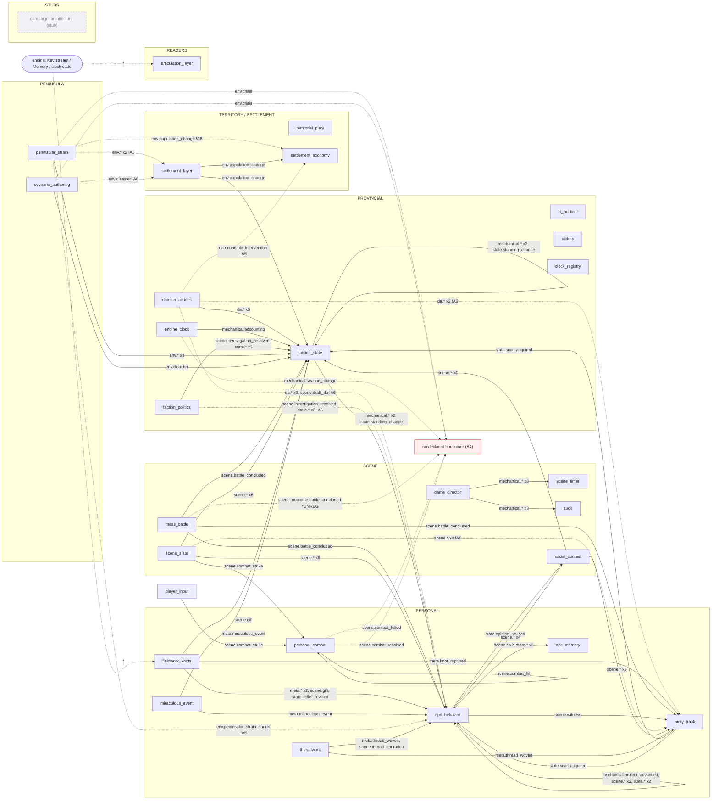
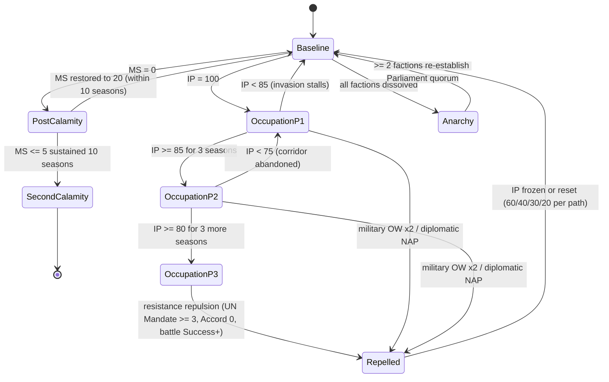

# Module Map — Flowchart, State Graph, Flattened Pipeline
**Generated 2026-06-10 by `skills/valoria-module-adjudicator/scripts/contract_flowchart.py`**
Source of truth: `references/module_contracts.yaml` (v2.1, commit 4c474c52) — REGENERATE, never hand-edit.
Graph sections are generated; gates / derivations / sequence tables are authored transcriptions
from cited canon reads (doc-12 §8, victory §5, settlement §1.3/§1.8, ci_political §2,
conviction_track_v1 §2, knots §5–§6, key_substrate §4.1/§8.4). Findings context: ED-1006.

## 1. Module flowchart — Key-flow topology (27 modules)
Solid = declared edge; dashed `!A6` = cross-scale seam with no transition rule (violation);
dashed to UNCONSUMED = orphan emission (A4); `*UNREG` = canon-named type absent from the
Key Type Registry (A2 / F2 class).

## 2. Comprehensive state graph — quantities, writers, derivations, gates
Shapes: cylinder = clock, rectangle = track, stadium = pool, parallelogram = derived value
(F1 guard: derived values are never written directly). MS has **no owning module** in the
contracts — a coverage gap, not an omission.

```mermaid
flowchart TB
  subgraph sg_faction_state["faction_state"]
    faction_state_x(("faction_state"))
    q1[/"Mandate : derived_value"/]
    q2[/"Treasury : derived_value"/]
    q3["faction stats 1-7 : track"]
  end
  q1 -.->|reads| faction_state_x
  q2 -.->|reads| faction_state_x
  faction_state_x -->|writes| q3
  subgraph sg_npc_behavior["npc_behavior"]
    npc_behavior_x(("npc_behavior"))
    q4["beliefs/opinions : track"]
    q5["concerns : track"]
    q6[("projects : clock")]
    q7[("arc state : clock")]
  end
  npc_behavior_x -->|writes| q4
  npc_behavior_x -->|writes| q5
  npc_behavior_x -->|writes| q6
  npc_behavior_x -->|writes| q7
  subgraph sg_piety_track["piety_track"]
    piety_track_x(("piety_track"))
    q8[("conviction scars : clock")]
  end
  piety_track_x -->|writes| q8
  subgraph sg_territorial_piety["territorial_piety"]
    territorial_piety_x(("territorial_piety"))
    q9["CV (per-territory Piety) : track"]
    q10[("CI (Church Influence) : clock")]
  end
  territorial_piety_x -->|writes| q9
  territorial_piety_x -->|writes| q10
  subgraph sg_threadwork["threadwork"]
    threadwork_x(("threadwork"))
    q11["Coherence : track"]
    q12[("Thread Fatigue : clock")]
  end
  threadwork_x -->|writes| q11
  threadwork_x -->|writes| q12
  subgraph sg_fieldwork_knots["fieldwork_knots"]
    fieldwork_knots_x(("fieldwork_knots"))
    q13[("knot strain : clock")]
    q14["Bonds : track"]
    q15[("Evidence Track : clock")]
    q16["Disposition Track : track"]
  end
  fieldwork_knots_x -->|writes| q13
  fieldwork_knots_x -->|writes| q14
  fieldwork_knots_x -->|writes| q15
  fieldwork_knots_x -->|writes| q16
  subgraph sg_social_contest["social_contest"]
    social_contest_x(("social_contest"))
    q17[("persuasion_track : clock")]
  end
  social_contest_x -->|writes| q17
  subgraph sg_peninsular_strain["peninsular_strain"]
    peninsular_strain_x(("peninsular_strain"))
    q18[("Turmoil : clock")]
    q19[("IP (Institutional Pressure) : clock")]
  end
  peninsular_strain_x -->|writes| q18
  peninsular_strain_x -->|writes| q19
  subgraph sg_settlement_layer["settlement_layer"]
    settlement_layer_x(("settlement_layer"))
    q20["Prosperity / Defense / Order : track"]
    q21[/"Local Economy / Garrison Strength / Public Order : derived_value"/]
    q22["Legitimacy (L) / Popular Support (PS) : track"]
    q23[/"province Accord : derived_value"/]
  end
  settlement_layer_x -->|writes| q20
  q21 -.->|reads| settlement_layer_x
  settlement_layer_x -->|writes| q22
  q23 -.->|reads| settlement_layer_x
  subgraph sg_ci_political["ci_political"]
    ci_political_x(("ci_political"))
    q24[("CI (Church Influence) : clock")]
    q25(["faction political pool : pool"])
    q26["card hands / cooldown : track"]
  end
  q24 -.->|reads| ci_political_x
  ci_political_x -->|writes| q25
  ci_political_x -->|writes| q26
  subgraph sg_victory["victory"]
    victory_x(("victory"))
    q27[("MS / IP / CI / Turmoil / Accord / Mandate / PV / PT reads : clock")]
  end
  q27 -.->|reads| victory_x
  subgraph sg_engine_clock["engine_clock"]
    engine_clock_x(("engine_clock"))
    q28[("season counter : clock")]
  end
  engine_clock_x -->|writes| q28
  subgraph sg_personal_combat["personal_combat"]
    personal_combat_x(("personal_combat"))
    q29[/"Health : derived_value"/]
    q30["cumulative_damage : track"]
    q31["Wounds : track"]
    q32(["Stamina : pool"])
    q33["Initiative : track"]
    q34["Poise : track"]
  end
  q29 -.->|reads| personal_combat_x
  personal_combat_x -->|writes| q30
  personal_combat_x -->|writes| q31
  personal_combat_x -->|writes| q32
  personal_combat_x -->|writes| q33
  personal_combat_x -->|writes| q34
  MS[("Mending Stability (MS) : clock — NO owning module in contracts")]
  subgraph DERIV["DERIVATIONS (calculations — from contract)"]
    d0_s["Order"] -->|"floor(mean settlement Order)"| d0_t[/"province Accord"/]
    %% settlement_layer_v30 §1.3
    d1_s["Prosperity"] -->|"Prosperity × 50"| d1_t[/"Local Economy"/]
    %% settlement_layer_v30 §1.3
    d2_s["Defense, Fort Level"] -->|"Defense × 20 + Fort × 30"| d2_t[/"Garrison Strength"/]
    %% settlement_layer_v30 §1.3
    d3_s["Order"] -->|"Order × 20 (riot events below 0)"| d3_t[/"Public Order"/]
    %% settlement_layer_v30 §1.3
    d4_s["Legitimacy, Popular Support, W_s"] -->|"q_s = 0.5L+0.5PS"| d4_t[/"faction Mandate (cross-module → faction_state)"/]
    %% settlement_layer_v30 §1.8 LPS-2e
    d5_s["faction Mandate"] -->|"drift ±1/settlement/season toward Mandate (damped, mean-reve"| d5_t[/"Legitimacy / Popular Support"/]
    %% settlement_layer_v30 §1.8
    d6_s["Prosperity"] -->|"Σ settlement Prosperity × 10"| d6_t[/"faction Treasury income (cross-module → faction_state)"/]
    %% derived_stats §8.1 (quoted in settlement_layer §1.8)
    d7_s["Endurance, Spirit, Strength, cumulative_damage"] -->|"round(round(End+4+0.4*Spirit) * (min(floor(End/2)+1,3)+1) + "| d7_t[/"Health"/]
    %% r2_consequence_wounds.health_full = WI*(MaxWounds+1)+0.25*Str*End, minus accrued damage (ED-1041 / derived_stats_v30 §4.1)
  end
  subgraph GATESB["GATES (thresholds — from contract)"]
    g_stall8{"project stall >= 8"} --> g_stall8_c["state.project_failed emitted"]
    %% npc_behavior: doc-12 §8 / §4.2
    g_drift{"cumulative_drift > 0.5"} --> g_drift_c["scene.gossip emitted"]
    %% npc_behavior: doc-12 §8 / §6.3
    g_scar2{"Scars on Conviction X = 2"} --> g_scar2_c["Resonant Style X exposed; arc transition if X was top primary"]
    %% piety_track: conviction_track_v1 §2
    g_scar3{"Scars on Conviction X >= 3"} --> g_scar3_c["Conviction crisis on X (d6 crisis table, 1 season)"]
    %% piety_track: conviction_track_v1 §2 (PP-718 per-Conviction)
    g_ci100{"CI = 100"} --> g_ci100_c["Theocracy Unification attempt"]
    %% territorial_piety: ci_political_v30 §2.2
    g_cicap{"seasonal CI cap"} --> g_cicap_c["CI gain bounded per season"]
    %% territorial_piety: ci_political_v30 §2.4
    g_strain{"Knot strain > capacity"} --> g_strain_c["Knot Break"]
    %% fieldwork_knots: knots_v30 §6.1
    g_decay{"no new strain that season AND Disposition >= +3"} --> g_decay_c["Knot strain -1 at Accounting"]
    %% fieldwork_knots: knots_v30 §5
    g_bond5{"Bonds >= 5"} --> g_bond5_c["knot operations eligible (Memory-Query-checked prerequisite)"]
    %% fieldwork_knots: key_substrate_v30 §8.4
    g_ip100{"IP = 100"} --> g_ip100_c["Occupation Phase 1 (first pass)"]
    %% peninsular_strain: victory_v30 §5.2
    g_ip85{"IP >= 85 for 3 seasons"} --> g_ip85_c["Occupation Phase 2 (Schoenland)"]
    %% peninsular_strain: victory_v30 §5.2
    g_ip80{"IP >= 80 for 3 more seasons"} --> g_ip80_c["Occupation Phase 3 (NW pass)"]
    %% peninsular_strain: victory_v30 §5.2
    g_ipfall{"IP < 85 (P1) / < 75 (P2)"} --> g_ipfall_c["invasion stalls / corridor abandoned"]
    %% peninsular_strain: victory_v30 §5.2
    g_ord0{"settlement Order = 0"} --> g_ord0_c["local revolt"]
    %% settlement_layer: settlement_layer_v30 §1.3
    g_def0{"settlement Defense = 0"} --> g_def0_c["undefended — auto-capture"]
    %% settlement_layer: settlement_layer_v30 §1.3
    g_dv0{"derived value = 0 held through Accounting"} --> g_dv0_c["owning stat -1 (same rule as faction stats)"]
    %% settlement_layer: settlement_layer_v30 §1.3
    g_ms0{"MS = 0"} --> g_ms0_c["Post-Calamity Era"]
    %% victory: victory_v30 §5.1
    g_ms5{"MS <= 5 sustained 10 seasons"} --> g_ms5_c["Second Calamity (true terminal)"]
    %% victory: victory_v30 §5.1
    g_msrec{"MS restored to 20 within 10 seasons"} --> g_msrec_c["Post-Calamity recovery"]
    %% victory: victory_v30 §5.1
    g_diss{"all factions dissolved"} --> g_diss_c["Anarchy Era (Ministry continues)"]
    %% victory: victory_v30 §5.3
  end
  q6 -.-> g_stall8
  q4 -.-> g_drift
  q8 -.-> g_scar2
  q8 -.-> g_scar3
  q10 -.-> g_ci100
  q10 -.-> g_cicap
  q13 -.-> g_strain
  q13 -.-> g_decay
  q14 -.-> g_bond5
  q19 -.-> g_ip100
  q19 -.-> g_ip85
  q19 -.-> g_ip80
  q19 -.-> g_ipfall
  q20 -.-> g_ord0
  q20 -.-> g_def0
  q21 -.-> g_dv0
  MS -.-> g_ms0
  MS -.-> g_ms5
  MS -.-> g_msrec
  victory_x -.-> g_diss
  classDef gatecls fill:#ffd,stroke:#a80;
  class g_stall8,g_drift,g_scar2,g_scar3,g_ci100,g_cicap,g_strain,g_decay,g_bond5,g_ip100,g_ip85,g_ip80,g_ipfall,g_ord0,g_def0,g_dv0,g_ms0,g_ms5,g_msrec,g_diss gatecls;
```

## 3. World-state era machine (victory_v30 §5)
Era states are not strictly exclusive — canon: "during Occupation the game world continues
ticking; MS declines" (§5.2) — Occupation and MS-driven transitions run concurrently.

## 4. Flattened pipeline — all inputs, mechanics, gates, outputs

### 4.1 Master module table
| Module | Scales | Mechanic | Inputs | State & calculations | Gates / sequence | Outputs |
|---|---|---|---|---|---|---|
| faction_state | provincial | deterministic_accounting | da.* x5 ← domain_actions; mechanical.accounting ← engine_clock; state.* x2 ← faction_politics; state.standing_change ← faction_politics,faction_state; scene.investigation_resolved ← faction_politics,scene_slate; mechanical.* x2 ← faction_state; scene.gift ← fieldwork_knots,scene_slate; scene.battle_concluded ← mass_battle; meta.miraculous_event ← miraculous_event; env.peninsular_strain_shock ← peninsular_strain; env.disaster ← peninsular_strain,scenario_authoring; env.population_change ← peninsular_strain,settlement_layer; state.scar_acquired ← piety_track; scene.* x3 ← scene_slate,social_contest; scene.contest_resolved ← social_contest | Mandate (derived_value, read); Treasury (derived_value, read); faction stats 1-7 (track) | — | mechanical.cascade_resolution; mechanical.mission_shift; state.standing_change |
| npc_behavior | personal scene | deterministic_accounting | da.* x3, scene.draft_da ← domain_actions; state.* x2 ← faction_politics; state.standing_change ← faction_politics,faction_state; scene.investigation_resolved ← faction_politics,scene_slate; mechanical.* x2 ← faction_state; meta.* x2, state.belief_revised ← fieldwork_knots; scene.gift ← fieldwork_knots,scene_slate; scene.battle_concluded ← mass_battle; meta.miraculous_event ← miraculous_event; mechanical.project_advanced, scene.displacement, state.* x2 ← npc_behavior; scene.witness ← npc_behavior,scene_slate; env.peninsular_strain_shock ← peninsular_strain; state.scar_acquired ← piety_track; scene.* x3 ← scene_slate,social_contest; scene.contest_resolved ← social_contest; meta.thread_woven, scene.thread_operation ← threadwork | beliefs/opinions (track); concerns (track); projects (clock); arc state (clock) | g_stall8: project stall >= 8 → state.project_failed emitted; g_drift: cumulative_drift > 0.5 → scene.gossip emitted | scene.witness; state.concern_resolved; state.belief_revised; scene.displacement; mechanical.project_advanced; state.project_failed; state.project_completed; state.opinion_revised; scene.interaction; scene.dialogue; scene.gossip |
| npc_memory | personal | state_reader | scene.* x2, state.* x2 ← npc_behavior | — | — | — |
| piety_track | personal | deterministic_accounting | da.* x2 ← domain_actions; meta.knot_ruptured ← fieldwork_knots; scene.battle_concluded ← mass_battle; scene.witness ← npc_behavior,scene_slate; scene.* x3 ← scene_slate,social_contest; meta.thread_woven ← threadwork | conviction scars (clock) | g_scar2: Scars on Conviction X = 2 → Resonant Style X exposed; arc transition if X was top primary; g_scar3: Scars on Conviction X >= 3 → Conviction crisis on X (d6 crisis table, 1 season) | state.scar_acquired |
| territorial_piety | territory provincial | deterministic_accounting | — | CV (per-territory Piety) (track); CI (Church Influence) (clock) | g_ci100: CI = 100 → Theocracy Unification attempt; g_cicap: seasonal CI cap → CI gain bounded per season | — |
| threadwork | personal thread | dice_pool | — | Coherence (track); Thread Fatigue (clock) | — | scene.thread_operation; meta.thread_woven |
| fieldwork_knots | personal scene | dice_pool | * ← engine | knot strain (clock); Bonds (track); Evidence Track (clock); Disposition Track (track) | g_strain: Knot strain > capacity → Knot Break; g_decay: no new strain that season AND Disposition >= +3 → Knot strain -1 at Accounting; g_bond5: Bonds >= 5 → knot operations eligible (Memory-Query-checked prerequisite) | meta.knot_formed; meta.knot_ruptured; scene.gift; state.belief_revised |
| scene_slate | scene | manifest | — | — | — | mechanical.scene_entered; scene.combat_strike; scene.dialogue; scene.gift; scene.insult; scene.investigation_resolved; scene.threat; scene.witness |
| game_director | scene | manifest | — | — | — | mechanical.scene_entered; mechanical.scene_exited; mechanical.scene_skipped |
| scene_timer | scene | state_reader | mechanical.* x3 ← game_director | — | — | — |
| audit | scene | state_reader | mechanical.* x3 ← game_director | — | — | — |
| social_contest | scene | dice_pool | state.opinion_revised ← npc_behavior | persuasion_track (clock) | — | scene.contest_resolved; scene.dialogue; scene.insult; scene.threat |
| mass_battle | scene | dice_pool | — | — | — | scene_outcome.battle_concluded [unreg]; scene.battle_concluded |
| domain_actions | provincial | d_sigma | — | — | — | scene.draft_da; da.antinomian_action; da.covert_betrayal; da.diplomatic_alliance; da.economic_intervention; da.public_governance |
| peninsular_strain | peninsula | deterministic_accounting | — | Turmoil (clock); IP (Institutional Pressure) (clock) | g_ip100: IP = 100 → Occupation Phase 1 (first pass); g_ip85: IP >= 85 for 3 seasons → Occupation Phase 2 (Schoenland); g_ip80: IP >= 80 for 3 more seasons → Occupation Phase 3 (NW pass); g_ipfall: IP < 85 (P1) / < 75 (P2) → invasion stalls / corridor abandoned | env.crisis; env.disaster; env.peninsular_strain_shock; env.population_change |
| settlement_layer | settlement territory | deterministic_accounting | env.peninsular_strain_shock ← peninsular_strain; env.disaster ← peninsular_strain,scenario_authoring | Prosperity / Defense / Order (track); Local Economy / Garrison Strength / Public Order (derived_value, read); Legitimacy (L) / Popular Support (PS) (track); province Accord (derived_value, read) | g_ord0: settlement Order = 0 → local revolt; g_def0: settlement Defense = 0 → undefended — auto-capture; g_dv0: derived value = 0 held through Accounting → owning stat -1 (same rule as faction stats) | env.population_change |
| settlement_economy | settlement | deterministic_accounting | da.economic_intervention ← domain_actions; env.population_change ← peninsular_strain,settlement_layer | — | — | — |
| ci_political | provincial | deterministic_accounting | — | CI (Church Influence) (clock, read); faction political pool (pool); card hands / cooldown (track) | — | — |
| victory | provincial peninsula | state_reader | — | MS / IP / CI / Turmoil / Accord / Mandate / PV / PT reads (clock, read) | g_ms0: MS = 0 → Post-Calamity Era; g_ms5: MS <= 5 sustained 10 seasons → Second Calamity (true terminal); g_msrec: MS restored to 20 within 10 seasons → Post-Calamity recovery; g_diss: all factions dissolved → Anarchy Era (Ministry continues) | — |
| engine_clock | provincial | clock_advance | — | season counter (clock) | — | mechanical.accounting; mechanical.season_change |
| faction_politics | provincial | deterministic_accounting | — | — | — | scene.investigation_resolved; state.coup_attempted; state.standing_change; state.succession |
| miraculous_event | personal settlement peninsula | state_reader | — | — | — | meta.miraculous_event |
| scenario_authoring | peninsula | manifest | — | — | — | env.crisis; env.disaster |
| articulation_layer | personal scene provincial | deterministic_accounting | * ← engine | — | — | — |
| clock_registry | provincial | manifest | — | — | — | — |
| personal_combat | personal | d_sigma | scene.combat_hit ← personal_combat; scene.combat_strike ← scene_slate,player_input | Health (derived_value, read); cumulative_damage (track); Wounds (track); Stamina (pool); Initiative (track); Poise (track) | — | scene.combat_hit; scene.combat_felled; scene.combat_resolved |
| campaign_architecture | provincial | — (stub) | — | — | — | — |

### 4.2 Canonical sequence (Accounting spine)
| Step | What happens | Source |
|---|---|---|
| season_tick | engine_clock emits mechanical.season_change | key_type_registry (engine_clock) |
| accounting_boundary | engine_clock emits mechanical.accounting | doc-12 §8 |
| B_concern | Procedure B: Knowledge Decay -> Concern Generation (memory_query reads Keys) -> Resolution (state.concern_resolved, state.belief_revised, MemoryReferences) | doc-12 §8 |
| DA_proposal | DA Proposal Phase: select_proposal() reads Faction Meta-Armature; execute_proposed_domain_actions() emits da_outcome.*; displacement_neglect_observed -> scene.displacement [unreg] | doc-12 §8 |
| C_project | Procedure C: mechanical.project_advanced [unreg]; state.project_failed [unreg] (stall >= 8); state.project_completed [unreg] | doc-12 §8 |
| D_opinion | Procedure D: state.opinion_revised per drift threshold | doc-12 §8 |
| E_offscreen | Procedure E: scene.interaction (ambient pairs); scene.dialogue (knowledge sharing); scene.gossip (cumulative_drift > 0.5) | doc-12 §8 |
| emission_processing | substrate single-update rule: validate (registry + invariants, causes[] DAG) -> append immutable KEY_LOG -> resolve observers — inline, deterministic | key_substrate_v30 §4.1 |
| settlement_accounting | derived-value-at-0-through-Accounting -> stat -1; Mandate feedback drift ±1; Knot strain decay check | settlement §1.3/§1.8; knots §5 |

### 4.3 Gates (per-system thresholds — from contract)
| Owning system | Condition | Consequence | Source |
|---|---|---|---|
| npc_behavior | project stall >= 8 | state.project_failed emitted | doc-12 §8 / §4.2 |
| npc_behavior | cumulative_drift > 0.5 | scene.gossip emitted | doc-12 §8 / §6.3 |
| piety_track | Scars on Conviction X = 2 | Resonant Style X exposed; arc transition if X was top primary | conviction_track_v1 §2 |
| piety_track | Scars on Conviction X >= 3 | Conviction crisis on X (d6 crisis table, 1 season) | conviction_track_v1 §2 (PP-718 per-Conviction) |
| territorial_piety | CI = 100 | Theocracy Unification attempt | ci_political_v30 §2.2 |
| territorial_piety | seasonal CI cap | CI gain bounded per season | ci_political_v30 §2.4 |
| fieldwork_knots | Knot strain > capacity | Knot Break | knots_v30 §6.1 |
| fieldwork_knots | no new strain that season AND Disposition >= +3 | Knot strain -1 at Accounting | knots_v30 §5 |
| fieldwork_knots | Bonds >= 5 | knot operations eligible (Memory-Query-checked prerequisite) | key_substrate_v30 §8.4 |
| peninsular_strain | IP = 100 | Occupation Phase 1 (first pass) | victory_v30 §5.2 |
| peninsular_strain | IP >= 85 for 3 seasons | Occupation Phase 2 (Schoenland) | victory_v30 §5.2 |
| peninsular_strain | IP >= 80 for 3 more seasons | Occupation Phase 3 (NW pass) | victory_v30 §5.2 |
| peninsular_strain | IP < 85 (P1) / < 75 (P2) | invasion stalls / corridor abandoned | victory_v30 §5.2 |
| settlement_layer | settlement Order = 0 | local revolt | settlement_layer_v30 §1.3 |
| settlement_layer | settlement Defense = 0 | undefended — auto-capture | settlement_layer_v30 §1.3 |
| settlement_layer | derived value = 0 held through Accounting | owning stat -1 (same rule as faction stats) | settlement_layer_v30 §1.3 |
| victory | MS = 0 | Post-Calamity Era | victory_v30 §5.1 |
| victory | MS <= 5 sustained 10 seasons | Second Calamity (true terminal) | victory_v30 §5.1 |
| victory | MS restored to 20 within 10 seasons | Post-Calamity recovery | victory_v30 §5.1 |
| victory | all factions dissolved | Anarchy Era (Ministry continues) | victory_v30 §5.3 |

### 4.4 Derivations (calculations)
| Mapping | Formula | Source |
|---|---|---|
| Order → province Accord | `floor(mean settlement Order)` | settlement_layer_v30 §1.3 |
| Prosperity → Local Economy | `Prosperity × 50` | settlement_layer_v30 §1.3 |
| Defense, Fort Level → Garrison Strength | `Defense × 20 + Fort × 30` | settlement_layer_v30 §1.3 |
| Order → Public Order | `Order × 20 (riot events below 0)` | settlement_layer_v30 §1.3 |
| Legitimacy, Popular Support, W_s → faction Mandate (cross-module → faction_state) | `q_s = 0.5L+0.5PS; W_s = base(Type)+Prosperity+FacilityTier; T = Σ W_s·(q_s/7); Mandate = clamp(round(7T/(T+6)),0,7) — saturating (Lesson-5 bound)` | settlement_layer_v30 §1.8 LPS-2e |
| faction Mandate → Legitimacy / Popular Support | `drift ±1/settlement/season toward Mandate (damped, mean-reverting; Stage-4 sim bounded 30 seasons)` | settlement_layer_v30 §1.8 |
| Prosperity → faction Treasury income (cross-module → faction_state) | `Σ settlement Prosperity × 10` | derived_stats §8.1 (quoted in settlement_layer §1.8) |
| Endurance, Spirit, Strength, cumulative_damage → Health | `round(round(End+4+0.4*Spirit) * (min(floor(End/2)+1,3)+1) + 0.25*Strength*Endurance) - cumulative_damage` | r2_consequence_wounds.health_full = WI*(MaxWounds+1)+0.25*Str*End, minus accrued damage (ED-1041 / derived_stats_v30 §4.1) |

### 4.5 Key-type matrix (flattened I/O at type granularity)
| Key type | Registered | Emitters (contracts) | Consumers (contracts; wildcard-matched) |
|---|---|---|---|
| da.antinomian_action | yes | domain_actions | faction_state, npc_behavior, piety_track |
| da.covert_betrayal | yes | domain_actions | faction_state, npc_behavior, piety_track |
| da.diplomatic_alliance | yes | domain_actions | faction_state |
| da.economic_intervention | yes | domain_actions | faction_state, settlement_economy |
| da.public_governance | yes | domain_actions | faction_state, npc_behavior |
| env.crisis | yes | peninsular_strain, scenario_authoring | — (orphan / pseudo-only) |
| env.disaster | yes | peninsular_strain, scenario_authoring | faction_state, settlement_layer |
| env.peninsular_strain_shock | yes | peninsular_strain | faction_state, npc_behavior, settlement_layer |
| env.population_change | yes | peninsular_strain, settlement_layer | faction_state, settlement_economy |
| mechanical.accounting | yes | engine_clock | faction_state |
| mechanical.cascade_resolution | yes | faction_state | faction_state, npc_behavior |
| mechanical.mission_shift | yes | faction_state | faction_state, npc_behavior |
| mechanical.project_advanced | yes | npc_behavior | npc_behavior |
| mechanical.scene_entered | yes | game_director, scene_slate | audit, scene_timer |
| mechanical.scene_exited | yes | game_director | audit, scene_timer |
| mechanical.scene_skipped | yes | game_director | audit, scene_timer |
| mechanical.season_change | yes | engine_clock | — (orphan / pseudo-only) |
| meta.cascade_cluster_event | yes | — | — (orphan / pseudo-only) |
| meta.knot_formed | yes | fieldwork_knots | npc_behavior |
| meta.knot_ruptured | yes | fieldwork_knots | npc_behavior, piety_track |
| meta.legacy_event | yes | — | — (orphan / pseudo-only) |
| meta.miraculous_event | yes | miraculous_event | faction_state, npc_behavior |
| meta.thread_woven | yes | threadwork | npc_behavior, piety_track |
| scene.battle_concluded | yes | mass_battle | faction_state, npc_behavior, piety_track |
| scene.combat_felled | yes | personal_combat | — (orphan / pseudo-only) |
| scene.combat_hit | yes | personal_combat | personal_combat |
| scene.combat_resolved | yes | personal_combat | — (orphan / pseudo-only) |
| scene.combat_strike | yes | scene_slate | personal_combat |
| scene.contest_resolved | yes | social_contest | faction_state, npc_behavior |
| scene.dialogue | yes | npc_behavior, scene_slate, social_contest | faction_state, npc_behavior, piety_track |
| scene.displacement | yes | npc_behavior | npc_behavior |
| scene.draft_da | yes | domain_actions | npc_behavior |
| scene.gift | yes | fieldwork_knots, scene_slate | faction_state, npc_behavior |
| scene.gossip | yes | npc_behavior | npc_memory |
| scene.insult | yes | scene_slate, social_contest | faction_state, npc_behavior, piety_track |
| scene.interaction | yes | npc_behavior | npc_memory |
| scene.investigation_resolved | yes | faction_politics, scene_slate | faction_state, npc_behavior |
| scene.thread_operation | yes | threadwork | npc_behavior |
| scene.threat | yes | scene_slate, social_contest | faction_state, npc_behavior, piety_track |
| scene.witness | yes | npc_behavior, scene_slate | npc_behavior, piety_track |
| scene_outcome.battle_concluded | **NO** | mass_battle | — (orphan / pseudo-only) |
| state.belief_revised | yes | fieldwork_knots, npc_behavior | npc_behavior |
| state.concern_resolved | yes | npc_behavior | npc_memory |
| state.coup_attempted | yes | faction_politics | faction_state, npc_behavior |
| state.opinion_revised | yes | npc_behavior | npc_memory, social_contest |
| state.project_completed | yes | npc_behavior | npc_behavior |
| state.project_failed | yes | npc_behavior | npc_behavior |
| state.scar_acquired | yes | piety_track | faction_state, npc_behavior |
| state.standing_change | yes | faction_politics, faction_state | faction_state, npc_behavior |
| state.succession | yes | faction_politics | faction_state, npc_behavior |

## 5. Red overlay (where the map bleeds)
Adjudication v2.1: 27 violations / 58 warnings — 7 unregistered canon-named types (A2),
19 top-down cross-scale seams (A6: scale_transitions §3 has no downward rule), orphan
emissions incl. pseudo-consumer-only types (A4), conviction_track_v1 outside
canonical_sources (A8), registry 37-vs-38 self-drift (A9). Full detail: ED-1006 +
`references/module_contracts.yaml` gap_notes. The Mandate↔settlement L/PS loop has a
**documented canon damper** (settlement §1.8 saturating form + mean reversion, Stage-4
sim bounded) — contracts loop annotation upgrade pending.
