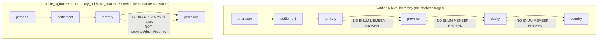
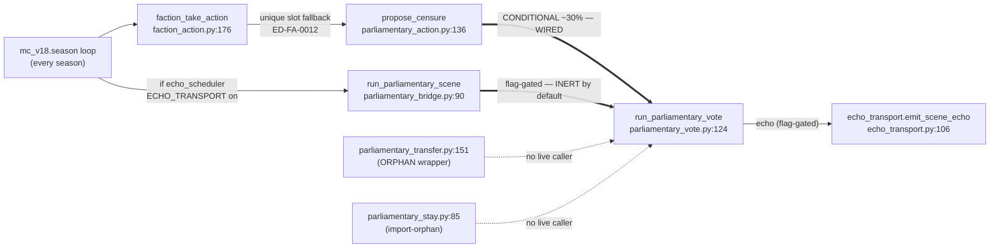

# Scale Chain & Decision-Surface Map — Full Edge Map (Vertical + Horizontal)

## Status: FILED (analysis) — 2026-07-14 · Lane: IN · ED-IN-0064

**What this is.** A two-axis EDGE MAP of Valoria's multi-scale governance surface, every edge
STATE-CLASSIFIED against actual canon *and* actual `sim/` code (caller sites grepped, not
inferred). It reconciles what the design docs claim is wired against what the working tree
actually executes, and it headlines the two structural gaps that dominate the docket: the
**scale_signature enum only names 4 of the 6 ratified scales**, and the **#136 L/PS pipeline is
SPEC-ONLY** (designed in `lps_wiring_v1.md`, not yet a line of `sim/`).

### Classification legend

| State | Meaning |
|---|---|
| **WIRED** | Executes in the live campaign loop today (verified caller site in `sim/`). |
| **HOOK-NEEDED** | Real read/write target exists; needs one authored clause/edge to compose. |
| **BROKEN** | Emitter/consumer/scale exists on one side but the other side is absent — the edge cannot close as-is. |
| **INERT** | Code path exists but is a no-op in the default campaign (flag-off, or dead-field, or always-defers). |
| **SPEC-ONLY** | Fully designed in a doc but zero `sim/` implementation (the #136 class). |
| **DOCTRINE-ONLY** | Named/ruled in a doctrine or handoff table; no design doc *and* no code. |

**Evidence tags:** `code:` = a grepped/read `sim/` line. `doc:` = a canonical/PROPOSED design doc.
`audit:` = the 2026-07-14 governance-vector-audit registers (`structure_register.md` /
`02_weakness_register.md`) or `module_contracts.yaml`.

---

## §0 · Headline findings (read these first)

1. **The scale_signature enum is 4-of-6.** `code:key_substrate_v30.md:57` —
   `scale_signature: [<personal | settlement | territory | peninsula>, ...]`. The ratified
   vertical hierarchy this docket works to is **character → settlement → territory → province →
   duchy → country** (6 levels). The substrate can only stamp `personal / settlement / territory /
   peninsula`. **Province, Duchy, and Country have no representation** — `peninsula` is a single
   correlated world-layer, not the province/duchy/country ladder. Every vertical edge above
   `territory` is therefore **BROKEN at the substrate**: the Key stream cannot even *name* the
   scale it would aggregate to. This is the single highest-leverage architectural gap on the
   vertical axis and it silently caps the whole ripple substrate at `territory`.

2. **The #136 L/PS pipeline is SPEC-ONLY.** `doc:lps_wiring_v1.md` (PROPOSED, 2026-07-14) is a
   complete buildable spec for the consent-gate, D.6-disjoint convergence, and accord-echo
   write-source — but it **explicitly does not edit `sim/`** (§10). Ground truth it cites:
   `Settlement.legitimacy`/`popular_support` are *"NEVER READ OR WRITTEN anywhere in sim/ (zero
   non-definition references)"* — `lps_inert_check` is 100/100 red. So the canonical
   settlement→Mandate aggregation and the Mandate→L/PS distribute-down drift are **designed, not
   coded**. The live sim substitutes the pre-LPS-1 scalar `Faction.L`-as-Mandate placeholder
   (`code:parliamentary_vote.py:20` PRE-LPS-1/PORT-BLOCKING note, ED-FA-0004).

3. **Field Investigation has zero live dispatch path.** `code:scene_dispatch.py:129-215` branches
   only on `scene_type == "combat"` and `"contest"`; everything else hits the else branch
   (`"resolver for scene_type=... not live"`). There is **no `"fieldwork"`/`"investigation"`
   branch**. Of the 8 §4.3.2 Mandatory Zoom-In Triggers, **only Stability Crisis is field-evaluable
   and live** (`code:scene_dispatch.py:64-83`); the other 7 are reported deferred, not fired. The
   one live trigger routes exclusively to a `contest`, never to FI — even though its canonical
   scene content (`doc:scale_transitions_v30.md:137`) explicitly offers a fieldwork option.

4. **"Orphan mutator" is stale — `parliamentary_vote` has a LIVE, non-flag-gated caller.** The
   docket framed `sim/personal/parliamentary_vote.py` as an orphan and `parliamentary_bridge` as
   "the one live seasonal loop." Grepping caller sites corrects this: `run_parliamentary_vote` is
   reached **conditionally (~30%, via the neutral state-reweighted unique slot)**, through
   `faction_take_action` → `_try_faction_unique` → `parliamentary_action.propose_censure`
   (`code:faction_action.py:265`, ED-FA-0012 universal Censure fallback in the 30%-prior unique
   slot). That path applies real strategic mutations (Censure target Stability −1 / Mandate −1, and
   the generic §10 Total-Victory Mandate −1) with **no ECHO_TRANSPORT gate**. The
   `parliamentary_bridge` path is a *second, flag-gated* caller that additionally composes the
   winner-side Domain Echo. So `parliamentary_vote` is not an orphan; it has three live/near-live
   callers plus two orphan wrappers (see §2.2).

5. **The doc-WIRED bottom-up chain is sim-INERT by default.** `governance_ripple_substrate_v1.md`
   §13 grades "event → settlement → Mandate → faction" as WIRED *on canon*. At the sim level the
   same spine is INERT: L/PS are dead fields (#2), the scene→echo bridge fires only under
   ECHO_TRANSPORT (`code:scene_dispatch.py:223`, `code:echo_transport.py:118`), and every personal
   scene defers actor derivation. The default campaign's `KeyLog` is *"born empty-but-deterministic
   until the bridge lands"* (`code:echo_transport.py:23`). Canon-WIRED ≠ sim-WIRED — the synthesis
   table (§3) tracks both columns because they disagree on 4 of 8 edges.

---

## §1 · VERTICAL axis (scale): character → settlement → territory → province → duchy → country

### §1.1 The scale ladder as it exists vs. as ratified

The enum collapses everything above `territory` into a single `peninsula` world-layer. Province,
duchy, and country are **not addressable** by any Key's `scale_signature`, so no aggregate-up or
distribute-down edge can be authored across those bands — the substrate would reject or mis-stamp
them (`code:sim/substrate/keys.py:355-359` — active rejection of out-of-set scale values; the
design-doc invariant only requires `scale_signature` non-empty).

### §1.2 Vertical edge table

| # | Edge | Direction | State | Evidence |
|---|---|---|---|---|
| V1 | character scene → settlement L/PS | aggregate-up | **SPEC-ONLY** | `doc:lps_wiring_v1.md §4` write-source #1: extend `compute_accord_echo` to carry ΔPS/ΔL. `audit:lps_wiring_v1.md §4` — *"currently zero callers (GAP-A2)."* Not in `sim/`. |
| V2 | settlement Order → province Accord | aggregate-up | **WIRED** | `code:registry.py` idiom `province_accord = floor(mean settlement Order)` over real members (cited `doc:lps_wiring_v1.md §Ground-truth`); mirrored in `audit:module_contracts.yaml:587` derivation. This is the *one* live vertical aggregation. |
| V3 | settlement L/PS → faction Mandate (LPS-2e) | aggregate-up | **SPEC-ONLY** | `doc:settlement_layer_v30 §1.8` + `audit:module_contracts.yaml:604` derivation `Mandate=clamp(round(7T/(T+6)),0,7)`. L/PS are dead fields — `audit:lps_wiring_v1.md` *"NEVER READ OR WRITTEN anywhere in sim/"*; `lps_inert_check` 100/100 red. Sim uses scalar `Faction.L` placeholder (`code:parliamentary_vote.py:168`). |
| V4 | territory → province → duchy → country | aggregate-up | **BROKEN** | No `scale_signature` enum members exist for province/duchy/country (`code:key_substrate_v30.md:57`). Cannot be stamped or aggregated. `doc:governance_ripple_substrate_v1.md §7 R-3`: Territory itself is *"the currently-UNBUILT scale."* |
| V5 | faction → peninsula (correlated shock) | aggregate-up | **WIRED** (contract) | `audit:module_contracts.yaml:64-66,509-518` — `env.peninsular_strain_shock` / `env.disaster` / `env.population_change` emitted by `peninsular_strain`, consumed by `faction_state`, `npc_behavior`, `settlement_layer`. In-contract; peninsula is the one supra-territory scale that *is* in the enum. |
| V6 | peninsula → settlement (Cooling flag pushes Π down) | distribute-down | **HOOK-NEEDED** | `doc:governance_ripple_substrate_v1.md §7` claims bidirectionality; `doc:key_substrate_v30.md §12.4` enumerates 8 down-seams whose *consume intent is registry-canonical but emitters do not populate sub-scale `targets[]`* — §12.3 discipline unfulfilled. Mechanism present, targets sparse. |
| V7 | Mandate → settlement L/PS (mean-reverting drift) | distribute-down | **SPEC-ONLY** | `doc:lps_wiring_v1.md §4` write-source #4 + §5 D.6-disjoint sequence (`M_prev` snapshot at step 0, drift applied next season). `audit:module_contracts.yaml:608` derivation exists; no `sim/` code. |
| V8 | character scene → faction stat (Domain Echo) | aggregate-up (bottom-up) | **INERT** (WIRED under flag) | `code:scene_dispatch.py:223` + `code:echo_transport.py:118` — fires only when `world.echo_scheduler` attached (ECHO_TRANSPORT on). Default OFF ⇒ byte-exact `zoom_out({})` no-echo (`code:echo_transport.py:22-23`). With flag ON: contest emergency-council echo composes (Mandate/L channel). |
| V9 | combat scene → faction (`scene.combat_resolved`/`_felled`) | aggregate-up (bottom-up) | **BROKEN** | `audit:structure_register.md:18-19` — both are **dangling emits: no consumer**. `audit:module_contracts.yaml:861` CONSUMER WIRING note: registry declares `[npc_behavior, faction_layer, articulation]` consumers, but their contract `consumes[]` lists don't name them. Combat's bottom-up ripple has no landing site. Compounded by `code:scene_dispatch.py:137-145`: the combat scene path **always defers** (no personal actors derivable from aggregate world-state). |

### §1.3 Vertical axis synthesis

The vertical axis is **live only across the two lowest bands** (V2 settlement→province Accord;
V5/V8-under-flag faction↔peninsula), and **inert or spec-only across the load-bearing middle**
(V1/V3/V7 the entire L/PS Mandate loop). Above `territory` it is **structurally broken** (V4) —
the scale_signature enum cannot name province/duchy/country. The combat bottom-up echo (V9) is
double-broken: dangling emit *and* always-defers. The one dynamic that actually moves faction state
from a personal-scale outcome today is V8, and it is OFF by default.

---

## §2 · HORIZONTAL axis (subsystem): faction-action → domain/management action → social-contest → field-investigation

### §2.1 Horizontal handoff table

| # | Edge | State | Evidence |
|---|---|---|---|
| H1 | faction-action → domain/management action | **WIRED** | `code:mc_v18.py:89-97` calls `faction_take_action` for every parliamentary, territory-holding faction each season; `code:faction_action.py:176-241` dispatches Conquest / Muster / Govern / unique via a renormalized weight vector (ED-FA-0012). The live strategic loop. |
| H2 | domain action → social-contest (Parliamentary Vote / Censure) | **WIRED** | `code:faction_action.py:244-269` `_try_faction_unique` → `parliamentary_action.propose_censure` (universal fallback) → `code:parliamentary_action.py:136` `run_parliamentary_vote`. Conditional (~30%-gated via the neutral state-reweighted unique slot), applies §5.4 Censure + §10 Total-Victory Mandate penalty. **Not** ECHO_TRANSPORT-gated. |
| H2′ | domain action → social-contest (composed Domain Echo) | **INERT** (WIRED under flag) | `code:parliamentary_bridge.py:90-122` `run_parliamentary_scene`, called from `code:mc_v18.py:109-113` **only if `world.echo_scheduler is not None`**. Derives a two-pole §10 motion, resolves it, composes the winner echo (ED-SC-0002 band→magnitude / genre→channel). This is the docket's "one live seasonal loop" — precisely, the one live *echo-transport* loop. |
| H3 | Stability-Crisis trigger → social-contest (emergency council) | **INERT** (resolves; echo flag-gated) | `code:scene_dispatch.py:64-83` fires on `Faction.Sta <= 2`; `code:scene_dispatch.py:104-122` `_emergency_council_parties` derives both sides from the *same* faction's `L` / `7−Sta` (ED-SC-0006 [SEED]). Contest resolves, but the echo (`code:scene_dispatch.py:203-212`) only lands under ECHO_TRANSPORT. |
| H4 | social-contest → field-investigation | **DOCTRINE-ONLY** | `doc:scale_transitions_v30.md:90` §3.9 Contest→Fieldwork (Appraise success → +1 Evidence Track). No `sim/` realization; FI has no live surface to hand off to (H6). |
| H5 | domain/management action → field-investigation (governance ripple §6.1) | **HOOK-NEEDED / INERT** | `doc:governance_ripple_substrate_v1.md §13` grades event→FI-lead **WIRED on canon** (Investigate reads "concealment"; CHN-3 precedent). At sim level there is no FI dispatch to consume the lead — INERT. |
| H6 | field-investigation → any subsystem (dispatch) | **BROKEN** | `code:scene_dispatch.py:129-215` — **no `fieldwork`/`investigation` `scene_type` branch exists.** FI outcomes cannot be produced by the live dispatcher, so no downstream handoff (H4/H5) can fire. `sim/personal/investigation.py` and `sim/personal/fieldwork.py` are **import-orphans** (`audit:structure_register.md:80-81`). |

### §2.2 The parliamentary caller graph (correcting the "orphan mutator" premise)

`run_parliamentary_vote` has **four** call sites: two live (H2 conditional ~30%; H2′ flag-gated) and
**two** orphaned (`parliamentary_transfer` — no importer besides `__init__`; `parliamentary_stay` —
listed import-orphan `audit:structure_register.md:80`). The emergency-council contest routes through
`sim.personal.contest`, **not** this function, so it is not counted as a caller. The docket's "orphan mutator" label
predates ED-FA-0012 and should be retired: the §10 vote *does* mutate live strategic state every
season via Censure.

### §2.3 Horizontal axis synthesis

The horizontal axis is **live and mutating on the left** (H1 faction-action, H2 domain→contest via
Censure) and **dead on the right** (H4/H5/H6 — anything touching Field Investigation). FI is the
horizontal axis's V4: a whole subsystem the live engine cannot enter. Social contest is reachable
by two live paths (Censure H2 always; parliamentary_bridge H2′ and emergency-council H3 under flag),
but both echo channels default OFF, so contest *outcomes* mostly do not ripple back to strategic
state in the default campaign.

---

## §3 · Synthesis table — extending `governance_ripple_substrate_v1.md §13`'s 8-edge grading

§13 graded 8 loop edges **against canon**. This pass adds a **sim-reality column** from the grepped
working tree and the 2026-07-14 vector audit. Where the two columns disagree (4 of 8), the edge is
*canon-WIRED but sim-INERT/absent* — the substrate spine reads as built on paper and is not yet
executing.

| §13 edge | §13 canon grade | Sim-reality grade (this pass) | Fresh evidence |
|---|---|---|---|
| Event → settlement operation (§4) | WIRED | **WIRED** | Event/action deck drives settlement stat deltas via the accounting loop. Agrees. |
| Settlement → Mandate → faction (§7) | WIRED | **SPEC-ONLY** | L/PS dead in `sim/` (`lps_inert_check` 100/100 red); Mandate = scalar `Faction.L` placeholder (`code:parliamentary_vote.py:20`). The LPS-2e aggregation is `doc:lps_wiring_v1.md`, uncoded. |
| Cross-scale stamping (§7) | WIRED | **BROKEN above territory** | `scale_signature` enum = `{personal,settlement,territory,peninsula}` (`code:key_substrate_v30.md:57`); province/duchy/country unrepresentable. Scene echoes hardcode `["personal"]` (`code:echo_transport.py:145`), enrichment deferred to "PR-3 keying wave." |
| Event → FI lead (§6.1) | WIRED | **INERT** | Lead may be *authored* into concealment inventory, but `scene_dispatch` has no FI branch to surface it (`code:scene_dispatch.py:213`); `investigation.py`/`fieldwork.py` are import-orphans. |
| Event → standing (§5) | HOOK-NEEDED | **HOOK-NEEDED** | §1.0a Demotion triggers read state but none reads a per-event `resolution_quality` Key — `doc:governance_ripple §13`: *"one authored §1.0a trigger clause."* No sim. Agrees (still one clause from wired; sim untouched). |
| Faction-action window (§6.3, via Mandate) | HOOK-NEEDED | **HOOK-NEEDED (via placeholder Mandate)** | Domain actions gate on faction stats (live, `code:faction_action.py`), but the Mandate they read is the scalar `Faction.L`, not the settlement aggregate. Real only once V3 lands. |
| Event → Parliament/SC predicate (§6.2) | **AT-RISK** | **AT-RISK** | `social_contest §6` "Define stakes" has no `stakes.source_key` consume-edge (`audit:module_contracts.yaml:513`). The live parliamentary paths (H2/H2′) resolve *derived* motions, not event-Key-cited ones — confirming the edge is unbuilt. |
| Arc feedback → deck re-weight (§8) | HOOK-NEEDED | **HOOK-NEEDED** | Tag-modifier machinery is canon; resolution Keys writing modifiers is the missing convention. No sim realization. Agrees. |

### §3.1 Structural-debt overlay (2026-07-14 vector audit)

The vector audit's structural findings intersect this map directly:

- **9 `doc:null` modules** (`audit:structure_register.md:51-62`): `engine_clock` (the temporal
  spine), `domain_actions`, `scene_slate`, `game_director`, `scenario_authoring`, `npc_memory`,
  `scene_timer`, `settlement_economy`, `audit`. `engine_clock` being `doc:null` means the tick that
  would *sequence* every vertical accounting-boundary aggregation has no home spec — the D.6-disjoint
  sequence `doc:lps_wiring_v1.md §5` depends on it. `domain_actions` `doc:null` means H1's resolver
  has no design home (only an audit-output spec).
- **Dangling emits** (`audit:structure_register.md:16-19`, 4 canon-grade): `mass_battle`
  `scene_outcome.battle_concluded`, `peninsular_strain` `env.crisis`, and the two combat-echo Keys
  (`scene.combat_resolved`, `scene.combat_felled`) — the last two are exactly V9's broken bottom-up
  combat→faction edge, confirmed dangling from the contract side as well as the dispatch side. (The
  docket brief cited "6 dangling-emit"; the current `structure_register` scorecard reports 4
  canon-grade — the delta is the F2-class unregistered emits like `scene.draft_da` /
  `scene.displacement` in `audit:module_contracts.yaml:489,147`, which the register does not count as
  canon-grade.)
- **cross-scale-fraction = 0.512** (`audit:structure_register.md:5`, EXPLORATORY): ~half the wiring
  edges cross scale — but keyed on the unreconciled `scales:` vocabulary (WS2), the same vocabulary
  gap that headline #1 makes concrete. The metric will move when the scale enum is reconciled.

---

## §4 · Consolidated gap ledger (what to build, in leverage order)

| Rank | Gap | Class | Fix surface |
|---|---|---|---|
| 1 | scale_signature enum omits province/duchy/country (caps vertical axis at territory) | **BROKEN** | `doc:key_substrate_v30.md §2.1` enum + the WS2 scale-vocabulary reconciliation. Blocks V4 and everything above. |
| 2 | #136 L/PS pipeline uncoded (V1/V3/V7 — the whole Mandate loop) | **SPEC-ONLY** | `doc:lps_wiring_v1.md` impl PR: `sim/territory/legitimacy.py` + `parliamentary_bridge`/Treasury/AP rewires. `lps_inert_check` 100/100 → green is the headline pass. |
| 3 | Field Investigation has no live dispatch branch (H4/H5/H6) | **BROKEN** | Add a `"fieldwork"` `scene_type` branch to `code:scene_dispatch.py` + un-orphan `investigation.py`/`fieldwork.py`. |
| 4 | Bottom-up echo INERT by default (V8, H2′, H3) | **INERT** | ECHO_TRANSPORT stays OFF in the default campaign; the context-derivation bridge (ED-SC-0006 items 1-2) keeps personal-scale actors underivable. |
| 5 | Combat bottom-up echo dangling + always-defers (V9) | **BROKEN** | Wire `scene.combat_resolved/_felled` consumers into `npc_behavior`/`faction_state` contracts; author the aggregate→personal actor bridge for the combat dispatch path. |
| 6 | §6.2 event→Parliament predicate has no `stakes.source_key` hook | **AT-RISK** | Author the consume-edge on `social_contest`, or weaken to "cite" (`doc:governance_ripple §13`/§14.3). |
| 7 | `engine_clock` (temporal spine) is `doc:null` | **doc-gap** | Candidate home `propagation_spec_v1.md` (ED-1051, awaiting Jordan). Sequences every accounting-boundary aggregation. |

**Bottom line.** The horizontal-left (faction/domain action) and the two lowest vertical bands
execute today. Everything the docket most wants — a settlement-grounded Mandate that ripples up
through province/duchy to country and back down, and Field Investigation as a first-class response
surface — is either **SPEC-ONLY** (#136, ready to build) or **BROKEN at the substrate** (the scale
enum) or **absent from dispatch** (FI). The paper substrate is more complete than the running one;
closing gaps 1–3 is what makes the two columns of §3 agree.
