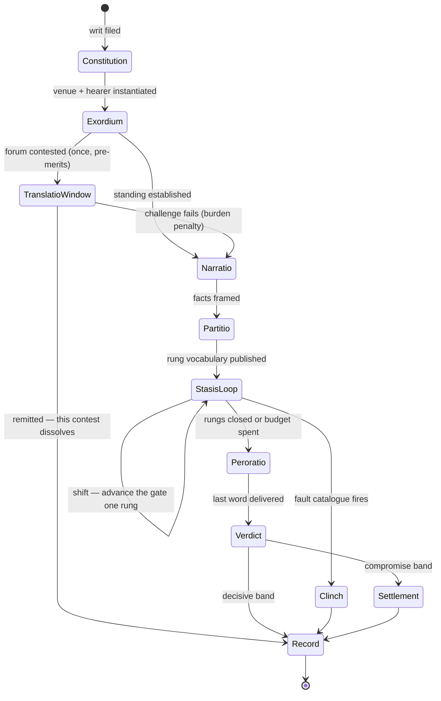

# Social contest — the eight requirements, track architecture, and state graph

## Status: PROPOSED (2026-08-06, ED-SC-0027)
## Lane: SC
## Supersedes: nothing. Distils `00`–`04` in this unit plus `proposals/social_contest_consolidation_integration_v1.md`.

**Produced by:** two read-only Fable adjudication lenses (orthogonality/state-graph; duplication-vs-classical-warrant),
reconciled and authored by Opus per CLAUDE.md §10. Every `file:line` marked ✓ was read from the working tree this
session by the author; those marked ⟨R⟩/⟨S⟩ come from a lens and were not independently re-read.

> **Locator warning, load-bearing.** Every classical chapter/section number below is model knowledge with no web
> access. Doctrine confidence is generally high; *locator* confidence is medium at best. **No locator here may enter
> a ratified doc without a human check against the texts.** This is the failure class of the withdrawn warrant×attack
> matrix (`sources/README.md` item 1) — a table "formatted to look rigorous." Doctrine is used here to *rule*;
> locators are offered only so a human can verify or delete them.

---

## §0. What three corrections changed

**Correction 1 — venue weighting is dynamic to the specific content being adjudicated, not a 1:1 mapping.**

Today: `venue_w = role()[appeal] × R[appeal][tense] × tense_weight()[tense]` (`resolver.py:170-176` ✓). Its *only*
content input is `tense = Stasis.tense(live_ground)` (`resolver.py:303` ✓), a fixed 6→3 lookup
(`primitives.py:15-16` ✓). Everything else is constant at venue construction. Two different disputed *facts* — a
ledger entry versus who was in the room — weight logos identically, because the engine cannot see the claim, only
its tense token. **Both static objects die:** a static appeal×tense matrix and a static venue triple are each
**one-place functions of something that classically takes two arguments**.

**Correction 2 — these are tracks/trajectories that interact, not co-extensive things.**

Every prior pass in this unit, including K1–K15 in `04`, ran a collapse test: *is A a function of B? then one dies.*
That is correct for **two representations of one state** and wrong for **two trajectories that correlate**. The
corrected test is §7: *does A carry state B does not?* If yes, the design object is the **interaction**.

**Correction 3 — the eight requirements (§1).** This is the organising frame, and slot **C1** corrects a conclusion I
had drawn two hours earlier. I had ruled that *tense dies as stored state*. That is right about the wrong object.
What dies is `Stasis.TENSE` — the **bijection from rung to tense**. Temporal orientation itself does not die; it
becomes what it should always have been: **a choice the orator makes**, independent of which rung is live. You can
argue future consequences in a forensic case; the *koina* of past-fact and future-fact are explicitly common to all
three genres. So the DEFINITION past-vs-present contradiction (`primitives.py:16` ✓ tags DEFINITION "past" while CR4
forbids the intermediary) dissolves in a better way than I proposed: **the rung stops carrying a tense at all.**

**What none of the corrections rescued.** I hypothesised that genre survives as chosen-genre vs terrain-genre
divergence. Both lenses reject it independently: genre is derived from the hearer's role and the question's tense
(*Rhet.* I.3), never a stance an orator picks — an advocate in court does not choose to be deliberative. The kernel
had already reached the same verdict from purely mechanical evidence. **The divergence intuition was right; I
attached it to the wrong object.** It belongs to C1's temporal orientation and C3's *why*, not to genre.

---

## §1. The eight requirements

Four on the character side, four on the type side. This is the specification; everything after it is the machinery.

### Character side

| # | Requirement | What it is | Where it lives | Kernel status |
|---|---|---|---|---|
| **C1** | **HOW one argues** — rhetoric × temporal | appeal {ethos, pathos, logos} × temporal orientation {past, present, future} = **nine ways to make the same point**. Classical: the three *pisteis* crossed with the *koina* of past-fact / future-fact | a **move field pair**, chosen per move | **HALF-PRESENT.** The 3×3 matrix exists (`primitives.py:184-206` ✓) but the temporal argument is *looked up from the rung*, not chosen. Fix: temporal orientation becomes a move field; `Stasis.TENSE` is deleted |
| **C2** | **WHAT one argues** | the live rung (stasis) · the warrant / proof-type · the claim itself and its status | tracks T1 + T2 | rung PRESENT (`primitives.py:11-25` ✓); **warrant ABSENT**; **claim record ABSENT** — the kernel has one scalar, `ContestState.adv` (`resolver.py:44-48` ✓), and all six win-conditions read only it (`resolver.py:52-145` ✓) |
| **C3** | **WHY one argues** | the end you are pursuing — your own value-*topos* and the stake you filed. **Its divergence from the adjudicator's end is state**, and it is the honest home of the divergence intuition | speaker-side T4a-mirror + the writ | **ABSENT.** Conviction exists as a character system; nothing connects it to a contest. The single largest gap on the character side |
| **C4** | **HOW effectively** | faculty · preparation (dossier) · δσ leverage · credibility, slope **and** intercept | T3a/T3b, T5, the σ-kernel | MOSTLY PRESENT. Slope wired (`resolver.py:317-318` ✓); **intercept slot exists with no producer** (`standing_start`, `resolver.py:182-193` ✓) |

### Type side

| # | Requirement | What it is | Where it lives | Kernel status |
|---|---|---|---|---|
| **P1** | **WHAT KIND of contest** | rung vocabulary · admissible proof classes · phase mask · fault catalogue · budget · decorum table | the **Venue row** — config, not code | PRESENT and structurally correct. This is the kernel's best feature |
| **P2** | **WHO adjudicates** | the hearer object: role ∈ {judge, spectator} · value-*topos* (T4a) · emotion state (T4b) · discipline | a parameter, never a state | PRESENT-BUT-DEGENERATE. `Panel` **averages its members' minds away** ⟨R⟩; audience state is one capped scalar + two floats + two booleans |
| **P3** | **HOW adjudication occurs** | the verdict **function** + burden placement + band structure: threshold · per-member ballot · compromise band · *no verdict at all* (spectator hearer) | the Venue's win-condition + burden field | PRESENT as six WinConditions — **but every one reads only `adv`** (`resolver.py:52-145` ✓). Faults are the sole non-`adv` terminal |
| **P4** | **HOW audience impacts** — reaching **both** characters and adjudicators, **and carrying impressions out into the world** | **three** channels | Room, Pressure, and (missing) the *fama* emission | **TWO OF THREE WIRED.** Audience → **character**: `Room` feeds `Readiness`, gating how hard your appeals land (`resolver.py:314` ✓). Audience → **adjudicator**: `Pressure` feeds `_bias` toward a side (`resolver.py:291-293` ✓) **and raises `leak`** (`resolver.py:304-305` ✓) — a public gallery loosens the judge from the institutional standard toward their personal character. **Audience → world: ABSENT.** The crowd forms no impression of anyone and carries nothing out (W5, T8c, E13). Also absent: the bench's own weight pressing back on the speakers (W6, T4c) |

**The C1 × P1 cross is where correction 1 lands.** Nine ways to argue, weighed by a venue against the specific
content in front of it — that product is the decorum operator (§4), and it is the single largest structural change
this document recommends.

### What the eight requirements imply — four live questions

The requirements are not satisfied by *storing* eight things. They are satisfied by four questions the engine must
be able to answer at every beat. Each is a strict addition to what the kernel does today.

| Q | Question | Kernel today | What it needs |
|---|---|---|---|
| **Q1** | **How do two characters' arguments interact with each other?** | **They don't.** Each move adds independently to `ContestState.adv` (`resolver.py:315-316` ✓); my claim and yours are related only by moving one scalar in opposite directions. There is no such thing as *your claim answering mine* | T2 becomes a **claim graph with attack relations** (Undermine the premise · Rebut the conclusion · Undercut the inference — CIP-2's sourced taxonomy, which survives the doc-4 retraction). **This is the anti-collapse condition**: options must differ in what they change *and* the close must contain no common scalar into which all effects convert at fixed rates. Today it does |
| **Q2** | **What does the adjudicator find more convincing?** | one preference vector, blended by leak (`resolver.py:306-307` ✓) — structurally right | extend from a bare appeal-triple to the judge argument of `f`: appeal × temporal × proof-type × rung, plus the value-*topos* (T4a) |
| **Q3** | **What does the *audience* find more convincing?** | **Nothing — the crowd has taste-free approval.** `Room` is a single capped float built only by pathos (`primitives.py:232-236` ✓). It has no preferences at all | **A second preference vector, on T8.** See below — this is a new track, not a re-skin of Q2 |
| **Q4** | **What kind of argumentation, rebuttal, refutation or counterargument works best *here*?** | undifferentiated: `rebut` is one verb, venue-gated by a boolean (`resolver.py:163` ✓) | attack-type efficacy enters `f` alongside proof-type. Undercutting a witness bites at conjecture; undercutting a *definition* does not |

**Q3 is the addition, and it is the one with real design consequence.** Once the gallery has taste distinct from the
bench, **playing to the crowd and playing to the judge become different actions**, and the gap between them is
playable state. That is the classical problem, not a modern one: *thorubos* is crowd clamour with its own
preferences, Aristotle complains that emotion "warps the judge's rule," and *Rhet.* III.1 says delivery has most
power before crowds — a claim that only means anything if crowds weigh differently from benches.

It also converts an already-wired mechanism into a strategic one. `leak` currently rises with public pressure
(`resolver.py:304-305` ✓), but its destination is the *judge's own character*. With a crowd profile there are two
candidate destinations — the judge's private taste, and the room's taste — and which one a noisy gallery pulls
toward is a **fork, not a default** (§10). Choosing "toward the room" makes a hostile crowd a live threat to a
disciplined judge; choosing "toward private character" keeps the crowd purely a bias term.

**The boundary Q4 must not cross.** Attack-type efficacy being context-dependent is *structurally* warranted
(Quintilian classifies proofs by type and treats each type's force as case-conditional). The specific
warrant×attack vulnerability matrix retracted in ED-SC-0025 as "invented rather than derived … formatted to look
rigorous" **stays retracted**. Q4 licenses the shape, never those numbers; every cell ships `[SEED]`.

### The world interface — measured, not estimated

**The contest is currently sealed off from the world in both directions.** This is the single most consequential
measurement in this document, and every part of it was read from disk this session.

- **In:** the entire world→contest interface is `build_contest(parts[0], parts[1], venue=proceeding)`
  (`scene_dispatch.py:298` ✓), where `parts` are **two integers** — faculty values, recorded back as
  `side_a_faculty` / `side_b_faculty` (`scene_dispatch.py:307-308` ✓). No evidence, no topic, no participant
  history, no institutional standing crosses the boundary.
- **Evidence:** **every `EvidenceItem` in the tree is a hand-authored literal** in a harness, a kernel test, or a
  stub — `faction.py:35` ✓ returns two hardcoded QUALITY items; `agon_harness.py:199-200` ✓ and
  `_kernel_tests.py` ✓ are the rest. **There is no world producer of evidence anywhere.**
- **The subsystem that should produce it is empty:** all three entry points of
  `systems/fieldwork/sim/investigation.py` return `stubwire.stub_resolve` ✓.
- **Out:** one stat delta ⟨R⟩ — the `04` §12 result.

So the honest statement of the current design is: **two integers in, one stat delta out.** Everything the four
questions below ask about is un-built rather than badly built, which is the better problem to have.

| W | Question | Answer this architecture gives |
|---|---|---|
| **W1** | **How do salient topics enter a debate?** | Today they don't: the question is `venue.start_ground`, a constant per proceeding (QUALITY for seven of eight canonical proceedings). A topic must be **generated by world pressure** — a Precedent about to expire, a Grudge with a claimant, a Debt called in, a clock about to run out — and filed as **the writ** (CIP-5), which fixes the question and the judgment options *before* the hearing. That is the Roman formulary shape: the praetor's formula fixes the *quaestio* and the available judgments; the *iudex* then hears only that. A topic the world did not raise should not be arguable |
| **W2** | **How does an inquisition present its case?** | An institution is not a person with a different portrait. It differs in four measurable ways: **(a) ascribed vs earned standing** — the office carries authority the officer did not earn; **(b) a dossier assembled over time** by investigation rather than owned at scene start; **(c) a mandate** that bounds which rungs it may even reach (jurisdiction is a precondition, not a rung); **(d) institutional consequence on defeat** — the institution's Reputation moves, not only the inquisitor's. Point (a) already has a primitive: `split_standing` splits fused Standing into **ascribed Rank** (gates the hard-tactic gradient) and **earned Credit** (drives readiness and leak) — `resolver.py:200-214` ✓. **I had this in the excess pile; that was wrong.** It is excess as a per-venue toggle on individuals and exactly right as the institutional-party primitive. It is not dead code, it is an un-triggered one |
| **W3** | **What is evidence and proof?** | Classically the ***atechnoi pisteis*** — laws, witnesses, contracts, oaths: proofs **not furnished by the art**. The engine, not the orator, fixes their value, which is why the kernel's hidden weight is the best classical fit in the tree (`primitives.py:282-310` ✓). Three things are missing and all three are world-facing: **(i) a producer** — evidence should be an *output of fieldwork/investigation*, so the case you can make is the case you did the work for; **(ii) apparent vs true value** — with one weight, forgery, mistaken testimony and honest error are all unrepresentable ⟨R⟩; **(iii) provenance** — where an item came from determines who may challenge it and how, which is what makes Q4's attack types bite differently |
| **W5** | **What does the audience carry out of the room?** | Its **impressions of the people**, which become reputation, respect and feeling in the world (T8c → E13). This is the third audience channel and the only one that outlives the contest: the first two press on the character (E3) and on the adjudicator (E2 + bias); this one **is how a contest writes to persistent credibility at all**. It is bounded by presence — only the factions who had someone in the room learn anything — which is the classical *fama*, and it makes *who attends* a decision with consequences rather than set dressing |
| **W6** | **How much does *this* adjudicator's judgment weigh?** | **The kernel has no answer — and the gap is structural, not a missing number.** `Adjudicator` carries six fields (`learned`, `hostile`, `discipline`, three character weights — `contract.py:25-35` ✓) and **no authority of any kind**; `Panel` aggregates the same six. Meanwhile `Pressure`'s own docstring defines it as *"External force **on** the adjudicator"* (`contract.py:65-77` ✓). **Pressure in this engine is a one-way arrow into the bench.** A king pressing on the people arguing before him is the arrow out, and it does not exist. Adding it needs one field on the hearer (T4c) and two consumers (E14): the speakers' footing before the bench, and — the part that composes rather than adds — **the reach and lifetime of what the verdict writes to the world**, which `LedgerTag.ttl` already supports |
| **W4** | **What is relevant?** | Relevance is the `{0,1}` floor of the same salience function §4 generalises. Today it is exact string match: `it.ground == live_ground` (`primitives.py:300-301` ✓) — the crudest possible test, and the reason a document is either fully admitted or wholly unusable. Graded relevance **is** the fix, and it makes relevance **contestable**: objecting that an argument does not bear on the live question becomes a move rather than an engine rule, which is precisely the classical *critical question* |

**The out-side is already solved in another subsystem and should not be rebuilt.** `systems/settlements/sim/ledger.py`
✓ defines `LedgerTag(kind, key, value, created_season, ttl)` with kinds **Precedent · Grudge · Debt · Reputation ·
Leverage** — an exact match for what a verdict should emit. Its docstring states the reason it lives on the
settlement rather than the governor: *"so they survive succession — the player→world persistence guarantee."* That
is the Record spine CIP-1 asks for, already built, single-owner, in the right place. **Per §0's bottom-up rule the
contest composes on it; it does not grow its own.** And W1 closes the loop: those same tags are what *raise* the
next topic, so the contest's outputs become the next contest's inputs.

### The consequence: two independent outputs, and the foundational choice that follows

W5 forces the verdict and the reputation apart, because they route through **different profiles to different
consumers**: the verdict through the bench's taste (T4a/T4b) to the win-condition; the reputation through the
crowd's taste (T8b) to `LedgerTag`. Nothing converts one into the other at a fixed rate. So:

> **You can lose the case and win the room — and the reverse.**

That single sentence resolves three separately-filed problems in this audit unit.

1. **It supplies the missing foundational choice.** `04` found the system has none: all three candidates were dead
   (the Style bet is API-unreachable, the appeal-vs-judge read is illegible, forum choice is foreclosed by
   `v30:39`). *Argue to win, or argue to be seen* is a real choice — legible before you commit, consequential
   after, and available every beat rather than once at setup.
2. **It satisfies the duality doctrine on its own terms.** `auto_manual_resolution_duality_v1.md:65` rules that
   consistency makes the fidelity choice "free of strategic advantage — a choice of richness/agency only," and `04`
   showed that under scalar-only outputs this makes playing strictly wasted attention. Playing now shapes **which**
   consequences occur — which factions think what of whom — not the expected size of one number. That is the
   richness the doctrine promised.
3. **It is the anti-collapse condition satisfied at the top level, not just inside the claim graph.** Q1 removes
   the common scalar *within* the argument; W5 removes it *at the close*. Both are needed: a claim graph that still
   drains into one verdict number would collapse again at the boundary.

**The honest caveat:** this is the strongest structural result in the document and it is entirely un-built. T8b,
T8c and E13 do not exist; `Room` is one float. Nothing here is a description of the game as it stands.

### The disposition matrix — six priors, and the loop closes

Every contest starts from what the room and the bench **already think**. That is 3 × 2:

| | **the adjudicator** | **the audience** |
|---|---|---|
| respect for **the character** | D[bench][you] | D[room][you] |
| respect for **their faction** | D[bench][your side] | D[room][your side] |
| opinion on **the topic** | D[bench][the question] | D[room][the question] |

**Three objects of disposition — person, faction, question — held by two parties.** Orthogonal by construction:
a judge may respect you personally, distrust your order, and have already made up their mind about the question.
That is three independent facts, and flattening them to one "favour" number is precisely the collapse this
document exists to prevent.

**Disposition is not taste, and they must not merge.** Taste (T4a, T8b) is *what kind of argument this holder finds
convincing* — it weights the appeal. Disposition is *how this holder feels about you, your side, and the question*
— it sets the starting position and biases reception. **A judge can love logos and hate you.** Two axes, and only
the second is world-written.

**This closes the *fama* loop and needs no new primitive.** The six priors are the **read** side of the exact ledger
E13 **writes**: the audience's impression of you at the close of one contest *is* their respect for you at the
opening of the next. `LedgerTag(kind, key, value, created_season, ttl)` ✓ already keys by an arbitrary string, so
`key` is a character id, a faction id, or a topic id — one table, three object types, and `ttl` gives opinions the
decay that respect and grievance actually have. Per §0's bottom-up rule the contest reads and writes that ledger;
it does not grow a second one.

**What exists today:** nothing for person or topic; for faction, only `FactionBoost` — a seven-faction table
(`dictionaries.py:387-442` ✓) whose consumer is a boost **die**. **I had this in the free-to-remove pile and that
was too blunt.** The die is the wrong shape and still dies; **the table is authoring data** for the
(holder × faction) row. Same disposition as the ethical-mode table: kill the channel, keep the content.

**One consequence worth naming:** once the six priors are real, **choosing where to bring your case and who hears
it becomes a strategic decision with legible stakes** — the same forum-shopping the C-3 ruling forecloses inside a
bout. There is no contradiction: forum choice belongs *before* the contest (W1's writ), not as a mid-bout verb.
But it does mean C-3's cost is lower than it looks, because the interesting version of that choice moves upstream
rather than disappearing.

**Open, not asserted:** person and faction map cleanly onto `Reputation`/`Grudge`; **opinion on the topic does
not** — `Precedent` is the nearest kind and is not obviously the same thing. Whether topic-opinion is a ledger tag,
a faction-ideology read, or a third source is a call, not a detail (§10.14).

---

## §2. The tracks

Nine trajectories. Each carries state nothing else carries. Rate matters: two tracks on the same object at
different rates are two tracks; so are two *audiences* with different taste.

| # | Track | State it carries | What moves it | Rate | Slot |
|---|---|---|---|---|---|
| T1 | **The question** | which rung is live; which are closed and how | `shift`; a rung resolving | slow | C2 |
| T2 | **The claim record** | what has been asserted on each rung, by whom, with what proof-type, its status — **and which claims attack which** (Q1) | claim · evidence · rebut · critical question | per move | C2 |
| T3a | **Credibility — slope** (Aristotle) | in-bout ethos, built *by the speech itself* | ETHOS moves | per move | C4 |
| T3b | **Credibility — intercept** (Quintilian) | persistent *auctoritas* across contests | prior verdicts, kept oaths, broken debts | per contest | C4 |
| T4a | **Hearer's frame** | the value-*topos* this mind judges from | authored; ~constant in-bout | static | P2 |
| T4c | **Hearer's authority** (W6) | *whose* judgment this is — a king weighs more than a regional governor | fixed at Constitution | static | P2 |
| T4b | **Hearer's feeling** | Book II triple: `(state, toward whom, on what grounds)` | pathos moves, with preconditions | fast | P2 |
| T5 | **Evidence inventory** | proofs held vs spent; corroboration decay; **apparent vs true value; provenance** (W3) | present-evidence; **fieldwork, between contests** | consumed | C4 |
| T6 | **Procedural standing** | faults accrued · burden holder · distance to clinch | fault detection; a rung stalling | ratchet | P3 |
| T7 | **Effort** | reserve remaining | spend / regroup | per move | C4 |
| T8a | **The room's favour** | which side the crowd wants to win — pressure, never itself a verdict | pathos; institutional and public pressure | slow | P4 |
| T8b | **The room's taste** (Q3) | what *this crowd* finds convincing — a preference vector distinct from the bench's | authored per venue/occasion; ~static in-bout | static | P4 |
| T9 | **The disposition matrix** (W7) | `D[holder][object]` for holder ∈ {bench, room} × object ∈ {character, faction, topic} — **six priors** | written at close (E13 for the room; the verdict for the bench); decays by `ttl` | cross-contest | P2 + P4 |
| T8c | **The room's impression** (W5) | what the crowd now thinks *of each speaker as a person* — respect, contempt, sympathy — and **who was present to think it** | any move, weighed through T8b | per move; **survives the contest** | P4 → world |

**T3a/T3b and T4a/T4b are the pairs the collapse test was destroying.** Aristotle insists ethos is produced by the
speech; Cicero and Quintilian admit the speaker's *life*. That is not a contradiction to resolve — it is
**intercept and slope**, and the corpus names both because both exist. Likewise a judge's governing end is slow and
their anger is fast.

---

## §3. The interaction model

Orthogonal means **independently specifiable**, not non-interacting. The edges *are* the design.

| Edge | Reads | Writes | Meaning |
|---|---|---|---|
| **E1 — Decorum** (§4) | move's appeal **× temporal orientation** (C1) + proof-type; T1 live rung; T4a frame; venue | T2; **T3a on misfit** | Fitness of *this* argument to *this* question before *this* mind |
| **E2 — Leak** | T3a; judge discipline; **T8 public pressure** | the weights inside E1 | How far this decision drifts from the institution's standard toward this particular mind (`primitives.py:244-245` ✓, `resolver.py:304-305` ✓) |
| **E3 — Readiness** | T3a; T8 | gates magnitude of T2 writes | Built support is what makes an appeal *land*; floor 0.40 (`primitives.py:253-260` ✓) |
| **E4 — Emotion precondition** | T2; the Record spine | gates T4b | Anger requires a slight *by a specific party*; pity requires undeserved suffering |
| **E5 — Example / precedent** | Record spine | T2 | Argument by example **is** citation of a prior judgment (*praeiudicia*) |
| **E6 — Intercept wiring** | Record spine | T3b at Constitution | The one legitimate place an outcome feeds back into the apparatus |
| **E7 — Burden** | T6 | gates T1 shift | Who loses a stalled rung. `NONE` turns the gate from adjudication into agenda-sequencing (negotiation) |
| **E8 — Clinch** | T6 | terminal | Procedural collapse, orthogonal to the merits |
| **E9 — Amplification** | T2 | magnitude of the close | The greater/lesser *koinon*. **No owner anywhere in the tree** (§9) |
| **E10 — Ends divergence** | C3 speaker end; T4a judge frame | E1's weighting | Arguing from an end this judge does not hold is *available but expensive*. **The honest home of the divergence intuition** |
| **E11 — Clash** (Q1) | T2's attack relations | T2 statuses | A rebutted claim stops counting; an undercut inference stops carrying its premise. **Arguments answer each other instead of both draining one scalar.** This is the anti-collapse condition |
| **E12 — Gallery vs bench** (Q3) | T8b room taste; T4a/T4b judge | E1's weighting; T8a favour | The same speech scores differently with the crowd than with the decider. **Playing to the gallery becomes a distinct action**, and the gap between the two profiles is playable state |
| **E13 — *Fama*** (W5) | T8c impression at close; who was present | `LedgerTag` Reputation / Grudge / Leverage, keyed to the **witnesses' factions** | The audience is the **transmission mechanism** by which a contest becomes reputation. Not the verdict — *what the people in the room now think of you*. Bounded by presence: only those who were there know |
| **E15 — Priors** (W7) | T9's six cells | starting position; a bias on E1's reception, **separate from taste** | What the room and the bench already think of you, your side, and the question. The **read** side of the ledger E13 writes — the loop, closed |
| **E14 — Awe** (W6) | T4c authority | the character's own footing; and E13's **reach and durability** | The bench presses back on the speakers. Two effects, and the second is the interesting one: a king's ruling emits a Precedent with wide reach and long life; a regional governor's is local and expires. **Composes on `LedgerTag.ttl`, which already exists** — no new mechanism |

**Divergence is a real term in exactly four places** — E1 (fit), E2 (institution vs mind), E10 (speaker's end vs
judge's end), E12 (gallery vs bench). The track model does **not** license inventing divergence terms elsewhere;
that count is the discipline, and E12 earns its place only because Q3 supplies the second profile that makes a gap
measurable.

---

## §4. The classical substrate, and the decorum operator that runs over it

Four pieces of classical apparatus define what decorum weighs. Taking them in order also answers the last open
structural question — what may attack what — **without** the fabricated matrix.

### 4.1 Hermagoras' *staseis* — and the *thesis*/*hypothesis* distinction we have been missing

Hermagoras of Temnos supplies the four-part system Cicero and Quintilian transmit: **conjecture** (did it happen),
**definition** (what is it), **quality** (was it right), **objection/transference** (should this be heard here at
all). Three questions about an act plus **one procedural escape** — which is why C-2 extracts the fourth from the
ladder rather than ranking it fourth.

The part with no representation anywhere in our tree is Hermagoras' other distinction: **thesis** (the general
question — *is loyalty owed to an unjust lord?*) versus **hypothesis** (the specific case — *did this man owe
loyalty to this lord?*). A contest is always a hypothesis. But **arguing up to the thesis is a real move with a
real cost**: it widens the ground, invites the *koina*, and — critically — **changes what the verdict is worth to
the world**. A judgment on the particular binds one case; a judgment on the general becomes a Precedent that binds
many. That is the same reach axis W6 gives the adjudicator's authority, reached from the other end, and it makes
`LedgerTag`'s existing key/`ttl` structure carry both.

**This is the sharpest single unclaimed mechanic in the document**, and it is nearly free: one flag on a claim,
consumed by the record emission.

### 4.2 Technic vs atechnic proofs — the division that explains the whole world interface

Aristotle divides proofs into the **entechnic** — ethos, pathos, logos, *furnished by the art* — and the
**atechnic**: laws, witnesses, contracts, oaths, testimony under compulsion, *not furnished by the art*, only
**used**. This is not a taxonomy detail. It is the reason the architecture splits where it does:

| | **Technic** | **Atechnic** |
|---|---|---|
| Source | generated in the moment by skill | acquired beforehand, in the world |
| Owner | C1 (how one argues) + C4 (how effectively) | W3 (evidence) — **fieldwork, between contests** |
| Value set by | the roll, the venue, the hearer | the **engine**, hidden and fixed |
| Renewable? | yes, every beat | no — spent, with corroboration decay |

So **the hidden fixed weight on `EvidenceItem` is not a simplification, it is the classical definition being
honoured** — the orator does not *make* a contract more probative, only decides when to produce it. And it follows
that the evidence producer belongs in fieldwork/investigation, not in rhetoric: *the case you can make is the case
you did the work for.* Our kernel gets the atechnic side structurally right (`primitives.py:282-310` ✓) and then
supplies it with nothing but literals (§1's boundary measurement).

### 4.3 Victory requirements and points of defeat — two independent terminals

Two orthogonal ways a contest ends, and **the kernel already keeps them independent**, which is one of its genuinely
good properties:

- **Victory requirement** — the venue's standard of judgment: threshold, tally at close, proof bar, grace
  threshold, persuasion band, ballot (`resolver.py:52-145` ✓). All six read `adv`.
- **Points of defeat** — regulated failures that end it regardless of the merits: barred device,
  self-contradiction, evasion, silence (`primitives.py:262-279` ✓). **The only terminal that does not read `adv`**
  (`resolver.py:438-442`).

You can be winning on the merits and lose on a clinch. Keep that. Two design notes: **which** failures are fatal is
correctly a venue property already — a disputation clinches on all four, a ceremony has none — and the *catalogue*
is grounded in Nyāya *nigrahasthāna*, classical **Indian**. The nearest Greco-Roman relative is Aristotle's
**dialectic** (Topics VIII's regulation of the question-and-answer contest; *Sophistici Elenchi* on failed
refutations), **not** his *Rhetoric*. Re-ground after a human text check, or keep the Nyāya label as
ours-by-adoption — but do not manufacture a Greco-Roman citation for it.

### 4.4 Warrant schemes carry their own critical questions — which retires the fabricated matrix

**This is the important one.** An argumentation scheme is not just a label on a proof; it is a triple: a **premise
pattern**, a **conclusion pattern**, and a fixed set of **critical questions** that are the recognised ways to
challenge it. Argument from expert opinion is challenged by asking whether the source is genuinely an expert *in
this field*, whether experts agree, whether the source is biased. Argument from sign, from precedent, from
consequences, from analogy each carry their own list.

The consequence for Q4 is decisive:

> **A warrant scheme defines its own attack surface. There is no warrant × attack matrix to author, because each
> scheme ships with its attacks.**

The matrix retracted in ED-SC-0025 as "invented rather than derived … formatted to look rigorous" was solving a
problem that **does not exist once warrants are schemes rather than tags**. That retraction stands, and this is its
principled replacement: not a smaller matrix, no matrix. Undermine / Rebut / Undercut then become the three
*structural positions* an attack can occupy (premise, conclusion, inference), while the scheme's critical questions
supply the *content* — which is exactly the Q1 claim-graph and the Q4 context-sensitivity, from one primitive.

It also gives the engine a legible way to present attacks without prose: the available moves against a standing
claim **are** that claim's scheme's critical questions. And it bounds the authoring budget honestly — the cost is
per *scheme*, a small closed set, not per (warrant × attack) pair.

**Sourcing discipline:** the scheme-with-critical-questions apparatus is modern argumentation theory (Toulmin's
layout; Walton's schemes), **not** Aristotle, Cicero or Quintilian — though it is a direct descendant of the
*topoi* and of dialectic's regulated challenge. Label it ours-by-adoption, exactly as §4.3 requires for the defeat
catalogue. Its numbers remain `[SEED]`s.

### 4.5 Decorum is the content-dynamic weighting operator

The reconciliation point. Both lenses reached it from opposite directions and named it differently.

- The duplication lens, from Quintilian's status theory and *Rhet.* I.15's **conditional** treatment of each
  inartistic proof (argue documents up when they favour you, down when they don't): replace both static objects with
  **one salience function `f(proof-type × appeal × temporal orientation, live question, judge)`**.
- The orthogonality lens, from *decorum* as fitness between speech and (speaker, subject, hearer, occasion):
  **decorum is not apparatus and not context — it is the coupling operator**, and orthogonality holds exactly
  insofar as every context-dependence routes through it and nowhere else.

**These are the same object**, and it is the C1 × P1 cross. Correction 1 is therefore not a departure from the
classical frame; it is the most classical thing in the design. **A 1:1 venue→style table is *anti*-decorum**:
decorum is defined by taking more than one argument.

The kernel already implements an unnamed decorum operator — `gain = MERIT_SCALE × magnitude × res × readiness ×
jitter × bias` (`resolver.py:315` ✓), where `res` blends venue role-weights with judge character by leak
(`resolver.py:306-307` ✓). Three things are wrong with it:

1. **It is one-place.** Generalise the *existing* binary relevance gate — `Stasis.relevant` (`primitives.py:21` ✓)
   and `Dossier.available` (`primitives.py:300-301` ✓) — from {0,1} to graded, and it absorbs `RhetoricalWeights`,
   the venue tense trio, **and** CR4's +1D into one owner. Per §0's bottom-up rule: the primitive already exists.
2. **Temporal orientation moves from lookup to choice** (C1). `Stasis.TENSE` is deleted; the move carries its own
   orientation; the venue weighs the *combination* against the live content.
3. **The cost half is missing.** Classically the wrong register does not merely earn less — it costs ethos. The
   kernel's only misfit penalty is the CR5 foul (`resolver.py:404-419` ✓), a different concept: eristic that failed,
   not register that misfit. Wiring the cost half is a **fork, not a default** (§10).

**Every number inside `f` is ours.** The *concept* has classical warrant; the salience values are `[SEED]`s authored
under §0.1 discipline. Do not let the pedigree of the shape launder the numbers.

---

## §5. The state graph

Genre appears nowhere. That is the test the decomposition passes.

**Where each requirement enters — and only here.**

| Slot | Entry mode | Where |
|---|---|---|
| **P1 kind** | PARAMETER at Constitution; GUARD inside the loop | the Venue row. Contested **only** in TranslatioWindow |
| **P2 who** | PARAMETER (the hearer object); MODIFIER via decorum | never a state; T4b is a *field* of it |
| **P3 how adjudicated** | the verdict **function** at Verdict | single judge → threshold; bench → per-member ballot; spectator-hearer → **no verdict state at all**, the graph short-circuits Peroratio → Record with credibility deltas only |
| **P4 audience** | MODIFIER throughout, on both sides | E3 into the character, E2 + bias into the adjudicator |
| **C1 how** | move fields, every StasisLoop transition | appeal × temporal orientation, weighed by E1 |
| **C2 what** | the loop's move set | rung + warrant + claim |
| **C3 why** | filed at Constitution; read by E10 | the speaker's end, declared in the writ |
| **C4 effectively** | E3 + the σ-kernel | plus E6 at Constitution for the intercept |
| **Outcome** | EMISSION at terminals; re-enters as GUARD (E5) and input MODIFIER (E6) | Record{status, citableAs}, Debt, Precedent, Grudge, oath/contract |

**The outcome axis currently has length zero.** Every wired contest output is a stat delta ⟨R⟩. Orthogonality along
it is vacuously satisfied until the Record spine exists.

**Phases are a venue mask, not a second graph.** The six-part oration is the *forensic configuration* of a phase
machine; the tradition itself drops *narratio*/*partitio* for deliberative causes.

---

## §6. The four constitutive couplings

An orthogonal product space is achievable **iff** these four are named rather than papered over.

**C-1 — Genre is DERIVED, fatally.** It is a projection of three venue parameters: `hearer_role ∈ {judge,
spectator}` × `question_tense` × `verdict_standard`. All three already exist. The decomposition is strictly *better*
than the label: each parent is independently orthogonal, and epideictic returns for free as a venue row (spectator
hearer, no verdict) rather than needing a third genre. Deleting genre dissolves the unmapped Style↔Appeal seam
rather than solving it. **Collides with ratified ED-1062 and CR4 — Jordan's call.**

**C-2 — The stasis gate is free; the six-rung total order is a category error.** The ladder welds four forensic
stases to two deliberative grounds into one order (`primitives.py:14` ✓). The symptom was already found
independently: JURISDICTION is ruled *pre-merits* yet sits fourth, reachable only mid-merits and outrankable by
CONSEQUENCE. **Ruling: one gate mechanism, per-venue rung vocabulary as a config row** — forensic {conjecture,
definition, quality}; deliberative {feasibility, advantage, honour}; negotiation {existence, definition, valuation,
authority}. The CONSEQUENCE/FEASIBILITY merge then becomes within-vocabulary housekeeping, with the classical seam
named: *can we* (the *koinon* of the possible) versus *should we* (advantage) genuinely differ, and reopen if
`settle()` ever needs a "you cannot deliver this" challenge.

**C-3 — *Translatio* is the reflexive element.** The one classical move whose subject matter *is* a contextual
dimension: resolving it rewrites P1/P2 mid-contest. Canon already picked the clean horn — "if circumstances change
enough to shift the adjudicator type … the current contest ends and a new contest begins"
(`social_contest_v30.md:38-39` ⟨R⟩). The kernel contradicts canon *and* the alternative: nothing consumes a
JURISDICTION win as a forum change, and the real mechanic (`parliamentary_stay.py`) has zero campaign callers.
**Ruling: extract JURISDICTION from the ladder; pre-merits window; terminate-and-reinstantiate.**

**C-4 — Pathos supplies the audience type; the coupling runs backwards.** Book II analyses each emotion as (state of
mind, toward whom, on what grounds). That triple **is the interface specification for P2's emotion field.** The one
place classical fidelity buys a mechanism instead of costing one, and it is cheap: a pathos move names a target
emotion whose precondition is checked against the Record ledger (anger available only if a Grudge exists). One rule,
composing on the Record spine, **no new state**. Do not build fourteen emotions.

Everything else — admissibility rosters, register-fitness tables, rung vocabularies, phase masks — is **venue
configuration: rows, not code.** The *kernel* is already mostly on the right side of this line; the orthogonality
failures are concentrated in the doc-side Style/Genre/Orientation grid and in the missing outcome axis.

---

## §7. Duplication, under the corrected two-category test

**The test:** at every reachable moment, is A recoverable from B by a fixed rule *and* carries no state B lacks?
Yes → one state written twice, collapse. No → two tracks, model the interaction.

### 7a. One state written twice — collapse stands

| Pile | Why | Survivor |
|---|---|---|
| `FaceScale` / `Face_max` / `Face_current` / Charisma×3 | pure re-expression: `face_current = round(Standing/10 × face_max)` (`resolver.py:228-234` ✓) | **Standing** (needs Jordan, ED-1056) |
| Renown as a second name for persistent repute | same function | **Reputation** (FA/WR lane; observation only) |
| three resistance representations ⟨S⟩ · two bench defaults ⟨S⟩ · `TRACKERS` registry · `split_standing` (`resolver.py:162` ✓) · Concentration formula chain | naming/prototype layers over live primitives | the primitives |

**The corpus licenses exactly three owners of credibility**, and the count is the argument: in-speech ethos
(Aristotle) → **Standing**; persistent *auctoritas* / the *vir bonus* → **Reputation**; the hearer's goodwill toward
the person (*eunoia*) → **Disposition**. Three functions, three owners; the current eight-mechanism pile is
duplication by that standard.

### 7b. Two tracks — verdicts WITHDRAWN, do not collapse

| Pair | State each carries that the other does not | The interaction |
|---|---|---|
| **T3a slope vs T3b intercept** | what this speech earned vs what a life earned | E6. Quintilian sets the intercept, Aristotle the slope. Prior passes were resolving a contradiction that isn't one |
| **T4a frame vs T4b feeling** | the end this mind judges from vs who it is angry at, and why | E1 reads the frame; E4 gates the feeling. Two rates, one object |
| **Warrant vs appeal — REVERSAL** | *kind* of proof vs which *pistis* it engages | Collinear only under one-place salience. Under `f(proof-type, live question)` they separate exactly as Jordan said: a document is near-decisive at conjecture and near-irrelevant at quality; a character witness the reverse. **This is the classical treatment** — Quintilian Book V classifies proofs by type and treats each type's force as case-conditional. **Warrant survives as a genuine axis in CIP-2.** Boundaries: the withdrawn warrant×attack matrix stays withdrawn; every number is a `[SEED]` |
| **Appeal vs temporal orientation (C1)** | which *pistis* vs which tense the argument runs in | The 3×3 cross **is** the C1 requirement. Previously collapsed because tense was derived from the rung; as a *choice* they are independent |
| **T1 question vs T2 claim record** | which rung is live vs what has been said on it | E7 / E9 |

### 7c. Not rescued

**Genre** (§0, §6 C-1) — both lenses, independently, from classical *and* mechanical evidence.

---

## §8. Excess — carries no state anything reads

1. **Free:** three resistance representations · the FactionBoost **die** (the *channel* only — its seven-faction
   **table** is authoring data for T9's faction row, W7) · `TRACKERS` registry · legacy stub surface · dual bench
   defaults.
   **`split_standing` is REMOVED from this list — my earlier verdict was wrong.** It splits Standing into ascribed
   **Rank** and earned **Credit** (`resolver.py:200-214` ✓), which is exactly the primitive an institutional party
   needs (W2a). It is excess as a per-venue toggle on individuals and correct as the inquisition/office primitive:
   an un-triggered mechanism, not a dead one.
2. **Cheap:** **`hard`** — byte-identical to `advance` after the gate ⟨R⟩ with UI copy ("Press hard — a bigger
   swing", `agon_harness.py:327` ⟨R⟩) that is **false against the code**. Its classical name is *auxesis* —
   amplification, a **magnitude** operation — and `hard` delivers no magnitude difference. Amplification's ghost
   with the amplification missing. Also: the Concentration chain; the abandoned TTRPG/BG/Hybrid framing.
3. **Newly condemned:** **Momentum-as-purchasable-successes.** No classical function — buying assent is precisely
   what the art of persuasion is *not* — and no demonstrated play function.
4. **Rewrite, not delete:** `RhetoricalWeights` + the venue tense trio → the decorum operator (§4); flat setup dice
   → Dossier/δσ; **Reserve** — `support` costs 2 and regains 4 (`primitives.py:51-52` ✓), so the economy constrains
   nothing. Fix cost ≥ regain, or cut it: a resource that constrains nothing is excess wearing a resource's clothes.
5. **Needs Jordan:** Doubt Marker (coupled to CIP-2 — if CIP-2 lands the marker duplicates Undercut; if CIP-2 is
   rejected the marker is the **only** owner of the anticipation function and the kill must be re-argued);
   FaceScale; Genre/Orientation/Style/InteractionType as stored axes; the armature merge into one judge vector.

**Keep despite no Greco-Roman warrant — label as ours, never dress in a citation:** the σ-kernel (no classical chance
model exists; the classical resolution instrument is the judge's *krisis*); the fault/clinch catalogue (grounded to
Nyāya *nigrahasthāna* — classical **Indian**, off-period for a Renaissance game; the nearest Greco-Roman relative is
Aristotle's *dialectic*, not his *Rhetoric*); the Insinuation axis; jitter.

---

## §9. Classically absent

| Missing | Verdict |
|---|---|
| **Book II emotion model** | The one genuine fidelity gap, and the classical text is effectively an algorithm spec. Cheap composition — E4. **Build.** |
| **Amplification (greater/lesser *koinon*)** | The only *koinon* with no disguise in the tree. Home is the stakes dials or Peroratio, **not** a verb variant |
| **Peroration** | Absent; the close is a pure tally read. Cheapest shape: a closing move re-weighing *already-presented* Dossier items — peroration-shaped, no new state. **Opportunity only** |
| **Enthymeme vs example** | The example half gets an owner the moment the Record spine lands (E5). Adequate post-CIP-1 |
| **Cardinal virtues** | Present in disguise: the QUALITY rung has no sub-structure, and the ethical-mode table is the ghost of the *qualitas* topics. A **content** axis (a topic library), not an outcome axis |
| ***Dispositio*** | Correctly out of scope *and implicitly present* — choosing what to spend and when under a budget **is** arrangement |
| ***Elocutio*** / ***memoria*** / ***pronuntiatio*** | Correctly out of scope; the player composes no prose. *Pronuntiatio*'s strategic residue — delivery matters more before crowds — is real, and argues for the Cognition-before-judges / Charisma-before-crowds differentiation: **ship the attribute mapping rather than deleting the table** |

**The ethical-mode table is modern philosophy in classical dress.** Of the seven modes
(`social_contest_v30.md:70-78` ⟨S⟩), Kant's Categorical Imperative, Rawls (1971), consequentialism-as-doctrine and
moral relativism **do not exist in Aristotle, Cicero or Quintilian**. Two have real classical content (Virtue Ethics;
Duty / *officium*). As a taxonomy it has no classical warrant — the fabricated-pedigree pattern this session already
caught once.

But the underlying question — *is the ethical mode the adjudicator's* topos*?* — is **yes**, and it upgrades the
table's role: each kind of judgment has a governing end the judge weighs from (the advantageous, the just, the
honourable), which is exactly the **judge argument of `f`**. The table survives as **authoring vocabulary for T4a**,
not as a mechanism and not as a boost die — **and it is simultaneously the vocabulary for C3**, the speaker's own
end, which is what makes E10 expressible. Suggested period relabelling, **all seven interpretive and ours**: Divine
Command → the divine law; Virtue Ethics → the *kalon*; Consequentialism → the *sympheron*; Categorical Imperative →
the *dikaion* as universal law (loosest fit); Rawlsian → *epieikeia* / equity (genuinely Aristotelian); Relativism →
*nomos* / custom; Duty → *officium*. Resonant Styles then stop being a parallel taxonomy: Evidence / Consequence /
Authority are proof-type preferences of a *specific mind* — rows of the same vector — and Solidarity is Knot-gated
relational state (*eunoia*), already correctly excluded from third-party judges.

---

## §10. The forks — recommend, never execute

Each collides with a ratified item or commits an authoring budget. **All need Jordan.**

1. **Genre: keep or decompose** (C-1). Collides with ED-1062 and CR4; decomposing deletes Styles with it.
2. **Stasis: one ladder or per-venue vocabularies** (C-2). Vocabularies force the JURISDICTION extraction.
3. **Translatio: terminate-and-reinstantiate (canon's existing answer) or in-flight remit.** Clean vs rich.
4. **Audience type** (C-4): typed per-member emotion state, **or** pathos stays a flat multiplier and the classical
   fidelity claim for pathos is dropped. No honest middle position.
5. **Decorum's cost half:** does register misfit *cost* ethos, or merely earn less?
6. **Ethos intercept:** does the Record spine feed `standing_start` — and is the intercept **attackable** (arguing
   against a record rather than a claim)? Neither is expressible in the current `VALID_KINDS` (`resolver.py:32` ✓).
7. **C3's scope:** is the speaker's end a *declared* choice with mechanical consequence (E10), or flavour? This is
   the only requirement with no partial implementation to fall back on.
8. **Reserve:** fix `support` to cost ≥ regain, or cut the resource.
9. **Epideictic:** ratified register-only, or the C-1 spectator-venue row (strictly more expressive at zero new
   apparatus). Reopens a ratified item.
10. **Leak's destination under a noisy gallery** (Q3): does public pressure pull the judge toward their *private
    character* (today's behaviour) or toward *the room's taste* (T8b)? The second makes a hostile crowd a live
    threat to a disciplined judge; the first keeps the crowd a pure bias term. Both are one line; they are
    different games.
11. **Adjudicator authority: level or gap** (W6)? Jordan's statement establishes the **level** effect — a king
    weighs more than a governor — and that is the recommendation. Whether the *gap* between the speaker's station
    and the bench's also matters (a farmer before a king vs a duke before a king) is a separate call. I am not
    asserting it: §3 permits divergence terms in four named places, and inventing a fifth because it sounds right
    is the failure this document is written against.
12. **The institutional party** (W2): does an inquisition/office become a first-class contestant kind — ascribed
    Rank via the existing `split_standing`, a mandate bounding reachable rungs, a dossier built by prior
    fieldwork, and institutional Reputation on defeat — or does it stay a person with a different portrait?
13. **What the audience emits** (W5): which `LedgerTag` kinds a contest may write (Reputation and Grudge are
    clear; Leverage is arguable), and whether emission is keyed to *factions represented in the room* or to a
    broader public. The presence bound is the design claim; its width is a call.
14. **Where topic-opinion lives** (W7): person and faction disposition map onto `Reputation`/`Grudge`; opinion on
    the *question* does not map cleanly onto any existing `LedgerTag` kind. Ledger tag, faction-ideology read, or
    a third source — this determines whether the six priors are one table or two.

---

## §11. Falsifiers and confidence (§0.1 #3)

**What would show this wrong, concretely:**

- **§4's central claim** — one decorum owner absorbing three static objects — is falsified if a consumer needs
  `tense` as *stored* state independent of the live rung and of a move-chosen orientation. Grep readers of
  `Stasis.TENSE` outside `joint_weight`; a hit outside the resolver's weight path falsifies it.
- **§7b's warrant reversal** is falsified if the warrant×rung salience table cannot be authored without a number
  whose only justification is that it completes the table. That is the C-5 failure mode; the guard is that every
  cell ships `[SEED]` with no claimed pedigree.
- **§6 C-1** is falsified if any consumer reads genre for something not recoverable from (hearer_role,
  question_tense, verdict_standard). Two independent passes found none; a third finding one kills the ruling.
- **§8's `hard` kill** is falsified by any behavioural difference between `advance` and `hard` post-gate. The
  falsifier is a non-identity test; it would currently fail.
- **§1 P4's claim that two audience channels are wired** is falsified by removing `Room` from `Readiness` or
  `pr.public` from `leak` and observing no behavioural change. Both are live reads today.
- **The sealed-boundary measurement** (two integers in, one stat delta out) is falsified by any world→contest
  call site passing evidence, a topic, or participant history. One call site exists (`scene_dispatch.py:298` ✓);
  a second one anywhere kills the claim.
- **"There is no world producer of evidence"** is falsified by a single `EvidenceItem(...)` construction outside a
  harness, kernel test, or stub. Today the complete list is `wrapper.py:95`, `faction.py:35`,
  `agon_harness.py:199-200`, `_kernel_tests.py` ✓ — all of them literals or adapters over literals.
- **W6's structural claim** — that pressure is a one-way arrow into the bench — is falsified by any field on
  `Adjudicator`/`Panel` that a *contestant-side* computation reads. There are six fields and none qualifies
  (`contract.py:25-51` ✓).
- **The "lose the case, win the room" separation** is falsified the moment any rule converts T8c into `adv` or
  the verdict into T8c at a fixed rate. That conversion is exactly the collapse this architecture exists to
  prevent, and it would be easy to add by accident.

**Confidence.** HIGH: every `file:line` marked ✓; the genre ruling (two independent derivations, classical and
mechanical); the decorum/salience unification; the three-owner credibility count; the two-category test and its
assignments; P4's dual-channel finding. MEDIUM: the adjudicator/audience fusion in the classical basis; Quintilian
extending stasis to deliberative causes; six-parts-as-forensic-config; most classical locators. LOW: Topics VIII as
a defeat-catalogue source; burden-of-proof as treatise doctrine (it is practice-level Roman law, **not** A/C/Q —
CIP-3 should say so rather than imply treatise pedigree).

**Nothing here is executable as routine work.** Every §8.5 and §10 item touches a ratified decision. This document
recommends; ratification is `[design]` work under ED-1094, and the loud-exception rule applies.
