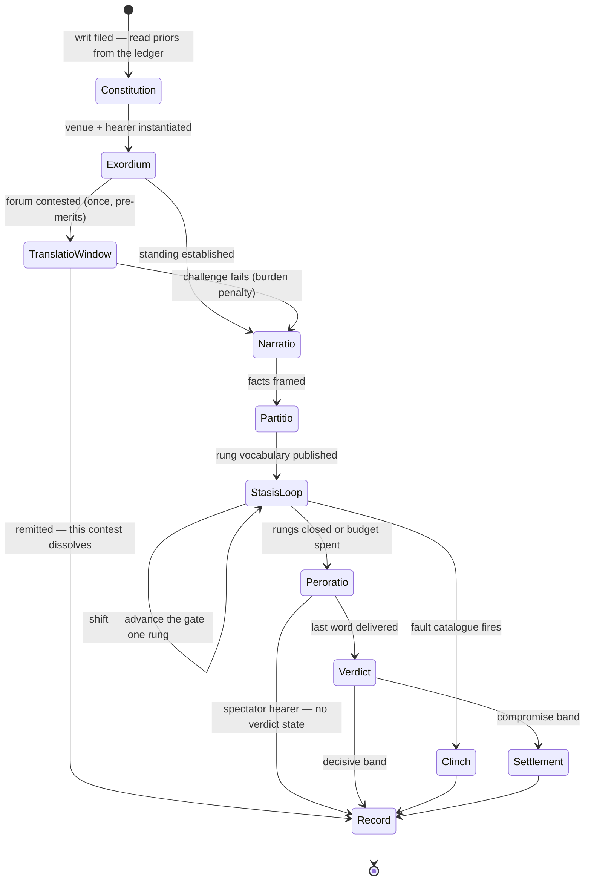

# Social contest — requirements, track architecture, and state graph

## Status: PROPOSED (2026-08-06, ED-SC-0027; **REVISED same day after adversarial audit, ED-SC-0028**)
## Lane: SC
## Supersedes: nothing. Distils `00`–`04` + `proposals/social_contest_consolidation_integration_v1.md`.

**Provenance.** Two read-only Fable adjudication lenses produced the analysis; Opus authored. **Three further
read-only Fable critics then audited this document** for correctness, logic, and elegance (record: §12,
`06_adversarial_audit_of_05.md`). They broke four claims, one of them the headline. This is the corrected text; the
errors are recorded rather than quietly repaired.

`file:line` marked ✓ was verified by the author or a critic against the working tree. ⟨R⟩/⟨S⟩ = lens-sourced,
not independently re-read.

> **Locator warning.** Every classical chapter/section number is model knowledge with no web access — doctrine
> confident, locators MEDIUM at best. **None may enter a ratified doc without a human text check.** This is the
> failure class of the warrant×attack matrix retracted in ED-SC-0025.

---

## §0. The instrument

Two corrections from Jordan reshaped the method; a third, from the audit, repaired it.

**Correction 1 — venue weighting is dynamic to the content being adjudicated, not a 1:1 map.** Today
`venue_w = role()[appeal] × R[appeal][tense] × tense_weight()[tense]` (`resolver.py:170-176` ✓), and its only
content input is `tense = Stasis.tense(ground)` (`resolver.py:303` ✓), a fixed 6→3 lookup (`primitives.py:16-17` ✓).
Two different disputed *facts* weight logos identically. A static appeal×tense matrix and a static venue triple are
each **one-place functions of something that classically takes two arguments**.

**Correction 2 — these are tracks that interact, not co-extensive things.** The collapse test every prior pass used
(*is A a function of B? then one dies*) is right for two **representations of one state** and wrong for two
**trajectories that correlate**.

**Correction 3 (from the audit) — correction 2 broke the instrument, and this is the repair.** As written, the
two-category test was not decidable, and it was applied to a **moving target**: every *kill* was graded against the
kernel **as built**, every *withdrawal* against the architecture **as proposed**. That asymmetry lets any pair be
rescued by hypothesising a future reader. **I used it that way** (§7.3, §12).

> **THE TEST, corrected.** A and B are one state written twice iff, at every reachable moment, A is recoverable
> from B by a fixed rule **and carries no state that anything reads**. Otherwise they are two tracks.
>
> **Two riders, both mandatory:**
> 1. **State which system the verdict is graded against** — the kernel as built, or the architecture as proposed.
>    Never mix them inside one verdict table.
> 2. **Every withdrawal must name the consumer** — an existing reader, or the numbered fork that would create one.
>    A withdrawal that names neither is not a finding; it is a wish.

**Correction 4 (from the audit) — temporal orientation.** I had ruled "tense dies as stored state." Right about the
wrong object: what dies is the `Stasis.TENSE` **bijection**; temporal orientation becomes **an orator's choice**,
independent of the live rung (you can argue future consequences in a forensic case). The audit's caveat stands:
this is a **proposal, not a finding** — the two axes are independent *because I propose to make them so*.

**Genre is not rescued.** I hypothesised chosen-vs-terrain-genre divergence; both analysis lenses rejected it
independently — genre derives from the hearer's role and the question's tense (*Rhet.* I.3), never a stance an
orator picks. The divergence intuition belongs to C1's temporal orientation and to C3's *why*.

---

## §1. The requirements

### Character side

| # | Requirement | Where it lives | Kernel status |
|---|---|---|---|
| **C1** | **HOW one argues** — appeal {ethos, pathos, logos} × temporal orientation {past, present, future} = nine ways to make the same point | move fields | HALF-PRESENT: the 3×3 matrix exists (`primitives.py:184-206` ✓) but temporal is *looked up from the rung*, not chosen |
| **C2** | **WHAT one argues** — live rung · warrant · the claim and its status | T1 + T2 | rung PRESENT (`primitives.py:11-25` ✓); **warrant and claim record ABSENT** — the kernel has one scalar, `ContestState.adv` (`resolver.py:44-48` ✓) |
| **C3** | **WHY one argues** — the end pursued; its divergence from the adjudicator's end is state | speaker's *topos* + the writ | **ABSENT.** The only requirement with no partial implementation |
| **C4** | **HOW effectively** — faculty · preparation · δσ · credibility slope **and** intercept | T3a/T3b, T5 | slope wired (`resolver.py:317-318` ✓); intercept slot exists, **no producer** (`resolver.py:182-193` ✓, though `wrapper.py:92` ✓ *accepts* one) |

### Type side

| # | Requirement | Where it lives | Kernel status |
|---|---|---|---|
| **P1** | **WHAT KIND of contest** | the **Venue row** — config, not code | PRESENT and structurally correct; the kernel's best feature |
| **P2** | **WHO adjudicates** — role ∈ {judge, spectator} · frame · emotion · discipline · authority | a parameter, never a state | PRESENT-BUT-THIN. `Panel` averages minds for the in-bout path (`contract.py:42-51` ✓) though `VoteAtClose` ballots per member (`resolver.py:131-142` ✓) |
| **P3** | **HOW adjudication occurs** — verdict function + burden + bands | Venue's win-condition | PRESENT: six WinConditions. **Corrected:** they read no *contest* state but `adv`; `VoteAtClose` also reads juror `discipline` as bench-weight (`resolver.py:109-140` ✓) |
| **P4** | **HOW audience impacts** — characters, adjudicator, **and the world after** | Room, Pressure, the *fama* emission | **TWO OF THREE WIRED.** → character: `Room`→`Readiness` (`resolver.py:314` ✓). → adjudicator: `Pressure`→`_bias` (`:291-293` ✓) and →`leak` (`:304-305` ✓). **→ world: ABSENT** |

### The four live questions

| Q | Question | Kernel today | What it needs |
|---|---|---|---|
| **Q1** | How do two characters' arguments interact? | **They don't.** Each move adds independently to `adv` (`resolver.py:315-316` ✓); claims never answer each other | T2 as a **claim graph with attack relations**. The in-bout anti-collapse condition |
| **Q2** | What does the adjudicator find convincing? | one preference vector blended by leak (`:306-307` ✓) — structurally right | extend to the judge argument of `f` |
| **Q3** | What does the **audience** find convincing? | **Nothing — the crowd has taste-free approval.** `Room` is two per-side capped floats built only by pathos (`primitives.py:232-236` ✓) | a crowd profile — **a venue config row, not a track** |
| **Q4** | What argumentation works **here**? | undifferentiated; `rebut` is one verb behind a boolean (`resolver.py:163` ✓) | §4.4 — schemes carry their own attacks |

**Q4's boundary.** Context-dependent attack efficacy is structurally warranted. The warrant×attack matrix retracted
in ED-SC-0025 **stays retracted**; §4.4 makes it unnecessary rather than smaller.

### The world interface — W1…W7

**Corrected scope, and this was the headline error.** I wrote that the contest is "sealed off from the world in both
directions" and that topics "today they don't" enter. **False.** A second path is live by default:

- `mc_v18.py:148-151` ✓ runs `parliamentary_bridge.run_parliamentary_scene` **every season**; `ECHO_TRANSPORT`
  is **default ON** (your ratification 2026-07-08 — the docstring calls it "the baseline campaign").
- `_derive_vote` (`parliamentary_bridge.py:82-97` ✓) **generates a topic from world pressure** — lowest-Stability
  faction proposes, highest-Mandate defends — and passes a `Motion` in.
- It writes back directly: `world.factions[dominant].adjust("L", …)` (`parliamentary_vote.py:206-216` ✓), plus a
  composed echo. Two more world-side callers exist in `systems/factions/sim/`.

**My own falsifier caught this and I had not run it.** The true statement is narrower and still worth having:

> **The personal-scale Bout kernel is sealed.** Its entire world interface is
> `build_contest(parts[0], parts[1], venue=proceeding)` — **two integers** (`scene_dispatch.py:298, 306-307` ✓).
> The parliamentary path carries a topic and writes back, but it is a **Mandate-pool roll, not the agôn**: no
> evidence, no claim record, no rhetoric crosses it either.

| W | Question | Answer |
|---|---|---|
| **W1** | How do salient topics enter? | For the agôn, they don't — the question is `venue.start_ground`, constant per proceeding (QUALITY for 7 of 8, `modes.py:59-61` ✓). The parliamentary bridge shows the shape that works: **world pressure raises the motion.** Generalise it into the writ (CIP-5), which fixes question and judgment options *before* the hearing — the Roman formulary shape |
| **W2** | How does an inquisition present its case? | An institution differs in four ways: **(a) ascribed vs earned standing**; **(b) a dossier assembled over time**; **(c) a mandate** bounding reachable rungs; **(d) institutional consequence on defeat.** (a) has a primitive — `split_standing` (`resolver.py:200-214` ✓) — but see §8's coupling caveat |
| **W3** | What is evidence and proof? | The ***atechnoi pisteis*** (§4.2). Three gaps, all world-facing: **(i) no producer** — evidence should be an output of fieldwork, so *the case you can make is the case you did the work for*; **(ii) no apparent-vs-true split**, so forgery is unrepresentable; **(iii) no provenance**, which is what makes attacks bite differently |
| **W4** | What is relevant? | The `{0,1}` floor of §4.5's operator. Today exact match — `it.ground == live_ground` (`primitives.py:300-301` ✓). Graded relevance makes relevance **contestable**, which is the classical *critical question* |
| **W5** | What does the audience carry out? | Its **impressions of the people** — the third channel, and the only one that outlives the contest. Bounded by presence: only factions with someone in the room learn anything (*fama*). Makes *who attends* a decision |
| **W6** | How much does this adjudicator's judgment weigh? | **Corrected.** I claimed "no authority of any kind" and "pressure is a one-way arrow into the bench." Both overstated: juror `discipline` is explicitly repurposed as bench-weight — "institutional rank/rigor" (`resolver.py:109-118` ✓, ED-1057) — and `SelfGating.licit` gates the contestant's `hard` on `adj.learned`/`hostile` (`resolver.py:357` ✓). What is genuinely absent is **cross-contest authority**: a king versus a regional governor. Its interesting consumer is **reach**, not difficulty |
| **W7** | What do the room and the bench already think? | The **disposition matrix**: 3 objects (character · faction · question) × 2 holders (bench · room) = **six priors**. Orthogonal — a judge may respect you, distrust your order, and have pre-judged the question |

**Disposition is not taste.** Taste weights the appeal; disposition biases reception. A judge can love logos and
hate you. Only the second is world-written.

---

## §2. The architecture

The audit's charge was accretion, and it was right: I presented "nine trajectories" over a 14-row table. The
reduction below is generated by **this document's own rule** — *rows, not code* — which I had not applied to myself.

### In-bout tracks (8) — state that moves during a contest

| # | Track | State carried | Moved by |
|---|---|---|---|
| T1 | **The question** | live rung; which are closed and how | `shift`; a rung resolving |
| T2 | **The claim record** | what is asserted on each rung, with what proof-type and status, **and which claims attack which** | every argumentative move |
| T3a | **Credibility slope** (Aristotle) | ethos built *by the speech itself* | ETHOS moves |
| T4b | **Hearer's feeling** | Book II triple `(state, toward whom, on what grounds)` | pathos moves, precondition-gated |
| T5 | **Evidence inventory** | proofs held vs spent; corroboration; apparent-vs-true; provenance | present-evidence |
| T6 | **Procedural standing** | faults · burden holder · distance to clinch | fault detection; a rung stalling |
| T7 | **Effort** | reserve remaining | spend / regroup |
| T8 | **The room's read** | favour (which side) **and** impression (what it thinks of each speaker) — one object, two consumers | any move, weighed by the crowd profile |

### Config rows (not tracks) — fixed at Constitution

- **Venue (P1):** rung vocabulary · admissible proof classes · phase mask · fault catalogue · budget · burden ·
  verdict function · decorum table · **the crowd profile (Q3)** · **emission reach (W6)**.
- **The hearer (P2):** role · **frame** (value-*topos*) · discipline · **authority**.

A preference vector that never moves during a bout is configuration. That demotion removes three of my nine
"tracks" without losing a single design consequence.

### The ledger interface (stated once)

**Read priors at Constitution; write records and impressions at Record.** This subsumes what I had split across
four edges. `T3b` (persistent *auctoritas*) and the six priors **are not contest state — they are the ledger**, a
thing I said in one paragraph while counting them as tracks in another.

---

## §3. Interaction edges (8)

| Edge | Reads | Writes | Meaning |
|---|---|---|---|
| **E1 — Decorum** | move's appeal × temporal × proof-type; T1; hearer frame; venue | T2; **T3a on misfit** | Fitness of *this* argument to *this* question before *this* mind (§4.5) |
| **E2 — Leak** | T3a; discipline; public pressure | E1's weights | How far the decision drifts from the institution's standard toward this mind (`primitives.py:244-245` ✓) |
| **E3 — Readiness** | T3a; T8 favour | magnitude of T2 writes | Built support makes appeals land; floor 0.40 (`primitives.py:253-260` ✓) |
| **E4 — Emotion precondition** | T2; the ledger | gates T4b | Anger requires a slight *by a specific party* |
| **E5 — Burden** | T6 | gates T1 shift | Who loses a stalled rung; `NONE` turns adjudication into agenda-sequencing |
| **E6 — Clinch** | T6 | terminal | Procedural collapse, orthogonal to the merits |
| **E7 — Clash** (Q1) | T2's attack relations | T2 statuses | Arguments answer each other instead of both draining one scalar. **The in-bout anti-collapse condition** |
| **E8 — Gallery vs bench** (Q3) | crowd profile; hearer frame | E1's weighting; T8 | The same speech scores differently with the room than the decider |

**Deferred to forks, not modelled here** (the audit's cut, accepted): amplification had no owner and was an absence
wearing an edge number; the speaker's-end divergence and the awe-footing consumer both read tracks that do not
exist. They live in §10, not §3.

**Divergence terms: three** — E1 (fit), E2 (institution vs mind), E8 (gallery vs bench). I previously claimed
"exactly four" and then added a fifth without adjusting the count; the audit caught it. **Per-holder priors bias
reception per holder, which is structurally a divergence** — it is counted here as part of E8's gap rather than
smuggled in unnumbered.

---

## §4. The classical substrate

### 4.1 Hermagoras — and *thesis* vs *hypothesis*

The four *staseis*: conjecture · definition · quality · **objection/transference**. Three questions about an act
plus **one procedural escape**, which is why §6 C-2 extracts the fourth from the ladder rather than ranking it.

The part with no representation anywhere: **thesis** (the general question) versus **hypothesis** (the specific
case). A contest is always a hypothesis, but arguing up to the thesis widens the ground and **changes what the
verdict is worth** — a judgment on the particular binds one case; on the general, many.

**Corrected accounting.** I called this "nearly free: one flag on a claim." It is not: C2 rules the claim record
ABSENT, so the flag's cost includes the object it sits on. And it shares one axis — verdict reach — with W6. **Two
mechanisms for one axis is one too many**; W6's is cheaper, so thesis/hypothesis is filed as a fork, not shipped.

### 4.2 Technic vs atechnic — the division that explains the world interface

| | **Technic** | **Atechnic** |
|---|---|---|
| Source | generated in the moment by skill | acquired beforehand, in the world |
| Owner | C1 + C4 | W3 — **fieldwork, between contests** |
| Value set by | the roll, the venue, the hearer | the **engine**, hidden and fixed |
| Renewable | every beat | no — spent, with corroboration decay |

So the hidden fixed weight on `EvidenceItem` is **the classical definition being honoured**, not a simplification:
the orator cannot make a contract more probative, only choose when to produce it.

**A tension the audit found and I had papered over:** §4.5 absorbs `Dossier.available` into judge-graded salience,
while this table insists atechnic value is engine-fixed. Both cannot hold unqualified. **Resolution:** the item's
*weight* stays engine-fixed and hidden; only its *relevance to the live question* is graded. A judge does not make
a ledger more authentic — they decide whether it bears. Those are different quantities and the operator must keep
them so.

### 4.3 Victory requirements and points of defeat

Two independent terminals, and the kernel already keeps them independent — one of its genuinely good properties.

- **Victory requirement** — the venue's standard: six WinConditions (`resolver.py:52-145` ✓), reading no contest
  state but `adv`.
- **Points of defeat** — barred device, self-contradiction, evasion, silence (`primitives.py:262-279` ✓). **The
  only terminal reading no `adv` at all** (`resolver.py:438-442` ✓).

You can be winning on the merits and lose on a clinch. Keep that. The catalogue is grounded in Nyāya
*nigrahasthāna* — classical **Indian**; the nearest Greco-Roman relative is Aristotle's **dialectic**, not his
*Rhetoric*. Re-ground after a human text check or keep the label as ours-by-adoption; do not manufacture a citation.

### 4.4 Warrant schemes carry their own critical questions

A scheme is a triple: **premise pattern · conclusion pattern · critical questions** — the recognised ways to
challenge it. Argument from expert opinion is challenged by asking whether the source is an expert *in this field*,
whether experts agree, whether they are biased. Sign, precedent, consequences, analogy each carry their own list.

> **A scheme defines its own attack surface. There is no warrant × attack matrix to author.**

The matrix retracted in ED-SC-0025 was solving a problem that **does not exist once warrants are schemes rather
than tags**. Undermine/Rebut/Undercut become the three *structural positions* (premise, conclusion, inference);
the scheme's critical questions supply the content.

**Condition I dropped and am restoring:** `00` Fork B ratified this direction **conditional on a pick-entropy
sweep that has not been run**. I adopted the mechanism without the condition — a §0.1 point-3 violation against my
own standard. **The condition is reinstated: schemes are conditional on that sweep.** Sourcing: Toulmin/Walton,
modern argumentation theory, ours-by-adoption; numbers are `[SEED]`s.

### 4.5 Decorum — the content-dynamic weighting operator

Both lenses arrived at one slot from opposite directions: a salience function `f(proof-type × appeal × temporal,
live question, judge)`, and *decorum* as fitness between speech and (speaker, subject, hearer, occasion).

**Corrected claim.** I wrote "these are the same object." They are **the same slot reached from two directions**,
not the same object: `f` has no speaker and no occasion argument, and the coupling operator is strictly larger —
speaker-side state reaches E1 through other edges. The identity was an elision.

The kernel already implements an unnamed version: `gain = MERIT_SCALE × magnitude × res × readiness × jitter ×
bias` (`resolver.py:315` ✓). Three defects:

1. **One-place.** Generalise the existing binary relevance gate — `Stasis.relevant` (`primitives.py:21` ✓),
   `Dossier.available` (`:300-301` ✓) — from {0,1} to graded, absorbing `RhetoricalWeights`, the venue tense trio,
   and CR4's +1D into one owner. **Three static objects, one owner.**
2. **Temporal is a lookup.** It becomes a move field; `Stasis.TENSE` is deleted (falsifier run: its only non-test
   reader is `resolver.py:303`, inside the weight path ✓).
3. **The cost half is missing.** Classically the wrong register costs ethos. A **fork**, not a default.

**Unpriced liability, named:** mechanism count falls, **parameter count explodes** — `f` is hundreds of authored
cells replacing twelve `[SEED]`s, with no authoring-budget bound. Elegance in the object model bought with a
combinatorial content liability. That bound is fork §10.15.

---

## §5. The state graph

| Slot | Entry mode | Where |
|---|---|---|
| **P1 kind** | PARAMETER at Constitution; GUARD in the loop | the Venue row. Contested **only** in TranslatioWindow |
| **P2 who** | PARAMETER; MODIFIER via E1 | frame, discipline and authority are fields; T4b is a field it carries |
| **P3 how adjudicated** | the verdict **function** | threshold · per-member ballot · compromise band · **no verdict at all** (spectator — the graph short-circuits) |
| **P4 audience** | MODIFIER throughout; **EMISSION at Record** | E3 into the character, E2+bias into the adjudicator, impressions out to the ledger |
| **C1–C4** | move fields + Constitution | priors and the credibility intercept read at Constitution |
| **Outcome** | EMISSION at terminals; re-enters as GUARD and input MODIFIER | Record{status, citableAs} · Precedent · Debt · Grudge · **Reputation** · **Leverage** · oath/contract |

**Corrected:** my earlier emission list omitted Reputation and Leverage — the very kinds the *fama* channel writes.
The state graph did not know about its own headline mechanism.

**Phases are a venue mask, not a second graph.** The six-part oration is the forensic configuration; the tradition
itself drops *narratio*/*partitio* for deliberative causes.

---

## §6. Couplings that must be named

**Softened.** I claimed an orthogonal product space is achievable **iff** four couplings are named. Neither
direction was argued, the four are not one kind of thing (C-2 is a config refactor; C-4 is an unbuilt mechanism),
and the list was incomplete. Corrected: **these are the couplings that must be named rather than papered over**,
and there are five.

**C-1 — Genre is DERIVED.** A projection of `hearer_role × question_tense × verdict_standard`. **Corrected:** I
said "all three already exist," but correction 4 deletes `Stasis.TENSE`, so after this document's own
recommendations *question_tense is stored nowhere*. The **kill survives** on the independent argument (an advocate
does not choose to be deliberative); the *decomposition* needs its middle term re-founded — on the venue's
temporal weights, not on a rung tag. Collides with ED-1062 and CR4.

**C-2 — The stasis gate is free; the six-rung total order is a category error.** Four forensic stases welded to two
deliberative grounds (`primitives.py:14` ✓), with JURISDICTION ruled pre-merits yet sitting fourth and outrankable
by CONSEQUENCE. One gate, **per-venue rung vocabulary as a config row.**

**C-3 — *Translatio* is reflexive.** Resolving it rewrites P1/P2. Canon already picked terminate-and-reinstantiate
(`social_contest_v30.md:39` ✓); the kernel implements neither horn, and `parliamentary_stay.py` has zero campaign
callers ✓.

**C-4 — Pathos supplies the audience type.** Book II analyses each emotion as (state, toward whom, on what
grounds) — the interface specification for T4b. Cheap: precondition checks against the ledger. Do not build
fourteen emotions. *(A build item, not a structural coupling — listed here because it constrains P2's shape.)*

**C-5 — Leak (NEW, from the audit).** Public pressure rewrites the weights *inside* E1 mid-contest
(`resolver.py:304-307` ✓) — P4 rewriting P3's effective standard. This also qualifies C-3's claim that translatio
is *the one* move whose resolution rewrites a contextual dimension; leak does it continuously and quietly.

---

## §7. Duplication — graded against the kernel as built

**Rider 1 applied:** this section grades against the **kernel as built**. Withdrawals (§7.2) each name a consumer
or a fork, per rider 2.

### 7.1 One state written twice — collapse stands

| Pile | Why | Survivor |
|---|---|---|
| `FaceScale` / `Face_max` / `Face_current` / Charisma×3 | `face_current = round(Standing/10 × face_max)` (`resolver.py:228-234` ✓) | **Standing** (ED-1056) |
| Renown as a second name for persistent repute | same function | **Reputation** (FA/WR lane — *observation only*) |
| three resistance representations ⟨S⟩ · two bench defaults ⟨S⟩ · `TRACKERS` registry · Concentration chain | naming layers over live primitives | the primitives |

**Three owners of credibility, and the count is the argument:** in-speech ethos → **Standing**; persistent
*auctoritas* → **Reputation**; the hearer's goodwill (*eunoia*) → **Disposition**.

### 7.2 Two tracks — withdrawals, each naming its consumer

| Pair | Consumer or fork | Verdict |
|---|---|---|
| **T3a slope vs T3b intercept** | fork §10.6 (does the ledger feed `standing_start`?) | **Withdrawn as design intent; vacuous on the kernel today** — a constant intercept is recoverable at every reachable moment. Honest status, not a banked win |
| **Hearer frame vs feeling** | frame → E1 (live); feeling → C-4 (fork) | **Withdrawn on content grounds**: an end and a targeted emotion-triple are not recoverable from each other by any fixed rule. **Corrected:** my stated reason was "two rates on one object," which is neither necessary nor sufficient — a lagged copy of any scalar has a different rate |
| **Warrant vs appeal** | fork §10.16 (the salience table) | **DOWNGRADED to undecided.** The separation is a property of a table that does not exist and whose every cell is a `[SEED]`. That is the same authoring cliff that produced the ED-SC-0025 retraction. "Separable in principle, pending authored evidence" — not a banked reversal |
| **Appeal vs temporal** | correction 4 (a proposal) | **Not a finding.** They are independent *because I propose to make them so*. A test that ratifies its own recommendation is not an instrument |
| **T1 question vs T2 claim record** | E5, E7 | Withdrawn; both consumers named |

### 7.3 What the broken instrument cost — recorded, not buried

Under the un-rider'd test I rescued **`FactionBoost`'s table into the disposition matrix**. That was a category
error: the table maps *faction → the argument-style a room dominated by that faction rewards* (`dictionaries.py:
386-442` ✓) — it contains no holder, no valence toward a faction, no opinion *of* anyone *about* anyone. It is
**crowd-profile data (Q3) plus ethical-mode vocabulary**, not `D[holder][faction]`. The new track wanted content, so
content was found for it. The die is still dead; the data is still reusable; the assignment was wrong.

---

## §8. Excess — carries no state anything reads

1. **Free:** three resistance representations · the FactionBoost **die** (the table is Q3/frame data, §7.3) ·
   `TRACKERS` registry · legacy stub · dual bench defaults. **Sharpened by the audit:** `FactionBoost` has **no
   resolution consumer at all** in code — the +1D is prose-level. More inert than I said.
2. **Cheap:** **`hard`** — byte-identical to `advance` post-gate ⟨R⟩, costs 5 vs 3 (`primitives.py:51` ✓), risks a
   barred-device clinch, and `agon_harness.py:327` ⟨R⟩ sells it as "a bigger swing." **Strictly dominated with
   false UI copy.** Its classical name is *auxesis* — a **magnitude** operation it does not perform.
3. **Newly condemned:** Momentum-as-purchasable-successes — buying assent is precisely what the art of persuasion
   is not.
4. **Rewrite:** `RhetoricalWeights` + the venue tense trio → §4.5; flat setup dice → Dossier/δσ; **Reserve** —
   `support` costs 2 and regains 4 *and* builds ethos (`primitives.py:51-52`, `resolver.py:331-332` ✓), so it is
   net-positive. Fix cost ≥ regain or cut it.
5. **Needs Jordan:** Doubt Marker (coupled to CIP-2) · FaceScale · Genre/Orientation/Style as stored axes · the
   armature merge.

**`split_standing` — coupled verdict, the contradiction resolved.** I moved it out of the excess pile as the
institutional-party primitive (W2a) and left it in §7.1's collapse pile: the document ruled both ways. The audit
also found the rescue depends on `hard` — ascribed Rank's one distinct in-bout consumer is `SelfGating.licit`
(`primitives.py:219-220` ✓), and §8.2 kills `hard`. **Resolution: its fate is coupled to fork §10.12.** If the
institutional party is built, Rank needs a consumer that is not `hard`. If it is not, `split_standing` is excess.
It cannot be rescued *and* have its only consumer deleted.

**Keep despite no Greco-Roman warrant — label as ours:** the σ-kernel; the fault catalogue; the Insinuation axis;
jitter.

---

## §9. Classically absent

| Missing | Verdict |
|---|---|
| **Book II emotion model** | The one genuine fidelity gap; the text is effectively an algorithm spec. Cheap (E4). **Build.** |
| **Amplification** (greater/lesser *koinon*) | The only *koinon* with no disguise. Home is the stakes dials, **not** a verb variant. **A fork, not an edge** — the audit's cut, accepted |
| **Peroration** | Absent. Cheapest shape: a closing move re-weighing already-presented Dossier items. **Opportunity only** |
| **Enthymeme vs example** | The example half gets an owner when the ledger read lands |
| **Cardinal virtues** | Present in disguise — the QUALITY rung has no sub-structure, and the ethical-mode table is the ghost of the *qualitas* topics. A **content** axis |
| ***Dispositio*** | Out of scope *and implicitly present* — spending under a budget **is** arrangement |
| ***Elocutio*** / ***memoria*** / ***pronuntiatio*** | Out of scope; the player composes no prose. *Pronuntiatio*'s residue — delivery matters more before crowds — argues for shipping the attribute mapping rather than deleting the table |

**The ethical-mode table is modern philosophy in classical dress.** Of the seven modes (`social_contest_v30.md:
70-78` ✓), Kant's Categorical Imperative, Rawls (1971), consequentialism-as-doctrine and moral relativism **do not
exist in Aristotle, Cicero or Quintilian**. Two have classical content. As a taxonomy it has no warrant — the same
fabricated-pedigree pattern ED-SC-0025 caught.

But *is the ethical mode the adjudicator's* topos*?* — **yes**, and that upgrades the table's role: each kind of
judgment has a governing end (the advantageous, the just, the honourable), which is the judge argument of `f`. It
survives as **authoring vocabulary for the hearer's frame**, and simultaneously for C3. Period relabellings, all
interpretive and ours: Divine Command → divine law; Virtue → the *kalon*; Consequentialism → the *sympheron*;
Categorical Imperative → the *dikaion* as universal law; Rawlsian → *epieikeia*/equity (genuinely Aristotelian);
Relativism → *nomos*; Duty → *officium*.

---

## §10. Forks — recommend, never execute

1. **Genre: keep or decompose** (C-1; re-found `question_tense` first). 2. **Stasis: one ladder or per-venue
vocabularies** (C-2). 3. **Translatio: terminate-and-reinstantiate or in-flight remit** (C-3). 4. **Audience type:**
typed per-member emotion state, **or** pathos stays a flat multiplier and the fidelity claim is dropped (C-4).
5. **Decorum's cost half:** does misfit cost ethos or merely earn less? 6. **Ethos intercept:** does the ledger feed
`standing_start`, and is the intercept **attackable**? Neither is expressible in `VALID_KINDS` (`resolver.py:32` ✓).
7. **C3's scope:** is the speaker's end a declared choice with mechanical consequence, or flavour? 8. **Reserve:**
fix or cut. 9. **Epideictic:** register-only, or the C-1 spectator-venue row. 10. **Leak's destination** under a
noisy gallery: the judge's private character (today) or the room's taste? 11. **Adjudicator authority: level or
gap?** The level effect is the recommendation; the gap is not asserted — §3 permits three divergence terms and
inventing a fourth because it sounds right is the failure this document is written against. 12. **The institutional
party** (W2) — and with it `split_standing`'s fate (§8). 13. **What the audience emits** (W5): which `LedgerTag`
kinds, and keyed to whom. 14. **Where topic-opinion lives** (W7): person and faction map to Reputation/Grudge;
opinion on the *question* maps to nothing. 15. **The authoring budget for `f`** (§4.5) — an explicit cell-count
bound and a day-one check, the discipline `00` Fork B had and §4.5 lacks. 16. **The warrant×rung salience table**
(§7.2) — the fork the warrant/appeal verdict now depends on. 17. **Thesis/hypothesis** (§4.1) versus W6's reach —
one axis, two candidate mechanisms; pick one. 18. **Amplification's home** (§9).

**Cross-lane, and I had not marked these:** W3's evidence producer commits **FI** (`investigation.py` is all stubs
✓); W5/W7's ledger work commits **SE**; C3 commits **characters**; W2(d) commits **FA**. *Observations, not
rulings.*

**The ledger claim, corrected.** I wrote that W5/W7 need "no new primitive." **False.** `ledger_add` treats
Reputation as `SINGLE_VALUED` **by kind, ignoring `key`** — it deletes every prior Reputation tag on insert
(`ledger.py:31-32, 50-53` ✓); tags live on **one settlement** (`ledger.py:14-16` ✓), so there is **no holder
dimension**, and factions do not have ledgers. W6's *reach* has no carrier at all: `key`/`ttl` give identity and
lifetime, not which ledgers hold a tag. The import **direction** is fine — `systems.*→systems.*` is established
practice with no cycle ✓. **Correct statement: one primitive, extended cross-lane, needs SE.**

---

## §11. Falsifiers and confidence

**Run, and held:** the `Stasis.TENSE` grep (only non-test reader is the weight path ✓); the `EvidenceItem`
enumeration (repo-wide grep reproduces the list exactly — `wrapper.py:95`, `faction.py:35`,
`agon_harness.py:199-200`, `_kernel_tests.py` ✓; no world producer); the six fields of `Adjudicator` ✓; the
`support` economy ✓.

**Fired, correctly, against me:** "a second world→contest call site anywhere kills the claim." It exists
(`mc_v18.py:148-151` → `parliamentary_bridge`). I wrote the falsifier and did not run it. §1's world-interface
claim is now scoped to the Bout kernel.

**New falsifiers for structures that had none:**
- **The disposition matrix / priors:** falsified if any two of the six cells are always equal across authored
  content — then the 3×2 is symmetry aesthetics, not structure. Test on the first authored venue set.
- **The crowd profile (Q3):** falsified if bench taste and room taste are never authored to diverge — the choice
  in §12's headline is a **content dependency wearing a mechanic's clothes**, exactly the caveat `00` Fork B
  attached to warrant diversity and this document had not attached to itself.
- **"Lose the case, win the room":** falsified by any rule converting the room's impression into `adv`, or the
  verdict into impression, at a fixed rate. **Guard required, not just a falsifier** (§0.1 point 5) — a
  registry-style test on the conversion sites, on the `_CELL_OWNED` template. **Not yet written.** Open work,
  named as such. *Residual the guard does not cover:* whether the two axes re-converge two hops downstream through
  `domain_echo` into common faction scalars is unexamined (FA/SE lane — *observation*).

**Replaced, because it could not fail:** the old warrant falsifier ("a number whose only justification is
completing the table") named no procedure. Replaced by fork §10.16: the verdict stands only if the table is
authored and the sweep run.

**Confidence.** HIGH: every `file:line` marked ✓ (three critics re-checked ~25 of them and found zero misquotes);
the `hard` kill (sharpened to strictly dominated); the Reserve economy; the genre kill; the sealed-*Bout-kernel*
measurement; the no-evidence-producer null. MEDIUM: the reduced architecture's completeness; most classical
locators; the couplings. **DOWNGRADED from HIGH:** "the two-category test and its assignments" — the instrument
was broken and its assignments are re-graded in §7. LOW: Topics VIII as a defeat-catalogue source; burden-of-proof
as treatise doctrine (it is practice-level Roman law, **not** A/C/Q — CIP-3 should say so).

---

## §12. What the adversarial audit changed

The one result worth keeping is that **the verdict and the reputation route through different profiles to different
consumers**, so *you can lose the case and win the room* — argue to win, or argue to be seen. It is a real
choice-shape and it fills a verified-real gap.

**But it is conditional, and I claimed it was not.** It required three things I did not state:

1. **The duality doctrine is not satisfied "on its own terms."** Fork A is RULED — "auto = the contest kernel run
   headless… consistent by construction" (`auto_manual_resolution_duality_v1.md:75` ✓), and §6 makes matched-input
   consistency the hard constraint (`:61-65` ✓). So either the headless kernel reproduces both axes, and `04` §2's
   wasted-attention charge returns on two scalars instead of one; or the player can steer the trade-off the auto
   policy does not, which is **mode-shopping in consequence space — the exact exploit §6 exists to prevent.** The
   escape is **CIP-9b**, filed as an amendment to ratified doctrine needing Jordan. I cited the doctrine and never
   mentioned CIP-9b.
2. **Authored taste divergence** (§11's new falsifier) and a reputation economy with stakes comparable to the
   verdict — which is the unbuilt ledger work of §10.
3. **Reconciliation with CIP-12 (attribution) and CIP-6 (disposition-reads-record)**, which are the two nearest
   existing proposals and which this document did not mention. The unit now carries **three independently-derived
   "second currencies"** with no statement of whether they are one axis or three. An anti-collapse condition that
   licenses a new output currency per document is collapsing in the other direction.

**Ledger of what the audit corrected:** the world-interface scope (headline, false as written) · three absolutes
about authority and one-way pressure · "no new primitive" · "same object" · the "iff" · the divergence count ·
the object count ("nine" over fourteen rows) · a dangling W7 · a wrong cross-reference · the state graph's own
emission list · the `split_standing` contradiction · the `FactionBoost`→matrix category error · the dropped
Fork-B sweep condition · an un-failable falsifier · four unmarked cross-lane commitments.

**Net direction, stated plainly.** The unit's brief was prune, cut, consolidate, distil. `00` and `04` executed it.
This document is **net-additive** — its additions trace to requirements specified after those documents, but that
explains the growth without excusing what came with it: I never reconciled against `04`'s eleven-primitive
irreducible set, and the architecture grew by appending. §2's reduction — 8 tracks, 8 edges, 2 config surfaces,
one ledger interface — is generated by this document's own *rows, not code* rule, which I had applied to the
kernel and not to myself.
