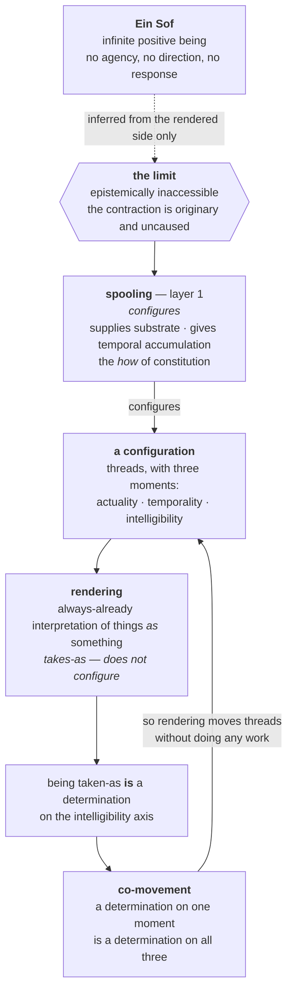
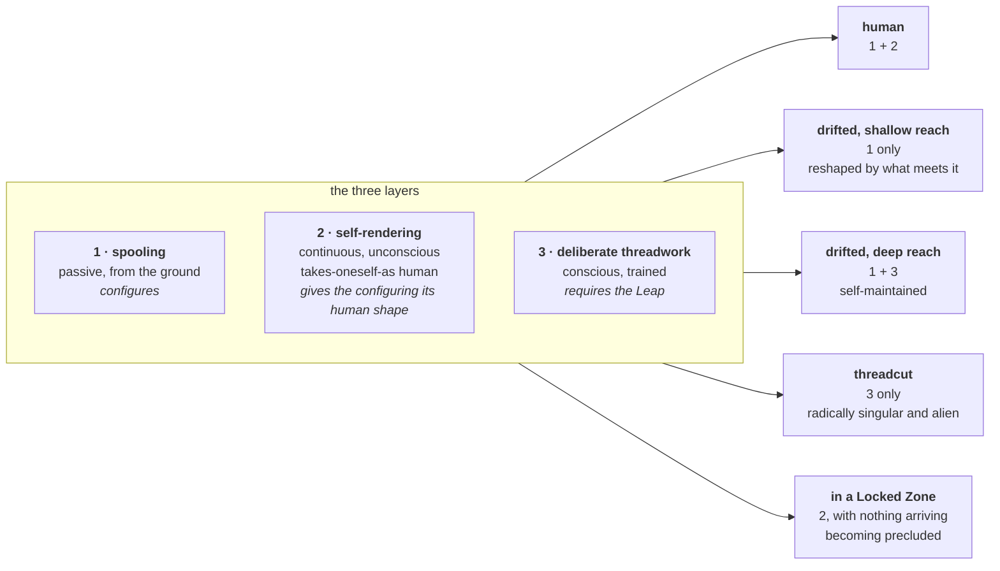
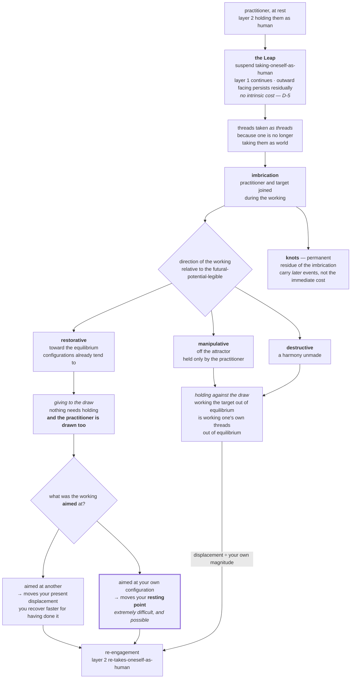
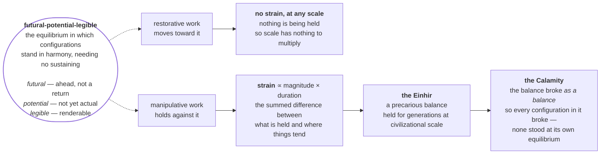
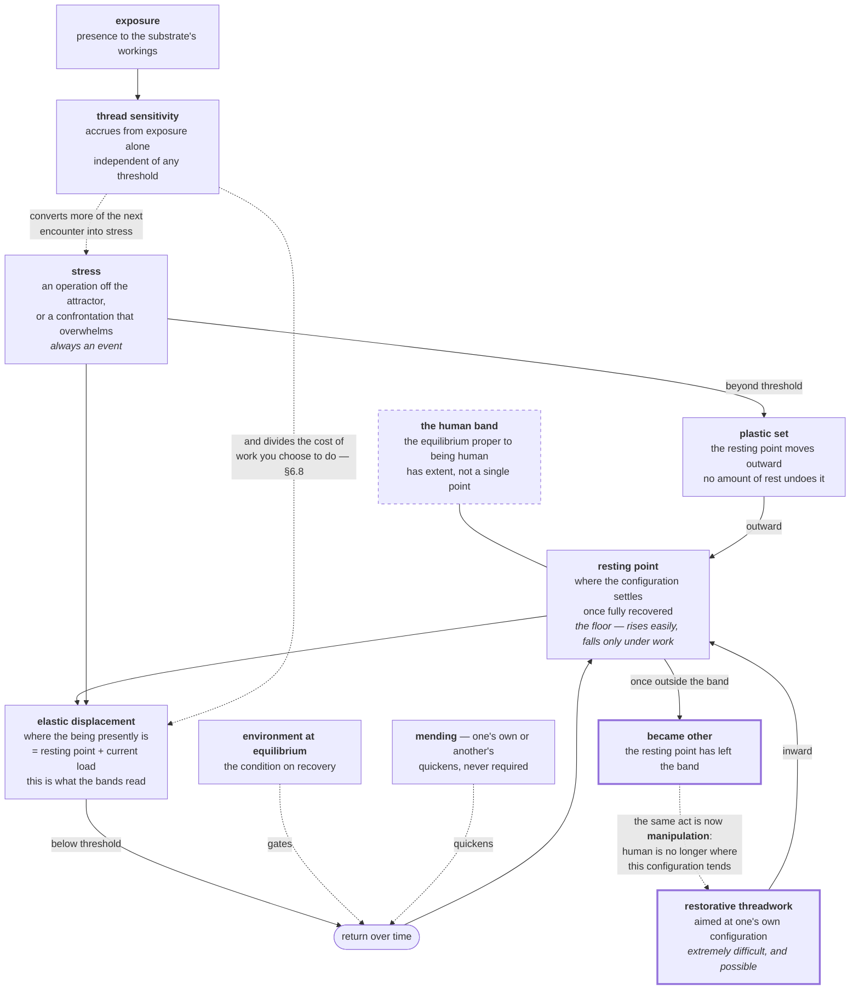
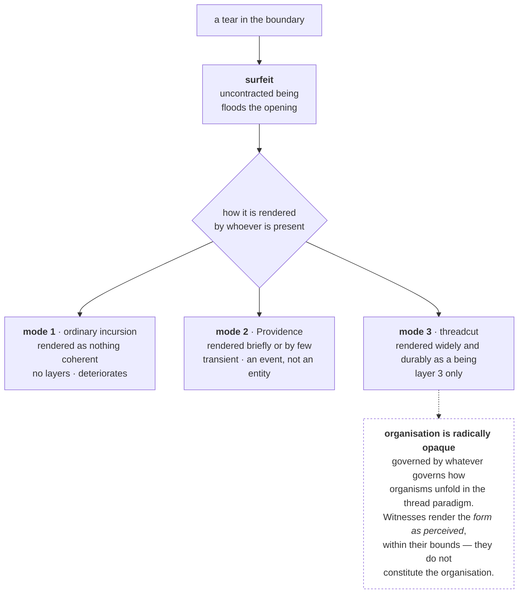
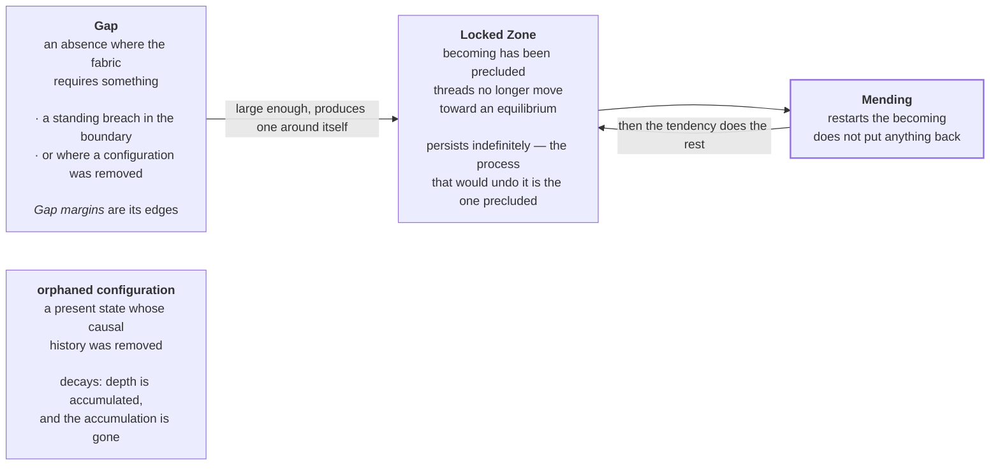
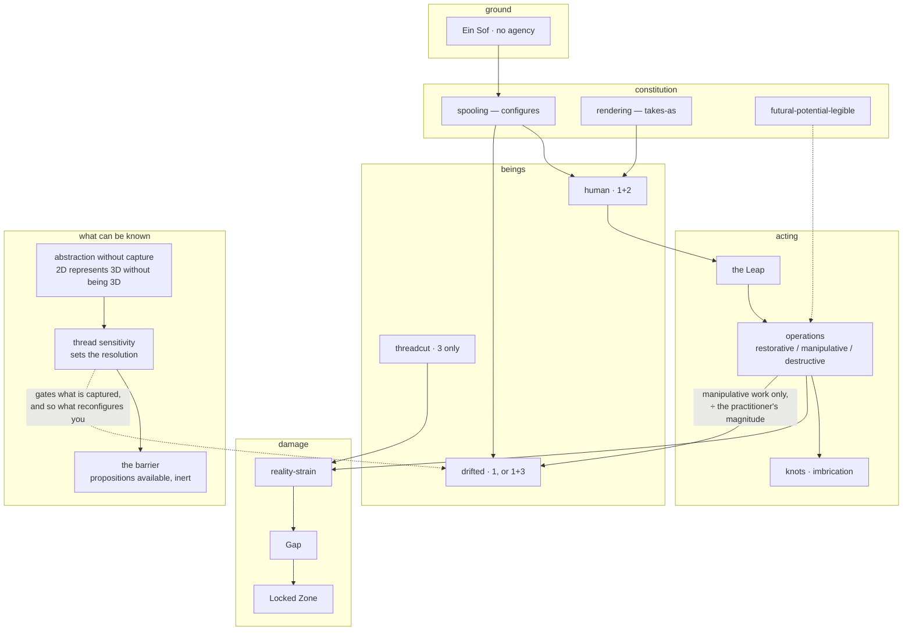

# The System, Diagrammed

Seven views of one structure. Each is a different cut, not a different system.

**Nothing here is provisional any more.** The elastic/plastic model of Coherence was ruled
2026-09-07 and the constitutive cost model on 2026-09-08; both views are drawn as settled. Where a
node or edge is the framework's own inference rather than a ruling, the note under that view says so
— see `RULINGS.md` for which is which.

---

## 1. The stack — what configures, what takes-as

The single most important distinction in the framework, and the one most easily got wrong:
**spooling configures; rendering *is* the taking-as.** Not an activity undertaken, and not something
that performs a taking-as — it is one. It is a process nonetheless.

**Read the loop.** A configuration is rendered; being rendered is a determination; determinations
co-move; so the configuration is thereby determined across all three moments. No agency anywhere.

---

## 2. Layer profiles — what distinguishes kinds of being

Not kinds of thing. **Which layers are operative.**

**The asymmetry that matters.** For a spooled being, *having* a configuration is given — layer 2 only
shapes it. For a threadcut being nothing configures: **being configured is itself the work**, done
deliberately, moment to moment, or not at all.

---

## 3. An operation, end to end

**Direction decides everything.** The same imbrication carries the cost and the benefit; what the
practitioner is joined to is either being held against the draw or handed back to it.

**Two things the shape carries that a list of rules would lose.**

- **F and G are the same machinery.** Nothing in the diagram distinguishes them except where the
  working points. Cost is not a penalty attached to certain operations; it is what being imbricated
  with a held shape *consists in*, and the benefit is what being imbricated with a released one
  consists in.
- **The edge into L is divided, not doubled.** A manipulative working's displacement is a fixed
  quantity, and what it is a fraction of is the practitioner (§6.8). A larger vessel is not tougher;
  the same load is simply less of it.

------

## 4. What strains, and why scale is not the variable

**The knife-edge.** Safety belongs to *restoring equilibrium*, not to the word "Mending" or to good
intentions. Restoring a **remembered** state, or an **intended** one, is a shape the practitioner
chose — and holding configurations there at scale is the Calamity's mechanism exactly.

---

## 5. Coherence — RULED 2026-09-07 / 2026-09-08

> Coherence is a **distance** from the equilibrium proper to being human, not a store that depletes.
> **What it is for:** to make repeated threadwork expensive enough that a practitioner recuperates
> before working again — so it must bite *and* be answerable. A cost with no remedy is a countdown,
> not a discouragement. Two elements below are derived rather than ruled and are marked.

**Read the two edges into the resting point together — that pair is the whole model.** Stress pushes
it outward and nothing but deliberate restorative threadwork pulls it back. Rest answers displacement;
only work answers the floor. That is what makes the cost bite without making it a countdown.

**The dotted edge out of *became other* is where irreversibility now lives, and it is derived.** With
the floor movable, the threshold cannot be "the floor stops moving". It is §6.6's ruled knife-edge:
Mending restores the harmony a configuration tends toward, **not a remembered state**. Past the band,
human is no longer where this configuration tends — so the identical-looking act of working it back is
manipulation, held against the draw, performed on a whole person. Nothing about the difficulty changes
at the crossing. What changes is which operation it is.

**The dashed node is the other derived element.** *Being human is a band* is not a ruling; it is what
the rulings force, since with a point the first permanent set would already be the crossing.

**Four things the diagram deliberately does not contain**, each ruled out rather than merely absent:

| absent | why |
|---|---|
| **creep** — sustained low load deforming you | Only events deform. A load below threshold leaves nothing behind, however long held. |
| **fatigue** — cycling below yield accumulating | Same ruling. Ten years beside a Gap sum to nothing. |
| **work hardening** — elastic range changing with use | Range is a constant of the being. Only the resting point moves. |
| **sensitivity as a form of plastic set** | Independent. Exposure teaches; stress deforms. |

**Three readings the shape yields.** A **veteran** rests further out with the same elastic range, so an
identical load carries them deeper — nearer the edge without being more fragile. Someone who **lives
beside a Gap** takes no permanent set from living there, does not recover there, and grows more
sensitive for having been there. And a **practitioner who has drifted and wants back** cannot rest
their way there: they need the hardest operation in the discipline, performed on themselves, or
someone able to aim it at them.

---

## 6. Emergence — what comes through a tear

---

## 7. Damage — three distinct things

**A Gap is not a Locked Zone.** A Gap is an absence; a Locked Zone is a region where nothing tends
anywhere. Whether a Gap *itself* can be Mended is open — Mending restarts becoming, and an absence
has nothing there to restart.

---

## 8. Everything at once

---

## What the diagrams cannot show

**Amorality.** Being moral requires being human, so drift departs the register in which moral
predicates apply rather than failing within it. There is no axis for this because it is the *absence*
of an axis.

**Singularity.** Threadcut beings are drawn as a box, which is already a lie — they are not a category
with members, and nothing about one licenses an inference about another.

**Two deliberate refusals.** What is owed *to* a being outside the moral register, and whether Solmund
understood what was being made of him. Both are open by ruling, not by omission.
