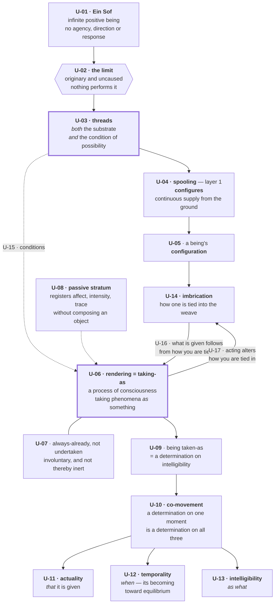
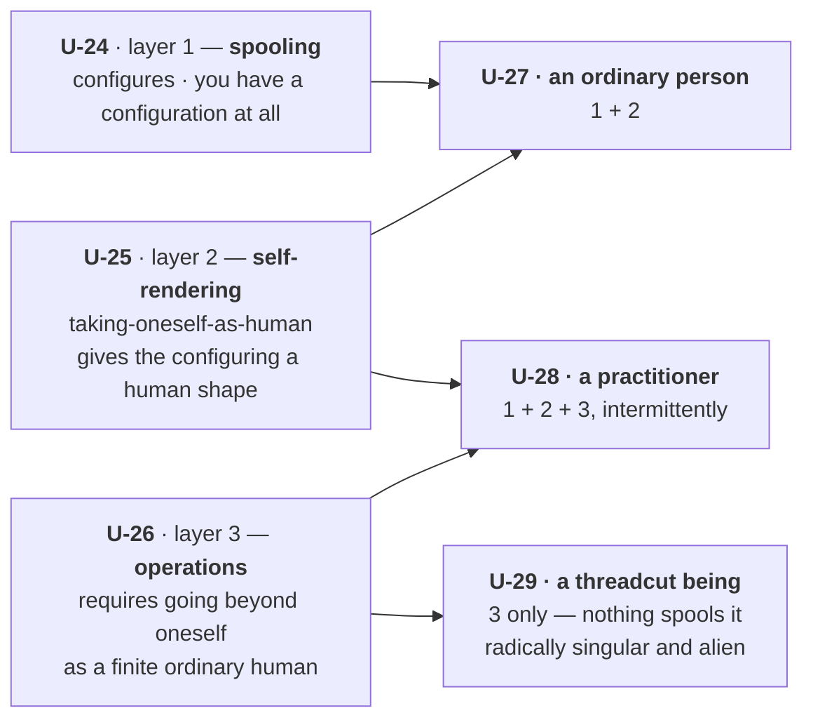
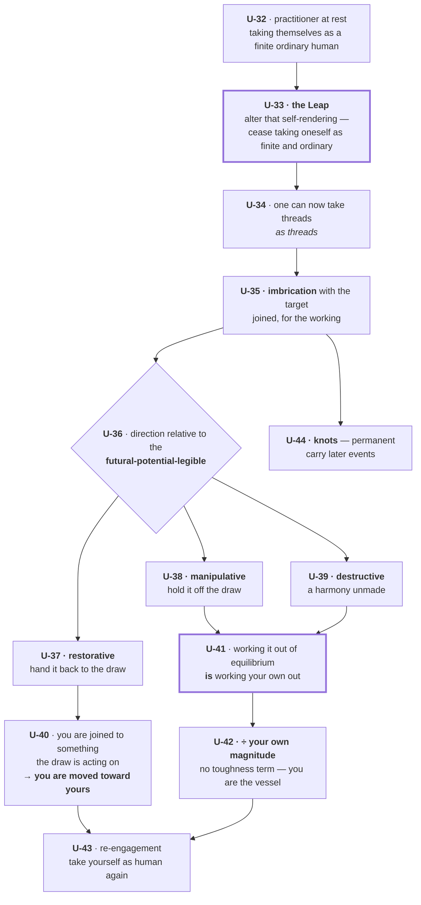
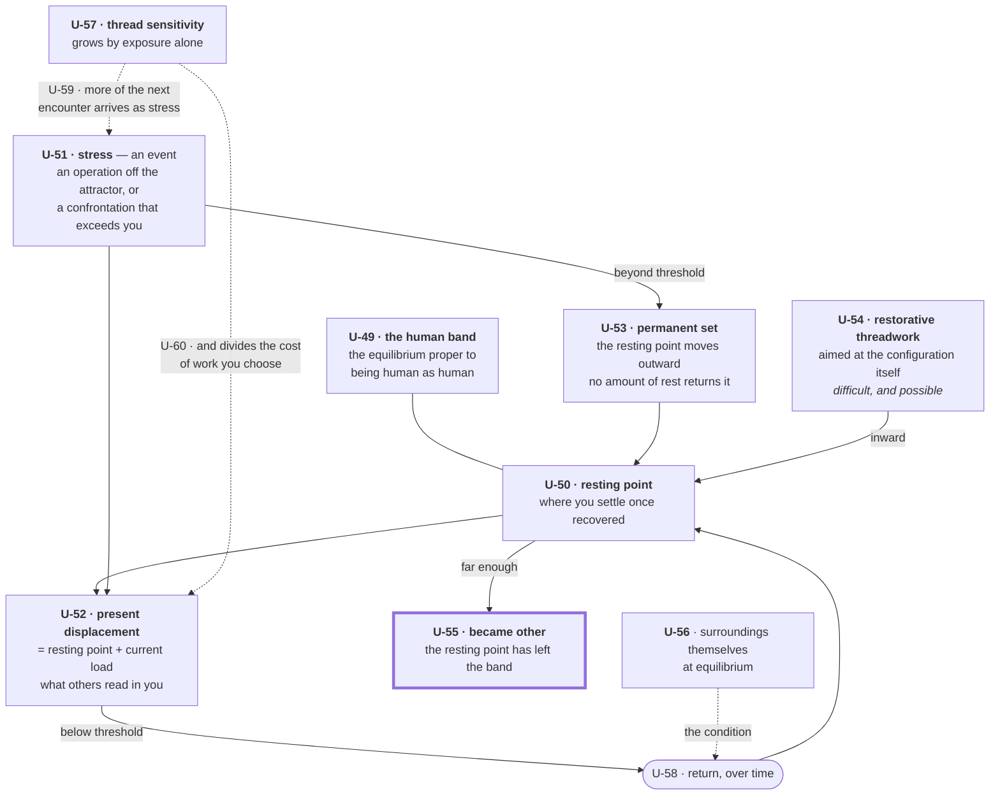
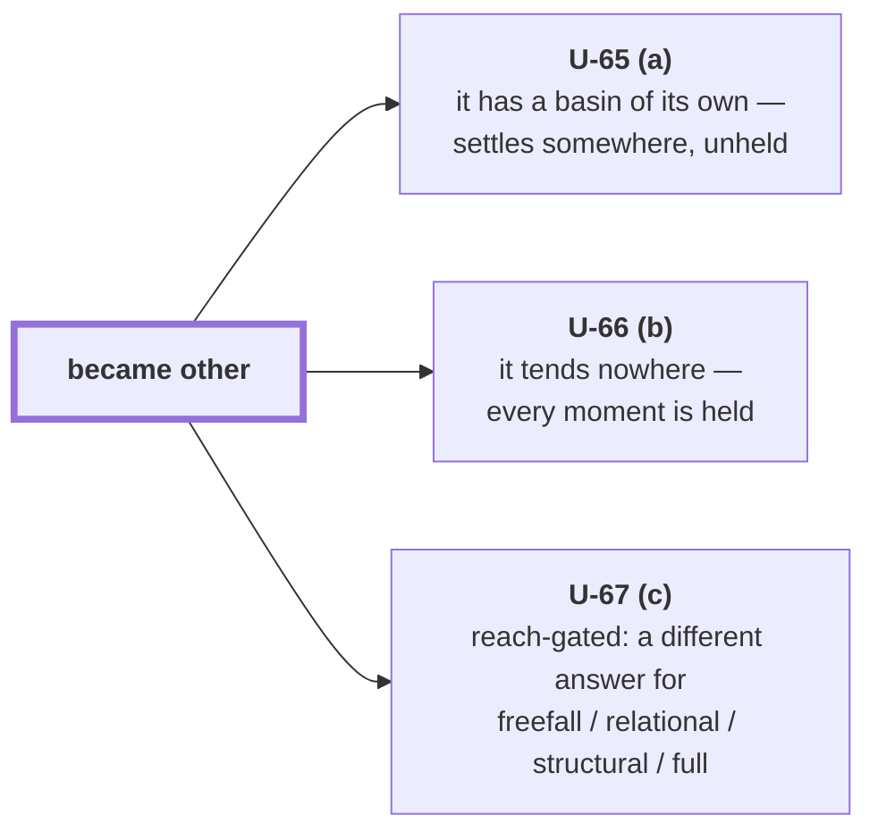
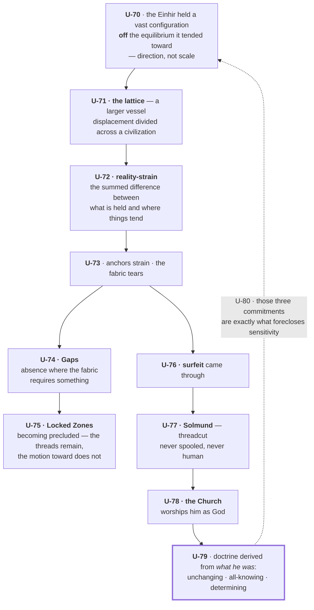

# The system as I understand it — coded

Drawn fresh after the 2026-09-09 corrections. **Every claim carries a code `U-NN`.** Strike
or correct by code — "U-23 wrong, it's X" is enough; I will not touch anything you have not
named. The manifest at the end lists all of them with provenance, so you can scan without
re-reading the diagrams.

**Provenance marks:** `[R]` your ruling · `[M]` my inference, rejectable · `[?]` open.

---

## View 1 · The spine

- **U-18** · Rendering **does not configure**. Spooling does.
- **U-19** · There is **no veil**: the rendered world *is* the substrate as given, not a
  screen over it.
- **U-20** · There is **no presenter**. Nothing delivers a world to a recipient; one takes
  phenomena as something.
- **U-21** · Threads are **not deep or hidden**. They are what the given is given *as*.
- **U-22** · U-16 and U-17 together: **perceiving alters the position from which you
  perceive.**
- **U-23** · Two beings render alike to the extent their imbrications overlap — so agreement
  needs no separately shared object.

---

## View 2 · Three ways to be

- **U-30** · For a spooled being, having a configuration is **given**; layer 2 only shapes
  it. For a threadcut being there is no giving — **being configured is itself the work**,
  moment to moment, or nothing.
- **U-31** · So immortality without spooling is **unremitting labour**, not a gift.

---

## View 3 · An operation

- **U-45** · The Leap **changes the *as***. It does not lift a veil.
- **U-46** · Its necessity needs no separate argument: an operation *is* threadwork requiring
  you to go beyond yourself as a finite ordinary human, and the Leap is that going-beyond.
- **U-47** · **Magnitude is imbrication** — how extensively you are tied into the weave.
- **U-48** · So a large vessel is large *because of what you are bound to* — and what you do
  not bear, **they bear in fractions**.

---

## View 4 · Coherence

- **U-61** · **What it is for:** to make repeated threadwork expensive enough that you
  recuperate before working again. It must bite *and* be answerable.
- **U-62** · **Two quantities, two remedies.** Displacement answers to time, rest and
  mending; the resting point answers only to deliberate restorative work aimed at it.
- **U-63** · **Place does not deform you; place gates your recovery.**
- **U-64** · Sensitivity makes you **better at doing and worse at being done to**.

### The one thing I do not know

- **U-68** · Under U-66, bringing someone back toward human moves them **toward** harmony
  with their surroundings — which makes it **restorative**, the reverse of what the suite
  says now.
- **U-69** · Under U-65, reality-strain loses its ground.

---

## View 5 · Why the history is not backstory

- **U-81** · **A vessel divides whatever it is given.** That is why the lattice let them do
  what no person could, and why the tearing was civilizational. The same property both times.
- **U-82** · The prophylaxis **was not designed. It fell out of what he was.**

---

## Manifest — strike or correct by code

| code | claim | prov |
|---|---|---|
| U-01 | Ein Sof: infinite positive being, no agency | [R] |
| U-02 | The limit is originary and uncaused; nothing performs it | [R] |
| U-03 | Threads are both substrate and condition of possibility | [R] |
| U-04 | Spooling configures; layer 1 supplies from the ground | [R] |
| U-05 | A being has a configuration | [R] |
| U-06 | **Rendering IS the taking-as** — a process of consciousness | [R] |
| U-07 | Always-already, not undertaken; involuntary but not inert | [R] |
| U-08 | A passive stratum registers without composing an object | [M] |
| U-09 | Being taken-as is a determination on intelligibility | [R] |
| U-10 | Co-movement across the three moments | [R] |
| U-11 | Actuality — *that* it is given | [R] |
| U-12 | Temporality — its becoming toward equilibrium | [R] |
| U-13 | Intelligibility — *as what* | [R] |
| U-14 | Imbrication: how one is tied into the weave | [R] |
| U-15 | Threads condition rendering | [R] |
| U-16 | What is given follows from how you are tied in | [R] |
| U-17 | Acting alters how you are tied in | [R] |
| U-18 | Rendering does not configure | [R] |
| U-19 | No veil — the world is the substrate as given | [R] |
| U-20 | No presenter | [R] |
| U-21 | Threads are not deep or hidden | [R] |
| U-22 | Perceiving alters the position from which you perceive | [M] |
| U-23 | Agreement = overlapping imbrication, no separate shared object | [M] |
| U-24 | Layer 1 — spooling | [R] |
| U-25 | Layer 2 — taking-oneself-as-human | [R] |
| U-26 | Layer 3 — operations, requiring going beyond oneself | [R] |
| U-27 | Ordinary person = 1 + 2 | [R] |
| U-28 | Practitioner = 1 + 2 + 3 intermittently | [R] |
| U-29 | Threadcut = 3 only; radically singular and alien | [R] |
| U-30 | Unspooled: being configured is itself the work | [R] |
| U-31 | So immortality there is unremitting labour | [M] |
| U-32 | Practitioner at rest, taking self as finite and ordinary | [R] |
| U-33 | The Leap = altering one's self-rendering | [R] |
| U-34 | One can then take threads as threads | [R] |
| U-35 | Imbrication with the target during the working | [R] |
| U-36 | Direction relative to the futural-potential-legible | [R] |
| U-37 | Restorative — hand it back to the draw | [R] |
| U-38 | Manipulative — hold it off the draw | [R] |
| U-39 | Destructive — a harmony unmade | [R] |
| U-40 | Restorative work moves the practitioner toward their own equilibrium | [R] |
| U-41 | Working it out of equilibrium IS working your own out | [R] |
| U-42 | Cost ÷ your own magnitude; no toughness term | [R] |
| U-43 | Re-engagement | [R] |
| U-44 | Knots are permanent and carry later events | [M] |
| U-45 | The Leap changes the *as*; it does not lift a veil | [M] |
| U-46 | Its necessity follows from the operation criterion alone | [M] |
| U-47 | Magnitude is imbrication | [M] |
| U-48 | What you do not bear, those you are bound to bear in fractions | [M] |
| U-49 | The human band | [M] |
| U-50 | Resting point | [M] |
| U-51 | Stress is always an event | [R] |
| U-52 | Present displacement is what others read | [M] |
| U-53 | Permanent set moves the resting point outward | [R] |
| U-54 | Restorative threadwork can move it back; difficult and possible | [R] |
| U-55 | Became other | [R] |
| U-56 | Recovery is conditioned on surroundings at equilibrium | [R] |
| U-57 | Sensitivity grows by exposure alone | [R] |
| U-58 | Return over time | [R] |
| U-59 | Sensitivity → more of the next encounter arrives as stress | [R] |
| U-60 | Sensitivity → divides the cost of chosen work | [M] |
| U-61 | Coherence exists to make repeated threadwork expensive | [R] |
| U-62 | Two quantities, two remedies | [M] |
| U-63 | Place does not deform you; place gates recovery | [M] |
| U-64 | Better at doing, worse at being done to | [M] |
| U-65 | (a) a crossed being has a basin of its own | [?] |
| U-66 | (b) it tends nowhere; every moment is held | [?] |
| U-67 | (c) reach-gated | [?] |
| U-68 | Under (b), restoring toward human is restorative | [M] |
| U-69 | Under (a), reality-strain loses its ground | [M] |
| U-70 | The Einhir held off the attractor — direction, not scale | [R] |
| U-71 | The lattice was a larger vessel | [M] |
| U-72 | Reality-strain = summed difference held vs tending | [R] |
| U-73 | Anchors strain, the fabric tears | [R] |
| U-74 | Gaps = absence where the fabric requires something | [R] |
| U-75 | Locked Zones = becoming precluded, threads remain | [R] |
| U-76 | Surfeit came through | [R] |
| U-77 | Solmund is threadcut, never human | [R] |
| U-78 | The Church worships him as God | [R] |
| U-79 | Doctrine derived from what he was | [R] |
| U-80 | Those commitments foreclose sensitivity | [M] |
| U-81 | A vessel divides whatever it is given | [M] |
| U-82 | The prophylaxis was not designed | [R] |

**82 items. 55 marked [R], 24 [M], 3 [?].** If an [R] is wrong I have misattributed it and
that matters more than the claim; say so and I will hunt the rest of that class.
