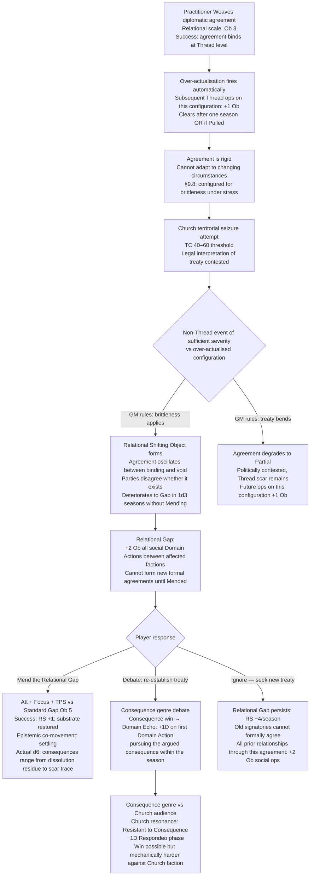
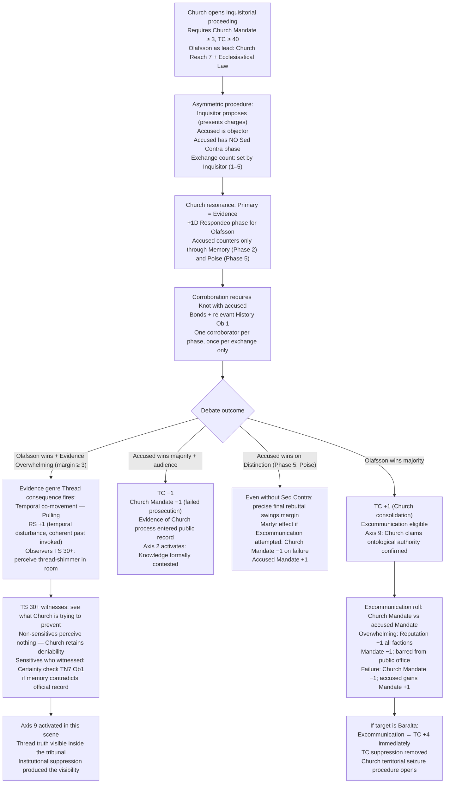
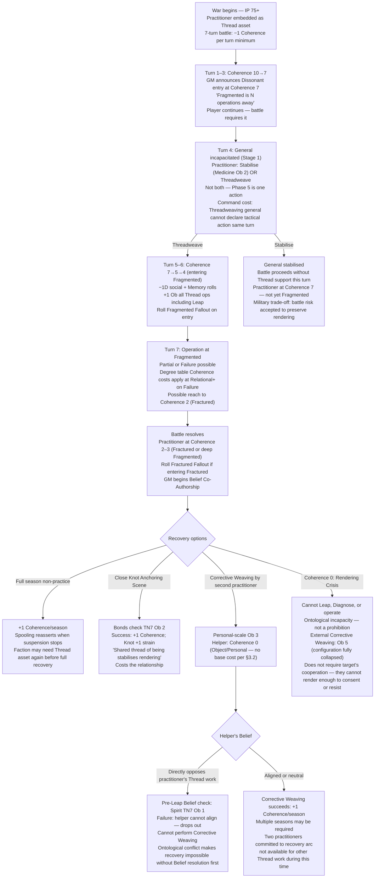
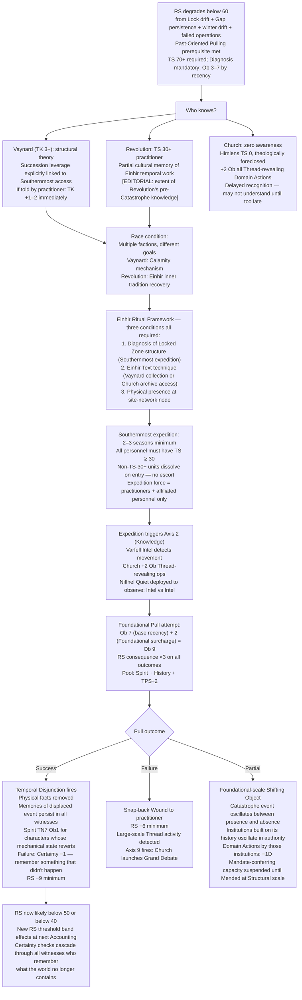

<!-- DEPRECATED -->
> **DEPRECATED — 2026-04-11**
> CP14 arcs 5–8. Superseded by gm_ref/arcs_05_09_batch02.md.
> Do not use as a canonical source.

---

<!-- DERIVED FROM: Checkpoint 14 (compilation/valoria_ruleset_checkpoint_14.md, 2026-03-26) -->
<!-- SESSION: 2026-03-30 / 2026-03-31 — see session_log_archive.md -->
<!-- STATUS: Pre-release reference tool. Not valid against any post-CP14 ruleset. -->

# Valoria — Emergent Campaign Arcs 5–8 (Experimental Mechanics)
*Threadweaving v2.5 · Debate System Redesign v1 · Mass Battle v3*
*Rebuilt with narrative prose. Niflhel harvesting references removed.*

---

## Arc 5: The Brittle Peace

**Primary mechanics:** Threadweaving v2.5 over-actualisation brittleness (§2.3, §9.8) · Relational Shifting Objects (§9.5) · Debate Domain Echo actualisation (Genre: Consequence)

---

### Narrative

A practitioner Weaves a diplomatic agreement at Relational scale. This is the right use of Thread work — small-scale, targeted, assisting a configuration that is already trying to cohere. The Weaving succeeds. The agreement holds in a way that pure political negotiation would not have guaranteed. What the practitioner could not perceive during Diagnosis, because brittleness does not manifest during the operation and cannot be rendered from outside the configuration's future context, is that the agreement has been made rigid. It will not bend.

Three seasons later the Church initiates territorial seizure at Theocracy Counter 60. The territory in question is adjacent to the one covered by the treaty. The legal interpretation is contested — one reading of the agreement protects it, another does not. In a world without Thread work, this would be a political dispute. In a world with Thread work, the Game Master rules on brittleness: would this configuration have adapted naturally? Yes. Has the Weaving made it too rigid to adapt? Yes. The Relational Shifting Object forms. Both parties report simultaneously that the agreement exists and does not, that they are bound and not bound, that the terms are clear and uninterpretable. The Parliament cannot adjudicate what is not stable enough to be read.

The Shifting Object will deteriorate to a Relational Gap in 1d3 seasons without intervention. A Relational Gap means +2 Ob on all social Domain Actions between the affected factions — not because of political hostility but because the substrate cannot support stable commitments there. New formal agreements cannot be signed until the Gap is Mended. The old agreement does not simply fail. It becomes inaccessible.

The practitioner who Weaved it is confronted with a design consequence built into the system: the operation worked. They protected what they were trying to protect. The cost is structural, invisible during the operation, and emerges only under external pressure that no Diagnosis could have predicted.

---

### Mechanical Causal Chain

**Why this arc is emergent:** The practitioner who Weaved the treaty intended to protect it. The brittleness is not failure. Weaving at Relational scale succeeded. The problem manifests only when external political pressure arrives — a connection no Diagnosis phase can reveal.

**Arc shape:** 1 season to Weave. 1–3 seasons of political pressure. 1 season of shattering. 2–3 season resolution arc.

---

## Arc 6: The Tribunal and the Temporal Shimmer

**Primary mechanics:** Debate redesign v1 asymmetric proceedings (Church Tribunal) · Evidence genre Thread consequence (temporal co-movement / Pulling) · Axis 9 · Theocracy Counter threshold

---

### Narrative

The Church Tribunal is not a debate. The Inquisitorial proceeding is designed to confirm what is already known, not to discover what is true. Confessor Himlensendt himself will not oversee this — he delegates to Cardinal Olafsson, who is thorough, institutionally competent, and completely without doubt. The accused has no Sed Contra phase. They can raise objections and make a final Distinction, and that is everything. The Church's domain resonance is Evidence, and Olafsson's History in Ecclesiastical Law gives him a pool that is structurally overwhelming at Phase 1 and Phase 4.

The accused's only genuine advantage is Poise. Phase 5 is the Distinction — finding the precise flaw in a fully developed argument while the room watches. If the accused has high Poise and a Thread-relevant History, it is possible to survive the proceeding or reverse the audience's disposition through the sheer precision of the final rebuttal. The room will not be Church loyalists exclusively. Parliament sends observers. Baralta sends a representative. Vaynard's people are there, writing everything down.

What no one anticipates is the Evidence genre co-movement. When Olafsson achieves an Overwhelming result — a margin of three or more in Exchange 2, citing doctrine with sufficient institutional force — the temporal dimension shifts. Observers with Thread Sensitivity 30+ in the room perceive a thread-shimmer. The past has been invoked with enough rhetorical force to disturb the present's temporal configuration. Rendering Stability ticks up by 1 — the invoked past was coherent, and the temporal disturbance stabilises — but the room has briefly become a Thread-active site. Non-sensitives notice nothing. Sensitives have just witnessed the Church's own evidentiary instrument produce the Thread visibility the Church's entire apparatus is designed to prevent.

Axis 9 does not need a revelation to activate. It needs a moment when Thread truth and institutional authority occupy the same scene. This is that moment.

---

### Mechanical Causal Chain

**Why this arc is emergent:** The asymmetric Tribunal structure gives the accused no reframe phase. Evidence genre Overwhelming fires Pulling co-movement. The institutional instrument of suppression produces Thread visibility. No player planned this — it is the mechanical consequence of the Church using its most powerful rhetorical tool in a room containing Thread-sensitive observers.

**Arc shape:** 1 session for the Tribunal. Immediate Theocracy Counter/Mandate consequences at Accounting. Axis 9 crisis same session if Evidence Overwhelming fires.

---

## Arc 7: The Rendering Debt

**Primary mechanics:** Mass Battle v3 per-turn Threadweaving (§A.10) · Coherence drain curve · Rendering Crisis (Coherence 0) · Corrective Weaving (v2.5 §3.4) · Collective operations Belief conflict

---

### Narrative

The war comes because Institutional Pressure has been climbing. The practitioner Player Character has been the faction's Thread asset through the campaign — reliable, experienced, willing to operate at scale when the situation requires. Seven turns of battle. The first three turns, the Coherence loss is 3 points. The practitioner is Dissonant by Turn 3. The Game Master tells the player directly: Fragmented is N operations away. The player continues, because the battle requires it.

The general is incapacitated in Phase 5 of Turn 4. The practitioner must choose: stabilise with Medicine Ob 2, or Threadweave. Not both — Phase 5 is one action. This decision is not mechanical pressure layered onto the player. It is the exact choice the game is built to generate: the personal against the institutional, the one person against the war, the practitioner's remaining Coherence against the battle's need. Whatever the player chooses, the other option's cost is visible.

By Turn 7, the practitioner is Fragmented or worse. Fractured Fallout has fired. The Game Master has been co-authoring Beliefs — presenting the practitioner's shifting perceptual framework as an internal voice, and the player rewrites each Belief to reflect a consciousness in which the categories that structure rendering are beginning to loosen. Not corruption. Not moral failure. Just the structural cost of having been outside your own rendering more times than the substrate of consciousness tolerates.

The battle is won. The recovery arc is what happens next. Non-practice recovers Coherence at +1 per season — but the war may not permit a full season of non-practice. The faction needs the Thread asset. A Close Knot who runs an Anchoring Scene contributes +1 Coherence at cost of +1 Knot strain. A second practitioner can perform Corrective Weaving — Personal-scale, Ob 3. But if that practitioner holds a Belief that directly opposes the first practitioner's Thread work, the pre-Leap Belief check fires, and on failure they cannot align their intentionality with the operation. The person who most wants to help cannot.

---

### Mechanical Causal Chain

**Why this arc is emergent:** The Coherence drain is deterministic. There is no choice that avoids it — war requires Thread operations, Thread operations cost Coherence at scale. The 7-Coherence loss from a 7-turn war is the price of winning. The Corrective Weaving arc is itself mechanically costly and subject to Belief conflict.

**Arc shape:** 1–2 sessions of battle (Coherence draining visibly). 2–4 session recovery arc. Belief conflict between practitioners is the crisis inside the recovery.

---

## Arc 8: The Temporal Window

**Primary mechanics:** Threadweaving v2.5 Past-Oriented Pulling prerequisite (Rendering Stability ≤ 60) · Rendering Stability degradation sources · Einhir Ritual Framework (§9.15) · Temporal Disjunction · Certainty checks · Multiple faction awareness

---

### Narrative

The prerequisite for Past-Oriented Pulling — Rendering Stability ≤ 60 — is not a threshold anyone sets out to reach. It arrives as the accumulated consequence of everything else. Locks left uncleared. Gaps Mended slowly or not at all. Winter drift. Operations that went Partial when they should have succeeded. The Rendering Stability tracker crosses 60 in the background of another season's accounting, and the world does not announce it. The practitioners who have been monitoring Rendering Stability notice. Some of them understand what the crossing means.

Vaynard does not have Thread sensitivity sufficient to perceive Rendering Stability directly. But at TK 3, he has the structural theory: the Southernmost is accessible at a specific substrate condition, and that condition has been approaching. His succession leverage — already formally tied to Southernmost access terms in his private accounting — now has a different weight. The window may not stay open. The things that can be done while it is open have never been possible in living memory. He begins making overtures.

The Einhir Ritual Framework requirement (§9.15) is the arc's structural gate: three conditions must all be met for a Foundational Past-Oriented Pull to be attempted. The first — Diagnosis of the Locked Zone's structure — requires a Southernmost expedition. The second — an Einhir Text technique — requires scholarly access that either Vaynard's collection or the Church's archive can provide. The third — physical presence at a site-network node — means someone must go and stay. Each condition is a season of work, a political negotiation, and a relationship. None of them can be substituted.

The attempt itself, if it comes: Ob 9 at Foundational scale. Rendering Stability consequence ×3 on all outcomes. On Success, Rendering Stability −9 minimum. On Failure, snap-back Wound plus Rendering Stability −6. The practitioners choosing to attempt this are not choosing between success and failure. They are choosing between two kinds of substrate damage — the kind that changes history, and the kind that merely costs everything without doing so.

---

### Mechanical Causal Chain

**Why this arc is emergent:** The Past-Oriented Pulling prerequisite means the world must first degrade before temporal manipulation is possible. No faction deliberately tanks Rendering Stability to open the window. The window opens as a side effect of accumulated ordinary decay. When it opens, every faction with Thread knowledge has a different agenda.

**Arc shape:** 3–6 seasons of background Rendering Stability deterioration. Window opens as threshold event. 2–3 season Southernmost expedition. 1 session Pull attempt. 2–4 season consequence arc.

---

## Cross-Arc Interaction Table

| Collision | Arcs | Mechanic |
|---|---|---|
| Brittle treaty shatters during Tribunal season | 5 + 6 | Relational Gap exists in same zone where Evidence Pulling fires; temporal co-movement disturbs an already-unstable substrate site |
| Practitioner at Rendering Crisis during Southernmost expedition | 7 + 8 | Cannot Leap, cannot Diagnose; Einhir Ritual Framework acquisition blocked until Corrective Weaving restores Coherence to 1+ |
| Battle Coherence drain before Foundational Pull | 7 + 8 | At Fragmented: +1 Ob all Thread ops; Foundational Pull already Ob 9; now Ob 10 — at cap; at Fractured: effectively impossible |
| Evidence Overwhelming in Tribunal while Rendering Stability ≤ 40 | 6 + 8 | At Rendering Stability Fragile: spontaneous Shifting Objects in Thread-traffic territories; temporal co-movement triggers one in the courtroom itself |

---

## Canon Correction Logged

**[GAP-ARC-01]** (carried from Arcs 1–4 doc): stage6_factions.md: *"Niflhel's Southernmost harvesting supply chain disturbs the Thread-configurational environment."* Contradicts editorial ruling. Thread Tension +0.5 per Quiet deployment mechanic requires revised cause or removal. The board game Harvest order (§7.1 of Threadweaving v2.5) is a faction-level Thread order; Niflhel's access to this order needs editorial clarification. Flagged for compilation pass on stage6 and the board game Thread order table.
