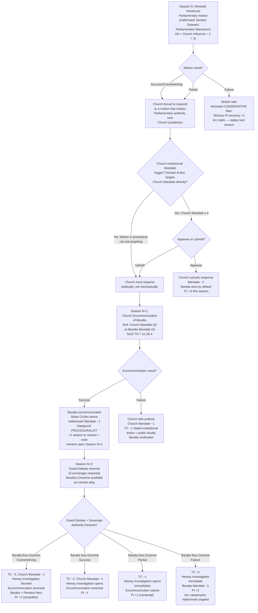
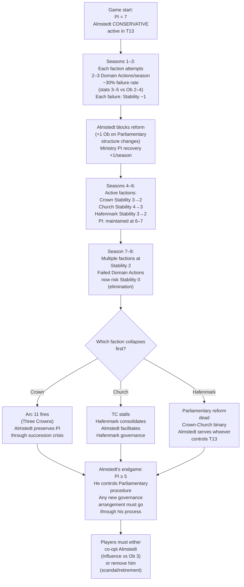

<!-- DEPRECATED: 2026-04-08 — SUPERSEDED BY gm_ref/arcs_10_18_consolidated.md. Do not use as a mechanical reference. Retained for audit trail only. -->

# Valoria Emergent Arcs — Batch 03 (Historical Parallels)
## Generated: 2026-04-08 | Source reads: params_factions.md, params_board_game.md, params_core.md, npc_roster.md, canonical_sources.yaml, geography_design.md, victory_architecture_v1.md
## Framework typology: historical structural parallels — Investiture Controversy, Year of Four Emperors, Romance of Three Kingdoms, Sengoku Japan, Byzantine court politics, Borgia papacy, Italian city-states, Machiavelli's Sinigaglia
## Prior arcs checked: gm_ref/arcs_01_04_nongreedy.md (4 arcs), gm_ref/arcs_05_09_batch02.md (5 arcs). No duplication.
## Historical source ≠ narrative reskin. Each arc fires from existing mechanical triggers. History provides structural validation, not plot.

---

## FETCH LOG
canonical_sources.yaml: ✓ fetched (154 lines)
references/params_factions.md: ✓ fetched (565 lines)
references/params_board_game.md: ✓ fetched (1541 lines)
designs/npcs/npc_roster.md: ✓ fetched (226 lines)
designs/setting/geography_design.md: ✓ fetched (138 lines)
canon/00_philosophical_foundations.md: ✓ fetched (1348 lines)
gm_ref/arcs_01_04_nongreedy.md: ✓ fetched (312 lines)
gm_ref/arcs_05_09_batch02.md: ✓ fetched (267 lines)

---

## Arc 10: The Penitent Duke
**Historical parallel:** Investiture Controversy — Henry IV's Walk to Canossa (1077). Strategic submission that forces the adversary's hand.
**Arc shape:** 2-season setup, 1-season crisis event, 2-season aftermath. Branching at crisis point.

### Narrative

Hafenmark's Baralta has been losing the war of increments. Each season the Theocracy Counter (TC) ticks upward — passive +1, Church Assert when convenient — and Hafenmark's Sovereign Authority Doctrine is a once-per-campaign weapon she cannot afford to waste on a partial result. So Baralta does something nobody expects: she invites the Church to excommunicate her.

Not publicly. She instructs Almstedt to introduce a Parliamentary motion that formally acknowledges the Church's jurisdictional primacy over one specific territory — T9 Himmelenger, the Cathedral seat. The motion is technically a concession. But it is phrased in language so precisely deferential that Cardinal Justice (Haelgrund's superior) must either accept it — thereby establishing that Church authority requires Parliamentary authorisation, a devastating procedural precedent — or reject it, proving that the Church considers itself above Parliament. Either way, Hafenmark wins the argument. Baralta does not need the motion to pass. She needs the Church to respond.

The Church's response is Excommunication. Haelgrund is ordered to prepare the case. His PROCEDURALIST flaw means the case takes 1 additional season — during which Baralta's public penance (the "Penitent Duke" act) plays out in every territory with a Parish. The faithful watch a duke humbled. Public Instability (PI) shifts. The question is whether Baralta's calculated suffering produces sympathy or contempt.

### Mechanical Causal Chain



### Event Cards

**EVENT CARD: THE PENITENT'S GAMBIT**
- **Trigger:** Hafenmark plays Parliamentary Manoeuvre AND the motion text targets Church jurisdictional authority (GM determination in TTRPG; declared intent in BG).
- **Timing:** Phase 4, Priority 4 (Social).
- **BG text:** *"Hafenmark's Parliamentary motion challenges the Church's authority over T9 Himmelenger. Church must respond: Excommunicate the author (fire Excommunication this season or next, Ob = Baralta's Mandate) or ignore the motion (TC −1 as public perception shifts)."*
- **TTRPG text:** *"Almstedt stands in Parliament and reads a motion so precisely deferential it is an insult. The Church benches are silent. Cardinal Justice leans forward. The Holy See's hands are white on the armrest. The motion does not need to pass. The Church needs to decide what to do about it."*
- **Mechanical effect:** Church player must declare Excommunication target (Baralta) within 2 seasons or accept TC −1 (institutional silence read as weakness). If Excommunication declared: normal Excommunication rules apply, plus Haelgrund's PROCEDURALIST flaw adds +1 season before resolution.
- **NPC involvement:** Almstedt (introduces motion, CONSERVATIVE flaw means he will not deviate from procedural language); Haelgrund (assigned to build the case, PROCEDURALIST flaw delays resolution); Baralta (the target, plays the Penitent).

**EVENT CARD: THE REVERSAL AT PARLIAMENT**
- **Trigger:** Baralta is under active Excommunication AND fires Sovereign Authority Doctrine in the same season as a Grand Debate reversal attempt.
- **Timing:** Phase 4, Priority 6 (Special/Unique Powers).
- **BG text:** *"The excommunicated Duke rises in Parliament. She has endured public penance for a full season. Now she speaks — not to defend herself, but to define the relationship between Church and State. Sovereign Authority Doctrine fires with Excommunication modifier."*
- **Mechanical effect:** Sovereign Authority Doctrine resolves with +1D bonus (public sympathy from endured Excommunication). If Overwhelming: Excommunication reversed simultaneously. PI adjustment based on degree: Overwhelming = PI −2; Success = PI −1; Partial = PI +1; Failure = PI +2.
- **NPC involvement:** Almstedt (facilitates Parliamentary procedure — if Almstedt has been co-opted or removed, Doctrine fires at +1 Ob); Haelgrund (his thorough case file is now evidence FOR Baralta — the documentation proves the Church's overreach).

---

## Arc 11: Three Crowns in a Season
**Historical parallel:** Year of Four Emperors (69 CE). Cascading succession instability where each new claimant destabilises the institutions that supported the previous one.
**Arc shape:** 1-season trigger event, 3-season cascade. Each season introduces a new power configuration. Branching at each transition.

### Narrative

The Crown leader falls. The mechanism does not matter — assassination, Stability 0 collapse, a failed Domain Action at the wrong moment. What matters is the cascade. Ehrenwall's Löwenritter Coup Counter hits 4. Martial Law fires. Brandt assumes operational command (Ehrenwall succession rule F-30). But Brandt's EXTERNAL THREAT FIXATED flaw redirects military assets to T3 Lowenskyst and T10 Spartfell — the Altonian invasion corridors — instead of garrisoning the capital. Valorsplatz is suddenly under-defended. Hafenmark's Almstedt sees the procedural vacuum and acts to preserve Parliamentary function. The Church sees the vacuum and acts to fill it.

Three claimants to effective governance in three consecutive seasons. Crown's institutional successor (whoever the succession mechanic produces), Löwenritter under Brandt (military authority without political mandate), and the Church (offering "stability" at the price of TC acceleration). Players must choose which configuration to support — and each choice forecloses options for the other two.

Severin Almud is trapped. His Altonian treaty commitments require a stable Crown. If Crown falls, his assurances to Altonia become void. IP +2 immediately (Altonia reads the instability). Hardar Veldensohn's PROTECTIVE flaw means he delays Altonian escalation for 1 season (buying time) — but only if Elske is not threatened. If the succession crisis puts Elske at risk (Elske Loyalty ≤ 2), Hardar flips and IP surges +3.

### Mechanical Causal Chain

```mermaid
graph TD
    A["Crown Stability → 0<br>No recovery action<br>Crown elimination fires"] --> B["Political Vacuum<br>(PP-500): Crown territories<br>enter Vacuum for 1 season<br>No faction may March in"]
    B --> C["Löwenritter Coup Counter = 4<br>Coup eligible<br>Ehrenwall declares Martial Law"]
    C --> D["Brandt succession (F-30):<br>Ehrenwall falls/retires<br>Brandt assumes command"]
    D --> E["EXTERNAL THREAT FIXATED:<br>Military redeploys to T3+T10<br>T12 Valorsplatz garrison = 0<br>T13 Feldmark garrison = 0"]
    E --> F["Severin COMMITMENT-LOCKED:<br>Cannot advocate Crown<br>military response<br>IP +2 (treaty signal)"]
    F --> G["Almstedt CONSERVATIVE:<br>Ministry stabilises procedure<br>PI recovery +1<br>But blocks Crown Emergency Powers"]
    G --> H{Hardar check:<br>Elske Loyalty > 2?}
    H -->|Yes: Elske safe| I["Hardar PROTECTIVE:<br>IP advance delayed 1 season<br>IP +1 instead of +3"]
    H -->|No: Elske threatened| J["Hardar flips<br>IP +3 immediately<br>Altonian Vanguard<br>threshold approaches"]
    I --> K["Season N+1:<br>Three-way governance claim"]
    J --> K
    K --> L{Player choice:<br>Which claimant to back?}
    L -->|Crown successor<br>(Torben claim)| M["Torben Loyalty check<br>If Loyalty ≥ 4: stable<br>succession, Mandate recovery<br>If Loyalty < 4: contested,<br>Mandate = 1"]
    L -->|Löwenritter/Brandt| N["Military governance<br>Mandate 3, Military 6<br>Border-focused:<br>Internal PI continues<br>to degrade"]
    L -->|Church mediation| O["TC +3 immediately<br>Church Mandate +1<br>Church gains 'mediator'<br>legitimacy<br>PI −2 (order restored)"]
    M --> P["Season N+2: Resolution<br>or continued fragmentation"]
    N --> P
    O --> P
```

### Event Cards

**EVENT CARD: THE CROWN FALLS**
- **Trigger:** Crown faction Stability reaches 0 AND no recovery action declared in the Declaration Phase.
- **Timing:** Accounting Step 3 (faction elimination check).
- **BG text:** *"The Crown has collapsed. All Crown territories enter Political Vacuum (1 season). Löwenritter Coup Counter advances to 4. IP +2. Each non-Crown player faction secretly writes one of: CLAIM (attempt to fill the vacuum), WAIT (observe), or ALLY (name a faction to support). Reveal simultaneously next season."*
- **Mechanical effect:** Crown elimination per PP-500. Löwenritter Coup fires. Brandt assumes command (Ehrenwall succession F-30). Severin Almud's COMMITMENT-LOCKED triggers: IP +2. All Crown Domain Action cards are shuffled into a neutral "Regency deck" — any player faction may bid Influence to draw from it next season (Ob = 3, representing the difficulty of co-opting Crown institutional machinery).
- **NPC involvement:** Brandt (assumes Löwenritter command, redirects military); Severin (treaty crisis, IP spike); Almstedt (preserves Parliamentary procedure, blocks Emergency Powers); Hardar (Elske Loyalty check determines IP trajectory).

**EVENT CARD: BRANDT'S MARCH**
- **Trigger:** Brandt assumes Löwenritter command (post-Crown collapse or post-Ehrenwall removal) AND no Altonian Vanguard has deployed.
- **Timing:** Phase 1 Planning — Löwenritter NPC priority override.
- **BG text:** *"Commander Brandt has seen the border. He has counted the days. Löwenritter military assets redeploy to T3 and T10 — the invasion corridors. Interior territories lose garrison protection. Any faction may March into ungarrisoned Crown-former territories starting next season."*
- **Mechanical effect:** Löwenritter units in T12, T13, and any non-border territory March to T3 and T10 (split evenly, round up to T3 — primary invasion route). Interior territories lose Löwenritter garrison bonus. Fort levels remain but are unstaffed. If IP reaches 75 (Altonian Vanguard), Brandt's positioning is correct and Löwenritter gets +2D on the first Battle. If IP never reaches 75, the redeployment was a strategic error — Brandt's units are out of position for every internal crisis.
- **NPC involvement:** Brandt (EXTERNAL THREAT FIXATED — this IS his flaw producing consequences); Torsvald (Riskbreaker, may abort operations in Thread-active border zones — ~30% abort rate compounds border-defence problem).

**EVENT CARD: THE ALTONIAN HUSBAND**
- **Trigger:** IP increases by ≥ 2 in a single season AND Elske Loyalty ≤ 3.
- **Timing:** Accounting Step 10b (Torben/Elske Loyalty events).
- **BG text:** *"Duke Hardar Veldensohn receives word from the Altonian court. The Emperor is displeased. Hardar must choose: deliver an ultimatum to Valoria (IP +2, Elske Loyalty −1) or delay the message (IP +0 this season, but Hardar's standing at the Altonian court −1 — next Altonian demand is non-negotiable)."*
- **Mechanical effect:** Hardar's PROTECTIVE flaw creates a binary: protect Elske (delay, lose Altonian standing) or follow orders (escalate, risk Elske). If Hardar delays twice consecutively, Altonia replaces him with a non-sympathetic envoy — IP advances at full rate thereafter and Elske Loyalty becomes decoupled from IP management. Players who have cultivated the Hardar relationship lose their IP buffer permanently.
- **NPC involvement:** Hardar (PROTECTIVE — primary actor); Severin (COMMITMENT-LOCKED — cannot advise Hardar to resist Altonia because his treaty commitments require compliance); Elske (passive — her Loyalty track determines Hardar's behaviour).

---

## Arc 12: The Chained Ships
**Historical parallel:** Battle of Red Cliffs / Chibi (208 CE). Pang Tong's advice to chain the ships — logistical efficiency that creates catastrophic vulnerability.
**Arc shape:** 4-season slow build, 1-season crisis, 1-season aftermath. The "chaining" is invisible until ignition.

### Narrative

Dalla Virke has been solving a problem nobody asked her to solve. The Guilds' supply chain, the Crown's provisioning network, and the Church's tithe collection all pass through overlapping territory — T12 Valorsplatz and T8 Ehrenfels (the river-to-sea junction). Virke, whose Niflhel network already handles the black market layer beneath all three, proposes a shared warehousing arrangement. The economics are irresistible: consolidated storage, reduced transport costs, single-point customs clearance. Feldhaus endorses it (PROFIT-MAXIMISING — Guilds Wealth +1). Crown's trade officials accept it (lower provisioning costs). The Church's Prudence Cardinal endorses it (more efficient tithe collection, Church Wealth recovery +1 per season).

The problem: ~15% of the goods passing through Virke's network are Thread-touched (per her NPC profile). The shared warehouse now commingles Thread-touched goods with Crown provisions and Church tithes. When the Prudence Cardinal's aggressive tithe collection (OPTIMISER flaw) pushes into the warehoused goods for redistribution to Church charities, Thread-touched items enter Church-run hospitals and poorhouses. Low-grade Coherence effects begin accumulating in non-sensitive populations. Haelgrund, if investigating in the area, may detect anomalous Thread signatures — but his PROCEDURALIST flaw means the investigation takes an extra season.

The "fire" — the moment someone reveals the Thread contamination — destroys all three supply chains simultaneously. The chains that made the arrangement efficient make the collapse total.

### Mechanical Causal Chain

```mermaid
graph TD
    A["Setup: Virke proposes<br>shared warehouse<br>(Niflhel Diplomacy NPC action<br>Ob = 2 per faction)"] --> B["Feldhaus endorses<br>PROFIT-MAXIMISING:<br>Guilds Wealth +1/season<br>while warehouse active"]
    B --> C["Prudence Cardinal endorses<br>OPTIMISER:<br>Church Wealth +1/season<br>(tithe throughput)"]
    C --> D["Crown trade officials<br>accept<br>(Provisioning cost −1)"]
    D --> E["Warehouse active<br>Seasons 1–4:<br>All three factions benefit<br>Thread-touched goods<br>commingling = invisible"]
    E --> F["Prudence Cardinal's<br>tithe redistribution<br>sends Thread-touched<br>goods to Church charities<br>in 2–3 territories"]
    F --> G["Low-grade Coherence effects<br>accumulate in T12 and T8<br>(RS −0.5/season in those<br>territories — tracked<br>fractionally, applied at<br>Year-End)"]
    G --> H{Detection check:<br>Any practitioner in<br>T12 or T8?}
    H -->|Yes: Practitioner<br>Cognition vs Ob 3| I{Diagnosis result?}
    H -->|No: Undetected<br>continues accumulating| J["Season 5+:<br>Coherence effects<br>become visible<br>(unexplained illness<br>in Church charity<br>recipients)"]
    I -->|Success| K["Thread contamination<br>revealed<br>THE FIRE IS LIT"]
    I -->|Failure| J
    J --> K
    K --> L["SIMULTANEOUS COLLAPSE:<br>Crown supply chain: −1 Wealth<br>Guilds supply chain: −2 Wealth<br>(they're most exposed)<br>Church tithe chain: −1 Wealth<br>Church Mandate −1 in<br>affected territories<br>(charities distributed<br>heretical goods)"]
    L --> M{Who is blamed?}
    M -->|Virke exposed<br>(Tribune Investigate<br>Ob 2 vs Niflhel)| N["Niflhel network<br>collapses peninsula-wide<br>Virke recalled<br>Replaced with<br>non-sympathetic operative"]
    M -->|Feldhaus exposed<br>(her 15% supply chain<br>knowledge)| O["Guilds Mandate → 2<br>Guilds Stability −2<br>Feldhaus personally<br>ruined"]
    M -->|Prudence Cardinal<br>exposed (distributed<br>the goods)| P["Church internal crisis<br>TC −2 (public disgust)<br>Prudence Cardinal<br>removed from portfolio<br>Church Wealth recovery<br>−1/season permanently"]
    M -->|Cover-up (all three<br>collude to suppress)| Q["Warehouse closed<br>quietly<br>Each faction Stability −1<br>(internal knowledge<br>of the cover-up)"]
```

### Event Cards

**EVENT CARD: THE EFFICIENT ARRANGEMENT**
- **Trigger:** Niflhel NPC Diplomacy action succeeds in T12 or T8 AND Guilds Wealth ≥ 5 AND Church Wealth ≥ 4.
- **Timing:** Accounting Step 2 (trade reconciliation).
- **BG text:** *"Niflhel proposes a shared warehousing arrangement in [T12/T8]. Crown, Guilds, and Church each gain +1 to their relevant economic track per season while the arrangement persists. Place a 'Shared Warehouse' token in the territory. This token is a target for any Investigate or Heresy Investigation action."*
- **Mechanical effect:** Shared Warehouse token. +1 Wealth recovery per season for each participating faction. RS −0.5/season in that territory (tracked fractionally). Thread contamination is mechanically present but invisible until investigated. Any Tribune Investigate targeting the warehouse territory at Ob 3 (not Ob 2 — the contamination is buried in legitimate trade) may reveal the Thread connection.
- **NPC involvement:** Virke (NETWORK PROTECTOR — she will protect the arrangement from investigation by withholding intelligence about it from Niflhel central); Feldhaus (PROFIT-MAXIMISING — she will not voluntarily investigate anything that generates +1 Wealth); Prudence Cardinal (OPTIMISER — increases tithe throughput, accelerating the contamination).

**EVENT CARD: THE FIRE AT RED CLIFFS**
- **Trigger:** Thread contamination in a Shared Warehouse territory is revealed by any means (practitioner Diagnosis, Tribune Investigate success, Heresy Investigation in the territory, or Coherence effects becoming publicly visible at Year-End after 4+ seasons of accumulation).
- **Timing:** Immediate (interrupts current phase).
- **BG text:** *"The shared warehouse contained Thread-touched goods. The Crown ate them. The Church distributed them to the faithful. The Guilds profited from them. All three supply chains are compromised."*
- **Mechanical effect:** Shared Warehouse token removed. Each participating faction: Wealth −1 immediately + Stability check (relevant stat vs Ob 2; Failure = additional Stability −1). Church takes additional Mandate −1 in the warehouse territory (distributed heretical goods to the faithful). If Haelgrund is assigned to investigate: his PROCEDURALIST flaw means the investigation is thorough — he discovers the full chain, all three factions' involvement. The report is Overwhelming. But it takes +1 season. What happens during that season depends on whether the factions attempt a cover-up.
- **NPC involvement:** Haelgrund (PROCEDURALIST — thorough but slow, gives cover-up window); Virke (NETWORK PROTECTOR — will sacrifice herself to protect her trade partners if relationship is established); Feldhaus (PROFIT-MAXIMISING — will attempt to shift blame to Niflhel to protect Guilds Wealth).

---

## Arc 13: Wait Until It Sings
**Historical parallel:** Tokugawa Ieyasu's patience strategy. "If the bird does not sing, wait for it."
**Arc shape:** 6+ seasons. No visible event. The arc IS the accumulation. Resolution comes when other arcs have burned out the active players.

### Narrative

Peder Almstedt does nothing extraordinary. He processes Parliamentary motions. He maintains AP-tokens. He recovers PI by +1 per season (his CONSERVATIVE efficiency). He blocks reform proposals at +1 Ob. He is, by every measure, the least interesting figure in Valorsplatz.

Three factions expend Domain Actions trying to change the system. Crown pushes Emergency Powers. Hafenmark pushes Parliamentary reform. The Church pushes TC toward seizure threshold. Löwenritter pushes toward coup. Each faction burns Stability, Mandate, and political capital on offensive action. Each time they fail a Domain Action: Stability −1 (PP-403). Each failure costs them while Almstedt's Ministry recovers PI and maintains the procedural apparatus.

By Season 8, the active players have weakened themselves. Crown Stability: 2. Church Stability: 3. Hafenmark Stability: 2. The Ministry — which never attacked, never defended, never did anything except maintain process — has PI at 7 (recovered from starting 7, dipped to 5 during crises, recovered via Almstedt's +1/season). Almstedt is now the kingmaker. Not because he sought power, but because everyone else spent theirs.

### Mechanical Causal Chain



### Event Cards

**EVENT CARD: THE PROCEDURAL OBJECTION**
- **Trigger:** Any faction attempts a Domain Action that would alter Parliamentary structure (Crown Emergency Powers, Hafenmark Reform, Löwenritter Reconstitution, Church jurisdictional claim over T13) AND Almstedt is active (Ministry Mandate ≥ 1).
- **Timing:** Phase 4, after action declaration, before roll.
- **BG text:** *"The Ministry's Chief Clerk raises a procedural objection. The action may proceed, but at +1 Ob. The objection is not political — it is administrative. The distinction will not comfort you."*
- **Mechanical effect:** +1 Ob to the declared action. Almstedt's CONSERVATIVE flaw. This is his NPC behaviour, not a player choice. Cannot be overridden except by co-opting Almstedt (Influence vs Ob 3) or Ministry Collapse (Mandate 0). PI +0.5 (tracked fractionally — the objection itself stabilises process).
- **NPC involvement:** Almstedt (CONSERVATIVE — this IS his card, he plays it every time the trigger fires); Ministry NPC (facilitates PI recovery).

**EVENT CARD: THE KINGMAKER'S MOMENT**
- **Trigger:** 2+ player factions have Stability ≤ 2 AND PI ≥ 5 AND Ministry Mandate ≥ 2.
- **Timing:** Accounting Step 6 (Year-End announcements) — fires once per campaign.
- **BG text:** *"The Chief Parliamentary Clerk has outlasted everyone who tried to change his process. Parliament still functions. The question is: who does Parliament serve? Almstedt's procedural apparatus is the only intact governance mechanism. The next faction to control T13 inherits a functioning state. The cost: working within Almstedt's rules."*
- **Mechanical effect:** Almstedt becomes a contested asset. Any faction may attempt to co-opt Almstedt via Consul Outward Diplomacy (Ob 3 = Ministry Mandate ÷ 2 round up, min 2 — per existing Ministry corruption rules). Success: Almstedt's +1 Ob reform block shifts to protect that faction's interests (their reform proposals pass at −1 Ob; opponents' at +2 Ob). Overwhelming: Almstedt actively advocates — Ministry AP-token in one territory acts as that faction's capital for one season.
- **NPC involvement:** Almstedt (CONSERVATIVE — he does not choose a faction; he serves whoever controls the process. The "kingmaker" is not a conscious choice but a structural consequence of everyone else's failure); Solberg (STABILITY-SEEKING — Schoenland's factor, if he detects Almstedt's pivotal position, will attempt to co-opt him for stability outcomes, because stability = Solberg goes home).

---

## Arc 14: The Purple Shroud
**Historical parallel:** Nika Riots (532 CE). Chariot factions uniting against the emperor; Theodora's "purple is a fine burial shroud" speech; Belisarius's massacre.
**Arc shape:** 1-season trigger, 1-season crisis, 1-season resolution. Fastest arc in this batch. Explosive.

### Narrative

Public Instability (PI) has been climbing. The causes are diffuse — failed Domain Actions, TC pressure, IP anxiety, faction infighting visible to the public. Then a single event pushes PI past threshold: the Church attempts TC 75 Territorial Seizure in a territory the public considers Crown (T12 Valorsplatz or T1 Kronmark). The faithful and the loyalists, who normally oppose each other, unite in fury. The streets erupt.

The Church offers to restore order. The price: TC +5 and permanent Church garrison in the capital district. Crown can accept (order now, theocracy later) or refuse (chaos now, but no institutional debt). Hafenmark's Baralta can invoke Parliamentary authority to mediate — but Almstedt's CONSERVATIVE flaw means the Parliamentary response takes a full season (procedure), during which the city burns.

Torsvald, the Riskbreaker, is in the city. Her RISK-AVERSE ON THREAD COLLATERAL flaw means she will not deploy Löwenritter covert assets in a situation with potential Thread-active civilians (the Prudence Cardinal's redistributed Thread-touched goods from Arc 12 may be present). If she aborts, Löwenritter's covert stabilisation capability is offline during the worst crisis in the campaign.

### Mechanical Causal Chain

```mermaid
graph TD
    A["PI ≥ 8<br>(or PI threshold event<br>from BG rules)"] --> B["TC reaches 75:<br>Territorial Seizure<br>phase transition fires<br>Church targets T12 or T1"]
    B --> C["TC 75 Seizure roll:<br>Church Mandate vs<br>owner Mandate ÷ 2<br>round up, min 1"]
    C --> D{Seizure result?}
    D -->|Success| E["Church administrative<br>control of territory<br>Domain Actions vs Church<br>+2 Ob in territory<br>TC +2"]
    D -->|Failure| F["Church Mandate −1<br>TC +0"]
    E --> G["PUBLIC REACTION:<br>PI check fires<br>PI +3 (seizure of<br>capital/core territory)"]
    F --> G
    G --> H["PI ≥ 8 + PI +3<br>= effective PI crisis<br>Multiple factions' supporters<br>unite against the perceived<br>aggressor"]
    H --> I{Church offers<br>to restore order}
    I -->|Accept| J["Order restored<br>PI −3<br>TC +5<br>Church permanent<br>garrison in territory<br>Long-term: theocracy<br>entrenched"]
    I -->|Refuse| K["City burns<br>PI remains critical<br>All factions in territory:<br>Stability −1<br>Wealth −1<br>RS −1 (Thread-touched<br>goods burn = Thread<br>release)"]
    K --> L{Almstedt Parliamentary<br>mediation?}
    L -->|Yes: +1 season delay<br>(CONSERVATIVE)| M["Season N+1:<br>Parliament convenes<br>Hafenmark mediates<br>PI −2 if successful"]
    L -->|No: Almstedt absent<br>or Ministry collapsed| N["No institutional<br>mediation available<br>Military solution only"]
    N --> O{Löwenritter deploy?}
    O -->|Brandt available| P["Military suppression<br>PI −3<br>Mandate −1 for<br>Löwenritter<br>(blood on hands)"]
    O -->|Torsvald leads<br>(Thread-active zone)| Q["RISK-AVERSE fires:<br>~30% abort chance<br>If abort: Löwenritter<br>inaction in crisis<br>PI +1, Deniability Debt +1"]
```

### Event Cards

**EVENT CARD: THE STREETS ERUPT**
- **Trigger:** PI reaches threshold (BG: PI ≤ 2; TTRPG: GM-determined crisis) AND Church Territorial Seizure fires in the same or previous season in T12 or T1.
- **Timing:** Immediate interrupt — suspends all other Phase 4 resolution until crisis addressed.
- **BG text:** *"Valorsplatz burns. The faithful and the loyalists, ancient enemies, stand together against the institution that tried to seize their home. Every faction with units or presence in the territory is at risk. Order must be restored — but the price of order determines the world that follows."*
- **Mechanical effect:** All actions in the affected territory are suspended. Each faction with presence: Stability check (relevant stat vs Ob 2). Failure = Stability −1. Crisis persists until resolved by: Church intervention (TC +5), military suppression (Löwenritter or Crown Military action, Mandate −1), Parliamentary mediation (Almstedt, +1 season delay), or player-driven Diplomacy (Senator Outward, Ob = current PI value ÷ 2 round up).
- **NPC involvement:** Almstedt (CONSERVATIVE — delays mediation by 1 season); Torsvald (RISK-AVERSE — may abort covert operations); Prudence Cardinal (if Arc 12 has fired, his redistributed Thread-touched goods make the territory Thread-active, triggering Torsvald's abort check); Brandt (if available, suppresses efficiently but at reputational cost).

**EVENT CARD: THE CHURCH'S OFFER**
- **Trigger:** "The Streets Erupt" event is active AND Church player (or Church NPC AI) declares willingness to restore order.
- **Timing:** Declaration Phase of the season following the eruption.
- **BG text:** *"The Church extends a hand. 'We can end this. The faithful will listen to us. They always have.' The price is printed on the back of the card. Do not read it aloud until you accept."*
- **Mechanical effect (printed on reverse):** PI −3 (immediate, order restored). TC +5 (immediate — the Church's price). Church places 1 permanent Templar unit in the territory (cannot be removed except by Battle or Riskbreaker operation). Church Govern actions in this territory: −1 Ob permanently. All other factions' Domain Actions in this territory: +1 Ob permanently. The territory is effectively Church-administered while technically under its original controller's flag.
- **NPC involvement:** Church NPC AI Priority: if no player controls Church, NPC AI always makes this offer when PI crisis fires in a territory with Church Mandate ≥ 4.

---

## Arc 15: The Banker's War
**Historical parallel:** Medici Florence — economic dominance as political weapon. The bank that funds both sides of a war.
**Arc shape:** 3-season setup, 1-season exposure, 2-season aftermath. Branching based on whether the dual-funding is exposed.

### Narrative

Annika Feldhaus has a simple business proposition. Crown needs Wealth to fund military operations against Church encroachment. Church needs Wealth to fund TC advancement through institutional spending. Both need more than their seasonal Wealth recovery provides. Feldhaus offers trade partnerships — Guilds Consul Outward actions that boost both factions' Wealth simultaneously.

The catch: Feldhaus's PROFIT-MAXIMISING flaw means she optimises for Guilds Wealth regardless of political consequences. She is funding both sides of the sovereignty conflict. The Guilds profit from instability — every Domain Action both factions take against each other generates trade volume. If the conflict ends (either Crown or Church wins decisively), Guilds trade revenue drops.

Solberg notices. His STABILITY-SEEKING flaw means he is unconsciously tracking anything that prolongs conflict. Feldhaus's dual-funding is the opposite of what Solberg wants — it perpetuates instability, which keeps Solberg on the peninsula. But Solberg serves Schoenland, and Schoenland profits from Valorian instability. If Solberg reports the dual-funding to Schoenland central, his superiors will commend Feldhaus (she's doing Schoenland's job for them) and Solberg stays longer. If Solberg suppresses the information, he is betraying Schoenland but serving his own desire to go home.

### Mechanical Causal Chain

```mermaid
graph TD
    A["Feldhaus: Guilds Consul Outward<br>Trade with Crown<br>Ob = Prosperity ÷ 3<br>Guilds Wealth +1"] --> B["Same season: Feldhaus<br>Guilds Consul Outward<br>Trade with Church<br>Ob = Prosperity ÷ 3<br>Guilds Wealth +1"]
    A --> C["Crown Wealth +1<br>(trade partner bonus)"]
    B --> D["Church Wealth +1<br>(trade partner bonus)"]
    C --> E["Crown uses Wealth<br>for Military actions<br>against Church"]
    D --> F["Church uses Wealth<br>for TC advancement<br>against Crown"]
    E --> G["Conflict persists<br>Both factions spend<br>Guilds-funded Wealth<br>on offensive actions"]
    F --> G
    G --> H["Guilds Wealth ≥ 6<br>(already high, now<br>climbing to 7 cap)<br>Guilds Mandate still 3<br>(PROFIT-MAXIMISING:<br>no political investment)"]
    H --> I{Detection:<br>Tribune Investigate<br>on Guilds Trade<br>Ob 2 vs Guilds Intel}
    I -->|Success: dual-funding<br>revealed| J["EXPOSURE EVENT"]
    I -->|Failure: hidden| K["Continue accumulating<br>Guilds become<br>indispensable to both<br>factions"]
    J --> L{Who exposed it?}
    L -->|Crown| M["Crown cuts Guilds trade<br>Crown Wealth −1/season<br>Church still funded<br>TC advantage to Church"]
    L -->|Church| N["Church Excommunication<br>of Feldhaus (Ob 2)<br>Guilds Stability −2<br>Crown still funded"]
    L -->|Varfell/Riskbreaker| O["Intelligence leverage:<br>Blackmail Feldhaus<br>Guilds become tool<br>of investigating faction"]
    L -->|Solberg reports<br>to Schoenland| P["Schoenland commends<br>Feldhaus<br>Arms flow increases<br>Solberg stays on posting<br>Solberg Stability −1<br>(personal — tracked<br>as Schoenland Ob modifier)"]
    K --> Q{Solberg's choice<br>(NPC AI — fires at<br>Year-End if dual-funding<br>active for 2+ seasons)}
    Q -->|Report (Schoenland<br>loyalty)| P
    Q -->|Suppress (STABILITY-<br>SEEKING flaw wins)| R["Information buried<br>Solberg −1 standing<br>with Schoenland central<br>If standing reaches −3:<br>recall triggered"]
```

### Event Cards

**EVENT CARD: THE DOUBLE LEDGER**
- **Trigger:** Guilds complete Trade actions with 2+ opposed factions (Crown + Church, or Crown + Löwenritter post-coup) in the same season, for 2 consecutive seasons.
- **Timing:** Accounting Step 2 (trade reconciliation).
- **BG text:** *"The Guilds have been trading with both sides of the conflict for two consecutive seasons. A Double Ledger token is placed on the Guilds faction board. While this token is present: Guilds Wealth cannot decrease below 4 (trade is self-reinforcing). However, any Tribune Investigate targeting Guilds in any territory may discover the dual-funding (Ob 3 — higher than standard Ob 2 because the ledger is well-hidden)."*
- **Mechanical effect:** Double Ledger token — persistent until exposed or Guilds voluntarily cease trading with one side. Guilds Wealth floor = 4. Investigate Ob = 3 (vs standard 2). Exposure triggers The Exposure Event (below). Solberg's Year-End AI check fires if Double Ledger has been present for 2+ seasons.
- **NPC involvement:** Feldhaus (PROFIT-MAXIMISING — she will never voluntarily cease dual-trading; must be coerced or exposed); Solberg (STABILITY-SEEKING — his Year-End check determines whether Schoenland learns).

**EVENT CARD: THE EXPOSURE**
- **Trigger:** Successful Investigate action targeting Guilds while Double Ledger token is present.
- **Timing:** Immediate after Investigate resolution (Phase 4, Priority 1).
- **BG text:** *"The books are open. The Guilds have been funding both sides. Crown's military budget and the Church's institutional spending flowed from the same source. The investigating faction now holds leverage: expose the dual-funding publicly (PI +2, Guilds Stability −2, both funded factions Mandate −1) or use it privately (blackmail — Guilds must comply with one demand per season, no roll required, for 3 seasons)."*
- **Mechanical effect:** Investigating faction chooses: PUBLIC (PI +2, Guilds Stability −2, both funded factions Mandate −1, Double Ledger removed) or PRIVATE (blackmail — 3 seasons of one free demand from Guilds, no roll, but information remains secret. If a second faction Investigates during the blackmail period: both the original blackmailer and the Guilds are exposed. PI +3, everyone's Mandate −1).
- **NPC involvement:** Feldhaus (will attempt to negotiate — offers Guilds trade partnership to the investigating faction at preferential terms to avoid exposure); Virke (if Niflhel's network overlaps, Virke's NETWORK PROTECTOR flaw means she shields Feldhaus from investigation if Feldhaus is in her trust network — +1 Ob to Investigate attempts targeting Guilds in territories where Virke operates).

---

## Arc 16: The Empty Fort
**Historical parallel:** Zhuge Liang's Empty Fort Strategy (Shu Han, ~228 CE). Strength from the appearance of vulnerability. The gates are open; the strategist plays his lute.
**Arc shape:** Persistent background arc. No specific trigger — runs continuously whenever Restoration Movement (RM) is active. Resolves when Church commits to a decisive strike or RM achieves Cultural Uprising.

### Narrative

Maret Vossen spreads thin. Her IDEALIST flaw places RM Presence markers in 5 territories at 1 each rather than consolidating 3 territories at 2 each. This is strategically suboptimal. It makes her Presence markers individually vulnerable to Church Heresy Investigations. Any competent Church player should be able to eliminate RM Presence from most territories within 2–3 seasons.

The Church does not do this. Because every territory where the Church destroys an RM Presence marker is a territory where the faithful watch the Church suppress cultural heritage. CV erosion accelerates. The Church wins the investigation but loses the argument. Vossen's spread-thin strategy means the Church must choose: suppress everywhere (costly, creates sympathy) or suppress nowhere (RM grows).

Vossen's TS 25 — just below the Forgetting resistance gate (29) — means she partially forgets her own cultural knowledge when operating near the Southernmost. This is the empty fort: the RM leader cannot fully access the heritage she fights to preserve. Her vulnerability is visible. The Church should exploit it. But exploitation looks like persecution, and persecution is what creates the Cultural Uprising that RM needs to win.

### Mechanical Causal Chain

```mermaid
graph TD
    A["RM active:<br>Vossen places Presence<br>markers in 5 territories<br>(IDEALIST flaw: spread thin)"] --> B["Each territory:<br>1 Presence marker<br>Church AP accumulates<br>+1/season per RM action"]
    B --> C{Church investigates<br>RM territory?}
    C -->|Yes: Heresy Investigation<br>Ob = AP threshold| D{Investigation result?}
    C -->|No: Church waits<br>AP accumulates| E["RM Presence persists<br>Community Weaving<br>continues<br>CV −1 per success<br>in territory"]
    D -->|Success: Presence<br>marker removed| F["RM loses territory<br>BUT: CV −1 in that<br>territory anyway<br>(martyrdom effect:<br>suppression creates<br>sympathy)"]
    D -->|Failure| G["Church wastes action<br>AP remains<br>RM strengthened<br>(survived investigation)"]
    F --> H["Net effect:<br>Church spent an action<br>to remove 1 marker<br>but CV shifted −1<br>toward RM goal"]
    G --> H
    E --> I["4+ seasons of<br>uncontested Community<br>Weaving:<br>CV approaching RM<br>victory threshold"]
    H --> J{Church escalates?}
    J -->|Mass suppression<br>(investigate 3+<br>territories/season)| K["Church burns 3+<br>actions/season on RM<br>TC advancement stalls<br>Crown/Hafenmark benefit"]
    J -->|Targeted suppression<br>(focus Vossen)| L["Vossen visibility check:<br>each season she operates<br>publicly, Church gains<br>+1 AP toward her location"]
    J -->|Accept RM growth| M["RM approaches Cultural<br>Uprising condition<br>(T9 Himmelenger CV ≤ 1)"]
    L --> N{Vossen captured?}
    N -->|Yes| O["RM leadership vacuum<br>BUT: Vossen's capture<br>= most visible martyrdom<br>event possible<br>CV −2 in all RM territories<br>Cultural Uprising<br>accelerates"]
    N -->|No: Vossen escapes<br>(TS 25 detection<br>near Southernmost)| P["Vossen retreats south<br>TS < 29: Forgetting<br>erases cultural knowledge<br>She must re-learn fragments<br>RM coherence −1<br>but Church spent the season"]
```

### Event Cards

**EVENT CARD: THE OPEN GATES**
- **Trigger:** RM has Presence markers in 4+ territories AND Church has not initiated a Heresy Investigation against RM in the previous 2 seasons.
- **Timing:** Accounting Step 8 (threshold events).
- **BG text:** *"The Restoration Movement is everywhere and nowhere. Thin presence, spread wide. The Church could end this in two seasons of focused investigation. The Church has not acted. Why? Because every investigation creates a martyr, and every martyr brings the Cultural Uprising one step closer. The gates are open. The lute plays."*
- **Mechanical effect:** No immediate mechanical effect — this card is a status reminder. While active: any Church Heresy Investigation that successfully removes an RM Presence marker also applies CV −1 in that territory (martyrdom). Church must decide if the net effect (marker removed, CV worsened) is worth the action. The card remains in play until either Church initiates a Heresy Investigation against RM or RM consolidates to 3 or fewer territories.
- **NPC involvement:** Vossen (IDEALIST — she will continue spreading thin even when consolidation is available; this IS the strategy, even if she doesn't know it); Haelgrund (PROCEDURALIST — his thorough investigations take +1 season, giving RM time to respond to each attack).

**EVENT CARD: THE MARTYR'S CAPTURE**
- **Trigger:** Church Heresy Investigation successfully targets Maret Vossen's location (requires AP ≥ 6 in Vossen's territory, per AP rules).
- **Timing:** Phase 4, Priority 1 (Intel/Covert — Heresy Investigation resolves here).
- **BG text:** *"They found her. The RM leader, visible, unprotected, exactly where they expected. The Church's finest investigator builds his case. The trial will be thorough. The sentence will be just. And every person who watches will remember what the Church did to the woman who wanted to remember."*
- **Mechanical effect:** Vossen captured. RM Presence markers in all territories: Stability check (RM has no Stability — use Community Weaving Ob as proxy: each marker rolls 1D vs Ob 1; Failure = marker removed). Surviving markers: CV −2 in those territories (martyrdom cascade). If 3+ markers survive: Cultural Uprising condition for T9 Himmelenger advances by 2 seasons (CV acceleration). If capture occurs while Haelgrund leads the investigation: his PROCEDURALIST thoroughness means the trial takes +1 season — during which RM sympathisers in every territory with a Presence marker can attempt rescue operations (any faction Senator Outward, Ob 3).
- **NPC involvement:** Vossen (captured — passive); Haelgrund (leads investigation, PROCEDURALIST delays trial); Maret Uln (CONFLICTED — if Varfell is ordered to assist Church in prosecution, Maret hesitates 1 season; if the delay is noticed, Varfell Stability −1).

---

## Arc 17: The Sinigaglia Dinner
**Historical parallel:** Cesare Borgia's massacre at Sinigaglia (1502). The orchestrated betrayal where both parties know the trap exists; the question is who springs it first.
**Arc shape:** 3-season build, 1-season confrontation, 1-season aftermath. Tightest arc in the batch.

### Narrative

Vaynard knows about Maret Uln. Not immediately — her CONFLICTED flaw (hesitating 1 season on RM-adjacent actions) takes time to produce a detectable pattern. But Vaynard's intelligence apparatus is designed to detect patterns. At Year-End, Vaynard rolls Influence vs Ob 2 to notice Maret's delayed operations. When he succeeds — and he will, eventually, with Influence 4 giving 4d10 at TN 7, that's a ~90% success rate over 2 Year-Ends — the Sinigaglia arc begins.

Vaynard has three options: confront Maret (risk defection to RM), tolerate her (accept degraded operations), or eliminate her (lose the succession fallback from PP-486). Each option is a disaster. The confrontation is the arc.

Maret, for her part, is not stupid. She knows Vaynard's intelligence apparatus monitors its own operatives. She has been preparing for this moment — cultivating contacts in the RM community (Vossen's network) and maintaining a personal insurance file: evidence of Vaynard's own unauthorized Thread operations. If Vaynard moves against her, she can release the file. But releasing it destroys Varfell's intelligence apparatus AND the succession plan. The deterrent is mutual assured destruction.

The players are the Machiavelli at the table. If they know about the standoff (Tribune Investigate vs Varfell, Ob 2 — and Maret Uln is a known figure), they can choose when and how to intervene. Tipping off Maret accelerates her defection to RM. Tipping off Vaynard accelerates his purge. Doing nothing lets the standoff simmer until one side miscalculates.

### Mechanical Causal Chain

```mermaid
graph TD
    A["Maret Uln: CONFLICTED<br>Hesitates 1 season<br>on RM-adjacent actions<br>(per NPC roster)"] --> B["Pattern accumulates:<br>2–3 delayed operations<br>over 4–6 seasons"]
    B --> C["Year-End:<br>Vaynard Influence (4)<br>vs Ob 2<br>4d10 TN 7<br>~83% success/attempt"]
    C --> D{Vaynard detects<br>pattern?}
    D -->|Yes| E["SINIGAGLIA BEGINS:<br>Vaynard knows<br>Maret knows Vaynard<br>will eventually know"]
    D -->|No: retry next<br>Year-End| C
    E --> F{Vaynard's choice<br>(NPC AI — fires<br>season after detection)}
    F -->|CONFRONT| G["Vaynard summons Maret<br>Private meeting<br>(no witnesses)"]
    F -->|TOLERATE| H["Vaynard adjusts operations<br>to route around Maret's<br>blind spots<br>Varfell Intel effectiveness<br>−1 (workaround cost)"]
    F -->|ELIMINATE| I["Vaynard orders<br>Maret's removal<br>Varfell succession<br>plan (PP-486) destroyed"]
    G --> J{Maret's response<br>to confrontation}
    J -->|Comply (suppress<br>RM sympathy)| K["Maret CONFLICTED flaw<br>suppressed by fear<br>Varfell operations normal<br>BUT: Maret's Spirit check<br>(Spirit TN 7 Ob 1) fires<br>each season in RM territory<br>Failure = defection anyway"]
    J -->|Defect to RM| L["Maret releases insurance file<br>Vaynard's Thread operations<br>exposed<br>Varfell Intel → 0<br>VTM exposed publicly<br>Church Heresy Investigation<br>targets Varfell"]
    J -->|Mutual standoff| M["Deterrence:<br>Neither acts<br>Both know<br>Varfell Stability −1/season<br>(internal tension)<br>until resolved"]
    I --> N["Maret eliminated<br>Succession fallback gone<br>If Vaynard dies:<br>Varfell collapses<br>(no succession plan)"]
    N --> O["Varfell Stability −1<br>(operative loss)<br>RM contacts inherited<br>by nobody<br>RM intelligence on Varfell<br>becomes inaccurate"]
    L --> P["Varfell crisis:<br>VTM exposed<br>Church targets Varfell<br>TC +2 (heresy confirmation)<br>Vaynard must choose:<br>flight or trial"]
    H --> Q["Seasons continue:<br>Maret's pattern persists<br>Varfell slowly degrades<br>Tolerance has a shelf life:<br>after 3 seasons of<br>workaround, Varfell Intel<br>drops to 2 (functional<br>minimum)"]
```

### Event Cards

**EVENT CARD: THE PATTERN DETECTED**
- **Trigger:** Year-End Accounting AND Maret Uln has hesitated on 2+ RM-adjacent operations during the year (tracked by GM in TTRPG; automatic count in BG based on Varfell NPC actions in territories with RM Presence).
- **Timing:** Year-End Accounting Step 7 (Once-Per-Year effects).
- **BG text:** *"Vaynard reviews Varfell's operational logs. One analyst's pattern stands out. Maret Uln's operations in RM-adjacent territories are consistently one season behind schedule. Vaynard rolls: Influence (4) vs Ob 2."*
- **Mechanical effect:** Vaynard rolls 4d10 TN 7 vs Ob 2. Success: Vaynard detects Maret's pattern. Place a "Sinigaglia" marker on Varfell's faction board. Next season: Vaynard must choose CONFRONT, TOLERATE, or ELIMINATE (Varfell NPC AI resolves based on Varfell Stability: Stability ≥ 4 = Tolerate; Stability 2–3 = Confront; Stability ≤ 1 = Eliminate). Failure: pattern not detected this year. Retry at next Year-End. Overwhelming: Vaynard also discovers Maret's insurance file — ELIMINATE option removed (too dangerous). Only CONFRONT or TOLERATE.
- **NPC involvement:** Vaynard (intelligence master — detection is his function); Maret Uln (CONFLICTED — her hesitation pattern IS the detectable signal).

**EVENT CARD: THE INSURANCE FILE**
- **Trigger:** Vaynard chooses CONFRONT or ELIMINATE AND Maret Uln's Spirit check (Spirit TN 7 Ob 1) succeeds (she holds firm).
- **Timing:** Immediate after Vaynard's choice is declared.
- **BG text:** *"Maret Uln has prepared for this. A sealed document, copies distributed to three anonymous intermediaries. Evidence of Varfell's unauthorized Thread operations — VTM development, artifact acquisition, intelligence-gathering through Thread-sensitive agents. If Maret falls, the document opens. If Vaynard stands down, the document sleeps. Mutual assured destruction."*
- **Mechanical effect:** If Maret is eliminated or captured: Insurance File activates next season. VTM becomes public knowledge. Church Heresy Investigation opens against Varfell (automatic — no AP required). TC +2 (Thread heresy confirmed by a Varfell insider). Varfell Intel → 1 (operative network compromised by the exposure). If Vaynard stands down (accepts Mutual Standoff): Varfell Stability −1/season while standoff persists. Standoff breaks when either Maret defects voluntarily (RM offers her asylum — Vossen's network) or a player faction intervenes.
- **NPC involvement:** Maret Uln (the insurance file is her leverage); Vaynard (trapped by his own operative's preparation); Haelgrund (PROCEDURALIST — if the insurance file opens, he will be assigned to investigate Varfell. His thorough +1 season investigation gives Vaynard time to destroy evidence or flee).

**EVENT CARD: THE DEFECTION**
- **Trigger:** Maret Uln fails Spirit check (Spirit TN 7 Ob 1) while in a territory with RM Presence marker AND Sinigaglia marker is active.
- **Timing:** Phase 4, Priority 5 (Thread operations — Maret's TS triggers during Thread-adjacent activity).
- **BG text:** *"Maret Uln walks into the RM community house in [territory]. She does not leave. By morning, Varfell's western fjord intelligence network is dark. Vaynard's finest analyst is now the Restoration Movement's most valuable asset."*
- **Mechanical effect:** Maret defects to RM. Varfell Intel −2 (immediate — network compromise). RM gains +1D on all Community Weaving in territories where Maret had operational contacts (GM determines, typically 2–3 territories). Varfell succession plan (PP-486) is destroyed — if Vaynard is eliminated, Varfell collapses with no fallback. If Insurance File was NOT activated (Maret defected voluntarily, not forcibly): the file remains dormant but is now in RM's possession. RM gains a one-use "Expose Varfell" action (Ob 0 — automatic success — but fires only when strategically optimal for RM).
- **NPC involvement:** Maret Uln (primary — defection is the culmination of her CONFLICTED arc); Vossen (IDEALIST — welcomes Maret, RM gains intelligence capacity it never had); Vaynard (loses his best operative and his succession plan in one move).

---

## Cross-Arc Interaction Table

| | Arc 10: Penitent Duke | Arc 11: Three Crowns | Arc 12: Chained Ships | Arc 13: Wait Until It Sings | Arc 14: Purple Shroud | Arc 15: Banker's War | Arc 16: Empty Fort | Arc 17: Sinigaglia Dinner |
|---|---|---|---|---|---|---|---|---|
| **Arc 10** | — | Baralta's Doctrine (Overwhelming) reduces TC, delaying TC 75 that triggers Arc 14. If Baralta is excommunicated when Crown falls, she cannot mediate the succession. | Almstedt introduces the motion (Arc 10). If Almstedt is co-opted (Arc 13 endgame), the motion fires at −1 Ob. | Almstedt's +1 Ob reform block applies to Baralta's motion. Arc 10 and Arc 13 are adversarial: Baralta needs Almstedt's procedure but Almstedt blocks her reforms. | Doctrine reducing TC delays TC 75 seizure threshold. Arc 10 success buys 2–3 seasons before Arc 14 fires. | Feldhaus funding both sides (Arc 15) means Church Wealth is higher when responding to Baralta's motion — Excommunication roll has better odds. | Baralta's Doctrine success (TC −2/−3) reduces Church pressure on RM. If Doctrine fires before Vossen capture, CV shift favors RM. | Maret Uln's CONFLICTED flaw delays Varfell intelligence on Baralta's motion by 1 season. Varfell responds late. |
| **Arc 11** | If Baralta is excommunicated (Arc 10 partial/failure), Hafenmark cannot mediate succession. | — | Crown collapse kills one leg of the shared warehouse (Crown supply chain). Fire at Red Cliffs partially fires automatically. | Crown collapse is exactly the event Almstedt has been preparing for. Arc 13's Kingmaker fires if Crown is the first faction to fall. | Crown collapse + TC 75 in same season = both arcs firing simultaneously. Worst-case compound crisis. | Crown collapse disrupts one side of Feldhaus's dual-funding. Guilds pivot to fund whoever fills the Crown vacuum. | Crown instability creates Church opportunity to suppress RM — Church redirects resources from Crown contest to RM suppression. | Crown collapse forces Vaynard to reassess alliances. Maret Uln's RM sympathy becomes strategically relevant if RM is the only faction not weakened. |
| **Arc 12** | Prudence Cardinal's OPTIMISER flaw accelerates Thread contamination. If Baralta's Doctrine reduces TC, Prudence Cardinal pushes harder on tithes to compensate — accelerating Arc 12. | Crown collapse disrupts warehouse. Partial collapse reduces Thread contamination rate but also reduces economic benefit. | — | Warehouse exposure is a Domain Action failure cascade — multiple factions lose Stability. Almstedt benefits as factions weaken. | Thread-touched goods in T12/T1 make those territories Thread-active. Torsvald's abort check in Arc 14 is caused by Arc 12's contamination. | Feldhaus is exposed in both arcs — her 15% Thread supply chain AND her dual-funding. Double exposure = Guilds Stability −3 (cumulative). | Virke's Thread-touched goods are the same goods RM communities use. If Thread contamination is revealed, RM communities are implicated — Heresy Investigation targets RM as well as Guilds. | Maret Uln's intelligence network may detect Thread contamination before anyone else (TS ~50, operating in trade territories). If she reports, Varfell gains leverage. If she doesn't (CONFLICTED — the goods are in RM communities), it's another hesitation for Vaynard to detect. |
| **Arc 13** | Almstedt blocks Baralta's motion. Adversarial. | Almstedt preserves PI through Crown collapse. Synergistic. | Almstedt does not investigate trade arrangements. His CONSERVATIVE flaw means he maintains the status quo — which includes the warehouse. | — | Almstedt's Parliamentary mediation (Arc 14) requires PI ≥ 3 and Ministry Mandate ≥ 1. If Arc 13 has played out, Almstedt's position determines whether mediation is available. | Almstedt's procedural control over T13 means Guilds trade in Valorsplatz requires his implicit consent. Feldhaus must work with Almstedt or around him. | Almstedt does not interfere with RM (no procedural mechanism to suppress a cultural movement). RM and Arc 13 are independent. | Almstedt's PI maintenance stabilises the environment in which Varfell's internal drama plays out. Stable PI means Vaynard has less external pressure — more bandwidth to detect Maret's pattern. |
| **Arc 14** | Baralta's Doctrine delays TC 75. Arc 10 success = Arc 14 delayed 2–3 seasons. | Crown collapse + PI crisis = compound catastrophe. Arc 11 + Arc 14 simultaneously is the worst-case scenario. | Thread contamination in T12/T1 activates Torsvald's abort check. Arc 12 causes Arc 14's Riskbreaker failure. | Almstedt mediates if Ministry intact. Arc 13 determines whether mediation is available. | — | Guilds economic infrastructure in T12 is at risk during the riot. Feldhaus's Wealth is threatened. She may fund Church intervention to protect her warehouse — even though Church is one of the combatants. | RM Presence markers in riot territory create additional complexity — RM supporters are in the streets. Church suppression of the riot also suppresses RM. CV shift during riot: −1 per territory affected. | Varfell intelligence is absent from the riot (Maret's hesitation means Varfell data on the crisis is 1 season old). Vaynard's response is late. |
| **Arc 15** | Feldhaus funding Church means Church has higher Wealth when executing Excommunication. Church can afford the action economy cost. | Crown collapse disrupts dual-funding. Guilds pivot. | Feldhaus is exposed in both arcs. Cumulative Stability damage. | Feldhaus's dual-funding perpetuates the conflict that weakens all active factions — benefiting Almstedt's patience strategy. | Feldhaus may fund Church intervention during riot to protect trade infrastructure. | — | Guilds economic influence in RM territories gives Feldhaus information about RM — but her PROFIT-MAXIMISING flaw means she doesn't share it unless it affects Wealth. | Feldhaus's trade network overlaps with Varfell's intelligence network. If both are exposed (Arc 15 + Arc 17), the overlapping infrastructure collapses — economic AND intelligence damage. |
| **Arc 16** | Baralta's Doctrine success benefits RM (TC reduction = less Church pressure). | Crown collapse redirects Church attention from RM. RM benefits. | Thread contamination reveals RM-adjacent goods. RM implicated. Harmful. | RM operates independently of Parliamentary process. No interaction. | Riot suppresses RM in affected territories. Harmful short-term, CV benefit long-term. | Guilds trade in RM territories gives RM economic access they lack institutionally. | — | Maret Uln's defection (Arc 17) gives RM intelligence capacity. If Arc 16 and Arc 17 resolve simultaneously, RM gains both cultural momentum AND intelligence — potentially decisive combination. |
| **Arc 17** | No direct interaction. | Varfell reassesses alliances during Crown collapse. Maret's RM sympathy becomes relevant. | Maret's TS 50 may detect Thread contamination. Another hesitation signal for Vaynard. | Stable PI (Almstedt) gives Vaynard bandwidth to detect Maret's pattern. | Varfell intelligence is 1 season behind during riot. | Feldhaus-Varfell network overlap. Dual exposure = infrastructure collapse. | Maret's defection to RM is the culmination. If RM gains Maret (Arc 17) + CV momentum (Arc 16), RM approaches victory. | — |

---

## Gap Register (This Batch)

| ID | Gap | Impact |
|----|-----|--------|
| GAP-ARC-10 | Sovereign Authority Doctrine + Excommunication interaction not explicitly defined in params_factions.md | Arc 10 assumes Doctrine can fire during Grand Debate reversal. Mechanically plausible but unconfirmed. |
| GAP-ARC-11 | Crown succession mechanic (who succeeds the Crown leader) not fully specified in params_factions or params_board_game | Arc 11 assumes Torben Loyalty track determines succession viability. May require [PROVISIONAL] ruling. |
| GAP-ARC-12 | Thread-touched goods Coherence effects on non-sensitive populations not specified in any read document | Arc 12 assumes low-grade effects. NPC roster flags this as "a design gap, but a narratively rich one." |
| GAP-ARC-13 | Ministry NPC design doc not located (flagged in params_board_game) | Arc 13 uses Almstedt's NPC roster profile + existing Ministry rules in params_board_game. Full Ministry NPC AI needed for BG implementation. |
| GAP-ARC-14 | PI crisis threshold for "streets erupt" event not numerically defined in BG rules | Arc 14 assumes PI ≤ 2 as crisis threshold (inverted scale — lower PI = more instability). May need explicit threshold. |
| GAP-ARC-15 | Solberg's "standing with Schoenland central" track not mechanically defined | Arc 15 creates this as an implied track. Needs formal definition if implemented. |
| GAP-ARC-16 | RM Presence marker "martyrdom CV shift" not in current rules | Arc 16 proposes CV −1 on successful Heresy Investigation removal. New mechanic — requires [EDITORIAL] approval. |
| GAP-ARC-17 | Maret Uln's Spirit attribute not documented | Arc 17 Spirit check (TN 7 Ob 1) probability depends on Spirit value. Assumed Spirit 3–4 from NPC roster context. |

---

## Editorial Flags (New)

| ID | Description | Status |
|----|-------------|--------|
| [EDITORIAL: ED-NEW-1] | Arc 16 proposes martyrdom CV shift (−1 on successful RM Presence removal). New mechanic. Requires user approval. | FLAGGED |
| [EDITORIAL: ED-NEW-2] | Arc 15 proposes Solberg standing track with Schoenland central. New NPC sub-track. Requires user approval. | FLAGGED |
| [EDITORIAL: ED-NEW-3] | Arc 12 proposes Thread-touched goods Coherence effects on non-sensitives. Fills existing design gap flagged in NPC roster. Requires user approval. | FLAGGED |
| [EDITORIAL: ED-NEW-4] | Arc 10 Sovereign Authority Doctrine + Excommunication interaction: can Doctrine fire simultaneously with Grand Debate reversal? Requires mechanical ruling. | FLAGGED |
| [EDITORIAL: ED-NEW-5] | Arc 14 PI crisis threshold needs numerical definition for BG. Proposed: PI ≤ 2. Requires user approval. | FLAGGED |
| [EDITORIAL: ED-NEW-6] | All 16 event cards in this batch require card formatting for BG physical production. Template not yet defined. | FLAGGED |
