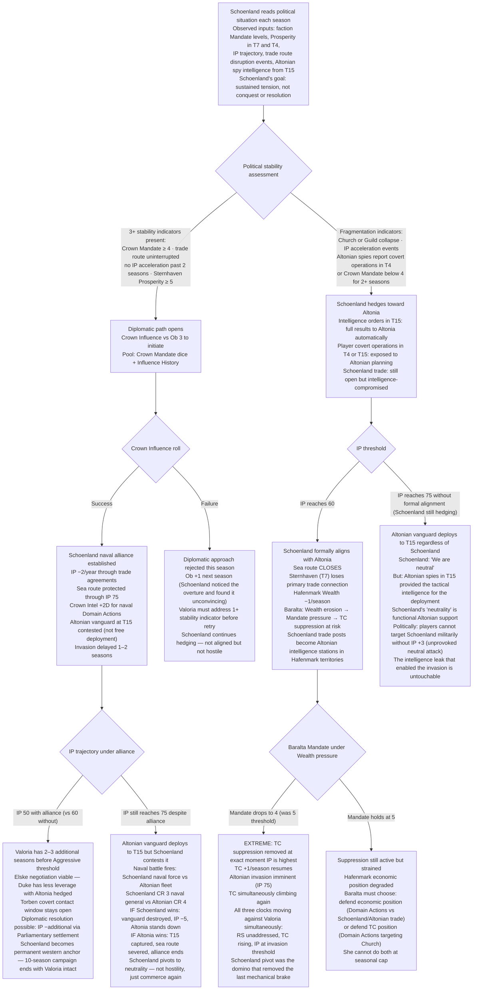
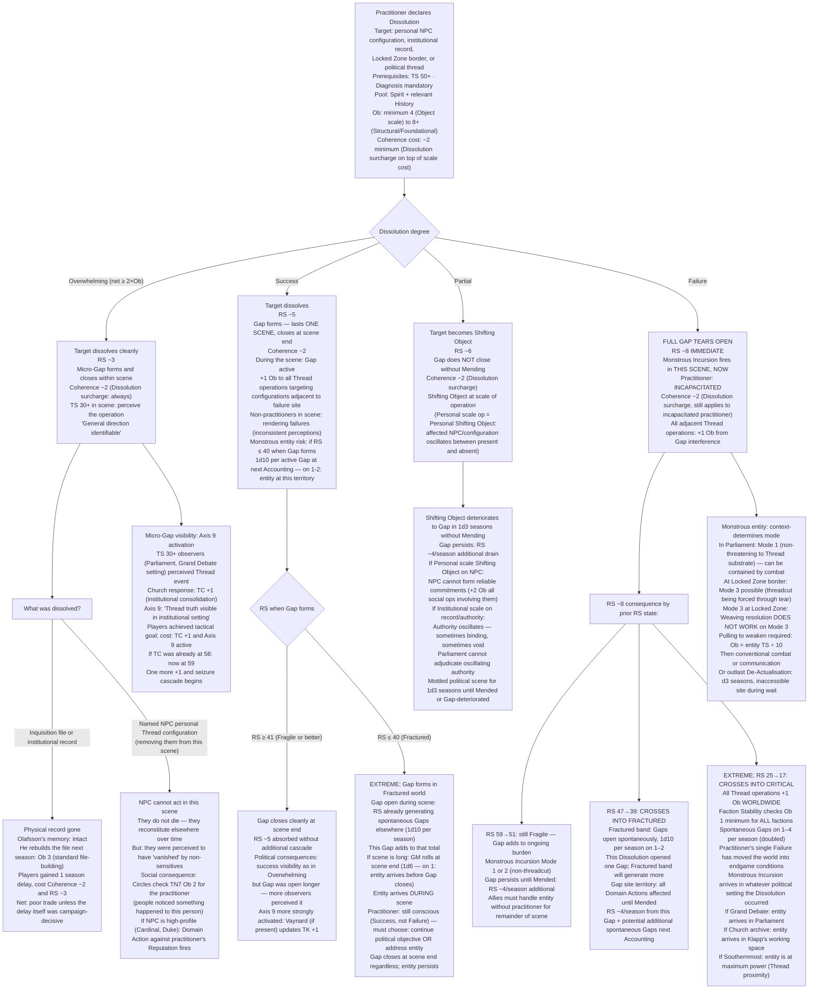

<!-- DERIVED FROM: Checkpoint 14 (compilation/valoria_ruleset_checkpoint_14.md, 2026-03-26) -->
<!-- SESSION: 2026-03-30 / 2026-03-31 — see session_log_archive.md -->
<!-- STATUS: Pre-release reference tool. Not valid against any post-CP14 ruleset. -->

# Valoria — Emergent Campaign Arcs 24–27
*Full mechanical branching · Extreme outcomes permitted*
*Each arc bifurcates at a pivotal roll showing maximum campaign divergence*

---

## Arc 24: The Faction That Breaks

**Pivot roll:** Seasonal Stability check at Ob 5 (campaign-level crisis) — or accumulated Stability failures reaching 0
**Primary mechanics:** Stability 0 = collapse event · Anti-spiral floor (Stability 2 = Ob 4 regardless of pressure) · Faction collapse consequences differ by faction · Seasonal cap ±2 · Mandate floor at 0 → Faction Fracture · Rendering Stability spontaneous Gap generation during instability
**Primary NPCs:** Confessor Himlensendt (Church collapse) · Guildmaster Council (Guild collapse)

---

### Narrative

The anti-spiral floor at Stability 2 is a grace period, not a guarantee. It means the game is telling you a faction is in trouble. Ob 4 on a Stability 3 pool is a coin flip. Two consecutive failures and the faction is at 0. A third brings the collapse event.

Most players never watch a faction hit 0 because the floor activates in time to run a salvage Domain Action. But the floor requires the players to notice, which requires them to be watching, which requires them not to have been somewhere else for two seasons while institutional tendencies ran the accounting. Two factions have structurally different collapse profiles. The Church hitting 0 is a different world than the Guilds hitting 0. Both are possible. Neither is scripted.

The Church at Stability 0 does not simply lose power. Its internal architecture — Himlensendt's genuine faith, Olafsson's institutional machinery, Jarnstal's Templar independence, Klapp's accumulating Combat Endurance track — fractures along pre-existing fault lines. Which faction emerges from the rubble of the Church's institutional collapse depends entirely on which NPCs are still intact when it happens. If Jarnstal's Stability has been degrading independently, the Templars may secede before the collapse rather than after it. If Klapp is at Trajectory C (Conversion), the Church's head of scholarship exits through a different door than its military arm. If Himlensendt encounters the originary Locks during the crisis season, what he experiences is not faith being tested. It is faith discovering it was always wrong.

The Guilds at Stability 0 is an economic vacuum. They are the kingdom's commercial infrastructure. Their collapse does not remove a political faction; it removes the mechanism by which Prosperity translates into Wealth. Territories that relied on Guild trade for Prosperity recovery no longer recover. The Breadbasket property in Feldmark (Territory 11, +1 Prosperity/season if uncontested) still fires, but the Guilds are not there to distribute it. The famine is not immediate. It is slow and structural.

---

### Branch A — Church Stability Reaches 0

Three fault lines converging — Klapp Combat Endurance crisis, Jarnstal unilateral action, and Himlensendt carrying his originary Lock experience — have been generating Ob increases on every Church Stability check. The campaign-level crisis Ob was already 5 this season. Church Stability 3 (from prior failures) rolls 3d10 vs Ob 5. Expected failure rate: ~65%.

The collapse event fires. The Church does not dissolve. It fractures into competing institutional claims:

**Jarnstal's Templars** secede as an independent military order. No longer subject to Church Mandate. They retain Military 5, Stability 5. They have no Mandate and no Wealth — but they have Ehrenfeld-adjacent positions and a Belief that their authority is independent of all political structures. They become a fourth independent military actor in a kingdom that was already contested.

**Olafsson's Inquisition** becomes a rump institution. Without Church Mandate above 1, Heresy Investigations require Ob +2 to pursue — the institutional authority that made them viable is gone. But the files exist. The knowledge Olafsson holds about every practitioner in the kingdom still exists. He becomes a freelance intelligence asset rather than an institutional one. Whoever recruits him gets a very specific kind of capability.

**Himlensendt** retains the theological apparatus but not the power to enforce it. Theocracy Counter does not drop to 0 — the accumulated cultural and political weight of decades of Church influence persists. But Theocracy Counter stops generating automatically. Without Mandate 5+, the +1/season advance halts. Theocracy Counter freezes at whatever it reached. This is the first season in the campaign where Theocracy Counter is not a rising threat. It is also the season where the question of what fills the Church's institutional role becomes the campaign's central political question.

### Branch B — Guilds Stability Reaches 0

The Guilds have been squeezed from both sides — Church taxation enforcement reducing Guild Favour in key territories, Crown trade policy disrupted by Altonian Institutional Pressure pressure, player-driven Domain Actions that benefited other factions at the Guilds' expense. Stability 3 pool vs Ob 4 (two active threats) fails two consecutive seasons. Stability 1. The anti-spiral floor held it here. One more failure.

Guild Stability 0: the Guildmaster Council fractures. No unified bloc. Individual guilds splinter into their territories and operate purely locally. The Economic Leverage unique action becomes unavailable — requires a unified Guild vote, which requires a Council, which no longer exists. The Kingdom's most powerful economic weapon simply vanishes from the board.

Territorial Prosperity recovery slows across every Guild-connected territory. Feldmark (T11) loses its distributed trade network — Breadbasket property still fires (+1 Prosperity if uncontested), but Prosperity above 5 can no longer be converted to Wealth without Guild infrastructure. Grauwald (T8) loses its Timber and Mining bonus. Schwarzmarkt (T10), Niflhel-controlled, becomes the only functional commercial network in its region.

Individual guild officers are still recruitable. They treat as officers, not faction leaders. But the cost of rebuilding Guild Stability from 0 requires Govern Domain Actions across multiple territories simultaneously — and the seasonal cap means full reconstruction takes a minimum of 4 seasons even with maximum investment. The Guilds are not dead. They are a four-season reconstruction project that the players may not have four seasons to spend.

---

### Mechanical Causal Chain

```mermaid
flowchart TD
    A["Multiple concurrent threats across 2–3 seasons\nFaction Stability checks escalating: Ob 3→4→5\nAnti-spiral floor activates at Stability 2\nOb 4 regardless of actual pressure\nPlayers have 1–2 season intervention window"] --> B{Floor holds or breaks}
    B -->|"Players run salvage Domain Action\nStability +1 (Domain Echo, step 1 of Accounting)\nFaction recovers to Stability 3"| C["Crisis averted this season\nUnderlying threats still present\nOb escalation pressure resumes next season unless threats removed\nFaction is fragile — any new threat pushes back to floor"]
    B -->|"No intervention OR intervention fails\nStability check fails two consecutive seasons\nStability 0"| D["COLLAPSE EVENT\nWhich faction?"]
    
    D -->|"CHURCH collapses"| E["Three-way fracture:\nJarnstal's Templars: secede as independent military order\nOlafsson's Inquisition: rump institution, loses Ob bonus on investigations\nHimlensendt: retains theology, loses enforcement capacity\nTC stops auto-generating (Mandate below 5)\nTC freezes at current level — does not fall, does not rise"]
    E --> F{TC frozen — political vacuum}
    F -->|"TC was at 55–59 when Church collapsed"| G["EXTREME: TC frozen one step from seizure threshold\nChurch cannot trigger seizure (needs Mandate 5+)\nbut TC is high enough that any TC-raising event crosses 60\nVaynard TK advance (+1 TC), Parliamentary tie (+1 TC), or RS event (+1 TC from Monstrous Incursion)\nany of these tips it — seizure fires from a Church that has collapsed\nOlafsson activates the procedure from his rump institution\nMandate 1 vs territory Mandate ÷ 2: Ob 1–2\nHe wins most of these\nChurch's corpse is still seizing territory"]
    F -->|"TC was at 35 or below"| H["Church collapse creates political opportunity\nTC not a threat for 3–4 seasons minimum\nPlayers have uncontested political space\nTemplars fill military vacuum — become a new negotiating actor\nKlapp (if Trajectory C) openly seeks out practitioners\nRevolution: surge in Influence as Church authority collapses\nAxis 9 resolves passively — Church no longer suppressing"]
    
    D -->|"GUILDS collapse"| I["Guildmaster Council fractures\nEconomic Leverage: UNAVAILABLE (no unified Council)\nAll Guild Favour territory values: frozen (no seasonal advance)\nProsperity conversion to Wealth: blocked above Prosperity 5"]
    I --> J["Territorial consequences:\nFeldmark (T11): Breadbasket still fires but surplus trapped\nGrauwald (T8): Timber/Mining bonus lost\nSchwarzmarkt (T10): only functional commercial network\nNiflhel now controls regional commerce by default"]
    J --> K{Who fills the Guild vacuum}
    K -->|"Church moves into economic territory\n(institutional tendency: accumulate civil authority)"| L["Church Wealth actions in Guild-connected territories: −1 Ob\n(no Guild resistance)\nChurch Wealth 5 → 6 over 2 seasons\nTC: +0 direct but Church economic dominance feeds Mandate\nGuild officers not yet recruited: Church approaches them\nEach recruited officer: Church Intel +1D in that territory"]
    K -->|"Players recruit individual guild officers"| M["Officer negotiation: personal social scenes\nOfficer treated as NPC with Cognition, Presence, Resonant Style\nSuccess: that guild acts for players' faction in its territory only\nRebuild Council: requires 4+ officers recruited + Govern Ob 3 in two territories\nMinimum 3 seasons at seasonal cap\nIF COMPLETED: Guilds reconstitute at Stability 3, Mandate 1\nEconomic Leverage restored but at reduced Wealth (5→4 from collapse damage)"]
    K -->|"No intervention"| N["EXTREME: 4-season vacuum\nProsperity stagnates across Guild territories\nFamine conditions in Feldmark and Grauwald by season 3\nRevolution Influence +2 (Guild collapse proves institutional failure)\nbut Revolution has no economic infrastructure to replace Guilds\nAltonian trade through Schoenland becomes the peninsula's primary commerce\nSchoenland aligns toward Altonia: IP −0 (already captured economically)\nValoria economically dependent on Altonia without fighting a war"]
```

**Why this arc is emergent:** The collapse requires multiple systems failing simultaneously — threats stacking Ob beyond what the floor can hold, players' attention elsewhere, the seasonal cap preventing rapid recovery. Church and Guild collapses produce fundamentally different political geometries: one removes an ideological actor, the other removes the economic substrate.

**Arc shape:** 3–5 seasons of pressure accumulation. Floor activation (1 season warning). Collapse (1 Accounting event). Branch A (Church): immediate Templar secession + Theocracy Counter freeze + vacuum arc 3–4 seasons. Branch B (Guilds): immediate Economic Leverage loss + 4-season reconstruction race or Altonian economic capture.

---

## Arc 25: The Schoenland Pivot

**Pivot roll:** Faction Stability checks + Diplomatic Domain Action (Crown Influence vs Ob 3) — Schoenland reads the political situation and decides
**Primary mechanics:** Schoenland spoiler actor (§8.10) · "Pro-war, anti-conquest" orientation · Diplomatic path (stable Valoria = naval ally, Institutional Pressure −2/year) · Fragmented Valoria = Altonian alignment · Institutional Pressure threshold acceleration · Sea route through Schoenland (T16) to Valorsplatz (T1) · Territorial adjacency: Schoenland (T16) connects to Valorsplatz (T1) via sea route

---

### Narrative

Schoenland is not playing the same game as everyone else. It profits from sustained tension, not from resolution. Every faction conflict on the peninsula is arms revenue. The ideal outcome for Schoenland is a war that never quite ends — enough buying and selling to sustain commerce, never enough conquest to unify the peninsula under a single trade policy that would cut Schoenland out.

The players may not think about Schoenland for most of the campaign. It is a neutral trade port, Territory 15 on the map, adjacent to Border Pass and connected by sea to Sternhaven. It has Altonian spies: any Intelligence order placed in Schoenland reveals results to Altonia automatically. This is a passive mechanic that runs regardless of whether anyone is watching.

The pivot comes when the players reach a moment of genuine political consolidation — multiple factions aligned, Theocracy Counter under control, Institutional Pressure stabilised, the campaign's most acute crises addressed. From Schoenland's perspective, this looks like a stable trading partner. The diplomatic path opens: if Valoria presents unified stability early, Schoenland becomes a naval ally providing support against Altonian aggression, and Institutional Pressure decreases by 2/year through the trade agreements. This is significant — Institutional Pressure −2/year is the difference between having 3 seasons to manage the Altonian problem and having 7.

But Schoenland's read of political stability is not the same as the players' read. What Schoenland observes is the surface: faction Mandate levels, Prosperity in key territories, whether the Schoenland trade route is being maintained or disrupted. If the players have been winning their political battles through visible institutional disruption — Church Stability collapsed, Guild fracture, coup counter running hot — Schoenland's intelligence sees fragmentation, not stability. The pivot goes the other way.

---

### Branch A — Valoria Reads as Stable (Diplomatic Path Opens)

Crown Influence vs Ob 3 to initiate the diplomatic approach. The players must have maintained at least three of the following: Crown Mandate ≥ 4, Schoenland trade route uninterrupted (no refusal seasons), no Institutional Pressure acceleration events in the past two seasons, Hafenmark Prosperity ≥ 5 in Sternhaven (T7) — Schoenland's primary trade entry point.

Success: Schoenland aligns as naval ally. Institutional Pressure −2/year through trade agreements. The sea route is protected — not severed when Altonian pressure rises. At Institutional Pressure 75, Altonian vanguard deploys to Schoenland (Territory 15 per territory rules), but Schoenland's naval position means the vanguard is contested, not free. This delays the invasion by 1–2 seasons and reduces the invasion force's initial deployment strength.

Schoenland naval support is not military deployment. It is logistical: supply chain protection for Hafenmark's sea-facing territories, Intelligence advantage on Altonian fleet movements (Crown Intelligence +2D for naval-adjacent Domain Actions), and the political signal to Altonia that Valoria has a western ally. The Institutional Pressure −2/year is the primary mechanical consequence. Over five seasons: Institutional Pressure −10 from baseline. That is the difference between invasion being a current crisis and invasion being a future concern.

### Branch B — Valoria Reads as Fragmented (Schoenland Pivots to Altonia)

Schoenland's observation: Church collapsed (public, visible institutional fracture), Guild fracture (trade disruption Schoenland noticed immediately since it affects their revenue), Institutional Pressure acceleration from refusal seasons, Altonian spies reporting player covert operations in Border Pass territory.

Schoenland hedges toward Altonia. The trade route does not close immediately — Schoenland still profits from both sides. But Intelligence orders placed in Territory 15 now feed Altonian strategic planning with full fidelity. Any Domain Action the players run through Schoenland-adjacent territories is visible to Altonia. Covert extraction of Torben (if being planned) is exposed. Diplomatic feelers to Altonian moderates are logged.

At Institutional Pressure 60+, Schoenland formally aligns with Altonia. The sea route closes. Sternhaven (T7, Hafenmark's northern port) loses its primary trade connection. Hafenmark Wealth −1/season while sea route is closed. Baralta's Mandate pressure increases as her economic base erodes. If she was already running Theocracy Counter suppression at exactly Mandate 5 threshold, Wealth erosion feeds political instability that feeds Mandate checks that feed the threshold. The alignment is a slow strangler, not an immediate crisis.

---

### Mechanical Causal Chain

**Why this arc is emergent:** Schoenland's pivot follows from faction Mandate levels, Prosperity, and Institutional Pressure trajectory — all of which are outputs of every other system in the game. No player decided Schoenland's orientation. The intelligence leak in Branch B fires automatically regardless of player awareness of it.

**Arc shape:** Running background for 5–6 seasons. Tipping point around Institutional Pressure 40–50. Branch A: diplomatic approach scene, Institutional Pressure −2/year for remainder. Branch B: gradual alignment (2 seasons), sea route closure (Institutional Pressure 60), economic strangler activating.

---

## Arc 26: The Duke Awakens

**Pivot roll:** Spirit TN 7 Ob 1 — Vaynard's Discovery Event when exposed to Thread activity at Thread Sensitivity 14
**Primary mechanics:** Vaynard Thread Sensitivity 14 (Dormant) · Discovery Event trigger · Spirit check TN 7 Ob 1 · Success: Thread Sensitivity → 30 (Stirring), world reorganises · Failure: Certainty −1, new Belief from ignorance · TK track consequences · Theocracy Counter +1 per TK advance already in play · Private Collection use adds to hidden Thread Sensitivity · Vaynard Resonant Style: Consequence

---

### Narrative

Vaynard has been acquiring Thread knowledge the way he acquires everything: through possession, controlled access, and strategic patience. His Private Collection contains originary Locks. He has been deploying them for operational benefit. Each deployment has been raising his Thread Sensitivity, undetected, from the baseline 14 he started with. He does not know any of this is happening. He attributes the occasional impressions he experiences to eyestrain and cognitive load.

The Discovery Event fires when Thread activity of sufficient intensity occurs in his proximity — a practitioner Player Character operating at Relational scale nearby, an originary Lock deployed in a scene where Thread consequences are visible, or a visit to the Einhir ruins at Eisengrund (Territory 9) where the Revolution's Community Weaving gets −1 Ob from the configurational resonance. The Game Master calls it. Vaynard makes a Spirit check, TN 7, Ob 1.

Ob 1 is not difficult. But it is a real check, and the failure consequences are specifically designed to be worse than never having triggered the event at all. A Vaynard who fails his Discovery Event does not stay ignorant. He becomes a man who had a profound experience and then constructed an entirely wrong explanation for it. His Consequentialist framework — evaluating everything by what it produces — means he will act on the wrong conclusion rather than sitting with uncertainty. Whatever he concludes about the Thread is what he will pursue. With his resources, his intelligence network, and his succession leverage, he will pursue it effectively.

This is the arc that can produce the most valuable political ally in the campaign or the most capable political actor working from incorrect premises.

---

### Branch A — Spirit Check Succeeds: Thread Sensitivity Advances to 30

The world reorganises for Vaynard. Not metaphorically. The rules say exactly this: on success at the First Leap Discovery Event, the world reorganises itself for him. His Thread Sensitivity is revealed to him. He is given the designation he has never had a name for. Certainty −1 (permanent: the old framework can never feel complete again) — but Vaynard's framework was Consequentialist, not faith-based. Certainty −1 costs him less than it would cost Himlensendt. What it gives him is enormous.

He can perceive threads. Not operate on them — Thread Sensitivity 30 is Stirring, not Resonant. But he can Diagnose. He can see what his Private Collection is. He can see what Eisengrund contains. He can see what the practitioners around him have been doing. Every conversation he has had with a practitioner Player Character gets re-read through a new sensory register. He knows what he was missing.

His TK, already at whatever level the players cultivated it to, now has a sensory foundation. He is no longer working from structural theory. He is working from direct perception. This changes the nature of his leverage. His succession demand — Southernmost access terms — is no longer a negotiating position built on second-hand knowledge. He is making it as a practitioner. The Church's response to a Thread Sensitivity 30 Vaynard is categorically different from the Church's response to a politically curious duke.

### Branch B — Spirit Check Fails: Certainty −1, Belief from Ignorance

Vaynard had the experience. He cannot render it correctly at Thread Sensitivity 14 — his sensitivity is insufficient to resolve what happened into accurate knowledge. He knows something profound occurred. He builds a framework around it.

The framework is wrong. But it is his, and it is built from his Consequentialist epistemology, his incomplete TK, and his experience of the Collection's effects. He will likely conclude either: (a) that Thread sensitivity is an enhanced form of intelligence that can be cultivated through proximity to Thread-significant objects — a controllable resource he can develop deliberately, or (b) that the Southernmost is not dangerous but rather a site of tremendous power waiting to be accessed by someone with the right preparation.

Either conclusion produces action. Option (a): Vaynard intensifies Collection deployment, raising his hidden Thread Sensitivity further while accumulating Church attention (each deployment: Church Intel +1D vs Varfell). The wrong framework produces the right behaviour accidentally — he is, in fact, developing Thread sensitivity — but the Church's response to what it detects is indistinguishable from its response to deliberate Thread cultivation. Option (b): Vaynard attempts to mount a Southernmost expedition without waiting for proper practitioner guidance, sending Maret Uln ahead with political backing but without the preparatory relationship that would make Maret willing to share the full picture. Maret's Loyalty to Varfell is at 4. Being sent on an expedition Vaynard designed from incorrect premises may be what drops it to 3.

---

### Mechanical Causal Chain

```mermaid
flowchart TD
    A["Vaynard TS 14 (Dormant, unrecognised)\nDiscovery Event trigger: Thread activity of sufficient intensity in proximity\nGM options: practitioner PC at Relational scale nearby\nOR originary Lock deployed in visible Thread scene\nOR Eisengrund site visit (T9) during Community Weaving\nSpirit check: TN 7, Ob 1"] --> B{Spirit check result}
    
    B -->|"SUCCESS"| C["TS advances to 30 (Stirring)\nWorld reorganises for Vaynard\nCertainty −1 (permanent)\nTS revealed to player — Vaynard now knows what he is\nPractitioner designation granted\nCan Diagnose but not Leap (TS 30 = perception, not contact)"]
    C --> D["Vaynard's Private Collection: fully visible to him\nHe can Diagnose originary Locks\nHe understands what Dissolution residue is\nEvery prior acquisition assessed through Thread sight\nTK advances +2 immediately regardless of prior level\n(sensory foundation for structural theory already held)"]
    D --> E["New Belief generated from Stirring experience\n[EDITORIAL: what does Vaynard believe after first Thread perception?]\nLikely: 'I have been acquiring the wrong things.\nThe Southernmost is not a resource to control — it is a wound to understand.'\nThis is a 180° rotation from his prior Consequentialist framework"]
    E --> F{How players use Stirring Vaynard}
    F -->|"Cultivate as practitioner ally\n(sustained relationship: TK cap ×2/season)"| G["TK 5 reachable within 2 seasons\nVaynard offers Collection (originary locks) for Thread education\nParliamentary leverage shifts: he now advocates for Southernmost access as a practitioner\nNot as a political bargain — as a matter he personally perceives as urgent\nChurch response: Heresy Investigation but now facing TS 30 Vaynard who can Diagnose\nhis own collection and testify to its nature from direct perception\nGrand Debate: Vaynard as witness with Thread-perceptual standing"]
    F -->|"Vaynard discovers practitioners have been operating in his duchy"| H["EXTREME: He has been the site of Thread work he did not consent to\nDiagnosis reveals operational scars in Eisengrund\nHis Consequentialist framework evaluates this: he was used as an asset\nWithout his knowledge or agreement\nRelationship with practitioner PCs: immediate social scene\nConsequence Style (his Resonant Style): what does this produce for us going forward?\nBroken trust requires Evidence-style reparation — concrete accountability, not apology\nIf players cannot provide this: Vaynard withdraws Collection access\nSuccession leverage turns against them rather than for them"]
    
    B -->|"FAILURE"| I["Certainty −1 (Vaynard's framework is disrupted\nbut cannot render the experience correctly)\nNew Belief generated from ignorance\nVaynard acts on the wrong conclusion with his full resources"]
    I --> J{Wrong framework direction}
    J -->|"Option A: Thread sensitivity is cultivable resource\n(deliberate proximity to Thread-significant objects)"| K["Vaynard intensifies Collection deployment: 2×/season\nEach use: TS +1 (hidden, still unrecognised by him)\nChurch Intel +1D vs Varfell per deployment (detectable signature)\nAt 4+ deployments: Church opens Heresy Investigation\nbased on detected Thread signatures alone — before he knows what he is\nVaynard defending himself against charges he doesn't understand\nPlayers must choose: reveal what's happening to him\n(destroys strategic ambiguity, may accelerate Heresy charge)\nor let him defend himself blind (likely conviction)"]
    J -->|"Option B: Southernmost is accessible power site\n(expedition without proper preparation)"| L["Vaynard sends Maret Uln on expedition\nMaret's Loyalty 4 → potentially 3 (being instrumentalised from wrong premises)\nExpedition without full practitioner guidance:\nForgetting Check at standard Ob — no TS modifier from Vaynard (he can't come)\nMaret succeeds or fails independently\nIF Maret succeeds (Diagnosis complete):\nhe holds the correct knowledge and Vaynard holds the wrong framework\nMaret's Loyalty drops to 3: he has confirmed Vaynard is not pursuing this correctly\nMaret begins independent contact with Revolution or player practitioners\nIF Maret fails (Forgetting on Core site, Ob 4):\nexpedition returns with nothing actionable\nVaynard: wrong framework confirmed to him (Southernmost 'resists' because preparation was insufficient)\nTT +1 from disturbed site\nSecond attempt planned: same wrong approach"]
    L --> M["EXTREME: Maret Uln breaks with Varfell entirely\nLoyalty 2 (instrumental use + incorrect direction = betrayal)\nMaret joins Revolution formally (ideological affiliation always existed)\nRevolution gains TS confirmed practitioner as affiliate\nCommunity Weaving prerequisite met (TS 30+ affiliated)\nVaynard loses his only path to Southernmost knowledge\nAND Revolution gains the practitioner\nAND Vaynard, operating from wrong framework, now targets practitioners\n(they are 'withholding' the power he believes he sensed)"]
```

**Why this arc is emergent:** The Discovery Event trigger is determined by proximity to Thread activity — a consequence of what practitioners have been doing in Vaynard's territory all campaign. The Spirit check Ob 1 is straightforward but the failure consequence is specifically designed to be worse than ignorance. Whether Vaynard becomes the campaign's most powerful ally or its most capable adversary rests on one die.

**Arc shape:** Discovery Event fires in a scene (Session 4–8 typically). 1 roll. Branch A: Vaynard as practitioner ally, 2-season cultivation arc, endgame-level political consequences. Branch B: 2–3 seasons of wrong-framework action, Heresy Investigation or Maret defection, Revolution gains practitioner asset.

---

## Arc 27: The Dissolution

**Pivot roll:** Spirit pool + History vs Ob (Dissolution, minimum Ob 4) — degree determines everything
**Primary mechanics:** Dissolution operation (Threadweaving v2.5 §2.4) · Degree table (Overwhelming → Rendering Stability −3, micro-Gap; Success → Rendering Stability −5, Gap 1 scene; Partial → Shifting Object, Rendering Stability −6, Gap persists; Failure → full Gap, Rendering Stability −8, Monstrous Incursion immediately, practitioner Incapacitated) · Coherence cost · Mode of Monstrous entity · Political scene consequences from Thread event visibility · Axis 9 activation

---

### Narrative

Dissolution is the operation the game warns you about. The Weaving section tells you threads cohere. The Pulling section tells you threads loosen. The Dissolution section tells you threads tear. It is not equivalent to the others in risk profile. Overwhelming is still a Gap. Success is still a Gap, lasting a full scene before it closes. Partial is a Shifting Object that will deteriorate to a Gap without Mending. And Failure is the Rupture in miniature: full Gap, Monstrous Incursion immediately, practitioner Incapacitated, Rendering Stability −8.

The practitioner who chooses Dissolution is making a specific calculation: that the thing they need removed is worth the substrate cost and the exposure risk. This might be a targeted Non-Player Character whose Thread configuration is sustaining something that cannot be addressed politically. It might be a Locked Zone border that is actively draining Rendering Stability. It might be desperation — a battle turning, a scene running out of options, a player who has run out of patience with the diplomatic track.

The Monstrous Incursion that fires on Failure is not an abstract consequence. It arrives in the same room, the same scene, the same political context. If Dissolution was attempted at the Grand Debate because the practitioner had no other way to stop Olafsson's Evidence Overwhelming — the Monstrous Incursion arrives in the Parliamentary chamber. If it was attempted at the Church archive to destroy an Inquisition file — the entity emerges in the archive, where Klapp is working three rooms over.

---

### Branch A — Overwhelming (net ≥ 2 × Ob minimum 8)

The target dissolves cleanly. Rendering Stability −3. A micro-Gap forms and closes within the scene — visible to Thread Sensitivity 30+ observers, invisible to everyone else. The practitioner took Coherence −1 (Dissolution: Lock or Dissolution minimum additional −1, total −2 at Relational+ scale). The thing they wanted to destroy is gone.

What happens next depends on what was dissolved. If a political document or an institutional record: the information is gone but the people who knew it still know it. Olafsson does not forget the Heresy Investigation file because the physical record dissolved. The Dissolution removed evidence, not memory. If an Non-Player Character's personal Thread configuration at Personal scale (pulling their presence from a negotiation, preventing them from acting): they are removed from the scene and cannot return to it, but they are not dead. They reconstitute elsewhere over time.

The micro-Gap's brief appearance is the political problem. In a scene with Thread Sensitivity 30+ observers — and Parliament or a Grand Debate will have some — the Dissolution was perceived. Not identified. Perceived. The political consequence of a Thread operation at that visibility threshold is an Axis 9 activation: the thing the Church has been suppressing was just visible to multiple witnesses in an institutional setting. Theocracy Counter +1 from Church consolidation response. The players achieved their tactical goal and handed the Church a political gift.

### Branch B — Failure (net ≤ 0)

Full Gap tears open. Rendering Stability −8 immediate. Monstrous Incursion fires in the scene. Practitioner is Incapacitated — cannot act, cannot Leap, cannot defend. Whatever the scene contained before the Dissolution attempt now contains an entity that should not exist in the rendered world.

Rendering Stability −8 in one moment. If Rendering Stability was already Fragile (59–40), it is now at 31–52 — potentially crossing into Fractured (39–20) if it lands below 40. If already Fractured, it may now be in Critical (19–1). Rendering Stability threshold effects don't activate until next Accounting — but the Gap itself is active now, this scene, generating its own ongoing Rendering Stability drain (−4/season if it persists).

The Monstrous Incursion entity type depends on what was being dissolved. A Political scale Dissolution — targeting an institutional thread, the Church's authority claim in a territory — produces a Structural Shifting Object first (Partial outcome), not an entity. But a Personal scale Dissolution targeting a specific Non-Player Character or object produces a Personal scale rupture and a Personal scale entity. What mode it is depends on whether the dissolved configuration was actively sustaining something (Mode 3 is possible if the target was a threadcut being) or simply a configuration that existed (Mode 1 or 2).

The Incapacitated practitioner's allies must handle the entity while the practitioner recovers, and every other Thread operation in the scene is at +1 Ob from the open Gap's interference. If this happened in a political setting, non-practitioners are experiencing rendering failures. The Parliamentary chamber — or wherever this fired — is now a Gap site. For as long as the Gap persists, Domain Actions in that territory run at the Rendering Stability threshold penalties already in play plus the Gap-specific Ob increase.

---

### Mechanical Causal Chain

**Why this arc is emergent:** Dissolution's degree table is the widest-ranging in the game — Overwhelming and Failure both produce Gaps, but at opposite Rendering Stability costs (−3 vs −8) and with opposed political consequences (tactical success vs immediate incapacitation). The Partial outcome (Shifting Object) is its own sustained arc. No player intends to roll Failure. The branching is the game being honest about what Dissolution is.

**Arc shape:** Single operation, single roll. Immediately divergent. Overwhelming: 1-scene success, Theocracy Counter +1, axis activation, 1-season political fallout. Success: 1-scene Gap, possible entity risk at Rendering Stability ≤ 40. Partial: 1d3 season oscillation arc. Failure: immediate entity encounter + Rendering Stability −8 cascade, full endgame acceleration if Rendering Stability was already Fractured.

---

## Cross-Arc Interaction Table

| Collision | Arcs | Mechanic | Extreme potential |
|---|---|---|---|
| Church Stability 0 (Arc 24 Branch A) fires in same season as Dissolution Failure (Arc 27) | 24 + 27 | Church collapses AND a Gap opens in the same Accounting — Templar secession happens while a Monstrous Incursion is active in contested territory | Jarnstal's newly independent Templars deploy to suppress the entity; this is their first independent action as a free military order — establishing their post-Church power projection in the worst possible context |
| Schoenland pivots to Altonia (Arc 25 Branch B) precisely when Vaynard succeeds his Discovery Event (Arc 26 Branch A) | 25 + 26 | Vaynard at Thread Sensitivity 30 can Diagnose the Schoenland trade route's Thread configuration; he perceives the Altonian intelligence infrastructure embedded in T15 | Thread Sensitivity 30 Vaynard provides actionable intelligence on Altonian spy placement that no conventional Domain Action could surface; simultaneously the sea route closes — his first act as a practitioner is an Intelligence advantage his collection could never have provided |
| Dissolution Failure crosses Rendering Stability into Critical (Arc 27) in same season Guild Stability hits 0 (Arc 24 Branch B) | 27 + 24 | Rendering Stability Critical = Stability checks Ob 1 minimum for all factions; Guild Stability check was already Ob 4 from floor; now Ob 4 (floor) + Ob 1 (Critical band minimum) doesn't stack — but other factions failing their Ob 1 checks means simultaneous multi-faction Stability failures | Three factions fail Stability checks in one Accounting from the Critical band minimum; Crown, Hafenmark, and Revolution all at Stability 2 simultaneously; three anti-spiral floors activated; players have three intervention windows and one season |
| Vaynard Discovery Event fails (Arc 26 Branch B, Option B: Southernmost expedition) and Ceiral Ritual fails (Arc 22 Branch B) in the same campaign phase | 26 + 22 | Vaynard sent Maret on expedition from wrong premises; Maret's independent attempt at the Ritual fails; Maret incapacitated; Vaynard loses his Southernmost asset from both directions simultaneously | Maret joins Revolution (Arc 26 extreme Branch B) while incapacitated from the Ritual failure; Revolution has an incapacitated practitioner as their affiliated member; Community Weaving prerequisite technically met but practitioner cannot operate until Coherence recovers |

---

*All arcs compliant with arc generator protocol. Canon constraint noted: where Niflhel would plausibly benefit from Guild collapse vacuum (Arc 24 Branch B), this is attributed to Schwarzmarkt's territory property (§7.2), not Thread-related operations.*
