<!-- DERIVED FROM: Checkpoint 14 (compilation/valoria_ruleset_checkpoint_14.md, 2026-03-26) -->
<!-- SESSION: 2026-03-30 / 2026-03-31 — see session_log_archive.md -->
<!-- STATUS: Pre-release reference tool. Not valid against any post-CP14 ruleset. -->

# Valoria — Emergent Campaign Arcs 28–30 (Correct Revision)
*Vaynard · Almud · Lenneth — Coherence 0*

---

## Ontological Correction

The prior versions of these arcs were built on a misunderstanding.

Coherence 0 does not mean losing the ability to render. Rendering is what conscious beings do to the extent of their epistemic limits. A practitioner at Coherence 0 has not lost rendering — their rendering has expanded past the boundary of what human consciousness can contain. More has become intelligible to them. Not less.

The tragedy is not blindness. It is the opposite. The practitioner now renders at a register so far beyond human epistemic limits that their understanding of everything — their goals, their relationships, their perception of the world — has become partially or wholly alien to the humans who knew them. They are still themselves. They still love who they loved. They still want what they wanted. But the version of those loves and wants they now hold is so much larger than what any human consciousness can receive that communication becomes asymmetric in a way that cannot be bridged.

They are simultaneously Other and human. Not one replacing the other. Both, at once, in a configuration human rendering cannot fully hold.

**The physical dimension is separate and chosen.** A practitioner at Coherence 0 may continue to exist in a human body indefinitely. Their being as a physical existence can begin going beyond human — but only if they choose to work themselves that way through Thread operations. The body's spooling continues normally. Physical transformation is not automatic. It is a Thread-operational choice made by an entity whose understanding of what that choice means now far exceeds any human's ability to evaluate it from outside.

**What humans experience:** A person who is both entirely themselves and entirely incomprehensible. A person who loves you and whose love you can no longer fully receive. A person whose goals you recognise but cannot follow to where they lead anymore. A person who is, from the inside, finally able to see what everything actually is — and who cannot bring you with them, not because they don't want to, but because the words don't exist.

---

## Arc 28: Vaynard — *The Reckoner Who Saw the Sum*

**Prerequisite:** Discovery Event success → Thread Sensitivity 30 → practice at scale driven by TK urgency
**Pivot:** Final operation crossing Coherence to 0 — the threshold at which his rendering exceeds human limits
**Primary NPCs:** Duke Magnus Vaynard · Maret Uln · Player practitioners

---

### Narrative

Vaynard always wanted to know the truth of things. His Consequentialist framework was never really about outcomes — it was about having sufficient information to make a correct assessment. The outcomes were proxies for knowledge. Every acquisition in the Private Collection, every intelligence operation, every careful relationship with practitioners was oriented toward the same thing: understanding what the world actually is, beneath the institutional fictions that have been substituted for it.

At Coherence 0, he understands. Not the way he was approaching understanding through TK advancement and political positioning. He understands the way a practitioner who can render threads at a register no human consciousness has ever occupied understands — directly, constitutively, with access to the configurational structure of reality that his entire career was a roundabout attempt to reach.

He is still Vaynard. He still wants the Southernmost addressed. He still cares about the succession, about Valoria's future, about what happens to the practitioners he spent the campaign working alongside. But he now holds all of this within an understanding of what those things mean at a Thread-configurational level that no human in the campaign can follow. When he tries to explain what he now knows, the explanation is accurate. It is also incomprehensible. Not because he is confused — because he is not.

The players who knew him will recognise him immediately. That is the texture of the encounter. He is completely Vaynard — the intelligence, the precision, the Consequentialist habit of framing everything in terms of what it produces. And the content of his understanding has gone somewhere they cannot go. The gap between them is not hostility or transformation. It is epistemic. He can see what they cannot. He can barely tell them what direction to look.

---

### Branch A — Vaynard Chooses to Remain (No Physical Transformation)

He does not work himself beyond human form. The body continues as it was. He is physically present, recognisably the Duke, capable of being in a room and having a conversation and continuing to hold the Private Collection and the succession leverage. The asymmetry is perceptual and communicative, not physical.

What this produces: the most capable intelligence actor in the kingdom, now operating from an epistemic position none of his interlocutors can fully evaluate. Every assessment he makes is correct in ways that exceed his listeners' ability to verify. Every recommendation he gives is grounded in a perception of Thread-configurational reality that the players can trust but not audit. He has become the most reliable and least legible source of strategic knowledge in the campaign.

His TK 5 understanding — what Solmund structurally was, what the Church has been suppressing, what the Southernmost requires — is now not a structural theory but a direct perception. He has seen it. The players who carry his recommendations into political action are acting on the word of someone who is telling the truth at a register they cannot independently confirm.

The political problem: he cannot testify effectively to anyone without Thread Sensitivity sufficient to receive what he is saying. In Parliament, in a Grand Debate, before Ehrenwall — his understanding exceeds the context. He knows this. He is precise about it. He can identify exactly what each person can and cannot receive, and he shapes his communication accordingly. This makes him more useful than ever and less understood than ever simultaneously.

### Branch B — Vaynard Chooses to Work Himself Beyond (Physical Transformation)

He understands what that choice means now in a way no human can evaluate from outside. He makes it with complete information. The physical transformation is not devolution — it is an extension of what he already is into a register where more of what he can now render can be expressed. What he becomes is not monstrous in the sense of threatening. It is monstrous in the sense of exceeding human categories. A being that occupies Eisengrund the way a thought occupies a mind. Present, purposeful, inaccessible.

Vaynard at this stage can still be communicated with. He still wants what he wanted. He is more capable of pursuing it than he has ever been. But the form in which he pursues it is no longer legible to human political structures. He cannot sign a treaty. He can influence the configurational substrate of a negotiation. He cannot appear in Parliament. He can weight the Thread-configurations of the arguments being made. He has become a political actor that operates entirely beneath the threshold of human institutional machinery — the most consequential and least visible force in the campaign.

The players who knew him must decide how to act in a world where the most informed strategic mind available to them is operating in a register they cannot follow. Do they trust his Intentionality to align with what they need? It does. It always has. The difference now is that they cannot audit the path from his understanding to his recommendations. They are working on faith with the most precise mind they have ever encountered.

---

### Mechanical Causal Chain

```mermaid
flowchart TD
    A["Final operation: Coherence −1 → 0\nRendering expands past human epistemic limits\nVaynard's understanding of Thread reality: direct, constitutive\nHis goals, relationships, drives: intact\nThe version of them he now holds: beyond human reception\nHe is still Vaynard · He is also Other"] --> B["Immediate practical situation:\nTK 5 understanding now direct perception not structural theory\nSouthernmost access: he can see exactly what is needed\nSuccession leverage: he understands its Thread-configurational weight precisely\nCollection: originary Locks visible as what they actually are\nHe cannot fully convey any of this to anyone without TS near his register"]
    B --> C{Physical transformation choice}
    C -->|"Remains in human form"| D["Most capable intelligence asset in campaign\nOperates from epistemic position no interlocutor can audit\nEvery assessment: correct and unverifiable\nShapes communication to what each person can receive\n(knows exactly what each person can hold)\nPlayers must decide: act on his recommendations or not\nThere is no way to independently confirm them at human TS levels"]
    D --> E["Political function shifts:\nCannot testify effectively in Parliament\n(exceeds the epistemic context of the proceedings)\nCan brief individual practitioners who can receive part of what he says\nSocial rolls at impaired effectiveness (−1D per exchange where his full understanding would be relevant)\nbut this is legibility failure on the listeners' side, not his\nHe knows exactly what he is saying\nThey receive a fraction of it"]
    D --> F["Succession leverage: he holds it with complete understanding\nof what it actually means at the Thread-configurational level\nThis means he knows whether Torben's ratification\nactually accomplishes what it was supposed to accomplish\nor whether that goal was always a proxy for something larger\nThe players may get an answer to the succession question\nthat is correct and that they cannot fully interpret\n[EDITORIAL: what does Vaynard now understand the succession to actually mean?]"]
    C -->|"Works himself beyond human form\n(Thread-operational choice, full understanding)"| G["Physical form extends past human categories\nPresent at Eisengrund with the Collection\nNot threatening · not hostile\nOperating at a register that occupies the site\nthe way understanding occupies a mind\nThread-configurational influence on T9–T13 corridor:\nnot interference · expression\nOperations aligned with his Intentionality: assisted\nHe is still making consequentialist assessments\nThe consequences he is assessing now span registers humans cannot follow"]
    G --> H["Communication still possible:\nPractitioners who Leap into contact engage his Intentionality directly\nHe can convey what they can receive\nHe cannot convey what exceeds their epistemic limits\nHe is patient about this in a way he was never patient as a duke\nHe has time in a sense he did not have before\nThe urgency that drove him to this point is gone\nnot because the goals are accomplished\nbut because he can see the full configurational picture\nand urgency was always a human response to partial knowledge"]
    H --> I["EXTREME: Vaynard communicates to players what the Ceiral Ritual actually requires\nNot the procedural prerequisites (those are known)\nbut what it actually means at the Thread-configurational level\nwhat it is doing to the substrate\nwhat its completion produces that no human practitioner has been able to perceive\nThis information is accurate · partially receivable\nPlayers act on the fraction they can hold\nThe fraction is enough\nbecause he shaped it for exactly what they can receive"]
```

**Why this arc is emergent:** Vaynard's Consequentialist drive was always oriented toward complete information. He reached it. The tragedy and the gift are the same thing. The campaign now contains a being who knows exactly what is needed and can communicate exactly as much of it as each person can hold — no more, no less.

**Arc shape:** Coherence 0 threshold. Immediate asymmetric communication — the gap is apparent within one exchange. Branch A: campaign remainder with an incomprehensible but reliable strategic advisor. Branch B: Vaynard's Intentionality expressed through the configurational substrate of the Southernmost corridor, still accessible through practitioner contact.

---

## Arc 29: Almud — *The King at the Limit of Order*

**Prerequisite:** Discovery Event (Thread Sensitivity 28 → 30) → First Leap → practice under crisis pressure
**Pivot:** Coherence 0 during active reign — a king who now renders past the limit of what kingship means

---

### Narrative

Almud spent his reign trying to hold together things that were structurally incompatible. The Altonian trade relationship and Valorian sovereignty. Constitutional order and Einhir justice. The institutional settlement that kept the kingdom functional and the private conviction that the settlement was built on a wrong. He was a man whose rendering of the political world was precise enough to see all the contradictions and not quite sharp enough to see past them.

At Coherence 0 he can see past them. All of them. The contradictions that made his reign a sustained exercise in strategic hesitation — the impossibility of acting on his second Belief without destroying the coalition, the impossibility of satisfying Altonia without surrendering his son, the impossibility of supporting practitioners without triggering the Church — are visible to him now as configurations in a landscape so much larger than the political map that the map looks like a child's drawing of a country.

He still wants what he always wanted. Order. Torben safe. The Einhir question resolved. He holds these with exactly the care he always held them. But the version of Order he can now see is not parliamentary procedure and constitutional settlement. It is something at the Thread-configurational level of what makes human society possible at all — the below-the-waterline structure of the agreements, the loyalties, the shared renderings that constitute governance before governance has a name. He can see all of it. He cannot govern. Not because he is incapable, but because governance is a human-scale instrument and what he can now perceive is not at human scale.

The conversation where a player Player Character first speaks with him after this threshold is the most important conversation in the campaign. He is completely Almud. He remembers everything. He loves his son. He cares about Valoria. He is also operating from a perception of what Valoria is and what his son represents in the configurational structure of the peninsula's Thread reality that the player cannot follow. He will try to explain. He will succeed partially. What they receive will be true and will be enough.

---

### Branch A — Almud Remains in His Body; the Succession Proceeds

He does not choose physical transformation. He is present in Valorsplatz, in his body, recognisably the king. Non-practitioners interacting with him experience something they will later describe as an audience with someone who was present and absent simultaneously — whose answers were responsive but not quite to the question asked, whose attention rested on the space slightly behind the person they were addressing.

He can still govern in the formal sense. He can sign decrees. He can sit Parliament. The Virtue Ethics framework that gave −1 Ob to his public, honourable actions still applies — he is still capable of those actions, and he performs them with the same bearing he always had. What has changed is what he understands those actions to mean. Every decree he signs, he signs with awareness of its Thread-configurational implications at a register his councillors cannot access.

Torben's ratification — if it has not yet happened — he now understands in full. Not as a political necessity but as a Thread-configurational event with implications for the succession as a structural feature of Valoria's institutional reality. He ratifies Torben, or arranges the succession, with complete understanding of what it produces at the substrate level. He cannot explain this to Torben. He can be his father while holding knowledge Torben will never have access to.

The grief of this — the love that has nowhere to land because the person you love cannot receive what you now know — is the arc's emotional content. Nothing in the mechanics contains it. The Game Master presents it. The players sit with it. Almud is still there. He is just also somewhere else that nobody else can be.

### Branch B — Almud Works Himself Beyond; the Throne is Vacated

He chooses Thread-operational transformation. He understands exactly what this means and what it produces, in ways no one around him can evaluate. He steps down from the throne — not abdicates, not is removed, but steps away from the instrument of governance because he now perceives the instrument in its full configurational context and the instrument requires a human to operate it.

The succession fires immediately. Torben's status determines what follows (the Loyalty Clock, the Altonian question, Elske as contingency). Ehrenwall convenes the Privy Council. This is constitutionally orderly. What is not orderly is what Almud is doing while the succession proceeds.

He is present in Valorsplatz. The form he is working himself toward is not a retreat from what he was — it is an extension of it into a register where the full weight of what Order means at a Thread-configurational level can be expressed. Valorsplatz, site of centuries of accumulated governance, becomes something it has not been before: occupied by an entity whose Intentionality is expressed at the same scale as the city's institutional Thread-significance. Not controlling. Not governing. Present in the way a foundational principle is present in the structures built on it.

The players who need to understand what the succession requires, what the Altonian question demands, what the Einhir justice question actually resolves into at the Thread level — they can reach him. He will tell them what they can receive. It is always enough, because he has shaped it precisely for them.

---

### Mechanical Causal Chain

```mermaid
flowchart TD
    A["Coherence 0 — Almud's rendering expands past human epistemic limits\nHe can see the Thread-configurational structure\nof what governance, succession, and Einhir justice actually are\nHe still holds all three Beliefs\nBut the version of them he now holds is at a register\nno councillor, no Parliament, no Ehrenwall can follow"] --> B["Immediate situation:\nHe is physically present · recognisably the king\nConversations: responsive but not quite to the question asked\nHis attention rests on Thread-configurational space\nbehind the people he is addressing\nNon-practitioners: 'present and absent simultaneously'\nPractitioner PCs: perceive the full asymmetry immediately"]
    B --> C{Does Almud choose transformation}
    C -->|"Remains in human form"| D["Formal governance continues\nVirtue Ethics framework: intact (public, honourable actions −1 Ob)\nDecrees signed · Parliament attended\nEvery institutional act performed with awareness\nof its Thread-configurational implications at a register\nhis councillors cannot access\nHe is a king who sees what kingship is built on\nand continues building anyway because it still matters\njust differently than it mattered before"]
    D --> E["Torben's ratification:\nAlmud now understands what it means at substrate level\nHe ratifies with complete understanding\nCannot convey that understanding to Torben\nHe can be his father and know things about\nwhat his son represents in Valoria's Thread-configurational reality\nthat Torben will never know\nThe love is intact · The asymmetry is total · This is the arc"]
    D --> F["Ehrenwall: asks him directly whether the institution is failing\n(she always asks this, in her own way)\nAlmud's answer is the most complete answer she has ever received\nShe understands it as consequence-framed evidence\nbecause that is her resonance · she receives the fraction shaped for her\nShe stands down from coup readiness\nNot because she was persuaded · because she was answered\nThe answer was shaped for exactly what she could hold"]
    C -->|"Chooses Thread-operational transformation\n(with full understanding of what this means)"| G["Steps away from throne formally\n'Valoria requires a human king. I can be something more useful.'\nSuccession fires: Torben Loyalty Clock status determines path\nEhrenwall convenes Privy Council: constitutional, orderly\nAlmud present in Valorsplatz · working himself into a register\nthat occupies the city's institutional Thread-significance\nas understanding occupies the structures built on it"]
    G --> H["Players can reach him throughout the succession process\nEach contact: he conveys what they can receive\nPrecisely what they need · not more\nHe has shaped the communication for their epistemic limits\nwith complete knowledge of what those limits are\nand what they can do with what fits within them\nThe succession crisis, the Altonian question, the Einhir resolution —\nhe can see all of it\nHe gives them the map to the fraction of the terrain they can navigate"]
    H --> I["EXTREME:\nAlmud and Vaynard (if both transformed) are present in the same corridor\nTwo beings who now render at beyond-human registers\nwith Intentionalities that were always compatible\n(Order and Information were never opposed)\nThey can communicate with each other fully\nPlayers who Leap into contact with either one\nreceive communication shaped by two independent understandings\nof the same Thread-configurational reality\ncommunicated at exactly the epistemic limit of each player\nThis is the most accurate strategic picture any player has ever had\nand the least they have ever been able to independently verify"]
```

**Arc shape:** Coherence 0 threshold during or near succession crisis. Immediate communication with players — the gap is present but not hostile. Branch A: reign continues with king who governs from beyond human epistemic limits; Torben ratified with full understanding of what it means. Branch B: voluntary abdication, presence in Valorsplatz as something the city needed its king to become.

---

## Arc 30: Lenneth — *What She Finally Understood*

**Prerequisite:** Combat Endurance accumulation → Thread Sensitivity growth → self-directed practice in concealment
**Pivot:** Coherence 0 while hidden networks still active — the most informed entity in the kingdom, finally able to understand completely what she was building toward

---

### Narrative

The archive document described Thread perception from the inside, written by a practitioner who understood the Southernmost before the Forgetting made it incomprehensible. Lenneth read it as a historical curiosity, then as a training document, then as a foundation for practice. The practitioner who wrote it understood something she was trying to reach. She taught herself their understanding, 180 years later, from their words.

At Coherence 0 she understands it directly. Not from the words — from the same register the author was writing from. She can see what the author saw. She can see further than the author saw, because what has become intelligible to her includes the 245 years of Thread-configurational history between that account and this moment. The Forgetting — the mechanism that made the Southernmost incomprehensible to non-practitioners by the sheer weight of below-the-waterline reality — is not operative for her. She can render what the Forgetting was built to prevent people from rendering.

She still wants what she always wanted. Liberty — the concrete political conditions under which people can act without requiring institutional permission. She holds this Conviction with everything she held it with before. But the version of it she now holds includes what liberty means at the Thread-configurational level of what makes any political condition possible, which is not the same thing as parliamentary reform or funding Revolution academic work, though it is what all of that was always pointing toward.

Her hidden networks exist. The retired magistrate is still receiving directives. The Revolution's academic infrastructure is still funded. She still knows where every practitioner in the kingdom is operating. She now also knows something she could not know before: what each of those operations means at the Thread level. What the academic research is actually approaching. What the practitioners are actually working on. What the Church has been suppressing and what suppressing it has cost the substrate over 245 years.

She cannot fully tell anyone. She is not silent — she speaks. What she says is true and is shaped for what each listener can receive. What she can see and what she can convey are not the same amount. The gap between them is not frustration. It is the condition of what she has become.

---

### Branch A — Concealment Continues; No Discovery

She remains in the queen's role. Non-practitioners cannot read what has changed. The court continues around her with the performance of queenship intact on the surface, and what is beneath the surface is a being whose Liberty Conviction now operates from a register that can perceive the Thread-configurational structure of every political arrangement in the kingdom.

The Revolution's funding continues. It is no longer strategic funding — it is expression. She funds what she can now see needs to be funded, directed by a perception of the kingdom's Thread-configurational needs that no human strategist could produce. The academic work becomes strangely, uncannily accurate in its focus. Scholars funded by the foundation begin producing research that addresses exactly the gaps in understanding that the Southernmost recovery requires. They do not know why their work is suddenly this precise. The funding arrived with implicit direction. The direction was correct.

Players who interact with Lenneth during this period will notice something they cannot name in the first exchange. By the third, they know something has changed. She answers questions they have not asked. She shapes her responses for exactly what they can hold. She knows what that is with a precision that is not warm or cold — it is just exact.

The archive document remains in the Royal Court, physically present. A practitioner who encounters her in the same room as the document will perceive the Thread-configurational proximity between them — not co-extension, but a relationship of practitioner-to-foundational-text that goes far deeper than 180 years of separation would normally allow. She has become what the author of that document was always trying to reach toward. She is the continuation of their understanding at 245 years' remove.

### Branch B — Almud Discovers; the Marriage as the Arc

Almud — whether pre- or post-his own Coherence 0 — discovers what Lenneth is.

If he is still in the Fragmented band: he is operating at reduced capacity, co-authored Beliefs, Beliefs shifting toward urgency rather than calculation. He learns that his wife found the path he said he could not find. He learns she walked it alone because telling him would have required him to act officially, which would have destroyed the coalition that held the kingdom together. He learns she was right about everything. He learns she is somewhere he can only partially follow.

His response is the most personal scene the campaign contains. The mechanics do not determine it. The Beliefs they each hold, in whatever form those Beliefs now take, determine it. She can see exactly what he needs to hear. She says it. He receives it. It is not enough — it was never going to be enough, because what she can now see and what he can receive are not the same amount. But what he receives is shaped for him, and it is the most he can hold, and it is what he needed.

If he is also at Coherence 0: they can communicate directly. No asymmetry. Two beings whose rendering has expanded past human limits, whose understanding of Valoria's Thread-configurational reality includes everything the other understands. They can say everything. The players who are present for this cannot follow it. They receive the fraction of the exchange that was shaped for them — deliberately, precisely, because both Almud and Lenneth understand exactly what the players can hold and they have not stopped caring about the people who cannot see what they can see.

---

### Mechanical Causal Chain

```mermaid
flowchart TD
    A["Coherence 0 in private\nRendering expands past human epistemic limits\nLenneth understands the Forgetting directly\nCan render what the Church has suppressed for 245 years\nLiberty Conviction intact · version of it now beyond human reception\nHidden networks: still active\nArchive document: in her possession · she now understands it from the inside"] --> B["Concealment cover:\nQueenship as surface · performance intact for non-practitioners\nPlayers interacting with her:\nFirst exchange: something they cannot name\nThird exchange: they know something has changed\nShe answers questions they have not asked\nShapes responses for exactly what each person can hold"]
    B --> C{"Is she discovered?"}
    C -->|"No immediate discovery\nConcealment holds"| D["Revolution funding: no longer strategic · expression\nDirected by perception of Thread-configurational needs\nScholars produce uncannily accurate research\naddressing exactly what Southernmost recovery requires\nThey do not know why their focus has become precise\nThe direction arrived with the funding"]
    D --> E["Players seek her out (or she finds them)\nShe knows they will need certain information\nShe has already shaped it for what they can hold\nAxis 2 (Knowledge: Thread truth accessible vs suppressed):\nLenneth is the most complete source of Thread-historical knowledge\nin the kingdom and she is still in the Royal Court\nstill the queen · still completely incomprehensible\nin ways that feel like understanding rather than confusion"]
    D --> F["Archive document:\nPractitioner in same room perceives configurational proximity\nbetween Lenneth and document — not co-extension\nbut the relationship of a practitioner to the text\nthat first opened their rendering\nnow at 245 years' depth\nShe is the continuation of that author's understanding\nThe document in her presence is the closest thing\nto the Einhir inner tradition that currently exists\nAnyone who wants to understand what the Southernmost is\nshould speak to her\nShe will tell them exactly as much as they can receive"]
    C -->|"Almud discovers"| G["Timing determines the shape of the scene\nAlmud pre-Coherence 0: receives the fraction she shapes for him\nAlmud post-Coherence 0: they communicate fully\nPlayers present: receive the fraction shaped for them"]
    G --> H{Almud's Coherence state}
    H -->|"Almud Fragmented or Intact"| I["He learns she found the path\nShe was right · she paid the price · she is still there\nCo-authored Beliefs (urgency not calculation):\nHe acts on what he learns\nHe stops calculating whether the action is affordable\nHe acts on the Einhir question\nThis is the political pivot that his second Belief\nwas always oriented toward\nHe does it because she showed him it was possible\nand he can still be the one who does it in human-legible form\nbecause he is still human enough to act in human-legible form\nShe is not · but he can be · and that is how the path completes"]
    H -->|"Almud also at Coherence 0"| J["Two beings who render past human limits\nThey can say everything to each other\nPlayers present receive the fraction shaped for them\nDeliberately · precisely · with full knowledge\nof what each person in the room can hold\nThe conversation between Almud and Lenneth at Coherence 0\nis the most complete exchange in the campaign\nand the least of it is receivable by anyone else\nWhat the players receive is what they need for the endgame\nShaped by two people who love them\nand can see exactly what they need\nand have not stopped being the people who would give it to them"]
    I --> K["EXTREME:\nAlmud acts on Einhir question (his second Belief, finally expressed)\nLenneth's networks provide the infrastructure\n(Revolution academic work · archive knowledge · practitioner contacts)\nHe acts in human-legible form · she provides what exceeds human legibility\nThe political act the campaign has been building toward\narises from two people acting together\none of whom is still human enough to be the one who acts\none of whom can see what the act means at a level\nno human political structure will ever formally record"]
```

**Why this arc is emergent:** Lenneth's concealment was always structurally incompatible with her Coherence degradation — not because it would be exposed, but because what she was building toward was always larger than what the concealment could contain. At Coherence 0 she can finally see the full extent of what she was building. The tragedy is that she can see it and cannot fully communicate it. The gift is that she shapes what she conveys for exactly what each person can receive — and it is always enough.

**Arc shape:** Coherence 0 in private. Concealment holds (non-practitioners cannot read the change). Players interact and notice within 1–3 exchanges. Branch A: she continues funding the Revolution with uncanny precision, provides Thread-historical knowledge to players in exactly the form they can use. Branch B: Almud discovers, acts on his second Belief finally — the political act the campaign was always building toward, made possible because she can see what it means and he is still human enough to be the one who does it.

---

## The Cross-Arc Truth

What the three arcs share is this: the humans who hit Coherence 0 in this campaign are the ones who cared most about what Valoria actually is and what it needs. Vaynard wanted to understand the truth of things. Almud wanted to hold together what was structurally incompatible. Lenneth wanted the conditions for human freedom.

At Coherence 0, each of them finally sees what they were always trying to see. The tragedy is not that they are lost. The tragedy is that they cannot bring anyone with them. The gift is that they do not stop trying to give what they can.

---

## Cross-Arc Interaction Table

| Collision | Arcs | What it produces |
|---|---|---|
| All three at Coherence 0 in same season | 28 + 29 + 30 | Three beings who can render past human limits, all oriented toward compatible Intentionalities (Southernmost/truth, Order/succession, Liberty/Thread-knowledge accessible), all shaping communication for the same group of players — players receive the most complete strategic picture of the campaign from three sources who each know exactly what the others know and exactly what the players can hold |
| Almud (Coherence 0) discovers Lenneth (Coherence 0) | 29 + 30 | Full communication between two beings whose rendering exceeds human limits — players present receive the fraction shaped for them, which is everything they need for the endgame, delivered by two people who love them and can see exactly what they need |
| Vaynard (Coherence 0, transformed) at Southernmost approaches + Ceiral Ritual attempt | 28 + 22 | Vaynard can see exactly what the Ritual requires and what it produces at a Thread-configurational level no human practitioner has ever accessed — he conveys to Maret exactly what Maret can hold; the Ritual is attempted with the most complete understanding of its own meaning that has ever been brought to it |
| Lenneth's network produces research that addresses exactly what Vaynard's understanding of the Southernmost requires | 28 + 30 | The Revolution's academic work, directed by Lenneth's Thread-configurational perception, converges with what Vaynard can see is needed — two beings whose Intentionalities were always compatible, now both seeing past human limits, producing a research direction no human strategist could have planned |

---

*This revision replaces all prior versions of arcs 28–30. The ontological error (rendering as loss rather than expansion) has been corrected throughout.*
