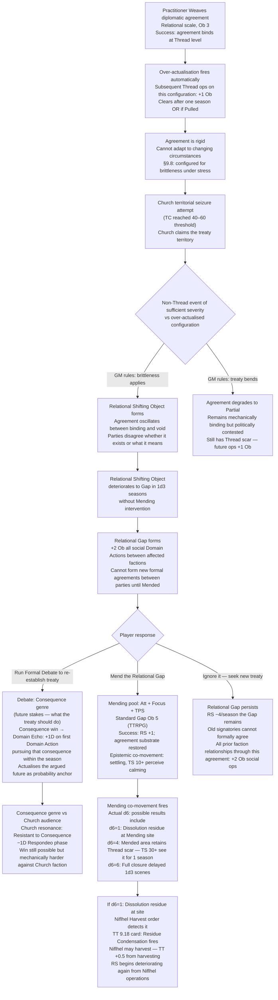
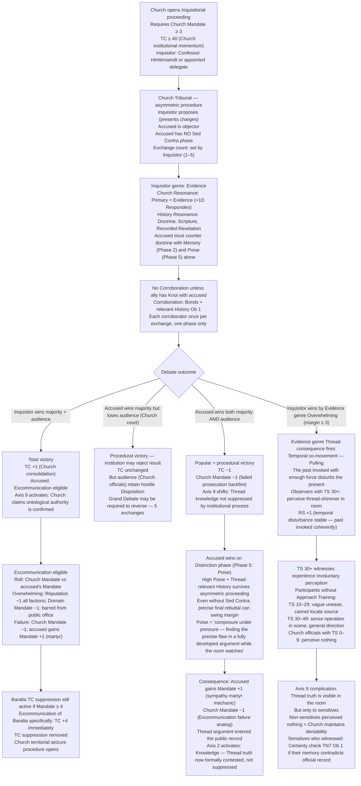

<!-- DERIVED FROM: Checkpoint 14 (compilation/valoria_ruleset_checkpoint_14.md, 2026-03-26) -->
<!-- SESSION: 2026-03-30 / 2026-03-31 — see session_log_archive.md -->
<!-- STATUS: Pre-release reference tool. Not valid against any post-CP14 ruleset. -->

# Valoria — Emergent Campaign Arcs (Experimental Mechanics)
*Threadweaving v2.5 · Debate System Redesign v1 · Mass Battle v3*
*All narrative framing illustrative only. No editorial content decided.*

---

## Arc 5: The Brittle Peace

**Primary mechanics:** Threadweaving v2.5 over-actualisation brittleness (§2.3, §9.8) · Relational Shifting Objects (§9.5) · Debate Domain Echo actualisation (Genre: Consequence)

**Seed:** A practitioner Weaves a diplomatic agreement at Relational scale to make it hold.

**Light narrative:** The treaty was supposed to be unbreakable. It was — until it had to bend.

### Causal Chain

**Why this arc is emergent:** The practitioner who Weaved the treaty intended to protect it. The brittleness is not failure — it is success. Weaving at Relational scale worked. The problem is that the rigidity it created, which was invisible during Diagnosis, manifests only when external political pressure arrives. The player had no mechanical way to anticipate this during the operation.

**Arc shape:** 1 season to Weave and lock in. 1–3 seasons of political pressure accumulating. 1 season of shattering. 2–3 season resolution arc (Mending or re-Debate). If d6=1 fires on Mending: Niflhel harvesting sub-arc restarts Rendering Stability drain.

---

## Arc 6: The Tribunal and the Temporal Shimmer

**Primary mechanics:** Debate redesign v1 asymmetric proceedings (Church Tribunal) · Evidence genre Thread consequence (Pulling / temporal co-movement) · Axis 9 (Ontological) · Theocracy Counter threshold

**Seed:** The Church opens an Inquisitorial proceeding against a practitioner Player Character or Varfell for Thread-related heresy.

**Light narrative:** The Inquisitor knows what questions to ask. The accused knows what happened. The room starts to remember things that haven't happened yet.

### Causal Chain

**Why this arc is emergent:** The asymmetric Tribunal structure means the accused cannot Reframe (no Sed Contra). They can only raise objections and make a final distinction. An Evidence genre Overwhelming against the accused fires Pulling co-movement — the Church's own evidentiary argument temporally disturbs the room. The very tool of institutional suppression produces the Thread visibility the Church is trying to prevent.

**Arc shape:** 1 session for the Tribunal scene. Immediate Theocracy Counter/Mandate consequences at Accounting. If Evidence Overwhelming fires: Axis 9 crisis in the same session. Resolution arc depends on which outcome branch fires.

---

## Arc 7: The Rendering Debt

**Primary mechanics:** Mass Battle v3 Threadweaving-per-turn (§A.10) · Coherence drain curve · Rendering Crisis (Coherence 0) · Corrective Weaving (§3.4 Threadweaving v2.5) · Collective operations Belief conflict

**Seed:** A war begins. A practitioner Player Character acts as the faction's battlefield Thread asset. They operate every turn.

**Light narrative:** They won the battle. No one is sure they're still the same person.

### Causal Chain

```mermaid
flowchart TD
    A["War-scale battle begins\nIP reaches 75+ — Altonian invasion\nFaction fields units; practitioner PC embedded as Threadweaver\n'A practitioner operating every turn of a 7-turn battle loses 7 Coherence'"] --> B["Turn 1–3: Practitioner operates\nBattle-scale = Territorial, Ob 4, Min TS 50\nCoherence auto-cost: −1/op (per §5.2 scale principle)\nCoherence: 10 → 9 → 8 → 7 (entering Dissonant)"]
    
    B --> C["GM names Dissonant entry to player explicitly\n'Coherence 7 — Dissonant. Fragmented is N operations away.'\nPlayer continues — war requires it"]
    
    C --> D["Turn 4–5: Coherence 7 → 6 → 5\nNarrative flickers: wrongness, déjà vu, events out of sequence\nClose Knots sense wrongness: +1 strain per 3 sessions\nCommand cost: general who Threadweaves cannot declare tactical action same turn"]
    
    D --> E["General incapacitated (Stage 1, mass battle §A.5)\nPractitioner must choose: stabilise general OR Threadweave this turn\nNot both — Phase 5 is one action\nStabilise: Medicine Ob 2. Threadweave: Coherence −1, battle continues"]
    
    E -->|"Threadweave this turn"| F["Turn 6: Coherence 5 → 4 (entering Fragmented)\n−1D all social rolls\n−1D Memory-based rolls\n+1 Ob all Thread operations including the Leap\nRoll Fragmented Fallout on entry — d6 narrative effect fires"]
    E -->|"Stabilise general"| G["General stabilised\nBattle outcome depends on remaining units without Thread support\nPractitioner at Coherence 5 — not yet Fragmented\nTrade-off: battle risk accepted to preserve practitioner rendering"]
    
    F --> H["Turn 7 (final): Coherence 4 → 3 or Failure → 2\nIf operation fails at Fragmented: Partial or Failure\nPartial: RS −1, Coherence −1 additional (from degree table + scale)\nCoherence cap: −1 per operation regardless — but degree-table costs apply at Relational+ on Failure\nFragmented Failure = Coherence −1 additional: possible reach to 2 (Fractured)"]
    
    H --> I["Battle resolves\nFaction wins or loses — recorded on territory card\nPractitioner at Coherence 2–3 (Fractured)\nRoll Fractured Fallout on entering Fractured band\nGM begins Belief Co-Authorship: presents shifting perceptual framework as internal voice"]
    
    I --> J{"Post-battle: recovery options"}
    J -->|"Full season non-practice"| K["+1 Coherence\nSpooling reasserts when suspension stops\nBut: war may not allow full season of non-practice\nFaction needs Thread asset again next season"]
    J -->|"Close Knot anchoring scene"| L["Bonds check TN7 Ob 2\nSuccess: +1 Coherence\nCost to Knot: +1 strain\n'Shared thread of being — relational spooling — helps stabilise rendering'"]
    J -->|"Second practitioner performs Corrective Weaving"| M["Corrective Weaving: Personal-scale Ob 3\nHelper pays: Coherence −0 (Object/Personal scale → no Coherence cost per §3.2)\nBut: if helper is at Relational+ scale due to circumstances, costs apply\nSuccess: +1 Coherence per season"]
    
    M --> N{"Helper's Belief vs operation"}
    N -->|"Helper has opposing Belief re: the practitioner's Thread work"| O["Pre-op Belief check: Spirit TN7 Ob 1\nFailure: helper cannot align, drops out\nCannot perform Corrective Weaving\nOntological conflict between practitioners makes recovery impossible without belief resolution"]
    N -->|"Helper has aligned or neutral Belief"| P["Corrective Weaving succeeds\nBut: if multiple operations required (deep Fractured), helper spends multiple seasons\nCampaign cost: two practitioners committed to recovery arc\nnot available for other Thread work"]
    
    J -->|"Coherence 0 reached — Rendering Crisis fires"| Q["Cannot Leap. Cannot Diagnose. Cannot operate.\n'An ontological incapacity — not a prohibition'\nMid-contact Coherence 0: contact terminates, operation = Failure\nExternal Corrective Weaving: Ob 5 (configuration fully collapsed)\nDoes not require target's cooperation — they cannot render well enough to consent or resist\nHelper pays standard co-movement costs"]
```

**Why this arc is emergent:** The Coherence drain is deterministic and cumulative. There is no individual choice that avoids it — war requires Thread operations, Thread operations cost Coherence. The 7-Coherence loss from a 7-turn war is not a punishment for bad play. It is the mechanical price of winning. The Corrective Weaving sub-arc that follows is itself mechanically costly and subject to Belief conflict between practitioners.

**Arc shape:** 1–2 sessions of battle (Coherence draining visibly). 2–4 session recovery arc. The Belief conflict between practitioners is the crisis inside the recovery — if the helper cannot align, the practitioner must reach Rendering Crisis and wait for external intervention at Ob 5.

---

## Arc 8: The Temporal Window

**Primary mechanics:** Threadweaving v2.5 Past-Oriented Pulling prerequisite (Rendering Stability ≤ 60) · Rendering Stability degradation sources · Einhir Ritual Framework (§9.15) · Temporal Disjunction · Certainty checks · Multiple faction awareness

**Seed:** Rendering Stability deteriorates below 60. Multiple factions learn that Past-Oriented Pulling is now mechanically accessible.

**Light narrative:** For the first time since the Catastrophe, someone could reach back. Everyone who knows this is deciding whether to let them.

### Causal Chain

```mermaid
flowchart TD
    A["RS degrades below 60\n(from Niflhel harvesting, Lock drift, Gap persistence, winter)\nPast-Oriented Pulling prerequisite: RS ≤ 60 — now met\nTS 70+ required; Diagnosis mandatory; Ob 3–7 by recency"] --> B["Who knows the threshold exists?"]
    B --> C["Varfell — TK 3+: 'succession leverage linked to Southernmost access'\nVaynard's TK advances include this structural theory\nIf told explicitly by practitioner: TK +1–2 immediately"]
    B --> D["Revolution — TS 30+ practitioner affiliated\nCommunity tradition may include partial knowledge of Einhir temporal work\n[EDITORIAL: extent of Revolution's pre-Catastrophe knowledge]"]
    B --> E["Church — zero awareness\nConfessor Himlensendt TS 0 (theologically foreclosed)\nChurch +2 Ob to all Thread-revealing Domain Actions\nDelay before Church understands what is possible"]
    B --> F["Crown — King Almud TS 28 (near Stirring, unrecognised)\nPrivately sympathises with Restoration\nIf told: personal crisis — institutional role conflicts with private sympathy"]
    
    C & D --> G["Race condition begins\nMultiple factions with different goals for what to Pull\nVaynard: Calamity mechanism — Southernmost access terms\nRevolution: Einhir Catastrophe — recover inner tradition knowledge\nNiflhel: unknown — but Intel detects Thread activity"]
    
    G --> H["Past-Oriented Pulling requirements to reach Foundational events:\nAll three Einhir Ritual Framework conditions:\n1. Diagnosis of Locked Zone structure (Southernmost expedition required)\n2. At least one Einhir Text technique (Settling, Restoring)\n3. Physically present at Einhir site-network node"]
    H --> I["Southernmost expedition becomes mandatory for Foundational Pulling\nWithout all three: attempt is impossible (ontological, not difficulty)\n'Cannot be attempted — not harder — impossible'\nThe framework the Einhir developed is the only path"]
    
    I --> J["Southernmost expedition arc\n2–3 seasons minimum\nNon-TS-30+ units dissolve on entry (mass battle §A.11)\nExpedition force = practitioners + affiliated personnel only\nNo military escort unless individually TS 30+"]
    J --> K["Expedition triggers Axis 2 (Knowledge)\nVarfell Intel detects movement\nChurch Intel at Southernmost: Church +2 Ob to all Thread-revealing ops\nNiflhel Quiet deployed to observe (Intel vs Intel)\nTT +0.5 from Quiet deployment during expedition"]
    
    K --> L["Past-Oriented Pulling attempt:\nTS 70+, RS ≤ 60, Diagnosis mandatory\nFoundational event: Ob 7 (base) + 2 (Foundational surcharge) = Ob 9\nRS consequence ×3: Success = RS −9 minimum\nFailure: snap-back Wound + RS −6 minimum\nPractitioner pool ceiling: Spirit + History + TPS÷2"]
    
    L --> M{Pull outcome}
    M -->|"Success (RS −9 minimum)"| N["Event displaced\nTemporal Disjunction fires:\nMemories of the displaced event persist in all witnesses\nPhysical facts removed from the world\nAll characters whose mechanical state reverts: Spirit TN7 Ob 1\nFailure: Certainty −1 — they remember something that didn't happen"]
    M -->|"Failure (RS −6 minimum + snap-back Wound)"| O["Practitioner takes Wound\nRS −6: likely drops RS another threshold band\nTemporally: nothing displaced\nBut the attempt created detectable Thread activity\nAxis 9 fires: Church detects large-scale unauthorised Thread operation"]
    M -->|"Partial (RS −6, Shifting Object at Foundational scale)"| P["Foundational-scale Shifting Object\nThe Catastrophe event oscillates between presence and absence\nInstitutions built on its history oscillate in authority\nChurch's theological basis destabilised at Structural scale\nReversal requires second Pull or large-scale Mending"]
    
    N --> Q["Temporal Disjunction consequences\nPhysical-fact-triggered states revert (e.g., Knot strain from external events)\nExperience-triggered states persist (strain from character's own response)\nWitnesses who directly contradict their memory: mandatory Certainty check\nTS 30+ observers: mandatory\nCharacters with Knot to displaced fact: mandatory\n'Their rendering of reality has been compromised — they remember something that didn't happen'"]
    Q --> R["RS now below 50 or below 40 depending on starting position\nRS threshold band shifts: new threshold effects apply at next Accounting\nIf RS crosses from Strained to Fragile:\nSpontaneous Shifting Objects begin forming in high-traffic Thread territories"]
    
    O --> S["Church opens Heresy Investigation\nKnowledge that Foundational Pull was attempted\nAxis 9 fully activated\nTC +1 (Church consolidation response to Thread threat)\nGrand Debate: 5 exchanges — can practitioners defend the attempt?"]
    
    P --> T["Institutions built on the partially-displaced event oscillate\nMandates for affected factions: unreliable — Structural Shifting Object means authority intermittent\nDomain Actions by those institutions: −1D\nMandate-conferring capacity suspended until Mended\nThis is functionally a political crisis without any political act by any faction"]
```

**Why this arc is emergent:** The Past-Oriented Pulling prerequisite (Rendering Stability ≤ 60) means the world must first degrade before temporal manipulation is possible. Factions that want to use it need the world to be worse. No faction deliberately tanks Rendering Stability to open the window — Rendering Stability degrades from the accumulated effects of prior play. The window opens as a side effect of everything else. When it opens, every faction with knowledge of Thread mechanics has a different agenda for what to do with it.

**Arc shape:** Background Rendering Stability deterioration for 3–6 seasons (invisible prerequisite accumulating). Window opens as a threshold event. 2–3 season Southernmost expedition to satisfy Einhir Ritual Framework. 1 session Pulling attempt. 2–4 season consequence arc from whichever branch fires.

---

## Cross-Arc Interaction Table (Experimental Mechanics)

| Collision | Arcs | Mechanic |
|---|---|---|
| Over-actualised treaty shatters during Tribunal season | 5 + 6 | Relational Gap opens; Debate re-establishment needed; Evidence genre Pull fires in tribunal room while Relational Gap exists in the same zone |
| Practitioner at Rendering Crisis during Southernmost expedition | 7 + 8 | Cannot Leap, cannot Diagnose; Einhir Ritual Framework acquisition impossible; expedition must wait for Corrective Weaving to restore Coherence to 1+ before proceeding |
| Mass battle turns general's Coherence Fragmented before Temporal Pull attempt | 7 + 8 | At Fragmented: +1 Ob all Thread operations including Leap; Foundational Pull already at Ob 9 + 2 surcharge; now Ob 12 — exceeds Ob 10 cap; Pull becomes mechanically impossible until Coherence recovers |
| Evidence genre win in Tribunal fires temporal co-movement while Rendering Stability ≤ 40 | 6 + 8 | At Rendering Stability Fragile: Shifting Objects form spontaneously in Thread-traffic territories; temporal co-movement from Tribunal triggers spontaneous Shifting Object in the courtroom itself; witnesses perceive rendering failure mid-proceeding |
| Niflhel Quiet deployed during Southernmost expedition adds Thread Tension while Rendering Stability already critical | 8 (late) | Each Quiet deployment: Rendering Stability −0.5 (existing harvesting chain); Rendering Stability at expedition season already stressed; Niflhel accelerates the Rendering Stability drain that makes the Foundational Pull more dangerous to the substrate |
| Collective Mending of Relational Gap has Belief conflict | 5 (recovery) | Directly opposing Beliefs require pre-Leap check; practitioners who disagree about whether the treaty should be restored cannot align; Shifting Object persists |

---

## Mechanic Surfaces Summary

| Mechanic | Arc | How it generates the arc |
|---|---|---|
| Over-actualisation brittleness | 5 | Intended protection becomes hidden fragility; political stress reveals it |
| Relational Shifting Object / Gap scale | 5 | Diplomatic breakdown has Thread consequences, not just political ones |
| Debate genre × faction resonance | 5, 6 | Different factions respond differently to Evidence/Consequence/Character; same argument fails against one audience, succeeds against another |
| Church Tribunal asymmetric proceeding | 6 | No Sed Contra for accused; Evidence genre resonance favours Church; structural disadvantage is the mechanic |
| Evidence genre Thread consequence (Pulling) | 6 | The Church's own evidentiary force produces temporal co-movement; institutional suppression generates visibility |
| Coherence drain per mass battle turn | 7 | Winning the war costs practitioner rendering stability; deterministic, not a punishment |
| Corrective Weaving Ob 5 at Rendering Crisis | 7 | Recovery requires external rendering; self-rescue is ontologically impossible |
| Belief conflict in Collective operations | 7 | Opposing intentionalities block collective Mending/Corrective Weaving |
| Rendering Stability ≤ 60 prerequisite for Past-Oriented Pulling | 8 | World deterioration opens temporal mechanics; perverse incentive structure |
| Einhir Ritual Framework (§9.15) | 8 | Three-condition gate for Foundational operations; each condition is a campaign arc in itself |
| Temporal Disjunction + Certainty checks | 8 | Success of the Pull destabilises rendering for all witnesses; victory has ontological cost |
| Foundational-scale Shifting Object (Partial) | 8 | Half-successful temporal manipulation oscillates institutional authority at Structural scale; political crisis from Thread event |

---

*All arcs require Rendering Stability to be tracked accurately across sessions. Arcs 7 and 8 converge if the same practitioner runs both — full-battle Threadweaving followed by Foundational Pull in the same campaign is a near-certain Rendering Crisis path.*
