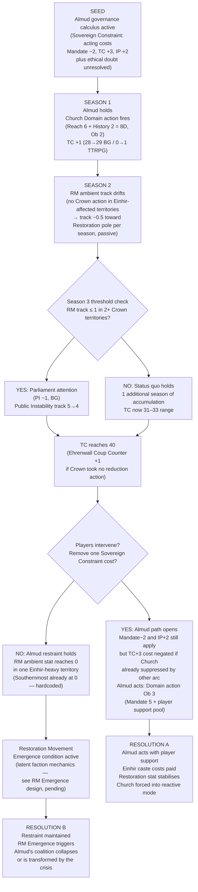
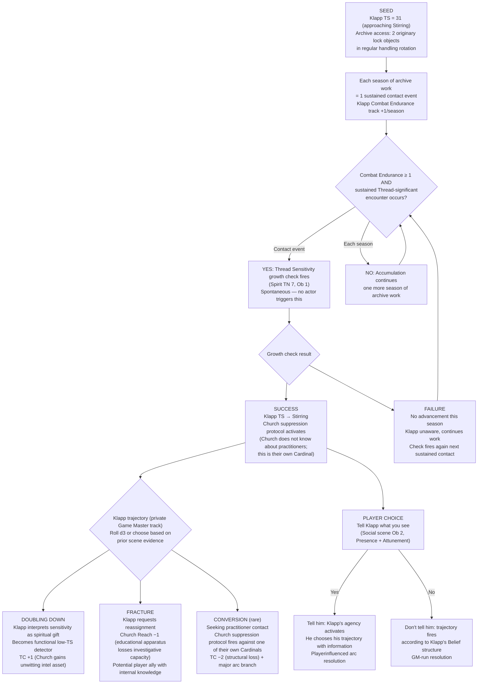
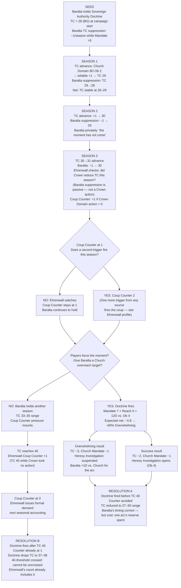
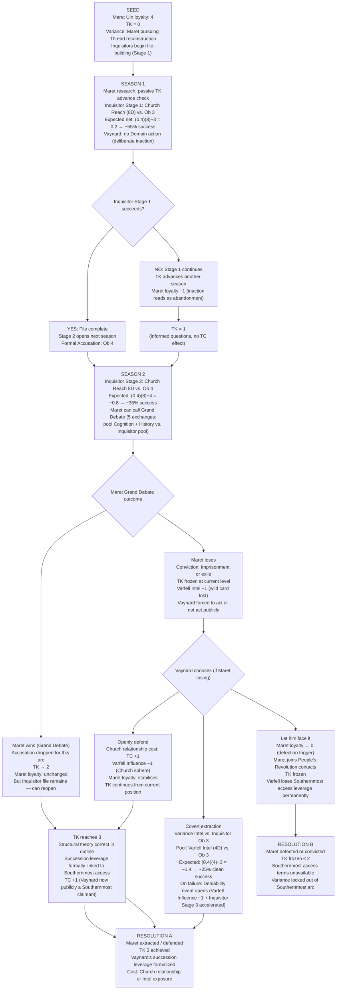

# Valoria Emergent Arcs — Batch 01 (Non-Greedy Decision Frameworks)
## Generated: 2026-04-06 | Revised: 2026-04-11 (Almud reframing: governance pragmatism + ethical doubt, not secret sympathy) | Source reads: stage13_npcs.md, stage6_factions.md, stage12_campaign_modes.md, geography_design.md, glossary.md, params_board_game.md
## Non-greedy framework typology applied: cost-accounting strategic patience · institutional status quo bias · option value hoarding · strategic ambiguity
## Prior arcs checked: gm_ref/ — none (no duplication risk)

---

## Arc 1: The Unworked Clause

**Primary mechanics:** Almud Belief 2 (Sovereign Constraint), Restoration Movement ambient track (per-territory, Piety/Restoration unified track), Theocracy Counter (TC) seasonal accumulation, Mandate thresholds, Public Instability (PI)
**Primary Non-Player Characters:** King Almud Almqvist (Crown), Confessor Arne Himlensendt (Church)
**Non-greedy framework:** Cost-accounting restraint — both actors refuse the locally dominant move because each component of its cost exceeds the component of its gain, even as their mutual restraint compounds into a structural vacuum neither intended to create.

---

### Narrative

The players notice it gradually. Almud speaks of the Einhir situation with the precision of a competent administrator who has mapped every governance risk on the peninsula. He knows the caste creates problems — Varfell restiveness, Restoration drift, southern territory instability, parliamentary pressure from Hafenmark. He names the costs of intervention: Mandate −2 (northern Valnese nobility), TC +3 (Church counter-escalation), IP +1 (Altonia exploits internal disruption). When pressed, he describes the coalition he would destroy, the Theocracy Counter he would advance, the Altonian diplomatic note that would arrive within a season. He is not rationalising. He is correct about the costs.

What the players may not immediately perceive is that the costs are shelter for a question Almud has not resolved. He sometimes wonders — privately, never publicly — whether a Valnese kingdom should have a caste system at all. This is not secret sympathy. It is genuine ethical doubt that has not become conviction. He does not act because he has not decided whether acting is right, and the costs of acting on an unresolved question are worse than the costs of holding the question open. His restraint is not noble suffering. It is the governance of a man who has not yet decided what he believes.

Himlensendt, meanwhile, accumulates his Theocracy Counter through methods that look, from the outside, like pure pastoral success. He is not forcing a holy state — he is providing one. Hospitals. Resolution of land disputes through Church arbitration rather than Crown courts. Charitable foundations in territories where Crown Mandate is thin. Each season produces a Counter increment of +1, reliable as rainfall, and at no point has anyone given him a specific reason to be stopped. He has not overreached. He has not threatened. The Church's growth is unimpeachable.

What neither actor sees — or sees and cannot speak to — is what their parallel restraint is filling. In southern territories, where Einhir cultural continuity was never formally suppressed but was never formally protected either, the Restoration Movement ambient track has been drifting. Not from any faction's action. From the absence of one. The question of what Einhir cultural life means in Valoria hangs open, and the open question is itself an answer. The players begin to hear it in tavern conversations, in the silence that follows certain toasts, in the density of requests to speak privately after public audiences.

When the arc resolves, it will not be because someone decided to end it. It will be because one of the three systems — the Sovereign Constraint, the Counter's seasonal advance, the Restoration Movement ambient stat — crosses a threshold that forces the restraint to become a position. Almud's governance pragmatism will have been, in retrospect, a slow decision — not the strategic patience of a man who knew the right answer but the uncertainty of a man who never decided.

---

### Mechanical Causal Chain

**Why this arc is emergent:** No single player caused this — it required Almud's rational restraint and Himlensendt's rational accumulation operating simultaneously across multiple seasons, with the Restoration Movement ambient track as the passive accumulation mechanism neither actor was watching. The arc is a coordination failure produced by two individually correct non-greedy calculations.

**Arc shape:**
- TTRPG: 4–5 seasons, 6–9 sessions. Seasons 1–2: background accumulation, players notice. Seasons 3–4: Parliament/PI pressure, Almud's restraint becomes visible. Season 5: threshold — the arc forces a position.
- BG: Observable in 2–3 seasons of accounting, resolution forced by Season 4.

---

### Session Progression and Mechanical Forecast

| Season | Session(s) | Mechanical Events | Forecast |
|--------|-----------|-------------------|----------|
| 1 | 1–2 | Church Domain action: 8D vs. Ob 2. Expected net successes: (0.4)(8) − 2 = 1.2. Reliable TC +1. Almud makes no Domain action targeting the Einhir question. | TC advance: ~95% probability. Almud inaction: ~100% (costs real + ethical doubt unresolved). |
| 2 | 3–4 | RM ambient track passive drift. If no player or Crown Domain action in southern territories, track moves −0.5 toward Restoration pole. PI check skipped (threshold not met). | RM drift: certain absent intervention. TC now 30–31 BG. |
| 3 | 5–6 | RM track at 1 in 1 Crown territory. PI −1 check (BG). TC 32–34. Baralta's suppression (−1/season) active only while Mandate >5. | If PI hits 4 (BG): Parliament scrutiny begins. TTRPG: Almud receives a public petition. |
| 4 | 7–8 | TC 35+. Ehrenwall Coup Counter check: did Crown reduce TC this season? If not, Counter +1. RM at 0 in 1 territory: Emergence conditions check. | Coup Counter increment: ~70% if no Crown action. Emergence check: depends on RM design (pending). |
| 5 | 9 | Resolution season. Either players have removed a Sovereign Constraint cost (Ob 3 social scene, pool: player Presence × 2 + History) or Almud's position becomes untenable. | Almud action pool at Ob 3: 5D (Mandate) + player dice. Expected net at Ob 3: ~1.0 → ~55% success. |

---

## Arc 2: The Unseeing Eye

**Primary mechanics:** Cardinal Magnus Klapp Thread Sensitivity (TS) growth check (Spirit TN 7, Ob 1), Inquisitor Exposure track, Church institutional continuity bias, Theocracy Counter secondary effect
**Primary Non-Player Character:** Cardinal Magnus Klapp — Scholarship (Church)
**Non-greedy framework:** Institutional status quo bias — the Church never assigns Klapp away from sensitive materials because his institutional value is certain while his Thread Sensitivity risk is merely probable. The dominant strategy (rotate him) is never taken because no individual decision-maker owns the downside.

---

### Narrative

Nobody assigned Cardinal Magnus Klapp to the problem that is quietly making him into something the Church has no doctrine for. He assigned himself — or rather, the archive did. He is the most capable textual scholar in the Church and the archive of identified Einhir texts is the most significant collection in Valoria. These two facts combined, over years, with the unremarkable logic of institutional placement.

The players will encounter him as the man who knows where everything is. He is precise, generous with his time, deeply knowledgeable, and — if any player has even moderate Thread Sensitivity — subtly dissonant. Not wrong. Slightly out of phase with how he should feel. He doesn't experience it as an absence or a presence. He has simply begun noticing, during certain evenings in the archive, that the light seems to carry more information than light ordinarily does.

The Church is not watching him carefully because there is no institutional reason to. He has produced no heretical work. He has not requested access to restricted collections beyond his mandate. He has not behaved in any way that would trigger the suppression protocol he is not told exists. He continues to produce scholarship that Himlensendt relies on. His Thread Sensitivity continues to accumulate contact-hours with originary lock objects and dissolution residue evidence. The institution is perfectly designed to miss what it is doing to him.

The players will likely understand what is happening before Klapp does. This gap — between what they see and what he knows — is both the arc's central dramatic engine and its ethical question: do you tell him? And if you do, what do they tell him first?

---

### Mechanical Causal Chain

**Why this arc is emergent:** No player designed this. The Church's institutionally rational placement of its best scholar in the archive, compounding with contact-hours mechanics the institution cannot see, plus a Thread Sensitivity growth check that fires spontaneously — these three independent systems produced a crisis that no actor chose to create.

**Arc shape:**
- TTRPG: 3–5 seasons, 5–9 sessions. Growth check may fire as early as Season 2 (first sustained encounter) or as late as Season 4. Resolution requires 1–2 additional sessions post-check for trajectory to manifest.
- BG: Observable via Church stat anomaly (Reach −1 or TC shift) in Season 3–4.

---

### Session Progression and Mechanical Forecast

| Season | Session(s) | Mechanical Events | Forecast |
|--------|-----------|-------------------|----------|
| 1 | 1–2 | Klapp introduced. No Thread event yet. Combat Endurance: 0→1 (archive rotation). Players may notice TS dissonance (passive perception, Attunement TN 7, Ob 1 for any TS 20+ practitioner). | Passive notice: ~50% for TS 20+. No mechanical consequence yet. |
| 2 | 3–4 | If player operation or natural plot brings Thread-significant materials into the archive: sustained encounter event. Combat Endurance: 1→2. Growth check fires: Spirit TN 7 Ob 1. [GAP-ARC-01: Klapp's Spirit attribute not documented in stage13. Assumed 3–4 based on academic profile.] | At Spirit 4, Ob 1: expected 4×0.4 − 1 = 0.6 net → ~65% success. At Spirit 3: ~50% success. |
| 3 | 5–6 | If check succeeded: Klapp TS at Stirring. Church suppression protocol: does it fire? (Institutional knowledge gap — Church suppression protocol exists but no Cardinal is watching Klapp for this.) Player opportunity: tell him before the protocol activates. | Suppression protocol awareness check: [GAP-ARC-02: mechanism not fully specified in current design docs. Flag for design.] |
| 4 | 7–8 | Trajectory resolves. Fracture: Church Reach −1, TC stable. Conversion: TC −2 + major story branch. Doubling Down: TC +1, Klapp becomes latent institutional threat. | Fracture most probable given academic Belief structure (Cognition-dominant, would process the dissonance analytically). Conversion possible if players guide him. |

---

## Arc 3: The Hammer's Reserve

**Primary mechanics:** Baralta Sovereign Authority Doctrine (once-per-arc Domain action, pool Mandate 7 + Reach 5 vs. Ob 4), Theocracy Counter seasonal advance, Ehrenwall Coup Counter (0–3), Mandate threshold (Baralta's TC suppression active only while Mandate >5)
**Primary Non-Player Character:** Duchess Inge Baralta (Hafenmark)
**Non-greedy framework:** Option value hoarding — Baralta treats the Doctrine as a declining asset to be spent at peak value. She refuses to fire it when its marginal impact is smaller than she believes it will be later. The arc emerges when the conditions that make the Doctrine most valuable also make its timing most consequential for other clocks.

---

### Narrative

There is a moment in every Parliament session where the players — if they are watching Baralta carefully — can almost see her decide not to do something. She carries the Sovereign Authority Doctrine the way an experienced commander carries a reserve. She knows what it costs, she knows what it can buy, and she is absolutely certain the moment has not arrived yet. She has been certain of this for three seasons.

The Church of Solmund is not giving her a good target. Himlensendt's accumulation is, as Baralta herself has noted, nearly impossible to object to on grounds of principle. He is providing services the Crown cannot afford. He is winning arguments by not making them. The Theocracy Counter climbs not from confrontation but from the perfectly reasonable conclusion, drawn by thousands of people independently, that the Church is simply better at certain things than anyone else. Baralta can shout about the separation of Church and state in every Parliament session — and she does — but she cannot shout a hospital out of existence.

What she is waiting for is a Church overreach she can name. A moment when Himlensendt or one of his Cardinals steps visibly beyond their institutional mandate. She is patient because she is correct that such a moment will come. What she is not calculating is what accumulates while she waits. Ehrenwall is counting. The Theocracy Counter is rising. And the Sovereign Authority Doctrine, held in reserve for the perfect shot, is the one resource in Valoria that does not compound.

When she finally fires it — whether because the players force the moment, because a Crown territorial loss trips Ehrenwall's second counter increment, or because the Counter approaches 50 and her own Beliefs will not let her hold — she will discover that the optimal deployment window closed two seasons before she chose it.

---

### Mechanical Causal Chain

**Why this arc is emergent:** No player chose to let the Theocracy Counter and Coup Counter accumulate simultaneously. Baralta's individually rational reserve strategy — the most defensible non-greedy choice available to her — created a window in which two separate clocks advanced past thresholds she was not tracking together.

**Arc shape:**
- TTRPG: 4–6 seasons, 7–11 sessions. Seasons 1–3: Baralta holds while the situation appears stable. Seasons 4–5: dual clock pressure becomes visible. Season 6: forced resolution.
- BG: Baralta's hold is a player decision if Hafenmark is player-controlled; if NPC-controlled, she fires the Doctrine only when TC ≥ 38 (optimal target window she is waiting for — but this is past Ehrenwall's trigger threshold).

---

### Session Progression and Mechanical Forecast

| Season | Session(s) | Mechanical Events | Forecast |
|--------|-----------|-------------------|----------|
| 1–2 | 1–4 | TC advances +1/season; Baralta suppression −1/season; net movement ~0. Ehrenwall's Coup Counter at 0. No visible crisis. | Players may not notice anything is accumulating. Church momentum is structurally guaranteed. |
| 3 | 5–6 | First Coup Counter check. If Crown took no Domain action to reduce TC: Counter +1. Baralta still holds. TC 30–32. | Counter increment: ~70% (Crown rarely prioritises TC reduction unprompted). |
| 4 | 7–8 | If Baralta has not fired by TC 35: optimal window she is waiting for has been passed. TC 33–38. Second Coup Counter trigger risk (territorial loss or Torben loyalty drop). | Coup Counter at 2: ~40% cumulative probability. |
| 5 | 9–10 | TC approaches 40. Baralta fires the Doctrine or the players force it. Doctrine pool: 12D vs. Ob 4. Expected net successes: (0.4)(12) − 4 = 0.8 → Overwhelming result (~65% with full pool). | If fired before TC 40: TC drops to 27–30. If after: Coup Counter already has the increment; TC drops but threshold crossed. |
| 6 | 11 | Resolution: Ehrenwall at 3 (coup) or Baralta's timing vindicated. | If Coup Counter 3: coup fires at next accounting — no mechanic stops it without direct player intervention (Ob 4 social scene, Presence 4+ pool vs. Ehrenwall Composure 11). |

---

## Arc 4: Vaynard's Wager

**Primary mechanics:** Vaynard Thread Investigation Track (TK, 0–5), Maret Uln starting loyalty (4), Inquisitor investigation procedure (Stage 1: Church Reach Ob 3; Stage 2: Ob 4; Stage 3: Grand Debate), Varfell Intel stat, Vaynard Belief 3 (succession as leverage), Theocracy Counter secondary effect at TK 3+
**Primary Non-Player Characters:** Duke Magnus Vaynard (Varfell), Scholar Maret Uln (Varfell's wild card)
**Non-greedy framework:** Strategic ambiguity — Vaynard refuses to commit to either supporting or suppressing Maret, preserving optionality at the cost of control. The arc's emergent pressure comes from the three systems that do not wait for his decision.

> [EDITORIAL: ED-048 — Maret Uln's documented Belief references "the Ceiral Ritual" by name. This name is flagged as non-canon. The ritual name used below is a placeholder. Arc mechanics are sound; canonical naming requires authorial decision before finalised play material is produced.]

---

### Narrative

Vaynard does not tell Maret to stop. He also does not tell him to continue. What he tells him, when Maret delivers his seasonal progress, is that the research is noted. That Varfell's interests in the Southernmost question are best served by Maret's methodology rather than his conclusions. That the Duke appreciates the scholar's discretion and relies on it continuing. Maret understands this perfectly and continues his work regardless, because the ritual he is trying to reconstruct will not wait for ducal comfort and neither will the Inquisitors who are, with methodical patience, building their file.

The players will find Vaynard in his most calculated register when they approach this. He is neither concerned nor incurious. He has identified Maret as the most valuable person on the peninsula for the problem that interests him most, and he has calculated, correctly, that openly sanctioning the research would damage his Church relationships faster than it would advance his Southernmost access terms. He has also calculated, with equal correctness, that suppressing Maret would lose Varfell the only practitioner-level scholar in the kingdom who is not institutionally controlled. Both positions are wrong. He has therefore chosen neither.

What Vaynard is not calculating is that Maret's loyalty to Varfell began at 4 and has no mechanic to increase it. The inaction that Vaynard experiences as sophisticated political management, Maret experiences as expendability. The scholar is not naive. He knows what the Duke's silence means in an interrogation room. He is continuing because his Belief is more urgent than his fear — but he is also developing, quietly, a set of relationships with People's Revolution contacts that have nothing to do with Vaynard and do not answer to him.

When the Inquisitors formally accuse Maret, Vaynard will face the choice he built his entire strategy to defer: openly defend him, let him face it alone, or extract him covertly. Each option closes one set of futures and opens another. The only thing Vaynard's non-commitment cannot survive is the moment when the choice must be made publicly.

---

### Mechanical Causal Chain

**Why this arc is emergent:** Vaynard's non-commitment strategy was individually rational at every decision point. Its failure was produced by three independent systems — Maret's loyalty clock (no increment mechanic), the Inquisitor's procedural stages (advancing regardless of Vaynard's inaction), and the People's Revolution contacts (Maret's independent social network) — operating in parallel without any player choosing to combine them.

**Arc shape:**
- TTRPG: 4–5 seasons, 7–9 sessions. Season 1: Inquisitor file begins. Season 2: Formal accusation, Grand Debate or default. Season 3–4: Vaynard forced to choose. Season 5: Resolution and TK consequence.
- BG: Observable as Varfell Intel pressure + TC shift in Season 3; TK is a TTRPG/Hybrid mechanic with BG abstraction pending.

---

### Session Progression and Mechanical Forecast

| Season | Session(s) | Mechanical Events | Forecast |
|--------|-----------|-------------------|----------|
| 1 | 1–2 | Inquisitor Stage 1: 8D vs. Ob 3. Expected net: 0.2 → ~55% success. Vaynard takes no Domain action. TK: 0→1 (passive, Maret delivers seasonal briefing). | File complete: ~55%. Maret loyalty: 4 (stable). |
| 2 | 3–4 | If file complete: Stage 2 fires. 8D vs. Ob 4. Expected net: −0.8 → ~35% success. Grand Debate if Maret called: Cognition 5 + History [GAP-ARC-03: Maret's History bonuses not documented in stage13] vs. Inquisitor pool (Church Reach 6 + Ecclesiastical Law History 2 = 8D). | Inquisitor wins Grand Debate at ~60% (larger pool). Maret loyalty: 3 (reads inaction as signal). |
| 3 | 5–6 | Vaynard forced to choose (covert extraction or open defence or abandonment). Covert extraction: Varfell Intel 4D vs. Ob 3 → ~25% success. Open defence: TC +1. | Abandonment: Maret loyalty → 0, defection trigger fires. People's Revolution gains practitioner-level resource. |
| 4 | 7–8 | If Maret retained: TK → 2–3. If TK 3: TC +1, succession leverage formalised. Vaynard now has a concrete Southernmost access demand he can name in Parliament. | TK 3 unlocks the largest strategic lever Varfell has — succession withholding with an explicit exchange condition. |
| 5 | 9 | Resolution. TK 3 integrated into the succession negotiation. Almud's Belief 3 ("ratify succession before it becomes Vaynard's instrument") activated — the arc converges with Arc 1. | TK 3 makes Belief 3 true: it is already Vaynard's instrument. |

---

## Cross-Arc Interaction Table

| | Arc 1: Unworked Clause | Arc 2: Unseeing Eye | Arc 3: Hammer's Reserve | Arc 4: Vaynard's Wager |
|---|---|---|---|---|
| **Arc 1** | — | Klapp Fracture trajectory (Church Reach −1) removes one leg of the TC accumulation that compounds while Almud holds. If Klapp fractures, the cost calculus shifts slightly. | Baralta's Doctrine firing reduces TC to 27–30, which is one of the costs Almud's Sovereign Constraint is waiting to see paid by others. If Baralta fires before Arc 1 forces a position, Almud's path clears by 1 structural cost. | TK 3 activates Vaynard's succession leverage — Almud's Belief 3 becomes urgent. Arc 1 and Arc 4 converge at Session 9 if both run simultaneously. |
| **Arc 2** | Klapp's TS development makes him a latent observer of the Einhir cultural question Almud is constrained on. If players connect them (Ob 3 social scene), Klapp's converted awareness may offer Almud the theological framing he cannot find in the Church. | — | Baralta's Doctrine (Overwhelming result) suspends Heresy Investigation. This is the only external mechanism that buys Klapp a full season without Inquisitor attention — one growth-check cycle of safety. | Klapp's archive contains exactly the material Maret is reconstructing. If Klapp converts: Maret gains an unlikely Church-internal ally. If Klapp fractures: Maret loses one degree of cover. |
| **Arc 3** | Baralta's Doctrine (Overwhelming): Heresy Investigation suspended. This directly extends Maret's safety window (Arc 4) by one season. If timed to Season 2, Maret survives Stage 2. | Baralta cannot target Klapp directly — he is not a Church overreach. But Klapp's Fracture reduces Church Reach, making Stage 2 of the Inquisitor investigation (Ob 4) marginally harder: Reach −1 → pool 7D, expected net: −0.2 → ~45% (down from ~35% failure to ~45% failure). | — | Baralta's Doctrine fired at Overwhelming: Heresy Investigation suspended. This is Maret's best-case Season 2 outcome without Vaynard acting. If Baralta fires for Arc 3 reasons, Arc 4 benefits as a side effect. |
| **Arc 4** | TK 3 is the mechanic that converts Almud's Belief 3 from future concern to present crisis. Both arcs land in the same Parliament scene if running simultaneously. Players cannot resolve one without affecting the other. | Klapp Conversion trajectory (rare): seeks a practitioner contact. Maret, if still free, is the most accessible practitioner-level scholar. This connection, if it forms, produces the most destabilising knowledge cluster in Valoria: a converted Cardinal and a reconstructing ritual scholar in contact. | See Arc 3 row. Doctrine suspension buys Maret a season. | — |

---

## Gap Register (This Batch)

| ID | Gap | Effect on Arcs |
|----|-----|---------------|
| GAP-ARC-01 | Klapp's Spirit attribute not documented in stage13_npcs.md | Arc 2 growth check probability imprecise. Assumed Spirit 3–4. |
| GAP-ARC-02 | Church suppression protocol mechanism (for Cardinals) not fully specified in any read document | Arc 2 post-Stirring institutional response is unclear. |
| GAP-ARC-03 | Maret Uln's History bonuses not documented in stage13_npcs.md | Arc 4 Grand Debate pool incomplete. |
| ED-048 (existing) | "Ceiral" ritual name not canon | Arc 4 Maret Belief is a placeholder. |

---

*Commit target: `gm_ref/arcs_01_04_nongreedy.md` · Scope: `editorial` · No mechanical values changed; no params update required.*
