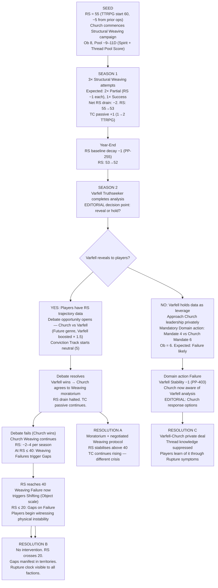
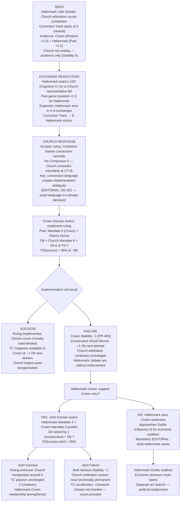
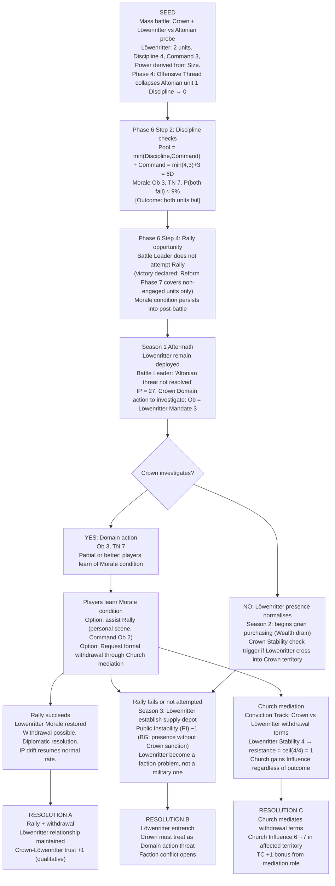
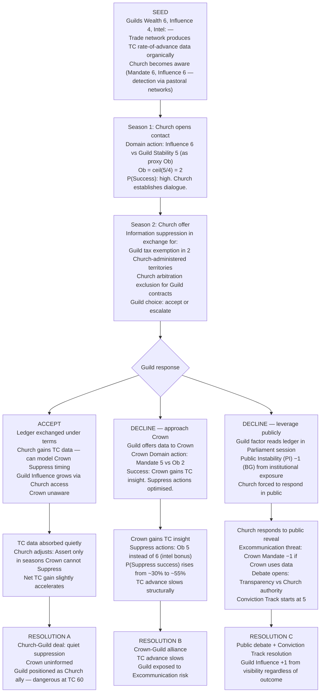
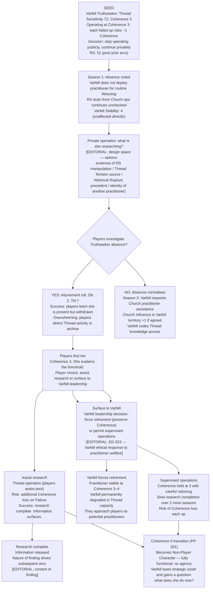

# Valoria Emergent Arcs — Batch 02
## Generated: 2026-04-08 | Source reads: params_factions.md, params_core.md, params_threadwork.md, params_debate.md, params_mass_combat.md, glossary.md, canonical_sources.yaml
## Framework typology: RS decay spiral · Debate outcome cascading into Mandate collapse · Mass battle aftermath · Thread Tension as slow extinction clock
## Prior arcs checked: gm_ref/arcs_01_04_nongreedy.md — 4 arcs. No duplication.

---

## Arc 5: The Quiet Fracture

**Primary mechanics:** Rendering Stability (RS) baseline decay (−1/year, PP-255), Thread operations (cumulative RS cost), Theocracy Counter (TC) passive advance (+1/season, PP-402), Weaving scale escalation
**Primary factions:** Church, Varfell
**Arc shape:** 3 seasons + Year-End. Open spiral — no natural close without player action.

---

### Narrative

The world is not breaking. That is the problem. If it were breaking in a way anyone could point to, someone would respond. Instead the players keep hearing two things said in the same week by people who have never spoken to each other: that the winters feel longer than they used to, and that the Church's healing work has never been more effective.

Both statements are true. Both emerge from the same mechanic. Every Structural Weaving the Church performs — and there have been three this year, Ob 8 each, in territories where the Restoration Movement's presence has made Thread-adjacent activity symbolically important — costs two points of Rendering Stability (RS) on Failure, one on Partial. The Church's practitioners are not failing catastrophically. They are partially succeeding, consistently, at scale, which is worse. The cumulative drain is invisible in any single operation and obvious in retrospect, across four seasons of accounts.

Varfell knows. Or rather, Varfell's Truthseekers know, and Varfell's political structures have not yet decided whether this knowledge is a lever or a liability. Their consequentialist ethical framework weights future outcomes — boosted Future genre in debate, per the faction parameters — which means they see the ten-season trajectory and are running the calculation on whether revealing it helps them more than it hurts the Church. That calculation has been running for two seasons. It has not yet produced an output.

Meanwhile the year-end comes, Rendering Stability ticks down by its baseline point, and everyone in the room feels slightly more tired than they expected to feel.

---

### Mechanical Causal Chain

**Emergent logic:** No player designed this. The Church's ritual success rate, combined with Ob 8's expected partial-success frequency at realistic pool sizes, produces a structural RS drain that looks like competence. The gap between what the Church intends (healing) and what the world records (destabilisation) is the arc.

---

## Arc 6: The Debate That Won the Wrong Thing

**Primary mechanics:** Debate system (Conviction Track, Genre weights, Composure), Mandate stat, Stability cost on Domain action Failure (PP-403), TC Suppress (PP-402)
**Primary factions:** Crown, Church, Hafenmark
**Arc shape:** 2-season setup, 1-season resolution event, 1-season aftermath. Linear with branching aftermath.

---

### Narrative

Hafenmark called for the debate. They were right to. The question on the floor — whether the Church's arbitration courts in southern territories constitute a parallel legal jurisdiction, and whether that jurisdiction is subject to parliamentary oversight — was exactly the question that needed public resolution. Hafenmark's orators are strong. Their Categorical Imperative ethical framework gives them a boosted Past genre weight of 1.5, and the historical record of Church encroachment is long and well-documented. They won.

The Conviction Track moved to eight. The chamber ruled for parliamentary oversight. The Church accepted. Three witnesses in the gallery noted that the Confessor representing the Church had agreed very quickly, and in agreeing had framed the oversight mechanism in terms that, reading the formal record later, did not actually constrain anything currently operational. He had conceded the principle and retained the practice. The orators who had won did not immediately recognise what they had lost.

What follows is not a Church counterattack. It is a Crown crisis. The Crown's Virtue Ethics framework (Present genre boosted × 1.5) had positioned it to arbitrate the outcome — the Royal Decree that would have implemented the ruling. That implementation required a Domain action: Mandate 5 vs Church Mandate 6, Ob 6, TN 7. Probability of Success at this pool is roughly 35%. The roll failed. Stability −1 (PP-403). The Crown's implementation attempt failed publicly, visibly, and the implementation mechanism was now poisoned — a second attempt would raise Ob by the consecutive-use rule.

Hafenmark won the debate and created a Crown weakness they now have to decide whether to exploit or repair.

---

### Mechanical Causal Chain

**Emergent logic:** The Debate system produces winners and outcomes, not implementations. The gap between a won Conviction Track and a successful Domain Action is the arc. The Church did not engineer this — they simply knew the gap existed and positioned their concession inside it.

---

## Arc 7: The Army That Stayed

**Primary mechanics:** Mass combat (Discipline, Morale, Phase 6 Cascade), Institutional Pressure (IP), Faction Stability, Domain actions post-battle
**Primary factions:** Crown, Löwenritter, Altonian Empire (non-player character faction)
**Arc shape:** 1-season mass battle event, 3-season political aftermath. Branching based on Discipline check outcomes.

---

### Narrative

The battle was a victory. That is the formal position, and formally it is not wrong. The Altonian probing force — two units, Size 4 and Size 3, sent to test the northern pass — was driven back. Crown units held the line. Institutional Pressure (IP) dropped from 32 to 27, a genuine strategic gain. The Löwenritter Templars, whose presence was decisive in Phase 4 (Offensive Thread collapsed one Altonian unit's Discipline to zero), are heroes.

The players start to feel something is wrong in the second season. The Löwenritter have not left. Their Battle Leader cites ongoing threat assessment, continued Altonian mobilisation on the far side of the pass, the practical wisdom of not dissolving a force that took three seasons to assemble. All of this is accurate. None of it explains why their camp has expanded south rather than north. Why they are buying grain locally rather than drawing from Church supply lines. Why the Crown garrison commander cannot get a meeting.

What happened mechanically: in Phase 6 Step 2, two Löwenritter units failed their Discipline checks (Discipline 4, Command 3, pool = min(4,3)+3 = 6D, Morale Ob 3, TN 7 — P(Success) ≈ 70%, so both failing has P ≈ 9% — rare, but this is a campaign). Failed Discipline checks in Phase 6 apply a Morale condition. That condition carries into Reform and was not fully resolved at battle end. The Löwenritter units are mechanically in a sustained high-alert state. Their Battle Leader is not fabricating the threat; his units cannot stand down without a formal Morale restoration process (Rally action, Command check, Ob 2) that he has not initiated because standing down removes his justification for presence.

He is trapped by his own units' state. The players are watching a political crisis caused by a 9% probability event in Phase 6 Step 2.

---

### Mechanical Causal Chain

**Emergent logic:** A 9% probability event in Phase 6 Step 2 generates a three-season political crisis. No player intended this. The Battle Leader is not a villain — he is a commander whose units are in a mechanical state he cannot resolve without admitting the problem exists. The arc is caused by the interaction of Discipline check probabilities with the absence of a mandatory post-battle Rally protocol.

---

## Arc 8: What the Guilds Know

**Primary mechanics:** Faction stats (Wealth 6, Influence 4), Domain actions (Intel), nine political axes (Information: Transparency vs Secrecy), TC Suppress eligibility, Stability costs
**Primary factions:** Guilds, Crown, Church
**Arc shape:** 4 seasons. Slow accumulation → forced decision → aftermath. No mass violence.

---

### Narrative

The Guilds do not have an Intel stat in the current parameters. The table shows a dash. This is not an oversight in the design — it reflects the Guilds' actual institutional structure: they do not maintain a centralised intelligence apparatus. They maintain trade networks. Trade networks produce information as a byproduct, at scale, without anyone intending it.

What the players observe is that Guild factors seem to know things. Not secrets — nothing dramatic. They know which Crown officials have been travelling to which territories. They know which Church properties have been receiving unusually large timber orders. They know that two of the three Löwenritter's senior commanders have family in Hafenmark. They know these things the way that people who talk to everyone know things: obliquely, incidentally, with no single source that could be interrogated or suppressed.

The Church has noticed. The Theocracy Counter (TC) passive advance (+1/season, PP-402) is a mechanism the Church understands — they can see the counter, roughly, from the inside. What they cannot see is what the Guilds are doing with the rate-of-advance data. Someone is tracking how seasons with active Crown Suppress actions correlate with seasons in which Church territorial reach expands at half the expected rate. That someone has a ledger. The Church wants the ledger.

The arc is not about whether the Church can get the ledger. It is about what the Guilds will trade it for.

---

### Mechanical Causal Chain

**Emergent logic:** The Guilds have no Intel stat because they do not need one. The arc emerges from the structural interaction of Wealth 6 (network reach), the TC passive advance mechanic, and the Church's Mandate 6 detection capacity. No one designed the information asymmetry — it is a product of which stats are present and which are absent.

---

## Arc 9: The Practitioner Who Stopped

**Primary mechanics:** Thread Sensitivity (TS) accumulation, Coherence track (10→0), Rendering Stability (RS) shared cost, PP-261 (Coherence 0 → Non-Player Character transition), Faction Stability (Varfell)
**Primary factions:** Varfell
**Arc shape:** Slow burn. 4–6 seasons. Personal arc that becomes a faction crisis.

---

### Narrative

The Truthseeker stopped operating six months ago. No announcement. No explanation that anyone outside Varfell's inner circle received. She had been Varfell's primary Thread practitioner — Thread Sensitivity 72, which put her Thread Pool Score at 7, a genuine strategic asset — and then she was in the archive, doing research, not doing operations.

The players begin to notice the absence. Situations where a practitioner would have been useful resolve differently. A Rendering Stability event that would have been caught with a Weaving goes uncaught. Varfell's Mandate score holds — she was never the source of their political authority — but their capacity to respond to Thread-adjacent crises quietly degrades.

What happened is this: her Coherence is at 3. She knows it. She can feel the threshold approaching in the way that Valoria's Thread mechanics make legible — the practitioner's experience of operating in a substrate that is recording her. At Coherence 0, the rule is clear (PP-261): she becomes a Non-Player Character. Fully functional, completely herself in every way that anyone outside her head can verify, but the part of her that chooses is gone. She has not told Varfell's leadership because there is no political frame in which that information helps her. She has not stopped permanently — she is rationing operations, holding Coherence at 3 as a floor, trying to complete something before the transition takes it from her.

What she is trying to complete is the question of what she found.

---

### Mechanical Causal Chain

**Emergent logic:** PP-261 (Coherence 0 Non-Player Character transition) creates a mechanical cliff that produces genuine strategic calculation. The Truthseeker's behaviour — rationing, silence, archive work — is not a scripted character choice. It is the only rational response to a mechanic with no recovery path once the threshold is crossed. The arc exists because the rule has no exit.

---

## Cross-Arc Interaction Table

| Arc | Interacts With | Mechanism | Effect |
|-----|---------------|-----------|--------|
| Arc 5 (RS Spiral) | Arc 7 (Army Stays) | RS ≤ 40 triggers Weaving failure cascades at same time Löwenritter presence strains Crown capacity | Crown cannot address both simultaneously — forced triage |
| Arc 5 (RS Spiral) | Arc 9 (Practitioner Stops) | Truthseeker's research may be about the RS drain — Varfell data + Church Weaving correlation | If Arc 9 resolves with information released, Arc 5 becomes politically legible |
| Arc 6 (Debate Win) | Arc 8 (Guilds Know) | Failed Crown implementation creates Stability −1; Guild ledger shows third consecutive season of Crown Stability pressure | Guild data now includes Crown weakness — changes what they can trade |
| Arc 7 (Army Stays) | Arc 6 (Debate Win) | If Church mediates Löwenritter withdrawal (Resolution C), Church Influence +1 in territory; TC +1 bonus stacks with passive | Church gains from military crisis without taking any action |
| Arc 8 (Guilds Know) | Arc 5 (RS Spiral) | If Crown-Guild alliance (Resolution B) optimises Suppress timing, Church forced to Assert in sub-optimal seasons — but Weaving continues regardless | TC suppression buys time; RS drain is independent of TC |
| Arc 9 (Practitioner Stops) | Arc 5 (RS Spiral) | If Truthseeker completes research revealing RS manipulation, Varfell has evidence but no practitioner to act on it | Knowledge without capacity — requires player bridge |
