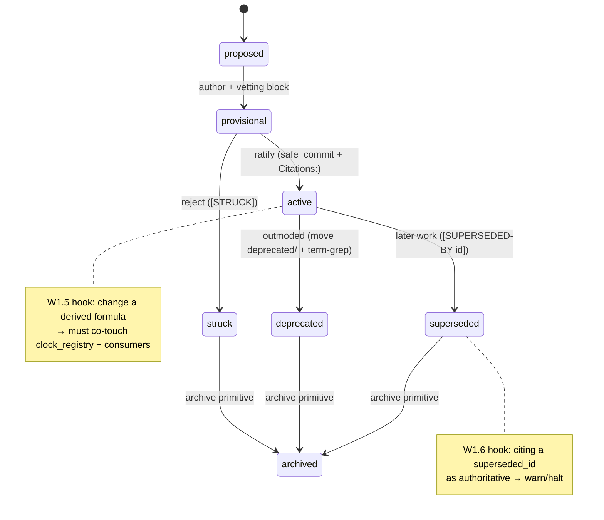
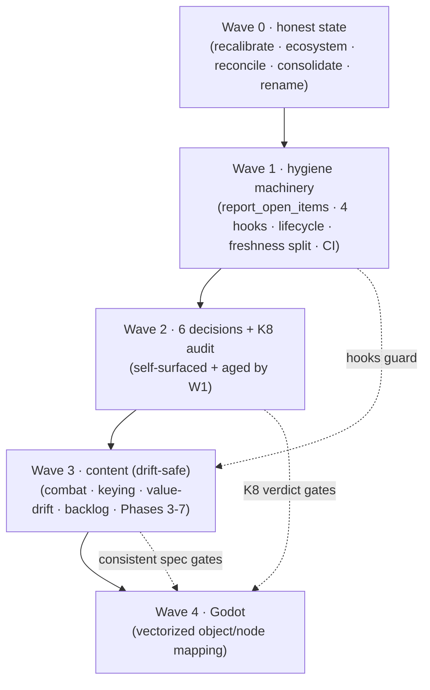

# Valoria — Master Workplan (Capstone)
**Consolidates and SUPERSEDES** `valoria_schematic_and_workplan.md` and `valoria_hygiene_methodology_and_rewrite.md` Part IV; folds the hierarchy map, wiring analysis, and F1–F3 proposal into one plan. **Status: APPROVED methodology + Waves 0–1 + K8 commission (Jordan 2026-06-06); execution PENDING (nothing committed this turn).**
`[SELF-AUTHORED — bias risk: synthesizes my own session output. Mitigation: §0 records a fresh-canon double-check that overturned two of my prior claims; every item carries a source handle for traceability.]`
**Read this session (grounding):** key_substrate §1–§8 · key_type_registry (full subtype list) · scale_transitions §3/§5 · settlement §1.8 · derived_stats §1/§3/§14 · stats_1_7 (resolver) · faction_layer_v30 · 02_canon_constraints P-01–P-15/GD-1-3 · roadmap_state · patch_register · editorial_ledger (635 entries) · supersession_register · freshness_gate.py · both handoffs · hook/ops function inventory.

---

## §0 — DOUBLE-CHECK CORRECTIONS (anti-pattern-match pass; these change the plan)
Re-verified the load-bearing claims against fresh canon. Two prior claims were **wrong** (pattern-matched from the stale roadmap); the rest held.

| Verified | Prior claim | Corrected truth (cited) | Effect on plan |
|---|---|---|---|
| **X1 faction resolver** | "open conflict — d+σ vs aggregate-pool, needs Jordan" | **RESOLVED.** d+σ (ED-874) ratified 2026-05-31 ("works well"), basis CK3/EU/KoDP; bare-stat pool SUPERSEDED. Roadmap "aggregate-pool + impl pending" (2026-05-29) is **stale**. | **X1 removed from decisions.** Add roadmap-reconcile (W0.4) + faction_layer prose propagation (W3.3). |
| **IDR ED-865/867 collision** | "pending Jordan renumber call" | **RESOLVED.** ED-865/866/868 [resolved]; 0 duplicate IDs; renumber to 874+ done. Only **ED-867** (add [SUPERSEDED-BY] markers) open. | **IDR removed from decisions.** ED-867 → W3.7 (mechanical). Roadmap-reconcile W0.5. |
| F2 unregistered types | 3 types absent | **CONFIRMED** — `scene.thread_operation`/`scene.draft_da`/`scene.combat_resolved` absent; `scene_entered` present. | F2/F3 stand → W3.4. |
| F4–F7 value drift | clock_registry stale vs derived_stats §14 | **CONFIRMED** (Composure ×3 vs +6; Stamina/Concentration June formulas; Intel restored). | → W3.6, R7 hook W1.5. |
| S1–S5 stale-state | next-PP/roadmap/ledger | **CONFIRMED** (PP→727; 55 open/0 dupe; items_done drift). | → Wave 0. |
| K5 token-undercount | gate undercounts ~35% | **CONFIRMED** (PI audit 4C.1; live). | → W0.1 (urgent). |

**Net:** the genuine Jordan-decision set shrank from 9 to **6** (F1 calibration, C2 type-form, Composure-name, OWN-4, OWN-5, D6) + K8 commission (already approved). The biggest lesson stands: content claims rot; verify against canon, never the roadmap.

---

## §1 — MASTER ITEM REGISTER (typed; every session concern, with traceability)
Schema per K4: `id · kind{fix|task|hook|epic|decision|audit} · sev · authority{M=mechanical-vetoable | J=Jordan} · blocked_by · source`. Sorted by wave. *(This table is the seed for the generated `report_open_items()` — W1.1; thereafter it is computed, not maintained by hand.)*

| ID | kind | sev | auth | item | blocked_by | source |
|---|---|---|---|---|---|---|
| W0.1 | fix | P1 | M | Recalibrate `context_gate` for Opus tokenizer (~1.35×) | — | K5 |
| W0.2 | task | P2 | M | Create `references/ecosystem_versions.yaml` (model/Godot/libs/API) | — | K5 |
| W0.3 | fix | P2 | M | Reconcile roadmap (items_done bump; ledger counts 55/0/0; next-PP→727) | — | S1–S3 |
| W0.4 | fix | P1 | M | Roadmap: strike stale aggregate-pool/impl-pending; confirm d+σ ED-874 canonical | — | §0/X1 |
| W0.5 | fix | P2 | M | Roadmap: strike stale IDR pending-decision; carry ED-867 only | — | §0/IDR |
| W0.6 | fix | P2 | M | Finish B6-strike corpus-wide | — | S5/OI-E1 |
| W0.7 | task | P1 | M | Consolidate 4 artifacts → in-repo `designs/audit/2026-06-06-architecture-map/`; supersede prior workplans | — | K1/K2/M-F |
| W0.8 | fix | P3 | M | Rename `scene_activated→scene_entered` (key_substrate §8.5) | — | F2/G2 |
| W1.1 | task | P1 | M | Build `report_open_items()` (union; typed; topological) | W0.3 | M-B/K1/K4/K6 |
| W1.2 | task | P2 | M | Status-Block integration + decision-aging line | W1.1 | M-E/K6 |
| W1.3 | hook | P1 | M | R2 emit-type-registered grep | — | M-C/K3 |
| W1.4 | hook | P1 | M | R4 derived-write guard (Mandate/Treasury/…) | — | M-C/K3 |
| W1.5 | hook | P1 | M | R7 value-formula co-file (derived_stats §14 → clock_registry + consumers) | — | M-C/K3/F4-7 |
| W1.6 | hook | P1 | M | Supersession-citation check (cite superseded_id → warn) | — | M-A/M-C/K7 |
| W1.7 | task | P1 | M | Lifecycle state machine wired to commit primitives | W1.6 | M-A/K7 |
| W1.8 | task | P2 | M | Roadmap auto-feed (post-commit items_done / `[ROADMAP-STALE]`) | W1.1 | M-E/K6 |
| W1.9 | task | P1 | M | Roadmap 2.4 freshness SHA-split (`canonical_freshness.yaml`; hot/cold) | — | M-D/OI-A2 |
| W1.10 | task | P2 | M | Roadmap 2.5 per-session-log subsystem (D5) | — | OI-A2 |
| W1.11 | task | P2 | M | Roadmap 2.6 CI subsystem (4 `ci_*.py` + 2 yml → L5 mirror) | — | OI-A2/OI-H4 |
| W1.12 | hook | P2 | M | M4 soft-warn (citation regex, non-halting) | — | OI-H2/D3 |
| W2.1 | decision | P1 | J | F1 Mandate-echo calibration (a/b/c or sim-first) | — | F1/G1 |
| W2.2 | decision | P2 | J | C2 `scene.thread_operation` form (new vs generalize) | — | F2/G2 |
| W2.3 | decision | P2 | J | Composure name confirm (Charisma vs Presence) | — | F4/G4 |
| W2.4 | decision | P2 | J | OWN-4 insurgency dissolution paths | — | OI-D1 |
| W2.5 | decision | P2 | J | OWN-5 defection cascade build | — | OI-D2 |
| W2.6 | decision | P3 | J | D6 scope-vocab unification | — | OI-H3 |
| W2.7 | audit | P1 | J | K8 perf-audit commission (§4.1 fan-out) | — | K8 |
| W3.1 | epic | P1 | M | Combat weapon-physics S2 (three-regime + wiring + grip + OOB/fatigue + re-baseline) | W2.7,W3.4 | OI-C1 |
| W3.2 | epic | P1 | J | Combat-v32 ratify (supersede combat_v30 §1–4; F3/N1/N3/N5) | — | OI-B1 |
| W3.3 | task | P2 | M | Propagate d+σ ED-874 into faction_layer_v30 prose | W0.4 | §0/X1 |
| W3.4 | task | P1 | M | Register `scene.combat_resolved`(C1)+`thread_operation`(W2.2); drop `draft_da`(C3); §9/subscriptions | W2.2,W1.3 | F2/F3 |
| W3.5 | fix | P1 | M | Reroute Domain-Echo Mandate→settlement L/PS; coordinate PP-675 | W2.1,W1.4 | F1/G1 |
| W3.6 | fix | P2 | M | F4–F7 co-file value-drift fixes (→ derived_stats §14 / combat_engine_v1) | W1.5,W2.3 | F4-7/G4 |
| W3.7 | fix | P2 | M | ED-867 add [SUPERSEDED-BY] markers | W1.6 | ED-867/OI-E3 |
| W3.8 | task | P1 | J | ED-868 collapse-loop recoverable bound (the WATCH loop) | — | ED-868 |
| W3.9 | epic | P2 | M | Editorial backlog (55 open) batched: naming/gap-fill/sim | W2.* | OI-F1-3 |
| W3.10 | epic | P1 | M | Phases 3–7 (strategic impl, 25 code defects, hygiene, drift, verify) | W2.4-5 | OI-A3-7 |
| W3.11 | fix | P3 | M | C-8 grain terminology · C-11 mode-framing (→PP-675) · C-10 knots TIER/TRUNC drift | — | C-8/10/11 |
| W3.12 | fix | P3 | M | Re-issue `engine_replacement_reconciled` register (reflect ED-865/866 resolved) | — | OI-E2 |
| W4.1 | epic | P1 | M | Godot substrate (Key Resources, registry autoload, KEY_LOG, CAUSAL_GRAPH) | W3.4,W1.* | OI-H1 |
| W4.2 | epic | P1 | M | Godot nodes (systems→nodes; actors→conviction-vector+armature; weapons→vector objects) | W4.1,W3.1 | OI-H1 |
| W4.3 | epic | P2 | M | Godot containers as typed resources; save=serialize Key log | W4.1 | OI-H1 |

---

## §2 — ITEM LIFECYCLE (the consistency engine; M-A)

**Rule:** an item never changes status by silent edit — only by a primitive that emits its flag. Supersession & freshness become *consequences of transitions*, hook-checked (W1.5/W1.6), not remembered acts. This is what makes "consistently flagged" true rather than aspirational.

---

## §3 — EXECUTION PLAN (wave by wave; each item fully specified)

### WAVE 0 — Make state honest & self-reporting *(approved; mechanical; do first)*
- **W0.1** Recalibrate `context_gate`: apply the Opus tokenizer factor so the 90% hard-stop is real. *Files:* `valoria_hooks.py` (token estimate). *Verify:* re-run gate on a known payload, compare to actual. *Why first:* a mis-calibrated gate can blow context mid-wave (the live K5 defect).
- **W0.2** `references/ecosystem_versions.yaml`: pin {Claude model + tokenizer factor, Godot 4.6, key libs, bootstrap-API assumptions}; register with `freshness_gate` as the **ecosystem tier**. *Verify:* freshness warns when running model ≠ pinned.
- **W0.3–W0.6** Roadmap/state reconciliation: bump `items_done`; set ledger counts to 55 open/0 dupe/0 partial (kills the 94-conflict ghost); next-PP→727; **strike stale aggregate-pool + IDR pending-decision** (replace with "d+σ ED-874 canonical 2026-05-31" + "ED-867 marker task only"); finish B6 corpus-wide strike. *Primitive:* `append_to_register`/`safe_commit` scope `infrastructure`. *Verify:* `report_roadmap` reflects reality.
- **W0.7** Consolidate the four `/outputs` artifacts into `designs/audit/2026-06-06-architecture-map/` (map + wiring + methodology + this plan); add `supersession_register` entries retiring the two prior workplan files. *Why:* closes K1/K2 — one in-repo source under freshness + co-file discipline.
- **W0.8** `scene_activated→scene_entered` in key_substrate §8.5 (pure rename to the registered type). *Verify:* W1.3 grep passes.

### WAVE 1 — Build the hygiene machinery *(approved; the inversion; ship each with `tests/hooks/`)*
- **W1.1/W1.2/W1.8** `report_open_items()`: union over roadmap(≠complete) + ledger(open/provisional) + patch_register(provisional) + handoff.next + supersession; typed + topological sort on `blocked_by`; fold into the Status Block with a decision-aging line ("oldest ⟐: N days"); post-commit roadmap auto-feed or `[ROADMAP-STALE]`. *Closes K1/K4/K6.*
- **W1.3 R2 hook** (grep design-doc emit-type literals vs `key_type_registry`; fail unregistered) · **W1.4 R4 hook** (flag direct writes to derived-value/aggregate names outside their formula doc) · **W1.5 R7 hook** (a commit touching a `derived_stats §14` formula must co-touch `clock_registry` + named consumers) · **W1.6 supersession-citation hook** (cite a `superseded_id` → warn/halt). *Each: `RuntimeError` message + `tests/hooks/`; update enforcement-spectrum table.* *Closes K3/K7; would have caught F1/F2/F4–F7.*
- **W1.7** Wire the §2 lifecycle into the commit primitives.
- **W1.9** Freshness SHA-split: `canonical_sha` → `references/canonical_freshness.yaml` (writer `freshness_gate.py`), drop `canonical_sources` off the hot path (12k→~5k); formalize hot/cold tiers. **W1.10** per-session-log subsystem (D5). **W1.11** CI subsystem (4 `ci_*.py` + 2 workflow yml = the Level-5 external mirror, OI-H4). **W1.12** M4 soft-warn citation regex.
- *Outcome: drift, supersession, freshness, ecosystem, and progress are now mechanical. Everything after is self-maintaining and self-reporting.*

### WAVE 2 — Decisions (shrunken to 6 + the approved audit) *(now surfaced & aged by W1.1)*
Proceed on the recommended resolution under "approve all" (logged Jordan-vetoable); the three flagged ⟐ most warrant your glance:
- **W2.1 ⟐ F1 calibration** — rec **(a)** fixed ±1 L on the scene settlement (let the saturating aggregate damp it; matches §5.5 Accord precedent), **sim-confirm** via the LPS-2e harness before canon. L-vs-PS: Legitimacy for governance/debate, Popular Support for mobilization.
- **W2.2 ⟐ C2** — rec **Opt 1**: one `scene.thread_operation` (operation_type in payload, all six ops); keep `meta.thread_woven` for the woven *result*.
- **W2.3 ⟐ Composure** — rec **Charisma×3** (per derived_stats §14, the value-taxonomy authority — the §14 figure is ×3; I did not separately verify that line's date, so the recommendation rests on §14's authority, not recency); reconcile clock_registry/contest "Presence/+6" as stale. *Flagged because it names an attribute — confirm Presence wasn't an intended rename.*
- **W2.4 OWN-4** — rec multi-path dissolution incl. **sponsor-withdrawal** (high-value). **W2.5 OWN-5** — rec build-as-specced **+ fragility-multiplier + suppression-brake**. **W2.6 D6** — rec approve the one ~10-entry scope set.
- **W2.7 K8** — commission the `§4.1` peninsula-scale fan-out perf audit (approved). Gates Wave 4.

### WAVE 3 — Content, now drift-safe *(each gated on its W2 decision; hook-guarded by Wave 1)*
- **W3.1 Combat weapon-physics S2** (in-flight handoff): three-regime derived physics on `mass`/`pob_frac` → wire the UNCONSUMED consumers (authority→HEFT/percussion/cut; MoI→act_cost/tempo/str_demand; eff_head→reach; edge→cut; leverage grip-modulated) → grip activation + dynamic switching → concentration error-onset → OOB/fatigue redesign → re-baseline. **Architecture:** weapon = vector data-object; physics outputs = read-only Derived Values (R4); resolver emits `scene.combat_resolved` (⇒ needs **W3.4**).
- **W3.2 ⟐ Combat-v32** ratify (supersede combat_v30 §1–4); close F3/N1/N3/N5 in the dedicated combat chat (confirm venue).
- **W3.3** Propagate d+σ ED-874 into `faction_layer_v30` prose (the roadmap "rewrite" residual — resolver is already ratified, this is propagation).
- **W3.4** Register `scene.combat_resolved` (C1, drafted) + `scene.thread_operation` (W2.2) via §10 Class-B (vetting → registry → emit/consume → subscription → PP-727); **drop** `scene.draft_da` (C3 — DA outcomes already keyed as `da.*`); bump §9 counts. *R2 hook (W1.3) now enforces.*
- **W3.5** Reroute Domain-Echo Mandate writes → settlement L/PS per W2.1; fold into / sequence after PP-675. *R4 hook (W1.4) now enforces.* Resolves **ED-542** (battle→echo propagation).
- **W3.6** F4–F7 co-file fixes: bring `clock_registry` + `complete_systems_reference` to `derived_stats §14` / `combat_engine_v1`; Composure per W2.3; propagate Intel-restored. *R7 hook (W1.5) now enforces.*
- **W3.7** ED-867: add `[SUPERSEDED-BY]` to `ners_verdict_faction` + `resolution_diagnostic_faction` (corrected P=0.070/0.010).
- **W3.8 ⟐** ED-868: add a recoverable bound short of extinction to the collapse cascade (the diagnosed-but-WATCH loop) — flag if the bound is structural.
- **W3.9** Editorial backlog (55 open) in clusters: naming (ED-643 Solmund grep-complete), gap-fills (ED-587/615/616/620/631/617/619/640/642/129 — each mechanical-tier, logged), sim-pending (run ED-131/295/539 on existing harnesses; verify-and-close ED-545/547).
- **W3.10** Phases 3–7: strategic impl (insurgency/defection per W2.4/W2.5/GD-3; faction resolver already ratified), 25 code defects, repo hygiene (4), reconciliation/drift (2), verify unread surfaces (1).
- **W3.11/W3.12** C-8 grain terminology pass · C-11 mode-framing (→PP-675) · C-10 knots TIER/TRUNC drift · re-issue `engine_replacement_reconciled` register (now that ED-865/866 are resolved).

### WAVE 4 — Godot implementation *(largest; gated on consistent spec + K8 verdict)*
- **W4.1** Substrate → Godot Resources: `Key` subclasses per family; `KeyTypeRegistry` autoload from the now-consistent registry; `KEY_LOG` typed-array Resource; `CAUSAL_GRAPH` sparse dict-of-sets; `§4.1` update rule as the single state-mutation path (subscriptions O(1)/async per the K8 verdict).
- **W4.2** Per-system nodes: each TIER-3 wrapper → a node with one resolve entry; actors → nodes carrying `personal_convictions[13]` + derived `armature_position[4]`; weapons/items → the vector data-objects from W3.1.
- **W4.3** Containers as typed resources (Pools computed; Derived Values read-only getters; Tracks/Clocks bounded mutators); save = serialize Key log.
- **Gate:** do **not** start G on any system whose Key types/resolver are still inconsistent (Wave 3) or before the K8 fan-out verdict (W2.7).

---

## §4 — WAVE DEPENDENCY GRAPH

**Critical path:** Wave 1 (machinery) is the load-bearing wave — it converts every downstream lane from a drift generator into a self-checking, self-reporting process. Godot (Wave 4) is reachable only behind a *consistent, hook-enforced* spec.

---

## §5 — ARCHITECTURE-ALIGNMENT CHECKLIST (run per content item in Wave 3/4)
Every system, existing or new, takes the same five-element shape, now hook-backed:
1. **Wrapper** = one resolver (dice-pool · d+σ · accounting · clock · armature-dot-product) → one Godot node, one resolve entry.
2. **Containers** = state in exactly one bucket (Pool recomputed · Derived read-only · Track bounded · Clock monotonic) — **R3**.
3. **Nested arrays** = fixed-shape, name-indexed (`impact_vector[4]`, `symbolic_dimensions[4]`, `convictions[13]`, derived `armature[4]`); provenance arrays (`causes[]`, `targets[]`) populated — **R5**.
4. **Keys** = the only inter-system channel; every emit type registered (**R2/W1.3**); no direct derived-write (**R4/W1.4**); cross-scale routed to the substrate level of derived aggregates (the Mandate rule).
5. **Node/vector mapping** = `Key`→Resource, system→node, registry→autoload, actor→conviction-vector node, weapon→vector object.
Plus: formula change → co-file (**R7/W1.5**); cite nothing superseded (**W1.6**); touches metaphysics/world/characters/tone → **stop, ask Jordan**.

---

## §6 — DECISION QUEUE (6 ⟐ + audit; X1 & IDR removed as resolved)
Under "approve all" I proceed on the recommended resolution (logged, Jordan-vetoable). Glance and veto any:
1. **W2.1 ⟐ F1** — fixed ±1 L on scene settlement, sim-confirm? (L=governance/PS=mobilization)
2. **W2.2 ⟐ C2** — new `scene.thread_operation` (keep `meta.thread_woven` for result)?
3. **W2.3 ⟐ Composure** — Charisma×3 (Presence/+6 = stale)? *(confirm no intended Presence rename)*
4. **W2.4 OWN-4** — multi-path dissolution incl. sponsor-withdrawal?
5. **W2.5 OWN-5** — defection build + fragility-multiplier + suppression-brake?
6. **W2.6 D6** — approve the one ~10-entry scope set?
7. **W2.7 K8** — perf audit commissioned (approved) — confirm scope (peninsula-scale `§4.1` fan-out at 60fps).

---

## §7 — VERIFICATION & PROVENANCE
- **Three-pass:** P1 catalog (this register) → P2 corrections (§0 overturned X1/IDR; F2/F3/F4–F7/S1–S5/K5 re-confirmed) → P3 below.
- `[PASS-3: complete — every item carries a verified source handle; the two pattern-matched errors (X1, IDR) are corrected and removed from the decision set; F2/F3 absences and F4–F7 drifts re-confirmed against the live registry/ledger; nothing asserted from the stale roadmap survives unflagged.]`
- **Grounded vs flagged:** all mechanical items trace to a `[READ:]` source this session. The one item I refuse to assert is **K8** (architecture fitness at scale) — empirical, commissioned not concluded. Composure-name and the F1 magnitude are flagged ⟐ despite "approve all," because they touch attribute identity / feel-calibration.
- **Next action on your word:** begin **Wave 0** as staged commits (one item per block: recalibrate → ecosystem manifest → roadmap reconcile → consolidate+supersede → rename), each through `safe_commit`/infrastructure primitive with co-file updates + `Citations:`, `CollisionError`→re-fetch+retry, `RuntimeError`→halt. Nothing commits until you say go.

---

## §8 — ATTRIBUTE SUBSTRATE & ENGINE-FRAMING AMENDMENT (2026-06-06, per Jordan design review)
Adjudication grounded in `params/core.md` + `params/bg/core.md` (read this session). Disposition: necessity-questioned, adversarially reviewed, non-sycophantic. Consolidated here (no new artifact, per K2/M-F).

### Confirmed structural points (Jordan correct; map corrected)
- **Core engine ⊥ attributes — AFFIRMED.** `params/core.md` = resolution kernel only (die rule, TN, Ob, degrees, continuous-engine, momentum); no attribute roster. Engine resolves pool `N` → degree; pool-assembly is a wrapper concern. **Map fix:** the prior "universal resolver Pool=(Primary×2)+H" conflated wrapper-level assembly with the engine. Tier-0 engine is attribute-agnostic; attributes (Tier 2) are wrapper inputs (Tier 3).
- **No single universal resolver — AFFIRMED.** Discrete-pool & continuous-Normal are "interchangeable specifications of the same distribution" (Decision E); d+σ (ED-874) is a distinct resolver for the small-pool faction regime the pool-Normal can't serve (WS-D-1/ED-836). **Ruling:** one *engine concept* (resolve → degree via regime-appropriate method), three **regimes** (discrete-pool / continuous-Normal / d+σ-leverage). Caveat: a dispatcher over three resolvers, not one formula.
- **No master attribute list exists — CONFIRMED** (not in core; scattered). Root cause of mind/social roster churn + "edit every script" cost.
- **×3 multiplier = implicit aggregate — diagnosis CORRECT** (no Body/Mind/Social aggregate; `Str×3` ≈ sum-of-3-body; the drift is the cost of ad-hoc multipliers).

### Proposal adjudicated
**Attribute Registry + key-indirection — ADOPT (necessary).** The attribute analog of the Key Type Registry; completes the existing vectorized-node pattern (actor node already carries the 13-Conviction vector + armature; attribute vector is another name-indexed vector). Source-of-truth table (key·name·category·scale·default); systems bind by symbolic key → change/extend/rename in one place, no script edits. **Necessity PASSES** (broad real coupling + real drift + stated requirement; same justification as the Key registry). **Alternatives rejected:** constant-table (no remap), fold-into-Key-substrate (attributes are state not events — breaks four-bucket discipline), aggregate-only calls (too coarse — combat needs Strength not Body). **Required guardrails:** bind-at-load not per-frame (perf/K8); reverse-index (don't hide blast-radius); name-indexed (adding an attribute can't break consumers).
**Body/Mind/Social aggregates — OPTIONAL (Jordan's call, not necessary).** Drift already covered by W1.5; aggregates are an elegance/extensibility gain, net-simplifying only if they REPLACE the per-stat multipliers. If adopted, they dissolve Composure (W2.3) and rationalize Stamina/Concentration.
**Specific roster — Jordan's, deliberately in flux; the registry de-risks churning it. No action.**

### Workplan deltas (consolidated into §1/§3/§6)
| ID | kind | sev | auth | item | blocked_by | source |
|---|---|---|---|---|---|---|
| W1.13 | hook/task | P1 | M | **Attribute Registry** (companion to core): table + key-binding + reverse-index + bind-at-load; `tests/` | — | §8/Jordan |
| W1.14 | task | P2 | M | Adopt "resolution kernel + 3 regimes" framing (doc); optional regime-dispatcher reification gated by K8 | — | §8/Jordan |
| W2.8 | decision | P2 | J | ⟐ Adopt Body/Mind/Social aggregates? (if yes: derived-values → aggregates, multipliers retire) | W1.13 | §8/Jordan |
- **W3.6 RESHAPED** — F4–F7 fixes route THROUGH the attribute registry (+ aggregates if W2.8=yes): migrate derived-value *definitions* onto the registry, not patch `clock_registry` ad-hoc. Root-cause fix. blocked_by += W1.13.
- **W2.3 → blocked_by W2.8** — Composure auto-resolves if aggregates adopted (= Social aggregate); else the Charisma×3-vs-Presence+6 call stands.
- **Necessity ledger:** Registry = NECESSARY. Reverse-index + bind-at-load = NECESSARY guardrails. Aggregates = OPTIONAL (W2.8). Kernel-regime framing = ADOPT (free); reification OPTIONAL/K8-gated. Roster = Jordan's, de-risked.

### Decision-queue addition
8. **W2.8 ⟐** — adopt Body/Mind/Social aggregates (optional; collapses Composure W2.3 and the ×3 multipliers into category-derived values)?

### §8.1 — W1.13 scope expansion: Attribute Registry -> DESCRIPTOR REGISTRY (2026-06-06, Jordan)
W1.13 broadens from "attributes" to **all qualitative characteristics carrying an engine-processable quantitative value/weight**, bound by key:
- attributes (scalar 1-7) [+ Body/Mind/Social aggregates if W2.8=yes]
- the 13 Convictions (vector weights, 0-1)
- the 4 ethical axes (signed basis) + the CONVICTION_AXIS_MATRIX (13x4 projection) as a registered mapping
- Self-Other Orientation (scalar [-1,+1])
- resonance styles [GAP: confirm canonical source/definition]
- etc. (any future quantified quality)

**Each entry typed by KIND** {attribute_scalar | conviction_weight | ethical_axis | orientation_scalar | resonance_style | ...} so consumers read each correctly.
**Couples to the Key substrate:** the registry DEFINES the descriptor space (vector bases); Keys carry INSTANCES (impact_vector[4], symbolic_dimensions[4], convictions[13], armature[4]). Companion to BOTH core (engine) and key_substrate (vectors). Operationalizes key_substrate §0.3 (5th axis / 14th conviction = a registry entry, not a code edit).
**Necessity:** stronger than the narrow version — removes hardcoded convictions/axes/matrix scattered across substrate + armature + NPC-interpretation sites. Same indirection benefit (name-indexed, one-place change, bind-at-load, reverse-index) applied to one coherent class.

### §8.2 — Descriptor-registry candidate inventory (W1.13 scope; grounded scan 2026-06-06)
Grounded: derived_stats_v30 §4/§5/§14, conviction_taxonomy_v30 §2/§3/§5, conviction_axis_matrix_v30 §2, settlement_layer_v30 §1.8, territory_temperaments_v30 §3.4.1, social_contest_v30 step2-3, player_agency §2 (pointer).

REGISTRY DESCRIPTORS (collate into the Descriptor Registry, typed by KIND):
- attribute_scalar: personal attrs (Endurance, Charisma, Focus, Spirit, Agility, Cognition, ... roster in flux; Recall being removed); faction stats (Influence, Wealth, Military, Intel, Stability; Mandate is DERIVED); settlement stats (Prosperity/Defense/Order 0-5; Legitimacy/PopularSupport 0-7); unit (Discipline, Command, Morale, Size[computed]).
- conviction_weight: the 13 Convictions (Faith, Authority, Order, Scholastic, Utility, Equity, Liberty, Precedent, Community, Identity, Warden, Virtue, Honor), vector-valued, at personal AND faction scale (personal_convictions + effective_convictions).
- ethical_axis: hierarchical, sacred, instrumental, traditional (projection basis).
- conviction_axis_map: the 13x4 CONVICTION_AXIS_MATRIX ([-1,+1]) as a registered mapping.
- orientation_scalar: Self-Other Orientation [-1,+1] (orthogonal to convictions).
- resonance_style: Resonant Styles, Conviction-derived (player_agency §2 — enumerate members).
- contest_style: Precedent/Suppression/Vision/Insinuation (Memory/Projection x Revealing/Obscuring) -> style bonus die.
- temperament_type: the 5 territory temperaments (traditional, principled, ...) -> alpha (outcomes) + beta (conduct) weights; faction effective temperament = population-weighted avg.
- (template): Cultural Background Templates (named conviction-distribution presets).

NOT registry descriptors (Tier-1 runtime containers per derived_stats §14 - computed/bounded FROM registered descriptors, not base inputs):
- Derived Values (§14.1): Health, Stamina, Composure, Concentration, Thread Fatigue, Resolve, Garrison Strength, Local Economy (Stat x multiplier). NOTE: the §14.1 DERIVATION SPECS (which attr x what multiplier) ARE registry-adjacent data -> where W2.8 aggregates land; holding them as registry data makes the x3 multipliers data-not-code.
- Tracks (§14.2): Piety, Disposition, Renown, Standing, Persuasion (bounded counters).
- Clocks (§14.3): Evidence, CI, MS, IP (monotonic).
- Pools (§14.4): Combat/Argue/Thread/Fieldwork/Knot/MassCombat/FactionDomain (computed at action time).

SCOPING -> new decision W2.9: equipment+environment descriptor tables (weapon stats: damage/reach/weight; terrain modifiers; mass-combat formations) fit the "qualitative quality with quantitative value" definition but attach to gear/world, not actors. ONE registry mechanism partitioned by DOMAIN (actor/settlement/equipment/environment) vs parallel registries. Recommend: one mechanism + domain field (indirection benefit everywhere; domains legible).

RESONANCE-STYLES GAP: partly resolved. Resonant Styles are canonical + Conviction-derived (derived_stats §5.3 / player_agency §2). Residual: read player_agency §2 to enumerate the style set + the Conviction->style rule.

Decision-queue additions:
9.  W2.9 - descriptor-registry DOMAIN scope: one mechanism partitioned by domain vs parallel registries (recommend one + domain field).
10. (read) player_agency §2 to enumerate Resonant Styles before W1.13 build.

### §8.2-note (2026-06-06) — resonance_style is a DANGLING reference
Read of player_agency_v30.md (the derived_stats §5.3 pointer target) found NO enumeration or
definition of Resonant Styles. The term is referenced as Conviction-derived but never specified.
GAP (Jordan): define the Resonant-Style members + the Conviction->style rule, OR mark vestigial.
resonance_style remains a PLANNED registry KIND in §8.2, not yet buildable.
