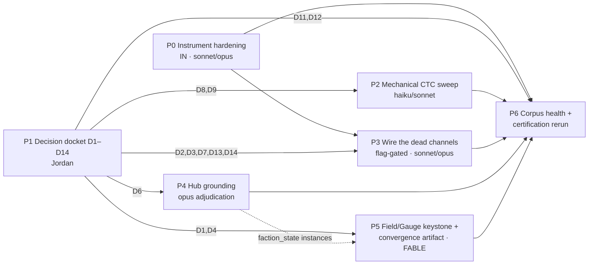

# Observatory Remediation Program (v1) — the Resolve-Everything Plan

## Status: PROPOSED — 2026-07-14 · Lane: IN (program umbrella; execution fans to FA/SC/SE/WR/PC/MB/GO/IN) · ED-IN-0065

> **Fable-authored** (CLAUDE.md §10 / doctrine ED-1083 §4 — the aggregate-up/distribute-down + termination
> artifact is the reserved top-of-stack node this program sequences). **Merging this PR ratifies the program
> structure and sequencing ONLY (ED-1094).** Every design ruling inside is **HELD-BACK** in the Phase-1 decision
> docket (D1–D14, §4) and remains `needs_jordan` until explicitly picked — this banner is the loud exception.
> Companion to the merged ED-IN-0064 docket; where a classification here conflicts with `gap_register_v1.md` +
> `adversarial_review_v1.md`, those govern.

**Mandate (Jordan, 2026-07-14):** investigate all issues the observatory surfaced (e.g. unbuilt wiring) and
resolve everything — starting from "what improvements can we make to the vector-audit skill and its scripts."
The investigation is complete (ED-IN-0064, five adversarial passes). This is the resolution program.

---

## §0 · What "resolved" means (the trichotomy) + scope-outs

Per the repo's forward-only disposition discipline, every identified issue is resolved by exactly one of:

- **(a) EXECUTED** — the fix lands in canon/code with tests and a moved meter;
- **(b) RULED** — Jordan picks; the ruling is ledgered and the item closes by decision;
- **(c) CLASSIFIED** — explicitly working-as-intended or deferred-with-an-ED (never silently dropped).

**Scope-outs (named, not forgotten):** the Godot port execution itself (governed by
`godot_conversion_strategy_v1.md`; this program clears its *canon* blockers — doc:null, resolvers, typed values —
not the GDScript spine); the A18 params-prose formula extractor (deferred WS, recommended ED below); Stage-7
discourse overlay (stays reserved); the 2-bit echo quantizer (working-as-intended per PP-329 pending D10); master
workplan restructuring (this program *feeds* the navigator, it does not fork M1 — §12).

---

## §1 · Organizing principles

1. **Instrument-first, meter-anchored.** Phase 0 hardens the observatory so every subsequent fix is a *machine
   meter moving*, not a hand-assertion. The program ends (Phase 6) by re-running the same audit that found the
   issues — the instrument that opened the case certifies its closure.
2. **Rulings front-loaded.** One consolidated decision docket (Phase 1) so no execution track stalls mid-flight.
3. **Flag-gated wiring.** Every behavior-changing wire lands default-OFF with byte-exact regression, per the
   ECHO_TRANSPORT precedent (ED-IN-0028 → Jordan flips ON). Merge never silently activates gameplay change.
4. **Reuse-not-refile.** Items already owned by an ED (ED-FA-0002, ED-SC-0006/0007, ED-IN-0048/0049, ED-SE-0005/
   0006, ED-1051, ED-MB-0010, ED-IN-0063 residuals) are *sequenced here, executed there* — no duplicate filings.
   Phases map onto the existing repo-realignment workstreams (WS0b/WS1/WS2/WS3) rather than a parallel taxonomy.
5. **Guardrails binding on every lane** (ED-1083 §2): implement the local rule only; declared I/O only; never
   special-case an entity/outcome (scripting drift); never grow a scale-local dialect (shape divergence). Plus:
   F1 (no aggregate written directly), single-writer at Accounting, anti-fabrication (§5/§7 — every constant
   carries PP/ED provenance, hand-verified; the gate is leaky), regenerate-never-hand-edit for generated graphs.

---

## §2 · Phase map

P0 ∥ P1 start immediately; P2 needs only D8/D9; P4 can start after P0. Critical path: **P1(D1) → P5 → P6**.

---

## §3 · Phase 0 — Instrument hardening (the vector-audit skill improvements)

The direct answer to "what improvements can we make to the skill and its scripts," informed by running it end-to-end:

| # | Item | What / why | Closes |
|---|---|---|---|
| P0.1 | **Execute ED-IN-0063 residual batches** | The known script defects: **G_code `__init__.py` relative-import misresolution** (HIGH — inflates the 87-orphan list and drops a cycle; *no dead-code triage until this lands and orphans are re-derived*); `vector_audit.banner_classify` status-first tie-break (fixed in gen_audit, left live here); `formula_audit` Mandate paren-variant normalization; §8 re-parse duplications; missing tests (`test_vector_audit.py`, pointer run()-level, determinism). | ED-IN-0063 |
| P0.2 | **Contract↔code join** | Add the `mechanics_index.yaml sim_module:` join to `structure_audit` so the 27 contracts map to G_code modules (3/27 → 27/27 mapped-or-explained; correspondence flag flips from UNVERIFIED). Side-effect: refreshes the stale mechanics-index family. | GAP-I4 |
| P0.3 | **New layer: `direction_audit.py` (G_direction)** | Mechanize what ED-IN-0064 hand-authored: the 16×6 directional matrix; machine `!A6`-seam diff vs `scale_transitions §12.4`; **caller-liveness** (zero-caller detection for declared cross-scale resolver entry points — the `compute_accord_echo` class); **`causes[]`-population meter** (currently 0). Register in `audit_staleness.FAMILIES` + the registry enum. "Double-check in all directions" becomes a rerunnable meter. | GAP-DIR-* verification |
| P0.4 | **structure_audit closures** | Dangling-emit × registry-declared-consumer cross-check (separates the `combat_felled` class from the `env.crisis` class); registry emitter-reality census over all 49 types (the `meta.legacy_event` class); string-wiring pre-check before orphan verdicts (adapters wire by string). | GAP-C taxonomy |
| P0.5 | **L0 corpus scope** | Derive the L0 corpus from `gen_audit`'s LIVE partition ∪ foundation (reuse, §8 — one currency rule) instead of the hardcoded 10.3% slice; report coverage % in the scorecard header. Implement Stage-0 pilot; Stage-7 stays explicitly reserved. | coverage disclosure |
| P0.6 | **gen_audit widening** | Lift the `designs/`-anchor in `ci_generation_consistency.DOC_KEYS` (the one home) so `params/`/`canon/`/`references/` heads can be LIVE; fix the DOC_KEYS key-name regex blind spot tool-side. | capstone #9/#11 |
| P0.7 | **Automation** | `audit-refresh.yml`: add scheduled report-only vector+structure refresh job; fix the stale "stub" header comment; refresh decisions-digest (stale family). | staleness banners |
| P0.8 | **Tests** | Agonist/antagonist pair per new layer (§10); PYTHONHASHSEED determinism pins; keep the "measures, never gates" contract. | observatory discipline |

*Recommended-and-deferred (explicit, not silent):* **A18 params-prose extractor** (typed engine-params generation
from prose tables, round-trip-checked — the §5 pipeline gap). File as its own IN ED when picked up; this program
does not pretend to include it.

---

## §4 · Phase 1 — the decision docket (all HELD-BACK; recommendations attached)

| ID | Decision | Recommendation |
|---|---|---|
| **D1** | **OF-3 `decay()`** — the one ruling gating the keystone | Ship `Field.decay_fn` as a template library `{none, linear, homeostat, hysteresis}` seeded from the three live exemplars (MS hysteresis, Turmoil counters, Π homeostat); per-quantity assignment table lands PROPOSED in P5.2 for ratification. |
| **D2** | **Accord-echo composition** (wiring `compute_accord_echo` naively risks the D.6 double-count) | F1-lawful design: echoes never write Accord; they enter as a bounded **event-modifier term in the Accord derivation**, read from KEY_LOG at Accounting (the AU-4 pattern) — `Accord = floor(mean Order) + clamp(Σ echo_deltas, ±cap)`. Single writer preserved; each scene outcome counted exactly once. |
| **D3** | **`propose_transfer` activation** | Wire behind `PARL_TRANSFER` default OFF; Jordan flips after a seeded 30-season sim shows no degenerate territory churn. |
| **D4** | **GAP-G2 non-scalar state** (npc beliefs/opinions/arcs) | Keep OUT of the scalar registry; add a typed *structured-state* section to `descriptor_registry` (schema-only) so `pointer_audit` classifies it registered-structured, not debt. |
| **D5** | **GAP-J1 "Piety Track" 3-way collision** | Rename territorial display to "Territorial Conviction (CV/CI)"; "Piety Track" reserved for personal; alias entries in `names_index`. |
| **D6** | **GAP-J3 dual-emit attribution** (scene.dialogue, scene_entered, belief_revised) | Registry is authoritative; contracts updated to match; per-type table lands with the P4 hub PRs. |
| **D7** | **GAP-C4 `env.crisis` consumer** | Confirm `settlement_layer` + `faction_state` per `peninsular_strain §2.6` crisis/collapse penalties; stat_deltas at Accounting. |
| **D8** | **ED-MB-0010** fabricated emit | Confirm deletion of the `scene_outcome.battle_concluded` contract line (the real emit stays). |
| **D9** | **Retirements** | Execute ED-SE-0005 (`settlement_economy` → fold into settlement_layer) + retire `campaign_architecture` (stub; content distributes). 27 → 25 modules. |
| **D10** | **The 2-bit echo quantizer** | Confirm working-as-intended (PP-329 anti-compounding). Optional later: the degree→delta table is data, so richer magnitude transport is a knob, not a rebuild. |
| **D11** | **Convictions first-class doc** | Approve authoring the 7-Conviction definitions doc + throughline substantiation (GAP-H4 — this is what flips the P2 validation failure; corpus fix, never threshold tuning). |
| **D12** | **P1 foundation-periphery criterion** | Approve *investigating* it as a possible v4 methodology revision with its own justification — explicitly not tuning a run to pass. |
| **D13** | **`handoff_rules.py` disposition** | Either de-orphan (route echoes through it — satisfies §8 one-home) or demote to reference + fold content into `scale_transitions §3`. **Recommend demote** (echo_transport is the live, tested path; smaller blast radius). Genuinely Jordan's architecture call. |
| **D14** | **§3.3 Personal→Contest handoff body** (ED-IN-0049) | Approve authoring (small GENUINE; the one empty handoff). |

---

## §5 · Phase 2 — mechanical CTC sweep (no rulings needed beyond D8/D9)

`engine_clock` pointer flip (ED-1051 — home `propagation_spec_v1 §O.2` is CANONICAL; doc:null −1) ·
**`targets[]` batch for the 8 §12.4 down-seams** + §12.3 tests (module-adjudicator A6: 20 type-edge violations → 0) ·
`piety_track.scales += scene` (kills the 9th pseudo-seam, WS2) · `canonical_sources` registrations
(conviction_track_v1 per ED-IN-0048 — verify body-status first; the 4 key-name misses: social_contest, march_layer,
settlement_adjacency, fractional_province_ownership) · `combat_v30` currency-drift repoint → `combat_engine_v1/` ·
vocab-debt sweeps (Coup Counter 57/13 docs — the big one; Cultural Reformation 23/9; Game Master 21/8; PP-678
workflow) · CLAUDE.md §6 refresh (9 doc:null / 13 `[ASSUMPTION]` + the stale audit-refresh comment) ·
`faction_politics` state-block extraction (GAP-K1) · ED-MB-0010 emit deletion (post-D8) · retirements (post-D9) ·
pointer Category-A remainder + combat scalars (GAP-G1; gated on the ci_names_consistency mirror) · dead-citation
triage (5 nonexistent) + 10 mechanical restructure repoints · **MS contract owner** — add the drafted
`substrate_state`/peninsular entry emitting `env.ms_delta`, pointing at the existing PP-255 decay (GAP-F1; loud
PROPOSED-contract flag in its PR).

## §6 · Phase 3 — wire the dead channels (flag-gated, ECHO_TRANSPORT pattern)

- **Accord echo** per D2 (property test: one scene outcome → exactly-once Accord effect across echo+recompute).
- **`propose_transfer`** per D3 (`PARL_TRANSFER` OFF + churn test) — the political loop can finally move territory.
- **The first `causes[]` diagonal exemplar** — wire `compute_thread_echo` at Thread-op resolution, populate the
  `causes[]` chain, substrate chain-walk test; armature's "zero executable instances" line updated. After one
  exemplar, further diagonals are CTC (the P0.3 meter tracks population).
- **`handoff_rules` disposition** per D13 + **§3.3 body** per D14.
- **`env.crisis` consumers** per D7. `mechanical.season_change`: classify as broadcast/ambient with a registry
  annotation + adjudicator exemption class (or wire an explicit consumer — classify, don't leave orphan).
- Combat's dead emits (`combat_felled`/`combat_resolved`): consumers land **with the P4 hub PRs**, exactly as the
  contract's CONSUMER-WIRING note prescribes.

## §7 · Phase 4 — hub grounding (the two `[ASSUMPTION]` integration hubs)

`faction_state` (in-13) and `npc_behavior` (in-12): extract their accounting procedures into verifiable specs
(d_sigma-contested per ED-874; Procedures B–E), sim parity tests, adjudicator flips `[ASSUMPTION]` → grounded;
loop dampers annotated on **both** sides of npc↔contest (GAP-C3); dual-emit table per D6; combat-emit consumers
land here. Then **P4.3**: the remaining 11 `[ASSUMPTION]` markers swept with the same pattern (each grounded or
explicitly ED-ruled). Opus-tier module-adjudicator work; Fable only on an evidence-based upgrade trigger.

## §8 · Phase 5 — the keystone: Field/Gauge + decay + convergence (the Fable nodes)

The reserved artifact (doctrine ED-1083 §4). Not blank-slate: the schema is **already PROPOSED**
(`governance_type_registry_v1 §4.2`: `aggregate_fn / propagate_fn / decay_fn / derived_flags`) and the saturation
kernel **already ships** one scale down (`sigma_leverage.py` weighted-sum → tanh soft-cap → scale-invariant).

- **P5.1** `sim/substrate/fields.py` (companion to `keys.py`); ratify the Field schema; lift σ-leverage's
  `soft_cap` as the shared saturation library (§8 reuse — import, don't copy).
- **P5.2** Instance migration of the ~27-rule census: aggregate-up (Mandate, Accord, Treasury, National Influence,
  CI Piety-Yield, IP, Turmoil, `agg.*` wiring decision), distribute-down (Mandate→L/PS; CI≥80→PT; Turmoil→Accord
  force; governance-type cascade stays doctrine until the Territory tier lands), decay assignments per D1's table.
  **Byte-exact acceptance:** re-homing an unchanged formula must not change a single sim output (regression-pinned).
- **P5.3** **The termination/convergence artifact.** Per-tick fixpoint and per-cascade termination are already
  proven; the cross-tick proof strategy is now available *because of* D1 and D2: the **D2 single-writer ledger-fold
  eliminates the D.6 double-count**, and the **decay/mean-reversion terms supply the contraction** that turns
  bounded oscillation into convergence toward a (shock-tracking) fixpoint — which is precisely why the armature
  deferred `decay()` "to when cross-tick convergence work actually starts": they are one artifact. Property tests:
  seeded shock schedules, single-count invariants, amplitude decay; ablation runs.
- **P5.4** **The collision primitive** (GAP-E1/E2): unify the four radiation systems (MS distance-falloff +
  hysteresis, Calamity distance-band, Turmoil↔Accord coupling, Π homeostat) as Field `propagate_fn/decay_fn`
  instances; add the two-signal collision model (material threshold ∧ interpretive trigger) as a Field composition.

Fable authorship with opus adversarial verification; **checkpoint discipline** (each sub-artifact committed
standalone) so a Fable usage-limit hit never orphans the work — the ED-IN-0063 lesson.

## §9 · Phase 6 — corpus health + certification rerun

Author the Convictions doc (D11 → flips P2) · run the D12 P1-criterion investigation (methodology v4 only with
its own justification) · **full observatory rerun** into a new dated folder — the certification: registry append,
staleness families green, navigator board refresh, CURRENT.md rows for the new heads (fields spec, Convictions
doc, domain_actions home from the FA lane).

---

## §10 · Acceptance scorecard (machine meters; before → target)

| Meter | ED-IN-0064 baseline | Program target |
|---|---|---|
| L0 validation gate | **FAILED 1/3** | ≥ 2/3 (P2 via D11; P1 via D12 investigation) |
| `doc:null` modules | 9 | **0** (authored / pointer-flipped / retired / ED-annotated authoring-time) |
| `[ASSUMPTION]` markers | 13 | **0 unruled** (grounded or ED-ruled) |
| `!A6` seam violations (type-edges) | 20 | **0** |
| Dangling emits | 4 | **0** (1 deleted, 2 wired, 1 consumed; season_change classified) |
| Zero-caller cross-scale resolvers | 3 | **0** (flag-gated wirings) |
| `causes[]` populated instances | 0 | **≥ 1** exemplar + chain-walk test |
| G_pointer resolution | 52.7 % | **≥ 90 % or classified** (D4 resolves the structured-state block) |
| Contract↔code join | 3/27 | **27/27** mapped-or-explained |
| L2 modules | 27 | **25** (retirements) |
| Import-orphans | 87 *(pre-P0.1; inflated)* | re-derived, **fully dispositioned** |
| Cross-tick convergence | unproven (bounded) | **artifact ratified + property tests** |
| Directions live end-to-end | 2 of 7 | **6 of 7** (temporal closes with D1/P5; all six spatial live) |

## §11 · Risks

**D.6 double-count if D2 is mis-implemented** (mitigation: the exactly-once property test is the PR gate) ·
**Fable metering** (checkpointing, §8) · **scripting-drift** on infill lanes (ED-1083 §2 guardrails in every PR
template) · **fabricated constants** (leaky gate — provenance hand-verified per §5/§7) · **merge collisions**
(lane-scoped PRs; id_reservations protocol; the IN dup-key class is now watched) · **byte-exactness** in P5.2
re-homing (regression pins) · **flag flips are ratifications** (each ON-flip is its own loud ED-1094 moment).

## §12 · Workplan & workstream reconciliation

This program **feeds** M1, it does not fork it: the workplan's own next action ("FA decision-surface J-5 + author
the `domain_actions` module home") **is** this program's GAP-A1/ED-FA-0002 — the FA lane executes it inside its
juncture; this plan just sequences around it. Phase 0 extends **WS0b**; pointer items extend **WS1**; the scales
fix is **WS2**; gen_audit/v40 items are **WS3**. The navigator refreshes the board on next use.

## §13 · Sizing & tiering

≈ **16 lane-scoped PRs / ~8–12 sessions.** P0: 2 PRs (sonnet build / opus verify) · P1: 1 docket + a Jordan pass ·
P2: 2 PRs (haiku/sonnet) · P3: 3 PRs (sonnet code / opus review) · P4: 3 PRs (opus, module-adjudicator) ·
P5: 3 PRs (**Fable** authorship, opus verification) · P6: 2 PRs. Per §10, Fable appears only at the reserved
nodes (P5.3/P5.4 and this plan); everything else tiers down.

---

*Disposition: this plan is ED-IN-0065 (open, needs_jordan — the D1–D14 docket). Every issue enumerated in
ED-IN-0064 resolves through exactly one phase above or a decision row; nothing is silently dropped.*
