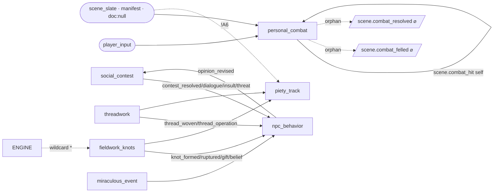
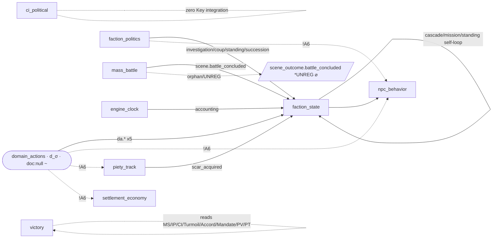
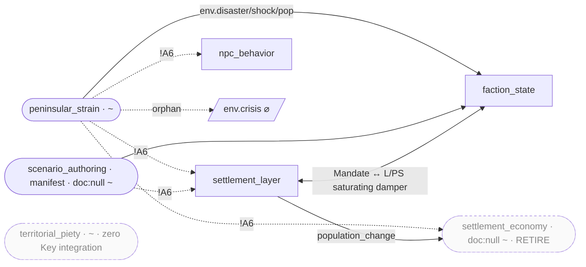
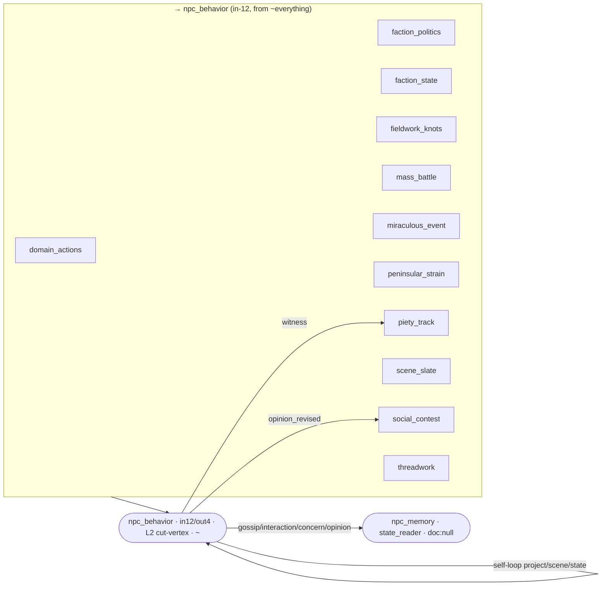
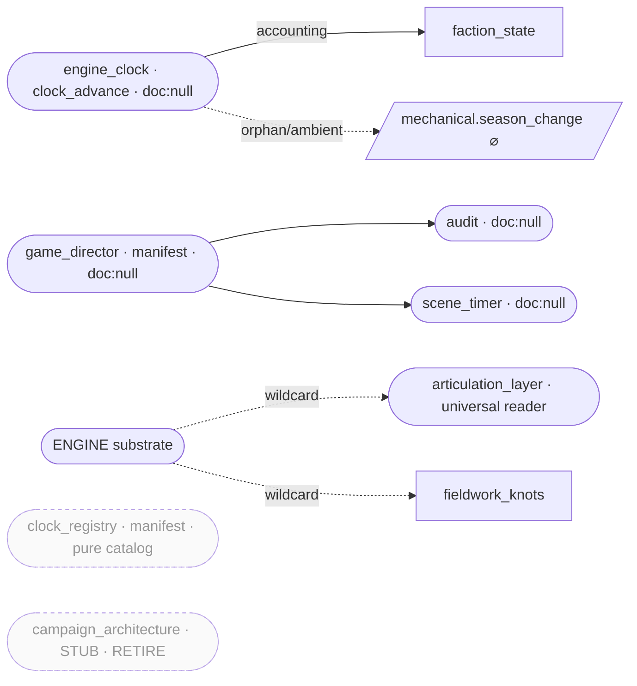

# Gameplay-Subsystem Observatory — Inventory · Shape · Connectivity · Gaps (v1)

## Status: FILED — 2026-07-14 · Lane: IN (cross-cutting SC/FA/SE/WR/PC/MB/FI/GO) · ED-IN-0064

> ⚠️ **Correction layer — `adversarial_review_v1.md` + `directional_coverage_v1.md` are authoritative where they
> conflict with this file.** The adversarial gate reclassified **two GENUINE items to COMPLETE-THE-CHAIN**: **GAP-F1
> (`MS`-owner)** — `MS` is already ticked in the sim (`params/core.md` PP-255 → `sim/peninsular/ms_track.py` →
> `accounting.py:61`); the gap is only that no *contract* declares ownership, so the fix is determined, not genuine —
> and **`engine_clock`** (GAP-A3) — its home doc `propagation_spec_v1.md` is CANONICAL with a drafted contract, only
> the pointer-flip pends ED-1051. The true GENUINE surface is therefore small: `domain_actions` home (leaning CTC),
> `env.crisis` consumer (leaning CTC), plus the **directional** genuine gaps below. The directional double-check
> (§8) found that "the 20 `!A6` seams are annotation-debt" is correct **only for the two down directions** — the
> **diagonal** direction has *zero executable instances*, and Accord-echo / territory-transfer / the handoff
> dispatcher are *built-but-uncalled*. Also corrected: ED-IN-0016 is dated **2026-07-05**, not 07-08.

> **Analytic instrument, not a design act.** This docket indexes and graphs the live corpus; it flips no
> `## Status:` line, wires no inert field, and authors no fix into canon. Every proposed fix is **HELD-BACK**
> (ED-1094) — the disposition table (§7) hands each finding to a lane as a filed ED or an explicit no-action
> line. Self-exempting on Ω/Μ vetting (Class A, `mu: []`, M-ratings ○ — see `00_workplan.md`).
>
> **Findings are LEADS, not verdicts.** The L0 `vector_audit` validation gate **FAILED (1/3)** on today's
> corpus (§0). Per the skill's methodology §3.8 a failed gate downgrades every finding to a lead; that framing
> is carried through every section below. The L1/L2 layers (`structure_audit`, `pointer_audit`,
> `formula_audit`, `gen_audit`) **measure, never gate** — their numbers are exact, but "exact" ≠ "ruling."

**What this is.** Jordan asked to run the vector audit and, for each gameplay subsystem, inventory and graph it
to show the **shape of code architecture**, then **connectivity**, then **gaps**. This is the whole-corpus run
(the vector-audit family became the repo's #1 stalest audit — 305 files since the 2026-04-29 baseline) widened
into a per-gameplay-subsystem architecture map. It composes two graph substrates:

- **L0 prose graph** (`vector_audit.py`) — the corpus-wide structural-debt backdrop over 110 design docs / 176
  tokens (hubs, isolates, implied-missing, cascades, vocab-debt). Its findings are **routed** to whichever
  subsystem owns each token.
- **L1/L2 architecture graph** (`structure_audit.py` G_code AST import graph + the `module_contracts.yaml`
  producer→consumer wiring, plus `pointer_audit`/`formula_audit`/`gen_audit`) — the **"shape of code
  architecture + connectivity"** proper, over the 27 modules and the `sim/` package.

Machine outputs are verbatim under `vector_audit/`, `structure/`, `graphs/` (never hand-edited). This file, the
`gap_register_v1.md`, the Mermaid cuts here, and `subsystem_nexus_artifact.html` are the hand-authored synthesis.

---

## §0 · Validation & framing (reported up-front, per skill Step 5)

`vector_audit/data/validation.json`:

| Property | Result | Value |
|---|---|---|
| **P1** foundation-periphery | **FAIL** | foundation cite-mean **54.75** < corpus median **89.5** — foundation tokens (Self-Rendering, Leap, Coherence…) are *less*-cited than the median token, the inverse of the expected shape. |
| **P2** conviction-symmetry | **FAIL** | all 7 Convictions sit at throughline-degree **0** (cv 999) — the Convictions are structurally isolated in the throughline graph (they live inline in NPC Behavior and are never cited *from* elsewhere). |
| **P3** citation-density | **PASS** | 9 575 cite token-edges — the graph is dense enough to make citation-absence informative. |

**Verdict: FAILED (1/3).** P2 is the failure the skill itself predicted (SKILL.md §3.8) and is a *real corpus
finding*, not a methodology defect — logged as **GAP-H4**. Findings inherit this: treat everything below as a
**prioritized lead list**, not a settled ruling. The authoritative per-module gate remains
`valoria-module-adjudicator` (A1–A12); where it and this measure disagree, it wins.

**Coverage disclosures (do not read a green cell as whole-repo coverage):**
- L0 scanned **110 design docs = 10.3 %** of the 1 071 `.md` under `designs/`, **6.3 %** of the repo's 1 758
  `.md`. `params/`, `sim/`, `tests/`, `canon/` prose are structurally invisible to L0.
- **Contract↔code correspondence is UNVERIFIED** (`structure_register` §"black-hole"): nothing joins the 27
  `module_contracts.yaml` modules to G_code's 173 real code modules; a plain name-match finds only **3/27**
  (the code spells `mass_battle` as `massbattle`, folds `faction_state` into `faction_action.py`, …). A fictional
  contract entry would pass this layer unchallenged. Closing it needs the `mechanics_index.yaml` `sim_module:`
  join (deferred WS task) — logged **GAP-I4**.
- `gen_audit` measures currency-partition **health**, not v40 *adoption*; `canon//references//params/` paths can
  never register as LIVE heads here (a `designs/`-anchored blind spot in the reused rule).

---

## §1 · How to read the graph

Node = **module** (the `module_contracts.yaml` conversion unit). Edge = a **Key-type flow**, producer→consumer.
Layers and their evidence tags: `code:` (G_code AST / grep) · `doc:` (design-doc section) · `audit:` (a prior
ruling/register) · `ledger:` (ED/PP). Edge/state legend, reused in the gap register and the HTML:

- **LIVE** (solid) — declared, both ends present.
- **orphan-emit** (dashed → UNCONSUMED) — a non-terminal Key emitted, consumed nowhere.
- **cross-scale seam `!A6`** (dashed + glyph) — a declared cross-scale edge with no `transitions:` annotation.
  Per `scale_transitions_v30 §12` (Jordan ruling J-1, ED-1038) the substrate delivers in **all six directions**
  via one observer-resolution rule — so these are **annotation-debt, not missing mechanisms**.
- **broken / phantom** (red) — a consume whose named source emits nothing (**0 found** this run).
- **notional** (dotted) — an edge touching a `doc:null` or `[ASSUMPTION]` module (lower-confidence).

Node badges: `doc:null` (⌀, 9 modules) · `[ASSUMPTION]` resolver (~, 13 markers) · **retiring** (faded:
`settlement_economy`, `campaign_architecture`). **`ENGINE`** is the wildcard Key-stream/Memory/clock substrate,
**not** one of the 27 modules — it is the source of the two `{type:"*"}` wildcard reads and the home of the
ownerless `MS` clock. **`personal_combat`** is a **compound** node — a `CombatEngine` hosting 11 EngineModules
(strike + wound PORTED, 9 PENDING).

**Fresh scorecard (this run; supersedes the stale prose in CLAUDE.md §6):**

| Layer | Metric |
|---|---|
| L2 wiring | 27 modules · **99 raw / 43 simple** edges · **2** cycles · **0** phantom-producers · **4** dangling-emits · **9** `doc:null` · **13** `[ASSUMPTION]` · cross-scale-fraction 0.512 (exploratory) |
| G_code | 173 code-modules · 268 import-edges · **3** import-cycles · **14** cut-vertices · 87 import-orphans |
| G_pointer | **52.7 %** unique / 59.2 % occ resolved (refined 53.7 %) — 28 candidate pointer-debt rows |
| L1 formula | 30 nodes · 25 edges · **0** cycles *(lower bound — see GAP-J2)* · **2** orphan-inputs · 0 multi-def |
| G_generation | 56 live heads · **16** stale pointers (7 heads) · **4** unregistered-canonical · **1** currency-drift |

> **Live-vs-stale correction (itself a finding, GAP-H5):** CLAUDE.md §6 says "10/27 `doc:null`, 11/27
> `[ASSUMPTION]`." The live measured values are **9 `doc:null`** (`faction_politics` + `miraculous_event` were
> resolved from null) and **13 `[ASSUMPTION]` markers**. Report the fresh numbers; the drift is the point of a rerun.

---

## §2 · The whole-architecture master graph

Two dominant sinks (`faction_state` in-13, `npc_behavior` in-12) absorb nearly every subsystem's output; the
root emitters (`domain_actions`, `peninsular_strain`, `scene_slate`, `engine_clock`, `threadwork`,
`faction_politics`, `mass_battle`, `fieldwork_knots`) fan into them. This is the shape: **a wide personal/scene
producer front → two provincial/personal integrator hubs → a thin reader tier (`victory`, `articulation_layer`,
`npc_memory`, telemetry).**

```mermaid
flowchart LR
  classDef hub fill:#e8, stroke:#333, stroke-width:3px;
  classDef gameplay fill:#eef;
  classDef infra fill:#eee,stroke-dasharray:3 3;
  classDef sink fill:#fee,stroke:#c00;
  classDef substrate fill:#efe,stroke:#080;

  ENGINE([ENGINE · Key stream / Memory / clock]):::substrate
  MS[("MS clock · NO owning module"):::sink]

  domain_actions:::gameplay --> faction_state
  peninsular_strain:::gameplay --> faction_state
  scene_slate:::infra --> faction_state
  scene_slate --> npc_behavior
  scene_slate --> personal_combat
  social_contest:::gameplay --> faction_state
  social_contest --> npc_behavior
  mass_battle:::gameplay --> faction_state
  fieldwork_knots:::gameplay --> npc_behavior
  faction_politics:::gameplay --> faction_state
  threadwork:::gameplay --> npc_behavior
  piety_track:::gameplay --> faction_state
  miraculous_event:::gameplay --> faction_state
  engine_clock:::infra --> faction_state
  settlement_layer:::gameplay --> faction_state
  settlement_layer <--> faction_state
  npc_behavior:::hub <--> social_contest
  npc_behavior --> npc_memory:::infra
  faction_state:::hub --> npc_behavior
  domain_actions --> settlement_economy:::infra
  domain_actions --> piety_track
  personal_combat:::gameplay --> personal_combat
  victory:::gameplay -.reads.-> MS
  ENGINE -.->|"*"| articulation_layer:::infra
  ENGINE -.->|"*"| fieldwork_knots
  ci_political:::gameplay -.->|zero Key integration| ci_political
  territorial_piety:::gameplay -.->|zero Key integration| territorial_piety
```

*(The authoritative machine topology — all 99 edges, orphans, `!A6` seams — is `graphs/module_flowchart.mermaid`
+ the interactive `subsystem_nexus_artifact.html`. This master is a legibility view.)*

---

## §3 · The five cuts

### Cut 1 — Scene / personal producer front



Live loop **npc_behavior ↔ social_contest** (2-cycle, damper one-sided — GAP-C3). `fieldwork_knots` reads the
whole Key stream via the Memory-Query wildcard. `personal_combat` sheds two dead emits.

### Cut 2 — Provincial / political integrator



`faction_state` is the primary sink and an L2 cut-vertex (in-13). `ci_political` is CANONICAL but has **zero**
Key wiring. `victory` is a pure reader whose headline input, **`MS`, has no owning module anywhere**.

### Cut 3 — Territory / settlement



`settlement_layer` carries the richest derivation/gate surface (Mandate saturating loop, Order=0 revolt, etc.).
`settlement_economy` is a doc:null, in-3/out-0 pure sink flagged for **retirement** (ED-SE-0005).
`territorial_piety` (CANONICAL) has **zero** Key integration and shares the "Piety Track" name with `piety_track`.

### Cut 4 — NPC spine (the integration backbone)



`npc_behavior` is the corpus's true integration spine (L0 v3 called NPC Behavior "the integration spine" — this
run re-confirms it structurally: in-12, out-4, L2 cut-vertex). Its state (`beliefs/opinions/concerns/projects/
arc state`) is non-scalar and un-pointered (Category-C pointer-debt — GAP-G2).

### Cut 5 — Substrate / infra / clocks



The temporal spine (`engine_clock`) is **doc:null** — its candidate home is `propagation_spec_v1.md`, flip gated
on ED-1051. Telemetry (`scene_timer`, `audit`) and orchestration (`game_director`, `scene_slate`) are all
`doc:null` but are plumbing, not player mechanics.

---

## §4 · Per-subsystem sections

Each: **Inventory** (contract facts) · **Shape** (code architecture) · **Connectivity** (wiring) · **Gaps**
(→ `gap_register_v1.md` IDs). Resolver families: `d_sigma` (continuous d+σ), `dice_pool` (v30 pool),
`deterministic_accounting`, `state_reader`, `manifest`, `clock_advance`.

### 1 · personal_combat  ⟨SCENE/PERSONAL · d_sigma⟩
- **Inventory** — head `designs/scene/combat_engine_v1/` (CANONICAL, ED-900/904/1029). State: Health(derived),
  cumulative_damage, Wounds, Stamina(pool), Initiative, Poise. No `doc:null`, resolver is real (not `[ASSUMPTION]`).
- **Shape** — the one **compound** node: a `CombatEngine` (`BaseEngine`) hosting an 11-EngineModule sub-list —
  `strike` + `wound` **PORTED**, `armour_defeat` **FOLDED** into strike, and 8 **PENDING**
  (feint/bind/approach/displace/grapple/half-sword/initiative/poise). Real `sim/` code
  (`sim.personal.combat`). Only module skeletoned to Godot (`designs/godot/skeleton/`, non-compilable spine).
- **Connectivity** — in-2 / out-1 simple. Consumes `scene.combat_strike` ← scene_slate + player_input; **self-loop**
  `scene.combat_hit` (Strike→Wound, terminates at felling). Emits `scene.combat_felled`, `scene.combat_resolved`.
- **Gaps** — **GAP-C2** (dangling emits `scene.combat_felled` + `scene.combat_resolved`, no consumers —
  COMPLETE-THE-CHAIN, already explained in the module's `gap_notes` CONSUMER-WIRING note; cite, don't re-file).
  **GAP-G1** (Wounds/Initiative/Poise/cumulative_damage un-pointered). Godot spine undefined (§6 territory).

### 2 · social_contest  ⟨SCENE · dice_pool⟩
- **Inventory** — head `designs/scene/social_contest_v30.md` (CANONICAL) + `_index`/`_infill`, `params/contest.md`.
  State: persuasion_track. **contest_rebuild in flight** (kernel `sim/personal/contest/`, Stage 4 next).
- **Shape** — the largest code SCC: `sim.personal.contest ↔ appraise ↔ armature ↔ dictionaries ↔ faction ↔
  modes ↔ resolver ↔ rhetoric ↔ wrapper` (9-module import cycle). `sim.personal.contest` is a code hub (in-6/out-13).
- **Connectivity** — in-1 / out-3. Consumes `state.opinion_revised` ← npc_behavior; emits contest_resolved/
  dialogue/insult/threat → faction_state, npc_behavior, piety_track. **Live loop with npc_behavior** (damper only
  annotated on the contest side).
- **Gaps** — **GAP-H1** (head `social_contest_v30.md` is CANONICAL but `gen_audit` flags it *unregistered* — the
  `canonical_sources.yaml` key name misses the `DOC_KEYS` regex; a registration-hygiene lead, verify the body
  `**Status:**`). **GAP-C3** (loop damper one-sided). **GAP-I1** (9-module contest import cycle — refactor lead,
  intentional-during-rebuild).

### 3 · mass_battle  ⟨SCENE · dice_pool⟩
- **Inventory** — head `designs/provincial/mass_battle_v30.md` + `_integration_v30.md`. No state block in contract.
- **Shape** — real `sim/` code; import cycle `sim.provincial.massbattle ↔ units`. Code node `faction_action`/
  `massbattle` are cut-vertices in the provincial import graph.
- **Connectivity** — in-0 / out-3 (root emitter). Emits `scene.battle_concluded` → faction_state, npc_behavior,
  piety_track.
- **Gaps** — **GAP-C1** (`scene_outcome.battle_concluded` is a **fabricated/unregistered** emit — the one
  `*UNREG` type; **already filed ED-MB-0010**, 2026-07-13 — KNOWN NO-ACTION, do not re-file, do not render as a
  real LIVE edge; the real emit `scene.battle_concluded` is present). **GAP-I2** (massbattle↔units cycle).

### 4 · threadwork  ⟨PERSONAL/thread · dice_pool⟩
- **Inventory** — head `designs/threadwork/threadwork_v30.md` (+ `thread_horizontal_integration_spec`). State:
  Coherence, Thread Fatigue.
- **Shape** — real `sim/thread/` package (7 modules). Leap Roll + operation rolls.
- **Connectivity** — in-0 / out-2 (root emitter). Emits `meta.thread_woven`, `scene.thread_operation` →
  npc_behavior, piety_track.
- **Gaps** — L0 **Mode A hub** (cite 135) **and Mode D cascade sink** (190 chains terminate at Threadwork) — a
  one-way pressure pattern (**GAP-H6**, lead). **GAP-H7** vocab-debt "Game Master" 21/8 docs (top:
  `throughline_resolutions_v30.md`) — single-doc-concentrated grep cleanup. Thread Fatigue quantity un-pointered.

### 5 · fieldwork_knots  ⟨PERSONAL/scene · dice_pool⟩
- **Inventory** — head `designs/scene/fieldwork_v30.md` (DESIGN) + `investigation_systems_v30.md` (CANONICAL,
  merged via ED-FI-0004) + `designs/personal/knots_v30.md`. State: knot strain, Bonds, Evidence Track,
  Disposition Track. Gates: strain>capacity → Knot Break; Bonds≥5 → knot ops eligible.
- **Shape** — `sim.personal.fieldwork`, `.investigation`, `.knots` are **import-orphans** (nothing imports them —
  dead-ish, verify before removal). Consumes the whole Key stream via **`{type:"*"}` wildcard** (Memory-Query API).
- **Connectivity** — in-1(wildcard) / out-3. Emits knot_formed/ruptured, gift, belief_revised → npc_behavior,
  faction_state, piety_track.
- **Gaps** — **GAP-I3** (fieldwork/investigation sim modules are import-orphans — dead-code lead). **GAP-G3** (knot
  strain un-pointered). Wildcard read is by-design (Memory-Query), not a defect.

### 6 · domain_actions  ⟨PROVINCIAL · d_sigma · doc:null · [ASSUMPTION]⟩
- **Inventory** — **`doc:null`** (candidate home = a strategic-turn doc). Resolver `[ASSUMPTION]`. No state.
- **Shape** — root emitter; the strategic-turn verb surface. `sim.provincial.faction_action` (a cut-vertex,
  out-9) hosts much of it. Many `sim.provincial.*` action modules (altonian_reinforcements, charter_liberties,
  hafenmark_equipment, home_sanctuary, infrastructure_reclamation, mass_seizure) are **import-orphans**.
- **Connectivity** — in-0 / out-4. Emits scene.draft_da + 5 `da.*` → faction_state, npc_behavior, piety_track,
  settlement_economy. **Three `!A6` cross-scale seams.**
- **Gaps** — **GAP-A1** (`doc:null` — **GENUINE-GAP**: the strategic-turn home doc, the domain-echo /
  governance-verb spine hangs off it; ED-FA-0002 open, mirrors governance-docket GAP-H3). **GAP-B1**
  (`[ASSUMPTION]` resolver). **GAP-D1** (the 3 `!A6` seams — annotation-debt, COMPLETE-THE-CHAIN).

### 7 · faction_state  ⟨PROVINCIAL · deterministic_accounting · [ASSUMPTION]⟩
- **Inventory** — head `designs/provincial/faction_behavior_v30.md` (d_sigma for contested resolution, ED-874).
  State: Mandate(derived,read), Treasury(derived,read), faction stats 1-7. Resolver `[ASSUMPTION]`.
- **Shape** — folded into `sim.provincial.faction_action` (code cut-vertex). **The primary integration hub.**
- **Connectivity** — **in-13 / out-2** — the dominant sink; ~every module routes here. Self-loop (cascade/mission/
  standing, `drift_coef 0.6/season` damper + 4-season mission counter). Emits cascade_resolution, mission_shift,
  standing_change.
- **Gaps** — **GAP-B2** (`[ASSUMPTION]` resolver on the single highest-in-degree node — highest-leverage lead).
  **GAP-G4** ("faction stats 1-7" un-pointered). **GAP-J2** (the Mandate↔L/PS cross-module feedback loop is
  **invisible** to `formula_audit` — `faction Mandate` bare vs `faction Mandate (cross-module → faction_state)`
  annotated are two distinct nodes, so cycles=0 is a lower bound).

### 8 · faction_politics  ⟨PROVINCIAL · deterministic_accounting · [ASSUMPTION]⟩
- **Inventory** — head `designs/provincial/faction_politics_v30.md` (**flipped from `doc:null` 2026-07-05,
  ED-IN-0016** — PP-660, 1115 lines). Resolver `[ASSUMPTION]`. No state block in contract.
- **Shape** — root emitter; the Standing-ladder / coup / succession engine.
- **Connectivity** — in-0 / out-4. Emits investigation_resolved, coup_attempted, standing_change, succession →
  faction_state, npc_behavior (1 `!A6`).
- **Gaps** — **GAP-B3** (`[ASSUMPTION]` resolver). **GAP-D2** (`!A6` seam → npc_behavior). No state block despite a
  1115-line head — a contract-completeness lead (**GAP-K1**).

### 9 · ci_political  ⟨PROVINCIAL · deterministic_accounting⟩
- **Inventory** — head `designs/provincial/ci_political_v30.md` (CANONICAL). State: CI(read), faction political
  pool, card hands/cooldown.
- **Shape** — stat-economy §4 + card system §5; `sim.provincial.excommunication`/`absolution` are code
  cut-vertices in this neighborhood.
- **Connectivity** — **in-0 / out-0 — ZERO Key integration** in a CANONICAL doc.
- **Gaps** — **GAP-E1** (zero Key wiring — INERT: the Church political-card game is designed but touches no Key,
  so nothing cross-scale reads/writes it; COMPLETE-THE-CHAIN — key the emitters/consumers). **GAP-G5** (card
  hands/cooldown/pool un-pointered — some are structured, a design ruling per Category-C).

### 10 · territorial_piety  ⟨TERRITORY/provincial · deterministic_accounting · [ASSUMPTION]⟩
- **Inventory** — head `designs/scene/conviction_track_v30.md`. State: CV(per-territory Piety), CI(Church
  Influence). Gates: CI=100 → Theocracy Unification; seasonal CI cap. Resolver `[ASSUMPTION]`.
- **Shape** — territorial piety/CI accounting; no dedicated `sim/` module surfaced.
- **Connectivity** — **in-0 / out-0 — ZERO Key integration**.
- **Gaps** — **GAP-E2** (zero Key wiring). **GAP-J1** (3-way "Piety Track" name collision — `territorial_piety`
  vs personal `piety_track`; distinct docs `conviction_track_v30` vs `conviction_track_v1`; do NOT merge the
  nodes — `[OPEN — Jordan]` in both gap_notes). **GAP-B4** (`[ASSUMPTION]`). CV un-pointered.

### 11 · settlement_layer  ⟨SETTLEMENT/territory · deterministic_accounting⟩
- **Inventory** — head `designs/territory/settlement_layer_v30.md`. State: Prosperity/Defense/Order, Local
  Economy/Garrison/Public Order(derived), L/PS, province Accord(derived). Richest gate+derivation surface
  (Order=0 revolt; Defense=0 auto-capture; derived=0-through-Accounting → stat −1).
- **Shape** — `deterministic_accounting`; **governance-play redesign in PROPOSAL**; 2026-07-13 scale-hierarchy
  ruling supersedes political_hierarchy §1/§2.3.
- **Connectivity** — in-2 / out-2. Consumes env.disaster/shock ← peninsular_strain, scenario_authoring; emits
  population_change → faction_state, settlement_economy. **Mandate↔L/PS loop with faction_state** (saturating
  `round(7T/(T+6))` + mean-reverting drift, Stage-4 bounded 30 seasons).
- **Gaps** — **GAP-G6** (province Accord + cross-module faction Mandate/Treasury un-pointered; `W_s` correctly
  excluded as a formula-local). **GAP-H8** (params-prose Prosperity ×50-vs-×10 — *not* a contract collision:
  ×50→Local Economy, ×10→Treasury are **different outputs**, so `formula_audit` correctly shows 0 multi-def; the
  real conflict is a `params/*.md` prose-table matter, already ED-SE-0045 — cite, no-action here). Note the
  Mandate loop damper is real canon (settlement §1.8); the contract loop-annotation upgrade is pending.

### 12 · settlement_economy  ⟨SETTLEMENT · deterministic_accounting · doc:null · [ASSUMPTION]⟩
- **Inventory** — **`doc:null`**, resolver `[ASSUMPTION]`, no state, no emits. **Retirement-flagged (ED-SE-0005).**
- **Shape** — a phantom module: no home doc, no state, no logic.
- **Connectivity** — **in-3 / out-0** — a pure sink (consumes da.economic_intervention + env.population_change,
  emits nothing).
- **Gaps** — **GAP-K2** (**retirement candidate** — fold into `settlement_layer`; the task's "16 vs 17" ambiguity
  resolves here: treated as a degenerate 17th, not a first-class subsystem). **GAP-A2** (`doc:null`) + **GAP-B5**
  (`[ASSUMPTION]`) — both moot if retired.

### 13 · peninsular_strain  ⟨PENINSULA · deterministic_accounting · [ASSUMPTION]⟩
- **Inventory** — head `designs/provincial/peninsular_strain_v30.md`. State: Turmoil, IP. Gates: IP thresholds
  (Occupation Phases 1–3). Resolver `[ASSUMPTION]`.
- **Shape** — root strain emitter (the Hafenmark-invasion pressure spine). `sim.peninsular.ms_track`/`season` are
  code cut-vertices; `ip_track`/`rs_track` are import-orphans.
- **Connectivity** — in-0 / out-4. Emits env.disaster/shock/population_change + **`env.crisis` (dangling)** →
  faction_state, settlement_layer, settlement_economy, npc_behavior. **Three `!A6` seams.**
- **Gaps** — **GAP-C4** (`env.crisis` emitted by 2 modules, **consumed by zero concrete module** — a likely
  genuine missing-consumer edge, candidate faction_state/settlement_layer; **GENUINE-GAP-candidate**, sharpest of
  the orphan-emits). **GAP-D3** (3 `!A6` seams). **GAP-H9** vocab-debt "Cultural Reformation" 23/9 docs (top:
  peninsular_strain_v30). Turmoil un-pointered. **GAP-B6** (`[ASSUMPTION]`).

### 14 · npc_behavior  ⟨PERSONAL/scene · deterministic_accounting · [ASSUMPTION]⟩
- **Inventory** — head `designs/npcs/npc_behavior_v30.md`. State: beliefs/opinions, concerns, projects(clock),
  arc state(clock). Gates: project stall≥8 → project_failed; cumulative_drift>0.5 → gossip. Resolver `[ASSUMPTION]`.
- **Shape** — the **integration spine**; L2 cut-vertex. `sim.autoload.npc_ai` (import-orphan). Consumes 23 Key
  types, emits 11.
- **Connectivity** — **in-12 / out-4**. Self-loop (project/scene/state). Loop with social_contest (one-sided
  damper). Feeds npc_memory (all four of its consumes come only from here).
- **Gaps** — **GAP-B7** (`[ASSUMPTION]` on the #2 hub — with faction_state, the two highest-leverage resolver
  leads). **GAP-G2** (beliefs/opinions/concerns/projects/arc state are **non-scalar structured state**, un-pointered
  — Category-C: whether they are registry quantities at all is a **design ruling**, deliberately left open, not
  auto-excluded). **GAP-J3** (dual-emit attribution: `scene.dialogue` credited to scene_slate+social_contest in
  the registry but npc_behavior's contract also claims it — `[OPEN — Jordan]`).

### 15 · piety_track  ⟨PERSONAL · deterministic_accounting · [ASSUMPTION]⟩
- **Inventory** — head `designs/personal/conviction_track_v1.md`. State: conviction scars(clock). Gates: Scars=2 →
  Resonant Style exposed; Scars≥3 → Conviction crisis (d6 table). Resolver `[ASSUMPTION]`.
- **Shape** — the personal scar/crisis track; the 7 Convictions live inline here (the L0 P2 isolation origin).
- **Connectivity** — in-7 / out-2. Consumes da.*/knot_ruptured/battle_concluded/witness/dialogue-insult-threat/
  thread_woven; emits state.scar_acquired → faction_state, npc_behavior. 1 `!A6` seam (scene_slate → piety_track,
  a scene.* scale-enum artifact, lower-severity).
- **Gaps** — **GAP-H2** (home `conviction_track_v1.md` is real on disk but **unregistered in
  `canonical_sources.yaml`** — only the unrelated territorial `conviction_track_v30.md` is registered; ED-IN-0048
  open, mirrors PR#131 P1-B). **GAP-J1** (the shared "Piety Track" collision, above). **GAP-B8** (`[ASSUMPTION]`).
  **GAP-H4** (the Convictions' throughline isolation — the P2 validation failure roots here).

### 16 · victory  ⟨PROVINCIAL/peninsula · state_reader⟩
- **Inventory** — head `designs/provincial/victory_v30.md`. Reads MS/IP/CI/Turmoil/Accord/Mandate/PV/PT. The
  world-state era machine (Baseline↔Post-Calamity↔Second-Calamity; Occupation P1–P3; Anarchy). GD-1: exactly one
  victory path (peninsular sovereignty).
- **Shape** — a pure `state_reader` gating era transitions; owns no state, writes nothing.
- **Connectivity** — in-0 / out-0 at the Key layer (reads clocks directly, not via Keys).
- **Gaps** — **GAP-F1** (**the headline coverage gap: `victory` reads `MS` (Mending Stability), a clock with NO
  owning module anywhere in the 27 contracts** — the state_graph marks it explicitly; GENUINE structural gap —
  who ticks MS?). **GAP-G7** (victory's own Accord/PT/PV/Turmoil reads un-pointered).

**Infra context (11, not first-class here):** `npc_memory` (doc:null pure reader) · `scene_slate` (doc:null
manifest, out-4 root) · `game_director`/`scene_timer`/`audit` (doc:null scene telemetry) · `engine_clock`
(doc:null temporal spine — candidate home `propagation_spec_v1`, ED-1051) · `clock_registry` (pure catalog) ·
`articulation_layer` (universal wildcard reader; presentation, not a played mechanic) · `scenario_authoring`
(doc:null authoring-time injection) · `campaign_architecture` (STUB, retirement-recommended).

---

## §5 · Cross-cutting findings (the shape in aggregate)

1. **Two hubs carry the world.** `faction_state` (in-13) + `npc_behavior` (in-12) are both L2 cut-vertices and
   both `[ASSUMPTION]`-resolver — the highest-leverage, lowest-grounding pair in the graph (GAP-B2/B7).
2. **Nine `doc:null` modules** are unimplementable specs; the load-bearing ones are `domain_actions` (strategic
   verbs) and `engine_clock` (temporal spine). Porting beyond the combat slice is blocked on authoring these
   (§6 territory).
3. **Four dangling emits** (`scene_outcome.battle_concluded` [known-fabricated ED-MB-0010], `env.crisis`,
   `scene.combat_felled`, `scene.combat_resolved`). Only `env.crisis` is a plausibly-genuine missing consumer.
4. **Twenty `!A6` cross-scale seams** — annotation-debt per `scale_transitions §12`, NOT missing mechanisms.
5. **Three code import cycles** (game_state↔npe, the 9-module contest SCC, massbattle↔units) and **87
   import-orphans** (incl. whole fieldwork/investigation + provincial action families) — dead-code / refactor leads.
6. **Contract↔code is a disclosed black-hole** (3/27 name-map) — the single biggest confidence limiter; closing
   needs the `mechanics_index` `sim_module` join.
7. **Pointer-debt at 52.7 %** — victory's era quantities, combat's Wounds/Poise/Initiative, and npc_behavior's
   structured state are the un-pointered clusters; the last needs a design ruling.
8. **Currency drift** — `combat_v30.md` is registered-canonical AND superseded; 5 genuinely-dead citations; 4
   CANONICAL heads unregistered (regex blind spot, incl. `social_contest_v30`); vocab-debt in 3 concentrated docs.
9. **The allocation ledger itself was broken** — duplicate `IN:` key in `id_reservations.yaml` (**GAP-H3**, fixed
   this run as OBS-IN-1).

---

## §6 · Godot-port territory (context, not audited here)

The port is PROPOSED and largely un-executed (`godot_conversion_strategy_v1.md`, Jordan-vetoable). Only
`personal_combat` is skeletoned, on a spine (`BaseEngine`/`KeyBus`/`Key`/`GameState`/`Resolver`) defined nowhere
— non-compilable. The 9 `doc:null` modules + `[ASSUMPTION]` resolvers here ARE the port's blocking work-list:
author `engine_clock` and `domain_actions` homes first. No number crosses into Godot in this docket.

---

## §7 · Findings disposition (forward-only)

Every finding resolves to a filed ED or an explicit no-action line. Full two-tier classification +
evidence in `gap_register_v1.md`. **All fixes HELD-BACK** — this docket authors none.

| Finding | Class | Disposition |
|---|---|---|
| OBS-IN-1 dup `IN:` key | hygiene | **FIXED this run** (id_reservations collapsed to one line, next_free 65) — the only edit beyond the audit folder |
| GAP-C1 mass_battle `scene_outcome.*` fabricated emit | CTC | **No-action** — already ED-MB-0010 (2026-07-13); do not re-file |
| GAP-C2 personal_combat dead emits | CTC | **No-action** — explained in module `gap_notes` CONSUMER-WIRING |
| GAP-H8 Prosperity ×50-vs-×10 | — | **No-action here** — different outputs, not a contract collision; prose-table matter is ED-SE-0045 |
| GAP-D1/D2/D3 the 20 `!A6` seams | CTC | **No-action (annotation-debt)** per scale_transitions §12; a batch annotation pass, not a mechanism gap |
| GAP-F1 `MS` has no owning module | **CTC** (was GENUINE — corrected) | `MS` is already ticked (PP-255 `ms_track.py`/`accounting.py`); wire a contract owner (`env.ms_delta`) — determined, HELD-BACK |
| GAP-DIR-1 diagonal has zero executable instances | **GENUINE-small** | **NEW LEAD → WR/cross_scale**: author the first `causes[]` exemplar (threadwork Thread Echo) — HELD-BACK |
| GAP-DIR-2/3 Accord-echo + territory-transfer built-but-uncalled | CTC | Wire `compute_accord_echo`/`propose_transfer` (code exists, zero callers) — HELD-BACK |
| GAP-DIR-4/5 handoff dispatcher orphaned; temporal `decay()` deferred | mixed | De-orphan `handoff_rules.py` + author §3.3 (CTC/small); `decay()` is a ruled deferral (Stratum B) — HELD-BACK |
| GAP-A1 `domain_actions` doc:null | **GENUINE** | Tracked ED-FA-0002 (strategic-turn home doc) — HELD-BACK |
| GAP-C4 `env.crisis` no consumer | **GENUINE-cand** | **NEW LEAD → WR** (candidate consumers faction_state/settlement_layer) — HELD-BACK |
| GAP-B2/B7 faction_state + npc_behavior `[ASSUMPTION]` | CTC | Highest-leverage resolver-grounding leads — HELD-BACK, needs_jordan |
| GAP-E1/E2 ci_political + territorial_piety zero-Key | CTC | Key-integration leads (SC/SE lanes) — HELD-BACK |
| GAP-H2 piety_track home unregistered | CTC | Tracked ED-IN-0048 (coordinate ED-SC-0003) — HELD-BACK |
| GAP-H1 social_contest head unregistered (regex) | CTC | Registration-hygiene lead — verify body `**Status:**` first |
| GAP-G2 npc_behavior non-scalar state | — | Category-C **design ruling** (pointer_debt_worklist) — HELD-BACK, needs_jordan |
| GAP-H4 Conviction throughline isolation (P2) | — | Real corpus finding (validation gate) — HELD-BACK |
| GAP-H5 stale doc:null/[ASSUMPTION] counts in CLAUDE.md | hygiene | **NEW LEAD → IN** (refresh §6 to 9/13) — HELD-BACK |
| GAP-H6/H7/H9 cascade sink + vocab-debt (3 docs) | CTC | Single-doc grep cleanups (WR/threadwork) — HELD-BACK |
| GAP-I1/I2/I3 code cycles + import-orphans | — | Refactor/dead-code leads (GO/sim) — HELD-BACK |
| GAP-I4 contract↔code black-hole | — | Deferred WS (mechanics_index join) — HELD-BACK |
| GAP-J1/J2/J3 name collision + hidden loop + dual-emit | — | `[OPEN — Jordan]` in gap_notes — HELD-BACK |
| GAP-K1/K2 faction_politics no-state + settlement_economy retire | — | Contract-completeness + ED-SE-0005 retirement — HELD-BACK |

> **ED-IN-0064** is this docket. New leads with no existing ED (GAP-C4 env.crisis-consumer, GAP-H5 CLAUDE.md
> refresh, GAP-DIR-1..5 directional) are catalogued here as PROPOSED and handed to their lanes via the decision
> queue; per ED-1094 none is ratified by merging this PR.

---

## §8 · Directional coverage — the "all directions" double-check

The Key substrate delivers cross-scale in **six canonical directions** (+ a 7th temporal), each an *emergent
property* of a Key's `targets[]`/`scale_signature`/`causes[]`, not a routing table (`scale_transitions §12`,
J-1/ED-1038). Checking "all directions" means separating three states that all look like "cross-scale works": LIVE
(a real emit site fires end-to-end), ANNOTATION-DEBT (mechanism exists + exercised elsewhere; one emitter's
sub-scale `targets[]` is sparse — the `!A6` / A6-exemption class), and DOCTRINE-ONLY/UNCALLED/DEFERRED (the
function exists but has zero callers, or the field is never populated, or the term is a ruled deferral). **Full
detail + the 16×6 matrix + solutions roadmap: `directional_coverage_v1.md`.** Verdict per direction (all `code:`
grep-verified this run):

| Direction | Verdict | Issue |
|---|---|---|
| lateral / horizontal | 🟢 **LIVE** | works; exception = the zero-Key trio (ci_political/territorial_piety/victory) |
| bottom-up (aggregate) | 🟡 **SPLIT** | Domain-Echo core LIVE (`ECHO_TRANSPORT` default ON, `mc_v18.py:47`); **Accord echo built-but-uncalled** (GAP-DIR-2) |
| vertical-up (8 handoffs) | 🔴 **DOCTRINE-ONLY** | `handoff_rules.py` is an import-orphan; **§3.3 an empty stub** (GAP-DIR-4) |
| top-down (distribute) | 🟡 **ANNOTATION-DEBT** | the 8 `!A6` seams (correct); + **territory transfer uncalled** (GAP-DIR-3) |
| down-diagonal | 🟡 **ANNOTATION-DEBT** | same `!A6` exemption class |
| diagonal (skip-scale, `causes[]`) | 🔴 **UNREACHED** | **zero executable instances** — `causes[]` populated nowhere (`key_echo_armature_v1.md:41`) (GAP-DIR-1) |
| temporal (cadence + decay) | 🟡 **SPLIT** | cadence partial (MS decay wired); **`decay()` an explicit deferral** (GAP-DIR-5) |

**One-line verdict:** of seven directions, **two are live end-to-end** (lateral + bottom-up Domain-Echo core), **two
are honest annotation-debt** (the down seams), and **three hide a genuine uncalled/unreached/deferred gap**. So the
seam-count's "annotation-debt" framing was correct for the down directions but **understated** the diagonal (never
run) and temporal (deferred) directions. The **9th** machine `!A6` seam, `scene_slate→piety_track`, is a
scale-signature mislabel (piety_track's `scales:` omits `scene`), not a real down-seam — the other 8 match §12.4
exactly. Threadwork owns the highest-value directional fix: its §5.6 Thread Echo is the natural **first diagonal
exemplar**.
