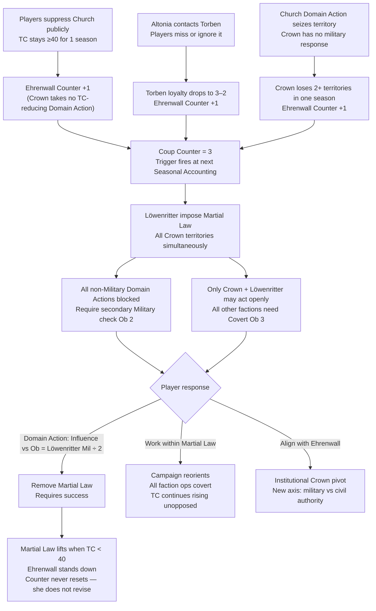
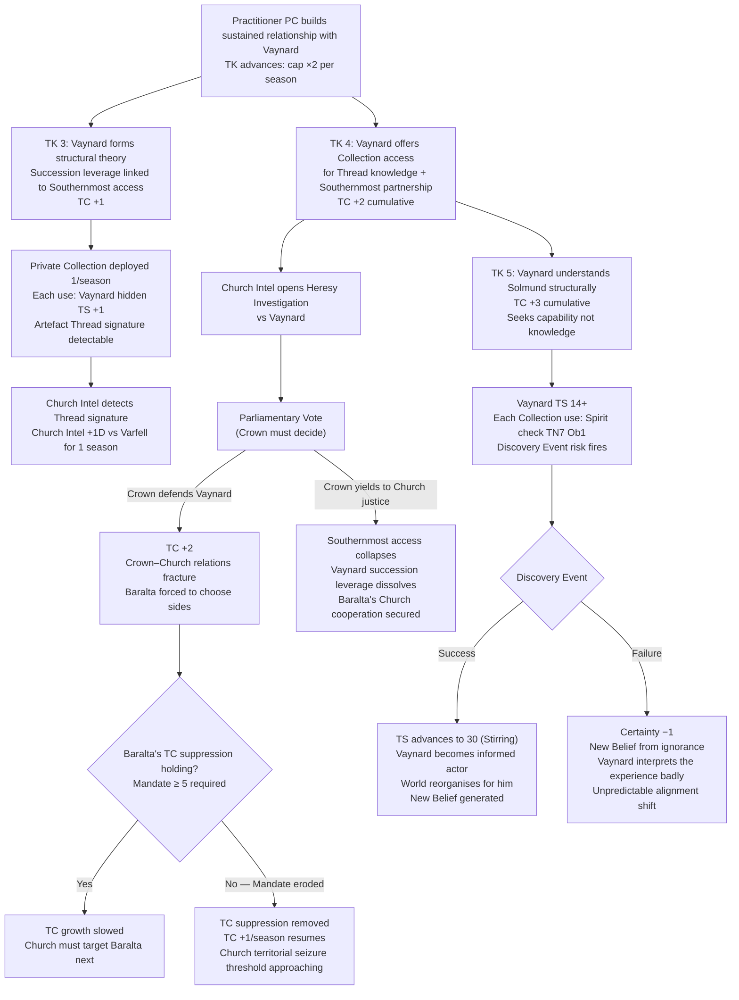
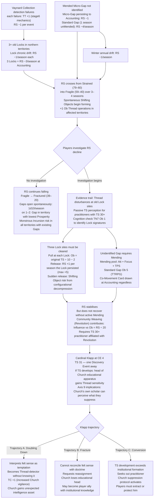

<!-- DERIVED FROM: Checkpoint 14 (compilation/valoria_ruleset_checkpoint_14.md, 2026-03-26) -->
<!-- SESSION: 2026-03-30 / 2026-03-31 — see session_log_archive.md -->
<!-- STATUS: Pre-release reference tool. Not valid against any post-CP14 ruleset. -->

# Valoria — Emergent Campaign Arcs 1–4
*Rebuilt with narrative prose. All narrative illustrative only — no editorial decisions locked.*

---

## How Arcs Emerge in Valoria

Valoria has no scripted plot. Arcs emerge from five mechanical engines running simultaneously:

| Engine | Key Output |
|---|---|
| Three clocks (Rendering Stability / Theocracy Counter / Institutional Pressure) | Threshold events; loss conditions |
| Seasonal accounting (Stability checks, Domain Echoes) | Faction collapse; power shifts |
| Non-Player Character trigger conditions (Ehrenwall counter, Vaynard TK, Baralta Theocracy Counter suppression) | Named-Non-Player Character decision points |
| Political axes (9 qualitative axes) | Scene conflict framing; casus belli |
| Thread operations + Co-Movement | Ontological consequences; Rendering Stability drain |

---

## Arc 1: The Coup That Wasn't Supposed to Happen

**Seed:** Players focus on Church opposition and Theocracy Counter reduction. Crown management is left to resolve itself.

---

### Narrative

The players have been doing their jobs. Theocracy Counter is down. The Church's overreach is stalled. Somewhere in the course of doing that work, three things happened that nobody was watching: Ehrenwall noted the Crown took no Theocracy Counter-reducing action while the players handled it instead. An Altonian contact found Torben at a diplomatic function and the boy was lonely. The Church seized a border territory and Almud issued a statement but no troops. Ehrenwall wrote each of these down. She does not erase things she has written.

The coup does not announce itself. At the next seasonal accounting, the players learn that Grandmaster Ehrenwall has issued a formal demand: cede command authority, or the Löwenritter act. Almud, characteristically, hesitates. He has spent his reign finding paths that do not require choosing — between justice and coalition, between his son and his sovereignty, between faith and reason. There is no path here. By the time the players realise what is happening, Martial Law has already reached the capital.

The campaign's geography changes instantly. Every faction that was operating openly now needs a covert Domain Action just to operate at all. The Church, which cannot act covertly without +2 Ob penalties, is nearly paralysed. The Guilds, which derive their power from visible economic pressure, find their leverage stripped. The Revolution, which has no Military score, becomes functionally invisible. The players have won against the Church. The institution that just locked them in is the Crown's own army, acting to protect the Crown from itself.

The resolution is not military. The Löwenritter will stand down if Theocracy Counter drops below 40 — Ehrenwall's concern is institutional survival, not power. She will accept evidence of a credible plan, a Domain Action demonstrating the Crown acting against Theocracy Counter, or a diplomatic settlement on the Altonian front. What she will not accept is persuasion. She marked three failures. The failures stand.

---

### Mechanical Causal Chain

**Why this arc is emergent:** The counter has three independent triggers. The coup fires because attention was elsewhere — which is its entire mechanical logic. No player chose any of the three conditions. Each was a by-product of a reasonable decision somewhere else.

**Campaign shape:** 1–2 seasons of silent accumulation. 1 season of martial law crisis. 2–4 season resolution arc.

---

## Arc 2: The Vaynard Revelation Cascade

**Seed:** A practitioner Player Character forms a sustained relationship with Duke Magnus Vaynard. His Private Collection begins to be deployed.

---

### Narrative

Vaynard is a consequentialist who has been trying to acquire Thread truth the way he acquires everything else: through documented possession, controlled access, and strategic patience. His collection of Einhir artefacts is substantial. His understanding of what they mean is not. He knows this. What he does not know is that proximity to the collection — handling the originary locks, reviewing the documentation, sitting in a room with objects that actively resist rendering — has been slowly building his Thread Sensitivity to 14. He attributes the occasional impressions to eyestrain.

A practitioner Player Character who spends sustained time with Vaynard will eventually explain what he has. The scene where TK advances to 3 is the arc's pivot: Vaynard does not panic. He recalibrates. Within one exchange he has reformulated the succession leverage — Torben's ratification is now explicitly tied to Southernmost access terms in his internal accounting, and he considers whether to make that explicit to the Crown. He is doing what he always does, which is treating knowledge as a resource to be positioned. The practitioner watching him do this sees someone who understood more than they should have in the wrong direction.

By TK 4, Vaynard is offering the collection — including the originary locks — in exchange for Thread education and partnership on Southernmost access. This is the moment the Church's Intel network notices. The artefact signatures have been detectable for a season; now there is correspondence, meetings, a practitioner present at Varfell. Cardinal Olafsson opens a Heresy Investigation. The question reaches Parliament: does the Crown defend Vaynard or yield him?

Both answers are wrong. Defending Vaynard fractures the Crown-Church relationship and forces Baralta to choose sides against her own Beliefs. Yielding Vaynard destroys the intelligence asset, collapses Southernmost access before the expedition can be mounted, and dissolves the succession leverage in a way that benefits no one. Almud, who manages the Einhir question as a governance variable while privately doubting whether the caste system is defensible, makes the decision that best preserves the coalition, which is to say the worst possible decision for every individual in the room.

---

### Mechanical Causal Chain

**Why this arc is emergent:** Theocracy Counter accumulates from Vaynard's TK advances as a side effect of helping him. The player who builds the relationship is simultaneously raising the clock they probably need to suppress. No player intends this — it is a structural consequence of pursuing the most obvious ally.

**Campaign shape:** Slow-burn 4–6 season arc. Each TK level is a scene. Parliamentary vote is the crisis. Multiple branching endgames.

---

## Arc 3: The Accumulating Substrate Damage

**Seed:** Lock drift, persistent Gaps, and seasonal Rendering Stability decay accumulate across the territory without coordinated response.

*[Note: prior version of this arc attributed Rendering Stability accumulation to Niflhel Thread harvesting. This has been corrected. Niflhel do not harvest threads. Arc reworked around legitimate Rendering Stability drain sources: Lock chronic drift, Gap persistence, winter drift, and Vaynard Collection detection failures.]*

---

### Narrative

Nobody decided to let the world get worse. Every faction made reasonable local decisions. Varfell deployed the Private Collection and twice failed the detection roll — both times, the artefact signature caused Church Intel to gain advantage, and both times, Thread Tension +1 was recorded in the substrate. A practitioner Leaped without completing Diagnosis and generated a Micro-Gap during a rushed winter operation; the Gap was not Mended because the practitioner did not know it had formed and no one with sufficient Thread Sensitivity was present to observe it. Three Locks from the previous generation's practitioners have been sitting in the northern territories for years, draining Rendering Stability at −1 each per season. The winter drift takes another −1. None of these are disasters individually. Together, across four seasons, they constitute a world in the Fragile band.

The players will notice this as a texture problem before they identify it as a mechanical one. NPCs in territories with high Thread-traffic begin reporting objects in wrong places, small inconsistencies in memory that everyone privately dismisses. A Shifting Object forms spontaneously in a market district during seasonal accounting — the Game Master draws it from the current political and Thread-state of the world. It is not a monster encounter. It is the world demonstrating that the substrate is failing.

The structural challenge is that no one agent caused this and no one agent can fix it. Mending requires Thread Sensitivity 50+, the correct pool (Attunement + Focus + Thread Pool Score), and physical presence at each Gap site. The three old Locks require either Pulling (Ob = original practitioner's Thread Sensitivity ÷ 10 − 2, minimum Ob 1) or acceptance that they will drain Rendering Stability indefinitely. The Revolution's Community Weaving can contribute, but requires a Thread Sensitivity 30+ practitioner to affiliate — and Cardinal Klapp, currently at Combat Endurance 4 with a Thread Sensitivity 31 he doesn't know about, is one Discovery Event away from becoming either the Church's most dangerous enemy or its most interesting crisis.

The arc is a coordination problem under political constraint. Every faction has a reason not to cooperate on Rendering Stability. The Church has +2 Ob to Thread-revealing Domain Actions. Varfell's access to the Southernmost is in negotiation. The Revolution lacks Mandate. The only path is the one the players build.

---

### Mechanical Causal Chain

**Why this arc is emergent:** No single faction caused the Rendering Stability decline and no single faction can reverse it. Each Rendering Stability drain source was a side effect of normal operations. The arc emerges from the cumulative interaction of four independent mechanical drains.

**Campaign shape:** Background decay for 3–5 seasons (invisible). Investigation arc 2–3 seasons. Klapp's Discovery Event adds a second crisis inside the recovery.

---

## Arc 4: The Axis 9 Resolution

**Seed:** Practitioners operate visibly. Vaynard's TK is climbing. The Revolution is sheltering sensitives.

---

### Narrative

The Church has always controlled what people know about the world's fabric by controlling who can talk about it and what happens to those who do. This works because Thread sensitivity is rare, Thread operations are invisible to most people, and the theological framework that explains away the occasional anomaly is deeply embedded in the culture. What the Church did not design for is the conditions that exist in this campaign: multiple practitioners operating openly, a duke who is privately constructing a structural theory of Thread reality, and a Revolution with enough cultural continuity to remember what the world felt like before the Forgetting.

The collapse of the Church's epistemic monopoly does not happen through a single revelation. It happens through accumulation. Practitioners operate at Relational and Territorial scale because the campaign has given them reasons to. Coherence degrades toward Fragmented — not because anyone failed, but because sustained practice at scale always produces Coherence loss, and the campaign is now long enough for that to show. A practitioner at Coherence 4–3 functions differently: −1D on social rolls, Memory checks compromised, Beliefs beginning to reorganise under Game Master and player co-authorship. Other NPCs start noticing that the practitioner is slightly wrong, present in a way that doesn't quite match the room.

Meanwhile Vaynard, at TK 5, no longer merely wants to understand Solmund — he understands him structurally. He wants capability. This shift is the moment the Church's suppression machinery recognises something has already happened that it cannot retroactively prevent. Axis 9 is not a future threat. It is a current state. The question the Grand Debate resolves is not whether Thread truth will become public — that has already begun — but whether the institutional structures that suppressed it will survive the transition.

Almud, with Thread Sensitivity 0, perceives none of this at any level. In the session where the Grand Debate happens, in a room full of practitioners and a debate about ontological authority, he sees only the political dimension — and he is correct about the political stakes in a way that no one else is, precisely because he is unencumbered by ontological perception. He is the most effective political actor in the room because he is the only one not distracted by what the room actually contains.

---

### Mechanical Causal Chain

```mermaid
flowchart TD
    A["Practitioner PCs operate at Relational+ scale\nCoherence degrades: 10→8→5→3→1"] --> B["Coherence Fragmented (4–3):\n−1D social/memory rolls\n+1 Ob Thread operations\nGM begins Belief Co-Authorship\nRoll Fragmented Fallout on entry"]
    C["Revolution affiliates TS 30+ practitioner\nCommunity Weaving available"] --> D["Thread operations produce observable effects\nNon-sensitives gain Inert Knowledge\nGM layers ontological beneath ontical"]
    B & D --> E["Political Axis 9 activates:\nChurch vs practitioners — Thread truth approaching public"]
    E --> F["Church Mandate ≥ 3\nAll Thread-revealing actions: +2 Ob (ethical framework)\nExcommunication available vs known practitioners"]
    F --> G{Church response to visible Thread activity}
    G -->|"Excommunication"| H["Church Mandate vs practitioner's Mandate\nOverwhelming: Reputation −1 all factions\nFailure: Church Mandate −1 (martyr effect)\nPC loses Circles bonus with Church contacts"]
    G -->|"Heresy Investigation vs Revolution shelter"| I["Church Intel vs Revolution Stability\nRevolution Stability −1 on success\nAxis 2 activates: Knowledge — Thread truth accessible vs suppressed"]
    H & I --> J["Vaynard at TK 5\nUnderstands Solmund structurally\nSeeks capability — no longer observing\nBecomes active political actor around Thread truth"]
    J --> K["Crown forced onto Axis 9:\nCosmological legitimacy of Church authority\nvs constitutional order"]
    K --> L{Crown's Axis 9 position}
    L -->|"Crown defends Thread truth access"| M["Sovereign Authority Doctrine (once per arc)\nMandate 7 vs Ob 4\nSuccess: TC −2, Church Mandate −1\nHeresy Investigation opens against Crown"]
    L -->|"Crown defers to Church"| N["TC −1 short term\nPractitioners lose Crown protection\nRS unaddressed\nLöwenritter watches Crown's weakness"]
    M --> O["Grand Debate: 5 exchanges\nChurch Mandate vs Baralta/Crown pool\nPC substitution available — use higher"]
    O -->|"Church wins"| P["Baralta Mandate −2, TC +3\nTC suppression removed\nChurch territorial seizure opens"]
    O -->|"Players win"| Q["TC −3, Church Mandate −1\nAxis 9 partially resolved\nThread knowledge enters public record\nInert Knowledge upgrades for non-sensitives who held it"]
    Q --> R["TTRPG endgame indicators active:\nAxis 9 resolved\nAt least one PC transformed\nRS direction determined by Weaving vs decay balance"]
```

**Why this arc is emergent:** Five systems must converge for this arc to reach the Grand Debate: Coherence degradation (time + use), Revolution affiliation (relationship work), TK advancement (sustained engagement), visible operations (scale decisions), Church response (Theocracy Counter threshold). None of them is sufficient alone.

**Campaign shape:** Full-campaign arc. Season 1 beginning (Coherence tracking). Crisis seasons 6–8 (Axis 9 active). Endgame seasons 9–10.

---

## Arc Interaction Map

| Collision | Arcs | Mechanic |
|---|---|---|
| Martial Law fires while Vaynard Revelation is at Parliamentary Vote | 1 + 2 | Vote blocked by Military check Ob 2; all Domain Actions require secondary roll |
| Rendering Stability enters Fragile during Axis 9 Resolution Grand Debate | 3 + 4 | Spontaneous Shifting Objects form in affected territories; debate season is also Rendering Stability crisis season |
| Vaynard TK 5 + Ehrenwall coup at same Accounting | 2 + 1 | Two crisis events same season; Stability checks stack; Crown faces simultaneous military and intelligence collapse |
| Community Weaving reduces Rendering Stability while Church responds to Axis 9 | 3 + 4 | Rendering Stability drops but Theocracy Counter rises from Church consolidation; clocks trade off — practitioner must choose which to address |
| Church territorial seizure (Theocracy Counter 60) during Martial Law | 1 (late) | Church seizes Crown-law-locked territories; Löwenritter cannot respond legally while imposing law |

---

## Canon Correction Logged

**[GAP-ARC-01]** stage6_factions.md contains the line: *"Niflhel's Southernmost harvesting supply chain disturbs the Thread-configurational environment. They do not know this."* This contradicts editorial ruling that Niflhel do not harvest threads. The Thread Tension +0.5 per Quiet deployment mechanic requires a revised causal explanation or removal. Flagged for compilation pass on stage6.
