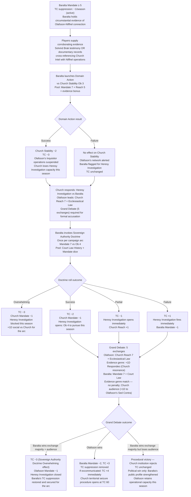
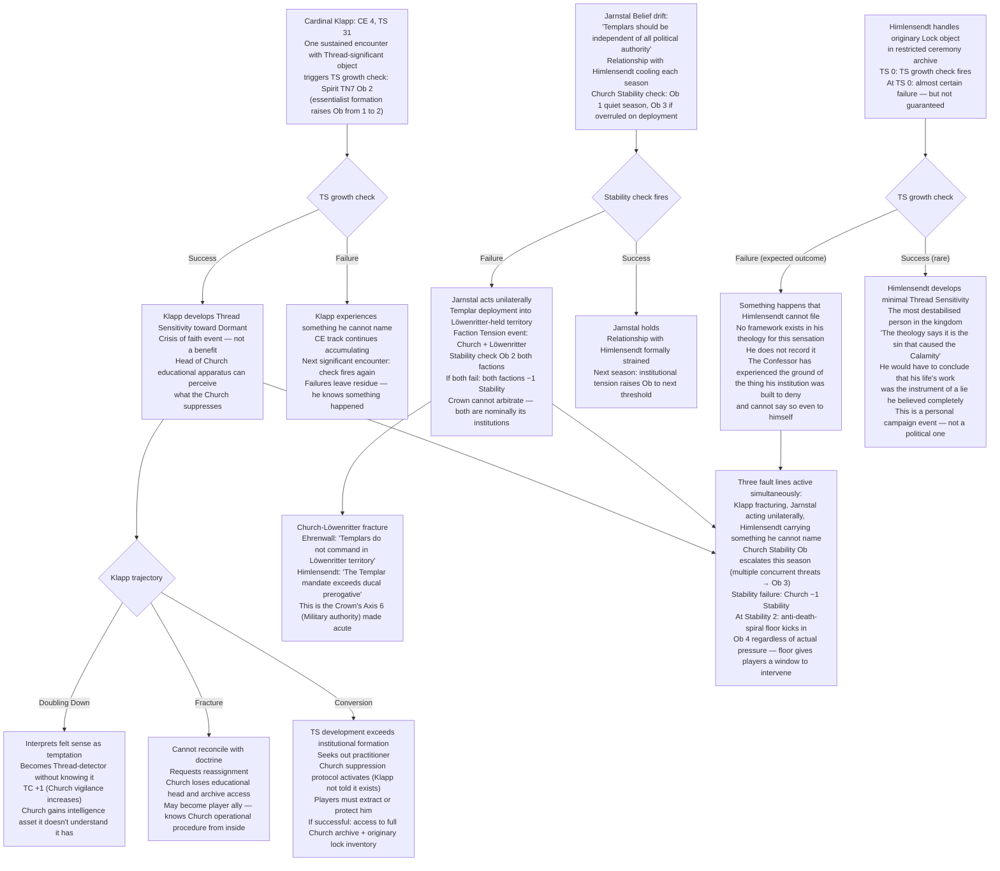

<!-- DERIVED FROM: Checkpoint 14 (compilation/valoria_ruleset_checkpoint_14.md, 2026-03-26) -->
<!-- SESSION: 2026-03-30 / 2026-03-31 — see session_log_archive.md -->
<!-- STATUS: Pre-release reference tool. Not valid against any post-CP14 ruleset. -->

# Valoria — Emergent Campaign Arcs 9–11
*Elske Almqvist · Duchess Inge Baralta · Cardinal Olafsson*
*All narrative illustrative only. No editorial decisions locked.*

---

## Arc 9: The Duchess Holds the Line

**Primary NPCs:** Duchess Inge Baralta · Cardinal Arnlod Olafsson
**Primary mechanics:** Sovereign Authority Doctrine (§8.3 Hafenmark Unique Action) · Debate redesign v1 Grand Debate · Olafsson-Niflhel evidence chain · TC suppression mechanics

---

### Narrative

Baralta's Mandate is the most structurally important single stat on the board for anyone trying to prevent TC from reaching 60. While her Mandate stays above 5, she suppresses TC at −1/season. This is not charity — it is the direct mechanical expression of her Belief that Church authority does not extend to ducal prerogative. She would describe it, if pressed, as constitutional hygiene. She has been doing it for years. The Church has been doing things that require this counter-pressure for just as long.

The complication the players may not have anticipated: Baralta holds circumstantial evidence of the Olafsson-Niflhel connection. Not proof. Circumstantial evidence — a pattern of operations, a document chain that raises questions, a name that appears in records it should not. She has been sitting on it. The reason is pragmatic: using it requires escalating against a Cardinal of the Church at a moment when her other arm is already occupied defending ducal prerogative. She is a consequentialist enough — despite her Categorical Imperative ethical framework — to understand that timing is everything.

The players can supply the corroborating evidence that makes her evidence chain actionable. Solvind Brak's testimony. Documentary records from Niflhel operations cross-referenced against Church Intelligence activity. When those arrive, Baralta launches a Domain Action: pool Mandate 7 + Reach 5 + player evidence bonus, against Church Stability Ob 3. A success drops Church Stability −2, TC −3, and suspends Olafsson's Inquisitor operations. This is not a political manoeuvre. For Baralta, it is a legal proceeding. The evidence is real. The conclusion is correct. The institutional obligation is to act on it.

What she cannot do — what her essentialist theology has foreclosed entirely — is perceive that Olafsson's operations and the Thread-level disruptions they enable are connected. To Baralta, the Church's overreach is institutional and constitutional. It is not ontological. The players may understand what she doesn't. The question is whether they can work with someone who will hold the line for entirely the wrong reasons, and whether that matters.

If the Church responds by opening a Heresy Investigation against Baralta herself — which it will — the Sovereign Authority Doctrine becomes relevant. Once per campaign arc, Baralta invokes the constitutional claim that her authority is a direct divine grant superseding Church jurisdiction. The roll: Mandate 7 vs Ob 4. A Grand Debate of 5 exchanges follows, with Olafsson's pool of Church Reach 7 + Ecclesiastical Law across from whatever the players have assembled. Baralta's Resonant Style is Evidence. The quaestio system favours her in Phases 1, 4 (Cognition) and Phase 5 (Poise), but Olafsson's +1D Respondeo from Church Evidence resonance is a structural advantage in Phase 4. The Church is arguing at home. Baralta is arguing on principle.

She will win or she will not. Either way, the fight happens.

---

### Mechanical Causal Chain

**Why this arc is emergent:** Baralta's TC suppression is passive — it runs every season without player involvement. The Olafsson evidence chain requires player investment to activate. The Sovereign Authority Doctrine is a one-per-arc nuclear option that Baralta holds in reserve. The Grand Debate is the crisis point, using the full quaestio system against the highest-pool NPC opposition in the game.

**Arc shape:** 1–3 seasons of evidence-gathering. 1 season Domain Action + Church response. 1 session Grand Debate. Immediate TC/Mandate consequences determine the next 2–4 seasons.

---

## Arc 10: The Princess in Altonian Territory

**Primary NPCs:** Princess Elske Almqvist · Prince Torben Almqvist · Grandmaster Sigrid Ehrenwall
**Primary mechanics:** Torben Loyalty Clock · IP threshold (IP 30 triggers Altonian education demand) · Ehrenwall Coup Counter · Circles Ob 3 (Elske in Altonian territory) · Debate redesign v1 Appeal vs Elske

---

### Narrative

Elske Almqvist married into Altonian territory before the campaign started. She is not a spy, not an agent, not a faction asset. She loves her brother and has complicated feelings about her father and wants, on her own terms, to matter — not as a dynastic piece but as a person. The world has not offered her many opportunities to distinguish these. She is watching the situation in Valoria from across a border that is slowly becoming significant.

Torben is now at IP 30. Altonia has made a formal request for the prince's education. Almud, who has prioritised the Altonian trade relationship above everything else in his reign, faces the question he has been avoiding: is there a point at which the trade relationship costs more than it preserves? He does not know how to ask this question without also asking whether everything he built his reign on was correct. His third Belief — *"My son must be ratified before the succession becomes a weapon"* — is in direct conflict with his first — *"I will hold the Altonian relationship open regardless of what it costs me."* The players who know both Beliefs know this is not a political problem. It is a character problem. Almud will not resolve it cleanly.

Torben's loyalty is at 5 by Season 3 of Altonian influence. Every season he remains, it degrades by 1. At 3–2, Ehrenwall marks coup trigger #2. She has already noted the Crown's passive response to TC rising. She may be one failure from acting.

Elske is the one person in Altonian territory who has a relationship with Torben that is not instrumentalised. Reaching her requires Circles Ob 3 — the Altonian border is politically sensitive and she is embedded in an Altonian household. Once reached, she needs a 3-exchange Appeal or Formal Debate. Her Resonant Style is Evidence: abstract appeals to patriotism or family loyalty without concrete proof will earn a polite dismissal. Show her what is actually happening to Torben — his loyalty score, his isolation, what Altonian education means in practice — and she listens. Her Self-Determination conviction means she will not act as anyone's instrument, but she will act on her own assessment of what the situation requires.

If recruited, Elske has access the players do not. She is inside the Altonian Duke's household. She can slow Torben's loyalty degradation by 1 per season through maintained relationship (she is family; she can be present in ways a diplomatic mission cannot). She can provide Intelligence on Altonian intentions — effectively granting the faction she supports an Intel advantage on IP-related Domain Actions. And she can, if the players build toward it, become the negotiating channel for a settlement that resolves the IP situation without military confrontation — but only if Almud is willing to acknowledge that his son's position is untenable, which is the one thing Almud's Belief structure currently prevents him from doing.

Ehrenwall is watching all of this. She has no opinion about Elske except as a strategic factor. If Elske's presence in Altonian territory stabilises Torben's loyalty before it hits 3–2, coup trigger #2 is not met. Ehrenwall marks the absence of the trigger. The coup counter stays at 1. She continues watching.

---

### Mechanical Causal Chain

```mermaid
flowchart TD
    A["IP reaches 30\nAltonia makes formal education demand for Torben\nAlmud faces direct conflict between Belief 1 and Belief 3\nTorben Loyalty starts degrading: −1/season in Altonian influence"] --> B["Torben Loyalty at 5 (Season 2)\nCrown Mandate −1 (loyalty 5–4 transition)\nRetrieval requires Altonian consent or covert extraction"]
    B --> C["Torben Loyalty drops to 3–2 (Season 3+)\nCrown Mandate −1 (cumulative −2)\nEhrenwall marks Coup Counter +1\n(Torben alignment = trigger condition #2)"]
    C --> D["Coup Counter now at 2\nEhrenwall is one failure from acting\nCounter never decrements"]
    
    A --> E["Players identify Elske as viable intervention\nElske: in Altonian territory\nNot working for any faction at campaign start"]
    E --> F["Reach Elske: Circles Ob 3\n(Altonian border sensitivity; embedded household)\nFailure: access blocked this season; Church or Altonian awareness +1"]
    F --> G["Social scene: Appeal or Formal Debate\n3 exchanges — Elske holds Resonant Style: Evidence\nAbstract appeals to patriotism: no +1D\nConcrete proof of Torben's situation: +1D Evidence bonus"]
    G --> H{Elske's conviction engaged}
    H -->|"Family conviction\n(concrete evidence of Torben's isolation)"| I["Family conviction engaged\nElske evaluates on its own terms — not as patriotism\nDebate exchanges lean toward success\nSelf-Determination still active: she acts as herself, not as anyone's instrument"]
    H -->|"Self-Determination\n(evidence that she can matter on her own terms)"| J["Self-Determination engaged\nElske negotiates her own terms of involvement\n[EDITORIAL: what does Elske want in exchange for acting?]\nConditions she sets are her own — not any faction's"]
    H -->|"Neither engaged — abstract appeal"| K["Polite refusal\nElske not hostile\nReachable again next season with better evidence\nTime cost: Torben loyalty −1 while players seek better approach"]
    
    I & J --> L["Elske recruited\nCapabilities unlocked:\n1. Slows Torben loyalty degradation −1/season (family presence)\n2. Intel on Altonian intentions (IP-related Domain Actions +1D for supporting faction)\n3. Negotiation channel for IP settlement (requires Almud to acknowledge position)"]
    L --> M{Torben situation outcome}
    M -->|"Elske stabilises Torben at 4+ before coup trigger"| N["Coup trigger #2 not met\nEhrenwall counter stays at current value\nIP may still be climbing — military threat unresolved but succession secure\nAlmud avoids the worst of Belief 1 vs 3 conflict"]
    M -->|"Torben loyalty hits 3–2 despite Elske's presence"| O["Coup trigger #2 met regardless\nElske still valuable: negotiation channel now critical\nArc converges with Arc 1 (coup) — Elske's Altonian access may be\nthe only path to a settlement Ehrenwall would accept"]
    M -->|"Almud cannot acknowledge position\nElske has no mandate to negotiate"| P["Almud's Belief conflict remains unresolved\nElske acts unilaterally on her own assessment\n[EDITORIAL: what does unilateral Elske do?]\nSelf-Determination conviction shapes the action\nnot any faction's instruction"]
    
    O --> Q["Ehrenwall Coup Counter at 3\nElske as diplomatic back-channel\nIf IP settlement through Elske: TC +1 (Crown yielded to Altonia)\nbut Torben retrieved, loyalty restored, coup trigger #2 resolved\nNet: coup counter stalls; IP cost paid diplomatically"]
```

**Why this arc is emergent:** Elske exists independently of any player agenda. She is not designed as a tool — her Self-Determination conviction means she acts on her own assessment. The Torben Loyalty Clock degrades regardless of whether players engage with it. The Coup Counter increments from Torben's trajectory. The convergence of IP, loyalty, and coup mechanics creates a multi-season pressure system that Elske sits at the centre of without controlling.

**Arc shape:** IP 30 triggers the clock (Season 1). 2–3 seasons for Elske recruitment attempt. 1–2 seasons of Elske-enabled stabilisation or failure. Convergence with Arc 1 (coup) if trigger #2 fires.

---

## Arc 11: The Faith that Destroys What It Defends

**Primary NPCs:** Confessor Arne Himlensendt · Cardinal Magnus Klapp · Cardinal Osten Jarnstal
**Primary mechanics:** Klapp CE Track (CE 4, TS 31) · Inquisitor CE trajectories · Jarnstal institutional drift · TC threshold · Threadweaving v2.5 Involuntary Leap risk at TS 90+

---

### Narrative

The Church's internal structure is not stable. Three fault lines have been developing in parallel, and none of them were visible from the outside until they were already significant.

The first: Cardinal Klapp, head of Church scholarship, is at CE 4 and TS 31. He has been handling Einhir texts and two originary lock objects as part of his archive work. He does not know he has Thread Sensitivity. He does not know his archive contains objects that are perceptually significant in ways his theology has no category for. He is one sustained encounter with a Thread-significant object away from a TS growth check. If the check succeeds: the most intellectually prominent member of the Church hierarchy develops the capacity to perceive exactly what the Church's entire theological apparatus was built to prevent anyone from perceiving. Three Cardinals who handled the same objects previously requested to be relieved of their duties. Their requests were granted without explanation.

The second: Jarnstal's Belief — *"The Knights Templar should be independent of all political authority"* — is drifting toward unilateral action. His relationship with Himlensendt grows cooler each season the Confessor tolerates Baralta's jurisdictional challenges without a military response. Jarnstal is not subtle. If his Stability check fires (Ob 1 at minimum; Ob 3 if Himlensendt acts against Templar deployment without consultation), the Templars may act without Church authorisation on a matter Jarnstal considers fallen under their independent mandate.

The third: Himlensendt himself is the most thoroughly formed product of Galbados's theological engineering in the kingdom. He is sincerely devout. He is not cynical. He is wrong about everything structurally important, and he has no perceptual tools to approach the question differently. His destabilisation trigger is not political — it is the Church's own relics. The originary Locks in the restricted ceremony archive are present at Galbados's actual emergence from the unintelligible ground. If Himlensendt handles them personally, the TS growth check fires. At TS 0, he will fail. But something will happen, and whatever happens to a man of complete institutional faith at contact with the object that demonstrates his institution is wrong will be one of the most significant NPC scenes in the campaign.

These three fault lines can activate in any order and each accelerates the others. Klapp's Fracture removes the Church's most sophisticated intellectual advocate just when TC confrontation becomes unavoidable. Jarnstal's unilateral Templar action triggers a Church-Löwenritter Faction Tension event — Stability check Ob 2 for both factions — at the moment the Crown is most vulnerable. Himlensendt's encounter with the originary Lock can be player-engineered or can happen as a consequence of the players allowing access to the restricted archive during investigation. Either way, it changes what the Confessor is able to say to himself about what he is defending.

---

### Mechanical Causal Chain

**Why this arc is emergent:** All three fault lines develop from normal play. Klapp's CE accumulates from his archive work, which is his institutional role. Jarnstal's Belief drift follows from Church political choices the players may have forced. Himlensendt's originary Lock encounter can be player-engineered or can happen during investigation that the players triggered. No fault line requires players to orchestrate it — only to recognise what is happening in time to shape it.

**Arc shape:** Background fault line development across 3–6 seasons. Klapp's TS check is a single pivotal scene. Jarnstal's instability fires on a seasonal Stability failure that could come at any time. Himlensendt's encounter is either player-triggered or arrives through a scene the GM generates from the Church's internal state. All three can fire in the same accounting period.

---

## NPC Resonant Style Reference (Arcs 9–11)

| NPC | Resonant Style | How to Use It |
|---|---|---|
| Baralta | Evidence | Legal precedent, documented institutional history, formal citations |
| Olafsson | Evidence | The same style as his opposition — whichever side uses it better wins |
| Elske | Evidence | Concrete proof of Torben's situation; concrete proof Valoria needs her specifically |
| Ehrenwall | Consequence | Show her what happens to Valoria if she doesn't act; show her what happens if she does |
| Klapp (pre-CE event) | — | Archive access; evidence management; not a social opponent |
| Klapp (post-Fracture) | Character | Who he is becoming; his intellectual integrity; his willingness to say what he experienced |
| Jarnstal | — | Not a debate opponent; acts on Belief, not persuasion |
| Himlensendt | Consequence | What this situation produces for the Church's mandate; forward-looking institutional thinking |

---

## Cross-Arc Interaction Table (All Arcs)

| Collision | Arcs | Mechanic |
|---|---|---|
| Baralta excommunicated while Elske is recruiting | 9 + 10 | TC +4 immediately; TC suppression removed; this is the worst possible moment for TC — Elske's Altonian negotiation, if underway, is the only surviving TC mitigation |
| Klapp Fractures and seeks players while Tribunal is running against practitioner PC | 11 + 6 | Klapp has Inquisition operational knowledge; players can use him to derail the Tribunal's evidence chain mid-proceeding |
| Jarnstal's unilateral Templar action fires during Ehrenwall Martial Law | 11 + 1 | Templars entering Löwenritter territory during Martial Law is a direct military confrontation between two Crown-adjacent institutions; Crown cannot arbitrate; TC and Coup implications compound |
| Elske's IP negotiation succeeds while Vaynard is leveraging succession | 10 + 2 | IP settlement removes Torben from Altonian pressure; Vaynard loses succession leverage Ob simultaneously with losing Southernmost access terms if the settlement bypasses him |
| Himlensendt's Lock encounter happens in the same season as Foundational Pull attempt | 11 + 8 | Himlensendt experiences his own ontological event and cannot name it; practitioner PCs who just attempted a Foundational Pull are the only people who might recognise what happened to him; Axis 9 reaches both endpoints in one season |
