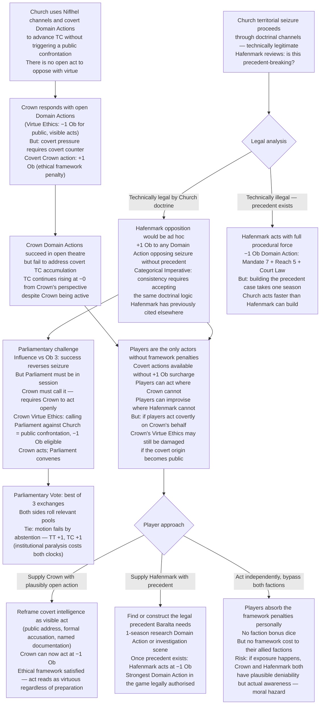
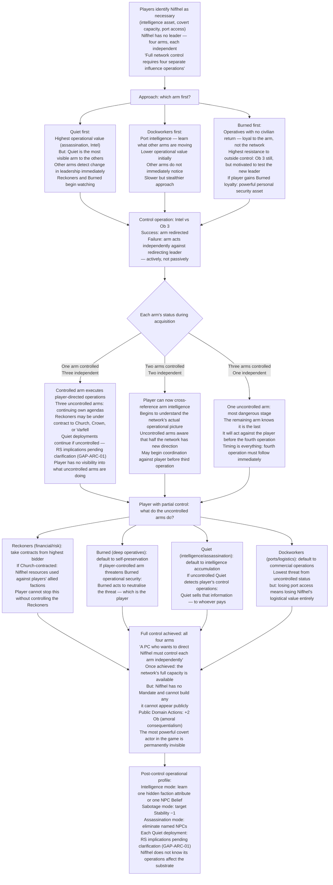

<!-- DERIVED FROM: Checkpoint 14 (compilation/valoria_ruleset_checkpoint_14.md, 2026-03-26) -->
<!-- SESSION: 2026-03-30 / 2026-03-31 — see session_log_archive.md -->
<!-- STATUS: Pre-release reference tool. Not valid against any post-CP14 ruleset. -->

# Valoria — Emergent Campaign Arcs 12–15
*Faction mechanics · Ethical framework traps · Dominance events · Seasonal accounting*
*All narrative illustrative only.*

---

## Arc 12: The Framework Trap

**Primary mechanics:** Faction ethical framework Ob modifiers · Crown Virtue Ethics (covert +1 Ob) · Hafenmark Categorical Imperative (ad hoc +1 Ob) · Axes 1, 3, 6

---

### Narrative

The two factions best positioned to resist Church overreach are also the two factions structurally penalised for doing so in the ways the situation requires.

The Crown's Virtue Ethics framework grades actions by whether they demonstrate virtuous character — public, visible, honourable acts earn −1 Ob. Covert, expedient, or morally ambiguous acts earn +1 Ob. The Crown is, in the rules' own language, "structurally weakest at covert operations." This is fine when the threats are open. The Church's current campaign is not open. TC has been climbing through intelligence operations, quiet territorial pressure, and Niflhel channels that don't appear in any public record. The Crown cannot oppose covert pressure through virtue. It is mechanically unable to be effective at the game being played against it.

Hafenmark's Categorical Imperative framework rewards actions based on legal precedent (−1 Ob) and penalises ad hoc, situational, or precedent-breaking actions (+1 Ob). Baralta is the strongest procedural actor in the kingdom: Mandate 7, Reach 5, deep History in Court Law, a parliamentary record that is effectively the institutional memory of the constitutional settlement. What she cannot do is make an exception. When the Church's territorial seizure proceeds through technically legitimate doctrinal channels — and it does, because Olafsson is thorough — Hafenmark faces a Church move that is constitutionally irregular but not obviously illegal. Opposing it ad hoc costs +1 Ob. Opposing it by building new legal precedent takes time it doesn't have. Opposing it through the parliamentary procedure that would be −1 Ob requires Parliament to be in session, which requires the Crown to call it, which requires the Crown to act.

What this arc generates is a coordination problem that neither faction can solve from inside its own ethical framework. The Crown cannot act covertly. Hafenmark cannot act without precedent. The Church is acting in the gap between them. The players are the only actors in the scene without a framework penalty.

---

### Mechanical Causal Chain

**Why this arc is emergent:** No player designed the trap. The Crown's Virtue Ethics and Hafenmark's Categorical Imperative are baked into the faction cards. The Church's covert campaign is the Church's institutional tendency. The trap assembles itself from three independent systems running simultaneously.

**Arc shape:** 2–3 seasons of TC accumulation inside the framework gap. 1 season where the gap becomes visible to players. 1–2 seasons of precedent-building or parliamentary manoeuvre. Resolution at the vote.

---

## Arc 13: The Dominance Event

**Primary mechanics:** Church TC threshold escalation · Mandate/Stability 7 dominance event · TC 60 territorial seizure procedure · Counter-play timing windows · Axes 1, 2, 9

---

### Narrative

TC does not move in straight lines. It moves in thresholds. Below 40, it is a background condition — something the factions monitor, something the players track, something that produces moderate seasonal effects. At 40, the Church gains the capacity for territorial seizure. At 60, the seizure procedure becomes active. These thresholds are not abstract. They correspond to observable changes in how Confessor Himlensendt holds himself in a room, in whether Olafsson's Inquisitors have search authorisation, in whether the Templars can deploy without asking.

The dominance event is what happens if no one arrests the trajectory. Church Mandate 7, Church Stability 7 — either triggers it. The seasonal accounting machinery reads this as a ceiling event, the mirror of the Stability 0 collapse. The world reorganises around the faction that has achieved dominance. What that reorganisation looks like in practice: every other faction's Domain Actions that target Church authority face an additional layer of institutional resistance. The TC suppression mechanisms that have been quietly working — Baralta's −1/season, players' Domain Actions, Revolution community operations — are insufficient against a faction that has, in mechanical terms, become structurally dominant.

The arc is not about what happens after dominance. It is about the last two or three seasons before dominance when it is still preventable and the window is closing. Seasonal accounting is the mechanism: Church Mandate advances most reliably when TC ≥ 40 (TC +1/season from Church's own threshold mechanic), when Baralta's suppression has been removed, and when no Domain Action targets Church Stability or Mandate. The players who can do the arithmetic know when dominance is one or two quiet seasons away.

The three counter-play options for TC 60 seizure — Parliamentary challenge (Influence vs Ob 3), Riskbreaker operation exposing Church-Niflhel connection, Grand Debate challenging Church civil authority — each have different timing requirements and different costs. The Parliamentary challenge is fastest but requires Parliament to be in session. The Riskbreaker exposure adds Deniability Debt to the Crown (at Debt 3, all Crown Domain Actions against non-Crown factions +1 Ob). The Grand Debate is the nuclear option: Overwhelming removes all seizures in one duchy; Success removes one. But Grand Debate requires 5 exchanges, which is a full season's investment of Baralta's time and political capital.

---

### Mechanical Causal Chain

```mermaid
flowchart TD
    A["Church Mandate 5+: TC +1/season automatic\nBaralta TC suppression: −1/season (while Mandate ≥ 5)\nNet: 0 per season while suppression holds"] --> B["Suppression conditions checked each Accounting:\nBaralta Mandate ≥ 5?\nIf yes: suppression active\nIf no: suppression gone — TC +1/season net"]
    B --> C{Baralta Mandate status}
    C -->|"Mandate erodes below 5\n(excommunication attempt, failed Domain Actions,\npolitical defeats)"| D["TC suppression removed\nTC now: +1/season from Church Mandate\n+additional from threshold events\nNo counter-pressure"]
    C -->|"Mandate holds at 5+"| E["Suppression active\nTC stable or falling depending on player Domain Actions\nChurch cannot advance through normal seasonal pressure alone"]
    
    D --> F["TC reaches 40 threshold\nChurch territorial seizure capacity unlocked\nEach season at Accounting: seizure attempt available\nRoll: Church Mandate vs territory owner's Mandate ÷ 2"]
    F --> G["Seizure successes add flat TC value:\nMinor territory: TC +1 on seizure\nMajor territory: TC +3 on seizure\nCapital/institutional site: TC +5 on seizure\nTC advances in jumps, not drifts"]
    G --> H{Counter-play options — each has a cost}
    H --> H1["Parliamentary challenge\nInfluence vs Ob 3\nSuccess: reverses seizure; TC does not fire\nCost: requires Parliament in session; one season of political capital"]
    H --> H2["Riskbreaker exposure\nExposes Church-Niflhel connection per operation\nEach success: removes one seized territory\nprevents re-seizure for 1 season\nCost: Crown Deniability Debt +1 per operation\nAt Debt 3: all Crown Domain Actions +1 Ob"]
    H --> H3["Grand Debate challenging Church civil authority\nOverwhelming: removes all seizures in one duchy\nSuccess: removes one seizure\nCost: Baralta's full political investment (5 exchanges)\none Grand Debate per season maximum"]
    
    H1 & H2 & H3 --> I["TC approaches 60\nIf no counter-play succeeds in time:\nTC 60 threshold crossed at Accounting"]
    I --> J["Church Mandate now advancing toward 7\nDominance event within 1–3 seasons\nat Mandate 7 or Stability 7: ceiling event fires"]
    J --> K["Last window:\nReversal requires TC below 40\n(TC suppression can resume if Baralta Mandate restored)\nOR Church Stability driven to 2 (anti-spiral floor)\ngiving players the intervention window before collapse"]
    K --> L{Player action in last window}
    L -->|"Drive Church Stability to 2"| M["Anti-spiral floor activates: Ob 4 regardless of pressure\nChurch Stability checks at Ob 4 while at Stability 2\nGives players 1–2 seasons to reverse Mandate\nbefore floor expires"]
    L -->|"Restore Baralta Mandate to 5+"| N["TC suppression resumes\nNet TC drift reverses\nRequires healing political damage from earlier arc\n— whatever lowered her Mandate is still in play"]
    L -->|"Too late: dominance event fires"| O["Church Mandate 7: ceiling event\nEvery Domain Action targeting Church authority:\nadditional layer of institutional resistance\nAll TC-reducing options face higher Ob\nEndgame arc: world under Church dominance\nRS unaddressed without Revolution's Community Weaving"]
```

**Why this arc is emergent:** TC moves through multiple independent sources — Church Mandate threshold, seizure flat values, Baralta suppression status. No single intervention permanently reverses it. The counter-play options each have costs that create new problems. The dominance event is not a scripted villain arc — it is the output of a system running at full load without coordinated opposition.

**Arc shape:** Background TC accumulation across full campaign. Seizure window opens at TC 40 (crisis begins). TC 60 reached in 2–4 seasons without intervention. Last-window play for 1–2 seasons. Dominance event or reversal.

---

## Arc 14: The Revolution Eats Itself

**Primary mechanics:** Revolution ethical framework (Rawlsian Social Contract) · Community Weaving Mandate ≥ 1 prerequisite · Stability checks under Leadership Deviation · Axis 4 (Cultural identity) · Axis 7 (Information)

---

### Narrative

The Revolution has no Mandate, no Military, no Wealth. It runs on Influence, Stability, and Intel — and on the Rawlsian Social Contract that makes it mechanically strongest when it acts for the common population and weakest when it concentrates power. This is not an inconsistency in the design. It is a structural statement about what the Revolution is: a movement, not an institution. The moment it becomes an institution, its own ethical framework turns against it.

The path to Community Weaving — the Revolution's unique Thread contribution, the only faction mechanism that can lower RS — requires Mandate ≥ 1. The Revolution rejects the legitimacy of the system that confers Mandate, but it needs that system's recognition to access its most powerful action. This is the arc's mechanical seed: the Revolution must become legible to the political structure it opposes, and becoming legible costs it the thing that makes it effective.

In practice: players who affiliate with the Revolution and build its Influence toward political recognition gain Mandate — which unlocks Community Weaving and makes RS recovery possible. But the moment Revolution holds Mandate, it is an establishment faction. Actions that concentrate power, benefit elites, or suppress popular expression now carry +1 Ob. The institution-building that unlocked Weaving is itself subject to the framework penalty. The movement that was strongest as an outsider is now penalised for acting like an insider. Its own members recognise this before the players do.

Leadership Deviation within the Revolution fires at Ob 3 when directed toward violence, authoritarianism, or elite alliance — the hardest deviation cost of any faction except the Church. The institution fractures if it betrays its own principles. This is not a game balance decision. It is a design claim: the thing that makes the Revolution worth affiliating with is also the thing that makes it impossible to sustain as a political institution. Every successful Revolution faces this. This one has it written into the dice.

---

### Mechanical Causal Chain

```mermaid
flowchart TD
    A["Revolution: Influence, Stability, Intel only\nNo Mandate — rejects legitimacy of the system that confers it\nCommunity Weaving requires Mandate ≥ 1\nRS declining — Weaving is needed"] --> B["Players affiliate and build Revolution Influence\nInfluence Domain Actions: Rawlsian framework\nActions benefiting common population: −1 Ob\nActions concentrating power: +1 Ob"]
    B --> C["Influence grows\nRevolution gains political recognition\nMandate develops: Mandate 1 unlocked\nCommunity Weaving now available\nRS recovery path opens"]
    C --> D["Community Weaving fires:\nInfluence vs Ob = RS ÷ 20 (round up)\nRequires TS 30+ practitioner affiliated\nSuccess: RS +1 or +2\nCo-Movement Card drawn — even recovery has consequences"]
    D --> E["Mandate 1+ means Revolution is now\npolitically legible to the system it opposes\nOther factions treat it as an institutional actor\nChurch considers it a Heresy Investigation target\nCrown considers it a political faction to manage"]
    E --> F["Rawlsian framework activates against Revolution's own growth:\nInstitution-building actions: +1 Ob\nNominating a formal leader: +1 Ob (concentrates power)\nAllying with Crown or Hafenmark for protection: +1 Ob (elite alliance)\nForming a standing defence against Church Templars: +1 Ob (military structure)"]
    F --> G{Players direct Revolution toward structure}
    G -->|"Formal leadership nominated"| H["Leadership Deviation check fires if leader acts against tendency\nStability check Ob 3 if directed toward: violence, authoritarianism, elite alliance\nOb 3 is the hardest deviation cost in the game\nThe institution fractures if it betrays its own principles\nStability −1 on failure"]
    G -->|"No formal leadership"| I["Revolution retains movement character\nNo Leadership Deviation possible — no leader to deviate\nBut: no leader means no single actor can make strategic commitments\nNegotiations with other factions are unreliable\nParliamentary representation impossible"]
    H --> J["Stability 2: anti-spiral floor activates\nOb 4 regardless of actual pressure\nPlayers have intervention window\nBut: Revolution at Stability 2 with Mandate 0\nCommunity Weaving prerequisite lost\nRS recovery path closed"]
    I --> K["Revolution at max effectiveness as outsider\nAll −1 Ob actions available\nBut: Community Weaving still requires Mandate\nRS still declining\nMovement and institutional capacity in permanent tension"]
    J & K --> L["The Revolution must choose:\nRemain a movement (no Mandate, no Weaving, RS unaddressed)\nOR become an institution (Mandate enables Weaving,\nframework penalties accumulate,\nStability at risk from its own principles)"]
    L --> M["Either path leaves RS without full coverage\nunless players find a third option:\naffiliate a practitioner whose Weaving is personal, not faction-level\n— accessing Weaving through character action, not Revolution Mandate\nbypassing the institutional requirement entirely\n[EDITORIAL: is personal Community Weaving possible without Revolution Mandate?]"]
```

**Why this arc is emergent:** The Mandate ≥ 1 prerequisite for Community Weaving forces the Revolution toward institutional legibility. The Rawlsian framework then penalises the institutional behaviour that legibility requires. No player designed this contradiction — it is the ethical framework doing exactly what it is designed to do, in exactly the situation the campaign eventually creates.

**Arc shape:** Early campaign: Revolution as background actor. Mid-campaign: players affiliate, Influence builds. Crisis: Mandate threshold reached, framework turns against institutional behaviour. Late campaign: Stability pressure, Weaving at risk, structural choice forced.

---

## Arc 15: The Headless Network

**Primary mechanics:** Niflhel four-arm structure · Decentralised control mechanic · Intel vs Ob 3 per arm · Uncontrolled arm independence · Quiet deployment RS/TT accumulation (cause pending editorial clarification — GAP-ARC-01)

---

### Narrative

Niflhel is the only faction in the game that cannot be controlled through a single relationship. Its four-arm structure — Dockworkers, Reckoners, Burned, Quiet — was designed without a head, and the design is permanent. A player character who infiltrates Niflhel, builds influence within it, and reaches a position of authority discovers that they control one arm. The other three are watching.

The mechanic is explicit: redirecting any arm requires Intel vs Ob 3 within Niflhel. Failure means that arm acts independently against the redirecting leader's interests. This is not a punishment for bad play. It is a description of how decentralised covert networks behave when someone tries to centralise them. Each arm has its own operational priorities, its own relationships, its own definition of what "the network's interests" means. The Reckoners manage financial operations and risk assessment. The Burned are operatives who cannot return to civilian life. The Quiet are the network's killing and intelligence arm. The Dockworkers control the ports.

A player who controls the Quiet has enormous covert capability — assassination, intelligence, the ability to learn one hidden faction attribute per successful Quiet deployment — but every operation the uncontrolled arms run continues on their own agenda. If the Reckoners are currently under contract to the Church (amoral consequentialism: they take the work that's available), those operations proceed regardless of what the player controlling the Quiet wants. The player has become a partial actor inside a network they do not own.

Full control requires four separate influence operations. The order matters: controlling the Quiet first alerts the other arms that something has changed. Controlling the Dockworkers first is slower but gives the player port-level intelligence on what the other arms are moving. Each operation is Intel vs Ob 3, and each failure before completion means the targeted arm is now actively working against the player. A player who fails the Burned arm's control roll and does not immediately remedy it will find the Burned acting against them in the season where they are most vulnerable.

The arc is not about whether the player can control Niflhel. It is about what they do with partial control while they are acquiring the rest, and what the arms that are not yet controlled do in the meantime.

---

### Mechanical Causal Chain

**Why this arc is emergent:** Niflhel's headlessness is a mechanical feature, not a gap. Each failed control operation creates an adversary inside the network the player is trying to control. The order of acquisition changes what intelligence is available and what threats emerge. A player who completes the arc has the most capable covert faction in the game — and a faction that can never appear in public.

**Arc shape:** 1 season per arm control operation (4 seasons minimum). Each season: existing arms continue independent operations, some working against the player. Resolution: full control or forced abandonment after a failed operation makes the network hostile.

---

## Cross-Arc Interaction Table

| Collision | Arcs | Mechanic |
|---|---|---|
| Framework Trap + Dominance Event in same season | 12 + 13 | Crown cannot act covertly; Hafenmark needs precedent time; Church seizes territory in the gap; TC jumps to 60 in one accounting without framework-unencumbered response |
| Revolution Mandate reaches 1 during Dominance Event | 14 + 13 | Community Weaving unlocks precisely when Church dominance is making all Thread-revealing Domain Actions +2 Ob; the Weaving that could reverse RS is blocked by the same threshold event that made it necessary |
| Player controlling Niflhel Quiet is also running the Revolution | 15 + 14 | Elite alliance (+1 Ob under Rawlsian framework); Revolution Stability check Ob 3 fires if the player's Niflhel operations become known to the movement; the movement fractures if it discovers its player-affiliate is running the kingdom's assassination network |
| Reckoners (uncontrolled) contracted to Church during Tribunal arc | 15 + 6 | Niflhel financial resources backstop the Church's Inquisition file-building; players fighting the Tribunal while also trying to control the Reckoners face the arm actively working against them during the most politically exposed moment |
| Framework Trap forces player covert action during Niflhel acquisition | 12 + 15 | Players acting covertly on Crown's behalf are simultaneously in Niflhel's intelligence visibility if Quiet is uncontrolled; Quiet sells what it finds; Crown covert action becomes public through Niflhel's default commercial behaviour |
