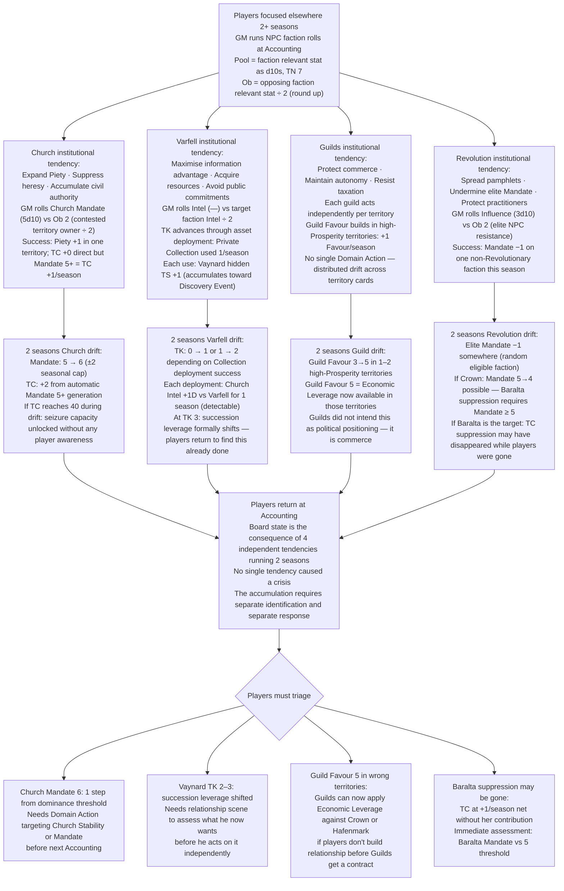

<!-- DERIVED FROM: Checkpoint 14 (compilation/valoria_ruleset_checkpoint_14.md, 2026-03-26) -->
<!-- SESSION: 2026-03-30 / 2026-03-31 — see session_log_archive.md -->
<!-- STATUS: Pre-release reference tool. Not valid against any post-CP14 ruleset. -->

# Valoria — Emergent Campaign Arcs 16–19
*Domain Echoes · Institutional tendency · Faction interdependencies · Seasonal accounting*
*All narrative illustrative only.*

---

## Arc 16: The World Without Direction

**Primary mechanics:** Institutional tendency (NPC faction AI) · NPC faction rolls (faction stat as dice pool, TN 7) · Contested Domain Actions (higher net successes wins; ties to defender) · Seasonal accounting strict order
**Primary NPCs:** Confessor Himlensendt · Duke Vaynard · Guildmaster Council

---

### Narrative

There are seasons where the players are occupied elsewhere — a Thread crisis in the south, a personal arc consuming attention, a succession problem requiring travel. The factions do not pause. Each has an institutional tendency that describes what it does without active direction, and the GM rolls those tendencies forward at every seasonal accounting. The result is not chaos. It is something more unsettling: the world advancing on its own logic toward outcomes nobody chose.

The Church's tendency is to expand Piety, suppress heresy, and accumulate civil authority. Without players disrupting it, Himlensendt's apparatus works efficiently. Church Mandate creeps toward 6. TC ticks upward because the seasonal mechanic generates it automatically at Mandate 5+. Varfell's tendency is to maximize information advantage and avoid public commitments — Vaynard runs intelligence operations quietly, building TK through asset deployment, not through the relationship with practitioners that would also build it faster. The Guilds protect commerce and resist taxation independently in each territory, fracturing any emerging coalition against Church encroachment because no single guild leader has authority to commit the whole.

When the players return, the board has moved two seasons without them. None of the individual moves was a crisis. The accumulation is. The Church is at Mandate 6, one step from dominance. Vaynard is at TK 3, succession leverage now formally linked to Southernmost terms. The Guilds have quietly increased Prosperity in three territories, raising the Ob for anyone trying to mobilise economic pressure against them. Each faction did exactly what its tendency describes. The players look at the accounting sheet and have to identify which tendency created which consequence — because the remedies are different for each.

The arc is not recovery from a disaster. It is reorientation after drift. The factions are not enemies. They are systems that kept running.

---

### Mechanical Causal Chain

**Why this arc is emergent:** No faction was directed by a player. Each followed its stated institutional tendency with GM dice rolls. The crisis is the product of four independent tendencies advancing simultaneously in directions that individually were not crises.

**Arc shape:** 2-season drift (off-screen). 1 session of triage and reorientation. 2–3 seasons of targeted remediation responding to the specific tendencies that created the largest shifts.

---

## Arc 17: The Favour Gate

**Primary mechanics:** Guild Favour threshold (≥ 5 required for Economic Leverage) · Guild Economic Leverage unique action (Wealth vs target Wealth) · Seasonal cap (±2 per stat) · Domain Actions building Favour vs opposing faction Domain Actions draining it · Axis 5 (Economic control: Guild autonomy vs State/Church taxation)

---

### Narrative

The Guilds hold the most powerful economic weapon in the game. Economic Leverage on Overwhelming strips a faction of Wealth and Prosperity simultaneously. On plain Success it costs the target a full season's worth of economic capacity. Against a Church that is funding its territorial expansion through Wealth, or against Hafenmark if its trade revenue is sustaining Baralta's political position, this action is significant. Players who understand the board understand that recruiting the Guilds as an economic ally is a priority.

What they discover is that the Guilds cannot be recruited in the abstract. The Guildmaster Council does not make bloc decisions. Each guild acts by the standards of its own craft and economic interest. Guild Favour exists territory by territory, not as a unified political alignment. The players need Favour ≥ 5 in the specific territory where they want the Guilds to act — and building Favour requires Domain Actions investing in trade protection, taxation resistance, or guild autonomy, which takes time they may not have.

The race condition is this: the Church has also noticed what the Guilds can do, and Church Domain Actions can drain Guild Favour through taxation enforcement, Templar-backed trade disruption, or doctrinal pressure on specific craft guilds. Every season the players spend building Favour in a territory is a season in which the Church can spend a Domain Action reducing it. The Guilds themselves are not politically unified enough to resist this — their own moral relativism means different guilds in the same territory will respond differently to Church pressure. The players may build Favour to 4 and find it rolled back to 2 at the next accounting.

The resolution requires players to understand which territory matters strategically, build Favour there specifically, and time the Economic Leverage action for the season where the target faction is most exposed — before the Favour degrades again. This is a three-variable coordination problem (territory selection, Favour threshold, timing) across a minimum of three seasons.

---

### Mechanical Causal Chain

```mermaid
flowchart TD
    A["Players identify Economic Leverage as needed\nvs Church Wealth (funding TC expansion)\nor vs Crown (if extracting concessions)\nGuild Economic Leverage requires Guild Favour ≥ 5 in target territory"] --> B["Current Guild Favour in relevant territories:\nFavour starts at 3 in most territories (default)\nFavour 5 required — gap of 2\nSeasonal cap ±2: minimum 1 season of Domain Actions to close gap"]
    B --> C["Favour-building Domain Actions:\nTrade protection Domain Action: player pool vs Ob 2 (standard resistance)\nSuccess: Guild Favour +1 in territory\nOverwhelming: +2 (meets seasonal cap — maximum gain in one season)"]
    C --> D["Church counter-Domain Actions:\nTaxation enforcement: Church Mandate vs Guild Favour pool\nSuccess: Guild Favour −1 in that territory\nChurch ethical framework: doctrine-aligned taxation = −1 Ob\nChurch is structurally efficient at this"]
    D --> E["Race condition per season:\nPlayers: +1 or +2 Favour\nChurch: −1 Favour (if it targets this territory)\nNet gain: 0 to +1 per season depending on Church attention\nMinimum 2–3 seasons to reach Favour 5 under opposition"]
    E --> F{Church awareness of Favour-building}
    F -->|"Church Intel detects Domain Action pattern"| G["Church redirects Intel-based Domain Action\nto identify which territory players are investing in\nTargeted taxation in that territory: guaranteed Favour drain\nPlayers must either disguise the investment or accept the race"]
    F -->|"Church occupied elsewhere (TC/Heresy focus)"| H["Players build Favour unopposed\n+2/season possible (seasonal cap)\nFavour 3 → 5 in 1–2 seasons\nEconomic Leverage unlocks"]
    G --> I["Favour stalls at 3–4\nPlayers need a second approach:\nDirect guild officer recruitment (treat as officer NPC)\nPersonal social scene: Cognition + Trade History vs NPC Composure\nSuccess: that officer's guild acts regardless of territory Favour\nOne guild only — not full Economic Leverage"]
    H --> J["Guild Favour ≥ 5 reached\nEconomic Leverage available this season\nGuilds' Moral Relativism: each guild evaluates by own standards\n−1 Ob for actions benefiting trade or guild autonomy\nWealth vs target's Wealth roll"]
    J --> K{Economic Leverage outcome}
    K -->|"Overwhelming"| L["Target loses 1 Wealth + 1 Prosperity in one territory\nFull economic warfare\nChurch: Wealth −1 → reduced funding for Domain Actions next season\nTC generation mechanism unchanged — but Church capacity to act on it reduced"]
    K -->|"Success"| M["Target loses 1 Wealth for 1 season\nTrade disruption, supply price increase, labour withdrawal\nNot permanent — but creates a window"]
    K -->|"Failure"| N["Guild Favour −1 in that territory\nBacklash: perceived extortion\nGuilds won't retry in that territory without Favour rebuilt\nSeasonal cap: requires 1+ season to recover"]
    L & M --> O["Seasonal cap applies to target's Wealth loss:\n±2 per season regardless of multiple actions targeting it\nPlayers cannot stack Economic Leverage with other Wealth-targeting Domain Actions\nbeyond the cap in the same season"]
```

**Why this arc is emergent:** The Favour threshold is not a player-designed obstacle. It is the Guild faction's structural requirement — the Guilds can only leverage where they are established. The Church's counter-Domain Actions are its institutional tendency. The race emerges from the intersection of both.

**Arc shape:** 1 season identification. 2–3 seasons of Favour-building under varying Church opposition. 1 season execution window. 1–2 seasons of consequence from the Leverage result.

---

## Arc 18: The Tied Vote

**Primary mechanics:** Parliamentary Vote (best of 3 exchanges; tie = motion fails by abstention → TC +1 AND RS −1 simultaneously) · Political Axis 1 (Sovereignty) · Axis 3 (Legitimacy) · Pre-vote Domain Actions (Influence whipping mechanic) · Seasonal accounting order (votes resolve before clock drift)

---

### Narrative

Parliament is not a solution. It is a venue where solutions can happen if the conditions are right, and where failures cost more than silence if the conditions are not. Players who understand the TC mechanics understand that a Parliamentary Vote is one of the few formal procedures that can reverse territorial seizures or constrain Church authority within a season. They push for a vote. They get one. It ties.

The mechanical consequence of a tied Parliamentary Vote is both clocks ticking simultaneously: TC +1 from institutional paralysis, RS −1 as the substrate reflects the contested rendering of political reality. Neither side won. The motion failed by abstention. The world is slightly worse in two independent dimensions because two factions were unable to resolve their disagreement through the mechanism designed to resolve it. The players spent a season building toward this vote. They leave having made things incrementally worse.

This is not a punishment for trying. The tie is the probabilistic output of two roughly matched faction pools rolling against each other when neither side has established a majority. The whipping problem — assembling enough Influence with the right factions before the vote is called — is the mechanic that determines whether the vote resolves or stalls. But whipping requires Domain Actions in the season before the vote, which means the players had to know the vote was coming. They may not have known. The faction that called the vote did.

The arc after the tied vote is about what comes next, which is always worse than what came before. The Church, which benefited from the paralysis, consolidates. The Crown, which called the vote to resolve the tension, has demonstrated that it cannot marshal a Parliamentary majority. Ehrenwall is watching. TC +1 means the Church is one season closer to the seizure threshold. RS −1 is quiet, but it compounds.

---

### Mechanical Causal Chain

```mermaid
flowchart TD
    A["Political crisis reaches Parliamentary scale\nCrown or Hafenmark calls for a vote\nMotion: Church territorial seizure disputed\nor Crown defence of Vaynard\nor Baralta Sovereign Authority Doctrine invoked"] --> B["Pre-vote season: whipping\nPlayers (or NPCs) run Influence Domain Actions\nvs Ob 2 (moderate faction persuasion)\nvs Ob 3 (strongly opposed faction)\nSuccess: target faction votes with the initiating side\nEach success counts as +1D in the vote roll"]
    B --> C["Vote resolution: Parliamentary Vote procedure\nBoth sides roll relevant faction pools (typically Mandate for legitimacy, Influence for procedure)\nOb = opponent's relevant stat directly (1–7 scale)\nBest of 3 exchanges\nFirst side to win 2 exchanges wins"]
    C --> D{Vote result}
    D -->|"One side wins 2 of 3"| E["Motion passes or fails cleanly\nFaction consequences per specific vote content\nNo clock penalty"]
    D -->|"Neither side wins 2 of 3 (tie at 1-1-1 or draws throughout)"| F["Motion fails by abstention\nInstitutional paralysis:\nTC +1 (Church gains from any unresolved sovereignty contest)\nRS −1 (substrate reflects contested rendering of political reality)"]
    F --> G["Both clocks worsen simultaneously\nPlayers used 1 season preparing the vote\nSpent Influence Domain Actions on whipping\nResult: TC closer to next threshold, RS further from recovery\nNet: all investment lost plus both clocks advanced"]
    G --> H["Post-tie consequences at next Accounting\nChurch interprets paralysis as implicit legitimacy:\nChurch Mandate +0 direct but institutional momentum\nCrown called vote, failed to marshal majority → Mandate −1 (overreach perception)\nEhrenwall: notes Crown could not control Parliament\nCoup Counter check: does this qualify as 'Crown loses domain contest without response'?"]
    H --> I{Player response to tie outcome}
    I -->|"Identify why the vote tied"| J["Analysis: which faction abstained or split?\nGuilds (no unified bloc): likely split\nRevolution (no Mandate, no formal vote): not present\nNiflhel: not a Parliamentary actor\nShifting one abstaining faction requires building\na specific relationship before next vote"]
    I -->|"Abandon Parliamentary route"| K["Shift to Domain Action track (direct faction-vs-faction)\nor Riskbreaker exposure (Crown deniable instrument)\nor Grand Debate if Baralta has standing\nBut: Grand Debate requires her Mandate and 5 full exchanges\n— not available same season as Parliamentary attempt"]
    I -->|"Force a second vote same season"| L["Cannot — Parliamentary procedure:\nVote on same matter requires 1 season interval\nCalling a second vote immediately: Crown Mandate −1 (desperation read)\nAnother season passes — Church default operations advance in the gap"]
    B --> M["Whipping failure modes:\nPlayers whip one faction → Church whips another → net zero\nOr: players lack sufficient Influence investment in key faction\nInfluence Domain Action: pool = player Presence + Influence History\nvs Ob 3 for strongly opposed faction\nFail: faction votes against; actively undermines on the floor"]
```

**Why this arc is emergent:** The tie emerges from roughly matched faction pools that no player controls. The whipping problem requires advance knowledge of the vote that players may not have had. TC +1 and RS −1 both tick from a single parliamentary failure that neither side intended — the parliamentary procedure itself is the source of the damage.

**Arc shape:** 1 season pre-vote Domain Actions (whipping). 1 session vote scene. Immediate clock consequences at Accounting. 2–4 seasons of post-tie response depending on which path players take.

---

## Arc 19: The Accounting Sequence

**Primary mechanics:** Seasonal accounting strict order (Domain Echo outcomes → Stability checks → clock drift → floors/ceilings → CP award) · Anti-death-spiral floor (Stability 2 = Ob 4 regardless of actual pressure) · Seasonal cap (±2 per stat) · Zero-sum Stability intervention · Domain Echo from personal actions reaching faction scope

---

### Narrative

The accounting sequence has a strict order. This is not administrative detail. It is the mechanism by which the game rewards and punishes timing — because an action that would save a faction if it resolved in step one may arrive too late to prevent the Stability check that fires in step two, or the floor that kicks in at step three. Players who understand the sequence can engineer outcomes. Players who don't will find that their intervention arrived one step late, in the right order but the wrong phase.

Two factions are under pressure simultaneously in the same season. Both are approaching Stability 2. The players can run a Domain Action to shore up one faction's Stability — but a Domain Action is one action, resolving one faction's pending outcome in step one. The other faction's Stability check fires in step two regardless, rolling its own dice against the season's Ob. If that check fails, the anti-spiral floor activates: Ob 4 regardless of actual pressure for as long as the faction remains at Stability 2. The floor is a grace period. But it is already in effect when the players realise they could have addressed it.

The further complication is that shoring up one faction through a Domain Action may itself trigger another faction's Stability pressure. Stabilising Baralta's position against Church encroachment is a Domain Action that registers as an attack on Church authority — which may generate a Church Stability check next accounting. The seasonal cap means neither faction can gain or lose more than ±2 on any stat in a season regardless of how many Domain Actions target it. Players who stack multiple defensive Domain Actions on one faction are wasting actions: the cap absorbs all surplus effort, and the undefended faction takes its Stability roll unaided.

The arc is the discovery that the accounting sequence cannot be brute-forced. It can only be understood.

---

### Mechanical Causal Chain

```mermaid
flowchart TD
    A["Two factions both under Stability pressure same season\nFaction A (e.g. Revolution): active threat (one threat = Ob 2)\nFaction B (e.g. Hafenmark): two concurrent threats (Ob 3)\nBoth approaching Stability 2"] --> B["Accounting step 1: pending Domain Echo outcomes apply\nPlayers ran a Domain Action last season to shore up Faction A\nThat outcome applies NOW — before Stability checks\nFaction A Stability: +1 from Domain Echo outcome\nFaction A now at Stability 3 — no longer at risk of floor activation"]
    B --> C["Accounting step 2: Stability checks fire for all factions\nFaction B: no pending Domain Echo to apply first\nRolls Stability pool (Stability score as d10s) vs Ob 3\nPool: Stability 3 = 3d10 vs Ob 3\nExpected outcome: ~35% chance of failure at this pool and Ob"]
    C --> D{Faction B Stability check result}
    D -->|"Failure: Stability −1 → Stability 2"| E["Anti-spiral floor activates for Faction B:\nOb 4 regardless of actual pressure for all future checks while at Stability 2\n'Prevents immediate cascade; gives players a window to intervene'\nWindow: 1–2 seasons before cumulative failures push past the floor"]
    D -->|"Success: holds at Stability 3"| F["Faction B stable this season\nPlayers were lucky — next season pressure may be higher\nOb escalates if active threats persist or compound"]
    E --> G["Players want to restore Faction B to Stability 3+\nDomain Action to stabilise: player pool vs Ob 2\nSuccess: Faction B Stability +1 (Stability 2 → 3)\nBut: seasonal cap means only +2 maximum change this season\nIf players already used cap on Faction A: no further gain available for B"]
    G --> H["Zero-sum problem:\nDomain Actions spent on Faction A protection in step 1\ncannot be recovered to spend on Faction B in step 2\nSeasonal cap is applied per faction, not per player\nBut player action economy limits how many Domain Actions were available"]
    H --> I["And: Domain Action stabilising Faction B\nmay itself be a threat to a third faction\nIf stabilising Hafenmark against Church:\nChurch reads Domain Action as hostile\nChurch Stability check: Ob 1 (quiet season) → Ob 2 (one active threat)\nChurch responds with Domain Action next season: new pressure on the original factions"]
    
    A --> J["Domain Echo recognition:\nGM may recognise a personal player action as reaching faction scope\nPersonal roll resolves both personal outcome AND faction effect simultaneously\nPlayer who convinces Vaynard to delay succession demand\n= personal social roll AND Domain Echo: Crown Stability +1 this accounting\nPlayer may not know the Echo fired until the accounting sheet is read"]
    J --> K["Domain Echo is the bridge between personal play and seasonal accounting\nPlayer actions in scenes during the season accumulate as pending Domain Echoes\nAll apply in step 1 of accounting — before Stability checks\nTiming advantage: Domain Echo from THIS season applies before checks\nDomain Actions declared as faction-scale apply in the same step"]
    K --> L["Players who play personal scenes (not explicitly Domain Actions)\nbut whose actions had faction scope:\nGM determines at accounting whether each personal action reached faction scope\nPlayers cannot predict which scenes generated Echoes until the accounting\nThis is the emergent pressure: personal play has faction consequences\nthat are only visible in aggregate at the end of the season"]
```

**Why this arc is emergent:** The accounting sequence applies effects in a strict order that players cannot change. The anti-spiral floor activates before the players' remediation can arrive if they didn't anticipate it. Domain Echoes from personal play generate faction effects whose scope wasn't visible during the scene. The zero-sum cap prevents brute-force stacking.

**Arc shape:** Runs continuously across every season — it is the underlying mechanism of all faction arcs. Becomes a focal arc when two factions are simultaneously threatened in the same accounting cycle, forcing the players to choose which to protect and accept that their personal play this season had faction effects they didn't predict.

---

## Cross-Arc Interaction Table

| Collision | Arcs | Mechanic |
|---|---|---|
| Institutional drift (Arc 16) advances Church to Mandate 6 in the same season as a Parliamentary Vote (Arc 18) | 16 + 18 | Church Mandate 6 pool overwhelms any player-assembled majority; tie becomes near-certain unless whipping succeeded two seasons prior |
| Guild Favour gate (Arc 17) reached in a territory just as that territory becomes contested in the accounting sequence (Arc 19) | 17 + 19 | Economic Leverage fires in step 1 of accounting (Domain Echo from last season's Favour-building); territory's Prosperity check in step 3 may undo the Leverage gain immediately |
| Parliamentary tie (Arc 18) advances TC by 1 in the same accounting where Baralta's suppression is under Stability pressure (Arc 19) | 18 + 19 | TC +1 from tie; if Baralta hits Stability 2 this same Accounting, suppression may disappear; TC is then +2/season net from the combined event |
| Institutional drift (Arc 16) builds Guild Favour passively while players are away, crossing Favour 5 in the wrong territory | 16 + 17 | Guilds now have Economic Leverage against the Crown (not the Church) — the Guilds' institutional tendency aimed Favour-building at commercial self-interest, not player strategy |
| Domain Echo from Vaynard scene (Arc 19) fires in same accounting as Varfell drift builds TK (Arc 16) | 16 + 19 | Domain Echo may generate TC +1 (Vaynard TK advance) in step 1 before Church Stability check in step 2 — Church consolidates in the same accounting where players thought they were helping Vaynard |
