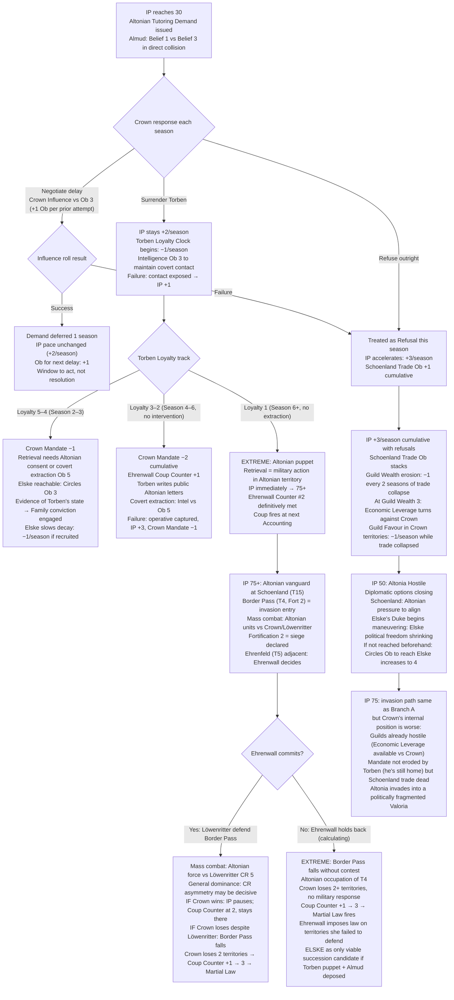
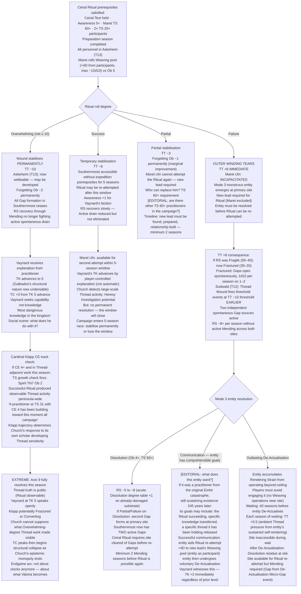

<!-- DERIVED FROM: Checkpoint 14 (compilation/valoria_ruleset_checkpoint_14.md, 2026-03-26) -->
<!-- SESSION: 2026-03-30 / 2026-03-31 — see session_log_archive.md -->
<!-- STATUS: Pre-release reference tool. Not valid against any post-CP14 ruleset. -->

# Valoria — Emergent Campaign Arcs 20–23
*Full mechanical branching · Extreme outcomes permitted*
*Each arc bifurcates at a pivotal roll showing the campaign's wildest divergences*

---

## Arc 20: The Tutoring Demand

**Pivot roll:** Crown Influence vs Ob 3 (negotiate delay) — or the decision to refuse entirely
**Primary mechanics:** IP threshold (30 = Tutoring Demand) · Torben Loyalty Clock · IP acceleration on refusal (1.5×) · IP 75 invasion trigger · Border Pass (Territory 4, Altonian entry point) · Ehrenwall Coup Counter
**Primary NPCs:** King Almud Almqvist · Prince Torben Almqvist · Grandmaster Ehrenwall · Princess Elske

---

### Narrative

IP 30 arrives quietly. The Altonian demand is formal, politely worded, and non-negotiable: Torben must be sent for education in Altonian court. Almud reads it three times. His first Belief — *I will hold the Altonian relationship open regardless of what it costs me* — and his third — *My son must be ratified before the succession becomes a weapon* — have been in latent conflict since the campaign began. The demand forces them into direct collision.

Every season Almud delays by negotiating, the Ob rises by 1 — a compounding cost for a king whose Influence pool is not inexhaustible. Every season he refuses outright, IP accelerates to 1.5× pace. The players watching this from outside the Crown understand that neither option is safe. What they may not realise yet is that this is not the crisis. The crisis is what happens after the decision.

The two branches diverge completely. In one, Torben goes to Altonia and returns a stranger. In the other, Torben stays and the army comes. Both paths eventually reach a moment where Ehrenwall is counting. She has her own Ob. She does not share it with anyone.

---

### Branch A — Torben Surrendered

Almud yields. IP stays at base pace. Torben departs. The loyalty clock begins: −1/season, floor at 1. Covert contact by the Crown's intelligence apparatus can hold the decay — but Intelligence vs Ob 3 each season, and failure doesn't just stop the contact, it may expose it (IP +1 if detected).

By Season 3 in Altonia, Torben is Adapting (Loyalty 5–4). Crown Mandate −1. Retrieval now requires Altonian consent or covert extraction. By Season 5–6, if uninterrupted, he is Altonia-aligned (Loyalty 3–2). Crown Mandate −2 cumulative. Torben writes public letters praising Altonian governance. Ehrenwall marks Coup Counter +1.

Elske is the emergency lever. She is in Altonian territory already. Circles Ob 3 to reach her — she is embedded but not controlled. If the players show her concrete evidence of what is happening to her brother (Evidence resonance; Abstract appeals rejected), the Family conviction engages. She can slow loyalty decay by −1/season through maintained contact. She cannot reverse it alone.

If Loyalty hits 1 before Elske stabilises the situation, Torben is an Altonian puppet. Retrieval now requires military action in Altonian territory. IP immediately jumps to 75+. Border Pass (Territory 4) becomes the invasion entry point. Ehrenwall's Coup Counter #2 is definitively met. She does not wait for Counter #3.

### Branch B — Crown Refuses

Almud refuses. IP accelerates to +3/season (1.5×). Each subsequent refusal: Schoenland Trade Ob +1 cumulative. The Guilds, who derive revenue from Schoenland trade routes through Sternhaven (Territory 7) and the sea route through Territory 15, begin losing Wealth. By Season 2 of refusal, Guild representatives approach Parliament. By Season 4, Guild Economic Leverage turns against the Crown — not because the Guilds are hostile, but because the trade collapse has made Crown policy directly harmful to their economic interest.

IP reaches 75 between seasons 8–10 depending on intervention. When it does: Altonian vanguard deploys to Schoenland (Territory 15). The sea route is severed. Sternhaven (Territory 7) is isolated from its primary trade connection. Border Pass (Territory 4, Fort 2) becomes the active invasion front.

The invasion itself is a mass combat event. Border Pass's Fortification 2 means attackers require a siege declaration. Ehrenfeld (Territory 5) is the Löwenritter position — adjacent to Border Pass. Ehrenwall must decide whether to commit her forces to a border defense while her Coup Counter is at 2 and the Crown she is defending has spent years failing the institutional tests she has been running. If she commits: the invasion is contested. If she holds back, calculating that a failed invasion is more useful to her than a successful defense: Border Pass falls, Crown loses two territories in one season, Coup Counter hits 3, and Ehrenwall imposes Martial Law on the territories she just failed to protect — because the invasion proved the Crown cannot defend itself and she was always going to act on that conclusion.

---

### Mechanical Causal Chain

**Why this arc is emergent:** Almud's Belief collision is structural, not scripted. IP accelerates regardless of player intervention unless specific Domain Actions are run. The Guilds' turn against the Crown follows from their institutional tendency, not hostility. Ehrenwall's calculation at the invasion moment is driven by her Belief and her counter — both of which were building throughout the campaign.

**Arc shape:** IP 30 trigger (Season 3–5 typically). Branch A: 4–6 seasons of loyalty decay, 1–2 seasons of crisis (Elske or extraction). Branch B: 3–5 seasons of IP acceleration, 1 session invasion event, 2–4 seasons of occupation or coup consequence.

---

## Arc 21: The Excommunication

**Pivot roll:** Church Mandate (pool: Mandate d10s, TN 7) vs target's Mandate (Ob = target Mandate, 1–7 scale)
**Primary mechanics:** Excommunication unique action (§8.3) · Baralta TC suppression condition (Mandate ≥ 5) · TC +4 on Baralta excommunication · Church territorial seizure at TC 60 · Martyr effect (failure = Church Mandate −1, target +1) · Grand Debate reversal (5 exchanges)
**Primary NPCs:** Confessor Himlensendt · Cardinal Olafsson · Duchess Baralta

---

### Narrative

Olafsson has been building the file for two seasons. The Heresy Investigation opened after Baralta's Sovereign Authority Doctrine challenge, and the Cardinal of Justice is thorough. The charges are not fabricated — they are technically accurate as Church doctrine reads. Baralta's claim that her ducal authority is a direct divine grant superseding Church jurisdiction is, from within Church theology, precisely the kind of claim that the Inquisitorial apparatus exists to adjudicate. Olafsson is not overreaching. He is doing his job.

The roll is Church Mandate (pool of 5 dice, currently at 5) versus Baralta's Mandate as direct Ob (currently at 7). Ob 7. The Church is rolling 5d10 against a threshold of 7 net successes. The players understand the math — or they should. They also understand what happens on each outcome, which is where the arc diverges so completely that the two branches might as well be different campaigns.

An Overwhelming Church victory is one of the most structurally significant single events in the game. It removes Baralta's TC suppression, immediately spikes TC by 4, triggers the seizure procedure at whatever TC currently sits plus 4, and begins stripping Hafenmark's political capacity at the moment when the players most need it. The Church does not have to do anything else that season. The accounting machinery does it for them.

A failed Excommunication is the mirror image. The Church loses Mandate. Baralta gains it. The institution that just tried to destroy her emerges weaker and she emerges with a sympathy mandate that functionally fortifies her position for two to three seasons. Every NPC in the kingdom who was watching — and they all were — recalibrates. Olafsson does not get a second attempt without rebuilding the file.

---

### Branch A — Church Overwhelming (net ≥ 2× Ob 7, extremely rare but designed)

At Ob 7 against a 5-die pool, Overwhelming requires 14+ net successes — technically possible, practically a campaign-defining event if it fires. The rule as written: Overwhelming on Excommunication = target loses Circles bonus with Church contacts + target faction Mandate −1 + target barred from public office and Church-loyal command + personal Reputation −1 with all factions.

Baralta's Mandate was at 7. It drops to 6. TC suppression threshold is Mandate ≥ 5 — still active, but damaged. The Reputation −1 fires across all factions. Players who had been working through Baralta lose one degree of social access to every NPC she intermediated.

Reversal requires a Grand Debate (5 exchanges) or appointment of a new Confessor. Grand Debate: Olafsson at Church Reach 7 + Ecclesiastical Law vs whoever defends. The quaestio is asymmetric — this is a Church tribunal, no Sed Contra for the accused. Five exchanges. If the players cannot win the Grand Debate, the excommunication stands.

### Branch B — Excommunication Applied (standard Success) to Baralta

Standard Excommunication success: Mandate −1 (from 7 to 6), Church-loyal command barred, Circles with Church contacts lost. TC +4 immediate. Baralta's Mandate 6 is still above 5 — suppression technically active, but barely. One more Mandate hit removes it.

The TC +4 is the structural damage. If TC was at 35 entering this season, it is now at 39. If it was at 40, it is at 44. If it was at 50, it is now at 54 — six points from triggering the territorial seizure cascade. The seizure procedure requires Church Mandate vs territory owner Mandate ÷ 2 each season. With Church Mandate at 5 and territory owners averaging Mandate 4–5, the Church is winning most of these rolls. Major territories seized: TC +3 each. Capital or institutional sites: TC +5.

Valorsplatz (Territory 1, Prosperity 6, TC +5 on seizure) becomes a realistic Church target within two seasons.

### Branch C — Church Fails the Excommunication Roll

Failure: Church Mandate −1 (from 5 to 4). Baralta gains Mandate +1 (sympathy martyr) — she is now at Mandate 8, capped at 7 in the 1–7 stat system. TC suppression is now rock solid. The attempt exposed Olafsson's overreach.

Baralta holds circumstantial evidence of the Olafsson-Niflhel connection. The failed excommunication is the political opening she needed to act on it. Domain Action: Mandate 7 + Reach 5 + player evidence bonus vs Church Stability Ob 3. If it succeeds: Church Stability −2, TC −3, Olafsson's Inquisitor operations suspended. The campaign's political geometry has inverted. The Church is defending.

---

### Mechanical Causal Chain

```mermaid
flowchart TD
    A["Olafsson files complete (2 seasons building)\nExcommunication action declared vs Baralta\nRoll: Church Mandate 5d10 TN7 vs Ob 7 (Baralta Mandate)\nPlayers may intervene: supply counterevidence −1 Ob before roll\nor corroborate Olafsson-Niflhel connection (if assembled)"] --> B{Excommunication roll outcome}
    
    B -->|"Overwhelming (net ≥ 14 — extraordinary)"| C["Baralta: Circles lost with Church contacts\nReputation −1 ALL factions\nBarred from public office and Church-loyal command\nMandate −1 (7→6)\nTC +4 IMMEDIATE\nGrand Debate required to reverse (5 exchanges)"]
    C --> D["Grand Debate: Olafsson Church Reach 7 + Ecclesiastical Law\nvs player/Baralta pool\nAsymmetric tribunal — no Sed Contra for defence\nOb: Olafsson's pool vs Ob = defence pool ÷ 2\nIF PLAYERS LOSE: excommunication permanent this arc\nBaralta's TC suppression: 6 ≥ 5 — still active\nbut one more Mandate hit removes it permanently"]
    D --> E["EXTREME: Olafsson files second charge next season\nMandate 6 now = Ob 6 on second roll\nChurch Mandate 4d10 (−1 from failed first attempt) vs Ob 6\nMore favourable odds than initial roll\nIF second attempt succeeds: Mandate 5 — suppression threshold met exactly\nIF second attempt Overwhelming: Mandate 4 — suppression gone\nTC +4 again on second success\nDouble excommunication sequence: TC now +8 over two seasons from baseline"]
    
    B -->|"Success"| F["Baralta: Church command barred, Circles Church lost\nMandate −1 (7→6)\nTC +4 IMMEDIATE\nBaralta Mandate 6 ≥ 5 — suppression still active by 1 point\nBut: TC now at [prior TC + 4]\nIf prior TC was 40+: territorial seizure cascade begins"]
    F --> G["Church seizure procedure fires each season at Accounting\nChurch Mandate (5d10) vs territory owner Mandate ÷ 2\nMinor territory: TC +1 on seizure\nMajor territory (Hafenstadt T6, Sternhaven T7): TC +3\nValorsplatz T1: TC +5 — requires Church Mandate vs Crown Mandate ÷ 2 = Ob 3"]
    G --> H{TC trajectory}
    H -->|"TC reaches 60 within 2 seasons"| I["EXTREME: Valorsplatz seizure attempt\nChurch Mandate 5 vs Crown Mandate ÷ 2 (Ob 3)\nExpected success rate: ~70%\nIF SUCCESS: TC +5 from Valorsplatz seizure\nCrown loses capital administrative control\nAll non-Church Domain Actions in Valorsplatz: +2 Ob\nMandate-conferring capacity in capital: suspended\nFunctional end of Crown as political actor until reversed\nReversal: Parliamentary challenge Influence Ob 3 OR Grand Debate OR Riskbreaker exposure"]
    H -->|"Players run counter-Domain Actions each season"| J["Riskbreaker exposure: each op removes 1 seized territory\nprevents re-seizure for 1 season\nBut: Crown Deniability Debt +1 per operation\nAt Debt 3: all Crown Domain Actions +1 Ob\nPlayers are paying Deniability to fight the seizures\nAt Debt 5: Parliamentary inquiry fires\nGrand Debate (5 exchanges) — Crown's Mandate and Reach at stake"]
    
    B -->|"Failure"| K["Church Mandate −1 (5→4)\nBaralta Mandate +1 (7→7, capped — sympathy martyr)\nTC unchanged\nOlafsson cannot retry without rebuilding file (1 season minimum)\nBaralta holds Olafsson-Niflhel circumstantial evidence"]
    K --> L["Baralta acts: Domain Action vs Church Stability Ob 3\nPool: Mandate 7 + Reach 5 + player evidence bonus\nIF SUCCESS: Church Stability −2, TC −3\nOlafsson Inquisitor operations suspended\nChurch Mandate now 3 (from −1 on failed excommunication)\nAt Mandate 3: TC +1/season auto-generation requires Mandate 5+\nChurch has temporarily lost automatic TC advance"]
    L --> M["EXTREME: Church Stability 3 → 1 from combined Baralta Domain Action + Stability check failure\nAnti-spiral floor activates at Stability 2\nOb 4 regardless of actual pressure for all Church Stability checks\nJarnstal: Templar independence Belief now facing institutional fracture\nHimlensendt: leading a Church at Stability 1 while Baralta holds the Olafsson file\nChurch is on the edge of factional collapse\nPlayers have a 1–2 season window to either consolidate this OR allow Church to recover\n(Recovery: Stability +1 on Overwhelming seasonal check at Ob 4 ≈ ~15% chance per season)"]
```

**Why this arc is emergent:** The Excommunication roll is a 5-die pool versus Ob 7. The outcome probabilities are genuinely variable — all three branches are mechanically plausible. Baralta's TC suppression, the martyr mechanic, and the seizure cascade are all designed-in consequences. No player engineered the divergence.

**Arc shape:** 2-season file-building. 1 session roll. Immediate TC/Mandate consequences. Branch A/B: 2–4 season seizure cascade or Grand Debate recovery. Branch C: 1–2 season Baralta counter-offensive, possible Church collapse event.

---

## Arc 22: The Ceiral Ritual

**Pivot roll:** Lead practitioner Weaving pool vs Ob 5
**Primary mechanics:** Ceiral Ritual (§6.5) · Degree table (Overwhelming/Success/Partial/Failure) · TT/RS consequences · Mode 3 monstrous entity on Failure · Lead practitioner incapacitation · Southernmost territory development (Overwhelming only) · Expedition prerequisite cascade
**Primary NPCs:** Maret Uln (lead practitioner candidate) · Duke Vaynard · Cardinal Klapp

---

### Narrative

Getting here took years of campaign time. The Ceiral Text had to be found and held. Southernmost Awareness had to reach 5. A practitioner with TS 60+ had to be found, prepared, and committed to the ritual — unavailable for other actions for a full preparation season. Two additional participants with TS 20+ had to be assembled in Askeheim (Territory 13), which requires TS ≥ 30 for all personnel. Military escort dissolved on entry unless everyone qualified.

Maret Uln, Varfell's wild card, is the most likely lead — TS confirmed practitioner-level, pursuing the Ceiral Ritual as a personal Belief. Vaynard has been managing him as an asset while understanding that Maret is not loyal. If Vaynard let the players cultivate this relationship, Maret is available. If Vaynard made the wrong calculation and tried to control Maret too tightly, Maret's loyalty has been dropping — and a practitioner attempting the Ceiral Ritual while carrying an alignment conflict with the faction that got him there has a different intentionality problem than a practitioner working freely.

The roll is Maret's Weaving pool, Ob 5, plus up to +4D from TS 20+ participants. A maximum pool with full participant support is rolling roughly 8–12 dice against Ob 5 with TN 7. The outcomes range across the complete degree table. In no direction is the result moderate.

### Branch A — Overwhelming (net ≥ 10)

The wound stabilises permanently. TT −10. The Southernmost becomes settleable — territory 13 (Askeheim) may be developed and inhabited. This is a campaign-level transformation. Every RS recovery calculation changes. The spontaneous Gap formation that has been draining the substrate ceases. The Forgetting mechanism weakens — the Southernmost is no longer incomprehensible to non-sensitives.

Vaynard's TK immediately advances to 5 if a practitioner explains what just happened and what Galbados structurally was — this was always the knowledge he was pursuing, and the successful Ritual makes the explanation undeniable. TC +3 from TK 5 (cumulative with existing advances). He seeks capability, not further knowledge. The conversation after the Ritual, in a world where the wound is closed and the question is what to do with that, is the most consequential social scene of the campaign.

Cardinal Klapp, if his CE track has been advancing from archive work, is now one Discovery Event away from his TS growth check firing in a world where the Southernmost is no longer sealed. The Ritual produced observable Thread activity that TS 30+ observers across the peninsula perceived. If Klapp is TS 31 and was anywhere near Southernmost-related documents during this season: the check fires.

### Branch B — Failure (net ≤ 0)

The outer winding tears. TT +8. A Mode 3 monstrous entity — a threadcut being — emerges at the primary site. It is not hostile by nature, but it is present in the physical world, actively sustaining its own existence through continuous Thread work, and the practitioners who just disturbed the site are the closest available substrate.

Maret Uln is Incapacitated. The Ceiral Ritual cannot be re-attempted by Maret — he is the lead practitioner who failed; the rule is that a new lead is required. Vaynard has lost his most valuable Thread asset on the most consequential roll of the campaign. The Mode 3 entity requires resolution: Dissolution (Ob 4+, risks second Gap, acute RS damage), Pulling to weaken then conventional combat, communication (possible — threadcut beings may have comprehensible goals), or outlasting its De-Actualisation if it is accumulating Rendering Strain.

TT +8 means the RS tracker has moved significantly. If RS was already Fragile (59–40), it may now enter Fractured (39–20): Gaps open spontaneously, 1d10 per season on 1–2 in the lowest-Prosperity territory. Sudwald (Territory 12) has a Thread Wound that fires threshold events 10 TT points earlier than elsewhere — it is already generating pressure. TT +8 into a Fractured world means two independent spontaneous Gap sources active simultaneously next season.

---

### Mechanical Causal Chain

**Why this arc is emergent:** The Ritual requires converging five independent prerequisites across multiple campaign seasons. The outcome is fully determined by a single Weaving roll, but the consequences cascade differently across the political, Thread, and NPC systems depending on degree. No player can predict which degree fires.

**Arc shape:** 3–5 seasons of prerequisite assembly. 1 session Ritual attempt. Immediate TT consequences. Branch A: endgame arc (Axis 9 resolution, Vaynard capability, Klapp crisis). Branch B: 2–3 seasons of Mode 3 resolution + Mending before re-attempt possible.

---

## Arc 23: The General Falls

**Pivot roll:** Medicine Ob 2 (stabilise incapacitated general) — rolled in Phase 5, one-turn window
**Primary mechanics:** General two-stage incapacitation (§8.9) · Stage 1 (incapacitated): CR halved, Morale floor suspended · Stage 2 (killed): −2 Morale outside cap, CR = 0, all units uncommanded · Rout contagion brake · Leader defeat capture mechanic (Agility vs net successes) · Faction Military stat consequences from battle outcome · Ehrenwall as specific NPC
**Primary NPCs:** Grandmaster Ehrenwall · Cardinal Jarnstal (alternative scenario)

---

### Narrative

The general is the battle. The rules say this plainly. CR 5 versus CR 2 is an asymmetric outcome before a die is rolled. But CR does not protect the general from a weapon. The two-stage incapacitation rule exists because the game models what happens when the army watches its general fall.

The Medicine roll in Phase 5 is a single opportunity. Ob 2. A character with Medicine History rolls their pool against Ob 2 in the same phase where the Cascade fires — all the Cohesion checks, all the Morale triggers, all the damage applications happen first, and then, if the general is at Stage 1, one character may attempt stabilisation. If nobody has invested in Medicine History, nobody rolls. If the roll fails, Stage 2 fires at the start of the following turn's Phase 5. Not immediately. The army has one more turn to act under a half-CR general with no Morale floor. Then the general dies.

Ehrenwall at Stage 2 is not a tactical setback. It is a campaign event. The Löwenritter's institutional effectiveness is structurally dependent on her. Without her, CR = 0, every unit is uncommanded, the formations can only fight as Line at Cohesion floor 1. The force that she built over a career of service becomes, in mechanical terms, an ungoverned mass of soldiers who each individually roll against their own Morale thresholds while receiving no stabilising floor from the person who gave it meaning.

For the players, her death raises an immediate question: if Ehrenwall's coup counter was at 2, and she is dead, what triggers the coup? The answer is: nothing. The counter was hers. The coup was her judgment. Without Ehrenwall, there is no coup. There is also no army defending the Crown's northern border, no institutional check on Church military overreach, and no one in the kingdom who both commands the Löwenritter's respect and cares about Valoria's institutional survival enough to hold.

---

### Branch A — Medicine Roll Succeeds (Ehrenwall Stabilised at Stage 1)

Ehrenwall is at Stage 1. CR halved (5 → 3). Morale floor suspended — units can now route below 1 if triggers stack. She is alive, she is functional at reduced capacity, and the battle continues under a diminished command.

The Morale cap (−3 per Cascade Phase) still applies. General incapacitation Stage 1 fires −1 Morale on all units this phase. If the battle was already going badly — two or more units below 50% Size, allied unit routed in zone — the Morale triggers for those conditions stack with the Stage 1 penalty. If the total hits −3 (the cap), that is the maximum damage this phase. But the Morale floor is gone. Units that were holding at Morale 1 under the floor are now rolling against Morale 0 on next phase's triggers.

Recovery: Ehrenwall may be stabilised back to full capacity with a full-round out-of-combat Medical action (no roll required if Stage 1 is already stabilised — she needs time, not additional medicine). If the battle permits a Reform Phase where she is not engaged, she returns to CR 5 next turn. The window was one turn of reduced CR.

### Branch B — Medicine Roll Fails (Stage 2 fires next turn)

Stage 2: −2 Morale all units (outside the cap — this fires on top of whatever Cascade Phase cap has already applied). CR = 0. All units uncommanded.

Uncommanded units: fight at Line formation, Cohesion floor 1, no tactics available. They do not rout automatically — they still roll against their Morale thresholds — but the Morale floor is gone and the −2 Morale from Stage 2 has already fired. A unit that was at Morale 4 entering Stage 2 is now at Morale 2 with no floor. One more rout trigger and it is at 1. One more and it routs.

Rout contagion brake: routing units cause −1 Morale to adjacent units, but this secondary loss cannot itself cause further routs until the next turn. This prevents instant cascade. But the next turn, if the battle continues, secondary contagion is live. With Morale 1–2 across the board, the following turn's Cascade Phase is a sequential rout event.

The capture mechanic activates for Ehrenwall: attacker rolls net successes against her, she rolls Agility vs that as Ob. Failure: captured. Failure by 3+: attacker chooses to kill. A captured Ehrenwall is leverage — whoever holds her holds the implicit threat of removing the institution she represents. A killed Ehrenwall is a vacancy the Löwenritter fills by internal selection, which takes seasons and produces a CR 3 successor at best.

---

### Mechanical Causal Chain

```mermaid
flowchart TD
    A["Mass battle: Ehrenwall's force engaged\nEhrenwall takes a Wound in Phase 4 or from Thread operation\nWounds reach ceiling(Health ÷ 2): Incapacitation threshold\nStage 1 fires: CR halved (5→3), Morale floor suspended"] --> B["Phase 5 — Cascade strict order:\n1. Apply all Size damage\n2. Cohesion checks (deterministic)\n3. Morale checks (Stage 1 penalty: −1 all units, inside −3 cap)\n4. General action available\n5. MEDICINE ROLL: Medicine History + attribute vs Ob 2\n   One turn window — if not attempted here, Stage 2 fires next turn"]
    B --> C{Medicine roll}
    
    C -->|"Success (Ob 2 met)"| D["Ehrenwall stabilised at Stage 1\nCR 3 (halved) for this turn\nMorale floor still suspended — units can rout below 1\nReform Phase: Ehrenwall recovers if not engaged\nNext turn: CR 5 restored if battle allows recovery\nBattle continues under reduced command for 1 turn only"]
    D --> E["Morale check sequence with suspended floor:\nUnits that were at Morale 1 under floor: now at actual Morale 1\nIf ANY rout trigger fires this Cascade Phase:\nAdjacent unit −1 Morale (contagion)\nContagion brake: secondary loss cannot cascade until NEXT turn\nIf battle ends this turn: full recovery, no permanent consequence\nIf battle extends: contagion may produce 1–2 secondary routs next turn"]
    E --> F["Ehrenwall recovers turn 2\nCR 5 restored\nBattle likely winnable at full CR if not catastrophically behind\nCoup Counter: UNCHANGED — Ehrenwall herself holds the counter\nHer survival means the coup logic persists\nIf the battle was over TC 40 + Crown inaction: Counter still increments at Accounting"]
    
    C -->|"Failure OR nobody has Medicine History"| G["Stage 2 fires: start of NEXT turn Phase 5\n−2 Morale ALL units (OUTSIDE −3 cap — stacks on top of prior phase)\nCR = 0: all units uncommanded\nLine formation only, Cohesion floor 1, no tactics"]
    G --> H["Turn 2 Cascade with Stage 2 applied:\nUnits at Morale 2–3 entering Stage 2 are now at Morale 0–1\nMorale 0: ROUT\nRout contagion: −1 Morale adjacent units\nContagion brake holds THIS turn\nTurn 3: secondary contagion live — if units at Morale 1 from last turn's contagion\nhit ANY additional trigger: they rout too"]
    H --> I{Battle resolve}
    I -->|"Attacker presses advantage"| J["Leader defeat mechanic fires if Ehrenwall's unit is destroyed/routed:\nAttacker net successes vs Ehrenwall Agility as Ob\nIF CAPTURED: Ehrenwall held as prisoner\nLöwenritter army: Morale collapse continues each turn without her\nWhoever holds Ehrenwall holds leverage over Löwenritter loyalty\nFactions that might ransom her: Crown (desperate), Church (uses her as tool)\nFactions that benefit from her absence: Altonia (coup counter gone), Church (Templar independence unchecked)"]
    I -->|"Players rally uncommanded units\n(Domain Action: Influence vs Ob 2 to assume temporary command)"| K["Player character assumes CR role\nPlayer's CR = ⌈(Presence + Cognition) ÷ 2⌉ — likely 2–4\nUnits respond to improvised command\nFormation options restored at player CR limit\nBut: Löwenritter units trained under Ehrenwall's doctrine\nLeadership Deviation equivalent: player choices contradicting Löwenritter institutional tendency\n= Stability check Ob 2 at next Accounting for any deviation"]
    
    J --> L["EXTREME: Ehrenwall killed (attacker chooses when failure by 3+)\nLöwenritter lose institutional general permanently\nCoup Counter: EXTINGUISHED — counter was hers, not the institution's\nNo coup. No floor. No institutional check on Church or Crown.\nLöwenritter succession: internal, 2+ seasons, produces CR 3 general\nEhrenwall's death creates a power vacuum the Church is best positioned to fill\nJarnstal: Templar independence Belief now faces zero external military check\nTC momentum is unchecked\nValoria has lost the one NPC who was watching the right numbers"]
    L --> M["Factional cascade from Ehrenwall's death:\nCrown Mandate −1 (lost its most competent military institutional ally)\nLöwenritter Stability check Ob 3 (death of defining general)\nAll pending coup trigger evaluations: NULL — no one is counting\nThe Church consolidates in the vacuum\nAxis 6 (Military authority): Jarnstal moves to fill the void without Ehrenwall's counter-pressure\nAxis 1 (Sovereignty): Crown has lost its deniable military instrument\nIf TC ≥ 40: Templar deployment is now uncontested\nValoria's political geometry has changed permanently"]
```

**Why this arc is emergent:** The Medicine roll is Ob 2 — not difficult in isolation. Whether anyone in the scene has Medicine History is a character-creation consequence, not a tactical decision made during the battle. The two-stage death mechanic, the rout contagion, and the capture check are all automatic consequences of a single failed stabilisation roll. Ehrenwall's coup counter being personal to her — not institutional — is a design decision that means her death does not trigger the coup; it eliminates it entirely.

**Arc shape:** Battle scene (1–2 sessions). Medicine roll fires in Phase 5 of Turn 1. Branch A: 1-turn reduced command, battle continues. Branch B: Stage 2 fires Turn 2, rout cascade Turn 3, capture or death resolution, permanent factional consequences. Post-death arc: 2–4 seasons of vacuum.

---

## Cross-Arc Interaction Table

| Collision | Arcs | Mechanic | Extreme potential |
|---|---|---|---|
| Tutoring Demand Branch B (refusal → IP 75) fires in the same season as Excommunication fails (Church Mandate −1) | 20 + 21 | Altonian invasion arrives into a Church at Stability collapse — Church cannot deploy Templars to contest Border Pass because Jarnstal's Stability check is also failing this season | EXTREME: Altonia and Church fracture simultaneously; Valoria faces external invasion with no unified institutional defense |
| Ceiral Ritual fails (TT +8) in the same season as Parliamentary Tie (TC +1, RS −1) | 22 + 18 | RS −9 total this season (TT +8 + RS −1 from tie) — may cross from Fragile directly to Critical | EXTREME: RS Critical in one season; all Thread operations now +1 Ob worldwide; spontaneous Gaps double; faction Stability checks at Ob 1 minimum fire for every faction |
| Ehrenwall killed in the same season Torben surrendered (Branch A) with Loyalty clock at 3 | 23 + 20 | Coup Counter extinguished by her death, but Torben at Loyalty 3 has already triggered Mandate −2 on Crown; Ehrenwall's institutional check on Church is gone; Church moves into the vacuum her death created | EXTREME: Crown at Mandate 3 (−2 from Torben), Löwenritter without direction, Church at TC 50+ — full dominance arc now has no mechanical resistance except Baralta alone |
| Excommunication Overwhelming (Branch A) fires in the same season as Ceiral Ritual Overwhelming (Branch B) | 21 + 22 | TC +4 from Baralta excommunication + TC +3 from Vaynard TK 5 advance post-Ritual = TC +7 in one season; simultaneously RS stabilises permanently and Axis 9 resolves | EXTREME: The season the world is saved is the season the Church achieves peak institutional power; the Ritual's success is politically catastrophic; Valoria has a healed substrate and a theocratic government |

---

*All arcs compliant with arc generator protocol. No Niflhel Thread harvesting. Seasonal cap (±2 per stat) applied throughout — TC +4 from Excommunication is an immediate one-time consequence (unique action), not a seasonal stat change, and is therefore not subject to the cap.*
