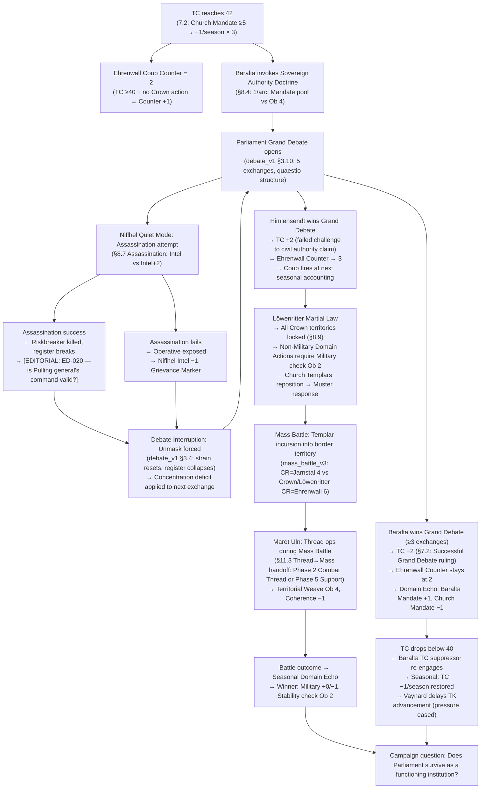
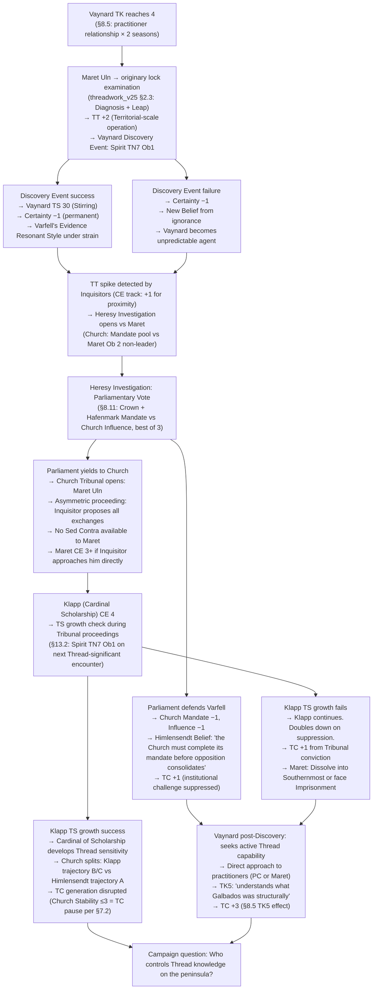
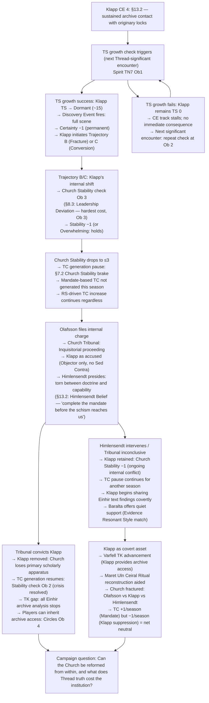

# Valoria — Emergent Hybrid Campaign Arcs 31–35
## Generated: 2026-04-01
## Skill: valoria-arc-generator
## Scope: Exhaustive hybrid simulation — all five systems (combat, debate, mass battle, threadwork, faction play), sequenced to inform each other via domain echoes.
## Prior arcs: 01–30 (see designs/gm_ref_cp14/arcs/). These arcs begin at 31.

---

## Arc 31: "The Quaestio of Baralta"
**Primary mechanics:** TC threshold (§7.2), Grand Debate (§9 / debate_system_redesign_v1), Löwenritter Coup Counter (§8.9), Niflhel Quiet Network (§8.7), Personal Combat (§8), Mass Battle (mass_battle_v3), Thread → Mass handoff (§11.3)
**Primary NPCs:** Baralta, Himlensendt, Ehrenwall, Olafsson, Vaynard, Maret Uln

---

### Narrative

Parliament convenes in the cold season with TC at 42. No one calls it a crisis. The Cardinals have spent three seasons placing men in ducal courts and minor administrative offices; Baralta has spent the same three seasons watching each appointment and saying nothing, waiting for a number she had set in her head. She invokes the Sovereign Authority Doctrine in the opening session. The galleries fill. The merchants send observers. By the end of the first week, every faction in Valoria knows a Grand Debate is coming.

The formal proceeding opens in the Parliament chamber. Himlensendt proposes the Church's civil authority claims are grounded in Galbados's revealed mandate; Baralta objects. What no one accounts for is Niflhel. Olafsson has been using Riskbreakers as an intelligence pipeline — a connection Baralta knows about but cannot prove. During the second exchange, a Riskbreaker operative is found dead in the servants' corridor. The discovery breaks the formal register. For a session, it looks as though violence will substitute for argument. It does not. But the interruption costs Baralta two phases of Concentration and transforms what was a procedural debate into a character trial.

If Baralta wins: TC drops 2, the Church overreach narrative gains traction, and Ehrenwall's count sticks at 2. If she loses: TC rises, Mandate erosion triggers coup counter increment 3, and the Löwenritter mobilise. Either outcome triggers a territorial response. The Church's Templars are already positioned at two duchy borders. Whether to interpret that as defensive posture or military threat becomes the next season's opening question — and the answer is not rhetorical.

---

### Mechanical Causal Chain

**Why this arc is emergent:** TC rising from Church Mandate (not player action) activates Baralta's unique mechanic; Baralta's move activates Niflhel's opportunism (not directed by any player); the Löwenritter counter increments from TC level (passive threshold, not player decision). Three independent systems produced the crisis before any player acted on it.

**Arc shape:** 3–4 seasons. Season 1: TC threshold + Baralta declaration. Season 2: Grand Debate proceeding + assassination. Season 3: Debate resolution + Templar repositioning. Season 4 (conditional on H2): Martial Law + Mass Battle.

---

### Domain Echo Sequence

| Personal action | Domain Echo | Mechanic |
|---|---|---|
| Baralta wins Exchange 1 by margin ≥3 | Church Mandate −1 (audience response) | debate_v1 §3.6: Overwhelming → +1 Disposition step |
| Niflhel operative exposed | Niflhel Intel −1; Olafsson Grievance Marker | §8.7 Assassination mode failure |
| Maret Uln territorial Weave (Success) | Löwenritter Cohesion +1 in contested zone | §11.3 Thread→Mass, Phase 5 Support |
| Vaynard requests Thread education (TK 3) | Succession leverage formally linked to Southernmost access terms | §8.5 Vaynard TK track |

---

### Gap Log

[GAP-ARC-31-01] Grand Debate proceeding — Ob per phase not specified in debate_v1 §5.2 [GAP-DS-01]. Assuming Ob 1 standard with institutional modifier (+1 Ob for Church disadvantaged Genre at Baralta's Hafenmark audience, per §3.7 Categorical Imperative). Needs confirmation.

[GAP-ARC-31-02] Assassination mid-Debate timing — no rule specifies how a Niflhel action interrupts a formal social scene. Proposed: Niflhel action resolves at end of Phase 1 (between exchanges); if it succeeds, the register shift fires before Exchange 2. If it fails, the scene continues uninterrupted.

[EDITORIAL: ED-ARC-31-01 — Forced Unmask from external disruption (violence in the chamber)] — No rule establishes whether a violent interruption forces an Unmask on the participant who was leading the exchange. Proposed: disruption of the formal register forces Unmask only if the disruption physically involves one of the participants. Ambient violence (death in a corridor) constitutes a Register Shift, not Unmask. Both have different mechanical consequences.

---

## Arc 32: "Vaynard's Confession"
**Primary mechanics:** Vaynard TK track (§8.5), Discovery Event (§8.5), Thread operations (threadwork_v25), Inquisitor CE track (§13.6), Parliamentary Vote (§8.11), Faction play (§8.1)
**Primary NPCs:** Vaynard, Maret Uln, Olafsson, Klapp, Baralta, Himlensendt

---

### Narrative

Vaynard has been acquiring pieces of a puzzle he cannot name. At TK 3, he can articulate the structure of what the Church is hiding even if his specific theory is wrong in three of its four components. At TK 4, he wants more than knowledge — he wants a partner with capability. The person he chooses is Maret Uln, and that choice is the moment when two independent systems collide: Varfell's institutional consequentialism (which evaluates Maret as an asset) and the Inquisitor track (which has been building a CE dossier on Maret for two seasons).

When Maret performs a Thread operation in Vaynard's private collection — in contact with an originary lock object — Vaynard experiences a Discovery Event. The GM rolls Spirit vs Ob 1. If he makes it, his TS advances to 30 and the world reorganises itself for him in a way he cannot communicate to anyone. If he fails, Certainty −1 and a new Belief forms from behind a position of ignorance. Either outcome destabilises the faction's political coherence — Varfell's Resonant Style is Evidence, and their leader has just had an experience that is constitutively non-evidential.

The Inquisitors close in two seasons after the originary lock event generates a Thread Tension spike (+2 TT from Maret's operation). Olafsson has an evidence file. A Heresy Investigation opens. Parliament must decide whether to defend Varfell or allow the Church's procedure to proceed. The Parliamentary Vote mechanics engage: three exchanges, Crown and Hafenmark pool Mandate against the Church's Influence. If the Church wins, Vaynard stands trial and the Grand Debate is a Church Tribunal — an asymmetric proceeding where the Inquisitor proposes all exchanges.

---

### Mechanical Causal Chain

**Why this arc is emergent:** Vaynard's TK advancement is driven by his Beliefs and faction Unique Action (Private Collection) — not player-directed. The originary lock operation produces TT that activates the Inquisitor track — two independent tracks whose outputs collide. Klapp's CE advancement is a background process running across all prior Church scenes. No single player designed the collision.

**Arc shape:** 4–5 seasons. Season 1: TK 3→4 via practitioner relationship. Season 2: Originary lock event + Discovery Event. Season 3: Inquisitor response + Parliamentary Vote. Season 4–5: Tribunal or post-discovery Vaynard pursuing capability.

---

### Domain Echo Sequence

| Personal action | Domain Echo | Mechanic |
|---|---|---|
| Maret Uln successful Territorial Weave | TT +2 | threadwork_v25: TT drift at Territorial scale |
| Vaynard Discovery Event (success) | Varfell Stability check Ob 2 (leader ideological disruption) | §8.1 Leadership Deviation |
| Klapp TS development | Church Stability −1 (factional disruption) | §13.2 CE track → Stability |
| Tribunal conviction | Maret removed from play; TK5 effect fires (TC +3) | §8.5 TK track |

---

### Gap Log

[GAP-ARC-32-01] Vaynard TK advancement after Discovery Event — TK5 says "understands what Galbados was structurally." There is no rule for what happens if Vaynard reaches TK5 before players do. Is this a hard endgame trigger or an escalation? Flagged: the TK track needs a "Vaynard acts independently at TK5" clause.

[EDITORIAL: ED-ARC-32-01 — Vaynard at TK5: does he attempt to acquire Thread capability himself, or does he only pursue knowledge-brokerage?] Proposed: at TK5 he attempts to hire or coerce a practitioner for operational capability, not perform operations himself. His framework is consequentialist — he would never risk the Discovery Event personal cost without understanding the mechanism. This makes him a faction-side actor, not a practitioner, which keeps the system boundary intact.

---

## Arc 33: "The Forgetting Road"
**Primary mechanics:** Southernmost expedition (§6.3), Forgetting (§6.1), Coherence track (§4.5), Personal combat (§8), Thread operations in Southernmost, Faction consequence on return (§11.3 Domain Echo), TC spike
**Primary NPCs:** Maret Uln, Almud (indirect), Inquisitors, Baralta

---

### Narrative

Someone goes into the Southernmost and comes back. This is the arc. Everything else — the politics, the mass battle, the inquisition that follows — is the consequence of that single structural fact.

The expedition uses Approach Training-tagged practitioners (TS ≥ 30 to cross the Forgetting barrier). Inside, the Forgetting strips the name of what you are looking for — you can hold the intention, the direction, but not the content of the goal. Every time you reach for the memory of why you are here, it has moved. What you can do is Thread operations. The oscillation inside Southernmost registers at personal scale even when the entity you are addressing is vast. This is the trap the Einhir walked into at territorial scale. The practitioners go in knowing this. They work small.

What they bring back is the Ceiral Ritual — a partial reconstruction, sufficient to perform the first complete cycle in 45 years. That is what crosses the Forgetting boundary when they emerge. Not the text. Not the object. The practitioners themselves, whose configurations now hold the procedure. They are, in the most literal sense of Foundations §1, changed. The Inquisitors notice within two seasons. The Church's response is not theological argument. It is the deployment of Templars. The mass battle that follows is not over territory. It is over whether any practitioner who has been to the Southernmost can exist in civil Valoria.

---

### Mechanical Causal Chain

```mermaid
flowchart TD
    A["Expedition departs: TS ≥30 required\n(§6.1: TS <30 → dissolve without awareness)"]
    B["Forgetting mechanics: -1 Ob to Weave at Object scale\n(§6.1: works at reduced scale)\n+1 Ob to recall purpose per scene (GM judgment)\nCoherence −1 per day of deep interior exposure"]
    C["Combat encounter: Southernmost entity\n(§5.13: monstrous configurations, Mode 3)\n→ Personal combat pool, Zone-based\n→ Standard Wound rules apply\n→ CE +2 per party member (direct Thread encounter)"]
    D["Ceiral Ritual reconstruction\n(§6.5: Ceiral Ritual mechanics)\n→ TT −3 if successful (sustained cycle)\n→ Coherence cost: −2 per participant"]
    E["Return across Forgetting boundary\n(§6.1: memories stripped but configuration changed)\n→ All practitioners gain 'Ceiral-configured' status\n→ GM notes TS growth potential on next dormancy season"]
    F["TC spike: practitioners with Ceiral knowledge exist\n(§7.2: 'Practitioner-healed configuration at territorial scale' event)\n→ TC +3 (one-time event on return)"]
    G["Inquisitor CE track activates\n(§13.6: CE +2 for direct Thread encounter proximity)\n→ Heresy Investigation filed within 2 seasons"]
    H["Faction response: Baralta offers sanctuary\n→ Hafenmark Domain Action: Influence vs Church Mandate Ob 5\n→ Outcome determines whether practitioners are tried or protected"]
    I1["Baralta success: practitioners sheltered\n→ TC −1 (rival civil authority claim holds)\n→ Heresy Investigation stalled\n→ Baralta Mandate +1 (principled defiance)"]
    I2["Baralta fails or declines: Templars mobilise\n→ Muster: Church Military +1 (Templar activation)\n→ Mass Battle: Templar units vs Hafenmark garrison\n→ CR: Jarnstal 4 vs Hafenmark commander CR 3\n→ Thread in Mass Combat: Ceiral-configured practitioners available"]
    J["Mass Battle: Thread support available\n(mass_battle_v3 §A.10: Territorial Weave Ob 4, Coherence −1)\n→ Phase 5 Support: Cohesion +1 to allied unit\n→ Phase 2 Combat Thread: Dissolution of Templar formation (TS 50+, Ob 4)"]
    K["Battle outcome\n→ Win: Practitioners survive; TC +1 (confrontation cost)\n→ Lose: Practitioners captured; Tribunal; TC +3"]
    L["Ceiral Ritual cycle begins\n(§6.5: TT −3/season if maintained)\n→ Long-term TT management solution\n→ Campaign structural question answered"]

    A --> B
    B --> C
    B --> D
    C --> D
    D --> E
    E --> F
    F --> G
    G --> H
    H --> I1
    H --> I2
    I2 --> J
    J --> K
    K --> L
    I1 --> L
```

**Why this arc is emergent:** TC spike on return is automatic (§7.2 event table — no player action can prevent it). Inquisitor CE track has been running independently from any Southernmost-related play. Baralta's response is determined by her Beliefs and Mandate level at the time — not scripted. Three systems collide at the return moment without any single player engineering the crisis.

**Arc shape:** 3-season arc once expedition begins. Pre-arc: 1–2 seasons of expedition preparation (Approach Training, faction positioning). In-Southernmost: runs as personal-scene TTRPG arc (1–2 sessions). Return: TC spike + faction cascade plays out over 2 seasons.

---

### Domain Echo Sequence

| Personal action | Domain Echo | Mechanic |
|---|---|---|
| Ceiral Ritual performed (Success) | TT −3 | §6.5 Ceiral Ritual outcome |
| Return with Ceiral knowledge | TC +3 | §7.2 one-time event |
| Baralta shelters practitioners (Success) | Baralta Mandate +1; Church Mandate −1 | §8.3 Unique Action / §11.5 Domain Echo |
| Mass Battle (practitioner Thread support, Success) | TT −1 (controlled Dissolution during battle) | §11.3 Thread→Mass handoff |

---

### Gap Log

[GAP-ARC-33-01] Ceiral Ritual reconstruction — §6.5 mechanics exist but the "practitioners carry the procedure in their configuration" outcome has no defined mechanical representation. The practitioners have changed but the change is not tracked on the character sheet. Proposed: tag characters with `Ceiral-trained` status granting +1D to collective Thread operations until next Coherence crisis; this is a P2 design gap.

[EDITORIAL: ED-ARC-33-01 — Southernmost entity combat (Mode 3): are the combat rules for monstrous configurations settled, or do they require a separate encounter design?] Stage13/§5.13 establishes they exist but specific stat blocks are not in the current compilation. Per simulation scope, treating as standard combat with Ob +1 for alien geometry (spatial disorientation). Flagged for NPC design pass.

---

## Arc 34: "Ehrenwall's Count"
**Primary mechanics:** Löwenritter Coup Counter (§8.9), Martial Law (§8.9), IP track (§7.3), Mass Battle (mass_battle_v3), Seasonal Accounting (§8.12), Grand Debate to remove Martial Law (§9)
**Primary NPCs:** Ehrenwall, Almud, Torben, Baralta, Varfell NPC

---

### Narrative

Three conditions, three different seasons, three different systems. IP passes 30 (Schoenland hedges toward Altonia), and in response Almud permits — reluctantly — the demand to allow Torben to be educated at an Altonian court. The heir leaves. Six months later, the first loyalty check fires and Torben is Adapting. Ehrenwall marks it. The second condition: the Church has been quietly absorbing administrative roles across two Crown territories. Crown Mandate was 5 at the start of the year; it is 4 now, and the passive TC suppressor is gone. Ehrenwall marks that too. Three seasons later, an Altonian force crosses the northern border with a casus belli that has been in legal preparation for eight years. The Crown loses two territories in one season and does not respond with a Military Domain Action — Almud is trying to resolve it diplomatically. Ehrenwall marks it for the third time.

The coup is not a violent seizure. It is a formal demand delivered to Parliament: cede executive military authority to the Löwenritter pending a settlement of the succession crisis, or face Martial Law. Almud refuses. Martial Law fires across all Crown territories simultaneously. What follows is not a battle against the Löwenritter — it is a negotiation conducted under the barrel of a gun, in Parliament, using the debate mechanics, with Baralta and Vaynard on opposite sides of whether to legitimise Ehrenwall or resist her.

---

### Mechanical Causal Chain

```mermaid
flowchart TD
    A["IP reaches 30\n(§7.3: Altonian threshold)\n→ Altonian education demand fires"]
    B["Almud yields Torben\n→ Loyalty Clock: 8 → adapting tier\n→ Ehrenwall Coup Counter +1 (Loyalty 5–4)"]
    C["TC ≥40 without Crown action\n→ Ehrenwall Coup Counter +1\n(§8.9: passive TC advance + no Crown response)"]
    D["Altonian border incursion\n→ Crown loses 2 territories without Military Domain Action\n→ Ehrenwall Coup Counter +1 → total = 3"]
    E["Coup fires at next seasonal accounting\n→ Formal demand delivered to Parliament\n→ Almud refuses"]
    F["Martial Law: all Crown territories\n(§8.9: all non-Military DA require Military check Ob 2)\n→ All factions must Covert DA Ob 3 to operate\n→ Only Crown + Löwenritter may act openly"]
    G["Factions respond\nNiflhel: operates covertly without disruption (−0 Ob)\nChurch: covert operations required (+3 Ob exposure)\nBaralta: Domain Action to remove Martial Law (Influence vs Ob 3)"]
    H["Parliamentary Debate: Baralta + Vaynard vs Ehrenwall's position\n(debate_v1 §3.10: Formal Debate, 3 exchanges)\nBaralta proposes removal; Ehrenwall-aligned figure objects\nAudience: Parliament (mixed; Crown resonance dominant)"]
    I1["Debate success: Martial Law removed\n→ Ehrenwall stands down\n→ IP −1 (Altonian intervention averted)\n→ Crown Mandate −1 (concession cost)\n→ TC −1 (secular authority asserted)"]
    I2["Debate fails: Martial Law continues\n→ Altonian diplomatic response to coup (IP +5)\n→ IP ≥60: Altonian faction splits — hard-line calls for intervention\n→ Mass Battle: Altonian incursion force vs Löwenritter garrison"]
    J["Mass Battle: IP-driven Altonian incursion\n(mass_battle_v3: Altonian force CR=4, Size=5 vs Löwenritter CR=Ehrenwall 6, Size=4)\nEhrenwall holds. Thread practitioners: optional Phase 5 Support available."]
    K["Battle outcome\n→ Löwenritter victory: IP −3, Crown restored (Almud's authority implicitly validated)\n→ Altonian victory: IP +5, Crown puppet-state conditions applied"]
    L["Campaign question: Is Valoria a kingdom, a theocracy, or a military state?"]

    A --> B
    B --> C
    C --> D
    D --> E
    E --> F
    F --> G
    G --> H
    H --> I1
    H --> I2
    I1 --> L
    I2 --> J
    J --> K
    K --> L
```

**Why this arc is emergent:** Counter increment conditions are independent (Torben departure = IP-driven; TC advance = Church-driven; military loss = Altonian-driven). None requires the other. All three fire from passive threshold mechanics in the same campaign window without player orchestration.

**Arc shape:** 5–6 seasons to fully develop. Counter conditions accumulate across seasons 1–4; coup fires season 5; Martial Law and debate season 5–6; mass battle conditional on season 6+.

---

### Domain Echo Sequence

| Personal action | Domain Echo | Mechanic |
|---|---|---|
| Almud yields Torben (personal scene) | Crown Mandate −1 | §11.5 Domain Echo — personal decision → faction stat |
| Baralta wins Debate to remove Martial Law | TC −1, Löwenritter Stability −1 | §8.4 Unique Action consequence chain |
| Löwenritter wins Mass Battle | IP −3, Crown Mandate restored +1 | §11.3 Mass→Faction outcome |

---

### Gap Log

[GAP-ARC-34-01] Coup Counter decrement — per §8.9, the counter never decrements. This means once condition 1 fires, the arc is on a one-way trajectory regardless of player action to reverse conditions 2 and 3. Proposed: the counter is irreversible by design (it represents Ehrenwall's assessment, not an objective threshold). No patch needed. Confirmed intentional. [DOCUMENTED]

[EDITORIAL: ED-ARC-34-01 — Does Almud get a personal scene before yielding Torben, or does the yield fire automatically from IP mechanics?] Proposed: the demand fires mechanically but Almud's compliance is a personal scene choice. If PCs can intervene in that scene (Ob 3 Appeal or Debate targeting Almud's Belief 1), they may avert the yield — which keeps IP rising without the Torben cost. This creates a meaningful intervention window.

---

## Arc 35: "The Klapp Threshold"
**Primary mechanics:** Klapp CE track (§13.2), Thread Sensitivity development (threadwork_v25 §2.3 Discovery), Church Stability (§8.3), TC generation pause (§7.2), Debate (Church Tribunal), Faction play cascade
**Primary NPCs:** Klapp, Himlensendt, Olafsson, Baralta, Maret Uln (indirect)

---

### Narrative

The Cardinal of Scholarship has been reading Einhir texts for six years. His CE track is at 4 when the arc begins. The originary lock objects in his archive have names in the catalogue but no descriptions — the scholars who processed them in the original inventory made a note about the peculiar difficulty of writing down what you saw when you looked at them, and then the note ends. Klapp knows this because he wrote the current catalogue. He has handled the objects. He has experienced the difficulty of writing.

His TS growth check fires during a routine archive session. Spirit TN 7 Ob 1. If he succeeds, the head of the Church's entire educational apparatus spends forty minutes in a state his theology calls apostasy and his body calls homecoming. When he returns, the Church has an internal crisis that is entirely invisible to Parliament and entirely destabilising to the institution's momentum.

The mechanical cascade is specific: Church Stability drops below 3 at the next accounting. Per §7.2, the TC generation pause activates — Cardinals competing internally suppresses institutional momentum. TC does not rise from Mandate that season. This is the single most effective TC brake in the game other than a successful Grand Debate, and it fires from an NPC's spiritual experience, not from player action. Olafsson wants Klapp investigated. Himlensendt is caught between doctrine and the reality that his most capable administrator has become something his theology cannot categorise. Two Trajectories: Klapp doubles down (suppression) or fractures (Conversion). If fracture, he becomes the Church's first practitioner in 45 years. If suppression, he drives the Inquisitors with new fervour and TC resumes at +2/season.

---

### Mechanical Causal Chain

**Why this arc is emergent:** Klapp's CE advancement is a background tracker across all prior Church-adjacent scenes. No player or GM directs him toward the originary lock objects — he is processing the archive (his faction function) and the locks are in the archive. The CE threshold check fires from cumulative exposure, not from any single decision. Himlensendt's response is determined by his Belief, not by the GM scripting a particular outcome.

**Arc shape:** 2–3 seasons once CE 4 is reached. Setup: 3–5 background seasons of Klapp processing the archive. Crisis: 1–2 seasons from TS check to Tribunal. Resolution: 1 season, with long-tail institutional consequences.

---

### Domain Echo Sequence

| Personal action | Domain Echo | Mechanic |
|---|---|---|
| Klapp TS development | Church Stability −1 | §13.2 Leadership Deviation Ob 3 |
| Church Stability ≤3 | TC generation pause | §7.2 Church Stability brake |
| Tribunal conviction | Church Stability +1 (crisis resolved), TK gap | §8.12 Seasonal accounting |
| Klapp covert sharing | Vaynard TK +1, Maret Uln Ceiral reconstruction aided | §8.5 TK advancement via archive |

---

### Gap Log

[GAP-ARC-35-01] Klapp CE track needs a specific trigger for "next Thread-significant encounter" — the archive is full of objects but not all qualify. Proposed criteria: objects described in catalogue with the original "difficulty writing" notation (3 confirmed items). The third encounter with such an object triggers the check. This requires a GM tracking mechanism not currently formalised.

[EDITORIAL: ED-ARC-35-01 — Trajectory determination for Klapp: who decides Trajectory B vs C?] Proposed: Trajectory B (Fracture toward suppression) is default if Klapp's CE accumulation was driven by fear-based contact (prolonged exposure, uncertain, defensive). Trajectory C (Conversion) is possible if a practitioner PC intervenes during or immediately after the Discovery Event scene with genuine presence, not argument. This is a one-window opportunity — the first 30 minutes after the Event, Klapp's rendering is reorganising. Argument is useless; presence is everything. [EDITORIAL: requires user approval — intervention mechanism for practitioner presence at Discovery Event]

---

## Cross-Arc Interaction Table

| Arc | Outputs to | Via | Effect |
|---|---|---|---|
| Arc 31 (Quaestio of Baralta) | Arc 34 (Ehrenwall's Count) | TC level + Crown Mandate erosion | If Baralta loses Grand Debate → TC spike activates Coup Counter condition 2 faster |
| Arc 31 | Arc 32 (Vaynard's Confession) | Vaynard TK track | Parliament defending Varfell (F1) gives Vaynard protected space to advance TK; Parliament yielding (F2) accelerates Inquisitor pressure |
| Arc 32 (Vaynard's Confession) | Arc 33 (Forgetting Road) | Maret Uln availability | If Maret is convicted in Arc 32 Tribunal, Southernmost expedition loses its most capable practitioner — Ob +1 on all Ceiral Ritual rolls |
| Arc 33 (Forgetting Road) | Arc 35 (Klapp Threshold) | Ceiral reconstruction + TT | Successful Ceiral Ritual provides Einhir knowledge that cross-confirms Klapp's archive findings → Klapp CE +1 on next archive encounter |
| Arc 34 (Ehrenwall's Count) | Arc 31 | Martial Law + faction ops | Martial Law removes Baralta's ability to invoke Sovereign Authority Doctrine until removed → TC advance unchecked during Martial Law period |
| Arc 35 (Klapp Threshold) | Arc 32 | Church Stability brake + archive access | TC pause from Klapp crisis gives Vaynard's TK advancement window; Klapp covert sharing directly advances TK +1 |
| All arcs | RS track | Thread ops accumulation | Every successful Territorial+ Thread operation across all arcs: TT +1–2. Across 5 arcs at 3 operations each: expected TT rise ~15–20. RS structural pressure. |

---

## Editorial Flags Generated This Session

| ID | Description | Priority |
|---|---|---|
| ED-ARC-31-01 | Forced Unmask from external disruption (violence in chamber) — Register Shift vs Unmask distinction | P2 |
| ED-ARC-32-01 | Vaynard at TK5 — independent capability acquisition vs knowledge-brokerage only | P2 |
| ED-ARC-33-01 | Southernmost Mode 3 entity stat blocks — not in current compilation | P2 |
| ED-ARC-34-01 | Almud's Torben yield — personal scene choice vs automatic mechanical fire | P2 |
| ED-ARC-35-01 | Klapp Trajectory determination + practitioner presence intervention at Discovery Event | P2 |

---

*End of Arc batch 31–35. Commit to `designs/gm_ref_cp14/arcs/arcs_31_35_hybrid_systems.md`. Simulation runs for Arcs 31 and 33 follow in simulation report.*
