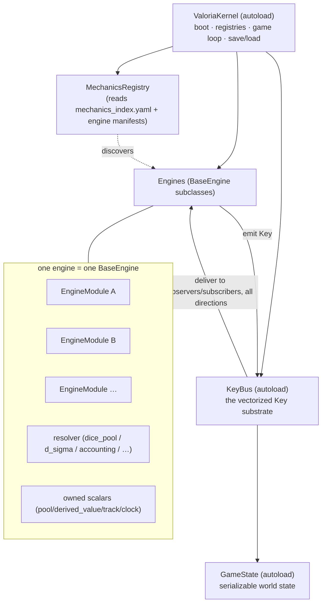

# Valoria — Consolidated Godot 4 Architecture (v1)

**Status:** DESIGN — consolidation of the v30 substrate + module-contract model into one implementable shape.
**Companion code:** `designs/godot/skeleton/` (GDScript reference skeleton).
**Sources reconciled:** `key_substrate_v30.md`, `key_type_registry_v30.md`, `scale_transitions_v30.md`,
`derived_stats_v30.md`, `references/module_contracts.yaml`, `canon/mechanics_index.yaml`,
`designs/godot/{scene_tree_architecture,data_serialization_spec,implementation_sequence}.md`,
and the live propagation graph (`tools/observability/graph.json`).

---

## 0. What this is

One coherent code shape for a Godot 4.6 game that spans grand strategy → strategy-RPG → RPG →
narrative → investigation, where **every action at every scale happens inside a container and its
outcome ripples to all other scales.** It realizes the three requirements directly:

| Your requirement | Realized as | Already exists as |
|---|---|---|
| **(1) A wrapper that organizes all systems** | `ValoriaKernel` autoload — boots registries, owns the engines, drives the loop | the kernel/orchestrator concept + `mechanics_index.yaml` |
| **(2) A framework orchestrating all systems, moving data in ALL directions via a vectorized key-system** | `KeyBus` autoload — the universal typed-event substrate; one update rule; 4-axis vectors; observer-resolved all-directions delivery | `key_substrate_v30.md` (44 Key types, the proven substrate) |
| **(3) Each system is a base engine that hosts many modules** | `BaseEngine` (abstract) + `EngineModule` (the `IN(Keys)→resolver→OUT(Keys)` contract) | `module_contracts.yaml` (28 systems already shaped this way) |

Nothing here is invented from scratch — it is the existing, sim-validated design expressed as Godot
constructs (autoloads, Resources, signals, typed GDScript).

---

## 1. The shape in one picture



**Read it as:** the Kernel is the wrapper. The KeyBus is the nervous system. Engines are organs.
Modules are the cells inside an organ. Keys are the blood — one substance carrying everything,
everywhere.

---

## 2. The wrapper — `ValoriaKernel` (autoload)

A **thin** orchestrator. It holds no game logic; it wires and drives.

Responsibilities:
1. **Boot:** seed RNG deterministically; load Resources; build `KeyTypeRegistry`; build
   `MechanicsRegistry` from `mechanics_index.yaml` + engine `.tres` manifests; instantiate every
   registered engine; register each engine's Key subscriptions on the `KeyBus`.
2. **Drive the loop:** the season state machine (Briefing → Personal → Strategic → Accounting),
   emitting `mechanical.season_change` / `mechanical.accounting` Keys at boundaries.
3. **Zoom stack:** push/pop scene containers (`mechanical.scene_entered` / `scene_exited`), enforce
   max nesting (depth 2 per the telemetry substrate).
4. **Save/load:** `save = initial_state + Key log` (deterministic replay), delegated to `GameState`
   + `KeyBus.log`.
5. **Constraint guard:** assert the hard invariants at boot (GD-1 sole victory engine; scale
   import-direction; route-through-accounting).

It is the only place that knows the *set* of engines exists. Engines never reference each other or
the Kernel directly — they speak only Keys.

---

## 3. The orchestration framework — `KeyBus` (the vectorized key-system)

This is requirement (2), and it is the heart. It is `key_substrate_v30.md` made into one autoload.

### 3.1 The Key (Resource)
Every consequential event — a duel result, a debate outcome, a decree, a battle, a season tick — is
a **`Key`**: a typed, validated, append-only record. Fields (per substrate §2.1): `id`, `type`,
`source_actor`, `emitted_at`, `causes[]`, `targets[]` (each with `role` + **`impact_vector`** + raw
`stat_deltas`), `scale_signature[]`, **`symbolic_dimensions`**, `visibility`, `time_horizon`,
`permanence`, `payload`. **One result type for everything** — which is why one rule can carry it all.

### 3.2 The 4-axis vectors (the "vectorized" part)
Two vector fields ride on every Key, over the canonical axes **{hierarchical, sacred, instrumental,
traditional}**:
- `symbolic_dimensions` — where the *event* sits in value-space.
- `impact_vector[target]` — the signed magnitude of the event's effect on each target.

An observer interprets a Key through *its own* values:
`interpretation = Σ_axis armature_position[axis] × key.symbolic_dimensions[axis] × key.impact_vector[self][axis]`,
where `armature_position = personal_convictions × CONVICTION_AXIS_MATRIX` (the 13×4 matrix). This is
how the *same* event is a betrayal to one NPC and a triumph to another — the engine of emergent,
character-grounded reaction.

### 3.3 The single update rule (all directions)
```
on_key_emitted(key):
  validate(key)                          # type registry + universal invariants
  KEY_LOG.append(key)                    # immutable; the save substrate
  for obs in compute_observers(key):     # source + targets + actors_in_scale(scale_signature) + visibility
      interp = obs.armature.interpret(key)
      obs.memory.record(key.id, salience(interp, key.time_horizon))
      obs.apply_state_changes(interp, key.stat_deltas)
  for sys in TYPE_SUBSCRIPTIONS[key.type]:  # the emitting/consuming routing from the registry
      sys.consume(key)
  for cause in key.causes: CAUSAL_GRAPH.add_edge(cause, key.id)
```
Direction is **emergent**, not channelled: who-receives is computed from `targets[]`,
`scale_signature`, and `visibility`. So the *same* rule carries bottom-up (a scene → Domain Echo →
faction), top-down (a decree naming sub-scale targets → the villagers), lateral (same-scale
observers), and diagonal (`causes[]`-chained cross-family). **No engine keeps a private channel.**
(Top-down requires the emitter to *populate sub-scale targets* — `scale_transitions §12.3`; the
console's down-seam check surfaces where this is missing.)

### 3.4 Signals vs Keys (the boundary)
- **Keys** = anything *consequential* that another system or scale should feel (the substrate).
- **Godot signals** = intra-engine, view-layer, and UI glue (a panel listening to its own engine).
  Signals never cross scale or carry game consequence; that is the Key bus's job. This keeps the
  substrate the single source of truth and the UI loosely coupled.

### 3.5 Determinism, replay, serialization
- Per-Key RNG seeding (each emitter records its seed in payload); deterministic sub-step ordering
  (stable sort). `save = (initial_state, KEY_LOG)`; replay re-runs the rule → identical state.
- `Key` is a `Resource`; the log is a typed `Array[Key]`; `GameState` serializes runtime world
  state. Sim-measured at ~18.7k keys/sec — performance is not a constraint.

---

## 4. The base engine — `BaseEngine` (abstract)

Requirement (3a). Every mechanical system extends `BaseEngine`. It is a thin host: it owns scalar
state, holds modules, declares its Key ports, and routes consumed Keys to the right module.

Lifecycle (the wrapper/lifecycle contract the conformance methodology checks):
```
setup(kernel)            # register on KeyBus for declared consumed types; load modules from manifest
on_key(key)              # a consumed Key arrives → dispatch to the module(s) that handle it
season_tick(phase)       # per-phase work at its accounting_phase membership
serialize() / restore()  # its owned scalars → GameState
```
Plus the **discipline** baked in: it may only write its own `state[]`; cross-scale effects leave only
as Keys through declared `transitions[]`; it never imports a higher-scale engine (scale
import-direction); world-track writes route through accounting.

---

## 5. The module — `EngineModule` (the plug-in contract)

Requirement (3b). A module is one pluggable behaviour an engine hosts, in the canonical contract
shape from `module_contracts.yaml`:

```
IN (consumed Key types) → resolver (one archetype) → OUT (emitted Key types)
                          owns: declared scalars, each bucket-classified
                          crosses scales only via declared transitions
```

`resolver` is one of the seven archetypes: `dice_pool`, `d_sigma` (sigma-leverage continuous),
`deterministic_accounting`, `clock_advance`, `armature_dot_product`, `state_reader`, `manifest`.

A module declares its IN/OUT/owned-scalars in a `.tres` **manifest**, so the engine and registry
discover it as *data* — adding a module is a new `.tres`, not a core edit. Two modules coexist in one
engine because each declares the Key types it handles; the engine dispatches by type. Examples:
combat actions are modules of `CombatEngine`; contest styles are modules of `ContestEngine`; thread
operations are modules of `ThreadEngine`; governance actions are modules of `SettlementEngine`;
faction AI postures are modules of `NPCAIEngine`.

---

## 6. The registry — `MechanicsRegistry`

Manifest-driven discovery, mirroring `sim/autoload/registry.py`. It reads `mechanics_index.yaml`
(mechanic → scale → engine → GD-constraints) and the per-engine/module `.tres` manifests, and yields
the set of engines + their modules + their Key subscriptions. The Kernel builds the world from this —
so **a new engine or module is registered by data, with zero edits to Kernel, KeyBus, BaseEngine, or
EngineModule.** This is the "comprehensive shape for all current AND future data."

---

## 7. Scale layering & import discipline

Engines live at a scale; imports only ever point *down* the scale ladder; cross-scale traffic is
Keys + the named handshakes. (Mirrors `sim/CONVENTIONS.md`.)

```
peninsula  →  provincial  →  territory/settlement  →  scene  →  thread/personal
(world clocks)  (factions, war)   (governance)        (containers)   (combat/debate/investigation)
```
The eight cross-scale handoffs + Domain Echo (`scale_transitions §3/§5`) are *named sugar* over the
bus; the console's Handshakes view draws them.

---

## 8. The engine registry (the 28 systems, placed)

Built from `tools/observability/graph.json`. Each is a `BaseEngine`; "modules" are its pluggable
behaviours; Keys are its ports.

| Engine | Scale | Resolver | Emits → / ← Consumes (sample) | Hosts modules |
|---|---|---|---|---|
| **SceneSlateEngine** | scene | state_reader | → scene.dialogue/insult/threat/gift/witness | scene-generation priorities |
| **CombatEngine** (`personal_combat`) | personal | dice_pool / d_sigma | → scene.combat_resolved | 11 combat actions |
| **ContestEngine** (`social_contest`) | scene | dice_pool | → scene.contest_resolved/dialogue | 4 contest styles |
| **FieldworkEngine** (`fieldwork_knots`) | personal·scene | dice_pool | → meta.knot_formed/ruptured, scene.gift ← scene.dialogue | investigate / socialize / stealth |
| **ThreadEngine** (`threadwork`) | personal·thread | dice_pool + clock | → meta.thread_woven, scene.thread_operation | 5 thread operations + mending |
| **ConvictionEngine** (`piety_track`) | personal | deterministic_accounting | → state.scar_acquired ← scene.* | scar triggers per Conviction |
| **NPCAIEngine** (`npc_behavior`) | personal·scene | armature_dot_product | → scene.witness, state.concern_resolved/belief_revised ← ~22 types | Procedures B/D/E, arc state machine |
| **FactionEngine** (`faction_state`) | provincial | deterministic_accounting | → mechanical.cascade_resolution/mission_shift, state.standing_change ← da.* + env.* | mission / cascade / L-PS |
| **FactionPoliticsEngine** | provincial | deterministic_accounting | → state.coup_attempted/succession/standing_change | coup / succession / promotion |
| **DomainActionEngine** (`domain_actions`) | provincial | d_sigma | → da.public_governance/covert_betrayal/diplomatic_alliance/antinomian/economic | the 5 DA categories |
| **MassBattleEngine** | scene | dice_pool | → scene.battle_concluded | FM 3-level command (ED-907), formations, tactics |
| **SettlementEngine** (`settlement_layer`) | settlement·territory | deterministic_accounting | → env.population_change ← env.* | Develop/Fortify/Pacify/Administer |
| **SettlementEconomyEngine** | settlement | deterministic_accounting | ← da.economic_intervention, env.population_change | prosperity/trade |
| **TerritorialPietyEngine** | territory·provincial | deterministic_accounting | (CV/CI/TC clocks) | Church Influence accrual |
| **PeninsularStrainEngine** | peninsula | deterministic_accounting | → env.peninsular_strain_shock/crisis/disaster | strain shocks |
| **EngineClock** | provincial | clock_advance | → mechanical.season_change/accounting | season boundary |
| **SeasonManager**¹ | — | — | (drives phases) | — |
| **VictoryEngine** | provincial·peninsula | state_reader | (reads MS/territory; GD-1 sole victory) | peninsular sovereignty check |
| **MiraculousEventEngine** | personal·scene | state_reader | → meta.miraculous_event | miracle activation |
| **ScenarioAuthoringEngine** | peninsula | manifest | → env.crisis/disaster | authored scenario beats |
| **ArticulationLayer**² | personal·scene·provincial | armature_dot_product | ← (full Key stream) | Tier 1/2/3 chronicle surfacing |
| **NPCMemoryEngine** | personal | state_reader | ← scene.gossip/interaction, state.* | per-NPC Key-reference memory |
| **GameDirector** | scene | state_reader | → mechanical.scene_entered/exited/skipped | zoom-stack telemetry |
| **SceneTimer / Audit** | scene | clock/state_reader | ← scene lifecycle | telemetry sidecar |
| **ClockRegistry** | provincial | manifest | (clock definitions) | clock manifests |
| **CIPoliticalEngine** | provincial | deterministic_accounting | (CI/AP/SW clocks) | Church attention |
| **`engine` (substrate/kernel)** | meta | kernel | → meta.legacy_event | wrapper auto-emissions |

¹ SeasonManager is the loop driver inside the Kernel. ² ArticulationLayer is canonical (PP-688).
*Full live wiring (every emit/consume edge, owned scalars with buckets) is browsable in the console.*

---

## 9. Directory tree (res://)

```
res://
├── core/                         # the framework (requirement 1 & 2) — never edited to add content
│   ├── valoria_kernel.gd         # autoload — the wrapper
│   ├── key_bus.gd                # autoload — the vectorized substrate + single update rule
│   ├── key.gd                    # Resource — the universal event
│   ├── key_type_registry.gd      # autoload — valid types + per-type payload schema
│   ├── conviction_axis.gd        # the 4-axis vector + 13×4 matrix projection
│   ├── base_engine.gd            # abstract — every engine extends this
│   ├── engine_module.gd          # the IN→resolver→OUT module contract
│   ├── mechanics_registry.gd     # autoload — manifest-driven discovery
│   └── game_state.gd             # autoload — serializable world state
├── engines/                      # one folder per BaseEngine (requirement 3)
│   ├── combat/{combat_engine.gd, modules/strike.gd, …, combat_engine.tres}
│   ├── contest/  · fieldwork/ · thread/ · conviction/ · npc_ai/
│   ├── faction/ · domain_action/ · mass_battle/ · settlement/ · peninsular_strain/
│   └── victory/ · season/ · …
├── data/                         # .tres Resources (data, not logic)
│   ├── key_types/*.tres          # the 44 Key-type schemas
│   ├── engines/*.tres            # engine + module manifests (discovery)
│   ├── factions/*.tres · settlements/*.tres · npcs/*.tres · weapons/*.tres · clocks/*.tres
│   └── territories/*.tres
├── scenes/                       # the containers (per scene_tree_architecture.md)
└── ui/                           # views — listen to engine signals, never the bus directly
```

---

## 10. Resource & serialization strategy

- **Data in `.tres`, logic in `.gd`** (Godot idiom). Faction/Settlement/NPC/Weapon/Clock/Territory
  templates are `Resource` subclasses (schemas already in `data_serialization_spec.md`).
- **Two-layer scalars** (`derived_stats`): 1–7 stats (capability, the pool) are `@export`ed;
  derived values (Health, Stamina, …) are computed and **write-protected** — deltas route to the
  substrate stat (the F1 guard). The engine never writes a `derived_value` directly.
- **Save** = `GameState.snapshot()` (runtime world) + `KeyBus.log` (the event substrate). Load =
  restore snapshot, optionally replay the log for verification.

---

## 11. How a new system or mechanic is added (zero core edits)

1. **New module** → drop a `.tres` manifest in `data/engines/<engine>/` declaring its IN/OUT/scalars
   + a `.gd` extending `EngineModule`. The registry discovers it; the engine dispatches to it by Key
   type. No core file changes.
2. **New engine** → a folder under `engines/` + an engine `.tres` manifest + a `mechanics_index.yaml`
   entry. The Kernel instantiates and wires it from the registry. No core file changes.
3. **New Key type** → a `.tres` in `data/key_types/` + a registry entry (Class-B extension process).
   Emitters/consumers reference it by name. No core file changes.
4. **New resolver** → add the archetype to the resolver enum + its `.gd`; modules opt in by name.

This is what makes the shape "all-encompassing for current and future data": content is data;
the framework is fixed.

---

## 12. Mapping to what already exists

- `sim/` (Python scaffold) is the **reference implementation** of these engines, organized by the
  same scales — port module-by-module to GDScript.
- `references/module_contracts.yaml` is the **manifest source** — it already declares each engine's
  IN→resolver→OUT + scalars. Generate the `.tres` engine manifests from it.
- `tools/observability/graph.json` is the **wiring source of truth** and the live verification of
  closure (every Key has an emitter; routing is reconciled).
- The **Engine-Shape Conformance methodology (ESCP)** is how each ported engine is checked against
  this shape (wrapper/keys/scalars/vectors/plugins/evolvability).

---

## 13. Build order (from `implementation_sequence.md`, re-grounded)

G1 core (`KeyBus`, `Key`, registry, `GameState`, `BaseEngine`, `EngineModule`) → G2 season loop +
scene slate → G3 personal engines (combat, contest, fieldwork) → G4 thread → G5 strategic (mass
battle, NPC AI, factions, domain actions) → G6 settlement + victory → G7 UI. The core (G1) is the
content of `designs/godot/skeleton/`.
