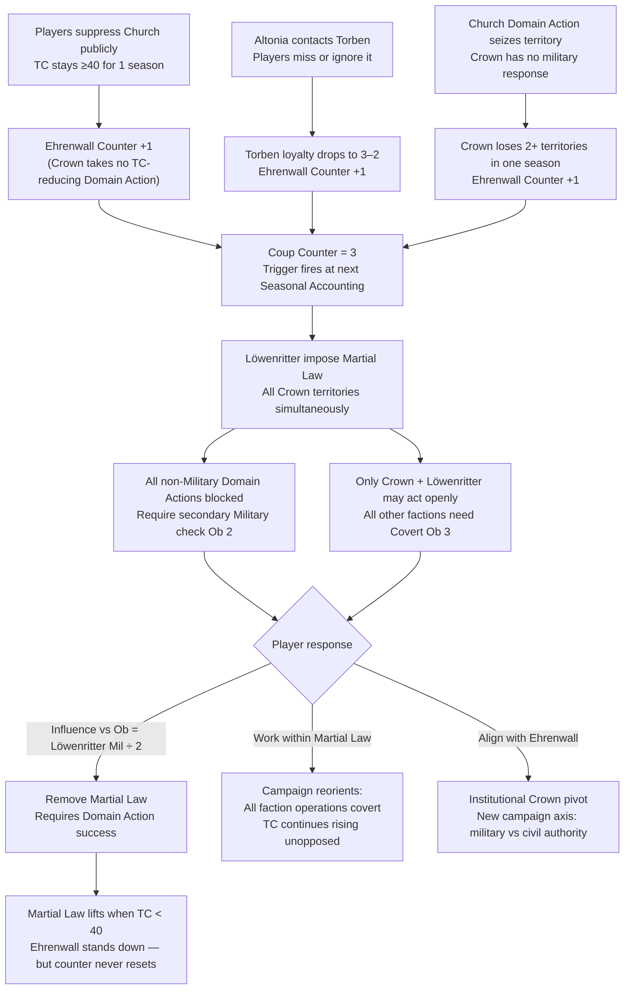
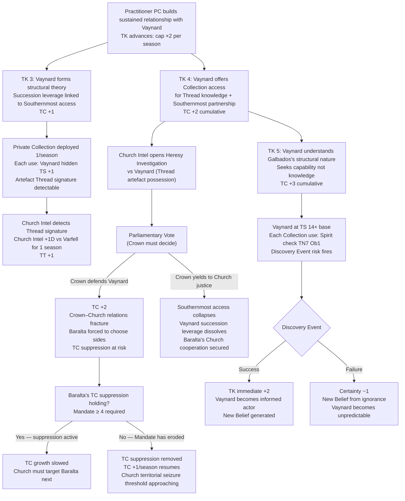
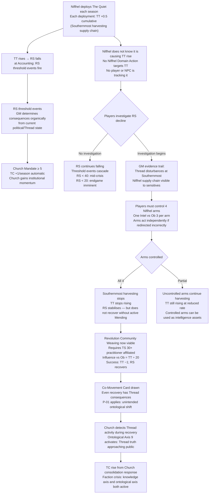

# Valoria — Emergent Campaign Arcs
*Derived purely from mechanical systems. No editorial content decided. All narrative framing is illustrative, not canonical.*

---

## How Arcs Emerge in Valoria

Valoria has no scripted plot. Arcs emerge from five mechanical engines running in parallel:

| Engine | Key Output |
|---|---|
| Three clocks (RS / TC / IP) | Threshold events; loss conditions |
| Seasonal accounting (Stability checks, Domain Echoes) | Faction collapse; power shifts |
| NPC trigger conditions (Ehrenwall counter, Vaynard TK, Baralta TC suppression) | Named-NPC decision points |
| Political axes (9 qualitative axes) | Scene conflict framing; casus belli |
| Thread operations + Co-Movement | Ontological consequences; RS drain |

Each arc below names the **mechanical seed**, traces the **causal chain** through these engines, and shows the resulting **campaign shape**. The same seed produces different arcs depending on player choices at each branch.

---

## Arc 1: The Coup That Wasn't Supposed to Happen

**Seed:** Players focus on Church opposition and TC reduction. Crown is left to manage itself.

**Light narrative:** The players believe they're winning — they've stalled the Church, reduced TC, protected practitioners. Then, quietly, the soldiers arrive. Not the Church's templars. The Crown's own.

### Mechanical Causal Chain

**Why this arc is emergent, not scripted:** The counter has three independent triggers. Players rarely track all three simultaneously. The coup fires because attention was elsewhere — which is its entire mechanical logic.

**Campaign shape:** Mid-campaign crisis. 1–2 seasons of accumulation (invisible), 1 season of martial law (acute), resolution arc of 2–4 seasons.

---

## Arc 2: The Vaynard Revelation Cascade

**Seed:** A practitioner PC forms a sustained relationship with Vaynard. His Private Collection is deployed.

**Light narrative:** A duke who collects things he does not understand. One day, someone explains what he has. Everything that follows is the consequence of that explanation.

### Mechanical Causal Chain

**Why this arc is emergent:** TC accumulates from Vaynard's TK advances as a side effect of helping him. The PC who builds the relationship is simultaneously raising a clock they probably need to suppress. No player intends this.

**Campaign shape:** Slow-burn 4–6 season arc. Each TK level is a scene. The Parliamentary vote is the crisis point. Multiple branching endgames depending on the Crown's choice.

---

## Arc 3: The Invisible Drain (Niflhel and the Rising Thread)

**Seed:** Niflhel is running operations. Players are not yet investigating Niflhel.

**Light narrative:** The world is getting worse and no one knows why. Something is harvesting the Thread. The players have to find out what before the Rupture takes everything.

### Mechanical Causal Chain

**Why this arc is emergent:** Niflhel's TT accumulation is a mechanical side effect of its core operation, not a villain plan. The arc exists because Niflhel is good at its job. The players may not connect RS decline to Niflhel operations for several seasons.

**Campaign shape:** Background decay for 3–5 seasons. Investigation arc of 2–3 seasons. Recovery arc of 2–4 seasons. TC rise in the recovery arc creates a second front.

---

## Arc 4: The Axis 9 Resolution (Thread Truth Goes Public)

**Seed:** Practitioners operate visibly. Vaynard's TK is climbing. The Revolution is sheltering sensitives.

**Light narrative:** The Church has always controlled what people know about the world's fabric. One season, it stops being possible to hide it.

### Mechanical Causal Chain

```mermaid
flowchart TD
    A["Practitioner PCs operate at Relational+ scale\nCoherence degrades over campaign\n10→8→5→3→1"] --> B["Coherence Fragmented (4–3):\n−1D social/memory rolls\n+1 Ob Thread operations\nMid-campaign structural cost"]
    C["Revolution affiliates TS 30+ practitioner\nCommunity Weaving becomes available"] --> D["TT reduced through Weaving\nCo-Movement consequence fires each use"]
    D --> E["Thread operations produce observable effects\nNon-sensitives gaining Inert Knowledge\nGM layers ontological beneath ontical for sensitives"]
    B & E --> F["Political Axis 9 activates:\nChurch vs practitioners — Thread truth approaching public"]
    F --> G["Church Mandate ≥ 3: Excommunication available\nvs known practitioners\n+2 Ob to all Thread-revealing actions (Church ethical framework)"]
    G --> H{"Church response to public Thread activity"}
    H -->|"Excommunication of practitioner PC"| I["PC loses Circles bonus with Church contacts\nReputation −1 with all factions\nChurch Mandate −1 on failure (martyr effect)"]
    H -->|"Heresy Investigation vs Revolution shelter"| J["Domain Action: Church Intel vs Revolution Stability\nRevolution Stability −1 on Church success"]
    I & J --> K["Political Axis 2 activates simultaneously:\nKnowledge — Thread truth accessible vs suppressed\nVarfell / Revolution vs Church"]
    K --> L["Vaynard at TK 5: understands Galbados structurally\nSeeks capability\nNo longer just observing — becomes actor"]
    L --> M["Crown forced onto Axis 9:\nCosmological legitimacy of Church authority\nvs constitutional order"]
    M --> N{"Crown's Axis 9 position"}
    N -->|"Crown defends Thread truth access"| O["TC −2 (Sovereign Authority Doctrine)\nHeresy Investigation vs Crown opens\nBaralta invokes constitutional claim\nParliamentary Vote"]
    N -->|"Crown defers to Church"| P["TC −1 short term\nPractitioners lose Crown protection\nRS unaddressed — Rupture risk grows\nLöwenritter watch Crown's weakness"]
    O --> Q["Grand Debate (5 exchanges)\nChurch Mandate vs Baralta pool\nPC substitution available"]
    Q -->|"Church wins"| R["Baralta Mandate −2, TC +3\nTC suppression removed\nChurch territorial seizure active"]
    Q -->|"Players win"| S["TC −3, Church Mandate −1\nAxis 9 partially resolved\nThread knowledge enters public record\nInert Knowledge upgrades for non-sensitives who held it"]
    S --> T["TTRPG Endgame indicator:\nAxis 9 resolved\nAt least one PC has transformed\nRS direction determined by Weaving vs drain balance"]
```

**Why this arc is emergent:** No single action triggers it. It requires Coherence degradation (time + use), Revolution affiliation (relationship), TK advancement (sustained engagement), and Axis 9 activating from accumulated visible operations. Five systems converge.

**Campaign shape:** Full-campaign arc. Begins in season 1 (Coherence tracking). Crisis in seasons 6–8 (Axis 9 active). Endgame in seasons 9–10 (Grand Debate, Clock resolution).

---

## Arc Interaction Map

These arcs do not run in isolation. Common collision points:

| Collision | Arcs | Mechanic |
|---|---|---|
| Martial Law fires while Vaynard Revelation is at Parliamentary Vote | 1 + 2 | Vote blocked by Martial Law Military check |
| Niflhel TT drain accelerates RS fall during Axis 9 Resolution | 3 + 4 | RS threshold events fire during Grand Debate season |
| Vaynard TK 5 + Löwenritter coup at same Accounting | 2 + 1 | Two crisis events same season; Stability checks stack |
| Revolution Weaving reduces TT while Church responds to Axis 9 | 3 + 4 | TT drops but TC rises from Church consolidation; clocks trade off |
| Church territorial seizure (TC 60) during Coup Martial Law | 1 (late) | Church seizes Crown-law-locked territories; Löwenritter cannot respond legally |

---

*All arcs require GM application of the Let It Ride rule — outcomes stand. No re-attempts unless circumstances significantly changed. This is what makes the arcs feel earned rather than scripted.*
