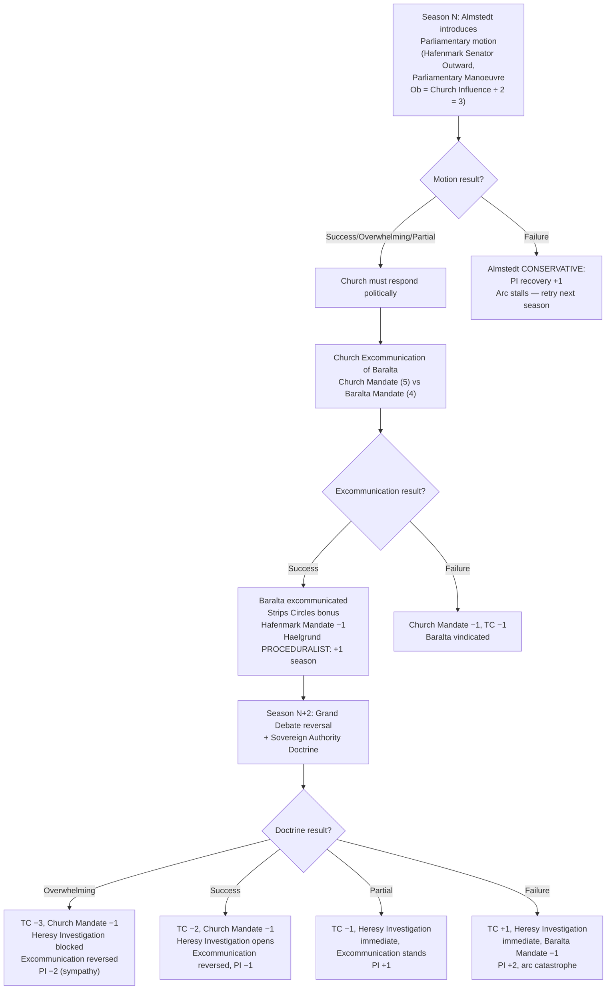
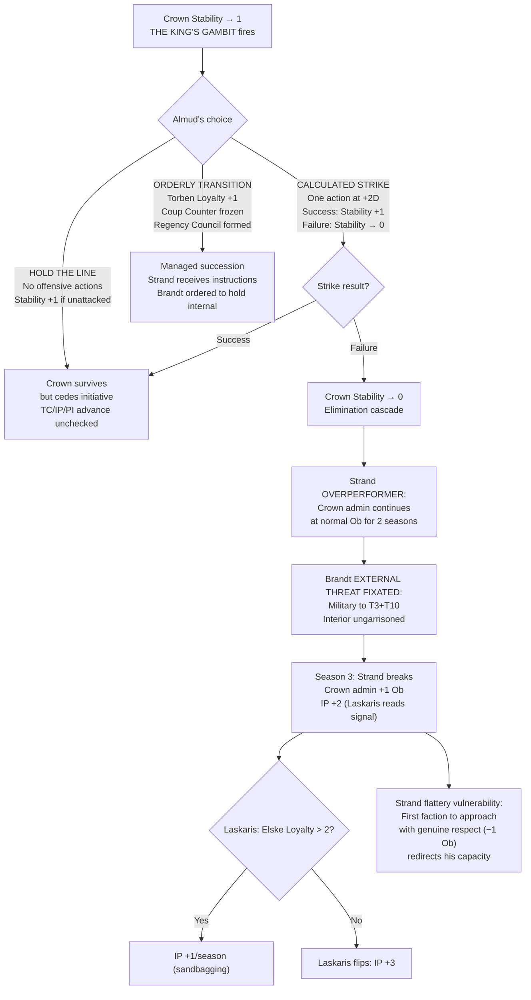
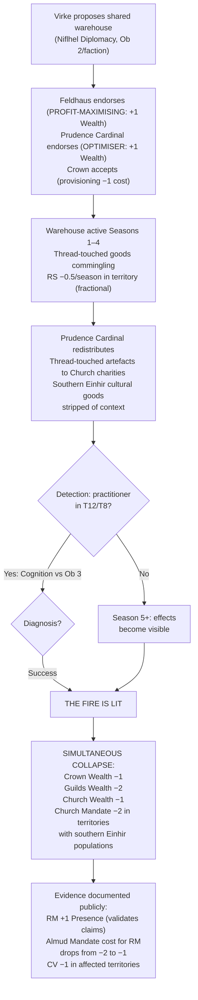

# Valoria Emergent Arcs — Batch 03 (Consolidated)
## Version: 1.0 | Date: 2026-04-08
## NPC Reference: designs/npcs/npc_roster.md (final, tri-modal)
## Source reads: params_factions.md, params_board_game.md, params_core.md, npc_roster.md (final), canonical_sources.yaml, geography_design.md, victory_architecture_v1.md, valoria_narrative_scenario_chains.md (Arc 1: Hunting Accident), canon/00_philosophical_foundations.md §11
## Framework typology: historical structural parallels — Investiture Controversy, Year of Four Emperors, Romance of Three Kingdoms, Sengoku Japan, Byzantine court politics, Borgia papacy, Italian city-states, Machiavelli's Sinigaglia
## Prior arcs checked: gm_ref/arcs_01_04_nongreedy.md (4 arcs), gm_ref/arcs_05_09_batch02.md (5 arcs). No duplication.
## Supersedes (all DEPRECATED):
##   - gm_ref/arcs_10_17_historical.md
##   - gm_ref/arcs_10_17_reassignment.md
##   - gm_ref/arcs_almud_revision.md
##   - gm_ref/arcs_assassination_einhir_revision.md

---

## Terminology: Valn, Valnese, Einhir

**Valn** is the pre-Altonian Einhir name for the peninsula. Post-conquest, the Altonian administration renamed it Valoria. Using "Valn" today is a social and political act — it claims pre-Altonian identity. The Forgetting does not affect the name (names are epistemically captured by anyone); it is suppressed politically, not metaphysically. The Church notes its use.

**Valnese** = the people who lived on Valn. The general population.

**Einhir** = specifically the Thread-sensitive pre-Calamity nation within the Valnese population. Not all Valnese were Einhir, but the Einhir were the Valnese society organized around Thread practice.

**The north-south caste dynamic:** Northern Valnese (lower base-rate Thread Sensitivity (TS) due to geographic distance from the Southernmost) blamed southern Valnese — the Einhir heartland — for the Calamity that weakened Valn enough for Altonian conquest. The Calamity was a geographical accident of proximity, not a moral failing. The southern Einhir lived in the zone of historically weakest Thread stability, the zone most susceptible to catastrophic Thread events. They did not cause the Calamity. They were closest to it. Northern Valnese, whose lower TS meant they could not perceive what the south experienced (Foundations §11: "their rendering capacity was narrower"), blamed the south because the epistemological framework to understand the Calamity's geographic nature was unavailable to them.

This blame persists as a caste-like system. Southern Einhir heritage marks you. Northern Valnese heritage does not. The distinction survives 200+ years after the Calamity because the Forgetting prevents the epistemological correction that would dissolve it — the evidence that the Calamity was geographic, not moral, requires TS ≥ 29 to perceive. The caste system is enforced by the Forgetting's epistemic filter, not by active suppression (though the Church and the post-Calamity political settlement benefit from its persistence and do nothing to challenge it).

---

## The Hunting Accident (E-01) — Background for All Arcs

King Almud's father was killed ~218 AG in circumstances officially ruled accidental. It is an open secret that this was an assassination. The perpetrator is undefined — campaign revelation candidate E-01 (see `designs/ttrpg/valoria_narrative_scenario_chains.md`, Arc 1).

**Critical framing:** It really may have been an accident. The "open secret" is the political class assuming assassination because they cannot conceive of a king dying without someone's hand in it. The investigation may reveal that the conspiracy theories are wrong, and the political structures built on those theories — Almud's 27-year cautious restraint, factional positioning around assumed culpability — are based on nothing. The accidental resolution is as destabilising as any named perpetrator, because 27 years of political calculation were responses to a phantom.

Four possible perpetrators if it was not accidental: Church, Niflhel, Varfell, Altonian agent. Each has different mechanical consequences per the Arc 1 discovery chain.

---

## King Almud — Behavioral Assumptions

Not a full NPC roster entry (that is [EDITORIAL: ED-NEW-11] territory), but the behavioral assumptions these arcs require:

- **Decision-making:** Bayesian. Updates on new information. Holds options open. Does not commit to positions prematurely.
- **Flaw:** Structural, not personal. Almud manages TC, IP, PI, RS, and internal faction dynamics simultaneously. He can make optimal decisions on any 3 of these. He cannot make optimal decisions on all 5. No ruler could.
- **Assassination shadow:** 27 years of governing under the assumption that someone in the political system killed his father. This produces structurally paranoid attention to hidden structures and information asymmetry — his greatest administrative asset, born from possible false premises.
- **Strand relationship:** Principal-agent with monitoring. Almud appointed Strand because he is competent. Almud anticipated that Strand's social insecurity would make him vulnerable to cultivation. Almud uses the pattern of cultivation as intelligence. Strand is a monitored honeypot, not an unwitting leak.
- **Einhir sympathy:** Almud privately sympathises with the Einhir Restoration. Governs through the post-Calamity settlement that suppressed it. His Belief 2 ("I cannot act until I find a path that doesn't require choosing between justice and the monarchy") is shaped by both the assassination shadow and the structural costs of acting: TC +3 (Church), Mandate −2 (northern Valnese nobility), IP +1 (Altonia benefits from Einhir suppression).
- **TS 28:** Near Stirring. Unrecognised. If Discovery Event fires, the campaign's central dramatic question activates.

---

## Arc 10: The Penitent Duke

**Historical parallel:** Investiture Controversy — Henry IV's Walk to Canossa (1077).
**Arc shape:** 2-season setup, 1-season crisis, 2-season aftermath. Branching at crisis point.
**Primary NPCs:** Baralta (Hafenmark leader), Almstedt (#8 — CONSERVATIVE), Haelgrund (#4 — PROCEDURALIST).

### Narrative

Hafenmark's Baralta has been losing the war of increments. Each season the Theocracy Counter (TC) ticks upward. Baralta instructs Almstedt to introduce a Parliamentary motion formally acknowledging Church jurisdictional primacy over T9 Himmelenger — phrased so precisely that Cardinal Justice must either accept it (establishing that Church authority requires Parliamentary authorisation) or reject it (proving the Church considers itself above Parliament). Either way, Hafenmark wins the argument.

The Church responds with Excommunication of Baralta. Haelgrund is assigned the case. His PROCEDURALIST flaw adds +1 season before resolution — during which Baralta's calculated public penance plays out in every territory with a Parish.

**Einhir caste dimension:** Baralta's motion targets T9 Himmelenger — the zone of strongest northern Valnese cultural influence. The motion implicitly challenges the post-Calamity settlement that built the caste system. Northern Valnese nobility read this correctly and oppose it. This is the structural basis of Almud's Mandate −2 cost for supporting the Restoration.

**Assassination thread:** Baralta possesses the Hafenmark Parliamentary file on the Hunting Accident — the investigation opened after the death and quietly closed without conclusion. She can deploy this during the Grand Debate reversal: not as evidence of Church guilt, but as evidence the Church failed to investigate possible regicide. If introduced: +1D to Baralta's Debate pool for that exchange, but introduces the assassination into public discourse — all four candidate factions gain a "Suspected" marker, subsequent Investigate actions re: the assassination at −1 Ob. If the assassination was genuinely accidental: the fallout is worse (phantom conspiracy becomes a real political crisis).

### Mechanical Causal Chain



### Event Cards

**EVENT CARD: THE PENITENT'S GAMBIT**
- **Trigger:** Hafenmark Parliamentary Manoeuvre targeting Church jurisdictional authority.
- **Timing:** Phase 4, Priority 4 (Social).
- **BG text:** *"Hafenmark's Parliamentary motion challenges Church authority over T9 Himmelenger. Church must: Excommunicate the author within 2 seasons (Ob = Baralta's Mandate) or accept TC −1 (institutional silence read as weakness)."*
- **Mechanical effect:** Church must declare Excommunication within 2 seasons or accept TC −1. Haelgrund's PROCEDURALIST flaw adds +1 season before Excommunication resolution.
- **NPCs:** Almstedt (#8, introduces motion); Haelgrund (#4, builds the case); Baralta (target).

**EVENT CARD: THE REVERSAL AT PARLIAMENT**
- **Trigger:** Baralta under active Excommunication AND fires Sovereign Authority Doctrine in same season as Grand Debate reversal.
- **Timing:** Phase 4, Priority 6 (Special/Unique Powers).
- **BG text:** *"The excommunicated Duke rises. She has endured public penance. Now she speaks."*
- **Mechanical effect:** Doctrine resolves with +1D bonus (public sympathy). PI adjustment by degree: Overwhelming = −2; Success = −1; Partial = +1; Failure = +2. If Almstedt has been co-opted or removed: Doctrine at +1 Ob. If Baralta introduces the Hunting Accident file: additional +1D for that exchange, but "Suspected" markers placed on Church, Niflhel, Varfell, Altonia.
- **NPCs:** Almstedt (#8, facilitates procedure); Haelgrund (#4, his thorough case file becomes evidence FOR Baralta); Baralta.

---

## Arc 11: Three Crowns in a Season

**Historical parallel:** Year of Four Emperors (69 CE).
**Arc shape:** 1-season trigger, 3-season cascade. Branching at each transition.
**Primary NPCs:** Strand (#9 — OVERPERFORMER), Brandt (#6 — EXTERNAL THREAT FIXATED), Almstedt (#8 — CONSERVATIVE), Laskaris (#11 — PROTECTIVE).

### Narrative

The Crown leader falls. The mechanism doesn't matter — the cascade does. Strand's OVERPERFORMER flaw means he tries to hold Crown administrative machinery together single-handedly: treasury, foreign policy, succession management. For 2 seasons he performs brilliantly. Then he breaks. Meanwhile, Ehrenwall's Löwenritter Coup Counter hits 4. Brandt assumes command and redirects military to T3 and T10 — the border corridors — leaving the capital ungarrisoned. Hafenmark challenges legitimacy through procedure. The Church offers to "mediate" (TC +3).

Laskaris reads Strand's degradation as the treaty-erosion signal. IP doesn't spike immediately (Strand's buffer) — it spikes in Season 3 when Strand breaks and Crown's administrative competence visibly fails. If Elske is threatened (Loyalty ≤ 2), Laskaris flips: IP +3.

**Almud's competence:** Crown collapse is not Almud's failure — it's the system's failure under compound load. Almud may have made the correct call at every node and still lost because TC + IP + PI exceeded what any ruler could manage.

**Einhir caste in succession:** Who governs determines whether the caste system is challenged or entrenched. Brandt (military) ignores it. Church mediation reinforces it. Only Hafenmark or RM influence advances the Einhir question.

**Assassination thread:** Whoever claims Crown authority must answer the question Almud never answered: who killed the previous king?

### Mechanical Causal Chain



### Event Cards

**EVENT CARD: THE KING'S GAMBIT**
- **Trigger:** Crown Stability reaches 1.
- **Timing:** Accounting, before elimination check.
- **BG text:** *"The King surveys what remains. He chooses where to spend his last reserves."*
- **Mechanical effect:** Crown player (or NPC AI) declares: HOLD THE LINE (no offensive actions, Stability +1 if unattacked), CALCULATED STRIKE (one action at +2D, Success = Stability +1, Failure = Stability → 0), or ORDERLY TRANSITION (Torben Loyalty +1, Coup Counter frozen, Regency Council formed with strongest non-Church non-Löwenritter faction).
- **NPCs:** Almud (the choice is his — not reactive but strategic); Brandt (#6, if ORDERLY TRANSITION: Almud's final order overrides Brandt's border fixation for 1 season).

**EVENT CARD: THE CROWN FALLS**
- **Trigger:** Crown Stability → 0 AND no recovery.
- **Timing:** Accounting Step 3.
- **BG text:** *"The Crown has collapsed. All Crown territories enter Political Vacuum (1 season). Löwenritter Coup Counter → 4."*
- **Mechanical effect:** Crown elimination per PP-500. Strand buffer: Crown admin continues at normal Ob for 2 seasons, then +1 Ob. IP +2 delayed to Season 3 (Strand's break). Any faction may target Strand with social action (−1 Ob flattery) to redirect Crown admin capacity. Regency deck: Crown Domain Action cards available to highest-bidding faction (Influence vs Ob 3).
- **NPCs:** Strand (#9, drives buffer then brittle collapse); Brandt (#6, redirects military); Laskaris (#11, reads signal); Almstedt (#8, preserves PI).

**EVENT CARD: BRANDT'S MARCH**
- **Trigger:** Brandt assumes Löwenritter command AND no Altonian Vanguard deployed.
- **Timing:** Phase 1 Planning — Löwenritter NPC priority override.
- **BG text:** *"Commander Brandt has seen the border. Löwenritter redeploys to T3 and T10. Interior territories lose garrison."*
- **Mechanical effect:** Löwenritter units in non-border territories March to T3/T10. If IP reaches 75: Brandt's positioning correct (+2D first Battle). If IP never reaches 75: units out of position for every internal crisis.
- **NPCs:** Brandt (#6, EXTERNAL THREAT FIXATED — this IS his flaw); Torsvald (#5, may abort border operations in Thread-active zones at ~30% rate).

**EVENT CARD: THE ALTONIAN DOUX**
- **Trigger:** IP increases by ≥ 2 in a single season AND Elske Loyalty ≤ 3.
- **Timing:** Accounting Step 10b.
- **BG text:** *"Doux Laskaris receives instructions from the imperial court. He must choose: deliver an accurate report (IP +2, Elske Loyalty −1) or deliver an optimistic report (IP +0, Laskaris standing at court −1)."*
- **Mechanical effect:** Laskaris delays twice consecutively → Altonia replaces him with non-sympathetic envoy. IP advances at full rate. Elske Loyalty decoupled from IP management permanently.
- **NPCs:** Laskaris (#11, PROTECTIVE); Strand (#9, if managing Altonian portfolio — Laskaris can manipulate him via flattery, −1 Ob).

**EVENT CARD: THE UNANSWERED QUESTION**
- **Trigger:** Crown leader falls AND E-01 unresolved.
- **Timing:** Accounting, after succession fires.
- **BG text:** *"The old question returns. Who killed the previous king? Every faction has a theory. Some are weapons."*
- **Mechanical effect:** "Unanswered Question" token. Any faction may play "Regicide Accusation" once/season: target faction Mandate −1 (Influence vs Ob 3; Failure: accuser Mandate −1 instead). If accusation is TRUE (E-01 match): target Mandate −2, Stability −1. If target is innocent AND death was accidental: accuser −1, accused −1 (false accusations leave residue).
- **NPCs:** Strand (#9, OVERPERFORMER — tempted to "solve" the assassination for prestige, may name a suspect prematurely).

---

## Arc 12: The Chained Ships

**Historical parallel:** Battle of Red Cliffs / Chibi (208 CE).
**Arc shape:** 4-season slow build, 1-season crisis, 1-season aftermath.
**Primary NPCs:** Virke (#10 — NETWORK PROTECTOR), Feldhaus (#7 — PROFIT-MAXIMISING), Prudence Cardinal (#13 — OPTIMISER), Haelgrund (#4 — PROCEDURALIST).

### Narrative

Dalla Virke proposes a shared warehousing arrangement in T12/T8. Crown, Guilds, and Church accept — the economics are irresistible. The problem: ~15% of Virke's goods are Thread-touched. They are sourced from Einhir ruins and southern Valnese communities — artefacts of the pre-Calamity civilisation. The Prudence Cardinal's aggressive tithe redistribution sends Thread-touched items into Church charities. Low-grade Coherence effects accumulate.

**Einhir cultural heritage dimension:** The Thread-touched goods are southern Einhir cultural artefacts stripped of context and distributed as generic charity supplies. The Church is redistributing the material remains of the civilisation it helped suppress. When revealed: this is not just a supply chain failure — it is evidence that southern Einhir cultural practices were connected to Thread reality. The caste system's intellectual foundation (southern Einhir were irresponsible with forces they didn't understand) is contradicted: they understood the forces well. The forces were simply too large for anyone to control regardless of geographic position.

**Virke's personal stakes:** The Thread-touched supply chain is Virke's personal selection. She vetted these goods herself. Exposure destroys not just the supply chain but her professional reputation — "I know what I'm selling" is her brand, and she didn't know.

### Mechanical Causal Chain



### Event Cards

**EVENT CARD: THE EFFICIENT ARRANGEMENT**
- **Trigger:** Niflhel Diplomacy succeeds in T12/T8 AND Guilds Wealth ≥ 5 AND Church Wealth ≥ 4.
- **Timing:** Accounting Step 2.
- **BG text:** *"Niflhel proposes shared warehousing. All parties benefit. Place 'Shared Warehouse' token. +1 Wealth/season per participating faction. RS −0.5/season in territory (fractional). Thread contamination invisible until investigated (Ob 3)."*
- **Virke's choice (if she discovers first):** DISCLOSE (reputation −1D for 4 seasons, partners protected, Virke Stability +1) or CONCEAL (reputation intact, contamination continues, subsequent external discovery = Virke Stability −3).
- **NPCs:** Virke (#10, NETWORK PROTECTOR — shields the arrangement from investigation); Feldhaus (#7, PROFIT-MAXIMISING — won't investigate anything generating +1 Wealth); Prudence Cardinal (#13, OPTIMISER — increases tithe throughput, accelerating contamination).

**EVENT CARD: THE FIRE AT RED CLIFFS**
- **Trigger:** Thread contamination revealed by any means.
- **Timing:** Immediate interrupt.
- **BG text:** *"The shared warehouse contained Thread-touched goods. Southern Einhir cultural artefacts, stripped of context, distributed to the faithful as charity. The Crown ate them. The Church gave them away. The Guilds profited."*
- **Mechanical effect:** Warehouse token removed. Each faction: Wealth −1 + Stability check (Ob 2, Failure = additional Stability −1). Church Mandate −2 in territories with southern Einhir populations. If publicly documented: RM +1 Presence in affected territory, CV −1, Almud's RM Mandate cost drops −2 → −1. Virke personal credibility collapse: all Virke syndicate operations −1D for 4 seasons; rival syndicates move in.
- **NPCs:** Haelgrund (#4, PROCEDURALIST — thorough +1 season investigation discovers full chain, gives cover-up window); Virke (#10, decides based on relationship duration: 5+ year partners = tell, newer = silence); Feldhaus (#7, shifts blame to Niflhel to protect Guilds Wealth).

---

## Arc 13: Wait Until It Sings

**Historical parallel:** Tokugawa Ieyasu's patience strategy.
**Arc shape:** 6+ seasons. The arc IS the accumulation.
**Primary NPCs:** Almstedt (#8 — CONSERVATIVE), Solberg (#12 — STABILITY-SEEKING), Strand (#9 — OVERPERFORMER, delays the payoff).

### Narrative

Almstedt does nothing extraordinary. He recovers PI +1/season. He blocks reform at +1 Ob. Three factions burn Stability on offensive Domain Actions. Each failure costs Stability −1 (PP-403). By Season 8, the active players have weakened themselves. Almstedt's Ministry — which never attacked — is the only intact governance mechanism.

**Strand interaction:** Strand's Crown +1D reduces Crown's failure rate (~25% vs ~30%), delaying Almstedt's payoff. But when Strand breaks (Arc 11 or independent overload), Crown's rate spikes to ~40%. Almstedt's window opens explosively.

**Einhir caste dimension:** Almstedt's CONSERVATIVE flaw preserves Parliamentary procedure — which was built on the post-Calamity political order that blamed southern Einhir. He unknowingly preserves the institutional architecture of the caste system. Players who want to address the Einhir question cannot do it through Parliamentary reform while Almstedt is active.

### Event Cards

**EVENT CARD: THE PROCEDURAL OBJECTION**
- **Trigger:** Any faction attempts to alter Parliamentary structure AND Almstedt active (Ministry Mandate ≥ 1).
- **Timing:** Phase 4, after declaration, before roll.
- **BG text:** *"The Chief Clerk raises a procedural objection. +1 Ob. The objection is not political — it is administrative."*
- **Mechanical effect:** +1 Ob. Cannot be overridden except by co-opting Almstedt (Influence vs Ob 3) or Ministry Collapse (Mandate 0).
- **NPCs:** Almstedt (#8, CONSERVATIVE — fires every time the trigger is met).

**EVENT CARD: THE KINGMAKER'S MOMENT**
- **Trigger:** 2+ player factions at Stability ≤ 2 AND PI ≥ 5 AND Ministry Mandate ≥ 2. OR: Strand has broken (Crown admin +1 Ob active).
- **Timing:** Year-End Accounting Step 6. Fires once per campaign.
- **BG text:** *"The Chief Clerk has outlasted everyone who tried to change his process. Parliament still functions. Who does it serve?"*
- **Mechanical effect:** Almstedt becomes contestable. Consul Outward Diplomacy (Ob 3) to co-opt. Success: reform-blocking shifts to protect that faction. Overwhelming: Ministry AP-token acts as faction capital for 1 season. If co-opting faction is RM-aligned AND RM Influence ≥ 3 in T13: first reform can be constitutional acknowledgment of the Einhir cultural question (Ob for future Einhir reforms drops from +1 to +0 — the caste system becomes addressable, not dismantled).
- **NPCs:** Almstedt (#8); Solberg (#12, STABILITY-SEEKING — may attempt to co-opt Almstedt for stability outcomes).

---

## Arc 14: The Purple Shroud

**Historical parallel:** Nika Riots (532 CE).
**Arc shape:** 1-season trigger, 1-season crisis, 1-season resolution. Fastest arc in the batch.
**Primary NPCs:** Almstedt (#8 — CONSERVATIVE), Torsvald (#5 — RISK-AVERSE), Brandt (#6 — EXTERNAL THREAT FIXATED), Prudence Cardinal (#13 — OPTIMISER), Strand (#9 — OVERPERFORMER).

### Narrative

PI reaches crisis. Church TC 75 Territorial Seizure fires in T12 or T1. The streets erupt. Church offers to restore order at TC +5 plus permanent garrison. Almstedt's Parliamentary mediation takes +1 season (CONSERVATIVE). Torsvald's RISK-AVERSE flaw aborts covert operations if Thread-active civilians present (Arc 12's contamination). Strand tries to manage the crisis administratively — effective for 1 season but he's not a diplomat or general.

**Einhir caste in the streets:** Southern Einhir communities have their own grievances. Their presence creates a second dimension: the sovereignty crisis and the heritage crisis cannot be resolved independently.

**Almud's calculation:** The Church's offer is not a binary for a confused ruler. Almud has calculated TC +5. He knows the long-term cost. Crown NPC AI: Stability ≥ 5 → reject; Stability 3–4 → conditional; Stability ≤ 2 → accept (survival arithmetic). If Strand receives the offer: his flattery vulnerability means the Church can frame it as deferring to his authority (−1 Ob), potentially producing TC +6 instead of +5.

### Event Cards

**EVENT CARD: THE STREETS ERUPT**
- **Trigger:** PI ≤ 2 AND Church Territorial Seizure fires in T12 or T1 (same or previous season).
- **Timing:** Immediate interrupt.
- **BG text:** *"Valorsplatz burns. The faithful and the loyalists stand together. Order must be restored — the price determines the world that follows."*
- **Mechanical effect:** All actions in territory suspended. Each faction with presence: Stability check (Ob 2, Failure = −1). Crisis persists until resolved by: Church intervention (TC +5/+6), military suppression (Mandate −1), Parliamentary mediation (Almstedt, +1 season), or Diplomacy (Ob = PI ÷ 2 round up).
- **NPCs:** Almstedt (#8, delays mediation); Torsvald (#5, aborts if Thread-active — Arc 12 contamination triggers this); Strand (#9, attempts administrative crisis management, +1D for 1 season then overwhelmed).

**EVENT CARD: THE SOUTHERN VOICE**
- **Trigger:** "Streets Erupt" active AND RM ≥ 1 Presence marker in territory.
- **Timing:** After Streets Erupt suspends actions.
- **BG text:** *"The southern Einhir communities have joined. They are not fighting for Crown or against Church. They are fighting because someone asked them to stand. The riot has two dimensions."*
- **Mechanical effect:** Every resolution option now has a forced Einhir consequence:
  - Church intervention: CV +1 (suppression reinforces caste). RM Presence removed.
  - Military suppression: CV +0 but Grievance Marker (persists 4 seasons; RM Community Weaving −1 Ob while present).
  - Parliamentary mediation: CV −1 IF acknowledgment of Einhir grievance included (Ob 2). If not included: CV +0.
  - RM direct engagement (Vossen Community Weaving during crisis): Success = CV −2; Failure = CV −1.
- **NPCs:** Vossen (#3, IDEALIST — will attempt Weaving during crisis); Haelgrund (#4, PROCEDURALIST — if investigating the riot, documents southern Einhir testimony, creating permanent record).

**EVENT CARD: THE CHURCH'S OFFER**
- **Trigger:** Streets Erupt active AND Church declares willingness to restore order.
- **Timing:** Declaration Phase, season after eruption.
- **BG text (front):** *"The Church extends a hand. The price is on the back."*
- **BG text (reverse):** PI −3. TC +5. Permanent Templar unit. Church Govern −1 Ob in territory. All other factions +1 Ob in territory.
- **Almud NPC AI:** Stability ≥ 5 → reject. Stability 3–4 → accept only if no ally deploying military. Stability ≤ 2 → accept.
- **Strand modifier:** If Strand receives the offer and Church frames it as deference to his authority (social action vs Strand, −1 Ob flattery): TC +6 instead of +5.

---

## Arc 15: The Banker's War

**Historical parallel:** Medici Florence.
**Arc shape:** 3-season setup, 1-season exposure, 2-season aftermath.
**Primary NPCs:** Feldhaus (#7 — PROFIT-MAXIMISING), Solberg (#12 — STABILITY-SEEKING), Strand (#9 — OVERPERFORMER).

### Narrative

Feldhaus offers trade partnerships to Crown and Church simultaneously. Both factions' Wealth rises. The Guilds profit from the conflict — every Domain Action both factions take against each other generates trade volume. Solberg notices (STABILITY-SEEKING — dual-funding perpetuates instability, keeping him on the peninsula). Almud may detect independently through aggregate pattern recognition (King's Patience).

**Almud's assassination shadow:** His 27-year paranoid attention to hidden structures is why he detects the dual-funding. This analytical capacity was produced by decades of assuming the worst. If the assassination was accidental, his greatest administrative asset was born from a false premise.

### Mechanical Causal Chain

```mermaid
graph TD
    A["Feldhaus: Trade with Crown (+1 Wealth)<br>Trade with Church (+1 Wealth)<br>Guilds Wealth climbing"] --> B["2 consecutive seasons:<br>Double Ledger token placed<br>Guilds Wealth floor = 4<br>Investigate Ob = 3"]
    B --> C{Detection paths}
    C -->|Strand +1D Investigate| D["Strand detects —<br>but Feldhaus Curated Data<br>(social vs Strand −1 Ob)<br>nullifies Strand's bonus"]
    C -->|Almud independent<br>(Crown Influence vs Ob 3<br>at Year-End)| E["King's Patience token:<br>+1D vs Guilds (latent leverage)<br>Almud holds 2+ seasons"]
    C -->|Other faction<br>Tribune Investigate Ob 3| F["EXPOSURE"]
    D -->|Strand beats Curated Data| G["Strand acts alone<br>(OVERPERFORMER, doesn't report)<br>Burns Almud's intelligence asset"]
    E -->|Almud plays King's Patience| H["Almud exposes on his terms:<br>PI +2, Guilds Stability −2<br>Crown Mandate +1"]
    F --> I["Exposing faction chooses:<br>PUBLIC or PRIVATE (blackmail)"]
```

### Event Cards

**EVENT CARD: THE DOUBLE LEDGER**
- **Trigger:** Guilds Trade with 2+ opposed factions for 2 consecutive seasons.
- **Timing:** Accounting Step 2.
- **Mechanical effect:** Double Ledger token. Guilds Wealth floor = 4. Investigate Ob = 3. Solberg Year-End AI check fires after 2+ seasons with token.

**EVENT CARD: THE CURATED LEDGER**
- **Trigger:** Feldhaus and Strand both active AND Double Ledger present.
- **Timing:** Phase 4, Priority 1.
- **BG text:** *"The Guild representative has been sending the Lord Steward curated summaries. Accurate on every line — except the ones that matter."*
- **Mechanical effect:** Feldhaus social action vs Strand (Ob = Strand stat ÷ 2 − 1 flattery ≈ Ob 1). Success: "Curated Data" token. Crown's +1D detection nullified while present.

**EVENT CARD: THE KING'S PATIENCE**
- **Trigger:** Crown Year-End Influence check (Ob 3) succeeds vs Guilds while Double Ledger present.
- **Timing:** Year-End Step 7 — fires BEFORE Strand's exposure check.
- **BG text:** *"The King reviews the annual accounts. He sees what his Lord Steward has not yet reported. He says nothing."*
- **Mechanical effect:** "King's Patience" token. Crown +1D vs Guilds while present. NPC AI holds 2+ seasons minimum. Plays when: Guilds Wealth ≥ 6 AND Crown needs Mandate boost, OR another faction about to discover (Almud exposes first).
- **Assassination interaction:** If Arc 1 resolves during King's Patience: perpetrator identified → token gains +1D bonus. Accident confirmed → Almud enters 1-season self-doubt (no offensive Crown actions), then either reaffirms caution or plays King's Patience immediately with Crown Mandate +1.

**EVENT CARD: THE EXPOSURE**
- **Trigger:** Successful Investigate vs Guilds while Double Ledger present.
- **Timing:** Immediate after resolution.
- **Mechanical effect:** Investigating faction chooses: PUBLIC (PI +2, Guilds Stability −2, both funded factions Mandate −1, Double Ledger removed) or PRIVATE (3 seasons blackmail — one free demand/season from Guilds, no roll. Second faction discovering during blackmail: PI +3, everyone Mandate −1).
- **NPCs:** Feldhaus (#7, negotiates — offers trade partnership to avoid exposure); Virke (#10, NETWORK PROTECTOR — if Feldhaus in trust network, +1 Ob to Investigate attempts in Virke's territories).

---

## Arc 16: The Empty Fort

**Historical parallel:** Zhuge Liang's Empty Fort Strategy (~228 CE).
**Arc shape:** Persistent background. Runs continuously while RM active.
**Primary NPCs:** Vossen (#3 — IDEALIST), Haelgrund (#4 — PROCEDURALIST), Maret Uln (#2 — CONFLICTED).

### Narrative

Vossen spreads thin. 5 territories at 1 Presence each instead of 3 at 2 each. Strategically suboptimal — but every territory where the Church destroys a Presence marker is a territory where the faithful watch the Church suppress cultural heritage. CV erosion accelerates. Vossen's weakness IS her defence.

**Forgetting as caste enforcement:** The evidence that would dissolve the caste system requires TS ≥ 29. The caste system suppresses the practices that develop TS. Feedback loop. Breaking it requires a practitioner with TS ≥ 29 who can articulate the geographic nature of the Calamity, or physical evidence surviving the Forgetting, or a political actor who doesn't need evidence to act.

### Event Cards

**EVENT CARD: THE OPEN GATES**
- **Trigger:** RM Presence in 4+ territories AND Church has not initiated Heresy Investigation vs RM in previous 2 seasons.
- **Timing:** Accounting Step 8.
- **BG text:** *"The Restoration Movement is everywhere and nowhere. The Church could end this. The Church has not acted. Because every investigation creates a martyr."*
- **Mechanical effect:** Status reminder. While active: any successful RM Presence removal also applies CV −1 in that territory (martyrdom). Church must decide if net effect is worth the action.
- **NPCs:** Vossen (#3, IDEALIST — continues spreading); Haelgrund (#4, PROCEDURALIST — thorough investigations +1 season, giving RM time).

**EVENT CARD: THE MARTYR'S CAPTURE**
- **Trigger:** Church Heresy Investigation successfully targets Vossen's location (AP ≥ 6 in territory).
- **Timing:** Phase 4, Priority 1.
- **BG text:** *"They found her. The trial will be thorough. The sentence will be just. Everyone will remember."*
- **Mechanical effect:** Vossen captured. Surviving Presence markers: CV −2 in those territories (martyrdom cascade). If 3+ survive: Cultural Uprising for T9 advances by 2 seasons. Haelgrund's +1 season investigation gives rescue window (any faction Senator Outward, Ob 3).
- **NPCs:** Vossen (#3, captured); Haelgrund (#4, leads investigation); Maret Uln (#2, CONFLICTED — if Varfell ordered to assist prosecution, hesitates 1 season).

---

## Arc 17: The Sinigaglia Dinner

**Historical parallel:** Cesare Borgia at Sinigaglia (1502).
**Arc shape:** 3-season build, 1-season confrontation, 1-season aftermath.
**Primary NPCs:** Vaynard (Varfell leader), Maret Uln (#2 — CONFLICTED), Vossen (#3 — IDEALIST), Haelgrund (#4 — PROCEDURALIST).

### Narrative

Vaynard's intelligence apparatus detects Maret Uln's hesitation pattern (Influence 4 vs Ob 2 at Year-End, ~83%/attempt). When he succeeds: CONFRONT, TOLERATE, or ELIMINATE. Maret has an insurance file — evidence of Vaynard's unauthorized Thread operations. Mutual assured destruction.

**Assassination thread:** If players have found partial Varfell evidence re: the Hunting Accident, Maret's insurance file contains a secondary payload — 218 AG operational records. If Insurance File activates AND secondary payload discovered (Investigate Ob 2): Arc 1 Varfell evidence trail advances to Full Evidence. If E-01 ≠ Varfell: secondary payload is empty.

### Mechanical Causal Chain

```mermaid
graph TD
    A["Maret CONFLICTED:<br>2–3 delayed RM operations<br>over 4–6 seasons"] --> B["Year-End: Vaynard<br>Influence (4) vs Ob 2"]
    B --> C{Detected?}
    C -->|Yes| D["SINIGAGLIA BEGINS"]
    C -->|No| B
    D --> E{Vaynard's choice<br>(NPC AI: Stability ≥ 4 = Tolerate<br>2–3 = Confront, ≤ 1 = Eliminate)}
    E -->|CONFRONT| F{Maret's response}
    E -->|TOLERATE| G["Intel effectiveness −1<br>3-season shelf life<br>then Intel → 2"]
    E -->|ELIMINATE| H["Succession plan destroyed<br>Stability −1, RM contacts lost"]
    F -->|Comply| I["Spirit check each season<br>Failure = defects anyway"]
    F -->|Defect| J["Insurance File releases<br>VTM public, Church targets Varfell<br>TC +2, Intel → 1"]
    F -->|Mutual standoff| K["Stability −1/season<br>until resolved"]
```

### Event Cards

**EVENT CARD: THE PATTERN DETECTED**
- **Trigger:** Year-End AND Maret has hesitated on 2+ RM-adjacent operations during the year.
- **Timing:** Year-End Step 7.
- **Mechanical effect:** Vaynard rolls 4d10 TN 7 vs Ob 2. Success: "Sinigaglia" marker. Next season: Vaynard declares CONFRONT/TOLERATE/ELIMINATE (AI resolves by Stability). Overwhelming: Vaynard also discovers insurance file — ELIMINATE removed.

**EVENT CARD: THE INSURANCE FILE**
- **Trigger:** Vaynard chooses CONFRONT or ELIMINATE AND Maret Spirit check succeeds.
- **Timing:** Immediate.
- **BG text:** *"A sealed document. Copies with three intermediaries. Mutual assured destruction."*
- **Mechanical effect:** If Maret eliminated/captured: File activates next season. VTM public. Church Heresy Investigation automatic. TC +2. Varfell Intel → 1. If Vaynard stands down: Stability −1/season while standoff persists.
- **Assassination secondary payload:** If players have accessed Varfell Hunting Accident evidence trail: Insurance File contains 218 AG records. Investigate (Ob 2) on released documents: if E-01 = Varfell, Arc 1 advances to Full Evidence. If E-01 ≠ Varfell: empty.
- **NPCs:** Maret Uln (#2); Vaynard; Haelgrund (#4, PROCEDURALIST — if file opens, assigned to investigate Varfell, +1 season gives Vaynard time to destroy evidence).

**EVENT CARD: THE DEFECTION**
- **Trigger:** Maret fails Spirit check in territory with RM Presence AND Sinigaglia marker active.
- **Timing:** Phase 4, Priority 5.
- **BG text:** *"Maret Uln walks into the RM community house. She does not leave."*
- **Mechanical effect:** Varfell Intel −2. RM +1D Community Weaving in 2–3 territories. Succession plan (PP-486) destroyed. If Insurance File not activated: file now in RM possession (one-use "Expose Varfell" action, Ob 0, strategic timing).
- **NPCs:** Maret Uln (#2, primary); Vossen (#3, IDEALIST — welcomes Maret, RM gains intel capacity); Vaynard (loses operative + succession).

---

## Arc 18: The Stolen Steward

**Historical parallel:** Thomas Cromwell — indispensable administrator destroyed when his competence couldn't protect him from politics he couldn't see.
**Arc shape:** 4-season slow cultivation, 1-season exposure, 1-season aftermath.
**Primary NPCs:** Strand (#9 — OVERPERFORMER + flattery vulnerability), Almud (monitoring), Laskaris (#11 — PROTECTIVE), Feldhaus (#7 — PROFIT-MAXIMISING).

### Narrative

Strand is the best administrator on the peninsula. Every faction needs what he provides. His flattery vulnerability (−1 Ob on social actions acknowledging his competence) means each can establish an influence channel. Over 4 seasons, Strand accumulates influence debts — small individually, devastating collectively.

**Almud's three-layer intelligence system:**
- **Layer 1 (visible to all):** Strand is cultivated. Factions approach him.
- **Layer 2 (Almud only):** Almud monitors the cultivation pattern. Each approach reveals a faction's priorities. "King's Intelligence" tokens accumulate.
- **Layer 3 (discoverable by players):** Players who Investigate Crown (Ob 3) or interact with Almud directly can discover Layer 2. Knowing Almud watches Strand changes the calculus — factions can feed false priorities through Strand.

**Einhir dimension:** If RM successfully places an Influence Debt on Strand, he unconsciously imports southern Einhir administrative practices (learned from RM contact, thinks it's just good accounting). Crown Govern +1D in territories with southern Einhir populations. But northern Valnese nobility notices — Almud's RM Mandate cost increases by +1.

### Event Cards

**EVENT CARD: THE WORKING DINNER**
- **Trigger:** Any faction's Senator/Consul Outward targeting Crown while Strand active, with genuine acknowledgment of competence.
- **Timing:** Phase 4, Priority 4.
- **BG text:** *"The Lord Steward has been invited to discuss matters of state. He is flattered. He should not be."*
- **Mechanical effect:** Social action vs Strand at −1 Ob. Success: "Influence Debt" token (named for faction) on Strand card. That faction gains +1D Investigate targeting Crown. Hidden "King's Intelligence" token on acting faction (Almud tracks). If 2+ Debt tokens present for 2+ consecutive seasons: Strategic Review fires at Year-End.
- **NPCs:** Strand (#9, the mechanism AND the vulnerability).

**EVENT CARD: THE STRATEGIC REVIEW**
- **Trigger:** 2+ factions hold Influence Debt tokens AND Year-End fires.
- **Timing:** Year-End Step 7.
- **BG text:** *"The King reviews his Lord Steward's calendar. He knows who Strand has been meeting. He has always known. The question is whether the arrangement still serves the Crown."*
- **Mechanical effect:** Almud rolls Crown Influence vs Ob = number of factions holding Debt tokens. Success: arrangement net-negative. Choose: RETAIN (Strand chastened, flattery vulnerability removed 2 seasons, "Monitored Steward" — existing debts persist, no new ones without Overwhelming), REMOVE (Crown admin +1 Ob 2 seasons, all Investigate bonuses removed, Crown Stability +1), LATERAL MOVE (Strand to Altonian portfolio — Treasury unfilled, Strand's OVERPERFORMER now drives IP management, creating Arc 11 conditions). Failure: arrangement net-positive, debts persist.
- **King's Intelligence:** On RETAIN or REMOVE, Almud may convert King's Intelligence tokens: each = +2D on one Crown Domain Action targeting that faction.
- **NPCs:** Strand (#9, awaits judgment); Almud (strategic decision); Laskaris (#11, if Strand laterally moved, gains a counterpart he can manipulate via flattery).

---

## Cross-Arc Interaction Table

| | 10: Penitent Duke | 11: Three Crowns | 12: Chained Ships | 13: Wait Until Sings | 14: Purple Shroud | 15: Banker's War | 16: Empty Fort | 17: Sinigaglia | 18: Stolen Steward |
|---|---|---|---|---|---|---|---|---|---|
| **10** | — | Doctrine reduces TC, delays Arc 14. If Baralta excommunicated when Crown falls, cannot mediate. | Almstedt introduces motion (10). If co-opted (13), fires at −1 Ob. | Adversarial: Baralta needs Almstedt's procedure but Almstedt blocks reform. | Doctrine success buys 2–3 seasons before TC 75. | Church Wealth higher from Feldhaus = Excommunication better odds. | Doctrine success reduces Church pressure on RM. | Maret Uln CONFLICTED delays Varfell intel on Baralta's motion. | Strand not directly involved. |
| **11** | Baralta excommunicated → can't mediate succession. | — | Crown collapse kills one warehouse leg. Fire partially auto-fires. | Crown collapse IS Almstedt's kingmaker trigger. | Crown collapse + TC 75 = worst-case compound crisis. | Crown collapse disrupts dual-funding. Guilds pivot. | Church redirects from Crown to RM suppression. | Vaynard reassesses. Maret's RM sympathy becomes relevant. | Strand buffer period. Flattery exploit during succession. |
| **12** | Prudence Cardinal's OPTIMISER accelerates contamination. | Crown collapse disrupts warehouse. | — | Warehouse exposure cascades Stability losses → benefits Almstedt. | Thread contamination makes T12 Thread-active → Torsvald abort. | Feldhaus double-exposed (Thread supply + dual-funding). | Virke's goods are southern Einhir heritage. Revelation validates RM. | Maret Uln's TS ~50 may detect contamination. Another hesitation signal. | Thread-touched goods distributed via Strand's treasury channels. |
| **13** | Almstedt blocks Baralta's motion (+1 Ob). | Almstedt preserves PI through Crown collapse. | Almstedt maintains status quo including warehouse. | — | Almstedt mediates if Ministry intact. | Feldhaus's dual-funding perpetuates conflict → benefits patience. | RM independent of Parliamentary process. | Stable PI gives Vaynard bandwidth to detect Maret's pattern. | Strand's +1D delays payoff; Strand's collapse accelerates it. |
| **14** | Doctrine delays TC 75. | Crown collapse + PI crisis = compound catastrophe. | Arc 12 contamination triggers Torsvald abort. | Almstedt mediates if intact. | — | Feldhaus may fund Church intervention to protect warehouse. | RM in streets creates Southern Voice dimension. | Varfell intel 1 season behind during riot. | Strand manages crisis administratively; Church flattery → TC +6. |
| **15** | Church Wealth from Feldhaus → Excommunication odds. | Crown collapse disrupts dual-funding. | Double exposure: Thread + dual-funding = Guilds Stability −3. | Dual-funding perpetuates conflict. | Feldhaus funds Church intervention to protect trade. | — | Guilds trade in RM territories gives RM economic access. | Feldhaus-Varfell network overlap. Dual exposure collapses both. | Strand detects; Feldhaus counters with Curated Data. King's Patience. |
| **16** | Doctrine reduces Church pressure on RM. | Church redirects to RM suppression. | Thread contamination implicates RM-adjacent goods. | RM independent of Parliamentary process. | RM in streets adds dimension. | Guilds trade gives RM access. | — | Maret defection gives RM intel capacity. Decisive combination with CV momentum. | Strand imports southern Einhir practices. |
| **17** | Maret delays Varfell intel on Baralta. | Vaynard reassesses alliances. | Maret may detect contamination. | Stable PI → Vaynard bandwidth. | Varfell 1 season behind. | Network overlap. | Maret + RM = decisive. | — | Strand flattery delays Crown response to Insurance File. |
| **18** | Not directly involved. | Strand buffer + brittle collapse. | Thread goods in treasury channels. | Strand delays payoff. | Strand manages crisis; flattery exploit. | Curated Data; King's Patience. | Strand imports southern practices. | Flattery delays Crown response. | — |

---

## Gap Register

| ID | Gap | Impact |
|----|-----|--------|
| GAP-ARC-10 | Sovereign Authority Doctrine + Excommunication interaction not explicitly defined in params_factions.md | Arc 10 assumes Doctrine can fire during Grand Debate reversal. Plausible but unconfirmed. |
| GAP-ARC-11 | Crown succession mechanic (who succeeds) not fully specified | Arc 11 assumes Torben Loyalty determines succession viability. May require [PROVISIONAL] ruling. |
| GAP-ARC-12 | Thread-touched goods Coherence effects on non-sensitives not specified | Arc 12 assumes low-grade effects. NPC roster flags as design gap. |
| GAP-ARC-13 | Ministry NPC design doc not located | Arc 13 uses Almstedt NPC roster profile + existing Ministry rules. Full Ministry NPC AI needed for BG. |
| GAP-ARC-14 | PI crisis threshold for "streets erupt" not numerically defined in BG | Arc 14 assumes PI ≤ 2. Needs explicit threshold. |
| GAP-ARC-15 | Solberg's "standing with Schoenland central" track not mechanically defined | Arc 15 implies this track. Needs formalisation. |
| GAP-ARC-16 | RM Presence marker martyrdom CV shift not in current rules | Arc 16 proposes CV −1 on successful removal. New mechanic. |
| GAP-ARC-17 | Maret Uln's Spirit attribute not documented | Spirit check (TN 7 Ob 1) probability depends on value. Assumed 3–4. |

## Editorial Flags

| ID | Description | Status |
|----|-------------|--------|
| ED-NEW-1 | Arc 16 martyrdom CV shift (−1 on successful RM Presence removal). New mechanic. | FLAGGED |
| ED-NEW-2 | Arc 15 Solberg standing track. New NPC sub-track. | FLAGGED |
| ED-NEW-3 | Arc 12 Thread-touched Coherence effects on non-sensitives. Fills existing gap. | FLAGGED |
| ED-NEW-4 | Arc 10 Doctrine + Excommunication interaction. Mechanical ruling needed. | FLAGGED |
| ED-NEW-5 | Arc 14 PI crisis threshold. Proposed: PI ≤ 2. | FLAGGED |
| ED-NEW-6 | All 21 event cards require BG physical card formatting. Template not defined. | FLAGGED |
| ED-NEW-7 | "Valn" as pre-Altonian Einhir peninsula name. RESOLVED: Valn is the Einhir name. Forgetting does not affect it. Using it is a political act. Valnese = people. Einhir = Thread-sensitive nation within the Valnese. | RESOLVED |
| ED-NEW-8 | Dedicated Einhir caste arc ("Breaking the Forgetting"). Deferred to future batch. | FLAGGED |
| ED-NEW-9 | Hunting Accident (E-01) resolution as genuinely accidental. Requires Arc 1 discovery chain revision. | FLAGGED |
| ED-NEW-10 | Maret Uln Insurance File secondary payload (218 AG Varfell records). Cross-arc mechanic. | FLAGGED |
| ED-NEW-11 | Full Almud NPC roster entry. Behavioral assumptions documented here; full profile needed. | FLAGGED |

---

## Event Card Index

| # | Card Name | Arc | Trigger Summary |
|---|-----------|-----|-----------------|
| 1 | The Penitent's Gambit | 10 | Hafenmark Parliamentary Manoeuvre vs Church jurisdiction |
| 2 | The Reversal at Parliament | 10 | Baralta excommunicated + Doctrine fired |
| 3 | The King's Gambit | 11 | Crown Stability reaches 1 |
| 4 | The Crown Falls | 11 | Crown Stability → 0, no recovery |
| 5 | Brandt's March | 11 | Brandt assumes Löwenritter command |
| 6 | The Altonian Doux | 11 | IP +2 in single season + Elske Loyalty ≤ 3 |
| 7 | The Unanswered Question | 11 | Crown leader falls + E-01 unresolved |
| 8 | The Efficient Arrangement | 12 | Niflhel Diplomacy + Guilds/Church Wealth thresholds |
| 9 | The Fire at Red Cliffs | 12 | Thread contamination revealed |
| 10 | The Procedural Objection | 13 | Any Parliamentary structure alteration + Almstedt active |
| 11 | The Kingmaker's Moment | 13 | 2+ factions Stability ≤ 2 + PI ≥ 5 + Ministry intact |
| 12 | The Streets Erupt | 14 | PI ≤ 2 + Church Territorial Seizure in T12/T1 |
| 13 | The Southern Voice | 14 | Streets Erupt + RM Presence in territory |
| 14 | The Church's Offer | 14 | Streets Erupt + Church willing to restore order |
| 15 | The Double Ledger | 15 | Guilds Trade with 2+ opposed factions, 2 consecutive seasons |
| 16 | The Curated Ledger | 15 | Feldhaus + Strand active + Double Ledger present |
| 17 | The King's Patience | 15 | Almud Influence check vs Guilds + Double Ledger present |
| 18 | The Exposure | 15 | Successful Investigate vs Guilds + Double Ledger |
| 19 | The Open Gates | 16 | RM 4+ territories + Church inactive vs RM 2 seasons |
| 20 | The Martyr's Capture | 16 | Heresy Investigation targets Vossen (AP ≥ 6) |
| 21 | The Pattern Detected | 17 | Year-End + Maret hesitated 2+ times |
| 22 | The Insurance File | 17 | Vaynard CONFRONT/ELIMINATE + Maret Spirit check succeeds |
| 23 | The Defection | 17 | Maret Spirit check fails in RM territory + Sinigaglia active |
| 24 | The Working Dinner | 18 | Faction social action targeting Crown + Strand active |
| 25 | The Strategic Review | 18 | 2+ Influence Debt tokens on Strand + Year-End |

**Total: 9 arcs, 25 event cards, 0 new NPCs beyond final roster + Almud (ED-NEW-11).**
