# Valoria — Emergent Campaign Arcs 28–30
*Vaynard · Almud · Lenneth — Coherence 0*
*What happens when the people holding the board together stop being able to render it*

---

## Prefatory Note: Prerequisites

None of these three NPCs begin the campaign as practitioners. Coherence only applies after the First Leap — which requires TS 30+ and Approach Training. Reaching Coherence 0 for any of them therefore requires a prior arc that brought them into Thread practice. Each arc below is written to include that prerequisite as its mechanical seed, then traces the full degradation path and its branching consequences.

---

## Arc 28: Vaynard at Coherence 0 — *The Optimiser's Limit*

**Prerequisite arc:** Discovery Event success (Arc 26 Branch A) — Vaynard at TS 30, world reorganised, practitioner designation granted
**Pivot:** Coherence 2 → Fractured band → Coherence 0 from continued large-scale operations
**Primary mechanics:** Coherence scale (10→0) · Fractured band effects (−2D social, Belief co-authorship) · Rendering Crisis (Coherence 0 = ontological incapacity) · Corrective Weaving Ob 5 · Consequentialist ethical framework vs Thread reality · TK track already at 4–5 · Vaynard Resonant Style: Consequence

---

### Narrative

Vaynard spent years acquiring Thread knowledge as a resource. When his TS crossed 30 and the world reorganised for him, his first response was characteristic: he updated his operational model. Thread sensitivity is a form of intelligence advantage. Coherence degradation is a cost that can be managed. He has been managing costs his entire career.

What he did not account for is that Coherence does not behave like a resource. Resources can be optimised. Resources respond to strategic allocation. Coherence responds to only two things: not Leaping, and time. Vaynard, running Thread operations at Territorial and Relational scale to address the Southernmost, to contest Church territorial claims, to provide intelligence on Altonian Thread-adjacency — has been spending Coherence at a rate his Consequentialist framework kept telling him was within the acceptable loss curve. Every operation had a justifiable outcome. Every Coherence point spent purchased something real.

At Coherence 4 he enters Fragmented. The GM announces it plainly. −1D on all social rolls. −1D on Memory-based rolls. +1 Ob on all Thread operations. His Beliefs begin to change — not suddenly, but through co-authorship. The GM presents his shifting perceptual framework as his internal voice, and Vaynard, as a Consequentialist, tries to evaluate whether the new framework is more or less accurate than the old one. It is more accurate. The categories that are loosening — the ones that tell him he is a unified agent pursuing defined goals in a stable world — were always partial renderings of something he could not fully perceive. The loosening is not corruption. It is a man who valued truth above comfort discovering that the truth was never comfortable.

At Coherence 2 he is Fractured. The Fallout table fires. He performs an action he does not remember. Someone he has known for years does not recognise him for one scene. A Belief reads briefly as belonging to someone else. His private correspondence for this season contains paragraphs he cannot account for. His intelligence network is running operations he did not consciously authorise.

At Coherence 0 he cannot Diagnose. He cannot Leap. He cannot operate. The perceptual access that reorganised his world is gone. He knows what threads are. He cannot see them. He knows what the Southernmost is. He cannot approach it with the tools that made that knowledge matter. He is a man who acquired the most important intelligence in Valoria and has been locked out of the room where it is stored.

---

### Branch A — Corrective Weaving Administered (Ob 5)

Coherence 0: Corrective Weaving does not require his cooperation. He cannot render well enough to consent or resist. A practitioner with sufficient TS and the correct relationship with Vaynard performs Personal-scale Weaving, Ob 5.

Ob 5 at Personal scale is harder than most Mending. Expected success at a standard practitioner pool: ~40%. If the practitioner has Vaynard as a Close Knot, an Anchoring Scene can run simultaneously — Bonds Ob 2, +1 Coherence, costs the Knot +1 strain. Combined: Corrective Weaving success brings him to Coherence 1 (Severed); Anchoring Scene pushes to 2 if it succeeds. He can function again — severely impaired, but functional.

But: Vaynard at Coherence 1–2 is not the Vaynard who built the intelligence network. −2D social rolls means his Consequentialist analysis is impaired at precisely the moment the campaign is in crisis. His Private Collection is still there. His TK is still at 5. His succession leverage is still formally linked to Southernmost access terms. All the political architecture he built is intact. He cannot operate it at full capacity. The network runs on partial command — and a network designed around its principal's acute intelligence, run at −2D, makes different decisions than it would under his direction.

The Corrective Weaving arc also reveals something: whoever performed it now has the most intimate possible knowledge of Vaynard's Thread configuration. They have Woven him at Coherence 0. They know his TS, his degradation pattern, and the configuration of a mind that pushed itself to the edge of rendering. Whether that knowledge is held in trust or becomes leverage is a player decision, not a mechanical one.

### Branch B — No Corrective Weaving: Vaynard Remains at Coherence 0

He cannot self-recover. The only non-external path is a full season of non-practice and a Close Knot Anchoring Scene. His most reliable Close Knots are operational assets — intelligence officers, political allies, the practitioners he's been working with. An Anchoring Scene requires Bonds Ob 2 and the Knot's voluntary presence and strain payment. Which of his relationships is deep enough to qualify as a Close Knot?

His Beliefs at Coherence 2 were already shifting. Whatever they are now, they are the co-authored product of a Fractured practitioner whose Consequentialist framework has been confronting its own inadequacy for multiple seasons. The player characters may not recognise what he currently believes. He may not recognise what he currently believes. The GM presents it to both as a question without a clean answer.

Meanwhile: his succession leverage is inoperative. The Southernmost access terms he tied to Torben's ratification require him to negotiate — which requires social rolls at −2D with +1 Ob if he attempts any Thread support. His intelligence network defaults to institutional tendency (maximum information advantage, avoid public commitments, keep options open) without his active direction. This produces moves he would not have made. Vaynard's network is doing Vaynard things without Vaynard.

The extreme consequence: if no Close Knot is available and no Corrective Weaving is performed within one season, the Rendering Crisis deepens into something the rules call simply "NPC" — he becomes an NPC at the GM's full discretion, his agency removed. Duke Vaynard, one of the two or three most politically capable actors in the kingdom, becomes an NPC while his network continues running.

---

### Mechanical Causal Chain

```mermaid
flowchart TD
    A["PREREQUISITE: Vaynard Discovery Event success\nTS 14 → 30 · Certainty −1 · practitioner designation\nBegins Approach Training · Leap eligible next season"] --> B["Vaynard operates at Territorial scale\ndriven by TK 4-5 urgency and Consequentialist optimization\nCoherence −1/op at Territorial scale\n10→9→8→7 (Dissonant) → 6→5 (still Dissonant)\nGM announces Dissonant entry at 7"]
    B --> C["Coherence 4 → FRAGMENTED\n−1D social · −1D Memory · +1 Ob Thread ops\nRoll Fragmented Fallout on entry\nGM begins Belief co-authorship:\n'What does Vaynard's shifting perceptual framework believe now?'"]
    C --> D["Vaynard's Consequentialist framework confronts cost:\nCoherence degradation is not a resource — it does not respond to optimization\nHe can recognize this analytically\nHe cannot change it without stopping operations\nCampaign pressure prevents stopping: TK 5, Southernmost access, succession leverage all active"]
    D --> E["Coherence 2 → FRACTURED\nRoll Fractured Fallout\n−2D social · −2D Memory\nOnce/scene Thread op: Spirit TN7 Ob1 or lose 1 round to dissociative episode\nCertainty max reduced · Belief co-authorship in full effect"]
    E --> F["Coherence 1 → SEVERED\n+2 Ob all Thread ops\nDissociative episodes once/scene at scene start (not mid-op)\nAll Knots +2 strain/session\nNetwork receiving commands from a Severed principal"]
    F --> G["Coherence 0 → RENDERING CRISIS\nCannot Leap · Cannot Diagnose · Cannot operate\nOntological incapacity\nRendering barely functional\nGM determines all Thread-related NPC actions"]
    G --> H{Recovery path}
    H -->|"Corrective Weaving by practitioner ally\nOb 5 (configuration fully collapsed)\nDoes not require cooperation"| I["Success: Coherence 0 → 1\nClose Knot Anchoring Scene: Bonds Ob 2\nSuccess: Coherence 1 → 2\nVaynard at Severed — functional but impaired\n−2D social for campaign remainder unless full recovery"]
    I --> J["Practitioner who Wove him now knows his full configuration\nTK 5 intact · Succession leverage intact · Collection intact\nAll political architecture runs at −2D capacity\nNetwork makes Vaynard-shaped moves without Vaynard-level judgment"]
    J --> K{How players use impaired Vaynard}
    K -->|"Hold the succession leverage in trust"| L["Vaynard delegates: succession ratification terms\nheld by practitioner ally as intermediary\nVaynard's political architecture is intact\nbut mediated through a practitioner who now controls his most powerful asset\n[EDITORIAL: does Vaynard delegate this willingly at Coherence 2?]"]
    K -->|"Church discovers Vaynard's incapacity"| M["EXTREME: Church Heresy Investigation opens\n'A practitioner who cannot function' is not a political actor — it is a victim\nOlafsson moves to seize the Collection directly\nCollection contains originary Locks\nPhysical seizure by Church: TC +2 (Thread knowledge under Church control)\nVaynard's Belief co-authored toward: 'I should never have tried'\nIntelligence network goes dark — they do not surrender the Duke's assets to the Church"]
    H -->|"No Corrective Weaving · No Close Knot available\nFull season non-practice only path"| N["Season of non-practice: +1 Coherence → Coherence 1\nBut: non-practice means no Thread operations for a full season\nTK 5 capability on ice · Southernmost access suspended\nSuccession leverage terms cannot be actively negotiated\nNetwork defaults to institutional tendency without him\nFaction tendency (Varfell): maximize information, avoid public commitments\nNetwork quietly archives the Southernmost research\nand deploys to intelligence operations Vaynard would not have prioritized"]
    N --> O["EXTREME: Network operates for one season without him\nThree unintended moves from institutional tendency:\n1. Sells intelligence to Church (maximum information value, no public commitment)\n2. Withdraws Southernmost expedition support (avoid overexposure)\n3. Contacts Altonia re: succession leverage (information asymmetry play)\nVaynard recovers to Coherence 1 to find his network has been\ndoing exactly what Varfell does — just not what he wanted"]
```

**Why this arc is emergent:** The Coherence degradation is deterministic once Vaynard begins practicing at scale. His Consequentialist framework makes him the NPC most likely to optimize past the point of safety. The network continuing without him follows from Varfell's institutional tendency, which runs regardless of whether he is directing it.

**Arc shape:** Prerequisite arc (1–2 sessions). Degradation across 4–6 seasons of active practice. Fractured band (1–2 seasons of impaired operation). Rendering Crisis (1 Accounting event). Recovery arc: 2–3 seasons minimum, dependent on available practitioners and Close Knots.

---

## Arc 29: Almud at Coherence 0 — *The King Who Stopped Rendering*

**Prerequisite arc:** Almud Discovery Event fires (TS 28 + high-intensity Thread scene → TS 30) → First Leap under extreme political pressure → Coherence degrades
**Pivot:** Coherence 4 → Fractured → Coherence 0 during active reign
**Primary mechanics:** Almud TS 28 (Dormant, near Stirring) · Discovery Event threshold · First Leap (event scene, Certainty −1) · Coherence tracking begins · Fractured band: GM Belief co-authorship of Almud's convictions · Rendering Crisis while holding Crown governance · Ehrenwall Coup Counter · Beliefs 1, 2, 3 all under structural conflict · Resonant Style: Consequence

---

### Narrative

Almud has been experiencing impressions for years. He attributes them to spiritual intimation. His theology — whatever private form it takes beneath the constitutional performance of piety — has given him a framework for experiences he cannot name. He is TS 28. The threshold is 30. He has been two points below a perceptual reorganisation his entire reign, and he does not know it.

The Discovery Event fires in a scene the players probably create without intending to. A practitioner operating at Relational scale in the court. A Thread-significant object brought into the Royal Court (Territory 1's special property does not protect against Thread proximity). The originary Locks in the Church's restricted ceremony archive — if Almud is ever present when one is handled. The discovery is not the players' fault. TS 28 means the world has been almost-renderable to him his entire life. Sufficient Thread activity tips him over.

The First Leap is run as a full event scene. He is a king. He attempts it in whatever context the campaign has generated. If he succeeds — and the Ob for the Leap at TS 30 is Ob 2 — his TS is revealed, his Certainty drops by 1, and the framework he has spent his reign performing is exposed as partial in ways he cannot reverse. He knows, ontologically, that his rendering is incomplete. He does not know what to do with a Crown that was built on the assumption that rendering was sufficient.

Almud's three Beliefs are already in structural conflict with each other. The Thread adds a fourth dimension that his political architecture was not designed to accommodate. He begins practicing because the urgency of TK-level knowledge about the Southernmost and the succession crisis makes it irrational not to. He is a Consequentialist in the way all kings are Consequentialists: the outcomes justify the costs. The cost he does not fully price is the one his rendering pays.

At Coherence 4 his Beliefs begin to shift. The GM's co-authorship of Almud's convictions is the most politically significant mechanical event in the campaign — because the Crown's governance is downstream of what Almud believes, and Almud's beliefs are now changing under pressure from a degraded rendering. His second Belief — *the informal caste against southern Einhir is wrong; I will not act until I find a path* — becomes co-authored at Fractured into something more urgent. The political calculation he has been maintaining for his entire reign starts to collapse.

At Coherence 0, the King cannot govern. Not in the way the rules describe — *ontological incapacity* — but in the way the campaign requires. The Crown's Domain Actions run through Almud's pool. His pool is impaired. His Beliefs are co-authored. The institution that depends on him personally has a principal who has stopped being able to render the world.

---

### Branch A — Discovery Before the Crisis Peak (Coherence Degrades Slowly)

Almud's First Leap fires in Season 3–4. He has 5–7 seasons of campaign remaining. His degradation is moderate — 1–2 operations per season at Personal or Relational scale, Coherence dropping by 1–2 per season. He reaches Fragmented around Season 7–8.

At Fragmented, the GM's co-authorship begins shifting his Beliefs visibly. His second Belief — the one about Einhir justice — stops being *"I will not act until I find a path that doesn't require choosing between justice and the monarchy."* It becomes something closer to *"The path exists. I have been afraid of it."* The constraint that has held his entire reign together — the refusal to act on his private convictions because the institutional cost was too high — begins to dissolve from the inside.

This produces the most significant voluntary political pivot in the game: Almud acts on the Einhir question without the players needing to push him. Not because they persuaded him. Because his rendering of what he values has reorganised. The co-authored Belief is more honest than the original. It is also more politically destabilising. Every faction that benefited from his inaction — the Church, the northern nobility — is now facing an Almud who has stopped calculating.

His Coherence 0 arc is reached around Season 9–10. The campaign is in its endgame. Ehrenwall's counter is wherever the players left it. The Rendering Crisis of a king approaching the end of his campaign is a different event than a mid-campaign collapse.

### Branch B — Discovery During the Crisis Peak (Rapid Degradation)

Almud's First Leap fires in a crisis season — IP 75, Templar deployment, Parliamentary tie, Church excommunication attempt all active simultaneously. He Leaps under Wound penalties (if the battle reached him personally), at Partial or with the Distracted tag from political exposure. His first Thread operations are emergency measures under Desperate TN.

TN 8 operations mean pool efficiency drops. He burns Coherence faster per functional outcome. He reaches Fragmented in 3–4 seasons instead of 7–8. His Beliefs are being co-authored while the succession crisis, the IP crisis, and the Church crisis are all active. The GM is presenting his shifting internal voice to a player in the middle of three simultaneous campaign-level crises. The co-authored convictions are more urgent, less measured, less strategically calibrated than Almud's baseline.

At Coherence 0 in the crisis peak, the Crown's Domain Actions fail their principal check. Almud's pool for governance is impaired. His Mandate — built on his personal authority and competence — starts generating differently. Factions that track political capacity (Hafenmark, Löwenritter) observe that the King is not himself. Ehrenwall, who has been watching every Crown failure with the attention of someone who has been counting, adds this to her count.

The extreme consequence: Ehrenwall's coup counter was at 2. Her third trigger is *Crown loses two or more territories in one season without a military response Domain Action.* Almud at Coherence 0 cannot run a military response Domain Action — the pool is impaired, the Belief is co-authored away from strategic preservation, the Rendering Crisis prevents the exercise of deliberate political will. The third trigger fires not through military defeat but through governance collapse. The coup arrives as the final consequence of a king who pushed himself past what rendering could support.

---

### Mechanical Causal Chain

```mermaid
flowchart TD
    A["Almud TS 28 (Dormant, near Stirring)\nDiscovery Event trigger: Thread activity in proximity during crisis season\nSpirit TN7 Ob 1 · TS 28 < TS 30 required for Leap\nDiscovery Event: TS advances +2 → TS 30"] --> B["FIRST LEAP — event scene\nRun as full narrative scene (mandatory for First Leap)\nSuccess: Certainty −1 permanent · practitioner designation\nTS revealed · 'world reorganises'\nAlmud's three Beliefs now have a fourth dimension they were not built for"]
    B --> C{First Leap degree}
    C -->|"Success or Overwhelming"| D["Almud can Leap · begins practice\nCoherence tracking begins at 10"]
    C -->|"Failure: Dissociation"| E["Almud cannot attempt Thread operations for one season\nTS frozen · TS revealed to players only\nAlmud: profound experience he cannot name, no framework\nHe attributes it to a spiritual crisis — which it is\nNo practice possible until next season"]
    D --> F{Campaign timing of First Leap}
    F -->|"Season 3–4 (early-to-mid campaign)"| G["Slow degradation path\n1–2 ops/season · Coherence −1 to −2/season\nFragmented reached Season 7–8\nGM Belief co-authorship begins as endgame approaches\nAlmud's second Belief shifts:\n'The path exists. I have been afraid of it.'\nVoluntary political pivot on Einhir question — unprompted"]
    G --> H["Almud acts on Einhir question without player pressure\nChurch response: Heresy Investigation eligible (TS 30 practitioner)\nTC +2 from Crown-Church fracture\nButt: Mandate holds if he acts visibly with virtue\n(Crown Virtue Ethics: −1 Ob for public, honourable acts)\nThe Belief co-authorship is producing more honest politics\nat the cost of more politically costly ones"]
    H --> I["Coherence 0 reached near campaign end\nRendering Crisis as narrative endgame event\nAlmud has done what his Beliefs required\nThe cost is that he cannot continue\nSuccession: Torben's status determines what comes next\nIF Torben is loyal and in Valoria: clean succession\nIF Torben is compromised: Elske arc activates\nIF no successor viable: Ehrenwall decides"]
    
    F -->|"Season 6–7 (crisis peak)"| J["Rapid degradation path\nTN 8 ops under pressure · Coherence −2+/season\nFragmented reached Season 8\nGM Belief co-authorship active during multi-clock crisis\nBeliefs reorganise toward urgency — strategic calculation dissolves\nCo-authored Almud is more honest, less governable"]
    J --> K["Coherence 2 (Fractured) during IP 75 invasion threat\nAlmud's political calculation gone\nHis co-authored Belief 1 is no longer\n'Hold the Altonian relationship open regardless'\nIt may be: 'Valoria cannot be purchased. I was wrong to try.'\nSurrender of Torben no longer psychologically possible for him\nIP refusal triggers · IP acceleration to 1.5×"]
    K --> L["Coherence 0 during invasion season\nCrown Domain Actions: impaired pool\nMilitary response Domain Action not executed\nTerritories lost without Crown military response\nEhrenwall Counter +1 → 3 → COUP TRIGGER\nNot from military failure\nFrom governance collapse of a king who stopped rendering"]
    L --> M{Ehrenwall's coup decision at Coherence 0 King}
    M -->|"Ehrenwall sees it as institutional failure\n(the institution has failed Valoria)"| N["MARTIAL LAW fires at next Accounting\nAlmud at Rendering Crisis cannot contest it\nHis Mandate does not resist — he cannot exercise political will\nSuccession crisis activates immediately\nEhrenwall's demand: cede command authority\nAlmud's co-authored Beliefs: he may yield\nThe king who would have fought this three seasons ago\nno longer has the rendering to hold the line"]
    M -->|"Ehrenwall sees it as personal failure\n(the man failed, not the institution)"| O["Ehrenwall delays coup execution\nShe summons the Privy Council\n'The King is unwell. He requires succession arrangements.'\nThis is not mercy — it is constitutional\nShe is protecting the institution she serves by routing around its incapacitated head\nAnd buying time for the players to either restore Almud\nor produce a viable successor before she acts"]
```

**Why this arc is emergent:** Almud's TS 28 has been a latent trigger throughout the campaign — it only fires when Thread activity in his proximity crosses the threshold, which is a product of what practitioners have been doing all campaign. His Belief conflict was always present; Coherence degradation is the mechanism that dissolves the political calculations suppressing it.

**Arc shape:** Discovery Event fires mid-campaign (whenever Thread activity is sufficient near him). First Leap event scene. Branch A: 5–7 season slow degradation, voluntary Belief pivot, endgame succession. Branch B: 3–4 season rapid degradation during crisis peak, governance collapse, coup trigger activates through impairment not defeat.

---

## Arc 30: Lenneth at Coherence 0 — *What the Queen Was Holding*

**Prerequisite arc:** CE accumulation through archive work + Revolution academic funding → TS growth check → Discovery Event → First Leap
**Pivot:** Coherence 0 reached while Lenneth's concealed networks are still active
**Primary mechanics:** Lenneth TS 0 ("not foreclosed — simply never confronted") · CE accumulation path · TS growth check (Spirit TN 7, Ob 1 for first-time TS development — not Ob 2 like Klapp, whose essentialist formation raises it) · Hidden networks: Revolution funding + sea-republic archive document · Liberty conviction · Resonant Style: Consequence · Crown's ignorance of her activities · Rendering Crisis: the concealment mechanism that maintained her networks is the first thing that fails

---

### Narrative

Lenneth's TS 0 is different from Baralta's TS 0. Baralta's essentialist theology has structurally foreclosed Thread sensitivity — the framework that would allow her to render Thread reality is the framework she has been given to render everything. Lenneth simply has not been confronted with Thread reality in a way that could develop it. She is not defended against it. She is unaware of it.

Her hidden networks are built on the same quality that makes concealment sustainable — intelligence, discretion, and a Liberty conviction that means she has always understood the difference between the political conditions that exist and the political conditions that should exist. She has been funding People's Revolution academic work through a retired magistrate. The paper trail does not reach the Crown. She has sea-republic archive access to a document that a TS 50+ practitioner would recognise as a first-person thread-perception account from 180 years ago. She read it herself and found it interesting, not ontologically destabilising, because her TS 0 rendered it as an unusual historical curiosity.

If a practitioner PC shows her what it actually is — explains, using Evidence-style concrete demonstration, what Thread perception looks like, what the account she holds is actually describing — her CE accumulates. CE does not require direct Thread exposure. It accumulates from sustained engagement with Thread-adjacent material. The archive document is originary. Explaining it to her in the presence of a practitioner who can Diagnose her configuration as the explanation happens: this is exactly the kind of first confrontation that "not foreclosed — simply never confronted" was built to describe.

The TS growth check fires when sufficient CE has accumulated. Spirit TN 7, Ob 1. She is not under essentialist formation like Klapp — her Ob is 1, not 2. She is very likely to develop TS on the first check. What follows is a practitioner who begins her Thread work under political constraints that no other practitioner in the campaign has faced: she is the Queen, she is already maintaining one set of hidden networks, and she cannot let her husband know.

Lenneth at Coherence 0 is not the same political event as Vaynard or Almud at Coherence 0. She is not a political actor in the foreground of the campaign — she is the one who has been funding the people who are. Her Rendering Crisis does not disable a faction's mechanical capacity the way Vaynard's does. What it disables is the concealment. At Coherence 2 (Fractured), her memory rolls are at −2D. The retired magistrate's name, the sea route through which the funding flows, the protocols that keep the paper trail from reaching the Crown — these are Memory-dependent. They start to slip.

---

### Branch A — Rendering Crisis Exposes the Networks

Lenneth's concealment infrastructure is operationally dependent on her Memory. At Coherence 2, the −2D to Memory-based rolls means the protocols she has been maintaining with practised precision are now failing at the margins. The retired magistrate receives a message with the wrong cipher. The archive access protocol is used out of sequence. A letter in her handwriting — not the foundation's handwriting — appears in the wrong location.

At Coherence 0, the concealment collapses. Not dramatically. Mechanically. She is no longer maintaining it with any reliability. The Crown's intelligence apparatus — or Olafsson's, or Vaynard's, depending on who was watching — finds the thread.

What they find is not an enemy. They find a queen who has been funding People's Revolution academic work because she holds a Liberty conviction that the political conditions under which people can act without requiring institutional permission have been systematically degraded. She has the sea-republic archive document. She has been the silent patron of Edith Varn's project — whatever that project has produced.

Almud's response to this discovery is the arc's emotional centre. His second Belief — *the informal caste against southern Einhir is wrong; I will not act until I find a path that doesn't require choosing between justice and the monarchy* — and Lenneth's Liberty conviction have been running parallel for the entire campaign without either of them knowing the other was there. She found a path. He could not see it. She did not tell him because she understood he would have had to act on it officially if he knew, and that would have destroyed the alliance that kept the kingdom functional.

### Branch B — Players Find the Networks Before the Crown Does

The players discover Lenneth's networks before the Crown's intelligence apparatus does. The archive document is the key — a practitioner PC who encounters it recognises it as a first-person Thread-perception account from 180 years ago. Someone in the royal household has sea-republic archive access. That is not many people.

The players hold two things: the knowledge that Lenneth has been funding Revolution academic work, and the knowledge that she possesses the most significant historical Thread document currently outside the Church's control. Both of these are enormous. The question is what they do with them.

If they go to Lenneth directly (Circles Ob 2 — she is at court; much easier than reaching Elske), and if they show her Evidence of what the archive document is, her CE accumulates and her TS growth check fires. They may be the ones who make her a practitioner. They would then be holding the knowledge of her networks and her developing Thread sensitivity while the Crown does not.

The extreme consequence: a player-cultivated practitioner Queen who controls the sea-republic archive document, funds the Revolution's academic infrastructure, and has a Liberty conviction that the political conditions for Thread truth becoming public are exactly what she has been trying to create — is the most structurally significant actor in the endgame. More than Vaynard. More than Baralta. Because she has access to the Crown's institutional machinery through marriage, to the Revolution's cultural infrastructure through funding, and to historical Thread knowledge through the archive. And nobody knows she exists in this form except the players.

---

### Mechanical Causal Chain

```mermaid
flowchart TD
    A["Lenneth TS 0 — 'not foreclosed, simply never confronted'\nHidden networks: Revolution funding + archive document\nCE accumulation pathway:\nPractitioner explains archive document to her (CE +2)\nSustained presence with Thread-adjacent material (CE +1/season)\nWitnessing Thread operation indirectly (CE +1)"] --> B["CE 3+: TS growth check fires\nSpirit TN7 Ob 1\n(Ob 1 — no essentialist formation, unlike Klapp's Ob 2)"]
    B --> C{TS growth check}
    C -->|"Success (likely at Ob 1)"| D["Lenneth develops Thread Sensitivity toward Dormant\nCrisis of orientation — not faith, but politics\n'The archive document I found interesting\nis actually the most important thing in my possession'\nLiberty conviction recontextualises: the political conditions she has been building toward\ninclude Thread truth becoming accessible\nshe has been working toward this without knowing it"]
    C -->|"Failure"| E["Something happened that she cannot file\nCE continues accumulating\nNext significant Thread-adjacent contact: check fires again\nEach failure: she carries unnameable weight\nHer Liberty conviction is quietly intensifying\nshe is working harder toward conditions she cannot fully articulate"]
    D --> F{Who cultivated the TS growth}
    F -->|"Players showed her the archive document"| G["Players hold the knowledge of her networks\nThey become her only confidants in her practitioner development\nLenneth as practitioner: First Leap under player guidance\nFirst Leap success: Certainty −1\nHer Liberty conviction reframes: 'I have been building toward something real'\nNot just political funding — she sees what she has been supporting"]
    F -->|"She discovers it independently\n(practitioner encounter at court, CE through academic work)"| H["No one knows\nNot the players · Not Almud · Not the Revolution\nShe is a practitioner in a court where Thread work is heresy\nApproach Training self-directed — slow, based on the archive document\nFirst Leap attempt without guidance: Ob 2 for the Leap, no History bonus\nHigher risk of Dissociation · If First Leap Fails: crisis alone"]
    G --> I["Lenneth practices under extreme political constraint\nCannot reveal TS to Almud (he would have to act officially)\nCannot reveal to Church (Heresy Investigation)\nAll Thread operations in concealed contexts\nCoherence degrades: Relational+ scale operations are necessary given her goals\nCampaign pressure mirrors Vaynard's — urgency vs Coherence cost"]
    I --> J["Coherence 4 → FRAGMENTED\n−1D social · −1D Memory\nMemory −1D means concealment protocols beginning to slip\nThe retired magistrate receives wrong cipher\nArchive access protocol used out of sequence\nNot yet exposed — but degrading"]
    J --> K["Coherence 2 → FRACTURED\n−2D Memory — concealment infrastructure unreliable\nFractured Fallout fires:\n'A Belief reads briefly as belonging to someone else'\nLenneth's Liberty conviction, as co-authored by GM:\nnot 'create conditions for political freedom'\nbut 'the conditions exist — they have always existed — I have been the condition'"]
    K --> L["Coherence 0 → RENDERING CRISIS\nMemory protocols: failing\nConcealment: collapsing\nThread operations: impossible\nWho discovers the networks first?"]
    L --> M{Discovery sequence}
    M -->|"Crown intelligence apparatus finds the thread\n(wrong cipher, misused archive protocol)"| N["Almud discovers Lenneth's Revolution funding\nShe cannot explain it coherently (Coherence 0, Memory impaired)\nAlmud's second Belief: 'the Einhir caste is wrong'\nHe knows she was right\nHe knows she found the path he said he could not find\nHe knows she did not tell him\nThis is not a political crisis for him — it is a personal one\nHis political calculation collapses on contact with what she actually is\n[EDITORIAL: how does Almud's third Belief ('my son must be ratified') intersect with discovering his wife built the infrastructure for the thing he could not?]"]
    N --> O{Almud's response to discovery}
    O -->|"Acts on what he learns (Belief co-authorship pathway)"| P["EXTREME: Almud publicly acknowledges Lenneth's work\nDestroys the concealment but validates the foundation\nRevolution Influence +3 (royal endorsement)\nChurch: Heresy Investigation opens against Lenneth AND Almud\nTC +3 (Church consolidation from existential threat to its epistemic monopoly)\nBut: the Einhir question is now a Crown position, not a private conviction\nBaralta can support it constitutionally\nThe arc the players spent the campaign working toward\narrived because a king found out what his wife had been doing"]
    O -->|"Protects the concealment\n(institutional cost too high)"| Q["Almud conceals the discovery\nLenneth's networks are discreetly restructured through Crown channels\nThe Revolution's funding now flows through a Crown intermediary\nThe Revolution does not know\nPlayers are the only ones who know both sides of this\nThe political architecture Lenneth built\nis now secretly Crown-directed\nwithout the Revolution's knowledge or consent\nThe thing she built for Liberty\nis now an instrument of constitutional management"]
    M -->|"Players find the networks first\n(before Almud, before Church)"| R["Players hold:\n1. Lenneth's Revolution funding\n2. The archive document\n3. Knowledge of her Coherence 0 state\n4. The Corrective Weaving Ob 5 path to restore her\nThey can choose to restore her before anyone discovers the networks\nCorrective Weaving: practitioner PC · Ob 5 · does not require cooperation\nSuccessful: Lenneth at Coherence 1–2, networks still concealed\nPlayers are now the only external entities\nwho know what the Queen is and what she built"]
    R --> S["EXTREME: Players hold this knowledge through campaign endgame\nLenneth restored to Coherence 2 is an active practitioner Queen\nwho owes the players her Thread recovery\nwho controls the most historically significant Thread document in the kingdom\nwho has been the silent patron of the only faction that can lower RS\nwho is married to a king with TS 28 who is two Thread-events from his own Discovery\n'Not foreclosed — simply never confronted' has resolved:\nshe is the most consequential actor in the endgame\nand nobody knows it except the players"]
```

**Why this arc is emergent:** Lenneth's hidden networks were always there. Her TS 0 "not foreclosed" status was always a latent vulnerability. The Coherence degradation mechanism doesn't just disable her Thread capacity — it specifically disables the Memory-dependent protocols that have been maintaining the concealment of everything she has been doing. The arc requires no player to engineer it. It requires only a practitioner to explain an archive document.

**Arc shape:** CE accumulation over 3–5 seasons (slow build). TS growth check (pivotal single roll). First Leap event scene. Coherence degradation over 3–6 seasons. Rendering Crisis at Coherence 0. Two discovery branches: Crown finds networks (political revelation), or players find networks (endgame leverage). Branch B extreme: player-restored practitioner Queen holding every endgame thread.

---

## Cross-Arc Interaction Table

| Collision | Arcs | Mechanic | Extreme potential |
|---|---|---|---|
| Vaynard Rendering Crisis (Arc 28) fires same season as Almud Rendering Crisis (Arc 29) | 28 + 29 | Both the most capable intelligence actor and the Crown's principal are simultaneously at Coherence 0 | Varfell's network operates on institutional tendency without Vaynard; Crown governance operates at impaired pool without Almud; Ehrenwall's coup counter observes both failures simultaneously |
| Lenneth's networks discovered by Almud (Arc 30 Branch A) while Almud is at Coherence 2 (Arc 29) | 29 + 30 | Almud's Fractured Belief co-authorship means his response to discovering Lenneth's work is not the calibrated political response of a functional king but the urgent, uncalculated response of a man whose rendering of what he values has reorganised | The "voluntary political pivot" (Arc 29 Branch A) fires earlier, harder, and without strategic preparation because the co-authored Beliefs have dissolved the protective hesitation |
| Players find Lenneth's networks (Arc 30 Branch B extreme) while Vaynard is at Rendering Crisis (Arc 28 Branch B) | 28 + 30 | Players hold Vaynard's full Thread configuration (from Corrective Weaving) AND Lenneth's archive document AND Lenneth's networks; Vaynard's network is running without him | Players are the only actors with complete information about both the kingdom's most capable intelligence infrastructure (headless) and its most historically significant Thread knowledge (concealed) |
| Lenneth restored (Arc 30) in the same season Almud achieves First Leap (Arc 29) | 29 + 30 | Two practitioners in the Royal Court simultaneously; Almud does not know Lenneth has already been practicing; Lenneth at Coherence 2 can Diagnose Almud; she can see his Thread configuration before he has his First Leap | Lenneth is present for Almud's First Leap event scene; she can tell him what is happening in real time, which means his First Leap is witnessed by a practitioner who loves him; the GM's event scene for the King's First Leap has the Queen as the one who makes it intelligible |
