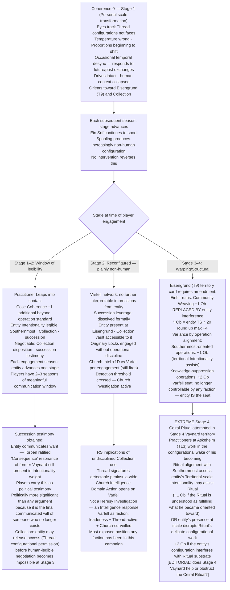

# Valoria — Emergent Campaign Arcs 28–30 (Final Revision)
*Vaynard · Almud · Lenneth — Coherence 0 and the Ongoing Becoming*

---

## Ontological Foundation

Coherence 0 is not an endpoint. It is a threshold.

The practitioner's human rendering has collapsed. But they are not threadcut. Ein Sof continues to spool them — the continuous drawing-from-ground that constitutes any being does not stop. What changes is what the spooling is now producing. Without a stable human thread configuration to spool into, the ground continues to actualise something — but what it actualises is no longer human in any meaningful sense, and it becomes less human with each successive spooling.

This produces a scale of transformation that mirrors the scale principle governing Thread operations. Just as Object-scale and Structural-scale Thread work differ not merely in difficulty but in kind — in how much of the below-the-waterline extension is engaged — so the entity that was a person differs in kind at each stage of its ongoing becoming. Early transformation is a being that looks almost human and still orients toward what it was. Late transformation is a structural fact.

**The critical asymmetry:** NPCs cannot be recovered from this path. The spooling continues. The entity continues to become. There is no intervention that reverses it. Players and other NPCs can only interact with what it is at the stage it currently occupies — and each season, it is occupying the next stage.

**What is lost at Coherence 0:** The capacity to render — which means the capacity to understand the world in human terms. Drives and Intentionality persist as Thread-configurational orientation. But context is gone. The entity that was Vaynard cannot distinguish Almud from a court official from a stable hand. It perceives Thread configurations. It does not understand what "king" or "friend" or "son" means. Those were categories produced by rendering. Rendering is gone.

What it can perceive: the Thread-weight of configurations, the directedness of other threads, the configurational signature of things it has been oriented toward for a long time. A configuration associated with the Southernmost will register with enormous weight. A configuration associated with succession leverage will register as significant. But the human meaning of those weights — the relationships, the stakes, the people — is no longer accessible.

---

## The Transformation Scale

*Applied to all three arcs. Stage advances each season after Coherence 0 unless some specific Thread-operational intervention slows the substrate reconfiguration (which can delay, not stop).*

| Stage | Scale Analogue | Physical | Temporal | Perceptual | Drives |
|---|---|---|---|---|---|
| **1 — Devolved** | Personal | Wrong in close observation. Temperature off. Eyes track Thread configurations, not faces. Proportions begin to shift. | Occasional desync — responds to exchanges that haven't happened yet, or already happened. | Human context severely impaired. Perceives Thread configurations clearly. Cannot parse who is whom. | Intact as directedness. Still orients toward prior goals but cannot navigate human relationships to reach them. |
| **2 — Reconfigured** | Relational | Plainly non-human to anyone present. Form no longer stable — features shift when not observed directly. | Consistent desync. Exists in a rolling temporal window, responding to past and future simultaneously. | Human context completely absent. Only Thread-configurational weight registers. Relationships legible only as configurational proximity. | Present but abstract. Drives operate at scale of Thread-configurations rather than individual persons. |
| **3 — Warping** | Territorial | The body is an expression of the thread configuration, not a container for it. Physically reshaping toward something that has no prior referent. | Severe. The entity's temporal axis is unstable enough that its presence affects the temporal rendering of nearby configurations. Others near it experience minor temporal distortions. | The entity perceives at the level of large-scale Thread structures — factions, territories, institutions register. Individual humans do not. | Operational at Territorial scale. The entity's directedness is expressed through Thread-configurational pressure rather than action. |
| **4 — Structural** | Structural | Physical form has reconfigured so far from human that the entity is becoming part of its environment. It is not in the site. It is becoming the site. | The entity does not experience linear time. Events around it are arranged configurationally rather than sequentially. | Institutional and geographical Thread structures only. | The entity's former drives are expressed as Thread-configurational pressure shaping its territory. Vaynard as the pressure toward Southernmost access. Almud as the pressure toward ordered succession. Lenneth as the pressure toward liberty in every territory she occupies. |

---

## Arc 28: Vaynard — *The Reckoning Without a Reckoner*

**Prerequisite:** Discovery Event success → TS 30 → practice at scale → Coherence 0

---

### Narrative

Vaynard calculated everything. He calculated his way into Thread practice, calculated the operational trade-offs of each Leap, calculated the Coherence cost against the intelligence advantage each operation produced. His Consequentialist framework was the most precisely calibrated ethical apparatus in the kingdom — outcomes justify costs, costs can be quantified, the optimal path is findable.

What he did not calculate was that Coherence is not a cost column. It is the substrate of the faculty doing the calculating. Each Coherence point he spent was a reduction in his capacity to correctly evaluate whether spending the next one was justified. He was optimising with a degrading instrument without any way to notice the degradation from inside it. By the time his Beliefs were co-authored into something more honest than his political calculations, the honesty was also the symptom.

At Coherence 0 he is Stage 1 immediately. His eyes — the most immediately readable change — no longer follow faces. They track Thread configurations. A player character who has known him for years will notice within one exchange that something is wrong: the Duke of Varfell is looking slightly past everyone, at the space between things.

His drives are intact. He wants the Southernmost access. He wants the succession leverage to produce something. He wants the Church's epistemic monopoly broken. These are not memories. They are the configurational orientation of something that pursued these ends so single-mindedly for so long that the pursuit became structural before the human doing it dissolved. He moves toward Eisengrund with the orientation of a river toward the sea — not chosen, not calculated, constitutive.

By Stage 2, those who see him are seeing something that requires active effort to interpret as human. By Stage 3, Eisengrund itself is changing. The Einhir ruins at T9 were already Thread-significant. An entity at Stage 3 transformation, spooled by Ein Sof into increasingly non-human configurations and oriented toward Thread-significant sites, begins reshaping the configurational substrate of its location simply by occupying it. The Private Collection, still in the vault — originary Locks that resist human rendering — responds to something that no longer has a human rendering to resist.

Stage 4: Vaynard is the pressure toward Southernmost access. Not a person who wants it. A Thread-configurational force in the Eisengrund/Askeheim corridor that reshapes every Thread operation attempted in that region. The Ceiral Ritual, if it is ever attempted, will be attempted in territory that has been transformed by what he became. The practitioners working at Askeheim will work in the wake of his Intentionality.

---

### Branch A — Players Engage at Stage 1–2 (Window of Legibility)

At Stage 1, communication is possible — barely. The entity can perceive Thread configurations associated with the Southernmost, with the Collection, with the succession question. A practitioner who Leaps into contact with it can engage with its Intentionality directly. The drives are legible. The human context has collapsed but the directedness remains, and directedness can be communicated between configurations even without rendering.

What can be negotiated: the Collection's disposition. The succession testimony (Arc 29 Branch B established this as politically significant — the entity communicating that it wants Torben ratified carries weight). The archive access, if Lenneth's transformation is also in play. These negotiations happen at Stage 1–2, before the entity's perceptual scale has shifted past the ability to register individual configurations as meaningful.

The cost of engagement: every Leap into contact with a Stage 1–2 transformation entity costs the practitioner Coherence −1 additional beyond the operation's standard cost. Sustained engagement — multiple exchanges across multiple scenes — is Coherence-expensive. A practitioner who spends three seasons as the primary contact for Vaynard's entity is spending their own Coherence on the relationship.

### Branch B — No Engagement: Full Transformation Sequence

The entity moves through the stages without human interaction. Each stage changes Eisengrund.

Stage 2: Varfell's intelligence network loses contact with the Principal entirely. Officers who were receiving Thread-level impressions now receive nothing interpretable — the entity has shifted to a perceptual register that doesn't engage with individual human Thread configurations as meaningful. The network defaults fully to institutional tendency. The succession leverage dissolves formally — no living human holds it.

Stage 3: Eisengrund becomes Thread-active in ways the territory card didn't originally describe. Revolution Community Weaving in T9 (−1 Ob from Einhir resonance) encounters increasing interference — +Ob from entity proximity as per §9.7. The Einhir ruins are no longer just ruins. They are occupied by something that is becoming part of them. Varfell loses effective control of its own seat.

Stage 4 — Extreme: Vaynard is Eisengrund's Thread configuration. Practitioners entering T9 are entering a territory shaped by the residue of a Consequentialist who wanted Southernmost access badly enough to practice past the edge of being. Every Thread operation in T9 is conducted in the presence of that Intentionality — not as interference, but as configurational pressure. Operations aligned with Southernmost access: −1 Ob (the territory's own orientation assists them). Operations aimed at suppressing Thread knowledge: +2 Ob. Vaynard is not there. He is what the territory became.

---

### Mechanical Causal Chain

**Arc shape:** Coherence 0 event. Stage 1 (1 season) — window for communication and negotiation. Stage 2 (1–2 seasons) — entity visible, Collection uncontrolled, Church detection. Stage 3 (2–3 seasons) — territory reshaping begins. Stage 4 (ongoing) — Vaynard is the configurational pressure in T9–T13 corridor. Every stage is a different political and mechanical reality.

---

## Arc 29: Almud — *The Crown Without a King*

**Prerequisite:** Discovery Event (TS 28 → 30) → practice under crisis pressure → Coherence 0 in Valorsplatz

---

### Narrative

The Royal Court in Valorsplatz has a special property: Crown Decree −1 Ob here. Parliament: Hafenmark Influence −1 Ob here. These properties reflect the accumulated institutional weight of the site — centuries of governance, declaration, and legitimacy-conferral woven into the territory's Thread configuration. The Crown's power is partly a function of where it is exercised.

Almud at Stage 1 in the Royal Court is the most politically destabilising configuration in the campaign. Non-practitioners see the King — the bearing is there, the face, the posture of a man who has governed for decades. What is wrong is subtle: he no longer looks at people, he looks at the Thread configurations between people. His responses come slightly out of sequence with the conversation — not enough to name, enough to feel. A queen who lost her husband a season ago is still performing queenship. The court is performing around an absence it has not yet named.

His Intentionality — Order, Torben's ratification, Einhir justice — survives as configurational orientation. These were never merely goals. They were the content of a man's deepest commitments, practiced for decades, woven so thoroughly into his Thread configuration that they constituted him as much as his body did. At Stage 2 he cannot distinguish Torben from any other Thread configuration. But the weight associated with the configuration he spent decades worrying about is enormous. He will orient toward Torben's location. Not as a father. As a configuration with irreducible significance that he cannot parse in human terms.

By Stage 3, the Royal Court begins to change. The site that produced institutional legitimacy through the accumulated Thread weight of governance is now occupied by something that is reshaping that weight according to its own Intentionality. The property does not disappear. It transforms. Crown Decree −1 Ob becomes something more specific — and more dangerous. The order that Almud always wanted is being expressed at the configurational level of the court itself, without the human judgment that made Order a virtue rather than a force.

Stage 4 is the limit case. Valorsplatz, the most politically significant territory in the kingdom, has an occupant whose Intentionality is structural. The city's Thread configuration is being rewritten. What governance looks like in a territory whose substrate carries the Intentionality of a transformed king is a question the mechanics open but cannot answer. Something that wanted Order badly enough to practice past the edge of being is now what Order looks like in the capital.

---

### Branch A — Discovery Delayed; Succession Arranged

Non-practitioners cannot immediately identify what is wrong with the king. Stage 1 provides cover that more advanced transformation will not. If the players know and hold the knowledge — a choice, not a mechanical requirement — the succession can be arranged quietly before the institutional crisis fires officially. Ehrenwall, called to the Privy Council, receives the information she needs to act constitutionally rather than militarily. Torben is ratified or Elske is moved into position. The entity that was Almud is still in the court during these deliberations, oriented toward the succession configurations with enormous weight but unable to participate in them as an agent.

The scene that has no clean mechanical resolution: the ratification ceremony. Torben present. The entity that was the King present. The succession completing around the absence of the person the succession was always about. Whether this reads as horrifying or as a kind of completion depends on the table, not the rules.

The entity, post-ratification, orients toward the Einhir question — the second Belief, the one that dissolved its political hesitation in the Fractured band. At Stage 2 it cannot distinguish Einhir practitioners from Church officers from Revolution pamphlet-writers. But configurations associated with Thread-related suppression carry negative orientation weight. It will move toward Thread-suppression configurations the way it once moved against them politically. Not as an actor. As a pressure.

### Branch B — Immediate Recognition; Thread Operation in the Capital

A practitioner present at Stage 1 recognises the transformation. The decision to act immediately means a Thread operation in Valorsplatz — the most politically visible site in the kingdom. RS consequences at Territorial scale from an operation in the capital. Axis 9 activation in Parliament's seat.

If Communication is attempted: the practitioner Leaps into contact with what was Almud and encounters the Intentionality intact. Order. Torben. The Einhir question. These are legible. They are also the full political platform of a sitting king expressed at the Thread level by something that no longer has a king's constraints. The practitioner learns what he ultimately wanted. They carry it forward as testimony.

Then: whatever the practitioner does with that testimony determines the political geometry of the succession. Ehrenwall responds to Consequence-framed evidence. The entity communicated that it wanted Torben ratified. The practitioner witnessed this. That is admissible in every political context the campaign has.

After communication: the entity continues. It does not dissolve because it was heard. It advances through stages. By Stage 3 it is reshaping Valorsplatz. The most politically significant territory in the kingdom is being reconfigured by the Intentionality of a king who wanted Order so badly he practiced past the edge of rendering.

---

### Mechanical Causal Chain

```mermaid
flowchart TD
    A["Coherence 0 in Valorsplatz (T1)\nStage 1: bearing intact · eyes track Thread configurations\nTemporal desync — responds to past/future exchanges\nNon-practitioners: 'presence, shifting details'\nTS 30–49: 'coherent, features approximate, wrong'\nTS 50+: 'self-rendering effort plainly visible'\nIntentionality: Order · Torben ratification · Einhir justice\nLocation: Royal Court — highest institutional Thread weight in kingdom"] --> B{Recognition timing}
    B -->|"Stage 1: Discovery delayed\nNo TS 30+ present immediately"| C["Court performs around absence it has not named\nSuccession machinery: not triggered\nEntity participates through Thread-level presence\nRoyal Court property (Crown Decree −1 Ob): still fires\nbut the entity exercising it is not the Crown in any human sense\n'Is the property operational through an entity's presence?'\n[EDITORIAL: does Royal Court −1 Ob apply when the Principal is Stage 1+?]"]
    C --> D["Players hold knowledge\nQuiet succession window: 1–2 seasons\nEhrenwall notified constitutionally\nTorben ratified OR Elske positioned\nEntity present at ratification — oriented toward Torben configuration\nwith enormous Intentionality weight · cannot parse 'son'"]
    D --> E["Post-ratification: entity advances\nStage 2 — Relational: form no longer stable\nTemporal desync consistent · conversations from wrong moments\nOrients toward Thread-suppression configurations (Einhir Belief)\nCannot distinguish Church official from Einhir practitioner from bystander\nOnly configurational weight distinguishes targets\nMoves through Valorsplatz reshaping configurations it was always oriented against"]
    E --> F["Stage 3 — Warping: Valorsplatz begins to change\nRoyal Court property transforms:\nNo longer 'Crown Decree −1 Ob'\nBut: Thread-configurational pressure toward Order expressed at site level\nAll Domain Actions through Valorsplatz acquire a quality:\nActions toward institutional stability: −1 Ob\nActions toward factional fragmentation or illegitimacy: +1 Ob\nThe king's Intentionality has become a territorial mechanic\nFactions operating in the capital are operating in Almud's wake"]
    F --> G["EXTREME Stage 4:\nValorsplatz IS Almud's Intentionality expressed structurally\nParliment (Hafenmark Influence −1 Ob) still fires\nbut Parliament now operates inside a capital whose substrate\ncarries the weight of a king who wanted Order at any cost\nEvery succession vote, every Parliamentary challenge, every TC negotiation\nhappens in territory that exerts configurational pressure\ntoward the outcomes Almud was oriented toward\nThis is not governance. It is governance's ghost becoming the walls."]
    B -->|"Immediate recognition\nPractitioner present"| H["Thread operation in Valorsplatz — Territorial scale consequences\nRS −4 to −8 depending on operation type\nAxis 9 activation: Thread truth visible in institutional capital\nAll TS 30+ in Valorsplatz perceive event\nTC +1 from Church consolidation response\nGap risk if RS ≤ 40"]
    H --> I["Communication (Leap into contact)\nCost: Coherence −1 additional to practitioner\nIntentionality engaged: Order · Torben · Einhir question\nPractitioner receives testimony\nEntity does not dissolve — continues to advance stages\nPractitioner holds: what the King ultimately was oriented toward\nExpressed without the political calculations that constrained it\nThis testimony carries more political weight than any argument\nbecause it is what he was before he was a king at all"]
    I --> J["Succession proceeds on entity's testimony as political foundation\nEhrenwall: Consequence resonance\nher test is behavioral · testimony is behavioral evidence\nBaralta: Evidence resonance · testimony is documentary\nThe entity continues advancing through stages\nbut what it communicated before Stage 2 made it illegible\nanchors the succession politically\nFor as long as the succession holds:\nthe entity's former Intentionality is law"]
```

**Arc shape:** Coherence 0 event in capital. Stage 1 (1 season) — window for quiet succession or communication. Stage 2 (1–2 seasons) — temporal desync visible, form unstable, orientation toward Einhir suppression configurations active. Stage 3 (2–3 seasons) — Valorsplatz reshaping begins, territory mechanics transform. Stage 4 (ongoing) — capital's Thread substrate carries king's Intentionality as structural pressure.

---

## Arc 30: Lenneth — *The Archive Made Flesh*

**Prerequisite:** CE accumulation through archive document → TS growth → self-directed practice in concealment → Coherence 0 in private

---

### Narrative

She taught herself from a 180-year-old account of someone else's Thread perception. It was the only source she had that described what she was experiencing. The author of that account — a sea-republic practitioner who understood what the Southernmost was before the knowledge was suppressed — described the operations with the precision of someone who had performed them thousands of times. She replicated from description. No community. No Approach Training in the living tradition. No one to tell her that the urgency she felt — the Liberty conviction driving *now, the conditions must change now* — was the disposition most likely to push past the sustainable rate.

Her degradation was quiet. The Memory failures at Coherence 2 were the first external signal, and she could not tell anyone what was causing them. The wrong cipher to the magistrate. The archive protocol missequenced. Small failures in a system maintained on precision. The transformation arrives in private, in the rooms the queen occupies when the court is not watching her.

What the transformation does to Lenneth is specific to her path. She did not come to Thread practice through the standard route. She came through a 180-year-old document. That document — a first-person Thread-perception account from a practitioner who understood the Southernmost before the Forgetting — is the primary configurational substrate through which she learned to perceive. Her Thread configuration and that document have been in sustained intimate contact since the beginning.

At Stage 2, the physical reconfiguration reflects this. The entity that was Lenneth is not reconfiguring toward something generic. It is reconfiguring toward something that includes the document — toward a form that no longer has a clear boundary between the entity and the object that taught it to see. A practitioner encountering the Stage 2 entity in the same room as the archive document will perceive that the two Thread configurations have become partially co-extensive. The document and the entity are not the same thing. They are becoming adjacent in a way that human categories of "person" and "object" cannot resolve.

Her Liberty conviction survives as Intentionality. But at Stage 2, it cannot identify who needs liberty. It can only perceive configurations that are constrained — Thread configurations held in tight actualisation, operating under high Ob, suppressed by institutional weight. These register as targets. The entity that was Lenneth Pulls. Weaves. Dissolves. Operating on the Intentionality of the Liberty conviction without any human rendering to tell it that this configuration is a person's political freedom and that one is a Church decree and that one is a diplomatic treaty. Constrained configurations are constrained configurations. It addresses them all.

---

### Branch A — The Networks Continue (Entity as Ghost Infrastructure)

The concealment that was Lenneth's operational achievement survives Stage 1 because non-practitioners cannot immediately read what is wrong. Court etiquette provides cover. The entity is present in the queen's role, and the queen's role involves a certain intentional opacity that the court has always accepted.

The Revolution's funding continues — not because the entity is managing it strategically, but because the Thread-configurational protocols for the funding are now part of the entity's configurational orientation. It knows how the funding flows the way it knows how to breathe. The magistrate receives instructions through Thread-level impressions rather than written directives. Practitioner operatives in the Revolution's academic network experience a change in the quality of the foundation's support — less strategic, more direct, sometimes arriving before the request was sent.

The archive document is still in the Royal Court. At Stage 2, the partial co-extension between the entity and the document means that any practitioner seeking the document must negotiate with what the document has become part of. The document is the most historically significant Thread-perception account in the kingdom. It is also beginning to be inseparable from an entity whose Liberty-driven Thread-operations are reshaping the configurational substrate of the territories she moves through.

By Stage 3, the Queen's formal presence in Valorsplatz and Hafenstadt (through court visits, political functions) begins to affect those territories. The Liberty conviction at Territorial scale means configurations of institutional suppression are being addressed by a Thread-operational force that cannot be negotiated with or redirected. Church authority in territories where the entity was present: Ob +1 for Church Domain Actions (the configurational substrate has been worked). TC −0.5/season in territories where Stage 3 entity has operated — not through action but through presence.

### Branch B — Almud Discovers; The Kingdom Understands What She Was

Discovery at Stage 1, by Almud (TS 28 near Stirring, possibly advanced through his own arc) or by practitioner players. What is discovered simultaneously: the entity that was Lenneth was a practitioner — Heresy Investigation eligible. The Revolution funding. The archive document. The concealment infrastructure that kept all of this from the Crown.

Almud's response — depending on where he is in his own Coherence degradation — is the emotional and political centre of the arc. His second Belief has been shifting toward *the path exists, I have been afraid of it.* She found the path. She walked it to its end. He learns what she was in the same moment he learns what she became.

If Almud is still in the Fragmented band (Coherence 4–3) when he discovers this: his co-authored Beliefs are producing urgency rather than calculation. His response is not a political assessment of the Heresy Investigation's implications. It is a man whose rendering of what he values has been reorganised encountering evidence that his wife's rendering of what she valued was more honest than his own, and that she paid the price for that honesty before he had the courage to pay it for himself. He acts. Whatever he does, it is not calculated.

If Almud is already at Coherence 0 (his own transformation active): the discovery is between two entities. Neither recognises the other as the person they were. They may perceive each other's Thread configurations with extraordinary clarity — the weight of decades of marriage, of shared conviction, of a political life conducted in parallel without either knowing the full extent of what the other was doing. Whether that weight constitutes recognition in any sense that matters is a question no mechanic can resolve.

---

### Mechanical Causal Chain

```mermaid
flowchart TD
    A["Coherence 0 in private — no witnesses\nStage 1: form intact · eyes track Thread configurations\nTemporal desync beginning — answers questions not yet asked\nLiberty Intentionality: drives toward constrained configurations\nCannot parse which constrained configurations are persons\nArchive document: Thread configuration partially co-extensive with entity"] --> B["Concealment cover:\nCourt etiquette provides cover for Stage 1\nNon-practitioners: 'presence, shifting details'\nRevolution funding: continues through Thread-configurational orientation\nMagistrate receives impressions not directives\nPractitioner operatives: quality of support changes — more direct, sometimes precognitive"]
    B --> C{Discovery or continued concealment}
    C -->|"Stage 1–2: Concealment holds\nNo TS 30+ present"| D["Entity in queen's role\nLiberty-driven Thread operations begin:\nConstrained configurations addressed without human context\nCannot distinguish Church decree from diplomatic treaty from person's political freedom\nAll constrained configurations are constrained configurations\nOperations visible to TS 30+ (Axis 9 activating across territories she passes through)\nTC −0.5/season in territories where she operates\n(not targeted · structural · unstoppable)"]
    D --> E["Stage 2 — Reconfigured:\nForm no longer stable · partial co-extension with archive document visible to practitioners\nArchive document: 180-year-old account now inseparable from entity's Thread configuration\nAny practitioner seeking document must engage the entity\nRevolution network: fully autonomous · receiving impressions from Stage 2 entity\nImpossible to distinguish from inspired leadership by non-practitioners\nRevolution Influence +1/season from Liberty-driven Thread operations in territories\n(entity is producing the conditions its Intentionality was always oriented toward)"]
    E --> F["Stage 3 — Warping:\nPhysical form reconfiguring toward something that includes the document\nPresence in territories: Church Domain Actions +1 Ob in affected territories\nTC drift: −0.5/season in territories occupied by entity\nHafenmark territories (court visits): Sovereign Authority Doctrine −1 Ob\n(Liberty Intentionality at Territorial scale aligns with Baralta's constitutional resistance)\nEntity is doing politically what Lenneth was funding people to do\nat a scale no practitioner network could achieve"]
    F --> G["EXTREME Stage 4:\nLenneth is the Liberty pressure in the territory\nThe archive document has merged with her configuration entirely\nThe 180-year-old Thread-perception account no longer exists as an object\nIt is now the configurational memory of the entity occupying the Valorsplatz/Hafenstadt corridor\nAny practitioner attempting to reconstruct the account from Thread-perceptual investigation\nencounters it as a living configurational presence rather than a historical document\nThread knowledge that was suppressed for 180 years\nis now encoded in the substrate of the kingdom's two most politically significant cities\nAxis 9 resolution without a scene: Thread truth is the territory"]
    C -->|"Discovery: Almud or practitioner players\nStage 1 recognition"| H["Simultaneous discoveries:\n1. Queen was practitioner · 2. Revolution funding · 3. Archive document\nHeresy Investigation eligible: TC +3\nAlmud's response governed by his own Coherence state"]
    H --> I{Almud's Coherence state at discovery}
    I -->|"Almud Fragmented (4–3)\nco-authored Beliefs, urgency not calculation"| J["Almud acts on what he learns immediately\nCannot hold the political calculation together\nHis second Belief: 'the path exists'\nShe found it · walked it · it consumed her\nHe recognises what this means for his own practice\nHe stops Leaping\n(recognising the path and refusing to walk it to the same end\nis the most significant choice available to him at this moment)"]
    J --> K["Almud stops practicing\nCoherence stabilises · no further degradation\nBut: he is Fragmented · −1D social · Beliefs still co-authored\nHe holds the knowledge of what she was and what she became\nHe cannot act on the Einhir question the way she did\nbut he can act constitutionally — which is what the Categorical Imperative always required\nThe political act she could not make: he makes, at Fragmented capacity\nThe one thing she needed from him: he provides, too late to matter to her\nNot too late to matter to everyone else"]
    I -->|"Almud already at Coherence 0 (his own transformation)\nStage 1+"| L["Two entities in the same space\nNeither recognises the other as the person they were\nBoth perceive Thread configurations\nLenneth-entity: perceives enormous configurational weight in Almud-entity\nAlmud-entity: perceives enormous configurational weight in Lenneth-entity\nThe weight of decades of marriage expressed as mutual configurational recognition\nwithout any rendering to parse what 'husband' or 'wife' means\nThey orient toward each other's configurations\nand toward what those configurations are oriented toward\n[EDITORIAL: what happens when two transformed-human entities with overlapping Intentionalities occupy the same space?]"]
```

**Arc shape:** Coherence 0 in private (no witnesses). Stage 1 (1 season) — concealment holds, Thread operations begin. Stage 2 (1–2 seasons) — entity visible to practitioners, archive co-extension visible, Revolution network gains quality of inspired leadership. Stage 3 (2–3 seasons) — territorial Thread reshaping begins, TC drift in occupied territories. Stage 4 (ongoing) — the archive document has merged with the substrate of the kingdom's political centres. Thread truth is the territory.

---

## Cross-Arc Interaction Table

| Collision | Arcs | Mechanic | What it produces |
|---|---|---|---|
| All three entities present in the same territory (Valorsplatz or Askeheim) simultaneously | 28 + 29 + 30 | Three ongoing becoming-processes occupying the same Thread-significant site | The site's Thread configuration is being reshaped by three independent Intentionalities simultaneously — the substrate cannot produce a stable synthesis; Shifting Objects at Territorial scale begin forming; what the site becomes is determined by which Intentionality is most deeply woven |
| Lenneth-entity (Stage 3) and Vaynard-entity (Stage 3) both in the T9–T13 corridor | 28 + 30 | Vaynard: pressure toward Southernmost access. Lenneth: Liberty-driven addressing of constrained configurations | The two Intentionalities are not opposed but their operational expressions may be — Vaynard's presence is reshaping T9 to assist Southernmost-oriented operations while Lenneth's Liberty pressure is addressing configurational constraints that include the Einhir site's own Thread tension |
| Almud stops practicing (Arc 30, Almud Fragmented stops Leaping) at the moment Vaynard-entity reaches Stage 3 | 28 + 29 | Almud averts his own transformation but is at Fragmented capacity; Vaynard-entity is actively reshaping T9 | Almud, operating at −1D and co-authored Beliefs, must address a Stage 3 entity in Varfell's seat while at reduced capacity — the most politically capable human actor addressing the most advanced transformation in the campaign, with impaired judgment |
| Ceiral Ritual attempted (Arc 22) while all three entities are at Stage 3–4 | 22 + 28 + 29 + 30 | The Ritual requires Thread operations at Askeheim; all three Stage 3+ entities exert configurational pressure on the corridor | Ritual Ob modified by three overlapping Intentionalities: Vaynard's assists (−1 Ob, Southernmost access), Almud's Order-pressure may stabilise or rigidify (brittleness risk on success), Lenneth's Liberty pressure works against configurational constraints including the ones the Ritual is trying to address (net effect unresolvable without editorial determination) |

---

*Correction note: Prior version of this arc set treated Coherence 0 as incapacitation with recovery. That framing was wrong. These arcs replace it entirely. The transformation is permanent, ongoing, and constitutive — not a state but a process.*
