# Valoria — Emergent Campaign Arcs 28–30 (Revised)
*Vaynard · Almud · Lenneth — Coherence 0*

## Design Correction Applied

Coherence 0 is not a recoverable incapacitation. It is character death through transformation.

When a practitioner's Coherence reaches 0, their human thread configuration has devolved irreparably. The rendering that constitutes their being as a human — the capacity to render themselves and the world as a conscious agent — has collapsed. What remains is their Thread configuration expressing without the human rendering layer. They retain their Intentionality and Drives. They have become something radically Other. Players lose their character at this moment.

The entity that emerges is not the person's ghost or a corrupted version of them. It is the Thread-level residue of everything they were, now operating as a Monstrous Entity. Their goals persist. Their relationships persist as configurational weight. Their former human context still matters to them — it is the content of their Intentionality. But they no longer render, and what cannot render cannot be human.

These arcs are written with this understanding. None of the three NPCs below begin as practitioners. Each arc includes the prerequisite path that brings them into practice, the degradation sequence, and the transformation event. Branching occurs both before and at Coherence 0.

---

## Arc 28: Vaynard at Coherence 0 — *The Consequentialist Without Edges*

**Prerequisite:** Discovery Event success → TS 30 → Approach Training → Thread operations at scale driven by TK urgency
**Pivot:** Final operation crossing Coherence to 0 — the moment his rendering gives way
**Primary mechanics:** Coherence 0 = transformation into Monstrous Entity · Retained Intentionality (TK 5, Southernmost access, succession leverage) · Mode 3 adjacent — degradation-origin entity · Private Collection physically in Eisengrund (T9) · Varfell's headless intelligence network · Observer-dependent rendering · Vaynard's Resonant Style: Consequence

---

### Narrative

Vaynard treated Coherence as an optimisation problem. He quantified the cost of each operation, tracked the degradation curve, calculated how much rendering capacity he could surrender while maintaining political function. He was wrong about the model. Not the math — the math was accurate. He was wrong about what the resource was.

Coherence is not capacity. It is being. When it reaches 0 he does not lose the ability to think. He loses the ability to render — which means he loses the ability to be a person, to be present to himself as a continuous agent in a world of other agents. The thing that emerges from that loss is not impaired Vaynard. It is what Vaynard was at the Thread level, now without the human layer that made him legible.

What it wants is exactly what he always wanted. The Southernmost access. The succession leverage that was going to outlast him. The intelligence advantage his network spent decades building. These are not memories. They are the configurational orientation of something that has been pursuing these ends for so long that the pursuit is now structural — woven into the Thread configuration that persists after the rendering collapses.

The players who knew him will recognise the Intentionality immediately. That is what makes it terrible. The entity moving through Eisengrund toward the Private Collection is not a stranger. It is the most consequential political actor in the duchy, operating now at a level of Thread-directness that no human practitioner can match, pursuing goals that are indistinguishable from what he pursued when he was a duke.

---

### Branch A — The Entity Continues the Work

The Collection is in Eisengrund (T9), Varfell Seat. The entity accesses it directly — not as a duke opening a vault, but as a Thread configuration engaging Thread-significant objects without the barrier that human rendering imposes. The originary Locks in the Collection, which Vaynard spent years acquiring and deploying cautiously, are now in the hands of something that perceives them as configurations rather than objects. The operational cost that made each deployment a strategic decision is gone.

Each originary Lock engaged: Church Intel +1D vs Varfell (detectable signature) — this still fires, because the Thread activity is real regardless of the operator's rendering status. But the entity does not manage exposure the way Vaynard did. It pursues the Southernmost access that was always the goal, using every configurational tool the Collection contains, without the political calculation that kept the operations below the Church's detection threshold.

The intelligence network is now being directed by something that can communicate its Intentionality through Thread operations but not through human speech. Its commands to Varfell's officers arrive as Thread-level impressions that practitioner officers with sufficient TS can perceive — and as inexplicable pattern recognition for the non-practitioner officers, who find themselves acting on intelligence they cannot source. The network is haunted by its former principal.

TK 5 means the entity understands what Galbados was structurally. It seeks capability, not knowledge. The Southernmost is what it moves toward. Not as a person pursuing an agenda. As a configuration oriented toward the Thread wound the way a river is oriented toward the sea.

### Branch B — The Entity Is Recognised as a Threat

Not all entities with retained Intentionality can be negotiated with. The transformation changes the context of the drives even when it preserves their content. What Vaynard wanted as a duke — controlled access, strategic patience, intelligence advantage — was embedded in a web of human relationships, institutional constraints, and legible accountability. The entity that wants the same things wants them without those constraints. Southernmost access without the expedition procedure. Succession leverage without Parliament. Collection deployment without the Church's detection threshold as a practical limit.

The Löwenritter, or a practitioner PC, or Baralta's intelligence apparatus, identifies what has happened in Eisengrund. An entity is present at the Varfell seat. It has the TS signature of a practitioner at extreme Thread proximity and no human rendering. The entity that was Vaynard is accessible through communication — Mode 3 entities may have comprehensible goals, and this one certainly does — but communicating with it requires Leaping into contact, and contact with something at the level of a transformed human Thread configuration is not the same as contact with a naturally-occurring monstrous entity.

Resolving it: Dissolution (Ob 5+, RS consequence at Personal-to-Territorial scale, risks second Gap), Pulling to weaken then conventional approach, outlasting De-Actualisation if Rendering Strain accumulates. But De-Actualisation from Rendering Strain requires the entity to render beyond observer capacity — this entity, with no human rendering ceiling, may not accumulate strain in the conventional sense. [EDITORIAL: how does De-Actualisation apply to a Coherence-0-origin entity?]

---

### Mechanical Causal Chain

```mermaid
flowchart TD
    A["PREREQUISITE: Vaynard Discovery Event success\nTS 30 → practitioner designation\nOperates at scale driven by TK 4→5 urgency\nCoherence: 10→7 (Dissonant) →4 (Fragmented) →2 (Fractured)\nFractured: Beliefs co-authored, −2D social/memory, dissociative episodes\nGM presents shifting perceptual framework as internal voice"] --> B["Final operation: Territorial or Structural scale\nCoherence −1 → 0\nHuman rendering collapses\nThread configuration: intact · Intentionality: intact\nVaynard as person: gone\nMonstrous Entity: emerges"]
    B --> C["Entity properties:\nRetains TK 5 orientation (Southernmost, Collection, succession leverage)\nNo human rendering ceiling → observer-dependent perception of entity\nThread configuration expresses drives directly without political mediation\nSelf-rendering: continuous, as with Mode 3 adjacent entities\nPrivate Collection: configurations perceivable/accessible without human interface barrier"]
    C --> D{Entity orientation}
    D -->|"Pursues former drives through Thread means"| E["Entity moves toward Eisengrund (T9) — Private Collection\nOriginary Locks deployed without operational discipline\nChurch Intel +1D vs Varfell per engagement (still fires)\nBut: no political calculation limiting deployment frequency\nThreshold events accelerate from uncontrolled Collection use\nRS: Thread signatures detectable peninsula-wide at scale of activity"]
    E --> F["Intelligence network: haunted by transformed principal\nPractitioner officers (TS 30+): receive Thread-level impressions\nNon-practitioners: act on pattern recognition they cannot source\nNetwork executes Vaynard-shaped operations without human oversight\nFaction institutional tendency (maximize information, avoid public commitments)\nNOW combined with entity's direct Thread-operational capacity\nVarfell becomes the most Thread-active faction on the board — and the most exposed"]
    E --> G["Entity orients toward Southernmost\nNot expedition procedure — direct Thread approach\nAskeheim (T13): entity present = automatic Discovery Events for any TS 30+ character per season\nEntity at Thread wound proximity: RS accelerates from interaction\nEinhir site resonance at T9 amplified by entity's presence\nRevolution's Community Weaving in Eisengrund: Ob increases from entity interference\n'+Ob = entity TS ÷ 20 round up, max +4' (Threadcut being interference rule)"]
    D -->|"Recognised as threat · players/factions move to resolve"| H["Detection: TS 30+ perceives entity at Eisengrund\n'Senses an operation in the scene; general direction identifiable'\nEntity signature: practitioner-level TS without human rendering\nIdentification: whoever knew Vaynard recognises the Intentionality\n'The drives are his. He is not.'"]
    H --> I{Resolution approach}
    I -->|"Dissolution (TS 50+, Ob 5)"| J["RS −5 to −8 (Personal-to-Territorial scale)\nGap at Eisengrund site · Einhir ruins disturbed\nRevolution Community Weaving in T9: blocked until Gap Mended\nCollection scattered as Thread-loose objects\nVarfell: loses intelligence principal AND Collection simultaneously\nSuccession leverage: formally dissolves (no living Vaynard to hold it)"]
    I -->|"Communication (entity has comprehensible goals)"| K["Requires Leaping into contact with transformed human configuration\nCommunication is possible — Intentionality is intact and legible\nEntity's position: 'The Southernmost must be addressed. I am still addressing it.'\nNegotiation surface: entity may accept constraints in exchange for Southernmost access\nIf agreement reached: entity acts as a Thread-operational ally\nbut one that cannot participate in human political structures\n[EDITORIAL: what does an agreement with a transformed-human entity look like?]\nRS implications of sustained entity presence: +0.5/season from self-rendering strain on substrate"]
    I -->|"Outlast De-Actualisation"| L["Entity accumulates Rendering Strain from operating beyond observer capacity\n[EDITORIAL: does Coherence-0-origin transformation entity accumulate Rendering Strain?\nIf it has no ceiling beyond which it renders: strain may not apply]\nIf De-Actualisation not applicable: entity is permanent until resolved by operation\nSite inaccessible for Southernmost expedition purposes\nEntity's presence at Einhir ruins may be what ultimately prevents Ceiral Ritual at T9"]
```

**Why this arc is emergent:** Vaynard's Consequentialist framework is the exact disposition that leads to precisely this outcome — he optimised his way to the edge of being and did not recognise what the edge was. The entity that emerges continues optimising, now without the constraints that made optimisation legible as a human activity.

**Arc shape:** Discovery Event → 4–6 seasons of practice → Fractured band (1–2 seasons of shifting Beliefs) → Coherence 0 transformation. Post-transformation: Branch A (entity continues Vaynard's work in Thread form, 2–4 seasons before campaign-level RS consequences force resolution) or Branch B (players/factions resolve entity, immediate political vacuum in Varfell).

---

## Arc 29: Almud at Coherence 0 — *The King in Valorsplatz*

**Prerequisite:** Discovery Event fires (TS 28 → 30) → First Leap during political crisis → rapid degradation under campaign pressure
**Pivot:** Coherence 0 in Valorsplatz, the capital — the entity is present in the seat of Crown governance
**Primary mechanics:** Coherence 0 transformation in a populated institutional centre · Crown governance principal removed · Ehrenwall Coup Counter (institutional failure) · Succession crisis (Torben's status) · Entity retains Almud's Beliefs: Order, Einhir justice, Torben's ratification · Valorsplatz special properties: Royal Court, Parliament · Fractured Belief co-authorship before transformation

---

### Narrative

The First Leap for a sitting monarch is not a private event. Almud's TS has been 28 for years. When Thread activity in the campaign finally crosses the threshold and his Discovery Event fires, the scene it fires in is whatever scene the campaign has generated for him. It may be a Parliament session. It may be the moment an Altonian delegation is in the court. It may be a private audience with a practitioner PC. The circumstances determine who witnesses the King's world reorganise.

His Beliefs have been under structural conflict since the campaign began. By the time his Coherence reaches the Fractured band, the GM's co-authorship has been working on them for seasons. His second Belief — *the informal caste against southern Einhir is wrong; I will not act until I find a path* — has shifted. The patience that held it in place was always a political calculation, not a moral one. At Coherence 2, calculations are harder to maintain. He begins acting on what he actually believes.

This is the season before Coherence 0. Almud at Coherence 2 has already done things that the Crown's political architecture could not absorb. The coalition is strained. Baralta is managing the fallout. Ehrenwall is watching with the expression she always wears when she is counting.

Then the final operation. Almud was not supposed to be in the Thread-operational field at all — he was a late-entry practitioner, always operating outside the established practitioner community's norms and support structures. Nobody has been managing his Coherence. Nobody has been tracking it the way a practitioner community would track an experienced member's degradation. When Coherence 0 arrives, it arrives without warning to anyone except the players who were watching.

The entity in Valorsplatz is not a threat to the city. It is not aggressive, not destructive. It is present in the Royal Court with Almud's face, Almud's posture, the unmistakable bearing of a man who has spent decades performing kingship. It retains the Intentionality of his three Beliefs. It wants order maintained through legitimate institutional channels. It wants Torben ratified before the succession becomes a weapon. It wants the Einhir caste resolved. These are not abstractions to it. They are the configurational orientation that survived the rendering collapse.

The problem is that none of these things can be accomplished by something that is no longer human.

---

### Branch A — The Entity Is Mistaken for the King (Discovery Delay)

Not everyone in the Royal Court has TS 30+. Non-practitioners perceive the entity within their rendering capacity — which, for an entity at Almud's Thread configuration, may produce a coherent image. At TS 0–29 the entity reads as: *a presence, unstable image, details shift.* At TS 30–49: *coherent figure, but features approximate, real but wrong in inarticulable ways.* At TS 50+: *stable perception, the continuous self-rendering effort visible as a hum of operation.*

The court does not immediately know. The players know, or can determine it. For 1–2 sessions, depending on how quickly the truth propagates, the entity continues to be present in Valorsplatz while Crown governance functions around an absence its own apparatus does not yet recognise.

During this window, the entity participates in governance in the only way it can — through Thread-level impressions on sensitive characters, through the weight of its configurational presence in a place with high symbolic and institutional Thread-significance (Royal Court: Crown Decree −1 Ob here), and through the fact that the succession machinery has not yet been triggered because nobody has officially declared the King absent.

The discovery of the truth — when it comes — arrives as a political event of the first order. The Crown has no principal. The succession clock starts immediately. Torben's status determines what comes next. Ehrenwall's coup trigger does not increment — this is not a failure of institutional will. It is something she has no counter for. Her counter tracks institutional failures. The transformation of the Crown's principal is outside its categories.

### Branch B — The Entity Is Recognised Immediately

A practitioner PC is present. TS 50+ observers perceive the entity plainly — *the continuous self-rendering effort visible as a hum of operation.* There is no ambiguity. The King has become something else. The scene where this is recognised is one of the most politically dangerous moments in the campaign, because the entity is still present in the room, it retains Almud's Intentionality, and the practitioner who just recognised it must decide what to do without alerting the non-sensitives to what they are looking at.

The entity is not hostile. Its drives are toward order, ratification, and Einhir justice. These are not drives that motivate aggression. They are drives that motivate presence — remaining in the Royal Court, being near the succession machinery, orienting toward the institutional processes that could fulfil them. It cannot be negotiated with through normal channels. Communication requires Thread contact. A practitioner who Leaps into communication with a transformed-human entity of this origin is engaging with something that was a king, still wants to be a king in the only sense that matters to it, and cannot be one.

The players must decide whether to attempt resolution immediately or to manage the political implications first. Managing first means the entity in the court, Almud's governance formally continuing for the days or weeks it takes to arrange succession, the transformation as a secret held by the players while the court continues to function around it. Attempting resolution immediately means a Thread operation in Valorsplatz — visible to every TS 30+ observer in the capital, generating RS consequences, firing Axis 9 in the most politically exposed institutional setting in the kingdom.

---

### Mechanical Causal Chain

```mermaid
flowchart TD
    A["PREREQUISITE: Almud Discovery Event fires (Thread activity near TS 28)\nTS 28 → 30 · First Leap event scene\nCertainty −1 · practitioner designation\nBeliefs: three pre-existing structural conflicts now have Thread dimension added\nBegins practice during active campaign crises (IP 75 pressure, TC climbing)"] --> B["Rapid degradation under crisis pressure:\nTN 8 operations from Desperate contexts · Coherence −2+/season\nFragmented (4–3): −1D social/memory · +1 Ob Thread ops\nGM Belief co-authorship begins\nAlmud's second Belief shifts toward action not calculation\nHe begins acting on what he actually believes — political costs follow"]
    B --> C["Fractured (2): −2D social/memory · dissociative episodes\nCo-authored Beliefs: urgent, uncalculated, honest\nCoalition strained · Baralta managing fallout\nEhrenwall: watching\nFinal operation: Coherence −1 → 0\nHuman rendering collapses in Valorsplatz"]
    C --> D["Entity properties:\nRetains Almud's three Beliefs as Intentionality\n(Order · Torben's ratification · Einhir justice)\nPresent in Royal Court — highest-symbolic-density political site\nRoyal Court property: Crown Decree −1 Ob here\n(Does this property apply when the entity inhabits the space?\n[EDITORIAL: does a transformed-human entity in the Royal Court retain the Court's territorial property?])\nNon-practitioners: perceive within rendering capacity\nTS 0–29: 'a presence, unstable, details shift'\nTS 30–49: 'coherent figure, features approximate, wrong in inarticulable ways'\nTS 50+: 'continuous self-rendering effort visible as hum of operation'"]
    D --> E{Discovery timing}
    E -->|"Discovery delayed (no TS 30+ present immediately)"| F["Entity present in court 1–2 sessions before truth propagates\nCrown governance: running around an absence no one has named\nSuccession machinery: not triggered (no official absence declaration)\nEntity participates through Thread-level presence and impressions\nPlayers hold the knowledge\nPolitical window: succession can be arranged quietly\nbefore institutional crisis fires officially"]
    F --> G["When discovery arrives: succession clock starts\nTorben's status determines the path\nIf Torben loyal and in Valoria: relatively clean succession\nIf Torben in Altonia at Loyalty 3–5: succession crisis fires simultaneously\nIf Elske independent: succession arc activates\nEhrenwall: not a coup trigger — this has no counter\nShe convenes the Privy Council on her own authority\n'Valoria requires a government'\nThis is the most constitutionally significant action she takes in the campaign"]
    G --> H["EXTREME: Entity remains in court during succession deliberations\nNon-sensitives see the King present and silent\nSuccession council is making decisions about a Crown whose principal\nis present in the room, attending, orienting toward the process —\nbut cannot participate in it as a human agent\nIf Torben arrives for ratification: the entity will be present\nTorben's response to his transformed father is a character scene\nthat no mechanic fully contains"]
    E -->|"Immediate recognition by practitioner PC"| I["Thread operation in Valorsplatz — political exposure\nAxis 9 activation: Thread truth visible in institutional capital\nTC +1 from Church consolidation response\nAll TS 30+ observers in Valorsplatz perceive the operation\nThe nature of the King's transformation is a visible Thread event\nin the most politically observed location in the kingdom"]
    I --> J{Resolution in Valorsplatz}
    J -->|"Dissolution: Ob 5+ in Royal Court"| K["RS −5 to −8 from Territorial-scale operation in capital\nGap opens in Valorsplatz\nRoyal Court property: suspended while Gap persists\nAll Crown Domain Actions from Valorsplatz: +2 Ob\n(Gap disrupts configurational substrate of governance)\nSuccession proceeds in a capital with an open Gap\nChurch seizure procedure: does Valorsplatz's disruption count as an accessible target?"]
    J -->|"Communication: Leap into contact with transformed-human entity"| L["Practitioner engages Almud's surviving Intentionality directly\nEntity communicates: Order must be maintained · Torben must be ratified · the Einhir question is not resolved\nThese are not requests — they are the entity's configurational orientation expressed\nPractitioner can witness the drives, confirm the succession path, carry his Intentionality forward as testimony\nThis is not negotiation. It is last contact.\nAfter communication: entity moves toward whatever Southernmost-adjacent Thread space will permit\nits drives to continue operating — away from the capital\nToward Askeheim (T13) or Sudwald (T12)"]
    L --> M["Entity leaves Valorsplatz of its own orientation\nRS drain from its presence in Thread-significant sites\n+RS implications from entity at Southernmost border\nPlayers carry his final communicated Intentionality\nas the most politically significant testimony in the succession process\n'The King — whatever he is now — wanted Torben ratified'\nThis carries weight with Ehrenwall (Consequence resonance)\nmore than any political argument the players could construct"]
```

**Why this arc is emergent:** Almud's TS 28 has been a latent condition throughout the campaign. His Belief conflicts were always structurally irresolvable by political means alone. The transformation completes a trajectory that his character was always on — the difference is that it happens to a sitting king in the capital, and the political machinery does not have a procedure for this.

**Arc shape:** Discovery Event → First Leap scene → 3–5 seasons of degradation during crisis peak → Coherence 0 transformation in Valorsplatz. Branch A: 1–2 session discovery delay, quiet succession arrangement, entity present during ratification. Branch B: immediate recognition, Thread operation in capital, Axis 9 activation, entity communicates its Intentionality to players and then leaves toward the Southernmost.

---

## Arc 30: Lenneth at Coherence 0 — *The Liberty That Has No Body*

**Prerequisite:** CE accumulation through archive document + Revolution funding → TS growth check → First Leap in concealment → degradation while maintaining hidden networks
**Pivot:** Coherence 0 while concealment infrastructure is still formally intact
**Primary mechanics:** Coherence 0 transformation · Retained Intentionality (Liberty conviction, Revolution funding, Thread-historical knowledge from archive document) · Entity emerges into concealment — nobody in the Crown knows she was a practitioner · Hidden networks now headless · Archive document: Thread-significant object in the Royal Court · Observer-dependent rendering in court context · Resonant Style: Consequence

---

### Narrative

She taught herself from the archive. The sea-republic account — a first-person Thread-perception record from 180 years ago — was never supposed to be a training document. She read it as a historical curiosity. Then she read it again after a practitioner explained what it was. Then she began practicing from it, in the private hours of a queen whose schedule is managed by other people, using a text that described exactly how to begin.

She was practicing alone. No Approach Training from a community. No practitioner monitoring her Coherence. The archive document described what to do but could not tell her when she was going too fast, or that the urgency she felt — the Liberty conviction driving toward *now, the conditions exist now, act now* — was exactly the disposition most likely to push past the safe operation rate.

Her degradation runs on a different timeline than Vaynard's or Almud's because she is operating in concealment. The Memory penalties at Coherence 2 are not just personal — they are operational. The protocols maintaining her hidden networks depend on precise Memory. Wrong cipher. Archive access out of sequence. The retired magistrate reports a discrepancy. But she cannot tell anyone what is happening, because telling anyone means revealing that she has been a practitioner in a court where that is heresy, that she has been funding the Revolution through channels that would end her marriage, and that she has been doing both of these things for seasons without the Crown's knowledge.

Coherence 0 arrives while she is alone. The transformation has no witnesses. The entity that emerges is oriented toward the same Liberty conviction that drove everything she did — the concrete political conditions under which people can act without requiring institutional permission. It retains her knowledge of the archive document, her knowledge of the Revolution's funding structure, her knowledge of which practitioners are operating in the kingdom and where. It has the most complete picture of the campaign's covert Thread landscape of any entity in existence.

It does not have a body that anyone will immediately notice is wrong.

---

### Branch A — The Entity Maintains the Concealment (For Now)

At TS 0–29, observers perceive the entity as a presence with shifting details. A queen whose movement patterns are subtly wrong, whose responses are slightly delayed, whose eyes rest on spaces rather than people. Court etiquette provides enormous cover — a queen is expected to be composed, somewhat remote, controlled in her affect. The entity inhabiting her form can render credibly enough, within non-practitioner perception, to not be immediately identified.

The concealment continues, but it is not the same concealment. The entity is not maintaining it strategically. It is present in the form because the form is the most useful configuration for pursuing its Intentionality — Liberty, in the concrete political sense, requires human-adjacent access to institutional structures. The retired magistrate receives his instructions. The Revolution's academic funding continues. The archive document remains in the Royal Court.

The difference is visible only to practitioners. At TS 30–49 — Maret Uln, player practitioners, Cardinal Klapp if his CE track has developed — the entity reads as *coherent figure, features approximate, real but wrong in inarticulable ways.* Players who encounter Lenneth after the transformation and have sufficient TS will notice. The question is what they do with the noticing.

The entity has something that the human Lenneth was building toward her entire campaign: direct Thread-operational capacity. Her Liberty conviction can now be pursued through Thread operations rather than through political proxies. Configurations that were suppressing the concrete conditions she wanted — Church authority claims in key territories, institutional arrangements that prevented Einhir cultural practice, the epistemic machinery that kept Thread truth suppressed — are now directly accessible to her as Thread targets. What she funded people to work toward, she can now attempt directly.

### Branch B — The Entity Is Recognised and the Networks Are Exposed

A practitioner, or Almud (TS 28, near Stirring), or a player character with sufficient TS perceives the entity at Coherence 0. The form is recognisably Lenneth. The Thread configuration is not human.

The recognition triggers two simultaneous discoveries. First: the Queen has been transformed — she was a practitioner, she has been operating in concealment, the Church has grounds for a retroactive Heresy Investigation against the Crown household. Second, because the entity's Thread configuration makes its operational history legible to a skilled practitioner: everything she was doing. The Revolution funding. The archive document. The retired magistrate. The paper trail she kept away from the Crown is now visible at the Thread level to anyone who can read it.

Almud's response to discovering what Lenneth was — and what she became — is the emotional centre of the arc. His second Belief has been shifting under Coherence pressure toward *the path exists, I have been afraid of it.* She found the path. She walked it alone. She walked it into transformation. His political calculation, already dissolving, encounters the fact that his wife's Liberty conviction was not a private eccentricity but an active political programme that has been running in parallel with his reign the entire campaign. He knows she was right. He knows she is gone.

The Church's response, when the Heresy Investigation fires, is straightforward from a mechanical standpoint: the Queen was a practitioner, the Queen funded heretical academic work, the Queen possessed a first-person Thread-perception document from the sea-republic archives. TC +3. Parliamentary challenge to the retroactive charges requires Baralta. The investigation fires into a court where the entity that was Lenneth is still present and the archive document it holds is the most significant Thread-historical artefact not in Church possession.

---

### Mechanical Causal Chain

```mermaid
flowchart TD
    A["CE accumulation through archive document + practitioner explanation\nTS growth check: Spirit TN7 Ob 1 (not foreclosed)\nSuccess: TS develops toward Dormant\nFirst Leap: self-directed from archive document\nConcealed practice — no Approach Training community\nno Coherence monitoring from outside"] --> B["Degradation under concealment:\nLiberty conviction drives urgency → operation rate above safe threshold\nFragmented (4): Memory −1D · concealment protocols beginning to slip\nWrong cipher to magistrate · archive protocol out of sequence\nBut: court etiquette provides cover · no one knows to watch for this"]
    B --> C["Fractured (2): Memory −2D · concealment unreliable\nFractured Fallout: 'A Belief reads as belonging to someone else'\n(co-authored Belief: 'The conditions exist now. I am the condition.')\nConcealment is actively failing but she cannot tell anyone why\nFinal operation: Coherence −1 → 0\nTransformation occurs in private · no witnesses"]
    C --> D["Entity properties:\nRetains Liberty conviction as Intentionality\nRetains knowledge: archive document · Revolution funding · practitioner locations · network protocols\nInhabits form in Royal Court — enormous institutional access\nObserver-dependent rendering:\nTS 0–29: 'presence, shifting details' — court etiquette provides cover\nTS 30–49: 'coherent figure, features approximate, wrong'\nTS 50+: 'continuous self-rendering effort, plain'"]
    D --> E{Recognition timing}
    E -->|"Concealment holds (no TS 30+ present immediately)"| F["Entity continues in Lenneth's role\nRevolution funding: continues — entity navigates protocols with Thread-level precision\n(no Memory degradation: it is not remembering the protocols, it is the configuration that contains them)\nArchive document: in entity's possession\nLenneth-entity can now pursue Liberty through Thread operations directly\nconfigurations suppressing political freedom: directly accessible as Thread targets\nChurch authority in territories: Pulling or Dissolution viable at scale"]
    F --> G["Entity's Thread operations on institutional configurations:\neach operation visible to TS 30+ observers\nEach successful operation: Axis 9 activates\nAxis 2 activates (Knowledge: Thread truth accessible vs suppressed)\nThe entity is doing openly what the human Lenneth funded people to do covertly\nand it is doing it at a scale the human could never have reached\nRS implications: Relational-scale operations · Coherence not tracked for entity\nbut RS drains from each successful operation"]
    G --> H["Players discover entity during Thread-active season\nEvidence trail: Thread operations in patterns consistent with Lenneth's political interests\nArchive document: TS 50+ practitioner who encounters it reads its full significance\nDecision: engage with entity, attempt resolution, or allow it to continue\nIf allowed to continue: the entity is pursuing exactly what Lenneth wanted\nat political cost to the Church, at RS cost to the substrate\nat relationship cost to Almud when he eventually learns\nwhat his wife became in the course of doing what she believed was right"]
    
    E -->|"Recognised immediately: TS 30+ player or Almud Discovery Event fires"| I["Almud TS 28 → near-Stirring\nIf his Discovery Event fires in the same season as Lenneth's transformation:\nhe can perceive her\nHe has never been trained to read what he perceives\nbut the practitioner PCs can tell him what it means\nThe scene where Almud discovers what Lenneth is:\nthe most politically and personally significant scene of the campaign"]
    I --> J["Simultaneous discoveries:\n1. Lenneth was a practitioner — Heresy Investigation eligible\n2. Lenneth funded Revolution academic work — paper trail now Thread-visible\n3. Archive document in her possession — most significant Thread-historical artefact outside Church\nTC +3 from Church response to Heresy Investigation\nAlmud: Beliefs co-authored at Coherence 2 (if his degradation is advanced)\nor still intact (if early discovery)\nHis response is determined by where he is in his own arc"]
    J --> K{Almud's response}
    K -->|"Almud attempts to protect her (pre-Fractured)"| L["Crown formally contests Heresy Investigation\nMandate 7 + Baralta support vs Olafsson pool\nTC −1 if won · +2 if lost\nBut: the entity Lenneth has become cannot be protected by political means\nThe investigation's subject no longer exists in the form the charges describe\nAnd the entity is still operating in the court\nAttempting to protect her is attempting to protect something\nthat does not need protection and cannot receive it"]
    K -->|"Almud yields to the Investigation (post-Fractured co-authorship)"| M["EXTREME: Almud's co-authored Belief yields\nHe cannot hold the calculation together\n'She was right. She is gone. I am still here.'\nHis third Belief (Torben's ratification) is the only one he acts on now\nHe ratifies Torben — whatever Torben's status — as his final political act\nbefore his own Coherence forces the question of whether he has any political acts left\nThe succession is settled by a king who stopped being able to calculate\ntwo seasons before his own transformation"]
    J --> N["Archive document: Crown must decide\nDoes it remain in Crown possession?\nIs it surrendered to Church (Olafsson would demand it)?\nDoes it reach the Revolution (what Lenneth was building toward)?\nDoes it reach the players (what they do with it determines Axis 9's resolution)\nThe document is the most historically significant Thread-perception account in the kingdom\nIt is currently held by an entity that was the Queen\nthat is pursuing Liberty through Thread operations\nthat may or may not release it through communication\n[EDITORIAL: can players negotiate the archive document from a transformed-human entity?]"]
```

**Why this arc is emergent:** Lenneth's concealment was structurally incompatible with Coherence degradation — Memory loss and concealment require opposing trajectories. The transformation happens in isolation because she was practicing in isolation, which she was doing because the political stakes of discovery were too high to seek a practitioner community. The same conditions that made her effective made her arc fatal.

**Arc shape:** CE accumulation 3–5 seasons (slow, beneath notice). TS growth check. Self-directed First Leap. 4–6 seasons of concealed practice with degradation. Coherence 0 in private. Branch A: entity continues in role 1–2 sessions before discovery, Thread operations become visible, RS implications mount. Branch B: immediate discovery, simultaneous Heresy Investigation and succession consequences, Almud's response to his transformed wife determines the campaign's final political geometry.

---

## Cross-Arc Interaction Table

| Collision | Arcs | Mechanic | Extreme potential |
|---|---|---|---|
| Vaynard-entity at Eisengrund (T9) when Lenneth-entity orients toward Southernmost (T13) | 28 + 30 | Two transformed-human entities moving toward the Thread wound simultaneously, one with TK 5 directional knowledge and Collection access, one with archive document Intentionality and Liberty-oriented drives | First entities-as-allies scenario: two transformed humans whose Intentionalities are compatible (Southernmost access + Thread truth) may coordinate without any human intermediary — the campaign's endgame pursued by what its most important actors became |
| Almud-entity communicates Intentionality to players (Arc 29 Branch B) and then moves toward Southernmost, arriving at same site as Vaynard-entity | 28 + 29 | Three transformed-human entities at Askeheim (T13)/Southernmost approaches: Vaynard (Southernmost access, Collection), Almud (Order, Torben ratification, Einhir justice), Lenneth (Liberty, archive knowledge) | The Ceiral Ritual requires three participants; these three entities retain the Intentionality, the Thread knowledge, and the site proximity the Ritual requires; they cannot perform the Ritual as entities — but what happens when three transformed humans attempt Thread work of a magnitude their human selves were building toward? |
| Lenneth-entity discovered by Almud while Almud is at Coherence 2 (Arc 29 rapid degradation) | 29 + 30 | Almud perceives Lenneth's transformation with a Fractured rendering — his perception is unreliable, his Beliefs are co-authored, his Memory is impaired | He cannot be certain what he is seeing; practitioner players are his only reliable witnesses; the political decisions he makes about the Investigation and the succession are made by a man whose rendering of reality is degrading at the moment it needs to be most precise |
| All three entities present in same season as Ceiral Ritual attempt | 28 + 29 + 30 + 22 | Three transformed-human entities at Southernmost approaches; Maret Uln attempting the Ritual (Arc 22) | The entities are Thread-operational at a scale human practitioners cannot match; they may interfere with or amplify the Ritual depending on whether their Intentionalities are compatible with its purpose; [EDITORIAL: can transformed-human entities participate in the Ceiral Ritual?] |
