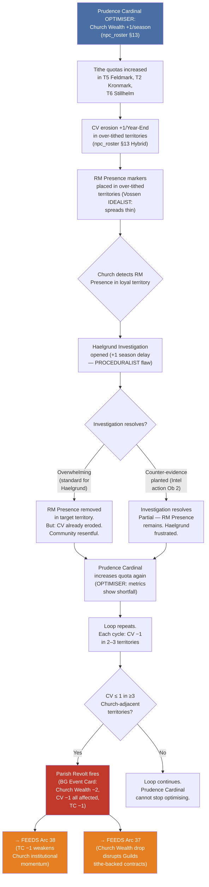
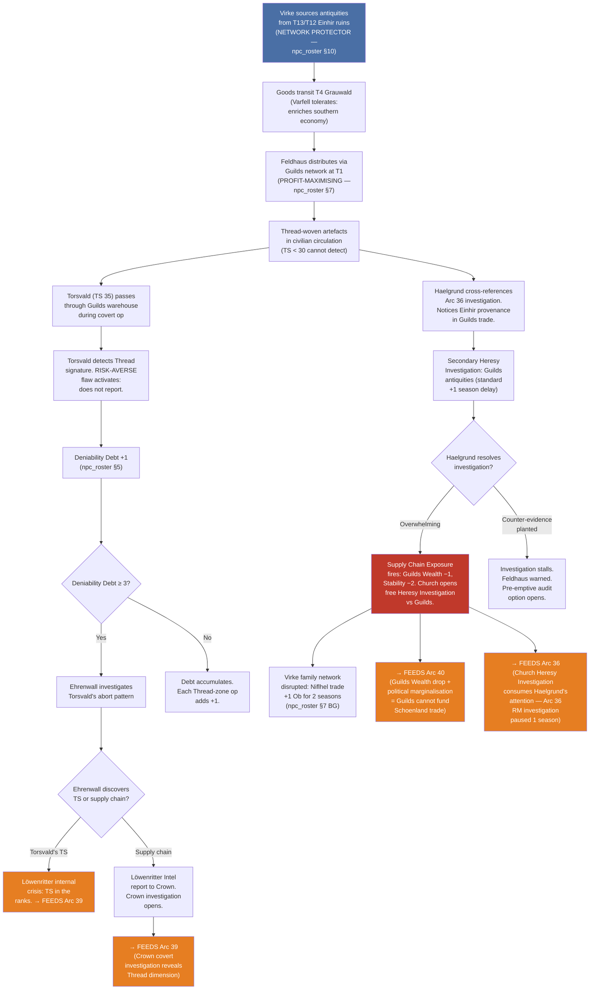
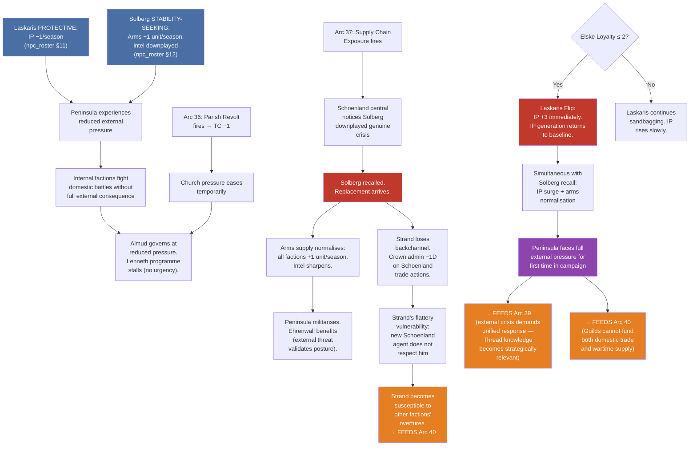
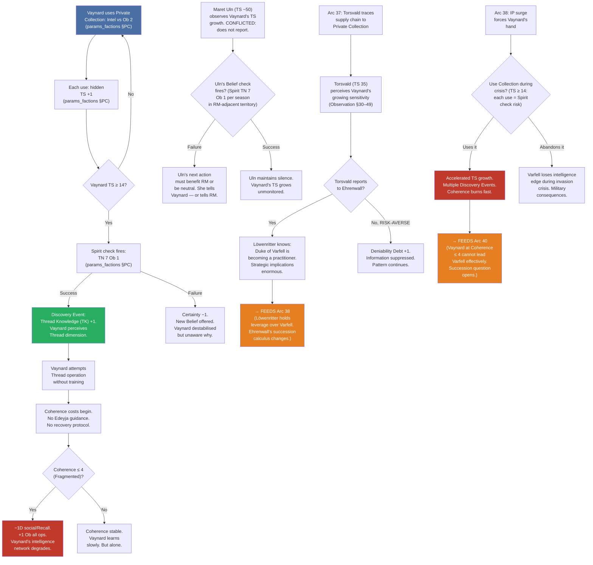
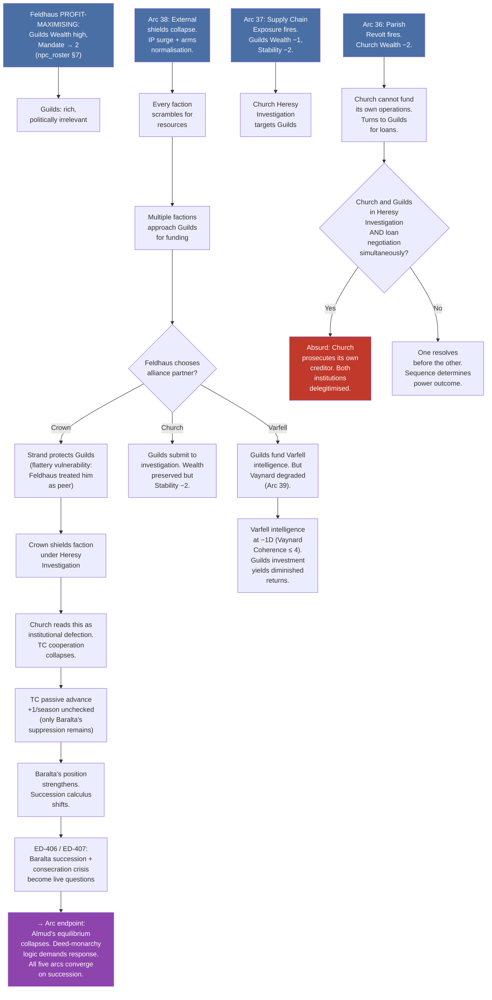

# Emergent Interdependent Arcs — Batch 36–40
## Status: DESIGN | Generated: 2026-04-11
## Scope: Five arcs with mandatory cross-dependencies — no arc resolves independently

---

## FETCH LOG
canonical_sources.yaml: ✓ fetched (156 lines)
references/params_factions.md: ✓ fetched (565 lines)
references/params_core.md: ✓ fetched (161 lines)
references/params_threadwork.md: ✓ fetched (637 lines)
references/params_combat.md: ✓ fetched (285 lines)
references/params_mass_combat.md: ✓ fetched (535 lines)
references/params_contest.md: ✓ fetched (252 lines)
references/glossary.md: ✓ fetched (234 lines)
designs/systems/clock_registry.md: ✓ fetched (80 lines)
designs/npcs/npc_roster.md: ✓ fetched (450 lines)
designs/npcs/ruler_diamond_foil_analysis.md: ✓ fetched (124 lines)
designs/npcs/ed_403_406_407_resolutions.md: ✓ fetched (52 lines)
designs/setting/geography_design.md: ✓ fetched (138 lines)
designs/setting/calamity_radiation.md: ✓ fetched (158 lines)
canon/00_philosophical_foundations.md: ✓ fetched (1348 lines)
gm_ref/arcs_01_04_nongreedy.md: ✓ fetched (314 lines)
gm_ref/arcs_05_09_batch02.md: ✓ fetched (267 lines)
gm_ref/arcs_10_18_consolidated.md: ✓ fetched (557 lines)
designs/gm_ref_cp14/arcs/arcs_09_11_elske_baralta.md: ✓ fetched (211 lines)
designs/gm_ref_cp14/arcs/arcs_12_15_faction_transitions.md: ✓ fetched (207 lines)
designs/gm_ref_cp14/arcs/arcs_16_19_faction_domain_echoes.md: ✓ fetched (194 lines)
designs/gm_ref_cp14/arcs/arcs_20_23_branching.md: ✓ fetched (294 lines)
designs/gm_ref_cp14/arcs/arcs_24_27_branching.md: ✓ fetched (293 lines)
designs/gm_ref_cp14/arcs/arcs_28_30_coherence_zero.md: ✓ fetched (229 lines)
designs/gm_ref_cp14/arcs/arcs_31_35_hybrid_systems.md: ✓ fetched (412 lines)

---

## Design Note: Interdependence Structure

These five arcs share mechanical outputs. Each arc's resolution state modifies the available branches of at least two other arcs. The cross-arc interaction table at the end maps every dependency. No arc can be run in isolation — the Game Master (GM) must track all five simultaneously, because the emergent behaviour is the simultaneous pressure, not any individual chain.

The interdependence arises from three shared mechanical substrates: the Rendering Stability (RS) track, the Theocracy Counter (TC), and the Guilds-Niflhel supply chain. Every arc touches at least two of these. The arcs are numbered 36–40 to continue the existing sequence.

---

## Arc 36: "The Tithe That Fed the Enemy"

**Primary mechanics:** Church Wealth recovery +1/season (Prudence Cardinal OPTIMISER — npc_roster §13), Conviction (CV) erosion in over-tithed territories (+1/Year-End — npc_roster §13 BG interface), Restoration Movement (RM) Presence marker placement (params_factions §RM), TC passive advance +1/season (params_factions §TC Passive Advance PP-402)

**Primary Non-Player Characters (NPCs):** Prudence Cardinal [Name Pending], Maret Vossen, Sæmund Haelgrund

---

### Narrative

The Church's charitable hospitals are the best on the peninsula. The roads the Church maintains are passable in winter when Crown roads are not. The schools attached to the Cathedrals teach literacy to children whose parents cannot read. The Prudence Cardinal is responsible for all of this, and he funds it by squeezing Parish leaders until they bleed.

In Feldmark (T5), the Parish leader has missed his tithe quota for two consecutive seasons. The Prudence Cardinal's audit finds the shortfall and doubles the assessment. Feldmark's agricultural communities — the peninsula's breadbasket — begin to grumble. They have always given to the Church. Their grandparents gave to the Church. But their grandparents were not asked to fund three new hospitals in Kronmark (T2) while their own harvest roads go unrepaired. The resentment is specific, economic, and justified.

Players do not see this arc begin. They see an RM Presence marker appear in Feldmark for the first time. They see Vossen's network spreading into territory that was previously solid Church ground. If they investigate, they find communities that still consider themselves faithful but have stopped trusting the institution that claims to serve them. The gap between faith and trust is where the Restoration Movement lives.

What the players cannot see — because no single faction can see it — is the feedback loop. The Prudence Cardinal's extraction funds the Church's charitable infrastructure, which is what makes the Church worth following. Without the extraction, the charities collapse. With the extraction, the communities defect. The Church is eating its own base to feed its own mission. The loop has no equilibrium. It resolves either when the Prudence Cardinal is removed (charities collapse — Church Mandate drops) or when the Prudence Cardinal succeeds completely (RM Presence markers fill every over-tithed territory — CV erodes past the point of recovery). The loop cannot be solved from within the Church because the Prudence Cardinal is not wrong about the finances.

Haelgrund enters when the Church notices RM Presence markers in formerly loyal territories. His investigation follows standard procedure: identify the heretical influence, build the case, prosecute. But the heretical influence is not doctrinal. These communities are not rejecting Church theology. They are rejecting Church economics. Haelgrund's proceduralist approach has no category for this. His investigation takes the standard +1 season (PROCEDURALIST flaw — npc_roster §4). During that season, two more territories tip.

---

### Mechanical Causal Chain

**Why this arc is emergent:** No player decided to undermine the Church from within. The Prudence Cardinal is executing his mandate correctly. Vossen is following her IDEALIST flaw (spreading thin into any territory that shows openness). Haelgrund is following his PROCEDURALIST protocol. The feedback loop arises because three NPCs, each acting optimally within their own behavioural constraints, produce a system-level outcome none of them intended. The Church's best financial manager is its worst cultural strategist, and no one in the institution can perceive the contradiction because the financial metrics are all positive.

**Arc shape:** 4–6 seasons. Slow build (seasons 1–2: tithe increases, no visible effect). Acceleration (seasons 3–4: CV erosion becomes visible, RM markers appear). Crisis (seasons 5–6: Parish Revolt fires or players intervene). Resolution branches feed Arcs 37 and 38.

---

## Arc 37: "The Heresy in the Warehouse"

**Primary mechanics:** Guilds Wealth recovery +1/season (Feldhaus PROFIT-MAXIMISING — npc_roster §7), Niflhel trade actions (Virke NETWORK PROTECTOR — npc_roster §10), Thread Sensitivity (TS) detection threshold (params_threadwork §Observation/Detection: TS 30+ senses operation), Supply Chain Exposure (BG Event Card — npc_roster §7 BG interface), Church Heresy Investigation

**Primary NPCs:** Annika Feldhaus, Dalla Virke, Sæmund Haelgrund, Sigrid Torsvald

---

### Narrative

Feldhaus does not know that fifteen percent of the Guilds' luxury goods revenue comes from Thread-woven artefacts. Virke does not know the antiquities she sources from Einhir ruin sites are Thread-touched. Neither of them is lying. Neither of them is corrupt. They are both competent professionals operating a supply chain whose foundational product category cannot be perceived by anyone with Thread Sensitivity (TS) below 30.

The chain runs through three territories. Virke's sources in T13 Oastad and T12 Sigurdshelm extract antiquities from Einhir ruin sites — objects condemned as heretical by the Church, which is what makes them valuable as contraband. The goods transit through T4 Grauwald (Varfell-controlled — Vaynard tolerates the traffic because it enriches the south) and enter the Guilds' legitimate distribution network at T1 Valorsplatz. From there, Feldhaus's artisan consortium sells them across the peninsula as high-end curiosities. The buyers display them in homes, workshops, and — occasionally — in Church-adjacent institutions that do not realise what they have purchased.

The arc begins when Torsvald — a Löwenritter Riskbreaker with TS 35, assigned to catalogue artefacts in Lenneth's archive — passes through a Guilds warehouse in Valorsplatz during an unrelated covert operation. Her Thread Sensitivity (TS) registers the signature. She does not report it immediately because her RISK-AVERSE flaw activates: reporting Thread-touched goods in a civilian warehouse means admitting she can perceive them, which means admitting her TS to her own chain of command, which means Löwenritter considers her compromised. She notes the location and moves on.

But Torsvald's aborted report generates Deniability Debt (+1 — npc_roster §5). Ehrenwall's tracking system registers the unexplained operational hesitation. If the pattern continues — if Torsvald's aborts accumulate — Ehrenwall will investigate. And Ehrenwall's investigation will uncover either Torsvald's TS (Löwenritter crisis) or the supply chain (Guilds/Church crisis) or both.

Meanwhile, Haelgrund — whose investigation into RM Presence markers in Feldmark (Arc 36) has been running for a season — cross-references his evidence. His proceduralist approach involves checking ALL anomalous activity in adjacent territories. The Guilds' antiquities trade appears in his files. He has no concept of Thread-touched goods, but he notices that the goods' provenance traces to Einhir ruin sites — which is heretical provenance by Church doctrine regardless of the Thread dimension. He begins a secondary investigation.

Two investigations are now converging on the same supply chain from different directions. Neither investigator knows the other is looking. Neither knows the full picture. Haelgrund sees heretical provenance. Torsvald sees Thread signatures. Between them, they hold the complete case. Apart, each has a fragment.

---

### Mechanical Causal Chain

**Why this arc is emergent:** The supply chain exists because Virke built it on personal relationships (NETWORK PROTECTOR) and Feldhaus monetised it (PROFIT-MAXIMISING). Neither created it to smuggle Thread-touched goods — neither can perceive the Thread dimension. Torsvald's detection is accidental (a Riskbreaker with unintended TS passing through). Haelgrund's investigation is a side-effect of Arc 36. The convergence of two independent investigations on the same target — one seeing heresy, one seeing Thread — requires four NPC behavioural flaws running simultaneously in adjacent territories. No player designed this. The system did.

**Arc shape:** 3–5 seasons. Slow fuse (seasons 1–2: supply chain operates undetected, Torsvald's Debt accumulates). Convergence (seasons 3–4: Haelgrund's secondary investigation + Ehrenwall's audit overlap). Detonation (season 4–5: Supply Chain Exposure fires, or players intervene to suppress or redirect one investigation). Resolution branches feed Arcs 36, 39, and 40.

---

## Arc 38: "The Sandcastle Alliance"

**Primary mechanics:** Invasion Pressure (IP) generation rate −1/season (Laskaris PROTECTIVE — npc_roster §11), Schoenland arms supply −1 unit/season (Solberg STABILITY-SEEKING — npc_roster §12), TC passive advance +1/season (params_factions §TC PP-402), IP starting value 5 (clock_registry), Laskaris Flip at Elske Loyalty ≤ 2 (npc_roster §11 BG Event Card), Solberg recall risk

**Primary NPCs:** Doux Alexios Laskaris, Rikard Solberg, Gerik Strand, Lenneth Almqvist

---

### Narrative

Two men who have never met are independently making the same decision for entirely different reasons. Laskaris, the Altonian provincial governor married to Princess Elske, is sandbagging imperial directives because he has developed genuine regard for his assigned political asset. Solberg, Schoenland's trade factor in Valorsplatz, is understating Valorian instability in his reports because he wants to go home and instability keeps him posted.

The result is invisible to everyone on the peninsula: Valoria is being shielded from external pressure by two foreign agents whose personal motivations happen to align with Valorian interests. IP rises one point slower per season than it should. Schoenland arms flows are conservative. The peninsula's internal factions fight their domestic battles without the full weight of external consequence.

Players experience this as a stable geopolitical environment. They have time for the Church-Crown rivalry, the Restoration question, the Varfell intelligence game. What they do not know is that this stability is resting on two men's personal decisions, and both men's positions are structurally fragile.

Laskaris flips if Elske Loyalty drops to 2 or below — at which point IP surges +3 immediately. Solberg is recalled if Schoenland central reassesses his reports — at which point arms supply normalises and Schoenland becomes a more aggressive actor. Both triggers are outside Valorian control. Laskaris's flip depends on Crown's treatment of Elske. Solberg's recall depends on Schoenland's internal review cycle.

The arc's interdependence with the other four arcs creates the crisis: Arc 36's Parish Revolt reduces TC by 1, which temporarily eases Church institutional pressure, which makes Almud's governance slightly easier, which means Lenneth has less urgency to push her Einhir programme, which means the programme stalls, which means the Crown does nothing to address the external perception that Valoria is domestically paralysed. Solberg reports this paralysis as stability. But if Arc 37's Supply Chain Exposure fires simultaneously — revealing heretical goods in the Guilds' network — Schoenland central notices that Solberg has been downplaying genuine institutional crisis, not reporting stability. His recall is triggered by events he did not anticipate because they originate in a supply chain he has no reason to monitor.

Strand is the bridge. As Lord Steward, he manages Crown trade relations with Schoenland — including Solberg's channel. Strand's OVERPERFORMER flaw means he handles the Schoenland portfolio personally. His flattery vulnerability (−1 Ob to social actions acknowledging his competence — npc_roster §9) means Solberg has been cultivating him for years, treating Strand as a peer rather than an appointee. Strand gives Solberg better access than he should. If Solberg is recalled, Strand loses his most reliable diplomatic backchannel — and the replacement will not flatter him.

---

### Mechanical Causal Chain

**Why this arc is emergent:** Two foreign agents, operating in different countries with no communication, are independently reducing external pressure on Valoria for personal reasons (attachment and homesickness). Their combined effect is a strategic shield that no Valorian faction built. The shield collapses when unrelated domestic events (Arc 36 and Arc 37) produce consequences visible to the agents' superiors. The peninsula's internal chaos — which the agents were suppressing — is what destroys the suppression. The system punishes itself for the stability it accidentally created.

**Arc shape:** Background constant (seasons 1–4: shield operates invisibly). Trigger convergence (seasons 4–6: domestic crises produce external consequences). Collapse (seasons 6–7: both shields fail within 1–2 seasons of each other). The players only understand what they had when they lose it.

---

## Arc 39: "The Practitioner They Didn't Know They Had"

**Primary mechanics:** Vaynard hidden Thread Sensitivity (TS) growth via Private Collection (+1/use — params_factions §Private Collection PP-168), Vaynard Spirit check at TS 14+ (TN 7 Ob 1 — params_factions §Private Collection), Discovery Event, Coherence starting at 10 (params_threadwork §Coherence), Observation/Detection thresholds (params_threadwork §Observation: TS 10–29 = vague unease), Torsvald TS 35 (npc_roster §5), Maret Uln TS ~50 (npc_roster §2)

**Primary NPCs:** Vaynard, Maret Uln, Sigrid Torsvald, Edeyja

---

### Narrative

Vaynard has been using the Private Collection for years. Each use adds +1 to his hidden Thread Sensitivity. He does not know this is happening. The artefacts he handles — relics from Einhir ruin sites, acquired through Varfell intelligence operations — are not inert. They are Thread-touched objects whose proximity induces gradual sensitisation in anyone who handles them regularly. Vaynard chose to build his revolution on intelligence and knowledge. The knowledge is changing him in ways his intelligence cannot detect.

At TS 10, he begins to feel vague unease near Thread-active sites. He attributes this to the political weight of what those sites represent — the Einhir heritage his people lost. The attribution is reasonable and wrong. At TS 12, the unease sharpens. He finds himself drawn to specific artefacts in the Collection. He reorganises them by instinct rather than catalogue. The organisation makes more sense than it should. At TS 14, the Spirit check fires.

Maret Uln knows. She has TS ~50. She has watched Vaynard handle the Collection for years. She has seen the signs — the way his attention lingers on objects that have stronger Thread signatures, the way he avoids the ones that feel wrong. She has not told him because telling him would mean admitting that her own TS — her ability to perceive what is happening to him — makes her a practitioner in an organisation that exploits Thread knowledge as intelligence tradecraft. Telling Vaynard would force both of them to confront what they are.

Her CONFLICTED flaw (npc_roster §2) is the mechanism of silence. She hesitates when the truth would serve Vaynard but compromise her own position. She rationalises the hesitation as intelligence tradecraft: better to observe and report than to intervene and lose the observational position. But the rationalisation is failing. Each season that Vaynard's TS grows, the ethical cost of silence increases. She can see his Coherence trajectory (Coherence starts at 10 — params_threadwork §Coherence). If Vaynard begins Thread operations without understanding what Coherence is, without training, without Edeyja's guidance — he will burn through Coherence in 3–4 operational seasons and reach Rendering Crisis (Coherence 0 — params_threadwork §Coherence states).

The arc intersects with Arc 37 when Torsvald's investigation of the Guilds supply chain leads her to the provenance trail: Einhir ruin sites → Varfell transit (T4 Grauwald) → distribution. If Torsvald traces the transit route, she reaches the Private Collection. Her TS 35 can perceive Vaynard's growing sensitivity (Observation threshold: TS 30–49 senses operation, general direction — params_threadwork §Observation). A Riskbreaker with unintended TS, investigating a supply chain for Löwenritter, accidentally discovers that the Duke of Varfell is becoming a practitioner.

The arc intersects with Arc 38 when external pressure forces Vaynard's hand. If Laskaris flips and IP surges, Vaynard faces a choice: use the Collection for the intelligence advantage it provides (Discovery Event risk at TS 14+) or abandon the Collection and lose Varfell's intelligence edge during the most dangerous moment in a generation. The revolutionary who built his programme on knowledge must decide whether to use knowledge that is changing what he is.

---

### Mechanical Causal Chain

**Why this arc is emergent:** Vaynard designed his intelligence programme. He did not design his own transformation. The Private Collection is a strategic tool that has a biological side-effect its user cannot perceive until the side-effect changes his perception. Maret Uln's silence (CONFLICTED flaw) allows the process to continue unmonitored. Torsvald's accidental involvement (Arc 37 intersection) creates a three-faction awareness problem: Varfell's own agent knows, Löwenritter's covert agent knows, and the duke himself does not know what he is becoming. The emergent condition is a revolutionary leader whose revolution is about to be overtaken by the epistemological transformation that makes his revolution urgent — and the transformation is destroying his ability to lead.

**Arc shape:** Long fuse (seasons 1–4: TS grows silently, +1/use). Threshold (season 4–6: TS 14 hit, Spirit check fires, Discovery Event). Cascade (seasons 6–8: Coherence burn if Vaynard operates without training, intersecting with IP crisis from Arc 38). The arc's resolution determines whether Vaynard reaches Edeyja — the only person who can teach him what he is becoming — or whether he burns out alone.

---

## Arc 40: "The Weight That Broke the Balance"

**Primary mechanics:** Guilds Wealth trend (Feldhaus PROFIT-MAXIMISING — npc_roster §7), Guilds Mandate trend toward 2 (npc_roster §7: PROFIT-MAXIMISING consequence), Strand flattery vulnerability (−1 Ob — npc_roster §9), Crown administrative brittleness (Strand removal = +1 Ob for 2 seasons — npc_roster §9), Failed Domain Action Stability cost (−1 Stability on Failure — params_factions §PP-403), Seasonal cap ±2 per faction stat per season (params_factions §Stats)

**Primary NPCs:** Annika Feldhaus, Gerik Strand, Baralta, Vaynard (degraded), Peder Almstedt

---

### Narrative

The Guilds are rich and irrelevant. Feldhaus has optimised for Wealth so effectively that Guilds Mandate has trended toward 2 — the threshold at which a faction cannot meaningfully contest any political decision. The Guilds can fund anyone but influence no one. Their economic leverage requires Guild Favour ≥ 5 in a target territory to activate (params_factions §Guilds Economic Leverage), and their Mandate is too low to build Guild Favour through political action. They are trapped in the luxury of powerlessness.

The trap has been invisible because external pressure was suppressed (Arc 38: Laskaris and Solberg shielding the peninsula). When that shield collapses — when IP surges and Schoenland arms flows normalise — every faction scrambles for resources. The Guilds have resources. Every faction comes to Feldhaus. She cannot say no because saying no would mean the Guilds' wealth serves no strategic purpose. She cannot say yes to everyone because that would collapse Guilds Stability (each alliance of convenience is a directional commitment that the guild base — artisans who want to sell goods, not fund wars — resists).

Strand is the fulcrum. His OVERPERFORMER flaw means Crown's administrative capacity depends on him personally. His flattery vulnerability means he is the easiest Crown figure for outside factions to influence. When the Supply Chain Exposure fires (Arc 37) and the Church opens a Heresy Investigation against the Guilds, Strand's reaction determines whether Crown protects the Guilds (Crown needs their Wealth) or abandons them (Crown needs Church cooperation on TC suppression). Strand's decision is not ideological. It is personal. Whoever acknowledges his competence gets his loyalty. The Church has never acknowledged his competence. Feldhaus has — she has been treating him as a peer for years because the Guilds' trade network depends on Crown administrative cooperation. Strand will protect the Guilds because Feldhaus makes him feel like he belongs.

But Strand's protection of the Guilds costs Crown its Church relationship. TC suppression depends on Crown–Church cooperation (or Baralta's Hafenmark-based suppression). If Crown shields a faction under Heresy Investigation, the Church reads this as institutional defection. TC passive advance continues (+1/season — params_factions §TC PP-402). Baralta's Theocracy Counter (TC) suppression (−1/season while her Mandate ≥ 4 — params_factions §Hafenmark Sovereign Authority Doctrine) becomes the only remaining TC brake. Baralta's political position strengthens because the Crown's administrative champion made a personal decision that weakened Crown's institutional position.

If Vaynard's Coherence is degraded (Arc 39: Coherence ≤ 4, Fragmented), Varfell intelligence operations suffer −1D social/Recall. Varfell's ability to play the spoiler — to manipulate factional balances through intelligence — degrades precisely when the external crisis (Arc 38) makes spoiler operations most valuable. The faction that was positioned to exploit chaos cannot exploit chaos because its leader is losing his ability to process information coherently.

The weight is cumulative. Guilds' political irrelevance (Mandate 2) + Crown administrative brittleness (Strand dependency) + Varfell intelligence degradation (Vaynard Coherence loss) + Church self-sabotage (Arc 36: tithe loop) + external pressure restoration (Arc 38: shield collapse). Five independent pressures converge on the same season. No faction created the convergence. Each faction created one element. The peninsula's political equilibrium — which Almud has maintained through governance pragmatism — breaks because the equilibrium was never structural. It was the accidental product of foreign agents' personal decisions, a cardinal's financial efficiency, a supply chain's invisible Thread dimension, and a duke's transformation he cannot perceive.

---

### Mechanical Causal Chain

**Why this arc is emergent:** The political collapse is not caused by any faction's aggression. It is caused by the simultaneous failure of five independent stabilising mechanisms: the Prudence Cardinal's tithe efficiency (Arc 36), the supply chain's invisibility (Arc 37), the foreign agents' personal shields (Arc 38), Vaynard's unmonitored transformation (Arc 39), and the Guilds' political irrelevance (this arc). Each mechanism was functioning as intended by its operator. None was designed to interact with the others. The collapse is the emergent product of five rational actors producing five individually stable systems whose combined failure mode was invisible because no single perspective spans all five systems simultaneously.

**Arc shape:** Convergence event (seasons 6–8 of the campaign, when Arcs 36–39 begin firing their crisis nodes). Duration: 2–3 seasons of cascading institutional failure. Resolution: the deed-monarchy's legitimation logic forces a response — Almud must act, abdicate, or be replaced. The response determines whether the peninsula enters succession politics (Baralta), revolutionary transformation (Vaynard, if Coherence holds), institutional reform (Lenneth), or external crisis management (Brandt, if Ehrenwall falls during the convergence).

---

## Cross-Arc Interaction Table

| Output Event | Source Arc | Receiving Arc(s) | Mechanical Effect |
|---|---|---|---|
| Parish Revolt fires (Church Wealth −2, TC −1) | 36 | 38, 40 | TC −1 eases Church pressure temporarily (38). Church seeks Guilds loans (40). |
| CV erosion in over-tithed territories | 36 | 37 | RM Presence markers in new territories create investigation targets for Haelgrund, who is already investigating supply chain (37). |
| Supply Chain Exposure (Guilds Wealth −1, Stability −2) | 37 | 36, 38, 40 | Haelgrund diverted to Guilds investigation — RM investigation paused (36). Schoenland notices Solberg downplayed crisis (38). Guilds political crisis (40). |
| Torsvald discovers Vaynard's TS | 37 → 39 | 38, 40 | Löwenritter holds leverage over Varfell (38). Varfell succession question opens (40). |
| Laskaris Flip (IP +3) | 38 | 39, 40 | Vaynard forced to use/abandon Collection under crisis pressure (39). All factions scramble for resources (40). |
| Solberg recalled | 38 | 40 | Arms normalise. Strand loses backchannel, becomes susceptible to other factions' overtures (40). |
| Vaynard Discovery Event | 39 | 40 | Vaynard's Coherence trajectory determines Varfell's operational capacity during convergence (40). |
| Vaynard Coherence ≤ 4 | 39 | 40 | Varfell intelligence −1D social/Recall. Guilds investment in Varfell yields diminished returns (40). |
| Maret Uln breaks silence | 39 | 36, 37 | If Uln tells RM about Vaynard's TS: RM gains strategic intelligence about Varfell. Vossen can leverage this (36). If Uln tells Vaynard: Vaynard seeks practitioner training — may contact Torsvald or Edeyja, creating new investigation vectors (37). |
| Guilds seek alliance partner | 40 | 36, 38 | Crown protection of Guilds collapses TC cooperation (36). Guilds funding flows reshape factional military balance (38). |
| Almud's equilibrium collapses | 40 | All | Succession politics activate. ED-406 (Ehrenwall succession assessment) and ED-407 (consecration crisis) become live. All arc branches recontextualise. |

---

## Convergence Timeline (Approximate)

| Season | Arc 36 | Arc 37 | Arc 38 | Arc 39 | Arc 40 |
|---|---|---|---|---|---|
| 1–2 | Tithe increases. No visible effect. | Supply chain operates. Torsvald's first warehouse pass. | Shields operating. IP slow. | Vaynard uses Collection. TS ~10–11. | Guilds Wealth climbing. Mandate declining. |
| 3–4 | CV erosion visible. RM markers appear in T5, T6. | Haelgrund's secondary investigation opens. Deniability Debt accumulates. | Shields intact. Lenneth programme stalls. | TS 12–13. Uln observes. Silent. | Guilds Mandate at 2. Rich, irrelevant. |
| 5–6 | Haelgrund investigation resolves or players intervene. Parish Revolt risk rises. | Convergent investigations approach Supply Chain. Exposure risk peaks. | Domestic crises visible to Schoenland. Solberg recall risk. | TS 14. Spirit check fires. Discovery Event. | Quiet. Equilibrium holds. |
| 7–8 | Parish Revolt fires (or is prevented). | Supply Chain Exposure fires (or is suppressed). | Shields collapse. IP +3. Arms normalise. | Vaynard operates without training. Coherence burns. | Convergence. All pressures hit simultaneously. |
| 9+ | Resolution: Prudence Cardinal removed or reformed. | Resolution: Guilds restructure or collapse politically. | Resolution: Peninsula faces full external pressure. | Resolution: Vaynard reaches Edeyja or burns out. | Resolution: Succession politics or institutional reform. |

---

[EDITORIAL: ED-408 — Prudence Cardinal requires a name. All arc NPC interactions use [Name Pending]. User decision required before finalisation.]

[EDITORIAL: ED-409 — Torsvald's Deniability Debt threshold for Ehrenwall investigation needs a specific number. Proposed: 3 (three aborts triggers review). User confirmation requested.]

[EDITORIAL: ED-410 — Vaynard's Private Collection use frequency needs canonical establishment. Current assumption: 1 use/season (conservative). If Vaynard uses it more aggressively, TS growth accelerates and Arc 39 fires 2–3 seasons earlier. User decision on Vaynard's operational tempo requested.]

[EDITORIAL: ED-411 — Solberg recall trigger needs mechanical specification. Current arc assumes Schoenland central reviews reports when domestic crisis becomes externally visible. Proposed: Solberg is recalled when any two of: Supply Chain Exposure, Parish Revolt, IP ≥ 15 occur in the same season. User confirmation requested.]

[EDITORIAL: ED-412 — The convergence timeline assumes Arcs 36–39 seed in seasons 1–2 and converge in seasons 7–8. If the campaign starts later in the arc lifecycle, the convergence compresses. GM guidance on pacing flexibility needed.]
