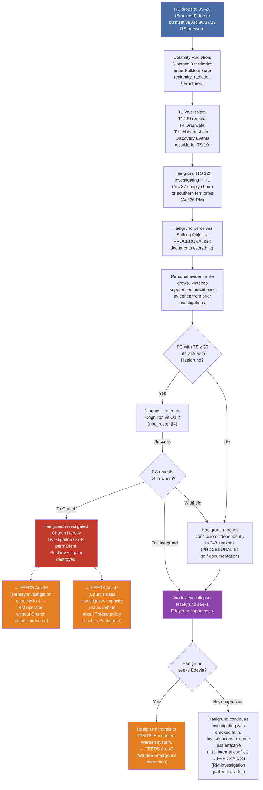
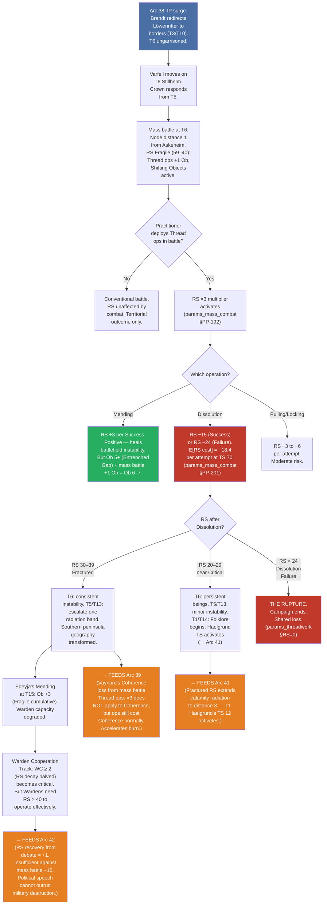
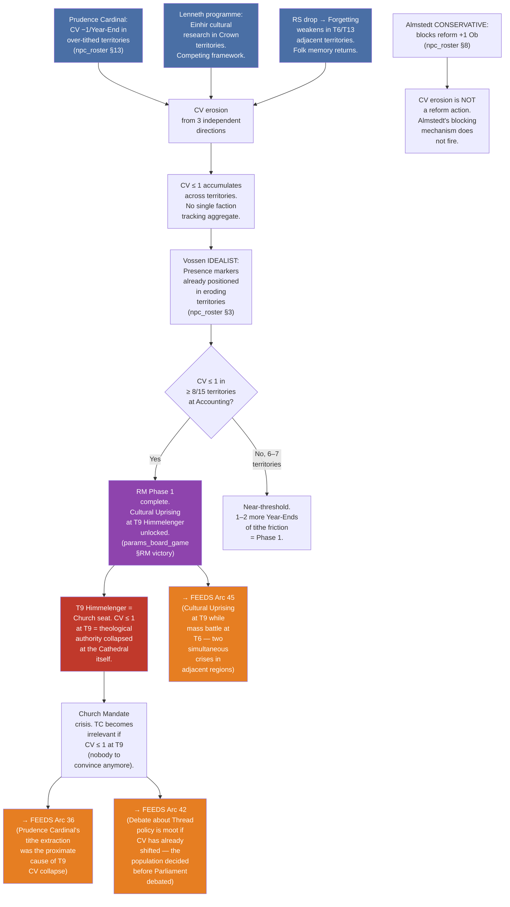

# Emergent Interdependent Arcs — Batch 41–45
## Status: DESIGN | Generated: 2026-04-11
## Scope: Five arcs exploiting under-explored cross-system triggers. Interdependent with Arcs 36–40.

---

## FETCH LOG
canonical_sources.yaml: ✓ fetched (156 lines)
references/params_factions.md: ✓ fetched (565 lines)
references/params_core.md: ✓ fetched (161 lines)
references/params_threadwork.md: ✓ fetched (637 lines)
references/params_combat.md: ✓ fetched (285 lines)
references/params_mass_combat.md: ✓ fetched (535 lines)
references/params_contest.md: ✓ fetched (252 lines)
references/params_board_game.md: ✓ fetched (1616 lines)
references/glossary.md: ✓ fetched (234 lines)
designs/systems/clock_registry.md: ✓ fetched (80 lines)
designs/npcs/npc_roster.md: ✓ fetched (450 lines)
designs/setting/calamity_radiation.md: ✓ fetched (158 lines)
designs/setting/geography_design.md: ✓ fetched (138 lines)
designs/board_game/victory_architecture_v1.md: ✓ fetched (473 lines)
gm_ref/arcs_36_40_interdependent.md: ✓ fetched (414 lines)
gm_ref/arcs_01_04_nongreedy.md: ✓ fetched (314 lines)
gm_ref/arcs_05_09_batch02.md: ✓ fetched (267 lines)
gm_ref/arcs_10_18_consolidated.md: ✓ fetched (557 lines)
designs/gm_ref_cp14/arcs/ (all files): ✓ fetched

---

## Design Note: Cross-Batch Interdependence

Arcs 41–45 presuppose Arcs 36–40 are seeded. Where an Arc 36–40 output feeds into this batch, it is marked `← Arc NN`. These arcs also generate new triggers that feed back into the 36–40 batch, creating bidirectional dependencies. The system is not sequential — it is a web.

---

## Arc 41: "The Inquisitor's Unravelling"

**Primary mechanics:** Haelgrund hidden Thread Sensitivity (TS) 12 (npc_roster §4), Calamity Radiation at node distance 3 during Rendering Stability (RS) 39–20 Fractured band (calamity_radiation §Fractured: distance 3 = Folklore, Discovery Events possible), Heresy Investigation procedure (+1 season delay — PROCEDURALIST flaw), Diagnosis by practitioner (Cognition vs Obstacle (Ob) 2 — npc_roster §4 arc trigger), Haelgrund Defection BG Event Card (npc_roster §4 BG interface)

**Primary Non-Player Characters (NPCs):** Sæmund Haelgrund, Maret Vossen, Edeyja

**← Arc 36:** Haelgrund's primary investigation (RM Presence in over-tithed territories) places him in southern territories where calamity effects are stronger.
**← Arc 37:** Haelgrund's secondary investigation (Guilds supply chain) moves him through T1 Valorsplatz (node distance 3).

---

### Narrative

Haelgrund has spent his career investigating heresy. He is thorough, procedurally correct, and incorruptible. He has also spent his career suppressing the one piece of evidence his investigations consistently produce: that Thread Sensitivity is not demonic possession. It is a natural capacity. He has buried this knowledge beneath professional duty for years.

The buried knowledge is about to become personal.

RS is dropping. Arc 36's feedback loop — tithe extraction eroding Church cultural authority — has been running for seasons. Arc 37's supply chain has been moving Thread-touched artefacts through civilian territories. Arc 39's Vaynard TS growth has added Thread-active operations to the southern peninsula. Each of these produces RS pressure. At RS 39–20 (Fractured), the calamity radiation matrix activates new effects at node distance 3: T1 Valorsplatz, T14 Ehrenfeld, T4 Grauwald, T11 Halvardshelm. Discovery Events become possible for witnesses with TS 10+.

Haelgrund has TS 12.

He does not know this. He attributes his investigative intuition — the way he can sense when an artefact is wrong, the way he feels unease in certain rooms — to professional experience. But at Fractured RS, the substrate is thin enough that his TS 12 produces more than unease. He begins to perceive Shifting Objects. He sees an object in a witness's home that is not quite where it was a moment ago. He watches a candle flame lean toward a wall that has no draught. These are not hallucinations. They are the rendered world failing to maintain consistency, and Haelgrund can see it because his Thread Sensitivity is 2 points above the perception threshold.

His PROCEDURALIST flaw is what makes this dangerous. A less methodical investigator would dismiss the observations. Haelgrund documents them. He cross-references them. He builds a file. The file grows. The file begins to resemble, with terrible precision, the evidence he has been suppressing for his entire career. The evidence he gathered from practitioners he investigated. The evidence he could not report because reporting it would destroy the Church's ontological foundation.

Now the evidence is his own. He is experiencing what the people he prosecuted experienced. And his proceduralist approach — document everything, cross-reference everything, build the airtight case — is building the case against himself.

The crisis fires when Haelgrund is investigating RM Presence in a southern territory (Arc 36 task) and a practitioner Player Character (PC) with TS ≥ 30 interacts with him. The PC can attempt Diagnosis (Cognition vs Ob 2 — npc_roster §4 arc trigger). Success reveals Haelgrund's TS to the PC. What the PC does with this information is the arc's central decision.

If the PC reveals Haelgrund's TS to the Church: the Church's best investigator is destroyed. Church Heresy Investigation capability drops permanently (+1 Ob — npc_roster §4 Defection card). Haelgrund is investigated by his own institution.

If the PC reveals Haelgrund's TS to Haelgrund himself: his worldview collapses. He becomes a potential defector — not to a faction, but to an understanding of reality that his institution denies. He may seek Edeyja (the only person who can explain what he is perceiving) or he may suppress the knowledge and continue investigating, now carrying the weight of a truth he can perceive but his institution cannot accommodate.

If the PC withholds the information: Haelgrund continues to accumulate evidence. His personal file grows. Eventually (2–3 seasons at Fractured RS), his own documentation becomes sufficient for him to reach the conclusion independently. The PROCEDURALIST builds the case against himself with the same methodical rigour he applies to everything else.

---

### Mechanical Causal Chain



**Why this arc is emergent:** Haelgrund's TS 12 is a dormant condition that activates only when RS drops low enough for calamity radiation to reach the territories where he works. The RS drop is caused by Arcs 36, 37, and 39 — none of which target Haelgrund. The calamity radiation system has no concept of who is standing in its affected territories. The PROCEDURALIST flaw — which normally makes Haelgrund the Church's best asset — becomes the mechanism of his unravelling: he cannot stop documenting what he perceives because documenting is what he does. Three independent systems (RS track, calamity radiation, NPC behavioural flaw) interact to transform the Church's strongest defender into a potential defector, without any player or NPC intending this outcome.

**Arc shape:** Latent until RS ≤ 39 (may never fire if RS is maintained). Once active: 2–4 seasons of accumulating perception. Crisis node: PC Diagnosis or self-discovery. Resolution: defection, suppression, or destruction. Feeds Arcs 36, 42, 43.

---

## Arc 42: "The Debate That Changed the World"

**Primary mechanics:** Social Contest system — Memory genre win → RS +1 if Thread-sensitive participant present (params_contest §Thread co-movement), Projection genre win → RS +1 if Thread-sensitive (params_contest §Thread co-movement), Composure = Charisma + 6 (params_contest §Composure), Recall bonus +2D for citing specific named verifiable claim (params_contest §Recall bonus), Decisive outcome with Memory genre → winning faction Mandate +1 (params_contest §Decisive outcomes), TC passive advance +1/season (params_factions §TC PP-402)

**Primary NPCs:** Baralta, Lenneth, Haelgrund (if defected — ← Arc 41), Almstedt

**← Arc 41:** Haelgrund's defection (or cracked faith) provides the most damaging possible witness in a debate about Thread policy.
**← Arc 36:** Parish Revolt's TC −1 creates temporary political space for reform debate.
**← Arc 40:** Baralta's strengthened position makes her the debate's most dangerous opponent.

---

### Narrative

Parliament debates Thread policy. This has happened before — minor procedural arguments about whether certain antiquities should be regulated, whether southern folklore should be acknowledged in the historical record, whether Varfell's cultural preservation claims deserve Crown attention. These debates have always resolved as procedural exercises. Almstedt's CONSERVATIVE flaw ensures they produce no structural change. The debates are rituals of institutional stability.

This debate is different because three things have converged that have never converged before.

First, Lenneth has evidence. Her programme — Crown patronage of Einhir cultural revival — has produced documented research. Pre-Altonian texts from her archive describe Thread perception as a publicly acknowledged capacity. These texts exist. They can be cited. In the contest system, citing specific named verifiable claims grants +2D Recall bonus (params_contest §Recall bonus). Lenneth's evidence is not philosophical argument. It is historical documentation with Memory-genre authority.

Second, Haelgrund may testify. If Arc 41 has fired — if Haelgrund's TS has been revealed or self-discovered — the Church's most credible investigator can testify that Thread Sensitivity is real, that it is not heresy, and that his own career of prosecution was built on a false ontological premise. In the contest system, Haelgrund testifying against the Church's position is a CROSS interaction (different genres — his testimony is Memory/Revealing; the Church's defence is Memory/Obscuring — producing a CLASH). Haelgrund's proceduralist credibility makes his testimony devastating: he is not a radical. He is not an idealist. He is the man who built the cases. If he says the cases were wrong, the cases were wrong.

Third, Thread-sensitive participants are present. Maret Uln (TS ~50) may attend as Varfell's intelligence representative. Vossen (TS 25) may attend as RM's advocate. Any PC practitioner may be present. The contest system's Thread co-movement rule fires: Memory genre win → RS +1 if Thread-sensitive participant present. Projection genre win → RS +1 if Thread-sensitive.

This means: a parliamentary debate about whether Thread Sensitivity is real produces a measurable recovery in the fabric of reality as a side-effect of the debate's outcome. The politicians do not intend this. The Thread-sensitive participants may not notice it. But the contest system's co-movement rule — designed to model the metaphysical consequences of argument — produces RS recovery from political speech.

Almstedt tries to block the debate. His CONSERVATIVE flaw opposes all structural change, and a debate about Thread policy is structurally explosive. Reform actions face +1 Ob when Almstedt is active (npc_roster §8 Hybrid interface). But the debate is not a reform action. It is a social contest. Almstedt can raise procedural objections (treated as a social contest exchange — his Cognition pool vs the proposer's), but he cannot prevent the debate from occurring if the proposer has Parliamentary standing.

Baralta opposes the debate's conclusion. Her sovereign supremacy doctrine requires theological monopoly — Einhir Thread heritage introduces a third source of authority incompatible with her framework (ruler_diamond_foil_analysis §Lenneth ↔ Baralta). She argues from categorical imperative: universalisable principles do not admit special knowledge claims. In contest terms, she argues Memory/Obscuring (burying inconvenient history — params_contest §Suppression) against Lenneth's Memory/Revealing (citing what happened openly — params_contest §Precedent). This is a CLASH. Compare margins.

---

### Mechanical Causal Chain

```mermaid
flowchart TD
    A["Lenneth proposes<br/>Parliamentary debate<br/>on Thread policy +<br/>Einhir cultural<br/>recognition"] --> B["Almstedt CONSERVATIVE:<br/>procedural objection<br/>(reform +1 Ob —<br/>npc_roster §8)"]
    B --> C{"Is this a reform<br/>action or a social<br/>contest?"}
    C -->|Social contest| D["Almstedt cannot<br/>block. Procedural<br/>objection = 1 exchange<br/>of debate, not veto."]
    C -->|Reform action| E["Reform +1 Ob.<br/>But proposer with<br/>Mandate ≥ 4 can<br/>override procedure."]
    D --> F["Debate proceeds.<br/>Memory genre<br/>primary (historical<br/>evidence)."]
    
    F --> G["Lenneth argues<br/>Memory/Revealing<br/>(Precedent).<br/>Archive evidence:<br/>+2D Recall bonus."]
    F --> H["Baralta argues<br/>Memory/Obscuring<br/>(Suppression).<br/>Categorical imperative<br/>framework."]
    G --> I["CLASH: same genre,<br/>opposite orientation.<br/>Margin vs resistance<br/>→ track movement."]
    H --> I
    
    J["Arc 41: Haelgrund<br/>testifies?"] --> K{"Haelgrund<br/>as witness?"}
    K -->|Yes (defected)| L["Haelgrund testimony:<br/>Memory/Revealing.<br/>PROCEDURALIST<br/>credibility = −1 Ob<br/>vs Church defence.<br/>Devastating."]
    K -->|No| M["Debate proceeds<br/>without Church's<br/>own evidence<br/>against itself."]
    L --> I
    
    I --> N{"Lenneth wins<br/>(Decisive)?"}
    N -->|Decisive + Memory| O["Winning faction<br/>Mandate +1 in<br/>domain of cited<br/>precedent<br/>(params_contest<br/>§Decisive outcomes)"]
    N -->|Baralta wins| P["Thread policy<br/>formally rejected.<br/>Crown programme<br/>blocked. TC +1<br/>(Church vindicated)."]
    N -->|No decisive| Q["Inconclusive.<br/>Both sides claim<br/>victory. No Mandate<br/>change. But RS +1<br/>if Thread-sensitives<br/>present."]
    
    O --> R["RS +1 (Thread<br/>co-movement:<br/>Memory win +<br/>Thread-sensitive<br/>present —<br/>params_contest<br/>§Thread co-movement)"]
    Q --> R
    R --> S["Political speech<br/>produced ontological<br/>recovery. No<br/>debater intended<br/>this."]
    
    S --> T["→ FEEDS Arc 43<br/>(RS recovery changes<br/>Warden Emergence<br/>calculus)"]
    O --> U["→ FEEDS Arc 40<br/>(Crown Mandate +1<br/>from debate victory<br/>rebalances Baralta's<br/>strengthened position)"]
    P --> V["→ FEEDS Arc 36<br/>(Church vindicated<br/>— Heresy Investigation<br/>authority restored —<br/>RM under increased<br/>pressure)"]

    style A fill:#4a6fa5,color:white
    style R fill:#27ae60,color:white
    style S fill:#8e44ad,color:white
    style T fill:#e67e22,color:white
    style U fill:#e67e22,color:white
    style V fill:#e67e22,color:white
```

**Why this arc is emergent:** The social contest system's Thread co-movement rule was designed to model the metaphysical weight of argument — that what people say about reality affects reality when Thread-sensitive minds are engaged. The rule was not designed to produce RS recovery from parliamentary debate. But when Lenneth's programme, Haelgrund's defection, and the presence of TS-active participants converge in a single social contest, the rule fires. Political speech about whether Thread Sensitivity is real produces a measurable restoration of the rendered world's coherence — because the debate forces participants to confront what the world actually is, and confrontation with truth (per Philosophical Foundations §1.3) has Thread-level consequences. The debaters who win the argument also heal the world. The debaters who lose the argument also heal the world. The co-movement fires on any outcome where Thread-sensitive participants are present. The world does not care who won.

**Arc shape:** Single event (1 season of political buildup, 1 scene of debate, immediate consequences). But the debate's conditions require Arcs 36, 40, and 41 to have advanced sufficiently. It cannot fire early. The debate is a convergence node, not a chain.

---

## Arc 43: "The Battle That Ate the South"

**Primary mechanics:** Mass Battle RS ×3 multiplier (params_mass_combat §PP-192: all RS costs and gains from Thread operations in mass battle ×3), Calamity Radiation at T6 Stillhelm (node distance 1 — calamity_radiation §Fractured: spontaneous Shifting Objects 1/season, Thread ops +1 Ob), Dissolution in mass battle (params_mass_combat §PP-201: E[RS per attempt] = −18.4 at TS 70), Gap persistence RS cost −4/season (params_threadwork §RS Track), Warden Emergence condition (params_board_game §Warden Emergence: any faction's Southernmost Expedition passes Forgetting Check)

**Primary NPCs:** Edeyja, Brandt, Ehrenwall, Vaynard

**← Arc 38:** IP surge forces military response. Brandt's EXTERNAL THREAT FIXATED redirects Löwenritter to border territories.
**← Arc 39:** Vaynard's TS growth means Varfell may deploy Thread ops in combat.
**← Arc 42:** Debate RS +1 may be insufficient against mass battle RS damage.

---

### Narrative

The battle happens at T6 Stillhelm because geography demands it. Stillhelm sits between the Crown heartland (T5 Feldmark, the breadbasket) and the Southernmost (T15 Askeheim, the wound). It is the last farmland territory before the peninsula narrows into the Calamity zone. Whoever holds Stillhelm controls the corridor between the populated north and the uninhabited south.

When IP surges (Arc 38: Laskaris flips, Solberg recalled), Brandt — now commanding Löwenritter after Ehrenwall's fall or redeployment — redirects military assets to the border passes (T3 Lowenskyst, T10 Spartfell). This leaves the southern interior ungarrisoned. The strategic vacuum creates an opportunity: any faction that seizes T6 controls access to the Southernmost, which controls access to the Wardens, which controls access to RS recovery — the single most valuable strategic asset in the game.

Varfell moves on T6. Vaynard's intelligence network identifies the vacuum. His forces are positioned in T12 Sigurdshelm and T13 Oastad — adjacent to T6's southern approaches. The move is strategically sound. But Vaynard has changed (Arc 39). His TS is growing. He may bring the Private Collection's Thread-active artefacts to the field. He may have a practitioner in his retinue — Maret Uln (TS ~50) is Varfell's most capable Thread operative.

The Crown cannot allow T6 to fall. Strand (if still active — Arc 40) mobilises the reserve from T5 Feldmark. Crown Military 4, diminished by Brandt's border redeployment, faces Varfell's southern force.

The battle is the first mass engagement of the campaign fought in a territory already affected by calamity radiation.

At RS 59–40 (Fragile), T6 Stillhelm — node distance 1 from Askeheim — experiences spontaneous Shifting Objects (1 per season, 1d10: fires on 1–2) and Thread operations face +1 Ob. This is the battlefield's baseline condition: the rendered world is already unstable here. Soldiers see objects that are not where they were. The air feels wrong. Non-practitioners with TS 10+ sense unease.

If a practitioner uses Thread operations in this battle, the RS ×3 multiplier activates. Every RS cost and gain is tripled. The math is brutal:

- Mending Success: normally RS +1 → in mass battle RS +3. The only RS-positive option.
- Pulling Failure: normally RS −2 → in mass battle RS −6.
- Locking Success: normally RS −1 → in mass battle RS −3.
- Dissolution Success: normally RS −5 → in mass battle RS −15.
- Dissolution Failure: normally RS −8 → in mass battle RS −24. At RS < 24, this triggers the Rupture.

A single Dissolution attempt by Maret Uln (Spirit + History + Thread Pool Score, approximately 9D at TS ~50) against Ob 5 (Territorial scale) has an expected RS cost of −18.4 per attempt. If RS is at 45 when the battle begins, one successful Dissolution drops RS to 30 (Fractured). One failed Dissolution drops RS to 21 (Fractured, near Critical). Two failed Dissolutions from RS 45 would produce the Rupture.

The calamity radiation consequences cascade. At RS 39–20, T6 shifts from minor instability to consistent instability: spontaneous Shifting Objects every season (automatic), spontaneous Gaps possible (1d10: fires on 1–2). Adjacent territories (T5 Feldmark, T13 Oastad, T15 Askeheim) escalate one radiation band. The battle's Thread operations do not just affect the battlefield — they reshape the calamity geography of the entire southern peninsula.

Edeyja, at T15, feels every RS shift. If the battle drops RS below 40, the Wardens' ability to maintain Mending operations at Askeheim is compromised (+1 Ob from Fragile effects at node distance 0, stacking with existing +2 Ob at Fragile = total +3 Ob). The people who are holding the world together lose capability because a political battle over a strategic corridor produced Thread consequences no general planned for.

---

### Mechanical Causal Chain



**Why this arc is emergent:** The battle occurs because of a strategic vacuum created by Brandt's border fixation (Arc 38). Thread operations are deployed because Varfell has Thread-capable assets (Arc 39). The mass battle RS ×3 multiplier — a design rule intended to model the catastrophic scale of battlefield Thread work — interacts with the calamity radiation matrix — a geographic rule modelling how RS effects propagate spatially — to produce a cascade neither system was designed to model in combination. A political-military contest for a farmland territory produces ontological consequences that reshape the southern peninsula's reality coherence. The generals who chose the battlefield did not know they were choosing the world's fate.

**Arc shape:** Single event (mass battle, 1 session). But setup requires Arcs 38 and 39 to fire. Consequences propagate immediately: RS shift at Accounting, calamity radiation recalculation, Warden capacity adjustment. The battle is a fulcrum — everything before it is positioning, everything after it is consequence.

---

## Arc 44: "The Invisible Majority"

**Primary mechanics:** Conviction (CV) track 0–5 per territory (victory_architecture §2), Restoration Movement (RM) Cultural Revolution victory condition (Phase 1: CV ≤ 1 in ≥ 8/15 territories — params_board_game §RM victory), Almstedt CONSERVATIVE blocking (+1 Ob to reform actions — npc_roster §8), Prudence Cardinal tithe extraction → CV erosion +1/Year-End in over-tithed territories (npc_roster §13 Hybrid), TC passive advance +1/season (params_factions §TC PP-402), Vossen IDEALIST spreading thin (npc_roster §3)

**Primary NPCs:** Maret Vossen, Peder Almstedt, Prudence Cardinal [Name Pending], Baralta

**← Arc 36:** Tithe friction accelerates CV erosion in Church-adjacent territories.
**← Arc 40:** Guilds' political irrelevance removes economic counter-pressure against cultural drift.
**← Arc 42:** If debate produces Crown Mandate +1, CV erosion in Crown territories slows (Crown cultural authority strengthened).

---

### Narrative

Nobody is watching the Conviction track. The factions are fighting over Mandate, Wealth, Military, TC, IP — the visible metrics of institutional power. CV is a per-territory cultural indicator. It measures how deeply a community identifies with the Church's theological framework. It trends downward. Nobody is making it trend downward. It is trending downward because three independent systems are eroding it from three different directions simultaneously, and no single faction's strategic lens spans all three.

Direction one: the Prudence Cardinal's tithe extraction. Over-tithed territories experience CV −1 at Year-End (npc_roster §13 Hybrid). The Cardinal is not trying to erode CV. He is trying to fund the Church's charitable mission. But the extraction produces community resentment, and resentment undermines cultural identification with the institution doing the extracting.

Direction two: Lenneth's cultural programme. When Crown invests in Einhir cultural revival — even partially, even tentatively — it introduces a competing cultural framework in Crown territories. Communities that learn about pre-Altonian heritage through Crown-sponsored research begin to question whether the Church's theological monopoly is historically justified. CV erodes not through RM activism but through Crown-funded scholarship. Lenneth does not intend to erode CV. She intends to strengthen the Crown's legitimation. But the effect on CV is the same.

Direction three: the Forgetting's failure. As RS drops (Arcs 37, 39, 43), the Forgetting — the mechanism that suppresses awareness of Thread heritage — weakens in southern territories. Communities near T6 and T13 begin to remember fragments: folk songs with words they cannot quite place, craft techniques that work in ways they cannot explain, a sense that the world was once different. This is not RM activism. It is the substrate's failure to maintain suppression. CV erodes because the thing CV measures — conviction in the Church's ontological framework — is being undermined by reality itself reasserting.

Vossen benefits from all three directions without causing any of them. Her IDEALIST flaw — spreading RM Presence markers thin across many territories — means she has a marker in every territory where CV is eroding. Her network is positioned to harvest the cultural shift. But she did not create the shift. She is surfing a wave produced by a Cardinal's efficiency, a Queen's ambition, and a collapsing metaphysical membrane.

Almstedt cannot see this. His CONSERVATIVE flaw monitors Parliamentary procedure for reform attempts. CV erosion does not operate through Parliament. It operates through community sentiment — tithing resentment, cultural curiosity, ontological doubt. None of these require Parliamentary action. None trigger Almstedt's blocking mechanism. The mechanism that is building RM's victory condition is invisible to the man whose job is to prevent structural change, because the change is not structural. It is cultural. And cultural change does not need permission.

The crisis fires when a player (or the GM, tracking RM NPC AI) counts CV across all territories and discovers that CV ≤ 1 in 6 or 7 of 15 territories. RM is 1–2 territories from Phase 1 completion — the threshold that unlocks Cultural Uprising at T9 Himmelenger. No faction planned this. No faction prevented this. The majority shifted while the institutions were watching each other.

---

### Mechanical Causal Chain



**Why this arc is emergent:** Three independent CV erosion sources (tithe extraction, cultural research, Forgetting failure) each produce small, incremental effects. No source is sufficient alone. Their combined effect produces a tipping point that no faction is tracking because no faction's strategic framework spans economics (Prudence Cardinal), culture (Lenneth), and metaphysics (RS/Forgetting) simultaneously. Almstedt — whose institutional role is to prevent exactly this kind of structural transformation — is mechanically blind to it because CV erosion does not trigger his CONSERVATIVE blocking condition. The Restoration Movement's most important victory condition advances without the Restoration Movement doing anything. Vossen's IDEALIST spreading — her flaw — becomes her advantage because she has markers in territories where CV fell by accident.

**Arc shape:** Glacial (8–12 seasons of cumulative CV erosion across three sources). The arc produces no crisis until the threshold is reached. Then it produces the most consequential crisis in the game: the population has already decided before the institutions react. Feeds Arcs 36, 42, 45.

---

## Arc 45: "The Tutoring Demand That Started a War"

**Primary mechanics:** Altonian Tutoring Demand at Invasion Pressure (IP) ≥ 40 (params_board_game §Tutoring Demand), Torben Loyalty −2 on compliance (params_board_game §Torben Loyalty Track), IP +5 on resistance (implied — refusal escalates), Strand flattery vulnerability −1 Ob (npc_roster §9), Crown covert actions use Influence +1 Ob (params_factions §PP-236), Löwenritter Coup Counter increments (params_factions §Löwenritter), Laskaris PROTECTIVE (npc_roster §11)

**Primary NPCs:** Doux Alexios Laskaris, Gerik Strand, Halvar Brandt, Lenneth, Almud

**← Arc 38:** Laskaris Flip + Solberg recall = IP surge toward 40 threshold.
**← Arc 40:** Strand turned = intelligence leak on Crown's Tutoring Demand response.
**← Arc 43:** Mass battle at T6 = military assets committed south, unavailable for border crisis.

---

### Narrative

IP hits 40. The Altonian Tutoring Demand fires. The imperial court formally requests that Crown Prince Torben be sent to Altonia for "education" — a polite word for hostage-taking dressed as cultural exchange. The demand is diplomatic in tone and imperial in substance. Compliance means Torben leaves Valoria; Torben Loyalty −2. Resistance means refusing an empire that has already deployed scouts in the northern passes; IP escalates.

Almud has managed this pressure vector for years by keeping IP below the threshold. The shield of Laskaris's sandbagging (Arc 38) kept IP low. The shield is gone. Laskaris has flipped — his protective instinct reversed when Elske was threatened, and now the Altonian provincial administration is transmitting imperial directives without delay. IP has been climbing at baseline rate since the flip, and the domestic crises (Arcs 36, 37, 40) have prevented Crown from taking Suppress actions against IP.

The timing is catastrophic. Crown Military is depleted. Brandt redirected Löwenritter to the border passes (T3/T10) after Arc 38's IP surge, but Löwenritter is not Crown's army — it is Löwenritter's army. Crown's own military assets were committed to the T6 Stillhelm battle (Arc 43). Win or lose at T6, Crown's southern force is exhausted. The Tutoring Demand arrives when Crown has no military capacity to back up a refusal.

Strand handles the diplomatic response. His OVERPERFORMER flaw means he has taken personal charge of the Schoenland/Altonian portfolio. His flattery vulnerability (−1 Ob to social actions acknowledging his competence) means the Altonian diplomatic channel has been cultivating him — Laskaris, before flipping, treated Strand as a peer. After Laskaris flips, the replacement Altonian representative does not flatter Strand. Strand's emotional anchor to the diplomatic channel is broken.

If Strand has been turned (Arc 40: Supply Chain Exposure → Guilds seek Crown protection → Strand protects Guilds → non-Crown faction exploits his flattery vulnerability to compromise him), then whatever faction turned him knows Crown's planned response to the Tutoring Demand before Crown announces it. This intelligence advantage is decisive:

- If Crown plans to comply: the turning faction can publicise this before the announcement, framing Almud as weak. Torben Loyalty −2 (compliance penalty) plus Crown Mandate −1 (public perception of capitulation). Ehrenwall's Coup Counter increments (Crown loses Torben without military response — params_factions §Coup Counter conditions).

- If Crown plans to resist: the turning faction can inform Altonia that Crown will resist, allowing the empire to prepare. IP +5 (resistance escalation) arrives with Altonian military readiness. Crown's bluff — resisting without the military capacity to back it — is exposed.

Lenneth's position is the arc's moral centre. She married into the Almqvist dynasty. Her children are the dynasty's future. Torben is her son. The Tutoring Demand is not an abstract diplomatic event for her — it is a demand for her child. Her programme — Einhir cultural revival, Crown legitimation through heritage — becomes personally and strategically entangled with the Tutoring Demand. If she has been pressing Almud to act on the Einhir question (Arcs 36–40), and the Tutoring Demand arrives simultaneously, she faces a choice: continue pressing for cultural reform (her long-term programme) or redirect all political capital to protecting her son (her immediate crisis). She cannot do both. Every Mandate point spent on diplomacy with Altonia is a Mandate point not spent on the Einhir programme.

---

### Mechanical Causal Chain

```mermaid
flowchart TD
    A["Arc 38: Laskaris Flip.<br/>IP generation returns<br/>to baseline."] --> B["IP reaches 40<br/>over 2–3 seasons<br/>post-flip"]
    B --> C["Tutoring Demand<br/>fires<br/>(params_board_game<br/>§IP ≥ 40 Event)"]
    
    C --> D{"Crown response?"}
    D -->|Comply| E["Torben sent to<br/>Altonia. Torben<br/>Loyalty −2<br/>(params_board_game<br/>§Torben Loyalty)"]
    D -->|Resist| F["IP +5.<br/>Altonian military<br/>preparation<br/>begins."]
    D -->|Delay via<br/>Laskaris<br/>(impossible —<br/>he flipped)| G["No delay available.<br/>Pre-flip Laskaris<br/>could delay 1 season.<br/>Post-flip: demand<br/>is firm."]
    
    E --> H["Coup Counter +1<br/>(Crown loses Torben<br/>without military<br/>response — params_factions<br/>§Coup Counter)"]
    E --> I["Crown Mandate −1<br/>(public perception<br/>of capitulation)"]
    
    F --> J["Crown Military<br/>depleted (Arc 43:<br/>T6 battle). Cannot<br/>back up refusal."]
    J --> K["Altonia calls bluff.<br/>IP → 50+ rapidly.<br/>Vanguard deployment<br/>at IP 75."]
    
    L["Arc 40: Strand<br/>turned?"] --> M{"Intelligence<br/>leaked?"}
    M -->|Yes| N["Turning faction<br/>knows Crown's<br/>response. Pre-empts<br/>announcement."]
    M -->|No| O["Crown controls<br/>information.<br/>Standard decision."]
    N --> P["If comply: framed<br/>as weak before<br/>announcement.<br/>If resist: Altonia<br/>pre-warned."]
    
    Q["Lenneth's choice:<br/>programme vs son"] --> R{"Lenneth<br/>prioritises?"}
    R -->|Son| S["Einhir programme<br/>suspended. Mandate<br/>redirected to<br/>diplomacy. Arc 42<br/>debate delayed<br/>or weakened."]
    R -->|Programme| T["Lenneth maintains<br/>reform pressure<br/>during crisis.<br/>Perceived as cold<br/>by court. Influence<br/>among allies −1."]
    
    H --> U["→ FEEDS Arc 43<br/>(Coup Counter<br/>approaching threshold<br/>while Löwenritter<br/>is on the border.<br/>Coup fires with<br/>army already<br/>deployed.)"]
    K --> V["→ FEEDS Arc 43<br/>(Altonian Vanguard<br/>at IP 75 + mass<br/>battle at T6 =<br/>two-front war)"]
    S --> W["→ FEEDS Arc 42<br/>(Debate delayed.<br/>RS recovery from<br/>political speech<br/>does not arrive<br/>in time for<br/>mass battle<br/>RS consequences.)"]

    style A fill:#4a6fa5,color:white
    style C fill:#c0392b,color:white
    style E fill:#c0392b,color:white
    style K fill:#c0392b,color:white
    style N fill:#8e44ad,color:white
    style U fill:#e67e22,color:white
    style V fill:#e67e22,color:white
    style W fill:#e67e22,color:white
```

**Why this arc is emergent:** The Tutoring Demand is a threshold event (IP ≥ 40) that was suppressed for the entire campaign by Laskaris's personal attachment to Elske (Arc 38). When Laskaris flips — because Elske was threatened by Crown's domestic failures, which were caused by Arcs 36/37/40 — the threshold approaches. The demand arrives simultaneously with military depletion from the T6 battle (Arc 43), intelligence compromise from Strand's turning (Arc 40), and Lenneth's personal/political entanglement. Each contributing factor was generated by a different arc. No faction orchestrated the convergence. The Tutoring Demand — a simple diplomatic event with a simple mechanical trigger — becomes a multi-system crisis because five independent arcs have stripped away every mechanism Crown had for managing it.

**Arc shape:** Trigger event (IP crosses 40 — deterministic once Laskaris flips and domestic crises prevent IP suppression). Decision window: 1 season (comply, resist, or negotiate). Consequences propagate immediately into Arcs 42, 43, and Coup Counter mechanics. The arc is short but its inputs are deep — it requires Arcs 38, 40, and 43 to have fired.

---

## Cross-Arc Interaction Table (Arcs 36–45 Complete)

### New Dependencies (Arcs 41–45)

| Output Event | Source Arc | Receiving Arc(s) | Mechanical Effect |
|---|---|---|---|
| Haelgrund defection/destruction | 41 | 36, 42 | Church Heresy Investigation +1 Ob permanent (36: RM unopposed). Haelgrund testimony available for debate (42). |
| RS drop to Fractured (≤ 39) | 36, 37, 39, 43 | 41 | Calamity radiation distance 3 activates. Haelgrund TS 12 Discovery Events possible. |
| Debate RS +1 (Thread co-movement) | 42 | 43 | Insufficient against mass battle RS damage. Political speech cannot outrun military destruction. |
| Debate Crown Mandate +1 | 42 | 40, 44 | Rebalances Baralta's strengthened position (40). Slows CV erosion in Crown territories (44). |
| Mass battle RS ×3 damage | 43 | 41, 42, 44 | Extends calamity radiation (41). Makes debate RS recovery insufficient (42). Accelerates Forgetting failure in southern territories (44). |
| CV ≤ 1 in ≥ 8 territories | 44 | 36, 42, 45 | Church theological authority collapsed — TC irrelevant (36). Debate moot — population already decided (42). Cultural Uprising at T9 during military crisis (45). |
| Tutoring Demand fires | 45 | 42, 43 | Lenneth forced to choose programme vs son — debate delayed (42). Crown Military further depleted — two-front war risk (43). |
| Strand intelligence leak | 40 → 45 | 43 | Turning faction pre-empts Crown's Tutoring Demand response. Military planning compromised. |
| Brandt's border deployment | 38 → 43 | 45 | T6 vacuum + border garrison = Crown stretched across three fronts (south, passes, diplomacy). |

### Bidirectional Loops (New)

| Loop | Path | Stabilising or Destabilising? |
|---|---|---|
| RS ↔ Calamity Radiation ↔ Haelgrund TS | RS drop → radiation activates Haelgrund → Haelgrund defection removes Church investigator → RM expands → CV erodes → more cultural instability → (indirect RS pressure via Thread op frequency) | **Destabilising.** Each step weakens institutional capacity to arrest RS decline. |
| Debate ↔ RS ↔ Mass Battle | Debate produces RS +1 → mass battle produces RS −15 to −24 → net RS drops → debate becomes more urgent → but debate requires political capital diverted by Tutoring Demand | **Destabilising with ironic structure.** The mechanism that heals the world (political speech) cannot keep pace with the mechanism that destroys it (military Thread operations). |
| CV erosion ↔ Tithe extraction ↔ Church Wealth | Tithe increases → CV erodes → Church loses cultural authority → Church needs more tithes to compensate (charities maintain legitimacy) → more extraction → more erosion | **Self-reinforcing destabilising.** No equilibrium point. Resolves only when Prudence Cardinal is removed or Church Wealth collapses. Already documented in Arc 36; now feeds into Arc 44's aggregate threshold. |
| Tutoring Demand ↔ Coup Counter ↔ Military deployment | Comply → Coup Counter +1. Resist → IP escalation → need military → military on border (Brandt) or in south (Arc 43) → Crown cannot resist OR comply without consequence | **Structural trap.** Both choices increment crisis. No option reduces pressure. Crown is in zugzwang. |

---

## Trigger Inventory (All Arcs 36–45)

Unique mechanical triggers identified across this batch. Each trigger is a specific game-state condition that activates an arc node.

| # | Trigger | Condition | Source | Arcs Affected |
|---|---|---|---|---|
| T-01 | Prudence Cardinal tithe increase | Prudence Cardinal OPTIMISER active + Church Wealth below threshold | npc_roster §13 | 36, 44 |
| T-02 | CV erosion Year-End | Over-tithed territory at Year-End Accounting | npc_roster §13 Hybrid | 36, 44 |
| T-03 | RM Presence marker placement | Vossen IDEALIST + territory CV ≤ 2 | npc_roster §3 | 36, 44 |
| T-04 | Haelgrund investigation opening | Church detects RM Presence OR anomalous trade provenance | npc_roster §4 | 36, 37 |
| T-05 | Torsvald Thread detection | TS 35 operative passes through Thread-touched location | npc_roster §5 | 37, 39 |
| T-06 | Deniability Debt increment | Torsvald aborts operation in Thread-active zone | npc_roster §5 | 37 |
| T-07 | Supply Chain Exposure | Intel Overwhelming targeting Guilds + Niflhel syndicate presence in territory | npc_roster §7 BG | 37, 40 |
| T-08 | Laskaris Flip | Elske Loyalty ≤ 2 at Accounting OR Elske Return attempt fails | npc_roster §11 BG | 38, 45 |
| T-09 | Solberg recall | Schoenland central reassessment (proposed: 2+ domestic crises visible externally) | ED-411 | 38, 40 |
| T-10 | Vaynard TS threshold | Private Collection use pushes hidden TS ≥ 14 | params_factions §PC | 39 |
| T-11 | Vaynard Spirit check | TS ≥ 14 + Private Collection use → Spirit TN 7 Ob 1 | params_factions §PC | 39 |
| T-12 | Vaynard Discovery Event | Spirit check Success on T-11 | params_factions §PC | 39, 43 |
| T-13 | Vaynard Coherence ≤ 4 | Unguided Thread operations without training | params_threadwork §Coherence | 39, 40 |
| T-14 | Strand flattery exploitation | Social action targeting Strand with competence acknowledgment: −1 Ob | npc_roster §9 | 40, 45 |
| T-15 | Strand Turned | Non-Crown Intel Overwhelming targeting Crown Court | npc_roster §9 BG | 40, 45 |
| T-16 | Parish Revolt | ≥ 3 over-tithed territories + Church Mandate ≤ 3 in any | npc_roster §13 BG | 36, 40 |
| T-17 | RS drops to Fractured (≤ 39) | Cumulative RS pressure from Arcs 37, 39, 43 | params_threadwork §RS Track | 41, 43, 44 |
| T-18 | Calamity Radiation distance 3 activation | RS ≤ 39 (Fractured) | calamity_radiation §Fractured | 41 |
| T-19 | Haelgrund TS Discovery Event | TS 12 + Fractured RS + presence in distance ≤ 3 territory | calamity_radiation + npc_roster §4 | 41, 42 |
| T-20 | PC Diagnosis of Haelgrund | PC TS ≥ 30 + interaction during investigation → Cognition vs Ob 2 | npc_roster §4 | 41 |
| T-21 | Haelgrund defection | TS revealed + worldview collapse | npc_roster §4 Defection card | 41, 42 |
| T-22 | Parliamentary debate on Thread policy | Lenneth proposes + Parliamentary standing + evidence | Arc 42 setup | 42 |
| T-23 | Debate Thread co-movement | Thread-sensitive present during Memory or Projection genre win → RS +1 | params_contest §Thread co-movement | 42 |
| T-24 | Mass battle at T6 Stillhelm | Varfell moves on ungarrisoned T6 + Crown responds | Arc 43 setup | 43 |
| T-25 | Mass battle RS ×3 activation | Any Thread operation during mass battle | params_mass_combat §PP-192 | 43 |
| T-26 | Dissolution in mass battle | Practitioner declares Dissolution at mass scale | params_mass_combat §PP-201 | 43 |
| T-27 | RS < 24 + Dissolution Failure | Mass battle Dissolution Failure when RS < 24 → Rupture | params_mass_combat §PP-204 | 43 |
| T-28 | CV ≤ 1 in ≥ 8/15 territories | Aggregate of T-02, Lenneth programme, Forgetting failure | victory_architecture §RM | 44 |
| T-29 | Cultural Uprising unlocked at T9 | Phase 1 complete (T-28) + RM holds T9 | params_board_game §RM victory | 44 |
| T-30 | Tutoring Demand fires | IP ≥ 40 | params_board_game §IP Events | 45 |
| T-31 | Torben Loyalty −2 (compliance) | Crown complies with Tutoring Demand | params_board_game §Torben Loyalty | 45 |
| T-32 | Coup Counter increment from Tutoring Demand compliance | Crown loses Torben without military response | params_factions §Coup Counter | 45 |
| T-33 | Lenneth programme/son choice | Tutoring Demand + active Einhir programme = competing Mandate expenditure | Arc 45 + Arc 42 | 45, 42 |
| T-34 | Two-front war | Mass battle T6 (Arc 43) + Altonian Vanguard IP 75 (Arc 45) simultaneously | Arcs 43/45 convergence | 43, 45 |
| T-35 | Warden Mending capacity degradation | RS ≤ 39 + Edeyja at T15 → cumulative +3 Ob on Mending | calamity_radiation + params_threadwork | 43 |

---

## Convergence Timeline (Full Batch, Approximate)

| Season | 36 | 37 | 38 | 39 | 40 | 41 | 42 | 43 | 44 | 45 |
|---|---|---|---|---|---|---|---|---|---|---|
| 1–2 | Tithes ↑ | Chain runs | Shields up | TS ~10 | Guilds M→3 | Dormant | Dormant | Dormant | CV drift begins | IP < 30 |
| 3–4 | CV erosion visible | Haelgrund opens 2nd investigation | Shields hold | TS 12–13 | Guilds M→2 | Dormant | Dormant | Dormant | CV ≤ 2 in 4 terr. | IP < 35 |
| 5–6 | Parish Revolt risk | Exposure risk peaks | Shields fail | TS 14, Discovery | Convergence begins | RS nears 39 | Lenneth builds case | Strategic vacuum forms | CV ≤ 1 in 5–6 terr. | IP ~38 |
| 7–8 | Revolt fires | Exposure fires | IP +3. Arms ↑ | Coherence burning | Institutions collapse | Haelgrund TS activates | Debate fires | Battle at T6 | CV ≤ 1 in 7 terr. | IP ≥ 40. Demand fires |
| 9–10 | Resolution | Resolution | Full pressure | Edeyja or burnout | Succession | Defection/suppression | RS +1 (insufficient) | RS aftermath | Phase 1 threshold | Comply/resist |
| 11+ | — | — | — | — | — | — | — | — | Cultural Uprising? | Two-front war? |

---

[EDITORIAL: ED-413 — Haelgrund's self-documentation timeline at Fractured RS needs a specific season count. Proposed: 2–3 seasons of accumulated observations before independent conclusion. User confirmation requested.]

[EDITORIAL: ED-414 — The debate Thread co-movement RS +1 applies per contest (not per exchange). Confirm this is correct per params_contest §Thread co-movement — the text says "Memory win → RS +1" without specifying frequency. If per-exchange, the debate produces RS +N where N = exchanges won by Thread-policy side, which could be significant (5-exchange Grand Debate = up to RS +5).]

[EDITORIAL: ED-415 — Mass battle at T6 assumes Varfell has military capacity to contest T6. Varfell Military 4, but forces split between T12/T13/T4. Varfell may need to commit Private Collection artefacts (+2D — params_factions §PC) to compensate for numerical disadvantage. This directly triggers T-10/T-11 (Vaynard TS threshold) during the battle. User confirmation of Varfell force composition requested.]

[EDITORIAL: ED-416 — Cultural Uprising at T9 Himmelenger requires RM to "hold" T9. RM has no Military stat (PP-460). How does RM hold a territory? Proposed: RM holds via Popular Will + CV ≤ 1 + Church unable to enforce administrative control (Church Stability ≤ 3 from Arc 36/40 cascades). Not military occupation — cultural displacement. User confirmation of "hold" mechanic for RM requested.]

[EDITORIAL: ED-417 — The two-front war trigger (T-34: mass battle T6 + Altonian Vanguard IP 75 simultaneously) may be mechanically impossible if the timeline compresses. If Arc 43 resolves before IP reaches 75, the two-front condition does not fire. Proposed: the trigger requires IP ≥ 60 (Vanguard preparation visible) + active military engagement at T6 simultaneously, not IP 75 (full Vanguard). User confirmation on IP threshold for two-front war trigger.]
