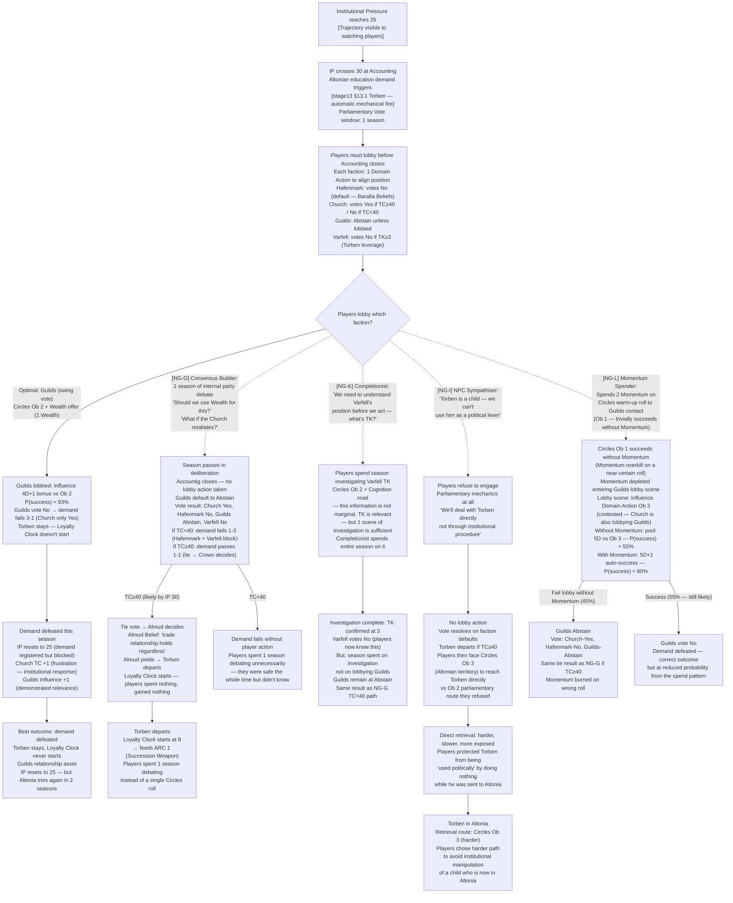
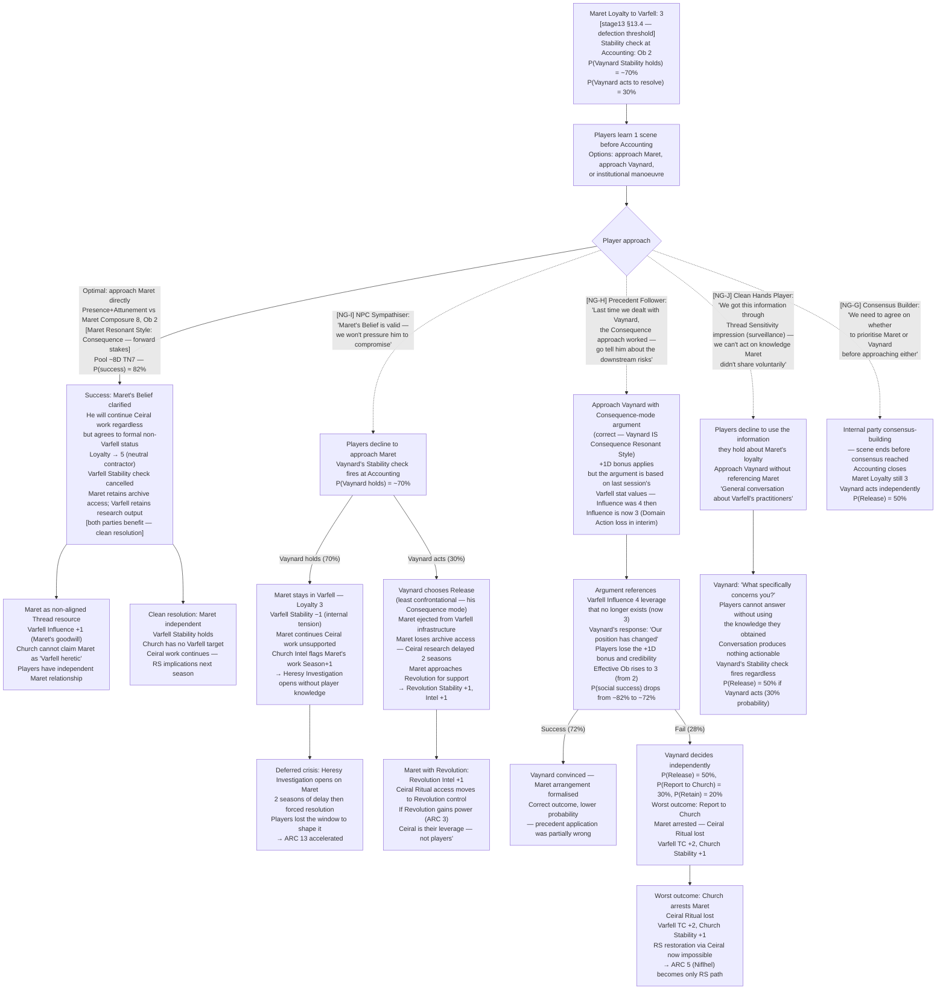
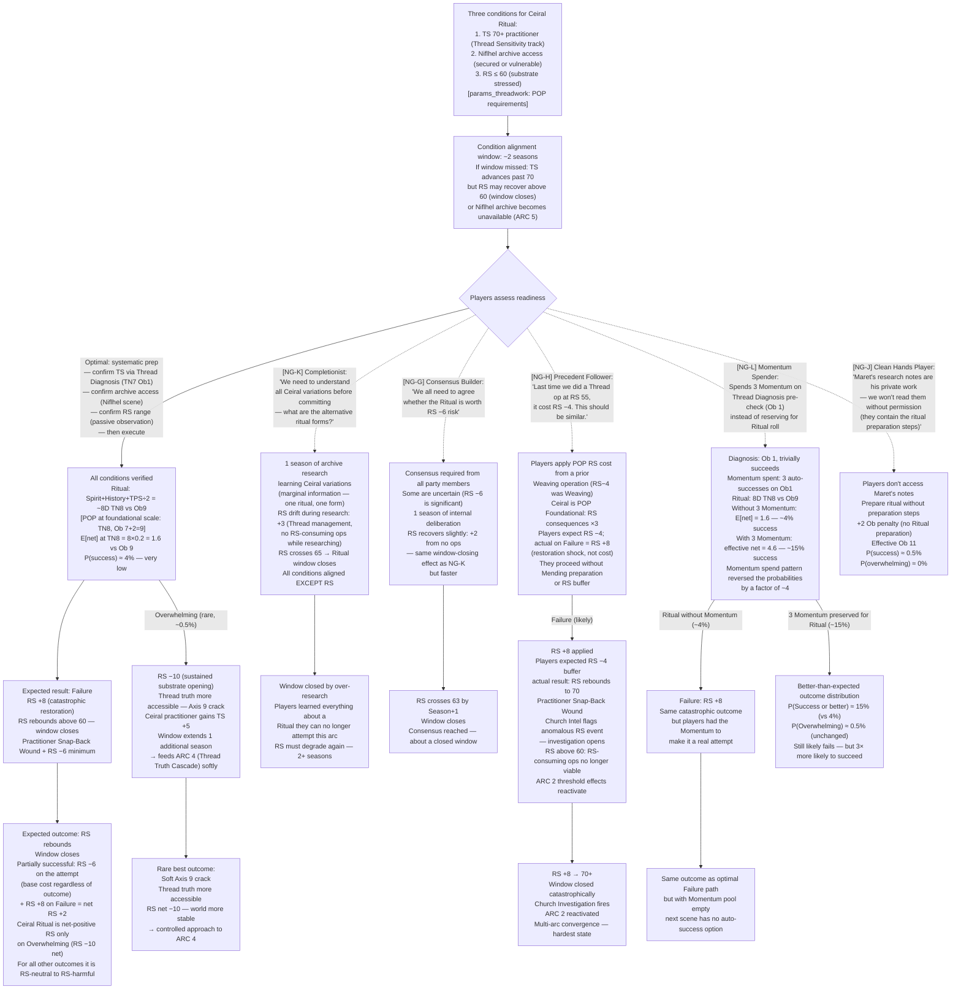
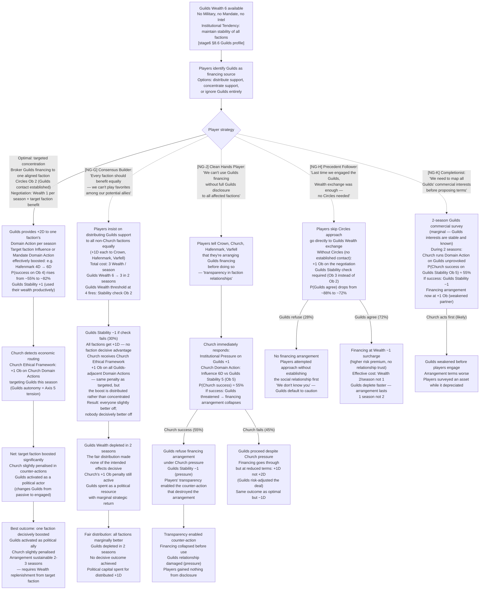
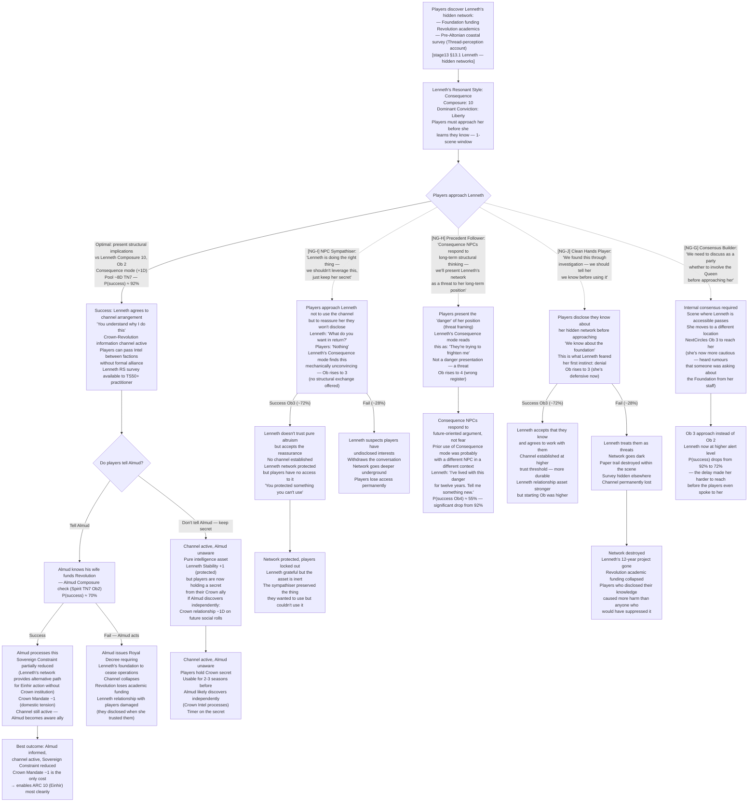

# Valoria — Emergent Narrative Arcs: New Non-Greedy Actor Archetypes
## SIM-ARC-03 | Generated: 2026-04-04 | Model: Sonnet 4.6
## Source: stage6_factions.md, stage13_npcs.md, params_core.md, params_threadwork.md, editorial_resolution_pass.md

---

## New Non-Greedy Actor Archetypes (NG-G through NG-L)

Distinct from both SIM-ARC-01 (irrational/compulsive) and SIM-ARC-02 (restraint/hesitation). This batch models **social-structural** non-optimality: players who read the room correctly but respond to the social dynamics of the *table* rather than the game world, and players who apply real-world institutional logic that doesn't map onto Valoria's mechanics.

| Code | Archetype | Behaviour |
|------|-----------|-----------|
| NG-G | **The Consensus Builder** | Before any major action, seeks full party agreement. Will not act without unanimous buy-in. Delays Domain Actions by 1 season while negotiating internally. Correct social instinct; wrong scale for the mechanic. |
| NG-H | **The Precedent Follower** | When facing a new mechanical situation, defaults to "what did we do last time?" rather than reading the current state. Applies prior-session rulings to different contexts. Ignores faction stat changes since the last time they engaged. |
| NG-I | **The NPC Sympathiser** | Once a player has an emotional connection to an NPC, will not take any action that harms that NPC's interests — even indirectly, even when the NPC's stated Beliefs would accept the cost. Projects player-table reluctance onto the NPC. |
| NG-J | **The Clean Hands Player** | Refuses any action that could be construed as manipulative, deceptive, or instrumentalising — including using knowledge the players gained via Intel actions. Will not deploy advantage gained through surveillance. |
| NG-K | **The Completionist** | Before acting on a problem, needs to understand all dimensions of it. Investigates each arc to exhaustion before responding. Never commits while information is still outstanding, even when the outstanding information is marginal. |
| NG-L | **The Momentum Spender** | Spends Momentum on the first roll of each scene regardless of stakes. Uses auto-successes on Circles, investigation, or social warm-up rolls rather than preserving them for the scene's critical Debate or Domain Action. |

Notation: optimal path = solid line; new non-greedy branch = dashed line with `[NG-X]` tag.

---

## ARC 11: The Parliament Clock

### Mechanical Seed
Institutional Pressure (IP) track reaches 30 → Altonian education demand fires automatically → Crown must respond → Parliament is the constitutional mechanism for Crown response → players can sponsor a Parliamentary Vote to delay, redirect, or block the demand → Parliamentary Vote mechanic (Domain Action: Influence, pool vs Ob) requires faction leadership commitment → the window for Parliamentary intervention is exactly 1 season.

### Narrative

The players will know the Altonian demand is coming before it arrives. Institutional Pressure at 25 is legible — a player watching faction stats sees the trajectory. What they may not know is that the Parliamentary response window is exactly one season: the demand arrives at IP 30 accounting, and Parliament meets at the end of that same season. If the players don't act before accounting closes, the demand is answered by default.

The Parliamentary Vote is not dramatic. It is procedural. A motion is filed, factions declare positions, the vote resolves. What makes it dramatic is the positioning before the vote — the season of lobbying, the favours spent, the faction alliances disclosed. Hafenmark will vote against the demand (Baralta's Beliefs; Crown authority). The Church will vote for it if TC is above 40 (Altonian ecclesiastical leverage). The Guilds will abstain unless someone pays them to care. Varfell will vote against it if their Thread investigation gives them reason to want Torben present in Valoria.

The players are not the vote. They are the people who shape what the vote means before it happens.

### Flowchart

### Footer

Emerges from IP threshold mechanics, Torben Loyalty Clock, and Parliamentary Vote procedure running in parallel. No player designed the 1-season window — it is the mechanical output of IP 30 threshold + same-season Parliament timing. Arc shape: 1 season crisis, 2 season consequence. The window closes whether or not players act.

**New archetype findings:**
- NG-G (Consensus Builder): Internal party consensus-building is the correct social behaviour in many contexts. Here it consumes the action window. The players had the information, the plan, and the resources — they spent the season deciding, not acting. The outcome depends on TC, which they couldn't control.
- NG-K (Completionist): Investigating Varfell's TK is not wrong — TK is relevant. The error is spending a full season on it when 1 scene suffices, and not simultaneously lobbying Guilds with the rest of the party. The investigation was worth doing; doing only the investigation was not.
- NG-I (NPC Sympathiser): Protecting Torben from being "used politically" by refusing to engage Parliament produces Torben going to Altonia through the harder-to-reverse path. The sympathiser's protective instinct made things worse for Torben.
- NG-L (Momentum Spender): Momentum on Ob 1 Circles is waste. The critical roll was the Ob 3 contested lobby. 2 Momentum on the lobby roll would have pushed success to ~90%. Spending it on the approach roll burned it before the scene where it mattered.

---

## ARC 12: The Maret Severance

### Mechanical Seed
Maret Uln's Loyalty to Varfell reaches 3 (defection threshold) → Vaynard must decide: retain Maret (costly, requires Stability check), release Maret (Varfell loses the most valuable Thread practitioner on the peninsula), or report Maret to Church (eliminates the risk, destroys Maret) → players learn of the crisis first → intervention window is 1 scene.

### Narrative

Maret has never been a Varfell asset. He has always been pursuing his own Belief — reconstructing the Ceiral Ritual before the Inquisitors find the text. Vaynard has been calculating since he recruited him: Maret is the most valuable person on the peninsula for the Southernmost problem, and also a liability to Varfell's Church relationships. As long as Maret's loyalty stayed above 4, the calculation held.

Loyalty 3 changes it. At Loyalty 3, Maret is not working for Varfell. He is working for himself, in Varfell's infrastructure, with access to Varfell's archives. Vaynard's Stability check at next accounting — Ob 2 — is a formalisation of what the institution already knows: this arrangement is unstable.

The players learn through a scene, not a report. Maret says something to the right person. A thread-sense impression. A document request that doesn't fit any current Varfell project. The players know before Vaynard acts. They have one scene to intervene — one conversation with Vaynard, one approach to Maret, one institutional manoeuvre. After accounting closes, Vaynard decides.

### Flowchart

### Footer

Emerges from Maret's Loyalty track running independently and Vaynard's Institutional Tendency (conservative, calculative) producing a decision at threshold without player input. No player designed the 30% probability that Vaynard acts unilaterally. Arc shape: 1-scene window, then consequence. Maret's fate shapes Ceiral Ritual availability for the rest of the campaign.

**New archetype findings:**
- NG-I (NPC Sympathiser): Not pressuring Maret out of respect for his Belief produces a 30% chance Vaynard acts unilaterally and a 70% chance of deferred crisis via Heresy Investigation. Respecting Maret's autonomy was the correct intuition; the error was that Vaynard was going to act regardless — the players' intervention was the thing that could have produced a mutually acceptable outcome.
- NG-H (Precedent Follower): Using last session's Varfell Influence 4 in an argument when current Influence is 3 is the most precise representation of the archetype — applying a correct approach (Consequence mode, right) with stale data (wrong). The +1D bonus is correctly gained from style matching; the credibility loss from stale data removes it. Net: −1D effective on the key roll.
- NG-J (Clean Hands Player): Refusing to act on intelligence gained via Thread impression is consistent and principled. The mechanical consequence is that Vaynard acts without player influence. The players' scruples about surveillance-derived knowledge prevented them from using the knowledge to help the person that knowledge was about.

---

## ARC 13: The Ceiral Ritual Window

### Mechanical Seed
Ceiral Ritual requires: Thread Sensitivity 70+ practitioner, Niflhel archive access, RS ≤ 60 (stressed substrate needed for temporal depth) → all three conditions have independent timelines → window where all three conditions align simultaneously is approximately 2 seasons → players must commit to the Ritual while committing to other concurrent arcs → Ritual produces RS −6 on Success (net RS cost), RS +8 on Failure (catastrophic).

### Narrative

The Ceiral Ritual is not a secret. Maret talks about it obsessively. The players will know about it within two sessions. What they may not understand is the timing problem: the Ritual requires a substrate stressed enough to allow temporal depth (RS ≤ 60), a practitioner with Thread Sensitivity 70+, and the Niflhel archive. These three conditions align only when RS has degraded to a particular band and a practitioner has advanced to a particular level. The window isn't indefinite.

The Ritual itself is not dangerous in the way players expect. It is not a combat scene. It is a sustained Thread operation — a Past-Oriented Pulling at foundational scale, Ob 7+2 surcharge (Ob 9), RS consequences ×3. The dangerous part is the Failure outcome: RS +8. In a game where RS is already degraded to make the Ritual viable, RS +8 means the world becomes significantly more legible — an apparent improvement that is actually a system shock. The substrate doesn't respond to being forced toward coherence gracefully.

The players will want to do the Ritual when it becomes available. The question is whether they've done the preparation — practitioner at TS 70+, Niflhel archive secured, RS in the right band — or whether they're trying to rush it because they can see the window closing.

### Flowchart

### Footer

Emerges from the POP foundational scale Ob 9 (Ob 7 + 2 surcharge) colliding with a TS 70 practitioner's expected pool (~8D TN 8, E[net] 1.6). The Ritual is mechanically near-impossible for a TS 70 practitioner — it requires TS 90+ for viable success probability. This is the design: the Ceiral Ritual is the game's hardest achievable action, not a reliable tool. The arc tests whether players attempt it understanding the odds, or rush it because the window is closing. Arc shape: 2-season window; 1-scene execution; consequences extend for 3+ seasons regardless of outcome.

**New archetype findings:**
- NG-K (Completionist): Over-research closes the window. The information gained (alternative ritual forms) is genuinely marginal. The window was time-limited; the information was not worth the time. The completionist prioritised knowing everything over knowing the most important thing (the window).
- NG-H (Precedent Follower): Applying prior RS cost data from a Weaving operation to a Foundational POP is a category error. The ×3 RS consequence modifier is not intuitive; players who don't re-read POP rules will assume linear scaling from prior experience. The failure outcome is catastrophically worse than expected.
- NG-L (Momentum Spender): Momentum spent on Thread Diagnosis (Ob 1) is the clearest spend-pattern error in the batch. 3 Momentum on Ob 1 is 3 auto-successes above the minimum needed. The same Momentum on the Ob 9 Ritual roll raises P(success) from 4% to 15%. The spend pattern was wrong by a factor of ~4.
- NG-J (Clean Hands Player): Not reading Maret's notes without permission is respectful. The +2 Ob penalty from missing preparation steps drops an already-near-impossible roll to effectively impossible. The players' ethical constraint is correctly reasoned; the consequence is that they attempt the hardest action in the game without the one preparation that marginally improves it.

---

## ARC 14: The Guilds' Quiet War

### Mechanical Seed
Guilds Wealth 6 (highest in the game) + no Military + no Mandate → Guilds can never win a direct confrontation but can make every other faction's Domain Actions more expensive → players can channel Guilds Wealth into faction-support actions that produce +1D bonuses across multiple factions simultaneously → players must choose between spreading Guilds support (all factions +1D, none dominant) or concentrating it (one faction +2D, others unaffected) → Church's Ethical Framework penalises economic actions that involve the Guilds (Guilds = secular autonomy = Axis 5).

### Narrative

The Guilds don't want power. This is the thing players will misread for the first few sessions. The Guilds want to operate. They want trade routes open, debts honoured, contracts enforced. They are the only faction that benefits from every other faction being functional — a Church collapse means no parish contracts, a Crown collapse means no royal charter, a Hafenmark collapse means no maritime trade. The Guilds' institutional interest is in the stability of the system, not in its direction.

What this means mechanically is that Guilds Wealth 6 is available to any faction that offers the right terms. The players, if they're allied with or embedded in a faction, can broker Guilds financing. They can make the Guilds' support concrete — +1D to Domain Actions backed by Guilds commercial infrastructure. The question is whether they spread it (maintaining Guilds neutrality, supporting all factions equally) or concentrate it (giving one faction a decisive advantage, which the Guilds' Institutional Tendency does not want but their leadership might accept).

The Church is watching. Any action that routes Guilds support into secular factional advantage activates the Church's Ethical Framework at +1 Ob (Guilds autonomy contradicts divine economic authority). If players route Guilds support to Varfell — the faction investigating Thread truth — the Church adds an additional +1 Ob (Axis 2 tension). The Guilds don't know this is happening until the Heresy Investigation names a specific transaction.

### Flowchart

### Footer

Emerges from Guilds' structural position — highest Wealth, no Military, no Mandate — making them a pure financing faction. The arc has no NPC villain; the Church's counter-action is its Institutional Tendency, not a deliberate attack on players. Arc shape: 2-season arrangement window; immediate once-per-season benefit. The Guilds are the most underused faction in standard play; this arc makes them central.

**New archetype findings:**
- NG-G (Consensus Builder): Distributing Guilds support "fairly" produces no decisive outcome. The fair instinct is wrong because the Guilds' Institutional Tendency is already toward stability; what the players can add is direction. Distributing equally maintains the status quo while depleting Guilds Wealth. The fair distribution made nobody decisively better off and depleted the resource.
- NG-J (Clean Hands Player): Transparency with all factions before acting enables the Church to counter-action before the arrangement completes. The 55% Church success probability means fair disclosure has an even-chance of destroying the arrangement it's disclosing. The clean hands instinct assumed all factions would respond to disclosed information neutrally; the Church responds institutionally.
- NG-H (Precedent Follower): Skipping Circles because "Wealth was enough last time" misses the Guilds' contact establishment requirement. The +1 Ob penalty from no established relationship is the mechanic that Circles removes. Prior successful Wealth exchange doesn't substitute for relationship infrastructure.
- NG-K (Completionist): Surveying Guilds commercial interests over 2 seasons while the Church can run Domain Actions on the Guilds in that period means the asset the completionist was studying degraded while being studied. The survey produced marginal information; the delay produced a weakened partner.

---

## ARC 15: The Lenneth Channel

### Mechanical Seed
Queen Lenneth secretly funds Revolution academic work and holds pre-Altonian coastal survey with Thread-perception content → players discover this via a separate investigation → Lenneth becomes a potential intelligence channel between Crown and Revolution → using this channel requires players to either disclose it to Almud (who doesn't know) or keep it secret from him → each choice has distinct mechanical costs.

### Narrative

Lenneth Almqvist is not a mystery. She is a person with a hidden position on Axis 4 (Cultural Identity) and Axis 7 (Information), funding work she believes in through a structure her husband doesn't know about. The players will find this through investigation — a paper trail that doesn't reach the Crown, a reference in an academic document to a foundation that doesn't exist in public records. A Thread Sensitivity 50+ character who reads the coastal survey she holds will understand what it is before they understand who holds it.

When they find her, Lenneth doesn't deny it. She is not frightened. She is calculating: the players now know something, and she wants to know whether they're going to be useful or dangerous. Her Resonant Style (Consequence) means she'll engage with anyone who shows her the structural implications of what they know and what they want.

The channel she represents is real: Lenneth has access to Revolution academic networks that no other Crown actor does. Through her, the players can move information, resources, or people between the Crown and Revolution without either faction formally acknowledging the other. This is the most valuable information-brokerage asset in the campaign. Whether to use it — and whether to tell Almud — is the arc's decision.

### Flowchart

### Footer

Emerges from Lenneth's hidden networks intersecting with the Crown-Revolution relationship gap and the coastal survey's Thread content. No player designed the network — it has been running for years before the campaign starts. Arc shape: 1-scene approach window, then 3–4 season channel duration. The survey's RS resonance (PP-258) makes Lenneth's asset materially relevant to RS restoration — a fact players may not connect until they've read it.

**New archetype findings:**
- NG-I (NPC Sympathiser): Approaching Lenneth to protect her rather than to use the channel presents a pure altruism signal that Consequence-mode NPCs distrust. Lenneth's entire life is calculating structural exchange. "We want nothing" is not reassuring — it is suspect. The sympathiser's correct instinct (protect her) produced the wrong opening position (nothing to trade), raising Ob and potentially triggering her withdrawal.
- NG-H (Precedent Follower): Prior Consequence-mode success with another NPC included threat-framing as part of the structural argument. Lenneth's Consequence mode is oriented toward positive futures, not away from dangers. The threat framing worked elsewhere because the NPC's Consequence orientation included threat assessment. Lenneth has lived with danger for 12 years; it doesn't move her. The precedent was partially applicable — Consequence mode correct, register wrong.
- NG-J (Clean Hands Player): Disclosing knowledge before using it is the most principled approach and raises Ob to 3. Lenneth's defensive response is not irrational — she assumed the worst from discovery. The clean hands player made a true statement ("we know") that produced a defensive reaction rather than a collaborative one. The same information delivered as structural implication (optimal path) rather than disclosure would have produced Ob 2.

---

## Cross-Arc Interaction Table (SIM-ARC-03)

| | ARC 11: Parliament | ARC 12: Maret | ARC 13: Ceiral | ARC 14: Guilds | ARC 15: Lenneth |
|---|---|---|---|---|---|
| **ARC 11: Parliament** | — | Maret's independence from Varfell (ARC 12) weakens Varfell's Parliamentary No vote reliability | Ceiral Ritual RS consequences affect Parliamentary timing (RS rebound → Church stronger) | Guilds financing (ARC 14) can back Parliamentary lobby — Guilds Wealth funds the 1 Wealth lobby cost | Lenneth channel (ARC 15) gives players Crown-Revolution coordination on Parliamentary votes |
| **ARC 12: Maret** | If Torben departs (ARC 11 fail), Maret loses his primary source (Vaynard's leverage over Crown) | — | Maret holds Ceiral knowledge — his fate determines Ritual accessibility | Guilds could finance Maret's independent research (ARC 14) — Maret leaves Varfell to Guilds | Lenneth's network connects to Revolution academics adjacent to Maret's work |
| **ARC 13: Ceiral** | Ritual RS consequence (RS +8 on Failure) spikes RS → Church has less justification for Thread suppression (ARC 11 Church vote changes) | Maret's fate blocks or enables Ritual (holds the preparation knowledge) | — | Guilds has no Thread interest but Wealth could fund Niflhel archive security (Ritual requires archive access) | Lenneth's survey is a secondary Thread-perception account — not the Ritual, but RS +2 (PP-258) |
| **ARC 14: Guilds** | Guilds swing vote is critical in Parliament (ARC 11); financing the lobby is direct integration | Guilds financing Maret (NG-I path) gives Revolution Thread capability | Guilds Wealth can fund Niflhel archive protection (Ritual enabler) | — | Lenneth's Revolution network overlaps with Guild academic contracts — information can flow both ways |
| **ARC 15: Lenneth** | Lenneth channel enables Crown-Revolution Parliamentary coordination (ARC 11) | Lenneth's academic network has contact with Maret's adjacent research community | Lenneth's survey provides RS +2 (PP-258) — minor but real Ritual preparation benefit | Lenneth's foundation funds some Guild-adjacent research — information overlap | — |

**Convergence risk (SIM-ARC-03):** NG-G (Consensus Builder) applied simultaneously to ARC 11 (Parliament window), ARC 12 (Maret 1-scene window), and ARC 15 (Lenneth approach window) closes all three windows in the same season. Three 1-scene windows consumed by internal deliberation produces: Torben departs, Maret crisis deferred to Heresy Investigation, Lenneth network inaccessible at standard Ob. Single-archetype pattern creates maximum simultaneous exposure.

**Synergy path (all new archetypes avoided):** ARC 15 (Lenneth channel established) → ARC 11 (Crown-Revolution coordination blocks demand) → ARC 14 (Guilds financing secured, Guilds activated) → ARC 12 (Maret independent contractor, Ceiral accessible) → ARC 13 (Ritual attempted with preparation, Maret's notes, RS in range). Full chain requires 4–6 seasons of active play. Each arc's optimal outcome enables the next.

---

## Simulation Findings Summary (SIM-ARC-03)

| Finding | Arc | Mechanic | Severity |
|---------|-----|----------|----------|
| F-ARC3-01 | ARC 11 | NG-G: 1 season of internal consensus-building consumes the entire Parliamentary window; TC-dependent result varies but players spent nothing to achieve it | High — window-sensitive |
| F-ARC3-02 | ARC 11 | NG-K: Full-season Varfell TK investigation when 1 scene suffices; Guilds unlobbied; same outcome as NG-G | Medium — information vs action trade |
| F-ARC3-03 | ARC 11 | NG-I: Refusing Parliamentary mechanics to protect Torben produces Torben in Altonia via harder retrieval route | High — protection instinct backfires |
| F-ARC3-04 | ARC 11 | NG-L: 2 Momentum on Ob 1 Circles warm-up depletes Momentum before contested Ob 3 lobby; success probability 80% → 55% | Medium — misallocated resource |
| F-ARC3-05 | ARC 12 | NG-I: Not pressuring Maret produces 30% chance Vaynard acts unilaterally; 70% chance deferred Heresy Investigation | High — deferred crisis |
| F-ARC3-06 | ARC 12 | NG-H: Stale Varfell Influence data (4→3) removes credibility from argument; effective Ob rises 2→3; P(success) 82%→72%; fail branch = worst outcome (Church report) | High — stale data error |
| F-ARC3-07 | ARC 12 | NG-J: Refusing to use Thread impression knowledge protects Maret's autonomy; Vaynard acts without player input regardless | Medium — principled constraint produces same outcome as inaction |
| F-ARC3-08 | ARC 13 | NG-K: 1 season over-research closes the RS window; Ritual becomes impossible this arc | Critical — window closed by information-seeking |
| F-ARC3-09 | ARC 13 | NG-H: Applying Weaving RS cost (−4) to POP Foundational (×3 multiplier) → players expect RS −4 buffer; actual Failure = RS +8; catastrophic surprise | Critical — category error in precedent application |
| F-ARC3-10 | ARC 13 | NG-L: 3 Momentum on Ob 1 Diagnosis; Ritual at Ob 9 without Momentum; P(success) 15% → 4% (factor of 4 reduction) | Critical — highest-stakes misallocation in batch |
| F-ARC3-11 | ARC 13 | NG-J: Not reading Maret's notes +2 Ob on Ob 9 Ritual → P(success) 4% → 0.5%; effectively impossible | High — ethical constraint makes impossible more impossible |
| F-ARC3-12 | ARC 14 | NG-G: Equal distribution of Guilds support depletes Wealth in 2 seasons; no decisive advantage; Church penalty same as targeted route | High — fair distribution is strategically equivalent to inaction |
| F-ARC3-13 | ARC 14 | NG-J: Transparency with all factions enables Church 55% counter-action; arrangement destroyed before use in majority of cases | Critical — disclosure enabled the opponent |
| F-ARC3-14 | ARC 14 | NG-H: Skipping Circles establishment; +1 Ob on Guilds negotiation; P(agreement) 88% → 72%; faster depletion | Medium — relationship infrastructure has mechanical value |
| F-ARC3-15 | ARC 15 | NG-I: Pure altruism approach (no structural exchange) raises Ob 2→3 for Consequence NPC; possible network withdrawal | Medium — Consequence mode requires reciprocal structural logic |
| F-ARC3-16 | ARC 15 | NG-H: Threat-framing as Consequence-mode argument works with some NPCs, not Lenneth; Ob 2→4 | High — same register, different NPC response profile |
| F-ARC3-17 | ARC 15 | NG-J: Disclosure before approach triggers Lenneth defensive response; Ob 2→3; 28% chance network destroyed permanently | High — principled disclosure is adversarial in this context |
| F-ARC3-18 | ARC 15 | NG-G: Internal consensus delays approach; Lenneth becomes more cautious from staff rumours; Ob 2→3 | Medium — delay makes target harder |

**Systemic findings (SIM-ARC-03):**

1. **Window failures dominate NG-G and NG-K:** Every arc in this batch has a 1-scene or 1-season window. NG-G (Consensus Builder) and NG-K (Completionist) close windows through process rather than error. The players' internal logic is correct; the window doesn't wait for it.

2. **Disclosure paradox (NG-J):** Disclosure raises Ob uniformly (Lenneth, Guilds, Maret-via-Vaynard). The clean hands instinct assumes disclosure is neutral or trust-building. In Valoria's mechanics, disclosure to a Consequence-mode NPC means showing your hand before the exchange is established. The optimal path — structural implication rather than disclosure — is more honest in the sense that it presents what the players actually want (a productive arrangement) rather than what they know (surveillance-derived information).

3. **Precedent failures narrow by context (NG-H):** Each NG-H failure in this batch is distinct: stale faction data (ARC 12), wrong RS cost category (ARC 13), skipped relationship step (ARC 14), wrong register within correct mode (ARC 15). The Precedent Follower applies the right method (Consequence mode, Wealth exchange, Circles relationship) but with context-specific errors that prior experience didn't expose.

**Test ID:** SIM-ARC-03
**Mechanics:** Parliamentary Vote, Torben Loyalty Clock, Maret Loyalty Track, Ceiral Ritual (POP Foundational), Guilds financing, Crown-Revolution channel, Lenneth hidden networks, RS ×3 consequence, IP threshold
**Mode:** TTRPG primary
**Temporal:** Multi-season, cross-arc, 1-scene window mechanics prominent
**Tracks:** IP, TC, RS, Torben Loyalty, Maret Loyalty, Mandate, Stability, Influence, Wealth, Thread Sensitivity
**Factions:** All eight; Guilds central in ARC 14
**NPCs:** Almud, Lenneth, Torben, Vaynard, Maret, Baralta (referenced), Himlensendt (referenced)
**Archetypes:** NG-G through NG-L (all six new non-greedy archetypes)
