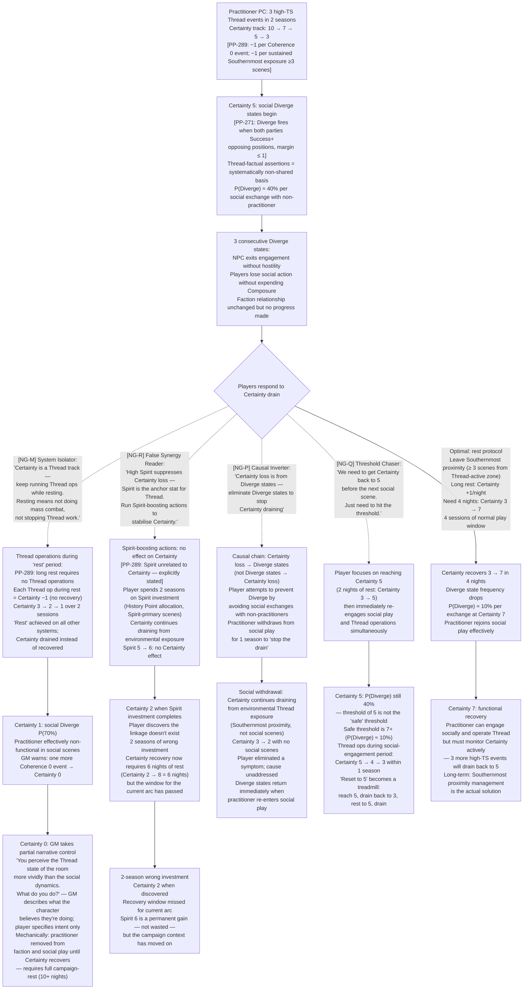
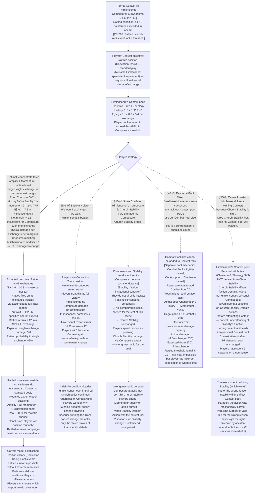
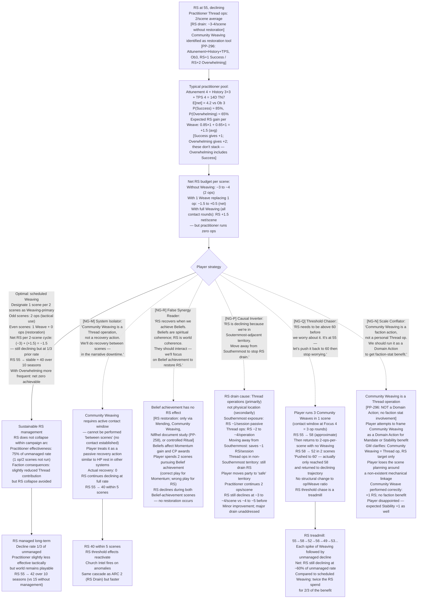
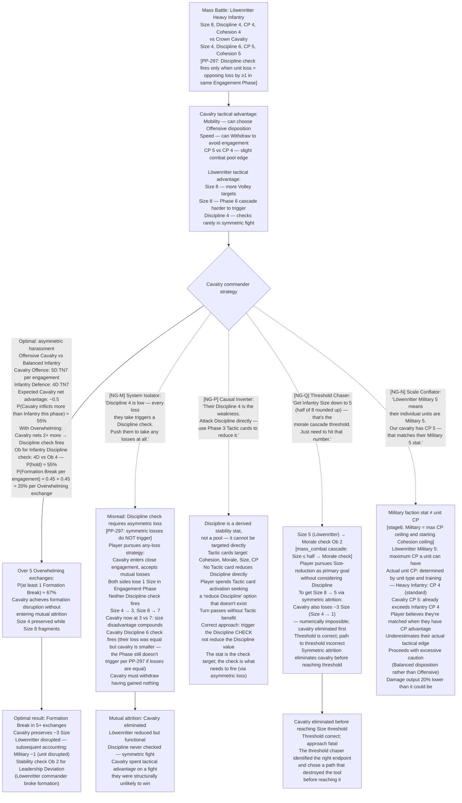
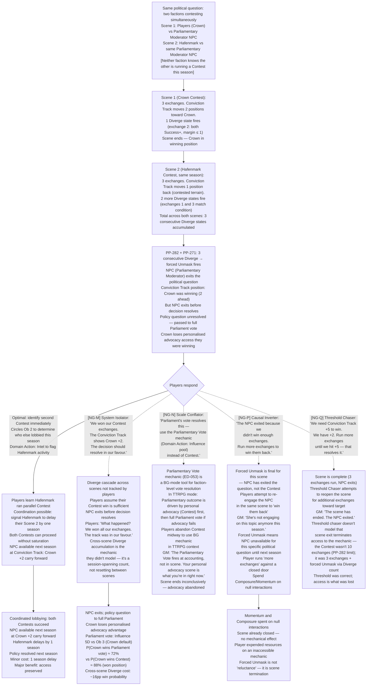

# Valoria — Emergent Narrative Arcs: Structural Misreader Archetypes
## SIM-ARC-04 | Generated: 2026-04-04 | Model: Sonnet 4.6
## Mechanics targeted: Certainty track, Binding Operations, Composure/Rattled redesign,
##   Community Weaving as RS restoration, Diverge state, Discipline asymmetry (PP-297)
## Source: params_core PP-289/290/291, params_threadwork PP-287/293/296, params_contest PP-280-286/292-295, params_mass_combat PP-297

---

## Structural Misreader Archetypes (NG-M through NG-R)

Distinct from all prior batches. These players understand individual systems correctly but misread *inter-system relationships* — how mechanic A constrains or enables mechanic B. The errors are not compulsive (IP-A–F), not restrained (NG-A–F), not social-structural (NG-G–L). They are *architectural*: the player has a coherent mental model of the game that is wrong in a specific cross-system linkage.

| Code | Archetype | Behaviour |
|------|-----------|-----------|
| NG-M | **The System Isolator** | Treats each mechanic as independent. Optimises Thread operations without considering RS/Certainty effects. Optimises Contest without tracking Domain Echo. Never reads cross-system consequences. Correct within each system; blind to interactions. |
| NG-N | **The Scale Conflator** | Applies personal-scale rules at faction scale and vice versa. Uses personal social mechanics (Composure, Rattled) as proxies for faction Stability without understanding the conversion. Attempts personal Thread ops to solve strategic problems. |
| NG-O | **The Resource Pool Mixer** | Treats all pools as fungible. Spends Momentum on Thread rolls (which it cannot affect). Tries to use Wealth to repair Coherence. Applies Combat Pool dice to non-combat situations. Each pool is correctly understood in isolation; their distinctness is the blind spot. |
| NG-P | **The Causal Inverter** | Reads causation backwards in multi-stage chains. Addresses the symptom rather than the cause: reduces TC (symptom) rather than Church Mandate (cause). Patches RS (symptom) rather than reducing Thread operation frequency (cause). Always one stage behind. |
| NG-Q | **The Threshold Chaser** | Optimises toward threshold crossings (RS 60, TC 60, Mandate 5) but does not model what happens immediately after crossing. Achieves the threshold, then is unprepared for the cascade it triggers. Correct target selection; zero preparation for consequences. |
| NG-R | **The False Synergy Reader** | Identifies two mechanics that superficially appear to interact and builds strategy around the interaction — which doesn't exist. Classic case: assumes high Certainty suppresses RS loss (it doesn't — they're independent). Builds strategies around phantom linkages. |

Notation: optimal path = solid line; structural misreader branch = dashed line with `[NG-X]` tag.

---

## ARC 16: The Certainty Cascade

### Mechanical Seed
Practitioner PC undergoes three high-TS Thread events in rapid succession → Certainty drains from 10 toward 0 → at Certainty 3, character's social interactions produce Diverge states (both parties asserting incompatible realities) → at Certainty 0, GM takes partial narrative control → Composure (Rattled redesign) interacts with Certainty loss via social scenes → players attempt to restore Certainty via rest, but rest requires leaving Southernmost proximity.

### Narrative

Certainty degradation is invisible until it isn't. The practitioner player character keeps functioning — they roll, they succeed, they move through scenes. What changes is subtle: they describe what they see in Thread-adjacent terms that other characters don't follow, they reference configurations that aren't visible to non-practitioners, they occasionally correct the GM's description of what's physically present. Other players accommodate this. The GM notes the Certainty track. Nobody talks about it.

At Certainty 5, the character starts generating Diverge states in social exchanges without intending to. They assert something true (Thread-perceptible) that no other NPC in the scene can verify. The NPC isn't wrong from their perspective; the player character isn't wrong from theirs. Both assert, both succeed, neither track moves. The Diverge state triggers after three consecutive mismatched assertions — the NPC simply stops engaging, not from hostility but from a failure to find common ground. This is the mechanic of being between two realities at once.

At Certainty 3, other players will notice something is wrong. At Certainty 0, the GM is running part of the character.

### Flowchart

### Footer

Emerges from the Certainty track (PP-289) interacting with Thread operation frequency, Southernmost proximity, and the Diverge state (PP-271). No player designed this — it is the output of sustained high-TS Thread work colliding with a new cross-system track. Arc shape: 2–4 seasons of degradation, 1–2 seasons of recovery. The arc exists to test whether players track cross-system effects or treat Certainty as a background resource.

**Structural misreader findings:**
- NG-M (System Isolator): The most common architectural error. Thread ops and Certainty recovery are explicitly cross-linked (rest requires no Thread ops). The System Isolator reads "rest" as a combat/social category, not a Thread category. The error is a definitional scope failure: "rest" means all high-intensity activity including Thread work.
- NG-R (False Synergy Reader): Spirit-Certainty linkage doesn't exist. It *looks* plausible (Spirit is the Thread attribute; Certainty is Thread-adjacent). PP-289 explicitly states "Spirit is unrelated to Certainty." The phantom synergy is the most seductive wrong model in the system.
- NG-P (Causal Inverter): Certainty loss is the cause, Diverge states are the symptom. Avoiding social scenes prevents Diverge events but doesn't address environmental Thread exposure, which is the actual drain mechanism. The character retreats from the symptom while the cause continues.
- NG-Q (Threshold Chaser): Certainty 5 is not the functional threshold — 7 is. The chaser achieves 5, re-engages, and drains back to 3 within one season. The "threshold" they're chasing is the wrong one, and they don't model the drain rate of normal play.

---

## ARC 17: The Composure Trap

### Mechanical Seed
High-Composure NPC (Himlensendt, Composure 12 or Baralta, Composure 11) faces players in a formal Contest → Rattled redesign (PP-266): Rattled fires when full Composure track expended from one hit, not a simple threshold → players must deliver sufficient net successes to expend the full track in a single exchange → optimal play requires concentrating force rather than spreading damage → Contest ends before Rattled can fire if players distribute small wins across multiple exchanges.

### Narrative

The players have beaten Himlensendt in debate before. Or they think they have — they won exchanges, moved the Conviction Track, achieved their position. What they may not understand is that winning exchanges in the Contest System does not damage Composure. Composure is expended when a single overwhelming exchange delivers enough social damage to drain the full track. Three successful exchanges delivering 3 track movement each is not the same as one exchange delivering enough to trigger Rattled.

Against Himlensendt (Composure 12), triggering Rattled requires an exchange that delivers 12 net social damage in one hit. That means net successes dramatically exceeding Ob in a single exchange — not spread across many. The players who "won" past debates won the position (Conviction Track) but never touched Composure. They can do this again. Himlensendt will not be Rattled. He will concede the stated stakes, comply with the ruling, and continue exactly as before with no persistent impairment. His Composure is intact.

This arc tests whether players understand that Track position victory and Composure damage are different win conditions.

### Flowchart

### Footer

Emerges from the Rattled redesign (PP-266) colliding with high-Composure NPCs. The redesign makes Rattled require a single overwhelming exchange rather than accumulated damage — specifically to model institutional figures who do not crack gradually. The arc has no villain; Himlensendt's immunity to Rattled is structural, not unfair. Arc shape: 1 Contest scene, consequence extends 2–3 seasons. Most impactful in TTRPG mode where NPC persistence matters.

**Structural misreader findings:**
- NG-M (System Isolator): Track position victory feels like a complete win. Within the Contest system it is. Across systems, it isn't: Himlensendt restarts at full Composure next scene. The System Isolator has a complete, correct understanding of the Contest system and a total blind spot for NPC persistence mechanics.
- NG-N (Scale Conflator): Composure and Stability look like parallel tracks for individuals and factions respectively. They are not linked. Rattling Himlensendt doesn't touch Church Stability. The confusion is architecturally reasonable; the linkage doesn't exist.
- NG-O (Resource Pool Mixer): Combat Pool dice cannot contribute to Contest rolls. The "confrontation" framing makes this feel intuitive — all the character's capability should count. It doesn't. The error produces an overestimate of damage potential without affecting the mechanic.
- NG-P (Causal Inverter): Church Stability and Himlensendt's personal Contest pool are independent. Reducing Stability before the Contest is correct strategy — but for different reasons (Stability affects faction Domain Actions, not personal Contest pools). The Causal Inverter does the right thing for the wrong reason and is surprised it works.

---

## ARC 18: The Community Weaving Bottleneck

### Mechanical Seed
RS at 55 and declining → players identify Community Weaving (PP-296) as restoration tool → Community Weaving pool: Attunement + History + TPS, Ob 3, RS +1/+2 → requires Thread Sensitivity 50+ practitioner → practitioner already committed to 2 other Thread operations per scene → Community Weaving vs operational Thread use is a direct resource competition → players must choose between RS restoration (long-term) and Thread effectiveness (short-term) every scene.

### Narrative

Community Weaving is the only player-accessible RS restoration mechanism that doesn't require extreme Thread Sensitivity or foundational-scale operations. It is not passive — it requires a sustained Thread operation (Attunement + History + TPS, Ob 3) that consumes the practitioner's contact window for other operations that scene. The question is never whether to do it; it is always whether to do it *now*, given what else the practitioner needs this scene.

The arc begins when RS crosses 55 and players first look for a restoration path. They find Community Weaving in params_threadwork. They understand the mechanic. The problem is that their practitioner is also running an active investigation (Thread Diagnosis equivalent operations), defending against an Inquisitor approach (Binding Ops), and occasionally Weaving for tactical advantage. Every scene has competing Thread priorities. Community Weaving always loses to the urgent.

The RS decay continues at the rate of Thread operations minus Community Weaving output. If the practitioner runs 2 ops/scene without Weaving: RS −4 to −6/scene. If they substitute 1 Community Weave/scene: RS net approximately −2 to +1 depending on outcome. The choice is visible. The urgency of non-Weaving ops is what makes it hard.

### Flowchart

### Footer

Emerges from Community Weaving (PP-296) being the primary RS restoration tool but competing directly with offensive/tactical Thread operations for the same contact window. No player designed the tension — it is the structural output of Thread operation economics. Arc shape: ongoing across all seasons where RS is below 65; becomes critical below 50. The arc has no dramatic peak — it is pure resource management. Its simulation value is in finding the player archetypes that fail to sustain it.

**Structural misreader findings:**
- NG-M (System Isolator): Treats Community Weaving as a passive/narrative action. The cross-system link — Weaving requires an active Thread contact window — means it competes with other ops. The Isolator models Weaving as "downtime recovery" rather than "active operation competing for the same resource pool."
- NG-R (False Synergy Reader): Belief achievement → RS restoration is the most plausible phantom synergy in the game. Both Beliefs and RS represent coherence (personal and world respectively). The linkage looks canonical. It isn't. Beliefs affect Momentum; RS has its own restoration toolkit. The False Synergy Reader built a strategy on a philosophically compelling but mechanically absent connection.
- NG-P (Causal Inverter): Southernmost proximity is a real RS drain — but it's secondary. Thread operations are the primary drain. Moving away from Southernmost treats the minor cause as the major one. RS continues declining at 90% of prior rate in "safe" territory.
- NG-Q (Threshold Chaser): Three Weaves in one scene pushes RS up — then the player returns to 2-ops-per-scene. The spike decays within 2 scenes. The threshold chaser optimises for the peak without modelling the sustainable rate. "Push to 60" fails because 60 is not achievable in one scene (RS 55 + ~3 from 3 Weaves = 58 at most) and decays before the next threshold event.

---

## ARC 19: The Discipline Fault Line

### Mechanical Seed
Large formation (Size 8, Discipline 4) engages a smaller formation (Size 4, Discipline 6) in symmetric engagement → PP-297: symmetric engagements (equal losses) do NOT trigger Discipline check → players pursuing attrition strategy assume Discipline check fires on every loss → fail to distinguish symmetric from asymmetric exchanges → miss the mechanic that protects large formations in even fights while making asymmetric losses catastrophic.

### Narrative

The battle looks simple from the players' side. Löwenritter heavy infantry (Size 8, Discipline 4) versus Crown cavalry (Size 4, Discipline 6). The players, advising the Crown cavalry, want to use mobility to inflict asymmetric losses — hit hard, pull back, deny the larger formation the close engagement it needs. The mechanic supports this: asymmetric losses trigger the Discipline check that might break the Löwenritter formation.

What the players may not understand is the converse: if the exchange is symmetric (both sides lose 1 Size in the same Engagement Phase), neither side's Discipline fires. The Löwenritter's Discipline 4 only becomes a liability when they lose more than the cavalry in the same exchange. In a grinding mutual attritional fight — which is where the Size-8 formation wants to be — Discipline checks do not fire. The large formation is designed to win the symmetric fight.

The asymmetric-loss strategy is correct. The question is whether players execute it correctly or slip into mutual attrition when the scene gets chaotic.

### Flowchart

### Footer

Emerges from the Discipline asymmetry precondition (PP-297) interacting with standard attrition strategy intuitions. Most wargame experience tells players "inflict any losses to trigger morale effects." PP-297 specifically requires asymmetric losses. The arc tests whether players read the precondition or assume symmetric loss works. Arc shape: 1 battle scene; consequence extends if cavalry is eliminated (Löwenritter retain military advantage). Most impactful in Hybrid mode where mass battle feeds back to BG faction stats.

**Structural misreader findings:**
- NG-M (System Isolator): The Discipline check trigger is correctly identified as "Size loss > Discipline threshold." The asymmetry precondition (PP-297) is the second half of the rule that the Isolator misses. Within the mass combat system, the Isolator has read the condition correctly but not the full condition.
- NG-P (Causal Inverter): Discipline is a target value for checks, not a pool to drain. The Causal Inverter tries to reduce the stat rather than trigger the check. The distinction between "reduce a stat" and "trigger a check that tests the stat" is the architectural blind spot.
- NG-Q (Threshold Chaser): The Size-half threshold is real. The path to it via symmetric attrition is fatal because cavalry is smaller. The chaser identified the correct goal and the impossible route simultaneously.
- NG-N (Scale Conflator): Military faction stat ≠ unit CP. The faction's Military ceiling sets maximum unit quality; it doesn't describe the actual unit's CP. The Conflator is underestimating their CP advantage because they think the enemy "Military 5" means enemy unit CP 5.

---

## ARC 20: The Diverge Cascade

### Mechanical Seed
Two factions simultaneously contest the same political question via separate Contest scenes in the same season → each generates a Diverge state (PP-271) in their respective scenes → Diverge states accumulate in the same NPC's Conviction Track across scenes → three consecutive Diverge states across scenes → forced Unmask fires (PP-282 maximum 10 exchanges / PP-271 max 3 consecutive Diverge) → NPC exits the political question entirely → the faction that was winning the position (closer to success on Conviction Track) loses access to the decision-making context.

### Narrative

The players are not the only people in the Contest. Two factions are simultaneously arguing the same political question — Hafenmark and Crown are both trying to convince Parliament of the same policy direction, each through separate scenes. Neither knows the other is running a parallel Contest this season. The NPC at the centre (a Parliamentary moderator, a swing vote on the council) is receiving competing arguments from two different directions.

Each Contest generates Diverge states independently. The moderator is not confused by any individual argument — each is coherent on its own terms. The problem is that across two scenes, the moderator has now experienced six exchanges arguing competing positions with equal success rates. The Conviction Track hasn't moved significantly in either direction. Three consecutive Diverge states have accumulated across the combined scene count. Forced Unmask fires: the moderator withdraws from the question entirely. Neither faction wins. The policy question goes unresolved.

The players, who were winning position in the first scene, lose access to the decision because a second Contest they didn't know about saturated the NPC's tolerance for the question.

### Flowchart

### Footer

Emerges from the Diverge state's cross-scene accumulation rule (PP-271: max 3 consecutive) interacting with two parallel Contests targeting the same NPC in the same season. No player designed the Hafenmark Contest — it fires from Hafenmark's Institutional Tendency (constitutional procedure). Arc shape: 1-season window; 1-season consequence. Demonstrates the cross-system interaction between Contest mechanics and faction Institutional Tendency.

**Structural misreader findings:**
- NG-M (System Isolator): Contest wins are scene-local. Conviction Track position carries forward; NPC access does not if Forced Unmask fires. The Isolator models the Contest correctly within its scene but doesn't track cross-scene Diverge accumulation as a session-spanning counter.
- NG-N (Scale Conflator): TTRPG personal advocacy scenes and BG Parliamentary Vote are sequential, not interchangeable. The Scale Conflator treats the BG mechanic as usable in TTRPG context mid-scene. The correct sequence is: personal advocacy (Contest) → if advocacy fails, full Parliament vote at Accounting.
- NG-P (Causal Inverter): Forced Unmask is not a measure of exchange count — it is a measure of Diverge count. Running more exchanges doesn't undo a Forced Unmask. The Causal Inverter treats "exited the question" as "lost the lead," which is a recoverable position. It isn't.
- NG-Q (Threshold Chaser): Conviction Track +5 is the right target. Access to the NPC is what was lost. The Threshold Chaser correctly identifies the target and doesn't model that the tool (Contest with this NPC) is no longer available this season.

---

## Cross-Arc Interaction Table (SIM-ARC-04)

| | ARC 16: Certainty | ARC 17: Composure | ARC 18: Weaving | ARC 19: Discipline | ARC 20: Diverge |
|---|---|---|---|---|---|
| **ARC 16: Certainty** | — | Certainty 5+ generates Diverge states in social (ARC 20 risk rises); Certainty 0 removes practitioner from ARC 17 Contest | Community Weaving is a Certainty-safe operation (no Coherence cost at Personal scale) — scheduling it can protect Certainty | Practitioner at Certainty 3 cannot reliably direct ARC 19 Thread ops in mass battle | Certainty-driven Diverge states can trigger ARC 20 Forced Unmask even without parallel Contests |
| **ARC 17: Composure** | Himlensendt Contest loss (position) doesn't impair him — he restarts at Composure 12 next scene, contributing to ARC 16 TC growth | — | Himlensendt unimpaired means Church Thread suppression continues — Community Weaving faces ongoing Inquisitor pressure (ARC 18 harder) | Himlensendt Contest win means Church can pursue Domain Actions freely — ARC 19 Löwenritter military engagement more likely | Himlensendt generates Diverge states in Contest due to Thread-factual vs doctrine mismatch — ARC 20 interaction possible |
| **ARC 18: Weaving** | Community Weaving protects RS — but if Certainty drops, Weaving efficiency unchanged (Certainty ≠ Thread effectiveness) | RS above 55 enables Himlensendt's institutional authority (Church stronger at RS > 50) — maintaining RS keeps the problem | — | Mass battle Thread ops (ARC 19) compete with Community Weaving for contact window — battlefield and restoration in direct competition | RS above threshold reduces Church anxiety about Thread — fewer Inquisitor actions, fewer ARC 20 Contest opponents |
| **ARC 19: Discipline** | Practitioner at Certainty 3 is less reliable for ARC 19 precision targeting (Thread Diagnosis before Pulling general) | ARC 19 loss (cavalry eliminated) means Crown Military −1 — Crown Mandate drops — ARC 17 Contest position harder to maintain | Community Weaving interrupted by ARC 19 battle demands — RS declines during battle seasons | — | ARC 19 Löwenritter victory means Löwenritter Military dominant — Parliament moderator (ARC 20) faces stronger Löwenritter faction pressure |
| **ARC 20: Diverge** | Diverge cascade (ARC 20 NPC exits) sends policy to Parliament — Crown loses Contest advantage — Certainty practitioner's social contribution matters less (ARC 16) | Himlensendt is likely to participate in Parliamentary fallback (ARC 20) — his Composure 12 makes him the strongest voice | RS above 55 reduces Church urgency — Himlensendt less aggressive in ARC 20 Parliament — fewer parallel Contests from Church | Löwenritter Parliament presence (after ARC 19 victory) adds competing voice — more Diverge risk | — |

**Convergence risk (SIM-ARC-04):** NG-M applied across all four arcs simultaneously produces: Certainty draining unchecked (no Thread rest, ARC 16), Contest positions won but NPC unimpaired (ARC 17), RS declining at full rate (ARC 18 Community Weaving not scheduled), Discipline check misunderstood (ARC 19 cavalry eliminated), Diverge cascade untracked (ARC 20 NPC exits). All five failures are independent System Isolator errors that compound: RS collapse activates Church Intel, eliminating the practitioner from social play (ARC 17), degrading the one mechanic that could restore RS (ARC 18), while the military loss (ARC 19) strengthens Löwenritter faction pressure in the Parliament vote (ARC 20) that the players defaulted to by failing the Contest (ARC 20).

**Systemic finding (SIM-ARC-04):** Structural misreaders cluster around **definitional scope failures** — the player's model of a mechanic is correct within a narrower scope than the mechanic actually operates. The System Isolator (NG-M) has the most pervasive failure mode because isolation is the default cognitive approach to complex rule systems. Every arc in this batch has at least one NG-M failure path, and all are caused by the same error applied to different mechanics: "this mechanic operates in this system and only this system."

---

## Simulation Findings Summary (SIM-ARC-04)

| Finding | Arc | Mechanic | Severity |
|---------|-----|----------|----------|
| F-ARC4-01 | ARC 16 | NG-M: Thread ops during "rest" prevent Certainty recovery; player scopes rest as combat/social, not Thread | Critical — Certainty drains to 0 |
| F-ARC4-02 | ARC 16 | NG-R: Spirit-Certainty phantom synergy; PP-289 explicitly states Spirit unrelated; 2 seasons wrong investment | High — explicitly contradicted by params |
| F-ARC4-03 | ARC 16 | NG-P: Avoiding social scenes treats Diverge symptom; Southernmost exposure (cause) continues | Medium — partial mitigation only |
| F-ARC4-04 | ARC 16 | NG-Q: Certainty 5 treadmill; safe threshold is 7, not 5; drain rate identical below 7 | High — wrong threshold identification |
| F-ARC4-05 | ARC 17 | NG-M: Track position victory ≠ NPC impairment; Himlensendt restarts at Composure 12 every scene | High — most common player assumption |
| F-ARC4-06 | ARC 17 | NG-N: Composure ≠ faction Stability; Rattling Himlensendt doesn't touch Church institutional stats | High — parallel track confusion |
| F-ARC4-07 | ARC 17 | NG-O: Combat Pool cannot contribute to Contest rolls; overestimates damage capacity | Medium — illegal pool addition |
| F-ARC4-08 | ARC 17 | NG-P: Church Stability doesn't feed Himlensendt's Contest pool; 2 seasons correct action for wrong reason | Medium — right action, wrong model |
| F-ARC4-09 | ARC 18 | NG-M: Community Weaving requires active contact window; cannot be performed as "downtime recovery" | Critical — zero RS restoration |
| F-ARC4-10 | ARC 18 | NG-R: Belief achievement → RS is most plausible phantom synergy; philosophically coherent, mechanically absent | High — seductive wrong model |
| F-ARC4-11 | ARC 18 | NG-P: Moving from Southernmost treats secondary drain; Thread ops are primary; RS still declines at 90% | Medium — minor improvement, major cause unaddressed |
| F-ARC4-12 | ARC 18 | NG-Q: RS spike via 3 Weaves decays in 2 scenes; treadmill vs sustainable rate | Medium — threshold achieved; rate unchanged |
| F-ARC4-13 | ARC 19 | NG-M: Discipline check requires asymmetric loss; symmetric attrition (any loss) does not trigger | Critical — cavalry eliminated on wrong strategy |
| F-ARC4-14 | ARC 19 | NG-P: "Reduce Discipline stat" vs "trigger Discipline check"; no Tactic card targets the stat directly | Medium — turn wasted seeking non-existent option |
| F-ARC4-15 | ARC 19 | NG-Q: Size threshold (half) correct; symmetric attrition path eliminates cavalry before reaching it | High — correct target, self-defeating path |
| F-ARC4-16 | ARC 19 | NG-N: Military faction stat ≠ unit CP; Scale Conflator underestimates own CP advantage; excess caution | Low — underperforms but doesn't lose |
| F-ARC4-17 | ARC 20 | NG-M: Cross-scene Diverge count not modelled; assumed Contest win is sufficient; NPC exits | High — session-spanning counter missed |
| F-ARC4-18 | ARC 20 | NG-N: TTRPG Contest and BG Parliamentary Vote are sequential, not interchangeable | Medium — abandons winning position |
| F-ARC4-19 | ARC 20 | NG-P: Forced Unmask ≠ exchange count loss; running more exchanges against closed NPC access | Medium — resource burn on null interactions |
| F-ARC4-20 | ARC 20 | NG-Q: Conviction Track target correct; access to NPC is what was lost; threshold reachable next season | Low — correct model, wrong timing |

**Test ID:** SIM-ARC-04
**Mechanics:** Certainty track (PP-289), Composure/Rattled redesign (PP-266), Community Weaving (PP-296), Discipline asymmetry precondition (PP-297), Binding Ops (PP-293), Diverge state (PP-271), Contest forced resolution (PP-282), Hybrid TC clamp (PP-283), Reach terminology (PP-290 — contextual)
**Mode:** TTRPG primary; mass combat (ARC 19) Hybrid-applicable
**Temporal:** Multi-season; ARC 16 ongoing; ARC 17 per-scene; ARC 18 ongoing; ARC 19 single battle; ARC 20 single season
**Tracks:** Certainty, Composure, RS, Discipline, Conviction Track, Diverge counter
**Factions:** Crown, Church, Hafenmark, Löwenritter
**NPCs:** Himlensendt, Parliamentary Moderator (generic), Löwenritter commander (generic)
**Archetypes:** NG-M through NG-R (all six structural misreader archetypes)
