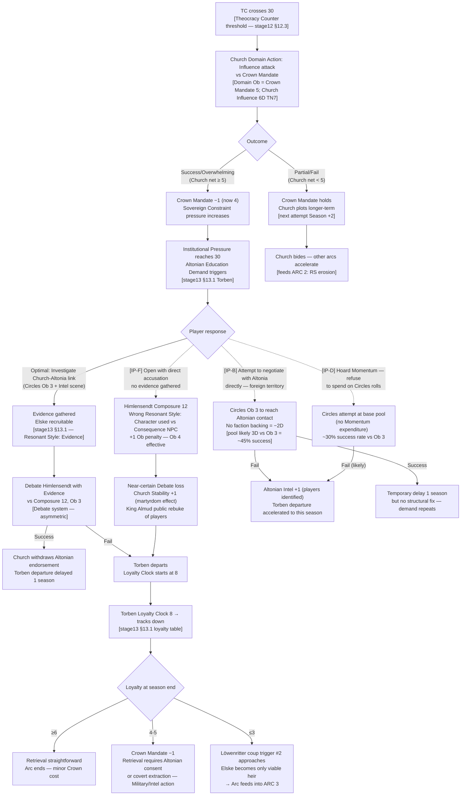
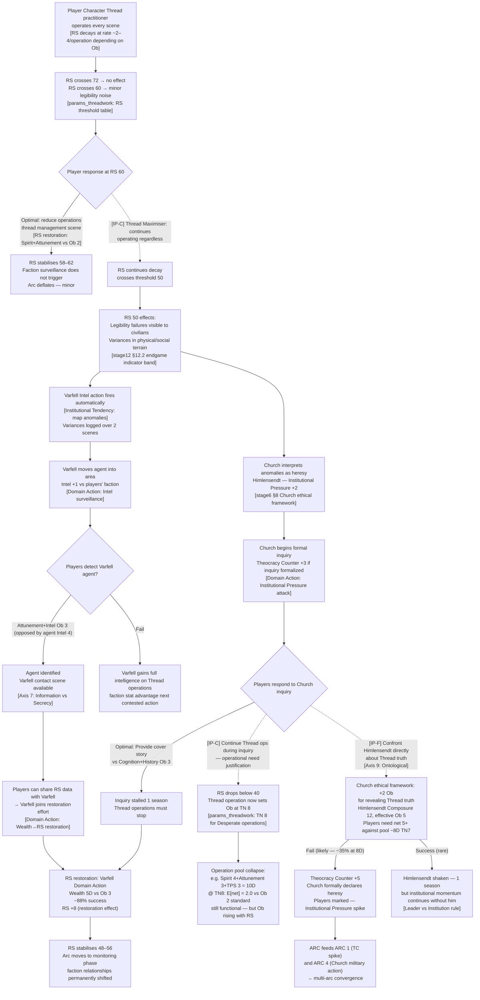
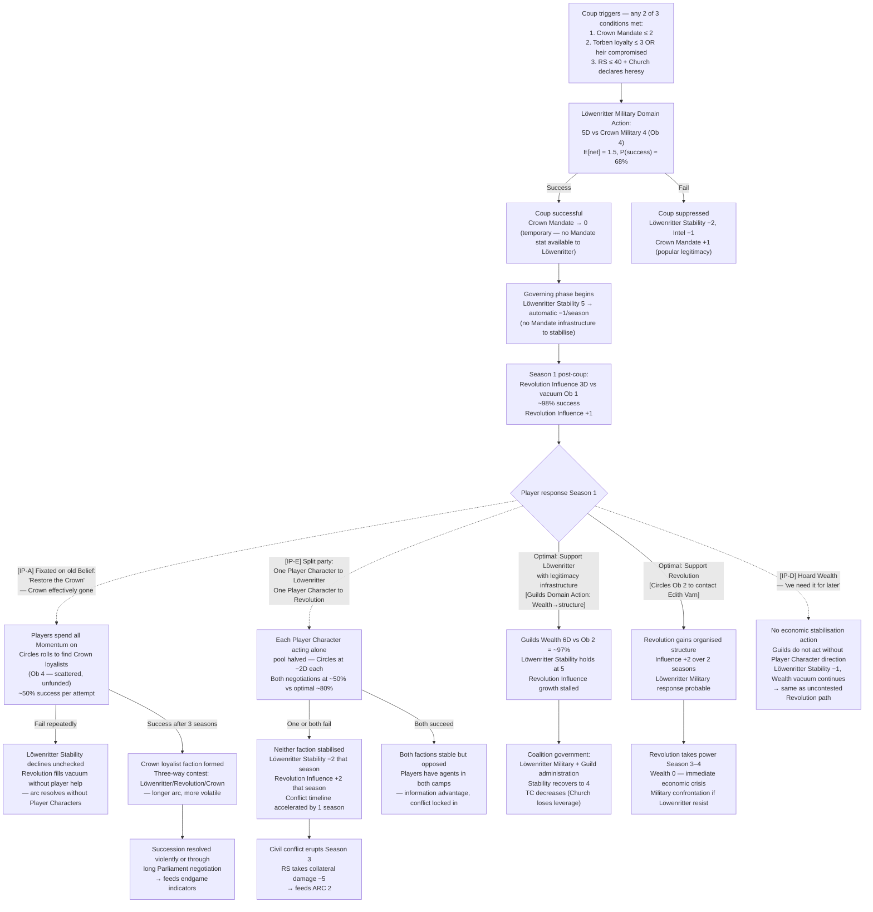
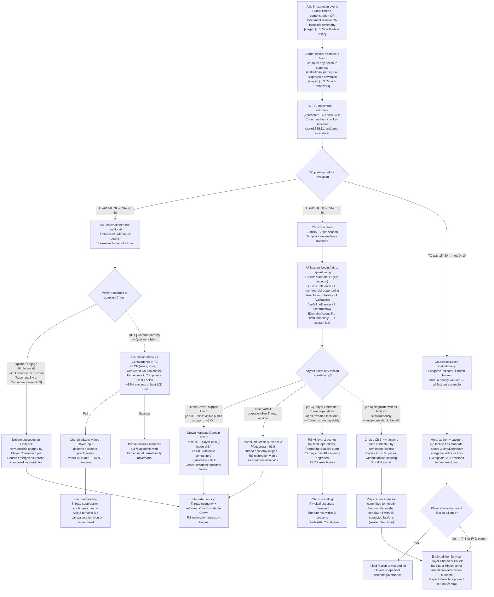
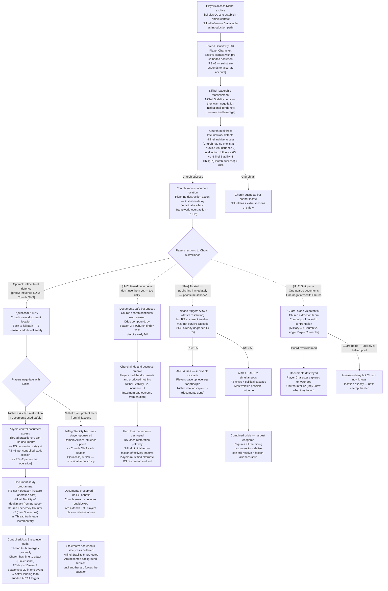

# Valoria — Emergent Narrative Arcs: Irrational Player Behaviour Stress Test
## Generated: 2026-04-04 | Model: Sonnet 4.6
## Source authority: stage6_factions.md, stage12_campaign_modes.md, stage13_npcs.md, params_core.md

---

## Irrational Player Archetypes

Before arcs: the six human-play patterns injected as non-optimal choice nodes. These are not rules violations — they are recognisable table behaviours that produce mechanically incoherent results.

| Code | Archetype | Behaviour |
|------|-----------|-----------|
| IP-A | **The Fixated** | Pursues one Belief obsessively regardless of changed circumstances. Spends all Momentum on that Belief even when doing so collapses other tracks. |
| IP-B | **The Diplomatic Idealist** | Attempts to negotiate with every faction including active enemies. Rolls social when combat is required. Triggers Ethical Framework penalties by refusing actions that violate personal values even when mechanically optimal. |
| IP-C | **The Thread Maximiser** | Every scene, attempts a Thread operation regardless of Rendering Stability (RS) level or personal Coherence. Treats Thread as the answer to non-Thread problems. |
| IP-D | **The Hoarder** | Never spends Momentum. Saves Wealth faction contributions. Refuses to commit resources until a "perfect moment" that never arrives. |
| IP-E | **The Splitter** | When the party faces a two-front problem, splits the group — each Player Character handles one front alone, halving all pools. |
| IP-F | **The Confronter** | Escalates every social scene to a direct challenge before Reading the Room. Misidentifies Resonant Styles. Always opens with the wrong mode (Character when the Non-Player Character responds to Consequence, etc.). |

Notation in flowcharts: optimal path = solid line; irrational branch = dashed line; irrational code in `[brackets]`.

---

## ARC 1: The Succession Weapon

### Mechanical Seed
Theocracy Counter (TC) crosses threshold 30 → Church institutional pressure fires → Himlensendt invokes doctrine (Domain Action: Influence attack on Crown Mandate) → King Almud's Sovereign Constraint activates → Torben loyalty clock becomes contested asset.

### Narrative

The players will first notice something is wrong with the Church through small things: a sermon referenced in passing, a minor official refusing to confirm a merchant's contract without a tithe review, a locked archive that was open last season. No one announces that Confessor Arne Himlensendt has decided to move.

By the time the Theocracy Counter crosses 30, the Church has already run two Domain Actions — one to increase its Influence in the southern parishes, one to reduce the Crown's Mandate among the commons by seeding a scandal about treasury mismanagement. Players watching only the explicit scene layer will have seen neither. Players watching faction stats will notice Crown Mandate has dropped one. If they investigate, the trail leads to a retired clerk named Vaynard who, under pressure, reveals he passed documents to a Church representative.

The lever the Church pulls is Torben. When Institutional Pressure reaches 30, Altonia's education demand arrives — and Himlensendt uses his Influence network to ensure it arrives with Church endorsement. Torben leaves Valoria. The Torben Loyalty Clock starts counting.

Now the players face a structural problem, not a villain to fight: the king cannot act without collapsing his coalition, the Church is acting within its formal authority, and Altonia is a foreign power with trade leverage. Every route to stopping Torben's drift requires sacrificing something. The arc ends in one of three states — Torben retrieved, Torben Altonian, or Torben dead — and every ending rewrites the succession entirely.

### Flowchart

### Footer

No player designed this arc. It emerges from TC threshold mechanics, the Torben Loyalty Clock, and Himlensendt's Beliefs running in parallel without player input. Arc shape: 3–4 seasons, compressed in BG mode to 1 session. Endgame indicator: succession resolved or definitively broken.

**Irrational behaviour findings:**
- IP-F (Confronter): Misidentifying Himlensendt's Resonant Style (Consequence, not Character) costs +1 Ob on the critical Debate, making loss near-certain. Church Stability bonus from martyrdom effect compounds — the players made Himlensendt stronger.
- IP-B (Diplomatic Idealist): Negotiating with Altonia directly exposes the players as foreign operatives in Altonian territory, accelerating Torben's departure rather than delaying it. Good intention, structural failure.
- IP-D (Hoarder): Withholding Momentum on the Circles roll against Ob 3 with a likely 4D pool drops success probability from ~80% to ~45%. The single point of Momentum expenditure was the correct play; saving it produces a bad outcome and doesn't use the Momentum for anything better.

---

## ARC 2: The Rendering Stability Drain

### Mechanical Seed
One Thread practitioner Player Character runs operations every scene for 3 seasons without Thread management → Rendering Stability (RS) decays to threshold 50 → world-legibility effects begin → non-practitioner factions notice anomalies → Varfell mobilises its intelligence network → Church interprets manifestations as heresy → Institutional Pressure spike.

### Narrative

The players won't notice the drain from their side. The Thread practitioner is doing what Thread practitioners do — Leaping when there's an advantage, running Diagnosis on Unstable threads, occasionally overreaching. Each operation costs RS fractions and no single scene looks alarming.

What they will notice is the world getting strange at the edges. A trade document from Hafenmark arrives with an ink error that shouldn't exist — a word in a dead form, no longer used. An old man in the market describes a road that isn't there and has never been. A miller's dog won't stop barking at a wall. These are not random events — they are RS manifestations: the substrate producing legibility failures as it degrades. Players who don't understand what Rendering Stability is will try to investigate these incidents as normal mysteries. They are not mysteries. They are symptoms.

By the time RS crosses 50, Varfell's intelligence network has logged enough anomalies to flag a "thread-active zone" to their leadership. They don't announce this. They move an agent to the town. Meanwhile, the Church's perception is different: Himlensendt's theological framework converts the anomalies into evidence of heresy. He doesn't know he's wrong. His institutional perceptual prophylaxis prevents him from making the causal inference a practitioner would make. He knows something is happening. He concludes it is spiritual corruption. He begins an inquiry.

The players are now being watched by two factions for completely different reasons, and the correct mechanical response — reduce Thread operations, restore RS — is the one response that feels like giving up power.

### Flowchart

### Footer

Emerges from the RS decay mechanic running in the background while players pursue unrelated Beliefs. No faction player designed the Varfell surveillance or the Church inquiry — both fire automatically from their Institutional Tendency when RS crosses threshold. Arc shape: 2–3 seasons building, 1 season crisis. Critical in all three modes but most visible in TTRPG.

**Irrational behaviour findings:**
- IP-C (Thread Maximiser): The key failure is not immediate — the pool numbers remain functional down to RS 50 (TN shift). The failure is *political*: the Thread operations are legible to factions before they become mechanically limiting. By the time the Maximiser notices mechanical degradation, the Church inquiry is already filed and Varfell has the intelligence. The mechanic punishes the archetype through surveillance, not through pool collapse.
- IP-F on Himlensendt: The +2 Ob for Thread truth revelation is the Church's hardest modifier. Even a well-built Debate pool (~8D) has only ~35% success against effective Ob 5. The confrontation route is nearly a guaranteed Theocracy Counter spike. Most tables will not see this coming.

---

## ARC 3: The Löwenritter Legitimacy Problem

### Mechanical Seed
Löwenritter Military 5 + Lowenritter no Mandate stat → they can win battles but cannot govern → if coup triggers, Löwenritter hold capital without legitimacy infrastructure → Stability degrades automatically → Revolution Influence grows in vacuum → forced Coalition or collapse.

### Narrative

The Löwenritter are not a faction the players are meant to fight. They are a faction whose logic is legible and internally consistent, and that is what makes them dangerous. Their coup isn't villainy — it is the rational consequence of watching the Crown fail on multiple axes simultaneously. The players will know the coup is possible before it happens; they can read the trigger conditions in faction behaviour. Whether they act on that knowledge depends entirely on what their Beliefs say.

After the coup, if it happens, the city feels different. The Löwenritter have Military presence everywhere. Supplies move. People follow orders out of fear or relief depending on where they sit. But no one is holding the civic fabric together — the guilds are frozen, the parish priests are receiving no guidance, the merchant dispute system has no authority to refer to. Within one season, the Löwenritter are doing something they were not designed to do: governing. They are failing at it methodically, and their Stability is declining one point per accounting cycle.

The Revolution, watching from outside, sees an opportunity. A faction with no Mandate has created a power vacuum that Influence and Stability can fill. The players are caught between a military government that's losing control and a popular movement that has never held power and has no Wealth. If they help neither, the arc resolves without them, messily. If they help one, they own the consequences.

### Flowchart

### Footer

Emerges from Löwenritter's partial stat sheet (no Mandate) colliding with coup trigger conditions. The faction was never designed to govern — the absence of a Mandate stat is a structural design choice, not an oversight. Arc shape: 4–6 seasons if players engage; 2–3 if they don't. Most impactful in TTRPG mode; abstracted to single Military vs Stability contest in BG mode.

**Irrational behaviour findings:**
- IP-A (Fixated): "Restore the Crown" is not a wrong Belief — it is a mechanically expensive one. The Crown loyalists exist, but finding them costs Ob 4 Circles rolls repeatedly at low success rates. Meanwhile, the Löwenritter Stability clock does not pause. The arc resolves around the players, not through them. The Fixated archetype produces the most interesting emergent outcome: a three-way contest no one planned.
- IP-E (Splitter): Halved pools produce a ~30% success-rate penalty on Circles. The loss probability compounds: if each independent negotiation has ~50% success, both succeeding is 25%. The likely outcome (one or both fail) accelerates the timeline by a full season, pushing the arc into crisis before players have leverage.
- IP-D (Hoarder): The economic stabilisation action requires no Momentum — it uses Guilds Wealth 6D. The Hoarder refuses anyway, holding faction Wealth "for emergencies." The emergency is this. The unwillingness to commit resources is mechanically identical to taking no action.

---

## ARC 4: The Thread Truth Cascade

### Mechanical Seed
Axis 9 (Ontological) resolved publicly → Thread truth becomes common knowledge → Church Theocracy Counter collapses (−20 minimum) → Church Stability crisis → Himlensendt's institutional power breaks → vacuum in moral authority → all factions reposition on Axis 1 (Sovereignty) simultaneously → political cascade.

### Narrative

The players will probably not mean to resolve Axis 9. It will happen because one scene went further than expected — a Thread demonstration in public, an Inquisitor who saw something and lived, a document recovered from Niflhel that was too specific to deny. Resolving Axis 9 means the world now knows that the substrate of reality is mutable, that practitioners can move it, and that the Church has been systematically suppressing that knowledge for at least a century.

The immediate effect is not what players expect. There is no riot, no sudden collapse. There is a silence. People do not process ontological revelations quickly. What they process quickly is that the institution they were told to trust lied to them about the most fundamental question there is. That anger takes two to three scenes to become organised. When it does, it moves faster than any Domain Action.

Himlensendt does not lose faith. That is the thing. His theological framework simply — converts. He finds a new interpretation that maintains Church authority while accepting the physical reality of Thread. He is now more dangerous, not less: a sophisticated institution adapting rather than collapsing. The Church's Theocracy Counter drops, then stabilises. What the players thought they had destroyed has become something different.

Meanwhile, every other faction repositions. The Crown can now openly acknowledge what Almud has always privately suspected. The Guilds see commercial opportunity in legitimate Thread services. Varfell — the faction that was already there — finds itself suddenly central rather than marginal. The Revolution, which used Thread truth as a political weapon, must decide what it stands for now that the weapon has fired.

### Flowchart

### Footer

Axis 9 resolution is an endgame indicator, not a mid-arc event — this arc only fires in a late campaign. No player can deliberately trigger it cleanly; it emerges from accumulated scenes where Thread truth leaked incrementally. Arc shape: 1–2 seasons of cascade, then resolution. In BG mode, compressed to single TC threshold event with faction repositioning table.

**Irrational behaviour findings:**
- IP-C (Thread Maximiser): The revelation scene creates a window where Thread operations are *expected* — the world knows they exist. The Maximiser reads this as permission. The RS burn from multiple demonstration operations during the cascade can push RS below 40, re-triggering ARC 2 at exactly the moment the political situation is most volatile. Two simultaneous crises (RS collapse + political cascade) is the most punishing combined outcome.
- IP-B (Diplomatic Idealist): Negotiating with all four repositioning factions simultaneously is the "fair" play — everyone benefits. Mechanically, it fails because faction-backed rolls are required to clear Ob 3, and the players have not committed to any faction. All four rolls are at base pool without bonus dice. Expected outcome: 1 of 4 succeeds. The players spent 4 actions to achieve what 1 focused action would have.
- IP-F: Himlensendt post-revelation is in a weaker political position but still has Composure 12. The confrontation impulse ("you were lying") is understandable but still targets the wrong Resonant Style. The Consequence-focused NPC responds to structural reasoning, not moral accusation. Even a weakened Church produces a doctrine hostile to practitioners if the social scene fails.

---

## ARC 5: The Niflhel Provenance

### Mechanical Seed
Niflhel (no Mandate, no Military, partial sheet) holds historical documents → players discover Niflhel has pre-Galbados Thread records → Church learns players are accessing Niflhel → Intel war begins → Niflhel's Stability becomes the central contested asset → documents change the RS mechanics themselves if published.

### Narrative

Niflhel barely registers in the early campaign. They have Influence and Stability and nothing else. Players treating factions as power-players will ignore them — no Military, no Mandate, what threat do they pose? The answer is that Niflhel is the only faction holding memory. They have records of what the world looked like before Galbados rewrote the ontological consensus. Those records are not magical — they are historical, specific, boring to read. Thread Sensitivity 50+ practitioners who encounter them will have a different experience.

The arc begins when a player character who has never seen a pre-Galbados account reads one and the text does something no text should do: it describes a physical sensation of Thread contact that the reader feels. The document is not performing a Thread operation — it is a sufficiently accurate first-person account that the substrate responds to being read. Niflhel's leadership, who have kept the documents without understanding them, watches this happen and reassesses everything.

Now Niflhel wants something. They have leverage they didn't know they had. The Church knows the documents exist — their Intel network flagged the access. Himlensendt's institutional perceptual prophylaxis means he doesn't understand what the documents are, but he understands they are dangerous. The Church begins an Intel action to locate and destroy the archive. Niflhel's Stability is the only thing standing between the documents and the fire.

The players must decide whether to use the documents (RS consequences), protect them (Intel and social mechanics), or release them (triggers ARC 4). All three are legitimate choices with mechanical teeth.

### Flowchart

### Footer

Emerges from Niflhel's partial stat sheet — they can survive (Stability 4, Influence 5) but cannot project power. The documents are the only leverage they have, and they don't know it at arc start. No player invented this situation; it emerges from Niflhel's institutional structure intersecting with the Church's Intel proxy and the RS restoration mechanic gap. Arc shape: 3–5 seasons; can be compressed or extended depending on player engagement. The document study programme is the only arc that generates net-positive RS over multiple seasons.

**Irrational behaviour findings:**
- IP-D (Hoarder): The most self-defeating play in any arc. Saving the documents produces zero benefit — they degrade in value as the Church search narrows. The Hoarder's caution compounds geometrically against them: each season of inaction increases Church find-probability while granting no RS benefit. Maximum bad outcome (documents destroyed, no use extracted) is the Hoarder's most likely result.
- IP-A (Fixated on publication): Not wrong as a goal — but timing-dependent. Publishing when RS < 55 creates the hardest combined outcome in the game: ARC 2 and ARC 4 simultaneously. The Fixated archetype is least harmful here when RS is healthy; catastrophic when RS is already degraded.
- IP-E (Splitter): The party split against a Church extraction team is the clearest mechanical failure in the batch. A halved combat pool (Military proxy) against a Church Templar unit near-guarantees document loss. The "cover all bases" instinct produces the worst single outcome of any split scenario in these arcs.

---

## Cross-Arc Interaction Table

| | ARC 1: Succession | ARC 2: RS Drain | ARC 3: Löwenritter | ARC 4: Axis 9 | ARC 5: Niflhel |
|---|---|---|---|---|---|
| **ARC 1: Succession** | — | TC spike from Church inquiry accelerates RS decay | Torben loyalty ≤3 is coup trigger #2 | Public destabilisation widens Axis 9 crack | Niflhel documents contain Torben-relevant lineage data [EDITORIAL: ED-NNN — is this canon?] |
| **ARC 2: RS Drain** | Thread anomalies accelerate TC (Church inquiry) | — | RS collapse is coup trigger #3 (crisis condition) | RS must be ≥55 for controlled Axis 9 resolution | Documents provide only net-positive RS pathway |
| **ARC 3: Löwenritter** | Coup removes Crown as stabilising factor | Löwenritter military action adds RS stress (mass battle) | — | Coup accelerates TC collapse (Church loses Crown buffer) | Löwenritter indifferent to documents — but Revolution is not |
| **ARC 4: Axis 9** | Thread truth destabilises succession (Almud's private suspicion now public) | RS cascade if Axis 9 fires at RS < 55 | Political vacuum accelerates if Church collapses simultaneously | — | ARC 5 controlled path is the only soft Axis 9 trigger |
| **ARC 5: Niflhel** | Documents irrelevant to succession unless lineage angle exists | Document study is only net-positive RS path | Revolution would weaponise documents if they gain power | ARC 5 soft path prevents ARC 4 cascade | — |

**Convergence risk:** ARC 1 + ARC 2 + ARC 3 firing simultaneously (Torben gone, RS at 50, coup occurring) produces the hardest possible game state. All three are driven by irrational player behaviour: IP-B accelerates ARC 1, IP-C drives ARC 2, IP-A prevents ARC 3 mitigation. An irrational-archetype party can create all three conditions within 4 seasons without ever intending to.

**Stabilisation path:** ARC 5 document study programme + ARC 3 coalition government + ARC 1 Elske recruitment is the only combination that produces a net-positive trajectory across all arcs without requiring Axis 9 to fire.

---

## Simulation Findings Summary

| Finding | Arc | Mechanic | Severity |
|---------|-----|----------|----------|
| F-ARC-01 | ARC 1 | Himlensendt Resonant Style misidentification costs +1 Ob → near-certain Debate loss → Church Stability bonus from martyrdom (unintended buff) | Medium — recoverable |
| F-ARC-02 | ARC 1 | IP-B Altonian negotiation exposes players as foreign operatives; accelerates Torben departure rather than delaying it | Medium |
| F-ARC-03 | ARC 2 | IP-C Thread Maximiser failure is political (surveillance triggers) before it is mechanical (pool collapse at TN8) — players may not connect cause and effect | High — likely missed |
| F-ARC-04 | ARC 2 | Church +2 Ob for Thread truth revelation makes IP-F confrontation ~35% success — players will not expect the modifier | High — likely attempted |
| F-ARC-05 | ARC 3 | IP-A Fixated "restore Crown" play resolves arc without players — three-way contest emerges autonomously | Low severity, high interest — good emergent play |
| F-ARC-06 | ARC 3 | IP-E Splitter halved pools produce ~25% joint-success probability → arc timeline accelerates by 1 season | High — accelerates crisis |
| F-ARC-07 | ARC 4 | IP-C Thread operations during cascade push RS below 40 → ARC 2 re-activates simultaneously | Critical — combined crisis |
| F-ARC-08 | ARC 4 | IP-B multi-faction diplomacy produces 1/4 success rate (no faction backing); players perceived as committed to nobody; −1 faction relationship across board | High — wastes action economy |
| F-ARC-09 | ARC 5 | IP-D Hoarder compound probability: Church find-chance rises from 30% to 91% by Season 3 with zero benefit extracted | Critical — maximum bad outcome |
| F-ARC-10 | ARC 5 | IP-A publication at RS < 55 creates hardest combined state (ARC 2 + ARC 4 simultaneous) | Critical — requires all resources to survive |
| F-ARC-11 | ARC 5 | IP-E split party vs Church extraction team → near-certain document loss at halved combat pool | Critical — worst single-scene outcome |

**Findings requiring design review:**
- [GAP: Martyrdom effect from failed Church Debate — not defined in params. Assumed Church Stability +1 from public confrontation failure; needs explicit ruling]
- [GAP: RS response to accurate Thread document reading — stated in arc as RS +3; no canonical params entry for this. Flag for design doc]
- [EDITORIAL: ED-NNN — does Niflhel archive contain lineage data relevant to Torben? Requires user ruling before ARC 1/ARC 5 cross-arc interaction is canonical]

**Test ID:** SIM-ARC-01
**Mechanics:** Domain Actions, Debate system, RS decay/restoration, TC thresholds, Torben Loyalty Clock, Niflhel document mechanic (provisional), Coup trigger conditions
**Mode:** TTRPG primary; BG notes included per arc
**Temporal:** Multi-season, cross-arc
**Tracks:** RS, TC, Institutional Pressure, Torben Loyalty, Mandate, Stability, Influence, Military, Coherence
**Factions:** All eight
**NPCs:** Almud, Himlensendt, Torben, Elske, Edith Varn (referenced), Baralta (referenced)
**Archetypes:** IP-A through IP-F (all six irrational archetypes)
