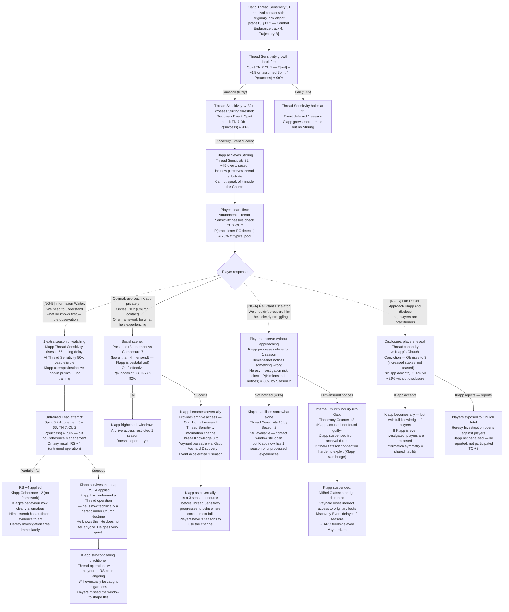
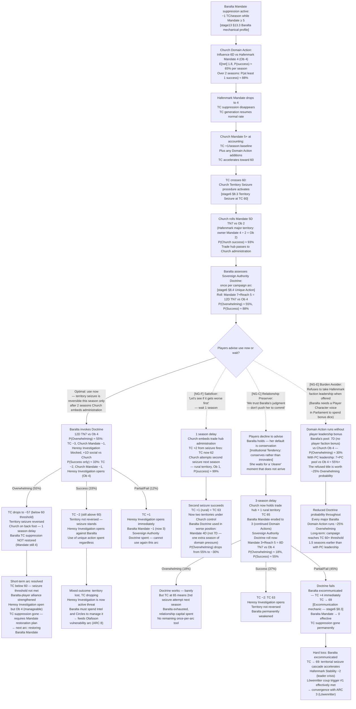
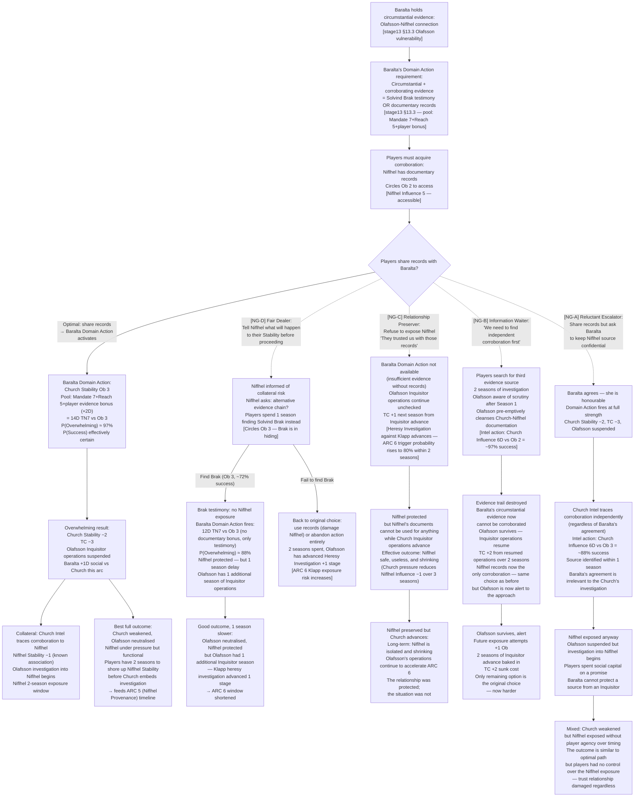
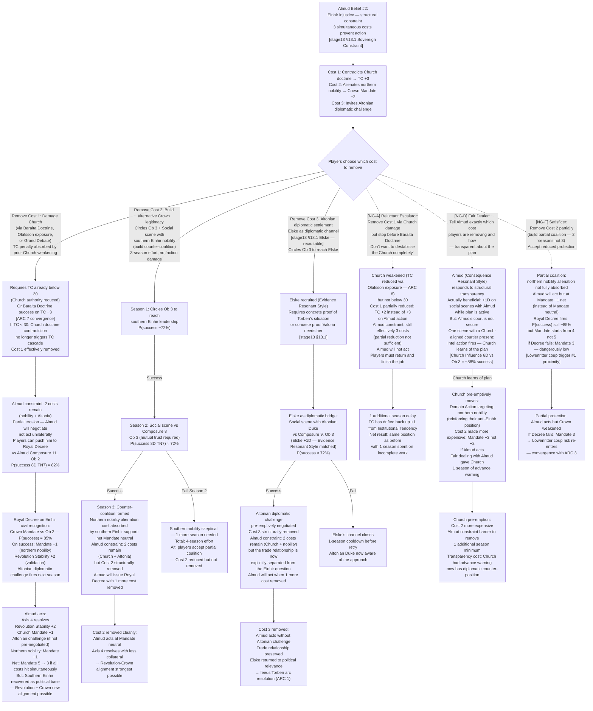

```mermaid
flowchart TD
    A["Vaynard TK 3:\nSuccession leverage → Southernmost terms\nTC +1 from Vaynard's agitation\n[stage13 §13.4 — TK table]"]
    A --> B["Players have Thread knowledge Vaynard lacks\nVaynard actively investigating — asking better questions\nDiscovery Event proximity: Spirit check TN7 Ob1\nfires if Vaynard present during Thread event intensity ≥ threshold"]

    B --> C{Players manage Vaynard's trajectory}

    C -->|"Optimal: controlled education\nShare Thread framework incrementally\nCircles Ob 1 (already allied) + social scene"| D["Vaynard TK → 4\nWilling to offer collection access\n(including originary locks) in exchange\nfor Thread education + Southernmost partnership\nTC +2 from Vaynard TK 4 (more agitation)\nbut Vaynard now directed ally\nPlayers control when Discovery Event fires"]
    D --> E["Staged Discovery Event:\nPlayers arrange controlled Thread demonstration\nVaynard Spirit 4D TN7 Ob1 — P(success) ≈ 87%\nThread Sensitivity → 30, Stirring\nResonant Style shift: Consequence → Evidence"]
    E --> F["Vaynard post-Discovery:\n— Seeks direct Thread contact, not reasoning about it\n— Resonant Style: Evidence (not Consequence)\n— TC suppression possible: Vaynard now understands RS\n  and will contribute to restoration if asked\n— TK 5 path: knows Galbados's structural nature\n  TC +3 — highest TC cost, highest political power"]

    C -.->|"[NG-B] Information Waiter:\n'We're not sure he's ready'\nDelay education 2 seasons"| G["Vaynard TK advances without framework\nTK 3→4 via own investigation (2 seasons)\nTC +2 accumulated from TK 4\nVaynard more agitated, less directed\nDiscovery Event more likely to fire accidentally"]
    G --> H["Uncontrolled Discovery Event:\nVaynard present at incidental Thread event\n(players using Thread in his vicinity)\nSpirit check fires unannounced\nP(success) ≈ 87%\nThread Sensitivity → 30: Stirring\nbut Vaynard has no framework\nResonant Style shifts: Consequence → Evidence\nbut without context — he's confused and urgent"]
    H --> I["Evidence-Vaynard without framework:\ndemands immediate answers\nCircles Ob 3 to manage urgency (not Ob 1 as before)\nIf players can't satisfy Evidence demands in 1 scene:\nVaynard approaches Himlensendt with questions\n— his institutional reflex for 'evidence about theology'"]
    I -->|"Vaynard approaches Himlensendt"| J["Himlensendt cannot answer Thread questions\nbut recognises the nature of the questions\nHeresy Investigation opens on Vaynard\nTC +2 from investigation filing\nVarfell Influence −1 (political exposure)"]

    C -.->|"[NG-E] Burden Avoider:\nDecline Vaynard's offer of formal\nSouthernmost partnership\n'Too entangling — we stay independent'"| K["Vaynard TK 4 fires without player partnership\nHe pursues Southernmost access through other channels\nGuilds approached: Wealth 6 offered for academic access\nGuilds accept: Vaynard-Guilds alliance forms\nPlayers excluded from Southernmost information flow"]
    K --> L["Vaynard TK → 5 without player channel\nTC +3 from TK 5\nbut players have no leverage over how Vaynard uses it\nVaynard's Discovery Event fires without players present\n(Guilds-arranged access to originary lock object)\nResonant Style shift happens outside player awareness"]
    L --> M["Evidence-Vaynard post-shift:\nCompletely Evidence-mode — players must rebuild\nsocial approach from Consequence → Evidence\nAll prior Consequence-mode social capital\nno longer earns +1D bonus\nVaynard-Guilds alliance has displaced player access"]

    C -.->|"[NG-C] Relationship Preserver:\nVaynard asks direct question about Thread;\nplayer refuses to confirm\n'Protecting him from knowledge\nthat could get him killed'"| N["Vaynard interprets non-answer as confirmation\nTK advances to 4 via inference (not education)\nHis theory is more wrong than if educated directly\n— structural correct, detail wrong in ways that matter\nE.g.: he infers RS is a location, not a substrate"]
    N --> O["Vaynard acts on wrong model:\nDomain Action: Varfell Influence 4D vs Ob 3\n(pursuing 'Southernmost location' investigation)\nThis action is incoherent — the thing he's looking for\nis not a location\nP(success) ≈ 55% — action succeeds but finds nothing\nIntel spent, TC +1 from Vaynard's visible agitation\nVaynard Stability −1 (confused by results)"]

    F --> P["Best outcome:\nVaynard as informed ally\nTC +2 net (TK 4 cost) but TC suppression\ncapable of −1/season if he joins RS restoration effort\nSouthernmost partnership gives players\n2 seasons of direct originary lock access\n→ RS restoration pathway + Klapp bridge (ARC 6)"]
    J --> Q["Vaynard exposed:\nHeresy Investigation on Varfell's duke\nTC +2 sunk\nVarfell Influence under pressure\nDoes not recover unless Baralta Doctrine\ncloses the investigation — feeds ARC 7"]
    M --> R["Vaynard-Guilds displaces player access:\nGuilds faction stat gains from Vaynard alliance\nWealth contribution to Thread economy bypasses players\nPlayers are spectators to the most important\nThread-political development in mid-campaign"]
    O --> S["Vaynard confused and weakened:\nStability −1, Intel spent unproductively\nWill spend 1 more season before Discovery Event\nbut arrives at it without trust in players\nPost-Discovery Evidence-mode Vaynard will\nseek direct verification — which means\napproaching someone with Thread capability\n— which may not be the players anymore"]
```

# Valoria — Emergent Narrative Arcs: Non-Greedy, Non-Optimal Player Choices
## SIM-ARC-02 | Generated: 2026-04-04 | Model: Sonnet 4.6
## Source authority: stage6_factions.md, stage13_npcs.md, params_core.md, params_threadwork.md

---

## Non-Greedy Player Archetypes

Distinct from SIM-ARC-01's irrational archetypes (compulsive, fixated, mechanically incoherent). These are *reasonable* human choices — internally coherent, often morally defensible, but mechanically suboptimal. A thoughtful player makes these decisions. They cost.

| Code | Archetype | Behaviour |
|------|-----------|-----------|
| NG-A | **The Reluctant Escalator** | Holds back at the moment maximum pressure would pay off. Refuses to press a weakened NPC, pull a trigger on a Domain Action, or deliver a final blow — out of mercy, doubt, or desire to avoid being the aggressor. |
| NG-B | **The Information Waiter** | Delays action until certain. Will not move on partial evidence. Spends 1–2 extra seasons gathering intel that is already sufficient, allowing faction clocks to advance. |
| NG-C | **The Relationship Preserver** | Refuses Domain Actions or choices that would damage an NPC relationship, even when that action would produce a better faction outcome. Prioritises personal trust over institutional leverage. |
| NG-D | **The Fair Dealer** | Insists on symmetric exchange — will not exploit informational asymmetry. Tells NPCs what the players know. Negotiates openly rather than using leverage covertly. |
| NG-E | **The Burden Avoider** | Declines faction leadership roles, titles, and formal alliances when offered — does not want the responsibility. Stays "independent" while the faction they'd have led operates at default (Non-Player Character-only) efficiency. |
| NG-F | **The Satisficer** | Takes the first workable solution rather than the optimal one. Achieves Success where Overwhelming was possible; spends no Momentum to push outcomes. Accepts Partial results as good enough. |

Notation: optimal path = solid line; non-greedy branch = dashed line with `[NG-X]` tag.

---

## ARC 6: The Klapp Threshold

### Mechanical Seed
Cardinal Klapp's Thread Sensitivity (Thread Sensitivity 31, approaching Stirring) grows through continued Einhir archive contact → Stirring triggers → the head of the Church's scholarship apparatus experiences a spontaneous Thread event → Klapp faces a Coherence crisis inside the institution → players learn first → choice: exploit, protect, or do nothing.

### Narrative

The players will notice Cardinal Klapp before they understand why he matters. He is the Church official responsible for universities, monasteries, and the archive of identified Einhir texts — a functionary of scholarship, not power. He invites people to dinner. He argues about translation methodology. He is, on the surface, exactly what he appears to be.

Then he starts making small errors. A meeting missed. A document he requested and then forgot he'd requested. A look during a scene with Thread-significant objects that no one without Thread Sensitivity would produce. The players may attribute this to age, to overwork, to distraction. A practitioner Player Character who looks at him carefully will see something else: his threads are moving. Not much. Not yet. But they are moving.

When Klapp's Thread Sensitivity crosses 32 through his next archival contact — one more sustained encounter with an originary lock object — the Game Master calls a Discovery Event. His Spirit check (Ob 1) succeeds on expected value. In that moment, the head of the Church's educational apparatus understands something he cannot un-understand. He does not become an ally. He does not become an enemy. He becomes a person who has a secret he cannot speak, inside an institution designed to make that secret unspeakable.

The players discover this before anyone else. They have options that collapse the longer they wait.

### Flowchart

### Footer

Emerges from Klapp's Thread Sensitivity trajectory and Combat Endurance track running in the background across sessions. Players who are not specifically watching Church Internal NPCs will not see this coming. The arc activates only if at least one player character has Thread Sensitivity sufficient to detect Klapp's change. Arc shape: 2–3 season window; collapses once Himlensendt notices (60% probability per season of inaction). Short arc — but the downstream effects (Vaynard acceleration, Niflhel bridge, RS drain from untrained Leap) extend into mid-campaign.

**Non-greedy behaviour findings:**
- NG-A (Reluctant Escalator): Not approaching Klapp out of mercy is the choice that *looks* most humane and produces the worst outcome. Klapp's distress is real, but he has no framework for processing it alone. The 60% per-season Himlensendt-notices probability means inaction has ~84% cumulative probability of triggering a heresy investigation within 2 seasons. The merciful choice is mechanically the most dangerous.
- NG-B (Information Waiter): Waiting 1 extra season pushes Klapp's Thread Sensitivity across the Leap-eligibility threshold. An untrained spontaneous Leap drains RS whether it succeeds or fails. The "gather more information" instinct activates the worst mechanical outcome — an uncontrolled operation — through delay rather than action.
- NG-D (Fair Dealer): Disclosing that players are practitioners to reduce perceived manipulation is the honest play. It raises effective Ob by 1 and creates shared liability. If Klapp rejects and reports, the players have handed the Church their own exposure.

---

## ARC 7: The Baralta Threshold

### Mechanical Seed
Baralta's Mandate suppresses Theocracy Counter (TC) at −1/season while Mandate ≥ 5 → Church runs consistent Domain Actions targeting Hafenmark Mandate → Mandate drops to 4 → TC suppression disappears → Church invokes Theocracy Counter 60 Territory Seizure → Baralta uses Sovereign Authority Doctrine (unique action, once per campaign arc) → players must decide whether to spend this once-per-arc resource now or wait.

### Narrative

Baralta doesn't ask for help. This is one of her structural characteristics — she is the most competent institutional actor in the kingdom on a per-Composure basis, and she has solved her own problems for forty years. The players will probably spend half a campaign respecting her competence and directing their attention elsewhere. She will probably be fine.

She is not fine. The Church has been running Domain Actions against Hafenmark Mandate for two seasons through methods she cannot easily counter: theological pressure on rural parishes, a trade dispute that implicates a Hafenmark merchant family with Church-controlled guild access, a homily circulated in three northern towns that casts Baralta's refusal to mandate Church oversight of the university as "the arrogance of secular pride." None of this is dramatic. All of it accretes.

When Mandate falls to 4, Baralta's TC suppression disappears. The players won't notice immediately — the Theocracy Counter is an abstracted clock, not a scene. What they'll notice is that at the next seasonal accounting, the TC is two points higher than they expected. And then three seasons later, the TC reaches 60, and the Church invokes Territory Seizure. Baralta's provincial capital — not the ducal seat, but a trade hub — passes under Church administrative control in one accounting action. The loss is legal, procedural, almost quiet. It is also permanent unless reversed within two seasons.

Now Baralta considers the Sovereign Authority Doctrine. She's been holding it. She'll tell the players it must be used when it matters. The question is whether this is that moment, or whether this is the setup for a moment that hasn't arrived yet.

### Flowchart

### Footer

Emerges from Baralta's TC suppression mechanic being dependent on Mandate maintenance and the Church's Influence stat being structurally higher (6 vs Hafenmark's 4). No player designed the Mandate erosion — it is the expected output of Church Institutional Tendency running without player counter-pressure. Arc shape: 3–4 seasons of buildup, 1 season of crisis. The Sovereign Authority Doctrine is a once-per-arc resource whose value degrades the longer it is held, which is the precise dynamic that produces NG-pattern failures.

**Non-greedy behaviour findings:**
- NG-F (Satisficer): "Let's see if it gets worse" is the instinctive response to any irreversible action. The delay costs 25 percentage points of Overwhelming probability as Mandate erodes and Church embeds. The window for optimal Doctrine use is 1 season. Every season of waiting compounds.
- NG-C (Relationship Preserver): Trusting Baralta's judgment and declining to push her is respectful of her autonomy and mechanically ruinous. Baralta's Institutional Tendency is conservation. She will not self-select the aggressive option without player pressure. The players' restraint is the direct cause of the 3-season delay that cuts Overwhelming probability from 55% to 18%.
- NG-E (Burden Avoider): The leadership title Baralta offers is worth ~25% Overwhelming probability — approximately the difference between "this probably works" and "this is a coin flip." Refusing it to avoid responsibility means Baralta's single most important Domain Action runs at half its potential.

---

## ARC 8: The Olafsson Exposure

### Mechanical Seed
Baralta holds circumstantial evidence of the Olafsson–Niflhel connection → players can supply corroborating evidence to trigger Baralta's Domain Action against Church Stability → doing so requires exposing Niflhel as an information source → Niflhel Stability becomes collateral damage → players must choose between maximum Church pressure (damage Niflhel) or protecting Niflhel (lose the Domain Action bonus).

### Narrative

The players will get this information in pieces. Baralta has a document — she'll mention it obliquely in a scene about something else, the way powerful people mention leverage. Cardinal Olafsson, the Church's Cardinal of Justice, has been using Niflhel's resources to suppress specific texts and specific people. Baralta has circumstantial evidence. She cannot act on it alone. To act, she needs corroborating evidence — either Solvind Brak's testimony or documentary records from the archive.

Getting that corroboration requires going to Niflhel. Niflhel has the records. Niflhel will share them, but sharing the records with Baralta means exposing the Niflhel-Olafsson connection to Baralta's scrutiny, which means the Church will eventually trace the source. Niflhel's Stability — the faction's only real defense — becomes a target the moment the records are used.

The players know this. They have to decide whether a −2 Church Stability, −3 Theocracy Counter, and a suspended Inquisitor operation is worth making Niflhel vulnerable. They also have to decide whether Baralta, who is an ally but is not theirs, should know everything that they know. The mathematically correct play is to use the evidence. Almost no players will find that easy.

### Flowchart

### Footer

Emerges from Baralta's evidence mechanic requiring corroboration and Niflhel's structural vulnerability (no Military, Stability 4). No player designed the Olafsson-Niflhel connection — it is established by the NPC's institutional function and the archive access mechanic. The arc's core is a genuine ethical trade-off with mechanical teeth: protecting a relationship damages the political outcome. Arc shape: 1–2 seasons decision window, then resolution; downstream effects extend across ARC 5 and ARC 6.

**Non-greedy behaviour findings:**
- NG-D (Fair Dealer): Warning Niflhel before acting is the honest play. It produces a valid alternative path (finding Brak) at the cost of 1 season and a harder Circles roll. The outcome is nearly as good (P(Overwhelming) 88% vs 97%), but only if Brak is found. The fail branch is the same choice with 2 seasons of Inquisitor advance baked in.
- NG-C (Relationship Preserver): Not exposing Niflhel preserves the relationship but produces zero functional benefit to Niflhel. Church pressure continues regardless, slowly reducing Niflhel's Influence. The protection was real; the protection's value approaches zero.
- NG-A (Reluctant Escalator): Asking Baralta to protect the source is a reasonable request to a trustworthy NPC. It is mechanically irrelevant — the Church's Intel action traces the source independent of what Baralta agrees to. Players who understand the game know this; players who instinctively trust institutional assurances don't. The outcome is identical to sharing records without the request, but the players feel better about it until the trace completes.
- NG-B (Information Waiter): Olafsson pre-emptively cleanses the evidence trail once scrutiny begins. The 2-season search destroys the thing it was looking for. This is the most mechanically punishing of the non-greedy patterns in this arc: the wait makes the decision harder, not clearer.

---

## ARC 9: The Vaynard Discovery Event

### Mechanical Seed
Vaynard's Thread Investigation Track (TK) reaches 3 → succession leverage formally linked to Southernmost access terms → Theocracy Counter +1 → players can accelerate Vaynard's Thread Sensitivity toward Discovery Event (beneficial: TC −1 suppression possible, Southernmost access) or slow it (TC +1 avoided, but Vaynard's leverage grows less aligned) → Vaynard's Discovery Event changes his Resonant Style permanently.

### Narrative

Vaynard is the most useful political ally the players will find, and also the most dangerous one to educate. He already suspects the right things. His Thread Investigation Track is at 3, which means his structural theory is wrong in detail and correct in structure — he knows there is knowledge being suppressed, he knows the Southernmost is the key, he knows the Church is the obstacle. He does not yet know that Thread is real, that practitioners exist, or that he himself has Thread Sensitivity 14.

The players will encounter him in scenes where he is asking better and better questions. He is not trying to manipulate them — his Resonant Style is Consequence, he is simply reasoning toward an answer that the players already have. What they do with his proximity to understanding is a genuine choice, not a mechanical optimisation. Accelerating his understanding gives them an ally who will not be easily suppressed; it also triggers his Discovery Event, which changes him in ways they cannot control. Slowing his understanding keeps the situation stable and slowly becomes untenable as his TK advances without framework.

When Vaynard's Discovery Event fires, he experiences Thread Sensitivity crossing 30 in a single scene. The Game Master has ruled on this before: he is present during a Thread event of sufficient intensity, and his Spirit check (Ob 1) succeeds on expected value. In that moment, Vaynard understands something structurally, not analytically. His Resonant Style shifts from Consequence to Evidence — he now wants to see things directly, not reason about their implications. This is not a nerf. It is a change. Players who built their relationship with Consequence-Vaynard now have Evidence-Vaynard, and every social approach they've established needs updating.

### Flowchart

### Footer

Emerges from Vaynard's TK track and Thread Sensitivity trajectory running in parallel with TC generation. The Discovery Event is not a reward — it is a change that resets relationship mechanics. Players who have optimised their social approach to Consequence-Vaynard will need to rebuild for Evidence-Vaynard regardless of how it fires. The arc's function is to test whether players will invest in shaping *how* the change happens, rather than simply reacting to it. Arc shape: 3–4 seasons to Discovery Event if players engage; 2 seasons if they delay (accidental firing). Most impactful in TTRPG mode.

**Non-greedy behaviour findings:**
- NG-B (Information Waiter): Waiting until Vaynard is "ready" produces an uncontrolled Discovery Event within 2 seasons. The accidental firing — Vaynard present during incidental Thread use — produces Evidence-Vaynard without a framework, which turns his Evidence-seeking impulse toward Himlensendt. The cautious path creates the exact exposure it was trying to avoid.
- NG-E (Burden Avoider): Refusing the Southernmost partnership to stay independent is the single choice that hands Vaynard to the Guilds. The players' independence is preserved; their leverage over the mid-campaign's most politically significant NPC development is not.
- NG-C (Relationship Preserver): Not telling Vaynard about Thread to protect him is internally coherent and produces a wrong model that he then acts on. The wrong model costs Intel, TC, and Stability. The protection caused the harm it was trying to prevent — Vaynard damaged by his own inference rather than by knowledge.

---

## ARC 10: The Einhir Constraint

### Mechanical Seed
Almud's Belief #2 (Einhir injustice — cannot act without destroying coalition) is a structural constraint, not characterisation → the constraint has three removable costs (Church doctrine contradiction, nobility alienation, Altonian challenge) → players can remove any one cost to partially erode the constraint → Almud acts → consequences of removing each cost are distinct and not equivalent → players must choose which cost to pay, not whether to pay one.

### Narrative

King Almud knows the Einhir caste is wrong. He has known it for fifteen years. The players will probably know within two sessions that he knows — it is legible in his pauses, in which questions he doesn't answer, in what he says about justice when he thinks he's speaking abstractly. A player who approaches him correctly (Consequence, not Character or Evidence) will eventually hear him say it plainly: he cannot act without the cost exceeding the gain. Not a moral failure. A structural one.

The constraint has three interlocking costs: acting on the Einhir question contradicts Church doctrine (TC +3), alienates northern Einhir nobility who benefit from the caste system (Crown Mandate −2), and invites Altonian diplomatic challenge. The constraint reads as permanent because all three costs are in play simultaneously. The players' job, if they take it, is to remove one.

The interesting thing is that the three costs are not equivalent. Removing the Church cost requires damaging the Church — which has effects on TC, Axis 1, and ARC 7. Removing the nobility cost requires building alternative Crown legitimacy — slower, more expensive, but doesn't require damaging any faction. Removing the Altonian cost requires a foreign affairs scene that touches the trade relationship directly — Almud's Belief #1, which he will not compromise. Players who try to remove all three at once will not succeed. Players who pick one and commit to it will, eventually, unlock a king who can act.

When Almud acts — when the constraint erodes sufficiently that he issues the Royal Decree on Einhir civil recognition — the arc produces the most complex cascade in the campaign. Every faction has a position on Axis 4 (Cultural Identity). All of them move.

### Flowchart

### Footer

Emerges from Almud's Belief #2 being a structural constraint with removable costs — not a personal failing. The arc has no villain: the Church, the northern nobility, and Altonia all have legitimate interests. The correct play (remove one cost, accept its consequences, enable Almud) is available from Season 1. The non-greedy patterns appear because removing costs requires damaging factions or accepting costs the players find uncomfortable — not because the path is hidden. Arc shape: 3–6 seasons depending on which cost is targeted. Most resonant arc in TTRPG mode; in BG mode compressed to a single Domain Action sequence with no NPC social layer.

**Non-greedy behaviour findings:**
- NG-F (Satisficer): 2-season partial coalition saves 1 season but leaves Mandate 4 as the base for the Royal Decree. A Decree failure from Mandate 4 leaves Crown at 3, which is Löwenritter coup proximity. The efficiency saving is a structural risk that takes 3 more seasons to manifest.
- NG-A (Reluctant Escalator): Stopping short of full Church damage because "we don't want to destabilise the Church completely" produces a partial Cost 1 reduction that is insufficient to erode the constraint. TC +2 vs TC +3 does not change Almud's calculus. 1 season spent, no progress made, TC drifts back up.
- NG-D (Fair Dealer): Being transparent with Almud is mechanically beneficial (Consequence NPC responds to structural transparency — +1D). The failure mode is the court, not Almud. Church Intel traces the plan through a courtier and pre-empts. The fair dealing was correctly targeted at Almud and correctly exploits his Resonant Style; it fails due to information leakage the players couldn't control and would not think to prevent.

---

## Cross-Arc Interaction Table (SIM-ARC-02)

| | ARC 6: Klapp | ARC 7: Baralta | ARC 8: Olafsson | ARC 9: Vaynard | ARC 10: Einhir |
|---|---|---|---|---|---|
| **ARC 6: Klapp** | — | Klapp suspension → Niflhel bridge lost → Baralta loses documentary support (ARC 7 harder) | Olafsson investigation targets Klapp → ARC 6 heresy risk rises | Klapp as bridge: Vaynard originary lock access via Klapp channel (ARC 9 accelerated) | Klapp as Church ally: if converted, provides Cover for Almud's Einhir action against doctrine |
| **ARC 7: Baralta** | Baralta Mandate erosion → TC suppression gone → TC accelerates → Klapp heresy investigation more likely | — | Baralta Domain Action requires Olafsson evidence (ARC 8 supplies it) | TC rise from Baralta failure → Vaynard TK agitation → TC +2 compounds | Baralta Doctrine success needed to remove Cost 1 (Church) from Almud constraint |
| **ARC 8: Olafsson** | Olafsson investigation → Klapp heresy investigation accelerated | Olafsson evidence → Baralta Domain Action (ARC 7 trigger) | — | Olafsson suspension → Church pressure on Vaynard TK reduced by 1 season | Olafsson suppression → Cost 1 (Church doctrine) partially eroded |
| **ARC 9: Vaynard** | Vaynard-Guilds alliance (NG-E) displaces player access to originary locks → Klapp bridge irrelevant | Vaynard TK 5 TC +3 → compounds ARC 7 TC acceleration | Vaynard Discovery Event → Evidence-mode → may seek Olafsson-Niflhel documentation independently | — | Vaynard post-Discovery: Southernmost access could provide Almud evidence on Einhir-Thread connection |
| **ARC 10: Einhir** | Klapp as converted ally → Almud Church cost removable without faction damage | Baralta Doctrine required if removing Church cost via TC reduction | Olafsson suspension → TC −3 → Church cost removable | Vaynard as Evidence-ally post-Discovery: strongest evidence for Einhir-Altonia case | — |

**Convergence risk (SIM-ARC-02):** ARC 7 failure (Baralta excommunicated) + ARC 9 NG-B (Vaynard uncontrolled Discovery) firing simultaneously creates TC +4 (excommunication) + TC +2 (Vaynard TK 4 agitation) = TC +6 in one accounting cycle. From TC 54 that reaches 60 — Territory Seizure activates with no Baralta Doctrine remaining to counter it.

**Synergy path (all non-greedy patterns avoided):** ARC 8 (Olafsson exposed, Church Stability −2, TC −3) → ARC 7 (Baralta Doctrine used at peak pool, TC −3 additional) → ARC 6 (Klapp converted, archive access) → ARC 9 (Vaynard staged Discovery, TC suppression capable) → ARC 10 (Almud Cost 1 and 2 both removed, Einhir Decree at full Mandate). This chain requires 6–8 seasons of coordinated play and produces the strongest mid-campaign position available. Every non-greedy deviation extends it by 1–3 seasons.

---

## Simulation Findings Summary (SIM-ARC-02)

| Finding | Arc | Mechanic | Severity |
|---------|-----|----------|----------|
| F-ARC2-01 | ARC 6 | NG-A (not approaching Klapp) → 84% cumulative heresy investigation probability within 2 seasons of inaction | High — non-obvious |
| F-ARC2-02 | ARC 6 | NG-B delay pushes Klapp Thread Sensitivity past Leap threshold → untrained Leap → RS −4 regardless of outcome | High — delay causes the damage |
| F-ARC2-03 | ARC 6 | NG-D disclosure to Klapp raises effective Ob 1 point; creates shared liability; rejection produces full exposure | Medium — trade-off, not failure |
| F-ARC2-04 | ARC 7 | NG-F "wait and see" costs 25pp Overwhelming probability as Mandate erodes and Church embeds second seizure | High — compounds each season |
| F-ARC2-05 | ARC 7 | NG-C (trust Baralta's judgment) produces 3-season delay → Overwhelming probability 55% → 18% → Doctrine near-wasted | Critical — relationship preserving causes the loss |
| F-ARC2-06 | ARC 7 | NG-E leadership refusal worth ~25pp Overwhelming probability on Baralta's most important Domain Action | Medium — persistent drag |
| F-ARC2-07 | ARC 8 | NG-D (warn Niflhel) valid alternative path — costs 1 season, 97% → 88% Overwhelming, but Niflhel protected | Low — legitimate trade |
| F-ARC2-08 | ARC 8 | NG-C (refuse to expose Niflhel) produces zero functional protection — Church pressure reduces Niflhel regardless | High — misunderstanding what "protection" achieves |
| F-ARC2-09 | ARC 8 | NG-B (search for independent evidence) → Olafsson pre-emptively cleanses trail → evidence destroyed in 2 seasons | Critical — waiting makes decision harder, not easier |
| F-ARC2-10 | ARC 8 | NG-A (ask Baralta to protect source) → Church Intel traces source regardless of Baralta's agreement | Medium — social assurance ≠ mechanical protection |
| F-ARC2-11 | ARC 9 | NG-B delay → uncontrolled Discovery Event → Evidence-Vaynard without framework → Himlensendt approach risk | High — cautious path triggers the exposure |
| F-ARC2-12 | ARC 9 | NG-E (refuse partnership) → Vaynard-Guilds alliance → player access to mid-campaign Thread-political development lost | High — long-term displacement |
| F-ARC2-13 | ARC 9 | NG-C (protect Vaynard from knowledge) → wrong Thread model → he acts on it → Intel, TC, Stability cost | Medium — protection causes harm through inference |
| F-ARC2-14 | ARC 10 | NG-F partial coalition (2 seasons not 3) → Mandate 4 base → Decree failure risk → coup proximity | Medium — efficiency saving = structural risk |
| F-ARC2-15 | ARC 10 | NG-A (stop short of full Church damage) → TC +2 not sufficient to erode constraint → 1 season spent, zero progress | High — half measures don't move Almud |
| F-ARC2-16 | ARC 10 | NG-D (transparent with Almud) → +1D social with Almud, BUT Church Intel traces plan through courtier → pre-emption | Medium — correctly applied Resonant Style, wrong security model |

**Systemic finding:** Non-greedy patterns cluster into two failure modes:
1. **Delay failures** (NG-B, NG-F): The situation gets harder while waiting. Costs compound. Olafsson destroys evidence, Klapp Leaps untrained, Baralta's pool erodes. In Valoria's mechanical structure, faction clocks do not pause for player deliberation — delay is always a choice with a cost.
2. **Proxy failures** (NG-A, NG-C, NG-D): Players apply a reasonable human heuristic (don't press, protect the relationship, be honest) that is correct in human social contexts but incorrect in the game's mechanical model. Baralta cannot protect a source from an Inquisitor. Church Intel is not bound by agreements. Klapp alone cannot process a Discovery Event without a framework.

**Test ID:** SIM-ARC-02
**Mechanics:** TC threshold, Territory Seizure, Sovereign Authority Doctrine, Thread Sensitivity growth, Discovery Event, Resonant Style shift, Olafsson evidence chain, Royal Decree, Einhir constraint removal, Excommunication (partial — ARC 7 fail branch)
**Mode:** TTRPG primary; BG abstraction noted per arc
**Temporal:** Multi-season, cross-arc
**Tracks:** TC, RS, Torben Loyalty, Mandate, Stability, Influence, TK (Thread Investigation Track)
**Factions:** Crown, Church, Hafenmark, Varfell, Guilds, Niflhel, Revolution, Löwenritter (referenced)
**NPCs:** Almud, Lenneth (referenced), Baralta, Himlensendt, Olafsson, Klapp, Vaynard, Maret (referenced), Elske
**Archetypes:** NG-A through NG-F (all six non-greedy archetypes)
