# Valoria — Executive Field Guide

> **Read this top-to-bottom for the big picture, then drop into any system section for detail.**
> This is the plain-language companion to the System Transparency Console. Where the console shows
> *Keys and modules*, this guide shows *systems by name* and *what actually happens*.
> Every section ends with **“how it ripples out”** — the outcomes that leave the container and are
> felt across the world.

---

## 0. The one-paragraph version

Valoria is a single Godot game that is **grand strategy, strategy-RPG, RPG, narrative, and
investigation at once**, set on a peninsula of competing political factions. You can act at the
**widest scale** (a faction’s decree, a treaty, an invasion) or the **smallest scale** (one
conversation, one duel, one interrogation) — and **both are equally “worldly.”** That is the whole
trick: every action, big or small, happens inside a **container** (a scene/turn), and when the
container resolves it emits **outcomes** that **ripple outward in every direction** and change the
world at every scale. There is **no GM** — the engine resolves everything.

---

## 1. The scale ladder (the “zoom”)

The game is one continuous zoom from the whole peninsula down to a single person and back up.

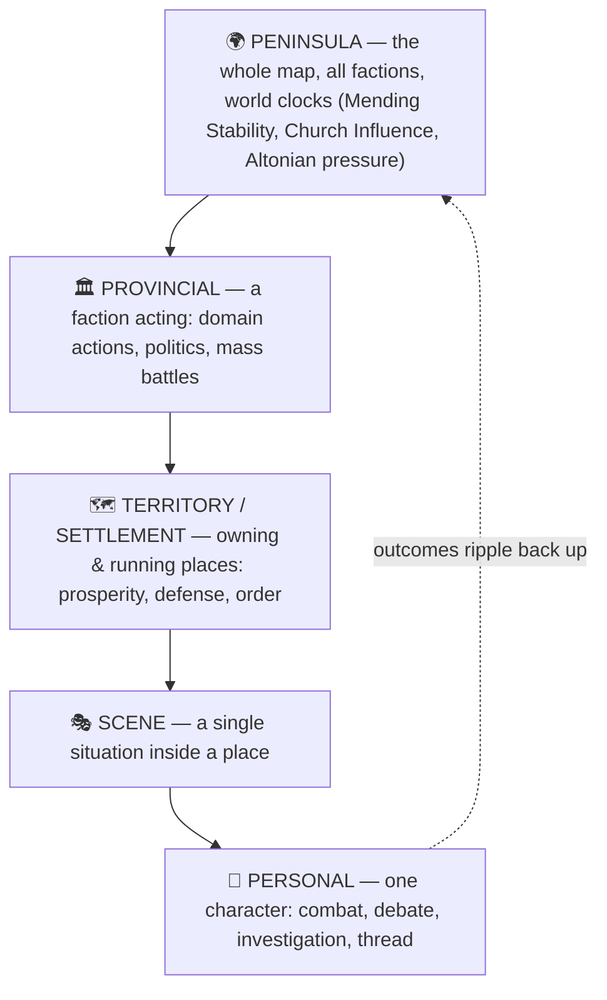

| Scale | Genre it feels like | What you do | Example |
|---|---|---|---|
| **Peninsula** | Grand strategy | Watch/shape world clocks & faction balance | The Church creeps toward Theocracy |
| **Provincial** | Strategy (4X-ish) | Faction domain actions, politics, war | Invade a duchy; pass a law |
| **Territory / Settlement** | City-builder / management | Develop, fortify, pacify, administer | Raise a town’s order so it stops revolting |
| **Scene** | RPG / narrative | Enter a specific situation | A tense audience with a Cardinal |
| **Personal** | Action / investigation / debate | Fight, investigate, persuade, weave Thread | Win a duel; expose a conspiracy |

**The key idea:** these are not separate games bolted together. They are **one substrate seen at
different zoom levels.** A debate in a back room and a faction’s grand decree are the *same kind of
event* (an outcome on the same bus) — they just start at different scales.

---

## 2. The core loop — how a season runs

Time advances in **seasons**. Each season has four phases. This is the heartbeat of the whole game.

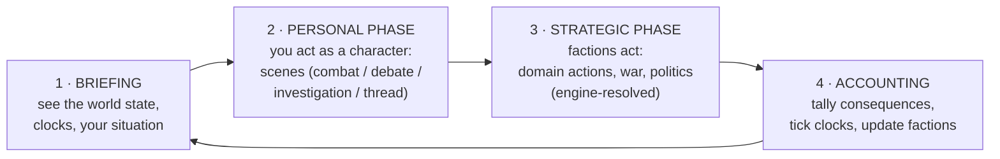

- **Briefing** — you’re shown the board: world clocks, faction standings, what’s pressing.
- **Personal Phase** — you spend a small budget of scene-actions being a *person* in the world.
- **Strategic Phase** — every faction (including yours) takes strategic actions; the engine resolves them. No dice you roll by hand — deterministic-odds resolution.
- **Accounting** — the season’s consequences are summed: clocks move, faction stats update, territories recompute. Then the next Briefing reflects it all.

**Scene-actions are precious.** You can’t personally attend everything — so the world keeps moving
whether you’re there or not, and you choose where your presence matters.

---

## 3. The container model — why the smallest action is “worldly”

This is the heart of your vision, made literal.

Every mode of play happens inside a **container** (a scene). When the container finishes, it doesn’t
just end — it **emits an outcome**, and the engine **delivers that outcome in every direction** to
everyone and everything it should touch. That delivery is what makes a private conversation able to
shift a faction, and a faction’s war able to land on a single villager.

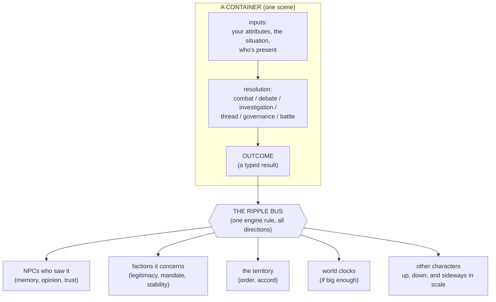

**Three things make this work (in plain terms):**

1. **One result type for everything.** Whether it’s a duel, a debate, a battle, or a decree, the
   outcome is the same *kind* of object. So one delivery rule can carry all of them. (In the tools
   this object is called a **Key**; you can read each one as “a thing that happened.”)
2. **Delivery is by *who’s affected*, not by hard-wired channels.** The engine looks at *who caused
   it*, *who it targets*, and *who was present/aware*, and delivers to exactly those. That’s why it
   naturally goes up (to a faction), down (to a bystander), sideways (to a rival in the room), and
   diagonally (to a distant person who’ll hear about it).
3. **Every outcome carries an “ethical fingerprint.”** Alongside the raw mechanical change, each
   outcome is tagged on **four ethical axes** (see §5.2). That’s how the *same* event can feel like a
   betrayal to one NPC and a triumph to another — each person interprets it through their own values.

> **The named shortcuts (“handshakes”).** On top of this general rule, the design names a handful of
> common cross-scale moves — e.g. **Domain Echo** (a personal scene that’s important enough bumps a
> faction stat), **Zoom In/Out** (dropping into a scene during a strategic battle), the **General
> Duel** (a mass battle pausing for a personal fight). These are convenient labels for specific
> ripples; the general bus is what actually carries them. The **Handshakes** view in the console
> draws all nine.

---

## 4. The systems, in plain language

Each system below is one **engine** that runs inside containers at its scale. Format is the same
every time: **what it is → what you do → the flow → how it ripples out.**

---

### 4.1 Character attributes — what a person *can* do

**What it is.** Seven core attributes, each rated **1–7**, are the raw capability of a character.
They rarely change. They feed every dice pool. (A reform is underway to group them as
Body / Mind / Social — that grouping is *in flux*; the seven below are the stable set.)

| Attribute | In plain terms | Feeds |
|---|---|---|
| **Strength** | raw power | weapon minimums, damage |
| **Agility** | speed & coordination | combat pool |
| **Endurance** | resilience | Health, Stamina |
| **Cognition** | reasoning & memory | investigation |
| **Presence** | social force | debate pool |
| **Attunement** | sensitivity to people/Thread | perception |
| **Spirit** | inner resolve | Thread operations |

**Capability vs. state — the two-layer rule.** Attributes (1–7) say what you *can* do. They each
also produce a **derived value** — a bigger, granular number that tracks what you *have right now*
(e.g. Endurance → **Health** and **Stamina**). You spend and lose derived values during play; the
1–7 attribute underneath stays put. **You never write the derived value directly** — it’s computed
from its attribute, so changes route through the attribute. (This is the “write-protected scalar”
rule the console flags with a 🔒.)

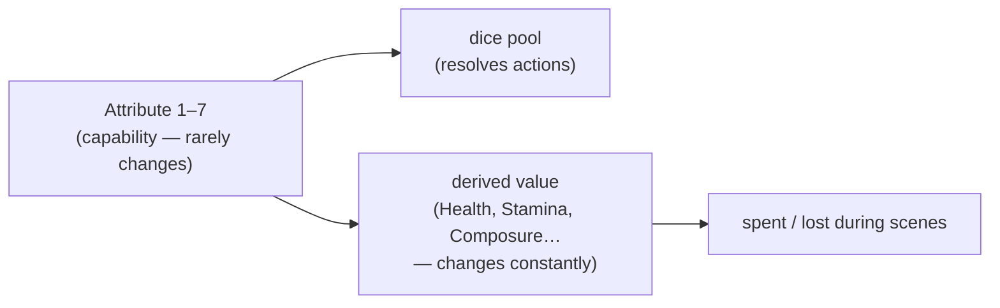

**How it ripples out.** Attributes themselves don’t ripple — they’re inputs. But their derived
values crossing thresholds *do* (e.g. Health hitting 0 → an incapacitation outcome that the whole
scene, and anyone who cares about that character, will feel).

---

### 4.2 Convictions & ethical stances — what a person *believes*

**What it is.** This is the moral engine, and it’s how “narrative” is mechanical. A character holds
**Convictions** (e.g. Faith, Order, Reason, Equity, Precedent, Autonomy, Liberty, Honor…). Those
Convictions **project onto four ethical axes** — the “ethical fingerprint” every event also carries:

| Axis | One pole ↔ other pole |
|---|---|
| **Hierarchical** | rank & deference ↔ egalitarian, leveling |
| **Sacred** | numinous, oath-bound ↔ secular, contractual |
| **Instrumental** | ends-justify-means ↔ principled, deontological |
| **Traditional** | precedent, ancestral ↔ reformist, generative |

**Why this matters.** Every outcome in the game is also tagged on these four axes. When an NPC
witnesses an event, the engine compares the **event’s fingerprint** to the **NPC’s own axis position**
(derived from their Convictions). Alignment → they approve and it sticks in memory; clash → they’re
disturbed, and enough clashes leave a **Conviction Scar**. Three scars on one Conviction → a crisis.

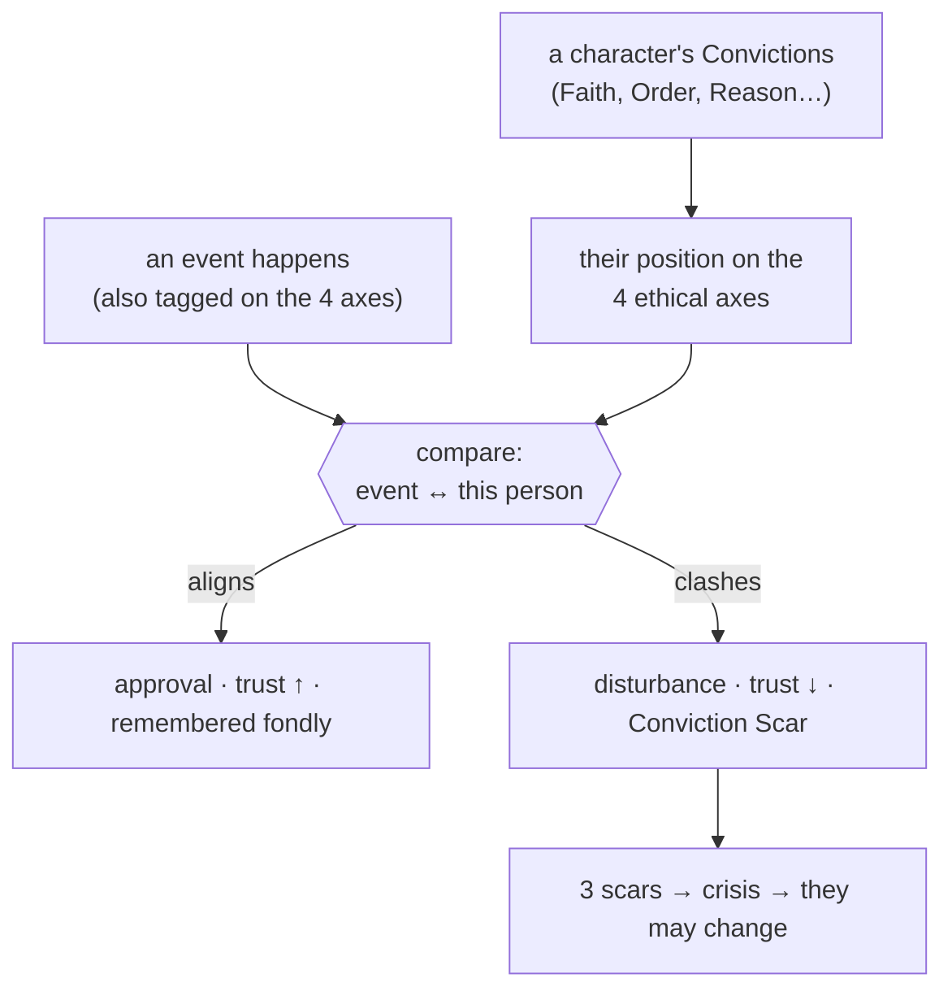

> **Stale/fresh flag.** Older docs list **7 Convictions**; the current substrate uses **13
> Convictions projected onto 4 axes** (the newer model wins — it’s what the engine actually uses).
> The console’s Lexicon shows the canonical list; the “7 vs 13” mismatch is in the Decision Register.

**How it ripples out.** This is the engine of *reputation and relationship*. A single act can shift
how dozens of NPCs feel — each in their own direction — because each reads it through their own
values. Ethical stance is *why* the small scale is worldly.

---

### 4.3 Personal combat — a fight

**What it is.** Round-by-round melee/ranged combat. Your pool is roughly **(Agility × 2) + skill**,
rolled against a target number; net hits + Strength + weapon − armor = damage.

**What you do.** Each round you split your pool between **offense and defense** and pick an action:
Strike, Feint, Disarm, Rescue an ally, Full Guard, Take a Breath, and more. Wounds each cost you
dice; run out of Health and you’re felled (in ~4–6 solid hits between equals).

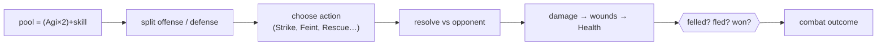

**How it ripples out.** A resolved fight emits a **combat outcome**. If the loser holds office,
violence against them is an *institutional* event (a faction feels it). Witnesses form memories;
a death cascades (succession, standing changes); a notable win builds combat reputation.

---

### 4.4 Social contest — a debate

**What it is.** Structured persuasion: a back-and-forth of exchanges that moves a **persuasion track**.
Your pool is built on **Presence**; you pick a **style** (e.g. cite precedent, paint a vision,
suppress, insinuate). Win the track and you carry the point — possibly extracting an obligation.

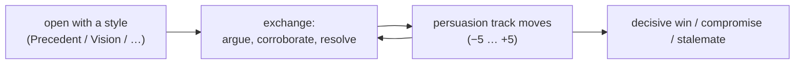

**How it ripples out.** A resolved contest emits a **contest outcome**: it shifts the loser’s and
audience’s disposition, can trigger a **Domain Echo** (if it touched a faction leader or authority,
a faction stat moves), and — if your style struck someone’s core Conviction — can leave a Scar.

---

### 4.5 Fieldwork — investigation & socializing

**What it is.** The exploration/detective/relationship layer. You build an **Evidence Track** toward
a threshold (Simple 3 / Complex 5 / Structural 8) by Examining, Interviewing, Researching, Surveilling.
Socializing moves **Disposition** (−4 to +5) toward people; deep bonds can form **Knots**. Acting
covertly accumulates **Exposure** — push too far and you’re caught.

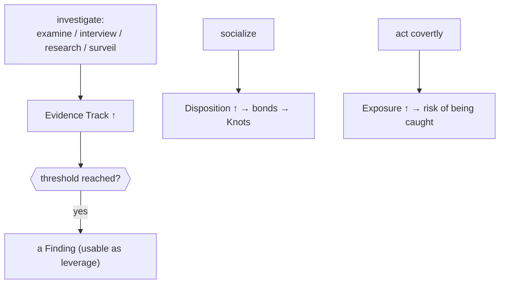

**How it ripples out.** Findings become **leverage** in debates and politics; a Finding that names a
faction leader is a faction-scale event. Knots create relational channels through which *future*
events ripple (a Knotted ally feels your crises at a distance).

---

### 4.6 Threadwork — bending reality

**What it is.** The setting’s “magic.” Sensitive characters (**Thread Sensitivity 30+**) can **Leap**
into contact with the world’s underlying Thread and perform operations — Weave (cohere), Pull (open),
Lock (freeze), Dissolve (tear), Mend (repair). It’s powerful and destabilizing: it drains
**Coherence** and degrades the world clock **Mending Stability**. Over-use risks the **Rupture**.

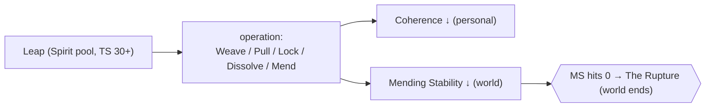

**How it ripples out.** Thread operations are highly visible and ideologically charged — the Church
treats them as heresy. A public Thread act can move faction stats, trigger Scars in witnesses, and
nudge a *world clock*. The smallest mystical act can have peninsula-scale weight.

---

### 4.7 Factions & the strategic layer — the grand-strategy game

**What it is.** Eight factions (Crown, Church, Hafenmark, Varfell, Löwenritter, Restoration,
Altonian, Wardens) each carry stats rated **1–7** (Mandate, Wealth, Military, Influence, Stability),
a **Mission**, and an AI that pursues it. They take **Domain Actions** (govern, ally, betray,
intervene economically, war). The engine resolves them with *deterministic, legible odds*.

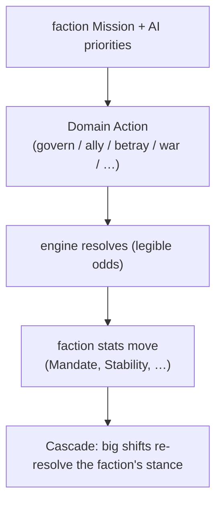

**The one victory rule.** There is exactly **one win condition for everyone**: control the peninsula
(11 of 15 territories, sustained). No faction has a private alternate victory — they only have
different *routes* to the same peninsula-wide goal. (This is the hard constraint **GD-1**.)

**How it ripples out.** Faction actions are *top-down* ripples: a decree, a war, a seizure lands on
territories, settlements, and the people in them. Done right, a strategic Key names the specific
sub-scale people it touches so they actually feel it (the console flags when this “down-targeting” is
missing).

---

### 4.8 Settlements & territory — running places

**What it is.** The management layer. Territories contain settlements with three stats (0–5):
**Prosperity, Defense, Order**. You govern with four actions — **Develop, Fortify, Pacify,
Administer**. A settlement at **Order 0 revolts** (and pulls you into a mandatory scene). Settlement
order rolls up into territory **Accord** (how content/governable a province is).

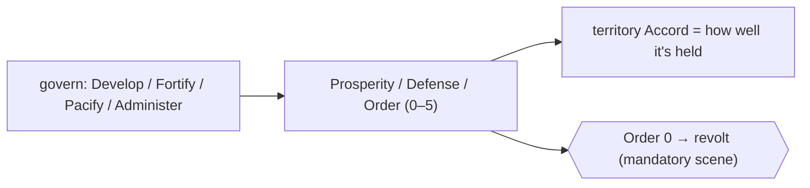

**How it ripples out.** Settlement order feeds province accord feeds faction stability — bottom-up.
And a revolt *pulls you down* into a personal scene whether you like it or not — the strategic layer
reaching into the personal one.

---

### 4.9 Mass battle — war

**What it is.** Set-piece battles resolved over **seven phases** (Strategy → Volley → Manoeuvre →
Thread → Engagement → Cascade → Reform). Units have Size, Power, Discipline, Morale, Command.
Formations and tactics matter (splitting beats concentration; terrain counters it). You can **Zoom
In** at set points to fight a **General Duel** personally.

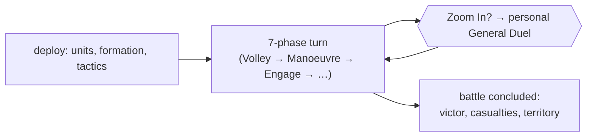

**How it ripples out.** A concluded battle is a big event: it moves world clocks (Mending Stability,
Altonian pressure), changes territory control, kills officers (→ succession ripples), and shifts
accord. It’s the clearest case of a strategic container whose outcome is felt at *every* scale.

---

## 5. The executive map — everything on one page

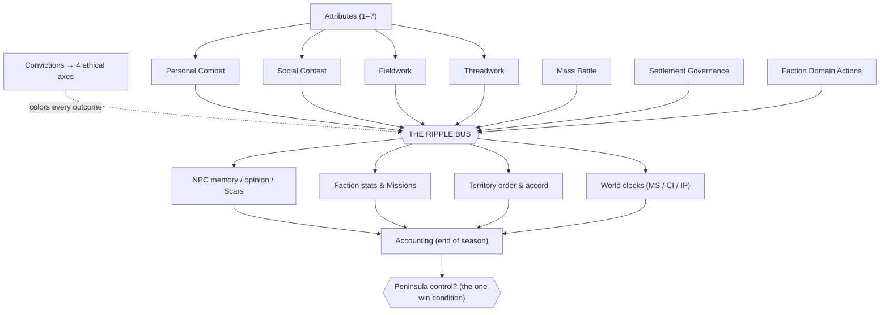

---

## 6. Where to look in the tools

| You want to… | Use |
|---|---|
| Read what a system *is*, plainly | **this guide** |
| See an exact outcome ripple, hop by hop | console → **Ripple** (pick a Key) |
| See all engines by scale | console → **Atlas** |
| Look up any name / abbreviation / collision | console → **Lexicon** (type `MS`, `PT`, `Convictions`…) |
| See the named cross-scale moves | console → **Handshakes** |
| See the open decisions you still owe | **`DECISIONS.md`** / console → **Decisions** |

> **Plain-language Key names.** In the console, each Key already carries a one-line description
> (e.g. `scene.dialogue` = “per-scene exchange of speech; advances persuasion or relational state”).
> The `family.subtype` name is just an address; the description is what it *does*.
